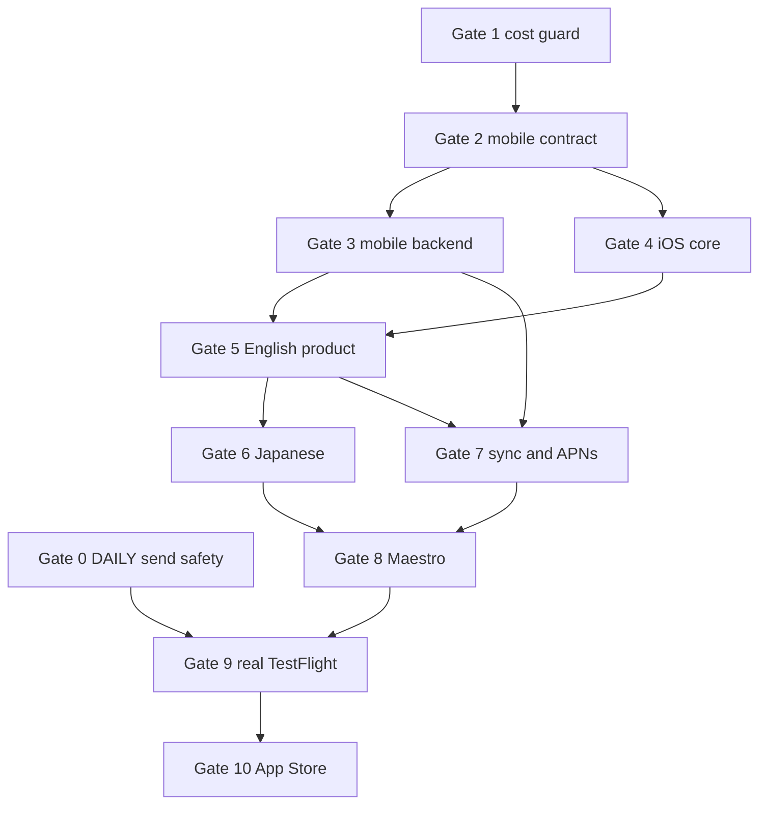

# Rockstar_ibot iOS Master Implementation Plan

> **For agentic workers:** REQUIRED SUB-SKILL: Use superpowers:subagent-driven-development (recommended) or superpowers:executing-plans to implement this plan task-by-task. Steps use checkbox (`- [ ]`) syntax for tracking.

**Goal:** Ship a native Rockstar_ibot iOS client that connects to the existing Rockstar_ibot user and backend, produces one English/Japanese chat-first managed-day experience, passes a real TestFlight journey, and reaches App Store Connect without exposing unsafe late-message behavior.

**Architecture:** The existing `apps/rockstar_ibot/` process remains the identity, Calendar, analysis, route, call, cost, and side-effect authority. A versioned mobile adapter exposes server-derived tenant state and a semantic outbox. `apps/rockstar_ibot-ios/` is a SwiftUI projection with Keychain-backed sessions and protocol-injected services; it never runs its own scheduler, route engine, or call timer. Safety and cost gates ship independently before production enrollment.

**Tech Stack:** Node.js 20 CommonJS, `node:test`, PostgreSQL/Supabase, Composio, Transit API, Google Maps fallback, Swift 5.9, SwiftUI, Observation, AuthenticationServices, Security/Keychain, XcodeGen, XCTest, Fastlane, Maestro, APNs, App Store Connect CLI.

## Global Constraints

- Product spec: `docs/superpowers/specs/2026-08-08-rockstar_ibot-ios-spec.md`.
- DAILY safety SSOT: `docs/superpowers/specs/2026-08-01-lm-daily-organ-design.md`; preserve its numbering.
- Work only in `.worktrees/<feature>`; never switch the live root checkout.
- Implement one unchecked gate at a time. Record RED, GREEN, real E2E, spec receipt, commit, and push before the next dependent gate.
- Runtime values never copy examples from the spec. No person, email, route time, lateness value, or fixed nudge sequence is embedded in source.
- The mobile router never imports location, late-notice, recipient-resolution, approval, or attendee-delivery modules.
- External provider results remain nullable facts. The UI omits unsupported fields instead of guessing them.
- Production code contains no fake, demo-only, dry-run, or simulated success branch.
- Every mutation is tenant-scoped and idempotent. The server derives `uid` from the validated bearer session.
- All generated copy is semantic data projected by locale. User-authored Calendar content stays separate.
- Use one fresh Sol review only after the integrated Gate 8 diff. Codex Review and VCSDD are prohibited.
- Known backend baseline failures remain isolated and documented; do not repair them in these gates.

## Plan Set and Execution Graph

| Gate | Plan | Owned area | Dependency |
|---:|---|---|---|
| 0 | `2026-08-08-rockstar_ibot-daily-late-approval.md` | approval claim, recipient evidence, late delivery | DAILY SSOT |
| 1 | `2026-08-08-rockstar_ibot-provider-cost-guard.md` | persistent caches, complete ledger, budget policy | Approved iOS spec |
| 2–3 | `2026-08-08-rockstar_ibot-mobile-backend.md` | mobile schema, session, API, route projection, outbox | Gate 1 |
| 4–6 | `2026-08-08-rockstar_ibot-ios-product.md` | native app, English product, Japanese projection | Gate 2 fixtures and Gate 3 API |
| 7–9 | `2026-08-08-rockstar_ibot-ios-integration.md` | foreground sync, APNs, Maestro, real TestFlight | Gates 0, 3, 5, 6 |
| 10 | `2026-08-08-rockstar_ibot-ios-app-store.md` | privacy, metadata, signing, upload, submission | Gate 9 |

Gate 0 and Gate 1 may run concurrently only after `git diff --name-only` proves their owned implementation files do not overlap. After Gate 2 commits contract fixtures, Gate 3 backend and Gate 4 iOS core may run concurrently. One Luna executor owns one named task and its listed files; the primary session alone rebases, integrates, deploys, performs real E2E, and records production receipts.

## Acceptance Coverage

| Product criteria | Implemented and verified in |
|---|---|
| 1–12 native onboarding and parity | mobile backend Tasks 1–5; iOS product Tasks 1–4 |
| 13–24 strict localization | mobile backend Tasks 6–7; iOS product Tasks 5–6 |
| 25–35 chat-first behavior and idempotency | mobile backend Tasks 3, 6, 8; iOS product Tasks 3–5 |
| 36–46 honest event-anchored routes | cost guard Tasks 1–3; mobile backend Task 5; iOS product Task 4 |
| 47–51 session and tenant boundary | mobile backend Tasks 1–3, 9; iOS product Tasks 1–2 |
| 52–61 calls, paywall, settings, push, deletion | mobile backend Tasks 4, 8–9; iOS product Tasks 3–5; integration Tasks 1–5 |
| 62–63 no unsafe late surface | DAILY plan Tasks 1–6; mobile backend Task 10 |
| 64–70 cost and operational truth | cost guard Tasks 1–7; mobile backend Task 8; integration Task 5 |

| Spec test rows | Plan task |
|---|---|
| 1–5 | mobile backend Tasks 1–4 |
| 6–10 | cost guard Tasks 1–3 and mobile backend Task 5 |
| 11–14 | mobile backend Tasks 6–7 and iOS product Task 6 |
| 15–17 | mobile backend Tasks 3, 8 |
| 18–20 | iOS product Tasks 4–5 |
| 21 | integration Task 2 |
| 22 | mobile backend Task 9 and integration Task 5 |
| 23–24 | cost guard Tasks 4–7 |
| 25 | mobile backend Task 10 |

### Task 1: Establish Baselines and Worktrees

**Files:**
- Read: `docs/superpowers/specs/2026-08-08-rockstar_ibot-ios-spec.md`
- Read: `docs/superpowers/specs/2026-08-01-lm-daily-organ-design.md`
- Create per child plan: `.worktrees/<feature>/`

- [ ] Fetch `canonical/main`, record its SHA, and create each gate branch from that exact SHA.
- [ ] Run the existing targeted suites named in the child plan before writing a new test.
- [ ] Record all pre-existing failures with test file and assertion; do not include them in a gate diff.
- [ ] Confirm `git status --short` is empty in every new worktree.
- [ ] Commit no generated `.xcodeproj`, build output, videos, screenshots, credentials, or local xcconfig secrets unless the release plan explicitly names the artifact.

### Task 2: Execute Gate Plans in Dependency Order

- [ ] Close Gate 0 with a deployed production receipt before enrolling any production TestFlight user.
- [ ] Close Gate 1 with a seven-day owner report that separates measured, estimated, fixed, and unknown cost.
- [ ] Freeze Gate 2 fixtures; downstream Swift decoding tests consume these exact JSON files.
- [ ] Complete Gate 3 and Gate 4 independently, then integrate them against staging.
- [ ] Approve the complete English journey before adding Japanese product copy.
- [ ] Run both script-consistency suites after every localization change.
- [ ] Complete foreground/manual sync before APNs; APNs projects into the same outbox cursor.
- [ ] Complete Maestro staging before real TestFlight.
- [ ] Complete every real TestFlight receipt before App Store metadata/upload work.

### Task 3: Integrated Verification

**Files:**
- Modify receipts: `docs/superpowers/specs/2026-08-08-rockstar_ibot-ios-spec.md`
- Modify DAILY receipts only for DAILY-owned work: `docs/superpowers/specs/2026-08-01-lm-daily-organ-design.md`

- [ ] Run targeted backend mobile, cost, route, call, and DAILY suites.
- [ ] Run the full backend suite and compare only against the recorded baseline.
- [ ] Run `bundle exec fastlane test` in `apps/rockstar_ibot-ios`.
- [ ] Run English and Japanese Maestro flows against staging and save timestamped screenshots/video outside Git.
- [ ] Run a real TestFlight journey using Google OAuth, a controlled Calendar event, a provider route, phone-skip, configured call, APNs deep link, and account deletion.
- [ ] Inspect production deployment `commitHash`, `/health` build identity, API logs, provider receipts, and cost rows.
- [ ] Ask one fresh Sol reviewer to inspect the integrated diff and verification evidence; fix only concrete defects within spec scope.
- [ ] Re-run affected gates after review changes.
- [ ] Write done receipts only for behavior observed in the deployed environment.

### Task 4: Integration and Release Commits

- [ ] Rebase each completed branch on the newest `canonical/main` without discarding newer main commits.
- [ ] Merge only the gate-owned diff into the integration branch.
- [ ] Use one meaningful commit per closed task and push immediately.
- [ ] Open a PR containing plan/spec links, RED/GREEN commands, real E2E evidence, cost effect, and remaining external gates.
- [ ] After merge, verify Railway deployed the merge commit before reporting backend completion.
- [ ] Begin the App Store plan only when Gate 9 receipts are complete.
