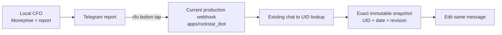

# CFO Telegram Callback Production Port Plan

> **Routing:** Ponytail full first, then Superpowers TDD. Sol owns this plan, review, deployment, and live Telegram
> evidence. Luna alone writes production code and tests.

**Goal:** Port only the reviewed CFO detail-button receiver to the current production Rockstar_ibot package so the
already-delivered Telegram report buttons work, while the Moneytree/report/hourly loop stays local.

**Why this port is required:** The reviewed local CFO branch contains `apps/life-call`, but Railway production is
measured at `canonical/main:apps/rockstar_ibot` on service `life-call`. The two branch histories have no merge base.
Deploying the local branch would replace the current Rockstar_ibot package, so it is forbidden. This plan adds one
small bridge to current main instead.

## Ponytail scope gate

| Element | Files | Production changed LOC soft target |
|---|---:|---:|
| Small Japanese CFO callback bridge | 1 new | <=90 |
| Existing webhook prefix wiring | 1 modify | <=10 |
| Existing production HTTP contract | 1 modify | 0 |

Exactly three implementation files and <=100 changed production LOC. Excluded: porting the local CFO loop, English,
new renderer framework, new strings module, new DB/RPC/service/bot/poller/dependency, scheduler, retries, cache,
Binance, advice, and changes to existing ask/Gmail/discovery/payout/diet callbacks.

### Task 1: Handle current CFO detail buttons in production

**Files:**
- Create: `apps/rockstar_ibot/lib/cfo-telegram-callback.js`
- Modify: `apps/rockstar_ibot/server.js`
- Modify: `apps/rockstar_ibot/test/telegram-callback-http-contract.test.js`

- [x] **Step 1 — RED**

Extend the existing production HTTP callback contract with a current partial native-JPY CFO snapshot. Post an
authenticated private-chat callback `cfo:accounts:YYYYMMDD:1`. Prove one exact owner/date/revision GET, one
`editMessageText` on the tapped message, one `answerCallbackQuery`, zero `sendMessage`, HTTP 200, and no mutation.
Also prove actor/chat mismatch, lookup rejection, wrong snapshot identity, or unsafe amounts produce one fixed toast,
zero edit/send, HTTP 200, and no raw provider/amount/credential logging. Run the test and retain the handler-missing
failure.

- [x] **Step 2 — Minimum GREEN**

Create a dependency-injected Japanese bridge only for the existing views `summary`, `accounts`, `accuracy`, and
`why`. Parse only the fixed callback format and positive safe revision. Require private chat actor equality, positive
message ID, resolved UID, and exact Supabase settings. GET only `report_payload`, filtered by exact UID/date/revision
with `limit=1`; require one row, JPY, matching payload identity, safe integer-or-null totals/source amounts, and a
non-empty sources array before rendering.

Render only the already-approved simple facts: summary totals, account amounts, evidence/as-of, excluded items, and
the arithmetic explanation. Unknown remains `不明`; no value is inferred. Escape labels, mask account-like digit
runs, and rebuild deterministic inline keyboards. Use the existing `editMessageText` and `answerCallbackQuery`
helpers. Never call `sendMessage`. Every failure answers once with a fixed non-technical retry toast and returns no
raw error.

Wire only the `cfo:` prefix in `server.js` before the current generic acknowledgement. Contain `rowByChatId` failure,
pass `uid:null` to the bridge, and return HTTP 200. Do not alter any existing handler body.

- [x] **Step 3 — Verify and review**

Run the focused HTTP contract, the package's normal test command, syntax checks, `git diff --check`, file count, and
production LOC. Fresh Sol review reports only Critical/Important wrong-owner, wrong-money, privacy, callback-ack, or
existing-handler regressions.

Evidence: after installing the package lockfile with no tracked change, the existing callback test passed and the
new CFO callback failed specifically because `cfo:` was unknown. Luna's 99-production-LOC bridge then passed the
focused HTTP contract `2/2`, syntax checks, and `git diff --check`. Real owner mapping plus the real immutable snapshot
passed no-send E2E with exact identity, one intercepted edit, one intercepted answer, zero sends, and no private
output. The package's normal test command reaches only the pre-existing `scan-legacy-paths` openclaw-path failure in
unchanged files; those files have zero diff from `canonical/main`. Fresh review found one Important inconsistent
source-evidence case; Luna added RED regressions and one validation guard. Re-review returned `ship — Spec ✅` with
no Critical or Important finding.

- [ ] **Step 4 — Deploy and real Telegram E2E**

After `ship — Spec ✅`, commit/push the feature branch, integrate through the repository's normal main path, verify
Railway deployment commit and `/health`, then use the owner's real Telegram UI to tap the existing report's account
button. Required evidence: the same provider message edits to the real account view, the buttons remain usable, no
new message appears, and Railway logs contain no raw financial/provider failure.

## Definition of done

The existing real CFO report's detail button works in Telegram through the current production Rockstar_ibot webhook.
Local Moneytree/report generation remains local and production receives only the immutable snapshot callback read.
