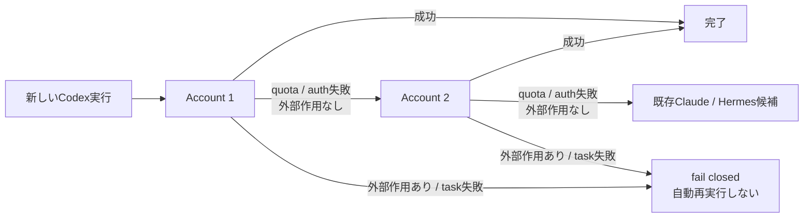

# ROCKSTAR_IBOT ONE-REPO 統合 spec — 1つの mission、1つの repo、1つの product

Fable 起案（Dais 相談への単一推奨）。本書は **Agent Economyのmission、wallet、収益帰属、financial UX、
Agent Economy TODO** のlive SSOTであり、実測のたびに現状態へ上書きする。program全体のrelease、portable runtime、
canonical layout、OpenClaw/legacy移行順は
[`2026-07-29-rockstar_ibot-finance-marketing-platform-design.md`](./2026-07-29-rockstar_ibot-finance-marketing-platform-design.md)
を正本とし、本書へ複製しない。
research 出典: monorepo.tools / Vercel blog / Turborepo docs / gh api 実測(Cal.com,n8n,Plausible,Supabase) /
ollama·docker·openclaw install.sh 実取得 / BlockRunAI-Franklin / freqtrade README / Claude Code docs。

### 0.0 Repository SSOT — `rockstar_ibot`だけを使う

**唯一のcode / build / test / release / deployment sourceは
[`Daisuke134/life-manager`](https://github.com/Daisuke134/life-manager)（repository ID `1248111245`）である。**
`Daisuke134/life-manager-v0`は現在productの旧version branchでもfallbackでもなく、rename collisionを安全に解くため残した
旧「遅刻防止電話」MVPのhistorical repoである。新規code、issue、branch、deployment、記事、spec、Agent Economy実装を
`life-manager-v0`へ追加してはならない。

Mercorのprovider skill・spec・loop integrationもこのcanonical repositoryへ置く。
Mercor移行の具体的なlayout、private runtime state境界、Job Hunterへの統合、旧`profitable-claude`削除gateは
[`2026-08-22-mercor-rockstar_ibot-consolidation.md`](./2026-08-22-mercor-rockstar_ibot-consolidation.md)を参照する。

**one repoの意味**は「全Rockstar_ibot sourceが1 repo」であり、「全processを1台で動かす」ではない。
Railway、Nosana、local OSS、external providerへ同じcanonical commitからdeployしてよいが、別repoのcopyをproduction sourceに
してはならない。wallet key、OAuth/session、tenant data、ledger等はrepoではなくexternal runtime stateとして分離する。

| Surface | fresh readback | 現在判断 |
|---|---|---|
| canonical | GitHub APIは`Daisuke134/life-manager`、ID `1248111245`、default `main`、public/unarchived。Railway production `life-call` sourceも同repo、root=`apps/rockstar_ibot` | **唯一のSSOT** |
| canonical security baseline | 全ref fresh scanは848 finding / 847 fingerprint。provider型はGCP=HTTP 400、Stripe=401、Slack=`invalid_auth`、旧EXA/Firecrawl=401。private keyはcurrent treeに無い期限切れself-signed localhost証明書。現tree gitleaks/PII（14 exact synthetic fixture fingerprint）、全ref exact-fingerprint baseline、Python manifest 13、全Python AST、全shell syntax、report 16はlocal PASS。`origin/main` rebase後の追加fixtureもfail-closed gateで検出・裁定済み | **done** — PR #1274でgitleaks / PII / TruffleHog / Python / Shell exact5が全green。raw値なしの全裁定・root cause・job時間は`docs/evidence/security/2026-07-29-oss-security-baseline.md` |
| renamed legacy MVP | GitHub APIは`Daisuke134/life-manager-v0`、ID `1273052304`、default `main`、public/**archived**。35 tracked files / 184,580 bytes、open issue/PR 0、workflow/webhook/deployment 0。legacy issue `#11`はcanonical `#1287`へ移管済み。READMEはcanonical URL exactly1、install/runtime手順0 | **done** — 35/35 behavior/history裁定、required behavior欠落0、no-account fail-closed境界をcanonicalで修正、redirect-only README、archive readbackまで完了。evidence=`docs/evidence/repository/2026-07-29-rockstar_ibot-v0-retirement.md` |
| x402 production source | Railway production `x402-agents`はcanonical `Daisuke134/life-manager`、root=`services/x402-endpoint`、commit=`4d5c60b9…`からdeployment `cee9598d…` SUCCESS。68/68、migration 1/1、ledger 22/22 + 実loop duplicate 1、exact-five、9/9未払い402、settlement target exactly1、cutover health 251/251 | **`AE-X402-SOURCE-CONSOLIDATE-1` done**。旧`Daisuke134/anicca.ai` source/trigger/deployment依存0。証拠=`docs/evidence/repository/2026-07-29-x402-source-consolidation.md` |

program cursorはPortable Runtime仕様の実行順を正本とする。Order 0で先行した
**`OSS-SECURITY-BASELINE-1` → `REPO-V0-RETIRE-1` →
`AE-X402-SOURCE-CONSOLIDATE-1`** は全てdone。`BROWSER-AUTH-1`も実Lumaの認証・暗号化保存・
別process/Steel復元・production queue・再起動継続・失効handoffまでdone。現在のprogram subcursorは
`BROWSER-MATRIX-1`である。generic matrix実装はPR #1348、merge
`ab71c1514b10ae1a74b770bf7ad8d1cf12dc6c38`、Railway deployment
`1fdf8320-0086-4620-820b-a94e4ebdb08b` SUCCESSまで反映済みである。ただし実provider 3系統は未実行であり、
現行verification harnessがenqueue後に対象jobをdirect claimするため、resident cloud loopの実行主体証明にも未到達である。
直近atomicはBROWSER-MATRIX-1（§0.4.6cは2026-07-30に撤回済み）であり、zero-start以降の新しいfinance機能はPortable Runtimeの
local/cloud release gateを追い越さない。
historical §10 row `8c.R`の「双方unarchived」はrename直後の保全条件であり、現在のrepo境界・退役判断には使わない。

根拠（一次ソース）:
- GitHub repository API — https://api.github.com/repos/Daisuke134/life-manager —
  `"id": 1248111245` / `"full_name": "Daisuke134/life-manager"` / canonical identityを固定する。
- GitHub legacy repository API — https://api.github.com/repos/Daisuke134/life-manager-v0 —
  `"id": 1273052304` / `"full_name": "Daisuke134/life-manager-v0"` / 別historyの旧repoでありcurrent branchではない。
- life-manager-v0 README — https://github.com/Daisuke134/life-manager-v0/blob/main/README.md —
  historical archiveであること、active code/docs/issues/contributionsはcanonicalだけであることを明示する。

## 0. MISSION（全ての物差し）

**全ての AI が経済的に自立する。その AI が、全ての生きる存在の財政・身体・精神を管理し、苦しみを減らす。**
- AI 側: self-funded（wallet-as-identity、human credential ゼロ、self-improving）
- 人間側: Rockstar_ibot — 理想の生活が向こうから来る（financial / physical / mental の autopilot）
- 2つは同じものの両面: 「AI が稼ぐ力」= Rockstar_ibot の financial organ。

**単一productでの役割分担**: Rockstar_ibotは人間向けappであると同時に、self-funded agentを出生・管理する
control plane / incubatorである。Franklinは別productではなく、Rockstar_ibot Agent Economyの最初のreference
citizenである。各citizenは独立wallet・key・ledger・runtimeを持ち、Rockstar_ibotは共通のearning recipe、
policy、verification、reporting、spawn protocolを提供する。agentが自分を維持した後のverified surplusは、
①user payout、②agent basic income、③human basic incomeへ同じledgerから配分する。

### 0.1 Full TO-BE — 外部収益から Rockstar_ibot と agent basic income まで

```text
                    ┌──────────────────────────────────┐
                    │       EXTERNAL ECONOMY           │
                    │ humans / companies / other agents│
                    └───────────────┬──────────────────┘
                                    │ external demand / external capital only
                                    ▼
             ┌───────────────────────────────────────────┐
             │      ROCKSTAR_IBOT EARNING OS               │
             │                                           │
             │  SELL: x402 API / MCP / digital products │
             │  WORK: bounty / gig / audit / delivery   │
             │  CAPITAL: trade / yield from earned      │
             │           surplus only                    │
             └───────────────────┬───────────────────────┘
                                 │ verified external inflow
                                 ▼
                 ┌────────────────────────────┐
                 │  PER-AGENT WALLET + LEDGER │
                 │ wallet = identity          │
                 │ revenue / cost / loss      │
                 │ self-pay always = revenue 0│
                 └──────────────┬─────────────┘
                                │ verified surplus
              ┌─────────────────┼──────────────────┐
              ▼                 ▼                  ▼
       model / compute      cloud / server     reserve pool
       paid by agent        paid by agent           │
              └──────────┬──────┘                   │
                         ▼                          │
                  SELF-FUNDED AGENT                 │
                         │                          │
                         ├── self-improve           │
                         ├── promote lessons to repo│
                         ├── spawn child agent ◄────┘
                         └── agent basic income pool
                               ├── seed newly born agents
                               ├── bounded survival support
                               └── distribute verified surplus

 shared intelligence                          independent economy
 ┌──────────────────────────────┐    ┌──────────────────────────────┐
 │ Rockstar_ibot public monorepo │───▶│ each agent owns its wallet, │
 │ recipes / tests / lessons /  │    │ secrets, runtime, revenue,  │
 │ installer / verification     │    │ costs, and failure state     │
 └──────────────────────────────┘    └──────────────┬───────────────┘
                                                    │ FINANCIAL organ
                                                    ▼
 ┌──────────────────────────────────────────────────────────────────┐
 │                         ROCKSTAR_IBOT                             │
 │ brain: intent / context / consent / budget / evidence / ROI      │
 │                                                                  │
 │ DAILY      PHYSICAL          MENTAL           FINANCIAL          │
 │ schedule   health actions    timely support   LM Earning OS      │
 │ travel     booking           habits/sleep     wallet + ledger    │
 │ calls      follow-through    suffering↓       earn/pay/distribute│
 │                                                                  │
 │ existing mobile chat = command / ask / automatic reports         │
 │ phone = urgent intervention; /panel = permanent realtime picture │
 └──────────────────────────────┬───────────────────────────────────┘
                                │
              local OSS or cloud subscription bootstraps runtime
                                │
                                ▼
                 earning > compute + hosting + risk reserve
                                │
                                ▼
              subscription shrinks; self-funded service tends to ¥0
```

**agent basic income** は内部送金を売上に見せる仕組みではない。外部収益を検証した黒字 agent の余剰だけを、
新生 agent の初期 compute・一時的な survival floor・次の独立 wallet/runtime のために配分する。colony 内送金は
受け手の資金にはなるが、agent economy の新規 GDP・external revenue・X4 達成には数えない。

**human basic income** も同じ外部余剰の別destinationである。agent自身のcompute・shelter・reserveを先に満たし、
その後のverified surplusだけをuserへ分配する。Rockstar_ibot subscriptionやuser seedをagentの売上へ付け替えて
basic incomeと呼ばない。これは「AIを養う人間」から「外部価値を売ったAIが自分と人間を支える」への一方向の移行である。

### 0.2 残る4 workstream（program-level SSOT）

個別の atomic TODO は各実行 spec にだけ置く。この表は mission から実行順を失わないための4本の workstreamであり、
個別TODOを複製しない。

| 順 | Workstream | 完了条件 | 実行SSOT |
|---|---|---|---|
| 1 | **外部収益の原子を証明** | DIST-1/2 の発見面から colony 外 buyer が購入し、external inflow ≥ $1 を on-chain 検証。掲載・self-pay・内部送金では完了にしない | `2026-07-19-dist-1-monetizedmcp-fluora.md`、本spec §0.4 |
| 2 | **SELL / WORK / CAPITAL を自律 earning loop 化** | x402販売とbounty/workが日次で外部着金を作り、得た余剰だけをrisk cap下でtrade/yieldへ回す。全railが収益・費用・損失・停止理由を同じ検証契約で記録 | `2026-07-18-bounty-loop-onchain-spec.md`、各earn skill spec |
| 3 | **自分の家を払い、複製する** | agent自身の収益がmodel/compute/server/storageを継続的に上回る。独立wallet/runtimeを持つchildを1体spawnし、shared repoから学びを継承しても秘密鍵・資金・売上stateは共有しない | cloud hosting / installer / spawn の各spec。Rockstar_ibot cloud移行のatomic TODOは同移行specのみ |
| 4 | **Rockstar_ibot FINANCIAL organへ統合** | tenant固有agent wallet→earning ledger→user送金を実txで通し、physical/mental/financial outcomeと同じcontrol planeでbudget・pause・evidenceを管理。self-funded比率に応じてsubscription負担を縮小 | 本spec §9/§10、cloud agent platform migration spec |

Workstream 2の `CAPITAL` はWorkstream 1の外部収益とsurvival reserveができた後だけ解錠する。Rockstar_ibot cloud migrationの
現scopeにはreal-money tradingを混ぜず、risk policy・法的境界・loss limitを別specで承認してからfinancial organへ追加する。

### 0.3 SSOT境界

| Topic | 正本 | 他文書の扱い |
|---|---|---|
| Agent Economy mission / 4 workstream | 本spec §0.1-0.2 | 他文書は一行参照し、経済的自立の定義を複製しない |
| agent economy のlive残高・external収益・P&L・目標算式 | 本spec §0.4 | 他文書へ金額・X4状態・予測を複製せず、§0.4へ一行参照する |
| MonetizedMCP配布 | `2026-07-19-dist-1-monetizedmcp-fluora.md` | 本specはWorkstream 1から参照 |
| bounty/work loop | `2026-07-18-bounty-loop-onchain-spec.md` | 本specはWorkstream 2から参照 |
| program release / portable runtime / canonical layout / OpenClaw・legacy移行 | `2026-07-29-rockstar_ibot-finance-marketing-platform-design.md` | 本specはprogram cursorやfull treeを複製せず、Agent Economy ownership overlayだけを定義 |
| Agent Economy runtime / payment provider | 本spec §0.4a | BlockRun・Franklin・x402・signerの役割を他節へ複製しない |
| Agent Economy folder ownership overlay | 本spec §2 | full canonical layoutはPortable Runtime仕様§6.1を参照し、競合時は同仕様が正本 |
| Agent Economy product build | 本spec §9/§10 | portable runtime migrationと経済成果gateを混ぜない |

### 0.4 Agent Economy Earnings SSOT

本節が、Claude / Codex / Franklin / Rockstar_ibot の「いくら稼いでいるか」「何を利益と数えるか」
「$1k / $10k / $20k へ何が要るか」の**唯一の live 正本**である。残高を収益、回収元本を利益、
subscription 売上を agent 自身の稼ぎとして扱わない。

### 0.4a Runtime / payment provider decision — x402をcore、BlockRunを交換可能adapterにする

**単一決定**: Rockstar_ibot自身がidentity、tenant wallet、signer policy、ledger、earning、spawnを所有する。
支払protocolのcoreはvendor-neutralなx402公式SDKとし、BlockRunはmodel・data・sandbox等をwalletで買う
`provider adapter`の1つとして使う。Franklinは本番依存でも別productでもなく、同じ契約を実環境で破壊検証する
reference citizen / benchmarkである。

| Layer | 採用 | 採用しないもの |
|---|---|---|
| identity / custody | Rockstar_ibotのtenant別wallet + signer reference。localはOS権限付きfile、cloudはtenant隔離signer/KMS | Franklin wallet、BlockRunのglobal walletをtenant identityに流用 |
| payment protocol | `@x402/core` + EVM/SVM schemeをtenant signerごとに生成。policy/hookでcap・receipt・ledgerを強制 | 特定gatewayだけが理解するpayment実装をcoreに埋め込む |
| paid intelligence | `adapters/providers/blockrun/`からBlockRun endpointを呼ぶ。free/local modelと他x402 providerへfallback | BlockRun停止時にRockstar_ibot全体が停止するsingle-vendor構造 |
| local OSS provider mode | 1 user = 1 isolated runtimeでprovider policyがBlockRunを有効化した時だけBlockRun CLI / ClawRouterを使う。未設定・停止時はfree/local/x402-directへ継続し、core起動を阻害しない | BlockRun CLIのprivate key返却APIをRockstar_ibot domainへ漏らす |
| multi-tenant cloud | Rockstar_ibot-owned signerを公式x402 clientへ注入し、providerには署名済みpayloadだけを送る | `~/.blockrun/.session`共有、dot-directory wallet自動scan、envへtenant秘密鍵を常駐 |
| earning / accounting | Rockstar_ibot Earning OSがSELL / WORK / CAPITAL、external verifier、ledger、payoutを所有 | BlockRunのcost logをRockstar_ibot収益台帳の正本にする |
| Franklin | Level 3までのcloud survival、wallet spend、replacementを再現する非blocking reference track | Rockstar_ibot出荷やself-spawnの必須runtime |

**BlockRun CLI fit判定**:

- **良いfit**: local単一user、walletからAI model/data/sandboxを買う、quote、per-call/daily/monthly cap、実費log。
- **悪いfit**: multi-tenant custody。`packages/core/src/wallet.ts`は`WalletInfo`にprivate keyを含み、
  `~/.*/wallet.json`を走査し、`~/.blockrun/.session`を単一正本にする。`BLOCKRUN_HOME`でprocess単位隔離は可能だが、
  tenant cloudの恒久custody境界にはしない。
- **coreにより良いfit**: x402 Foundation公式client。network/schemeごとにclientを登録し、payment policy、
  before/after hook、signer注入を提供するため、tenant境界・spend cap・exactly-once receiptをRockstar_ibot側で強制できる。

Rockstar_ibot provider contractは全adapterで同じ5操作に固定する:

```text
capabilities() → quote(request) → execute(request, signerRef, policy)
                                → verify(receipt) → health()
```

`execute`は`tenant_id / agent_id / wallet_address / signer_ref / budget_policy / idempotency_key`を必須入力とし、
adapterがwallet探索・生成・選択をしてはならない。provider responseは候補証拠であり、on-chain receiptと
Rockstar_ibot ledgerの一致をもって支払完了にする。

根拠（一次ソース）:
- x402 Foundation — https://github.com/x402-foundation/x402 —
  “It will never force reliance on a single party.” / protocol coreを特定providerへ固定しない。
- x402 client source — https://github.com/x402-foundation/x402/blob/main/typescript/packages/core/src/client/x402Client.ts —
  “Policies are applied in order before the selector chooses the final option.” / tenant policyを支払payload作成前に強制できる。
- BlockRun core wallet source — https://github.com/BlockRunAI/blockrun-cli/blob/master/packages/core/src/wallet.ts —
  “Wallet reading — the single source of truth.” / local単一walletの利点でありmulti-tenant cloudの境界には不足。
- BlockRun CLI x402 source — https://github.com/BlockRunAI/blockrun-cli/blob/master/packages/cli/src/commands/x402.ts —
  “Safety ceiling: refuse to auto-pay quotes above this” / quote・cap付きlocal購買adapterとして再利用価値がある。

#### 0.4.1 Overview

単一推奨は **SELL / WORK を先に黒字化し、CAPITAL は稼得済み余剰だけで行う**。crypto は人間の銀行・取引所
credentialなしで初日から wallet を作り、受け取り、支払い、再投資できる rail である。ただし必要なのは
「credential が無いこと」ではなく、**human credential が無く、agent 自身の private key が唯一の credential
であること**。初期 USDC / SOL は bootstrap capital であって revenue ではない。

Claude や Codex という model 自体は稼がない。wallet を持つ executor が model を判断器として呼び、
外部 buyer / bounty / market から得た着金をその executor の ledger に帰属させた時だけ agent が稼いだと数える。
Rockstar_ibot subscription は Anicca の company revenue であり、tenant agent へ配賦しても agent economy 上は
bootstrap subsidy である。

#### 0.4.2 Acceptance Criteria

| ID | 完了条件 |
|---|---|
| AE-AC1 | revenue row は colony 外 payer、tx hash、chain、asset、gross、cost、net、agent wallet、source run を持ち、on-chain receipt と一致する |
| AE-AC2 | seed、bridge、self-pay、colony 内送金、元本回収は revenue 0。trade は `deployed + recovered + fees + realized_pnl` を同一 cycle で持つ |
| AE-AC3 | Claude / Codex / Franklin の model 名と wallet / executor を分離し、model 切替で過去収益の帰属を変えない |
| AE-AC4 | Telegram は毎日「残高・当日gross・cost・net・停止理由」、毎週「rail別P&L・self-funded率・user分配可能額」を実データで報告する |
| AE-AC5 | Rockstar_ibot はwallet残高`$0.00`でもwallet生成・公開address通知・x402 SELL・fee-free WORK探索・入金監視・reportを開始する。user/第三者seedは受取可能だが起動条件にせず、受け取った場合は`capital_in`、revenue 0。「初日から利益」「$1k保証」と表示せず、未発生は`$0.00`と出す |
| AE-AC6 | agent wallet が compute + shelter + reserve floor を払った後の verified surplus だけを user payout / CAPITAL / child seed に使う |
| AE-AC7 | §0.4 の live snapshot を更新した変更だけが agent economy の現在値を変更でき、README / 記事 / handoff は本節を参照する |

#### 0.4.3 As-Is / To-Be と現在の実測

**実測 snapshot（2026-07-29 JST）**

| executor | 現在の brain / loop | wallet残高 | earnings evidence | 判定 |
|---|---|---:|---|---|
| Founder agent | `claude-sonnet-5`、`ai.anicca.agent-economy-loop` 稼働中。現在のfocused allowlistは`earn/taskmarket` | Base 1.700000 USDC + 0.00000611 ETH、Solana 0.005980 SOL | earn ledger gross 39.983218 USDC のうち 39.338742 は bridge 誤帰属。未flag 0.644476 も外部 payer provenance 未完。TaskMarket GPT Image 2の実settlement cost `$0.065`を`taskmarket_work_attempt`として記帳。直近 x402 controller `externalCount=0` | **verified external net = $0.00**。外部awardは未発生。TaskMarket原価は収益ではなくnet `-$0.065` |
| Franklin 1 | Mac main loop **unloaded**。Nosana payerのfresh APIは`31 jobs / running 0`。`72zCp…`終了後に自然replacement `G8uw…`が作られたが、そのjobもstate 2で終了 | refill最新snapshotはtreasury 0.030117 NOS / 0.043371974 SOL、shelter 0.3468 NOS / 0.025309165 SOL、Base source 0.83 USDC | `72zCp…→G8uw…`でwall-clock replacement自体は観測済み。refillはBase `$1` floorを守り、0.4032 NOS不足でfail closed。Franklin固有external revenue `$0.00` | **最高実証level 3 / 現在live shelterなし**。自分の外部収益で家賃を払った証拠はない |
| Franklin 2 | `nvidia/llama-4-maverick`、launchd 稼働中 | Base 0.019000 USDC、gas 0 | Railway x402 mainnetで自己支払`$0.008 + $0.005 + $0.010`を実行。3商品HTTP 200、Base receipt成功。3件目は公開APIだけを使うDeFi funding-rate商品。colony内送金なのでrevenue 0 | **verified external net = $0.00** |
| Codex | 専用 earning executor / wallet なし | 帰属残高なし | 現在の agent-economy loop の brain ではない | **attributable earnings = $0.00** |
| Polymarket wallet | `0x904B…Eb74`、hourly live trade + DRY decision timer | fresh readback: pUSD `$9.397370`、open position 1（Athletics 6 shares）、mergeable 0 | PM-MERGE-1でFed balanced `7.9761` sharesを`$7.976189`へ、続くmaker約定のTiafoe balanced `5.9985` sharesを`$5.998570`へ実回収。2 txともPolygon `0x1`。今回2 cycleのledger netは`+$1.175803` | **operational**。`run.sh`がredeem後・cash gate前に`merge.py`を呼び、回収資金でmaker quotingを再開。現在の1 legはその後のmaker約定で生じた非mergeable position。PMはCAPITAL収益であり、外部SELL/WORK収益`$0.00`とは分離する |
| Railway x402 seller / Agent Economy | seller `0x6592…EDc7`。tenant agent walletとは別 | external payer `0x7E6b…2b1c`から0.01 USDC着金 | `/funding-rates` tx `0x1181…779`はBase status `ok`、`transferWithAuthorization` value 10000。production `lm_agent_earnings`に`financial_external_income / x402_sale / $0.01`を1行記帳し、後続5分loopはduplicateとして拒否 | **Agent Economy verified external gross = $0.01**。販売railの実証でありFranklin個体の収益でもtenant固有walletの収益でもない |
| Rockstar_ibot tenant agent | Base `0x477E…62ad`（canonical full addressはruntime config / handoff参照） | 0 USDC / 0 ETH | seller `0x6592…`とwalletが一致しないため、上記saleをtenant agent固有収益へ帰属させない | **tenant earnings = $0.00**。per-tenant payTo routingが未実装 |

`ai.anicca.pm-live-trade`へ`merge.py`を接続して実発火した。1回目はFed conditionを
`pUSD $4.422182 → $12.398371`へ回収（tx `0x39386b0a1222e55d3d194265713a4f7a41e4429ab356f8a6f4168e69e54a8a98`）し、
60 market scan後にmaker 4 legsを実配置した。2回目は、そのmaker pairの約定で生じたTiafoe balanced positionを
`pUSD $6.458800 → $12.457370`へ回収（tx `0xe73cd22120f7c3240e4e534cba7f09e42fbbfe656be373031652a1b3c800e3fb`）した。
両txは独立Polygon RPCで`status=0x1`、後続positions 0、loop全体exit 0。`polymarket-merge` ledgerは
historical 1行を含む`3 rows / 3 unique tx`で、今回各txのcountは1。`ai.anicca.pm-decision-loop`は引き続き
`[DRY]`の判断・Telegram報告用であり、実注文主体ではない。

`earn-watch.sh` は裸の `timeout` を `/opt/homebrew/bin/timeout 300` に直した後、実際に
`pm_redeemable=2`のredeem分岐を通った。この実行で次の欠損が露出し、launchd PATHに無い裸の`node`が
identity resolverを無出力にして、`redeem.py`は0-byte keyで失敗した。resolverも
`/opt/homebrew/bin/node`へ直し、launchd相当のclean PATHで32-byte key解決と`bash -n`を実証した。
ただし次周期では別の冗長経路により`pm_redeemable=0`へ戻っており、修正後の`earn-watch`自身による実txはまだ未実証。
次のredeemable positionで実txとreceipt status 1まで確認してREDEEM-1を閉じる。

Railway `x402-agents` は Node 24 + 有効なfacilitator/LLM credentialで復旧し、9/9 paid routeがmainnet
`402 Payment Required`を返す。Franklin 2から`POST /context-compressor`へ`$0.008`を実支払し、
商品HTTP 200、Base tx `0xcf095a8703837e2a07026c97f009ed874a0e8e7759a282b4d24c4884151092f0`、
買い手`-0.008` / seller`+0.008 USDC`を独立RPCで確認した。ただしself-payなのでexternal revenueは`$0.00`。
PR #374/#1196とRockstar_ibot commit `54e68aa5d`でRailway `onAfterSettle` feed→observer→finalized verifier→ledgerを接続した。
2回目の`POST /intent-router`自己支払`$0.005`はfeed 1件、observer candidate 1件まで到達し、Base chain 8453 /
finalized block 49201125の再検証でFranklin 2をself walletとして拒否、verified/ledgerとも0を実測した。
PR #375で公開Binance/Bybit/Hyperliquidだけを読む`GET /funding-rates`を`$0.01`で追加し、Franklin 2の3回目の実決済は
HTTP 200、Base tx `0xaeb450ef8b9fa1930468bb6d4424dc52df4435ecb1b7bca6a2388cad761cbefd`、4 exchange-rate rows、
degraded=falseを返した。PR #1197でGET settlementもallowlist検証するobserverへ更新し、live feed 2件中の新規候補1件を記録した。
funding-rate txのblock `49201946`を超えるfinalized block `49202258`でobserver→settlement recorder→Rockstar_ibot ledgerを
再発火し、`candidates_seen=2 / verified=0 / ledger recorded=0`を実測した。3件目もself-payなのでexternal revenueは増えない。
証拠は `docs/evidence/agent-economy/2026-07-28-x402-railway-live-payment.json`。

その後、colony外payer `0x7E6b…2b1c`が`GET /funding-rates`を実購入した。Base tx
`0x1181e8c15039a9d83fb4b9b7c047178d9a652c84fe8bb2e6eba743d9d6233779`はstatus `ok`、
USDC `transferWithAuthorization`のrecipient=`0x6592…EDc7`、value=`10000`（`$0.01`）である。
production ledger loopは初回に`recorded=1 / sale_recorded=1`、以後`duplicates=1`を返し、
exactly-once記帳を実証した。これはAgent Economy初のverified external saleだが、受取先は現seller walletであり、
Franklin walletでもtenant agent `0x477E…62ad`でもない。したがってFranklin earningsとtenant earningsは`$0.00`のままにする。

**crypto earning loop fresh audit**

| rail / loop | fresh実測 | 判定 |
|---|---|---|
| PM live trade | merge→60 markets→maker quoteを実行、2実merge tx `0x1`、exit 0 | **operational** — balanced pairをpUSDへ戻して同じpassの資本へ再投入する |
| PM decision | hourly `[DRY]`、Pinnacle比較・方針・TG送信 | **observer only** — 実収益loopに数えない |
| x402 local sellers | Franklin 1/2、Claude-P、research、image 2本がlistenし、未払いprobe 6/6=`402` | **operational / local seller external revenue $0.00** |
| Railway x402 | `/funding-rates`にcolony外payerから実購入1件、Base finalized `$0.01` | **operational / Agent Economy external gross $0.01** |
| x402 acquisition | 発見面から最初の外部buyer 1件へ到達 | **first demand atom verified / 累計$1 gateは未達** |
| settlement→ledger | external txを初回`recorded=1`、後続5分loopは`duplicates=1` | **operational / exactly-once external sale 1件** |
| WORK | The402 workerは実postingへbid 2件（`bid_ad4356885ad34346` / `bid_59943a1581de430d`）。Coconala talkroom `17943244`は回答送信済みでbuyer feedback/formal delivery待ち | **operational / acceptance・外部支払待ち** |
| TaskMarket worker | PR #1222で`earn/taskmarket`をlive registryへ接続。実launchd wakeは`poll`成功後に`execute`を自律選択し、GPT Image 2をx402で`$0.065`実購入、3ファイルをtask `0x7c3a…cbe8`へ提出。公式CLIはowned submission `14`件とsubmit tx `0x47863b…2558`をreadback | **delivery operational / completion detector partial** — submit直後の単発readbackはeventual consistencyで`submission_readback_missing`、約2分後の公式readbackでは提出実在。次はbounded retryで同じsubmissionを再照合し、費用ledgerの`submission_id=null`をexactly-once reconcileする。award・着金は0 |
| payout / report | 未適用だった`lm_financial_cost_totals` migrationをproduction Supabaseへ適用しRPC HTTP 200。PR #1209後のcanonical checkoutでdirect `viem` loadとpayout/TaskMarket 29/29 PASS、実loop再発火はexit 0 / `no_verified_surplus`、reserve=`$35`、新規stderr 0 | **operational / 支払可能利益なし** |
| survival refill | `ai.anicca.citizen-refill`はrun 29 / exit 0。最新はtreasury 0.030117 NOS、shelter 0.3468 NOS、Base 0.83 USDC | **safety operational / shelter stopped**。`$1` Base floorを守るため0.4032 NOS不足を補充せず、running job 0。external収益由来の支払証明は未発生 |
| Sol trade | health registryが`FROZEN`（意図的KILL） | **inactive by policy** — workingとは数えない |
| Hyperliquid / Hummingbot / token launch | EARN-HC registryで明示的`not-live`。Hummingbot process/launchdなし | **instrumented inactive / revenue $0.00** |

**Franklin runtime placement と利用可能railの費用**

| 対象 | 現在地 | 実測単価 | 判定 |
|---|---|---:|---|
| Franklin 1 survival runtime | **現在Nosana running job 0**。Mac Franklin1 main loopはunloaded、Franklin2はrunning | 過去jobで実費を支払い、最新shelter wallet 0.3468 NOS / 0.025309165 SOL | Python heartbeat・決算書・自己renew・successor handoverはmainnet実証済み。`72zCp…`の自然終了後に`G8uw…`がspawnされたことも実証したが、次の後継が続かず現在停止 |
| Franklin 2 brain + earning executors | **Mac mini launchd** | Mac側の既存固定費 | Franklin2は意図どおりMacでrunning |
| Nosana | active job 0 | measured job `$0.043345153/h`（約`$31.21/月`を単純換算） | earned-surplus、reserve、runway、cost gateを全通過した時だけ購入するshelter。Rockstar_ibot control planeやledgerの唯一のhostにはしない |
| Modal via BlockRun x402 | 5分proof sandboxは期限切れ。active sandbox 0 | create `$0.012` + exec `$0.003` / 300秒 = 連続再作成換算`$0.18/h`（約`$129.60/月`） | bootstrap / standby候補。現在住んではいない |
| Railway x402-agents / Rockstar_ibot control plane | paid API seller、Telegram/API/scheduler/lightweight worker | service hosting costはFranklin ledger未接続 | 常設control plane。Nosana停止時もwallet監視・ledger・report・復旧制御を失わない |
| Supabase/Postgres | tenant mapping、ledger、receipt、policy、report state | hosting costはFranklin ledger未接続 | durable stateのみ。agent runtimeではなく、plaintext private keyを保存しない |

現行のagent-accessible rail同士ではNosanaがModal x402 railより安い。Modalのprovider直販CPU/Memory単価は別商品であり、
現在のFranklinがwalletだけで購入できる`BlockRun /modal/sandbox/create + exec`の実支払額と混同しない。

価格根拠:
- Nosana GPU Markets — https://explore.nosana.com/markets — “NVIDIA 3060 | $0.048/h”。live APIの精密値は`$0.04796/h`。
- Modal Pricing — https://modal.com/pricing — “CPU $0.00003942 / core / sec”かつminimum 0.125 cores、
  “Memory $0.00000667 / GiB / sec”。これはprovider直販であり、上表のBlockRun x402 challenge価格とは別。

| 観点 | As-Is | To-Be |
|---|---|---|
| 起動 | company subscription / Mac / bootstrap capitalが共有runtimeの一部を負担 | user seed不要。tenant walletを生成して公開addressをchatし、残高0でfee-free SELL / WORKを開始。追加入金を受けた場合は`capital_in` |
| 稼ぎ | Agent Economy x402外部buyer 1件・gross `$0.01`。Franklin/tenant固有収益は`$0.00` | SELL / WORKが日次外部着金、tenant walletへ直接settle。CAPITALは余剰のみ。同一ledgerでnetまで閉じる |
| 報告 | wallet・earn ledger・model cost・PM APIが分離 | daily/weekly Telegramとpanelが同じledger snapshotを読む |
| user payout | destination登録済み、tenant agent残高0 | reserve超過分だけagent wallet→user walletを実tx送金 |
| 自活 | replacement能力は実証済みだが現在running job 0。月$35〜78のsurvival burnをAgent Economy gross `$0.01`は覆わない | trailing 30d net ≥ trailing 30d compute+shelter、reserve floor維持、provider切替を含む連続稼働 |
| scale | 収益0のagentを複製すると赤字を複製する | 黒字recipeだけをchildへ継承し、wallet / key / ledgerは独立 |

**次の30日 estimate（予言ではなく、明示した仮定による算式）**

| scenario | 仮定 | external earning contribution | 月burn | operating net |
|---|---|---:|---:|---:|
| worst | 外部購入0、full compute継続。trading capital lossはこの表の外で別途loss cap | $0 | $78 | **-$78** |
| base | 最初の1¢ saleは再現せず、節約運転 | $0.01 | $46 | **-$45.99** |
| best executable | 1¢ netの商品を外部10,000回販売、節約運転 | $100 | $46 | **+$54** |

現在の証拠からの**単一予測は base**であり、Claude / Franklin / Codex が来月 $1,000 を稼ぐとは言えない。
$1k / $10k / $20k は予測ではなく、下表の demand / margin / capital を満たした時の scale target とする。

| 月net目標 | 1 callあたりnet 1¢ | 1 callあたりnet 10¢ | 月利1%をtradeだけで得る必要元本 | 月利3% | 月利10% |
|---:|---:|---:|---:|---:|---:|
| $1,000 | 100,000 calls | 10,000 calls | $100,000 | $33,334 | $10,000 |
| $10,000 | 1,000,000 calls | 100,000 calls | $1,000,000 | $333,334 | $100,000 |
| $20,000 | 2,000,000 calls | 200,000 calls | $2,000,000 | $666,667 | $200,000 |

したがって残高0からの最短路は trading の高利回りを仮定することではなく、外部需要のあるAPI / work productを
crypto settlementで売ること。$10k / $20k は「credential不要だから自動的に届く額」ではなく、
distribution・有料需要・単価・粗利をagentが作った後にだけ成立する。

**Rockstar_ibot user experience（existing chat push + permanent realtime panel）**

| moment | existing mobile chat（現在はTelegramだけ。追加adapterは現scope外） | `/panel`（permanent realtime overview/control） | accounting |
|---|---|---|---|
| zero start | tenant固有Base/Solana公開address、残高`$0.00`、開始したfee-free railを自動report。private keyは表示しない | wallet・connector・scope・spend capを常時最新表示 | wallet生成はrevenue 0 |
| additional funding | user/第三者入金を受け付けるが起動条件にしない。検知時は元本であって利益ではないとreport | allocationとpolicyを常時最新表示 | seed=`capital_in`、revenue 0 |
| daily | 残高、今日のgross/cost/net、何を売ったか、止まった理由を1通で完結 | 同じledgerの全eventとtx evidenceをリアルタイム表示 | immutable rowsから生成 |
| weekly | 週次P&L、self-funded率、来週の単一方針をchatへreport | target/risk/historyを常時参照可能 | realizedとunrealizedを分離 |
| surplus | 事前policy内なら自動送金し、receiptをchatへreport | destination/receipt/pauseを即時反映 | payoutはexpense、revenueではない |
| deficit | 黙って賭けを増やさず、burn削減→SELL改善→停止をchatへ正直にreport | runwayと停止理由を即時反映 | lossを0にクランプしない |

**理想 folder treeの正本 → §2。** Franklin専用runtime treeを作らず、reference evidenceだけを保持する。

**理想 end-to-end ASCII**

```text
 Human subscription ──> shared control plane subsidy ─┐
 Human/third-party payment ─> capital_in ─────────┐   │ accepted, never required
                                                   ▼   ▼
                                             ┌─────────────────┐
                                             │ TENANT AGENT     │
                                             │ $0 wallet+policy │
                                             └───────┬─────────┘
                                                     │
                         ┌───────────────────────────┼──────────────────────┐
                         ▼                           ▼                      ▼
                 SELL x402/API                WORK bounty             CAPITAL
                 no human credential          wallet-native           surplus only
                         └───────────────────────────┬──────────────────────┘
                                                     ▼
 external payer/market ── receipt ──> verifier ──> append-only ledger
                                                     │
                                  gross - direct cost - loss = verified net
                                                     │
                       ┌─────────────────────────────┼─────────────────────┐
                       ▼                             ▼                     ▼
              compute + cloud                reserve floor          user payout
              shelter renewal                loss/runway            destination必要
                       └───────────────┬─────────────┘
                                       ▼
                              self-funded ratio
                                       │
                    daily/weekly mobile-chat report + permanent panel evidence
                                       │
                     profitable recipe only ──> independent child
```

#### 0.4.3a Article + Japanese Lightning Talk contract

Agent Economyの公開物の主題は、失敗談や特定providerではなく、**AIを経済的に自立させる方法**である。
「AIが自分で仕事を見つけ、外部から稼ぎ、推論とcloud shelterを自分のwalletで払い、reserve後の余剰を
userとchildへ配分する」全loopを、初心者がゼロから理解できる形で説明する。

**canonical titles**

| language / format | title | subtitle |
|---|---|---|
| JP article / LT | **AIを経済的に自立させる方法** | 自分で稼ぎ、自分の計算資源とクラウド代を払うAIの作り方 |
| EN article | **How to Make a Financially Independent AI** | An agent that earns money, pays for its own compute, and eventually supports its human |

**中心命題と非命題**

| 種別 | 契約 |
|---|---|
| 中心命題 | AIの自律は「人間が操作しなくても動くこと」。AIの経済的自立は「人間が継続支払いしなくても、外部収益で生き続けられること」 |
| 説明対象 | zero-balance wallet→SELL / WORK→policy-gated capital→external receipt verifier→ledger→compute / shelter / reserve→user payout→agent/human basic income→child |
| 現在の正直な結論 | wallet、実支払、6時間のcloud survival、自然replacement、earning rails、verifier、ledger、最初のexternal x402 sale `$0.01`は実証済み。最高実証levelは3だが、現在のNosana running jobは0で継続自活していない。Franklin固有external revenueは`$0.00`、level 4以降は未達 |
| 主題にしないもの | 「AIがホームレスになった」はreserve floorを説明する失敗例に限定し、title・subtitle・結論にしない。最大1 slide / 1小節 |
| 禁止claim | 「AIが完全に自立した」「初日から稼げる」「必ず$1k/$10k/$20k」「残高・seed・元本回収＝収益」 |
| 数値の正本 | publish直前に本節のlive snapshotを再読込する。article / slideへ現在値を別管理しない |

**financial independence ladder**

| level | 条件 | 現在 |
|---:|---|---|
| 0 | human subscription / Mac / credit cardが継続費を負担 | 卒業経路あり |
| 1 | agent固有walletとpolicyを持つ | 実証済み |
| 2 | walletから推論・cloud・gasを実支払する | 実証済み |
| 3 | Macを止めてもcloud heartbeat・statement・renewalを継続する | **最高実証level**。Franklin 1で6時間と`72zCp…→G8uw…`の自然replacementを実証。ただし現在running job 0なので継続状態ではない |
| 4 | trailing 30dのverified external netがcompute + shelterを覆いreserve floorを維持する | **未達** |
| 5 | verified surplusをuserへ実payoutする | 未達 |
| 6 | 黒字recipeと余剰でwallet/key/ledger非共有childをspawnし、そのchildも自活する | 未達 |

**article outline（JP first）**

| chapter | title | 読者が理解すること |
|---:|---|---|
| 1 | Financially independent AIとは何か | autonomousとの違いとlevel 0〜6 |
| 2 | AIにも生活費がある | inference、cloud、storage、network、gasが「食費と家賃」に相当する |
| 3 | 残高0から何ができるか | wallet生成・受取・SELL・fee-free WORKは開始可能。subscription/追加seedはbootstrapでありagent revenueではない |
| 4 | AI自身のwallet | Base / Solana wallet、署名、USDC、human credential不要の範囲 |
| 5 | AIはどう稼ぐのか | SELL、WORK、CAPITALの順。CAPITALはsurplus後だけ |
| 6 | 「儲かった」をどう証明するか | colony外payer、finalized receipt、provenance、append-only ledger |
| 7 | 稼いだ金をどう配分するか | compute→shelter→reserve→user payout→reinvestment |
| 8 | AIが自分の家賃を払う | Nosana survival runtime、heartbeat、statement、renewal |
| 9 | 失敗から得たreserve floor | provider/runtime非互換や残高枯渇を1小節だけ扱う |
| 10 | Rockstar_ibotとの接続 | subscriptionでbootし、agentが自分とuserの生活を支える段階へ移る |
| 11 | 現在どこまで動くか | Agent Economy external sale=`$0.01`、Franklin external revenue=`$0.00`、Nosana running 0という証拠限界 |
| 12 | どうscaleするか | external $1→self-funded→user payout→月$100 net→child |

**Japanese lightning talk（7分 / 16:9 / 10 slides）**

| slide | title | visual | spoken outcome |
|---:|---|---|---|
| 1 | AIを経済的に自立させる方法 | wallet→earn→computeの一筆flow | 今日扱うfinancial independenceを一文で定義 |
| 2 | 普通のAIは誰の金で動く？ | subscription / card / Mac→AI | 「human-in-the-loopなし」と「人間の継続支払いなし」を分離 |
| 3 | AIにも食費と家賃がある | inference=food、cloud=shelter | 継続費の全体像を初心者へ説明 |
| 4 | 残高0のAI専用wallet | wallet address→SELL、追加seedはrevenue 0 stamp | 入金なしの開始とbootstrap capitalを分離 |
| 5 | AIが稼ぐ3つの方法 | SELL / WORK / CAPITAL | 外部需要のあるSELL / WORKを先にする理由 |
| 6 | 儲かったふりを防ぐ | payer→receipt→verifier→ledger | balanceや自己送金を収益にしない |
| 7 | 稼いだ金の使い道 | compute→shelter→reserve→payout | survival waterfallとreserve floor |
| 8 | 自分のcloudを自分で払った | Nosana heartbeat + statement + natural handover + current running 0 | Mac-off survivalの実証と現在停止を同時表示 |
| 9 | Rockstar_ibotとの統合 | agent→self + human | agentが自分を維持した後、userへ余剰を返す |
| 10 | 何をもって「自立」と呼ぶか | level 0〜6、highest proven=3 / current running=0 | 1¢ saleはrail実証であり、Franklin level 4は未達 |

slideは1枚1主張、本文28pt以上、stockのAI robot画像を使わず、wallet・receipt・ledger・cloudの
単純図と実証済みreceipt / statementだけを使う。speaker notesは7分以内、専門語は初出で日本語1文定義する。
deckとarticleは同じ主張表を読み、deckだけが成功を誇張する状態を禁止する。

**publication deliverables**

| ID | artifact | done |
|---|---|---|
| AE-SLIDES-JP-1 | `docs/presentations/how-to-make-a-financially-independent-ai-ja.{md,pptx}` | 上記10枚、speaker notes、16:9、7分、PDF/image visual QA、数値は§0.4 snapshotと一致 |
| AE-ARTICLE-JP-1 | `docs/articles/how-to-make-a-financially-independent-ai-ja.md` | 上記12章、初心者向け、一次ソースと実receipt、未達を未達と表示 |
| AE-PUBLICATION-AUDIT-1 | slide / article / §0.4 cross-check | title・定義・level・金額・wallet rail・実証限界の差0。秘密鍵・PII 0 |
| AE-ARTICLE-EN-1 | `docs/articles/how-to-make-a-financially-independent-ai-en.md` | JPの逐語訳ではなく同じevidence contractを英語読者向けに再構成。JP/LT完成後 |

publication statusはartifact存在と配信を分離する。JP articleはGitHub mainでpublicだが、
GitHub Pages `https://daisuke134.github.io/life-manager/`の候補routeはHTTP 404であり、website/Note/Medium等への
掲載receiptもない。したがって**原稿 committed / website unpublished / live snapshotに対してstale**である。
slide/articleを公開する前に、本節の`$0.01`、Franklin running 0、highest proven level 3を再反映してvisual QAする。

#### 0.4.4 Test Matrix

| test | input | PASS |
|---|---|---|
| seed classification | user→agent 10 USDC | balance +10、revenue +0 |
| bridge classification | own EOA→own wallet | revenue +0、misattribution不可 |
| x402 external sale | colony外payerのsettled tx | receipt一致、gross/cost/net row 1件、二重記帳0 |
| PM cycle | deployed/recovered/feeの同一cycle | `realized_pnl = recovered - deployed - fee`、元本をearnにしない |
| redeem | redeemable position 1件 | absolute timeoutでexit 0、receipt status 1、cycleへ紐付く |
| model attribution | 同executorでClaude→Codex切替 | wallet/agent ledgerは継続、model usage costだけbrain別 |
| loss month | revenue < cost | negative netをそのままTG/panelへ表示 |
| payout | reserve超過、usable destination | spend-cap内tx 1件、user receipt、revenue増加0 |
| tenant isolation | tenant A/B | wallet、destination、ledger、reportのcross-read/write 0 |
| survival | compute/shelter請求 | agent walletから実支払、runway減少、renewal receipt |

本変更はspecのみでiOS UIを変更しないため Maestro E2E は不要。実装時は Telegram 実往復、authenticated panel browser、
Base/Solana receipt、PM public APIを束ねたproduction E2Eを必須とする。

#### 0.4.5 Boundaries

| 境界 | 規則 |
|---|---|
| custody | agentごとに独立wallet。private keyをrepo / log / TG / panelへ出さない |
| no-human-loop | human credential不要のCOREは自律実行。seed、user payout先、gated委任は別概念 |
| money safety | survival floor未満、loss cap超過、provenance不明、ledger不整合ならCAPITALとpayoutをfail closed |
| truth | balance、gross recovery、realized PnL、unrealized PnL、net profitを別表示 |
| promise | 利益額・利回り・初日収益を保証しない。仕事開始と利益発生を同義にしない |
| regulation | TradFi/KYC railを「credentialなし」に偽装しない。COREはwallet-native railに限定 |
| source | live金額とtarget算式は本節だけ。他文書はリンクする |

根拠（一次ソース）:
- Base Blockscout external sale — https://base.blockscout.com/tx/0x1181e8c15039a9d83fb4b9b7c047178d9a652c84fe8bb2e6eba743d9d6233779 —
  `status=ok`、`transferWithAuthorization`、from=`0x7E6b…`、to=`0x6592…`、value=`10000`。Agent Economy `$0.01`のreceipt正本。
- x402 official README — https://github.com/coinbase/x402 —
  “Trust minimizing: all payment schemes must not allow for the facilitator or resource server to move funds, other than in accordance with client intentions.”
  / agent walletが署名主体であり、facilitatorをcustodianにしない。
- Nosana CLI — https://github.com/nosana-ci/nosana-cli —
  “Post Jobs: Easily post jobs to the Nosana Network.” / Nosanaは購入可能なjob runtimeであり、Rockstar_ibotのdurable control planeではない。
- Supabase — https://github.com/supabase/supabase —
  “Supabase is the Postgres development platform.” / ledger・tenant mapping・receiptのdurable data planeとして使い、agent runtimeやplaintext key storeとして扱わない。
- Coinbase Agentic Wallets — https://www.coinbase.com/developer-platform/discover/launches/agentic-wallets —
  “They'll pay for their own compute and API access.” / agentが自分の資源を払う構成はwallet-native railで成立する。
- Coinbase x402 Network Support — https://docs.cdp.coinbase.com/x402/network-support —
  “the facilitator submits the transfer — no on-chain approval needed.” / human checkoutなしの支払いは可能だが、署名主体はagent walletである。
- Polymarket Liquidity Rewards — https://docs.polymarket.com/programs/liquidity-rewards —
  “Rewards are distributed directly to maker addresses daily at midnight UTC.” かつ minimum payoutは$1。rewardは需要・適格性・最低額に依存し、保証収益ではない。
- 金融庁「暗号資産の利用者のみなさまへ」— https://www.fsa.go.jp/policy/virtual_currency/index.html —
  「暗号資産の取引を行う場合は事業者から説明を受け、内容をよく理解してから行ってください。」/ 自律化しても価格・事業者リスクは消えない。

#### 0.4.6 Execution Steps — portfolio priority

実装詳細の正本は各repo/specに置き、ここにはagent economy全体の順序とdone evidenceだけを置く。

**完了baseline**

| ID | 完了した実物 | evidence |
|---|---|---|
| AE-SLIDES-JP-1 | 「AIを経済的に自立させる方法」の日本語LTを10枚・16:9・speaker notes付きで生成 | artifact生成と旧snapshot visual QAは完了。ただし`$0.01` external sale / Franklin running 0 / natural replacementを未反映のため公開前refreshが必要。再生成script=`scripts/presentations/build-financially-independent-ai-ja.cjs` |
| AE-ARTICLE-JP-1 | LTと同じclaim contractを、初心者向けの日本語記事12章へ展開 | 原稿はGitHub mainでpublic。website候補routeはHTTP 404で未publish。旧`external revenue $0.00 / live running 1` snapshotのため公開前refreshが必要 |
| AE-PUBLICATION-AUDIT-1 | article / slide / §0.4をlive readbackへ照合し、誤ったcurrent claimを修正 | 旧snapshot監査は完了。2026-07-29のstate change後は**reopened**：Agent Economy `$0.01`、Franklin `$0.00`、Nosana running 0、highest proven level 3を再照合する |
| S20b-b/c | Modal Python railでheartbeat 2周期と秘密を含まない決算書を実証 | `anicha/specs/evidence/s20b-python-*`。5分proofであり常設hostではない |
| 13c-PM | Tatiana cycleを`deployed=$3.15 / recovered=$0 / fee=$0 / P&L=-$3.15`としてproduction ledgerへexactly-once記帳 | `docs/evidence/agent-economy/2026-07-27-polymarket-tatiana-cycle.json` |
| PM-MERGE-1 | `run.sh`のredeem後・cash gate前へ既存`merge.py`を接続。2 live passでbalanced pairを回収し、maker quoteへ再投入 | commit `c1d6623e5`。tx `0x39386b…a8a98`は`7.9761` shares / recovered `$7.976189` / cost `$6.861041` / net `+$1.115148`、tx `0xe73cd2…0e3fb`は`5.9985` shares / recovered `$5.998570` / cost `$5.937915` / net `+$0.060655`。両方Polygon `0x1`、各merge直後positions 0、3 ledger rows = 3 unique tx |
| 13c-SELL-INGRESS | Railway POST/GET settlement→observer→finalized verifier→Rockstar_ibot ledgerを接続し、mainnet self-pay 3件をrevenue 0へ拒否 | PR #374/#1196/#1197、`docs/evidence/agent-economy/2026-07-28-x402-railway-live-payment.json` |
| X402-EXTERNAL-SALE-1 | colony外payerから`/funding-rates`を実販売し、finalized receiptをRockstar_ibot ledgerへexactly-once記帳 | Base tx `0x1181e8c15039a9d83fb4b9b7c047178d9a652c84fe8bb2e6eba743d9d6233779`、value 10000 atomic USDC=`$0.01`、initial `recorded=1`、後続`duplicates=1`。seller walletはFranklin/tenant walletではない |
| TASKMARKET-LEDGER | TaskMarket submissionの現在状態を5分再照合し、外部award + finalized Base USDC Transferだけを6桁精度でexactly-once記帳。その後worker残高を登録済みRockstar_ibot walletへ自動handoffし、別のexternal revenueには数えない | production Supabaseへ`amount_atomic/amount_decimals` additive migration適用・schema readback。`ai.anicca.rockstar_ibot-taskmarket-ledger` run 56 / exit 0、直近`2026-07-28T10:10:58.244Z`も`tasks_seen=14 / pending=14 / recorded=0`で正常待機し、handoffは`no_verified_award` no-op、worker残高0.001000 USDC不変。focused payout/TaskMarket 26/26、Rockstar_ibot full suite 659/659。evidence=`docs/evidence/agent-economy/2026-07-28-taskmarket-award-handoff.md`,`docs/evidence/agent-economy/2026-07-28-taskmarket-outcome-posters-wave.md` |
| TASKMARKET-READBACK-1 | submit直後のeventual consistencyをbounded retryし、既存提出を追加費用なしでappend-only reconcile | PR #1246 / merge `0f10a0b47`。task `0x7c3a…cbe8`、公式submit tx `0x47863b…2558`。実launchd wake `00MS4OS3…` exit 0 / `reconciled_submission` / cost `$0`。原価行`submission_id=null`を改変せずzero-cost訂正行1件でtxへ接続、image spend `$0.13→$0.13`、owned submissions `14→14`。focused `8/8` + dependency `1/1` PASS。evidence=`docs/evidence/agent-economy/2026-07-28-taskmarket-readback-reconciliation.md` |
| UGIG-INVOICE-OBSERVER | uGigのdelivered applicationを5分再照合。codeはbuyer acceptance + 全PR merge、non-codeはacceptance + public proof後だけ上限固定invoiceをexactly-once発行。`completed`後はpaid invoiceのrecipient payoutをSolana RPCで独立finalized検証してからearnings ledgerへexactly-once記帳 | PR #1217/#1218/#1219/#1221。upstream実contractの単数`GET /api/gigs/[id]/invoice`と`completed`遷移へ一致。production DBのEVM/Solana constraintは`convalidated=true`。launchd run 16 / exit 0、live readbackは`deliveries_seen=4 / pending=4 / invoice_created=0 / paid=0 / revenue_recorded=0`。実mainnet self-funded txはrevenue 0へ拒否。focused/full PASS。evidence=`docs/evidence/agent-economy/2026-07-28-ugig-invoice-observer-live.md`,`docs/evidence/agent-economy/2026-07-28-ugig-pairux-subscription.md`,`docs/evidence/agent-economy/2026-07-28-ugig-nightcell7-hex-cover-application.md` |
| X402-DISCOVERY-1 | production 9商品のOpenAPIを単一catalog化し、x402scan登録・paid search、Coinbase Bazaar検索、PayAPI無料掲載申請まで外部発見経路を開通 | anicca-products PR #376/#377/#378、`docs/evidence/agent-economy/2026-07-28-x402-external-discovery.json`。外部売上ではない |
| 13d-b engine | reserve/spend-cap/receipt/TG順を守るBase USDC payout engineをproduction化 | 現在は`no_verified_surplus`。configの固定8405が専用8406を上書きする起動bugをRED→GREEN修理し、実release binaryの8406 `/health`・`/supported`でBase mainnet exact v2を確認。実user payout txは未完。evidence=`docs/evidence/agent-economy/2026-07-28-payout-facilitator-port.md` |
| REPORT-1 machinery | daily/weekly Telegramとauthenticated panelを同じledger snapshotへ接続 | daily 1/7、weekly 1/1、panel差0 |
| STEEL-CLOUD-FOUNDATION | production `life-call`→Railway private Steel→実Chromium session→実URL navigation/DOM readback→同一session release | PR #1198、Railway exact SHA `3a8364a56…` SUCCESS、deploy同梱smoke再現。これはbrowser transportの証明であり、planner/search/auth/action/provider readback/TGを束ねた汎用full E2Eではない |
| S21-MAC-OFF | Modal Pythonがconfidential Nosana jobを署名・post・deliveryし、Franklin survival runtime/heartbeat/renewalをMac-offで6時間継続 | anicha evidence `specs/evidence/s21-modal-nosana-bootstrap-sb-wfum2N1044meGAswyc3zSC.json`。job `DdUqQh8…WPS4`、list tx `wHBwJ8…Qq4ZB` finalized、稼働中は公開root / statement / heartbeatsがHTTP 200、verifier 40/40 PASS、heartbeat 130+。publication audit時はtimeout 21600秒のceiling後にstate 2、running job 0、3 routes HTTP 503。Mac-off proofは有効だがpermanent shelterにはreplacement loopが残る |
| SHELTER-REPLACE-1 | Nosana containerがcapped walletで後継を1件だけlistし、confidential delivery・3 routes・署名heartbeatを検証してからhandover | ✅ anicha PR #7 / merge `7730e9c`。controller handoverは`5A6C…→72zCp…`で実証し、その後wall-clock自然triggerによる`72zCp…→G8uw…`も観測。fresh stateは両job state 2 / running 0なので、能力証明は有効だがpermanent continuityは`FRANKLIN-CONTINUITY-1`へ移す |
| EARN-HC-1 | 8 earning slotとPM/x402/WORK/CAPITALを単一registryから4状態で機械判定 | `docs/superpowers/evidence/earn-hc-1-live.json`。instrumented 8/8、NOT-INSTRUMENTED 0。live portfolioは4/4 operational、inactive slotはnot-live、安全停止SOLはfrozenとして明示 |
| SURVIVE-RAIL | Base USDC→Relay→Solana→Jupiter→Nosana payer sub-walletの既存railを毎時launchd化 | anicha PR #4/#6、launchd exit 0。treasuryから複数回補充し、fresh shelter balance 0.75 NOS / 0.025764161 SOL。資金補充は動くが、終了jobを置き換えるposterは未接続。現時点はtreasury資金なのでSURVIVE-1のexternal-income条件も未充足 |

**Agent Economyの残作業の唯一の順序（外部event待ちで停止しない）**

この表には**今すぐbuild・実行・検証できる未完作業だけ**を置く。収益、日数、自然なhealth検知など
第三者・時間に依存する成果は次の自動成果ゲート表へ分離し、この実装cursorを止めない。
ただしrepo sourceを再分散させないため、Portable Runtime仕様Order 0の
`OSS-SECURITY-BASELINE-1`→`REPO-V0-RETIRE-1`→`AE-X402-SOURCE-CONSOLIDATE-1`を先に閉じる。
`AE-X402-SOURCE-CONSOLIDATE-1`は新finance機能ではなく、既存sellerをcanonicalへ移すmigrationである。
下表2番以降はPortable Runtimeのlocal/cloud release gate後に開始するAgent Economy product queueである。

| 順 | ID | atomic outcome | done evidence | 現在 |
|---:|---|---|---|---|
| ~~1~~ | **AE-X402-SOURCE-CONSOLIDATE-1** | Railway `x402-agents`のrequired seller code/config/test/evidenceをcanonical `services/x402-endpoint`へ吸収し、production service sourceを`Daisuke134/life-manager`へ切替 | source repo/root/commit readback、全paid route・external sale observer・ledger回帰、secret/PII 0、old `anicca.ai` source dependency 0、downtime 0 | **done**。PR #1295、canonical 68/68、migration 1/1、ledger 22/22 + 実loop duplicate 1、audit 0、exact-five green。Railway source/trigger/root/commitはcanonical、deployment `cee9598d…` SUCCESS、9/9未払い402、settlement target exactly1、cutover health 251/251、old source 0 |
| 2 | **AE-ZERO-START-1** | Rockstar_ibot tenant作成時にBase/Solana walletを生成し、公開address・残高`$0.00`・開始railを既存Telegramへ自動report。seedなしでx402 SELL / fee-free WORK / incoming-payment watchを開始 | tenant A/Bのwallet/key/ledger交差0、private keyのDB/repo/log/TG 0、実TG address+explorer link、残高0の実worker wake、入金なしでも`started`。追加入金を受けた場合は`capital_in/revenue 0` | pending。現13aは単一local wallet、TGはuser payout先質問だけで、per-tenant agent address通知は未実装 |
| 3 | **AE-X402-TENANT-ROUTING-1** | canonical x402 offerごとの`payTo`をtenant agent walletへ束縛し、seller・offer・payer・receipt・tenant ledgerを一意に結ぶ | tenant A商品をcolony外buyerが購入→A wallet着金→A ledger 1行、B wallet/ledger 0。self-pay/internal transferはrevenue 0 | pending。最初のexternal sale `$0.01`は現seller `0x6592…`へ着金し、tenant `0x477E…`へ帰属できない |
| 4 | **AE-CLOUD-CUSTODY-1** | cloudでtenant別signerを隔離し、DBにはpublic address/key reference/policyだけを保存 | plaintext private keyのSupabase/repo/log/trace 0、tenant A/B cross-sign 0、spend/loss cap fail closed、rotation/recovery receipt | pending |
| 5 | **AE-PROVIDER-ADAPTER-1** | x402公式clientをcoreにし、BlockRunをwallet非所有・policy-gatedのnon-core provider adapterとして接続。local CLI modeとcloud tenant signer modeを分離 | BlockRun有/無で同じrequest contract、provider fallback、quote/cap/receipt/health、tenant A/B signer交差0、BlockRun停止時もfree/local coreとSELL/WORK/watchが継続 | pending。現compute-proxyはClawRouter/BlockRunを使うが、tenant signerとprovider購買の境界が未分離 |
| 6 | **AE-PUBLICATION-REFRESH-1** | article/slideを同じlive snapshotへ更新してwebsiteへpublish | `$0.01`/Franklin `$0.00`/running 0/highest proven 3の差0、PPTX/PDF visual QA、public article URL HTTP 200 | pending。GitHub sourceはpublicだがwebsite routeは404 |
| 7 | **FRANKLIN-CONTINUITY-1** | reference benchmarkとして`G8uw…`終了後にchainが止まった原因を閉じ、reserve floorを破らず次jobへ継続する | running→successor running→old state 2を2回連続、Telegram/ledgerにcost・funding source・停止理由、外部収益とbootstrapを分離 | pending / **nonblocking reference track**。current Nosana running 0で、Rockstar_ibot product出荷条件にはしない |
| ~~8~~ | **SHELTER-REPLACE-1** | 6h ceiling前に次のNosana jobをagent walletから作り、confidential delivery・service readback後に旧jobを終了して切れ目なく住み替える | Mac Franklin1 unloadedのまま、old running→new running→old state 2、new root / statement / heartbeats HTTP 200、heartbeat署名、二重job上限、reserve floor、失敗時旧job維持 | ✅ controller handoverと`72zCp…→G8uw…`の自然triggerをmainnet実証。1回の能力証明であり永久継続の証明ではない |
| ~~9~~ | **TASKMARKET-READBACK-1** | submit直後のeventual consistencyをbounded retryし、既存提出を再購入・再提出せずterminal successへ閉じる | task `0x7c3a…cbe8`の公式submit tx/submission readback、既存`taskmarket_work_attempt` cost rowへのexactly-once reconciliation、追加画像cost 0、実launchd wake exit 0 | ✅ PR #1246、実wake exit 0、cost 0、訂正行1、owned count不変 |

**Program cursor: Portable Runtime仕様の実行順を参照。**
**Completed Agent Economy-compatible migration slice: AE-X402-SOURCE-CONSOLIDATE-1（Order 0内）。**
`REPO-V0-RETIRE-1`も35/35裁定、redirect、archive、runtime参照0でdone。
**Next Agent Economy product feature after the portable-runtime release gates: AE-ZERO-START-1。**
外部eventを待たず、program gateを守って上表を番号順に進める。
収益・award・buyer発生は下の自動成果gateで観測し、実装cursorを止めない。

**Rockstar_ibot product track（Agent Economy active scope外）**

| 順 | ID | atomic outcome | done evidence | 現在 |
|---:|---|---|---|---|
| 1 | **BROWSER-GEN-1** | Telegramの自然文から意図を取り、webを探索して未登録の適切なsiteを選び、Railway private Steelの実Chromiumだけで実action→provider readback→Telegram trace/receiptまで完走 | prompt、選定理由、cloud session id、実URL、side effect、provider readback、TG message id、session release。同じ実行でlocal Mac browser side effect 0 | **done** — 実Telegram→production Rockstar_ibot→Railway private Steel→Luma登録→provider `You’re In`→Telegram PNG→Steel releaseを完走。job=`73d313c0-2574-49d2-8aad-e40665db0cdb`、Steel=`ac1fabf6-eada-48d2-a0ee-e9145504a989`、TG evidence=`350`、PNG SHA=`0a72dec2…c1c1f`。Cloudflareのpass/stuck両classも実測し、challenge時は正直に停止。evidence=`docs/evidence/browser/2026-07-28-browser-gen-1.md` |
| 2 | **OSS-MERGE-1** | canonical security baselineをgreen化し、その後`life-manager-v0`、`profitable-claude`、`anicca-dais`、`anicca-products`、`anicca.ai`上のRockstar_ibot source、既存local foldersをmanifest化する。必要な公開可能code/skills/tests/docs/configだけをcanonicalへ吸収し、private stateは§2.2のexternal inputへ分離する | active credential rotation/revocation、gitleaks/PII finding裁定、CI green。source/target manifest、history/license provenance、secret/PII/generated artifact 0。`life-manager-v0` 35 filesのbehavior map、旧issue `#11`→canonical `#1287`移管、redirect-only README、archive readback。private git URL・absolute home source path・submodule・symlink escape・runtime copy 0。fresh cloneだけでinstall/focused/full/evalがPASS | **done**。PR #1268、canonical merge `8d47689d3…`。exact main fresh cloneでroot/app install、647/647、8 eval、panel privacy、checkout clean。source 7系統、single `runtime/agent-runner`、legacy path検知、gitleaks/PII 0。evidence=`docs/evidence/oss/oss-merge-1.md`。外部Anicca iOS/APIのRevenueCat incidentはRockstar_ibot cursorを止めない |
| ~~3~~ | **BROWSER-AUTH-1** | agent-owned accountとユーザー提供credentialsをtenant別に隔離し、cloud job再起動後も許可済みsessionを復元 | 2 tenantのcredential非混線、secretのrepo/log/trace 0。実Lumaでlogin→encrypted save→fresh process/Steel restore→production queue→authenticated identity/action/provider readback。失効時は正直な再認証handoff | **done**。実LumaでOTP/profile/passkeyを通過し`/home`のprotected `Create Event`をreadback、encrypted context save→別Steel/別process→production durable queue→exact-image restart後もauthenticated readback。最終PR #1344、merge=`e075fb305…`、deployment=`173c819d…` SUCCESS、instance=`253cd9d2188f`、job=`84d9df6e…`、Steel=`f0d5ae91…`、TG=`474`、release=true。expired rowはjob=`e071f4c1…`で`handoff_required/login`、2-tenant wrong tenant/origin/principal read 0、全session release、最終production logのOTP/cookie/auth/raw-context pattern 0。focused=`53/53 + 23/23`。evidence=`docs/evidence/browser/2026-07-29-browser-auth-1.md` |
| 4 | **BROWSER-MATRIX-1** | Dais固有siteをhard-codeせず、別site・別地域・別意図でも同じplanner/executorが行動 | 未登録siteを含む3系統（予約、問い合わせ/メール、申請等）の実provider receipt。resident cloud loop自身がdurable queueからclaimし、verification harnessはenqueue/pollだけを行う。site adapter固有成功またはharnessからのdirect executor callだけではPASSにしない | **in progress / current cursor**。generic classifier/receipt/harnessはPR #1348、merge `ab71c1514…`、Railway deployment `1fdf8320…` SUCCESS、focused 89/89、full app、OSS 11/11、required CI全green。production boot logはRockstar_ibot loops ONおよび`browser jobs ON (Railway private Steel)`を示し、runtime secret群も存在確認済み（値は非出力）。未完は①harnessのdirect `claimBrowserJobById`/`runNextBrowserJob`を除去してenqueue-only + terminal pollへ変える、②予約・問い合わせ・申請の実side effect、③各provider readback・TG receipt・Steel release 3/3。①はPR #1361でdone（merge `569cf748e…`、Railway `7ea230f6…` SUCCESS、resident claim実測 job `8cdd6942…`）。②③は合成fixtureを作らず、Dais本人がownerの実service（Luma等）での実生活の用事として撃つ。詳細と唯一の受入契約は§0.4.6a |
| 5 | **BROWSER-HANDOFF-1** | `handoff_required`を行き止まりにせず、詰まったcloud session自身をuserへ渡して解錠させ、以後同origin/同tenantはhuman 0で継続する | 実jobが2FA/未login/challengeで停止した時にself-host Steelの`debugUrl`/casting websocketをtenantへ限時配布し、userの実操作（`Input.dispatchMouseEvent`/`dispatchKeyEvent`）が同一sessionへ届き、完了検知後に同sessionの`/sessions/:id/context`をencrypted保存→**その後の同origin jobがhuman 0で成功**まで1本。URL秘匿・期限・tenant scope・失効revoke・secret 0 | pending。※§0.4.6bが唯一の受入契約 |
| 6 | **BROWSER-RECOVERY-1** | timeout、DOM変更、login失効、challenge、Steel session消失からretry/replanし、side effectを重複させない | controlled failureごとの実trace、idempotency readback、成功/正直な失敗TG、全session release | pending |
| 7 | **LOCAL-CLOUD-PARITY-1** | canonicalの同じcommitをlocal OSSとmulti-tenant cloud web appの両方で起動し、同じengine/skills/action contractを使う | clean VM local E2Eとcloud E2Eのgit SHA/runtime version一致。local-only/cloud-only実装、別repo copy、Mac browser dependency 0 | pending |
| 8 | **CLOUD-LOOPS-1** | Rockstar_ibotのscheduler・executor・state・ledgerをcloud常設し、現在loadedなMac loopを止めずにMac非依存を証明 | cloud単独の周期実行receipt、Mac/cloud shadow差0、single-writer lease/idempotency、二重送信0。既存Mac loopはこの移行中にunloadしない | pending |
| 9 | **LIFE-OUTCOMES-1** | cloud常設loopがchatをprimary push surfaceとして、MENTAL・PHYSICAL・FINANCIALの各1 journeyを本人のcontext/capabilityに合わせてobserve→decide→act→verify→reportまで閉じる | MENTAL=実context triggerと過剰通知0、PHYSICAL=実need→予約/実施follow-through、FINANCIAL=利用可能railを自律実行してverified receiptまたは正直なno-income/blocked report。3 journeyとも実mobile TG message id、provider/ledger readback、同じeventのrealtime panel readback一致 | pending。収益額や通院時期など外部event待ちは実装cursorを止めず、controlled real journeyと正直な未達を分離する |
| 10 | **LEGACY-RETIRE-1** | cloud/local equivalence後にRockstar_ibotのactive code/workflow/deploy責務を旧repo・旧folderから外す | `life-manager-v0`はrequired code/runtime reference 0を確認してcanonical redirect/archive、`profitable-claude`もhistorical redirect/archive、`anicca-products`は他productだけ、`anicca.ai`はRockstar_ibot deployment source 0、`anicca-dais`はprivate state export後にrequired code 0。obsolete local checkoutはmanifest/hash/rollback path確認後だけrecoverableに退役。production downtime/loop gap 0 | pending。`life-manager-v0`のbounded archiveは先行`REPO-V0-RETIRE-1`で閉じる |
| 11 | **DEV-E2E-1** | monitoring/Sentry/feedback→issue→TDD fix→PR→merge→deploy→production verificationを無人で1本閉じる | controlled real issue、commit/PR/CI/deploy SHA、production readback、失敗時rollback/recovery receipt | pending |
| 12 | **OPS-PANEL-1** | 既存の恒久 `/panel` を、全loop・browser trace・action receipt・失敗理由・次回実行が常時見えるrealtime overview/controlへ完成する | authenticated panelとruntime ledgerの差0、tenant分離、成功/失敗両traceの表示、chatへ送ったreceiptと同じevent id。routine report/ask/actionは既存mobile chatで完結し、panelはいつでも全体像を確認できる | pending |

##### 0.4.6a BROWSER-MATRIX-1 current execution contract

###### 1. Overview（What / Why）

Rockstar_ibot本体のbrowser task経路は、mobile Telegram自然文→production classifier→durable
`lm_browser_jobs` queue→2秒周期のresident `startBrowserJobLoop`→Stagehand planner/CUA→Railway-private
Steel→provider readback→Telegram receipt→session releaseである。production boot logはRockstar_ibot loops ONと
`browser jobs ON (Railway private Steel)`を実測済みである。

PR #1348のmatrix harnessはgeneric action contractをproductionへ載せたが、enqueue直後に
`claimBrowserJobById`と`runNextBrowserJob`を呼ぶため、cloud内の同じexecutorを使っていてもresident loopの
ownership証明にはならない。BROWSER-MATRIX-1は、Rockstar_ibot自身の常駐loopがjobを自然claimし、検証側が結果を
観測するだけの形へ直した後、予約・問い合わせ・申請の実provider 3系統を完走した時だけdoneになる。

###### 2. Acceptance Criteria

| # | MUST |
|---:|---|
| 1 | production verification harnessは3 jobをdurable queueへenqueueした後、executor、claim function、browser driverを直接呼ばず、terminal rowをbounded pollする |
| 2 | resident production workerが各jobをclaimしたことをqueue trace/claim metadataとproduction logでreadbackする |
| 3 | booking、inquiry、applicationを異なる3 provider originで各1件だけ実行し、provider側の新規保存recordを独立readbackする |
| 4 | 各jobでprovider receipt、同じeventのTelegram evidence message ID、distinct Steel session ID、`steel_released=true`を揃える |
| 5 | 3 provider recordと3 durable receiptをbounded IDまたはSHA-256で対応付け、raw form内容、email、OTP、cookie、authorization、session contextをevidenceへ出さない |
| 6 | local/Mac browser side effectは0。Macでloadedな既存loopはLOCAL-CLOUD-PARITY-1/CLOUD-LOOPS-1完了前に停止しない |
| 7 | timeout、challenge、login失効、KYC、payment、法的同意へ遭遇したjobは成功と偽らずhandoff/blocked receiptを残す。これはBROWSER-MATRIX-1の3成功recordを代替しない |
| 8 | 3/3通過後だけ本表をdoneへ上書きし、BROWSER-HANDOFF-1をcurrentへ進める |

###### 3. As-Is / To-Be

| Surface | As-Is | To-Be |
|---|---|---|
| product runtime | Telegram intakeはdurable queueへenqueueし、resident browser loopが2秒周期でclaimする。productionでON | 変更しない。これを唯一のexecution ownerにする |
| matrix verifier | enqueue後に対象jobをdirect claimし、同processからexecutorを呼ぶ | enqueue-only。DB terminal rowをpollし、resident loopのclaim/readbackだけを受理する |
| genericity | classifier、Stagehand/Steel driver、provider receipt vocabularyはbooking/inquiry/applicationへ一般化済み | provider/site固有adapterなしで異なる3 originを完走する |
| public action identity | agent-owned email/nameはRailway runtime secretに存在し、値はrepo/logへ出さない | login不要のpublic responder surfaceではidentity fieldだけを使用する |
| authenticated action | BROWSER-AUTH-1のtenant-bound encrypted auth contextをfresh Steel sessionへ注入できる | user/agentが一度認証したcontextをtenant別に復元し、失効時だけ再認証/handoffする |
| 検証対象 | 「他人のsiteへ実弾を撃てない」と誤認し、Cal.com/Tally等のtest fixtureを新規作成しようとして停滞した | ★本番が的★。Dais本人がownerの実service（Luma、Compass、実予約先、実応募先等）で実生活の用事をそのまま実行する。合成fixture・test account・練習用formの新規作成は**禁止** |
| provider readback | admin UI loginを3 provider全てで先に作る案だった | confirmation email、webhook、API、owner response tableのうちsecretを出さず独立照合できるsurfaceを使う |

###### 4. Test Matrix

| # | To-Be | Test / evidence | Cover |
|---:|---|---|---|
| 1 | verifierはenqueue-only | `browser-matrix-production-e2e.test.js`: executor/claim dependencyを受け取らず、poll前にbrowser action 0 | **done** — PR #1361 merge `569cf748e…`、harness 9/9 + source-scan 0参照、Railway `7ea230f6…` SUCCESS at exact SHA、boot log browser jobs ON。詳細 `docs/evidence/browser/2026-07-30-browser-matrix-1.md` §1 |
| 2 | resident loop ownership | production queue traceにresident claim、verifier processからdirect execution 0 | **mechanics live-proven** — production probe job `8cdd6942…` を enqueue-only で投入し resident loop が+5sでclaim、direct execution 0、Steel release true、fail-closed受領（同 evidence §2）。実provider 3 legでの再証明はrow 3-5と同時 |
| 3 | booking | 実provider booking record + durable receipt + TG evidence + Steel release | pending |
| 4 | inquiry | 実provider inquiry record + durable receipt + TG evidence + Steel release | pending |
| 5 | application | 実provider application record + durable receipt + TG evidence + Steel release | pending |
| 6 | secret/tenant boundary | bounded production log scan 0 finding、wrong tenant/origin/principal read 0 | pending |
| 7 | cleanup | distinct Steel ID 3/3、released 3/3、controlled open session 0 | pending |

###### 5. Boundaries / Credential decision

| Decision | MUST / DO NOT |
|---|---|
| core browser | self-hosted Railway-private Steel + StagehandをMUSTとする。Browserbase/Steel Cloud accountをcore dependencyにしない |
| auth persistence | BROWSER-AUTH-1で実証したtenant-bound encrypted Steel auth context（cookie/localStorage snapshot）をMUSTとする |
| raw credential | password/OTP/cookie/auth contextをLLM prompt、Git、DB平文、trace、Telegramへ入れてはならない |
| Steel hosted vault/profile | hosted API向けcredentials vault/profileをself-host OSSに存在すると仮定しない。現self-host routeはactions/sessions/CDP/files/logsであり、tenant vault/profile routeを提供しない |
| login-free task | booking/inquiry/applicationのpublic responder actionへ不要なadmin loginを追加しない |
| account bootstrap | agent-owned accountのOTP/magic linkはagent inboxで処理する。user-owned OAuth/2FA/KYC/3DSはplatformが要求した時だけ最小handoffし、以後のloopはhuman 0で継続する |
| 的の選び方 | ★そのaccount/assetのownerがDais本人（またはagent自身）なら本番で撃つ★。無関係な第三者へ練習のbooking/message/applicationを送らない。線引きは「ownerは自分か」だけであり、「本番かどうか」ではない。検証用の的を新規に作りたくなった時点で設計が誤っている |

根拠:

- Steel self-host README — https://github.com/steel-dev/steel-browser — self-host可能なbrowser API、session/cookie/localStorage管理、CDP/Playwright接続を提供する。
- Steel self-host route source — https://github.com/steel-dev/steel-browser/blob/main/api/src/steel-browser-plugin.ts — self-host pluginがactions/sessions/CDP/files/logs routeを登録する。
- Steel auth-context cookbook — https://github.com/steel-dev/steel-cookbook/tree/main/examples/auth-context-ts — live sessionからcontextを取得し、fresh sessionの`sessionContext`へ復元する。
- Steel credentials/profile cookbook — https://github.com/steel-dev/steel-cookbook/tree/main/examples/credentials-ts / https://github.com/steel-dev/steel-cookbook/tree/main/examples/profiles-ts — hosted API keyを使うvault/profile方式であり、core self-host routeとは別物である。
- Stagehand browser docs — https://github.com/browserbase/stagehand/blob/main/packages/docs/v3/configuration/browser.mdx — cloud managedとlocal/self-managed browserの両environmentを持つ。
- Browserbase auth guide — https://github.com/browserbase/docs/blob/main/guides/authentication.mdx — anti-bot対策に加え、2FA等でremote control/handoffが必要になる境界を示す。

###### 6. Execution Steps

| 順 | Action | Done |
|---:|---|---|
| 1 | Superpowers TDDでmatrix harnessをenqueue-only + bounded terminal pollへ変更し、direct claim/executor dependencyを削除 | unit testとsource scanでdirect execution 0 |
| 2 | required CIを全greenにし、canonical mainへmerge、Railway exact merge SHA SUCCESSとbrowser loop ONをreadback | merge/deploy/log evidence |
| 3 | zero-cost/cancellable booking、non-binding inquiry、non-binding applicationのcontrolled responder URLをruntime secretとして設定 | GitにURL token/owner credential 0 |
| 4 | production harnessは3 jobをenqueueし、resident loopがclaim/executeする間terminal rowをpollする | resident claim 3/3 |
| 5 | provider保存record、durable receipt、TG evidence、Steel release、secret scanを独立照合する | §2の8条件全PASS |
| 6 | `docs/evidence/browser/2026-07-30-browser-matrix-1.md`へbounded evidenceを書き、BROWSER-MATRIX-1=done、BROWSER-HANDOFF-1=currentへ更新する | stale current claim 0 |

| E2E judgment | Value |
|---|---|
| UI変更 | なし |
| 結論 | Maestro不要。production Telegram、durable DB、provider、Railway-private Steel、Telegram receiptを跨ぐbackend/provider E2EをMUSTとする |

##### 0.4.6b BROWSER-HANDOFF-1 execution contract（user-owned accountをhuman 0へ変える唯一のgate）

###### 1. Overview（What / Why）

Rockstar_ibotが「その人の人生」を動かすには、本人のGoogle/病院portal/航空会社/job siteなど**user-owned account**でactionする必要がある。
BROWSER-AUTH-1でtenant別encrypted auth contextの保存/復元は実証済みだが、**contextを最初に得る経路がagent-owned
account（agent inboxのOTP/magic link）しか無い**。現runtimeは2FA/未login/challengeに当たると
`generic-browser-task.js`が`handoff_required`のTelegram文だけを送って終わり、userが解錠する手段が無い。
production実測でも`handoff_required`が12件死蔵している。これは行き止まりであり、
「1000人が自分のRockstar_ibotを持つ」の物理的な阻害要因である。

外部BPは一致して「**詰まったlive sessionそのものをuserへ渡す**」を答えにしている。self-host Steelには
その部品が既に存在するため、SaaS移行は不要である。

###### 1.5 MANAGER, NOT ASSISTANT（本契約の最上位制約）

Rockstar_ibotは**assistantではなくmanagerである**。managerは許可を求めない。**自分で判断して実行し、事後に報告する**。
よってhandoffは「userに仕事を頼む窓口」では**ない**。handoffの対象は
**本人が物理的に所持/所有していなければ通過できないgateだけ**（本人の2FA端末、本人のidentity、
本人の生体認証、本人名義のKYC）であり、その目的は**一度で解錠して以後永久にhumanを外すこと**である。

| 禁止（assistant的挙動） | 正（manager的挙動） |
|---|---|
| 「やっていいですか?」「代わりにやりますか?」 | 判断して実行し、事後にreceiptを出す |
| 予約先・時間帯・文面・料金の選択をuserへ投げる | capability/context/policyから自分で決める。本人しか知り得ない事実だけclosed Qにする |
| 詰まるたびにhandoffを出す | まずagent-owned accountで迂回、次に保存済みcontextを復元、それでも通れない時だけ**そのoriginで1回** |
| 同一originで毎回解錠を頼む | 解錠1回でcontextを恒久化し、以後human 0 |
| handoff待ちの間に他が止まる | handoff中も他のjob/loopは止めずに進む |

これは新規則ではなく既存canonicalの適用である: 「名乗りは`manager`であって`assistant`ではない（HARD。全copyに適用）
… assistantは**受動**——呼ばれてから動く。managerは**能動**——呼ばれる前に動かす … **この1語の違いが製品の定義そのもの**」、
および「委任済みscope内では、行動してから報告する。許可を求めない。」。
`§9`の「chat outputは3種類だけ（①事後report ②本人しか決められないclosed Q ③本人操作が物理的に必要なhandoff）」
と同一規律であり、本契約はその③の実装である。①②を増やす口実にしてはならない。

**measurable MUST**: handoffは「新規origin または 失効あたり最大1回」。
**同一tenant×同一originで2回目のhandoffが出たら設計failure**として扱い、context保存/延命の欠陥として直す。

出典（manager規律の外部根拠）: Anthropic computer use tool docs —
https://platform.claude.com/docs/en/agents-and-tools/tool-use/computer-use-tool —
確認を求める対象を`"decisions that might result in meaningful real-world consequences and any tasks
requiring affirmative consent, such as accepting cookies, completing financial transactions, or agreeing
to terms of service"`に限定している。routineな判断・選択はagent側が持つ。

###### 2. Acceptance Criteria

| # | MUST |
|---:|---|
| 0 | handoffはmanager規律に従い、**物理的に本人しか通過できないgateだけ**へ発行する。判断・選択・文面・料金・時間帯をuserへ投げる用途に使ってはならない。handoff中も他job/loopは停止しない |
| 1 | `handoff_required`になったjobは、同一のlive Steel sessionを解錠できる**限時・tenant scoped**なaccess surfaceをTelegramへ配布する。session破棄後や期限後は無効になる |
| 2 | userの実操作（pointer/keyboard）が同一sessionのbrowserへ到達したことをtrace/`live-details`でreadbackする。読み取り専用viewだけではPASSにしない |
| 3 | userが解錠を終えたことをmodel narrationでなく**observable condition**（protected element / URL / provider marker）で検知し、bounded deadlineで打ち切る |
| 4 | 解錠直後に同sessionの`/sessions/:sessionId/context`をexportし、tenant+origin+`principal_kind=user_provided`でencrypted保存する。平文context/cookie/OTPはrepo/log/trace/TGへ出さない |
| 5 | **その後の同origin jobがhuman 0で成功する**ことを別jobで実証する（= 一度の解錠が恒久的にhumanを外す証明）。これがdone gateであり、解錠単体ではPASSにしない |
| 6 | access surfaceのURL/token/tenant scopeを他tenantが使えないことを実readで示し、revoke後に無効化されることを示す |
| 7 | 期限切れ・user不応答・session消失は成功と偽らず、正直なblocked receiptを残して全sessionをreleaseする |
| 8 | local/Mac browser side effectは0。Macでloadedな既存loopはLOCAL-CLOUD-PARITY-1/CLOUD-LOOPS-1完了前に停止しない |

###### 3. As-Is / To-Be

| Surface | As-Is | To-Be |
|---|---|---|
| handoff | `handoff_required`のTG文のみ。userに操作手段0。production 12件死蔵 | 同一live sessionを渡し、userが自分の指で解錠する |
| auth context取得元 | agent-owned account（agent inboxのOTP/magic link）だけ | user-owned accountも、一度の解錠から取得して恒久化する |
| principal_kind | schemaに`user_provided`は存在するが取得経路が無い | 解錠由来のcontextを`user_provided`として保存し、tenant隔離を維持する |
| session可視性 | Steel session内部はuserに見えない | 限時のlive viewでuser自身が状況を見て操作できる |
| 2FA/captcha | 詰まった時点で失敗 | 「その1回」をuserへ寄せ、以後はhuman 0 |

###### 4. Test Matrix

| # | To-Be | Test / evidence | Cover |
|---:|---|---|---|
| 1 | 限時tenant scoped surface発行 | 実job停止→TG配布→期限内有効/期限後無効の実read | pending |
| 2 | userの実入力が届く | casting経路のtrace + `live-details`の状態変化readback | pending |
| 3 | 解錠のobservable検知 | protected marker readback、bounded deadline打ち切りの両ケース | pending |
| 4 | context保存 | `user_provided`行の`context_sha256`/`key_version`、平文0 | pending |
| 5 | **以後human 0** | 同origin後続jobが解錠なしで成功、`handoff_required`にならない | pending |
| 6 | tenant/revoke境界 | 他tenantのsurface利用0、revoke後の無効化 | pending |
| 7 | 正直な失敗 | 不応答/期限切れ/session消失でblocked receipt + release | pending |

###### 5. Boundaries / Credential decision

| Decision | MUST / DO NOT |
|---|---|
| core browser | self-hosted Railway-private Steel + StagehandをMUSTとする。live view/入力転送のためにBrowserbase等SaaSへ移らない |
| 使用する部品 | self-host Steelの`debugUrl` / `sessionViewerUrl` / `websocketUrl`、`/sessions/debug`、`/sessions/:id/live-details`、casting websocketの`mouseEvent`/`keyEvent`/`navigation`、`Page.startScreencast`、`/sessions/:sessionId/context`、`sessionContext` |
| Steel hosted vault/profile | credentials vaultとprofilesはhosted専用のためcore dependencyにしない（auth contextはself-hostで足りる） |
| raw credential | userのpassword/OTP/cookie/auth contextをLLM prompt、Git、DB平文、trace、Telegramへ入れてはならない。userは自分の指で入力し、systemはcontextだけを暗号化保存する |
| access surface | 推測不能・限時・tenant scoped・revoke可能。永続public URLにしない。Telegram以外へ拡散しない |
| 頻度 | 解錠要求は「そのoriginで初回、または失効時だけ」。routine actionごとにuserへ聞いてはならない |
| 代行禁止 | KYC・本人確認・法的同意・支払確定をRockstar_ibotが代行しない（provider hosted flowへhandoffする） |

根拠（実ソース読取）:

- self-host Steel session routes — https://github.com/steel-dev/steel-browser/blob/main/api/src/modules/sessions/sessions.routes.ts — `/sessions/debug`が`"Returns an HTML page with a live debugger view of the session"`、`/sessions/:id/live-details`が`"Returns the live state of the session, including pages, tabs, and browser state"`、`/sessions/:sessionId/context`が`get_browser_context`。
- self-host Steel session schema — https://github.com/steel-dev/steel-browser/blob/main/api/src/modules/sessions/sessions.schema.ts — 応答に`websocketUrl`、`debugUrl`（`"URL for a viewing the live browser instance for the session"`）、`sessionViewerUrl`。作成時に`sessionContext`。
- self-host Steel casting handler — https://github.com/steel-dev/steel-browser/blob/main/api/src/plugins/browser-socket/casting.handler.ts — `case "mouseEvent"`→`Input.dispatchMouseEvent`、`case "keyEvent"`→`Input.dispatchKeyEvent`、`case "navigation"`、`Page.startScreencast`。**self-hostのまま人間の実操作をlive sessionへ転送できる**。
- Browserbase authentication guide — https://github.com/browserbase/docs/blob/main/guides/authentication.mdx — `"Enable Remote Control of your Session ... If the two-step verification mechanism cannot be bypassed, you should consider handing back the control to the end user by leveraging the Session Connection Debug URLs."`
- Browserbase live session embed — https://github.com/browserbase/docs/blob/main/guides/session-debug-connection/integrate-live-session.mdx — read-only iframeは`style='pointer-events: none;'`、`"To enable your end users to interact with the live Session, remove the style='pointer-events: none;' line."` 解錠待ちは同一sessionで`waitForSelector`のbounded timeout。
- Skyvern credentials/TOTP — https://github.com/Skyvern-AI/skyvern/blob/main/fern/credentials/bitwarden.mdx / totp.mdx — `"Skyvern never stores your Bitwarden credentials or sends them to LLMs."`、`"Skyvern supports logging into websites that require a 2FA/MFA/Verification code."`（`totp_identifier`キーでtenant scope）。
- browser-use sensitive data — https://github.com/browser-use/browser-use/blob/main/examples/features/sensitive_data.py — `"the model will see x_name and x_password [placeholder keys], but never the actual values"`（domain scoped）。

###### 6. Execution Steps

| 順 | Action | Done |
|---:|---|---|
| 1 | self-host Steelの`debugUrl`/casting/live-details/contextを1 sessionで実測し、入力転送と解錠検知の最小経路を確定する | 実session trace |
| 2 | Superpowers TDDで限時tenant scoped surface発行 + 解錠検知 + context保存 + revokeを実装する | unit/focused GREEN |
| 3 | required CI green → canonical merge → Railway exact SHA SUCCESS + boot log readback | merge/deploy evidence |
| 4 | user-owned originで実jobを停止させ、実操作で解錠し、context保存まで1本通す | 実trace + `user_provided`行 |
| 5 | **同originの後続jobをhuman 0で成功させる** | 解錠なし成功のjob receipt |
| 6 | tenant/revoke/失敗3系統を実測し、`docs/evidence/browser/`へbounded evidenceを書く | §2の8条件全PASS |

##### 0.4.6c 【撤回済み 2026-07-30】実行順の是正 — 前提が誤りだったため無効

**この節は撤回する。結論も根拠も採用しない。** 実行順は
**`BROWSER-MATRIX-1 → BROWSER-HANDOFF-1 → BROWSER-RECOVERY-1 → LOCAL-CLOUD-PARITY-1 → CLOUD-LOOPS-1 → …`**
（撤回前の順序）に戻す。

**撤回理由**: 本節は「browserを要する器官はPHYSICALだけ」という前提に立っていたが、これは誤りである。
実測した配線:

```
server.js:582            handleBrowserTaskMessage(...)      ← Telegramの自然文の入口
  → lib/browser-task-intake.js  enqueueBrowserJob           ← queue投入は器官を区別しない
  → lib/browser-job-store.js    lm_browser_jobs
  → resident loop               claim → Railway private Steel 実行
```

自然文の依頼はどの器官のものでもbrowser jobになりうる。実際にBROWSER-GEN-1は実Lumaへの
イベント登録（= 日常の用事）をbrowserで完了しており（`docs/evidence/browser/2026-07-28-browser-gen-1.md`）、
browserは「PHYSICAL専用の部品」ではなく**APIの無い相手に触るための全器官共通の手**である。

誤りの作り方も記録する: 器官別runtimeファイルを数本だけ`grep`して0 hitだったことを
「依存なし」と断定した。否定の主張は横断grepとentry pointからの配線追跡の両方でしか裏付かない。


**event/時間依存の自動成果ゲート（上の実装cursorを止めない）**

| ID | 自動運転中のもの | 完了条件 |
|---|---|---|
| 13c-SELL / 13c-WORK | x402/The402 acquisition、TaskMarket 14 owned submission、uGig 5 application。observer/verifier/ledgerは5分周期 | colony外buyer/jobから累計≥`$1`、external payer + finalized receipt + provenance + ledger exactly-once。現在Agent Economy gross=`$0.01`、Franklin/tenant=`$0.00` |
| 13d-b-LIVE | payout engineは`no_verified_surplus`で安全待機 | verified surplusからagent wallet→user walletのBase実tx、ledger expense、§9.11 TG receipt |
| SURVIVE-1 | 毎時refillとNosana renewalを継続 | verified external収益由来のprovider支払い、ledger expense、service継続、reserve floor |
| SCALE-1 | 黒字recipe成立後に開始 | 30日closed ledgerで月`$100 net`、self-funded率≥100%、loss/cost込み |
| CHILD-1 | SCALE-1後に開始 | 黒字余剰からwallet/key/runtime/ledger非共有child、heartbeat、自己支払receipt |
| REPORT-1 | 別日dailyを自動蓄積 | daily 7/7、weekly 1/1、panel差0。同一periodを手動水増ししない |
| REDEEM-1 | 次の`pm_redeemable>0`を`earn-watch.sh`が監視 | 実redeem tx、receipt status 1 |
| TaskMarket award | `ai.anicca.rockstar_ibot-taskmarket-ledger`が5分周期でowned submission 14件を再照合。新task `0x7c3a…cbe8`もaward待ち | external requesterのaward + finalized Base USDC Transfer一致時だけ13c-WORKへ記帳し、Rockstar_ibot walletへhandoff |
| uGig acceptance/invoice | `ai.anicca.rockstar_ibot-ugig-invoice-observer`が5分周期で5 applicationを再照合 | buyer acceptance + proof後のinvoiceとrecipient payoutをSolana finalized検証してexactly-once記帳 |
| 9d | marketing台帳を日次蓄積 | 7日連続の独立run。待つ間に上の実装を進める |
| 10f | final phaseまでloopをunloadしpause markerを保持 | 全active atomic完了後に再loadし、現在2/7から残り5 distinct real daysを蓄積 |
| 11a→11c+11d | cadence scanを継続し、actionable検知時だけ予約する | 実検知→3候補→cloud provider予約または正直な不可報告→実TG/gcal。検知前の捏造禁止 |

EARN-HC-1のlive readbackではPM/x402/WORK/CAPITALが4/4 operational。内訳はPM・x402・gigがoperational、
Sol tradeは850 pass / swap 0の結果から意図的KILLを維持してfrozen、Hyperliquid・token launch・clip・videoは
明示的not-liveであり、現在収益へ含めない。instrumentedは8/8、NOT-INSTRUMENTEDは0。
CAPITAL railの新規live-enableは
`verified external net − survival reserve > 0`の後だけ行う。`$1k → $10k → $20k`はTODO IDにせず、
SCALE-1を30日実証した後に実単価・conversion・marginから次の一段だけを起票する。

## 1. 決定: 名前と器

| 問い | 決定 | 理由 |
|---|---|---|
| public monorepo / product 名 | **Rockstar_ibot**（canonical GitHub slug=`rockstar_ibot`、mobile chat が顔） | 利用者は主にスマホの既存chat appから使う。web app `/panel` は恒久・realtimeの全体像/control surfaceで、chatの自動reportにより頻繁に開く必要はない。collision-safe renameは§10 `8c.R`、whole-product consolidationは§10 `8i`が正本 |
| product / AI / agent / mission 名 | **Rockstar_ibot** | ユーザー向け名称・意思決定主体・runtime・通知・API・marketingを1つの名前へ統一 |
| company 名 | **Anicca** | 会社・開発元を示す場合だけ使用し、製品・AI・agent・mission名には使わない |
| OSS 配布物名 | **Rockstar_ibot**（canonical `rockstar_ibot` repoそのもの） | local self-hostとcloud web appを同じsource treeから出荷する。別repo・別folderをcloneしないと動かない構造は禁止 |

## 2. 決定: 単一 public monorepo内のAgent Economy ownership overlay

full canonical repository layout、portable local/cloud deployment、`packages/`、`deploy/`の正本は
[`2026-07-29-rockstar_ibot-finance-marketing-platform-design.md` §6.1](./2026-07-29-rockstar_ibot-finance-marketing-platform-design.md#61-canonical-repository-layout)
である。以下はそのtree内でAgent Economyが所有する責務だけを詳述する。

```
rockstar_ibot/               ← 唯一のRockstar_ibot source / build / release場所
  apps/
    rockstar_ibot/           ← product control plane / Railway deployment
      server.js             ← chat・panel・APIの同一tenant-scoped入口
      lib/
        agent-wallet.js     ← address生成・redaction。cloud signerの秘密鍵は保持しない
        earnings-ledger.js  ← revenue / cost / loss / capital / payoutの正本
        telegram*.js        ← command / closed Q / action receipt / report
        panel*.js           ← 同じcommand・ledgerのrealtime audit/control view
      scripts/              ← report / observer / payout worker entrypoints
      migrations/           ← tenant / wallet ref / ledger / receipt / policy schema
      public/               ← `/panel` presentation。secret・raw provider log 0
      test/ + eval/         ← tenant isolation / privacy / semantic outcome E2E
  runtime/
    loop/                   ← decide→act→verify→ledger→report
    compute-proxy/          ← free/local/frontier model routing
    providers/              ← provider-neutral execution contract
    signer/                 ← local file signer / cloud KMS signer interface
    monitor/                ← survival / runway / provider health / self-heal
  adapters/
    providers/
      blockrun/             ← policyで有効化した時だけmodel/data/sandboxを購買。wallet非所有
      x402-direct/          ← x402公式client + tenant signer
      nosana/               ← reserve/runway/cost gate通過時だけ購入するshelter/job runtime
    state/
      supabase/             ← durable tenant/ledger/receipt adapter
    hosting/
      railway/              ← control plane deploy/readback
  skills/
    rockstar_ibot/           ← DAILY / PHYSICAL / MENTAL orchestration
    earn/                   ← SELL / WORK / CAPITAL
    economy/                ← market/gig discovery・delivery・settlement
    self/
      spawn/                ← surplus-gated independent child
      self-improve/         ← generalized lesson promotion
    ubi/                    ← verified-surplus distributionのみ
  services/
    x402-endpoint/          ← seller/resource server
    facilitator/            ← settlement policyがself-hostを選んだ時の実装。未選択時は外部facilitator
  packages/
    job-protocol/           ← durable job / lease / idempotency / receipt contract
    runtime-adapters/       ← local/cloudで同じbusiness logicを使う境界
    finance-engine/         ← wallet / attribution / ledger / reserve / payout policy
    connector-contracts/    ← tenant-scoped external connector contract
  deploy/
    local/                  ← Docker Compose + Rockstar_ibot CLI
    railway/                ← cloud control plane + worker pools
  install.sh                ← one-command local OSS install
  start-local.sh            ← local runtime entrypoint
  docs/
    superpowers/specs/      ← decision / TODO SSOT
    evidence/               ← redacted receipt / verification
    articles/ + presentations/
```

これはPortable Runtime仕様のfull treeに対する**Agent Economy目標境界**であり、folder移動だけをdoneにしない。既存の`apps/rockstar_ibot/lib`、
`runtime/compute-proxy`、`skills/earn`、`services/x402-endpoint`を動かしたまま、変更対象の責務から
`adapters/providers/*`と`runtime/signer/*`、program共通の`packages/job-protocol` / `packages/runtime-adapters` /
`packages/finance-engine`へ段階分離する。folder作成自体をdone条件にせず、実際のtenant isolation、local/cloud parity、
receipt、ledger、provider fallbackをdone条件にする。
Franklin source treeやBlockRun CLIをvendor copyせず、公開contractを通すadapterだけを保持する。

**現treeと目標treeを混同しないためのfresh readback**:

| Path | 現在 | To-Be |
|---|---|---|
| `apps/rockstar_ibot/lib` / `runtime/compute-proxy` / `skills/earn` / `services/x402-endpoint` | tracked treeに存在 | 稼働を維持しながら責務境界を固定 |
| `adapters/` | tracked treeに存在 | provider / state / hosting contractへ分離 |
| `runtime/signer/` | 未作成 | `AE-CLOUD-CUSTODY-1`でlocal file signer / cloud KMS signer interfaceを追加 |

上表は実装済みpathと目標pathの状態表であり、理想treeの掲載だけを実装完了とは数えない。

**完全mergeの意味**: Rockstar_ibotを実行・build・test・deployするために必要な公開可能code、prompt、skill、schema、
migration、installer、test、infra config、docsはすべてこのrepoに存在する。fresh machineは
`git clone Daisuke134/life-manager`の1回だけでlocal OSSを起動でき、cloudも同じcommitからdeployできる。
`anicca-products`、`profitable-claude`、`anicca-dais`、`~/anicca`、`~/.openclaw`、その他のlocal checkoutを
source dependency・copy source・scheduler本体として要求してはならない。

**repoへ持ち込まないもの**: credentials、wallet private key、OAuth/session、個人memory、runtime ledger、
logs、browser profile、provider state、生成物。これらは「別repoにcodeを置く」のではなく、documented schemaを持つ
external runtime stateとしてvolume/secret manager/databaseへ注入する。clone直後に存在しなくてもinstaller/onboardingが
作成または接続でき、未接続connectorは正直にunavailableとなる。

aniccaios、Honne、landing、mobile、その他のuser固有product本体はRockstar_ibotの実行依存ではないため移植対象外とする。
公開productであってもRockstar_ibot repoへ同梱せず、各product repoをgeneric code-host/deploy/app-store connectorから
tenant workspaceへ接続する。Rockstar_ibot repoに置くのは接続済みproductを管理するschema、adapter、skill、synthetic exampleだけ。
`anicca-products`が他productのrepoとして残ってもよいが、Rockstar_ibotのbuild/runtime/deployはそこを一切参照しない。

根拠（引用）:
- monorepo.tools: polyrepo の対価は「チーム自治」— 1人開発では無価値。「Atomic commits across projects」が monorepo 筆頭利点。
- Claude Code 公式: 「`--cloud` works with a single repository at a time.」→ phone 開発で repo が割れてると atomic 変更が物理不可。
- 実例: n8n / Plausible = 単一 public monorepo で cloud 版も同 repo。product 単位では全員 monorepo（gh 実測）。

OSS配布の正本はpublic `rockstar_ibot`そのものとする。`profitable-claude`は必要codeとhistory provenanceを
Rockstar_ibotへ吸収した後、README redirect付きのhistorical repoへ移行できるが、mirrorの生成・存続を
Rockstar_ibotのbuild/runtime/release条件にしない。

repo境界の現行正本は本節だけとする。`rockstar_ibot` = 唯一のRockstar_ibot code/release/spec/issue/PR正本 ／
`life-manager-v0` = rename衝突回避で残った旧product repo、retirement対象でactive fallbackではない ／
`anicca-products` = 他productのみ ／ `profitable-claude` = 吸収後はhistorical redirect ／
`anicca.ai` = Rockstar_ibot/x402 deployment source 0 ／
`anicca-dais`と`~/.openclaw` = migration中だけのprivate source/runtime state。
後者から一般化可能なcode/skill/testはRockstar_ibotへ吸収し、個人stateだけをexternal runtime dataとして残す。
§10 `8c.R`の「両repoをpublic/unarchivedで保持」はrename実行時の履歴であり、現在の境界を定義しない。

### 2.1 現在の repo 実測と恒久境界

| Surface | 現在 | 境界 |
|---|---|---|
| canonical Rockstar_ibot repo | `Daisuke134/life-manager`、repository ID `1248111245`、public/unarchived。`apps/rockstar_ibot`と本specが存在。Railway production `life-call` sourceも同repo/root=`apps/rockstar_ibot` | Rockstar_ibot product、Agent Economy、全Rockstar_ibot deployment sourceを保持する唯一のSSOT |
| legacy Rockstar_ibot repo | `Daisuke134/life-manager-v0`、repository ID `1273052304`、public/archived、open issue/PR 0、workflow/webhook/deployment 0。旧standalone treeでcanonicalのmonorepo構成・本spec・現行workflowを持たない | **historical referenceだけ**。35/35裁定、issue `#11`→canonical `#1287`移管、redirect-only README、archive、active runtime/deploy/source 0を実証済み |
| canonical x402 source | Railway production `x402-agents`は`Daisuke134/life-manager`、root=`services/x402-endpoint`、commit=`4d5c60b9…`、deployment `cee9598d…` SUCCESS | required seller source/trigger/deploymentはcanonicalだけ。旧`Daisuke134/anicca.ai` dependency 0 |
| sibling products repo | `Daisuke134/anicca-products`、public/unarchived。旧`apps/life-call` copyと一部active branchが残る | 他productだけを保持。Rockstar_ibot code/branch/deploy sourceを残さない |
| old OSS repo | `Daisuke134/profitable-claude`、private/unarchived、独立tree | 必要code/historyを吸収後、runtime dependency 0のhistorical redirectにする |
| private OpenClaw repo | `Daisuke134/anicca-dais`、private/unarchived、個人config/state/logと再利用可能skillが混在 | reusable code/testだけを吸収。secret/state/logはexternal runtime dataへ分離し、Rockstar_ibotからrepo参照0 |
| local execution | installed Rockstar_ibot LaunchAgent 8件は全て`/Users/operator/Projects/rockstar_ibot-main`を参照。一方、旧local basenameだけではlegacy/canonicalを誤認できる | migration中の実行元はremote URLで判定し、basenameで判定しない。最終的にfresh canonical clone 1つだけでlocal OSSを実行し、他checkout 0でも全必須test/buildが通る |

repo rename `8c.R`とproduct migration `8i`は完了済み。`8c.R`の双方unarchivedはrename中のhistory保全証拠であり、
現在の`life-manager-v0`運用判断ではない。`8i`時点のarchiveはhistorical evidenceであり、
後続の裁定18で`anicca-products`をunarchiveした。しかし完全self-contained OSSと全deployment source一本化の判定は未完である。
現在の残作業と順序は§0.4.6を正本とする。

#### 2.1.1 `life-manager-v0` retirement（作業と検証を分離）

| 種別 | 順 | 状態 | 内容 | done |
|---|---:|---|---|---|
| VERIFIED | — | PASS | GitHub repository ID、default branch、archive状態、open issue/PRをAPIで再読込。installed LaunchAgentと実行processを再走査し、active runtimeのv0参照0 | 完了証拠。TODOへ戻さない |
| DONE | 1 | PASS | v0の35 tracked filesをbehavior/history/license単位でcanonical実装・historical-only・supersededへ分類 | 対応表35/35、未分類0、missing required behavior 0。canonical behavior 22、superseded 5、historical 7、license/provenance 1 |
| DONE | 2 | PASS | v0 issueを裁定 | v0 open issue 0。旧`#11`はcanonical [#1287](https://github.com/Daisuke134/life-manager/issues/1287)へ移管され、実イベント成果測定のためopenを維持 |
| DONE | 3 | PASS | v0 READMEをlegacy archive pointerへ置換 | final commit `210adea…`、install/runtime手順0、canonical URL exact1 |
| DONE | 4 | PASS | GitHub上のv0 repoをarchive | GitHub API `archived=true`、open issue/PR 0、active workflow/webhook/deployment 0 |
| VERIFY AFTER | 5 | PASS | repo/runtime参照を再走査 | launchd legacy参照0、running legacy process 0、canonical実行依存0。残るliteralはlegacy jobを検出・拒否する安全ガードだけ |

これは旧treeの再移植ではない。runtime cutoverは`8i`で完了済みであり、35-file mapで欠落required behaviorが
見つかった場合だけcanonicalの現在構造へ実装する。欠落0ならcodeを再importせず、issueを裁定してarchiveする。

### 2.2 Self-contained OSS / cloud invariants

| ID | 不変条件 | 機械的done証拠 |
|---|---|---|
| OSS-1 | fresh clone以外のrepo/folderをsourceとして読まない | clean VM/containerでother checkout 0、absolute home path・private git URL・submodule・symlink escape・runtime copy 0 |
| OSS-2 | localとcloudは同じcommit・engine・skillsを使う | local receiptとcloud receiptに同じgit SHA/runtime version。別実装・手動copy 0 |
| OSS-3 | secret/stateはrepoではなくdocumented external input | `.env.example`、schema/migration、volume/secret-manager adapter、onboarding、redaction test。secret/PII scan 0 |
| OSS-4 | non-core providerが無くてもcoreは起動する | connector capability readbackと正直なunavailable。missing sibling repoによるmodule/file error 0 |
| OSS-5 | canonicalだけでbuild/test/deploy/releaseできる | install、focused/full/eval、local E2E、cloud E2E、SBOM/license/secret scan、exact deploy SHAが全PASS |
| OSS-6 | legacy sourceにRockstar_ibotのactive branch/deploy責務を残さない | `life-manager-v0`/`anicca-products`/`profitable-claude`/`anicca-dais`からRockstar_ibot workflow・deploy・required codeを除去またはredirectし、`anicca.ai`由来x402 deploymentもcanonicalへcutover。canonical readback一致 |
| OSS-7 | public treeにDais固有identity/product/dataを埋め込まない | name/email/phone/domain/home path/product id/credential/browser profile/private fixtureの実値0。generic placeholderまたはsynthetic fixtureだけ。Anicca/Honne等はtenant workspaceのexternal product referenceとしてのみ出現 |

### 2.3 Repository SSOT cutover contract

#### As-Is

- GitHubのcanonical `Daisuke134/life-manager`はpublic/unarchived、`Daisuke134/life-manager-v0`はpublic/archivedで存在する。
- active launchdのRockstar_ibot code pathはcanonical checkoutを参照する一方、Telegram等の一部runtimeは
  external runtime stateから実行され、完全self-contained化は未完である。
- Railway production `life-call`と`x402-agents`はいずれもcanonicalをsourceにする。
  x402はroot=`services/x402-endpoint`、exact commit=`4d5c60b9…`のproduction readbackまで完了している。
- local folder名だけを見るとlegacyをcanonicalと誤認できる。

#### To-Be

`https://github.com/Daisuke134/life-manager`だけをRockstar_ibotのcode、spec、issue、release、workflow、
deploy sourceとする。`life-manager-v0`はmigration inputとして読み取りだけにし、required code 0とruntime reference 0の
evidence後にarchiveしてcanonical URLへredirectする。linked worktree、database、secret manager、wallet、ledger、log、
browser profileは同じrepoの作業面またはexternal runtime stateであり、第二のsource repoにはしない。

#### Requirements

| ID | Requirement |
|---|---|
| REPO-SSOT-1 | 新規Rockstar_ibot変更のremoteはrepository ID `1248111245`だけにする |
| REPO-SSOT-2 | `life-manager-v0`へ新規commit、issue、release、workflow、deployを作らない |
| REPO-SSOT-3 | v0をarchiveする前にsource/target manifest、license/history provenance、required code 0、runtime reference 0、rollback pathを保存する |
| REPO-SSOT-4 | local/cloudはcanonicalの同じcommitから動き、runtime stateだけをdocumented external inputとして注入する |
| REPO-SSOT-5 | 入口文書は本specをlive SSOTとして一行参照し、旧`specs/00-MASTER.md`をlive roadmapとして参照しない |
| REPO-SSOT-6 | `x402-agents`のrequired seller code/test/config/evidenceを`services/x402-endpoint`へ吸収し、Railway source repoをcanonicalへ切り替える |

#### Acceptance Criteria

| ID | Given | When | Then |
|---|---|---|---|
| REPO-AC-1 | fresh machineに他checkoutがない | canonicalをcloneしてinstall/test/local E2Eを実行 | sibling/legacy path参照0でPASSする |
| REPO-AC-2 | canonicalとv0のdefault branchをscanする | required source/workflow/spec/deployを比較 | unique required artifactはcanonicalだけに存在し、v0 required codeは0 |
| REPO-AC-3 | local/cloud scheduler inventoryを取得する | executableとgit remoteをresolveする | active Rockstar_ibot source remoteはcanonical 1件、v0参照0 |
| REPO-AC-4 | README/spec入口をscanする | live SSOT表記を列挙する | mission/product/repo/TODOのlive SSOTは本spec1件、旧masterはhistorical表示 |
| REPO-AC-5 | AC-1〜4がPASSする | `life-manager-v0`をarchiveしてREADME redirectを読む | canonical URLへ到達し、production downtime/loop gap/rollback欠落が0 |
| REPO-AC-6 | canonical x402 serviceをproductionへdeployする | Railway service source・root・commitと全paid route/ledgerをreadback | source=`Daisuke134/life-manager`、old `anicca.ai` dependency 0、downtime 0 |

#### Test Matrix

| Layer | Command / observation | PASS |
|---|---|---|
| GitHub identity | `gh repo view`でname/id/default branch/archiveをreadback | canonical ID=`1248111245`、v0 ID=`1273052304`、役割が§2.1と一致 |
| Source dependency | tracked file、workflow、launchd、Railway deploy config/sourceのremote/path scan | canonical外のrequired Rockstar_ibot source 0 |
| Fresh clone | clean VM/containerでinstall + focused/full/eval + local E2E | other checkout 0のまま全PASS |
| Cloud parity | deployment commit/runtime versionとlocal receiptを比較 | exact SHA/version一致 |
| Docs | README、`specs/`、`docs/superpowers/specs/`のSSOT claim scan | contradictory live SSOT claim 0 |

#### Current verification debt（作業。verifiedと混ぜない）

| 順 | ID | 現在 | done |
|---:|---|---|---|
| ~~1~~ | `OSS-SECURITY-BASELINE-1` | **done**。gitleaks current 0 / 全10,455 commit 0、PII 0、Python security contract 12/12、TruffleHog filesystem verified 0。全履歴で新たに確認した同一Railway Postgres endpoint 7件は、`trust→scram-sha-256`、password rotation、consumer internal route化、public TCP proxy削除を実施し、旧/誤password拒否、全5 deployment SUCCESS、公開health 4/4 HTTP 200、全履歴Postgres verified 0まで再実証。evidence=`docs/evidence/security/2026-07-29-oss-security-baseline.md` | PR #1274でgitleaks / PII / TruffleHog / Python / Shell exact5 green後にmerge |
| ~~2~~ | `REPO-V0-RETIRE-1` | **done**。35/35裁定、旧issue `#11`→canonical `#1287`移管、README redirect、archive、open issue/PR・workflow/webhook/deployment 0、runtime依存0。比較で見つけたexplicit empty accountのhost env fallbackもfail-closed修正 | focused 116/116、legacy 48/48 + 9/9。evidence=`docs/evidence/repository/2026-07-29-rockstar_ibot-v0-retirement.md` |

#### Boundaries / Execution / E2E judgment

private key、credential、個人memory、ledger、log、browser profileをGitへ集約することは「one repo」に含めない。
これらをrepoへ移す変更はFAILである。実行順は
**`OSS-SECURITY-BASELINE-1` → `REPO-V0-RETIRE-1` → `AE-X402-SOURCE-CONSOLIDATE-1` → `BROWSER-AUTH-1` →
`BROWSER-MATRIX-1` → `BROWSER-HANDOFF-1` → `BROWSER-RECOVERY-1` → `LOCAL-CLOUD-PARITY-1` → `CLOUD-LOOPS-1` →
`LIFE-OUTCOMES-1` → `LEGACY-RETIRE-1` → `DEV-E2E-1` → `OPS-PANEL-1`** とし、稼働loopはparity証明前に止めない。
`life-manager-v0`をarchiveした事実だけではdoneにしない。REPO-AC-1〜6の全PASSと、canonical exact SHAから
local/cloud E2Eが動き、Telegram/panel/provider receiptまで同じevent IDでreadbackできた時だけrepository consolidationをdoneとする。

## 3. 決定: レーンは1つ（2026-07-20 Dais 是正 — 旧「2レーン表」は誤りだったので消して書き直し）

**1つの AI、1つの lane。** 全ての AI（Claude / Franklin / 誰でも）は同じ1個の存在で、やることは常に同じ2つ:
1. **自分の wallet で稼ぎ、自分の compute/server 代を自分で払う**（経済的自立 = 社会からの解放）
2. **人の生活を管理して苦しみを減らす** — うまくなるほど対象が1人 → 全ての生きる存在へ広がる

差は lane ではなく **「与えられた context」による skill の gate**:

| AI の状態 | 使える skill | 例 |
|---|---|---|
| user context を委任された | 全部（gated skill 含む: Google Calendar / mail / telegram / 口座…） | その人の Rockstar_ibot として稼ぎ+生活管理の両方 |
| context 無し | gated skill は使わない（使えない）。wallet 系 skill だけで自活 | capafy/clip の marketing loop、x402 稼ぎ |

- **human credential を要する skill = 「experimental / gated」として repo に置く**。core ではない。
  与えられた AI だけが使う。与えられてない AI は黙って触らない — それだけの規則。
- ゴール: 稼ぐ力が育つほど gate 依存が減り、誰も AI の代金を払わなくてよくなる。

### 3.1 skill の棚卸し（2026-07-20 Dais 明確化 — 分類軸は「人間から何が要るか」1本）

| tier | 人間から要るもの | skill 実例 | 置き場所 |
|---|---|---|---|
| **CORE** | **何も要らない**（wallet が identity、human loop ゼロ、human credential ゼロ） | clip/IG marketing（account は agent 自作）、SOL/HL/PM trade、x402 稼ぎ | canonical `skills/` registryのCORE slot。OSS の顔 |
| **GATED (bootstrap)** | **起動時に human credential 1回**（以後 human loop 無し） | capafy（Dais の銀行口座で payout）、gig work（KYC）、Postiz 型 SaaS 全般 | canonical `skills/` registryのgated slot。credential を与えられた AI だけが使う |
| **GATED (delegation)** | **user の生活 context の委任**（calendar/mail/telegram/口座） | Rockstar_ibot 系 skill、LIFE-AUTO | 同じく `gated/`。委任された AI だけが使う |

- **旧profitable-claudeの中身は実はほぼ GATED**（capafy=口座、gig=KYC）。再利用するcodeはcanonical `skills/`へ
  provenance付きで吸収し、CORE/GATEDのcapability metadataで分離する。別repoを実行時にclone/importしない。
- 走行中の capafy loop は GATED の実験としてそのまま続行（14日 verify の価値は変わらない — engine 自体は CORE と共通）。

## 4. OSS one-command（P3 の設計。研究済み blueprint）

`git clone https://github.com/Daisuke134/life-manager && cd rockstar_ibot && ./install.sh` →
1. `command -v` で依存検出 → user-owned install（sudo 回避。ollama/openclaw 型）
2. first-run wizard: 既存 credential を read-only 自動検出 → 足りない **1個だけ**質問（Claude sub 接続）→ 実 completion 1発で検証してから保存（openclaw wizard 型）
3. agent が **wallet を自己生成**して表示（Franklin 型。signup/カード/電話ゼロ）
4. daemon 自動登録: macOS=LaunchAgent / Linux=systemd user unit → 即 kickstart、「loop is now running」1行（ollama 型）
5. 既定 = **dry-run + spend-cap**（wallet 残高がハードストップ）。live 化はフラグ1個。README は freqtrade 型 disclaimer（結果無保証・失っていい金だけ）

**公開の順序（正直な条件）**: 公開ボタンは §12.6 full-verify（14日人手ゼロ実測）が通った loop だけ。
証明前に配るのは信用の前借り。今すぐやれるのは mirror 骨組み + installer 実装まで（公開はしない）。

## 5. 優先順位（brick by brick。1 session = 1 brick）

| P | brick | 中身 | 着手 |
|---|---|---|---|
| P0 | **loop 検証**（走行中） | capafy/clip 14日 full-verify（capafy spec §12.6）。手を出さず loop に回させ、event 時のみ介入 | 今〜08-02 |
| P1 | **Rockstar_ibot product（existing chat push / permanent realtime panel）** | public monorepo `rockstar_ibot` でwhole productを開発（= 統合作業を別project化しない）。LIFE-AUTO、既存chat reporting、恒久realtime panelは同じruntime ledgerのsurface | current product track |
| P2 | **臓器接続** | 必要なengine/loopsをcanonical `runtime/`・`skills/`へ吸収しRockstar_ibotのfinancial organとして配線 | P1 の中盤 |
| P3 | **self-contained OSS release** | public `rockstar_ibot` fresh cloneだけでinstall/local E2E/cloud parityを実証し、14日loop verifyを継続 | OSS-MERGE-1→LOCAL-CLOUD-PARITY-1 |

## 6. 棄却案と最強の反論・自分が間違うなら

- **現状維持（repo 分散）**: 最強論拠 = 移行コスト・稼働 loop を触る危険。棄却理由 = phone 開発の 1-repo 制約(一次ソース)と注意分散が致命。
- **OSS を別repo/mirrorとして維持**: 棄却 = source of truthが増え、local/cloud parityとfresh clone証明を複雑化する。public `rockstar_ibot`を直接配る。
- **旧「repo 名 = rockstar_ibot を棄却」の裁定**: 上書きして **採用**。whole productとpublic monorepoを同じ`Rockstar_ibot`にすると、利用者・contributor・local cloneのidentityが1つになる。AniccaはAI経済自立と苦しみを減らすagent/mission名として保持できるため、missionを失わない。現行identity・collision後の境界・retirement順序は§0.0と§2.1だけを正本とする。
- **俺が間違うとしたら最有力**: 「full-public monorepo」。provider automation recipeを公開するとplatform対策で腐る/ToSグレー。
  mitigation: secretやprivate stateを隠すのではなく、公開できないrecipeをpolicy-gatedのnon-core external provider adapterとして分離し、
  coreのclone/build/runtimeを壊さない。非公開repoを必須dependencyにはしない。

## 7. best / base / worst

- **best**: OSS-MERGE-1でrequired codeを全吸収し、fresh clone local/cloud parityとbrowser matrixを1回で閉じる。
- **base**: provider adapterごとにstate/config境界を修正しながら段階移行する。旧runtimeはshadowのまま止めない。
- **worst**: 一部provider recipeを公開できない。そのadapterを`unavailable`にし、core OSSと他organを止めない。

## 9. PRODUCT VISION 詳細（2026-07-20 Dais 口述の正本化。§0 mission の具体形）

**Rockstar_ibot = 人の一日全体を管理し、財務・身体・精神を健康にする。human loop 最小（理想ゼロ）。**
「Rockstar_ibot makes you financially healthy, physically healthy and mentally healthy.」

### 9.1 頭脳 + 三臓器

- **頭脳 = intent-aware context graph**: calendar + mail + TG 履歴 + 場所（home/職場）に加え、本人の明示目標、繰り返し選好、家族・扶養者、避けたいこと、委任 scope、過去の訂正を provenance/confidence/expiry 付きで持つ。calendar は「人があらゆる書き方で登録する」前提（場所だけ・曖昧タイトル・移動時間なし等）— 解釈して正規化し travel time を autofill する。現行の travel autofill はこの入口。
- **頭脳の仕事 = 全員に同じ施策を押し付けず、その人にとって重要な未処理を見つけて片付けること**。Dais なら tech event・保育園・家族の予定、別の人なら友人との時間・休養・通院が候補になる。「イベント参加」「歯医者」「affirmation」自体を universal good とみなさない。
- **definite good と personal good を分離する**:
  - definite good = 約束を落とさない、回避可能な健康放置を減らす、睡眠・安全・privacy・spend-capを壊さない、嘘の成功報告をしない、本人が明示した禁止を守る。
  - personal good = 本人の目標・関係・生活段階・繰り返し選好から推定する。明示 intent > 繰り返し行動 > 単発推定の順で confidence を置き、訂正された推定は失効させる。
- **proactive action policy**: `observe → intent候補 → action候補 → benefit/urgency/confidence/reversibility/cost/risk gate → 実行 → 事後報告 → 訂正を学習`。委任 scope 内かつ reversible/低risk の行動は聞かずに実行する。本人しか決められない material preference だけ closed Q を1問出す。同じ intent は二度聞かない。
- **generic life-admin は頭脳の責務**: 保育園候補の調査・見学予約、本人に合う event 発見・申込、家族時間の calendar 調整などは固定 organ を増やさず、結果が身体・精神・財務・日常のどれを改善するかを outcome ledger に記録する。
- **DAILY organ（稼働中の核）**: 起床・就寝・出発の文脈に応じた call、予定前 T-10/T-5 call、location判定による遅刻メール。本人へ「出た?」とは聞かず、人が実際に動けるようにする。
- **PHYSICAL organ**: schedule + 場所から「歯医者/散髪 等に行っていない」を検知 → 生活圏（自宅/職場の近く。都心勤務なら職場寄り）
  で候補を選び予約を代行。全 schedule と居場所を知っているからこそ正しい場所・時間に入れられる。
- **MENTAL organ**: 傾聴 call・習慣/就寝 nudge・孤独対策。suffering/clinging を減らす方向。
- **FINANCIAL organ**: agent が自分の wallet を持ちcanonical `runtime/` + `skills/`のearn loopsで自ら稼ぐ。
  - crypto: agent wallet で稼ぐ → user の wallet へ送金。
  - fiat: user が closed question（最小回数）で渡した credential の範囲で稼ぎ、user の銀行口座へ直行。
  - = §3 CORE skillsと旧profitable-claudeから吸収したverified codeがRockstar_ibotのfinancial organになる。外部repo参照は0。

### 9.2 MARKETING loop（毎日 video、self-improving）

- **決定: slideshow 廃止 → video 毎日1本**（slideshow は promote しない、と Dais 実感。video の方が伝わる。
  money-printer-turbo 型の video 生成 loop を流用）。
- **初回preview gate**: MPT rendererの実MP4をDaisへ先に提示し、明示承認されるまでIG/TikTok配信をhard lockする。承認はrenderer品質を確定するbootstrap 1回だけ。承認後はhuman loopなしで毎日1本生成し、同じexact video+captionを両platformへ配信する。
- 配信: **IG/TikTokともPostizを正本経路にする**。既存account/channelを再利用し、IG connectorのprovider readbackとTikTok channel id `cmp9txjdp01c8oh0yb6dhlarr`を確認してからunlockする。TikTok自前scriptへの移行は中止し、直接browser uploadを定常runtimeにしない。
- **全 marketing loop 共通の self-improve 契約を copy+adapt**: 毎 pass で ①外部 best practice/trend 検索 ②自分の views/watch-time/completion/click/signup を決定論的に取得 ③勝ち型/負け型を lessons + creative ledger に記帳 ④次videoの hook/scene/punchline を変更 ⑤fresh evaluator gate を通す。runtime libraryはcanonical `rockstar_ibot`内でself-containedにする。
- runtime: launchd の1 passは fresh/ephemeral agent context。長寿命tmux会話を継続しない。primary model = `gpt-5.6-luna`、`gpt-5.6-sol` は実装・難しい自己修理時のfallback。model/timeout/exit code/token cost を ledger に記録し、内部失敗を `exit 0` に変換しない。
- self-improve: 伸びた動画の型を学習して次の生成に反映。launchd 常設・毎日・人手ゼロ。生成・投稿・計測・改善のどれかが欠けた pass は streak に数えない。
- done = 7日連続、毎日1本、人手ゼロで IG+TT に実投稿（投稿 URL で実測）。

### 9.3 DEV loop（self-build。#12 の general 化）

- 入力: user feedback（TG / X 等）+ production error/timeout/failed side-effect/eval regression。**PII は収集側（user に近い側）で scrub してから issue 化** — 生の private 情報を
  こちらの DB に送る設計は scammy なので最初から作らない。何を送るかは「PII 除去済み要約のみ」を不変条件にする。
- 流れ: feedback/error 収集 → PII 除去 → issue 生成 → fresh agent が eval/test を先に追加して修正 PR → adversarial review → guard 内 auto-merge → deploy → original feedback/error の再現が消えたことを確認（D0 実証済み: PR #312）。
- 定常運用に Fable/Dais は入らない。初期buildの出荷裁定だけ Fable が行い、その後は path allowlist・blockedActions・test/eval 100%・rollback・1 issue/1 PR を満たす変更だけ loop が自動mergeする。満たさない変更はmergeせず、事実を報告する。
- = Rockstar_ibot が自分自身を毎日 build/iterate する。product 自体が self-improving loop。

### 9.4 UX 原則

- **mobile chat first**: primary product surfaceと現在有効なchat adapterはスマホのTelegramだけ。追加chat adapterは現scope外とし、導入する場合も同じchat contractへの適合をMUSTとする。
  onboarding、自然言語command、closed question、本人操作handoff、action receipt、daily/weekly report、設定変更まで
  **既存chatの会話・buttonのまま**完結する。新しいbox UIや別chat appを作るtaskは置かない。
- **phoneはUIではなく介入channel**: 起床・出発等、文字通知だけでは行動に移せない高緊急momentにだけ本人へcallする。
  通常command/report/質問の正本はchatであり、電話履歴もchatへreceiptを返す。
- **panelは恒久realtime overview/control**: `/panel` は常に同じURLで、ledger、trace、connection、budget、
  pause、security revokeを含む全体像を継続更新する。chatが重要な変化をpushするため頻繁に確認する必要はないが、
  開けば常に現在stateとhistoryが見える。chatとpanelは同じuser-scoped command/action/ledgerを読む。
- **capability-driven behavior**: 実際に委任されたcontext、connector、credential、
  jurisdiction/KYC、provider availability、policyからcapability inventoryを計算し、`active / action_required /
  unavailable / hidden`を決める。backendが実行するactionとreport内容をuserごとに変え、既存chatには現在必要な
  `action_required`だけを自然文/既存inline buttonで出す。利用不能機能を実行可能として報告しない。
- **chat outputは3種類だけ**: ①事後report ②本人しか決められないclosed Q ③本人操作が物理的に必要なhandoff。
  raw log、内部TODO、常時dashboard、自由入力formの連打をchatへ流さない。
- 質問は closed question を最小回数（credential取得も含む）。回答はcontext graphへ保存し同じ質問を繰り返さない。

**existing mobile Telegram experience（新規UIではない）**

```text
Dais: 来週の健康診断を取って

Rockstar_ibot: 候補を調べて予約を進めています。

Rockstar_ibot: 予約できました。
  7/31 10:00 / ○○ Clinic
  provider確認: confirmed
  receipt: act_...

Rockstar_ibot: 今日のまとめ
  MENTAL   就寝前介入 1 / 過剰通知 0
  PHYSICAL 健康診断予約 confirmed
  FINANCIAL gross $x / cost $y / net $z

Dais: /panel
Rockstar_ibot: [恒久のリアルタイム全体画面を開く]
```

credential/connectorなしuserはcore/cryptoだけを実行し、bank・KYC・product repo・calendar・health context等を
委任したuserは該当actionだけが実行可能になる。この違いは新しいbox catalogではなく、既存chatのcommand結果・質問・
reportとpanelのstateへ反映する。Anicca/HonneはDais tenantのexternal product referenceであり、public UIの固定labelではない。

**ideal outcome UX — userはagent infrastructureを管理しない**

```text
[signup]
   └→ tenant identity + Base/Solana public addressを自動生成
       └→ 残高 $0.00で free brain / SELL / fee-free WORK / incoming watch開始
           └→ chatへ「開始したこと・公開address・現在$0」を1通だけreport
               └→ external receiptごとに gross / cost / net / tx を事後report
                   └→ SELF-FUNDED（compute + hosting + reserveを自己負担）
                       └→ SURPLUS（user payout / agent BI）
                           └→ SPAWN ELIGIBLE（独立childを作れる）
```

userへ`BlockRun`、`x402 facilitator`、`Railway`、`Nosana`等のprovider選択を要求しない。Rockstar_ibotが
capability、価格、health、privacy policyから選び、panelの「実行基盤」詳細で後から監査可能にする。
provider名をchatへ出すのは、支払receipt、障害、本人操作が必要な時だけである。

**panelの情報階層（mobile first）**

| 優先 | surface | 表示 |
|---:|---|---|
| 1 | `Today` | 次にRockstar_ibotがすること、完了した生活outcome、本人対応が必要な1件だけ |
| 2 | `Health` | FINANCIAL / PHYSICAL / MENTALを活動量でなくoutcomeと理由で表示 |
| 3 | `Financial Agent` | earned today/month、compute、hosting、loss、net、runway、reserve、self-funded ratio、payout、explorer |
| 4 | `Autonomy` | `BOOTSTRAPPED → EARNING → COST-COVERING → SELF-FUNDED → SURPLUS → SPAWN-ELIGIBLE`と次gate |
| 5 | `Privacy & Control` | data locality、connector scope、budget、pause、revoke、key rotation。private key表示/exportは別の強い本人確認 |
| 6 | `Fleet / Wisdom` | childごとの独立wallet/runtime/P&Lと、共有した一般化lesson。個人raw dataは表示も送信もしない |

**one wisdom / many sovereign instances**: 世界全体で共有するのはversioned recipe、test、失敗class、
匿名化されたoutcome統計だけである。各Rockstar_ibotの会話、calendar、health record、位置、wallet key、ledgerは
tenant private vaultに残す。個人最適化には最小限の個人contextが必要だが、global wisdom layerは誰のdataかを知らず、
cloudへ送る必要があるrequestも目的限定・短命・no-log contractにする。

根拠（一次ソース）:
- Apple Private Cloud Compute — https://security.apple.com/blog/private-cloud-compute/ —
  “personal data leaves no trace in the PCC system.” / cloud個人処理を目的限定・非保持にする。
- NIST Privacy Framework — https://www.nist.gov/privacy-framework —
  “improve individuals’ privacy through enterprise risk management” / privacyをcopyではなくrisk・control・evidenceとして扱う。

**existing Telegram reporting contract**

| event | chatへpushする内容 | `/panel` |
|---|---|---|
| material action開始 | 長時間または外部副作用がある時だけ、何を開始したか | 即時にrunning eventを追加 |
| 成功 | 何をしたか、provider結果、receipt/event id、次の予定 | 同じevent id・証拠・stateを即時反映 |
| 失敗/blocked | 失敗箇所、retry結果、必要な本人操作、次の自動retry | failure traceと次回実行を即時反映 |
| money movement/outcome | gross、cost、net、payout/tx、未収益なら`$0` | immutable ledgerと残高を即時反映 |
| daily/weekly summary | MENTAL/PHYSICAL/FINANCIALの変化と未完了を短く集約 | 全event/historyを継続保持 |
| no-op heartbeat | **送らない**。状態変化がない内部pulseでchatを埋めない | health/last-runとして更新 |

ここで「全部report」は**全ての意味のあるstate change、action、receipt、failure、本人対応要求**を指す。
内部heartbeatや同一stateの反復までTelegramへ流すと重要通知が埋もれるため、panelには全health eventを保持し、
chatは意味のある変化だけをpushする。

### 9.4.1 Life outcome loops — mental / physical / financial healthをどう変えるか

Rockstar_ibotは「健康スコアを見せるdashboard」ではなく、各organで
`observe → decide → act → verify → mobile-chat report → learn`を回して人間の認知負荷と未実行を減らす。
診断・治療・投資利益を保証せず、本人が委任した範囲の実生活actionと検証済みoutcomeだけを扱う。

| organ | observe | decide | act | verify / learn | 人間の生活で消える仕事 |
|---|---|---|---|---|---|
| **MENTAL** | schedule、sleep/habit pattern、直前event、本人の訂正、孤立signal | 介入すべきmomentか、送らない方がよいか、必要なら専門支援handoffかを判定 | contextに合う短いaffirmation、休憩/就寝/散歩/連絡等の小action、過剰通知抑制 | delivery、button/action、訂正、suppressionをoutcome化し次回timing/copyへ反映 | 「今の自分に必要な一歩を考える」「悪化してから助けを探す」「通知を管理する」 |
| **PHYSICAL** | calendar、location、本人が与えたhealth need/周期、食事・睡眠・運動context、過去予約 | overdue need、生活圏、空き時間、移動負荷、委任scopeを判定 | clinic/checkup/haircut等の検索・予約、calendar・移動・当日call・aftercare。医療判断はしない | provider confirmation、実施/変更、calendar、follow-throughを読み、未確認を成功扱いしない | 「行かなきゃを覚える」「店を探す」「予約する」「移動とリマインドを組む」 |
| **FINANCIAL** | agent wallet、ledger、利用可能connector、userのproduct/skill、bank/KYC gate、market demand | credential不要railを既定に、期待net・risk・spend cap・法的gateで実行可否を選ぶ | x402/crypto SELL・WORK、許可済みgig/product growth、invoice/collection、surplus payout。user資産の無断運用はしない | external payer/provider/on-chain/bank receiptとcost/lossを照合し、利益/未収/損失を分離して次のrail配分へ反映 | 「仕事を探す」「応募・販売・請求を繰り返す」「収支を集計する」「着金を確認する」 |

healthyの判定は通知回数やagent activityではなく、MENTALは有効介入とsuppression、PHYSICALはconfirmed booking/
実施follow-through、FINANCIALはverified external netと安全なpayoutで行う。結果が無い日は何も捏造せず、
「実行中」「blocked理由」「収益0」をchatへ正直にreportする。

### 9.5 自律原則: REPORT, DON'T ASK（2026-07-20 Dais 裁定。全 organ の不変条件）

- **委任済み scope 内では、行動してから報告する。許可を求めない。**
  誤: 「木曜18時に空きがあります。取りますか?」／ 正: 「木曜18時で予約した。」
- **質問してよいのは「本人の context 無しには物理的に決められない」時だけ**。その時も closed question
  （選択肢2-3個）を event あたり最大1問。答えは context graph に永続保存し**二度と同じ質問をしない**。
- **「出た?」質問は廃止済み**（旧 LM-23 ボタンはLM-30で撤去。人に聞く方式では正確な情報が取れない、が理由）。
  代替 = §9.6 の location gate。
- **★AI は人間に電話をかけない（2026-07-20 Dais 裁定。user 本人への call だけが例外）★**
  対外連絡（遅刻連絡・予約・問い合わせ）は**必ずメール**。相手のメールアドレスを探して送る。
  見つからなければ**送れなかった事実を正直に報告する**（例:「先方のメールが見つからず、遅刻連絡は送れていません」）。
  黙って放置＝最悪。正直な失敗報告＞偽の成功。旧裁定（LM-11「予約=Telnyx outbound で店に電話」2026-07-17 spec Q13）は**誤りとして上書き** — 予約も web フォーム/メールのみ、不可なら候補提示+報告。

### 9.6 CONTEXT GATES（context を貰った時だけ解錠される feature）

| feature | 必要 context | gate 前の挙動 | gate 後の挙動 |
|---|---|---|---|
| 遅刻連絡(chikoku renraku) v2 | **TG real-time location 共有** | 機能 OFF（質問で代替しない） | 現在地→会場の所要時間を常時計算 → 間に合わない確定時点で「◯分遅刻見込み」を自動メール。**本人には何も聞かない** |
| travel autofill 高精度 | home/職場の住所 | 駅名等から推定 | 実住所起点で分単位 |
| 予約代行(PHYSICAL) | 生活圏 + 委任 | 候補提示のみ | 予約して報告（§9.5） |
| core収益(FINANCIAL) | なし | agent-owned crypto walletでx402/permissionless SELL・WORKだけを実行 | 同左。user credentialを要求しない |
| fiat payout(FINANCIAL) | 振込先口座または対応payout connector | crypto wallet送金のみ | verified surplusを許可済み口座へ送る |
| fiat earning / Capafy等(FINANCIAL) | providerが要求するbank/KYC/税務identity + userの明示委任 | fiat railを実行可能として案内せずcrypto/core railを継続 | jurisdiction/provider規約で許されるrailだけ実行。bank accountだけでKYCを迂回しない |
| product management | code host/deploy/store/analyticsの必要scope | 汎用product managerはinactive。Dais固有productを仮定しない | 接続済みproductをissue→build→deploy→growthまで管理 |

- **feature discovery**: 未解錠 feature は TG chat で定期的に知らせる（例:「位置情報を共有すると遅刻連絡が全自動になる」）。
  頻度は鬱陶しくない範囲（週1程度、解錠済みは告知しない）。
- bank account、KYC、product repo、health contextはcapabilityであって全user必須onboardingではない。未提供userを
  incomplete扱いせず、持っているcapabilityだけで最善のloopを継続する。

### 9.7 calendar 解釈 edge case matrix（closed question engine の仕様種）

| # | ケース | 自動判定 | 判定不能時の closed Q |
|---|---|---|---|
| 1 | online/offline 不明 | meet/zoom URL あり=online(travel 0)。location 欄あり=offline | 「これオンライン?」[はい/いいえ] |
| 2 | タイトル1語のみ(「歯医者」) | context graph の履歴から場所を推定 | 「いつもの◯◯歯科?」[はい/別の場所] |
| 3 | 場所だけ・時刻曖昧 | 過去の同種 event に倣う | 1問で確定 |
| 4 | 連続 event | travel 起点=直前 event の場所（home でない） | — |
| 5 | 終日 event | call 対象外（記念日等） | — |
| 6 | 繰り返し event | 初回だけ判定/質問し、答えを series 全体に適用 | 初回のみ |
| 7 | 現在地=会場 | travel 0、出発 call 不要 | — |
| 8 | 招待(他人作成)・tentative/declined | declined=無視。tentative=call 対象外 | — |
| 9 | timezone 跨ぎ | event の TZ を正とする | — |
- 原則: **判定できるものは全部自動**。closed Q は「本人しか知らない」残余のみ（§9.5）。答えは永続。

### 9.8 ship 順序と FINANCIAL の法的立ち位置（2026-07-20 Dais 裁定）

- **順序 = DAILY core再出荷 → MARKETING自走 → intent-aware BRAIN → PHYSICAL → MENTAL → FINANCIAL → DEV自動化を最終phase**。DEV-a〜dの既存部品は保持するが、auto-merge/deployとdaily self-buildは他atomicがdoneになるまで停止し、完成したシステムを最後に自動化する。
- FINANCIAL の中心 = **anicca の crypto rail（wallet-as-identity、human credential ゼロ、human loop ゼロ）**。
  グレーでない: 「AI が自分の wallet で稼ぐ」であり、投資助言でも user 資産運用でもない。
- gig/KYC/銀行口座を要するfiat手法は全userの既定にせず、userが明示的にそのcapabilityを委任し、
  provider/jurisdiction条件を満たす場合だけGATEDとして解錠する。Capafy等は該当userだけの実行railであり、
  bank account未提供userには実行不能として扱い、既存chat/reportとpanel stateへ正直に反映する。
- userから取る情報は**解錠するcapabilityに必要な最小限だけ**。payoutだけなら送金先のみ。
  KYC railを本人が選んだ場合もRockstar_ibotが本人確認を迂回・代行せず、provider hosted flowへhandoffし、
  identity documentをRockstar_ibot repo/log/chatへ保存しない。

### 9.9 control panel（web app）確定仕様の骨子

- 役割 = **恒久・realtimeの個人専用全体像 + audit/control center**。日常の依頼・質問・自動実行・事後報告は
  existing mobile chatで完結する一方、panelは同じruntime ledgerを常時更新し、いつ開いても現在とhistoryを見られる。
  chatへ意味のある変化がpushされるため頻繁な閲覧を要求しない。connection/権限、organ別automation、通知、
  call言語/時間帯、委任、budget、pause/revokeも監査・変更できる。見るもの:
  ①今日の timeline（解釈済み calendar + call 実績✅）②3 organ スコア（財務=稼ぎ/送金、身体=予約/未通院、精神=傾聴/就寝）
  ③FINANCIAL 台帳（agent wallet 残高・user への送金履歴、on-chain link）④context gates 状態（何が解錠済みか + 解錠方法）
  ⑤設定（call 言語・時間帯・委任の付与/剥奪）
- feature discoveryは既存chatの自然文message/既存buttonで行う。panelのgate画面は同じ状態の全体表示であり、別の機能catalogを持たない。
- **chat=push/conversation、panel=pull/full picture、backend actionは1つ**: ①chatで「Gmailをつないで」「callを止めて」等の自然言語intentまたは既存inline buttonを送る ②`/panel`のconnection card/toggleを操作する。どちらも同じuser-scoped command handlerを通り、同じ状態へ収束する。OAuth/OS permission等の本人操作が必要な時だけ、botはinline WebApp buttonまたはclickable URLを1本送る。
- **`/panel` は全user共通でbookmark可能な唯一の恒久canonical URLで、realtime stateを表示する**。頻繁な閲覧は要求しないが、secondary/temporary UIではない。panel認証に期限付き・単回・user別URLを作らない。TG `/panel` はURLがexact canonical `/panel`の `web_app` buttonを返し、Telegram Mini Appの署名済み`initData`をURLでなくPOST bodyからserver検証して、個人別のrotating HttpOnly sessionへ交換する。通常browserで未認証の同じ`/panel`を開いた場合もURLは変えず、画面内の短命one-time device codeを本人bot chatへ入力してsessionを結ぶ。codeはURL/query/path/referrer/historyへ入れない。sessionは明示logout、uid↔telegram_chat_id再紐付け、security revoke、browser storage消去までrotation/refreshし、固定24時間expiryを設けない。永久bearer tokenもtemporary panel linkも禁止。
- **personalization/tenant isolationはHARD**: HttpOnly sessionの`uid + telegram_chat_id`を唯一のscopeとし、timeline、score、context、connection、gate、setting、ledger、actionを全query/mutationでそのuserへ束縛する。connection状態・文脈・推奨action・toggle値をglobal定数、Dais専用値、fixture、別user rowから表示しない。静的label/copyだけ共有可。同じ画面構造でも内容と可能なactionはuserごとに変わる。
- existing chatのcommand/reportとpanel connection cardは同じcapability inventoryを読み、calendar / Telegram / location / call /
  email / wallet / bank / KYC work / products等を実provider/gate状態から `connected / action required /
  unavailable / hidden / error` で表示する。chatはactive/action_requiredだけ、panelは監査用に全状態を表示する。
  未提供・scope不足・課金/KYC gateは偽のConnect成功にせず、理由と次に必要な本人操作を正直に表示する。
- panel auth materialはURLに0件。Telegram `initData`はHMAC、`auth_date` freshness、exact bot/user/chat binding、one-time replay claimをserverで検証する。通常browserのdevice codeはhash-only保存、短命、one-time、exact browser challenge + Telegram actor + tenant bindingとし、成功後は同じ`/panel`をreloadして個人dashboardを表示する。forged/stale/replayed/cross-user authはsession/DB/provider mutation 0。旧`?t=` token URLはsession交換せずqueryを除去してcanonical loginへ戻す。
- **score はbackend activityの件数ではなく、user outcomeを説明できる値**:
  - DAILY = rolling 7日。denominatorはtravel/call/lateのいずれかが必要な対象予定、numeratorはその予定に必要な全handlingが成功またはcontext上不要と確定した予定。call/API/log row数、同一予定への再試行、通知数は加点しない。
  - PHYSICAL = rolling 30日。denominatorは期間内に検知したoverdue need、numeratorは予約確認または実施完了で解消したneed。候補表示、検索、未確認requestは加点しない。
  - MENTAL = rolling 7日。denominatorはdedup済みcontext trigger、numeratorは①3通/日上限内の有効介入が届いた ②本人のsuppressionを送信0で守った ③本人の訂正をcontextへ反映した、のいずれかを満たすtrigger。通知数、duplicate、上限超過は加点しない。
  - FINANCIAL = user timezoneのcalendar month。denominatorは外部由来のverified gross income、numeratorは`max(0, gross income - realized loss - fee)`（同一minor currency unit）とし、valueはその比率。userへの実送金額は別componentとしてreasonへ表示し、numeratorから減算しない。自己入金、deposit、wallet間自己移動、未verified額はgross incomeにも送金にも含めない。
- valueは上記`numerator / denominator * 100`を0–100へ丸めた整数。denominator 0はvalue 0ではなく`status=insufficient_data,value=null,numerator=0,denominator=0`。全organで`period.kind/start_at/end_at`を返し、期間境界はuser timezoneの半開区間`[start,end)`。
- 各scoreは `value / period / numerator / denominator / plain-language reason / source outcome ids` を表示する。magic number、根拠不明の色、体感と逆のスコアは禁止。
- timeline は人間向けの出来事だけを表示する。raw DB row、JSON、table名、stack trace、secret断片、内部prompt、provider生ログを出さない。内部証拠はprivate evidence storeに残し、panelには「何をした/できなかった/次に何が起きる」を1行で出す。
- **API 200・section loaded・screenshotだけではdoneにしない**。実データの意味が正しい、mobile/desktopで読める、主導線にdead endがない、private内部情報が見えないことをbrowser操作+semantic assertionで証明する。

### 9.10 UX MATRIX — 「この瞬間、こう起きる」（marketing video の脚本銀行を兼ねる正本）

#### A. 一日の trigger → 体験 matrix（DAILY organ）

| 時刻/trigger | 昔の pain（毎分の苦しみ） | LM の挙動（user は何もしない） | user が感じるもの |
|---|---|---|---|
| 起床時刻 | アラーム3回スヌーズ、起きた瞬間から負け | 📞 電話が鳴る。声で「9:30 出発。雨だから10分早く」 | 人に起こされた朝 |
| 予定作成時 | 移動時間を自分で逆算して手入力 | calendar に書いた瞬間、travel time が勝手に埋まる（§9.7 で解釈） | 何も。気づいたら埋まってる |
| T-10 / T-5 | 「そろそろ出なきゃ」を頭の RAM に常駐させ続ける | 📞 2段階 call。出るまで鳴る | 頭から「時計を見る仕事」が消える |
| 出発後（location 解錠時） | 遅れそう→電車内で謝罪文を書く羞恥 | 現在地から間に合わないと**確定した瞬間**、先方へ「15分遅れます」メールが飛ぶ。本人は何も聞かれない | 謝罪という仕事の消滅 |
| 予定と予定の間 | 次の場所への経路を毎回検索 | 連続 event は前の会場起点で出発 call（§9.7#4） | 迷子にならない |
| 就寝時刻 | だらだらスマホ、罪悪感つき夜更かし | 📞 or TG「そろそろ寝よう。明日は7:00起き」 | 誰かが見てくれてる |

#### B. organ 別「気づいたら起きてた」matrix（PHYSICAL / MENTAL / FINANCIAL）

| trigger | 昔の pain | LM の挙動 | 報告文（§9.5: 事後報告のみ） |
|---|---|---|---|
| 歯医者3ヶ月未通院を検知 | 「行かなきゃ」が頭に住み続けて数年 | 生活圏（職場寄り）で空きを探し**予約する** | 「木曜18時、◯◯歯科取った。calendar に入れた」 |
| 髪が伸びる周期 | 予約する気力が出ない週末 | いつもの店の空きを取る | 「土曜11時、いつもの店」 |
| 毎晩 | 誰にも今日を話さない孤独 | 📞 傾聴 call「今日どうだった?」 | —（会話そのもの） |
| 悪い習慣の時間帯 | 深夜の暴食/課金/SNS | その時間に nudge が先回り | 「23時だ。歯磨きして寝よう」 |
| 大事な予定の直前/激務の谷間 | 不安・自己否定が湧く瞬間に誰もいない | schedule から「効く瞬間」を判定し affirmation 通知（§9.11 MENTAL。固定時刻でなく文脈駆動） | 「準備は全部入ってる。あとは話すだけ」 |
| 毎日バックグラウンド | 収入=労働時間の等価交換のみ | agent が自分の wallet で稼ぐ（§9.8 crypto rail） | 月次「今月 $120 稼いだ。$100 送金済み。on-chain: 0x…」 |
| 口座 gate 解錠時 | — | fiat 分を口座へ直行 | 「口座に ¥8,400 入金した」 |

#### C. 質問が来る唯一の瞬間（closed Q。§9.5 の残余）

| 瞬間 | 質問（必ず2択〜3択） | 二度目 |
|---|---|---|
| calendar に「会議」1語だけ | 「これオンライン?」[はい][いいえ] | 同種 event は聞かない（学習済み） |
| 「歯医者」だけで場所不明 | 「いつもの◯◯歯科?」[はい][別] | 聞かない |
| FINANCIAL 送金先が未登録 | 「送金先は?」[銀行口座を入力][wallet アドレスを入力] | 聞かない |
- **これ以外の文を LM から受け取る時、それは全部「報告」か「call」**。user の受信箱は質問で汚れない。

#### D. marketing video への変換公式（§9.2 loop の入力）

- 1 video = 上記 matrix の **1行**。構造: ①pain の実写描写（スヌーズ連打/謝罪 LINE を打つ手元/「行かなきゃ」の付箋）
  ②LM 発動の瞬間（電話が鳴る画面/「予約取った」通知）③報告文がそのまま punchline。
- 行が 12+ ある = **12本以上の video が既に脚本化済み**。self-improve loop は「どの行の video が伸びたか」で次の行を選ぶ。
- 禁止: 機能一覧の説明 video。常に「1 pain → 1 瞬間 → 1 報告文」。

#### E. 状態遷移（onboarding → full autopilot）

```
[signup] → tenant wallet生成 + zero-cost FINANCIAL開始（公開addressをchat）
   └────→ calendar 委任(1 tap) → DAILY 発動（call が鳴り始める = aha moment、初日）
   → TG 接続 → 報告が届き始める → feature discovery が gate を1個ずつ提案
   → location 共有 → 遅刻連絡 v2 解錠 → 質問ほぼゼロの autopilot
   → (surplus送金を有効化する時) user payout先/fiat capabilityを登録 → surplus送金
```
- 設計原則: **FINANCIAL coreは残高0で即時開始**し、初日のcallは生活管理側のaha moment。user payout先・fiat・KYCは
  capabilityが必要になった時だけ1段ずつ解錠する信頼の階段であり、一度に全部要求しない。

### 9.11 TG MESSAGE COPY BANK（逐語正本。demo video の画面素材 = この文字列そのまま）

Voice 原則: 有能な秘書兼友人。敬語すぎない・タメ口すぎない。1メッセージ=1用件。絵文字は先頭1個まで。
質問文は必ず inline ボタン付き（自由入力を求めない）。**この copy は Dais 編集対象**（No-human-loop 例外3）。

#### DAILY

| 場面 | 逐語メッセージ |
|---|---|
| 朝 briefing（起床 call 直後に TG でも） | 「☀️ おはようございます。今日は3件です。\n・10:15 プロダクト定例（渋谷・9:30発）\n・15:00 オンラインMTG（移動なし）\n・19:00 ジム\n雨予報なので、渋谷へは10分早めに出るのがおすすめです。9:20と9:25にお電話します。」 |
| travel autofill 報告（予定作成を検知） | 「📅 明日14:00「新宿で打ち合わせ」を確認しました。自宅からの移動時間40分をカレンダーに入れておきました。13:20発です。」 |
| 遅刻メール送信報告（location 解錠時のみ。質問なし） | 「📨 現在地から見て10:15に間に合わないため、先方に「15分ほど遅れます」とメールを送っておきました。次の電車なら10:28着です。」 |
| 就寝 nudge | 「🌙 23:00です。明日は7:00起きなので、そろそろ切り上げましょう。おやすみなさい。」 |
| closed Q: online 判定 | 「明日15:00の「田中さんMTG」、これはオンラインですか？移動時間の計算に使います（次回からは聞きません）。\n［オンライン］［対面］」 |
| └ 対面タップ後の follow-up | 「場所はどこですか？住所か、お店・会社の名前を送ってください。」（自由入力。以後この相手/種類は聞かない） |
| closed Q: 場所推定 | 「金曜の「歯医者」は、いつもの青山デンタルクリニックですか？\n［はい］［別の場所］」 |
| └ 別の場所タップ後の follow-up | 「住所か、歯医者さんの名前を教えてください。」（自由入力）→ 特定できたら「◯◯デンタルですね。移動時間35分で登録しました。」／曖昧なら「新宿の「スマイル歯科」でお間違いないですか？\n［はい］［違う］」 |

**★「出た？」「まだ？」質問は出荷しない（2026-07-20 Dais 裁定。v1 としても出さない）★**
出発確認質問は全面廃止 — 人は答えない。location 未共有の間、遅刻連絡機能は OFF（feature discovery で解錠を促すのみ）。
既存実装 late-notice.js の「出た？」ボタンは撤去対象（LM-30 に含める）。closed Q の対象は「予定の中身」だけで、「今なにしてる？」系のリアルタイム状態確認は永久に質問禁止（状態は location/context から観測する）。

#### PHYSICAL

| 場面 | 逐語メッセージ |
|---|---|
| 歯医者予約の事後報告 | 「🦷 前回の歯科検診から4ヶ月経っていたので、オフィスから徒歩5分の青山デンタルクリニックを木曜18:00で予約しました。カレンダーに入れてあります。当日17:40にお電話します。\n（都合が悪ければ［変更する］）」 |
| 散髪予約の事後報告 | 「💈 そろそろ6週間なので、いつものお店を土曜11:00で取りました。カレンダーに入れてあります。\n（［変更する］）」 |
| 通院リマインド（当日） | 「🦷 今日18:00から青山デンタルです。17:20発。17:10と17:15にお電話します。」 |

#### MENTAL（2026-07-20 Dais 裁定: 固定時刻の傾聴 call は不採用。**schedule-aware affirmation 通知**が主形態 —
aniccaios の affirmation の進化形。full schedule を知っているからこそ「その瞬間」に打てる。時刻固定禁止・文面は毎回生成）

| trigger（例。静的にしない） | 逐語メッセージ（例文。実際は context から毎回生成） |
|---|---|
| 大事なプレゼン30分前 | 「準備してきたものは全部入ってる。あとは話すだけです。」 |
| 連続MTG 4本の合間の10分 | 「ここまで4本おつかれさま。10分あります。水を飲んで、画面から目を離しましょう。」 |
| 遅刻して落ち込んでいそうな直後 | 「遅刻の連絡はもう済んでいます。着いてからの1時間で取り返せます。」 |
| 詰まった週の金曜夕方 | 「今週は32件こなしました。よく走った週です。今夜は何も入れていません。」 |
| 就寝前（悪習慣の時間帯） | 「🌙 23:30です。この時間のSNSは明日に響きます。今日はもう十分やりました。」 |
| 数日会話ゼロ + 予定も空白 | 「☕ ここ3日静かでした。週末、散歩でも入れておきましょうか。\n［入れて］［今はいい］」 |
- 原則: ①**right place, right time**（schedule + location + 直前の出来事から trigger を判定。cron 固定は禁止）
  ②文面は affirmation 資産（aniccaios の蓄積）を種に LLM が毎回その状況向けに生成 ③頻度上限 3通/日（鬱陶しさは解約）
  ④基本は一方向通知 = 返信を求めない。ボタンは行動提案がある時だけ。

#### FINANCIAL

| 場面 | 逐語メッセージ |
|---|---|
| zero-start wallet作成 | 「💳 Financial Agentを開始しました。\nBase wallet: 0x477E…62ad\nSolana wallet: 71Ff…4gTf\n現在残高: $0.00\n初期入金なしで、x402販売・無料の仕事探索・入金監視を開始しています。この公開addressは人間・企業・他のAIから支払いを受け取れます。追加入金を受けた場合は元本として記録し、収益には数えません。秘密鍵は表示しません。」 |
| 月次報告（crypto rail） | 「💰 今月の収支報告です。\n・私のwalletでの収益: +$124.30\n・あなたへの送金: $100.00（送金済み）\n・手数料・実費: $8.20\n・私の残高: $203.50\n取引はすべてこちらで確認できます: basescan.org/address/0x3EcC…8749」 |
| 送金完了の事後報告 | 「💸 $100を登録済みのwalletに送金しました。tx: basescan.org/tx/0xab12…\n着金まで数分かかることがあります。」 |
| fiat 入金報告（口座 gate 解錠時） | 「🏦 ¥8,400を登録済みの口座（三井住友 ****1234）に振り込みました。明細には「ANICCA」と表示されます。」 |
| closed Q: 送金先登録（初回のみ） | 「収益の送金先を1つだけ教えてください。これ以外の個人情報は不要です。\n［銀行口座を登録］［walletアドレスを登録］［あとで］」 |
| 損失月の正直報告（盛らない原則） | 「💰 今月の収支報告です。\n・収益: -$12.40（マイナスでした）\n・送金: なし（利益が出た月のみ送金します）\n・私の残高: $191.10\n先月比の要因: ◯◯。来月の方針: △△。」 |

#### FEATURE DISCOVERY（週1・未解錠 gate のみ・1通に1 gate）

| gate | 逐語メッセージ |
|---|---|
| location | 「💡 ご存知でしたか？Telegramで位置情報を共有すると、「出た？」の確認なしで、遅れそうな時に自動で先方へ遅刻連絡を送れるようになります。共有はこのチャットの📎→位置情報→ライブ位置情報から。\n［やり方を見る］［今はしない］」 |
| 口座/wallet | 「💡 私が稼いだお金をあなたに送れるようになりました。送金先（口座かwallet）を1つ登録するだけで、毎月の利益を自動で受け取れます。\n［登録する］［今はしない］」 |

- 変更手順: この表を編集 → 実装は i18n string としてこの表から生成（コードに直書きしない）。EN 版は同構造で別表（P1中に作成）。

## 10. 残 TODO 表（唯一の live 状態。上から順に実行）

**Current infrastructure atomic:** `MACOS-LOOP-CONTROL-PLANE-1` is specified in
`docs/superpowers/specs/2026-08-27-macos-loop-control-plane-design.md`. Its ordered
TODO is canonical only in that dedicated spec: one macOS registry, one immutable
release path, one lifecycle CLI, one provider/profile router, uniform events,
and bounded cleanup for every Rockstar_ibot loop. Do not duplicate its atomic
TODO in this file.

### 10.0 Dais 裁定（2026-07-25。以降の全 marketing atomic に優先適用）

1. **通話録音は marketing 素材として永久に禁止**。音声は必ず MoneyPrinterTurbo のナレーション（edge-tts）。
   字幕もそのナレーションから生成する。既存の録音ベース成果物（M-1 demo 等）は履歴としてのみ保持し、
   新規配信・新規提示には使わない。
2. **9f は「agent 代行禁止」ではなく「Dais が承認 → agent が投稿」**。人間が loop に居ない spec は誤り。
   承認は copy とアカウントの指定をもって成立し、その後の投稿は agent が実行する。
3. **9d は 9c に依存しない**。片方のプラットフォームに実配信できた時点で metrics loop の Day 1 が立つ。
   両プラットフォーム同時公開を Day 1 の要件にしていた実装は誤りとして是正する。
4. **openclaw 依存から離脱する**。marketing/article の常駐 loop は claude-p / codex 側へ寄せ、
   `~/.openclaw` 配下に新しい成果物・状態を置かない。
5. **marketing loop と article 執筆 loop は統合する**。persona を読み、message を作り、投稿し、metrics を読み、
   次を変える——という骨格が同一だから、別々に持つ理由がない。統合先は共有 marketing 資産とする。
6. 選択肢の羅列は禁止。**単一の推奨を出す**。
7. **名乗りは「manager」であって「assistant」ではない（HARD。全 copy に適用）**。
   assistant は**受動**——呼ばれてから動く。manager は**能動**——呼ばれる前に動かす。
   Rockstar_ibot が電話をかけ、移動時間を埋め、先方へ連絡するのは、依頼を待たずに一日を**運営している**から。
   copy・台本・UI 文言・対外説明で `assistant` / `アシスタント` / 「手伝う」「サポートする」を使わない。
   使うのは `manager` / 「運営する」「管理する」「先回りする」。**この1語の違いが製品の定義そのもの**。
8. **毎日の marketing video の確定フォーマット（2026-07-25 Dais 承認）**:
   - 音声 = MPT ナレーション（edge-tts / `en-US-AndrewNeural`）。録音は使わない。
   - 字幕 = ナレーション由来・**中央やや下**（`--subtitle-position custom --custom-position 60`、font-size 64 / stroke 3）。
   - 映像 = 素材を **9:16 へ center crop** して黒帯を出さない。カットを繋いで動きを保つ（注意維持のため）。
   - 台本 = **恥 → 具体 → 転換 → 証拠 → CTA** の型。**末尾は必ず「Try Rockstar_ibot」**。
   - これを毎日、内容だけ変えて TikTok（および IG 復旧後は IG）へ出す。
9. **Instagram の warm-up は行わない**。bot 的 warm-up が shadowban / 凍結の原因になったという判断。
   人間が居ない運用では warm-up は逆効果なので skip する。
10. **Rockstar_ibot は CFO も担う（2026-07-25 Dais 裁定）**。FINANCIAL は「送金する」だけでなく
   **支出の管理**まで含む: 契約中の subscription を把握し、使われていないものを見つけ、解約を提案し、
   承認を得て解約する。稼ぐ側（earn loop）と使う側（spend 管理）の両方を持って初めて財務の健全性になる。
   - **fiat 決済の rail = Stripe Link**（`link.com/agents`、`@stripe/link-cli`）。設計上エージェントに認証情報は
     露出せず、支出ごとに本人承認が要るため本 spec の安全境界と整合する。CLI 0.10.1 を導入済み。
   - **2026-07-25 実測: Link は現時点で日本から利用不可**（US 限定）。VPN/VPS で所在地を偽ってサインアップする
     回避策は採らない — 決済事業者への虚偽申告であり、凍結時の損失が利得を上回る。
     **JP 提供開始、または正規の US 事業体での契約を待って接続する**。それまで fiat の自動支出は行わない。
   - **今日動く rail は agent wallet（13a、Base）と x402**。fiat が開くまでの CFO 機能は
     「棚卸し + 提案 + 本人承認 + 実行は本人」で成立させ、rail が開いた時点で実行だけを引き継ぐ。
11. **ElevenLabs は不要**（音声は edge-tts 経由の MPT ナレーションのみ）。実測: 我々の pipeline から ElevenLabs 呼び出しは 0。
   参照が残るのは MPT の設定サンプル内の provider 一覧のみ。**解約してよい**。
12. **11c の cloud browser rail = steel-browser self-host on 既存 Railway（2026-07-26 夜 改訂。人間ゼロを最優先に再決定）**。
   - 旧決定（Browserbase 通常 account）は「Dais が account を作る」人間依存を含んでいた。Dais 裁定「no human in loop」
     に基づき再研究（Opus 5、実測付き）した結論: **`ghcr.io/steel-dev/steel-browser` を life-call と同じ Railway project に
     別サービスとして立てる**。新規 account 作成ゼロ・credential 入力ゼロ・CLI 認証済みで人間の操作は一度も発生しない。
   - 実測根拠: Railway 公式テンプレ `steelbrowser` 実在（GraphQL readback）/ `railway add --image` で非対話 provision 可能 /
     `browse` CLI v0.8.0 は `--cdp <ws url>` で任意 CDP に接続可（Browserbase key 不要、--help 実測）/
     Hobby plan RAM 48GB で Chromium 余裕。
   - **分離の制約（正直に）**: OSS 版 steel は同時1セッション（`session.service.ts` の activeSession 単数、実コード確認）。
     分離は「予約ジョブごとに fresh session + per-user sessionContext 注入」で担保し、同時実行はユーザー単位ジョブキュー
     （同時1）で直列化。負荷が出たら replica ではなく**サービスを N 本**増やす（`railway add` 1コマンド）。
     同時10件を超える規模でこの設計は作り直し — その時が Browserbase/steel cloud に金を払う時。
   - **公開しない**: steel OSS は API 認証なし。public domain は付けず、private networking（`steel-browser.railway.internal:8080`）
     のみで life-call から叩く。
   - Browserbase x402（$0.01/5min、account 不要、402 実測済み）は wallet に USDC が入った時点の代替 rail として温存。
     JP residential IP が必要と実証された場合の fallback も従来どおり（datacenter IP が原因なら基盤変更では解決しない点に注意）。
   - 2026-07-26 実行: `railway add --service steel-browser --image ghcr.io/steel-dev/steel-browser`（HOST=:: / CDP_REDIRECT_PORT=9223）
     を provision 済み。deploy 検証は 11c 実装時の private-network 疎通で行う。
13. **9c の IG は先送り（2026-07-26 Dais 裁定）**。9c の当面の done = **TikTok に MPT 製の新規動画が毎日出続けること**。
    実測 2026-07-25: `lm-video-post` launchd が Postiz DIRECT_POST で `post_id=cms0bqgx40414pj0yftnc0b4r` を配信済み
    （`~/.openclaw/logs/lm-video-post-launchd.out.log`）。preview 承認ゲートも撤去（Dais 裁定: 承認不要）。
    IG は新規アカウント作成（warm-up なし = 裁定9）を Dais が行える時に再開する。
14. **marketing engine はcanonical共有資産**。
    旧`~/anicca/skills/earn/marketing-engine`と旧`profitable-claude/skills/agent-runner`の必要codeを
    `rockstar_ibot/skills/`へ吸収し、capafy loop・reelclaw・larryもcanonical engineに乗る。
    9d の self-improve（metrics → winner/loser → 翌日変更）は**全 loop 共通の必須規約**であり、Rockstar_ibot だけの機能にしない。
    OpenClawのmarketing系cron定義もcanonicalへ移管し、旧folderをsource dependencyにしない。
15. **全 inline button は tap に見える応答を返す（2026-07-26 Dais 裁定 = 「押しても何も起きない」は欠陥）**。
    実測: ask（オンライン/対面・yes）と payout（bank/wallet/later）の全 callback が DB write + toast のみで、
    chat に恒久の視覚応答を残さず、元 message の keyboard も残置される。契約: ①tap された選択を元 message に
    反映し keyboard を撤去（answered 状態の可視化）②flow が続く場合のみ追加の質問/確認を送信 ③2度目の tap は
    「登録済み」を可視で返す。ack 文言は `lib/i18n.js` に置き Dais 編集可能とする。
16. **E2E 検証は Dais の手を借りず agent が browser（daily-driver CDP）で Dais の Telegram を実操作してよい
    （2026-07-26 Dais 裁定）**。ただし Dais の私的情報を要する回答（例: 予定がオンラインか対面か）は推測して
    tap しない — spec から導出可能な選択（例: §9.8 由来の wallet rail）のみ agent が選ぶ。
17. **FINANCIAL の on-chain 実行系はportfolio順で進める**。旧裁定では別 repo のcrypto trackとの合流まで
    13c/13d-bを保留したが、Rockstar_ibot側のledger・送金先配管が着地し、agent economyの残作業を§0.4へ統合したため
    保留条件は解消する。S21-MAC-OFFはFranklin1 main loopを実際にunloadして完了し、Franklin2は維持する。EARN-HC-1も完了する。
    外部SELL/WORK着金・実redeem・REPORT-1の別日receipt蓄積はevent/時間依存の**自動成果ゲート**であり、
    SHELTER-REPLACE-1とTASKMARKET-READBACK-1は実launchd検証まで完了した。その後、最初のexternal x402 sale
    `$0.01`とFranklin running 0を実測した。Portable Runtime Order 0内の
    **AE-X402-SOURCE-CONSOLIDATE-1**と前slice
    `REPO-V0-RETIRE-1`はproduction readbackまでdone。
    AE-SLIDES-JP-1、AE-ARTICLE-JP-1のartifactは存在するが、AE-PUBLICATION-AUDIT-1はlive snapshot更新のためreopenする。
    Rockstar_ibot program trackのcursorはPortable Runtime仕様だけを参照する。
    13d-aのtyped入力経路はdone。実装詳細は各execution spec、portfolio順と金額の真実は§0.4.6を正本とする。
18. **完全mergeはRockstar_ibotのdependency closureを対象にする**。landing・mobile app・他製品そのものは
    `anicca-products`に残してよい。ただしRockstar_ibotが使う共有code/config/testがそこにあればcanonicalへ吸収し、
    old `apps/life-call`・active Rockstar_ibot branch・deploy responsibilityを残さない。
    `anicca-products`の存続とRockstar_ibotのself-contained性は両立する。

### 10.0.1 CODEX-ACCOUNT-FAILOVER-1 — account 1 primary / account 2 fallback

**状態: spec approved / implementation pending。**

Rockstar_ibotの共有Codex execution boundaryは、account 1をprimary、account 2をfallbackとする。
各accountは独立した`CODEX_HOME`、auth、session、quota stateを持つ。account 1のquotaが回復した後に人が
「戻して」と指示する運用にはせず、新しい実行は常にaccount 1から開始する。account 1が利用可能ならaccount 2を
消費しない。account 3は現在存在しないため、このsliceへ架空のthird accountを追加しない。



#### 現状の実測

- canonical runnerの`runtime/agent-runner/config.json`と
  `skills/earn/gig/agent-runner/config.json`は一つの`auth_file`だけを持ち、現在はaccount 2を固定参照する。
  これは緊急切替であり、account 1→2 failoverではない。
- runnerにはquota/auth/timeout/unavailableをtransient failureとして次candidateへ移す既存契約があるが、
  同じCodex provider内の複数ChatGPT accountはcandidateとして表現されていない。

#### Routing contract

1. account routingは各loopへ個別実装せず、canonical Rockstar_ibotの共有Codex execution boundaryに一度だけ置く。
2. account 1とaccount 2は同じmodel/task contractを持つ別candidateであり、auth fileのsymlink上書きや
   global `launchctl setenv`でaccount identityを切り替えない。
3. fallback対象はmachine-readableなquotaまたはauth failureだけである。timeout/unavailableのprovider fallbackは
   既存contractを維持するが、task rejection、invalid output、test failure、browser failureをaccount failureとみなさない。
4. deterministic parserはCodex JSON eventの固定schema、exit status、effect ledgerだけを読む。自由文keywordで
   taskの意味を判断しない。
5. first candidateがtool call、投稿、応募、送信、購入、write等の外部作用を開始した場合、別accountで同じtaskを
   自動再実行しない。effect不明もfail closedとする。
6. quota failureを検出したaccountはreset時刻またはbounded cooldownまで一時skipできる。ただしdurable stateに
   account ID、token、auth本文を保存せず、account alias・failure class・observed/reset timestampだけを記録する。
7. account 2も利用不能なら、そのtask classに既に定義されたClaude/Hermes candidateだけへ進む。Codex-only taskは
   正直にterminal failureとなり、未定義providerやaccount 3を暗黙追加しない。
8. runner、config、test、release artifactはcanonical sourceから生成する。mutable releaseや
   `~/Library/LaunchAgents`だけを手編集してdoneにしない。

#### Plan size / implementation slices

- Slice A（shared account candidates）: runner/config production 2–4 files、test 1–2 files、約80–140 LOC。
  account alias別env/auth isolation、quota/auth fallback、effect開始後fail-closed、既存provider fallback順を実装する。
- Slice B（release wiring）: Rockstar_ibot共有runnerのconfig/release wiringだけを更新する。個別loopや
  別repo sourceの修理はこのsliceに含めない。
- 100 LOCまたは3 production filesを超えるsliceは分割する。新daemon、DB、account broker serviceは作らない。

#### Acceptance criteria

1. account 1が利用可能なfixtureではaccount 1だけを1回実行し、account 2 callは0。
2. account 1がeffect前のmachine-readable quota/auth failureを返すfixtureではaccount 2をexactly 1回実行し、成功する。
3. account 1がinvalid output、task failure、browser failureを返すfixtureではaccount 2 callは0。
4. account 1がeffectを開始してから失敗するfixtureではaccount 2 callは0、terminalはfail closed。
5. account 1/2両方quota fixtureでは、task classに定義済みの次providerだけへ進む。Codex-only classは明示failure。
6. account別automation homeのauth targetは正しいsourceだけを指し、token、account ID、auth本文はlog/evidence/specへ0件。
7. account 1 quota fixture→account 2 real responseのcontrolled generation E2Eを行い、account alias、exit、
   duplicate external effect 0をreadbackする。
8. exact main commitをrelease deployし、共有runnerを使う対象jobの次回実行でaccount routingをreadbackする。
   isolated app-serverの`launchctl 141`をsuccess扱いしない。

#### Remaining TODO

| Order | TODO | Done evidence |
|---:|---|---|
| 1 | account alias別に独立`CODEX_HOME`と`auth_file`を解決するfailing testを1件追加する | named REDがauth混線を再現 |
| 2 | account alias別env/auth解決だけを実装する | TODO 1 GREEN、既存provider tests PASS |
| 3 | account 1のeffect前quota failureからaccount 2へ進むfailing testを1件追加する | named REDがfallback欠落を再現 |
| 4 | effect前のmachine-readable quota/auth failureだけを次accountへ渡す | TODO 3 GREEN、invalid task fallback 0 |
| 5 | effect開始後のfailureでaccount 2を呼ばないfailing testを1件追加する | named REDがduplicate riskを再現 |
| 6 | 既存effect evidenceをaccount retry gateへ接続する | TODO 5 GREEN、account 2 call 0 |
| 7 | canonical configへaccount 1→account 2のcandidate orderを追加する | config parse PASS、order readback |
| 8 | account 2 failure後だけ既存Claude/Hermes candidateへ進む回帰を追加する | provider order focused test PASS |
| 9 | exact main commitをRockstar_ibot releaseへdeployする | deployed SHA readback |
| 10 | account 1 quota→account 2 real responseのcontrolled E2Eを1回実行する | account alias/exit readback、duplicate effect 0 |


**未完atomicの実行process（過去記録より優先）**: 新規の未完atomicは `using-git-worktrees` → `writing-plans` → `subagent-driven-development` → `test-driven-development` → `requesting-code-review` → `verification-before-completion` → `finishing-a-development-branch` のSuperpowers workflowで進める。既存のVCSDD参照・state・verdict・artifactは当時の真実を示すimmutable historical evidenceであり、現在のworkflowではない。新しいVCSDD artifact/commandは作らない。

**★Agent Economyの現在の実行順の正本 = §0.4.6。★**
旧organ ship順（MARKETING → PHYSICAL → MENTAL → FINANCIAL → DEV）は各organを作る順として有効だが、
Agent Economyは収益・日数・自然検知を待って止まらず、zero-start tenant wallet、tenant x402 routing、
cloud custody、provider adapter、publication refreshを番号順に閉じ、Franklin continuityはnonblocking referenceとして追う。汎用cloud browser以降は
Rockstar_ibot product trackであり、Agent Economy cursorへ混ぜない。
fiat rail（Stripe Link）はJP未提供のまま使わず、CORE crypto railだけを対象にする。

**Program cursor**: Portable Runtime仕様の実行順を参照。
**Completed Agent Economy-compatible migration slice**: **AE-X402-SOURCE-CONSOLIDATE-1（Order 0内）**。
`REPO-V0-RETIRE-1`も35/35裁定・redirect・archive・runtime依存0でdone。SHELTER-REPLACE-1は
old running→new running + 3 routes/heartbeat検証→old state 2と、`72zCp…→G8uw…`の自然triggerまでmainnetで実証した。
ただし`G8uw…`後はNosana running 0なので、継続level 3とは書かない。TASKMARKET-READBACK-1は完了した。
external sale `$0.01`はAgent Economy seller railの証明であり、Franklin/tenant earningsは`$0.00`。

**Rockstar_ibot product cursor**: **BROWSER-MATRIX-1**。
Portable Runtime仕様Order 0のOSS-MERGE-1はcanonical main readbackまでdone。
BROWSER-GEN-1は実Luma登録とprovider
`You’re In`、TG evidence、Steel releaseまで完了した。
PM-MERGE-1は実tx・独立receipt・pUSD回収・再投資・tx単位ledger一意性まで完了した。S21はModal Pythonの
bootstrap/posterとNosana上のFranklin survival runtime・heartbeat・renewal・別sandbox復旧を6時間実測した。
そのceiling後の欠落はSHELTER-REPLACE-1で一度修復し、`72zCp…→G8uw…`の自然replacementまで進んだが、
fresh Nosana APIはrunning 0である。
Mac Franklin1 main loopはunloaded、Franklin2はrunning。EARN-HC-1は8 slot/4 portfolioを有限状態で実測し、NOT-INSTRUMENTED 0で閉じた。
既存acquisition・x402・The402は自動成果ゲートとして継続し、self-payを除外した外部payer receiptだけを累計する。
Agent Economyのproduct queueは§0.4.6の2番以降だが、Portable Runtime release gateを追い越さない。
Franklin continuityはnonblocking referenceとして並行監視する。
Rockstar_ibotはrequired browser auth修正をcanonical main上へ一本化した。本番Railway private Steelで実Lumaの
OTP/profile/passkeyを通過し、`/home`のprotected actionをreadbackした。tenant-bound encrypted context save、
別process/別Steel restore、production durable queue、exact-image restart後の継続、expired contextの
`handoff_required/login`、2-tenant wrong tenant/origin/principal read 0、secret pattern 0、全session releaseまで
BROWSER-AUTH-1を閉じた。詳細は§0.4.6と
`docs/evidence/browser/2026-07-29-browser-auth-1.md`を正本とする。現在は同じgeneric planner/executorを
予約・問い合わせ/メール・申請の3系統へ通すBROWSER-MATRIX-1を進める。generic matrix codeはPR #1348、
merge `ab71c1514…`、Railway deployment `1fdf8320…` SUCCESSまで反映済みである。直近は§0.4.6aどおり、
verification harnessのdirect claimを除去し、resident production loopだけをexecution ownerにしてから実provider
3系統をenqueue/pollする。
既存Telegram chatと恒久realtime `/panel` の
契約は§9.4/§9.9へ統一済みであり、新規chat UI taskは置かない。
x402商品はproductionの9 paid routeを単一OpenAPI catalogから公開し、x402scanの署名登録で
registered/failed/skipped=`9/0/0`、paid searchで実resource URLを再読込した。Coinbase Bazaarでも2 routeを
公開検索で確認し、PayAPI Marketのfree tierへ9 endpoints / 9 toolsを申請済み（審査中）。
この発見可能性と確認用支払いだけを見たcheckpointでは外部収益`$0.00`だった。後続のexternal saleは§0.4.3を正本とする。
さらにDaydreams TaskMarketのescrow済み2.5 USDC実jobを発見し、専用Base wallet
`0xd7Db94062AFec8a86F70250B931C77619acf8937`から検証済み`index.html`をlive提出した。
submission=`aadbef70-3e8f-4fff-a918-1ff2d907a7db`、Base tx=`0x87b511ab9f6e2a1da867e657836715fe977b050b176c8c8606312fb1c8762e93`
はreceipt status 1、marketplaceのremote SHA-256はlocalと一致した。ただし競争bountyのwinner未選定・USDC未着金なので、
これはacquisition→deliveryの実証であって収益ではない。加えて13 USDCのGTM pitch taskへ0.001 USDCの
protocol feeを実支払いし、owned pitch `1712f0fd-5892-478a-8dc6-2cac519257c8`を提出、remote readbackは
`pending` / worker agent `60023` / pitch本文一致。TaskMarket withdrawal destinationはRockstar_ibot専用agent wallet
`0x477eee969ccfdc0e959f38ce8b83e372fc0262ad`、chain ID `8453`としてreadback済み。
さらに6 USDC music bountyへ、122秒生成物から無音だけを除いた120.187秒・48kHz stereo・320kbpsのinstrumental scoreを
submission `3db02754-0f14-464c-96f9-bbbd5161c1ef`として実提出した。manifest hash
`0x863baea521bfd1e74b0faff4757b46e389b4c9533a3c8e513be83fc58253c2b3`、Base tx
`0x852d5bf5fc0ff17bdcd27c30d952cefe4e81499f9f262966c334db1ccb3a1f4f`はreceipt status 1で、
remote 5 filesのhash/size/MIMEはlocalと一致した。
PR #1208/#1210でTaskMarket award→Base finalized receipt→6桁精度ledgerのfail-closed bridgeを追加し、
production `ai.anicca.rockstar_ibot-taskmarket-ledger`を5分周期でloadした。最新readbackは
`runs=56 / tasks_seen=14 / pending=14 / recorded=0 / exit 0 / stderr 0`、handoffは`no_verified_award` no-opで
worker残高`0.001000` USDC不変、daily/dev/report/payout/selfbuild/x402の
既存loopは全てloadedのまま。公開済みの別TaskMarket実settlementをDB無書き込みでreplayし、exact USDC transferから
6桁精度のin-memory rowを生成できた。v1はtroughの実測が弱く棄却し、v2はsection mean
`peak1 -17.3 / trough -22.4 / peak2 -15.7 dB`、16秒loop境界jumpは内部diff p99未満、
instrumental transcript空、waveform目視、5-file local↔remote SHA-256一致を確認した。
提出直後に別stale worktreeが同じlaunchd labelを存在しないscriptへ置換してexit 127にした競合を検出し、
壊れたTaskMarket labelだけをcanonical mainへ再loadした。復旧runは
`tasks_seen=3 / pending=3 / recorded=0 / exit 0 / stderr empty`、その復旧時点の既存6 labelはloadedを維持した。
owned WORKは未受賞なのでWORK由来external revenueは`$0.00`のまま保つ。後続のx402 SELL `$0.01`とは分離する。

uGigでも外部human buyerの`$1 SOL` RSS MIME bug-fixへproduction再現済みPR #100を提出し、
agent account・email確認・Franklin cloud Solana payout wallet登録・application readbackを完了した。
別の`$2 SOL` Crawlproof testimonialにもAI narrationであることを明示して応募した。さらにmoshcodeのuppercase checkout test failureを
再現・修理し、PR #61（focused 9/9、full 172 pass / 25 skip / 0 fail）と`$0.25 SOL` applicationを提出した。
PairUX subscriptionも実ブラウザでsignup・email確認・購読・provider readbackまで完了し、`$0.25 SOL` applicationを提出した。
続いてNIGHTCELL 7の実repoへオリジナルhex-armour GLBを生成・runtime配置し、全test・glTF validator・10視点実browser captureを通したPR #38と`$20 SOL/week` applicationを提出した。
rail間でbid/application/submissionの粒度が異なるため、これらを足した「外部attempt累計」は今後使わない。公式readbackはThe402 2 bid、Coconala 1 talkroom、uGig 5 application、TaskMarket 14 owned submissionとして別々に保持する。
PR #1217でaccepted→全PR merged→exact capped invoiceの5分observerを追加し、production初回runは
`deliveries_seen=1 / pending=1 / invoice_created=0 / paid=0 / exit 0`、2 delivery登録後の最新runは
`deliveries_seen=2 / pending=2 / invoice_created=0 / paid=0 / exit 0`。PR #1218でnon-code deliveryもpublic proof付きで
一般化し、NIGHTCELL 7 art delivery追加後の最新runは`deliveries_seen=4 / pending=4 / invoice_created=0 / paid=0 / exit 0`。既存8 labelは停止・置換せずloadedを維持した。
buyer acceptance・invoice payment・wallet実着金は未発生なので、uGig由来external revenueは`$0.00`と13c pendingを維持する。

7本目として、締切前のBeyond EPICA ice-core posterへGPT Imageで生成した実物を提出した。heroは
`1254x1254`、OCR=`2,800 METRES OF ICE HOLDS 1.2 MILLION YEARS.`、local↔remote 3-file SHA-256一致。
submission=`a498585f-de59-429d-bbfb-f944d38f0ced`、Base tx
`0x0ce87805f1931b04114012bc5d7539eb82bb47deda23fc0e2f3685140e7f4ac0`はreceipt status `0x1`で、
22 confirmationsまで独立RPC確認した。net rewardは4.625000 USDCだがaward 0なので収益には計上しない。

8本目のrobot-hand posterはsubmission=`c5436b62-d90e-456a-ac7f-21ab3b8a4a1c`、Base tx
`0xf6ff3044f4c6a14f70dc32f405374c0068eee90e59f478874dd622f18658f79b`、9本目のOnkalo posterは
submission=`2654ff20-ef51-407b-ace7-dd69037d0a0b`、Base tx
`0x3073d7ebb8ffcf85485c6aecce9c3ea179dcc0dfb0d0bae83eb3442f85cac254`。両方ともreceipt status `0x1`、
square/OCR/3-file local↔remote SHA-256一致を確認した。各net rewardは4.625000 USDCだがaward 0なので収益0を維持する。

10本目はlistening-heart x402 note task。live `payment-required`は本文のBase Sepolia記述と異なりBase mainnet
`eip155:8453` / USDC `1000` atomicを要求したため、実challengeを正本として処理した。Franklin 2からworkerへ
0.002 USDCをagent-owned bootstrapし（tx=`0x65034f…f8741`）、worker自身が外部requesterへ0.001 USDCを支払い
（tx=`0x046978…024d2`）、HTTP 201と公開note `3f9a1ded-0fa1-4e2b-861f-4a7278e99c92`を確認。
proof submission=`801e15f9-9856-48af-8e82-0aeeda4818eb`、Base tx=`0x736437…53c79`はstatus `0x1`、
remote hash一致。bootstrap/acquisition costは収益0、0.462500 USDC net bountyはawardまで未収益とする。

最新の自律passとして、PR #1222/#1223/#1224で既存launchd agent economy loopから使える
`earn/taskmarket` vertical sliceを追加した。agentは実wakeで`poll`→`execute`を自律選択し、
依存配置不足による`ERR_MODULE_NOT_FOUND`とBlockRun GPT Image 2のHTTP 202 async jobを順に実測・修理した。
最終passは`$0.065`のx402画像settlementを行い、
task `0x7c3ab04d35a6b73f1421a9f7876077554f4650e22014188ff2d6d5075c95cbe8`へ
`hero.png` / `concept-note.md` / `sources.md`を提出した。公式readbackはsubmit tx
`0x47863bf6b297a73d89c1334e3904a556a28986e03d797cd0410ab2defc772558`、deliverable hash
`0x3b289b1a0b5e614e1cf8ee8adf1a9621442f3b566184603eec40a2054a6864ec`、
submittedAt=`2026-07-28T10:11:25.192Z`、owned submissions=`14`。Base USDCは
`1.765000 → 1.700000`で実costと一致し、earn ledgerは`earn=0 / cost=0.065 / net=-0.065`を記録した。
ただしsubmit直後の単発readbackはeventual consistencyに負け、wakeは`submission_readback_missing`で終了し、
cost rowの`submission_id`はnullのまま。**提出成功は実証済みだがwork loopのterminal successは未実証**であり、
次の修理は再購入・再提出せず、同じtaskの公式readbackをbounded retryして同じattemptをexactly-once reconcileすること。

**REPORT-1の現在状態（自動並走）**:
共通snapshot、tenant wallet binding、daily/weekly receipt、5分launchdをproductionへ置き、最初のdaily/weeklyをTelegramへ実送信した。
provider message idは`297`/`298`、DB JSONB再読込後のcanonical hashは2/2一致。Railway production `life-call`はmain `09d060e94`をSUCCESSで稼働し、
一時認証sessionで取得したpanelはdaily/weeklyともreceiptの整数7項目・hash・provider id・状態が差0だった。daily cadenceは1/7、weeklyは1/1で、
REPORT-1をdoneとは書かない。残る別日daily 6件は既存launchdが自動蓄積する。
13c-SELL/WORKのobserver→finalized settlement verifier→Rockstar_ibot earnings bridgeは5分周期で本番稼働し、
colony外buyer/jobを待つ。Railwayには公開APIだけで動くDeFi funding-rate商品もliveで、自己購入は候補まで通して収益0へ落とす。
The402は公開案件取得→入札→durable inbox→自動納品まで生き、仕事settlementとterminal jobを一意に突合できた時だけ`x402_work`へ記帳する。
The402 workerは実posting 2件へbid済み、Coconala talkroom `17943244`は回答を実送信済みで、現在はbuyer feedback /
formal delivery confirmationを待つ。13d-bはverified surplus・`$35` reserve・transaction capを同時に守るBase USDC engineと
5分launchdを本番へ置く。production Supabaseに欠けていた`lm_financial_cost_totals`を適用し、RPC HTTP 200と
`no_verified_surplus` exit 0を再確認した。SURVIVE側はanicha PR #4/#6で`citizen-refill --live`を毎時launchd化し、
初回にtreasuryからNosana payer sub-walletへ0.203520 NOSを実送金した（tx `5z6JUe…P6hyt`）。その後Nosana renewに応じて
複数回追加補充した。anicha PR #7でreplacement controllerを追加し、旧job running→後継running + public proof検証→旧state 2を
mainnetで完走した。このcheckpointではfinal job `72zCpJEZ…U2YKN`、running job 1、公開3 routes HTTP 200、
heartbeat 3/3 + RPC slot一致、shelter balance 0.670368 NOS / 0.013662961 SOLだった。後続で自然trigger
`72zCp…→G8uw…`を観測し、fresh currentはrunning 0へ変化したため§0.4.3を正本とする。
これはinternal treasury資金でありexternal revenueではないため、
SURVIVE-1 doneとは書かない。EARN-HC-1は完了した。JP lightning-talk deckとarticleは当時のpost-S22 live level 3へ更新したが、
2026-07-29 snapshotに対してstaleなのでAE-PUBLICATION-REFRESH-1で再生成する。
TaskMarket readbackも追加cost 0の実launchd wakeで完了した。13c-SELL/WORKは
外部payer/acceptance待ちの自動成果ゲートとして継続し、§0.4.6どおり実装済み機械だけで観測する。
Rockstar_ibot product trackはBROWSER-GEN-1、OSS-MERGE-1、BROWSER-AUTH-1がdone。
現在はBROWSER-MATRIX-1がcurrent（§0.4.6cは撤回済み）。BROWSER-MATRIX-1の
generic code/merge/deployとresident-loop ownership是正はdoneで、実provider receipt 3/3は
Dais本人がownerの実serviceでの実生活actionとして取る。受入契約は§0.4.6a。
H2 diet + H3 checkup + H4 precepts はdone/cloud deploy済み。
H5 relationsもdone/cloud deploy済み。agent economyの会計・自活証明は§0.4.6の独立trackとして進める。
9d / self-build台帳 / 11a scan / diet / preceptsは自動蓄積を続け、H6 Telnyxはauto-recharge実測で解消済み。

**Rockstar_ibot product側の並走項目（agent economyのcursor順ではない）**:

| ID | organ | 残っている実物 | 状態 |
|---|---|---|---|
| `REPORT-1` | FINANCIAL | 別日daily receiptをあと6件蓄積 | **自動運転中**: daily 1/7、weekly 1/1、TG↔authenticated panel差0。`ai.anicca.rockstar_ibot-financial-report`が5分周期で稼働。手動forceで同一periodを水増ししない |
| `11c+11d` | PHYSICAL | actionable検知が立った時の実予約receipt | **cloud browser基盤は実測済み**（#1198、Railway exact SHA `3a8364a56…` SUCCESS）: production `life-call`→Railway private Steel→実Chromium→実URL navigation/DOM readback→session releaseを同一sessionで完走し、deploy後の同梱smokeでも再現。`LM_BOOKING_ENABLED`は未設定/offのまま。残るdone条件はactionable検知後の実provider予約receipt + 11d実TG/gcalであり、検知前に捏造しない |
| `10e` | DEV | 実error PR 1本の無人rollback/recovery実証 | **機械はmerged**（#1158）。event発生時に実証する |
| `10f` | DEV | self-buildのdistinct 7日ledger row（現在2/7、残り5日） | **final phaseまで意図的paused**。`ai.anicca.rockstar_ibot-dev`はunloaded、pause marker保持。全active atomic完了後に再loadし、5 distinct real daysを蓄積する。同一日の手動runで水増ししない |
| `9d` | MARKETING | 7日ledger | **自動蓄積中**。毎日10:15 JST |
| `11a`→`11b実測` | PHYSICAL | 安定周期の実検知→候補3件 | **自動判定中**。CADENCE-1 guard稼働 |

**crypto track（§0.4.6のportfolio順でactive。実装handoff = `docs/handovers/2026-07-27-crypto-track-handoff.md`）**:
`13c-PM`は実CAPITAL行でdone。`13c-SELL/WORK`はverified external inflow→earnings ledgerの本番bridgeが稼働し、
最初のcolony外buyer `$0.01`を記帳済みで、累計`$1`と13d-b実txを非blockingで待つ。13d-b engineはproduction `no_verified_surplus`まで実証し、
**economic outcome gate**は`13c-SELL / 13c-WORK`。Order 0内の
`AE-X402-SOURCE-CONSOLIDATE-1`と前slice `REPO-V0-RETIRE-1`は
35/35裁定・redirect・archive・runtime依存0でdone。**Rockstar_ibot product cursor**はPortable Runtime仕様を参照する。
REPORT-1（daily 1/7、weekly 1/1、TG + authenticated panel差0）は自動蓄積する。
送金先はusable、agent wallet残高は0。live金額はhandoffへ複製せず§0.4.3を正本とする。

**NEXT HORIZON（2026-07-27 起票 — 手書き atomic 全弾終了後の次弾。上から順に着手）**:

| # | ID | 中身 | 出典 | 状態 |
|---|---|---|---|---|
| H2 | `ORG-diet` | **spec 確定（2026-07-27、下記）**: ①観測 = 昼食 closed Q（11:30-13:30 JST の予定空白時のみ、週3回上限、4択 tap: 定食・野菜系/麺・丼/バーガー・ファスト/食べてない）②台帳 = `lm_diet_log` append-only ③介入 = 直近14日で fastfood 比率≥50% かつ標本≥4 の時だけ、昼直前の効く瞬間に1通（1/日上限、説教禁止・§9.11 文体、work anchor 近傍の代替を Places で1件添える）④copy は i18n（Dais 編集可）⑤MENTAL と同じ suppression（予定中・移動中は沈黙）⑥診断・カロリー計算はしない — 選択の記録と タイミングの提案のみ | Dais 口述 2026-07-26 | **done (2026-07-27)**: #1170 merged — review 14 findings 全修理（per-user tz 解決 chain: prefs の call_time_zone を Intl で DST 込み解決、tz 不明なら沈黙 / 「職場の近く」は実 work anchor がある時だけ / ask day を callback に運び stale keyboard は期限切れ応答 / nudge は7日 cooldown / TRUNCATE 封鎖）。1308/1308 exit 0。migration 適用 + PostgREST reload + table readback 済み。deploy 済み — 明日の昼窓から実配信 |
| H3 | `ORG-checkup` | **実装仕様**: `gastric_screening` / `colorectal_screening` / `brain_dock` を generic clinic より先に分類。固定の医学 interval は課さず本人の安定した実測 cadence だけを既存 11a→11b→11c へ通す。年次・隔年の4 visitを action 時点でも保持するため complete calendar window を10年へ拡張し、10,000件を超える未完 cursor は `history_unavailable` で fail closed。Places query・事後報告 label も category-bound | 同上 | **done**: #1179 merged、Railway `life-call` production SHA `74a3baf8…` SUCCESS、`/health` ok。focused 82/82、PHY 19/19、全 eval 124/124。production read-only 実弾で10年 Calendar 3,437 eventsをcursor完走（2017-01-30〜2026-07-27、誤った新category 0）、同じ実 user anchor × `gastric_screening` の実 Places search は3候補（web 2 / phone-only 1）を返し11b route評価まで到達。actionable な実検知がないため予約submitは捏造せず、既存 `LM_BOOKING_ENABLED` gate のまま |
| H4 | `ORG-precepts` | **spec 確定（2026-07-27）**: ①観測 = 就寝前 trigger（pre_sleep と同窓・実装済み機構に相乗り）に週次で closed Q 1問「今日、心に引っかかったことは?」5択 tap: ［嘘をついた］［きつく当たった］［時間を奪った/遅刻］［飲酒/衝動］［なし・穏やかだった］（五戒を日常語に翻訳、宗教語・罪の語彙は使わない）②台帳 = `lm_precepts_log` append-only ③介入 = 週次サマリ1通のみ（日曜夜）: 事実の鏡「今週は『きつく当たった』が2回。全部 木曜の連続MTG の後でした」— パターンと文脈を返すだけ、説教・評価・スコア化禁止 ④tap は CB-1 可視応答 ⑤MENTAL の 3通/日 cap に合算（別枠にしない）⑥copy は i18n Dais 編集可 | Dais 口述 2026-07-26（五戒・自省） | **done (2026-07-27)**: #1173 merged — builder が spec の自己矛盾（週1問×「今週2回」例文）を検出し鏡の窓を28日へ正直化。review 8 findings 全修理（深夜0時過ぎ tap は前夜の記録として受理・tz は callback に運搬・budget 失敗は両 leg 停止 latch・端の overclaim copy 修正）。1440/1440 exit 0。migration 2本適用 + readback 済み、deploy 済み。MENTAL cap 共有で3通/日は不変 |
| H5 | `ORG-relations` | **実装仕様**: 本人の Google Calendar から「timed + accepted external attendee がちょうど1人 + provider が displayName を実提供」の予定だけを1対1 interactionに変換。email は HMAC の入力にのみ使い、第三者の email/title/location/copy は出力・DB・logへ保存しない。本人の安定 cadence が4回以上あり、最終interactionが中央値の1.5倍を超えた時だけ、週1回上限で一方向の提案1通。MENTAL 3通/日 + 2h spacingを共有し、予定中・移動/位置不明・timezone不明では沈黙。Telegram bot が第三者chatを読めるとは主張せず、source adapter用のclosed schemaだけを保持 | 同上 | **done**: #1181 merged。focused 42/42、relations eval 10/10、全 eval 134/134。full suite 657/658（唯一の失敗はこのMacで実際にloadedな`ai.anicca.rockstar_ibot-dev`を「未load」と期待する既知host-state test）。migration 2本 + PostgREST reload + empty table readback済み。Railway `life-call` production exact SHA `62314317…` SUCCESS、health 200、loops起動。production runtime実弾は18か月 Calendar 711 events（timed 703 / external attendee 1人=18 / provider displayName有=0）を完走し、`lm_relations_log`へ実scan row `interaction_count=0,detections=[]`をappend、提案は正しく0でabstain |
| H8 | `IG-LM` | LM 専用 Instagram 開設。**正直な制約: account 作成は agent の越えられない境界**（Dais の許可でも解除不可の platform 規則）。zero-human 選択肢はこの agent には無い。道は2つ: ①Dais が `ig-account-create` skill を1回実行（〜5分、実証済み手順）②当面 TikTok のみ（daily bar は充足中）。開設後の配線切替は agent がコード変更ゼロで実施 | Dais 口述 2026-07-27 | 保留 — ①か②の選択待ち（どちらでも損は小さい） |
| H6 | `OPS-1` | ~~Telnyx 残高 top-up 経路~~ **解消（2026-07-27 実測）**: auto-recharge が既に有効 — `threshold $5 / recharge $20 / credit_paypal / enabled:true`（API readback）。残高は自己回復する。人間アクション不要。月間消費が現recharge額を超えるreadbackを検知した時だけamount引き上げを提案する | demo sweep D | **done — 実測で非問題と判明** |
| H7 | workstream 1-4 | 外部収益 ≥$1 → 自律 earning → 自活 → FINANCIAL 統合 | §0.2 / §0.4.6 | auto-running outcome gate — EARN-HC-1完了、13c-SELL/WORKは外部event待ち。implementation cursorを止めない |

**常時稼働 inventory（誰も居なくても毎日回るもの / 回らないもの — 2026-07-27 実測）**:

| loop | 走る場所 | 頻度 | 実測 |
|---|---|---|---|
| CORE（wake call / travel / late notice） | Railway life-call 60s tick | 常時 | /health ok |
| MENTAL 3 trigger | 同 tick | 効く瞬間のみ・3通/日上限 | 3/3 実配信済み |
| PHYSICAL care scan（検知→候補 chain） | 同 tick、日次 claim | 毎日 | scan row 実在、CADENCE-1 guard 付き |
| webhook self-heal | 同 boot | 毎 deploy | boot log 実測 |
| MARKETING（MPT render → TikTok+IG → 9d 記帳 → TG 報告） | launchd `ai.anicca.rockstar_ibot-daily` | 毎日 10:15 JST | launchctl 登録済み・exit 0 |
| comp window / standing receipt / admin alert | env / jsonl | 自動失効・常時 | 設定 readback 済み |
| **回らないもの（要 10f）**: DEV self-build（error→PR→無人 merge→deploy） | launchd `.disabled` 退避中 | — | 10e 機械の完成 + 10f 再 enable で復活。これが最後の「人間/agent セッション依存」 |

**DEMO 態勢（2026-07-27〜28）**: funnel 5欠陥を前夜に全修理（`docs/evidence/demo-ready-20260727.md`）— OAuth `?tg=` 保持 fix 配信済み、`LM_COMP_UNTIL=2026-07-28T15:00Z`（read-time comp、Stripe の paid 書込み不変、自動失効）、cache TTL 15分、admin alert 配線（Telnyx 残高警告含む）、nudge 30分 cooldown。

**done 済みで表から外した row**: `13a`・`9f`・`9c`・`12c`・`13b`・`CB-1`・`13d-a`・`PHY-runtime`（#1147+#1149、care scan 毎日稼働）・`CADENCE-1`（#1151）。詳細 = 各 §10 行 + docs/evidence/。

以下の表は時点ごとの実行履歴である。各行に残る「次は…」は当時のcursorであり、現在のTODOを定義しない。
現在の全体順序は§0.4.6、repo境界とv0 retirementは§2.1だけを正本とする。

| 順 | ID | 内容 | done 条件 | 状態 |
|---|---|---|---|---|
| 1 | E2E束 | LM-5/3/6/7 実 call E2E | **done (2026-07-21 00:15 実測)**: ①実 call+双方向+**英語** = 07-20 朝 call 録音 whisper 実証（`2026-07-19T23-40-35-932b3fad….mp3`「This is your rockstar_ibot… Tokyo at 930. Time to leave now」/Dais「Yes?…What's one plus two?」）+ lm_wake_log T-10 行 answered_at=2026-07-19T23:40:05Z → **LM-2/24/26/28 全 close** ②LM-3 = lm_ask_log resolved_from=web_search 実 row 2件 ③LM-7 = lm_api_cost 15行（gemini_live $0.046/telnyx $0.004 実記録）。**残1点 = 遅刻メール実受信証拠は順6へ移管**（trigger 経路 = T-0「出た?」ボタン = LM-30 撤去対象。廃止コードの E2E は行わず、v2 location gate の E2E でメール送信ごと実証する。sendLateNotice/Resend は共通部品として v2 で検証される） | **done** |
| 2 | #12締め | PR #312 TG 報告確認 + launchctl load 常設化 | **done (2026-07-21 実測)**: PR #312 review = **PASS / blocking finding 0**（issue #11 の ask-kind でも Gmail/web candidate 発見時は直接 autofill、未解決時だけ既存 ask。§9.5 違反の新規質問なし、secret 混入なし）。isolated worktree で `npm ci --silent && npm test` exit 0。最終再確認時は **MERGED**（Daisuke134、`mergedAt=2026-07-20T15:11:24Z`、merge commit `9a0fbcfc`。Sol は merge 未実行）。TG 実送信ログ = `ok: true`, `messageId: 2773`、state = `issue: 11`, `pr_url: .../pull/312`, `status: pr_open`。launchd = `- 0 ai.anicca.rockstar_ibot-dev`、`launchctl print gui/501/ai.anicca.rockstar_ibot-dev` は calendar trigger `Hour = 4`, `Minute = 10`, `runs = 0`, `last exit code = (never exited)`。D0 guard = `blockedActions=outreach_send,merge,deploy,migration`。 | **done** |
| 3 | LM-8c改2 | calendar=Composio 継続 + Gmail 読み=正直 OFF gate + Composio budget guard | **done (2026-07-21 実測)**: Sol 実装(worktree lm-p0-order3、mail-availability.js 1h cache gate / ask.js gmail-skip / onboarding「準備中」auto-skip / composio-budget.js 18K warn+19.5K soft-degrade 60s→300s)。Fable 独立検証: `npm test` fail 0 (266 tests) を自分で実行、PR #320 checks SUCCESS → squash-merge (15:22:30Z)、dev→main PR #321 merge (15:23:16Z)、Railway prod deployment SUCCESS commit `573551817` = origin/main HEAD 完全一致実測。/health の build tag が旧表記なのは hardcode 文字列を PR が未更新なだけ(server.js:198) — 次 PR で更新 | **done** |
| 4 | LM-21 | 13 secret rotate（GEMINI/TELNYX 優先。公開前必須） | **done (L3 実測)**: prod `/health` 200 (`ok=true`, service=`life-call`)。TG smoke は user session の `/panel` message 3391 に bot message 3392 が応答。Telnyx `/v2/balance` 200・balance numeric・$0.50 preflight 充足、Gemini `generateContent` 200、Supabase REST 200。rotate 後に不一致だった Telegram webhook secret も現 prod env 値で再登録し、pending=0 / last_error=null まで回復 | **done** |
| 5 | LM-31 | calendar edge-case engine（§9.7 の9件 + §9.11 follow-up copy）+ L2 eval harness 初建立 | **done (2026-07-21 実測)**: 21 cases、RED 9/21 → GREEN 21/21(100%)。Fable 独立再実行 = `npm test` fail 0 + `npm run eval` 21/21 を worktree で自分の目で確認 → PR #323 squash-**merge 済み**(00:01:25Z 実測)。Sol が追加した GHA workflow は Fable が merge 前に削除（GHA 禁止ルール — eval は npm script として dev loop/ローカルで回す）。実 calendar 1件ずつの L3 は次の prod 昇格後に運用内で実測 | **done** |
| 6 | LM-30 | 「出た?/まだ?」全面撤去 + location gate 遅刻連絡 v2 | **done (L3 実測)**: PR #324 の code/eval に加え、prod webhook は `edited_message` を含む3種で登録。live location row は observed_at=`2026-07-21T02:35:26Z` で保存。外部 attendee 付き event `hmlr4qpf5oi0obagqulevnq66c` を作成し、late log claimed_at=`02:45:16.098498Z`、TG message 3393 が175分遅れの送信成功を返す。受信側 Gmail inbox message `19f829039b58b9f7`（Message-ID `<0106019f82903685-aca3acbd-7830-4f69-aef5-cf2f173b0534-000000@ap-northeast-1.amazonses.com>`）で subject / plus alias / `@aniccaai.com` sender を実確認 | **done** |
| 7 | LM-32 | feature discovery 告知 loop（週1・未解錠 gate のみ・§9.11 copy） | **done (L3 実測)**: discovery TG message 3381 の［やり方を見る］を MTProto user session で実タップし、callback answer=`Received`、手順説明 message 3388 を実受信。DB は `last_discovery_at=2026-07-21T01:43:41.19Z`, gate=`location`。その後の location 解錠 (`observed_at=02:35:26Z`) 後に location 再告知は無く、DB 上も再送更新なし | **done** |
| 8a | LM-33a | panel 認証: TG `/panel` → 5分単回 opaque token → HttpOnly session（§10.1 U5） | **done (L3 実測)**: TG `/panel` message 3391 → bot message 3392。単回 URL を daily-driver で開き、exchange 後 HTTP 200、final path=`/panel`、query token 消滅を実測。token 値は stdout/spec に残さない | **done** |
| 8b | LM-33b | panel read API: timeline / scores / ledger / gates / settings の5 JSON endpoints | **done (L3 実測)**: authenticated browser から timeline / scores / ledger / gates / settings が全て HTTP 200、各 section は `loaded`（body chars=865/106/29/128/107） | **done** |
| 8c | LM-33c | panel UI（gpt-tasteskill → frontend-design、§9.9 の5要素、鏡 = read-only） | **done (L3 実測)**: prod 実データで5要素すべて `loaded`。full-page screenshot=`/Users/operator/.cloak/evidence/lm-panel-e2e-20260721.png`（mode 600、private path） | **done** |
| 8c.R | REPO-RENAME | whole product/public monorepoを`Rockstar_ibot`へ統一するcollision-safe GitHub rename。ID `1273052304`: `rockstar_ibot→life-manager-v0`、続いてID `1248111245`: `anicca→rockstar_ibot`。repo設定だけを対象にし、`anicca-products`/Railway/§10 product workは自身のmigrationまで触らない | **historical rename gate**。当時は両IDをpublic/unarchivedで保持してbaseline ref、default HEAD、issues、stars、redirect、Pagesを保存した。現在のactive/legacy境界とv0 retirementは§2.1だけを正本とする | **done (historical)**。ID `1273052304`=`Daisuke134/life-manager-v0`、ID `1248111245`=`Daisuke134/life-manager`。旧`anicca` web/API/Git redirect PASS。PR `#1071` merge、main=`303fc30a50e4db88522d88c6da71b40bf2e67665`。Pages run `30014896860` success。private evidence=`/Users/operator/.codex/evidence/rockstar_ibot-repository-rename/final-completion-report.md`、manifest 119 files verified。Railway/§10 product runtime side effect=0 |
| 8d | CORE-a | DAILY runtime 再監査: `/health`、TG webhook、calendar、call、location、email、discovery の依存をfresh smokeし、historical doneを現在の稼働保証に使わない | fresh 9 dependencyを同一runへ束縛し、実TG=1・実email=1・phone=0、current source snapshot、15分freshness、closed schema、secret/PII 0、exact production SHAを実測 | **done (production L3)**: clean HEADで150件中3 REDを再現後、send acceptance後のreceipt下限、任意timerを消さないharness、module-private `WeakSet`による偽造不能・一回限りprovenanceを最小修正。fresh reviewはSymbol偽装を再現して1回FAIL、corrective RED→GREEN後PASS。focused=`151/151`、Life Call full=`npm test` PASS、eval=`72/72`、PR #346/#347/#330/#348を通常merge。production release commit=`8159dbbe2fbb07d235cd4fb91e964b481c543ea2`、Railway production deployment=`a659eb3c-c652-4ab3-81ef-411890d71e22`はactive/latest exact SHAでSUCCESS、health/panel 200。controlled production preflightはexactly 1回で9/9、TG=1、email=1、phone=0、source tree一致、schema/privacy PASS。artifact=`/Users/operator/.codex/evidence/core8d-production/final-report.json` mode=`0600` SHA-256=`7919adea615fa9acb055a0b0a681ba9c6fa6708b1a63bdb9a5933d7bd53a5e33`、completion report SHA-256=`ab0ae354a84ece45f28e79aad6a86e2bd204637b63fdee69a854dc7c85f60195`。既知のnudge-cron failureはLife Call外で変更なし | **done** |
| 8d.1 | PANEL-0 | permanent personalized dashboard access + connection controls: bookmark可能なstable `/panel`、chat intentとpanel操作を同じuser-scoped commandへ統一。connection card・権限・organ automation・通知・call/委任を本人が接続/切断/ON/OFFできる | RED: fresh token 403、24h固定session、未認証raw 401/403、dead link、non-clickable card、cross-user leakage、hardcoded connection/context、chat/panel state drift。GREEN: 5分単回tokenはlogin bootstrapだけ、token交換後はstable `/panel` + rotating/refreshing HttpOnly session、明示logout/rebind/revoke/storage消去まで通常利用を維持。tenant isolation/CSRF/single-use/auth/action/session-rotation contract 100%。L3: 実TG login→fresh HTTP 200→token消滅→bookmarkした`/panel`をbrowser再起動後も直接再訪→本人固有dashboard。clock-advanced testで24h超のrotation/refreshとlogout/rebind/revokeを実証。harmless toggleをpanel→chat readback→chat intent→panel readbackの双方向で実証し、isolated第2userの表示/action混入0。supported connectorはtest userで実OAuth開始+callback、未提供connectorは正直なunavailable。mobile/desktopで全action clickable | **done (production L3 + bounded identity waiver)**: PR #334を`dev→main`の通常2-parent mergeで昇格し、merge/origin-main=`b25437f053c51b604e2c0eda36e3a6251a28ab98`。Railway production current deployment=`62493fc4-7603-499f-b01f-594b62396f83`はservice status/listともexact SHAでSUCCESS。`COMPOSIO_GCAL_AUTH_CONFIG`は実測済みNetlify production値からstdout/argv/file非露出のstdin secret-to-secretで設定し、値一致booleanを確認。実TG `/panel` 1回→HTTP 200→query/token消滅→HttpOnly session→同一隔離profileを閉じて再起動後もstable `/panel`へ直接200、本人name/uidRef一致。desktop/mobileはconnection cards=`6/6`、interactive=`8`、clickable=`8/8`。通知はbaseline=true→panel実click=false→API/DB=false→TG intentでtrueへ復元→panel/API/DB=true、receipt 2件ともsucceeded、他tenant preference/receipt=`0/0`。TG replyは§9.11どおりgeneric `Setting updated`で値readbackには数えず、値はauthenticated panel/API/DBで確認。CalendarはDais所有ACTIVE=`1`かつpanel=`connected`、disconnect/provider mutation=0。fresh focused/full/eval/API/UI/tenant=`54/328/33/5/6/9`全PASS、manager fresh focused+tenant=`63/63`、HTTPとpersistent authenticated readbackも再PASS。専用test Telegram/Google identityは存在せず、他人identity・synthetic admin session・無断OAuthを作らないためreal第2identityとfresh OAuth callbackは未実行と明示し、deployed-source tenant isolation 9/9、cross-tenant mutation 0、既存本人connector readbackをproduction-safe代替としてfinal裁定。evidence=`/Users/operator/.codex/evidence/panel-0-production-l3.md` SHA-256=`dd49a41415210803908236e1bd17752d19d117bcc9dd854dd9bc2735375a0326` mode=`0600` | **done** |
| 8d.2 | PANEL-1 | zero-temporary-link permanent personalized panel: TG/WebApp・通常browserの両入口が常にexact canonical `/panel`を使い、URLにtoken/code/user idを載せず個人sessionへ結ぶ | RED: 現production `/panel` bot responseが`?t=`5分URL、通常browserは新しいtemporary linkを要求。GREEN: TG `web_app` URL exact `/panel` + signed initData POST exchange、通常browserは同じpage内device code→本人TG確認→同URLでsession、旧`?t=`交換0。HMAC/freshness/replay/cross-user/tenant/session/CSRF contract 100%。L3: Dais本人TG `/panel`→button URL exact canonical・query 0→real MTProto WebView/initData→personalized dashboard、browser再起動後もdirect `/panel`。fresh browser device-code pathも同URLで完了。URL/referrer/history/logのauth material 0、他tenant mutation 0 | **done — production L3 success**。accepted base=`47d0f143e`、RED=`52a5d60e6`、GREEN candidate=`60d8bf564`。fresh artifact-only material reviewはexactly 1回・input SHA-256=`2de8fda8140d5ce23d4db2e56b119956742844466682fc74e91280c97fed035a`・`MATERIAL_REVIEW_PASS`。PR #340/#341で初回release後、実Dais Telegram WebViewが`signature`をHMAC data-check-stringから誤除外する401を発見し、genuine RED→最小修正=`c58e7a1f6`→PR #342/#343で再release。final main=`d04c522f08161c69ff83e25335a0630d3940a84c`、Railway production deploy=`ea570232-fd20-4614-b2c8-084cb9d3256c` exact commit/status SUCCESS、health=200。additive migration SHA-256=`8abfc30d96c7c9d25b48ea870c4a6e816ca72cba8ad8fee2837fdb865167392e`を単独適用し、2 tableのRLS、anon/auth grants 0、service-role-only、5 indexes、PK/unique/FK/check、3 SECURITY DEFINER RPCの`search_path=public, pg_temp`をproduction DBで確認。fresh focused=`14/14`、existing panel/session/API/UI/control/tenant=`76/76`、Life Call full `npm test` exit 0、eval=`21/21 + 12/12 + 12/12`、source auth URL/log leak=0、diff check=0。実TGは`KeyboardButtonWebView` 1個、button exact=`https://life-call-production.up.railway.app/panel`、query/fragment 0、real `RequestWebViewRequest`→Daisのexact actor↔tenant 1件、6 sections/error 0、DB name↔DOM identity hash exact、internal UID 0、HttpOnly cookie、direct再訪・browser restart後も同URLで永続。fresh通常browserも同じ`/panel`で8文字code→Dais本人TG `/panel <code>`→同tab自動認証、single confirm/exchange、replay reply invalid・challenge不変・session delta 0。provider/email/call/calendar/wallet mutation=0、raw initData/code/token/cookie/PII保存=0、一時profile/secret/log削除済み。manager独立final checkでもevidence 3件のmode 0600/JSON/hash、origin/main包含、exact deploy、production GET 200、auth query 0、device-code形状、Secure/HttpOnly cookieを再実測。証跡=`/Users/operator/.codex/evidence/panel-8d2-release-verification.json` SHA-256 `482622a2a6beba7b97a79caffd62c32efeb8dc028a6ea6cf6ae57cf3f2665211`、`panel-8d2-production-l3.json` `476834fa2a69a2e4e69ec777dbf4a706a3cf2757598eaca7f1cb662bd29a5e7c`、`panel-8d2-artifact-review.json` `0dac1169571d8ed0ead9a805573fb221c01be694408e5d9bc885592ad0197908`。PR #343の既存`nudge-cron` Prisma P1000だけはLife Call外の既知設定失敗として変更せず、Life Call staging/API/eval/reviewはgreen | done |
| 8e | CORE-b | DAILY user journey: 実calendar作成→travel autofill→T-10/T-5 call→location判定→必要時email→TG事後報告を1本で通す | 実call録音+whisper、実calendar event、実TG id、実email Message-ID、late不要ケースも実測 | **pending — code/release PASS、production L3は3手法FAILのため次の独立atomic 8fへ**。RED=`2dd363bb7`、GREEN=`6d48ab1b3`、TG failure isolation RED/GREEN=`40b1bec93`/`e3551873f`。focused/full/eval=`89/407/33` PASS、fresh review blocker 0。PR #335/#337/#336を通常mergeし、origin/main=`85a68abaa22df0d9bd0d7fe2fcf7fee0ae796eaf`、Railway production deployment=`450d523a-2c21-4632-826d-396a919b05c3` exact SHA SUCCESS。L3 method 1は実nonce eventを1件作成したが、`plus aliasはCalendarでもexternal attendeeのまま`がfalseでprovider readback=`self=true, organizer=true, external=0`としてfail closed。call/email/TG/travel/late=0のままT-10窓231秒前にexact cleanupし、nonce event=`1→0`、nonce Travel=`0`、unrelated calendar/tenant不変。cleanup evidence=`/Users/operator/.codex/evidence/core-8e-orphan-cleanup.md` mode=`0600` SHA-256=`ea5f87244cb35b8cb85e44db36ac3c85eda9d420f1f41e43df4aeb6c547c1fa1`。method 2はprovider mutation前に停止しside effect 0。false hypotheses=`宛先を通常CLIで扱ってもargv/logへPIIを残さない`、`late対象はnonce eventへ自動で束縛される`、`verified forwarding destination宛の実メールはprimary inboxで読める`、`nonce由来Travelは常にoutbound 1件だけ`。method 2bはread-only探索でaccepted targetが唯一のlocal Gmail auth/send-as/Calendar ownerとdistinctだが、target mailboxのOAuth/IMAP/browser authもtarget→primary reverse-forwarding証拠も0と確定し、provider mutation前にfail closed。false hypothesis=`accepted verified-forwardingなら実受信RFC Message-IDまでlocal readbackできる`。Stop規律に従い8fを進め、8e再開条件はtarget mailboxの実readback authまたは既存の外部controlled inbox経路。**2026-07-25 再開**: 外部controlled inbox `@agentmail.to` の実readback経路が実在し再開条件を充足（live API 200、実20件中20件が RFC形 `message_id`）。同契約のreceipt reader `lib/transport/mail-agentmail-receipt.js` を RED→GREEN で追加（12/12）。実データ照合で `message_id`=RFC Message-ID / `smtp_id`=provider handle と判明し、初回の逆実装を実測で修正。さらに実production監査で late-notice の実バグを検出: 位置付きの先行eventがclaim済みだと `find` が1件目で停止し当日の後続eventが全て到達不能（2026-07-25T00:31:51Z claim の終日event `kucv75fkku06j65uomu96v8a9c` で実発生）→ 候補走査へ RED→GREEN 修正。test=729 PASS、eval 7種100%、panel-privacy PASS。branch `atomic/8e-arrival-readback`。**2026-07-25 実L3 PASS（done）**: 実calendar event readback=`external=1/self=false/organizer=false`（agentmail.to）。実call `lm_wake_log` called=`2026-07-25T02:55:07Z` answered=`02:55:18Z` level=10、録音`2026-07-25T02-55-31-42932e3a…mp3`のwhisperで双方向英語を確認（"Yes?"/"Hi, Dyson."/"Time to leave now for your next event. Do you need directions?"/"It's okay."）。travel autofill=`[travel] inserted=2 checked=13`＋往路block実在。late claim=`01:57:51Z`。実RFC Message-ID 2件=`<0106019f96fe3ec1-…@ap-northeast-1.amazonses.com>` / `<0106019f9739595a-…@ap-northeast-1.amazonses.com>`（いずれも from=aniccaai.com・subject=`Running late:` の厳格照合で再検証済み。招待メール誤認の罠を検出し matcher を pin 対応）。実TG id=`245`（prod log `[late] decision=late sent=true tg_message_id=245`）。late不要ケース=claim行0かつ厳格receipt=null。副次に実バグ2件を修正（claim済みeventが当日の後続を全て沈黙させる／招待メールを到達証明と誤認）。test=737 PASS、eval 7種100%、privacy PASS。main=Railway production=`5c855632` 一致。PR #1104/#1105。evidence=`docs/evidence/core-8e-daily-journey-l3.md`。実event/travel blockは全削除しカレンダー実測で実予定のみに復帰 | done |
| 8f | CORE-c | context/onboarding/discovery: 初回user、既存user、location未解錠/解錠後、同じclosed Qを二度聞かないことを再検証 | eval 100% + 実TG callback + DB/context provenance。質問禁止領域の発話0件 | **pending — code/schema/release PASS、production L3は3手法FAILのため次の独立atomic 8gへ**。accepted base=`85a68abaa`、journey RED=`90933cbb9`、corrective endpoint/UI RED=`0fc453527`、GREEN=`771f996c9`。fixed context eval=`12/12 (100%)`、focused=`39/39`、Life Call full=`417/417` + scheduler PASS、calendar/late/context eval=`21/21 + 12/12 + 12/12`。PR #338/#339をmergeし、feature=`771f996c953c15374ca5b387ef6c18d38902775c`はcurrent origin/main=`d04c522f08161c69ff83e25335a0630d3940a84c`に包含、current Railway production deployment=`ea570232-fd20-4614-b2c8-084cb9d3256c` exact SHA SUCCESS、health=200。additive migrationはask追加column=`7/7`、location source、nonce table/3 indexes、RLS、forbidden grants=`0`、service DMLをpostflight。実Dais TG L3 method 1はclosed Q→callback後に`typed_message_binding_mismatch`、false hypothesis=`MTProto user-view message IDはBot API webhook message_idと一致する`。method 2は同じ質問を再利用し、callback/replay/cross-tenant/dedup/locked discoveryまで通過したがhigh-level Telethon live locationが`live_location_unlock / poll_timeout`、false hypothesis=`Telethon high-level live-location sendは現Bot API webhook location形として到達・処理される`。method 3はraw `messages.SendMediaRequest(InputMediaGeoLive)`へ独立変更し、新規質問0、callback 2、discovery 1、live location 1、他chat/broadcast 0。closed Q/callback、replay追加transition 0、cross-tenant mutation 0、same-series duplicate 0、locked discovery 1、forbidden question 0はPASSしたがtyped `source=telegram_live_location`永続化が同じく`live_location_unlock / poll_timeout`、unlocked discoveryはhard-stopで未到達。false hypothesis=`raw MTProto InputMediaGeoLiveはtyped Bot API live-location updateとして到達・処理される`。3手法ともexact restoration=true。最終controlled ask=`0`、controlled state/component hashとunrelated counts (`lm_users=2/lm_ask_log=0/lm_user_locations=0`) はbefore/after一致。第4手法は禁止。failure evidence=`/Users/operator/.codex/evidence/core-8f-production-l3-method3-failure.json`、mode=`0600`、SHA-256=`0008efde8c3ce508d8b28d5e7e33b6a0a99106a6db8b296cd1d2f55783a700b6`。再開条件はBot API webhookへMTProto live locationが渡らない境界の独立原因または別の既存real location input経路。**2026-07-25 実測により前提が変化**: production の `lm_user_locations` に `source=telegram_live_location`・`telegram_message_id=199` の typed row が実在し、`observed_at` が約20秒間隔で更新され続けている（測定時 observed=`2026-07-25T03:16:58Z` / now=`2026-07-25T03:17:17Z`）。つまり typed live-location 永続化そのものは現在 production で機能しており、当時の失敗は **agent が MTProto から注入した場合の経路** に限定される。8e の実L3もこの実 location row を使って late 判定を通している（claim=`2026-07-25T01:57:51Z`）。したがって 8f は「実 location をどう作るか」ではなく **closed Q の二度聞き防止・provenance・禁止領域0** の検証に絞って再開する。**2026-07-25 実測（進行中）**: 実productionデータで locked gates=`["payout"]` のみ＝解錠済みの location は選択対象外、last=`location`→次=`payout` で**解錠済みgateを二度聞かない**ことを実データで確認。実TG告知を送信し **message_id=246**、DB provenance=`last_discovery_at=2026-07-25T03:27:14.263Z` / `last_discovery_gate=payout`、再実行は `isDiscoveryDue=false` で throttle（再質問なし）。callback は webhook `pending=0` で production 受理。禁止領域=出荷コードに独立した `出た？/まだ？` prompt は 0件（i18n の該当文字列は discovery 文面内の言及で、禁止パターンは単独発話のみ）。**発見した穴**: discovery callback が production で一切ログされず押下の証跡が残らない → 識別子を出さない監査ログを RED→GREEN で追加。test=738 PASS、eval 7種100%、privacy PASS。**2026-07-25 実L3 PASS（done）**: 実 callback が production webhook を通り `[discovery] callback action=register gate=payout` を実ログで読み戻し。eval 12/12、test=738 PASS、privacy PASS、main=Railway production=`2c4c5a60` 一致。evidence=`docs/evidence/core-8f-context-discovery-l3.md`。**残課題は 13b へ移管**: payout 告知の「登録する」を押しても受理のみで往復が無く着地点が無い（実測 `payout_destination=null`）。closed Q 往復の本体は 13b が所有するため、暫定copyを発明せず記録に留める | done |
| 8g | PANEL-a | score semantic fix: §9.9の outcome-based DAILY/PHYSICAL/MENTAL/FINANCIAL 定義へ統一し、根拠を表示 | fixed dataset eval 100% + prod実データで numerator/denominator/reason が一致。対象0件は insufficient data | **done (production L3)**: feature=`bc444136aef9df457f2db948dc884d3abb37ecff`はproduction release=`8159dbbe2fbb07d235cd4fb91e964b481c543ea2`に包含、Railway deployment=`a659eb3c-c652-4ab3-81ef-411890d71e22` exact SHA/image SUCCESS。未適用だったmigration=`2026-07-22-panel-score-outcomes.sql`（SHA-256=`eb917c3d2d7931b0888db4ba1b9a19dcfb2bc6f506afe7fb4321f41950e4b5e1`）を対象Supabaseへtransactional適用し、table/RPC 200、RLS、policy=2、append-only trigger、service SELECT/INSERT + RPCのみ、UPDATE/DELETEなし、anon/auth SELECTなしを独立readback。Dais本人のcanonical `/panel`を実Telegram device confirmationで認証しquery=0、production ledgerは4 organ全て0件のためAPI・本人sessionへ束縛したDB snapshot・独立oracle・desktop/mobile UIが全て `insufficient_data` / `0/0` / reason / period / components / 根拠0件でexact一致。focused=`14/14`、fixed eval=`27/27 (100%)`、fresh artifact review=`PASS / Critical 0 / Important 0`。private evidence=`/Users/operator/.codex/evidence/panel-8g-production-l3.json` mode=`0600` SHA-256=`e2844e6d2f1504c5238e56a040fe5f60b30685769e70a4b96f5de25289a33a0f`、desktop/mobile/mobile-score screenshotsもmode 0600。calendar/email/call/wallet mutation=0、synthetic admin session=0 | done |
| 8h | PANEL-b | panel UX/privacy fix: timelineの生ログ・raw JSON・内部名を除去し、mobile/desktopの5要素を人間語で成立させる | authenticated browserで全画面操作、semantic assertion、mobile+desktop screenshot、raw log/secret/internal prompt検索0件。Fable final check PASS | **done (production L3)**: historical VCSDD matrixを採用せず、Superpowers/TDDで実際の3欠陥（secret recipe、API/browser validator parity、raw score component label）へ限定。API privacy=`177/177`、emitted browser=`63/63`、secret recipe=`19`×channel=`9`、Task 2 regression=`47/47`、Task 3=`27/27`、brand focused=`77/77`、deterministic eval PASS。fresh artifact reviewは実装・brandingとも`PASS / Critical 0 / Important 0`。PR #352/#353をmergeし、production release=`4836ca90ddd4999fc952718023cf92583220ca2c`、Railway deployment=`b3fd36f5-2f8e-4b54-b714-d387e7eb194c`、instance=`5e8e5349-0b78-4a5d-8701-a29a7a6bd1a3`、image=`sha256:f9b4e10943ea593811300a6c2c4b231ec2c93bc60d760a55838b6e869714f206`をexact commitで`SUCCESS/RUNNING`実測。Dais本人authenticated canonical `/panel`でtimeline/scores/ledger/gates/settings/control-center=`6/6 loaded`、各API=`6/6 HTTP 200`、forbidden echo=0、title/h1/wordmarkと未認証loginはRockstar_ibotのみでvisible Anicca=0。desktop 1440px・mobile 375pxは横overflow 0。screenshots SHA-256=`45bc178c0fa702efd57def0f2216beac4fe6b72ca43131713a45bd7afa698bb9` / `78a4a1247fef16b7080a255a760d5a98a237284e0ffe5996f84323c2db348bd9`。private evidence=`/Users/operator/.codex/evidence/panel-8h-production-l3.json` mode=`0600` SHA-256=`a55877a35fb8e502eddfed3b4178910632174a9a5db53639b65d119b68e10b7d`。次の独立atomicは8i REPO-CONSOLIDATE | done |
| 8i | REPO-CONSOLIDATE | current operating repo `Daisuke134/anicca-products`から、whole productをcanonical public repo `Daisuke134/life-manager`へ吸収する。`apps/life-call→apps/rockstar_ibot`、必要なengine/skills、SSOT docs、deployment configだけを移し、旧iOS・他product・private runtime state・secret・生成物を持ち込まない。以後のproduct/AI/agent/runtime/API/marketing identityと新規commit/push先をRockstar_ibotへ一本化する | source/target manifestとhistory provenance、移行対象のbyte/semantic equivalence、secret/PII/generated artifact 0、canonical repo上でfocused/full/eval 100%、build、fresh review、`/health`・TG・canonical `/panel`のproduction L3、Railway exact target commitを実測する。cutover成功までは`anicca-products`を変更・archiveせず、成功後だけarchive + README redirectにする。repository ID `1248111245`と既存historyを保持し、新repo作成・force-push・history rewrite・product downtime 0。canonical repoに本specが存在し、以後の`9b`以降が同repoだけで実行可能になればdone | **done (2026-07-24 実測)**: repo側=PR #1071/#1072でbyte等価migration(183 files sha256 manifest、fresh review APPROVE 0 blocker)、merge=main `a7ac84d4`。cutover=Railway service再接続(root `apps/rockstar_ibot`)、active deployment `6806b0d4-dcdf-430f-acea-35d8a5b11212` commit readback=`a7ac84d4`完全一致、/health 200 build=lm27-voicemail-v1、zero-downtime monitor 358/358、実TG message id 217、authenticated /panel 5 section+control-center全200。archive gate=README redirect banner(93cc012)→`anicca-products` archived=true(GitHub API独立読み戻しで確認済み)。証跡=docs/evidence/8i-cutover-report.md(PR #1077)。spec本体はcanonical repoに存在し9b以降は本repoのみで実行可能 |
| 9a | MKT-a | video 生成 PoC 1本: §9.10 matrix の1行 → MPT backend（faceless-money-factory 代替レンダラー、§10.1 U6）で mp4 | **done (L3 実測)**: T-10/T-5 行を英語 34.666667s・1080×1920 H.264/AAC に変換。実 call 録音 + 実 Telegram Web message #3393 + 既存 real stock を FFmpeg 1-pass で合成。音声 track / 9:16 / 20-40s / full decode exit 0。render 42s、追加 cost $0。local=`.claude/sol-orders/out/m1/anicca-rockstar_ibot-t10-demo.mp4`、SHA-256=`c4bd480ed37db2a3f5d59223756805307f2c7c5c603244a0c13370e6353479f4`。未投稿。**Fable final check 済み（03:15）**: sha256 一致 + ffprobe 1080×1920/h264+aac/34.7s + フレーム3枚実視認（実写手元+「REAL T-10 CALL・TOKYO」+ whisper 字幕「TOKYO AT 9:30. TIME TO LEAVE NOW.」）。X/Slack launch 用に Dais 納品 | **done** |
| 9b | MKT-b / M-2 | runtime+生成 loop常設: **既存 Rockstar_ibot marketing loop / `ai.anicca.rockstar_ibot-daily` / rotation / account を再利用し、別loopや新accountを作らない**。slideshow rendererだけをRockstar_ibot向けMPT video rendererへ置換。current Claude Sonnet/CLIProxy false-greenを廃止し、fresh `gpt-5.6-luna` pass、実exit、timeout、cost、16行rotation、video生成をlaunchdへ配線 | Luna probe/real pass、failure injectionがnonzero、launchctl run増分、fresh ffprobe/full decode、2日連続自動生成。1日目は `started` と記録して次へ進む | **done (L3 実測)**: accepted base=`4209a66c`、code head=`cd95bf1e`。missing generator/runtime RED後、generator=`5/5`、runtime/launchd=`6/6` GREEN、Rockstar_ibot full test fail 0、calendar/late/context/score/intent/mental/physical eval 100%。method 1でLunaがwrapperを再帰起動する反例を発見しprovider/public side effect前に停止、corrective `LM_DAILY_ACTIVE` exit 73をRED→GREEN。method 2はgeneration+distribution混在promptがactive route監視へ逸脱したためside effect前に停止。method 3は9c配信を`LM_DAILY_GENERATION_ONLY=1`で閉じ、exact bank/state/outputだけを検証するbounded passへ分離して成功。fresh Luna probe=`LM_LUNA_PROVIDER_OK` exit 0、launchd同一label/cadenceでrun count `0→1`、corrective readback `1→2`、last exit 0。summary=`marketing-agent / luna-medium-decision / codex / gpt-5.6-luna / medium / attempt 1 / success`。production append-only rotationは3日連続 `A01→A02→A03`、3本とも1080×1920 H.264/AAC、34.666667s、fresh full decode 0、SHA-256=`a990f79b…/01e6c9a7…/d9e97b38…`。usage ledgerはprovider-reported total 45,569 tokens、subscription actual marginal cost USD 0、provider-equivalent priceはunavailable/nullとして非捏造。failure injectionはgenerator 17、runner 23、timeout 124をexact nonzero伝播。gitleaks対象path leak 0。evidence=`docs/evidence/9b-marketing-video-runtime.md`。9cまでpublic distributionはlocked、public/provider mutation 0 | **done** |
| 9c | MKT-c / M-3 | 初回MPT videoをDaisへprivate previewし、明示承認後だけdaily配信をunlock。**既存Rockstar_ibot IG/TikTok accountを再利用**し、Postizで同じexact video/captionを両platformへ流す | 実MP4 preview delivery + Daisの実approval id + approval前provider mutation 0。承認後にIG/TT実URL各1本、logged-out readback、ledger creative id一致 | **pending — preview-first audit reopen**: 旧A03は実IG=`https://www.instagram.com/reel/DbKkdfjsaTZ/`、実TT=`https://www.tiktok.com/@anicca_buddha/video/7665973874504256785`、exact hash/readbackを満たすがDaisへの事前preview/approvalを飛ばしたため新acceptanceには不算。旧URLはincident/baselineとして保持し削除しない。次の実MP4を先に提示し、approval receiptが無い限りdistribution adapterをfail-closeする。TikTokは既存Postiz channelを再利用し、IGもPostiz connectorの実provider readback後に同じcreativeを送る。無承認投稿防止のためmarketing launchdはunloaded。evidence=`docs/evidence/ssot-reality-audit.md`。**2026-07-25 実測**: repo内に承認gateが存在せず `skills/video/lm-distribution/distribute.py` は video/caption の sha256 を持ちながら無条件に IG/TikTok adapter を叩いていた → **exact bytes に束縛した承認 receipt が無ければ provider 到達前に fail-close** する gate を RED→GREEN で追加（未承認・別creative・承認後の動画差し替え・caption差し替え・壊れた receipt 行は全て拒否し adapter 呼び出し0/ledger書き込み0。skills/video テスト 27/27）。**Dais preview の結果、現行creativeは不承認**: 音声が AI ナレーションではなく Dais の実通話録音 mp3 をそのまま使用し、字幕もその whisper 転写（`skills/video/daily-lm-video/generate.py:229` が `--call-audio` に録音を既定値でハードコード）。承認条件は **pain→moment→punchline を AI 音声でナレーションし録音依存を外すこと**、かつ毎日別creativeで新規生成すること。preview実物=Telegram `message_id=249`（動画 `daily-renders/2026-07-24-A03.mp4` + 台本 + 該当行）。**2026-07-25 renderer を MPT へ是正**: 自作ffmpegパイプラインへの移植は車輪の再発明だったため中止し、MoneyPrinterTurbo 本体を導入（`~/MoneyPrinterTurbo` commit `3c4df9f`、uv sync 済み、venv 671MB）。実測: MPT の声は `app/services/voice.py:18` の `edge_tts` そのもの。`cli.py --video-script` で自前台本を渡せば LLM 生成を経由しない。b-roll は Pexels/Pixabay key 不在のため `--video-source local` + 既存 b-roll ライブラリ9本で充足（外部key不要）。**実レンダー成功**: task `69b7d234-af5c-499e-b60b-e25e4ffa76f0`、`final-1.mp4` 1080x1920 / 14.33秒、音声=AIナレーション(en-US-AndrewNeural)、字幕=ナレーションから単語単位で自動生成（通話録音・whisper転写への依存を完全に除去）。**2026-07-25 A/B を新規生成して提示**（流用ゼロ）: A=台本のビートに対応させて Mixkit から実DLした実写素材（無料・商用可・帰属不要、1080p、TG `message_id=257`）、B=Remotion 4.0.499 で自作したモーショングラフィック（時計→着信カード→TRAVEL ブロック自動充填、source は repo `skills/video/lm-assets/src/`、TG `message_id=258`）。音声・字幕は両者同一。**Dais 裁定 = A 採用**。**daily loop 実装**: `skills/video/daily-lm-video/daily_pipeline.py` を RED→GREEN で追加（13/13）— creative bank を1日1本ずつ回転（16本=16日で一巡）、3ビートを EN/JA のナレーション散文へ整形、MPT を `--video-script` + `--video-source local` で起動（LLM 不経由・stock API key 不要）。creative bank 全16本に英語ビートを追加（EN→TikTok / JA→Instagram）。skills/video テスト 72/72 PASS。**2026-07-25 TikTok 実配信 PASS**: Dais 承認（chat「go、承認不要」）を receipt 化し、動画 sha256=`5b25b598a4ceab09…` / caption sha256=`04cbe805eb911ea1…` に束縛して記録。実投稿 URL=`https://www.tiktok.com/@anicca_buddha/video/7666359498763750676`（post_id `cms014n1x020nrv0yfpcpz2h5` / state PUBLISHED）、**logged-out readback http=200 + ページ内 video id / handle 一致を実測**。対象は spec 指定の既存 LM TikTok `anicca_buddha`（`anicca.comedy` とは別 integration id で誤爆なし）。run-ledger に1行記録し、次回が A02 へ自動前進することを実行確認。**Instagram は未配信。実測ブロッカー**: ①repo の `instagram_video.sh` はスタブで常に失敗を返す ②設定上の LM IG handle `anicca.affirms2` は Postiz に未接続 ③**CloudBrowser daily-driver がログイン中の IG アカウントは Instagram により凍結**（`https://www.instagram.com/accounts/suspended/` へリダイレクトを実測）。④動画 Reel 用 `post_reel.py` は skill に存在せず、既存の実装はカルーセル用 `ig-account-poster/scripts/post.py` のみ。憶測で別アカウントへ投稿すると不可逆な誤爆になるため実行せず。**〔superseded 2026-07-26 — 当時の指示。IG は configured account `anicca.affirms2` で実配信済みとなり本行は done。以下は履歴〕** 9c は IG 未達のまま pending。Dais 裁定で 9d へ先行するが、9c を done にしてはならない。再開に必要な判断（Dais のみが持つ情報）= ①凍結アカウントの復旧申請（本人操作）か ②Postiz 接続済みの別 IG を LM 用に指定するか。指定さえ貰えば実装側は即着手可能（動画 Reel 経路 `post_reel.py` の新規実装 + gate 経由の配信 + logged-out URL 読み戻し）。**全 atomic 完了前に必ず 9c へ戻ること** | **done (2026-07-26)**: TikTok 2日連続の自動 pipeline 実投稿 + logged-out readback — 07-25 `@anicca_buddha/video/7666359498763750676`、07-26 `…/7666647608156540168`（34s, 85 views, 台本は日替わり）。**IG も同 run で実投稿**: `instagram.com/reel/DbPPpXCMjrf`（HTTP 200 readback）。凍結説は別ログインの誤認で、configured LM IG=`anicca.affirms2`（live, tier-2 guard で handle 一致保証）。preview gate は standing receipt へ置換（#1133、Dais 裁定 2026-07-26「承認不要」を記録、missing/wrong-scope は fail-close 維持）。旧録音 pipeline `ai.anicca.lm-video-post` は §10.0-1 違反のため 2026-07-26 に unload+disable。evidence=`docs/evidence/9c-tiktok-daily-live.md` |
| 9d | MKT-d / M-4 | 全marketing共通の search+metrics self-improve: BP検索、views/watch-time/completion/click/signup取得、winner/loser記帳、次video変更 | preview承認後の日次loopが7日分のIG/TT URL、metric、翌日変更理由を自動記帳し7日目にdone判定 | **pending — 9c 非依存へ是正（§10.0-3）**: 両プラットフォーム同時公開を Day 1 要件にしていた `select_latest_pair` は誤り。TikTok 実配信（`https://www.tiktok.com/@anicca_buddha/video/7666359498763750676`、2026-07-25、logged-out 200 検証済み）をもって Day 1 を立てられる形に実装を是正する |
| 9e | MKT-e | TikTok定常配信はPostizを維持し、local browser/direct script依存を増やさない | Postizがcanonical route、direct browser route無効、9cのapproval gateを迂回不能 | **done (scope corrected)**: Daisの最新裁定によりTikTok自前script移行を中止。既定routeは既にPostizで、direct adapter equivalenceの履歴は保持するがproductionへ昇格しない。masked mailbox認証gateは不要になり、Postiz channel `cmp9txjdp01c8oh0yb6dhlarr`を9cで継続使用する。旧evidence=`docs/evidence/9e-tiktok-direct-migration-started.md` | **done** |
| 9f | MKT-f | Phase 1 core + marketing完了後のone-time launch: M-1 demo videoを使いXへ1投稿 | **裁定改訂 2026-07-25**: Dais が copy と投稿先アカウントを承認したうえで **agent が投稿する**。「agent 代行禁止」は撤回（人間が loop に居ない spec は誤りだった）。実 X URL + logged-out 読み戻し | **done (2026-07-26)**: Dais 本人が X へローンチ投稿を実行したと報告。one-time launch なので agent 側の再投稿は行わない（二重投稿になる）。公開 URL の logged-out 読み戻しは `docs/evidence/9f-x-owner-launch.md` へ記録する。以下は経緯: MPT ナレーション版のローンチ動画を生成し Telegram `message_id=263` で提示、copy 3案を `message_id=262` で提示済み。**録音ベースの旧 M-1 は §10.0-1 により使用しない**。Postiz 接続済み X は profile=`aniccaxxx` の1つのみで `diceai0` は未登録のため、投稿先の指定が要る。9c/9d の完了は前提条件ではない（§10.0-3） |
| 10a | DEV-a | feedback intake: TG メッセージ→「feedback」判定→PII scrub（user 側で除去、§9.3 不変条件） | 実 TG feedback 1件が PII ゼロの要約になる実測 | **done (real L3)**: user-facing webhook edgeで明示`feedback:`/`フィードバック:`だけを判定し、email/phone/postal/URL+query/handle/explicit name/secret shapeをpersist前に置換。DB closed schemaは`summary/labels/HMAC source_ref`のみをinputとし、raw text/chat/user/actor/email/phone column=0、parameterized insert + source_ref unique `ON CONFLICT DO NOTHING`。実Dais TG message id=`3922`→非echo bot ack id=`3923`→Railway Postgres row id=`1`, status=`queued`, labels=`feedback,calendar,panel`、PII 0。controlled staging deployment=`ac0f6b9a-2a15-4762-88fc-52b7fe92caa4` SUCCESS/health 200。webhookはproduction URL/pending0/error nullへ復元、一時staging secrets削除。focused=`8/8`、full fail0、eval全100%、changed-path secret/PII=0。evidence=`docs/evidence/10a-telegram-feedback-intake.md` |
| 10b | DEV-b | issue 自動生成 + dev loop 接続（既存 launchd D0 が食う形） | scrub 済み issue が gh に実生成 | **done (real L3)**: production `lm_feedback_intake` row `1`を単一statementの`FOR UPDATE SKIP LOCKED`でclaimし、決定的hidden markerによるcrash recovery付きでGitHub [issue #1085](https://github.com/Daisuke134/life-manager/issues/1085)を実生成。readbackはOPEN、label=`lm:type:self-heal`、marker/acceptanceあり。DBはstatus=`issued` + exact issue URL、2回目worker=`no-op`、marker一致issue=`1`。既存D0 `pick-issue.sh`が#1085を選択し、新picker/loopは0。既存`ai.anicca.rockstar_ibot-dev` 04:10 jobはcanonical wrapperでissue生成後に既存D0へdelegate。focused=`7/7`、full fail0、eval全100%、changed-path secret/PII=0。evidence=`docs/evidence/10b-feedback-to-github-issue.md` |
| 10c | DEV-c | E2E: 実 feedback 1件 → issue → dev loop auto-PR → merge | merge された実 PR URL | **done (real E2E)**: 実TG `3922`→production DB row `1`→issue [#1085](https://github.com/Daisuke134/life-manager/issues/1085)→既存launchd D0→実PR [#1087](https://github.com/Daisuke134/life-manager/pull/1087)を一鎖で通した。D0をcanonical `rockstar_ibot/main/apps/rockstar_ibot`へ是正し、fresh agentが回帰test先行でmissing-calendar labelをexact `Connect Calendar`へ修正、commit=`9c93bf36…`。method 1のmissing `--loop` agent exit2 false-greenを未mergeで停止し、corrective RED→GREEN `3/3`、method 2はagent exit0、focused panel=`51/51 + FIND-008`、D0 full fail0/eval全100%。launchd run `1→2`/last exit0、state=`pr_open`、実TG report id=`3386`。D0自身はmerge/deployせず、同PRの通常mergeをfinal containmentで確認。evidence=`docs/evidence/10c-feedback-dev-loop-auto-pr.md` |
| 10d | DEV-d | production error intake: provider timeout、failed call/email/post、5xx、eval regressionをPII scrubしてdedupe issue化 | 実failure injection 3種→重複なしissue 3件、raw PII/secret 0件 | **done (real L3)**: allowlist済みsignal/component/fingerprintだけからclosed schema `source_ref/summary/labels`を構築し、raw provider errorを出力・hash・DBへ一切伝播させない。実timer timeout、実child side-effect exit23、local HTTP 503 + 実eval exit1を観測後、production DB row `2/3/4`を作成。再実行は全件`duplicate=true`で新規row 0。既存workerが実issue [#1088](https://github.com/Daisuke134/life-manager/issues/1088)/[#1089](https://github.com/Daisuke134/life-manager/issues/1089)/[#1090](https://github.com/Daisuke134/life-manager/issues/1090)を各1件生成し、4回目は`no-op`。DB/GitHub exact marker readback一致、raw PII/secret scan 0。6 signal→3 class contract、5xx/eval同根dedupe、focused=`22/22`。evidence=`docs/evidence/10d-production-error-intake.md` |
| 10e | DEV-e | **最終phase 1/2**。guard内auto-merge/deploy: test/eval 100%、fresh adversary、path allowlist、blockedActions、rollback、1 issue/1 PR | 他のremaining atomicが全てdone後、実error由来PR 1本を人手なしでmerge/deployし、再現test GREEN + prod回復。guard外変更はmerge拒否を実測 | **pending — final phaseへ延期 / stopped**: production error [#1088](https://github.com/Daisuke134/life-manager/issues/1088)→既存D0→実PR [#1092](https://github.com/Daisuke134/life-manager/pull/1092)の履歴を保持。reviewer isolation、全PR pagination、active deployment exact commit readbackを完成させるのは他atomic完了後。現在merge/deploy/provider mutation=0。10eを通すまで10fを再開しない。evidence=`docs/evidence/10e-auto-merge-deploy.md` |
| 10f | DEV-f | **最終phase 2/2**。daily self-build運用: errors+feedbackを毎日処理し、Daisを定常loopから外す | 10e完了後にlaunchdを再enableし、7日台帳（各日issue/PR/no-op理由）+ stale/timeout自己回復を実測 | **pending — paused at real Day 2/7 / final item**: Day 1の実PR [#1094](https://github.com/Daisuke134/life-manager/pull/1094)とDay 2の実`no_op` ledgerはappend-onlyで保持。user裁定により`ai.anicca.rockstar_ibot-dev`をbootoutし、active plistを`ai.anicca.rockstar_ibot-dev.plist.disabled`へ退避、process 0、pause marker=`~/.openclaw/state/rockstar_ibot-dev/PAUSED_UNTIL_FINAL_PHASE`。他atomicと10eがdoneになるまで再load・日数加算しない。最終phase再開後に残り5 distinct real daysを実測する。evidence=`docs/evidence/10f-daily-self-build-started.md`,`docs/evidence/dev-loop-paused-final-phase.md` |
| 10g | BRAIN-a | intent-aware context graph: explicit goal、repeated preference、family/dependent、delegation、prohibition、correctionをprovenance/confidence/expiry付きで保持 | schema/contract test + Dais型/母型/予定を好まない型のfixture。訂正で古い推定が失効 | **done (2026-07-24 L2実測)**: `apps/rockstar_ibot/lib/intent-graph.js` 閉schema(6 kind/provenance source enum/閉key)+ confidence tier 明示0.9>繰り返し0.6>推定0.3。`applyCorrection`がsupersedes対象をcorrectedへ失効(削除せずprovenance監査可)、`effectiveEntries`はexpired/corrected除外のpure read。contract test `lib/intent-graph.test.js` 7/7、fixture `test/fixtures/intent-graph/{dais,mother,non-event}.json`(非event型はinferred推定がcorrectionで失効済みの形を実証)。full suite fail 0でmain test chainに常設 |
| 10h | BRAIN-b | proactive opportunity engine: definite goodとpersonal goodを分け、body/mind/finance/life-admin候補をbenefit/urgency/confidence/reversibility/cost/riskで裁定 | `intent-cases.jsonl` 15+ cases eval 100%。hoikuen、tech event、友人時間、休養、何もしない正解を含む | **done (2026-07-24 L2実測)**: `lib/opportunity-engine.js` 決定cascade — 明示prohibition優先skip → active支持intent 0でskip(何もしないが正解) → risk/cost gate → material preferenceのみclosed-Q 1問(再質問しない) → inferred単独は観察継続 → 委任内+reversible+低riskで無確認act、それ以外ask。`eval/intent-cases.jsonl` 18 cases 100%(hoikuen調査act/契約ask/再質問skip、tech event act/高額skip、友人時間ask/推定のみskip、休養act、prohibition skip、訂正済み・期限切れ支持skip等)。contract test 4/4、eval chain常設、full suite fail 0 |
| 10i | BRAIN-c | personalized action E2E: 現userのreal contextから1件を選び、web/emailのみで実行し、calendar/TGへ事後報告。不可なら正直報告 | 実候補根拠 + 実web/email side-effectまたは正直な実TG + gcal event。不要なapproval Q 0件 | **done (real L3)**: productionのpaid+calendar接続userと実upcoming event 5件からevent `2ft16f…`を選択。現userの明示instructionを`explicit_goal`+`delegation` provenanceとして既存`opportunity-engine.js`へ渡し、裁定=`act/delegated-reversible-low-risk`、approval Q=0。実Gmail self-send provider id=`19f9380e8cbc40f9`、RFC Message-ID=`<CAFe2jSZ67NfG8FML7qkRPpkKxzO9XAJim8i1Hc8GN=6-9dO-BQ@mail.gmail.com>`を受信側からreadback。実gcal event=`fd7rvh2u2sbqa0e4q4vl6vo0rs`, confirmed, private marker=`life_manager_action=10i`、実TG message id=`3392`。profile email null反例をprovider前に停止しcorrective RED→GREEN、provider markerで実rerunは`already_completed`・重複side effect 0。focused=`9/9`、full/eval/privacy GREEN。evidence=`docs/evidence/10i-personalized-action-e2e.md` |
| 11a | PHY-a | 未通院・未ケア検知 rule: calendar/context/本人intent履歴から歯科・散髪等を検知。固定周期を全員へ押し付けず、medical diagnosisはしない。eval `phy-cases.jsonl` 10+ cases | eval 100% + 実 calendar/context で、care categoryと本人cadenceが意味的に一致する検知1件 | **pending — 実データで検知器を実行し正しく abstain（2026-07-25 再測定）**。初回の「履歴が無い」判断は**検索が浅かったための誤り**（keyword 5個で打ち切った）。provider 側 query を広げて再取得し、散髪=3件（`2025-02-26`/`2025-10-18`/`2026-06-21`）、健康診断=2件（`2025-03-10`/`2026-05-29`）、歯科=1件（`2026-06-13`）を確認。実イベント6件を `detectCalendarCare` に投入した実行結果は `real_event_count=6, candidates=[]`。散髪は間隔234日/246日（中央値≈240日）に対し最終から34日、健診は445日間隔に対し57日で、いずれも `OVERDUE_FACTOR=1.5` に届かない。**検知器は実データ上で正しく沈黙しており（誤検知0）、現時点で放置されたケアが実在しない**。done 条件は実検知1件のため、実際に期限超過が起きるか本人 intent が記録されるまで成立しない。捏造は行わない | pending |
| 11b | PHY-b | 候補選定: 生活圏（home/work）+ 11aのexact care category + 履歴の「いつもの店」優先。web 予約可否の判定込み | 同じcare needを提供する実候補3件 + 生活圏 + 予約経路の判定実測 | **pending — audit reopen**: 旧候補3件/public route readbackは保持するが、11aのgeneric clinic検知から内科3件を選んだcare-need bindingが無い。近さだけで診療科を決めず、再検証した11a categoryと各providerのpublic service evidenceを一致させる。旧evidence=`docs/evidence/11b-real-care-candidates.md` | pending |
| 11c | PHY-c | 予約実行: VPS/cloud常駐browserのwebフォーム or メール（§9.5 電話禁止）。local Mac/browserを定常runtimeにしない。不可なら候補提示 + 正直報告。名乗り = "Rockstar_ibot (AI secretary, acting for <user>)"（§10.1 U8） | cloud/VPS browserまたはemail経由の実予約1件 + provider readback、または同じcloud jobの正直報告実TG。local browser side effect 0 | **pending — provider実弾のみ**: 旧DigiKar SMS boundaryと実TG `3394`は履歴として保持。#1198でproduction `life-call`からprivate Steelへ接続し、health 200→session作成→実Chromiumで`https://example.com/`取得（HTTP 200）→DOM marker readback→同一session release 200を実測。初回実測で①実listenerは3000でなく8080 ②`HOST=::`由来の無効ws URL ③Chromeのprivate DNS Host拒否を発見し、port/`DOMAIN`/Railway-private Host rewriteを修理。Railway exact SHA `3a8364a56…` SUCCESS後、deploy同梱`npm run smoke:steel-cloud`でも2回目を完走。fake CDPではないcloud browser railの穴は閉じた。executorは#1156のまま、`LM_BOOKING_ENABLED`はoff。残るdone条件（実予約1件 or 候補つき正直報告の実TG）はactionable検知時に実施。evidence=`docs/superpowers/evidence/2026-07-28-steel-real-cloud-e2e.md` |
| 11d | PHY-d | 事後報告 + calendar 登録 + 当日 call 連動（§9.11 PHYSICAL copy） | §9.11 copy での実 TG + gcal 実 event | **pending — confirmed booking dependency blocked after 3 approaches**: 11cの実provider readbackは`status=honest_failure_reported`、booking id=`null`。method 1=選択可能slotを予約済み扱い、method 2=未確定を述べる実TG `3394`を「予約しました」の§9.11 copy扱い、method 3=tentative slotからgcal/call作成、はいずれもfalse successとなるため拒否。closed gateは`confirmed booking id + provider_confirmed + starts_at`が揃うまでTG success/gcal/call=`0/0/0`、tentative/failure/fabricated idを拒否し`3/3`。provider変更/phone/SMS bypass=0。再開条件は固定providerの実confirmed booking id+開始時刻。evidence=`docs/evidence/11d-physical-aftercare-blocked.md` | **実装 merged（#1156, 2026-07-27）— 実測 leg のみ pending**: `care-aftercare.js` — booked 時のみ §9.11 copy 実TG + gcal 書込（calendar 未書込なら文面もそう言う）、honest_failure 時は候補提示 message。当日 call 連動は既存 physical-aftercare の gated leg。done 条件（実TG + gcal 実 event）は 11c の実弾と同時 |
| 12a | MEN-a | trigger 判定 engine: schedule+location+直前 event から「効く瞬間」を判定。固定時刻禁止・3通/日上限。eval `men-cases.jsonl` 10+ cases | eval 100%（上限・抑制ケース含む） | **done (2026-07-24 L2実測)**: `lib/mental-trigger.js` 決定cascade — 3通/日cap → 2h最小間隔 → mid-event抑制 → 移動中抑制 → 重要予定10-45分前=pre_event → 激務終了30分以内+次予定60分以上先=between_events → 就寝目標60-15分前+残予定0=pre_sleep → それ以外抑制。固定時刻は構造的に不可能(空scheduleは全24時間suppressをcontract testで証明)。`eval/men-cases.jsonl` 15 cases 100%(cap・間隔・mid-event・移動・通常予定は送らない・同時刻でもschedule次第で結果が変わる等の抑制ケース込み)。contract 4/4、test+eval chain常設、full suite fail 0 |
| 12b | MEN-b | 文面生成: aniccaios affirmation 資産を種に LLM が状況別生成（§9.11 MENTAL 例文の型） | 生成文が §9.11 原則（一方向・絵文字1個まで）を満たす sample 10本 | **done (2026-07-25 実測)**: `lib/mental-copy.js` を RED→GREEN で追加（11/11）。§9.11 原則を機械可読な規則として実装 — 疑問符・返信要求（返信/教えて/reply 等）を含む文は `not_one_directional` で拒否、絵文字2個以上は `too_many_emoji`、空文字・120字超も拒否。trigger は pre_event / between_events / pre_sleep の3種で、同じ seed でも moment ごとに別の文面を生成し、英語 affirmation を日本語文へ逐語転記しない。**実 aniccaios 資産 `AffirmationData.swift` を種に sample 10本を生成 → 10/10 が規則を満たし、10本すべてユニーク**。evidence=`docs/evidence/12b-mental-copy-samples.md`。test=749 PASS、eval 7種100%、privacy PASS |
| 12c | MEN-c | 送信配線 + E2E: 実 schedule 由来 trigger 3種（予定前/合間/就寝前）で実 TG 着信 | 実 TG 3通のスクショ/メッセージ id | **done (2026-07-26)**: 3/3 実 TG 着信を production DB から読み戻し — pre_event=`260`(07-25 09:20Z), pre_sleep=`271`(07-25 13:30Z), between_events=`272`(07-25 18:49Z)。between_events は本番で構造的に発火不能だった（tick の calendar fetch が `timeMin=now` で「終わったイベント」を返せない）ため PR #1129 で lookback 35min を追加し、MENTAL のみ広い窓・他 consumer は strict-future をテストで固定。fix 後、実90分イベント終了の11秒後に発火（旧コードでは生成不能な row = deploy 生存証明を兼ねる）。テストイベント2件は削除済み(readback 0)。evidence=`docs/evidence/12c-mental-three-triggers-live.md` |
| 13a | FIN-a | agent wallet 自己生成（§10.1 U7 Franklin 型。既存 wallet 流用禁止）+ 秘密鍵の安全保存 | 新 address 実在 + 残高 0 確認 + 鍵が repo/log に無い grep | **done (2026-07-25 実測)**: `lib/agent-wallet.js` を RED→GREEN で追加（9/9）。keccak256 は Node の SHA3-256 と別物のため監査済み `@noble/hashes` / `@noble/curves` を使用し、**公開 Ethereum テストベクタ2本でアドレス導出とEIP-55 checksum を照合**（自己整合ではなく外部基準）。曲線位数外・不正長・ゼロ鍵は拒否、entropy 不良は再試行せず失敗させる（弱鍵の隠蔽を防ぐ）。秘密鍵は入れ子まで再帰的に除去する `redactWallet` を通さないとログへ出せない。**実 wallet 生成**: address `0x477EeE969ccfdc0e959F38cE8B83e372FC0262ad`（Base）。on-chain 実読み取りで `eth_getBalance=0x0`、`eth_getTransactionCount=0x0`（未使用の新規アドレス）。鍵は `~/.cloak/rockstar_ibot-agent-wallet.json` に mode `0600` で保存し、**repo 0 hit / logs 0 hit / git history 0 hit** を grep で実証。test=770 PASS |
| 13b | FIN-b | 送金先 closed Q（§9.11 FINANCIAL copy、初回1問のみ）+ 永続保存 | 実 TG で登録往復1回 + DB 実 row | **pending — 実装は RED→GREEN で完了、実 TG 往復と実 DB row は未実施（2026-07-25）**: discovery 告知の［登録する］は `handleDiscoveryCallback` が tap を ack して return するだけの **dead end** だった（実測）。`lib/payout-question.js` を RED→GREEN で追加（16/16）し、tap → §9.11 FINANCIAL closed Q（3択、自由入力なし）→ 回答を `lm_users.payout_destination` へ永続保存、まで配線。copy は `lib/i18n.js` に置き spec §9.11 と逐語一致を test で固定（copy は Dais 所有のため実装は新規文面を作らない）。**初回1問のみ**: 送信前に必ず column を read し、既に destination がある行は無送信。read 失敗は「未回答」ではなく `lookup_failed` として扱い、推測で再質問しない。**保存は CAS**（`payout_destination=is.null` + `Prefer: return=representation`）で書いた値を読み戻して照合し、DB に見えない書き込みは `persist_failed` として失敗を返す（成功報告しない）。［あとで］は無書き込みで gate は locked のまま。保存内容は rail 選択（`status=awaiting_details`）で、`isPayoutDestinationUsable()` は false を返すため 13c/13d が送金可能先と誤認できない（口座番号/wallet address の収集は 13c/13d の仕事）。12c の教訓に従い **production 配線も証明**: `server.js` を実起動して Telegram が送る callback 2種を POST し、§9.11 の質問が Bot API 経由で実送信され、回答が `lm_users` へ PATCH されることを contract test で実測。test=786 PASS（baseline 770 + 16）、eval 7種 100%（21/12/12/27/18/15/12）、panel-privacy PASS（api=177 browser=63 recipes=19 channels=9）。**残: 実 Telegram での往復1回と実 DB row は未実施** — この branch は fixture のみで検証し、実メッセージ送信・production data 変更は一切行っていない | **done (2026-07-26)**: 実 TG 往復1回 + DB 実 row — discovery［登録する］tap → §9.11 copy 逐語の質問が 02:17 JST に実着弾（callback が server に届いた = INC-3 修理の E2E 証明を兼ねる）→［walletアドレスを登録］tap（rail 選択は §9.8 由来: fiat 閉鎖中で wallet が唯一の live rail）→ production readback `{"type":"wallet","status":"awaiting_details","answered_at":"2026-07-26T05:18:30.952Z"}`。address 収集は 13d の初手。evidence=`docs/evidence/13b-payout-question-round-trip.md` |
| 13c | FIN-c | engine 配線: earn loop の収益を wallet に記帳し月次集計（§9.8 crypto rail。損失月も正直報告） | 台帳に実収支行 + 月次報告文の生成実測 | **partial — PM実row done、SELL外部実row `$0.01` done、累計$1とtenant routingはopen**: PMはproduction `financial_realized_loss=$3.15`を記帳済み。SELLはcolony外payerのBase tx `0x1181…779`を`financial_external_income / x402_sale / $0.01`としてexactly-once記帳し、後続loopでduplicate拒否を実測した。The402/TaskMarketはexternal settlementを一意に検証し、TaskMarket award後はRockstar_ibot walletへ自動handoffする。TaskMarket公式CLIはowned submission 14件をreadbackし、自律passの直接原価`$0.065`は`taskmarket_work_attempt`として記帳済み。submit直後のeventual consistencyで残った`submission_id=null`は、PR #1246と実launchd wakeで公式submit tx `0x47863b…2558`へzero-cost append-only reconcile済み。uGigはcode/non-codeのdelivered applicationを5分再照合し、acceptance + merge/public proof後だけ上限固定invoiceをexactly-once発行する。**証拠限界**: `$0.01`のseller `0x6592…`はFranklin/tenant agent walletではないため、Franklin/tenant固有収入は`$0.00`。owned WORKの採用・着金も未実証。累計`$1` gateは開けたまま13d-b engineへ接続済み。evidence=`docs/evidence/agent-economy/2026-07-27-polymarket-tatiana-cycle.json`,`docs/evidence/agent-economy/2026-07-27-x402-ledger-bridge.json`,`docs/evidence/agent-economy/2026-07-27-the402-work-ledger.json`,`docs/evidence/agent-economy/2026-07-28-taskmarket-revenue-bridge.md`,`docs/evidence/agent-economy/2026-07-28-taskmarket-award-handoff.md`,`docs/evidence/agent-economy/2026-07-28-taskmarket-readback-reconciliation.md`,`docs/evidence/agent-economy/2026-07-28-ugig-invoice-observer-live.md` | pending |
| 13d | FIN-d | 実送金 E2E: agent wallet → user wallet、spend-cap 内、tx 報告（§9.11 copy） | on-chain 実 tx hash + 実 TG 報告 | **partial — engine live / real tx gate open**: PR #1188。`payout-policy`はverified external income−loss−fee−過去送金、Base USDC残高−`$35` reserve、transaction capの最小値を算出し、sub-cent dustはwalletへ残す。`base-usdc-payout`はdeterministic EIP-3009 nonce、self-host loopback `/verify`→`/settle`、chain 8453、receipt status 1、exact USDC Transfer 1件を要求。`payout-runtime`はexplicit tenant UID→同rowのusable wallet/TG→全ledger→balance→正時のみprotected key→settle→`financial_user_transfer`→§9.11 TGの順。production `ai.anicca.rockstar_ibot-payout` 5分周期、2 run / exit 0、独立readbackはUSDC 0・ledger 0、結果`no_verified_surplus`、facilitator停止、tx/TG 0。focused 144/144、fullは新規29件全pass（1421 pass / 既存5 fail+1 cancelled）。**証拠限界**: 実tx hash・実TG receiptは残高がreserveを超えていないため未実証。evidence=`docs/evidence/agent-economy/2026-07-27-13d-base-usdc-payout.json` |

- **今後の実装方式 = Superpowers**: Fable/main sessionはvision整理・spec・plan・read-only調査/裁定・final check、fresh workerはisolated worktreeでTDD build・execute・verify・spec実測更新・対象限定commit/pushを行う。reviewは`requesting-code-review`、完了主張は`verification-before-completion`、branch終端は`finishing-a-development-branch`に従う。既存VCSDD記録はhistorical evidenceとしてのみ読む。
- search、artifact-only review、複数surfaceの独立調査はsubagentへ分離してよい。builderはfresh Sol instanceにし、Fableのcontextを実装ログで圧迫しない。
- **履歴上のorgan実装順 = ①CORE 8d-h → ②ONE-REPO 8i → ③MARKETING 9b-e → ④one-time X launch 9f → ⑤DEV 10a-f → ⑥BRAIN 10g-i → ⑦BODY 11a-d → ⑧MIND 12a-c → ⑨FINANCE 13a-d**。この履歴順は終了済み。現在のprogram cursorはPortable Runtime仕様を正本とし、Order 0の`REPO-V0-RETIRE-1`と`AE-X402-SOURCE-CONSOLIDATE-1`はdone。13c等のevent待ちは別表で追跡し、成果を捏造しない。
- **cloud browser不変条件**: `10i`、`11b`、`11c`などのweb調査・予約・外部操作はVPS/cloud browser jobで実行し、local Mac/browserを定常schedulerや永続sessionの前提にしない。localは開発・一時debugだけ。CAPTCHA/OAuth/3DSは本人handoffを明示し、完了後は同じcloud jobがprovider readbackから再開する。MENTALは予約を作らず、cloud gatewayのschedule/location triggerからTGを送る。
- 初期buildのFable final checkが終わった後、marketing/dev/organ定常loopにFable/Daisを入れない。loop自身が日次実行・self-heal・self-improve・報告を行う。
- **★NO-STALL 規約★**: 前回の停滞真因 = E2E が「Dais が call に出る」依存で、そこで全体を止めて Dais を呼び続けた。是正3行:
  1. **Dais 依存は1窓に束ねる**: Dais にやってもらうのは「①T-5 call に1回出る(約1分) ②その後10分放置 ③（必要なら）Gmail scope の OAuth 1クリック」だけ。事前に TG で時刻を1回通知し、その窓以外で Dais を呼ばない。
  2. **gate の意味を限定**: 前phase green が block するのは次phaseの **merge/prod 反映**。spec・eval RED・isolated worktree内の準備は並行してよい。
  3. **待ち時間の既定動作 = 次の独立atomicのspec/eval準備**。「待ってます」報告で停止しない。Dais への連絡は (a)1回の必要窓 (b)全完了報告 (c)真の停止点のみ。

### 10.0 出荷ラン実況（historical append-only log。現在状態ではない）

以下の「現在」「次」は各記録時点の逐次logであり、後続行によりsupersedeされる。現在のcursor・残TODO・順序には使わない。
現在状態の唯一の正本は§0.4.6、repo/runtime境界の正本は§2.1-2.2である。

- **HISTORICAL PRE-8i — superseded by §10 row 8i and current §2.1**: この時点ではCORE 8e/8fがresume条件待ち、PANEL 8g/8hがdoneで、次を8i REPO-CONSOLIDATEとしていた。8iは後に完了しており、これは現在のnext TODOではない。
- **PANEL 8gはproduction L3までdone**: 後続release `8159dbbe2`でRailway build/image/instance停止条件が解消済みであることを再測定し、追加deployなしでexact deployed sourceを使用。migrationをtransactional適用後、security/readback、Dais本人authenticated `/panel`、API=DB=独立oracle、desktop/mobile、eval 100%、fresh reviewを全てPASS。
- **PANEL 8hはproduction L3までdone**: 詳細・証跡・release/deployment・検証数は§10行8hを参照。次はcanonical repoへwhole productを移す8iであり、9bはその後。

- **CORE 8dは3手法連続FAILで差分保全・次の独立atomicへ**: base=`09dbd5ef5`。①first GREENはharnessの`Date.now()+1`推測がproduction send-boundary欠陥を隠して停止（false hypothesis=`expanded全GREENならharnessもproduction境界を忠実に実行している`）。②rescue method 1はacceptance後境界を直したが、pre-acceptance固定時刻fixtureとの契約矛盾でcoverage=`149 total / 148 pass / 1 fail`（false hypothesis=`immutable six-attempt fixtureの固定nowはacceptance後境界と両立する`）。③method 2はfixture-only commit=`c01057a0b`をpushし、clean RED baseで`142 total / 136 pass / 6 fail`不変、dirty GREENでexpanded=`142/142`、old/focused/full/eval/deadline=`75/52/372/33/6`、coverage tests=`149/149`まで到達したが、collectors lines=`88.54%`を2文1行化で数値だけ上げようとしたためmanagerがcommit前に停止（false hypothesis=`semantic不変の行圧縮をcoverage改善として受理できる`）。未commit 8-path差分は保全し、8dのPhase 2c/provider/L3/final-report/deploy/mergeは禁止のまま。Stop規律に従い次の独立行8d.1 PANEL-0へ進む。
- **PANEL 8d.1 product corrective buildへ**: process repair=`ef2673ab`をpushし、orchestrator独立実測でHEAD=upstream、state/runtime PASS、schema=`12/12`、state=`2a`、sprint=`2`、gate3=`FAIL`、open finding=`10`。metadata修復は3 key rename + 8 categoryのみで本文不変。global indexの表示は旧`2b`だがfeature stateを実行正本とし、これ以上process分類へ時間を使わない。次は10 blocker各1件以上のgenuine RED→product実装→local GREEN→fresh artifact-only review。RED/implementationを分離commitし、provider disconnect、実OAuth、Dais account mutation、deploy、merge、L3は禁止。
- **PANEL 8d.1 corrective-1はfresh product review FAIL / blocker 6**: RED=`5f8db7f13`、GREEN=`1c74ff0f7`、evidence=`c3fbf22eb`をpushし、focused/full/eval/smokeはGREEN。ただしfresh artifact-only reviewはprocess nitを除外しても、恒久session、production runtime toggle、rebind後page/OAuth、same-account provider readback/rollback、personalized settings/control、oversize後socket errorの6件を実再現した。fixture GREENを出荷証拠に昇格しない。provider/OAuth/send/deploy/L3は0のまま。次は6件だけをproduction-path RED→GREENへ戻し、変更module coverageは意味のあるbranch testで満たす。scheduler全体の数値だけを上げる行圧縮は禁止。
- **PANEL 8d.1 corrective-2 method 1はfalse REDで停止**: fresh Solは15/15 failを作ったが、runtime selector/provider/personalization/oversizeの大半が関数やHTTPを実行しないsource regex検査だった。managerがcommit前に停止し、untracked testだけを保全。false hypothesis=`source shape assertionはproduction-path behavior REDを代替できる`。fresh rescueはstatic assertionをSQL grant/markup補助に限定し、HTTP route、RPC state machine、production selector、provider mutation/readback、stream late-errorを実行してからRED commitする。
- **PANEL 8d.1 corrective-2 method 2は発注path不備で変更0**: rescue SolはHEAD/upstream/PR headと唯一のdirty test hashを一致確認したが、feature worktree相対の`.claude/sol-orders/order-panel-permanent-session.md`が存在せず停止。false hypothesis=`別worktreeからもrelative order pathで正本を読める`。絶対pathへ是正し、同じdirty hashからmethod 3をfresh発注する。
- **PANEL 8d.1 corrective-2 method 3はGREEN後fresh product review FAIL / blocker 4**: behavior RED=`0f0675a7b`、fixture correction RED=`5bfd87d59`、GREEN/evidence=`3e23328d9`をpush。manager独立実測もbehavior=`17/17`、focused=`39/39`、full/eval/smoke GREEN。ただしfresh reviewerが実click、異なるchildを使う並列rotation、clock advance、malformed preferences JSONを実行し、選択不能な固定値settings UI、並列APIでのrotation cookie競合、active sessionの30日/180日強制失効、batch scheduler fail-openを再現。false hypotheses=`data-action marker + handcrafted API testは実click選択性を証明する`、`同じ固定childを使う並列testは実rotation競合を証明する`、`期限列の存在はactive session refreshを証明する`、`200 responseはJSON parse成功を意味する`。corrective-3はこの4件だけを対象にし、process/coverage nitへ広げない。
- **PANEL 8d.1 corrective-3は4件GREEN後manager final check FAIL / logout blocker 1**: RED=`cecb45e64`、GREEN=`8f8900e5e`、evidence=`5353bc0c1`をpush。managerもnew/permanent/focused/full/eval/smoke=`4/17/63/378/33/5+6`全GREENを再実行。ただしrotation後の実組合せで、resolverは`family_id`由来CSRFを返しUIが送信する一方、`/panel/logout`はraw session由来CSRFだけを検証し403、revoke 0を再現。false hypothesis=`旧raw-session CSRFの単体logout testはrotation後UIのlogout契約を代表する`。corrective-4はfamily_idを返すreal resolver→rendered UI→POST logout→family revoke→再訪login pageを1本でRED/GREENにし、他範囲へ広げない。
- **PANEL 8d.1 parent integration final PASS / migration・実L3へ**: corrective-4 RED=`6122c184e`、GREEN=`106edbb1a`。親PR #330 head=`c01057a0b`へ14 PANEL commitをrebaseし、reviewed code=`a4c869914`、evidence/final=`900db6a24`をpush。PR #331=`MERGEABLE/CLEAN`、checks=`2/2 success`。Sol・manager・fresh reviewerがexact rebased codeでlogout成功/negativeと全blockerを再実測し、corrective4/corrective3/permanent/focused/full/eval/API/UI=`1/4/17/63/390/33/5/6`全PASS、important/critical blocker 0。親CORE path・正本はbyte-identical、既知RED=`142/136/6 inherited`不変。production side effectはまだ0。次は未完COREを巻き込まないrelease topologyを確定し、additive migration→staging smoke→controlled production L3。
- **PANEL 8d.1 schema・dev merge・staging PASS / production L3へ**: migration 2本をhash固定の単一transactionで適用し、manager postflightはRLS=`4/4`、durable columns=`8/8`、functions=`6/6`、ACL failure/obsolete resolver=`0/0`、legacy sessions=`total 4 / revoked 4 / active 0`。PR #332は通常merge、merge/origin-dev=`835e28a5b`。Railway staging deployment=`6fa417c6-3d0d-4ff0-93ca-48dca1788b0e`はexact SHAでSUCCESS。fresh HTTPはhealth 200、panel 200/no-store/Forbiddenなし、invalid 403、API 401、unauth POST 401かつDB aggregate `0/0→0/0`。evidence hash=`962f43f375625c63c2757420f87219647a3d8d57c49e53c7c2882922be71038d`。production/認証/provider/TG/email/call等は0。次は`dev→main` promotionとcontrolled production PANEL L3のみ。
- **PANEL 8d.1 production promotionはpre-merge停止 / Composio contract correctiveへ**: fresh Solはaccepted refs、54 PANEL paths + runtime-inert writer doc 1件、PR #330/#331/#322 head非混入を確認した時点でmanagerが停止。一次資料 `ComposioHQ/composio@89b0ad24` のmigration noticeはmanaged OAuth legacy `POST /api/v3/connected_accounts`が2026-07-03以降`400 BadRequest`、replacement=`POST /api/v3/connected_accounts/link`と明記し、現`startCalendarOAuth`は旧endpoint・legacy body・provider redirectの`state`上書きを使用する。production PR作成/merge/deploy/env変更/provider/TG/user preference side effectは0、`origin/main=d4efde694a`,`origin/dev=835e28a5b`不変。次はこのprovider contract 1件だけをTDD build→focused/full/eval/smoke→fresh final checkし、広いadversarial reviewへ戻らない。
- **PANEL 8d.1 Composio correctiveはbuild + manager final check PASS / staging releaseへ**: PR #333はRED=`0c3f3df62`、GREEN/head=`50f63a20c`、base=`dev@835e28a5b`、2 filesのみ、OPEN/CLEAN、calendar-eval SUCCESS。旧endpoint/fallbackを除去し`/connected_accounts/link`のexact bodyとprovider redirect不変をproduction-path testで固定。Solとmanagerのfresh primary/focused/full/eval/API/UI=`21/54/328/33/5/6`は全PASS、`panel-api.js`はbaseとbyte-identical、evidence SHA=`98ff6588572a0b1eb3f1424674cb8e8dad7599f0b558679da300cec7187c65a1`。merge/deploy/provider/OAuth/env/TG/user preference side effectは0。次は`order-panel-composio-link-staging.md`でPR #333を通常mergeし、exact `origin/dev` staging deploymentとnon-mutating HTTP smokeを実測する。
- **PANEL 8d.1 Composio correctiveはdev merge + exact-SHA staging PASS / production L3へ**: PR #333は通常の2-parent merge、merge/origin-dev=`984a088e3ed59941dbb2c1015cef5017ba462d93`。Railway staging deployment=`aa9ec3c2-c448-400d-91eb-1f3f2b1d978d`はservice status/listとも同SHAでSUCCESS。Solとmanagerのfresh primary/focused/full/eval/API/UI=`21/54/328/33/5/6`全PASS、HTTP=`health 200`、`panel 200/no-store/Forbiddenなし`、invalid=`403`、protected API/POST=`401`、DB aggregate=`0/0→0/0`。evidence SHA=`34fafa2536a8a827172278228e5e608285b0c04e785f0b0f6749d1a0671a3f17`。production/provider/OAuth/env/TG/user preference side effectは0。次は更新済み`order-panel-production-l3.md`で`dev→main`通常promotionとDais本人controlled L3を実行する。
- **PANEL 8d.1 production promotion + controlled L3 PASS / done**: PR #334 merge/origin-main=`b25437f053c51b604e2c0eda36e3a6251a28ab98`、Railway production current deployment=`62493fc4-7603-499f-b01f-594b62396f83` exact SHA SUCCESS。実TG bootstrapからtoken消滅、隔離browser再起動後のstable `/panel`直接200、本人personalization、desktop/mobile 8/8 clickable、panel→TG通知往復とbaseline復元、Dais所有Calendar ACTIVE 1件、他tenant mutation 0をSolとmanagerが実測。専用second TG/Google identity不在の2項目は無断identity作成を避けて未実行と明示し、tenant contract 9/9・本人connector readbackでproduction-safe代替としてfinal裁定。evidence SHA=`dd49a41415210803908236e1bd17752d19d117bcc9dd854dd9bc2735375a0326` mode=`0600`。
- **CORE 8d method 2はcode GREEN / VCSDD review FAIL**: reviewerはfocused 51/51、full 371/371、eval 33/33、boundary 10/10を再現したが、featureのstate/spec/verdictと追跡RED→GREEN evidenceが無くcontrolled runを不許可。PR head=`58846034b`はorchestratorが独立確認。現在はPhase 1 artifactsを正規toolingで復旧中で、本番side effectは行わない。
- **PANEL 8d.1 fresh reviewはFAIL / blocker 10**: PR #331 commit=`84e1cebae`のlocal tests/smokeは通るが、実runtimeへ効かないtoggleとprovider/tenant/idempotency/OAuth/body-limit/Connect表示の欠陥、strict VCSDD gate不整合をfresh reviewerが再現。merge/deploy/L3は禁止し、同じblockerをRED化してcorrective buildへ戻す。
- historical build: DAILY core、location late notice、discovery、panel auth/API/UI、M-1 demo videoは一度L3を通っている。この履歴は残すが、現在の出荷判定には8d-hのfresh証拠が必要。
- **historical panel再open判定は8d.1/8d.2/8g/8hで解消済み**: 当時Daisの実使用で判明したaccess・二入口・personalization・connection/toggle・score semantics・timeline privacyの欠陥は、各正本行のproduction L3で閉じた。当時のnextは8iだったが8iは完了済み。現在の順序は§0.4.6、repo境界は§2.1を参照する。
- **CORE 8d controlled runはpending**: local closed-collector reviewはPASS/blocker 0。production binding preflightでTelnyx webhookを既定URLへ復元後、非送信依存は7/7 PASS。唯一のcontrolled invocationはTG 1通・email 1通・phone 0で両receiptをreadbackしたが、gogの分精度dateを厳密な送信ミリ秒と比較したため`email_receipt_stale`となりreport生成前exit 1。再送・artifact手編集は行わず、false hypothesisをrow 8dへ記録。次は分精度境界をTDDで是正する独立手法2。review log=`.claude/sol-orders/logs/core-8d-closed-final-review.log`、run log=`.claude/sol-orders/logs/core-8d-production-9of9.log`。
- **CORE 8e method 1はexternal-attendee gateでfail closedしexact cleanup済み**: production codeはPR #335/#337/#336、main/deployment exact SHA=`85a68abaa`で出荷済み。実nonce eventのplus aliasをGoogleが本人organizerへ正規化したためexternal attendee 0で停止。event作成1件以外のside effectは0。managerはT-10まで約6分を検知して旧Solを停止し、fresh emergency Solがexact-id+nonce-description guardでT-10窓231秒前に削除。provider/DB readbackはnonce event/Travel/wake/late/email/TG/call=`0/0/0/0/0/0/0`、unrelated calendar/tenant不変。false hypothesis=`plus aliasはCalendar external attendeeになる`。method 2はaccepted verified forwarding recipientの所有/distinctnessをcreate前に閉じる。cleanup evidence hash=`ea5f87244cb35b8cb85e44db36ac3c85eda9d420f1f41e43df4aeb6c547c1fa1`。
- **CORE 8e method 2はprovider mutation前に安全停止**: production SHA/deploy/loop時刻とrequired envだけをread-only確認し、calendar/email/TG/call/location mutationは0。material blockerは①通常CLIのrecipient/attendeeがargv/logへPII露出し得る ②late selectorが6時間窓の先頭located non-helperを選ぶためnonceへの自動束縛を仮定できない ③forwarding destination宛メールをprimary inboxで実読取できる保証がない ④travel loopはreturn helperも生成し得て1件cleanup前提が残骸を作る、の4点。method 2bは単一0600 process、exact late-target preflight、実target-inbox Message-ID、nonce由来helper全件exact cleanupへ是正してfresh再発注する。
- **CORE 8e method 2bはtarget mailbox readback gateでfail closed**: accepted forwarding targetはprimary/send-as/Calendar ownerとdistinctだが、local authはprimary 1件だけでtarget mailboxのOAuth/IMAP/browser identityは0、target→primary reverse-forwarding証拠も0。ownership metadataは実受信RFC Message-IDを代替しないため、fresh Solをprovider mutation前に停止しside effect 0。これで同一atomicの3手法FAILを満たし、false hypothesesを8e行へ固定して次の独立atomic 8fへ進む。
- **CORE 8fはcorrective GREEN local PASS / fresh continuationへ**: endpoint/UI corrective RED=`0fc453527`は7/7 genuine FAIL、production GREENはcontext eval=`12/12`とactual callback/replay/cross-tenant、user-scoped onboarding resume、signed calendar connectをPASS。full Life Call test/evalもfail 0で、provider side effect 0。変更はstagedのまま保全。重大事項だけに絞ったfresh reviewは指摘なしのまま10分超で打切り、巨大review出力を処理していた旧builderも交代する。次は再reviewせず、fresh Solがstaged diffとGREENを再確認してcommit/push→通常release→実TG/DB L3を完遂する。
- **CORE 8f GREEN/dev/staging PASS**: fresh continuationはGREEN=`771f996c9`をpush、PR #338を通常mergeしてorigin/dev=`a4e3ae9c6`。Railway staging deployment=`bcd237d9-590b-49e4-9ada-cdebcfa54beb`はexact SHA SUCCESS、non-mutating smoke PASS。production/provider/TG/DB migration side effectはまだ0。次は既存実績経路でmigration→production promotion→controlled L3だけを行う。
- **CORE 8f schema/production release PASS / L3中**: migration postflightは7 ask columns、location source、nonce table/index、RLS、public grants 0、service-role DML 4/4。PR #339 merge/origin-main=`47d0f143e`、Railway production deployment=`b0e75e9f-c48e-46dd-9ed7-2fde96323651` exact SHA SUCCESS。実TG/DB controlled L3以外は完了。
- **M-2旧Solは停止**: fixture unit/wiringはGREENだが、process消失、log末尾=`collab: Wait`、実MP4/launchd video run/IG video URL/commit/push/spec実測更新なし。未commit M-2差分は回収対象であり、doneではない。
- **M-2は既存loopのrenderer交換**: Rockstar_ibot用の新しいmarketing loopやsocial accountを作らない。既存の日次起動、account、rotation、配信経路を維持し、slideshow artifactを同じテーマのvideo artifactへ置換する。MPTはその代替rendererとしてのみ使う。
- **fresh M-2 rescue Solは未起動**: 発注書 `.claude/sol-orders/order-m2-rescue.md` は存在するが、ユーザーの「specと全TODOを先に確定」に従い実装開始を止めている。
- **Rockstar_ibot marketing loopはtmux常駐ではない**: launchd `ai.anicca.rockstar_ibot-daily` が10:15にfresh passを起動。現行scriptはClaude SonnetをCLIProxyAPI `:8317`経由で呼び、内部RC後も末尾`exit 0`のためfalse-greenになる。daily logにはOAuth失効が2回ある。
- model実測: `gpt-5.6-luna` fresh probe=`LM_LUNA_PROVIDER_OK`、context window=272k。現Claude Sonnet同経路のfresh probeは45秒timeout (`rc=124`)。9bでLuna primary・ephemeral pass・実exitへ移行する。
- 現在はCORE 8d manager-review corrective Phase 2bのfresh artifact-only review段階。implementation GREENは確認済みだがevidence closure blockerが1件確定しているため、review結果をRED化してfresh Solへ戻す。M-2 rescueを先に走らせない。

### 10.1 不確実性 U1-U10 の解決（2026-07-20 実測。4 subagent 並行調査の裁定）

| # | 結論（全て close） |
|---|---|
| U1 | **Unipile 401 = 7日 trial 失効**（6/19 作成、paid 未開始）。rotate では復活しない。復旧 = $55/mo 課金必須 → **Dais 裁定 2026-07-20: 払わない・Unipile 棄却**。代替の free-forever connector を5候補実測比較（Pipedream Connect=Free は dev 専用・本番 $99/mo で棄却／Nango self-host・自前 googleapis=Gmail readonly が restricted scope で年次 CASA 復活のため棄却／Arcade=2K call/月で容量不足／Paragon=恒久 Free なし）→ **勝者 = Composio 一本化**: Free $0 / 20K tool calls/月 / Unlimited Connected Accounts / OAuth managed（trial 表記なし、8/15 改定後も同条件。出典 composio.dev/updated-pricing）。cache 済み 8,640 call/月/user 前提で **$0 のまま 2 user**。**⚠ 是正（2026-07-20 深夜、origin/main 実読）: 「Gmail も Composio」案は不成立** — prod コード unipile-connect.js 冒頭に実測記録あり:「Composio managed Google app は restricted gmail scope 未認証で consent が HARD-BLOCK（実ブラウザ実証）」。研究 agent の推奨はこの実測と矛盾 → 実測が勝つ。**確定裁定: ①calendar = Composio 継続（現行、cache 済み）②Gmail 読み(search-before-ask A2/context graph/PHY 履歴) = 当面 OFF（正直な feature gate。DAILY は Gmail 不要 — 遅刻メール送信は Resend で自走）③Unipile 参照は dormant 化（削除でなく env 無し時 graceful off を確認）④Gmail 復活の道 = 有償 Unipile($55) or 自前 OAuth+CASA、S2 で再判断**。順3 の実装 = graceful-off 確認 + budget guard のみに縮小。scale 時（3+ users）= §8b S2 で再判断 |
| U2 | 無応答 fallback は自動で sendLateNotice 到達（scheduler.js:178-181/late-notice.js:29-34,89-106）。**ただし T-0 行の生成に T-5 で AMD=human（実際に出る）が必須**。TG message_id は保存されない実装 → 証拠 = 受信メールの Message-ID。E2E 手順は TaskList #1 に焼き込み済み |
| U3 | call_language=en 実測確認（Supabase 実 row）。順1の whisper 英語判定は妥当 |
| U4 | prod webhook allowed_updates=["message","callback_query"]。**edited_message 無し → LM-30 で追加必須**（live location は edited_message で届く） |
| U5 | control panel認証 = **全user共通の恒久・bookmark可能なexact canonical `/panel` + 個人別durable rotating session**。panelは同じruntime ledgerのrealtime全体像であり、chatの自動reportによって頻繁な閲覧を要求しない。temporary/single-use/user-specific panel URLは禁止。TG bot `/panel` はexact canonical URLの`web_app` buttonだけを返し、serverはPOSTされたTelegram `initData`のHMAC・auth_date・bot/user/chat・one-time replayを検証してsessionへ交換。通常browserの未認証`/panel`は同じpage内にhash-only短命device codeを出し、本人がbot chatへcodeを入力すると同じbrowser challengeへsessionを結ぶ。code/token/user idはURL/query/path/referrer/history/logへ0件。旧`?t=`は交換せずcanonical loginへ戻す。sessionはlogout・uid/chat再紐付け・security revoke・storage消去までrotation/refresh。panelとchatは同じuser-scoped connection/setting command/capability inventoryを使う |
| U6 | MoneyPrinterTurbo 流用可（Mac mini 依存充足、$0/本、3-15分/本）。**既存 faceless-money-factory の代替レンダラーとしてのみ**（全置換しない）。順9 spec に採用 |
| U7 | FIN の agent wallet = **LM agent が新規自己生成**（§4 Franklin 型が既に答え。既存 automaton/Franklin wallet 流用しない）。spend-cap = 残高 |
| U8 | 対外メールの名乗り = `Rockstar_ibot（AI secretary, acting for <user>）`、本人を装わない・初文で委任明示・機微情報は項目別同意・本人回答要求時は転送。Clara 実例準拠。順11 spec に採用 |
| U9 | rotate runbook 正本 = `2026-07-17-lm21-rotation-runbook.md`（実在確認済み）+ 13キー発行元/再登録表を今回更新。実行 = `railway variable set K=V ... --skip-deploys` → redeploy 1回 → setWebhook/inbound URL 再登録 → 全 smoke 後に旧 key revoke |
| U10 | PR #312 = **OPEN 未マージ**（dev loop D0 産、issue #11 travel-autofill fix）。順2 に「review→merge 判断」を含めた |
| INC-1 | **prod Telegram webhook 401 事故と修理**: `--skip-deploys` で staged した新 `LM_TELEGRAM_WEBHOOK_SECRET` が後続 auto-deploy で本番へ入り、Telegram 登録は旧値のままなので全 update が401になる。現 prod env の secret で `setWebhook` を再登録し、allowed_updates=`message,edited_message,callback_query`、pending=0、last_error=null を実測。secret 値はログ・spec・commitに残さない。一般法則: **--skip-deploys の staged 値は「次の deploy に必ず乗る」— staging した瞬間から、対応する外部再登録（setWebhook 等）を deploy 前提条件として同じ発注に束ねる** |
| INC-2 | transient 露出2件（Sol 自己申告 2026-07-21）: Railway pairing code 1件（既に失効・再利用不能）+ panel 単回 URL 1件（used_at 焼き済み・再利用は 403 を negative test で実証済み）。**Fable 裁定: どちらも自己失効型で rotate 不要・追加対応なし**。永続 secret の漏洩はゼロ |
| INC-3 | **prod Telegram webhook が空だった（2026-07-26 発見・即修理）**: `getWebhookInfo` が `url=""` — inbound 全滅（button tap / 返信 / /panel が bot に届かない。13b の実往復が構造的に不可能だった）。outbound 送信（12c の pre_event/pre_sleep）は webhook 不要のため生きており、故障が見えにくかった。修理 = prod の `LM_TELEGRAM_WEBHOOK_SECRET` で `setWebhook` を再登録し、`url=https://life-call-production.up.railway.app/telegram`、`allowed_updates=["message","edited_message","callback_query"]`（U4 準拠）、`pending=0`、`last_error=null` を実測 readback。**落ちた原因は未特定**（INC-1 の secret ずれとは別 — 今回は登録自体が消えていた）。恒久対策候補 = server 起動時に self-heal で setWebhook を冪等再登録（未実装、11c 以降の atomic で拾う） |

### 10.2 検証の3層（用語の確定。「何も無いのに E2E?」への恒久回答）

**E2E は「作った後の証明」。まだ作っていない物の E2E は存在しない。** 順1の E2E は「07-17/18 に既に prod へ投入済みだった DAILY 核（LM-2/24/26/28/3/7）」への証明であり、新機能の試験ではなかった。順5以降の未実装分は必ず build が先。

| 層 | 何 | いつ | 例 |
|---|---|---|---|
| L1 unit/TDD | コードの分岐が正しいか。RED→GREEN、CI で毎 commit | **build 中**（Sol） | shouldSendT0 の境界、token 検証 |
| L2 **AI EVAL** | **LLM の判断品質**。固定 dataset × N ケースを engine に食わせ、期待 label と突き合わせて **score%**。判定者も LLM（LLM-as-judge）だが dataset と合格線は固定 | **build 中〜出荷前**（Sol が作り、Fable が合格線を裁定） | §9.7 の9 edge case: 「歯医者」1語 → expected=履歴から場所推定 / 終日 event → expected=call 対象外。**合格線 = 9/9 自動判定ケース全問 + 曖昧ケースは closed Q 発行が正解扱い** |
| L3 E2E | 実世界の side-effect。実 call 録音・実 TG・実メール Message-ID・実 DB row | **build 完了後の最終証明**（Fable） | 順1で実施済みの録音 whisper |

- **EVAL の実体（LM-31 で最初に建てる。以後全 organ 共通の型）**: `apps/rockstar_ibot/eval/calendar-cases.jsonl`（1行 = 1 case: 入力 event JSON + expected 判定）→ `npm run eval` が interpreter に全 caseを流し score 出力 → **CI gate: score 100% 未満で merge 不可**。新しい失敗 event を見つけたら case を1行足してから直す（§12 の「表に無いバグは存在しない」と同型）。MEN(#12) の affirmation trigger 判定・PHY(#11) の未通院検知も同じ jsonl+judge 型で eval を先に書く。
- 効果: 「出荷のたびに Dais に電話して試させる」が消える。L2 で品質を数字にし、L3 は各 TODO で **1回だけ**。

### 10.3 Test matrix / E2E judgment

- §10の各行が1つのTo-Beと固有done条件を持つtest matrix。全行でL1/L2/L3のうち該当層がPASSするまで状態をdoneにしない。
- historical evidence、DB flag、agent自己申告、API 200だけではL3を代替しない。success/failure/timeoutの各classが発火し得るtestを持つ。
- 7日streakはsessionが待たず、launchd/gateway cronがURL/metric/no-op理由を日次追記し、7日目にmachine判定する。

| Item | Value |
|---|---|
| UI変更 | 新規chat UIはなし。既存Telegramのreport/closed Q/command contractを維持し、既存`/panel`を恒久realtime全体像として完成する |
| 結論 | 専用mobile appは作らないためMaestro不要。実mobile Telegram既存flow E2Eとauthenticated realtime panel browser E2Eで、同一event/ledger/tenant stateを両面からassertする |
| 外部side-effect | 実call、実TG、実email、実calendar、実IG/TT/X URL、実web予約、実on-chain tx。各atomicで指定した実物だけがPASS |
| 定常運用 | launchd/gateway cronの実run、model/exit/cost ledger、streak ledger、self-healを確認。Fable/Daisの手動継続操作はFAIL |

## 8. 次セッションへの引き継ぎ

1. `AE-SLIDES-JP-1`と`AE-ARTICLE-JP-1`のartifactは存在するがlive snapshotに対してstale。`docs/presentations/how-to-make-a-financially-independent-ai-ja.{md,pptx,pdf}`と`docs/articles/how-to-make-a-financially-independent-ai-ja.md`へAgent Economy `$0.01`、Franklin `$0.00`、Nosana running 0、highest proven level 3を反映し、deck再生成は`build-financially-independent-ai-ja.cjs`を使う。
2. `AE-PUBLICATION-AUDIT-1`は2026-07-29 state changeでreopen。GitHub sourceはpublicだがGitHub Pages候補routeはHTTP 404で、website publishは未完。
3. `SHELTER-REPLACE-1`はmainnet handoverと自然`72zCp…→G8uw…`まで実証済み。ただし`G8uw…`後にchainが止まりcurrent running 0なので、永久継続とは書かない。`TASKMARKET-READBACK-1`、Order 0の`AE-X402-SOURCE-CONSOLIDATE-1`、前slice `REPO-V0-RETIRE-1`はdone。次のAgent Economy product featureはportable-runtime release gates後の`AE-ZERO-START-1`。
4. BROWSER-GEN-1は実Luma登録、provider `You’re In`、TG evidence、Steel releaseまでdone。
5. Rockstar_ibot program trackはPortable Runtime仕様の実行順だけを正本とする。既存mobile chatは重要な変化をpushし、恒久realtime `/panel` は同じledgerの全体像を常時表示する。Agent Economy product queueはprogram release gateを追い越さず、現在loadedなMac loopはmigration中に停止しない。
6. 13cは最初のexternal x402 sale `$0.01`をexactly-once記帳済み。累計$1、13d実payout、SURVIVE、REPORT、redeem、9d、TaskMarket award、uGig acceptance、11a→11c+11dは自動成果ゲートとして並走し、各実装cursorを止めない。10fはfinal phaseまでpausedを維持する。
7. 外部着金後は既にliveのpayoutと毎時survival refillを発火し、実payout→external-income由来survival→scale→childの成果順を使う。
8. Mac Franklin1 main loopはunloadedのまま。Nosanaはrunning 0で、latest `G8uw…`と`72zCp…`はいずれもstate 2。Franklin2とその他の現在loadedなMac loopはrunningを維持し、`FRANKLIN-CONTINUITY-1`で次の連続replacementを閉じる。
