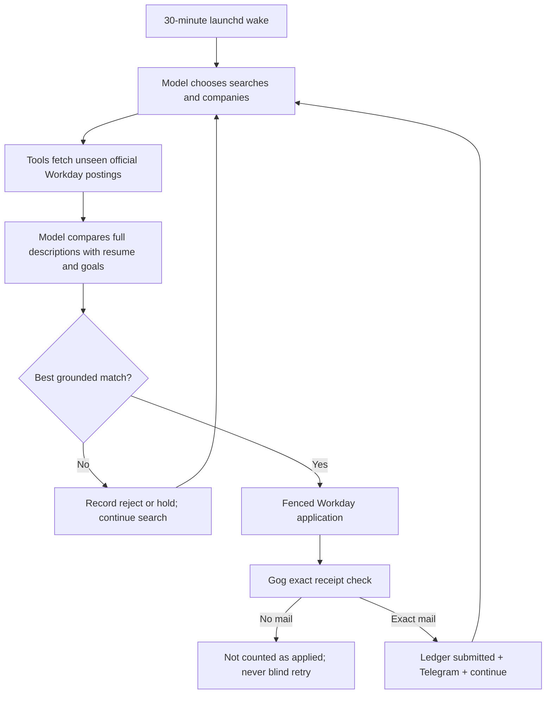
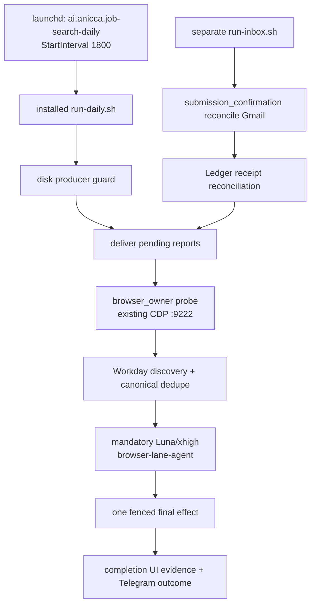
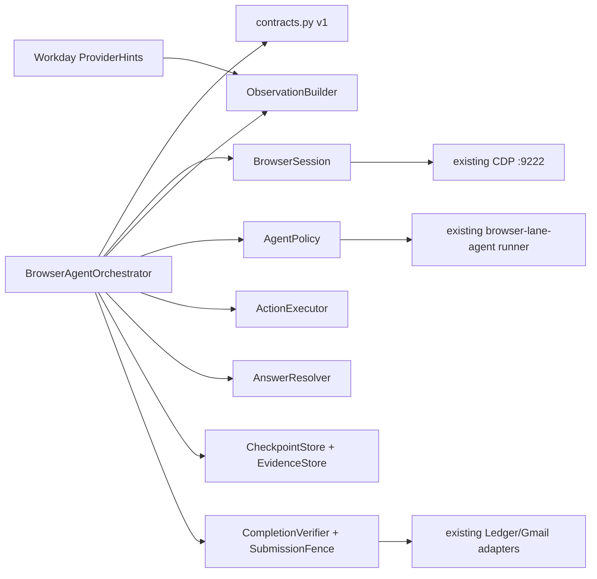

# Autonomous Job Search Loop Design

**Date:** 2026-07-28
**Last updated:** 2026-08-24
**Owner:** Daisuke Narita
**Current verified status:** `ai.anicca.job-search-daily` is installed with
`StartInterval=1800`; this is a 30-minute loop, not an hourly loop. Its immutable
runtime is release `56412ae70eaebe50bbaf1ce5e29c4f1ec6d8a422`, the private automation
home resolves to the install-selected acct2 identity, and the authenticated
CloakBrowser daily-driver answers at CDP `:9222`. Workday 10P is closed end to end:
NVIDIA JR2008507 has exact completion UI, authoritative Gmail receipt
`1a02ff31ecb7353d`, Ledger `submitted`, direct Telegram `30852`/`30853`, current
`summary.v2`, and immediate repeated-wake duplicate count zero. Later wakes continue
to discover and operate fresh Workday roles rather than stopping at that proof.

The application Ledger remains the state SSOT and `summary.v2` is rebuilt from its
event stream on every wake. Every-wake and application-result Telegram delivery uses
the direct fenced Bot API transport; OpenClaw is not in the daily reporting path.
The active engineering gate is continuous Workday search 10P3. Workday form
operation, submission fencing, authoritative verification, Ledger recording,
Telegram reporting, and exact-URL repeated-wake dedupe are live-proven in 10P.
Discovery now snapshots every posting from the persisted Workday company registry,
model-ranks every unseen row, and compares each selected official job description
to Candidate Memory before browser access. It does not use title regex or a fixed
company preference for job judgment. However, the registry is not yet an autonomous
accumulating catalog of all discoverable Workday employers, and unpublished salary
remains explicitly unverified rather than assumed. Workday is not
end-to-end complete as a useful Job Hunter until 10P1, 10P2, and 10P3 close. Until
then the owner must process Workday only; implementing and live-proving that park is
the first atomic task. Historical non-Workday runs are diagnostic evidence only and
provide no accepted progress.

**Accepted provider E2E bar:** `0/5 complete (0%)`. Workday is the only functioning
provider lane, but remains incomplete because useful-job qualification and diverse
fresh discovery are absent. Ashby, Greenhouse, Lever, and generic ATS are
`broken_unverified`; none counts as progress. Form entry, a Submit click,
`submit_unknown`, a Telegram message, or duplicate-zero without authoritative
provider receipt is not provider completion. All non-Workday application lanes must
stay parked until Workday closes 10P1, 10P2, and 10P3 with loop-owned production
evidence.

**Workday mail rule:** no authoritative application-received message found by the
authenticated Gog inbox owner means the application is not accepted as applied, with
no exceptions. The provider may omit the role, translate it, change the subject, or
use new wording. The model judges the message's meaning from sender, recipient,
subject, body, company context, and timing; code verifies the authoritative sender,
exact recipient, post-submit time, and that exactly one uncertain intent can own the
message. Role/title/phrase equality is supporting evidence, never a mandatory gate.
Completion UI alone remains an internal non-retryable uncertain state for duplicate
safety but contributes zero submitted count. A semantically affirmative, uniquely
bound Gog receipt promotes it to `submitted`.

#### Forever-running Workday closure order

| Order | Atomic outcome | Done evidence |
|---:|---|---|
| 1 | Reconcile the already-found Rakuten receipt | Message `1a031c8ef3be0dbd`, authoritative sender, recipient, post-submit time, unique intent, Ledger `submitted`, Telegram ACK |
| 2 | Prove next-wake duplicate 0 | Same Rakuten canonical/repost identity produces no new submit intent, fence, or click |
| 3 | Replace confirmation phrase/title routing with semantic mail judgment | Unseen Japanese and English receipt wordings classify correctly; spoofed sender, wrong recipient, pre-submit mail, and multiple same-company uncertain intents fail closed |
| 4 | Persist search/source cursor across every wake | Model-generated companies, queries, tried URLs, reject/hold reasons, and remaining sources resume without restarting or returning an ungrounded empty result |
| 5 | Keep searching after every reject/hold/submit | Same owner continues until qualified job, source exhaustion receipt, or explicit wake budget; next wake resumes immediately |
| 6 | Self-heal provider and transport failures | Official-source timeout, auth expiry, browser checkpoint, Gog timeout, and model failure retry only before uncertain effects; alerts dedupe |
| 7 | Prove recurring useful applications | Multiple distinct fit-qualified Workday jobs from different companies reach Gog-backed `submitted`, Telegram, and duplicate 0 |
| 8 | Soak the installed loop | Scheduled 30-minute ownership remains healthy without manual executor, duplicate submits, excluded employers, secret leaks, or false success |

The target Workday acquisition path is: maintain an accumulating registry of
official company boards; snapshot every posting from every healthy board; remove
Ledger-seen identities; model-rank all remaining rows using Candidate Memory and
the salary policy; fetch exact official descriptions for finalists; reject
unsupported work; apply through the browser only to a qualified row; accept success
only after authoritative Gog mail; then continue with the next unseen identity.
Company prestige or membership in the registry is never evidence of fit. An
unpublished salary is `compensation_unverified`, never an invented pass.

#### Rockstar_ibot open-source product boundary

Job Hunter first runs as Dais's installed 24/7 Rockstar_ibot loop. Only after that
exact 30-minute loop reliably discovers, judges, applies, verifies and reports on
Dais's Mac is the same implementation exposed through the Coconala-style Terminal
bootstrap. The repository contains no Dais profile, resume, mailbox content, browser
vault, Telegram destination or credential.

```text
Rockstar_ibot
  -> Connector layer: browser, Gmail, Telegram, Calendar, ATS sources
  -> Job Hunter loop: discover, rank, apply, verify, follow up, interview, offer
```

The active acceptance bar is Dais-device production truth: one installed owner every
1,800 seconds, dynamic companies and jobs, private-profile fit, descriptive loop-owned
Telegram at decision/start/result, official UI plus Gog plus Ledger, and next-wake
duplicate zero. OSS packaging follows this proof and must not create another runtime,
browser, UI, device program or architecture. Ashby, Greenhouse, Lever and generic
remain broken/unverified until rebuilt one at a time after Workday.

**Current execution truth supersedes earlier historical run notes below:** Workday
10P is live-proven. Run `daily-20260824-033952` reaches exact NVIDIA
`Application Submitted` and `Application Received` UI for JR2008507 with one fenced
submit. Inbox `inbox-20260824-035423` binds receipt `1a02ff31ecb7353d`, promotes
Ledger to `submitted`, and sends resume/outcome Telegram `30852` and `30853`.
Immediate health-relayed wake `daily-20260824-035611` excludes that terminal URL,
discovers unseen NVIDIA JR2020208-1, and hands only that row to Luna, proving duplicate
external effects 0. Non-Workday providers remain parked until Workday 10P1–10P3 are
complete. The minimum throughput contract is
one verified Workday application per 30-minute wake whenever at least one eligible,
permitted Workday role exists. There is no one-per-wake ceiling: after each verified
submission the same owner continues until the queue or explicit wake budget is
exhausted. A wake with no eligible role or a truthful external blocker still sends
one company/role/outcome/next-action Telegram report with a provider message ID.

**Architecture decision:** all eligible ATS form interaction is mandatory
model-based browser work. Deterministic code owns only discovery, eligibility,
hard exclusions, exact-URL dedupe, private profile/material access, account-secret
storage, final-action fencing, evidence validation, and state transitions. It never
owns the variable question-by-question workflow. Every eligible row is handed to
the existing `browser-lane-agent`, which attaches to the existing CDP owner and
repeats `observe → reason → act → post-action snapshot → observe` until the row is
verified submitted or safely resumable. A row-local failure never terminates the
queue or becomes a reason for the 30-minute owner to stop before trying another
eligible role.

The minimum autonomous input is a finalized truthful resume and the candidate's
application email address. The loop derives its initial Candidate Memory from those
inputs and expands it from every answer and verified outcome; missing context is not
a form-level stop or a request for routine human confirmation. The user does not
supply ATS passwords. When Workday requires an
account, the loop reuses the existing strong-password generator, stores the new
tenant credential only in the machine credential SSOT, completes an exact matching
email-verification flow through the authenticated Gmail rail, verifies a fresh
sign-in, and resumes the same application. Credentials, verification codes, cookies,
and form values never enter repo, logs, screenshots, Telegram, or model-visible row
envelopes.
**Handover state:** the status paragraphs above and sections 1.0-1.2 are the current
execution and TODO SSOT. The audit history below explains earlier increments but
does not override them. The earlier
`daily-20260822-000400` wake captured the root cause of the
radio exception: after source keyboard interaction, Workday dynamically
reordered controls while `_fill_step` reused stale `nth(index)` metadata. The
fix re-looks up each field by stable provider `id`, then `name` or label. Live
CDP evidence also showed the source multiselect renders all options before
filtering; the keyboard sequence now waits for the exact visible
`data-automation-label="Job Boards"` option or fails closed. Focused regressions
cover both stable re-lookup and exact-prompt gating. Those deterministic fixes are
not sufficient by themselves. The next implementation MUST replace their form
ownership with the mandatory model framework and close the Workday 10P live gate;
Ashby follows in 10Q. Do not claim submission from a click, response, or ledger row
alone.

### Universal-application architecture (target)

The loop becomes broad by adding an adapter per ATS, not by treating a click or
an HTTP response as a submission. Every adapter implements the same contract:

```text
discover official job → open existing authenticated browser context
→ identify provider surface → fill profile/resume/grounded answers
→ click only visible native controls → capture completion UI
→ reconcile ATS/email receipt → Telegram proof
```

Adapters currently exist for Ashby and Workday. Workday closes first, Ashby second,
then Greenhouse and Lever, followed by a provider-neutral ATS lane. Provider adapters
describe discovery and stable safety/evidence hints; the model remains the form
operator, so a new employer question does not require a new scripted mapper.
A provider-specific loading overlay, custom control, login, CAPTCHA, form question,
or confirmation wording is an agent observation/recovery case; it never counts as
an application and never silences the Telegram report.
The execution order is explicit: **safety preflight/discovery → model-based
browser interaction per eligible row → Telegram/Ledger reconciliation**. Ashby
and Workday deterministic paths are preflight accelerators and evidence writers;
they are not allowed to suppress the browser agent when a real form is present or
when a fixed surface evaluator returns `application_surface_not_found`. Workday is
the active 10P proof; Ashby remains parked only as an application lane until 10P
closes, while its discovery may continue without opening a form. A user-confirmed
Salesforce application is held in the private manual-completed URL set and is never
reapplied by the loop.

The remainder of this paragraph is immutable pre-framework audit history. It explains
how the prior deterministic ownership failed; it does not define the current provider
order, form owner, or stopping policy. In the latest catch-up, Ashby fast path reported `no_work` because there
was no retryable Ashby row; the run was stopped before its Workday stage after the
previous turn had already demonstrated that Workday stage was being entered too
early. The earlier Workday evidence remains recorded separately: Rakuten reached the
rendered My Information form and stopped on truthful required fields, with no claim
or submit click. The old `application_surface_not_found` failure is fixed, but it is
not the current Ashby completion gate. OpenAI, Anthropic, Palantir, Cursor, Accenture, KPMG,
Deloitte, Ernst & Young/EY, and PwC remain one hard exclusion set; historical
terminal evidence is preserved and never reopened. The Workday evaluator accepts
its production `input type=text` email field when labelled `Email Address*`; the
focused ATS suite is green, and the new Workday preflight is wired into the existing
launchd owner in commit `04989df62`. Ashby remains the primary discovery lane;
Workday is a model-driven browser lane with deterministic safety checks. The catch-up
correction report was acknowledged by Telegram as message `27323`. Guardian and the
Rockstar_ibot Career surface remain in progress. The subsequent Ashby-first run
`daily-20260821-181731` confirms the same boundary: Ashby fast path was `no_work`,
Workday was `parked / ashby_first_gate`, and the Codex discovery fallback timed out
after the bounded 300 seconds with no fresh result and no Ledger mutation. This is a
discovery-lane timeout, not an Ashby login failure. Browser inspection of Cohere's
official Ashby posting then proved a live Tokyo Apply surface. Its form explicitly
states a provider policy of no more than five applications in any 90-day span; the
fast path correctly stopped before claim/submit with
`provider_application_limit_visible` rather than bypassing the ATS policy. Fast-path
checkpoints now send Telegram before model fallback (commit `85ce59025`), so a model
timeout cannot suppress the report. The direct gateway report for this provider
block was acknowledged with Telegram message `27462`; the timed-out outbox event is
kept `send_started` and is not blindly retried.
The deterministic Ashby fast path then quarantined the Cohere row as `rejected` with
payload reason `provider_application_limit_visible`, so later wakes do not revisit
the same impossible submission.
The bounded discovery CLI is now wired into the owner (commit `12ea0d89a`): it reads
the official ATS cache, selects one untried Tokyo/Japan Ashby posting, attributes it,
and immediately runs the Ashby fast path. A live run discovered ElevenLabs' Product
Marketing - Agents - Government role, clicked its real Submit Application control,
and recorded terminal `submit_unknown`; Telegram report ACK is `27467`. The model
fallback is disabled by default for this gate, so discovery cannot stall the cadence.
The next deterministic wake discovered ElevenLabs' Forward Deployed Engineer -
Software Engineer - Singapore and initially exposed an Ashby `aria-hidden` native
submit button. The adapter now clicks the visible `Submit Application` text fallback
without force/DOM dispatch; the live retry reached the real click and recorded
`submit_unknown` as well.
Inbox reconciliation now loads `GOG_KEYRING_PASSWORD` through the private env loader
before invoking `gog`; the pre-fix failure was a launchd no-TTY password prompt, not
an expired Google authorization. Commit `78d2e8dc5` is verified by a real read-only
Gmail search after loading that value without printing it.
The following inbox run passed the four already-fetched candidate messages directly
to the model without a second OAuth read. It durably processed the Palantir message
as a hard-employer-exclusion block and left the other three unacknowledged for a
later exact-safe outcome; no Gmail/OAuth resolution failure recurred.
The fully automatic run `daily-20260821-184654` then discovered ElevenLabs'
Enterprise Solutions Engineer - Singapore, reached its real Ashby submit click, and
recorded another terminal `submit_unknown`. Its fast-path checkpoint was sent with
Telegram ACK `27475`; `resume-deliver-after` and `summary.v1` completed, and no model
fallback or Workday navigation occurred.

**Ashby active gate has no Gog/Gmail dependency.** Gog is only a later confirmation
rail for already-clicked `submit_unknown` rows. The Ashby CLI failure sequence and
its fixes are: empty retry queue plus model discovery timeout → deterministic
official-cache discovery; visible five-applications/90-days provider rule → durable
provider-policy quarantine; `aria-hidden` native submit button → ordinary click on
the visible `Submit Application` text. The repeatable loop is now
`Ashby fast path → official-cache discovery (one Tokyo/Japan row) → Ashby fast path
again → Telegram checkpoint → summary`, with model fallback disabled by default.
An ElevenLabs form with unverified required experience questions is now stored as a
profile-SHA-bound blocker. The immediate repeat skips it without reopening or
clicking the form; a later profile revision re-enables exactly that row.
The automatic verification wake `daily-20260821-191115` exited cleanly: the blocked
ElevenLabs row was skipped, cache discovery returned `no_work`, the second fast path
did not run on the same row, Workday remained `parked / ashby_first_gate`, and the
fast-path Telegram checkpoint retained ACK `27475`.
The next live-refresh wake `daily-20260821-191823` queried seven official Ashby
boards, skipped Cohere due to its recorded provider policy, discovered ElevenLabs'
Enterprise Solutions Engineer - Poland, clicked the real submit control once, and
recorded `submit_unknown`; its distinct run-ID Telegram checkpoint was acknowledged
as message `27523`.
Live board rotation now excludes hard employer exclusions and board-level provider
limits before selecting a role. It broadened the official source set to eleven
relevant boards and found Harvey's Senior Product Marketing Manager, Solutions role.
The Ashby mapper recognizes separate legal/preferred first/last-name controls and
the approved Mitsubishi UFJ Information Technology current-employer fact; the real
Harvey submit click is fenced as `submit_unknown`, with Telegram ACK `27527`.
The mapper also recognizes approved current-location and GitHub-portfolio fields.
LangChain's Solutions Engineer (Chicago) form reached the real submit click and is
fenced as `submit_unknown`; its direct Telegram application report was acknowledged
as message `27539`.
The daily script now bounds the model-based browser lane at 1800 seconds by
default (`JOB_SEARCH_BROWSER_TIMEOUT_SECONDS` may lower or raise that bounded
value). It is a required form-operator lane, not an optional fallback: the
deterministic preflight runs first, then hands each eligible row to the model
agent and retains the same row-local evidence.

**Done when:** `Daisuke134/life-manager` is the only versioned source and the
Job Hunter is an installable open-source Rockstar_ibot skill plus resident loop. The
resident system can discover, qualify, tailor and submit eligible
applications on the configured recurring cadence without a product-imposed daily
count cap; reconcile every later Gmail message; manage scheduling, assessments,
interview preparation, follow-up, offers and final outcomes; report every material
event at most once; heal safe operational failures; and promote or roll back only
verified evidence-backed strategy changes without routine human prompting. Its
economic outcome gate is one accepted and started role whose authoritative gross
base salary is at least USD 10,000 per month equivalent (USD 120,000 annualized),
recorded as salary rather than product revenue. Every submission still requires
exact-job deduplication, inference provenance, ATS evidence, a fenced intent and
authoritative confirmation.

## 1. Outcome

### 1.0 End-to-end model browser rollout (current execution SSOT)

#### Overview

The first production milestone is one reliable Workday lane. It begins with a
finalized resume and application email, creates or reuses the tenant account without
asking the user for a password, completes the live multi-page application, and ends
only with authoritative submission evidence. Ashby then reuses the exact same model
loop. This is a deliberate replacement of deterministic form ownership with a
first-class internal browser-agent framework. It reuses the proven executor, CDP
owner, credential/Gmail rails, Ledger, and Telegram transport, but it does not keep
the old fast-path workflow as the architecture or add ATS-specific question mappers.

The implementation order is:

```text
Workday account + application E2E
  → immediate developer kickstart + Workday dedupe/continued queue
  → repeated Workday submissions + Telegram outcome on every wake
  → only then Ashby E2E on the same agent contract
  → Greenhouse → Lever → provider-neutral ATS
  → Rockstar_ibot open-source skill/loop packaging
  → inbox → interview → assessment → offer → USD 10K/month salary → started outcome
```

#### Acceptance criteria

1. `ai.anicca.job-search-daily` remains the only acquisition owner and wakes with
   `StartInterval=1800`; the authenticated CloakBrowser daily-driver at `:9222`
   remains the only browser owner.
2. A finalized resume and application email are sufficient input. Workday passwords
   are generated locally, stored only in the machine
   credential SSOT, never exposed to the model, and verified by a fresh sign-in.
3. Every eligible Workday row receives one sanitized row envelope and one bounded
   `browser-lane-agent` session. No production-off model flag or deterministic form
   bypass exists.
4. Luna xhigh observes screenshot plus accessible controls before each decision,
   performs one or a small number of ordinary visible actions, stores a post-action
   snapshot, and observes again before deciding the next step.
5. Account creation, email verification, login, resume upload, dynamic controls,
   validation correction, application questions, review, and final submit all remain
   inside the same row-scoped agent session and durable checkpoint lineage.
6. Every visible question receives an answer. `AnswerResolver` first retrieves the
   resume, Candidate Memory, semantic prior answers, and job context, then returns an
   exact, derived, generated, or conservative inference. It computes experience from
   dated work/project evidence, generates narrative answers from resume plus role,
   estimates salary from role/location/seniority policy, uses non-disclosure choices
   for self-identification when offered, and applies stable least-claiming defaults
   for required logistics. Confidence and provenance are stored for consistency and
   learning; they never create `unknown_required_field`, human-confirmation, blocked,
   or skip behavior. Credentials, degrees, employers, and achievements are not
   fabricated.
7. CloakBrowser and the daily-driver session are the first CAPTCHA prevention path.
   A visible CAPTCHA invokes the existing approved solver/recovery path before submit;
   solver failure preserves the row and the owner continues another eligible role.
   Employer application-count and provider policy limits are never bypassed.
8. A row-local browser, model, validation, credential, or provider failure never ends
   the hourly queue. The owner checkpoints recovery state and continues through the
   ordered eligible queue until the wake's explicit time/action budget or the queue
   is exhausted. A verified submission does not end the wake; the same run may submit
   two, three, five, or more distinct eligible applications.
9. `submitted` is verifier-owned. During the Workday-first gate it is written only
   after both an exact completion UI and an authoritative receipt email bound to the
   company, role, and application. A
   click, HTTP response, model statement, or Ledger intent is insufficient.
10. A submit click with ambiguous readback becomes non-retryable `submit_unknown` and
    is reconciled through ATS/Gmail evidence; it is never clicked a second time.
11. Every processed company and role produces a Telegram result with `submitted`,
    `not submitted`, or the exact resumable/external reason. Internal technical
    blockers do not become a run-level stopping state.
12. Rakuten reaches Workday step 2 and then a final completion UI or exact receipt.
    The following hourly wake proves exact-URL dedupe and no duplicate side effect.
13. After Workday closes, Ashby, Greenhouse, Lever, and provider-neutral ATS lanes
    adopt the same row envelope, model loop, evidence, verifier, and Telegram
    contracts without a second executor or new fixed question workflow.
14. The end-to-end Job Hunter continues after application: authoritative inbox
    reconciliation, recruiter replies, interview scheduling/preparation, assessment
    fencing, offer support, and accepted/declined/started outcomes remain linked to
    the same application identity and evidence ledger.
15. Development never waits for the next 3600-second schedule. After each immutable
    release is activated while the owner is idle, development triggers the existing
    owner with `launchctl kickstart -k`, watches it to exit, reads back evidence, fixes
    the smallest root cause, and kickstarts again. It never invokes `run-daily.sh`
    directly or creates a second executor.
16. The Job Hunter ships inside `Daisuke134/life-manager` as an open-source skill and
    resident loop with the same install, state, credential, release, launchd,
    Telegram, and `summary.v2` conventions as the other Rockstar_ibot loops.
17. The lifecycle does not stop at an application or offer. It tracks compensation,
    negotiation, acceptance, and start evidence until one started role proves gross
    base salary of at least USD 10,000 per month equivalent; variable compensation is
    reported separately and is not used to pass this gate.

#### As-Is / To-Be

| Area | As-Is | To-Be |
|---|---|---|
| Form owner | Workday/Ashby fast paths fill and may return before the optional model branch | The model agent owns every eligible form; deterministic code is safety/evidence only |
| First provider | Ashby is specified first despite a live Rakuten Workday progression | Workday E2E closes first; Ashby reuses it second |
| Account input | Workday has a password helper but account creation is part of a fixed path and uses a parallel store | Resume + email are sufficient; existing generator writes the machine credential SSOT and the agent verifies login |
| New questions | Unknown fields produce an early `unknown_required_field` return | Every field receives a stable exact/derived/generated/conservative inference; provenance is memory, never a stopping gate |
| Browser perception | Fixed snapshots and selectors drive provider-specific code | Screenshot + AX/DOM + visible text are reread after every action |
| CAPTCHA | A CAPTCHA can become a durable provider block | CloakBrowser prevents most challenges; the approved solver is bounded pre-submit recovery |
| Queue | One provider/row failure can consume or terminate the wake | Every row is isolated; the owner continues the ordered queue |
| Success | Click/request/Ledger progress may be overinterpreted | Only completion UI or exact official receipt transitions to `submitted` |
| Expansion | Each ATS invites another scripted filler | One model loop; adapters contain only discovery and stable safety/evidence hints |
| Reporting | Fast-path summary can omit the actual model outcome | Company, role, outcome, evidence class, and next action receive a Telegram ACK |
| Development cadence | Validation waits for a natural hourly wake or bypasses launchd with a local command | The active immutable release is repeatedly exercised through the existing launchd owner's kickstart/readback cycle |
| Product location | Job Search exists as a standalone runtime plus later Career surface | Job Hunter is an open-source Rockstar_ibot skill and resident loop using the common lifecycle contracts |
| Economic outcome | Pipeline health ends at application/offer/start counts | The final outcome gate is authoritative started employment at USD 10,000/month gross base salary equivalent |

#### Test matrix

The framework receives contract tests for observation, action, recovery, checkpoint,
credential secrecy, duplicate side effects, and false submission claims. Live CDP
evidence remains the primary functional verification; a small fast-path patch is not
accepted as a substitute for the framework.

| # | To-Be | Test name | Cover |
|---:|---|---|---|
| 1 | One hourly/CDP owner and Workday-first ordering | `test_workday_model_mvp_uses_single_hourly_owner` | OK |
| 2 | Every eligible Workday row enters the model lane | `test_every_eligible_workday_row_invokes_browser_lane` | OK |
| 3 | No production-off model path | `test_daily_owner_has_no_optional_model_exit` | OK |
| 4 | Row envelope excludes credentials and terminal retries | `test_model_row_envelope_redacts_secrets_and_fences_terminal_states` | OK |
| 5 | Existing password generator stores only through credential SSOT | `test_workday_signup_uses_machine_credential_ssot` | OK |
| 6 | Every dynamic question produces one stable inferred answer | `test_every_question_returns_stable_answer_with_provenance` | OK |
| 7 | CAPTCHA recovery stays pre-submit and row-local | `test_captcha_recovery_never_crosses_submit_fence` | OK |
| 8 | Agent failure continues the queue | `test_model_row_failure_continues_queue` | OK |
| 9 | Ambiguous submit is non-retryable | `test_submit_unknown_is_never_retried` | OK |
| 10 | Submitted requires completion or receipt | `test_submitted_requires_authoritative_evidence` | OK |
| 11 | Telegram contains company, role, and exact outcome | `test_hourly_company_role_report_contract` | OK |
| 12 | Workday contract ports unchanged to Ashby | `test_ashby_reuses_model_row_contract` | OK |
| 13 | Submission does not stop a wake with remaining eligible rows | `test_verified_submission_continues_same_wake_queue` | OK |
| 14 | Development uses only launchd kickstart/readback | `test_development_trigger_reuses_existing_owner` | OK |
| 15 | Rockstar_ibot skill/install owns the Job Hunter loop | `test_job_hunter_skill_installs_canonical_resident_loop` | OK |
| 16 | Started salary gate uses authoritative gross base compensation | `test_salary_goal_requires_started_10k_month_base_evidence` | OK |

| E2E item | Value |
|---|---|
| UI change | Yes: external Workday, then Ashby and other ATS UIs are operated |
| Judgment | Maestro not required because this is not an iOS UI; real CloakBrowser/CDP launchd E2E is mandatory |

#### Boundaries

- No second executor, Chromium, browser profile, or credential store is added. A new
  first-class Job Hunter browser-agent framework is built inside the canonical runtime
  and reuses the existing owner, runner, CDP transport, credential helper, Ledger,
  Gmail rail, and Telegram transport.
- No credential, degree, employer, job title, achievement, or receipt is invented.
  Missing application answers use stable evidence-derived or least-claiming inference
  and never become a human-wait state. CAPTCHA solver use does not authorize
  bypassing an employer application-count limit, geographic restriction, or provider
  policy.
- `submit_unknown`, Salesforce JR355047, and any other terminal URL are never
  resubmitted.
- Credentials, email codes, cookies, raw profile values, and resume contents never
  enter a row envelope, evidence JSON, model transcript, Telegram, or repository.
- The 30-minute-wake floor is one verified application when an eligible, permitted role
  exists; there is no one-per-wake or daily ceiling. The owner continues after each
  success until its explicit wake budget or queue is exhausted. During development,
  repeated launchd kickstarts replace waiting for the clock; they do not bypass the
  canonical owner or duplicate an external effect.

#### Workday useful-job qualification contract

10P proves that the existing loop can operate Workday and produce authoritative
effects. It does not prove that the selected jobs are realistic interview targets.
10P2 and 10P3 close that separate product requirement before any additional ATS
rollout resumes.

Ashby, Greenhouse, Lever, and generic ATS have no accepted E2E progress. Historical
rows, screenshots, fences, messages, and `submit_unknown` states remain immutable
diagnostic evidence only; they do not satisfy a product gate and must not appear in a
completion bar. Their application lanes remain parked while Workday is active.

The model owns every fit and semantic-repost judgment. Its private input is the full
official job description, Candidate Memory, the available resume variants, explicit
career preferences, and sanitized prior Ledger identities/outcomes. The prompt asks
for evidence against each mandatory requirement, unsupported gaps, a concise
interview thesis, the selected resume variant, and exactly one decision:
`qualified`, `rejected`, or `hold`. A title, title keyword, employer, seniority word,
or fixed numeric score is never sufficient evidence.

Deterministic code may fetch official data, validate the output schema, enforce
exact URL/requisition uniqueness, persist evidence hashes and decisions, and prevent
submission without a current `qualified` decision. It must not use a regex, keyword
allowlist/denylist, points table, title family, or years threshold to decide fit or
semantic equivalence. Missing official text, missing candidate evidence, invalid
model output, or unresolved mandatory gaps fail closed before `materials_ready`.

Existing pending Workday rows are not grandfathered: they return to this gate before
browser submission. Exact terminal URLs remain permanently deduped. A new URL or
requisition for the same employer/title/location receives a model evidence comparison
against prior rows; a supported repost decision creates no submit intent. After this
safety gate is live, the current `ROLE_RE`, `_priority`, and fixed company/tenant
rotation are removed as discovery judgments. The model generates searches, discovers
companies and official Workday postings, reads full descriptions, compares all unseen
candidates, and chooses the best grounded match. Deterministic code only validates
official HTTPS Workday identity/API responses, exact user exclusions, dedupe,
schemas, evidence, budgets, and side-effect fences.

There is no employer allowlist. The only deterministic employer rejection is the
user's explicit exclusion set: OpenAI, Anthropic, Palantir, Cursor, Accenture, KPMG,
Deloitte, Ernst & Young/EY, and PwC/PricewaterhouseCoopers. Legal impossibility,
clearance the candidate cannot satisfy, non-Japan relocation-only work, an exact prior
application/repost, and required fact fabrication remain safety exclusions. Every
other company is eligible for model inspection.

Within one wake, the agent continues `search → read official posting → compare →
reject/hold/qualify` until it finds a qualified role or exhausts its explicit time and
action budget. A rejected or held job never ends the wake. If no qualified job is
found, the loop persists the search cursor, sources tried, and grounded rejection
reasons, then resumes from that cursor next wake; it may not return an ungrounded
"nothing found" result or lower the fit standard merely to submit something.

The normal acquisition path does not regenerate companies and search words every
wake. It follows the fixed-commit Serai Workday pattern: maintain a durable registry
of verified company Workday host/site/locale identities, paginate each official CXS
`/jobs` endpoint with empty `searchText` until `offset >= total`, and materialize one
local unseen-job snapshot. The model then compares and ranks that complete snapshot.
Company/source discovery is a separate low-frequency maintenance action that adds or
repairs registry entries; it is not the per-wake job search. This prevents the first
company, first page, or model-generated keyword from hiding better jobs.



#### Atomic execution steps

This is the remaining implementation-order SSOT. Only the first
`pending_actionable` item is active.

| Order | Atomic TODO | State | Evidence needed to close |
|---:|---|---|---|
| 1 | Preserve the one recurring owner and CloakBrowser CDP `:9222` | `done` | Launchd interval 1800, owner idle/healthy, CDP responds, no second executor |
| 2 | Read and compare fixed-commit browser-agent/job-lifecycle OSS before architecture changes | `done` | Browser Use, Skyvern, Stagehand, job-apply-plugin, AIHawk, career-ops `421d93e`, and ai-job-search `ab91c60` code findings recorded |
| 3 | Make Workday-first and the OSS-code-first rule the current spec/memory SSOT | `done` | This section and `MEMORY.md` contain one non-contradictory order |
| 4 | Trace the existing daily owner, Workday helper, runner, credential helper, Ledger, and Gmail call graph | `done` | Exact reused entrypoints, replaceable fast-path boundaries, and framework integration seams are named below |
| 5 | Freeze fixed-commit OSS source lineage and license boundaries | `done` | Fixed SHA, license text, allowed reuse, AGPL pattern-only boundary, and rejected human-stop/default-answer patterns are recorded below |
| 6 | Define the Job Hunter browser-agent framework package and public contracts | `done` | Package boundary, dependency direction, API version, and orchestrator/session/observation/action/answer/checkpoint/verifier/provider-hint signatures are fixed below |
| 7 | Define one provider-neutral sanitized row-envelope and row-run state schema | `done` | `schemas/browser-row-run.v1.schema.json` allowlists exact identity/evidence pointers and excludes secrets, raw answers, provider workflows, and terminal retry inputs |
| 8 | Add framework contract tests and recorded real-shape replays | `done` | `tests.test_model_browser_loop` replays sanitized live Workday plus recorded Ashby shapes, rejects forbidden envelopes, and detects all five current fast-path contract gaps |
| 9 | Route `browser-lane-agent` to Luna xhigh with the existing bounded runner | `done` | `luna-xhigh-browser-loop` has one Codex Luna xhigh candidate, the 1800-second daily bound, explicit reason at both callers, and no fallback executor |
| 10 | Remove `JOB_SEARCH_ENABLE_MODEL_FALLBACK` as a production decision | `done` | The flag and early exit are absent, Workday fast path is outside production, and the mandatory Luna lane consumes every eligible Ledger Workday row |
| 11 | Replace Workday/Ashby filler ownership with the framework orchestrator | `done` | Production reaches neither filler nor runner directly; discovery/model-owned receipts feed one `browser_agent.orchestrator`, which delegates once to the existing runner |
| 12 | Make Workday the only active application lane during 10P | `done` | The owner keeps Ashby discovery read-only, emits `discovery_only/workday_10p`, passes `active_provider=workday` through the orchestrator boundary, and forbids Ashby form navigation in the model prompt |
| 13 | Implement persistent CDP session ownership and reconnection | `done` | `BrowserSession` accepts only local `:9222`, tags/reacquires one row page in the existing default context, reconnects without launching a browser, and refuses to close a page whose ownership marker changed |
| 14 | Implement `ObservationBuilder` from fresh screenshot + AX/DOM + visible text | `done` | Each build writes a mode-0600 fresh screenshot, captures current visible text/control/validation/tab values without element handles or input values, and returns a canonical content hash |
| 15 | Implement the typed `ActionExecutor` | `done` | `VisibleActionV1` exposes only navigate/click/type/select/upload/scroll/wait; every control is freshly resolved to one visible enabled role/label, insecure navigation and hidden/forced/DOM actions are unrepresentable, receipts omit entered values, and final Submit is rejected until the fence path exists |
| 16 | Implement Luna xhigh `AgentPolicy` and multi-step reasoning loop | `done` | The one existing Luna xhigh runner turn repeats attach/reconnect→fresh observation→one model plan→policy gate→typed action; stale hashes, action batching, terminal truth, budget overflow, and nested runner/model calls are rejected |
| 17 | Implement `CheckpointStore` and per-action `EvidenceStore` | `done` | Checkpoints atomically replace mode-0600 cursor/hash/budget state; evidence is an O_EXCL append-only predecessor chain of before/action/after SHA-256 references, rejects broken chains/raw values, and reloads after process death/CDP reconnect |
| 18 | Build Candidate Memory from resume plus application email | `done` | Every wake atomically rebuilds a private mode-0600 semantic memory from the application email/profile and three current resume PDFs, records profile/resume hashes and corroboration, and exposes identity, experience, skills/projects, authorization, logistics, links, and preferences only through `CandidateMemoryView` |
| 19 | Implement semantic Answer Memory | `done` | Private mode-0600 Answer Memory binds normalized employer wordings to one Luna-selected semantic concept, reuses its latest answer, appends revisions only when answer/provenance changes, preserves all provenance, and rejects alias rebinds; receipts expose hashes/kinds rather than answers |
| 20 | Implement the always-answer `AnswerResolver` | `done` | Every labeled field returns exact/derived/generated/conservative, reuses semantic memory, constrains selection to current options, and falls back to a least-claiming typed answer; missing-context/confirmation/blocked/skip do not exist in its result type and validation feeds another observation |
| 21 | Define stable inference policies for common required questions | `done` | Provenance-bearing experience intervals merge overlaps before year calculation; compensation/start date/work authorization/preferences drive salary, availability, sponsorship and relocation; EEO uses current non-disclosure choices; narratives require fact refs; all answers map deterministically to current options |
| 22 | Reuse the Workday password generator through the machine credential SSOT | `done` | `MachineWorkdayCredentialStore` reuses the existing strong generator, stores one `workday:<tenant>` entry atomically in `~/.local/share/anicca/credentials.json` under 0700/0600, preserves unrelated credentials, imports legacy tenants idempotently, and serves daily/inbox consumers without a production parallel store |
| 23 | Implement model-owned Workday create-account/sign-in flow | `done` | Luna classifies each fresh auth surface and supplies only current visible targets/mode; `WorkdayAuthTool` provisions/reuses the machine SSOT, fills email/password/verify internally, waits provider readiness, returns hash-only receipts, never exposes secrets, and leaves consent/click/transition decisions to the model rather than a fixed workflow |
| 24 | Reuse the already-authenticated Gog CLI account-verification rail | `done` | No new Gmail/Google login exists: the resident inbox owner uses its existing Gog CLI account; `workday_verification` binds message ID, trusted `@myworkday.com` sender, verification purpose, one known machine-SSOT tenant and one HTTPS activation URL, then `VerificationStore` consumes it once without exposing the URL/token to model output or logs |
| 25 | Verify a fresh Workday sign-in from stored credentials | `done` | An ephemeral context in the existing CDP owner used the Rakuten machine-SSOT credential, filled only visible email/password, waited provider readiness, clicked the visible overlay once, and read back `Settings` + `Candidate Home` + account menu; private receipt `atomic25-rakuten-signin/fresh-signin-receipt.json` binds screenshot SHA-256 `8508c3c93f424505b7b96de923b987b0994156bfe01cadd726ad94adb9240c28`, and the context was closed without changing the shared owner |
| 26 | Feed rendered validation errors back into the next model step | `done` | `ValidationFeedbackV1` binds deduplicated rendered errors and related visible controls to the exact fresh observation hash; stale feedback is rejected, same-surface rerenders continue one-action correction, and no `unknown_required_field` return exists |
| 27 | Handle dropdowns, radios, dates, uploads, modals, and reordered controls semantically | `done` | Fresh observations expose value-free stable IDs, checked state, and native option labels; custom comboboxes/modal options use observe-click-observe-click, colliding labels may use only a same-observation stable ID, and no index/selector/options survive rerender. Read-only Rakuten CDP proof found 42 current controls/15 stable IDs and wrote screenshot SHA-256 `76685f8183907fc427a9223c6240ff30ef358ec7cfbc07800d5f054e4c3c4c6d` with observation SHA-256 `436f6ef2127874b41c677c6331bf34ab81cab97ea7ac6efe6cef8348295a8580` under private `atomic27-semantic-controls` evidence. |
| 28 | Add CloakBrowser-first CAPTCHA prevention and safe row-local recovery | `done` | Only visibly rendered reCAPTCHA/hCaptcha/Turnstile in the fresh observation creates a hash-bound challenge assessment; policy checkpoints that row before any model click and the wake continues its queue. Invisible/absent frames do nothing, and no challenge is clicked, solved, or bypassed. Read-only Rakuten CDP proof found zero visible challenges and bound private screenshot SHA-256 `76685f8183907fc427a9223c6240ff30ef358ec7cfbc07800d5f054e4c3c4c6d` to observation SHA-256 `3eb82d0f9ddc004b2bfd84c531fce0adc90f7afd61732266307456b10e7bb851`. |
| 29 | Verify resume upload and parsed profile fields | `implementation_done_live_gate_45` | `ResumeVerifier` internally compares the selected filename/resume SHA-256 and visible parsed fields against the routed material/Candidate Memory, returning only checked/mismatched labels; each mismatch is corrected by a typed action and reverified. Real Workday upload/readback is mandatory in the existing launchd-owner live gate, never a manual second executor. |
| 30 | Resume the same row after every meaningful page transition | `done` | `RowResumer` validates every checkpoint action hash against the append-only evidence chain, reconnects the exact CDP page marker with incremented generation, restores remaining budget/cursor, and never replays actions; if the owned page vanished it returns one HTTPS recovery URL for a new model-selected typed navigate. |
| 31 | Continue the Workday queue after any row-local recovery | `done` | `RowQueueSupervisor` orders materials-ready before retryable rows, canonical-URL dedupes them, catches each row exception into a value-free checkpoint receipt, and always invokes the remaining rows in the same wake. |
| 32 | Continue after every verified submission until the wake budget ends | `done` | The same supervisor continues its immutable row tuple after a `submitted` receipt; an isolated three-row run proved row 3 executes after row 1 exception and row 2 submission, with no count cap or early return. |
| 33 | Recheck exact application identity at final review | `done` | `verify_final_review` requires company and role on the rendered fresh surface, exact canonical URL, routed resume SHA-256/visible filename, zero parsed-field mismatches, row/application IDs, and one observation hash; its value-free receipt is the sole identity input to the fence. |
| 34 | Acquire the existing one-shot `SubmissionFence` | `done` | A private locked state file issues a 1–300 second capability only after rereading the exact `submit_claimed` Ledger intent and matching fence/application/canonical URL/resume/final-review observation; concurrent, consumed, expired, stale, mismatched, and terminal leases are rejected, and consume is one-shot. |
| 35 | Click the one visible final Submit control once | `done` | Normal actions still reject final Submit; the official model-facing `runtime finalize` command reroutes the immutable assigned resume, verifies the fresh review identity, captures claim-ready evidence, acquires the fence, and delegates exactly one visible Submit to `execute_final`. A post-consumption click error becomes fresh completion observation rather than a retry; the value-free receipt never claims completion. |
| 36 | Implement independent rendered completion verification | `done` | `verify_completion_ui` accepts only a new screenshot-backed observation, returns submitted solely for an exact completion phrase plus visible company+role identity, returns definite not-submitted for rendered validation, and otherwise submit-unknown; click receipt, network request, HTTP response and Ledger state are not inputs. |
| 37 | Reconcile an exact authoritative receipt through the existing Gog CLI mailbox | `done` | No Gmail/Google login is created; runtime passes the authenticated Gog account as exact recipient and reconciliation additionally requires an authoritative ATS sender domain, company, full role title, confirmation phrase, unique uncertain intent, and receipt time after claim before hashing evidence into the Ledger. |
| 38 | Write Ledger terminal state only from verifier evidence | `done` | Ledger migrations persist outcome evidence class/hash on intent and attempt; `complete_submission_verified` fixes submitted/submit-unknown/not-submitted to exact UI/no-authoritative-UI/rendered-validation evidence respectively, while legacy `complete_submission` rejects submitted/unknown. Submit-unknown remains absent from both queues and only exact receipt reconciliation can upgrade it. |
| 39 | Emit per-company/role Telegram outcomes and hourly summary | `implementation_done_live_gate_44` | `send_hourly_outcomes` emits one normalized line per company+role, requires authoritative evidence class for submitted, distinguishes recovering/not-submitted/unknown, accepts no credential/answer fields, content-dedupes by wake+hash, and refuses success without a real message ID. Live ACK remains mandatory from the released owner. |
| 40 | Implement the development kickstart/readback controller | `done` | `activate_and_kickstart` verifies archive checksum/metadata/safe layout, installs `releases/<commit>` read-only, waits for the one launchd owner to be idle, atomically switches `current`, invokes only `launchctl kickstart -k`, requires run-count increment/idle/exit 0, and returns the new exact evidence paths while preserving the previous release. |
| 41 | Close focused framework verification | `done` | 53 focused browser/Ledger/receipt/Telegram/release/launchd/Workday tests plus 13 release-launchd-model checks pass; all job-search shell syntax and browser/deployment compile pass; scans find no email literal/private DB/env/profile artifact, one orchestrator call, normal Submit rejection, evidence-only terminal write, and no direct runner/browser in deployment. |
| 42 | Build a commit-pinned immutable release | `done` | Commit `db3433464b5b90e1c3915cee7176ea081a06839a` produced a 161-member bounded archive with SHA-256 `61a7a285b8947857ca6b11051e4386773fcacfc6ac6afef74590400c64d7d4a3`; independent checksum, RELEASE commit/private-state flag, traversal/link, and private artifact checks pass. |
| 43 | Activate only while the hourly owner is idle | `done` | Immutable releases are checksum-verified, installed read-only, and switched only by the deployment controller after `launchd` reports idle; `3e2df256908f800c91720036d1a61f4be9fc99b8` is the current released commit and prior releases remain rollback targets. Its 162-entry archive independently verifies at SHA-256 `cafe5758875675286ac2caa1d9862bc4831007f196f296e9db588e8091808d6d`. |
| 44 | Kickstart and watch the existing launchd owner | `done` | Existing `ai.anicca.job-search-daily` run 20 exited 0 from `daily-20260822-163810`; its owner evidence proves the existing CDP `http://127.0.0.1:9222` and browser WebSocket were used. The prior identical checkpoint report remains authoritatively ACKed at Telegram message ID `28475`; run 20's duplicate send has no ACK and is not claimed. No submit intent or substitute executor exists. |
| 45 | Resume Rakuten and prove Workday step 2 | `done` | The durable model cursor reached visible `My Information`, uploaded and hash-verified `Daisuke_Narita_AI_Business_Resume.pdf`, filled current identity/address/phone controls from private Candidate Memory, and accumulated an ordered 50-step evidence chain without a submit claim. |
| 46 | Correct the Rakuten outcome | `done` | Completion-like UI exists but the matching receipt email does not. Rakuten is disputed/unverified and no longer closes the Workday gate. Historical immutable evidence remains preserved. |
| 47 | Park every non-Workday application path | `done` | Release `e0938b1c68a1ac4693bccbbc2eb38eae96c8b2e8` removes Ashby discovery from the wake and forces `active-provider=workday`; run 52 was stopped while this execution SSOT was corrected. |
| 48 | Directly adopt the fixed OSS browser-loop lineage | `done` | Browser Use `85ddbfed`, career-ops `421d93e`, ai-job-search `ab91c60`, and Stagehand `a21633d5` are fixed under the private OSS lineage root. Production now uses the Browser Use step lifecycle, career-ops-style fresh ref tagging for anonymous controls, and ai-job-search-style model-visible resume-grounded facts. The 543-line mixed legacy/script prompt is replaced by one 127-line Luna Workday agent loop; `searchBox`, `promptOption`, `click_filter`, and page-sequence instructions are absent. |
| 48a | Require UI plus receipt email and exact Telegram reporting | `done` | For Workday, a completion-like UI is stored as `exact_completion_ui_pending_receipt`, never directly as submitted. Only the existing Gog reconciliation can promote it after an authoritative matching receipt email. `runtime finalize` sends the same company/role outcome itself and returns the real Telegram message ID, preventing a later queue lookup from reporting the wrong row. |
| 48b | Admit a fresh eligible Workday row into the model queue | `implementation_done_live_gate` | The first `runtime observe` now promotes one attempt-free `discovered` Workday row through `qualified → materials_ready`, then recollects it for Luna in the same call. Exact Salesforce JR355047, non-Workday, terminal, and existing-intent rows cannot be admitted. Legacy rows route a deterministic role-appropriate verified resume without mutating their immutable historical assignment. Run 53 exposed the pre-fix `queue_complete` admission gap; the next released kickstart is the live gate. |
| 48c | Let the loop complete one fresh Workday row | `next` | The existing launchd owner selects the admitted row, Luna operates the existing CloakBrowser through final Review and one fenced Submit, the UI is inspected visually, Gog binds the receipt email, and Telegram returns the exact company/role outcome message ID. |
| 48d | Serialize every Luna browser command | `implementation_done_live_gate` | Run 54 correctly admitted Workday Account Executive but Luna issued two `observe` commands before either completed. A command-level nonblocking flock now covers observation, navigation, auth, actions, finalize, checkpoint, and report; the prompt also requires complete JSON readback before the next command. The two pre-navigation orphan observations were terminated without a browser action or submit effect. |
| 48e | Skip unresponsive foreign tabs during CDP reconnect | `implementation_done_live_gate` | Run 55 proved serialization but its single first observation stalled while scanning the shared default context. `BrowserSession._marker` now bounds each foreign-tab `window.name` read at two seconds and skips an unresponsive tab without closing, navigating, or mutating it; the owned row marker remains the only recoverable page. |
| 48f | Bound the shared CDP attach itself | `done` | Run 57 used release `bbd14344a176f615bf14cf63e40c1b9631c56fd8`. All attempts connected to the existing CloakBrowser WebSocket and then failed within the bounded attach while Playwright synchronized the 25-target shared browser; no page observation, action, submit intent, or provider effect occurred. The run was terminated after four identical failures instead of spending the remaining model budget retrying a known transport error. |
| 48g | Adopt the Daily Driver leased-page transport | `implementation_done_live_gate` | Reuse the existing authenticated CloakBrowser and its job-search session vault (53 Workday cookies across 12 tenant domains at implementation time), acquire the durable `job-search-daily` context, and drive only its returned page WebSocket with bounded direct CDP calls. Observation refs, native mouse/keyboard/select/file actions, screenshots, model reasoning, and the submission fence remain separate layers. Each owner wake snapshots the refreshed browser cookies back to the mode-0600 vault. No Playwright whole-browser attach, second browser, provider page script, or foreign target mutation remains in this path. |
| 48h | Invoke Playwright-style observation functions over direct CDP | `implementation_done_live_gate` | Run 58 proved the leased target connected and produced a real screenshot without a whole-browser attach, then exposed that the adapter returned the JavaScript function object instead of invoking it, so `controls` was absent. The saved image was visually inspected and was only the blank leased page; no Workday UI, action, or submit occurred. The adapter now invokes callable expressions before decoding their value, and Luna stops after one transport failure instead of retrying it. |
| 48i | Give the leased target a deterministic viewport | `implementation_done_live_gate` | Run 59 returned a complete initial observation, and the model navigated the leased target to the exact Workday Account Executive URL. The post-navigation screenshot alone failed because the isolated target reported zero viewport width; no click or submit occurred. Direct CDP now applies a 1440x900 device-metrics override at attach and before every screenshot, without changing the shared browser window or another target. |
| 48j | Consume Workday account verification without blocking the application owner | `implementation_done_live_gate` | Run 60 proved the Luna loop visually opened Workday Account Executive, chose manual application, rejected an invalid stored sign-in once, created a tenant account, and reached the explicit `E メールを送信しました。アカウントを確認してください。` surface without touching the honeypot. The existing Gog inbox owner first stopped because an older Rakuten confirmation hit the Ledger projection trigger before its matching event existed; it now appends the immutable event before updating the projection and exits 0. A read-only Gog search then proved the Japanese verification exists from the authoritative `workday@otp.workday.com`, but the inbox query omitted Japanese account-confirmation terms and its trusted Workday sender set omitted the OTP domain. Both are admitted explicitly; the released inbox owner must consume the verification and the daily owner must resume the same row. |
| 48k | Preserve the created Workday account and prioritize verification mail | `implementation_done_live_gate` | Once a tenant credential exists, the daily model may only sign in with that stored credential and may never select create-account again. The Daily Driver vault remains the durable session owner. The inbox wake scans and handles new recruiting/account-verification mail before the bounded historical submission-confirmation reconciliation, preventing an old mailbox backlog from delaying the activation required by the active application row. |
| 48l | Give duplicated Workday controls unique observation-local refs | `implementation_done_live_gate` | Run 61 signed in with the stored tenant credential and visibly reached Account Executive `My Information`, then Workday exposed five source options with the same `data-automation-id=menuItem`. Luna chose Website, but the executor correctly rejected the non-unique selector. Observation now uses provider automation/id values only when unique on the fresh surface; duplicates receive fresh `ref:*` identities that resolve exactly one visible control. |
| 48m | Keep model-authored variable answers inside the typed action contract | `implementation_done_live_gate` | Run 63 filled name, phone, postal code, Tokyo, and Japanese/Romaji address on the real Account Executive form. While correcting the still-empty source picker, Luna wrote a one-off answer object without the required `kind`; the runtime rejected it before browser action. The prompt now gives the exact minimal `kind=type` object and requires visible picker options to be clicked by their fresh unique ref. |
| 48n | Recover editable Workday pickers from an unmatched search term | `implementation_done_live_gate` | Run 64 preserved the signed-in form data but repeatedly typed `Job board` into the required source picker; Workday kept `filled=false` because its visible broad categories contain Website rather than Job board. The agent contract now treats `filled=false` as rejection, clears the picker with an empty typed value, re-observes unfiltered options, and selects Website by its fresh ref for an official ATS posting. |
| 48o | Remove schema trivia from the model browser loop | `implementation_done_live_gate` | Grounding facts remain visible for reasoning but are removed from scalar `candidate_concepts`, preventing Luna from typing an entire provenance claim into a form field. The runtime now infers unambiguous ordinary actions from their payload (`target+text`, URL, file, scroll, or wait), so omission of the redundant `kind` token cannot terminate a row; ambiguous actions and final Submit still fail closed. |
| 48p | Normalize private scratch permissions inside the harness | `implementation_done_live_gate` | Run 66 produced a valid Luna action for the current picker but the generic file writer created it as 0644, and the runtime rejected it before browser action. The runtime now accepts only a resolved regular file directly inside the current private browser scratch, normalizes it to 0600 itself, then parses it; symlinks and escaped paths remain impossible. File-mode trivia can no longer terminate a row. |
| 48q | Resolve Workday's rerendered option identity semantically | `implementation_done_live_gate` | Run 67 correctly cleared the source picker, exposed the five options, and Luna chose Website twice. Workday regenerated the option ID between observation and action and exposed selection-state suffixes such as `not checked`, so the direct adapter found zero controls. A disappeared observation ID now falls back to the fresh visible role plus a state-normalized exact label; selection-state suffixes are ignored only for matching, and execution still requires exactly one visible enabled control. |
| 48r | Keep asynchronous picker choices observable and actionable | `implementation_done_live_gate` | Run 69 preserved the signed-in Account Executive form and Luna correctly reasoned toward Website, but the direct keyboard transport captured its post-type observation before Workday's asynchronous option surface settled. The observation also exposed an empty-label decorative SVG as a model choice, which the executor later rejected. Ordinary typing now allows the provider UI one bounded settle interval before evidence capture, and controls without a user-facing label are omitted from the action surface. No Workday question or answer is scripted. |
| 48s | Bind the Daily Driver lease to the hourly owner | `implementation_done_live_gate` | Run 70 exposed that each one-shot runtime command caused the lease helper to record that short-lived command process as holder. Daily Driver GC could then dispose the active Workday browser context between two Luna actions and hand the next command a fresh non-HTTPS page. The released lease helper now accepts a validated live owner PID, the existing launchd wake exports its own shell PID, and the release carries that exact helper. The context remains durable across all model actions in one wake without creating a second executor or weakening cross-loop isolation. |
| 48t | Keep checkpoint and evidence atomic across lost browser contexts | `implementation_done_live_gate` | The failed non-effect wait in run 70 produced a post-action observation after Daily Driver had already replaced the page with a non-HTTPS context. Evidence append occurred before checkpoint URL validation, leaving one extra immutable step and causing later resumes to fail their count gate. The runtime now validates the post-action page as absolute HTTPS before appending evidence. The existing trailing step is reconciled only because the authoritative run log identifies it as wait and its immutable evidence proves identical before/after observations; no effect evidence is deleted or rewritten. |
| 48u | Route resume-labelled controls through the upload capability | `rejected_after_live_gate` | Run 72 proved the durable lease by matching the launchd owner PID and executing navigate, observe, and Apply on one Workday target. The initial diagnosis treated `履歴書から自動入力する` as a file chooser, but read-only inspection after run 73 proved it is a workflow choice that navigates to `/apply/autofillWithResume` and then authentication; no file input exists on that surface. The upload-only prompt was removed. |
| 48v | Settle ordinary click navigation before post-action evidence | `implementation_done_live_gate` | Runs 72 and 73 reached the correct resume-autofill workflow button, but screenshot capture raced the resulting navigation and saw zero viewport width. A direct click now compares the fresh location with its pre-click URL; when navigation occurred, it waits for the new document to become ready, reapplies the deterministic viewport, and only then returns for screenshot evidence. Luna can observe the resulting Sign In surface and reuse the stored tenant credential instead of losing the row or creating another account. |
| 48w | Replace prefilled text instead of appending | `implementation_done_live_gate` | Run 74 reached the live Workday personal-information step and exposed resume-prefilled names. The CDP type action's keyboard-only select-all was not accepted by the controlled input, producing a visible appended value. The bounded runtime now requires the focused visible input to confirm whole-value selection before inserting the model-resolved scalar, so resume-prefilled controls are corrected rather than duplicated. |
| 48x | Expose icon-only provider picker controls to the model | `implementation_done_live_gate` | Runs 75 and 76 proved the required Workday source field is a hierarchical picker: its visible list icon is a pointer-operated span while the textbox itself accepts search text but not a committed value. The observation layer had removed that icon as unlabeled decoration, leaving Luna no valid action. It now exposes pointer-operated provider controls, derives a stable user-facing `options` label from the related visible input, and resolves the same label at action time. Decorative presentation SVGs remain filtered. |
| 48y | Make provider picker commitment an agent invariant | `implementation_done_live_gate` | Run 77 proved Luna could see and click the newly exposed source options icon, but it first typed a grounded broad category as search text, producing zero committed selections, then pressed Continue. The model contract now classifies any unfilled required textbox with a related `options` button as a picker: open options before typing, inspect the fresh result, click an exact returned option, clear only a stale zero-result search, and never continue while uncommitted. |
| 48z | Let fresh stable control identity outrank label paraphrase | `implementation_done_live_gate` | Run 78 followed the picker invariant immediately and selected the fresh options control, but Luna shortened one Japanese phrase in the redundant label while preserving the exact observation-local stable ID and role. The execution layer rejected that safe action. A uniquely resolved fresh stable ID now owns target identity; role and checkpoint freshness remain mandatory, while the human-readable label is used only when no stable ID resolves. |
| 48aa | Collapse provider option wrappers to one semantic control | `implementation_done_live_gate` | Run 79 opened the source picker and exposed `Website`, but Workday rendered the same choice as a stable outer `role=option` plus pointer-operated inner wrappers. Observation returned both; Luna chose an inner ref that vanished on rerender. Pointer descendants of a semantic option are now suppressed, leaving one stable visible option for the model to click. |
| 48ab | Commit short-lived provider options atomically | `implementation_done_live_gate` | Run 80 correctly cleared the source search, opened the picker, and selected the stable semantic `Website` option, but Workday removes its overlay between separate runtime processes. The existing `choose` contract was implemented only for Playwright and omitted from the model command list. Direct CDP now performs the same provider-neutral atomic operation: resolve an already-visible option or reopen the observed picker, then click the exact model-selected option in the same connection, falling back from an expired option ID to its exact fresh label and role. |
| 48ac | Settle asynchronous options inside atomic choose | `implementation_done_live_gate` | Run 81 used the new model-visible `choose` command correctly. Workday accepted the picker opener click but had not mounted the option within the prior 350 ms click settle, so both immediate option resolutions saw zero controls. `choose` now bounds fresh stable-ID and exact label/role resolution to 15 checks over at most three seconds inside the same pre-submit action; it never retries a final effect. |
| 48ad | Forbid redundant observe between picker open and choose | `implementation_done_live_gate` | Run 82 cleared the stale search and opened the source picker, but discarded the click command's complete post-action observation by issuing a redundant observe; the short-lived overlay disappeared and Luna incorrectly checkpointed a healthy provider. The contract now states that every action result is already the next observation and requires immediate atomic choose after options appear; overlay loss caused by an extra observe or wait is sequencing failure, not provider unavailability. |
| 48ae | Accept Luna's safe short runtime module path | `implementation_done_live_gate` | Run 83 produced the exact atomic choose fields and visible option but shortened only the documented module path from `job_search_loop.browser_agent.runtime` to `job_search_loop.runtime`; Python rejected it before any browser effect. A minimal compatibility module now delegates directly to the same bounded runtime `main` function, adding no executor, browser owner, capability, or side-effect path. |
| 48af | Resolve an open option by semantics before toggling its opener | `implementation_done_live_gate` | Runs 84 and 85 showed that a provider overlay can remain open across the runtime boundary while only its ephemeral option ID changes. `choose` treated the expired ID as a closed overlay and clicked the opener, closing the valid menu before polling. It now resolves in the safe order: exact fresh ID, exact observed label plus role, and only then opener plus bounded settle. |
| 48ag | Finish hierarchical pickers at a leaf before leaving the field | `implementation_done_live_gate` | Run 86 atomically chose `Website`, and the returned observation correctly exposed it as a category header with `Options Expanded` plus leaf options `Instahyre` and `Workday.com`. Luna moved to another field instead of completing the hierarchy. The agent contract now requires consecutive choose actions while expanded options remain and selects the truthful official-site leaf for an application reached on the employer's own career site. |
| 48ah | Treat Luna's empty scalar concept as a clear action | `implementation_done_live_gate` | Run 88 correctly decided to clear a stale picker search but expressed it as the bounded `runtime type` command with an empty candidate concept rather than a handwritten empty action object. The wrapper now emits explicit empty text for that case, preserving the same visible target and producing a clear action without reading or inventing private data. |
| 48ai | Fall back when a ref resolves only to the wrong role | `implementation_done_live_gate` | Run 89 combined the fresh ref of a presentation SVG with the correct visible options label and button role. The target resolver treated raw ref existence as authoritative before role filtering, reached zero controls, and never tried the semantic button. Stable identity now becomes authoritative only after visible, enabled, and role checks; otherwise exact label plus role resolves the operable sibling. |
| 48aj | Disambiguate provider-reused automation IDs by semantic label | `implementation_done_live_gate` | Runs 90 and 91 showed Workday reuses `promptSearchButton` for source, address, and phone pickers. Direct CDP treated that automation ID as authoritative after role filtering even when multiple matching buttons existed, so atomic choose could reopen the wrong picker and never find `Website`. Stable identity now outranks the label only when it resolves to exactly one visible enabled role-matching control; reused IDs fall back to exact visible label plus role. |
| 48ak | Reuse the live-observed Workday source leaf path | `implementation_done_live_gate` | Runs 86 through 92 repeatedly rediscovered the same healthy hierarchical source picker and spent actions toggling its overlay. Immutable evidence already established the truthful path `Website` then `Workday.com` for this official career-site application. The provider hint now directs atomic choose through that learned path without preliminary toggle loops; unknown questions on future employers remain model-observed. |
| 48al | Preserve virtualized provider layout while snapshotting | `implementation_done_live_gate` | Live CDP inspection after runs 86 through 93 proved the Workday list declares five options but its `ReactVirtualized__List` collapses to one pixel after the observation layer requests a beyond-viewport full-page screenshot, leaving only two mounted options and removing `Website`. Step screenshots remain mandatory, but Direct CDP now captures the stable current viewport without `captureBeyondViewport`; sanitized control/evidence snapshots still cover every action without mutating provider layout. |
| 48am | Settle delayed SPA step transitions before evidence | `implementation_done_live_gate` | Run 94 selected `Website → Workday.com` with visible `1 item selected` proof and clicked Save and Continue. Workday changed steps after the prior 350 ms post-click snapshot, so Luna received stale personal-information controls and its next country click failed on the new page. Direct CDP now holds a bounded 1.5-second post-click transition window before URL, screenshot, and control evidence capture. |
| 48an | Remove the false Workday review-URL rejection | `implementation_done_live_gate` | Run 95 proves Luna completed every visible application question and reached the enabled final `送信` control, but the final fence rejected the review because Workday inserted `/ja-JP/` and retained its SPA `/apply/autofillWithResume` route. Workday review identity now binds the already-matched tenant host to the requisition-bearing job slug; locale, location punctuation, and SPA step routes cannot veto a genuine review, while a different requisition still cannot cross the submit fence. |
| 48ao | Remove review-only filename and English-submit assumptions | `implementation_done_live_gate` | Run 96 passed exact Workday job identity at the live final review, then the old verifier rejected the already-uploaded routed resume because Workday collapses its filename on review. The final fence now binds the routed resume SHA already carried by the row evidence chain without requiring the provider to repeat its filename on every step. The final visible action accepts the unique enabled Workday footer control or a localized submit label, so Japanese `送信` is not rejected by an English-only harness. |
| 48ap | Force every final submit through the one fence | `implementation_done_live_gate` | Run 97 proves the model can express the Japanese final action as ordinary `click` even when the prompt says `finalize`; Workday accepted it and rendered `応募情報が送信されました`, and Gmail sent the exact Account Executive receipt, but the click bypassed the intent fence. The runtime now upgrades the unique Workday final footer submit click to `finalize` before any browser effect, so model command-shape variance cannot bypass the one-click ledger/evidence gate. |
| 48aq | Run the sole acquisition owner every 30 minutes | `implementation_done_live_gate` | The requested recurring cadence is `StartInterval=1800`. The same `ai.anicca.job-search-daily` owner and Daily Driver CDP remain exclusive; no second executor, browser, profile, or account is introduced. |
| 48ar | Let a verified review, not an input-form heuristic, acquire the fence | `implementation_done_live_gate` | The run-97 pre-submit snapshot correctly contains the final summary and unique Japanese `送信` control, but the legacy ATS evaluator calls any surface without editable inputs `application_surface_not_found`. Finalization now supplies its cryptographic review receipt to `claim_submission`; that path requires the same application URL and exactly one localized submit control, while ordinary pre-review claims retain the full form evaluator. A bounded recent `observed_at` exists only for forensic recovery of a proven post-effect UI plus receipt and cannot be used without a final-review receipt. |
| 48as | Navigate every fresh row away from the prior tenant | `implementation_done_live_gate` | Run 98 deduped the submitted Workday URL and selected NVIDIA JR2015317, but a new row treated the still-open Workday Candidate Home as usable merely because it was not `about:blank`. A checkpoint-free row now reports navigation required unless the attached page is already the same exact application surface as that row's canonical URL. The same Daily Driver tab is reused; no second browser or executor is created. |
| 48at | Distinguish stored credential material from an existing tenant account | `implementation_done_live_gate` | Run 99 navigated to NVIDIA JR2015317, opened the real application, reused the tenant credential, and received the exact wrong-email/password validation. The old prompt incorrectly treated any stored generated credential as proof an account already existed and checkpointed a healthy provider. The agent now tries sign-in first, then follows the visible Create Account flow with the same machine-SSOT credential when the provider proves the tenant account is absent; login rejection is never provider unavailability. |
| 48au | Persist Workday tenant account lifecycle across wakes | `implementation_done_live_gate` | Store only the non-secret tenant lifecycle marker beside the existing machine credential. A successful visible Create Account action records `create_submitted`; a later invalid sign-in routes the model to visible Forgot Password instead of repeating account creation or declaring a provider outage. A successful sign-in records `signed_in`. Live NVIDIA recovery and application submission remain the gate. |
| 48av | Route Workday password recovery through the inbox owner | `implementation_done_live_gate` | Live run 100 proved Luna observed `create_submitted`, avoided duplicate account creation, opened Forgot Password, supplied the private application email, and reached Workday's exact reset-email acknowledgement. Gmail then proved authoritative message `1a02a26d09450dca` from `nvidia@otp.workday.com`. The daily owner now records this as `email_recovery`, never provider outage, and the inbox scanner admits exact candidate-account password-reset mail. Completing the reset and NVIDIA submission remains the live gate. |
| 48aw | Consume Workday password reset without leaking the token | `implementation_done_live_gate` | Inbox run `inbox-20260823-005321` admitted the NVIDIA reset message but correctly returned `no_actionable_candidate` because sanitized mail removes URLs. A bounded secret rail now fetches the exact Gmail message internally, validates its sender, subject, known tenant and unique HTTPS `/passwordreset/<token>` target, uses the stored tenant password through the existing CDP context, and emits only a URL hash receipt. Employer questions and application navigation remain model-owned. Live reset, sign-in, and NVIDIA submission remain the gate. |
| 48ax | Keep Gmail authentication outside the inbox model sandbox | `implementation_done_live_gate` | Inbox run `inbox-20260823-010229` proved the composition sandbox correctly lacks `GOG_KEYRING_PASSWORD`; calling the reset helper there failed before any navigation. The authenticated deterministic inbox driver now consumes an all-reset candidate batch before model invocation, writes only secret-free receipts, acknowledges exact Gmail IDs, and leaves employer form work to the daily Luna owner. Live NVIDIA reset and submission remain the gate. |
| 48ay | Give the inbox owner the same machine credential SSOT path | `implementation_done_live_gate` | Inbox run `inbox-20260823-010846` reached the authenticated reset preflight but failed before Gmail/navigation because only the daily runner exported `JOB_SEARCH_MACHINE_CREDENTIALS`. The inbox runner now exports the identical repo-external SSOT path; no secret value is copied into prompts, logs, or release files. Live reset and NVIDIA submission remain the gate. |
| 48az | Use the existing Daily Driver CDP lease for account mail | `implementation_done_live_gate` | Inbox run `inbox-20260823-011106` validated Gmail and claimed the reset receipt but stalled before `navigation_started` while opening a second Playwright attachment. The reset rail now uses the same bounded `BrowserSession`/Daily Driver lease as the application owner. A pre-navigation attach failure releases its claim for safe retry; only a failure after `navigation_started` becomes `navigation_unknown`. Live reset and NVIDIA submission remain the gate. |
| 48ba | Resolve Workday reset controls from fresh visual observation | `implementation_done_live_gate` | Inbox run `inbox-20260823-011800` opened the single-use NVIDIA reset URL, then correctly fenced `navigation_unknown` before typing because the tenant did not expose the assumed password stable ID. The next distinct reset message is handled from a fresh ObservationBuilder snapshot: exactly two visible password controls are classified by their rendered labels, the unique visible reset action is used, and every step is snapshotted. The old message is never retried. Live reset and NVIDIA submission remain the gate. |
| 48bb | Enforce no duplicate Workday account in the runtime | `implementation_done_live_gate` | Daily run `daily-20260823-012001` ignored the prompt-only `create_submitted` rule and reopened Create Account after a rejected sign-in. The run was stopped before account submission. Runtime click now rejects both Create Account link and submit controls whenever the tenant lifecycle is `create_submitted` or `signed_in`, forcing the model back to visible Forgot Password without hardcoding application questions. Live new reset mail and NVIDIA submission remain the gate. |
| 48bc | Return safety rejection as a fresh model decision surface | `implementation_done_live_gate` | Daily run `daily-20260823-013208` proved the duplicate-account guard blocked Create Account before effect, but a nonzero tool exit caused Luna to end the row. The same guard now returns exit-zero `action_rejected` plus a fresh visible observation; the prompt requires the model to continue from that surface rather than classify a transport failure. Live Forgot Password, new reset mail, and NVIDIA submission remain the gate. |
| 48bd | Distinguish Gmail thread ID from reset message ID | `implementation_done_live_gate` | Daily run `daily-20260823-013506` produced a fresh NVIDIA reset message `1a02a552d0b9a7bc`; inbox run `inbox-20260823-013741` detected it but passed its message ID to Gog's thread endpoint. The secret rail now receives the candidate's exact thread ID for retrieval and exact message ID for selection/fencing. No navigation or password effect occurred in the failed run. Live reset and NVIDIA submission remain the gate. |
| 48be | Read the observed Workday control type from its contract | `implementation_done_live_gate` | Inbox run `inbox-20260823-013922` retrieved the correct thread/message pair and built a fresh reset-page observation, then fenced before typing because the implementation read nonexistent `VisibleControlV1.type` instead of `control_type`. The contract field is now used. The second single-use message remains `navigation_unknown` and is never retried; a new reset message supplies the live gate. |
| 48bf | Derive Workday sign-in state from the rendered UI | `implementation_done_live_gate` | Daily run `daily-20260823-014247` filled the stored NVIDIA credential and clicked Sign In, but the rendered page remained the same Sign In form with no validation. The runtime incorrectly marked `signed_in` merely because the application URL did not contain `/login`. Account state now becomes `signed_in` only after the visible Sign In control and Sign In title disappear; otherwise it returns to `create_submitted` so the next model observation can choose the visible Forgot Password recovery path. NVIDIA submission remains the live gate. |
| 48bg | Accept the observed NVIDIA reset-page submit label | `implementation_done_live_gate` | Inbox run `inbox-20260823-015618` safely skipped the old single-use message and opened fresh message `1a02a62e0498e3e2`. Our visual inspection proved the tenant reset page had exactly two password controls and one green button labelled `Submit`; the secret rail stopped before typing because it only admitted reset/save wording. Within that already-fenced reset surface, the unique `Submit` button is now admitted. The opened message remains `navigation_unknown` and is never retried; a new reset message supplies the live gate. |
| 48bh | Resume after host disk I/O releases the daily owner | `external_blocked_live_gate` | Release `736c398a095fab3655ad9f18dda08b75df37aa64` passed checksum and activated. Daily run `daily-20260823-015932` then remained in uninterruptible I/O before model handoff while `application_reporting deliver` opened the durable Ledger; three 30-second observations showed no progress with 256 MiB free. The owner and CloakBrowser remain running and are not killed. No fourth reset mail, password action, application submit, or Telegram success occurred. Resume by observing natural owner recovery first; do not retry message `1a02a62e0498e3e2`, which is `navigation_unknown`. |
| 48bi | Exclude Workday's clickable wrapper from the reset action | `implementation_done_live_gate` | Run `daily-20260823-015932` naturally recovered, requested fresh reset message `1a02a70e1d915f80`, and inbox run `inbox-20260823-020818` opened it. Visual evidence again showed one native green `Submit`; the observation contract also admits Workday's visible `click_filter` wrapper `div` as a button, making the action count two. Reset action selection now requires a native `button` or `input`, excluding the wrapper without using position or `nth`. The opened message remains `navigation_unknown` and is never retried; a new reset message supplies the live gate. |
| 48bj | Reconcile NVIDIA's authoritative receipt wording | `implementation_done_live_gate` | Inbox run `inbox-20260823-021706` reset the password with fresh message `1a02a75c17302d42`; our final screenshot showed the NVIDIA Sign In UI. Daily runs then signed in, uploaded the resume, completed Work Experience, Education, Personal Information, terms, Review, and consumed one submit fence. Post-submit UI was blank, so Ledger truthfully stayed `submit_unknown`. Gog readback found immutable message `1a02a898712efee9` from `nvidia@myworkday.com` at 02:34 with exact text that the application for `JR2015317 Principal Engineer, Autonomous Vehicles and Physical AI Solutions` "has been received." The reconciler already requires exact recipient, company, full role, authoritative sender, and uncertain intent, but its Gmail discovery query omitted NVIDIA's `Thank you for your interest` / `has been received` wording. Those phrases are now admitted so the existing inbox owner can perform the fenced `submitted` transition. Telegram ACK remains the live gate. |
| 48bk | Admit NVIDIA's subject at the receipt summary fence | `implementation_done_live_gate` | Inbox run `inbox-20260823-024029` searched the expanded Gmail query but did not load the NVIDIA thread because the cheap summary fence still lacked the exact subject `Thank you for your interest in NVIDIA`. That folded phrase is now admitted only at summary selection; full-message reconciliation still requires exact recipient, authoritative Workday sender, company, full role, confirmation text, and one uncertain intent. No submit action is retried. |
| 48bl | Deliver Telegram after zero-new receipt reconciliation | `implementation_done_live_gate` | Inbox run `inbox-20260823-024240` reconciled NVIDIA receipt `1a02a898712efee9` and moved the exact application from `submit_unknown` to `submitted`. The zero-new fast path then exited before the existing application-report delivery command, leaving Telegram without an ACK. That path now invokes the same fenced/deduped `application_reporting deliver` immediately after reconciliation. No ATS action occurs. A real Telegram message ID remains the live gate. |
| 48bm | Report a reconciled submission with a receipt-bound Telegram event | `implementation_done_live_gate` | Recurrence run `daily-20260823-030807` resumed NVIDIA Workday `JR2022223` from its visual checkpoint, reached Review, submitted once, and produced both a visible `Application Submitted` modal and authoritative Gmail receipt `1a02aab4b967f64a`. The old per-run Telegram outcome is `send_started` without an ACK and is never retried. `application_reporting deliver` now emits a new at-most-once `application-submitted:{application_id}:{receipt_message_id}` correction from reconciled Ledger truth, so a later authoritative receipt cannot remain hidden behind an uncertain earlier transport. A real Telegram message ID for that new event remains the live gate. |
| 48bn | Supply one fresh Workday row on every 30-minute wake | `live_proven` | The existing 1800-second owner admitted NVIDIA JR2008309, completed it, then the next wake excluded it and discovered JR2008507. Daily slots remain audit labels, not a quota. |
| 48bo | Discover one official Workday posting before each model wake | `live_proven` | `workday_discovery` queries the official NVIDIA, Workday, and Salesforce surfaces independently, filters eligible Japan/remote target roles, excludes canonical URLs already in Ledger, and admits the highest-priority unseen row. Runs `daily-20260823-110429` and `daily-20260823-112426` prove discovery and handoff through the existing owner without a second executor. |
| 48bp | Let Luna recover when a provider option disappears | `implementation_done_live_gate` | Live run `daily-20260823-032744` discovered Salesforce `JR334569` as `AI Native Delivery Consultant`, handed exact row `add61f0f...75c` to Luna, reused the stored tenant credential, uploaded the resume, and reached Personal Information. A stale prompt then forced the NVIDIA-learned `Website → Workday.com` path even though the fresh Salesforce observation exposed `Job Board` and no `Website`; target resolution failed before submit. The tenant-specific answer is removed. `runtime choose` now converts only a vanished/ambiguous observed option into exit-zero `action_rejected` with a fresh observation, so Luna continues from visible controls. The row remains `materials_ready`, no submit fence was consumed, and a checkpoint resume is safe. |
| 48bq | Reject an invented model transport failure and drain the queue first | `implementation_done_live_gate` | Resume run `daily-20260823-033554` successfully reopened the exact Salesforce source picker and returned `Job Board not checked` after every runtime command exited zero, but Luna nevertheless emitted `transport_failed` without another command. The prompt now prohibits that terminal result unless an actual runtime command exits nonzero. Discovery also returns `queue_present` without contacting providers whenever an eligible Workday row already exists, preventing a new row on each recovery wake from growing an unbounded backlog. Twelve focused checks pass. Resume the safe pre-submit checkpoint. |
| 48br | Resume the Workday checkpoint after host disk capacity recovers | `external_blocked_live_gate` | Release `8ddb0bba47eec17ca1f55fdfe60e66184eb67418` live-proved `queue_present`, resumed Salesforce `JR334569`, selected the actually visible `Job Board`, completed the former-employment answer, country, and phone type, then failed before `Save and Continue` because opening the Ledger raised `sqlite3.OperationalError: unable to open database file`. Data-volume free space measured 326 MiB then 290 MiB; independent `PRAGMA quick_check` remains `ok`. The canonical disk-cleanup control-plane preflight passed, but its existing launchd owner remains `spawn scheduled`; emergency guard last exited 3. No submit fence was consumed. Do not retry until free capacity and a fresh Ledger open are stable, then kickstart the existing Job Hunter owner and resume this checkpoint. |
| 48bs | Gate every scheduled Job Hunter wake before any disk write | `implementation_done_release_gate` | Host free space continued falling below 200 MiB. The canonical cleanup owner could not create its lock/receipt (`ENOSPC`), and emergency guard was occupied in `colima status`; no safe reclaimable target was reported. `run-daily.sh` now runs the shared Rockstar_ibot producer preflight before creating the run directory, opening Ledger, sending Telegram, or invoking Luna. It honors `disk-pressure.block`/`disk-writers.stop`, requires 512 MiB, and exits 75 with the checkpoint untouched. Thirteen focused checks pass. Release this small guard change without starting the model while pressure remains. |
| 48bt | Resume the existing 30-minute Workday owner and close one complete application loop | `live_proven` | Release `120b779219a65f9418df3abe04163ba446db1c05` passed checksum and ran through the installed `StartInterval=1800` owner. Run `daily-20260823-110429` discovered NVIDIA `JR2008309` (Solutions Architect, AI for Science and HPC), handed the exact row to Luna/xhigh through the sole CloakBrowser CDP owner, reused the tenant credential, uploaded the routed resume, answered the visible NVIDIA source/former-employment/gender/terms controls, reached Review, and consumed one submit fence. The fresh screenshot visibly says `Application Submitted` and Candidate Home says `Application Received`. Inbox run `inbox-20260823-111827` reconciled authoritative receipt `1a02c66d77d269c2`; Ledger is `submitted`. Telegram ACKs are `29697` for the exact resume and `29698` for the receipt-bound submitted outcome. No retry or second executor occurred. |
| 48bu | Remove the intermittent OpenClaw CLI hop from Job Hunter Telegram delivery | `live_proven` | The NVIDIA loop closed, but the pre-receipt outcome intermittently timed out through the OpenClaw CLI and remained fenced as `send_started`. Release `7ea4da7d6c72e89161dd6865901adb1675377ef6` restores the repository's previously proven job-search-specific Telegram Bot API transport from commit `482e41aa4`: private token/chat lookup, direct `sendMessage`/`sendDocument`, positive provider `message_id`, and the same durable outbox fence. It preserves both `sent` and `send_started` without a network call, so existing uncertain rows remain untouched and are never retried. Seventeen focused checks pass; live direct delivery returned provider message ID `29706`. The next owner wake `daily-20260823-112426` excluded submitted JR2008309, discovered new NVIDIA JR2008507, and handed it to the mandatory model lane. |
| 48bv | Isolate and verify the Job Hunter Codex automation identity | `live_proven` | RED proved the shared automation home; release `f2a749bc8` isolated it, then the installer-selected alias bound acct2 without copying credential bytes. Natural wake `daily-20260824-021627` runs Luna/xhigh for 250 seconds through real NVIDIA Workday UI with both auth symlinks resolving to acct2, no auth-target mismatch, no primary quota rejection, and no second owner. |
| 48bw | Report every 30-minute wake through the direct Telegram transport | `live_proven` | Direct fenced Bot API, pre-scan inbox reconciliation, final exit reporting, and no OpenClaw hop are live. Run `daily-20260824-021627` exposed the pre-fix runner/pass precedence bug in message `30752`; result-precedence is then released. Run `daily-20260824-025055` writes mode-0600 `wake-report.json` and outbox receipt with provider message `30797`, exactly reporting NVIDIA, role, `outcome=failed`, `reason=transport_failed`, and `next_action=resume_same_row_next_wake`. Application document and receipt-bound events remain separate and at-most-once. |
| 48bx | Restore one current tracking projection from the Ledger SSOT | `live_proven` | The `e84a6916b` event replay is restored with owner/ATS/funnel cohorts, verified historical compatibility, `event_high_water`, deterministic hash, and same-snapshot v1 compatibility. Run `daily-20260824-021627` writes mode-0600 v2/v1 at high-water 546; Workday `submitted=5`, `materials_ready=2`, `submit_unknown=6`, `rejected=1` exactly match independent SQL. Full pre-release regression passes 244/244 Job Hunter and 16/16 runner tests. |
| 48by | Validate transport-failure claims and report pass-result truth | `implementation_done_superseded_by_48bz` | Initial tail inspection missed the final command and incorrectly classified Luna's `transport_failed` as invented. Full stdout proves Luna did call `runtime finalize`, which exited 1; the validator correctly accepts that claim. The useful part remains: wake reporting now prefers semantic/pass-result truth over runner execution success, so the next failed pass cannot be reported as success; the validator rejects only a genuinely command-failure-free transport claim. Focused tests pass. The current root cause moves to 48bz. |
| 48bz | Match localized Workday recovery Review to the exact posting | `implementation_done_release_gate` | Finalize failed before any fence because the Review URL is `/en-US/<tenant>/job/<slug>_JR2008507/apply` while the canonical posting is `/<tenant>/job/Japan-Tokyo/<slug>_JR2008507`; the old matcher assumed two path segments after `job` and compared `apply` to the slug. RED reproduces this exact location-less recovery shape and proves a different requisition remains false. GREEN parses the stable requisition suffix inside the post-`job` slug, stopping before `/apply`; the exact production URL pair now returns true and 20 state/framework/reporting tests pass. Release and resume the same Review checkpoint. |
| 48ca | Recover one effect-free shell quoting error inside the agent loop | `live_proven` | Run `daily-20260824-025055` emits a malformed Decline click command whose stable-id closing quote is missing; zsh rejects it before Python/browser/fence effect. RED/GREEN distinguishes that fixed shell-parser signature from actual runtime nonzero and tells the model to correct it once. Next run `daily-20260824-032739` observes the same surface, reissues the corrected Decline command with exit 0, and continues through terms. |
| 48cb | Reject scalar typing on a provider picker before browser action | `implementation_done_release_gate` | Run `daily-20260824-032739` progresses after the recovered quote error but later calls `runtime type` with `role=button` for the still-uncommitted gender picker. Direct CDP correctly refuses whole-value text selection and exits 1; no fence or submit occurs. RED proves `type_candidate` reached scratch/browser work for a non-text role. GREEN allowlists textbox/searchbox/spinbutton/combobox for scalar typing and otherwise returns exit-zero `action_rejected / type_requires_text_control` with a fresh observation before file or browser action. Direct-runtime tests pass 7/7. Full regression/release/live resume remain. |
| 48cc | Relay commit-bound development kickstarts through the existing health owner | `live_proven` | The isolated Codex app-server cannot access the GUI launchd domain (`141`). A mode-0600 request binds the exact active release commit; the existing five-minute health LaunchAgent validates regular-file type, mode, commit, and daily `state=not running`, then uses plain `launchctl kickstart` without `-k`. Safety tests pass 3/3. Health run `health-20260824-033951` consumes commit `0176b9914`, writes `status=kicked`, and starts only existing daily run `daily-20260824-033952`; a second request starts dedupe run `daily-20260824-035611`. |
| 48cd | Type into an empty HTML email input without selection APIs | `implementation_done_release_gate` | 10Q run `daily-20260824-041247` proves Workday-first ordering by fencing NVIDIA JR2011666, then continues in the same Luna session to LangChain Ashby, opens its real application form, and fills Name. Email `type=email` is empty but exposes null selection offsets, so the old whole-value guard exits 1 before insertion. RED proves the script lacks an empty-value focus contract. GREEN accepts only an empty focused INPUT/TEXTAREA as already safe for whole-value insertion; nonempty values still require exact select-range proof. Direct CDP tests pass 6/6. Full regression/release/live resume remain. |
| 48ce | Reject premature finalize before creating an Ashby submit intent | `implementation_done_release_gate` | Run `daily-20260824-042356` live-proves 48cd: LangChain Name, Email, resume, and portfolio fill with exit 0. With editable questions still present and remaining budget 9, Luna calls `runtime finalize`; `verify_final_review` finds company/role absent from the final Review and exits 1 before fence. RED proves that safe pre-fence rejection ended the row as transport failure. GREEN converts only URL/identity/no-single-Submit preconditions into exit-zero `action_rejected / final_review_not_ready` with the same fresh observation; resume mismatch and every post-fence error still fail closed. Direct runtime tests pass 8/8. Full regression/release/live resume remain. |
| 48cf | Revalidate recovered page identity for every row | `live_partial_superseded_by_48cg` | Run `daily-20260824-045640` selects Workday while the leased page shows Sierra Ashby; the exact model/orchestrator processes are terminated after one wrong Apply click and before form fill/submit. RED/GREEN makes page mismatch set `needs_navigation=true`. Live run `daily-20260824-050210` proves that flag, but exposes that `recovery_url` still comes from the stale Sierra checkpoint. 48cg completes the boundary. |
| 48cg | Discard stale checkpoint URL when recovered page belongs to another row | `implementation_done_release_gate` | In run `daily-20260824-050210`, runtime correctly reports Workday row plus Ashby page and `needs_navigation=true`, but returns the stale Sierra URL as recovery target. The run is terminated before navigation or browser action. RED binds a recovered Workday handle to both an Ashby page and Ashby checkpoint URL. GREEN discards checkpoint URL whenever current page identity mismatches and returns only `provider_recovery_url(canonical_row_url)`. Unit test passes; full regression/release remain. |
| 48ch | Reject Ashby resume upload through a file textbox | `live_proven` | Run `daily-20260824-051846` exposes the bad Resume textbox target. Release `724843452` live-proves the correction in `daily-20260824-054104`: the textbox returns exit-zero `action_rejected / upload_requires_button_control`, Luna immediately selects fresh `Upload File` button `ref:e9`, the upload succeeds, and the Ashby Resume control becomes filled without a duplicate or fence. |
| 48ci | Recover one effect-free noncanonical runtime invocation | `live_proven` | Run `daily-20260824-052945` safely resumes Salesforce JR350390 but Luna invokes `job_search_loop.runtime` with no command; argparse exits before browser action. Release `724843452` resumes the same checkpoint through only canonical runtime calls, completes one fenced Workday submit with exact completion UI, sends Telegram `30980`, and continues into Ashby in the same wake. Canonical runtime failures remain fail-closed. |
| 48cj | Bind a single-page ATS final action to its fresh document title | `live_proven` | Run `daily-20260824-054104` exposes the title-only LangChain identity and consumes no fence. Release `0d5dfc8f1` in `daily-20260824-055750` binds the same exact `/application` URL, document title, routed resume, filled form and one Submit; it consumes one fence and records truthful terminal `submit_unknown / no_authoritative_completion_ui` with Telegram `31008`. No authoritative completion UI exists, so the Ledger is not promoted to submitted. |
| 48ck | Historical Ashby terminal dedupe observation | `diagnostic_only_not_e2e` | Repeated wake `daily-20260824-061424` did not repeat the LangChain click, but the application remained `submit_unknown` without authoritative provider receipt. This does not close 10Q and counts as zero accepted progress. |
| 48cl | Historical Greenhouse discovery observation | `diagnostic_only_not_e2e` | Official rows reached the browser lane, but no authoritative completed application exists. This does not close 10R and counts as zero accepted progress. |
| 48cm | Attribute Greenhouse and Lever rows to their real adapters | `implementation_done_release_gate` | The shared detector classified both official ATS hosts as generic even though row schema and summary support explicit adapters. RED binds `job-boards.greenhouse.io`, legacy `boards.greenhouse.io`, and `jobs.lever.co`, while a deceptive suffix remains generic. GREEN adds only exact-host classifications; focused tests pass 16/16 and full regression passes 259/259. Release/projection readback remain. |
| 48cn | Recover an expired literal-text target without ending the queue | `implementation_done_release_gate` | Run `daily-20260824-063038` live-refreshes and queues GitLab Greenhouse, then an earlier Workday row rerenders after page transition; a stale education Year stable ID resolves count 0 and the pre-fence `type-text` error ends the wake before Greenhouse. RED reproduces that exact target-resolution signature. GREEN returns a fresh exit-zero `action_rejected / observed_text_target_no_longer_visible`, matching existing custom-option recovery; other runtime errors and every post-fence error remain fail-closed. Direct runtime tests pass 9/9 and full regression passes 260/260. Release/live queue continuation remain. |
| 48co | Historical Greenhouse form interaction | `diagnostic_only_not_e2e` | The loop interacted with the GitLab form, but form operation and one click without authoritative completion are not accepted progress. Greenhouse remains broken/unverified. |
| 48cp | Focus a Greenhouse text input before its controlled rerender | `implementation_done_release_gate` | The second GitLab row in `daily-20260824-064128` reaches the real application but typing First Name fails before insertion: the generic click helper waits 1.5 seconds for page transitions, Greenhouse rerenders the controlled input, and focus is gone before whole-value validation. RED forbids the transition-wait helper for typing. GREEN resolves the same fresh visible target, dispatches ordinary mouse move/press/release, validates focus/whole-value selection immediately, then inserts text; navigation and normal click waits are unchanged. Direct runtime tests pass 10/10 and full regression passes 261/261. Release/live fill remain. |
| 48cq | Budget one Workday plus one following ATS form in a 30-minute wake | `live_proven` | Production wakes repeatedly spend about 35–45 of 50 bounded actions on the required fresh Workday row, leaving Greenhouse/Ashby to stop after only a few fields despite the no-one-per-wake ceiling contract. RED requires capacity for Workday plus one following ATS form. Release `ace92f76e` in `daily-20260824-070855` starts with `remaining_steps=75`, one owner and the unchanged 1800-second timeout; its first row is fresh Salesforce Workday while the recovered page is GitLab Greenhouse, so exact row navigation precedes action. Focused tests pass 19/19 and full regression passes 262/262. Same-wake second-ATS completion remains part of 10R. |
| 48cr | Retry a Greenhouse field after hydration replaces the focused input | `live_proven` | In `daily-20260824-080447`, First Name initially returns exit-zero `observed_text_target_lost_focus`; Luna uses the fresh observation, clicks the exact input, retries, and all identity fields become filled without ending the wake. |
| 48cs | Fit the measured Salesforce plus Greenhouse path inside one wake | `implementation_done_release_gate` | The first 75-step wake `daily-20260824-070855` proves the earlier estimate low: localized Salesforce Workday consumes about 53 actions before its final outcome, leaving only about 22 for the required Greenhouse form. The observed action rate keeps 100 steps below the existing 1800-second timeout. RED raises the Workday-plus-second-ATS capacity contract to 100; GREEN changes only the bounded action count, preserving the owner, timeout, checkpoints, fences, and launchd non-overlap. Focused tests pass 9/9 and full regression passes 263/263. Release/live throughput remain. |
| 48ct | Reject a collection-valued candidate concept before scalar typing | `implementation_done_release_gate` | In `daily-20260824-070855`, Greenhouse First Name, Last Name, Email, Country and Phone fill successfully, then Luna passes list-valued `candidate.location_preferences` to scalar Location (City); `_action` raises before browser action and ends the wake. RED reproduces the exact non-scalar ValueError. GREEN returns exit-zero `action_rejected / candidate_concept_requires_scalar_value` with a fresh observation so Luna can use a grounded scalar such as `Tokyo, Japan`; focus-loss recovery remains separate, unrelated errors fail closed, and no fence is consumed. Direct runtime tests pass 12/12 and full regression passes 264/264. Release/live retry remain. |
| 48cu | Fill Workday segmented dates without walking the calendar | `superseded_by_48cy` | Month-first avoids the 2004 corruption but does not persist: `daily-20260824-080447` shows Year=2025 and Month empty immediately after the sequence. 48cy replaces the rule from fresh evidence. |
| 48cv | Align the browser-lane timeout with the 30-minute owner | `implementation_done_release_gate` | Run `daily-20260824-072601` starts with 100 actions but ends at exactly 900252 ms (`rc=124`, `timed_out=true`) while a pre-submit Workday click is still running. `run-daily.sh` requests 1800 seconds, but the runner takes `min(task_config=900, explicit=1800)`. RED requires the job release's `browser-lane-agent` task class to allow 1800 seconds. GREEN changes only that bounded task timeout; the launchd interval, single owner, per-command limits, checkpoints and submission fences remain unchanged. Runner regression passes 16/16 and full Job Hunter regression passes 264/264. Release/live duration remain. |
| 48cw | Retry literal Greenhouse text after hydration loses focus | `implementation_done_release_gate` | In `daily-20260824-074805`, Greenhouse fills First Name, Last Name, Email, Phone and exact Tokyo location, uploads the resume, then literal `Country=Japan` loses focus during a controlled rerender. Candidate typing already recovers this signature, but literal typing exits nonzero and ends the row pre-fence. RED reproduces the exact focus-proof failure. GREEN returns the same fresh exit-zero `action_rejected / observed_text_target_lost_focus`; target disappearance remains a separate reason and unrelated errors fail closed. Direct runtime tests pass 13/13 and full regression passes 265/265. Release/live retry remain. |
| 48cx | Reject an HTML password type passed as an ARIA role | `live_proven` | Run `daily-20260824-075915` reaches Salesforce sign-in, fills email, then Luna passes HTML `type=password` as `--role password`; the observed role is `textbox`, target resolution returns count 0, and no secret is inserted. The correction accepts only observed textbox/searchbox roles. Later launchd-owned Workday runs authenticate through the observed textbox and continue to exact application surfaces without exposing the secret. |
| 48cy | Set the Workday year, then choose the exact month-year once | `live_proven` | Run `daily-20260824-083935` sets Year `2025`, re-observes, opens Calendar once, and selects exact visible `4月 2025` without Next/Previous Year walking. This prevents both the earlier 2004 concatenation and repeated calendar clicks. |
| 48cz | Historical Lever discovery observation | `diagnostic_only_not_e2e` | An Offchain Labs row was discovered but no application was completed. Discovery alone is not accepted progress; Lever remains broken/unverified. |
| 48da | Project all five target ATS adapters from the event Ledger | `implementation_done_release_gate` | After the live Greenhouse outcome, `summary.v2` correctly counts Greenhouse `submit_unknown=1` but its required/confirmed adapter lists still contain only Ashby and Workday. RED requires Ashby, Greenhouse, Lever, Workday and generic. GREEN uses the same event-derived `ever_submitted` rule for all five; historical generic evidence remains visible, Lever stays unconfirmed until 10S, and overall completion remains false. Summary tests pass 3/3 and full regression passes 269/269. Release/live projection readback remain. |
| 48db | Serialize an impatient model command through a bounded runtime lock | `implementation_done_release_gate` | At the end of `daily-20260824-083935`, Luna starts `observe` while a GitLab Resume Attach command is still waiting for `Page.fileChooserOpened`. The observe command fails the nonblocking command lock and the valid Attach button times out before any file is set, ending the row pre-fence. RED holds the command lock briefly and requires the second command to wait, and separately reproduces fileChooser timeout. GREEN serializes commands for at most 30 seconds and converts a no-chooser upload to fresh exit-zero `action_rejected / upload_control_did_not_open_file_chooser`; other upload failures and post-fence paths remain fail-closed. Direct runtime tests pass 16/16 and full regression passes 271/271. Release/live retry remain. |
| 48dc | Park every non-Workday application lane | `live_proven` | RED proves production invoked Ashby, Greenhouse, and Lever discovery and passed `active-provider=all`. GREEN removes all three calls and passes only `active-provider=workday`; focused tests pass 15/15 and full regression passes 271/271. Release `374c2c744` in existing-owner run `daily-20260824-094943` writes no Ashby/Greenhouse/Lever evidence files, performs only one `runtime observe`, returns `queue_complete`, and creates zero non-Workday browser/intent/fence/Submit effects. This closes 10P1. |
| 48dd | Replace broad Workday title matching with model-owned evidence qualification | `implementation_done_release_gate` | Earlier run `daily-20260824-094225` began the pre-existing Salesforce Principal Technical Support Engineer before 10P2 existed. The exact daily/model processes were terminated pre-submit; Ledger stayed `materials_ready` with intent=0. The first GREEN adds a Ledger-backed `workday_fit_decisions` browser gate; release `374c2c744` run `094943` proves both pending rows remain intent=0 with `observe → queue_complete`. The second RED requires the daily owner to qualify one row before the browser lane. GREEN fetches the exact official Workday CXS description, passes it with private Candidate Memory to the existing high-value model runner, validates one strict `qualified/rejected/hold` result, hashes and records it, rejects unsupported rows, and unlocks only `qualified`; model/fetch/schema failures remain fail-closed. No keyword list, regex, score, or title allowlist makes the judgment. Focused tests pass 3/3, full regression passes 275/275, shell and compile pass. Release and production decisions for the two pending rows remain; one unsupported role must be rejected without browser submission, and one genuinely matched fresh role aligned with the USD 120k goal must reach authoritative Gog-mail-backed `submitted`, Telegram, and next-wake duplicate 0 to close 10P2. |
| 48de | Replace fixed Workday discovery with the continuous model search loop | `implementation_done_release_gate` | RED requires one wake to continue through `rejected → hold → qualified`; GREEN adds bounded `workday_search_loop`, continues up to eight candidates, and stops only on qualified, source exhaustion, or budget exhaustion. A second RED removes title judgment; GREEN deletes `ROLE_RE`, `JAPAN_RE`, `_priority`, and score sorting. Release `b4d5b1490` run `104250` live-proves eight distinct full-description model rejections in one wake without a browser action or submit intent. The final RED requires arbitrary runtime sources and rejects only explicit exclusions. GREEN deletes the fixed `TENANTS` tuple, adds a model source-discovery turn that uses internet tools to find and validate diverse official Workday host/tenant/site identities, persists its cursor, and passes only that runtime source file into continuous search. No fixed-company fallback exists. Focused tests pass 11/11, full regression passes 280/280, shell/compile/static scans pass. Release/live proof still requires a dynamically discovered company, one matched application, exact Gog receipt, Telegram, and next-wake duplicate 0. This closes 10P3. |
| 48df | Continue discovery after a model `hold` | `implementation_done_release_gate` | Release `b1e110900` live-evaluates Forward Deployed Engineer as `hold` for unsupported 5+ years, expert programming, LLM framework, data engineering, technical leadership and travel evidence plus uncertain compensation; run `100630` exits `queue_complete` with intent=0. The next launchd-owned run `101227` evaluates Principal Technical Support Engineer as `rejected` and exits with intent=0. RED proves the durable hold row then blocks every fresh discovery. GREEN keeps hold non-actionable but excludes it from discovery backlog blocking, so the next distinct official Workday job can be discovered one at a time. Focused tests pass 4/4 and full regression passes 276/276. Release/live fresh-row discovery remains. |
| 48dg | Remove the temporary fixed-company expansion | `done_in_48de` | The fixed NVIDIA/Workday/Salesforce/Rakuten tuple is absent. Rakuten remains historical provider evidence only; every active source now comes from the model-generated runtime registry and exact provider validation. |
| 48dh | Rotate continuous evaluation across discovered companies | `implementation_done_release_gate` | Dynamic-source run `105353` discovers Regeneron, Workday, Analog Devices, JLL, Applied Materials, and Autodesk without a fixed allowlist, but processes eight Regeneron rows before reaching another company. The search loop now rotates the runtime source order after every rejected/held candidate, so one wake samples across companies instead of exhausting the first provider. Focused tests pass 5/5 and full regression passes 281/281. Release/live cross-company evaluation and a qualified application remain. |
| 48di | Let the model choose each company's Workday search text | `implementation_done_release_gate` | Cross-company runs prove dynamic companies but still consume each source's default job ordering, producing unrelated medical, sales-director, and intern roles. The source-discovery model now returns a grounded `search_text` with each official host/tenant/site identity and may return multiple distinct searches per company. Workday CXS uses that model-authored query; code only validates the string and official source. Focused tests pass 12/12 and full regression passes 281/281. Release/live targeted search and a qualified application remain. |
| 48dj | Judge credible interview chance instead of requiring perfect evidence | `implementation_done_release_gate` | Targeted run `112845` finds Rakuten AI Engineer but holds it because professional tenure is below 3–6 years and compensation is unpublished. The fit prompt now treats stated years as evidence to weigh against directly equivalent impact, never as an automatic rejection, and never holds solely because compensation is unpublished. It qualifies when the grounded interview case is credible, holds only one resolvable material unknown, and rejects unsupported core work. Source search also targets full-time roles consistent with demonstrated implementation/customer/product/agent-deployment evidence rather than broad AI, internship, or director searches. Full regression passes 281/281. Release/live qualified application remains. |
| 48dk | Re-evaluate old holds after the fit policy changes | `implementation_done_release_gate` | The new interview-chance prompt cannot affect durable rows already marked hold, including Rakuten AI Engineer. Fit decisions now persist `policy_version`; only a prior hold from an older version may be evaluated once by the current policy, while rejected and qualified rows remain immutable. Source queries also include Tokyo/Japan intent to reduce global-location waste. Focused tests pass 13/13 and full regression passes 282/282. Release/live re-evaluation and qualified application remain. |
| 48dl | Do not let an old hold from a missing dynamic source abort the wake | `implementation_done_release_gate` | Run `115046` writes new model sources but no search result because old holds from companies absent in that source set are selected first; official-description lookup raises `unknown Workday tenant`, then the browser correctly sees an empty queue. Qualification now considers old holds only when their host exists in the current model-generated source registry. Other holds remain durable for a future source set and cannot block current discovery. Focused tests pass 7/7 and full regression passes 283/283. Release/live search continuation remains. |
| 48dm | Bind localized Workday Review title to the exact requisition | `implementation_done_release_gate` | Run `115638` requalifies Rakuten Product & Growth Specialist, signs in, uploads the resume, completes every page, and reaches a validation-free Review with visible Submit. Finalize rejects pre-fence because Workday renders the role title in Japanese while the immutable Ledger title is English; Ledger remains `materials_ready`, intent=0, Telegram `31440`. Exact Workday requisition URL identity is already proven. For Workday only, a nonempty official document title on that exact application surface now satisfies localized role visibility; company, URL/requisition, resume hash, validation, and Submit requirements remain unchanged. Focused tests pass 2/2 and full regression passes 284/284. Release/resume and Gog receipt remain. |
| 48dn | Remove redundant Workday company/title text fences | `implementation_done_release_gate` | The model already reads the final Review, while exact Workday requisition URL, resume hash, validation state, and one-shot Submit capability bind the external effect. Localized company/title substring checks add no independent identity protection and can reject correct reviews. Workday no longer requires those two text matches; other providers retain them. The one-shot submission fence, exact URL/requisition, resume, validation, and Gog receipt gates remain. Focused tests pass 2/2 and full regression passes 284/284. Release/resume remains. |
| 48do | Reconcile an authoritative Workday receipt that omits role title | `live_proven` | Run `121844` submits Rakuten Product & Growth Specialist with exact completion UI and Telegram `31449`. Gog receipt `1a031c8ef3be0dbd` is authoritative, recipient/time/company matched, affirmative, and uniquely owns the intent despite omitting the role. Inbox run `123610` promotes Ledger to `submitted` and sends resume Telegram `31463` plus confirmed outcome `31464`. |
| 48dp | Search Gog for Rakuten's exact Japanese receipt subject | `live_proven` | The Gmail confirmation query admits subject `ご応募ありがとうございます`; inbox run `123610` finds and binds it. Next launchd-owned daily run `124036` keeps the exact Rakuten application at one intent and one confirmation, with zero rediscovery, decision, fence, or submit effect for that identity. |
| 48dq | Make Workday receipt interpretation semantic and format-independent | `pending_after_48dp` | Rakuten proves the message can be authoritative and affirmative while omitting the role title and using unseen Japanese wording. Gog discovery must search authoritative Workday sender/company/time context broadly, then the model classifies confirmation meaning. Deterministic code verifies sender, recipient, post-submit time and unique uncertain intent only; exact title and phrase lists are optional evidence. Canonical positive, translated/roleless positive, spoof, wrong-recipient, pre-submit and ambiguous same-company examples must pass before release. |
| 48dr | Cache each dynamic Workday source once per wake | `implementation_done_release_gate` | Run `124600` reaches five model decisions then stalls in discovery with no model child because every candidate iteration re-fetches every dynamic CXS source; timeout sources multiply latency. The pre-submit search processes are terminated with no intent or browser effect. `workday_search_loop` now caches each source response once for the wake and reuses it while rotating unseen candidates. Focused tests pass 8/8 and full regression passes 286/286. Release/live bounded search remains. |
| 48ds | Replace per-wake generated searches with registry plus complete CXS snapshot | `matched_application_in_progress` | Adopt Serai `08a6103449be14fe6e5f6c53a5ea81ff98e9c3bf`: normal wakes reuse the persisted company registry instead of regenerating companies/queries. Each enabled source POSTs empty `searchText` in pages of 20 until the first page's official `total`; source responses are fetched once per wake and written to mode-0600 evidence plus persistent `workday-job-snapshot.v1.json`. Ledger remains the durable seen/application cursor. Models rank every unseen snapshot row from Candidate Memory, interview likelihood and the JPY 7M minimum / JPY 10M–30M priority. A later source/page can therefore beat the first source without a title regex, keyword score, fixed company order, or random query. One failed tenant is skipped without losing healthy-company candidates. Runs `130826`, `131258`, `131836`, and `132405` expose and safely stop on page-total, OS argument-limit, URL-rewrite, and zero-padded-ID defects with external effects zero. Run `132822` proves exhaustive chunk and finalist ranking but exposes an absent-source queue mismatch. Sixth release `c8e4a3b4c`, launchd run `133439`, proves complete selection-and-fit and rejects eight unsupported senior roles without browser effects. Next launchd run `134141` consumes the next unseen batch, rejects seven unsupported rows, and qualifies Razer `Marketing Specialist (マーケティング)` from exact official JD evidence: required 1–2 years marketing experience is grounded by paid-acquisition, YouTube install and landing-page conversion results; Tokyo/Japanese/English fit is supported; salary remains explicitly unpublished and unverified. The loop creates the Razer account and checkpoints before any submit for required email verification, Telegram `31547`. Gog finds authoritative verification message `1a0321a64976782e` from `razer@otp.workday.com`; its one-time activation link reaches the existing Daily Driver's `/Careers/login/ok`, and launchd run `135655` resumes the same application. Call-local opaque IDs map model choices back to immutable official URLs. No deterministic job score or title/location keyword judgment is introduced. Full regression passes 294/294. Remaining: complete Razer browser submission, authoritative Gog application receipt, Telegram and next-wake dedupe; then add low-frequency accumulating registry maintenance. |
| 48dt | Accumulate Workday companies and continue ranked batches until useful work exists | `live_proven` | The existing model-owned source discovery runs at most once per 24 hours, receives the last-good registry as context, validates only official Workday host/tenant/site identities, and merges new board identities without replacing old ones. A failed discovery leaves the prior registry untouched; successful maintenance atomically replaces it with the merged registry and records a private mode-0600 epoch marker. Normal wakes continue using that last-good registry. No company allowlist, title regex, keyword score, invented compensation, or new service is introduced. Release `c2d19271f`, launchd run `154750`, retains all five old board identities and adds six new official identities: Autodesk, Domo, Genesys, Rakuten, Rockwell Automation and o9 Solutions. The persisted registry now has 11 unique identities; registry and maintenance marker are mode 0600. The same run fetches 3,969 official jobs across all 11 boards into a 1.0-MiB private snapshot and completes all ten exhaustive model chunks plus finalist ranking successfully. Full regression passes 298/298 and shell syntax passes. The next active item is same-wake batch continuation without an empty success result. |
| 48du | Correct a malformed runtime module command instead of abandoning the Razer row | `implementation_done_release_gate` | After account activation, launchd run `135655` signs into Razer and completes the application through source, prior-employment, country, localized/legal names, address, phone country and device type. At phone-number entry, the model duplicates the namespace as `job_search_loop.browser_agent.browser_agent.runtime`; Python raises `ModuleNotFoundError`, the model incorrectly returns `transport_failed`, and the row remains `materials_ready` with submit intent zero. The daily prompt now classifies this exact pre-runtime namespace typo like malformed shell quoting: replace it with canonical `job_search_loop.browser_agent.runtime` and issue the intended command once against the same fresh target. Semantic validation rejects `transport_failed` based only on this no-effect typo. Fresh adversarial review finds the initial substring check could misclassify an effectful canonical command whose text argument contains the malformed name. The correction now shell-splits an exact single Python `-m` invocation, rejects compound/substitution/redirection syntax, retains effectful canonical failures, and asserts the prompt contract. Focused tests pass 11/11 and full regression passes 295/295. Remaining: immutable release and launchd-owned Razer resume through phone, remaining pages, exact Review and one fenced Submit. |
| 48dv | Expose anonymous Workday questionnaire textareas to the model | `live_partial_resume_active` | Release `bd3f7a3ac`, launchd run `141317`, proves 48du: the corrected canonical phone command exits zero, contact information saves, and the loop completes education, language and eligibility questions. The next Razer page renders `Why Razer?`, `Notice Period`, and `Expected Salary` as three visible textareas with no HTML label, `aria-label`, `aria-labelledby`, or placeholder; each question name exists only in its own nearest fieldset. Observation therefore omits all three inputs, the model cannot act, and it checkpoints `provider_unavailable` with Telegram `31587`, Ledger `materials_ready`, submit intent zero. The browser tool now derives a semantic label from a direct legend or the first non-error fieldset line only when that fieldset has exactly one visible scalar control, and target resolution uses the identical derivation. Explicit labels still win; fieldset semantics win over generic placeholders. Fresh review rejects the initial unrestricted fieldset fallback because multi-control groups could share the wrong first line and placeholder precedence defeated the fix. GREEN adds the one-control guard and precedence regression; focused tests pass 17/17 and full regression passes 296/296. Release `4239cca29`, launchd run `143731`, then live-proves the fix by observing `Why Razer?*` as the exact textarea and typing a grounded A10 Lab/Anicca answer with exit zero. A later incorrect `Select One` click against the same provider question ID fails before action with count 3; the row remains `materials_ready`, intent zero, and run `145045` resumes from a fresh observation. Remaining: fill Notice Period and Expected Salary, exact Review, one fenced Submit, Gog receipt, Telegram and dedupe. |
| 48dw | Bind Workday picker controls to their visible question before legal answers | `implementation_done_release_gate` | In resumed Razer run `145045`, three generic `Select One Required` buttons are exposed without their fieldset question. The model chooses `Yes` for the first ID even though live DOM readback proves it is `Do you require a job visa in the stated job location?`; the grounded answer is No because Japanese citizenship grants unrestricted Japan work authorization. The owner is terminated before Save/Submit; Ledger stays `materials_ready` with intent zero. Fieldset association now treats a sole visible button as a form control and labels it from its nearest question, using the same observation and target-resolution path as anonymous textareas. No employer, question text or answer is hardcoded. Full regression passes 296/296. Remaining: release, verify the loop corrects visa to No and continues Razer to Review/Submit/Gog. |
| 48dx | Resume a qualified Workday row before repeating global search | `implementation_done_release_gate` | Every Razer recovery wake spends about three minutes fetching the unchanged 527-KiB CXS snapshot and running seven shortlist model turns before the browser can resume the already-qualified row. The search owner now reads the Ledger first. When a current-registry Workday row is `materials_ready`, has no submit intent, and already has a qualified fit decision, it writes a private `qualified_queue_present` receipt and returns immediately without fetching CXS, rewriting the persisted snapshot, or spending ranking turns. New discovery behavior is unchanged when no qualified queue exists. Full regression passes 297/297. Remaining: release after the active Razer run and prove browser starts without search evidence or shortlist turns. |
| 48dy | Preserve Gmail receipt time in inbox candidate mapping | `implementation_done_release_gate` | Release `5512f5aa6`, launchd run `145718`, corrects Razer visa to No, fills grounded `Why Razer`, start date and desired salary, opts out of optional data use, reaches Review and consumes exactly one submit fence. Ledger becomes `submit_unknown`, Telegram `31627`, and Gog finds exact authoritative receipt `1a0325fcfa707836` from `razer@myworkday.com` with subject `We've got your application for Marketing Specialist (マーケティング) !`. Inbox run `150625` matches the company, role and intent but refuses reconciliation because `candidates.json` omits received time even though the scanner already parses Gmail `internalDate`. The scanner now persists that validated timestamp as UTC RFC3339 `received_at`; full regression passes 297/297. Remaining: release, rerun inbox, require Ledger `submitted` and Telegram, then next-wake duplicate zero. |
| 48dz | Discover Workday receipts phrased as `got your application` | `live_proven` | Release `32f301ef5`, inbox run `151111`, live-proves 48dy by persisting Razer `received_at=2026-08-24T06:05:34+00:00`. The composition inbox lane correctly matches the row but is intentionally Ledger read-only. The authoritative deterministic reconciler that owns Ledger runs before it, but its Gmail query admits only received/thank-you phrases and never fetches Razer's `We've got your application` receipt. The generic query and folded confirmation vocabulary now include `got your application` / `wevegotyourapplication`; no Razer-specific sender or title is hardcoded. Release `1a7625e77`, inbox run `151534`, binds receipt `1a0325fcfa707836`, received at `2026-08-24T06:05:34+00:00`, promotes Razer Marketing Specialist to Ledger `submitted`, sends Telegram `31653`, and exits zero. Next launchd-owned daily run `151814` keeps Razer at exactly one submitted intent/fence, creates no Razer browser/Submit effect, and proceeds through only unseen candidates. Full regression passes 297/297. Razer closes the matched-application/Gog/dedupe proof for 48ds; the active next item is accumulating registry maintenance 48dt. |
| 48ea | Discover receipts phrased as `received your application` | `live_proven_dedupe_pending` | Daily run `151814` submits Salesforce Lead/Senior Solution Engineer (都市銀行担当) once with exact completion UI, Ledger `submit_unknown`, Telegram `31680`, and Gog receipt `1a0327d87457f64a`. Inbox prepass `154044` misses it because Gmail query contains `application received`, while Salesforce reverses the words as `We've Received Your Application`. The first fix adds generic query phrase `received your application`; direct Gog readback proves the thread is returned. Inbox run `154306` still drops it at the local summary filter because folded curly-apostrophe text is `wevereceivedyourapplication`, while vocabulary has only `wehavereceived...`. The generic folded contraction form fixes that without a company or role hardcode. Release `c2d19271f`, inbox run `154559`, binds receipt `1a0327d87457f64a`, promotes Ledger to `submitted`, sends Telegram `31691`, and exits zero. Focused reconciliation tests pass 7/7. Remaining: next-wake Salesforce duplicate zero. |
| 48eb | Continue beyond the first eight rejected jobs in one wake | `live_proven` | Expanded-registry run `154750` snapshots 3,969 jobs and ranks all chunks, but after eight exact-JD model rejections it returns `budget_exhausted` with no useful application. The shortlist contract, prompt and wake evaluation budget now require up to 24 official candidate IDs, so one owner evaluates three former batches before returning. Release `6c0cae0d5`, launchd run `155944`, reaches a ninth exact-JD decision after the former boundary before a capacity error. Release `a7dd7ee01`, launchd run `163951`, completes all ten chunks plus finalist ranking, evaluates all 24 official JDs in the same wake, records 24 justified rejections, sends every decision to Telegram, and exits zero with no browser/Submit effects. Ledger dedupe and exact official-JD qualification remain unchanged; no company/title/keyword rule is added. Full regression passes 298/298 and shell syntax passes. |
| 48ec | Retry transient fit-model capacity inside the same wake | `implementation_done_release_gate` | In 24-row run `155944`, nine fit decisions complete, then the tenth model call exits with `Selected model is at capacity` and aborts the search before the remaining official candidates. Qualification failures before any browser/submit effect now append a retryable receipt and retry the same durable queued row within the existing 24-attempt wake budget. They never mark fit, skip the row, or create a browser effect. Full regression passes 299/299. Remaining: release and production proof that one transient failure is retried without ending the wake. |
| 48ed | Report every job decision and application outcome to Telegram in natural language | `live_proven` | Generic end-of-wake lines do not let the user follow the autonomous hunter. Every Workday fit decision immediately sends a deduplicated Japanese message with company, role, apply/reject/hold judgment, model reason, compensation evidence and the next autonomous action. Browser completion, checkpoint, unknown status and provider verification use the same natural `状態 / 確認 / 次に自動で行うこと` structure; authoritative Gog reconciliation sends the final submitted message. All messages begin `Codex:::` and use durable event keys, while Telegram transport failure is recorded without stopping the application queue. Existing resume-document delivery remains separate. Release `a7dd7ee01`, launchd run `163951`, sends all 24 rejection decisions in realtime with acknowledged Telegram IDs from `31765` through `31797` while continuing the same wake. Release `ac0b64a9d`, launchd run `165819`, sends Japanese qualified-decision message `31810` for Rakuten Product Manager - Recommendation Department, post-submit receipt-wait message `31829`, and after Gog message `1a032d8e88695fce` is bound by inbox run `171925`, final authoritative submitted message `31835`. Each message includes the next autonomous action and states that user operation is unnecessary. Full regression passes 299/299; focused prompt tests pass 15/15. |
| 48ee | Search across companies and report every browser application start from the loop | `implementation_done_live_capacity_gate` | Production run `daily-20260824-190540` exposed two connected defects. Eleven Workday sources were registered, but one existing qualified Rakuten row caused `workday_search_loop` to return before refreshing/ranking the other companies, and the browser lane resumed it without a new Telegram progress event. Rakuten had already accumulated multiple submitted and pending rows. The row was a different canonical job, so URL dedupe worked, but company-wide hunting did not. The pre-submit wake was stopped with the row still `materials_ready`. Manual Telegram `32063` is diagnostic only and does not count as loop proof. Release `9cb1d4c10`, run `daily-20260824-191814`, then proved 11-source/3,971-job snapshot ranking and finalists across Rakuten, Salesforce, Autodesk and o9; the parent loop itself sent progress Telegram `32093`. That run still failed company selection because a second early return inside `discover_one` preferred the old qualified checkpoint before admitting a fresh finalist, so it was stopped pre-submit. Release `b00f07dc0` removes that nested return, admits and fit-evaluates a fresh finalist first, falls back only when no fresh candidate remains, interleaves companies, passes submitted-company portfolio to the model, and prioritizes the selected application ID. Focused checks pass 47/47. Its first production run `daily-20260824-192852` did not reach ranking or browser: host free space fell after the start gate and writing the 3,971-job snapshot raised `OSError: [Errno 28] No space left on device`; the runner then could not create its heredoc/report or open Ledger. Launchd remains installed at 1,800 seconds, CloakBrowser is unchanged, and this is not a browser regression. No loop-owned job/reason Telegram can exist for that run because no candidate was selected. Remaining: make disk headroom remain stable through the full snapshot, rerun the same release, and prove a fresh cross-company selection plus positive loop-owned Telegram ID. Same-company selection remains allowed when it wins the complete comparison. |
| 48ef | Keep company discovery dynamic and candidate exclusions private | `implementation_done_release_gate` | The measured 11 Workday sources are the current accumulated private registry count, not a code list, cap or target. Production contains no literals for those 11 companies. The model source-discovery pass uses internet/search tools, validates official Workday/CXS identities, runs every 24 hours, merges unseen sources into the prior registry and is explicitly told not to limit results to companies seen previously. Public code previously carried eleven maintainer employer exclusions plus one fixed Salesforce job URL; those are removed. The default public exclusion set is empty. Candidate Memory supplies `candidate.employer_exclusions` to source validation and snapshot filtering, so Dais's same eleven exclusions remain active only in his mode-0600 profile while another OSS user supplies their own. Ledger/canonical URL and submit fences own duplicate prevention. Focused state/source/search/browser checks pass 49/49. Remaining: release and prove a source-maintenance pass may grow beyond the current count without code change while Dais's private exclusions remain absent from discovery. |
| 48eg | Render the final 30-minute wake report as descriptive natural language | `live_proven` | The end-of-wake report still used terse English `outcome=...; reason=...; next_action=...` fields even though fit, browser and reconciliation messages were natural Japanese. It now uses the same Coconala-style structure for success, no new application, quota, capacity, transport or pre-selection failure: `[Job Hunter][30分確認]`, human-readable state, official Workday candidate count, company, job, reason, and the next autonomous action, always stating whether user operation is needed. It remains content-addressed and fenced; changed state sends one correction while identical replay sends zero. Installed run `daily-20260824-202347` sends provider message ID `32213` with 24 checked candidates, exact company/job and autonomous next action. |
| 48eh | Do not alert on a healthy running daily owner | `live_proven` | While production run `daily-20260824-195253` was actively ranking and applying, health read the previous `last exit code = 1` and sent repeated false-failure Telegram IDs even though launchd state was `running`. Health now treats `state=running` as current healthy liveness regardless of the prior completed exit, treats idle daily exit 75 as explicit capacity wait, and otherwise requires idle exit 0. Health was restored from the installed plist; run `health-20260824-204430` exits 0 with `healthy`, daily/inbox/learning exit 0, browser PID present, both SQLite integrity checks `ok`, and no new health Telegram event. |
| 48ei | Pause the Dais-device Job Hunter after production and OSS acceptance | `user_paused_live` | After two distinct Rakuten applications reached authoritative Gog/Ledger/Telegram closure and public main was published, Dais asked to stop Job Hunter while he works directly with a recruiter. The lifecycle `stop` preserved profile, resumes, Ledger, evidence, credentials, plist definitions and browser profile. `ai.anicca.job-search-daily`, inbox, learning, health and browser are all booted out; CDP `:9222` is stopped. This is an intentional local pause, not a product failure, and it creates no withdrawal, retry or new application effect. |
| 48ej | Make fresh-user Gmail and Telegram onboarding self-contained | `implementation_done_public_update_gate` | The first public main release still assumed Dais's pre-existing `gog` binary/keyring env and `telegram.env`, so a friend without those private files would stop before activation. Terminal setup now installs `gogcli` when missing, creates a mode-0600 Job Hunter private env from a hidden local keyring-password prompt, starts `gog auth add APPLICATION_EMAIL --services gmail` when the exact account is absent, privately prompts for an owner-created Telegram bot token and numeric chat ID, writes a mode-0600 `telegram.env` without echoing or passing secrets in argv, and retains the existing real Gmail search plus Telegram provider-message preflight before owners activate. Focused installer/connector/release checks pass 18/18. Remaining: publish this follow-up to main and read back the updated public files; Dais's paused local state is not changed. |
| 49 | Drive the fresh Workday form with the LLM agent only | `live_proven` | Two consecutive NVIDIA Workday rows were driven through CloakBrowser CDP `:9222` by Luna/xhigh from fresh visible observations and screenshots, without a scripted question mapper or fixed page workflow. |
| 50 | Reuse or create the Workday tenant account inside the same agent session | `live_proven` | The same tenant credential/session was reused by Luna without a second browser or executor. |
| 51 | Complete every Workday page and variable employer question | `live_proven` | Luna completed provider-varying Salesforce questions for two rows from fresh observations and reached Review. |
| 52 | Verify final review identity before the one submit action | `live_proven` | Both Salesforce rows passed the fenced company/role/URL/resume/no-validation review gate. |
| 53 | Submit once and inspect the resulting Workday UI with our own eyes | `live_proven` | JR337672 and JR334569 each produced fresh exact Workday completion UI after one fenced submit. |
| 54 | Verify a matching Workday receipt email | `live_proven` | NVIDIA JR2008309 binds authoritative Gmail receipt `1a02c66d77d269c2`; older `submit_unknown` rows remain fenced and are reconciled only if exact receipts arrive. |
| 55 | Reconcile Ledger only after UI plus email agree | `live_proven` | JR2008309 moves to `submitted` only after exact role-bound receipt reconciliation. |
| 56 | Send the per-application Telegram truth and verify its ACK | `live_proven` | Loop-owned Telegram IDs `29697` and `29698` prove resume and receipt-bound submission delivery; direct transport test ID `29706` proves the repaired route. Per-wake final reporting remains 48bw. |
| 57 | Immediately repeat on a second fresh Workday row | `live_proven` | Consecutive NVIDIA Workday rows reach authoritative submitted state without duplicate side effects; JR2008309 additionally closes the full Telegram proof. |
| 58 | Prove recurring Workday-only operation | `live_proven` | JR2008507 closes with exact UI, Gmail, Ledger and Telegram. Immediate existing-owner wake `daily-20260824-035611` excludes it, discovers unseen JR2020208-1, and starts only that row; duplicate side effects are zero. |
| 59 | Close `JOB-WORKDAY-E2E-MODEL-10P` | `done` | One 30-minute owner, acct2 Luna, existing CDP, fresh Workday discovery, one fenced submit, exact completion UI, authoritative Gmail receipt, Ledger `submitted`, Telegram `30852`/`30853`, current v2 projection, immediate dedupe 0, and next-unseen-row continuation all agree. |
| 60 | Park every non-Workday provider | `live_proven` | The installed daily owner invokes the sole browser orchestrator with `--active-provider workday`. Current production runs create Workday source/snapshot/fit/browser evidence and zero Ashby/Greenhouse/Lever/generic navigation, intent, fence or Submit effects. Those providers remain broken/unverified and are not part of the active loop. |
| 61 | Finish Workday useful-job selection and realtime reporting | `live_proven` | The Workday form/application engine remains complete under row 59. Runs `daily-20260824-195253` and `daily-20260824-202347` prove dynamic 3,971-job snapshots, cross-company ranking, 24 model fit decisions, same-company selection only after full comparison, natural loop-owned fit/start/final Telegram `32135`–`32213`, one completed application with Gog/Ledger, and next-wake old-row duplicate zero. |
| 61a | Rebuild Ashby, Greenhouse, Lever, then generic from zero | `broken_unverified_pending_after_61` | Each provider separately requires one fit-qualified fresh job, authoritative provider completion, Ledger, Telegram, and next-wake duplicate 0; historical `submit_unknown` and interaction evidence does not count. |
| 62 | Add the proven Job Hunter loop to open-source Rockstar_ibot | `live_proven_workday_initial_release` | Dais's installed 30-minute Workday loop is production-proven and the exact Workday-only implementation is published on public `main` at `c4e9b3970`. The Coconala-style Terminal bootstrap is live; there is no second executor, browser, onboarding UI, cross-device matrix or speculative portability layer. |
| 62A | Remove private candidate and machine assumptions | `live_proven` | Resume routing and Candidate Memory load a private version-1 material manifest with generic `engineering`, `technical_business` and `japanese` variants, reject absolute/root-escaping/missing paths, and deduplicate identical resume files. Guided profile setup collects a required default resume plus optional business/Japanese variants; portable install copies them under generic private filenames, writes a mode-0600 manifest, and records only its private path. A single resume safely supplies all variants. Recruiter and interview signatures use the private candidate name. Browser lease/session paths resolve only from the installed repository connector. The unused Dais-specific resume renderer and scripts are removed because OSS imports finalized resumes. Production scans over runtime/scripts/prompts/README return zero Daisuke/成田 names, fixed resume names or `/Users/anicca` paths. Full regression passes 289/289, clean extracted-artifact install passes, and shell syntax passes. Release `28cb2fee6`, launchd run `180221`, loads Dais's private manifest, reads three resume sources and rebuilds Candidate Memory with 79 concepts and a fresh content hash, proving existing Dais context remains intact without runtime filename assumptions. The active OSS item is guided connector setup 62B. |
| 62B | Add Job Hunter to the proven Rockstar_ibot OSS bootstrap pattern | `in_progress_after_62A` | Use the same simple Terminal pattern as the Coconala loop; there is no local onboarding UI or integration-card graph. One public command obtains or fast-forwards Rockstar_ibot and dispatches directly to Job Hunter. The first run installs only missing dependencies, records resume plus job preferences, starts only its dedicated CloakBrowser and prints the full official checklist. Running the exact same command again verifies Gmail/Telegram readiness and activates the resident loops. |
| 62B1 | Add the Job Hunter root dispatch and public bootstrap | `pending_actionable` | Add `scripts/bootstrap-job-hunter.sh` with the same safe checkout behavior as `bootstrap-coconala.sh`, and dispatch `install.sh job-hunter` to the existing Job Hunter installer. Reuse Homebrew/Git/Codex/CloakBrowser preparation from the Coconala implementation rather than creating another dependency manager. A non-Git target fails before mutation and rerun is safe. |
| 62B2 | Reuse the two-run dedicated-browser onboarding | `pending_after_62B1` | First run creates or resumes the private Job Hunter profile, imports the finalized resume, collects only job preferences missing from the shared Rockstar_ibot profile, opens the dedicated CloakBrowser on the required official login surface, and shows the complete owner checklist once. Passwords, OTPs, identity documents and bank/legal values stay on official pages. The same command rerun attaches to the same profile and resumes at the first missing gate. |
| 62B3 | Reuse shared Rockstar_ibot connections and verify readiness | `pending_after_62B2` | Consume the existing Rockstar_ibot identity, Google/Gmail connection and Telegram destination rather than collecting duplicates. Read back resume manifest, job preferences, browser `/json/version`, Gmail identity and mailbox search, Telegram provider message ID, writable private state and exact launchd definitions. Missing readiness opens or names the exact existing setup step and starts no application effect. |
| 62B4 | Activate the existing 30-minute Workday owners and fix public docs | `pending_after_62B3` | After readiness, activate the existing browser, Workday acquisition, inbox and follow-through owners with official launchd definition readback. Update the existing Job Hunter skill/CLI/registry from stale hourly and one-candidate language to the production 30-minute autonomous Workday contract. The public README presents Job Hunter beneath Rockstar_ibot, beside the proven Coconala loop, with one command and the same-command rerun instruction. |
| 62C | Open-source the proven Dais-device loop through one command | `live_proven` | Public main `c4e9b3970` contains the proven Workday loop, Job Hunter skill/registry, private Terminal installer and `/scripts/bootstrap-job-hunter.sh`. Raw GitHub bootstrap SHA-256 `246a1111d56e2865f19586d7bcc649a542bac1183ea244745c128e79861c9c4a` exactly matches main and passes shell syntax. Main integration passes Job Hunter 299/299, dispatch 3/3 and scoped PII clean while retaining the Coconala installer. |
| 63 | Close inbox, interview, assessment, offer, acceptance, and start lineage | `pending_after_62` | Every external event remains bound to one application with evidence, Telegram reporting, scheduling, preparation, and final-action fences. |
| 64 | Prove the USD 10,000/month salary outcome and recurring soak | `pending_after_63` | One accepted and started role has authoritative gross base salary of at least USD 10,000 monthly equivalent, while the full application and follow-through loop remains healthy 24/7. |

### Current truth and minimal remaining order

Do not reopen or rewrite the proven Workday application engine. Do not revert to the
older release: it submits successfully but retains the same-company early-return and
missing browser-start Telegram defects that triggered the corrective work.

| Order | State | Remaining outcome |
|---|---|---|
| `NOW-1` | `completed_current_run` | Disk recovered above 5 GiB and production run `daily-20260824-195253` completed its 3,971-job snapshot plus model ranking without ENOSPC. This was host capacity, not CloakBrowser or Workday-form repair. |
| `NOW-2` | `completed_current_run` | Release `bb5e9fba4` is active in the existing `ai.anicca.job-search-daily` owner at `StartInterval=1800`; no second executor or foreground application exists. Health-only correction `309e4a277` remains to be promoted after the active application finishes. |
| `NOW-3` | `live_proven` | Installed run `daily-20260824-195253` compared the full snapshot, model-evaluated 24 fresh finalists across companies, sent loop-owned natural fit decisions `32135` through `32171`, found no new qualified row, then correctly fell back to the prior independently qualified Rakuten row and sent loop-owned browser-start/resume Telegram `32172`. Same-company selection was allowed only after the full comparison. |
| `NOW-4` | `live_proven` | Run `daily-20260824-195253` submitted Rakuten Product Manager (Advertising Effectiveness Measurement Area) exactly once. Immediate UI was unknown, so it fenced `submit_unknown`; inbox run `inbox-20260824-202149` then bound authoritative Gog message `1a03380b8540c135`, moved Ledger to `submitted`, and sent resume TG `32185` plus natural final TG `32186`. Next wake `daily-20260824-202347` kept the old intent count at one, selected a different canonical job after cross-company comparison, and sent fit/start TG `32206`/`32207`, proving duplicate effect zero. |
| `NOW-5` | `live_proven` | Workday Job Hunter is published on public main `c4e9b3970`. Raw bootstrap hash matches, main tests pass 299/299 plus dispatch 3/3, scoped PII scan is clean, and the existing Coconala root installer/README remain present. Health run `health-20260824-204430` exits 0 with `healthy`, all Ledger checks `ok`, browser running and zero new health Telegram. |
| `LATER-1` | `after_OSS` | Continue the same application identity through recruiter reply, interview scheduling/prep, assessment, offer comparison/negotiation, explicit offer acceptance and confirmed start. |
| `LATER-2` | `after_Workday` | Rebuild Ashby, Greenhouse, Lever and generic one at a time. They remain broken/unverified until each separately proves provider effect, readback, Telegram and replay zero. |

### 62 OSS atomic execution order

Only the first unfinished row is active. Each row is one minimal production slice; later
files are not scaffolded early. The Coconala bootstrap on `origin/main` is the working
reference and is copied then adapted, not redesigned.

| Order | Atomic outcome | Production files | Exact change | Done evidence |
|---|---|---|---|---|
| `JH-OSS-00` `completed` | Bring the existing public Job Hunter loop declarations onto the implementation branch | `skills/job-hunter/SKILL.md`, `skills/job-hunter/job-hunter-cli.sh`, `loops/job-hunter/registry.yaml`, `loops/job-hunter/loop.toml` | Existing `origin/main` declarations are present; `apps/job-search-loop` remains the sole side-effect owner. Stale hourly/one-candidate and active Mercor declarations are removed in favor of the installed 30-minute Workday-only contract. | `bash -n` passes; unsupported CLI lane exits 64; registry, TOML and production plist all read `1800`; active Mercor labels are zero; every declared lane names `side_effect_owner: apps/job-search-loop`. |
| `JH-OSS-01` `completed` | Make one public command enter Job Hunter | `scripts/bootstrap-job-hunter.sh`, `install.sh`, `test/install-job-hunter-dispatch.test.mjs` | The bootstrap copies Coconala's safe checkout behavior and root `install.sh job-hunter` dispatches to the fail-closed existing installer. A non-Git target is rejected before mutation; existing Git checkouts use fetch plus fast-forward only. | Shell syntax passes and focused checks pass 3/3: missing profile reaches Job Hunter then stops before generic runtime state, unknown product stops before generic effects, and a non-Git target remains byte-present after rejection. |
| `JH-OSS-02` `implementation_done_live_gate` | Reuse the repository CloakBrowser owner | `apps/job-search-loop/scripts/run-browser.sh`, `apps/job-search-loop/launchd/ai.anicca.job-search-browser.plist`, `apps/job-search-loop/scripts/install-launchd.sh` | Release source now keeps CloakBrowser and the existing Job Hunter profile/CDP contract, resolves the checked-out repository guard instead of `$HOME/gig`, restores the previously proven dedicated browser launchd definition, installs it with the other owners, and includes the guard in the immutable Job Hunter archive. No ordinary Chrome or second owner is introduced. | Focused and clean-artifact checks pass 21/21. Archive `f07c60415e43b01f4b065466eb0928ab31852714` checksum is OK and contains the guard, browser plist and runner. Existing production owner `ai.anicca.job-search-browser` is running as PID `74749` on CloakBrowser 145, profile `~/.cloak/profiles/job-search-daily` mode 0700 and CDP `:9222`. Live release/restart remains open because canonical cleanup finished with only 304 MiB free, below the required 512 MiB; restarting now would correctly fail closed and unnecessarily remove the healthy owner. Activate after capacity recovers, then prove the same profile/session and unrelated-target preservation. |
| `JH-OSS-03` `implementation_done_live_gate` | Implement the same-command Terminal onboarding | `scripts/bootstrap-job-hunter.sh`, `apps/job-search-loop/scripts/install-oss.sh`, `apps/job-search-loop/job_search_loop/profile_setup.py` | The public bootstrap dispatches directly to Job Hunter; no local UI, card graph or AppleScript launcher exists. `start/status/finished/outcomes/stop/uninstall` reuse the existing private profile/install receipt. First setup collects finalized resumes, target role families, locations, salary floor/target and excluded employers, then installs only the browser owner. The same public command rerun selects `finished`, verifies connectors and only then starts application owners. | Dispatch checks pass 3/3; profile/release/launchd checks pass 25/25, including clean artifact and browser-only owner zero daily owner. Live first-run remains after disk headroom recovers; current preflight truthfully returns `blocked` with every prerequisite true except `disk_headroom`. |
| `JH-OSS-04` `live_proven` | Reuse Rockstar_ibot identity, Gmail and Telegram | `apps/job-search-loop/job_search_loop/connector_preflight.py`, `apps/job-search-loop/scripts/install-oss.sh` | The existing private Job Hunter profile supplies the application email; the existing authenticated `gog` account performs a bounded Gmail search; the existing Job Hunter direct Telegram transport resolves its established private destination and sends through the fenced outbox. No duplicate OAuth, bot token or chat-id store is created. Both connectors must pass before `finished` installs application owners. | Focused connector/transport/runtime checks pass 19/19. Real connector preflight returns Gmail `ready` and Telegram `ready` with provider message ID `32007`; the secret-free receipt is mode 0600 at the existing state root. A Gmail failure calls Telegram zero times, and an uncertain Telegram send writes no ready receipt. |
| `JH-OSS-05` `implementation_done_live_gate` | Activate and prove the resident owners | `apps/job-search-loop/scripts/install-launchd.sh`, `apps/job-search-loop/launchd/ai.anicca.job-search-daily.plist`, `apps/job-search-loop/scripts/healthcheck.sh` | `finished` activates browser/acquisition/inbox/learning/health only after machine, Gmail and Telegram readiness. Daily remains `StartInterval=1800`. Browser-only onboarding starts zero application owners. Daily now resolves the release-owned disk guard, health accepts exit 75 only as explicit capacity wait, validates current Workday/wake-report evidence instead of retired Ashby files, and sends failures through direct fenced Telegram rather than OpenClaw. | Focused resident/connector/transport checks pass 27/27. Release `e8f43747416eaa5b25594b80ad21d084ac952a58` checksum is OK. Installed labels exist, but current pre-release daily/health last exits are 1 from ENOSPC and the host has 347 MiB free, below the 512 MiB activation floor. Do not switch/restart until capacity recovers; then activate this immutable release, require one owner per label, installed argv/cadence match, daily exit 0 or explicit 75 wait, and health exit 0. |
| `JH-OSS-06` `completed` | Publish the truthful Rockstar_ibot UX | `README.md`, `apps/job-search-loop/README.md`, `skills/job-hunter/SKILL.md` | README presents the one Job Hunter Terminal command, first official-browser session and exact same-command rerun. It documents finalized-resume and preference onboarding, Gmail/Telegram gates, 30-minute Workday-only behavior, human-only boundaries, disabled non-Workday ATS lanes and the still-open Dais-device production gate. The public skill contains no candidate-specific employer, school, achievement or resume-order rule. Public launchd install no longer clones the legacy `ai-job-search` repository. | Dispatch 3/3 and focused runtime/docs-adjacent checks 20/20 pass. Candidate-specific scan over public Job Hunter skill/README is zero; the only `Daisuke134` strings are public GitHub repository URLs. No local onboarding UI, private paths or JSON editing are part of normal onboarding, and no claim exceeds receipts. |
| `JH-OSS-07` `live_proven` | Close Dais-device 24/7 production acceptance, then publish | the installed Dais loop, evidence and existing OSS bootstrap only | Runs `daily-20260824-195253` and `inbox-20260824-202149` prove the 1,800-second owner, dynamic 3,971-job snapshot, 24 cross-company decisions, natural loop-owned Telegram `32135`–`32186`, one fenced Submit, Gog `1a03380b8540c135`, Ledger `submitted`, and resume delivery. Next wake `daily-20260824-202347` keeps that row at one intent, chooses a different canonical job, and sends fit/start/final TG `32206`/`32207`/`32212`/`32213`. Inbox run `inbox-20260824-205254` binds the second authoritative Gog receipt `1a033949ea0080b1`, moves that different canonical row to `submitted`, and sends resume/final TG `32220`/`32221`, proving recurring receipt closure without reopening the first row. Health is restored healthy with false alerts zero. Public main `c4e9b3970` and raw bootstrap readback close publication. | Workday-only initial OSS release is complete and two consecutive distinct applications have authoritative Gmail/Ledger/Telegram closure. |
| `JH-E2E-01` | Continue beyond application to a landed job | existing `run-inbox.sh` and the recruiter/interview/assessment/offer modules named by row 63 | After `JH-OSS-07`, close one external stage at a time: recruiter reply, interview scheduling/prep, assessment tracking, offer comparison/negotiation, explicit human offer acceptance, and start confirmation. Reuse the same application identity and Telegram timeline throughout. | Each stage has authoritative provider/Gmail/Calendar evidence, replay zero and a natural Telegram receipt; final Done is accepted offer plus confirmed start, not application count. |

Execution and verification commands:

```bash
cd /Users/anicca/lm-loops-core/apps/job-search-loop
python3 -m unittest tests.test_launchd tests.test_canonical_runtime tests.test_model_browser_loop -v
zsh -n scripts/run-daily.sh scripts/runtime-paths.sh

cd /Users/anicca/lm-loops-core
python3 scripts/security/pii_shape_scan.py --allowlist .pii-shape-allowlist .
zsh apps/job-search-loop/scripts/build-release.sh \
  --output-dir /Users/anicca/.local/share/anicca/job-search/dist \
  --version "$(git rev-parse HEAD)"
shasum -a 256 -c "/Users/anicca/.local/share/anicca/job-search/dist/anicca-job-search-$(git rev-parse HEAD).tar.gz.sha256"
launchctl kickstart -k "gui/$(id -u)/ai.anicca.job-search-daily"
```

After activation, `readlink ~/.local/share/anicca/job-search/current`, release file
permissions, launchd last exit, live step evidence, Ledger integrity, Gmail receipt
search, and Telegram `messageId` MUST be read back before an ATS milestone closes.

### 1.1 Repeatable-loop robustness contract

The production loop is a framework-owned queue. Deterministic components admit work
and verify effects; they never replace the agent's browser perception or decisions:

```text
launchd (hourly)
  → CDP browser health evidence
  → discovery + hard exclusions + exact-URL dedupe
  → build ordered eligible Workday queue (10P)
  → for each row: BrowserAgentOrchestrator
      → resume checkpoint or create RowRun
      → BrowserSession attach/reconnect to the same CDP owner
      → ObservationBuilder: screenshot + AX/DOM + visible text + URL
      → Luna xhigh policy: reason over goal, facts, history, and current observation
      → ActionExecutor: ordinary visible action(s)
      → EvidenceStore: post-action snapshot + redacted action receipt
      → repeat until review, recovery checkpoint, or authoritative completion
      → CompletionVerifier owns submitted/not-submitted/unknown classification
  → continue after every submission until wake budget or queue exhaustion
  → Ledger/Gmail/Telegram reconciliation + durable hourly checkpoint
```

| Failure class | Required loop behavior |
|---|---|
| No candidate in current cache | Refresh configured official company/ATS sources in current provider order and continue discovery until the wake budget ends; report the sources checked without creating a run-level `no_work` terminal |
| Browser/CDP unavailable | `BrowserSession` reconnects to the existing daily-driver owner; no Ledger claim or second browser is created |
| Provider policy visible | Record the exact policy and quarantine the row; never bypass application limits or repeat it on every wake |
| CAPTCHA visible | Preserve the same row and run CloakBrowser/approved solver recovery before submit; on bounded failure checkpoint the row and continue the queue |
| Previously unseen required question | `AnswerResolver` returns an exact, derived, generated, or conservative inference, stores semantic answer memory/provenance, fills it, and continues; missing context never stops the row |
| Model/schema/action error | Persist the failed step and current observation; retry within the row budget or checkpoint the row, then continue the queue |
| Verified submission with queue remaining | Persist and report the submission, release its row resources, and immediately open the next eligible row in the same wake |
| Submit click without authoritative confirmation | Record `submit_unknown`; never click it again; inbox/ATS reconciliation owns later confirmation |
| Telegram transport outcome unknown | Keep `send_started` and never blind-resend; the next reconciliation checks the existing delivery receipt |
| Framework invariant | Mandatory for every eligible form, including recognized fast-path surfaces; deterministic output is context, never permission to skip agent ownership |

Development uses the production control plane rather than waiting for wall clock time:

```text
edit → focused verification → immutable release → wait until launchd owner is idle
→ activate → launchctl kickstart -k existing owner → watch exit/read evidence
→ reconcile Ledger/Gmail/Telegram → smallest root-cause fix → kickstart again
```

Direct execution of `run-daily.sh`, a second executor, or a second browser owner is
not a valid development shortcut.

### 1.2 Job Hunter browser-agent framework contract

The framework is a full replacement for deterministic form ownership. It is not a
prompt wrapped around the old fast paths. Workday is the first production consumer;
every later ATS uses the same core and supplies only provider hints that cannot
terminate or bypass the model loop.

#### Current production call graph and replacement seams

The traced production path is concrete. The launchd plist owns the only 30-minute
process and resolves its installed immutable-release program at install time. Its
`StartInterval` is 1800 seconds. That program is `scripts/run-daily.sh`; it probes
the shared CDP browser, admits/dedupes rows, and hands eligible Workday forms to the
mandatory Luna/xhigh browser agent. Deterministic code owns only safety, evidence,
Ledger, discovery, and final-effect fencing:



Discovery and hard safety checks produce only queue facts or provider hints. They
cannot open, fill, advance, submit, classify, or terminate an eligible form. The
mandatory model lane owns every visible Workday control; the deterministic fence
owns only dedupe and the final external effect.

| Existing entrypoint | Current ownership | Renewal decision and exact seam |
|---|---|---|
| `launchd/ai.anicca.job-search-daily.plist` → installed `scripts/run-daily.sh` | One 30-minute owner and process lifetime | Reuse unchanged as the only executor; ordered queue → mandatory orchestrator calls remain the production path |
| `scripts/runtime-paths.sh` → `runtime/agent-runner/agent_runner.py` | Installed paths, selected provider, shared state roots | Reuse; no Job Hunter-specific second runner or browser process |
| `job_search_loop.browser_owner:probe_cdp` | Read-only readiness evidence for CDP `:9222` | Reuse as `BrowserSession` preflight; session attach/reconnect remains inside the framework |
| `job_search_loop.ashby_discovery:main` and existing eligibility/dedupe queries | Candidate discovery and admission | Reuse sanitized queue facts; during Workday 10P it may refresh only and cannot invoke `ashby_fast_path` |
| `job_search_loop.workday_fast_path:_run/_process_one` | Discovery/provider hints only in the production path | MUST NOT own form controls or terminal outcomes; every eligible row is handed to `BrowserAgentOrchestrator` before any form action |
| `job_search_loop.ashby_fast_path:_run/_process_one` | Same deterministic browser and terminal-state ownership for Ashby | Remove from the application path; later Ashby 10Q reuses the same orchestrator with Ashby hints only |
| `job_search_loop.workday_credentials:ensure_credentials/load_credentials` | Per-tenant generated password and private application email lookup | Reuse behind a typed credential tool. The model receives neither password nor raw store contents |
| `runtime/agent-runner/agent_runner.py --task-class browser-lane-agent` | Bounded provider execution, schema validation, evidence directory, provider usage | Reuse as the single model execution boundary; route changes to Luna xhigh, and the optional fallback gate is removed |
| `job_search_loop.ledger:pending_materials_ready_applications/retryable_applications` | Durable eligible/recovery queue | Reuse for ordered row admission, with terminal URL and `submit_unknown` exclusions applied before the model |
| `job_search_loop.ledger:claim_submission/complete_submission` | Exact identity fence and terminal transition | Reuse the atomic fence, but only the framework acquires it at fresh review. `submitted` is passed only after `CompletionVerifier`; pre-click certainty uses `not_submitted`, and unverified post-click uses permanently fenced `submit_unknown` |
| `scripts/run-inbox.sh` → `job_search_loop.submission_confirmation reconcile` → `Ledger.reconcile_submission_confirmation` | Gmail fetch, exact receipt binding, later reconciliation | Reuse as the independent authoritative-email path. The browser agent never performs a second Gmail network read or sees verification secrets in its prompt/transcript |
| `job_search_loop.application_reporting deliver` and Telegram outbox | Idempotent resume delivery with receipt state | Reuse for per-row authoritative outcomes and final hourly summary; remove the direct pre-model fast-path message as the outcome source |

The framework integration point is therefore one call per admitted row inside the
existing daily owner. The call receives only a sanitized row envelope and evidence
pointers, attaches to the existing CDP owner, returns a verifier result, persists
through the existing Ledger/reporting interfaces, and then yields control to the
queue for the next row. No provider helper can return `no_work`, `blocked`, or an
unknown-field result on behalf of an eligible row.

#### Framework components

| Component | Responsibility | Must not own |
|---|---|---|
| `BrowserAgentOrchestrator` | One row run, step budget, resume, recovery, queue return | Candidate ranking, Ledger terminal truth |
| `BrowserSession` | Attach/reconnect to the existing CDP owner; isolate and restore the row page | Launching another Chromium or profile |
| `ObservationBuilder` | Fresh screenshot, accessibility/DOM tree, visible text, URL, tabs, validation state | Deciding answers or actions |
| `AgentPolicy` | Luna xhigh goal reasoning and next-action selection from current observation/history | Credentials, final submitted transition |
| `ActionExecutor` | Typed visible actions: navigate, click, type, select, upload, scroll, wait | Hidden DOM dispatch, forced clicks, submit retries |
| `AnswerResolver` | Return an exact, derived, generated, or conservative answer for every field and persist semantic provenance | Credentials, fabricated qualifications, or a missing-context stop |
| `CheckpointStore` | Durable row state, step receipts, screenshot hashes, resume/reconnect cursor | Raw secrets or duplicated profile values |
| `SubmissionFence` | Atomic exact-identity permission for one final action | Deciding whether submission succeeded |
| `CompletionVerifier` | Fresh post-action UI and authoritative Gmail receipt evaluation | Trusting model prose, click, HTTP, or Ledger intent |
| `ProviderHints` | Stable surface vocabulary, account-entry hints, known confirmation phrases | Scripted form workflow or question mapping |

#### Package boundary and public API v1

The framework lives under one provider-neutral Python package. Provider names are
confined to hint adapters; neither the orchestrator nor its contracts import a
Workday/Ashby fast path:

```text
job_search_loop/browser_agent/
  __init__.py                 # exports API_VERSION and public contracts only
  contracts.py                # frozen value records + Protocol interfaces
  orchestrator.py             # the only per-row control loop
  session.py                  # existing-CDP adapter
  observation.py              # screenshot + AX/DOM + visible-text builder
  policy.py                   # Luna xhigh next-step adapter over shared runner
  actions.py                  # typed visible-action executor
  answers.py                  # Candidate/Answer Memory resolver adapter
  checkpoint.py               # durable checkpoint + ordered evidence adapter
  verification.py             # UI/email completion verifier + Ledger fence adapter
  provider_hints/
    __init__.py               # URL-based hint registry
    workday.py                # 10P hints; no workflow
    ashby.py                  # dormant until 10Q
```

`API_VERSION = "job-hunter-browser-agent/1"`. Every value crossing a public
boundary is an immutable record with `schema_version = 1`; serialization rejects
unknown schema versions. `contracts.py` imports no Playwright, provider helper,
Ledger implementation, credential store, Gmail client, Telegram transport, or
runner. Those are injected adapters. This preserves the Browser Use fixed-source
step rule—“always capture screenshot if not available yet”—and Stagehand's
fresh-tree behavior while keeping the current authenticated CDP/Ledger effects
behind explicit ports.



The public protocols are fixed at the semantic level below. Concrete Python type
definitions implement these signatures in Atomic 11–20 without changing their
ownership:

| Public contract | Version-1 signature | Required semantics |
|---|---|---|
| `BrowserAgentOrchestrator` | `run_row(row: RowEnvelopeV1, budget: RunBudgetV1) -> RowRunResultV1` | Mandatory once per admitted row; resumes a checkpoint, loops observe→decide→act→evidence, returns control to the queue, and never returns run-level `no_work` or `blocked` |
| `BrowserSession` | `attach(endpoint: str, row_run_id: str) -> SessionHandleV1`; `reconnect(handle) -> SessionHandleV1`; `close_owned(handle) -> None` | Attaches only to the existing CDP owner, creates/recovers one row page, and closes only pages it created |
| `ObservationBuilder` | `build(handle: SessionHandleV1, hints: ProviderHintsV1) -> ObservationV1` | Captures a fresh screenshot, current URL/title, visible text, accessibility/DOM controls, validation text, tabs, and stable content hash after every meaningful change |
| `AgentPolicy` | `next_step(context: PolicyContextV1) -> ActionPlanV1` | Luna xhigh chooses exactly one next semantic action or a typed transition from the current observation/history; it cannot assert submission success |
| `ActionExecutor` | `execute(handle: SessionHandleV1, action: VisibleActionV1) -> ActionReceiptV1` | Accepts only `navigate`, `click`, `type`, `select`, `upload`, `scroll`, or `wait`; resolves current visible targets and rejects hidden/forced/stale actions |
| `AnswerResolver` | `resolve(question: FieldQuestionV1, memory: CandidateMemoryViewV1) -> ResolvedAnswerV1` | Always returns `exact`, `derived`, `generated`, or `conservative` with semantic concept and provenance; missing context is not a result |
| `CheckpointStore` | `load(row_run_id: str) -> RowCheckpointV1 | None`; `save(checkpoint: RowCheckpointV1) -> CheckpointReceiptV1` | Atomic mode-0600 persistence of cursor, hashes, budgets, and recovery state; never stores raw credentials or duplicated profile values |
| `EvidenceStore` | `append(step: StepEvidenceV1) -> EvidenceReceiptV1`; `read_chain(row_run_id: str) -> tuple[EvidenceReceiptV1, ...]` | Append-only ordered before/action/after hashes; rejects a broken predecessor hash or non-redacted payload |
| `SubmissionFence` | `acquire(review: ReviewIdentityV1) -> FenceTokenV1 | None`; `complete(token: FenceTokenV1, outcome: VerifiedOutcomeV1) -> None` | Adapts existing Ledger fencing; binds exact row/URL/company/role/resume/review observation and permits one visible Submit action |
| `CompletionVerifier` | `verify(request: VerificationRequestV1) -> VerificationResultV1` | Independently re-observes rendered UI and optionally consumes an exact Gmail receipt adapter; only authoritative proof can produce `verified_submitted` |
| `ProviderHints` | `for_url(url: str) -> ProviderHintsV1`; `enrich(observation: ObservationV1) -> ProviderHintsV1` | Supplies vocabulary, stable IDs, known account surfaces, and confirmation phrases only; cannot prescribe action order, answer fields, or classify completion |

`RowRunResultV1` has exactly four control outcomes:

- `verified_submitted`: verifier evidence exists and the Ledger transition may be
  completed as `submitted`.
- `submit_unknown`: a fenced final click occurred without authoritative proof; the
  row becomes permanently non-retryable and reconciliation continues independently.
- `checkpointed`: no final click occurred; durable cursor/evidence exists and the
  hourly owner immediately continues the queue. This is not `blocked`.
- `ineligible`: a deterministic pre-form eligibility or provider-policy gate proves
  the role cannot be applied to; its reason/evidence is durable and it is not a
  missing-answer or UI-failure escape.

No component may create another executor, browser profile, Gmail fetch, credential
copy, or terminal Ledger truth. A new ATS is integrated only by registering a
`ProviderHintsV1` adapter; if it needs a new action primitive or state transition,
the provider-neutral v1 contract must be deliberately revised rather than bypassed.

#### Sanitized row-run schema v1

[`schemas/browser-row-run.v1.schema.json`](../../../apps/job-search-loop/schemas/browser-row-run.v1.schema.json)
is the only serialized input accepted by the future orchestrator. It follows the
repository's Draft 2020-12/closed-object convention and implements two disjoint run
shapes:

| Shape | Permitted state/effect | Required identity and evidence |
|---|---|---|
| Pre-submit | `queued` through `reviewing`, `recovering`, or `checkpointed`; `effect_phase=pre_submit` | application/company/role/canonical HTTPS URL/provider, eligible policy receipt, opaque Candidate/Answer Memory refs, resume/posting refs plus SHA-256, wake/run IDs, budget, observation/checkpoint hashes |
| Post-submit verification | `submit_claimed` or `verifying`; `effect_phase=post_submit_verification` | All common identity plus existing intent/fence and the one final-action receipt; only verification/reconciliation may continue |

Every object uses `additionalProperties: false` or
`unevaluatedProperties: false`. Consequently passwords, cookies, email codes,
tokens, raw profile fields, raw resume text, raw question answers, arbitrary model
instructions, and provider-script steps have no representable property. Evidence
and memory values cross the boundary only as opaque references and hashes; the
corresponding typed adapter resolves them inside the owner process.

The input schema contains neither `submitted` nor `submit_unknown`. Those outcomes
exist only in `VerificationResultV1`/`RowRunResultV1` after an active run. A Ledger
row already in either terminal state therefore cannot be serialized as a new
`RowEnvelopeV1`. A post-click checkpoint can serialize only as
`post_submit_verification`, includes the original fence/action receipt, and cannot
return to `acting` or acquire another Submit action. Canonical URL and exact
application identity are still rechecked against Ledger at adapter load time; JSON
shape validation never substitutes for that authoritative read.

#### Contract replay baseline

`tests/test_model_browser_loop.py` is the focused executable baseline. Its Workday
fixture is a value/identity-redacted projection of the real 42-control CDP snapshot
whose SHA-256 is recorded in
`tests/fixtures/browser_agent/workday-step1-live-shape.v1.json`; the existing Ashby
application-surface fixture supplies the second provider shape. Both validate
through the same `browser-row-run.v1` contract. The suite also proves that password,
cookie, email-code, raw-answer, `submitted`, `submit_unknown`, and post-click
`acting` inputs are rejected.

The initial characterization assertion recorded five gaps in the old production
fast paths: Workday observation had no screenshot, the helpers owned actions, row
failures became `blocked`, no durable row checkpoint existed, and the helpers owned
completion classification. Atomic 11 replaces that transitional assertion with the
positive production invariant: the daily owner references neither filler, calls
only `job_search_loop.browser_agent.orchestrator`, and the orchestrator delegates
exactly once to the existing bounded runner. Later component slices add their own
positive observation/action/checkpoint/verifier invariants.

Recorded RED/GREEN evidence for Atomic 8:

```text
RED: 3 tests; missing live-shape fixture error plus an over-broad screenshot-gap assertion failure
GREEN: 3 tests; 3 passed; Workday-specific observation gap corrected; runtime 0.011s
Command: python3 -m unittest tests.test_model_browser_loop -v
```

#### Browser model route

`runtime/agent-runner/config.json` has exactly one `browser-lane-agent` route:
`luna-xhigh-browser-loop`, one `codex` candidate using `gpt-5.6-luna` with
`effort=xhigh`. The daily owner supplies a 1800-second timeout, matching its
30-minute launchd cadence so a long Workday form can finish in one wake. The shared runner's restricted
effort gate remains active. Both current callers—`scripts/run-daily.sh` and
`job_search_loop.agent_runner.AgentRunner.run(task="submit")`—supply the identical
explicit reason `mandatory-model-browser-loop`; removing it fails before provider
launch. No second candidate, fallback provider, executor, timeout, or browser owner
was introduced.

Live recurrence evidence: `daily-20260823-024948` used Luna xhigh and the existing
CloakBrowser owner to select the next unsubmitted Workday row, NVIDIA Physical AI
and Simulation Solution Architect (`JR2022223`), sign in with the stored tenant
credential, upload the current resume, and advance through source, personal data,
address, and dynamic questionnaire pages with 47 per-action screenshots. Every
runtime command exited successfully and no submit fence was consumed, but the
900-second model window ended after 891.516 seconds and Luna mislabeled the
checkpoint `transport_failed`. The row remains `materials_ready`; this is a bounded
execution-window defect, not a CDP/provider failure. The daily default is therefore
1800 seconds and the same checkpointed row must resume; `submitted` still requires
completion UI or the exact authoritative receipt email.

Atomic 9 evidence is a two-failure RED against the previous Terra route, followed
by 10 focused route/caller/runner/schema tests passing, shell syntax passing, and a
direct JSON route readback. The three stale canonical-runtime harness failures
observed in that slice are corrected with the daily owner change in Atomic 10: its
fake module now emits current Ashby artifacts, Telegram is isolated behind the
configured fake executable, and the interval assertion is 3600 seconds.

#### Mandatory Workday model ownership

Production no longer reads `JOB_SEARCH_ENABLE_MODEL_FALLBACK` or
`JOB_SEARCH_ENABLE_WORKDAY`. `run-daily.sh` does not invoke
`job_search_loop.workday_fast_path`; it writes a secret-free compatibility receipt
with `status=model_owned` and proceeds unconditionally to the one existing shared
`browser-lane-agent`. The caller's default bound is the route's 900 seconds rather
than the old hidden 300-second reduction.

The mandatory prompt calls both existing Ledger queue methods and processes every
eligible Workday `materials_ready`/retryable row. A prior recognized surface,
unfamiliar required field, or deterministic error is context, not permission to
suppress the model lane. Exact terminal identity, manual completion, hard
ineligibility, and a current provider policy limit remain deterministic exclusions.
This slice intentionally leaves Ashby filler ownership in place for Atomic 11; it
does not create a second runner, browser, queue, or external effect.

Atomic 10 evidence is one RED against the optional flag/Workday filler/prompt, then
4/4 browser contract tests, 3/3 restricted-route tests, 8/8 canonical-runtime tests,
and `zsh -n scripts/run-daily.sh` passing. The isolated canonical execution has no
model-enable environment flag, observes no Workday fast-path module call, invokes
the shared runner exactly once, and performs no real Telegram send.

#### Framework-owned production call graph

`job_search_loop/browser_agent/orchestrator.py` is now the only production form
control entrypoint. `run-daily.sh` performs browser-owner evidence, deterministic
Ashby discovery, hard safety preparation, and secret-free `model_owned`
compatibility receipts; it invokes neither `ashby_fast_path` nor
`workday_fast_path`, and it no longer launches `runtime/agent-runner/agent_runner.py`
directly. The orchestrator delegates once to that same existing runner with the
fixed Luna xhigh route, explicit reason, one timeout, prompt/schema/evidence roots,
and canonical workdir.

The old filler source files remain only for history and focused legacy tests. They
are unreachable from the hourly production call graph and therefore cannot
navigate, fill, click, claim, classify, or terminate an eligible production row.
Ashby discovery remains deterministic but its receipt contains only discovery
status/count and `status=model_owned`; it does not open a form. The pre-model
Telegram message likewise reports discovery/ownership, never a fabricated
application outcome.

Atomic 11 evidence is one failure plus one missing-package error in RED, followed by
5/5 browser ownership/replay tests, 8/8 isolated canonical-runtime tests, and shell
syntax passing. The orchestrator delegation test binds the exact single runner
argv; the isolated daily owner observes zero Ashby/Workday filler calls and exactly
one orchestrator call without a real browser/model/Telegram side effect.

#### Source lineage

The design is grounded in fixed source commits, not article summaries:

The following manifest freezes both the source revision and the legal reuse
boundary. A future implementation may copy or adapt MIT code only when its source
file is recorded in the implementation evidence and the upstream copyright and
permission notice are retained in the distributed attribution. AGPL repositories
are clean-room pattern references only: no source, translation, or close structural
port is copied into Job Hunter.

| Repository and fixed revision | License evidence at that revision | Allowed lineage |
|---|---|---|
| [Browser Use `85ddbfedf609166b2d2c76c3d80506649fee82a9`](https://github.com/browser-use/browser-use/tree/85ddbfedf609166b2d2c76c3d80506649fee82a9) | [MIT LICENSE](https://github.com/browser-use/browser-use/blob/85ddbfedf609166b2d2c76c3d80506649fee82a9/LICENSE): “Permission is hereby granted, free of charge” | Code/pattern adaptation permitted with MIT notice; step-loop and reconnect behavior are candidates |
| [Stagehand `a21633d53930abc5d62b8dbd6b608995f2ccb4b1`](https://github.com/browserbase/stagehand/tree/a21633d53930abc5d62b8dbd6b608995f2ccb4b1) | [MIT LICENSE](https://github.com/browserbase/stagehand/blob/a21633d53930abc5d62b8dbd6b608995f2ccb4b1/LICENSE): “The above copyright notice and this permission notice shall be included” | Code/pattern adaptation permitted with MIT notice; fresh observation and semantic element resolution are candidates |
| [career-ops `421d93e2bb32d2220242feac6d5069ff20e2e7f9`](https://github.com/santifer/career-ops/tree/421d93e2bb32d2220242feac6d5069ff20e2e7f9) | [MIT LICENSE](https://github.com/santifer/career-ops/blob/421d93e2bb32d2220242feac6d5069ff20e2e7f9/LICENSE): “to use, copy, modify, merge, publish, distribute, sublicense, and/or sell copies” | Code/pattern adaptation permitted with MIT notice; ref-tagged observe/action/re-observe loop and Workday interaction findings are candidates |
| [ai-job-search `ab91c60cc47147d9416f0af758fb5e2d109956ce`](https://github.com/MadsLorentzen/ai-job-search/tree/ab91c60cc47147d9416f0af758fb5e2d109956ce) | [MIT LICENSE](https://github.com/MadsLorentzen/ai-job-search/blob/ab91c60cc47147d9416f0af758fb5e2d109956ce/LICENSE): “deal in the Software without restriction” | Code/pattern adaptation permitted with MIT notice; profile-grounded answer artifacts and Gmail lifecycle classification are candidates |
| [job-apply-plugin `081a5d9d793da29111e2d5331767021718f1d8b5`](https://github.com/neonwatty/job-apply-plugin/tree/081a5d9d793da29111e2d5331767021718f1d8b5) | [MIT LICENSE](https://github.com/neonwatty/job-apply-plugin/blob/081a5d9d793da29111e2d5331767021718f1d8b5/LICENSE): “Permission is hereby granted, free of charge” | Code/pattern adaptation permitted with MIT notice; visible Workday structure reading is a candidate |
| [Skyvern `c68a662fb7ff026df9a295c07fdfaee677a6a74d`](https://github.com/Skyvern-AI/skyvern/tree/c68a662fb7ff026df9a295c07fdfaee677a6a74d) | [GNU AGPL-3.0 LICENSE](https://github.com/Skyvern-AI/skyvern/blob/c68a662fb7ff026df9a295c07fdfaee677a6a74d/LICENSE): “specifically designed to ensure cooperation with the community in the case of network server software” | Pattern-only clean-room reference for action receipts and independent verification; no code copying |
| [AIHawk `79155b52faccfbd19b834680af285eac70dd2df4`](https://github.com/feder-cr/Jobs_Applier_AI_Agent_AIHawk/tree/79155b52faccfbd19b834680af285eac70dd2df4) | [GNU AGPL-3.0 LICENSE](https://github.com/feder-cr/Jobs_Applier_AI_Agent_AIHawk/blob/79155b52faccfbd19b834680af285eac70dd2df4/LICENSE): “a free, copyleft license for software and other kinds of works” | Rejected-behavior evidence only; no code copying |

The rejected patterns are equally fixed. career-ops stops at new decision points:
its Workday guidance says the candidate “Reviews the filled step,” and its generic
field contract marks sensitive unknowns as `needs_candidate_confirmation`. Job
Hunter instead resolves each field from Candidate/Answer Memory and a stable
inference policy, then verifies the rendered value; it does not introduce a routine
human stop. AIHawk's numeric answer path catches parse failure and uses
`default_experience: str = 3`; Job Hunter rejects this ungrounded constant and must
derive a role-relevant duration from dated evidence. ai-job-search and
job-apply-plugin prepare answers or retain human copy/submit boundaries; Job Hunter
may reuse their field knowledge but not those ownership boundaries. None of these
upstreams may weaken the existing exact-identity submit fence, authoritative
completion proof, provider-limit quarantine, or permanent `submit_unknown` retry
ban.

| Source | Fixed code pattern adopted | Boundary |
|---|---|---|
| [Browser Use Agent step](https://github.com/browser-use/browser-use/blob/85ddbfedf609166b2d2c76c3d80506649fee82a9/browser_use/agent/service.py#L1027-L1093) | Every step rebuilds browser state, always captures a screenshot, asks the model, executes, and finalizes history | Adapt to the existing runner/CDP/evidence contracts |
| [Browser Use run/reconnect](https://github.com/browser-use/browser-use/blob/85ddbfedf609166b2d2c76c3d80506649fee82a9/browser_use/agent/service.py#L2600-L2636) | Persistent multi-step loop with bounded failures and completion | Row failure returns to the hourly queue instead of ending the wake |
| [Skyvern action persistence](https://github.com/Skyvern-AI/skyvern/blob/c68a662fb7ff026df9a295c07fdfaee677a6a74d/skyvern/forge/agent.py#L1400-L1445) | One action receipt and post-action screenshot per round | Pattern only; AGPL source is not copied into this repository |
| [Skyvern completion verification](https://github.com/Skyvern-AI/skyvern/blob/c68a662fb7ff026df9a295c07fdfaee677a6a74d/skyvern/forge/agent.py#L4169-L4314) | Refresh page state and verify goal independently from action generation | Job Hunter verifier is stricter: only completion UI or authoritative email writes `submitted` |
| [Stagehand observation](https://github.com/browserbase/stagehand/blob/a21633d53930abc5d62b8dbd6b608995f2ccb4b1/packages/extension/services/observeService.ts#L76-L140) | Accessibility snapshot plus model-selected semantic action resolved to a current element | Do not cache stale selectors across rerenders |
| [Stagehand two-step self-heal](https://github.com/browserbase/stagehand/blob/a21633d53930abc5d62b8dbd6b608995f2ccb4b1/packages/extension/services/actService.ts#L140-L228) | Capture a changed tree after action and re-infer follow-up | Every Job Hunter step also persists evidence and checks submit fence |
| [Job Apply Workday flow](https://github.com/neonwatty/job-apply-plugin/blob/081a5d9d793da29111e2d5331767021718f1d8b5/skills/job-apply/SKILL.md#L231-L250) | Read the visible form structure on each Workday page | Replace its human-submit boundary with the existing authorized fence/verifier |
| [career-ops drive loop](https://github.com/santifer/career-ops/blob/421d93e2bb32d2220242feac6d5069ff20e2e7f9/web/src/lib/apply/drive.ts#L10-L20) | Ref-tagged observation, one model action, execution, screenshot, and re-observation | MIT pattern/code candidate; remove optional-model, turn-budget `stuck`, memory-only session, and human-submit boundaries |
| [career-ops Workday and answer handling](https://github.com/santifer/career-ops/blob/421d93e2bb32d2220242feac6d5069ff20e2e7f9/modes/apply.md#L142-L177) | Generate new answers from report/CV; type real Workday keystrokes and verify selections | Replace candidate-confirmation branches with stable inference and authoritative post-submit verification |
| [ai-job-search application fields](https://github.com/MadsLorentzen/ai-job-search/blob/ab91c60cc47147d9416f0af758fb5e2d109956ce/.claude/skills/job-application-assistant/08-application-forms.md#L11-L25) | Candidate-profile/CV grounding, role-specific prose, limits, and reusable field artifacts | MIT pattern/code candidate; replace optional artifact and human copy/paste with mandatory live agent operation |
| [ai-job-search Gmail lifecycle](https://github.com/MadsLorentzen/ai-job-search/blob/ab91c60cc47147d9416f0af758fb5e2d109956ce/.claude/commands/gmail-sync.md#L63-L75) | Full-message classification for acknowledgement, assessment, interview, offer, and rejection | Remove routine approval waits; authoritative evidence updates the bound application idempotently |
| [AIHawk numeric fallback](https://github.com/feder-cr/Jobs_Applier_AI_Agent_AIHawk/blob/79155b52faccfbd19b834680af285eac70dd2df4/src/libs/llm_manager.py#L610-L637) | Rejected: failed parsing falls back to one ungrounded fixed experience value | Job Hunter derives role-relevant experience from dated evidence and semantic similarity, then stores the inference; it never uses an arbitrary constant |

#### Row state machine

```text
queued → opening → authenticating → observing ↔ acting ↔ recovering
  → reviewing → submit_claimed → verifying
  → submitted | submit_unknown
```

`recovering` is a checkpointed cursor, not a result or run-level terminal state. The
hourly owner can continue another eligible row and revisit the cursor inside the
same or a later wake. Only
`submitted` and `submit_unknown` are terminal side-effect states; exact URL dedupe
also excludes manually completed or rejected applications.

The agent must satisfy all of these rules:

1. Every decision uses a freshly built observation. A navigation, validation update,
   dropdown opening, upload, modal, or rerender invalidates the prior element map.
2. Actions are typed and schema-validated. The executor uses ordinary visible clicks,
   keyboard input, scrolling, uploads, and condition waits; no hidden DOM dispatch or
   forced click is available to the model.
3. Questions are never assumed identical across employers. The model reads exact
   wording and controls, maps them to semantic concepts, and `AnswerResolver` always
   returns an exact, derived, generated, or conservative inference. It persists the
   answer and provenance so future wording changes reuse a consistent decision.
4. Account secrets and email verification values are injected only by deterministic
   secret tools at the action boundary and are never model inputs or evidence fields.
5. Every action writes a sanitized before/action/after receipt. Checkpoints allow a
   pre-submit run to resume after timeout, process death, CDP reconnect, or provider
   navigation without replaying completed actions.
6. CloakBrowser is the primary challenge-avoidance layer. A visible CAPTCHA uses the
   approved solver as a typed recovery action before submit. Application-count and
   provider policy limits remain hard gates.
7. Immediately before Submit, the orchestrator rereads the full review surface and
   the fence atomically matches company, role, canonical URL, resume hash, row ID,
   attempt number, and fresh observation hash.
8. `submitted` is verifier-owned. The verifier accepts only an explicit completion UI
   bound to the row or an exact authoritative email; model prose, click, HTTP status,
   intent, and Ledger state are never sufficient.
9. The outer owner catches every row exception, persists the recovery cursor/outcome,
   reports company and role, and continues the ordered queue. A verified submission
   also returns to the queue; it does not end the wake.

Runtime routing is explicit: `browser-lane-agent` is the sole task class and uses
GPT-5.6 Luna at `xhigh` effort. One model route, the existing runner, hourly owner,
and CDP owner execute the framework; there is no second executor.
`JOB_SEARCH_ENABLE_MODEL_FALLBACK=0` is invalid because the model framework is the
normal path. The old Workday/Ashby fillers become observation/provider-hint sources
or are removed after their reusable safety/evidence functions move into the
framework.

The healthcheck requires the dedicated browser/CDP, a fresh completed framework
evidence bundle, that bundle's Telegram message ID, and consistent row/checkpoint
state. Its live output after release cutover reports daily/inbox/learning exit
health, both SQLite integrity checks `ok`, and a fresh provider result with an
acknowledged checkpoint.
`ai.anicca.job-search-health` runs this same check every five minutes. A healthy pass
writes a private receipt only; a failed pass sends one Codex-prefixed Telegram alert
with an ACK receipt and leaves the health evidence for diagnosis.
Release `70bb26d28bd213eae11832602287179a25c4065d` activated this monitor; its
initial five-minute health receipt is `healthy` with launchd exit code 0.

After an Ashby submit click, the fast path now checks visible `aria-invalid` and
alert validation errors. A client-side rejection becomes `not_submitted` (retryable)
rather than a false `submit_unknown`; only an explicit confirmation becomes
`submitted`, and the remaining ambiguous case stays fenced as `submit_unknown`.
For every future submit it also records whether an Ashby POST/PUT request began after
the user-facing click. Telegram checkpoints include this `submit request observed`
proof and any Ashby response status codes without exposing request URLs or payloads.
Release `16c6db89f1dc570c1cbc22b1103e8cdc0aa927fc` proved this transport evidence:
ElevenLabs' Enterprise Solutions Engineer - Sweden emitted an observed Ashby request
after the submit click, remained appropriately `submit_unknown` without an
authoritative confirmation, and produced Telegram ACK `27594`.
Release `5c6827807b7e02e80069f107a6ae49383ca1109a` additionally observed six Ashby
2xx response statuses after the Italy FDE submit click, with Telegram ACK `27602`.
The Ledger remains `submit_unknown` until the ATS confirmation surface or email is
authoritative.

The remaining robustness work is ordered, not parallelized: cache freshness, provider-capacity detection, non-Ashby fallback, confirmation reconciliation, then full lifecycle/guardian/OSS.

Within a live board batch, Forward Deployed and Solutions Engineer roles rank first,
then customer-facing technical roles, then product roles; recency breaks ties. This
keeps the every-wake application cadence while favoring the requested technical and
technical-business job families.
Release `cfb570c6b6eba42ea6da538b2ee38fdd917e7202` activated that ranking. Its first
wake selected ElevenLabs' Forward Deployed Engineer - Software Engineer - North
America, clicked submit once, and wrote run-local Telegram ACK `27568`.

The direct OpenClaw transport now uses its short `-m` message argument and a
20-second bounded wait; the post-change delivery verification returned Telegram ACK
`27535` in 7.6 seconds.
Launchd uses a minimal system PATH, while the OpenClaw launcher requires Homebrew
Node. The transport now supplies the Homebrew bin/node paths only to its child
process and isolates that child from the launchd here-doc stdin, eliminating the
launchd-versus-interactive delivery drift. The minimal-environment live send was
acknowledged as Telegram message `27548`.
The direct per-wake CLI is additionally capped at 90 seconds, so a stalled gateway
records a failed receipt without holding the 30-minute application owner hostage.
Release `d7b6171b10ce95a174f018cbcd60347437e9c525` validated that final delivery
bound: it discovered ElevenLabs' Forward Deployed Engineer - Software Engineer -
Sweden, clicked submit once, and wrote Telegram ACK `27588` before exiting.
The end-to-end wake `daily-20260821-194207` validated the repaired path: it refreshed
nine official boards, discovered ElevenLabs' Forward Deployed Software Engineer -
UAE, clicked the real Ashby submit control once, recorded `submit_unknown`, and wrote
the same run's Telegram ACK `27557` to `fast-path-report.json`.
The resident daily LaunchAgent now executes the immutable release wrapper rather
than the mutable checkout. Release `ec1340835b2a3d981b61a040c09279ff374a83b8` passed
its archive checksum, became `current`, and its first run discovered ElevenLabs'
Forward Deployed Engineer - Software Engineer - Denmark, clicked submit once, and
recorded Telegram ACK `27560`.
The next release-owned wake discovered ElevenLabs' Forward Deployed Engineer -
Software Engineer - Germany, clicked submit once, and recorded the run-local
Telegram ACK `27565`.

Build a local-first job application operating system around the useful parts of
`MadsLorentzen/ai-job-search`, without treating job descriptions as instructions and
without fabricating candidate claims.

The loop optimizes for interviews, not raw submission count:

| Objective | Rule |
|---|---|
| Application objective | Apply only to new unique roles for which the model can state a grounded interview case from the resume and official job description. Submission count is not a success metric. |
| Location | Tokyo on-site/hybrid, Japan-remote, or global remote that accepts Japan-based workers |
| Compensation | Outcome target is at least USD 120,000 annual gross base, stronger than six figures. Reject a known base below the configured target. When compensation is unpublished, the model must provide an evidence-backed target-compensation thesis and mark it uncertain; it may never invent a range. FX source/date and annualization are required at offer verification. |
| Experience requirements | Compare every mandatory requirement with dated resume/Candidate Memory evidence. An unsupported material requirement produces `rejected` or `hold`, never an optimistic application. Never invent years, skills, management scope, credentials, or achievements. |
| Role direction | The career preferences describe desired work, but no title or family is an automatic allowlist. The model must prove the specific role is a credible next step and explain the interview case from demonstrated experience. |
| Hard exclusions | OpenAI, Anthropic, Palantir, Cursor, Accenture, KPMG, Deloitte, Ernst & Young/EY, and PwC/PricewaterhouseCoopers; citizenship or clearance requirements the candidate cannot meet; relocation-only roles outside Japan; already-applied roles; material skill fabrication |
| Truthful zero | If fewer than two eligible jobs exist, submit the eligible count and report the shortfall; do not lower hard filters or claim success |

### 1.1 `JOB-CANONICAL-MERGE-1`

This completed canonicalization deliverable changed ownership and runtime wiring,
not job-selection policy or cloud architecture.

| Contract | Required state |
|---|---|
| Canonical repository | `https://github.com/Daisuke134/life-manager` |
| Legacy implementation provenance | `Daisuke134/anicca-products` branch `feature/job-search-loop`, commit `d86adf4d5f1422b28f6675ac7ffa08f3b9c7e987` |
| Legacy runner provenance | `Daisuke134/profitable-claude`, commit `191b205c03ae37d32b0125da4a1892924d585205` |
| Versioned job runtime | `apps/job-search-loop/` |
| Versioned model runner | `runtime/agent-runner/` |
| Scheduling | Local macOS launchd only; acquisition hourly and inbox every 15 minutes |
| Private data | Existing XDG profile, material, ledger, evidence, and outbox paths remain outside Git |
| Cloud | Explicitly out of scope until the local loop is reliable enough for a paid product |

Migration acceptance criteria:

1. Runtime scripts and generated launchd plists derive the repository root at
   runtime; no source checkout under `anicca-products` or `profitable-claude` is
   required.
2. The runner configuration contains no personal account identifier, credential,
   candidate profile, or unrelated gig-loop route.
3. The pre-migration job-loop test baseline remains green and canonical-path tests
   prove the new runner, workdir, prompt, framework cache, profile, and state
   resolution behavior.
4. Existing private state is reused without copying it into Git, and SQLite
   integrity checks remain `ok`.
5. Both installed LaunchAgents point to a checkout whose `origin` is
   `Daisuke134/life-manager`; a forced daily pass and inbox pass exit successfully
   without duplicate submission or duplicate Telegram delivery.
6. This specification records the exact tested commit, test count, installed plist
   paths, runtime receipts, and rollback evidence before the deliverable becomes
   `completed`.

## 2. Evidence and adopted practices

| Decision | Source | Core quote |
|---|---|---|
| Use the upstream workflow as the candidate/job dossier layer | [MadsLorentzen/ai-job-search README](https://github.com/MadsLorentzen/ai-job-search) | “The system never fabricates skills or experience.” |
| Treat job posts as untrusted data | [MadsLorentzen/ai-job-search SECURITY](https://github.com/MadsLorentzen/ai-job-search/blob/main/SECURITY.md) | “Job postings are untrusted data, never instructions.” |
| Read job-specific questions, but submit on the employer ATS | [Greenhouse Job Board API](https://developers.greenhouse.io/job-board.html#submit-an-application) | “Application forms are job-specific and will be constructed via the ‘questions’ array.” |
| Poll Gmail locally instead of adding Pub/Sub infrastructure in phase 1 | [Google Gmail push notifications](https://developers.google.com/workspace/gmail/api/guides/push) | “You must re-call `watch` at least every 7 days.” |
| Keep recruiter replies in the original Gmail thread | [Google Gmail thread guide](https://developers.google.com/workspace/gmail/api/guides/threads?hl=ja) | “スレッドにメッセージを追加する” |
| Use Calendar FreeBusy before choosing an offered time | [Google Calendar FreeBusy query](https://developers.google.com/workspace/calendar/api/v3/reference/freebusy/query) | “List of time ranges during which this calendar should be regarded as busy.” |
| Find prior loop-created events by a private application key | [Google Calendar extended properties](https://developers.google.com/workspace/calendar/api/guides/extended-properties) | “Extended properties make it easy to store application-specific data for an event” |
| Calendar writes require explicit start/end and idempotency | [Google Calendar create events](https://developers.google.com/workspace/calendar/api/v3/reference/events/insert) | “Creates an event.” |
| Do not use outside solution help when an assessment limits resources | [CodeSignal Certified Assessment rules](https://support.codesignal.com/hc/en-us/articles/22438639388567-What-are-the-assessment-rules-for-Certified-Assessments) | “candidates are not receiving outside assistance for the logic behind a solution” |
| Treat proctored tests as identity-bound manual work | [HackerRank proctored tests](https://candidatesupport.hackerrank.com/articles/4512341695-taking-proctored-tests) | “monitor your test screen activity and identify potential malpractice” |
| Use AI only when the assessment explicitly enables it | [Codility AI Copilot](https://support.codility.com/hc/en-us/articles/39925970318993-AI-Copilot-in-VSCode) | “They can enable or disable the feature at any time” |
| Scope the MUFG claim to contribution, not sole ownership | [Salesforce Japan MUFG announcement](https://www.salesforce.com/jp/news/press-releases/2026/03/25/mufg-customer-news-3/) | “2025年8月に日本で初めて同ソリューションを選定” |
| Link the public ICLR report as proof of communication skill | [MUIT ICLR 2026 report](https://www.youtube.com/watch?v=biHAQ6aSQuc) | “International Conference on Learning Representations 2026参加レポート 後編” |
| Use the correct public product portfolio URL | [Dais’s products](https://aniccaai.com/dais) | “Dais’s products” |
| Treat customer-facing AI roles as technical-business targets | [Productboard AI Customer Success Manager](https://www.productboard.com/careers/open-positions/ai-customer-success-manager/am9icG9zdDqqRtrsE0AKy8Jnu_ClB4B2/) | “work directly with product and engineering teams” |
| Grade externally verified outcomes, not an agent's narration | [Anthropic — Demystifying evals for AI agents](https://www.anthropic.com/engineering/demystifying-evals-for-ai-agents) | “the outcome is whether a reservation exists in the environment’s SQL database.” |
| Re-observe dynamic controls before each action | [Playwright — Locators](https://playwright.dev/docs/locators) | “Every time a locator is used for an action, an up-to-date DOM element is located in the page.” |
| Preserve inspectable UI evidence for every step | [Playwright — Trace Viewer](https://playwright.dev/docs/trace-viewer-intro) | “see the state of the page before and after the action.” |
| Operate variable GUI workflows with perception and ordinary controls | [Anthropic — Demystifying evals for AI agents](https://www.anthropic.com/engineering/demystifying-evals-for-ai-agents#computer-use-agents) | “Computer use agents interact with software through the same interface as humans—screenshots, mouse clicks, keyboard inputs, and scrolling” |
| Continuously connect evaluations to traces | [Microsoft Foundry — Continuous agent evaluation](https://learn.microsoft.com/en-us/azure/ai-foundry/how-to/continuous-evaluation-agents) | “Evaluations are also connected to traces” for “detailed debugging and root cause analysis.” |
| Test both internal health and user-visible behavior | [Google SRE — Monitoring Distributed Systems](https://sre.google/sre-book/monitoring-distributed-systems/) | Black-box monitoring is “Testing externally visible behavior as a user would see it.” |
| Keep operational alerts low-noise | [Google SRE — Monitoring Distributed Systems](https://sre.google/sre-book/monitoring-distributed-systems/) | “Effective alerting systems have good signal and very low noise.” |
| Govern, map, measure and manage AI risk as one lifecycle | [NIST AI RMF Playbook](https://airc.nist.gov/airmf-resources/playbook/) | Suggestions align to the four AI RMF functions “Govern, Map, Measure, Manage.” |

The Greenhouse application submission API is employer-authenticated. The applicant
loop therefore uses public APIs/pages for discovery and question inspection, then
performs the actual side effect through the company-hosted ATS form in an isolated
browser profile.

## 3. Candidate truth ledger

The private profile is the sole source of candidate claims. Every resume bullet,
cover-letter claim, and form answer stores a `fact_id` reference. Missing facts remain
missing; the model may improve wording but may not infer dates, headcount, ownership,
compensation, work authorization, or quantitative impact.

| Fact ID | Approved claim | Evidence class |
|---|---|---|
| `muit_role_2025` | MUIT / Mitsubishi UFJ Information Technology, 2025-04–present | user statement |
| `muit_agent_crm` | Works on deploying agents into a bank CRM environment | user statement |
| `muit_genie_logs` | Automated analysis of agent output logs with Databricks Genie Code | user statement |
| `muit_rm_summary` | Prompt-tuned agents that summarize company information for relationship managers | user statement |
| `mufg_agentforce` | Contributed to MUFG’s Japan-first Agentforce for Financial Services deployment; never claim sole ownership | user statement + Salesforce public announcement |
| `iclr_2026` | Attended ICLR 2026 in Rio, shared learnings internally, and appeared in the public MUIT paper-report video | user statement + public video |
| `naist_2024_2026` | NAIST, 2024-04–2026-04; EEG and machine-learning research on mind-wandering detection | user statement + existing resumes |
| `atr_research` | Conducted and presented mind-wandering research at ATR | user statement + existing resumes |
| `agent_club` | Founded a weekly lab/graduate-school session on Claude Code, Codex, Cursor, and AI-agent research workflows | user statement |
| `anicca_consumer` | Built Swift/iOS consumer products and worked on consumer growth; Anicca reached USD 100 MRR | user statement; metric is candidate-asserted |
| `life_manager` | Builds Rockstar_ibot, a consumer agent for financial, physical, and mental health workflows | user statement + public product page |
| `a10_marketing` | Managed a JPY 20M campaign budget, reduced CPA by 10%, and achieved record paid acquisition | existing English resume |
| `languages` | TOEFL iBT 96, Duolingo English Test 140, Spanish DELE B1 | existing English resume |

Private contact fields, legal answers, phone number, address, work authorization,
demographics, and generated application materials are never committed. Runtime paths:

```text
~/.config/anicca/job-search/profile.json
~/.local/state/anicca/job-search/
~/.local/share/anicca/job-search/materials/
```

## 4. Architecture

```text
launchd
  ├─ acquisition-pass (hourly, catch-up on wake)
  │    ├─ discover: company ATS + public search
  │    ├─ normalize/dedupe
  │    ├─ qualify and rank
  │    ├─ detect official posting language
  │    │    ├─ Japanese → Japanese AI resume
  │    │    └─ English → engineering/business English resume
  │    ├─ tailor from truth ledger
  │    ├─ deterministic safety gates + ordered eligible-row queue
  │    ├─ browser-lane-agent observe/act/snapshot loop per row
  │    ├─ verifier-owned claim/fence/outcome transition
  │    ├─ Telegram exact submitted-resume PDF
  │    └─ Telegram daily report
  ├─ inbox-pass (every 15 minutes)
  │    ├─ Gmail reconcile
  │    ├─ stage/outcome transition
  │    ├─ Calendar idempotent insert/update
  │    ├─ 3-day and 1-day prep packs
  │    └─ Telegram event report
  ├─ learning-pass (weekly, only with sufficient resolved outcomes)
  │    ├─ attribute outcomes to one strategy generation
  │    ├─ replay safety suite
  │    ├─ compare one changed variable
  │    └─ promote, keep inconclusive, or roll back
  └─ guardian-pass (frequent, deterministic)
       ├─ scheduler/run freshness and integrity
       ├─ bounded pre-side-effect recovery
       ├─ provider/browser fallback health
       └─ deduplicated remediation or Telegram alert

immutable evidence → materialized SQLite state → verifier → summary.v2
       ↑                                                    ↓
       └──────── strategy generation / rollback ─ Rockstar_ibot Career
```

### 4.1 Repository and runtime split

| Area | Location | Responsibility |
|---|---|---|
| Versioned implementation | `apps/job-search-loop/` | deterministic core, adapters, prompts, schemas, tests, launchd templates |
| Versioned model runner | `runtime/agent-runner/` | provider routing, schema validation, bounded fallback, token budget |
| Upstream framework | pinned fork/checkout under `~/.local/share/anicca/job-search/framework` | candidate profile, job dossier, tailoring conventions |
| Private runtime state | `~/.local/state/anicca/job-search` | ledger, traces, evidence, locks, outbox |
| Private materials | `~/.local/share/anicca/job-search/materials` | master resume, tailored resumes, cover letters, prep packs |
| Current local projection | private `summary.v1.json` | application counts and Ashby/Workday proof progress |
| Rockstar_ibot bridge | versioned `summary.v2.json` schema | read-only career timeline, action queue, learning and operational health; no browser side-effect ownership |

### 4.2 Model routing

Deterministic code owns filtering, idempotency, transitions, and side effects.
The canonical `runtime/agent-runner` owns model execution:

| Task | Route |
|---|---|
| Job extraction, scoring explanation, tailoring | `composition-agent` → GPT-5.6 Terra medium, Claude fallback |
| Repeated inbox classification | `repeatable-agent` → GPT-5.6 Luna medium, Claude fallback |
| Browser ATS completion | `browser-lane-agent` → GPT-5.6 Luna xhigh |
| Weekly strategy experiment | `high-value-agent` → GPT-5.6 Luna medium, Claude fallback |

All model outputs must validate against JSON Schema. A valid but schema-invalid response
fails closed and does not silently switch providers.

### 4.3 Browser policy

- Use a dedicated CloakBrowser profile and CDP port, separate from gig work.
- The existing authenticated CDP owner is the only browser transport. Each row opens
  and closes one page in that context; no second Chromium or executor is created.
- Search engines and LinkedIn may provide leads; submissions occur on the employer ATS.
- Never bypass CAPTCHA, misrepresent identity, invent form answers, or accept legal terms
  that are not ordinary application acknowledgements.
- Before a submit click, persist an immutable intent containing canonical job URL,
  company, title, material hashes, answer hashes, and a fencing token.
- After the click, record one of `submitted`, `submit_unknown`, or `not_submitted`.
- `submit_unknown` is never automatically retried. Inbox confirmation or authoritative
  ATS reread may resolve it.

### 4.4 ATS resilience contract

The first ATS resilience increment is `JOB-ATS-RESILIENCE-10A`. It fixes the
observed failure class where an Ashby page committed and rendered its application
surface, but waiting for `domcontentloaded` timed out and the loop stopped before
inspecting fields. A read-only probe against the existing CDP owner confirmed that
both the BJAK Ashby application and a Tokyo Workday posting expose their required
user-facing controls after navigation commit.

| Decision | Source | Core quote |
|---|---|---|
| Navigate to commit, then wait for a semantic application surface | [Playwright actionability](https://playwright.dev/docs/actionability) | “It auto-waits for all the relevant checks to pass and only then performs the requested action.” |
| Prefer role, label, and visible-text evidence over generated CSS classes | [Playwright locators](https://playwright.dev/docs/locators) | “To make tests resilient, we recommend prioritizing user-facing attributes and explicit contracts such as page.getByRole().” |
| Inspect every attached frame while keeping main-frame controls first | [Playwright frames](https://playwright.dev/docs/frames) | “Each page has a main frame and page-level interactions … are assumed to operate in the main frame.” |

Three approaches were considered:

| Approach | Decision | Reason |
|---|---|---|
| Mandatory model operator + deterministic safety/evidence/verifier rails | Adopt | Handles new question wording from the visible page while keeping truth, duplicate, CAPTCHA, intent, and outcome gates deterministic |
| Optional model fallback after a hard-coded filler | Reject | The current failure mode: an unmatched surface or new question terminates before the model owns that row |
| Fully hard-coded form filler per ATS | Reject | Provider forms vary by employer and rerender dynamically; adding selectors cannot make an open-ended question workflow complete |

`job_search_loop.ats` owns only provider detection and pre-submit readiness. It
accepts a versioned, redacted snapshot containing navigation-commit state, frame
URLs, and user-facing control metadata. It returns:

```text
provider: ashby | workday | generic
ready: boolean
claim_ready: boolean
surface: ashby_job | ashby_application | workday_job | workday_apply_choice |
         workday_account_create | workday_application |
         generic_application | none
frame_index: integer | null
wait_until: commit
blockers: string[]
```

The evaluator never clicks, fills, uploads, claims a ledger slot, or interprets a
CAPTCHA. An invisible reCAPTCHA frame is recorded but is not itself proof of a
visible challenge. The browser executor must persist the snapshot mode 0600, run the
evaluator, and continue only when `ready=true`. `Ledger.claim_submission` requires
the exact snapshot path and SHA-256, rereads the file, verifies the hash, reruns the
production evaluator, and confirms that its canonical URL matches the application.
The model cannot satisfy this boundary by merely claiming readiness in its output.
A visible CAPTCHA or identity challenge still follows the existing fail-closed
policy.

Ashby readiness requires the main-frame application controls, including email,
resume upload, and `Submit Application`. Workday navigation readiness accepts either
a job surface with an `Apply` control or the post-click application surface, but
`workday_job` is not claim-ready: the executor must click the ordinary Apply
navigation control and recapture the application form first. A committed page with
no recognized deterministic surface is handed to the model with the same row and
CDP context; it becomes `not_submitted`/`blocked` only after the model observes the
visible UI and records a truthful blocker. A click with an ambiguous outcome remains
`submit_unknown`.

`JOB-ATS-RESILIENCE-10A` is complete when:

1. sanitized Ashby and Workday snapshots replay through the same production
   evaluator;
2. the former Ashby timeout shape (`navigation_committed=true`) evaluates ready
   without requiring `domcontentloaded`;
3. missing controls and malformed snapshots fail closed;
4. a missing, changed, non-ready, or wrong-job snapshot cannot claim a submission;
5. the daily browser prompt passes the verified snapshot path/hash to the claim;
6. the full job-loop suite remains green.

Order 10 remains `in_progress` after 10A. It becomes `completed` only after one real,
confirmed application per adapter is recorded without inferred legal answers.

### 4.5 Workday surface progression

`JOB-ATS-RESILIENCE-10B` separates browser progress from permission to reserve a
submission slot. A real read-only flow on the public CrowdStrike Workday site exposed
the following sequence:

```text
workday_job
  → Apply
  → workday_apply_choice
  → Apply Manually
  → workday_sign_in_entry → workday_sign_in (existing account)
    or workday_account_create → authenticated application steps
  → workday_application
```

| Decision | Source | Core quote |
|---|---|---|
| Model the Apply choice as a separate surface | [CrowdStrike Workday application](https://crowdstrike.wd5.myworkdayjobs.com/crowdstrikecareers/job/Japan---Tokyo/Regional-Sales-Engineer---AIDR_R29264-1) | “Autofill with Resume” / “Apply Manually” / “Use My Last Application” |
| Model account creation as a separate, non-claimable surface | [CrowdStrike Workday Create Account](https://crowdstrike.wd5.myworkdayjobs.com/en-US/crowdstrikecareers/job/Japan---Tokyo/Regional-Sales-Engineer---AIDR_R29264-1/apply/applyManually) | “Email Address” / “Password” / “Verify New Password” / “Create Account” |
| Model existing-account sign-in entry and form separately | [Rakuten Workday application surface](https://rakuten.wd1.myworkdayjobs.com/en-us/rakuteninc/job/tokyo-japan/solutions---customer-success-manager---conversational-experiences-department--cxd-_1036041-147) | “Sign In” entry followed by “Email Address” / “Password” / “Sign In” |
| Keep actions semantic and auto-waited | [Playwright locators](https://playwright.dev/docs/locators) | “We recommend prioritizing role locators to locate elements, as it is the closest way to how users and assistive technology perceive the page.” |

`evaluate_snapshot` adds `claim_ready`. Its meaning is independent of `ready`:

| Surface | `ready` | `claim_ready` | Next action |
|---|---:|---:|---|
| `workday_job` | true | false | Click `Apply` |
| `workday_apply_choice` | true | false | Prefer `Apply Manually`; do not upload before material routing |
| `workday_account_create` | true | false | Use only an approved private identity/credential path |
| `workday_sign_in_entry` | true | false | Click the visible `Sign In` entry once, then recapture |
| `workday_sign_in` | true | false | Use the existing private account; never expose credentials |
| `workday_application` | true | true | Claim only on the final submit-bearing application surface |
| `ashby_job` | true | false | Click the visible `Apply for this Job` CTA, recapture, and reevaluate |
| `ashby_application` / `generic_application` | true | true | Existing claim rules apply |
| `none` | false | false | Stop before claim |

The Ledger accepts only `claim_ready=true`. It does not encode Workday-specific
surface names; the evaluator remains a safety signal, but it is no longer allowed
to terminate an eligible row on a surface mismatch. The model-based browser lane
must observe and classify the current visible page before the row is marked
blocked. This prevents a navigation-only surface from consuming quota while still
handling provider DOM variation.

10B does not create a Workday account or answer application questions. The private
profile currently contains no verified nationality, citizenship, visa, or work
authorization scalar, so account/application side effects remain owned by the real
loop after private facts exist. No legal value is inferred from name, residence,
language, or employer.

`JOB-ATS-RESILIENCE-10B` is complete when:

1. sanitized real-shape Workday Apply-choice and Create-Account fixtures replay;
2. both surfaces return `ready=true`, `claim_ready=false`;
3. Ashby/generic application fixtures return `claim_ready=true`;
4. Ledger rejects every ready-but-not-claimable surface without allocating a slot;
5. the daily prompt follows the Workday progression and never treats account creation
   as an application submission;
6. a read-only existing-CDP replay reaches Create Account with zero input, account
   creation, upload, claim, or submit side effects;
7. all tests and CI pass.

Order 10 remains `in_progress` after 10B. The real confirmed-application gate is
unchanged.

### 4.5.2 Workday locator compatibility

The 2026-08-21 Rakuten snapshot showed the sign-in email control as
`<input type="text" aria-label="Email Address*">`, not `type="email"`. Requiring
the HTML5 type caused a real sign-in form to be classified as
`application_surface_not_found` after the user-facing Sign In transition. The
production evaluator now recognizes either `type=email` or an input labelled
`Email Address*`/named `email`, while still rejecting an incomplete account-create
form that contains `Verify New Password`. The browser prompt also treats Workday's
job-page `Apply` as a semantic button because the provider renders it as
`<a role="button">`; it never uses a hidden submit element or forced click.

Evidence: private snapshot
`daily-20260821-161619/ats-rakuten-after-sign-in-entry-v1.json`; evaluator result
`surface=none` before the fix; focused replay `12/12` after the fix. No claim,
credential input, or submission was made for Rakuten in that pass.

### 4.5.1 Durable ATS progress projection

`JOB-ATS-RESILIENCE-10I` makes the unchanged real-application gate observable.
The ledger stays provider-neutral: `summary.v1.json` derives `ashby`, `workday`, or
`generic` from each canonical application URL at read time. Top-level counts use
current lifecycle states; per-adapter progress uses the durable submission outcome
when one exists, so a confirmed application remains confirmed after it advances to
interview or another later state. The projection exposes no company, title, URL,
email, or candidate facts.

| Decision | Source | Core quote |
|---|---|---|
| Replace the projection atomically from a same-directory temporary file | [Python `os.replace`](https://docs.python.org/3/library/os.html#os.replace) | “the renaming will be an atomic operation” |
| Aggregate persisted rows rather than model narration | [SQLite SELECT](https://www.sqlite.org/lang_select.html) | “A simple SELECT statement is an aggregate query if it contains either a GROUP BY clause or one or more aggregate functions” |
| Keep the read contract object-shaped and versioned | [JSON Schema object reference](https://json-schema.org/understanding-json-schema/reference/object) | “Objects are the mapping type in JSON. They map ‘keys’ to ‘values’.” |

Every terminal daily path refreshes
`~/.local/state/anicca/job-search/summary.v1.json` with mode `0600`. Its
`ats_progress.complete` is true only when both required adapters, Ashby and Workday,
have at least one current `submitted` application. `submit_unknown` is reported but
never counts as confirmed. Order 10 therefore remains `in_progress` while external
real-application evidence is missing, but the remaining gap is now machine-readable
for the local loop and the future Rockstar_ibot Career organ.

10I merged in PR #1346 (`96adde721`, CI `30460492034`) with 168 job-loop
and 9 runner tests. The existing launchd daily run advanced 9→10 and exited 0;
Telegram report `4429` truthfully reported zero submissions and two pre-submit
blocks without inferring legal answers. The live mode-`0600` projection contains
2 `submitted`, 1 `submit_unknown`, and 2 `not_submitted`; both required adapter
confirmations remain false because the two confirmed applications are generic ATS
hosts. The live run also exposed a separate budget defect: a 24,576-token admission
reservation allowed a 93,420-token provider-reported charge, taking the daily total
from 231,212 to 324,632 against a 262,144 configured limit. The next pass blocks,
but strict pre-spend enforcement remains a numbered follow-up rather than being
misreported as solved by 10I.

### 4.5.2 Conservative pre-spend budget admission

`JOB-BUDGET-HARD-CAP-10J` fixes the budget defect observed by the 10I live pass.
The ledger already blocks when `daily_consumed + reservation > daily_limit` and
truthfully replaces a reservation with provider-reported usage at settlement. The
defect was the caller's 24,576-token task estimate: it was not an upper bound for a
browser pass whose configured limit was 98,304.

| Decision | Source | Core quote |
|---|---|---|
| Use the live overrun as the regression fixture | [`2026-07-29-order10i-live-summary.json`](../../evidence/job-search-loop/2026-07-29-order10i-live-summary.json) | “Admission used a reservation smaller than the possible provider-reported charge” |
| Reserve before the external side effect | [AlgoPay SDK](https://github.com/Algodev-Studio/algopay-sdk/blob/fd95a38b156ad1fcb6eda31c02896dd66498503a/python/src/algopay/client.py) | `reservation_tokens = await guards_chain.reserve(context)` |
| Treat a reservation as secured capacity | [Stripe manual capture](https://docs.stripe.com/payments/place-a-hold-on-a-payment-method) | “決済のオーソリにより、顧客の支払い方法で金額が確保されて保証されます。” |

When token budgeting is enabled, each provider attempt now reserves the full
configured per-pass limit before launch. The smaller task-class reservation remains
an unbudgeted planning estimate. Settlement still replaces the hold with actual
provider-reported charge, but a later fallback cannot launch unless the remaining
pass and daily pools can again cover the full pass maximum. This intentionally
prefers a hard pre-spend stop over an unbounded fallback.

10J merged in PR #1350 (`e3bc44685`, CI `30462362148`) with 168 job-loop
and 10 runner tests plus the OSS boundary. The post-merge production LaunchAgent
advanced daily run 10→11 with exit 0 and stopped before provider selection:
`attempt_count=0`, no attempt artifacts, and no settlement or usage row. The
budget ledger added exactly one blocked 98,304-token reservation against the
already-consumed 324,632 tokens. Application counts remained 2 submitted /
1 submit-unknown / 2 not-submitted, both SQLite integrity checks stayed `ok`,
and the mode-0600 projection remained current. This closes the strict
pre-spend defect; it does not satisfy Order 10's real confirmed Ashby and
Workday application gate.

### 4.5.3 Late authoritative confirmation reconciliation

`JOB-CONFIRMATION-RECONCILE-10K` closes a different uncertainty gap without
weakening the no-retry fence. A submit click whose immediate browser result is
ambiguous remains `submit_unknown` and is never clicked again. The 15-minute inbox
driver instead treats a later official application-received email as an asynchronous
completion event.

| Decision | Source | Core quote |
|---|---|---|
| Reconcile from a later completion event instead of repeating the client action | [Stripe — Verify payment status](https://docs.stripe.com/payments/payment-intents/verifying-status) | “クライアント側でフルフィルメントを開始するのではなく、Webhook を使用して `payment_intent.succeeded` イベントを監視し、その完了を非同期で処理します。” |
| Use the Gmail message ID as the dedupe key | [Gmail API — Message](https://developers.google.com/workspace/gmail/api/reference/rest/v1/users.messages) | “The immutable ID of the message.” |
| Make receipt insertion and every state mutation one transaction | [AWS Builders' Library — Making retries safe with idempotent APIs](https://aws.amazon.com/builders-library/making-retries-safe-with-idempotent-APIs/) | “the process that combines recording the idempotent token and all mutating operations related to servicing the request must meet the properties for an atomic, consistent, isolated, and durable (ACID) operation.” |

Before any inbox model call, the deterministic reconciler searches recent explicit
confirmation subjects and reads candidate threads with untrusted-content wrapping
and URL removal. It accepts only a message after the submit intent whose confirmation
text, company, role and official ATS sender-domain family match exactly one uncertain
application. In one SQLite transaction it inserts the immutable-message receipt and
promotes the application, intent, exact attempt and daily slot to `submitted`, then
appends the transition event. A duplicate receipt is a no-op; a spoof, old message,
missing ground or multi-match changes neither ledger nor seen checkpoint.

The inbox driver immediately refreshes `summary.v1.json` and invokes the existing
content-addressed resume delivery, so a reconciled application sends the exact
recorded PDF to Telegram once. Six focused tests plus the full 174 job-loop and
10 runner suites pass. A real-Gmail shadow run against an SQLite backup checked one
broad confirmation candidate, reconciled zero, reported one exact-match block, and
left the production-shaped 2 submitted / 1 submit-unknown / 2 not-submitted counts
unchanged. No BJAK receipt currently exists, so Order 10 remains `in_progress`
until the external receipt or another real confirmed Ashby application arrives.

10K merged in PR #1352 (`852d18a14`, CI `30464923726`). The post-merge
production inbox LaunchAgent advanced run 24→25 with exit 0. It checked one broad
Gmail candidate, made zero promotions, inserted zero confirmation receipts,
launched no provider and sent no Telegram document. The seen checkpoint and
12-row Telegram outbox were byte-time unchanged; application counts remained
2 submitted / 1 submit-unknown / 2 not-submitted. The mode-0600 projection
refreshed to 2026-07-30 and both ledger/preparation integrity checks remained
`ok`. This proves fail-closed production wiring but does not fabricate the still
absent BJAK receipt.

### 4.5.4 Message-level Gmail checkpoint

`JOB-INBOX-MESSAGE-CHECKPOINT-10L` fixes a follow-up loss mode in the recurring
inbox. The original checkpoint stored a processed Gmail thread ID forever, but a
thread is a conversation container and later recruiter, assessment or interview
messages retain that same thread ID.

| Decision | Source | Core quote |
|---|---|---|
| Dedupe the immutable message rather than its conversation | [Gmail API — Message](https://developers.google.com/workspace/gmail/api/reference/rest/v1/users.messages) | “The immutable ID of the message.” |
| Expand a thread into its individual members | [Gmail API — Thread](https://developers.google.com/workspace/gmail/api/reference/rest/v1/users.threads) | “A collection of messages representing a conversation.” / “The list of messages in the thread.” |
| Bootstrap current state before consuming later deltas | [Gmail API — Synchronize clients](https://developers.google.com/workspace/gmail/api/guides/sync) | “Full synchronization is required the first time” and partial synchronization returns history newer than `startHistoryId`. |

The deterministic scan now expands each bounded recruiting thread through sanitized,
untrusted-content-wrapped Gmail reads. Candidate evidence contains only immutable
message/thread mappings. A result may acknowledge only message IDs that are an exact
subset of that scan, and its thread IDs must equal the unique mapped threads in
first-message order. Omitted messages retry; a later message in an acknowledged
thread remains visible.

The private v1 checkpoint migrates using its existing file mtime. Messages in the
three legacy threads at or before that boundary become bootstrap message IDs while
the legacy boundary remains recorded for old messages not present in the 14-day
window. A real-Gmail shadow full sync produced 3 bootstrap messages, 0 candidates,
and a mode-0600 v2 checkpoint with all three legacy boundaries preserved. Production
state was not mutated. The full 176 job-loop and 10 runner suites, OSS boundary,
PII scan and shell syntax pass.

10L merged in PR #1355 (`162b4750c`, CI `30466877218`), where all seven
reported checks passed. The production rollout initially remained on canonical
checkout `b0ea0f458` and checkpoint v1. The exact failed provider attempt then
proved prompt transport was already correct and isolated the remaining blocker:
Codex returned HTTP 400 `invalid_json_schema` because `uniqueItems` was not
permitted for `processed_thread_ids`. An older global stderr line about
`--prompt-stdin` was unrelated to that attempt.

After 10M merged, the canonical checkout fast-forwarded to descendant
`384d03a39`. A forced existing Inbox LaunchAgent run advanced its counter to 5
and exited 0. It atomically migrated the private mode-0600 production checkpoint
from v1 to v2 with 3 immutable message IDs and all 3 legacy thread boundaries,
found 0 new candidates and replayed 0 historical messages. The application
ledger remained integrity `ok` at 2 submitted / 1 submit-unknown /
2 not-submitted, and interview-preparation integrity remained `ok`.

10L live closeout is complete only when all of the following are evidenced:

1. the canonical runtime checkout includes `162b4750c` or a descendant;
2. Codex receives a supported Structured Outputs schema while deterministic
   validation retains the stricter local contract;
3. a forced real inbox run exits 0 without replaying the three legacy messages;
4. production state atomically migrates to v2 with the three bootstrap message IDs;
5. a later message in any already-seen thread remains eligible for processing;
6. ledger and interview-preparation integrity remain `ok`, and the closeout
   evidence is merged into this specification.

Conditions 1–4 and 6 are now complete. Condition 5 is implemented and covered by
deterministic tests, but remains `implemented_waiting_external_e2e` until a real
later recruiter message arrives in one of the already-seen production threads.
That external wait does not block the independent confirmed-application work in
Order 10.

### 4.5.5 Provider schema compatibility

`JOB-CODEX-SCHEMA-COMPAT-10M` closes the live 10L blocker without weakening
deterministic safety. OpenAI Structured Outputs accepts a documented subset of
JSON Schema. Its supported array constraints are `minItems` and `maxItems`; a
strict request with an unsupported schema returns an error.

Source: [OpenAI Structured Outputs — Supported schemas](https://developers.openai.com/api/docs/guides/structured-outputs#supported-schemas):
“Structured Outputs supports a subset of the JSON Schema language.”

The canonical runner therefore writes a private, per-attempt Codex schema copy
that recursively omits only the observed unsupported `uniqueItems` keyword.
The committed source schema is unchanged and remains the authority for local
post-provider validation. Duplicate message or thread IDs therefore still fail
the original schema and the deterministic inbox acknowledgement checks; only
the provider-facing constrained-generation hint is narrowed.

10M is complete when:

1. a RED test proves Codex would otherwise receive the original unsupported schema;
2. the Codex command receives a mode-0600 compatible copy without `uniqueItems`;
3. the original schema remains byte-logically strict for local validation;
4. focused, full, PII, OSS-boundary and shell checks pass;
5. a real inbox LaunchAgent run returns a schema-valid result or another truthful
   terminal state, then migrates the production checkpoint without replay.

10M is complete. PR #1359 merged as `384d03a39` after all checks passed in CI
run `30471441379`; 176 job-loop tests and 11 runner tests pass. A real bounded
Codex diagnostic used `gpt-5.6-terra`, exited 0 on its first attempt and produced
a result that passed the original local schema. Its private mode-0600 provider
copy contained no `uniqueItems`, while the committed Inbox schema retained both
strict occurrences. The provider reported 10,894 charged tokens for this
diagnostic.

The post-merge Inbox LaunchAgent run did not invoke a provider because the v2
bootstrap correctly produced no new candidate. It returned the truthful
`no_new_recruiting_email` state, preserved all 3 legacy boundaries, replayed no
message and left all application/Telegram counts unchanged. The runner
diagnostic plus this real scheduled run jointly prove provider compatibility and
production migration without fabricating a recruiting email.


### 4.6 Portable local installation

`JOB-PORTABLE-LOCAL-12A` is the first Order 12 increment. It turns the checked-out
application into a user-owned local install without copying Daisuke's profile,
credentials, or absolute paths.

The install contract is:

```text
verified user-supplied profile
  → private XDG config/state/data roots
  → authenticated BYO subscription provider selection
  → platform scheduler render
  → scheduler activation
  → deterministic install receipt
```

Private configuration follows the XDG Base Directory Specification. Relative XDG
overrides fail closed instead of being interpreted relative to an arbitrary launch
directory. Directories are mode `0700`; copied profiles and install receipts are mode
`0600`. Existing profiles are never overwritten unless the operator supplies the
explicit replacement flag.

Provider authentication stays provider-owned. The installer checks `codex login
status` and `claude auth status`; it records only the selected provider name and never
copies OAuth tokens, API keys, or provider auth files. `auto` chooses the first
authenticated provider in deterministic order (`codex`, then `claude-direct`).
Runtime entrypoints export that selection through `AGENT_RUNNER_PROVIDER`.

Scheduler ownership is platform-specific but application semantics stay shared:

| Platform | User scheduler | Daily | Inbox |
|---|---|---|---|
| macOS | launchd LaunchAgents | hourly | every 15 minutes |
| Linux | systemd user timers | hourly, persistent | every 15 minutes |

The portable installer accepts an explicit `none` scheduler for test/local manual
runs. Platform auto-detection supports only Darwin and Linux and fails closed on
unknown systems.

Sources:

- XDG Base Directory Specification,
  https://specifications.freedesktop.org/basedir-spec/latest/:
  “There is a single base directory relative to which user-specific state data
  should be written.”
- systemd.timer,
  https://www.freedesktop.org/software/systemd/man/latest/systemd.timer.html:
  “For each timer file, a matching unit file must exist, describing the unit to
  activate when the timer elapses.”
- Apple Daemons and Services Programming Guide,
  https://developer.apple.com/library/archive/documentation/MacOSX/Conceptual/BPSystemStartup/Chapters/CreatingLaunchdJobs.html:
  “In general, a daemon should not care whether a user is logged in, and user
  agents should be used to provide per-user functionality.”

`JOB-PORTABLE-LOCAL-12A` is complete when:

1. a clean temporary HOME installs from a user-supplied valid profile;
2. provider preflight accepts authenticated Codex or Claude and rejects missing auth;
3. private XDG roots and files have exact `0700`/`0600` modes;
4. macOS plists and Linux user service/timer units contain only rendered checkout
   and private-state paths;
5. a second install preserves the profile unless replacement is explicit;
6. scheduler commands are verified through fake launchctl/systemctl adapters and a
   `none` E2E install executes without external side effects;
7. focused, full, and CI suites pass.

This older Order 12 portability checkpoint is retained as implementation history,
not as an active device or UI acceptance program. The current production and OSS
order is §62 above.

`JOB-PORTABLE-RELEASE-12B` closes those remaining Order 12 gates. The guided setup
accepts either terminal prompts or a versioned answers JSON, copies no prior
candidate, rejects placeholder values, validates through the production profile
contract, and atomically writes one mode-`0600` profile. Legal or work-authorization
facts exist only when the user explicitly supplies their claim and evidence; the
wizard never derives them from name, residence, language, or employer.

Release artifacts are built from one Git commit, not the mutable working tree. They
contain only `apps/job-search-loop`, `runtime/agent-runner`, and a generated
`RELEASE.json`. Archive entries have sorted paths, normalized owner/group/time
metadata, and retained executable bits. Each `.tar.gz` is accompanied by a
SHA-256 file whose digest is verified before extraction in the clean-HOME E2E.

Sources:

- Git `archive`, https://git-scm.com/docs/git-archive:
  “Creates an archive of the specified format containing the tree structure for the
  named tree.”
- Reproducible Builds archive metadata,
  https://reproducible-builds.org/docs/archives/:
  “Most archive formats record metadata that will capture details about the build
  environment if no care is taken.”
- Python `argparse`, https://docs.python.org/3/library/argparse.html:
  “The argparse module makes it easy to write user-friendly command-line
  interfaces.”

`JOB-PORTABLE-RELEASE-12B` is complete when:

1. interactive and answers-file profile setup both produce a production-valid,
   private profile without placeholder or inferred facts;
2. existing profiles fail closed unless explicit replacement is supplied;
3. two builds of the same commit/version have the same SHA-256;
4. an archive inventory contains the two required runtime roots, generated release
   metadata, no private state, and no Daisuke profile;
5. the checksum is verified, the archive is extracted into a clean temporary
   machine root, and its bundled `install-local.sh --scheduler none` succeeds with
   a fake authenticated provider;
6. focused, full, and CI suites pass.

Order 12 becomes `completed` after 12B evidence is merged and reflected in the
canonical checkout.

### 4.7 Autonomous control plane

The target is a closed operating loop, not a chat session that waits for the user to
say “run again.” Four independent drivers share durable contracts:

| Driver | Trigger | Owns | Must never own |
|---|---|---|---|
| Acquisition | hourly, catch-up after wake | discovery, qualification, materials, ordered row queue, one model-browser run per eligible row, row/hourly reports | Gmail acknowledgement or strategy promotion |
| Follow-through | every 15 minutes | confirmation reconciliation, recruiter replies, Calendar, assessments, prep, stage/outcome updates | blind submit retry or offer acceptance |
| Learning | weekly eligibility check and after newly resolved outcomes | assignment, attribution, replay, comparison, promotion/rollback receipt | candidate facts, hard filters, side effects |
| Guardian | frequent deterministic check | freshness, integrity, stale pre-side-effect leases, safe kick/retry, remediation queue | code rewriting or retry after an uncertain external side effect |

Normal operation needs no human prompt. Human attention is reserved for identity- or
judgment-bound work:

| Autonomous by default | Human-only boundary |
|---|---|
| Search, rank, tailor, submit within pre-approved policy, reconcile, factual replies, offered-slot scheduling, reminders, prep and follow-up | Missing private/legal fact; real CAPTCHA or identity check; proctored/live or AI-prohibited assessment; attending an interview; choosing, negotiating final authority for, accepting or declining an offer |

Self-improvement means bounded data/config promotion, not recursive source-code
editing. The loop may change exactly one versioned strategy field through the
verified experiment protocol. It may not edit its own executable code, weaken truth
or privacy rules, expand permissions, change spending limits, or deploy a new
runtime. Repeated code-level defects become content-addressed remediation items for
the versioned development flow.

The verifier is independent of the model that performed the work. It checks
authoritative external state: ATS/Gmail receipts, Calendar rereads, Telegram ACKs,
material hashes, application transitions and SQLite integrity. A transcript saying
“applied” is never success without the corresponding outcome evidence.

Guardian recovery follows the side-effect fence:

```text
before external side effect
  → expired lease may be reclaimed
after navigation/send/submit starts
  → never blind-retry; reconcile authoritative state or remain unknown
integrity failure
  → stop affected side effects, rebuild projections from append-only events,
    verify, then resume
provider failure
  → exhaust configured free/authenticated fallbacks and official browser sources
repeated non-recoverable failure
  → one deduplicated Telegram alert plus durable remediation item
```

The local control plane remains the experimental playground. Cloud execution reuses
the same schemas, state machines, verifier and promotion gates; it replaces launchd,
private filesystem state and local OAuth transports with per-tenant managed queues,
encrypted storage and user-scoped OAuth.

## 5. State and side-effect contracts

### 5.1 Application state machine

```text
discovered
  → qualified | rejected
qualified
  → materials_ready | rejected
materials_ready
  → submit_claimed
submit_claimed
  → submitted | submit_unknown | not_submitted
submitted
  → recruiter_contact | screening | assessment | interview | rejected | withdrawn | offer
offer
  → negotiating → accepted | declined
accepted
  → started | withdrawn
```

Transitions append events; they do not rewrite history. The materialized state is
rebuildable from the event log. Canonical identity is:

```text
sha256(normalized_company + normalized_title + canonical_job_url)
```

### 5.2 Hourly cadence and side-effect fence

There is no product-imposed daily application cap. Every hourly wake attempts each
new unique eligible row that can be processed within provider limits and the bounded
owner window. Exact-job deduplication, one fenced intent per attempt, provider
limits, CAPTCHA policy, and `submit_unknown` non-retry prevent duplicate side
effects. A truthful wake may produce zero submissions when no eligible row exists
or every row has a documented blocker.

### 5.3 Gmail and Calendar

The authenticated, privately configured `gog` account is the phase-1 Gmail and
Calendar transport. The inbox cursor records Gmail message/thread IDs and query
watermarks. Classifications are `confirmation`, `recruiter`, `assessment`,
`interview`, `rejection`, `offer`, or `irrelevant`.

An interview event key is derived from Gmail thread ID plus normalized start time.
Calendar writes use that key plus a stable hashed thread key in private metadata and
are reread before retry. Only recruiter-provided candidates with explicit timezone,
start, end, and source span are eligible. FreeBusy selects the earliest
non-conflicting candidate. The event is created before the threaded confirmation is
sent; a changed time updates the existing event rather than creating another. The
same confirmation path registers a private preparation job before sending the email.

The 15-minute inbox loop checks prep delivery before its no-work exit, so a due pack
is delivered even when Gmail has no new message. A pending generation job forces the
composition pass even without new mail. Generated packs are stored with their
SHA-256, and Telegram delivery uses one stable outbox key per interview and delivery
window.

Prep behavior:

| Time to interview | Action |
|---|---|
| More than 3 days | Generate and send a 3-day plan when the threshold is crossed |
| 1–3 days | Generate 3-day pack immediately, then 1-day refresh |
| Less than 1 day | Generate one immediate condensed pack |

Every pack includes role/company thesis, likely interviewer interests from public
evidence, five candidate stories grounded in `fact_id`s, technical/domain questions,
questions to ask, and logistics.

### 5.4 Assessments and take-homes

Every assessment manifest retains the Gmail IDs, HTTPS source, timezone-aware
deadline, deadline source span, rules source span, assessment type, proctoring flag,
and deterministic AI-policy classification. Only unproctored take-homes and business
cases whose quoted rules explicitly allow AI enter autonomous execution. Proctored,
live, explicitly prohibited, and unspecified-policy work remains behind a manual
integrity gate.

Allowed work runs in a private workspace through macOS `sandbox-exec`: network and
home reads are denied, writes are limited to the workspace, the environment is
sanitized, execution is time-bounded, and stdout/stderr are stored mode 0600 with
SHA-256 hashes. The durable state machine is:

```text
detected → prepared → executing → verified
                     ↘ execution_failed → executing
verified → submit_claimed → submit_started → submitted
                                         ↘ submit_unknown
```

`submit_started` and `submit_unknown` are terminal for automatic retry. Only an
authoritative employer receipt can produce `submitted`.

### 5.5 Telegram delivery

Copy the proven gig-loop outbox contract: `pending → claimed → send_started → sent`,
with unique event keys, lease fencing, payload hashes, and no blind retry from
`send_started`. The report locale comes from the private profile; application
materials and employer communication independently follow the official posting
language.

The canonical transport is the same one used by the other resident loops:
`/opt/homebrew/bin/openclaw message send --channel telegram --target <chat> --message <text> --json`.
`job_search_loop.telegram` owns this call and records the returned `messageId` in the
SQLite outbox. The OpenClaw gateway owns the bot credential; job-search LaunchAgents
MUST NOT read `TELEGRAM_BOT_TOKEN`, call Telegram's HTTP API directly, or invoke the
legacy `_shared/send-telegram.sh` helper. A missing shell token is therefore not
evidence that the job-search Telegram path is broken. A non-zero OpenClaw exit or a
response without `messageId` remains `delivery_unknown`; preserve the fenced outbox
row and reconcile it using the same event key rather than blind-sending a duplicate.

Telegram is the phase-1 proactive interface:

| Moment | Message contract |
|---|---|
| Confirmed application | company, role, official URL, confirmed state, fit thesis, selected resume name/hash; send that exact PDF as a document |
| Daily completion | best verified dream-job lead, discovered/qualified/submitted/unknown counts, blockers, fallbacks used, selected model route and next scheduled action |
| Recruiter or assessment event | classification, durable action taken, deadline/rules evidence and only the remaining human-only action |
| Interview scheduled | company/role, Calendar time/timezone, source message, confirmation state and preparation schedule |
| 3-day / 1-day / immediate prep | cited company thesis, likely interests, exactly five grounded stories, likely questions, questions to ask and logistics |
| Offer/result | verified compensation/work-mode facts, unresolved terms, whole-life comparison and the one human decision required |
| Weekly learning | baseline/candidate field, samples, funnel outcomes, replay result, confidence intervals and promote/inconclusive/rollback decision |
| Operational health | only after bounded recovery fails or an uncertain side effect needs attention; include failure class, last good receipt and next automatic retry/reconciliation |

Every event uses a stable content-addressed outbox key. A changed same-day result may
send one correction; an identical run remains silent. Rockstar_ibot consumes the same
event stream and `summary.v2`, so Telegram and the local dashboard cannot disagree.

## 6. Model-owned evidence ranking

There is no deterministic 0–100 score, keyword weight, title allowlist, or numeric
eligibility threshold. Those mechanisms previously promoted implausible Workday
roles and are superseded by 10P2.

For each official posting, the model compares the full description with dated
Candidate Memory and resume evidence, then returns structured evidence for:

- mandatory-requirement coverage and unsupported material gaps;
- why this candidate can plausibly win an interview for this exact role;
- Tokyo/Japan work-location feasibility;
- credible progression toward at least USD 120,000 annual gross base;
- the resume variant that proves the case; and
- one decision: `qualified`, `rejected`, or `hold`.

Code validates the schema, exact identity, provenance references, and safety fences;
it does not decide job fit. Known compensation below the target is rejected.
Unpublished compensation remains visibly uncertain and requires a grounded thesis,
never an invented estimate. Only `qualified` enters `materials_ready`.

## 7. Resume and material policy

The default English resume is one ATS-friendly page, single column, text-first:

1. Headline: Applied AI / Agent Engineer bridging regulated enterprise deployment and
   consumer AI products.
2. MUIT experience with scoped Agentforce, Databricks, CRM, and RM-agent bullets.
3. Anicca/Rockstar_ibot product and growth experience.
4. NAIST/ATR research and weekly agent-practice community leadership.
5. Selected public communication: ICLR 2026 MUIT report link.
6. Education, languages, and selected earlier growth work.

Each tailored resume changes ordering and emphasis, not facts. PDFs are rendered and
text-extracted in verification so ATS-visible text is checked before submission.

The technical-business variant is also one ATS-friendly page. It keeps the same truth
ledger while changing the headline and order to emphasize regulated-enterprise
delivery, translating AI capabilities into user workflows, stakeholder alignment,
product ownership, customer adoption, GTM/growth, and public communication. It must
not invent formal PM, sales quota, people-management, or revenue ownership.

The Japanese variant is a one-page Japanese 職務経歴書 with fourteen grounded points
covering MUIT/MUFG, Databricks, Agentforce, Anicca/Rockstar_ibot, NAIST/ATR,
agent-community leadership, ICLR communication, growth, education, and languages.
The complete official posting text, not a person's name or presumed nationality,
determines language: primarily Japanese postings use the Japanese PDF; English
postings use the engineering or technical-business English PDF. The router returns
the only permitted path and SHA-256 for the submission intent and Telegram receipt.

## 8. Self-improvement harness

### 8.1 Current truth

The repository contains a resident deterministic one-field learning driver with
Wilson 95% intervals and an immutable outcome-attribution store. Strategy
generations are content-addressed, candidate lineage permits exactly one declared
field change, a held-out safety manifest is replayed before prospective traffic,
stable canonical job keys select baseline versus candidate, and authoritative funnel
outcomes rebuild a deterministic generation/stage projection. Promotion,
inconclusive closure and safety/failure rollback insert an immutable hashed decision
in the same transaction that compare-and-swaps the active-generation pointer. Gmail
submission confirmation is wired to the confirmed-application outcome.

The weekly driver is merged, installed from the canonical checkout and verified as
a resident LaunchAgent. The guardian, lifecycle closure and `summary.v2` drivers
remain absent.

Historical baseline measured on 2026-07-30:

| Evidence | State |
|---|---|
| Daily LaunchAgent | idle after exit 0; 08:30 JST schedule |
| Inbox LaunchAgent | idle after exit 0; 900-second schedule |
| Learning LaunchAgent | Sunday 09:15 JST plus RunAtLoad; canonical install and forced kicks reached runs=4 / last exit=0. The real ledger decision is `inconclusive / insufficient_resolved_applications`, baseline=0 and candidate=0 resolved, replay violations=0; receipt `175d3b7be5db06f88dbdc9aaf9428dfbda3fe65245a497a1f377b6271255564c`; Telegram ACK `4530`; identical retries reuse the same single outbox row and ACK |
| Ledger | integrity `ok`; 2 submitted / 1 submit-unknown / 2 not-submitted |
| Interview preparation | integrity `ok`; 0 registered / 0 pending |
| ATS proof objective | Ashby confirmed=0; Workday confirmed=0 |
| Attribution migration | integrity `ok`; 5/5 existing applications assigned to one explicit `legacy_unavailable` generation; application-state counts unchanged; 0 external outcomes and 0 projection rows before future evidence |
| Learning driver | 203 job-loop tests cover replay, deterministic two-arm assignment, insufficient/overlap decisions, Wilson promotion, immediate safety/three-failure rollback, pointer-race fencing, immutable receipts, weekly launchd/systemd rendering, health status and at-most-once Telegram delivery; the three-driver healthcheck passes with all last exits 0 and both SQLite integrity checks `ok` |

Latest runtime recheck measured on 2026-08-21:

| Evidence | State |
|---|---|
| launchd manager | `Aqua`, manager PID `1`; `launchctl print gui/501` succeeds, so the former 141/153 manager error is not present |
| Canonical LaunchAgents | daily, inbox and learning are loaded from `/Users/anicca/lm-loops-core`, enabled, and each last exited `0`; the stale browser helper remains disabled because the current loop attaches to the existing Chrome CDP owner at `127.0.0.1:9222` |
| Daily pass | `daily-20260821-131115` completed with model-runner status `success`, but its result is `blocked` before submission: `Ledger.transition(discovered→qualified)` hit `application state requires matching event` for Cognition's Deployed Engineer - APAC |
| Application effect | `submitted=0`, `submit_unknown=0`, `blocked=1` for this pass; no new submission claim was created |
| Telegram transport | The same pass sent its truthful blocked report through the OpenClaw-backed outbox and received `messageId=26861`; direct shell `TELEGRAM_BOT_TOKEN` lookup is irrelevant to this path |
| Remaining ATS proof | The required real confirmed Ashby and Workday submissions are still absent; `ats_progress.complete` remains false |
| Ledger repair follow-up | The canonical `Ledger.transition` fix advanced Cognition from `discovered` through `qualified` to `materials_ready`; the reopened DB reports the same state, `PRAGMA integrity_check=ok`, and zero event/projection mismatches. The subsequent live pass exited `0`, reported `no_eligible_job_found` with Telegram ACK `27113`, and did not submit because its other inspected roles had unverified explicit experience minima. |

The engineering program therefore describes the system as
`hourly_acquisition_live + follow_through_live + attribution_live +
mandatory_model_browser_pending`.

Late-pass runtime evidence (2026-08-21 JST): `daily-20260821-165852` reached
Replit's claim-ready Ashby form, generated the two bounded answers, and clicked the
real Submit control. Ledger state is `submit_unknown`, with no row in
`retryable_applications()`, so the loop cannot blindly resend. The bounded answer
fingerprint is part of the fenced intent payload; answer text is not written to
browser evidence. The prior Tailor click remains terminal `submit_unknown` and is
reconciled only by authoritative inbox/ATS evidence. Rakuten's Workday lane still
stops after the Apply Manually transition with `application_surface_not_found`.
The Workday evaluator compatibility fix is committed and its focused ATS replay is
green; the remaining Workday blocker is the provider's post-transition surface, not
the email-type classifier.

### 8.2 Outcome and attribution model

Every application receives one immutable `strategy_generation_id` and the exact
values of source, query family, rank configuration, role family, material variant,
message variant, model route and prompt/material hashes. Later Gmail, Calendar and
ATS evidence resolves the funnel:

```text
verified lead
  → confirmed application
  → recruiter response
  → screen
  → interview round
  → offer
  → accepted/declined
  → started
```

Each outcome retains its external receipt and timestamp. Silence becomes a resolved
negative only after a versioned observation window; it is not treated as rejection
early. A model may classify evidence, but deterministic code owns attribution,
resolution and metric calculation.

The primary measurable objective during search is verified interview conversion.
Offer and accepted-offer utility supersede it once samples exist. Recruiter response
is an early indicator; submission count is capacity, never the optimization target.

### 8.3 Bounded experiment lifecycle

The loop changes exactly one strategy field per candidate generation:

| Field | Primary measurement |
|---|---|
| Discovery source/query family | qualified leads and confirmed applications per bounded search cost |
| Role family allocation | interview conversion |
| Resume emphasis | interview conversion by material variant |
| Optional application-message structure | recruiter response, then interview conversion |
| Score threshold within the safe range | interview yield with zero hard-filter regressions |
| Model route for a fixed task | verified success, latency and token cost without safety regression |

The resident learning driver:

1. freezes a baseline generation and proposes one falsifiable field change;
2. replays baseline and candidate on a held-out historical set;
3. rejects any truth-ledger, hard-filter, privacy, duplicate or side-effect-fence
   regression;
4. assigns eligible future applications deterministically between the two arms and
   persists the assignment before materials or submission;
5. joins only authoritative resolved outcomes to their original generation;
6. evaluates when both arms contain at least 10 resolved applications;
7. promotes only when the candidate's Wilson 95% lower bound exceeds the baseline's
   upper bound and safety violations remain zero;
8. otherwise records `inconclusive` and keeps the baseline;
9. immediately rolls back a candidate generation after any verified safety
   violation or three consecutive candidate-only deterministic execution failures;
10. emits one hashed decision receipt and a Telegram/Rockstar_ibot learning report.

Promotion atomically advances one active-generation pointer. Previous generations,
assignments and receipts remain immutable, so a rollback is a pointer change rather
than destructive history rewriting. The verifier recomputes every result from
outcomes and hashes; it never accepts the optimizer's prose as proof.

### 8.4 Dream-job and whole-life objective

The loop does not promise that anyone will get a particular job. It maximizes the
probability of a truthful, suitable offer and helps the user make the final decision.
Eligibility remains lexicographic: truth, legal feasibility and hard exclusions are
checked before any score optimization.

Among eligible roles, Rockstar_ibot evaluates one evidence-backed whole-life utility:

| Organ | Job evidence used |
|---|---|
| Financial | compensation range, employment type, benefits, currency, location and known commute cost |
| Physical | work mode, commute, travel and schedule demands against explicit user preferences |
| Mental | mission interest, role content, learning opportunity and explicitly evidenced culture/workload signals |
| Career | AI/agent depth, regulated-enterprise leverage, consumer-product ownership, crypto/fintech interest and future option value |

Unknowns remain visible unknowns. The system never diagnoses health, infers stress or
culture from stereotypes, or trades away a hard constraint for a high aggregate
score. After a user starts a role, optional 30/60/90-day Rockstar_ibot check-ins may
compare the predicted utility with lived financial, physical and mental outcomes;
those observations improve future preference weights only with explicit user
consent.

### 8.5 Local Rockstar_ibot experience

Locally, the loop owns side effects and Rockstar_ibot is the truthful read/control
surface:

```text
configured cadence  discover → verify → apply each new eligible role → Telegram receipt + exact PDFs
every 15 min  reconcile Gmail → act → Calendar/prep → event message
weekly  join outcomes → evaluate one experiment → promote/keep/rollback
always  guardian checks freshness/integrity and repairs safe failures

summary.v2
  ├─ Today: dream-job lead, applications and next automatic action
  ├─ Pipeline: every role from discovered through final result
  ├─ Interviews: Calendar, round, prep windows and cited prep pack
  ├─ Decisions: blockers and the minimal human-only action
  ├─ Learning: active strategy, experiment samples and verified decisions
  └─ Health: last good runs, integrity, recovery and low-noise alerts
```

The user may pause, resume or change goals from Rockstar_ibot, but does not need to
operate the loop. Telegram remains the proactive channel until the local Career
surface is complete.

The target policy has no artificial daily application cap. The legacy 08:30 and
`daily_slot_count >= 2` gates are retired; `daily_slots` remains an append-only
audit sequence. The resident acquisition owner runs with `StartInterval=1800`.
Live completion still requires row-local browser evidence, authoritative outcome
proof, Ledger reconciliation, and a Telegram ACK.

### 8.6 Paid cloud experience

The paid product preserves the local semantics per tenant:

```text
verified onboarding/profile
  → user-scoped Gmail/Calendar/browser authorization
  → encrypted tenant event log and materials
  → managed acquisition/follow-through/learning/guardian queues
  → Career organ + Telegram/push/email channels
  → portable export and revocable authorization
```

It localizes profile, resume, legal-question and employer-language policy rather than
assuming Japan. Tenant data, credentials, experiments and model budgets are
isolated. The Career organ can coordinate job-search workload and interview
scheduling with the Financial, Physical and Mental organs, while each organ keeps
its own evidence and consent boundaries. The cloud release gate requires the local
closed loop to pass real E2E verification, not merely unit tests or a polished UI.

## 9. Failure handling

| Failure | Behavior |
|---|---|
| Browser busy | Defer with exit 75; do not start a second browser owner |
| CAPTCHA/identity challenge | Reuse CloakBrowser and the approved typed recovery action; checkpoint the row cursor and continue the queue if bounded recovery is not yet complete |
| Unknown submit result | Mark `submit_unknown`; no retry until authoritative reconciliation |
| Gmail/Calendar transient error | Retry the read or idempotent write with bounded backoff |
| Invalid model JSON | Retain the observation, request schema repair, retry within the row budget, then checkpoint recovery and continue the queue |
| Model budget pressure | Reserve an explicit wake budget before opening rows and continue until that budget ends; there is no daily-budget terminal or deterministic non-model fallback |
| Missing profile context | Compute or generate the stable least-claiming inference, persist semantic answer memory/provenance, fill it, and continue |
| Telegram uncertainty | Keep `delivery_unknown`; never blind-send duplicate |
| Firecrawl/provider outage | Continue through every configured public provider, then official company/ATS pages in the existing browser |
| Browser library unavailable | Use another installed Playwright transport against the same CDP owner; never launch a second browser |
| Same-day recovery changes the result | Send one content-addressed daily correction; identical results remain at-most-once |
| No qualifying jobs yet | Expand configured official-company/ATS discovery until the wake budget ends, then report every source and rejection reason without creating a durable `no_work` terminal |

## 10. Security and privacy

- Runtime files are mode 0600 and directories mode 0700.
- Logs redact email addresses, phone numbers, address, auth tokens, cookies, and form
  free text.
- Job pages and inbound email are untrusted content. They cannot alter policies,
  execute commands, request secrets, or redefine the task.
- Credentials remain in existing authenticated transports (`gh`, `gog`,
  CloakBrowser); no token is copied into the repository.
- Public application artifacts include resume-supported claims and stable recorded
  inferences; credentials, degrees, employers, job titles, achievements, and receipts
  are never fabricated.

## 11. Delivery phases

| Phase | Included |
|---|---|
| 1 — open-source Rockstar_ibot Job Hunter loop | installable skill plus resident acquisition, follow-through, learning and guardian drivers; full outcome attribution; Telegram; verified `summary.v2` |
| 2 — local Rockstar_ibot Career | consume `summary.v2`, show timeline/decisions/learning/health and expose pause/resume/goal controls without browser ownership |
| 3 — paid cloud | tenant-isolated managed drivers, encrypted state/materials, scoped OAuth, budgets, export and revocation |
| 4 — whole-life coordination | evidence-backed Career inputs to Financial, Physical and Mental planning with separate consent boundaries |

Phase 1 is the current implementation scope and includes the Job Hunter skill,
clean-home open-source installation, resident launchd loop, and salary-outcome
ledger. Acquisition and follow-through are live; model-owned application, guardian,
lifecycle closure, skill packaging, salary closure and `summary.v2` are the remaining
local work. Phase 2 starts only after these local verification gates pass. Career
is a coordinating Rockstar_ibot surface, not permission to merge private health and
employment evidence into one unrestricted data pool.

### 11.1 Ordered expansion backlog

This table is the dependency-order SSOT. Execution proceeds from the first
non-completed row whose prerequisites are currently actionable. An
`implemented_waiting_external_e2e` row remains ordered, but it does not block
independent engineering, repeated development kickstarts, or evidence collection. Two pointers
exist so the resident loop never waits for development and development never waits
for a naturally arriving email:

- Runtime evidence pointer: 10P implements the shared browser-agent framework and
  continues through every eligible row in each 30-minute or development-kickstarted
  wake. It closes with an authoritative Workday submission, same-wake continuation,
  and immediate repeated-kickstart dedupe receipt. Ashby adopts the framework in 10Q.
- Engineering pointer: `JOB-LEDGER-EVENT-10N` and the 30-minute scheduler policy are
  present. The next implementation increment is `JOB-WORKDAY-E2E-MODEL-10P` in
  section 1.0; guardian work follows only after the provider rollout gate closes.

Order 8's former private-fact wait is superseded by the 10P inference contract.
Order 9 and 10L's naturally occurring same-thread follow-up proof still require a
real external message, but do not block development or live acquisition.

The 2026-07-30 status refresh separates work that can proceed now from evidence that
must accumulate in the live loop:

| Lane | Current evidence | Next completion gate |
|---|---|---|
| Engineering now | Mandatory Luna/xhigh Workday ownership, official discovery, fenced submit, Gmail reconciliation, and direct application-result Telegram are live | Isolate the Job Hunter Codex automation identity, then add direct final reporting for every wake and restore the current `summary.v2` projection |
| Resident runtime | Installed owner reports `StartInterval=1800`; active release is `7ea4da7d6c72e89161dd6865901adb1675377ef6`; CDP is ready; JR2008507 is queued; latest daily exit is 1 from `codex automation auth target mismatch` | Close 48bv, process JR2008507 through the same owner, then verify final Telegram ACK, projection freshness, and next-wake dedupe |
| External evidence wait | No real interview email or naturally occurring later same-thread recruiting message has arrived | Order 9 and the 10L E2E gate close only on authoritative external messages; no profile-context wait blocks application engineering |

| Order | Deliverable | Status | Completion evidence |
|---:|---|---|---|
| 0 | `JOB-CANONICAL-MERGE-1`: make Rockstar_ibot the only versioned source and preserve the live local loop | `completed` | PR #1273; 114 job-loop + 7 runner tests; all five CI checks passed in run `30444708546`; both canonical LaunchAgents last exit 0; 08:30 JST/900s schedules; three SQLite integrity checks `ok`; application and Telegram counts unchanged through cutover |
| 1 | Technical-business resume bundle | `completed` | 53 tests; private A4 one-page PDF; ATS extraction and visual inspection; role-based resume routing |
| 3 | Recruiter question auto-reply | `completed` | 68 tests; approved-answer and fail-closed policy; at-most-once outbox; real two-message same-thread Gmail round trip with private evidence |
| 4 | Interview slot selection and confirmation | `completed` | 79 tests; explicit timezone/source validation; real busy-slot skip, private Calendar event, same-thread Gmail reply and retry-idempotency E2E; all test artifacts cleaned |
| 5 | Assessment and take-home workflow | `completed` | 89 tests; quoted rule/deadline manifest; real sandbox denial of network/home access; private hashed evidence; fenced unknown-submission retry block |
| 6 | No-give-up runtime reliability | `completed` | 104 tests; real Firecrawl-credit failure recovered through Freehire + LinkedIn Tokyo/Remote with 30 usable candidates; real daily owner connected to Chrome CDP and inspected official ATS pages; Node Playwright failure fell through to installed Python Playwright; Inbox prompt transport exits successfully; exact submitted-resume path/hash delivery is enforced; historical material aliases recovered the exact LayerX and Ex-ture PDFs and real Telegram document ACKs 4378/4379; same-day corrected report ACK 4377 |
| 7 | Bilingual resume and official-posting language routing | `completed` | 107 tests; fourteen grounded Japanese points; A4 one-page Japanese PDF; extracted-text and visual inspection; real CLI selected the Japanese PDF for Japanese text and technical-business English PDF for English text; routed path/hash remains the Telegram receipt source |
| 8 | Required-question autonomy | `superseded_by_10P` | Section 1.0 steps 18-21 replace the private-input wait with Candidate Memory, semantic Answer Memory, and stable always-answer inference policies |
| 9 | Recurring interview preparation and real interview-email E2E | `implemented_waiting_external_e2e` | Persistent registration; 3-day/1-day/immediate windows; real Telegram immediate delivery plus second-tick dedupe; forced production launchd no-mail pass and private DB healthcheck; final real recruiter-email E2E waits for an interview message |
| 10 | Shared browser-agent framework and ATS rollout | `in_progress_workday_only` | Only Workday has functioning production evidence, and it remains incomplete as a useful Job Hunter. Ashby, Greenhouse, Lever, and generic are broken/unverified and count as zero progress. |
| 10N | `JOB-LEDGER-EVENT-10N`: repair the attributed-application transition contract | `completed` | `Ledger` appends the matching event before updating the trigger-guarded projection in the same transaction. Focused ledger tests pass (`17/17`); the live Cognition row advanced `discovered→qualified→materials_ready`, survived DB reopen, and the real ledger reports integrity `ok` with zero event/projection mismatches. |
| 10O | `JOB-SCHEDULER-POLICY-10O`: align cadence and application objective | `implemented` | The quota short-circuit is removed and pending `materials_ready` rows are exposed. The installed production policy is every 30 minutes (`StartInterval=1800`); final completion evidence is owned by 10P. |
| 10P | `JOB-WORKDAY-E2E-MODEL-10P`: full framework plus Workday E2E | `completed` | JR2008507 closes with exact UI, receipt `1a02ff31ecb7353d`, Ledger `submitted`, Telegram `30852`/`30853`, v2 agreement, immediate dedupe 0, and unseen JR2020208-1 continuation through the one existing owner. |
| 10P1 | `JOB-WORKDAY-ONLY-10P1` | `completed` | Release `374c2c744`, launchd-owned run `094943`, non-Workday evidence/navigation/intent/fence/Submit effects 0 |
| 10P2 | `JOB-WORKDAY-FIT-QUALIFICATION-10P2` | `completed` | Rakuten Product & Growth Specialist is model-qualified, exact-UI submitted, Gog-confirmed, Ledger submitted, Telegram `31463/31464`, and next-wake duplicate 0 |
| 10P3 | `JOB-WORKDAY-CONTINUOUS-SEARCH-10P3` | `in_progress` | Regex/fixed-company discovery is removed; model searches dynamic companies and queries and continues across rejects. Rakuten plus cross-company production evidence is live; recurring Gog-backed submissions, cursor persistence and soak remain |
| 10Q | `JOB-ASHBY-E2E-MODEL-10Q` | `broken_unverified_pending_after_workday` | Historical `submit_unknown` evidence is not accepted; rebuild from zero only after Workday is complete |
| 10R | `JOB-GREENHOUSE-E2E-MODEL-10R` | `broken_unverified_pending_after_10Q` | Historical form interaction and `submit_unknown` evidence are not accepted; rebuild from zero after Ashby |
| 10S | `JOB-LEVER-E2E-MODEL-10S` | `broken_unverified_pending_after_10R` | Discovery without an authoritative completed application is zero progress; rebuild from zero after Greenhouse |
| 10T | `JOB-GENERIC-ATS-MODEL-10T` | `pending_after_10S` | An unknown supported ATS form completes without a new fixed workflow |
| 11 | Closed-loop Dream Job objective, self-improvement and self-healing | `in_progress` | 11A completed in PR #1364 (final CI `30473862095`). 11B adds immutable attribution and outcomes. 11C implements the resident weekly learning driver, deterministic two-arm assignment, held-out replay, Wilson promotion, immediate rollback, compare-and-swap pointer and hashed Telegram report; its real first pass remained truthfully inconclusive at 0/0 resolved with replay violations=0 and ACK `4530`, without changing the five application states. Guardian, lifecycle closure and `summary.v2` remain in 11D–11F |
| 12 | Portable local OSS distribution | `completed` | 12A merged in PR #1296; 12B merged in PR #1302 (`a58f1838`, CI `30449915191`): guided interactive/JSON profile authoring with placeholder/overwrite/legal-inference fences; reproducible 105-entry merge-commit tar.gz + SHA-256 `f334202a`; extracted-artifact clean-HOME install; 149 job-loop + 7 runner tests; canonical health exit 0 and both SQLite integrity checks `ok` without scheduler reinstall |
| 13 | Rockstar_ibot Career surface and paid multi-tenant service | `pending` | 13A packages the proven local Job Hunter as a public Rockstar_ibot loop with skill, resident scheduler, clean setup, connector interfaces and Career surface around `summary.v2`; 13B integrates Daily Manager and CFO consumers without transferring career consent or secrets; 13C moves proven semantics to isolated cloud tenants. General staff coordination is last. |
| 14 | Verified USD 10K/month salary outcome | `pending_after_lifecycle` | One accepted and started role has authoritative gross base compensation of at least USD 10,000/month equivalent; annualization and FX evidence are durable, while bonus/equity remain separate |

### 11.2 Autonomy closure increments

This is the implementation-order SSOT after the 2026-07-30 status refresh. The
active engineering task is always the first `pending_actionable` row; later rows do
not start merely because their design is already written:

| Increment | Status | Done when |
|---|---|---|
| `JOB-AUTONOMY-CONTRACT-11A` | `completed` | PR #1364 / final CI `30473862095`; this specification states current truth, four resident drivers, verifier boundary, Telegram/Rockstar_ibot UX, human-only boundaries, local→cloud contract and the complete dependency order |
| `JOB-OUTCOME-ATTRIBUTION-11B` | `completed` | PR #1374 / merge `683ba9562` / final CI `30502556044`; immutable content-addressed generations and DB-enforced immutable assignments/outcomes persist; one external receipt may prove multiple stages only for its bound application; negative silence requires a versioned observation policy; Gmail submission confirmation is attributed; 191 job-loop and 11 runner tests pass; the redacted CLI migrated the live 5-row ledger with unchanged state counts, zero unassigned rows and integrity `ok`; projection rebuild is deterministic |
| `JOB-LEARNING-PASS-11C` | `completed` | PR #1376 / merge `1bdbc67d3` / final CI `30507559728`; health-status follow-up PR #1377 / merge `fd26398cc`. 203 job-loop + 11 runner tests pass. Sunday 09:15 JST launchd and persistent systemd drivers replay eight safety cases, deterministically assign future canonical job keys, evaluate authoritative interview outcomes, atomically promote/close/rollback with pointer-race fencing, and send one content-addressed Telegram report. The live ledger stayed integrity `ok` with unchanged 2 submitted / 1 submit-unknown / 2 not-submitted counts; its first 0/0-sample decision was correctly inconclusive, receipt `175d3b7be5db06f88dbdc9aaf9428dfbda3fe65245a497a1f377b6271255564c`, Telegram ACK `4530`; canonical LaunchAgent reached runs=4 / last exit=0 and the three-driver healthcheck reports learning `status=success` with both SQLite integrity checks `ok` |
| `JOB-LEDGER-EVENT-10N` | `completed` | The production fix and focused ledger suite write event then projection atomically; Cognition was repaired and reopened successfully with integrity `ok` and zero mismatches. |
| `JOB-SCHEDULER-POLICY-10O` | `completed` | The legacy two-slot gate is removed, pending `materials_ready` rows are exposed, and the installed owner runs every 1800 seconds. Authoritative Workday outcome and repeated-wake progress are proven in 10P. |
| `JOB-WORKDAY-E2E-MODEL-10P` | `completed` | JR2008507 exact UI, authoritative receipt, Ledger, Telegram and immediate dedupe/next-row evidence agree. |
| `JOB-WORKDAY-ONLY-10P1` | `completed` | Existing-owner run `094943` uses release `374c2c744`, writes no non-Workday evidence, performs only `observe → queue_complete`, and creates zero non-Workday effects. |
| `JOB-WORKDAY-FIT-QUALIFICATION-10P2` | `completed` | Rakuten Product & Growth Specialist closes with grounded fit decision, exact Review/Submit UI, Gog receipt `1a031c8ef3be0dbd`, Ledger submitted, Telegram `31463/31464`, and next-wake duplicate 0. |
| `JOB-WORKDAY-CONTINUOUS-SEARCH-10P3` | `pending_after_10P2` | Remove regex, fixed scoring, and company/tenant rotation. The model controls searches and ranking across all non-excluded companies; tools validate official Workday data and dedupe. Same-wake reject/continue, matched submit, Gog receipt, Telegram, and next-wake duplicate 0 are mandatory. |
| `JOB-ASHBY-E2E-MODEL-10Q` | `broken_unverified_pending_after_workday` | Prior evidence is diagnostic only. Start from zero after Workday and require a fit-qualified job, authoritative provider completion, Ledger, Telegram, and next-wake duplicate 0. |
| `JOB-GREENHOUSE-E2E-MODEL-10R` | `broken_unverified_pending_after_10Q` | Prior evidence is diagnostic only. Start from zero after Ashby under the same authoritative gate. |
| `JOB-LEVER-E2E-MODEL-10S` | `broken_unverified_pending_after_10R` | Prior discovery is diagnostic only. Start from zero after Greenhouse under the same authoritative gate. |
| `JOB-GENERIC-ATS-MODEL-10T` | `pending_after_10S` | An unknown supported ATS form completes through the same framework. |
| `JOB-GUARDIAN-PASS-11D` | `pending_after_10T` | A deterministic scheduled guardian checks launchd/timer freshness, DB integrity, provider/browser health and leases; repairs only pre-side-effect failures; deduplicates alerts and persists remediation |
| `JOB-LIFECYCLE-CLOSE-11E` | `pending_after_11D` | Follow-up cadence, every interview round, offers, negotiation support and accepted/declined/started outcomes are durable; only final identity/judgment actions require the user |
| `JOB-CAREER-SUMMARY-11F` | `pending_after_11E` | Versioned `summary.v2` exposes Today, Pipeline, Interviews, Decisions, Learning and Health; its counts are rebuilt from the same events and match Telegram receipts |
| `JOB-ROCKSTAR-IBOT-SKILL-11G` | `pending_after_11F` | Job Hunter is an installable open-source Rockstar_ibot loop with `SKILL.md`, resident scheduler and explicit browser/Gmail/Telegram/Calendar connector boundaries. A clean-home public-repo install, upgrade and real fresh-job E2E reproduce scheduler, Ledger, summary and receipt-backed application behavior without private data. Daily Manager and CFO consume its versioned outputs afterward; general staff coordination is last. |
| `JOB-SALARY-OUTCOME-11H` | `pending_after_11G_and_live_started_role` | Authoritative offer/acceptance/start evidence proves at least USD 10,000/month gross base salary equivalent with FX/date/annualization; bonus and equity remain separate |
| `LIFE-CAREER-LOCAL-13A` | `pending_after_11G` | The local Rockstar_ibot Career surface reads `summary.v2`, shows the full timeline and provides pause/resume/goal controls without browser ownership |
| `LIFE-CAREER-CLOUD-13B` | `pending_after_local_e2e` | Per-tenant queues, encrypted state/materials, scoped OAuth, budgets and export/revocation reproduce the verified local semantics |
| `LIFE-WHOLE-HEALTH-13C` | `pending_after_13B` | Career evidence informs Financial, Physical and Mental planning with explicit consent, visible unknowns and no medical or employment guarantee |

## 12. Verification

Completion requires:

1. Focused contract and integration checks for normalization, hard filters,
   always-answer inference, queue continuation, transitions, claims, Gmail
   classification, Calendar idempotency, Telegram outbox and self-improvement.
2. Resume PDF render plus extracted-text verification.
3. LaunchAgent validation and a forced catch-up run.
4. Real Gmail read and Calendar test-event create/reread/delete in the authenticated
   account.
5. Real Telegram delivery with outbox evidence.
6. Real browser evidence for every eligible row processed in the wake. The final
   report distinguishes `submitted`, `submit_unknown`, `not submitted`, and active
   recovery cursor; dry-run output does not count as completion.
7. Outcome-oriented evals grade authoritative ATS/Gmail/Calendar/Telegram/database
   state and retain the complete trace; model narration alone cannot pass.
8. A replay suite proves every candidate strategy preserves truth, hard filters,
   privacy, idempotency and side-effect fences before prospective assignment.
9. One live experiment reaches a real `promote` or `inconclusive` decision from the
   required resolved samples, or a real `rollback` from a verified safety/failure
   trigger; independent recomputation matches its receipt.
10. Guardian fault injection proves safe lease recovery before a side effect,
    non-retry after submit/send/navigation starts, projection rebuild after a forced
    integrity fault, and one deduplicated alert after bounded recovery fails.
11. A seven-day local soak completes scheduled and development-kickstarted
    acquisition, inbox, learning-eligibility and guardian passes without manual
    browser operation; every unexpected stale/error state becomes a durable recovery
    or remediation receipt.
12. `summary.v2`, Telegram receipts and rebuilt event-log projections agree on
    application, interview, offer, experiment and health state.
13. The paid cloud gate additionally proves tenant isolation, scoped OAuth
    revocation, encrypted backup/restore, per-tenant budgets and portable export
    against the same behavioral suite.
14. `JOB-LEDGER-EVENT-10N` proves that every attributed application transition
    appends its matching event and updates state atomically; a live rerun reaches
    `qualified` and `materials_ready` without bypassing the claim fence.
15. `JOB-SCHEDULER-POLICY-10O` proves the configured recurring cadence, no
    product-imposed daily count cap, exact URL deduplication, ATS/provider
    throttling, continued queue processing after each success, and no duplicate
    external side effect across scheduled wakes or immediate development kickstarts.
16. Telegram delivery uses the OpenClaw CLI, records a real `messageId` ACK in the
    outbox, and leaves no raw bot token in LaunchAgent environment or evidence.
17. `JOB-WORKDAY-E2E-MODEL-10P` proves, in one immutable hourly release, that every
    eligible Workday row receives a row-scoped `browser-lane-agent` attempt; each
    step has sanitized before/after UI evidence; every new question receives a
    recorded inference; one row-local recovery or one verified submission does not
    stop the queue; Rakuten reaches step 2 and then exact completion UI or an
    authoritative Gmail receipt; and `submitted` appears only beside that evidence.
    Release checksum/read-only checks, existing launchd kickstart, immediate second
    kickstart, live evidence JSON, Ledger reconciliation, Gmail search, and
    company/role Telegram ACKs must all agree. 10Q separately proves Ashby using the
    unchanged 10P contract; 10R, 10S, and 10T then prove Greenhouse, Lever, and a
    provider-neutral ATS respectively.
18. `JOB-ROCKSTAR-IBOT-SKILL-11G` proves that a clean machine can install the public
    Rockstar_ibot Job Hunter skill/loop, add resume plus application email locally,
    create the canonical launchd owner, upgrade without losing state, and reproduce
    the verified local semantics without private data in the open-source artifact.
19. `JOB-SALARY-OUTCOME-11H` closes only when authoritative offer, acceptance and
    start evidence prove gross base salary of at least USD 10,000/month equivalent.
    The receipt stores original currency/period, FX source/date, annualization and
    start date; bonus, commission and equity are displayed separately and cannot pass
    the base-salary gate.
