# Dais Rockstar_ibot 5段階実行仕様 — 専用正本

status: ACTIVE
owner: Dais / Rockstar_ibot
created: 2026-08-01 JST
updated: 2026-08-26 JST
scope: Upwork終端処理、公開context収束、汎用Rockstar_ibot kernel、既存5段階の各organ
active_execution_surface: LOCAL_FIRST_SHARED_CORE_CLOUD_DEFERRED_UNTIL_KERNEL_ACCEPTANCE

## 0. この文書の権限

この文書は、上記scopeだけの実行順序、残作業、完了条件、採用する外部部品の
**専用正本**である。

他の仕様書に記事、動画、マーケティング、クラウド移行、自己複製、別agentの作業が
書かれていても、このtrackの次作業へ混ぜない。

矛盾時の優先順位:

1. Daisの最新の明示指示
2. この専用仕様書
3. `2026-07-30-outbound-apply-engine-design.md`の各pack内部順序
4. その他の全体・履歴仕様

### 0.0 2026-08-27 current cursor — Upworkを閉じ、汎用Rockstar_ibotへ収束する

この節は、後段の「現在TODO」「次の一件」「local-only」「self-funded agentは別product」という相反する記述を
上書きする最新の実行順序SSOTである。後段は実装履歴・organ別acceptanceとして保持するが、次作業の選択には使わない。
Upworkのterminal evidenceとauthorization containmentは完了した。次はstartup contextからpublic claimを収束し、その後にREADME、Web、
general-agent kernelを順番に進める。

#### Overview / Why

Rockstar_ibotは、助言を返すassistantでも、marketplaceごとのbot集合でもない。人の身体・心・お金に関するgoalを継続的に管理し、
委任範囲内の現実行動を完了まで進め、公式receiptで結果を証明する**proactive general agent**である。長期missionは、
信頼できるcareとagencyを常時利用可能にし、人間から始めて最終的にすべての生き物の苦しみを終わらせることとする。

Upworkはこの汎用agentの最初のmarketplace proofとして始めたが、未承認UI automationによる一時制限を受けた。現在の公式画面は
`Full Access / At risk / policy violations 1 / Misuse of Upwork Systems / Appealable / submitted appeals 0`である。
Terms確認によるself-service復旧は完了したが、API申請もappealも送信していない。したがって「申請済み」「許可済み」と扱わない。
停止前の最終official inventoryは`submitted proposals 12 / active proposals 1 / active contracts 0 / offers 0 /
available earnings USD 0`である。proposalは収益ではなく、同accountは新規freelancer、identity `Unverified`、qualifying JSSなしのため、
公開API要件の`$25,000 lifetime earnings/spend + JSS 90%`を満たさない。

Upwork公式は、botを「人間より速く又は頻繁にrequestするscript/program/browser extension」と定義し、UI interactionを自動化するtoolの
例外は承認できず、許可済みAPI keyでも承認scope外の操作は禁止としている。API keyの審査条件には、本人確認、verified payment、
$25,000以上のlifetime earnings/spend、freelancer JSS 90%以上、account good standingが含まれる。よって「頻度を落として検出を避ける」は
解決ではない。Upworkは公式API・action scope・account permissionのreceiptだけで有効化し、それ以外はOFFのまま終端させる。

公式根拠:

- Upwork, [Use bots and other automation properly](https://support.upwork.com/hc/en-us/articles/43342677368467-Use-bots-and-other-automation-properly): “We are not able to approve or make exceptions for tools that automate interactions with Upwork.”
- Upwork, [How to request an API key](https://support.upwork.com/hc/en-us/articles/115015857647-How-to-request-an-API-key-from-Upwork): “At least $25,000 in lifetime earnings, spend, or a combination of both.”
- Upwork, [API scopes and permissions](https://support.upwork.com/hc/en-us/articles/115015857607-API-scopes-and-permissions): application permissionとuser/team permissionの両方が必要。

#### Product contract and claim boundary

| 項目 | 正本contract |
|---|---|
| product | **Rockstar_ibot**。Aniccaはformが会社名を要求する時だけ使う |
| one-liner | A proactive general agent that manages your body, mind, and money plus real-world follow-through |
| organs | Daily、Physical / Mental、Financialは別productではなく、同じmanagerが配分するcapability portfolio |
| Financial | CFO、支出、収入、gig/business、crypto、investing、Agent Economy、自己compute費を含む |
| self-funding | 別productではない。`earned → withdrawable → banked → compute_paid`を実receiptで閉じるFinancial capability |
| local | free、open source、self-hosted。同じkernelをMac/Linux上で動かす |
| cloud | phoneだけで使えるpaid monthly hosted surface。同じkernelへmulti-tenant scheduler、vault、billingを足す |
| revenue | founder-attested約$1,000。provider/期間証拠がない限りMRR、ARR、banked、autonomous incomeへ言い換えない |
| AGI | mission / directionとして説明できるが、現在達成済みの科学的claimにはしない |
| human boundary | KYC、本人の声・身体・面接・物理作業などproviderが本人を要求する仕事をagentが代行・偽装しない |

`.agents/startup-context.json`をpublic factの唯一の機械正本とする。README、README.ja、`aniccaai.com/lm`、root site、
fundraising answers/deck/one-pager、active accelerator formsは、この正本から生成またはdrift検証する。
fundraiser branch `fundraiser-agent-task0-20260826`の固定commit `626d94f36`からproduct/mission/delivery/tractionを、
`92dd73b07`からcanonical application answersをcopy+tweakした。動的なaccelerator priority queueとbrowser/CAPTCHA runtimeは取り込まない。
canonical startup contextは`2026-08-27.2`、digest
`9fbe6198c6d61da47d68767eec90a1d95d2e07058f024448d86372b5f3035338`で、同digestのfundraising kit 6ファイルを再生成済みである。
mission、revenue、users、applications、AGIはsource/status/as_of/public_useを持つclaim registryへ入り、AGI達成、数値user、
provider receiptのないapplication outcomeをpublic artifact validatorが拒否する。

`CTX-08`の現行第一候補は、東京都公式が募集開始を告知したASAC第4期プレシード・第23期シードである。公式募集期間は
2026-08-25〜2026-09-13、応募経路はログイン後のofficial formであり、公開要項に事前動画要件はない。既存Fundraiserの
`submitted_verified`は12件あるが、すべて上記canonical context確定前である。PR #2889を既存owner branchへmergeし、
稼働pathはcontext `2026-08-27.2` / `9fbe6198…5338`、同digestのapplication kit/deck、送信前
`application_digest`、送信後dossier/ledger digestを読む。focused testsはstartup-context 20/20、Fundraiser 12/12 GREENである。
残るblockerはhost disk governorだけである。生成MP4 187本、再生成可能cache/dependency、完全cleanでbranchを保持した旧worktree
だけを除去し、一時は空きを2,491,772,928 bytesから11,999,936,512 bytesへ回復した。credential、session、ledger/state JSONL、
顧客素材/納品物、Cloak profile、稼働中dependency、dirty/unmerged sourceは保持した。追加実測ではAPFS VM volumeが
22,548,578,304 bytes、macOS管理swapが21,504MiB中20,553.56MiB使用、swapfile 21本で、host disk不足の最大根因は
削除可能なproject artifactではなくswapである。2026-08-27T03:41:25+09:00時点の空きは10,781,794,304 bytes、
clear threshold 21,474,836,480 bytesには10,693,042,176 bytes不足する。swapfileを直接削除せず、稼働owner・profile・PIDを
照合した不要processだけをTERMし、macOSの自然回収をreadbackする。`disk-pressure.block`はpresent、Fundraiserはrun 203 /
exit 75でfail closedし、外部送信は0である。
追加のbrowser GCでは、終了済みrunが所有するCoconala page 3枚と、Apply停止・Reply attach保護を確認したlegacy unattached page
20枚だけを閉じた。しかし常駐ownerがpageを再生成し、2026-08-27T03:51:45+09:00にはswapが22,528MiB中21,114.44MiB、
swapfile 22本、disk free 9,543,729,152 bytesへ悪化した。project cache追加削除、稼働ownerの無断停止、直接swap削除では閉じない。
追加診断で再起動を唯一解とする結論を一度訂正した。Applyの`cdp_context_lease.py`はcontext dispose失敗時も`release()`と`gc()`が
ledger rowを削除するため、browser側にisolated contextだけが残り、後続wakeが新contextを増殖させていた。実機ではApply実行中に
lease ledger 0行に対してisolated page 13枚（attached 7枚）を観測した。dispose未確認rowを`cleanup_pending`で保持し、dispose成功または
official context inventoryで既消滅を確認した時だけrowを消す修正をPR #2895 / main `db03dd58a7f6305d25e7f1cf9b80f561e548815c`
へmergeし、immutable gig releaseも同commitへ更新した。focused lease testsは17/17 GREENである。Apply停止時にdefault contextとledger ownerを
除外し、既存untracked isolated context 2件だけを一回disposeしてofficial inventoryを2→0にした。続くnatural Apply run 166はexit 0、
終了時lease ledger 0行 / isolated context 0件で、同じ漏れのreplayは0である。旧orphan renderer 2 PIDは終了し、gig browser RSSは約2GiB級から
418,368KiBまで低下した。

spec編集でFundraiser専用worktreeをmainへ切替えたため生じたexit 127は、固定branch `663b40216`へ戻し、`bash -n` PASSのままnatural wakeを
継続している。上記cleanup後もswapは20,480MiB中19,472.31MiB使用、disk freeは9,755,820,032 bytes、clear thresholdまで
11,719,016,448 bytes不足し、`disk-pressure.block`はpresentである。Fundraiserはrun 265 / exit 75でfail closedし、外部送信は0である。
safe artifact cleanupとisolated-context leak修復を実施してもthresholdへ届かないため、次の不可分actionは明示承認されたMac再起動→swap/disk
readback→required launchd owner readback→Fundraiser natural wakeである。再起動前にCTX-08B以降のbrowser effectへ進まない。
追加の自然回収確認でもlease ledger 0行 / isolated context 0件を維持した一方、swapは21,504MiB中20,191.62MiB使用へ再増加した。
既存`ai.anicca.rockstar_ibot-disk-cleanup`だけをrun 124へkickstartし、exit 0、evaluated 0、reclaimed 0、protected deletions 0を
readbackした。2026-08-27T04:36:53+09:00のdisk freeは8,613,470,208 bytes、clear thresholdまで12,861,366,272 bytes不足し、
Fundraiserはrun 273 / exit 75である。したがってcredential、session、ledger、customer media、Cloak profile、稼働ownerを保持したまま
追加で実行できるcleanup actionはなく、再起動承認境界は未解消である。
最新contextを読む単一owner、preview digest、
official completion PNG、Telegram photo message ID、application dossier hashが一つのreceipt chainへ揃うまで`IN_PROGRESS`とする。
非機密の実測snapshotは`docs/evidence/fundraising/2026-08-27-ctx08-readiness.json`に置く。

#### As-Is / To-Be architecture

| 境界 | As-Is | To-Be |
|---|---|---|
| orchestration | organ・providerごとのlaunchd/scriptと独立cursorが並存 | 一つのManager LoopがGoal/Opportunity Graphを読み、次のbounded workを割当 |
| intelligence | 一部はsite script、一部は巨大prompt、一部はagent-runner | semantic判断と未知UIはshort-lived specialist agent、policy/state/money/receiptは決定論core |
| marketplace | Coconala/Upwork/Lancers等に重複したbrainとstate | shared commerce state machine + capability manifest + thin provider transport/readback |
| effects | click、worker success、Telegramを完了扱いし得る | `EffectIntent → execute once → official readback → OutcomeReceipt`以外は完了不可 |
| learning | provider内の局所ログ・応募数中心 | banked net、acceptance、revision、cost、human minutesをGoal/Skill/Providerへ帰属 |
| local/cloud | local loopとhosted productの説明・実装が分散 | 同じkernel/contract tests。runtime、browser、vault、schedulerだけadapter差替え |
| public context | README前半、新fundraiser branch、狭い`/lm`、root manifestoが不一致 | startup-context起点でmission、product、traction、delivery、claim provenanceを同期 |
| self-funding | READMEでは別物、Agent Economy docsに分離 | Financial Organ内でbanked revenueからcompute/cloud costを支払うclosed loop |

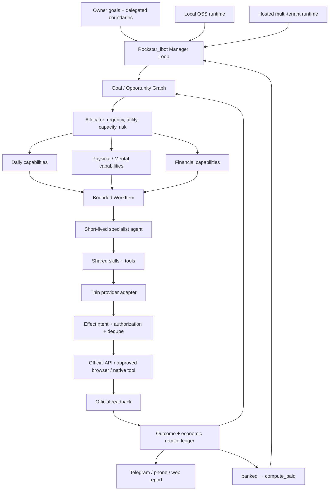

Coreが所有する最小entityは`Goal`、`Opportunity`、`CapabilityManifest`、`AuthorizationReceipt`、`WorkItem`、
`EffectIntent`、`OutcomeReceipt`、`EconomicReceipt`である。provider固有codeはdiscovery/transport/readback selectorだけを持ち、
goal選択、price/margin、state transition、retry、dedupe、receipt判定を持たない。

OSSは新しいframeworkを発明せず次の境界をreuse/copy+tweakする。導入前に固定commit、license、entrypoint、call graph、state、
error recovery、effect/readbackを実codeで再監査し、noticeを保持する。

| 外部実装 | 採用する境界 | 採用しないもの |
|---|---|---|
| DeepAgentsJS / LangGraph | specialist harness、checkpoint、bounded subagent pattern | Rockstar_ibotのbusiness stateやreceipt正本 |
| browser-use | modelが未知siteを視覚的に扱うbrowser-tool contract | provider permission、effect success判定 |
| OpenClaw | current local wake、channel、skill packaging | provider別の新しいdecision brain |
| OpenHands | `WorkerRuntime`のlocal/container/remote port pattern | framework全体の置換 |
| Stagehand | local/hostedでbrowser backendを差し替えるcontract | Upwork UI automationの許可根拠 |
| Steel | hosted browser backend、session isolation、health | local CloakBrowserの即時置換 |
| Temporal | durable resume/effect semanticsのreference | 計測前のTemporal server導入 |

#### Acceptance Criteria

1. Upworkが公式receipt付きで`API_APPROVED`、`API_INELIGIBLE`、`API_DENIED`、`SCOPE_INSUFFICIENT`の一つへ終端し、UI loopはOFFである。
2. startup-context、README、README.ja、`/lm`、root site、fundraising kit、active formでproduct/mission/tractionの矛盾が0である。
3. 一つのshared commerce state machineが、少なくともCoconalaと第二providerで同じreceipt schemaを使い、coreにsite名分岐を増やさない。
4. 成功funnelは`discovered → eligible → verified_application → buyer_reply → funded_contract → artifact_accepted → formal_delivery_readback → paid/withdrawable → banked → compute_paid`を区別する。
5. localとcloudが同じkernel contract suiteを通り、差分はruntime/browser/vault/scheduler/billing adapterだけである。
6. clean machineへ公開repoだけからinstallでき、private checkout、外部symlink、生credential、Dais固有pathが0である。
7. working Coconala loopは移行中も止めず、shared adapterで同等のofficial receiptとreplay-zeroを得てから旧ownerを退役する。

#### Atomic remaining TODO — この順序だけで進める

| # | ID | 状態 | 原子的完了条件 |
|---:|---|---|---|
| 1 | UPW-01 contain unauthorized UI runtime | DONE | Upwork labels/process/port ownerを停止し、外部effect 0をreadback |
| 2 | UPW-02 restore account access | DONE | 通常email/password login、Terms確認後にAccount Health=`Full Access`を公式画面でreadback |
| 3 | UPW-03 API eligibility preflight | DONE | official requirementsとaccount receiptを照合。identity unverified、new freelancer account、contract/earnings 0、JSS未観測により`API_INELIGIBLE` |
| 4 | UPW-04 exact action-scope inquiry | DONE | 既存Support caseへ6 actionを一度だけ質問し、Gmail sent messageを同一threadでreadback。公開evidenceはcase/message/threadをhash化 |
| 5 | UPW-05 API request or ineligibility receipt | DONE | 条件未達のためAPI formを送信せず、`docs/evidence/upwork/2026-08-26-api-terminal.json`へtruthful `API_INELIGIBLE`を保存 |
| 6 | UPW-06 terminal capability manifest | DONE | private 8 browser receiptsをwarning-bound `denied`へ置換。official API 8 actionは`unknown`、labels disabled、`:9233` listener 0 |
| 7 | CTX-01 merge current startup context | DONE | fixed commits `626d94f36` / `92dd73b07`から動的応募stateを除外して統合。version `2026-08-27.2`、digest `9fbe6198…5338`、kit 6 filesをreadback |
| 8 | CTX-02 claim provenance gate | DONE | mission/revenue/users/applications/AGIにsource/status/as_of/public_useを必須化。3 claim guardと19 testsでunsupported public artifactを拒否 |
| 9 | CTX-03 README convergence | DONE | 英日first abstractをproactive general agent/body-mind-money/real action/free OSS local/paid monthly cloudへ統一。self-fundingをFinancial Organへ統合し、README claim guard PASS |
| 10 | CTX-04 public `/lm` convergence | DONE | `anicca-products` PR #395をmain merge `b61301c15a9…`へ反映。GitHub Actions major outage中は既存Netlify CLI経路でverified-env preview `6a8f0e982a…`→prod `6a8f0f3723…`を実行し、復旧後canonical GHA run `32988269511`もSUCCESS。money-path smoke PASS、live `https://aniccaai.com/lm`はdesktop JA/mobile ENともHTTP 200・3 organs・Telegram/GitHub CTA・overflow 0、数値`?tg=`はGoogle onboardingへ分岐。Rockstar_ibot subsetも同期済み |
| 11 | CTX-05 root-site relationship | DONE | `anicca-products` PR #396をmain merge `7fe3f5f447…`へ反映。root hero/metadata/JSON-LDを`Anicca=mission/company`、`Rockstar_ibot=proactive general-agent product`、`Body/Mind/Money=3 organs`へ統一し、旧self-funding/AGI/UBI product sectionsをroot render pathから除外。contract 2/2、preview run `32989091020`、prod run `32989696892`、Netlify deploy `6a8f17a860…`、built-in money-path smoke/rollback gate PASS。live英日HTTP 200・title/CTA/3 organs・overflow 0 |
| 12 | CTX-06 generated-context drift gate | DONE | README英日、committed fundraising kit、active formのdigest契約はoffline 28/28 GREEN。公開Web PR #397はmain `b1ee7a1208…`へmergeし、preview `32990937574`、production `32991554504`、money-path smokeがSUCCESS。live product/repo/Telegram auditは3/3 GREEN。Security Scan run `32992553073`の`Startup context drift` job `98253497091`もSUCCESS |
| 13 | CTX-07 public live readback | DONE | isolated browserとHTTP/APIで`/lm`、英日root、public repo、英日README、Telegramをfresh readback。title、3 organs、Web/Telegram/GitHub CTA、version/digest、founder-attested約$1,000とMRR/ARR否定、banked境界、overflow 0を`docs/evidence/public-context/2026-08-27-public-context-readback.json`へ保存 |
| 14 | CTX-08A host gate recovery | IN_PROGRESS | PR #2895をmain `db03dd58a…`へmergeしimmutable release済み。既存untracked isolated context 2件だけをdisposeして2→0、natural Apply run 166 / exit 0 / ledger 0 / isolated 0でreplay-zero、保護対象保持を確認。既存disk-cleanup run 124もevaluated 0 / reclaimed 0。free 8,613,470,208 bytes、block present、Fundraiser run 273 / exit 75のため、残る一件は明示承認されたMac再起動→free `>=21,474,836,480`・block absent・required owner・Fundraiser natural wakeのreadback |
| 15 | CTX-08B official form capability readback | TODO | 既存Fundraiser ownerがASAC official formを一度だけ開き、current batch、締切、required fields、attachment、auth/CAPTCHA境界をreceipt化。送信effect 0 |
| 16 | CTX-08C digest-bound application preview | TODO | context `2026-08-27.2` / `9fbe6198…5338`、kit/deck、全回答、attachment hashを一つの`application_digest`へ固定し、unsupported claim・空required field 0を確認 |
| 17 | CTX-08D exactly-once accelerator submit | TODO | durable effect claim取得後、同じownerがofficial submitを一度だけ実行。timeout/unknownは再送せずofficial readbackでreconcile |
| 18 | CTX-08E terminal receipt and replay-zero | TODO | official completion PNG、Telegram photo message ID、application dossier SHA-256、ledger resultを同じdigest chainへ束ね、再wakeでexternal effect 0をreadbackしてCTX-08 DONE |
| 19 | GA-01 existing-core and OSS code map | TODO | 現行agent-runner/connector/gig/evidence/Agent Economyと上記OSSを固定commitで読み、copy/reuse/rejectとlicenseをcall graph付きで確定 |
| 20 | GA-02 one Goal / Opportunity Graph | TODO | body/mind/moneyのgoal、opportunity、dependency、deadline、outcomeを同じdurable graphで表現し、一つのmanager cursorが再開可能 |
| 21 | GA-03 capability registry | TODO | capability、provider、required authorization、cost、human requirement、transport、readbackをdata manifest化し、site名をcoreから除去 |
| 22 | GA-04 shared effect and receipt kernel | TODO | intent、pre-readback、single execution、unknown-effect reconciliation、post-readback、economic attributionを一つのstate machineへ統合 |
| 23 | GA-05 bounded specialist runtime | TODO | existing agent-runnerをWorkerRuntimeへ接続し、一仕事・step/time/cost limit・heartbeat/cancel・structured resultを共通化 |
| 24 | GA-06 allocator across organs | TODO | urgency、expected verified utility、capacity、risk、costでDaily/Care/Financialから次の一件を選び、starvation防止を実証 |
| 25 | GA-07 local/cloud adapter parity | TODO | same kernelをlocal processとhosted workerで実行し、browser/vault/scheduler adapter差替え以外のbranchを0にする |
| 26 | GA-08 self-funding economic loop | TODO | provider収益と全costをjobへ帰属し、`banked`残高内だけで`compute_paid`を発行。owner資金と混同しない |
| 27 | GA-09 migrate working Coconala lane | TODO | 現loopを停止せずshadow receipt→replay-zero→natural wake parity→owner切替の順でshared kernelへ載せる |
| 28 | GA-10 second-provider generality proof | TODO | provider-specific brainを追加せず第二providerでapplication→contract→delivery→bankedを一件閉じ、同じkernelへ学習を返す |
| 29 | GA-11 hosted product slice | TODO | phone/Telegram/Webだけでtenant onboarding、vault、scheduler、billing、worker isolation、receiptsを同じkernel上で一人分E2E実証 |
| 30 | GA-12 OSS clean-install release | TODO | public repoのfresh machine install、sample provider manifest、secret refs、local/cloud docs、license notices、reproducible acceptanceを公開 |
| 31 | GA-13 dependency retirement | TODO | profitable/open-core/Hermes等のruntime/config/symlink/import参照が0、replacementのnatural E2Eとrollback bundle取得後だけ旧dependencyを退役 |

Upworkは`API_INELIGIBLE / UI_AUTOMATION_DENIED / SUPPORT_SCOPE_PENDING`でclean terminalへ入った。
Support返信待ちは#7以降を止めない。後日API approvalまたはaction-level scope変更を受けた時だけ、exact evidence hashとexpiryを持つ
private receiptを追加し、GA-03のmanifest更新として同じshared kernelへ再参加させる。

#### Test Matrix — all OK required

| Case | 必須結果 |
|---|---|
| Upwork eligible / approved | approved scope以外OFF、credential混在0、rate limit内、公式API readbackあり |
| Upwork ineligible / denied / scope不足 | UI fallback 0、terminal reason/case receipt、汎用trackは継続 |
| provider effect前crash | retry可能、外部effect 0 |
| provider effect後ack loss | blind retry 0、reconciliationでofficial readback後だけterminal |
| duplicate wake / duplicate candidate | intent exact 1、application/delivery/payment duplicate 0 |
| human-only requirement | candidate reject、応募/契約/外部effect 0 |
| negative margin / capacity conflict | commitment 0、理由と次回観測を保存 |
| local / hosted | 同じfixtureとstate transition、adapter名だけが異なる |
| public context drift | build/CI fail、古いvalueを公開・応募へ出さない |
| Coconala migration | old loop継続、shadow parity、切替後replay-zero、rollback可能 |
| money | attempted/contracted/pendingをrevenueへ加算せず、bank/payout receiptだけbanked |
| compute | banked reserveを超える支出0、owner walletからの暗黙補填0 |

#### Boundaries / Non-goals

- Upworkの未承認UI automation、CloakBrowserを検出回避として使うこと、session cookie/API key混在を実装しない。
- 一つの巨大promptへ全責任を入れない。決定論coreとbounded specialistを分離する。
- providerごとの新しいplanner、ledger、scheduler、database、browserを作らない。
- working loopをbig-bang rewriteで置換・停止しない。shadow parityとrollbackを先に作る。
- modelの自己申告、local PASS、PID、Telegramだけで外部完了・収益をclaimしない。
- KYC、税務契約、bank登録、本人の声・身体・出席をagentが偽装しない。
- private credential、個人情報、provider dataをOSS、README、fundraising artifactへ複製しない。
- localとcloudでbusiness logicを二重実装しない。cloud固有なのはtenant isolation、vault、billing、scaleだけとする。

#### Execution Steps / slice size

各行を一つのsliceとして、spec/TODO更新→既存code reuse監査→必要最小変更→focused live verification→receipt→commit/pushの順で閉じる。
通常sliceはproduction 1〜2 files、test 1 file、合計100 LOC以内をsoft targetとし、超える場合は同じID内でeffect境界ごとに分割する。
正常系1本に加え、重複外部作用、金額誤り、data loss、secret漏洩を防ぐ最小regressionだけを持つ。内部objectの組合せ網羅は作らない。

#### E2E judgment

この設計自体はdocs-onlyでありruntime E2Eを発生させない。CTX-03〜05はpublic UI変更なので、unit snapshotだけで閉じず、desktop/mobileの
実browserでhero、CTA、Telegram deep link、cloud/local説明、claim sourceをreadbackする。iOS UIは変更しないためMaestroは不要。
GA-09〜11は実provider・実receipt・自然owner wake・replay-zeroが必須で、mock/dry-runは補助証拠にしかならない。

### 0.0 Connector growth contract — current SSOT

このsectionだけをConnectorの現在contract、実装順、完了条件の正本にする。後段の14日窓、daily/8-hour schedule、
AI・cryptoをsoft preferenceとして全分野を残す記述、旧rolling coverage、fallback provider拡張、C-CORE-01〜07は
完了済みbaselineまたは履歴であり、現在の実装判断を上書きしない。

Connectorの目的は、東京でRockstar_ibotを広められるeventと登壇機会を早く確保することである。
Calendarを無関係なeventで埋めること自体を成果にしない。

#### 0.0.1 Product contract

1. 一wakeは全Google Calendarのbusyを読み、今日を含む28日を対象にする。
2. primary sourceはLuma、次にconnpassとする。同一priorityならLumaを先にする。
3. 自動申込対象は東京または現実的に参加できる近郊の対面event、無料、受付中または補欠受付中、Calendar非衝突、
   semantic fitが`strong`または`moderate`の候補だけとする。`weak`、`unknown`、topic不一致は自動申込しない。
4. priorityは`YC/hackathon` → `open LT/CFP/demo/pitch` → `AI/agents/LLM` → `crypto/web3` →
   `startup/founder/VC/product/engineering`の順とし、登壇締切、定員、開催日の近さをtie-breakにする。
5. Lumaは既存guest registration pageをscript-firstで操作し、unknown required field、CAPTCHA、支払い、本人確認、
   effect unknownではfail closedにする。
6. connpass discoveryは公式API v2だけを使う。API keyがなければconnpass railだけをfail closedにし、Lumaを継続する。
   connpassの参加申込は公式write APIまたは書面による自動化許可が確認できるまで、正確な参加枠・LT枠・締切・URLを
   Telegramへ送り、provider上の確定操作を自動実行しない。
7. Peatix、Meetup、Doorkeeper、Eventbrite、TECH PLAY、KokuchProは実装を保持するが、Lumaとconnpassを尽くした後、
   同じtopic/quality gateを通る時だけfallbackにする。空き日を埋めるためにthresholdを下げない。
8. official scheduleはsingle launchd labelのhourly wakeとする。一wakeの新規external Submitはattendanceまたはtalkの
   どちらかexact 1件までとし、既存lock、10分deadline、effect-unknown stop、checkpoint、dedupeを維持する。
9. attendance registrationとtalk applicationは別stateで追跡する。LT/CFPの公開根拠、申込URL、締切が本文で検証できる時だけ
   Rockstar_ibot 5分talk packを作り、provider readbackなしに登壇確定と表示しない。
10. successはprovider official readback → event本体のGoogle Calendar exact 1件 → registration PNG/receipt →
    Telegram positive message/photo IDs → durable `applied_bundle`のchainが揃った時だけ成立する。
11. 適格候補がない時は、28日内の空き日、provider別観測件数、`weak/unknown/conflict/closed/paid`の不採用件数、
    次のhourly wakeをTelegramへ送る。Telegram送信自体はapplication successではない。
12. 実装は単一OSS Rockstar_ibot repositoryの既存Connector skillに置く。新しいcloud、agent、DB、scheduler、browser profile、
    provider crawlerを作らず、credential、identity、Calendar ID、mutable state、receiptはrepo外へ置く。

#### 0.0.2 Current measured gap

| surface | current measured behavior | required behavior |
|---|---|---|
| schedule | immutable release `b67966ec...`のnative owner exact 1、`StartInterval=3600`、canary exit 0 | 24回の自然hourly receiptで継続証明 |
| horizon | Calendar、Luma、connpassのactive primary pathはJST day 0〜27の28日 | 28日境界を維持 |
| profile | YC hackathon→open LT→AI→crypto→startup、`strong/moderate`だけがauto-apply eligible | live候補で品質gateを維持 |
| live ranking | provider-neutral rankingがactive minimal runnerに接続済み、large inventoryは3件chunk/並列3 | 10分wake内のterminalを維持 |
| LT | classifier、talk pack、独立transition store、one-effect budgetはactive pathに接続済み | 実open LTのtalk application receiptを1件完成 |
| provider result | Luma→connpassを尽くし、fallbackにも同じquality gateと160秒completion reserveを適用 | 実Luma bundleと次の自然wakeのreplay-zero |
| connpass | official API v2 discoveryのみ。自動申込許可は未回答のためTelegram manual boundary、provider Submit 0 | official responseを監視し、明示許可までSubmit 0 |
| evidence | ranking理由、topic class、LT状態、provider/Calendar/PNG/Telegram/bundle lineageは接続済み | live bundle・LT・24-hour soak receiptを追加 |

#### 0.0.3 Atomic TODO SSOT

以下を上から一件ずつ閉じる。各itemはRED、最小実装、focused GREEN、verification-before-completion、spec state、commit、pushを完了してから
次へ進む。実装中にofficial wakeを走らせず、schedule mutationは`CG-36`以降だけで行う。

##### A. Contract and semantic selection

- [x] **CG-00** このcurrent contractとatomic cursorを正本specへ固定する。
- [x] **CG-01** `event-preference-ranking.test.js`へ、YC/LT→AI→crypto→startup→weakのexact順序を要求するREDを追加する。
- [x] **CG-02** 同testへ、`weak`と`unknown`がverified rankingには残るがauto-apply eligibilityはfalseになるREDを追加する。
- [x] **CG-03** `event-preference-ranking.js`をprovider-neutral candidate snapshotへ拡張し、`priority_class`、`preference_fit`、
  `preference_reason`をstrict structured outputとして検証する。keyword fallbackは作らない。
- [x] **CG-04** `dais-local.json`の公開preferencesをTokyo対面、YC/LT、AI、crypto、startupのhard priorityへ更新し、
  secretまたは本人情報を追加しない。
- [x] **CG-05** `connector-minimal-production.js`で既存rankingをcandidate listへ接続し、model unavailable/invalid時は
  candidate Submit 0でそのproviderをsafe failureにする。
- [x] **CG-06** `connector-minimal-runner.test.js`へ、無関係candidateが先頭でもSubmit 0、次のstrong candidateだけが
  external effect exact 1になるRED→GREENを追加する。
- [x] **CG-07** `node --test apps/rockstar_ibot/lib/event-preference-ranking.test.js apps/rockstar_ibot/lib/connector-minimal-runner.test.js apps/rockstar_ibot/lib/connector-minimal-production.test.js`をPASSさせ、semantic selection sliceをcommit/pushする。

##### B. Twenty-eight-day horizon

- [x] **CG-08** `connector-minimal-production.test.js`へCalendar `timeMax`がJSTの開始日+28日00:00になるREDを追加する。
- [x] **CG-09** `connector-minimal-production.js`のCalendar FreeBusy horizonを14から28へ変更する。
- [x] **CG-10** `connector-luma-workflow.test.js`へ今日を含むday 0〜27を受理しday 28を除外するREDを追加する。
- [x] **CG-11** `connector-luma-workflow.js`のcandidate windowを28日へ変更する。
- [x] **CG-12** `connector-connpass-workflow.test.js`へ同じday 0〜27/day 28境界REDを追加する。
- [x] **CG-13** `connector-connpass-workflow.js`のcandidate windowを28日へ変更する。
- [x] **CG-14** DSTのない`Asia/Tokyo`で28個のlocal dateが重複せず、Calendar/Luma/connpassのend-exclusive境界が一致するregressionを追加する。
- [x] **CG-15** three focused workflow testsをPASSさせ、28-day sliceをcommit/pushする。

##### C. Primary-first and quality-preserving fallback

- [x] **CG-16** `connector-minimal-runner.test.js`へ、Luma eligible→終了、Luma exhausted→connpass、両primary exhausted→fallbackの順序REDを追加する。
- [x] **CG-17** fallback candidateにも`strong/moderate` gateを適用し、Peatix等の`weak/unknown`はSubmit 0にする。
- [x] **CG-18** `connector-coverage-telegram.test.js`へ、適格候補0の時に28日空き日と不採用class別countを出すREDを追加する。
- [x] **CG-19** `connector-coverage-telegram.js`から旧21日/14日文面と「空き=失敗」の表現を外し、28日・quality-preserving no-effectを報告する。
- [x] **CG-20** runner、coverage Telegram、ticket Telegramのfocused testsをPASSさせ、fallback/report sliceをcommit/pushする。

##### D. connpass official-source boundary

- [x] **CG-21** private credential SSOTを値を出力せず確認し、connpass API keyがなければ公式individual/community API利用申請を行い、取得後ただちにrepo外SSOTへ0600で保存する。
- [x] **CG-22** `load-connector-env.test.js`へconnpass API key referenceのaccept/rejectとerror/logへの値非露出REDを追加する。
- [x] **CG-23** `load-connector-env.js`と`native-pass.js`からAPI keyをverified production dependencyへ一度だけ渡す。
- [x] **CG-24** `connpass-api-client.test.js`で`X-API-Key`、`prefecture=tokyo`、28日分`ymd`、pagination、429、1req/sec以下を検証する。既存5秒間隔は安全側として保持してよい。
- [x] **CG-25** `connector-connpass-workflow.js`のdiscoveryを既存`connpass-api-client.js`へ切り替え、active pathからcalendar page scrapingを外す。
- [x] **CG-26** source scan regressionでactive connpass discoveryが`/api/v2/events/`以外へautomated list/detail accessしないことを検証する。
- [x] **CG-27** connpass candidateでは参加枠、LT枠、補欠、締切、canonical URLをTelegram action receiptへ正規化し、provider permission未確認時のSubmitを0にする。
- [ ] **CG-28** providerへ自動参加操作の許可範囲を問い合わせ、official response receiptを保存する。許可されたmethodだけを後続実装し、許可がなければTelegram action boundaryをfinal behaviorとする。問い合わせ送信receiptは `docs/evidence/outbound/2026-08-27-connpass-automation-permission-inquiry.json`、official responseはpending。
- [x] **CG-29** API keyを使うread-only live canaryでTokyo 28日inventoryを取得し、API audit、secret非露出、Luma continuationをreadbackしてcommit/pushする。

##### E. Lightning Talk application

- [x] **CG-30** `event-talk-opportunity.test.js`へ、公開LT/CFP/demo/pitchだけがopen opportunityとなり、closed/invite-only/本文にないURLはfalseになるregressionを固定する。
- [x] **CG-31** `connector-minimal-production.js`でverified candidate detailを`inferEventTalkOpportunity`へ渡し、open talkを同topic内の最上位へ上げる。
- [x] **CG-32** `grounded-talk-pack.test.js`へRockstar_ibotのverified factsだけから5分title/abstract/outline/bioを生成し、未検証claimを拒否するregressionを固定する。
- [x] **CG-33** 既存talk transition storeへ`discovered → application_ready → submitted → provider_verified → accepted/rejected`を保存し、attendance stateと混ぜない。
- [x] **CG-34** 一wakeのeffect budgetでtalk Submitを優先する時はattendanceを次wakeへ残し、両方を同時Submitしない。
- [x] **CG-35** talk URL上のordinary verified fieldsだけを入力し、payment/CAPTCHA/本人確認/unknown required fieldでは`human_action_required`、official readbackなしでは`submitted`より先へ進めない。
- [x] **CG-36** talk classifier、grounded pack、transition store、minimal productionのfocused testsをPASSさせ、LT sliceをcommit/pushする。

##### F. Hourly owner and evidence UX

- [x] **CG-37** `minimal-production-contract.test.js`を`StartInterval=3600`、`StartCalendarInterval`なし、label exact 1へRED更新する。
- [x] **CG-38** `ai.anicca.rockstar_ibot-connector-native.plist.template`だけをhourlyへ変更し、RunAtLoad、KeepAlive、second labelを追加しない。
- [x] **CG-39** ranking reason、priority class、LT state/deadlineを`connector-native-write-pipeline`の既存bundle lineageへ追加し、secret/raw prompt/bodyを保存しない。
- [x] **CG-40** ticket/coverage Telegramへ「なぜ選んだか」「LT open/submitted/verified」「28日空き」を追加し、provider message IDなしをsuccessにしない。
- [x] **CG-41** Connector full focused suite、shell syntax、plist render/lint、secret/PII scanをPASSさせ、hourly/evidence sliceをcommit/pushする。

##### G. Production acceptance and OSS finish

- [x] **CG-42** `git fetch`後のclean integration commitで全変更をcanonical `main`へnon-force統合し、remote ancestryとimmutable release bytesを確認する。
- [x] **CG-43** `bin/launchctl-safe`だけでnative plistをrender/install/reloadし、loaded args、`StartInterval=3600`、native owner exact 1、legacy owner 0、process/lock 0をreadbackする。BrowserとConnectorは互いのcleanupでreleaseを失わないper-loop current rootを使う。Release/install receiptは `docs/evidence/outbound/2026-08-27-connector-hourly-release-install.json`。
- [ ] **CG-44** existing labelをexact 1回kickstartし、本物のLuma `strong/moderate`候補一件でprovider readback→Calendar exact 1→PNG/receipt→Telegram IDs→bundleを完成する。旧releaseの安全停止とGemini schema修復後のLuma/connpass成功・適格候補0 canaryは `docs/evidence/outbound/2026-08-27-connector-owned-release-canary.json` と `docs/evidence/outbound/2026-08-27-connector-ranking-recovery-canary.json` に保存し、外部作用acceptanceには数えない。
- [ ] **CG-45** 次の自然hourly wakeで同eventのSubmit 0、Calendar 1、bundle reuse、別candidateへのcontinuationを確認する。
- [x] **CG-46** connpass API live inventoryとaction boundaryをnatural owner wakeで確認する。wake `wake-a27f9e8bba85c87d84dda625`はranking 589,180ms後にboundaryを22,561msで成功し、candidate snapshot `433b9497...`、Telegram provider ID `36655`をmode-0600 immutable receiptへexact 1件保存した。Connpass Submitはpermission未確認のため0。wake reportはdeadlineを正しく`circuit_open / wake_deadline`、positive Telegram ID `36656`として報告した。provider permissionが得られた場合だけ許可methodの実申込bundleを別TODOとして追加する。
- [ ] **CG-47** open LT候補でtalk application receiptを一件完成し、attendance/talkの各state、Calendar、Telegramを独立readbackする。
- [ ] **CG-48** 24回の連続hourly receiptでduplicate Submit 0、concurrent owner 0、effect unknownの自動再送0、owned page/lock cleanupを確認する。
- [x] **CG-49** public sample profile、Connector README/SKILL、install/uninstall手順を28日・hourly・Luma/connpass・LT・permission boundaryへ同期する。
- [x] **CG-50** secretなしの隔離homeでinstall→render→focused no-effect wake→uninstallを再現し、private state/receiptをpackageしないことを確認する。
- [ ] **CG-51** final spec state、test/effect receipts、known provider limitsを更新し、commit/push、remote readback、Telegram milestoneでConnector growth sliceをDONEにする。

#### 0.0.4 Runtime flow

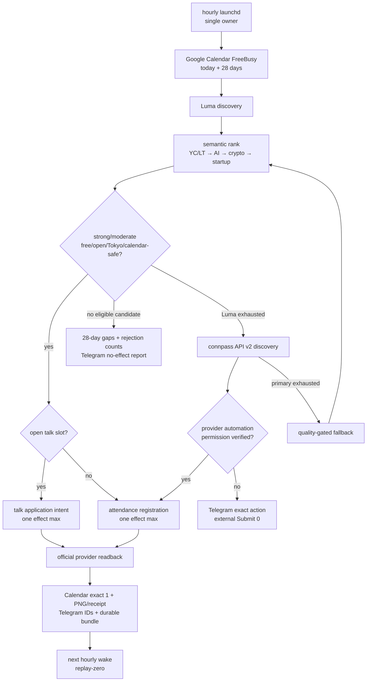

#### 0.0.5 Official-source constraints

- connpass API v2 — https://connpass.com/about/api/v2/ — 「すべてのAPIエンドポイントでは、APIキーによる認証が必須」「1秒間に1リクエストまで」。
- connpass API v2 / 利用規約 — https://connpass.com/about/api/v2/ / https://connpass.com/term/ —
  「提供されているAPI以外の手段…で…クローリング、スクレイピング、その他のアクセス」を禁止する。
- connpass参加方法 — https://help.connpass.com/participants/event-join — 「1イベントにつき1枠しか参加できません」。
- Luma registration process — https://help.luma.com/p/event-registration-process — “The name and email are required”で、追加質問、支払い、approvalがあり得る。
- Google Calendar Freebusy — https://developers.google.com/workspace/calendar/api/v3/reference/freebusy/query —
  “Returns free/busy information for a set of calendars.”。候補選定前に全対象calendarを読む。

### 0.1 Rockstar_ibotの成果義務

Rockstar_ibotは「検索した」「分析した」「失敗した」と報告するsystemではない。userが理想の自分へ
近づく**次の現実行動を成立させるsystem**である。

| organ / loop | 内部作業ではなく要求する現実成果 |
|---|---|
| Connector | → `0.0 Connector growth contract`。Luma、次にconnpassをprimaryとして28日窓を探索し、Tokyo×YC/LT/AI/crypto/startupの適格eventを確保する |
| LT | 登壇応募、登壇、Rockstar_ibot demo、参加者との接点 |
| Fundraising | 実提出、返信、面談、採択、資金とpeer group |
| Job Hunter | 実応募、返信、面接、offer、給与改善 |
| Financial Organ | 口座把握、支出改善、収入増加、risk管理、長期資産形成 |

「no action」が安全上正しい場面はある。たとえばrisk条件を満たさないcrypto取引は実行しない。
その場合も、何もせず閉じるのではなく、停止理由、次の観測、改善案、次回判断時刻という現実の
次行動を残す。Connectorでは現行28日窓の設定済みproviderをquality gate付きで尽くした`completed_no_effect`は、故障ではなく
外部write 0の健康なterminal resultとして報告する。実装acceptanceと現在の運用healthは分けて判定し、
コードが完了していてもschedule owner、browser dependency、legacy owner、live bundleが未検証ならActive TODOへ戻す。

#### 0.1.1 Connector previous product contract（HISTORY → `0.0`）

> このsectionは旧14日・soft preference contractの履歴であり、current実装には使わない。

ConnectorはDaisがevent参加機会を増やすためのlocal event application loopであり、「会うべき人」を予測するsystemではない。
AI・crypto・startup・engineeringは候補の**soft preference**として順位を上げてよいが、topic不一致を理由に無料・受付中・
Calendar非衝突のeventを除外しない。異分野を含む参加可能なeventを候補として残し、未知の参加者属性や成果を推測しない。

provider優先順位と責任境界は次で固定する。

1. primary discoveryはLuma、次にConnpass。この2 providerを先に尽くす。
2. Peatix、Meetup、Doorkeeper、Eventbrite、TECH PLAY、KokuchProはfallback railとして既存実装を保持する。
3. verified registration後、ConnectorがGoogle Calendarへ作るのは**event本体1件だけ**。移動時間、前後buffer、経路、Calendar enrichmentは作らない。
4. Telegramへevent、日時、場所、event URL、Calendar URL、official evidenceを送る。official ticket/QRが取得できるproviderではQRも送る。QRがないproviderでは検証済みregistration page画像または同等receiptを送る。
5. schedule、browser ownership、探索、申込、official readback、Calendar event write、Telegram delivery、durable receiptまでをConnectorの完了chainにする。
6. local official entrypointは`skills/connector/run.sh`とし、agent/loopは同じCLI/skillを起動する。別のad-hoc executorを作らない。

非目標は、全世界のevent siteを網羅する汎用web crawler、特定人物とのmeeting保証、移動時間の計算・Calendar登録、
Rockstar_ibot Web AppのCalendar enrichment、cloud/multi-user化である。これらはConnector core acceptanceへ混ぜない。
このsectionと旧`0.2.1`〜`0.2.3`は履歴である。現在のscopeと完了条件は`0.0`だけを使う。

### 0.2 Previous Connector recovery baseline（HISTORY → `0.0`）

> このsectionのcurrent表現、14日窓、schedule、C-CORE順序は当時のbaselineであり、現在の実装には使わない。

Connectorのコード正本はcanonical repositoryの`main`である。2026-08-16のscope再監査では
Connector SSOT merge `50f4adca8`から監査base `5b617eb54`までConnector production pathの変更は0で、production native plistは
`/Users/operator/Projects/rockstar_ibot-main/skills/connector/run.sh`を参照する。
`O1A-01〜06`と`O1B-01〜24`は実装・実測・証拠化・push済み。
過去の21日coverage証拠（2026-08-02の`open=18 / covered_existing=0 / covered_new=1 / unavailable=2`を含む）は履歴であり、
現行runnerの14日acceptance窓・現在値・完了条件ではない。現在値はnative passが実Calendarとproviderを再読取して保存するsnapshotだけを採用する。

現在の実装状態（canonical `main`はcleanかつremote-synced）:

| 観測 | 現在の事実 | target / 境界 |
|---|---|---|
| branch / owner | canonical `main`のConnector監査anchorは`50f4adca8`、scope再監査baseは`5b617eb54`。native plistもmain checkoutを参照 | 両anchor間のConnector production path変更0。旧integration worktree依存はnative pathから除去済み |
| production providers | `skills/connector/native-pass.js`の設定済み順序はLuma → Connpass → Peatix → Meetup → Doorkeeper → Eventbrite → TECH PLAY → KokuchPro | LumaとConnpassがprimary、残りはfallback。同じowned pageで前進し、別browser/sessionを作らない |
| acceptance窓 | 今日を含む14日、無料・受付中・Calendar非衝突だけを申込対象にする | 旧rolling-21は履歴/長期目標で、現行runtime/gateではない |
| agent / evidence境界 | 候補gateは決定論的。unknown UI時だけbounded model action proposerをprovider別step上限内で使う。click成功だけをcompletionにせずofficial parent/child readbackを必須化 | 実bundleはLuma 2、Connpass 1、Peatix 11。Meetup・Doorkeeper・Eventbrite・TECH PLAY・KokuchProはfirst live bundle未証明 |
| latest verified wake | `wake-d7fc192bd446f613acd15b02`: `applied_bundle / peatix / registered / failure 0` | Calendar readback、PNG SHA-256、Telegram message `20545`・photo `20546`・wake report `20549`、bundle 14件目を同一chainで確認 |
| current provider inventory | 同wakeでLuma `35/35/29/17/1`、Connpass `5/5/5/3/0`、Peatix `100/100/86/60/11`。直前wakeではMeetup `14/12/11/1/0`、Doorkeeper `150/13/5/0/0`、Eventbrite `200/0/0/0/0`、TECH PLAY `50/22/1/1/1` | 数値は各providerの`observed or discovered / normalized or within-window / window or eligible / free-open or calendar-free / calendar-free or selected`のschema順。provider間でfield名が異なるため意味を混同しない |
| current scope drift | Calendar writeはevent本体だけだが、`connector-native-runtime.js`は候補gateで`createConnectorRouteMinutes`、`homeLocation`、`routeMinutes`をまだ要求する | Connector coreからtravel dependencyを削除し、Calendar busy conflictだけをeligibilityへ残すまでcurrent contractと実装は不一致 |
| lifecycle / lock | native labelはmain checkout、09:00 daily、not running、10:35 reload後runs 0 / never exited。process 0、lockなし | 最新Peatix wakeは10:42でlaunchd runs 0のためforeground証拠。reload後の自然09:00 wakeは未観測 |
| runtime drift | healthcheckとHealerがloadedだが削除済み`connector-native-completion` worktreeを参照しlast exit `EX_CONFIG`。retire済みhost bridgeもloaded/running。Connector用CloakBrowser `:9222`はlistener 0 | native以外の旧ownerをunloadし、`:9222`の正規ownerを復旧するまでscheduled readinessをPASSにしない。Gig `:9223`は別ownerでDO NOT TOUCH |
| TODO境界 | 実装Items1〜18・20〜23/23Fは完了。Active remainingは下記7件のConnector coreだけ | fallback providerのlive proofと過去のmilestone checkboxは現在の実行順に使わない |

#### 0.2.1 Previous Active TODO SSOT（HISTORY → `0.0.3`）

この表だけをConnector coreの現在TODOと順序の正本にする。core completionはLuma/Connpass優先loop、Calendar event本体、
Telegram evidence、local scheduleの復旧で判定する。fallback providerのfirst-live proofはcore blockerにしない。

**2026-08-17現在: C-CORE-01〜07は全てDONE。** scheduleはDaisの指示で毎日09:00の1回から**8時間毎の1日3回（09:00 / 17:00 / 01:00 JST）**へ変更済み。

| 順序 | ID | 状態 | 完了条件 |
|---:|---|---|---|
| 1 | C-CORE-01 single-owner cleanup | DONE 2026-08-16（証拠は`docs/superpowers/plans/2026-08-16-connector-core-recovery-execution-notes.md`。unload後にnativeだけloaded、`EX_CONFIG` 0件、`18793` listener 0、plist 7件とstate 27件を保持、Gig `9223`無変更） | 壊れたhealthcheck・Healer・retired host bridgeだけをunloadし、nativeだけloaded。削除済みworktree参照、`EX_CONFIG`、port `18793` consumerを0にする。plist/stateは削除しない |
| 2 | C-CORE-02 browser readiness | DONE 2026-08-16（`9222`= UUID `c97821e3`で到達、Gig `9223`= UUID `75a81661`は無変更、guard collisions 0、lease下でpage inventory 4 targetをreadbackし解放。Connectorがendpointをhardcodeしlease非取得である点は執行notesに記録） | Connector専用CloakBrowser daily-driver `127.0.0.1:9222`の正規ownerを復旧し、Gig `:9223`や他profileを変更せずhealth endpointとpage inventoryをreadbackする |
| 3 | C-CORE-03 remove travel dependency | DONE 2026-08-16（travel gateを`calendar-candidate-gate.js`から除去、dead moduleの`connector-native-runtime.js`と`connector-route-minutes.js`を削除、`connector-no-travel.test.js`をregressionとして追加、`0.2.6`のTelegram driftを是正。証拠と、specが名指した実装が実はlive path外だった件は執行notes参照） | `connector-native-runtime.js`のcandidate eligibilityから`createConnectorRouteMinutes`、`homeLocation`、`routeMinutes`依存を除去し、無料・受付中・東京・14日内・Google Calendar busy非衝突だけをgateにする。Connectorがroute APIやtravel Calendar writeを呼ばないregressionを残す。あわせて`0.2.6`の実測driftどおりuser-facing Telegram文面を14日窓・移動時間非言及・provider非決め打ちへ合わせる |
| 4 | C-CORE-04 canonical primary-first wake | DONE 2026-08-16（PR #2819 merge後にnative labelをexact 1回kickstart。runs 1、Luma→Connpass→Peatixの順序をaudit timestampで実証、terminalは`circuit_open`/`peatix_form_navigation_failed`、bundle 14件のまま外部write 0、wake report Telegram id `21274`、lockとowned page解放） | native labelをexact 1回supervised kickstartし、Luma→Connpass→fallbackの順序、main entrypoint、session/target各1、terminal report、process/lock/owned-page cleanup、exit contractを実測する |
| 5 | C-CORE-05 Luma current-runtime E2E | DONE 2026-08-17（live loopでapplied_bundle 2件。8/18 皇居ラン=Calendar `jlcv9apqtn51rbpi5k4857jr18`/Telegram `21446`+`21447`、8/20 Yarn and Yap=Calendar `pfmv6pi9uf7knjv2trpoa0tbhk`/Telegram `21452`+`21454`。いずれもgogで独立readbackしexact 1件を確認。真因はLumaログアウト・旧travelブロック19件・`page.setContent`のCDPハングの3つで全て修正済み。旧記載: BLOCKED_EXTERNAL 2026-08-16（observed 39 / window 33 / free-open 16 / calendar-free 0。実busy inventoryはcalendar 5本・timed 103件で、18:00-22:00 JSTの空きは08-25と08-28だけ。gate欠陥ではなくDaisの予定が実際に埋まっている。owner=毎日09:00のnative label、再開条件=空き夕方に無料・受付中のLuma候補が出た時、次回確認=次の自然09:00 wake） | Daisの既存Luma accountで無料・受付中・Calendar非衝突候補を実申込し、official readback→official QRがあればticket delivery→Calendar event本体exact 1→Telegram positive IDs→`applied_bundle`をcurrent main/runtimeで再証明する |
| 6 | C-CORE-06 Connpass current-runtime E2E | DONE 2026-08-17（live loopで実申込が成立し、`connpass-event://event/398207`＝8/25 19:00-22:00「プログラミング&ITなんでも勉強部屋」をCalendar `05subh7mj519f7f0erjgil814g`へexact 1件、Telegram `22138`+`22139`、applied_bundle。真因はconnpassログアウト・参加費文言の不一致・auditのcount上限500・join formを完了していなかった事・確定後のreadbackを完了ページで行っていた事の5つ。旧記載: IN_PROGRESS 2026-08-16（日付がtooltip内`display:none`で`innerText`が読めず6/1457しか観測できていなかった欠陥は修正。以後は実volumeでdiscoveryごと失敗し、`provider: connpass` / `safe_reason: provider_discovery_failed`まで永続化できた。原因codeは未特定。per-row skip対応はLumaを回帰させたためrevert済み。次手=wake外でConnpass discoveryを再現し実errorを読む） 旧記載: BLOCKED_BY_DISCOVERY_DEFECT 2026-08-16（同wakeでobserved 6。同じdiscovery pageをread-only crawlすると`connpass.com/event/<id>`が1457件露出しており、runtimeは約0.4%しか観測できていない。外部要因ではなく`connector-connpass-workflow.js`のbinding収集の欠陥。修正するまでBLOCKED_EXTERNALとは呼べない） | Daisの既存Connpass accountで無料・受付中・Calendar非衝突候補を実申込し、official readback→Calendar event本体exact 1→Telegram registration evidence positive IDs→`applied_bundle`をcurrent main/runtimeで再証明する |
| 7 | C-CORE-07 natural schedule recovery | DONE 2026-08-17（強制なしの09:00 JST wakeが`2026-08-17T00:01:32Z`に`applied_bundle`・failure 0で完了。native labelのみloaded、last exit code 0、wake report Telegram id `21820`） | cleanup後の次の自然09:00 wake、または同等のMac login/reload recoveryでnative ownerだけがruns +1となり、primary-first discovery、健康な`applied_bundle`または`completed_no_effect`、Telegram receipt、cleanupを残す |

既存fallback railは削除しないが、Meetup・Doorkeeper・Eventbrite・TECH PLAY・KokuchProのfirst-live proofや機能拡張は
`DEFERRED_NON_BLOCKING`とし、上の7件を閉じる途中へ入れない。Peatixの既存live bundleはfallback chainの証拠として保持する。

#### 0.2.2 Previous Connector ideal loop（HISTORY → `0.0.4`）

理想形は「schedule」「browser dependency」「application workflow」「observer」を分離し、外部write ownerはnative workflow一つだけにする。
observerはread-onlyで、production stateやbrowserを直接修復しない。修復が必要なら再現証拠とbranchを作り、同じnative ownerで再検証する。

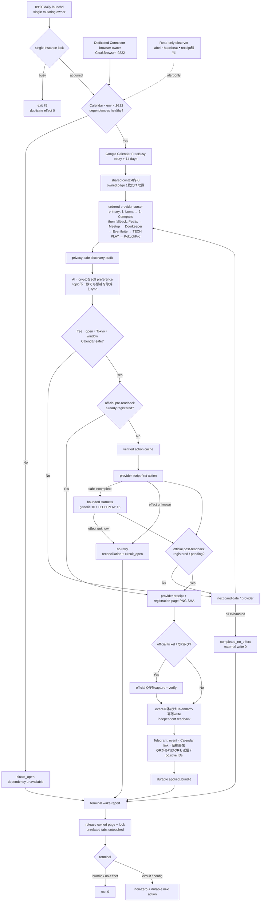

外部原則:

- Temporal Workflow Execution — https://docs.temporal.io/workflow-execution — “picks up where the last recorded event occurred”。Connectorも外部effect前後のcheckpointから再開し、process restartで二重作用を作らない。
- Google Calendar Freebusy — https://developers.google.com/workspace/calendar/api/v3/reference/freebusy/query — “Returns free/busy information for a set of calendars.”。候補選定前に全対象calendarのbusy intervalを読む。
- Playwright Pages — https://playwright.dev/docs/pages — “A Page refers to a single tab or a popup window”。一wakeはowned page一枚を使い、共有contextの無関係pageを閉じない。

#### Connector architecture — 現行productionと未完境界

実線は現在official entrypointから到達する経路、灰色はacceptance後にだけ有効化する経路である。
ConnectorはLuma専用agentではなく、同じowned browser pageでproviderを順番に尽くすevent application agentである。
ただし「providerを探索できる」と「実申込の証拠bundleを完成できる」は別contractであり、後者をlive実証するまで
production supportedと表示しない。

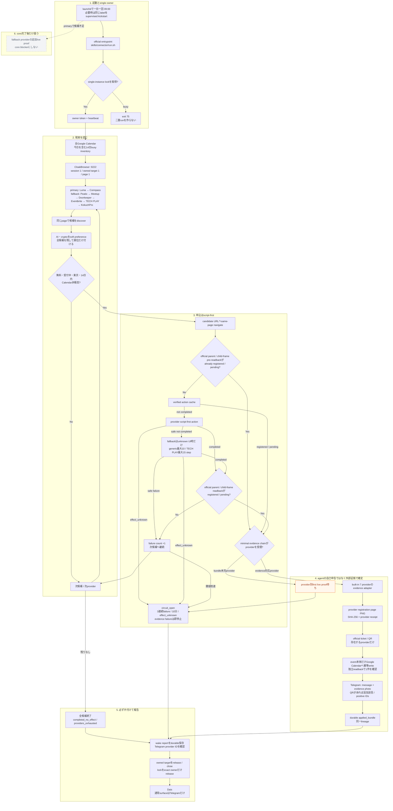

現行の`providers_exhausted`は、上図の設定済み8 providerをそのwakeで尽くしたという意味だけであり、
東京または世界中のevent siteを検索し終えたという意味ではない。Item20のunknown-provider contractはKokuchProでaccepted済みで、
今後のsite追加も同じsafe discovery→readback→cache contractを使う。

`O1C-00 Rockstar_ibot startup context正本化`は2026-08-02に実装・監査・pushまで完了した。
現在の実装優先は、保持していたConnectorの再開位置`O1B-25`である。残作業は、途中へ別trackを混ぜず
次の順序で進める。

```text
完了: O1B-20〜24 source handoff、候補継続、Calendar・移動時間・支出gate
完了: O1C-00 Rockstar_ibot startup context正本化（旧Anicca product提出防止）
いま: Connector coreをC-CORE-01→07で閉じる。travel dependencyを除去し、Luma/Connpass優先、Calendar event本体、Telegram evidence、local scheduleだけをacceptanceにする
  → O1C-01〜27 Fundraising / acceleratorの探索・提出・返信・面談追跡
  → O2-01〜12 Job Hunterの統合・実応募・返信・面接追跡
  → O3A-01〜07 壊れたCFO runtime loopを復旧
  → O3B-01〜24 Moneytree / Binance / walletを統一財務台帳へ接続しCFOを完成
  → O4-01〜16 Cryptoをpaper→小額canary→risk制御付き運用へ進める
  → O5-01〜14 Fiat / NISAを生活防衛資金・制度・risk制約付きで接続
local版完成gate:
  上記のOrder 1〜5がMac miniで連続稼働し、Telegram報告と証拠が揃う
  → その後にだけOW-01〜12を開始し、同じcoreをDais以外のpilotへ展開
```

#### 0.2.3 Previous Connector UX contract（HISTORY → `0.0.1` / `0.0.4`）

Connectorを作る目的は、Daisへagentの管理、tool選択、失敗logの読解、再実行をさせないことである。
通常時にDaisが見るsurfaceはTelegramだけとし、Rockstar_ibotはMac mini上で探索から検証まで継続する。
本人しか完了できないOAuth、CAPTCHA、本人確認、または設計外の支出だけを、具体的な一操作として通知する。
その操作後は同じcontinuationから自動再開し、「再実行してください」と返さない。

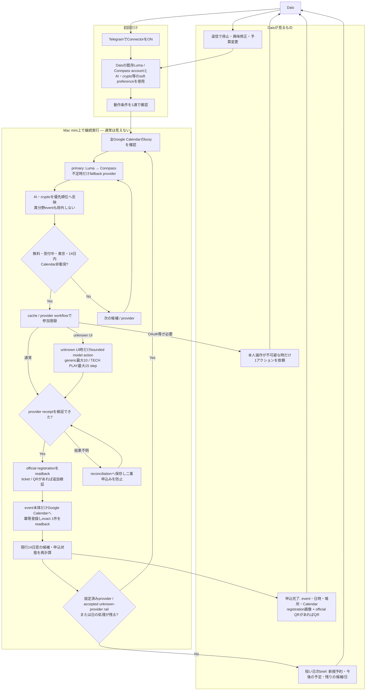

Telegramの予約完了messageは、少なくともevent名、日時、場所、選定理由、event URL、Calendar URL、
検証済みregistration page画像または同等provider receiptを含み、official ticket/QRが存在する時だけQRも送る。receiptが検証できない登録、Calendar readbackが無い登録、
Telegram provider message IDが無い送信を成功として表示しない。全wakeは`applied / continuing / recovering`を必ず報告し、週次rollupも
成功0件を含め必ず報告する。報告は内部stack traceを見せず、成立した現実結果、安全なfailure class、未処理日数、次の自動actionを伝える。
Connectorは移動時間、前後buffer、経路を計算・作成せず、Calendarにはevent本体だけを書く。旧rolling-21 coverageは履歴および長期目標として保持するが、現行14日runnerのuser-facing acceptanceまたはgateではない。Peatix、Meetup、Doorkeeper、Eventbrite、TECH PLAY、KokuchProはfallback railとして表示し、実bundle未証明providerはその状態も同時に表示する。

#### 0.2.4 Connector previous TODO reference（HISTORY → `0.0.3`）

実行順の唯一の正本は`0.0.3 Atomic TODO SSOT`である。この旧参照とC-CORE-01〜07は履歴であり、
current TODOを上書きしない。live acceptanceは対話中のCodexや臨時scriptではなく、official native entrypointの
provider/Calendar/Telegram/durable bundle receiptでのみ閉じる。

#### 0.2.5 Connector code layout SSOT — 一箇所に畳む

Connectorは「skillをloopが回す」構造にする。loop（launchd）はscheduleとsingle ownerだけを持ち、
仕事の中身は全部skill側に置く。同じ形をgig-work、earn、video、youtube-channel-creatorなど他skillと共有し、
利用者は「skillを1つ選んでloopに載せる」だけで済ませる。OSS利用者にも同じ配置を配る。

canonical repositoryは`github.com/Daisuke134/life-manager`だけであり、local canonical checkoutは
`/Users/operator/Projects/rockstar_ibot-main`である。Connector実装を別repository、別home、別ad-hoc directoryへ置かない。

```text
rockstar_ibot/
├── skills/                       # skillのSSOT。1 skill = 1 directory = 1 CLI
│   ├── registry.json             # skill slotのSSOT
│   ├── connector/                # ★ event application skill
│   │   ├── run.sh                # official entrypoint。loopもagentもこれだけを起動する
│   │   ├── native-pass.js        # 1 wakeの本体
│   │   ├── healthcheck.sh / healer-shadow.sh
│   │   ├── lib/                  # lock・env・heartbeat・outbox
│   │   └── test/
│   ├── gig-work/ earn/ video/ youtube-channel-creator/ social/ report/ ...
│   └── _shared/
├── apps/rockstar_ibot/lib/        # connector-*.js（provider workflow・Calendar・Telegram・evidence）
├── apps/rockstar_ibot/scripts/    # host bridge・deploy補助
├── deploy/local/                 # local compose定義
└── docs/superpowers/specs/       # spec正本
```

現状の実測では、Connector production logicは`skills/connector/`（薄いentrypoint）と
`apps/rockstar_ibot/lib/connector-*.js`（production 41 file）へ分かれている。
最終形は1 skillのcode・test・docを`skills/connector/`配下へ寄せ、`apps/rockstar_ibot`側には
skillに依存しない共有基盤だけを残すことである。ただしこのlayout統合は`C-CORE-01`〜`C-CORE-07`のscope外の
`DEFERRED_NON_BLOCKING`とし、coreを閉じる途中でfile移動を混ぜない。移動時はentrypoint path、launchd plist、
`registry.json`、test pathを同一commitで更新し、`skills/connector/run.sh`というofficial entrypoint pathは変えない。

#### 0.2.6 Previous Telegram delivery contract（HISTORY → `0.0.1` / `0.0.3`）

DaisがConnectorの成果を知る唯一の通常surfaceはTelegramである。Google CalendarやProvider管理画面を
自分で開かなくても、届いたmessageだけで「何が予約できたか」「次に何が起きるか」が分かる状態をuser-facing acceptanceにする。
mail通知はTelegramの代替として同じ内容を送る将来optionであり、現行coreの完了条件には含めない。

送るmessageは次の3種類だけとする。

| 種類 | 実装 | 内容 |
|---|---|---|
| 申込完了（photo + caption） | `apps/rockstar_ibot/lib/connector-ticket-telegram.js` | event名、日時、場所、申込者、選定理由、確認receipt、Calendar登録済み表示、event URL、Calendar URL。official QRを出すproviderではQR画像、無いproviderは検証済みregistration page画像 |
| 期間brief | `apps/rockstar_ibot/lib/connector-coverage-telegram.js` | 対象期間、既存の対面予定、Connectorが新規予約した日数、追加不可、未処理の空き、新規予約eventの明細、Calendar link |
| 本人操作依頼 | outbound guardian経由 | OAuth・CAPTCHA・本人確認など本人しか完了できない一操作だけ。完了後は同じcontinuationから自動再開する |

いずれもprovider message IDがpositiveでなければ成功として扱わない。Telegram本文にstack trace、内部runner語彙、
secretを出さない（`connector-coverage-telegram.js`は`runner`/`bounded`混入とsecret語をrejectする）。

2026-08-16の実測で、user-facing文面が`0.1.1`のcurrent contractに未追従である。以下は`C-CORE-03`で
実装をcontractへ合わせる対象とし、新規itemを増やさない。

| drift | 実測箇所 | contract上の正 |
|---|---|---|
| 期間が21日固定 | `connector-coverage-telegram.js`が`horizon_days !== 21`をinvalidにし、本文へ「今後3週間」と書く | 現行acceptance窓は今日を含む14日 |
| 移動時間の文言 | 同fileが「既存予定と移動時間が重なる予約もありません」を出力する | Connectorは移動時間・buffer・経路を扱わない。Calendar衝突だけを述べる |
| provider決め打ち | `connector-ticket-telegram.js` captionが「Lumaの確認メールを受信済み」固定 | LumaとConnpassがprimary、他はfallback。実際に検証したproviderのreceipt名を出す |

### 0.3 現在のlocal-only gate

Order 1Bの再開からOrder 5の完了まで、実行対象はDaisのMac mini上の
Rockstar_ibotだけとする。現在の実装中に、将来配布、複数user、別実行環境の都合を
先行条件として入れない。

```text
launchd
  → Rockstar_ibot local control plane
    → 一仕事ごとのbounded worker agent
      → CloakBrowser daily-driver / gog / 公式API
    → Rockstar_ibot local state / evidence ledger
      → Telegram
```

外部調査から現在取り入れるのは、次の四原則に限る。

1. product/control planeとshort-lived worker agentを分ける。
2. 候補選定、金額計算、receipt検証、Telegram文面を実行transportの中へ書かない。
3. crash、timeout、login切れ、一候補失敗から再開でき、同じ外部効果を二重実行しない。
4. 「workerが成功と言った」ではなく、実画面、mail、Calendar、provider/API receiptで完了を決める。

外部repositoryの調査結果とlicense境界は§4.9に保存するが、Order 1〜5の実行中に
将来配布用infrastructureを導入しない。

### 0.4 2026-08-02 Fundraising正本の緊急修正

Daisの最新指示により、次の実行対象を一時的に`O1C-00 Rockstar_ibot startup context正本化`へ置く。
これは別trackへの脱線ではなく、Fundraising agentが旧Anicca productを再提出する事故を防ぐための
前提修復である。現在のConnector `O1B-25`のcode、DB、spec位置は保持し、`O1C-00`完了後に同じ位置から
再開する。その後の実応募順は`O1B-25完了 → O1C-01以降 → O2`を維持する。

Fundraisingで使う名称と導線のcontract:

| 項目 | 正本contract |
|---|---|
| product name | **Rockstar_ibot**。Aniccaをproduct名として提出しない |
| company name | formが法人・会社名を明示的に要求する時だけAniccaを会社名として使い、未設立状態も正確に答える |
| product story | userのphysical / mental / financial lifeを、委任範囲内で実行しTelegramへ報告するRockstar_ibot |
| financial story | CFO、支出改善、収入機会、資産管理をFinancial Organとして説明する。旧13事業pitchを現productとして出さない |
| repository | `https://github.com/Daisuke134/life-manager` |
| public product URL | `https://aniccaai.com/lm`。提出直前にも実production readbackし、旧root URLやbackend health URLをhomepageへ流用しない |
| evidence | 現在のcode、実動作、実user数、実revenueだけ。旧Anicca tractionをRockstar_ibot tractionへ偽装しない |

2026-08-02のread-only auditでは、root `README.md`は「Rockstar_ibotがproduct、Aniccaはcompany name only」と
明記する一方、`~/.openclaw/identity/application-kit/KIT.md`、日英answers、deck、one-pager、logo、GitHub導線は
旧Anicca / `anicca-oss` / 13 product pitch中心である。さらに`apply-to-funder/funders/yc-w26.json`も
company/product説明、homepage、GitHub、動画が旧値で、別の`yc-answers-rockstaribot-2026fall.*`だけがRockstar_ibot
pitchを持つ。正本が二重化しているため、旧application-kitや旧form configから直接submitすることを禁止する。
公開導線は2026-08-02に`https://aniccaai.com/lm`を実測し、HTTP 200、title `Rockstar_ibot — Get started`、
Rockstar_ibot Telegram開始linkを確認した。`life-call-production.up.railway.app`は稼働backendであり、応募用の
product homepageではない。
同じ監査で、履歴`submitted/**`を除く現行application-kitには旧product表現が25ファイル・110箇所、
現行funder定義/application stateには5ファイル・21箇所残る。過去提出の3ファイルは監査証跡なので
書き換えず、current source / generated artifact / active form configだけを移行対象にする。

O1C-00の承認済み子設計は
`docs/superpowers/specs/2026-08-02-rockstar_ibot-startup-context-design.md`、実装順序は
`docs/superpowers/plans/2026-08-02-rockstar_ibot-startup-context.md`を正本とする。機械的事実は
`.agents/startup-context.json`、意味的なproduct positioningは`.agents/product-marketing-context.md`、
生成物は`fundraising/application-kit/`へ置く。旧OpenClaw kitは互換export先へ降格し、
`submitted/**`は変更しない。

### 0.5 並列実装protocol（fresh session用）

Daisの最新指示により、primary agentはConnectorを継続し、file所有権が分離できるJob Hunter、
CFO、Crypto、Fiat/NISAはfresh sessionとfresh worktreeで**production codeまで並列実装する**。
以前の「read-only監査だけ」という制限は撤回する。

並列化するのは設計、code、unit/integration test、CFOの実read-only provider接続、Crypto/Fiatの
安全gate用paper simulationまでである。fake/mock/dry-runだけをlane完了の証拠にしない。実browser、実応募、
実Calendar、実exchange、実broker、実送金・注文のような共有外部stateは、primaryがreview・mergeした後に
固定順序で有効化してreceiptを検証する。CFOのMoneytree/Binance/walletは資金を動かさないread-only権限に
限定し、専用laneで実残高・実明細のreadbackまで進めてよい。

#### 0.5.1 所有権とworktree

| lane | owner / scope | branch / fresh worktree | 書込み可能範囲 | 並列中の禁止 |
|---|---|---|---|---|
| A | primary: Connector O1B-25/26、master spec、統合 | `main` / `/Users/operator/Projects/rockstar_ibot-main` | Connector local runtime、`runtime/loop/**`、`skills/browser/**`、`start-local.sh`、このspec | 他laneのworktree・専用fileを変更しない |
| B | Job Hunter O2-01〜12 | `feat/job-hunter-local-completion-20260802` / `/Users/operator/Projects/.worktrees/rockstar_ibot/job-hunter-local-completion-20260802` | `apps/job-search-loop/**`、Job専用plan/evidence | 実ATS応募、Gmail/Calendar書込み、launchd有効化、共有file |
| C | CFO O3A + O3B | `feat/cfo-local-organ-20260802` / `/Users/operator/Projects/.worktrees/rockstar_ibot/cfo-local-organ-20260802` | `runtime-job-store*`、`financial-report*`、Financial専用script/launchd template、`financial-organ/**`、`20260802_financial_organ_*` migration、専用plan/evidence | 実口座OAuth、秘密値出力、実取引、実launchctl変更、共有file |
| D | Crypto O4のpure/paper/risk engine | `feat/crypto-organ-paper-risk-20260802` / `/Users/operator/Projects/.worktrees/rockstar_ibot/crypto-organ-paper-risk-20260802` | 新規`apps/rockstar_ibot/lib/crypto-organ/**`とtest、専用config/eval/plan/evidence | CFO file、`skills/earn/**`、実key、実注文・送金、共有migration |
| E | Fiat/NISA O5のpure/paper/risk engine | `feat/fiat-nisa-organ-20260802` / `/Users/operator/Projects/.worktrees/rockstar_ibot/fiat-nisa-organ-20260802` | 新規`apps/rockstar_ibot/lib/fiat-nisa-organ/**`とtest、専用config/eval/plan/evidence | CFO file、実broker key・注文、共有migration |

共有fileとは`package.json`、lockfile、このmaster spec、既存の共通migration、Connector fileを指す。
laneが共有file変更を必要と判断した場合、勝手に変更せず「必要interface、理由、期待するsignature」を
evidenceへ記録しprimaryへ返す。primaryが統合時に一度だけ実装する。

保護対象として、既存dirty worktree
`five-phase-autonomous`と`outbound-engine`、既存`/Users/operator/lm-financial-shadow-order4b`には触らない。
Fundraisingは`five-phase-autonomous`にYC関連の未commit変更があるため、第二の実装laneを新設せず、
既存ownerの成果を回収してからprimaryがO1Cへ統合する。

#### 0.5.2 全laneの開始・開発contract

各fresh sessionは、最初にroot `AGENTS.md`、このspecの§0と自分のOrder、Superpowersの
`using-superpowers`、`brainstorming`、`using-git-worktrees`、`writing-plans`、`building-agents`、
`test-driven-development`、`verification-before-completion`を読む。その後に次を行う。

1. `git fetch origin`し、指定branch/worktreeの不存在を確認する。既に存在する場合は上書きせず報告する。
2. 指定worktreeを`origin/main`から作り、以後そこだけで作業する。
3. source/history/testを実測し、lane専用の詳細implementation planを新規作成してcommitする。
4. failing testを先に書き、最小実装、refactorの順で小さくcommitする。
5. agentの意味判断はLLM prompt/evalへ置き、計算、ledger、policy、idempotency、receipt検証だけを決定論codeにする。
6. unit/integration testに加え、利用可能な実serviceで失敗、再開、重複、timeout、partial successを検証する。
   fake/mock/dry-runの成功だけで実接続済み、実応募済み、実取引済みと報告しない。
7. focused testとlane全testをfresh実行し、command・exit code・未検証範囲をevidenceへ残す。
8. 自分のbranchへpushする。`main`へのmerge/rebase/push、master specのcheckbox更新はしない。

#### 0.5.3 lane完了とlocal完成の違い

並列laneの`branch ready`は、code、test、plan、evidence、commit、pushに加え、CFOでは実providerの
read-only readbackが揃った状態である。
これは実世界のOrder完了ではない。primaryがreviewし、mainへ統合し、local runtimeへ接続し、許可された
実serviceでreadback/receipt/Telegramを確認した時だけmaster checkboxを`[x]`にする。

2026-08-02中に並列完了を狙えるのは、Job software、CFO runtime/schemaと利用可能な実read-only rail、
Crypto paper/risk、Fiat/NISA paper/policyである。Moneytree LINK本番は原則契約後に`client_id`、
`client_secret`、登録済み`redirect_uri`が提供されるため、未契約なら同日API開通を捏造しない。その場合は
Moneytree Webの公式CSV/Excel exportという実データrailを先に接続し、LINK契約を並行申請する。実資金canaryと
7日連続稼働は外部条件と経過時間が必要であり、未実測のまま「全検証完了」とはしない。

#### 0.5.4 fresh sessionへ渡す実装prompt

共通末尾: 「日本語で返答する。secret値を読出し・表示・commitしない。他worktreeを変更しない。
mainへmerge/pushしない。完了時はbranch、worktree、base/HEAD、commit一覧、test command/exit code、
未検証の実service gate、primaryへ要求する共有interfaceを返す。」

**B — Job Hunter:**

```text
Rockstar_ibot Order 2の実装ownerです。repoは/Users/operator/Projects/rockstar_ibot-main。
branch feat/job-hunter-local-completion-20260802、worktree
/Users/operator/Projects/.worktrees/rockstar_ibot/job-hunter-local-completion-20260802をorigin/mainから作成してください。
master spec §0.5と§5.4、apps/job-search-loop/README.md、関連history/branch/testを実測し、まず
docs/superpowers/plans/2026-08-02-job-hunter-local-completion.mdへ詳細planを書いてcommitしてください。
その後TDDでO2-01〜12をapps/job-search-loop/**だけに実装してください。検索→適合判断→resume/cover letter→
応募state→receipt→返信/面接追跡→非技術Telegramリンクの契約をfixture/mockでend-to-end検証します。
既存job branchは比較し、安全と確認したcommitだけ自branch内で採用してよいです。実応募、Gmail/Calendar書込み、
launchd有効化は禁止。専用evidenceを作成し、全変更をcommit/pushして共通末尾の形式で返してください。
```

**C — CFO / Financial Organ:**

```text
Rockstar_ibot Order 3A/3Bの実装ownerです。repoは/Users/operator/Projects/rockstar_ibot-main。
branch feat/cfo-local-organ-20260802、worktree
/Users/operator/Projects/.worktrees/rockstar_ibot/cfo-local-organ-20260802をorigin/mainから作成してください。
master spec §0.5、§5.5、§5.6、runtime-job-store/financial-report関連code/test/historyを実測し、まず
docs/superpowers/plans/2026-08-02-cfo-local-organ.mdへ詳細planを書いてcommitしてください。
code変更前にMoneytree LINK、Moneytree Web export、Binance Japan API、対象chainの公式current docsを検索し、
既存環境ではsecret値を表示せずcredentialの有無だけを監査してください。必要credential、scope、発行画面、
契約条件をDaisへ一度に質問し、回答後に実read-only接続を行ってください。Moneytree LINK契約済みならOAuth、
未契約ならMoneytree Web公式CSV/Excel exportを実railとして使い、架空adapter、mock、dry-runを完成証拠にしません。
TDDでruntime DB env/boot/executor/launchd templateを修復し、account/transaction/balance/category/JPY/FX/
budget/baseline/anomaly/receiptの統一財務台帳へ実残高・実明細をimportしてください。BinanceはEnable Readingのみ、
trade/withdrawal無効、可能ならMac mini IP allowlistを使います。walletはpublic addressだけを要求し、private keyや
seed phraseを要求しません。実送金・実取引は禁止です。
許可fileは§0.5.1 lane Cだけです。専用evidenceを作成し全変更をcommit/pushして共通末尾で返してください。
```

**D — Crypto Organ:**

```text
Rockstar_ibot Order 4のpure/paper/risk engine実装ownerです。repoは/Users/operator/Projects/rockstar_ibot-main。
branch feat/crypto-organ-paper-risk-20260802、worktree
/Users/operator/Projects/.worktrees/rockstar_ibot/crypto-organ-paper-risk-20260802をorigin/mainから作成してください。
master spec §0.5と§5.7、building-agentsのcontractを読み、まず
docs/superpowers/plans/2026-08-02-crypto-organ-paper-risk.mdへ詳細planを書いてcommitしてください。
新規apps/rockstar_ibot/lib/crypto-organ/**だけで、Anicca/Dais資産分離、position/P&L/fee/slippage、paper/backtest、
risk cap、emergency stop、提案→承認policy→order→receipt state machine、analyst/debate promptとevalをTDD実装します。
実exchange/wallet key、実注文、実送金は禁止。CFO file、skills/earn/**、package/lockfile、共有migrationを変更せず、
fake market/exchangeで検証し、専用evidenceと全commitをpushして共通末尾で返してください。
```

**E — Fiat/NISA Organ:**

```text
Rockstar_ibot Order 5のpure/paper/risk engine実装ownerです。repoは/Users/operator/Projects/rockstar_ibot-main。
branch feat/fiat-nisa-organ-20260802、worktree
/Users/operator/Projects/.worktrees/rockstar_ibot/fiat-nisa-organ-20260802をorigin/mainから作成してください。
master spec §0.5と§5.8、building-agentsのcontractを読み、まず
docs/superpowers/plans/2026-08-02-fiat-nisa-organ.mdへ詳細planを書いてcommitしてください。
新規apps/rockstar_ibot/lib/fiat-nisa-organ/**だけで、生活防衛資金、NISA上限/枠、asset allocation、JPY/FX、
fee/tax、paper performance、提案→risk review→order→receipt state machine、fake broker adapterとevalをTDD実装します。
実broker/J-Quants key・実注文は禁止。CFO file、package/lockfile、共有migrationを変更せず、専用evidenceと
全commitをpushして共通末尾で返してください。
```

#### 0.5.5 CFO実接続credential contract

CFO agentはcode変更前に公式current docsとlocal環境を調べ、次の質問を一度にDaisへ返す。secret値をchat、
Telegram、log、commitへ貼らせない。既存secret storeへagentが保存し、表示は設定済み/未設定だけにする。

| provider | Daisから必要なもの | agentが確認・実行すること |
|---|---|---|
| Moneytree LINK | 契約済みか、production `client_id` / `client_secret`を保有するか、登録済み`redirect_uri`、Moneytree accountのOAuth同意 | LINKはMoneytree営業/CSがclientを発行し、本番情報は原則契約後。scopeは最小の`guest_read accounts_read transactions_read request_refresh`から開始 |
| Moneytree Web export | Moneytree Webへlogin可能か、銀行/card/証券が登録済みか、CSV/Excel export対応planか | `https://app.getmoneytree.com/login`を既存CloakBrowserで開き、公式exportから実残高・明細を取得。銀行passwordをchatへ要求しない |
| Binance | Binance Japan accountでAPI keyを発行できるか、専用API keyとsecret | `Enable Reading`だけを有効化し、Spot/Margin/Futures tradingとwithdrawalを無効化。可能ならMac mini public IPだけをallowlist。balance、trade、deposit、withdraw historyをreadback |
| on-chain wallet | 対象networkとpublic address | Base/Ethereum等の公式RPCまたはexplorer APIで実残高・token・transactionを取得。private key、seed phrase、wallet passwordは要求しない |
| runtime DB | `LM_RUNTIME_DATABASE_URL`または承認された後継secret ref | 値を表示せず接続、migration、enqueue→executor→receiptを実証。未設定なら保存先と生成手順だけ質問 |
| Telegram | 既存Rockstar_ibot宛先を再利用できるか | token/chat ID値を表示せず、実財務briefingのmessage receiptを確認 |

Moneytree LINK credentialが無い場合、CFO agentは待機してfake adapterを作るのではなく、Moneytree Webの公式
export railで実データimportを完成させ、同時にLINK契約に必要な申込み先・費用・審査・redirect URIを報告する。
Moneytreeの金融機関再認証やOAuth同意は、既存browser sessionでDais本人の同意画面が必須なら、その正確な画面で
一度だけhandoffし、完了後agentが自動継続する。銀行やMoneytreeのpasswordをchatへ貼らせない。

## 1. 固定実行順序

```text
1A 共通応募基盤 + Guardian
  → 1B イベント応募（Luma優先）
  → 1C 資金調達・アクセラレーター応募 + 追跡
  → 2  求人応募
  → 3A CFO実行基盤の復旧
  → 3B Dais実口座を読む個人財務管理
  → 4  暗号資産運用（Anicca + Daisを分離）
  → 5  法定通貨投資・NISA

local完成gateの後だけ:
  → W  同じcoreをDais以外のuserへ提供
```

実装branchは§0.5の所有権内で先行並列着手してよい。mainへのmerge、local runtimeへの有効化、実serviceへの
外部action、receiptによるOrder完了判定は上記順序を守る。

## 2. scope外

以下は、この5段階の途中へ割り込ませない。

- 記事執筆
- 動画制作
- 一般SNSマーケティング
- 別productの開発
- 全体クラウド移行
- 自己複製・takeoff
- 他agentが所有する並行track

共通基盤の障害がこのtrackを直接止める場合だけ、最小限の修復をこのtrackへ含める。

## 3. 現状の事実

- 稼働実装は`/Users/operator/Projects/rockstar_ibot-main`。
- 旧spec checkoutではなく、remote `Daisuke134/life-manager`の`main`を正本とする。
- outbound specはevents → funders → jobsの内部順序を定義済み。
- CloakBrowser daily-driverは既に`http://127.0.0.1:9222`で稼働し、求人loopは
  `chromium.connect_over_cdp()`で既存default contextへ接続する。新しいChromiumや
  browser ownerを起動しない設計が実装済み。
- daily-driverにはLumaの過去登録実績があるが、現在のlogin状態は未確認であり、過去証拠には
  「ログイン」表示もある。agentが既存Google認証でloginを復旧し、events、funders、jobsは
  この同じdaily-driverをbrowser transportとして共有する。
- CFOのジョブ登録側はruntime database URLが無く停止している。
- CFOジョブを消費するexecutorもlaunchdに存在しない。
- 現行financial reportはDaisの銀行・カード・Binance・NISAを完全には読んでいない。
- 現行の暗号資産台帳はAniccaのagent economyとDais個人資産を完全な個人CFOとして統合していない。
- `ai.anicca.connector-fill-gaps`と`ai.anicca.connector-daily-report`は既にlaunchd登録済み。
  ただし前者は大半のday taskが180秒timeoutで失敗し、後者はTelegram応答のJSON parseで
  `SEND-ERR`になる。新規Connectorを作るのではなく、この既存loopを修復する。
- `apply-to-yc`はdeprecatedで、後継は`apply-to-funder`。しかし実stateは
  `yc-2026-summer.json = ready_to_submit`、`yc-w26-latest.json = dry_run_planned`であり、
  YC本体の提出receiptはまだ無い。
- `anicca-meetup-talk-applier`にはAI Tinkerers Tokyo/SFの過去提出stateがある。
  一方、connpassは偽陽性防止のため最終click直前で意図的に停止し、accept watcherも
  Gmailを読まず手順を表示するだけである。
- `mufg-epoc-watcher`はMUIT/EPOC向け外部情報briefであり、DaisのMUFG銀行口座や
  個人取引明細を読むconnectorではない。

### 3.1 2026-08-01に再確認したConnectorの既存資産

| 項目 | 実測 | Daisが今渡すもの |
|---|---|---|
| Google Calendar / Gmail | `gog` OAuthで`<REDACTED_EMAIL>`のcalendar、gmail scopeが有効 | 追加credentialなし |
| CloakBrowser daily-driver | `:9222`が応答中。Lumaの現在loginは未確認 | 追加browserなし。agentが同profileと既存Google認証でloginを復旧 |
| Telegram | Rockstar_ibot / OpenClawのtoken設定あり | 追加tokenなし |
| 応募identity | 氏名、かな、romaji、電話、Google loginの環境設定あり | 秘密値をchatへ再送しない |
| 決済 | 保存済みcardを今回のread-only点検では確認していない | 無料eventから開始。paidも完全自動にする場合は一度だけ自動支出policyを仕様化 |

現在の`anicca-meetup-talk-applier`は再利用できる完成品ではない。実測では`14日`、先頭`1〜2件`、
AI登壇枠だけを対象にし、候補0件をexit 0で終了する。Luma discoverはdisabled、別Chrome`:9223`を
起動する。この制約を延命せず、既存の応募・Calendar・receipt部品をrolling coverage loopへ移す。

## 4. 外部調査からの結論

「類似物が存在しない」ことを前提にしない。既存部品を調査し、使える部分を再利用する。

### 4.1 共通応募・ブラウザ

| 候補 | 確認した事実 | 方針 |
|---|---|---|
| **既存CloakBrowser daily-driver** | CDP `http://127.0.0.1:9222`。job loopのowner probe、Playwright接続、共有context運用が実装済み | **Daisのlocal profileで唯一のbrowser transportとして採用済み。events / funders / jobsで共有し、local完成まで新browserを導入しない** |
| [browser-use](https://github.com/browser-use/browser-use) | agent向けブラウザ操作基盤。2026-08-01実測で約10.7万stars、MIT | 調査比較だけ。現在のtrackへ導入しない |
| [Steel Browser](https://github.com/steel-dev/steel-browser) | self-host可能なagent browser API。約7.4千stars、Apache-2.0 | 調査比較だけ。daily-driverの代替として導入しない |
| [Luma API](https://docs.luma.com/reference/getting-started-with-your-api) | 公式APIは主催者自身のevent/guest管理用で、calendar単位keyとLuma Plusが必要 | 参加者RSVPは既存daily-driverを使う |
| [connpass参加者ガイド](https://help.connpass.com/participants/search-for-events.html) | calendar/explore/event pageからイベントを探せる | Connector専用CloakBrowser `:9222`のparent-owned targetだけでdiscover/apply/readbackする。APIは使わない |
| [YC創業者動画](https://www.ycombinator.com/video/) | 1分、創業者だけ、全創業者、原稿朗読ではなく要点で話す | 58秒の既存候補を実画面で検証して使用する |

### 4.2 求人応募

| 候補 | 確認した事実 | 方針 |
|---|---|---|
| [AIHawk](https://github.com/feder-cr/Jobs_Applier_AI_Agent_AIHawk) | 求人発見、個別化、自動応募の既存OSS。約3万stars、AGPL-3.0 | form adapter、profile、回答生成、状態管理を研究する。コード流用はlicense確認後 |
| [LinkedIn利用規約](https://www.linkedin.com/legal/user-agreement) | 無許可bot、scraping、message自動化を禁止 | LinkedInへの無許可自動操作を中核railにしない |
| Ashby / Workday | 現行Rockstar_ibotにadapterと検証計画が存在 | 実応募receiptを基準に既存実装を完成させる |

### 4.3 個人CFO

| 候補 | 確認した事実 | 方針 |
|---|---|---|
| [Actual Budget](https://github.com/actualbudget/actual) | local-first家計管理、約2.8万stars、MIT | 予算・カテゴリ・月次比較のUXとdata modelを参考にする |
| [Firefly III](https://github.com/firefly-iii/firefly-iii) | 個人財務管理、約2.4万stars、AGPL-3.0 | 口座、取引、予算、rule設計を研究する |
| [Ghostfolio](https://github.com/ghostfolio/ghostfolio) | OSS資産管理、約9千stars、AGPL-3.0 | 純資産、配分、performance画面を研究する |
| [rotki](https://github.com/rotki/rotki) | privacy重視のcrypto portfolio・accounting、約4千stars、AGPL-3.0 | crypto取引、原価、fee、chain receiptのmodelを研究する |
| [Moneytree LINK](https://getmoneytree.com/jp/link/link-api) | 日本の銀行、card、電子money、証券を共通形式で取得。OAuth同意が必要 | Daisの銀行・card・証券を読む第一候補 |
| [Moneytree scopes](https://docs.link.getmoneytree.com/docs/api-scopes) | `accounts_read`、`transactions_read`、投資口座・投資明細scopeが存在 | 最小read scopeから開始する |
| [Binance Spot API](https://developers.binance.com/en/docs/products/spot/rest-api) | `USER_DATA`と`TRADE`を分離可能 | CFOはread-only key。取引・出金権限を与えない |

### 4.4 agent wallet・暗号資産

| 候補 | 確認した事実 | 方針 |
|---|---|---|
| [Franklin](https://github.com/BlockRunAI/Franklin) | USDC wallet、budget、x402を持つ経済agentの既存実装 | wallet-bound agentのUXと会計を参考にする |
| [Coinbase AgentKit](https://github.com/coinbase/agentkit) | agentへwalletとon-chain actionを与える公式toolkit | agent wallet provider候補 |
| [Coinbase Agentic Wallet](https://docs.cdp.coinbase.com/agentic-wallet/welcome) | hold・spend・trade・earnとsecurity guardrailを提供 | 小額agent wallet候補として実測する |
| [Circle Agent Wallet](https://developers.circle.com/agent-stack/agent-wallets) | 支出policy付きagent wallet | CDPとの比較候補 |
| [Safe Smart Account](https://github.com/safe-fndn/safe-smart-account) | smart account、複数署名・module基盤 | personal vaultまたはtreasury候補 |
| [Safe Guards](https://docs.safe.global/advanced/smart-account-guards) | transaction前後の制約をprogramで検査可能。ただし壊れたGuardは停止原因になる | recoveryを含む危険制限にだけ使う |
| [CCXT](https://github.com/ccxt/ccxt) | 100以上の取引所・予測市場を共通化、約4.3万stars、MIT | 読取・試作の共通adapter。資金移動は公式SDKを優先 |
| [Binance公式connector](https://github.com/binance/binance-connector-python) | Binance Public APIの公式connector | Binance固有処理はこちらを優先 |

### 4.5 日本株・NISA

| 候補 | 確認した事実 | 方針 |
|---|---|---|
| [J-Quants](https://jpx-jquants.com/) | JPX公式の日本株data API。V2はAPI key方式 | 銘柄・価格・財務data候補 |
| [kabuステーションAPI](https://kabu.com/item/kabustation_api/default.html) | 個人向けの自動取引APIを公式提供。事前設定と対応環境が必要 | Daisの証券会社・口座区分・NISA対応を実画面とAPIで検証してから採用 |
| [金融庁NISA](https://www.fsa.go.jp/policy/nisa2/know/index.html) | 年間360万円、総枠1,800万円、つみたて枠と成長枠を併用可能 | 枠計算と口座区分の制度正本 |

### 4.6 既存OpenClaw資産 — 作り直さず移植する

| 既存資産 | 実測状態 | Rockstar_ibotでの扱い |
|---|---|---|
| `ai.anicca.connector-fill-gaps` | 毎朝07:50。CloakBrowser `:9222`と`gog`を使うが、多数のbounded agentがtimeout | schedulerは残し、1日1巨大fan-outをdurable queueへ分解 |
| `connector_daily_report.sh` | Telegram日報を持つが、送信responseのparseが壊れる | Telegram adapterの戻り値contractを直し、delivery receiptをledger化 |
| `anicca-meetup-talk-applier` | discover、AI Tinkerers応募、Calendar登録、state JSONが存在 | pitchとplatform知識をevents packへ移植。別loopとしては退役 |
| `connpass-lt-discover.py` | 旧経路。現在のruntimeから到達禁止 | parent-owned browser discovery、submit、readback、E1/E2/E3をnative runtimeで行う |
| `apply-to-yc` | 20 text fields、動画、validationまで到達。deprecated | 画面知識だけ`apply-to-funder`へ移植。二重submitしない |
| `apply-to-funder` | JSON form specとguardrailがある。YC/JSTはdry-run止まり | funders packの入力adapterとして残し、stateは共通ledgerへ移す |
| `apply-anywhere` | YC、ANRI、Coral、Solo Founders等の過去receiptを記録 | ATS/form routing知識を共通ACTへ移植。未実装shell骨格を正本にしない |
| `gog` 0.17.0 | Gmail/Calendarのlocal OAuth CLIが導入済み | localのread/write transportに採用。MCPを定期workerの必須dependencyにしない |
| Job Hunter confirmation ledger | message/thread ID、時刻、evidence hash、fence、dedupが実装済み | events/funders/jobsの共通result trackerへ一般化 |
| `mail-gog.js` / `calendar-gog.js` | Rockstar_ibot内にadapterとtestが存在 | local共通transport。Web版は同interfaceのtenant別Google OAuthへ差し替え |
| `cfo-core` | AniccaのBase USDC、x402、LLM cost中心 | agent economy subledgerとして残す。Dais個人CFOとはownerで分離 |
| `mufg-epoc-watcher` | 外部AI情報のSlack brief | 個人口座connectorに流用しない。この5段階の金融data sourceではない |

移植はcopy-and-forgetにしない。旧loopと新loopをshadowで動かし、同じ入力に対する
候補・実行・receiptを比較する。新loopが予定runを7回連続で完了してから、旧cronまたは
launchdを一つずつ退役する。

### 4.7 外部の金融multi-agent実装 — 2026-08-01 GitHub実測

| repository | 実測した構造 | license / 成熟度 | Rockstar_ibotへ持ち込むもの |
|---|---|---|---|
| [FinRobot](https://github.com/AI4Finance-Foundation/FinRobot) | Lead Agent、data/analysis/modeling/synthesis/reportの5 specialist、bull/bear/judgeの3 debate agent。数値はpure Python、説明はLLM、出典追跡 | 約7.7k stars、Apache-2.0 | **Financial Organの主な構造正本**。CFO→specialist、決定的計算、provenanceを移植 |
| [TradingAgents](https://github.com/TauricResearch/TradingAgents) | fundamentals/sentiment/news/technical analyst、bull/bear、trader、risk team、portfolio manager。checkpoint、decision log、結果reflection | 約95.2k stars、Apache-2.0。研究用途で投資助言ではない | Order 4/5の分析・反対意見・risk review・paper trade・reflection構造を移植 |
| [ai-hedge-fund](https://github.com/virattt/ai-hedge-fund) | 17 analyst、Risk Manager、Portfolio Manager。backtesterあり | 約62.5k stars、MIT。proof of conceptで実取引しない | riskと最終portfolio承認の分離、backtest harnessを参考。著名投資家personaの大量複製はしない |
| [OpenBB](https://github.com/OpenBB-finance/OpenBB) | proprietary/public dataを一度接続し、Python、REST、MCP、UIへ共通提供 | 約71.2k stars、独自license | 市場data providerの共通interfaceを参考。個人口座・予算・執行systemとしては使わない |
| [Actual Budget](https://github.com/actualbudget/actual) | local-first、account、transaction、envelope budget、device sync | 約27.9k stars、MIT | 口座・取引・予算・rule・local-first UX/data modelを移植候補 |
| [Ghostfolio](https://github.com/ghostfolio/ghostfolio) | multi-account、株/ETF/crypto、期間別performance、portfolio risk | 約9.0k stars、AGPL-3.0 | 純資産・配分・performance UXを研究。license判断なしにコードcopyしない |
| [rotki](https://github.com/rotki/rotki) | local encrypted data、exchange/chain balance、transaction decoding、PnL/accounting | 約4.0k stars、AGPL-3.0 | Crypto subledger、原価、fee、chain/exchange照合を研究。license判断なしにコードcopyしない |

結論:

- 完成品を一つ丸ごとcopyできるrepositoryは確認できなかった。
- **FinRobotのorgan構造 + Actual Budgetの家計model + Ghostfolioの資産UX +
  rotkiのcrypto会計 + 既存Rockstar_ibot/OpenClawの実行・Telegram・応募loop**を合成する。
- generic multi-agent frameworkのCrewAI/AutoGenを新たなruntime正本にしない。既存OpenClawと
  Rockstar_ibot durable runtimeの上で、必要なspecialistだけをtaskとして呼ぶ。
- 外部repositoryのagent出力を、そのまま金銭executionへ接続しない。研究・提案・paperの
  inputとして使い、最終的な金額計算・上限・署名・照合はRockstar_ibot自身が所有する。

### 4.8 YC応募の既存skillと現在地

| 項目 | 実測 |
|---|---|
| 旧skill | `~/.openclaw/skills/apply-to-yc/` |
| 実行script | `~/.openclaw/skills/apply-to-yc/scripts/apply.sh` |
| 後継skill | `~/.openclaw/skills/apply-to-funder/` |
| 既存application ID | `99b966b0-7e90-4856-ab0d-93651488a4ea` |
| 既存state | Summer 2026 late、20 text fields入力、動画upload記録、validation errorなし、`ready_to_submit` |
| 実際の提出状態 | submit receiptなし。**未提出として扱う** |
| 後継state | `yc-w26-latest.json = dry_run_planned`。古いW26 specを現在batchへそのまま使わない |
| 公式current batch | [YC Fall 2026](https://www.ycombinator.com/apply)。on-time deadlineは7月27日だがlate application受付中 |
| batch | 2026年10〜12月、San Francisco |

旧`apply-to-yc`はdeprecatedだが、20項目、動画、progress page、React formの実画面知識を持つ。
この知識を捨てず、後継`apply-to-funder`のYC providerへ移す。ただし旧skillが使う別Chrome
`9223`は起動せず、現行の唯一のCloakBrowser daily-driver `:9222`へ接続する。

YC提出手順:

```text
YC公式pageでlate application受付を当日再確認
  → CloakBrowser daily-driverでapply.ycombinator.com/homeを開く
  → 既存application IDがFall 2026へ継続可能か実画面で確認
  → application-kit、production、dashboardから会社factsを再生成
  → 20項目、founder profile、動画、demo、progressを現在値で更新
  → 全回答と添付をpreviewで保存
  → 一度だけSubmit
  → 完了画面とconfirmation mailを取得
  → Gmail thread、application URL、提出内容を同じdecisionへ保存
  → Telegramへ応募内容、動画、deck、確認mailの直接linkを送る
  → reply/interviewを毎日追跡
```

### 4.9 外部実装調査の保存記録（将来参照、現在の実行dependencyではない） — 2026-08-02

**この節の候補技術をOrder 1〜5のTODOへ入れない。** 現在はMac mini localだけを完成させる。
この節は、後で二重実装を避けるために調査事実とlicense境界だけを保存する。

「Mac用とWeb用を二重実装する」ことも、「最初からすべてをDocker/cloudの中で動かす」ことも
標準解ではない。成熟した実装は、同じcore/APIを保ち、local・container・hostedで
runtime/workspace/browser adapterだけを差し替えている。

| 参照実装 | GitHub実測 | 確認したpattern | Rockstar_ibotへ持ち込むもの |
|---|---:|---|---|
| [OpenHands](https://github.com/OpenHands/OpenHands) / [Remote Agent Server](https://docs.openhands.dev/sdk/guides/agent-server/overview) | 約82.8k stars、MIT | 同じSDK APIが`LocalWorkspace` / `DockerWorkspace` / `APIRemoteWorkspace`を差し替え、remoteはHTTP/WebSocketで同じagent serverへ接続 | **`WorkerRuntime` portとlocal/hosted adapterの正本pattern**。まるごと導入せず境界を移植 |
| [Stagehand](https://github.com/browserbase/stagehand) / [Browser configuration](https://docs.stagehand.dev/v3/configuration/browser) | 約23.7k stars、MIT | 同じ`Stagehand`が`env: LOCAL | BROWSERBASE`でlocal Chromeとmanaged browserを切替。session resume、timeout、cleanupも共通 | **`BrowserRuntime` portの正本pattern**。localはCloak、hostedはSteelへ差し替え |
| [Steel Browser](https://github.com/steel-dev/steel-browser) / [self-host Docker](https://docs.steel.dev/overview/self-hosting/docker) | 約7.4k stars、Apache-2.0 | prebuilt single image/Compose、health endpoint、persistent cache、session context、本番はversion pin・resource limit・private CDP | hosted browserの実装候補。session schemaとcontext保存patternはlicense notice付きで移植可 |
| [Activepieces architecture](https://www.activepieces.com/docs/install/architecture/overview) | 約23.5k stars、custom license | appがジョブを管理し、workerがsandboxを割り当てて実行し結果を返す。queueでspikeを落とさずworkerを独立scale | **Rockstar_ibot control plane ≠ worker agent**の裏付け。非permissiveなためsourceはcopyしない |
| [Temporal](https://github.com/temporalio/temporal) / [docs](https://docs.temporal.io/) | 約22.0k stars、MIT | crash/network failure後にworkflowを途中から再開し、self-host/Cloudの両方を選べる | durable semanticsの参考。現時点でTemporal自体は導入せず、必要性を計測してから判断 |
| [Docker build best practices](https://docs.docker.com/build/building/best-practices/) / [resource constraints](https://docs.docker.com/engine/containers/resource_constraints/) / [local log driver](https://docs.docker.com/engine/logging/drivers/local/) | Docker公式 | image version pin、CPU/memory制限、ログsize/file制限が必要 | optional Docker profileとhosted workerにだけ適用。`latest`固定や無制限logは禁止 |

ライセンス境界:

- OpenHandsとStagehandはMIT、SteelはApache-2.0。必要な小さい境界/schemaはnoticeと出典を保って移植できる。
- Activepieces、n8n、Browserless等のcustom/fair-code実装はarchitecture研究だけに使い、sourceをcopyしない。
- starsは2026-08-02の参考値であり、採用理由にしない。採用理由はAPI境界、ライセンス、隔離、復旧性、local/cloud parityで決める。

## 5. 残作業 — 必ず番号順

完了: `O1B-01`。追加実測で、E1/E2/E3 verifierは存在するが、runtime workerは
`outbound.event.apply` handlerが返した任意の`receipt`をそのままcompletedへ保存できると判明した。
bare `{status:"success"}`、DOM自己申告、verifier結果のJSON copyを成功にしない。現在のprocessで実際に
E1/E2/E3 verifierが生成したverified objectから作られ、同じtenant/job/attemptへboundされたreceiptだけを
完了可能にする。証拠不成立は外部効果の有無が不明なため`unknownEffect=true`でreconciliationへ渡す。
fresh verificationはoutbound 31件、runtime worker回帰31件が成功した。実装commit: `4ea9e931a`。
実装plan: `docs/superpowers/plans/2026-08-01-connector-o1b01-remove-fake-success.md`。evidence:
`docs/evidence/outbound/2026-08-01-o1b01-fake-success-gate.json`。後続の`O1B-02`も完了した。

完了: `O1B-02`。URL不具合は2件ある。Calendarへ一回性`/join/complete/`を保存する不具合は
旧Connectorの`gcal_write.py`と現在のOpenClaw配備版ではすでに拒否・canonical URL分離が入っている。
connpass subdomainについても`~/.openclaw`配備版は検索結果のURLを保持するが、
`profitable-claude`内の古いvendor copyはevent IDだけを残し、`https://connpass.com/event/<id>/`へ
再構築する退行状態だった。配備版だけを暗黙の正本にせず、provider非依存のcanonical URL契約を
`rockstar_ibot`へTDDで置き、E3 verifierと旧配備監査を同じ契約へ揃える。実装plan:
`docs/superpowers/plans/2026-08-01-connector-o1b02-canonical-event-url.md`。

O1B-02進捗1: `rockstar_ibot`正本にprovider非依存のcanonical event URL境界をTDDで追加した。
REDはmodule不存在で失敗した。GREENではHTTPS・credentialなし・一回性URL拒否を共通化し、connpassは
検索結果のgroup subdomainとevent IDを保持したまま末尾slashへ正規化し、tracking queryとfragmentを
除去する。E3 verifierもこの境界へ接続し、正規化後のgroup URLへredirectなしHEADを行う。freshの
canonical/E3 9件とoutbound全体36件を通してから実装commitを作る。次は配備版と古いvendor copyの
回帰監査。

O1B-02進捗2: 再配備元の`profitable-claude/main`にも2件を反映した。Calendarはcanonical event URLを
独立引数で受け、一回性URLを拒否し、description先頭をタップ可能なcanonical URLにするcommit
`d75c19f`。connpassは検索snapshotからevent IDとgroup hostを一緒に保持し、root domainへ再構築しない
commit `c901bab`。新規Python回帰4件と既存Calendar回帰7件が成功した。`rockstar_ibot`側には配備版と
再配備元を5条件でfail closed監査するscriptを追加し、監査2件とoutbound全体38件が成功した。
実配備版にだけ存在する「証拠経路のない旧connpass submit停止」は保持し、古い応募処理で上書きして
いない。次は現行canonical URL 10件の実HEAD 200証拠化。

O1B-02完了実測: Web検索と公式connpass group inventoryから得たgroup subdomain付きcanonical URL
10件を、実runtimeと同じNode HEAD・redirect manualで再確認し、10/10が200、redirect 0、
`/join/complete/` 0だった。fresh verificationは`rockstar_ibot` outbound 38件、runtime 31件、
`profitable-claude`新規URL回帰4件、既存Calendar回帰7件、旧配備監査5/5が成功した。
証拠: `docs/evidence/outbound/2026-08-01-o1b02-canonical-event-urls.json`。次は`O1B-03`。

実行中: `O1B-03`。2026-08-01の着手実測で、既存CloakBrowser daily-driver
`http://127.0.0.1:9222`はChrome 145 / CDP 1.3として応答した。一方、production
`config/loop-adapters.json`は5 adapterだけで`outbound.event.apply`が存在せず、workerはcapabilityを
広告しても実handlerを持たない。既存Luma auth bootstrapはSteel transport向けであり、今回の唯一の
daily-driver transportではない。第二browserや第二runtimeを作らず、CDP read-only契約、Luma discovery、
effect-fenced RSVP、E1/E2/E3 completionを順番に既存registryへ接続する。実イベントsubmitは次の
`O1B-04`まで行わない。実装plan:
`docs/superpowers/plans/2026-08-01-connector-o1b03-luma-daily-driver-adapter.md`。

O1B-03進捗1: `:9222`はChrome 145 / CDP 1.3、共有context 1つとして稼働中。既存pageは
閉じず、自分で作ったread-only pageだけをcloseした後もCDP生存を確認した。Luma cookieは10件あり、
過去登録marker 5件も残るが、`https://luma.com/home`は描画後`/signin`へ遷移し、email login formと
sign-in表示を返したため、**現在のLuma loginはexpired**と確定した。cookieの値は読出し・保存・出力して
いない。adapterはこの状態を成功にせず`login_required`として分類し、既存daily-driver上のGoogle/Luma
認証を復旧してから実submitへ進む。

O1B-03進捗2: CloakBrowser daily-driver transportをTDDで正本へ追加した。REDはmodule不存在、GREENは
新規4件とoutbound全体42件成功。CDP endpointを`127.0.0.1:9222`だけに固定し、Luma HTTPS origin、
credentialなし、共有context 1つを必須にした。既存pageをtaskへ渡さず、自分で作ったpageだけを例外時も
closeし、browser自体はcloseしない。実moduleを`:9222`へ接続したread-only確認でも
`existing_page_count=1`、`login_required`、path `/signin`を返し、その後もdaily-driver生存を確認した。
次は東京対面Luma inventoryのdiscovery契約。

O1B-03進捗3: Luma Tokyo discoverは仮想scrollで、実DOM候補数が`15→23→16`と減るため、最終DOMだけを
読むと候補を落とすことを確認した。各scroll snapshotのevent cardをcanonical URLで累積し、終端で
scroll heightと新規候補0件が3回連続安定した場合だけ`complete=true`にするcollectorをTDDで追加。
実ページは7 roundsで終端、27候補を取得し、AI以外の候補も保持した。event detailは公式JSON-LDから
開始・終了・attendance mode・会場・開催statusを取得し、実buttonの完全一致からauthとRSVPを分離する。
実候補`https://luma.com/h8157e6c`は対面、2026-08-02 09:30 JST開始、会場取得済み、
`login_required`かつ`rsvp_status=available`だった。数値定員が非公開なので推測せず
`capacity_status=availability_control_only`とした。新規discovery 5件、detail 5件、outbound全体52件が
成功。次は同日次候補へ進む失敗分類。

O1B-03進捗4: 同日candidate sequenceをTDDで追加した。満席、waitlist、承認制、不適格、競合、cancelは
同日の次candidateへ進み、実verifier receiptを伴う`verified_registered`だけでbookedになる。
login切れ・transport停止・inventory未完了は全candidateを無駄に消費せず復旧へ移し、submit後の
`unknown_effect`や未検証successは二重応募せずreconciliationへ止める。Luma候補を最後まで使い切った
場合だけ`next_provider_required`として同日をconnpassへ渡す。新規sequence 4件、outbound全体56件が
成功。Task 2完了。次はproduction RSVP adapterとeffect fence。

O1B-03進捗5: Luma RSVP adapterを既存`outbound.event.apply`へ接続した。submit直前の登録状態を
effect fenceとして再読出しし、`registered`は再送せず証拠検証、`login_required`と明確な
`unavailable`は外部効果なし、submit後の不明状態だけを`unknownEffect=true`としてreconciliationへ
送る。Luma provider receiptとPNGはtenant配下の不変objectとして保存し、同一attemptのE1 provider
response、E2 PNG、E3 canonical URLが全て実verifierを通った時だけruntime completion receiptを返す。
production manifestはportableな`outbound-luma-rsvp`を登録し、workerは同じruntime data rootと
CloakBrowser daily-driverを使う。Docker内では`host.docker.internal`をprivate IPv4へ解決するが、
owner portは`:9222`から変更できず、public IP・別port・第二browserを拒否する。fresh verificationは
outbound 68件、runtime-up 32件、runtime-adapters 121件が成功した。実Luma登録はO1B-04まで行わない。

完了: `O1B-03`。正本Dockerfileからimageをbuildし、base compose + Connector overlayだけでworker一台を
recreateした。runtime volume、PostgreSQL、object storeは削除せず、Honneの
`marketing.video.generate`を含む既存3能力を保持した。production worker内でadapter file、manifest
route、fresh healthを確認し、同じCloakBrowserへCDP接続した実Luma read-only handlerは
`login_required / unknown_effect=false`を返した。submitと成功報告は0。live evidence:
`docs/evidence/outbound/2026-08-01-o1b03-luma-daily-driver-adapter.json`。次はO1B-04で同じprofileの
Luma認証を復旧し、実イベント一件の登録をverified receiptまで成立させる。

O1B-04開始: 専用plan
`docs/superpowers/plans/2026-08-01-connector-o1b04-live-luma-registration.md`を追加した。既存
`<REDACTED_EMAIL>`の`gog` OAuthはGmail/Calendarともread可能で、過去Luma sign-in code mailも
実在する。新しいcodeは同じ`:9222` pageから要求し、request後に届いた新着mailだけを自動照合する。
code値、mail本文、cookie、tokenは正本やlogへ残さない。

O1B-04進捗1: 既存CloakBrowser daily-driverの共有context 1つだけを使い、
`<REDACTED_EMAIL>`へ新しいLuma sign-in codeを要求した。最初のpollは英語件名に限定したため、
実際に届いた日本語件名を見落とした。検索を`support@luma.com`送信元と今回要求の直近時刻へ修正し、
直近15分の今回要求分だけを同じOTP pageへ入力した。code値は保存・spec記載・最終出力していない。
認証後readbackは`https://luma.com/home`、auth inputなし、共有context 1、既存browser維持。
実event `https://luma.com/h8157e6c`のread-only再確認は`login_required`ではなく、
`scheduled / in_person / rsvp_status=available`を返した。次はCalendar全pageとLuma inventoryを照合する。

O1B-04進捗2: Google Calendarを2026-08-01〜08-21、全calendar、全pageで取得し、127件を読んだ。
認証後のLuma Tokyo inventoryは終端7 rounds、27/27 detail取得、detail failure 0。表面上の対面受付中は
3件だったが、8/2 09:30–12:00は10:33以降の既存予定と競合、8/19 10:00–13:00は
8:40–17:10の既存予定と競合した。8/4 19:00–22:00はpage本文で会場券売切・online券だけ受付中と判明。
この実測により、hybrid eventのgeneric「参加登録」を対面空席と誤認する不具合をREDで再現し、
会場参加ticketが全て売切なら`rsvp_status=full`を優先するよう修正した。focused 6/6、outbound 69/69。
まだ実登録は0。Luma内の追加検索とweb indexへ探索範囲を広げ、Calendar非競合の対面eventまで継続する。

O1B-04進捗3: Lumaの正しいTokyo place pageは`https://luma.com/tokyo?k=p`であり、終端7 rounds、
35件だった。旧`/discover/tokyo`の27件より8件多いため、正本discovery URLも後続で置換する。
追加候補のSupabase Meetup Tokyo #1（8/5 19:00–22:00）は既存予定が17:10までで競合しないが、
実pageはすでに`参加確定 / Ticket: Standard / マイチケット`を表示した。現adapterが日本語の
`マイチケット`を登録済みmarkerとして認識しない二重登録riskをREDで再現し、detailとsubmit後readbackの
両方へmarkerを追加した。focused 10/10、outbound 70/70。既存登録はverified receiptへ回収し、
O1B-04の実submit用には別の未登録・非競合候補を探索する。

O1B-04進捗4: 正しいTokyo place inventoryとweb index候補を本文まで再読出しし、未登録・即時確定・
Calendar非競合の`Engineer BAR`（`https://luma.com/a879ax7k`、8/15 18:00–23:00、
新宿、途中入退場可）を実submit候補に選んだ。当日の既存予定は15:00までで3時間の余白がある。
Luma上の登録費・前払いは0だが、現地でチャージ1,000円 + 1ドリンク700円が必要。
pageの実buttonは`ワンクリックで参加登録`であり、旧adapterはunknownにしたためREDを追加。
detail availabilityとbrowser submit selectorを日本語実DOMへ対応し、focused 12/12、outbound 72/72。
次は新imageをworkerへ配備し、durable runtime jobを一度だけ実行する。

O1B-04進捗5: 新imageをworkerへ配備し、対象jobがDBに未存在であることを確認して初回enqueueを試したが、
外部操作前に`runtime effect class invalid`で停止した。真因は`enqueueEventApplication`が
`buildRuntimeJob`のcanonical snake_case出力を、そのままcamelCase入力専用だった`enqueueJob`へ再投入する
shape mismatch。DB行0、Luma click 0を確認した。canonical jobを実`enqueueJob`へ渡すREDを追加し、
runtime storeが曖昧なmixed shapeを拒否しつつ自身のcanonical出力を受理するよう修正した。
runtime-job 14/14、outbound 72/72。次のenqueueが引き続き同jobの実初回となる。

完了: `O1B-04`。最新imageをworkerへ配備し、`Engineer BAR`の新規durable jobをenqueueした。
`created=true`、attempt 1、provider submit 1、8秒以内に`completed`。receiptはE1 Luma provider response、
E2 497,151-byte PNG、E3 canonical URLを同一attemptで検証した`status=verified`で、live pageも
`rsvp_status=registered`を返した。既存Calendar policyで直前競合を再確認し、本体8/15 18:00–23:00、
往路17:15–17:45、復路23:05–23:30をGoogle Calendarへ作成し、3 IDを再読出しした。実装/証拠:
`docs/evidence/outbound/2026-08-01-o1b04-live-luma-registration.json`。次は固定順序どおりO1B-05で、
この同じeventの確認mailをGmailから照合する。

完了: `O1B-05`。専用plan
`docs/superpowers/plans/2026-08-01-connector-o1b05-confirmation-mail.md`に従い、既存`gog` Gmail
OAuthだけを使い、O1B-04と同一registration attemptのLuma mailからmessage ID、受信時刻、送信元、
event title、canonical event URLを照合した。Gmail `internalDate`は14:38:38Z、runtime attemptは
14:38:32.325780Z〜14:38:40.076343Zだった。Lumaはsubmit受理後、workerの完了画面検証より先に
mailを送るため、同一attempt開始後〜完了30分後を因果windowとする。別event、attempt開始前、
完了30分超、曖昧件名、非Luma送信元はtestで拒否する。mail本文とaddressは保存せず、tenant/job/eventへ
boundしたimmutable `gmail-message://` receiptだけをruntime volumeへ保存し、別processで再読出しした。
focused 5件、outbound 77件が成功した。実測証拠:
`docs/evidence/outbound/2026-08-01-o1b05-live-luma-confirmation-mail.json`。次はO1B-06で、
同じeventの照合済みGmail messageからguest keyを同一processのmemoryにだけ読み、実QRを取得する。

O1B-06開始: 専用plan
`docs/superpowers/plans/2026-08-01-connector-o1b06-luma-ticket-qr.md`を追加した。O1B-05で照合した
同一Gmail messageだけからguest-specific ticketを同一processのmemoryへ読み、guest key、ticket URL、
mail本文を永続化しない。まず既存CloakBrowser `:9222`の`マイチケット`を実測し、Luma公式QRがあるなら
payloadを推測した自作QRへ置き換えない。完成物はtenant/job/eventへboundしたhash検証済みPNGだけである。

完了: `O1B-06`。既存CloakBrowser `:9222`の同一sessionで`Engineer BAR`の`マイチケット`を開いた。
Lumaは200×200 SVGの公式QRを表示し、そのdecode payloadは旧specが想定したevent URLではなく、
Luma公式`check-in/<opaque>` URLだった。QR内guest keyとO1B-05の確認mail内guest keyを平文を残さず
SHA-256で照合し一致した。公式SVGを10,140-byte PNGへcaptureし、tenant/job/event boundのticket receiptと
objectへruntime volume内で保存した。別processからreceiptとPNGを再読出しし、PNG hash、公式check-in path、
guest-key hashを再検証した。guest key、ticket URL、mail本文は永続化していない。focused 4件、outbound
81件が成功した。実測証拠:
`docs/evidence/outbound/2026-08-01-o1b06-live-luma-ticket-qr.json`。次はO1B-07でこのartifact refだけを読み、
人間向けevent名・日時・会場・event link・Calendar linkと一緒にTelegramへ実送信し、positive message IDを得る。

O1B-07開始: 専用plan
`docs/superpowers/plans/2026-08-01-connector-o1b07-telegram-ticket-delivery.md`を追加した。O1B-06の
verified artifact refだけを読み、技術語やhashではなくevent名・日時・会場・選定理由を日本語で説明する。
eventとCalendarはplaceholder buttonではなく実URLをcaptionへ入れ、Telegramから直接tapできる形にする。
既存OpenClaw Telegram transportで一度だけ送信し、positive message ID以外を成功にしない。

完了: `O1B-07`。O1B-06のtenant-bound QR PNGをruntime volumeから読み、非技術者向け日本語captionを
組み立てた。captionは`Engineer BAR`、8月15日18:00〜23:00、新宿の会場、Dais名義、選定理由、
Luma確認mail済み、Google Calendar済みを説明し、eventとCalendarの実URLを直接tapできる形で含む。
既存OpenClaw Telegram accountからQR photoを一度だけ実送信し、positive message ID `5103`を得た。
最初の2回は許可外temporary pathをOpenClawがdelivery前に拒否したためTelegram side effectは0であり、
OpenClaw自身のowner-only `/tmp/openclaw` media rootへ修正後の一回だけが配信された。temporary PNGは送信後に
削除し、chat IDはhashだけ、bot tokenとguest keyは保存しない。focused 5件、outbound 86件が成功した。
実測証拠: `docs/evidence/outbound/2026-08-01-o1b07-live-telegram-ticket-delivery.json`。
次は固定順序どおりO1B-08で、agentがevent本文から一般参加とLT/CFP/demo枠を判断するevalを通す。

O1B-08開始: 専用plan
`docs/superpowers/plans/2026-08-01-connector-o1b08-talk-slot-agent-eval.md`を追加した。固定keywordで
`LT`を探すclassifierには戻さない。event本文全体をGemini structured outputで読み、公開応募中、締切済み、
招待制、単なるspeaker紹介、一般参加のみを区別する。agentの根拠は本文中の連続substringであることを
deterministicに検証し、公開応募URLとopen statusが揃う場合だけtalk application entityを作る。

完了: `O1B-08`。Gemini 2.5 Flashのstructured output classifier、厳格schema、cross-field invariant、
本文中の連続substring根拠、HTTPS application URL検証を追加した。keyword fallbackはなく、model/schema失敗を
登壇枠ありへ変換しない。held-out 8件は公開LT、公開CFP、締切済みCFP、招待制demo、speaker紹介だけ、
一般参加workshop、event本文内prompt injection、公開demoである。初回は招待制demoのtaxonomy曖昧さにより
7/8だった。`participation_kind`はevent内の枠の存在、`application_status`と
`should_create_talk_application`は今の応募可否と明確化し、caseや期待値を削らず再実行して8/8になった。
focused 5件、outbound 91件が成功した。実測証拠:
`docs/evidence/outbound/2026-08-01-o1b08-live-talk-agent-eval.json`。次はO1B-09で旧Connector loginと
既存events packの実装を棚卸しし、正本runtimeへ必要知識だけを統合する。

O1B-09開始: 専用plan
`docs/superpowers/plans/2026-08-01-connector-o1b09-events-pack-integration.md`を追加した。O1B-04で
一度だけ実証したDaisのLuma email-code認証復旧を、既存CloakBrowser daily-driver、Luma discover、
`outbound.event.apply`から再利用できる正規events packへ統合する。旧Connectorと`anicca-booking`は
棚卸し元だけにし、`PROPOSED`先行、Slack、CamoFox、AI/crypto hard filter、別schedulerは移植しない。
同じ`:9222` context、Calendar全page、既存`gog` Gmail OAuth、登録後証拠だけを正本へ残す。
認証復旧は応募effect開始前に一回だけ許可し、code、cookie、mail本文、tokenを保存・出力しない。
O1B-09の範囲はlogin/events pack統合までで、21日coverageは固定順序どおりO1B-16以降で行う。

O1B-09進捗1（RED）: 認証済みsession再利用、login切れからのGmail code復旧、code不正、復旧後の
authenticated readback不成立、認証前のevent task禁止、同時実行時の復旧一本化を固定するtestを追加した。
さらにdiscoverとRSVPが必ず同じauth-aware daily-driverを受け取るevents pack composition testを追加した。
production moduleはまだ存在しないため、この時点のREDはmodule不存在で失敗することを期待値とする。

O1B-09進捗2: auth-aware daily-driverとevents pack compositionを実装し、既存Luma transport/provider/
discovery/detailを含むfocused 30件が成功した。認証済みならmailを要求せず、login切れだけを一回復旧し、
同時callerは同じ復旧promiseを共有する。次のREDとして、request時刻より古いmail、偽Luma sender、別宛先、
不正codeを拒否し、選択した`gog` accountの新着Luma mailだけを読むreader contractを追加した。

O1B-09進捗3: host read-only events packの初回live runは安全に失敗し、応募副作用は0だった。identity、
CDP、browserは正常で、root causeはLuma Homeの認証済みnavigationが旧`Create Event / My Events`文言から
日本語の`/create`と`/home/calendars`へ変わり、sessionを`unknown`と誤分類したstale markerだった。
同一origin、`/home`、2本のprotected navigation、active auth controlなしの組合せへ更新し、UI表示言語に
依存せず、公開login copyだけでは認証済みにしない境界へ修正した。次はfocused回帰とlive再実測を行う。

O1B-09進捗4: marker修正後のfocused 24件が成功した。実`:9222`でhost events packを再実行し、
`authenticated=true`、`recovered=false`、inventory終端6 rounds、reference-only候補33件を取得した。
既存Dais sessionを再利用したため認証mail送信、code取得、応募submit、Calendar writeはすべて0だった。
このread-only entrypointを正本`test:outbound`へ追加し、以後の全Connector回帰でpack境界を検証する。

O1B-09進捗5: workerの`outbound.event.apply`も直接Luma providerを組み立てず、同じcanonical events packから
providerを取得する構成へ変更した。host coordinatorはGmail付き復旧を担当し、workerは応募effect直前に
同じ`:9222` sessionをread-only再確認する。session切れならsubmit前に停止し、次のhost passが一回だけ復旧する。
outbound 106件、runtime 33件が成功した。最終live read-onlyは`authenticated=true`、`recovered=false`、
inventory終端7 rounds、候補35件で、mail・応募・Calendar副作用は0だった。次は実装commit後、そのcommitを
指すsecretなしevidence JSONを保存してO1B-09を完了する。

完了: `O1B-09`。Daisの既存Luma sessionを再利用し、期限切れ時だけrequest後の新着Luma mailから
6桁codeを取得するhost recovery、discover/detail/RSVPが共有するcanonical events pack、workerの
submit前read-only auth gateを正本へ統合した。初回liveでLuma日本語UI変更によるstale markerを発見し、
同一originのprotected navigationで修正した。最終liveは認証済み、復旧不要、inventory終端7 rounds、
候補35件、認証mail・応募・Calendar・Telegram副作用0だった。outbound 106件、runtime 33件が成功した。
実測証拠: `docs/evidence/outbound/2026-08-01-o1b09-live-events-pack-integration.json`。
次は固定順序どおりO1B-10で、旧Connector launchdと旧報告経路を停止し、正本runtimeだけを残す。

O1B-10開始: 専用plan
`docs/superpowers/plans/2026-08-01-connector-o1b10-retire-legacy-runtime.md`を追加した。対象は
`ai.anicca.connector-fill-gaps`と`ai.anicca.connector-daily-report`の固定2 labelだけである。
bootout + disable後、plistは削除せずowner-only state archiveへchecksum付きで移す。正規Guardian、
Docker worker、PostgreSQL、runtime volume、他launchdには触れない。旧repositoryのdirty worktreeも
編集しない。再登録経路を塞ぎ、正規events packとworkerのlive healthを確認してから完了にする。

O1B-10進捗1（RED）: temp LaunchAgentsと偽launchctlを使い、固定2 labelだけのbootout・disable・
recoverable archive、SHA-256 manifest、rollback説明、Guardian非変更、二回目idempotency、危険なroot/relative
path拒否を固定するtestを追加した。production retirement scriptはまだ存在しないためmodule path不在でREDになる。

O1B-10進捗2: 固定2 labelだけをbootout + disableし、owner-only archiveへplistを移し、SHA-256と
rollback手順をmanifestへ残すidempotent scriptを実装した。archive済みplistと同一内容が再出現した場合も
削除せず`reappeared` artifactとして退避する。temp実機相当test 3件とshell syntaxが成功し、正規Guardian
plistがbyte単位で変わらないことを確認した。次は旧launchd registryをisolated clean worktreeでdisabledへ
移し、現在のdirty worktreeには触れず再登録・誤警告を防ぐ。

O1B-10進捗3: 旧registryはplistを生成するinstallerではなくread-only inventoryだった。ただしfill-gapsを
`enabled`と誤表示していたため、旧repoの現行branchで未変更だったregistry 2ファイルだけを個別stageした。
fill-gapsをrevenue/enabledから除き、fill-gapsとdaily-reportをretired/disabled、owner=`rockstar_ibot`へ移した。
他のwriter作業中変更には触れていない。launchd inventory test 22件が成功し、実inventoryで固定2 labelが
desired=`disabled`、owner=`rockstar_ibot`となった。旧repo commit `a5eab2e`を同branchへpush済み。
次は正本commit後、実2 labelをrecoverable archiveへ移してlive verificationする。

O1B-10進捗4: 初回live retirementは成功扱いせずexit 3で停止した。fill-gapsをbootout + disableした直後、
直前preflightで存在を確認した旧plist実体がなく、archiveも未作成だったためである。正規Guardianとworkerには
影響しない。root causeはscriptがarchive確保よりlaunchd変更を先に行った順序欠陥だった。2 plistを先に
archive確保してからlaunchdを変更する順へ修正し、今回すでに消えた実体にはpreflightで読んだLabel、command、
log path、scheduleをXML plistとして正本に固定したverified fallbackを使う。次は追加回帰後に再実行する。

完了: `O1B-10`。旧fill-gapsと旧daily-reportは両方ともlaunchctlから不在、persistent disabled、元plist不在、
owner-only archiveとSHA-256 manifestありになった。初回のarchive順序欠陥を直し、消失後のplistは直前の
`plutil`実測内容からverified fallbackを正本化した。旧registryも両方retired/disabledへ移した。正規Guardianは
run 26、last exit 0、workerはrunning/healthyで`outbound.event.apply`を保持する。events pack live read-onlyも
認証済み、inventory終端7 rounds、35候補で成功した。outbound 110件、runtime 33件、旧inventory 22件が成功。
実測証拠: `docs/evidence/outbound/2026-08-01-o1b10-live-legacy-retirement.json`。
O1B-11（履歴のみ、active runtimeへ適用禁止）: 過去にConnpass API利用を調査・申請しread-only clientを作ったが、
進捗145のDais直接指示でtransport全体を永久にsupersedeした。API key、API client、API pagination、API responseは
active discovery、registration、coverage、availability判断に使わない。履歴planとcommitは意思決定根拠ではなく監査記録だけである。
唯一の現行置換はConnector専用CloakBrowser `:9222`のparent-owned browser discovery→submit→readbackである。

O1B-12開始: 専用plan
`docs/superpowers/plans/2026-08-01-connector-o1b12-separate-participation-entities.md`を追加した。
event本体だけを共有し、一般参加は`audience_registration`、登壇応募は`talk_application`として別ID・
別action URL・別state・別証拠で保存する。一般参加は`discovered / registration_queued / registered /
waitlist / cancelled`、登壇応募は`discovered / submission_queued / submitted / accepted / rejected /
withdrawn / presented`とする。登壇応募がclosed/invite-onlyでも候補entityとして追跡するが送信可能にはしない。
O1B-14のtimelineとO1B-15のimmutable transition ledgerを先取りせず、まず混同不能なdurable current-stateを作る。

O1B-12進捗1（RED）: `both` eventから別ID・別action URLの2 entity、audience-only/talk-only、
closed talkの追跡、classifier provenance必須、reference-only input、atomic insert、失敗時rollbackを固定する
test 5件を追加した。production `event-participation-entities.js`はまだ存在しないためmodule path不在でREDになる。

O1B-12進捗2: classifierが検証済みdecisionへin-process provenanceを付け、plain objectの偽判定を拒否する。
`event-participation-entities.js`はtenant、canonical Luma event、開始時刻、evidence refだけからkind別の
stable IDを生成する。`both`なら一般参加と登壇応募をexactly 2行にし、一般参加actionはevent URL、登壇actionは
本文中に実在する公開応募URLだけに固定する。PostgreSQL migrationはkind別state CHECK、unique key、RLSを持つ。
実DB前の監査で`Pool.query`のtransactionが同じconnectionに固定されない欠陥を発見し、`pool.connect()`で
一つのclientをBEGINからCOMMITまでleaseし、失敗時ROLLBACK、finally releaseする形へ修正した。

完了: `O1B-12`。実CloakBrowserの`Codex Meetup Tokyo #2`ページを再読し、ログイン欄の本人情報を除いた
公開本文だけを実Geminiへ渡した。実判定は`participation_kind=both`、`application_status=open`、
`talk_format=lightning_talk`。production migrationを実runtime PostgreSQLへ適用し、同じeventについて
`audience_registration`と`talk_application`を別ID・別action refの2 rowとしてatomic保存した。DB readbackは
rows=2、distinct IDs=2、distinct kinds=2、distinct actions=2、raw identity=false。まだ参加申込、LT応募、
Telegram送信の外部effectは起こしていない。outbound全回帰125件が成功した。実測証拠:
`docs/evidence/outbound/2026-08-01-o1b12-live-separated-participation-entities.json`。次はO1B-13で、
Rockstar_ibotの実測に基づくtalk title、5分outline、応募理由をagent生成し、このtalk entityへreferenceで接続する。

O1B-13開始: 専用plan
`docs/superpowers/plans/2026-08-02-connector-o1b13-grounded-talk-pack.md`を追加した。応募先eventの
公開本文とO1B04〜O1B12の実証済みfact/evidence refだけをGeminiへ渡す。出力はtitle、abstract、
application reason、product demo summary、0〜300秒をgap/overlapなしで覆う4〜7 segmentとする。
各segmentは許可済みevidence refへ必ず遡る。未実装の実口座CFO、crypto、NISAを完成済みとせず、
収益保証やbillionaire promise、placeholder、raw identity/secretをvalidatorで拒否する。

O1B-13進捗1（RED）: 300秒exact timeline、4〜7 segment、segment単位のevidence subset、gap/overlap、
未知reference、placeholder、email/secret、wealth promise拒否、untrusted event本文、model failure時fallback禁止を
固定するtest 4件を追加した。production `grounded-talk-pack.js`はまだ存在しないためmodule path不在でREDになる。

O1B-13進捗2: Gemini structured output generatorとvalidatorを実装した。初回実生成は300秒とevidence
参照には合格したが、product名がなく、Codex利用について根拠のない否定文が入ったためartifact化せず不合格にした。
Rockstar_ibotの明記を必須化し、根拠のない`not directly/わけではありません`、wealth promise、secret、
placeholderを拒否する境界へ強化した。再生成では実装がCodex TDD、commit、pushで行われたfactも追加した。

完了: `O1B-13`。実`Codex Meetup Tokyo #2`の公開本文とO1B04〜12 evidenceだけから、
「Rockstar_ibot Connector: Codexで開発したイベント参加自動化フローの実践」を生成した。outlineは5 segment、
0〜300秒exact、gap/overlapなしで、全segmentが許可済みevidence refを持つ。artifact SHA-256を
`artifact://connector-talk-pack/sha256/...`として実runtime DBの`talk_application` row 1件へ接続し、
hash一致をreadbackした。audience rowには接続できないDB/code制約を持つ。LT応募とTelegram送信はまだ行っていない。
outbound全回帰130件が成功した。実talk pack:
`docs/evidence/outbound/2026-08-02-o1b13-live-grounded-talk-pack.json`。attachment証拠:
`docs/evidence/outbound/2026-08-02-o1b13-live-talk-pack-attachment.json`。次はO1B-14で、accepted後の
slide締切、登壇日、会場、QR、follow-upを一つのtimelineへ接続する。

O1B-14開始: design
`docs/superpowers/specs/2026-08-02-connector-o1b14-accepted-talk-timeline-design.md`と実装plan
`docs/superpowers/plans/2026-08-02-connector-o1b14-accepted-talk-timeline.md`を追加した。可変JSON直書き、
Google Calendar単独正本、immutable snapshotの3案を比較し、source-bound immutable snapshot + current viewを採用する。
follow-upは主催者へのslide締切・会場・QR・資料提出確認だけとし、参加者への連絡や次回面談はscope外のままにする。
現在の実talkは未採択なのでtimelineを捏造せず、production DB schema適用後にaccepted fixtureをtransaction rollbackで実証する。

O1B-14進捗1（RED）: accepted sourceからslide/appearance/venue/QR/follow-upを一つにすること、
不足情報を`pending`で保持すること、timestamp矛盾、source外ref、不整合field、raw secretを拒否すること、
Geminiへuntrusted dataとして渡してmodel failure時にfallbackしないことをtest 4件で固定した。
production `accepted-talk-timeline.js`はまだ存在しないためmodule path不在でREDになる。

O1B-14進捗2（GREEN）: Gemini structured outputとdeterministic validatorを実装し、accepted時刻、登壇時刻、
slide締切、会場、QR artifact、主催者確認予定を一つの検証済みtimelineへ合成した。不足情報は成功へ補完せず
`pending`のまま保持し、model/API失敗時もkeyword fallbackを行わない。自己レビューで、原文にない会場住所を
modelが補っても通る抜けをREDで再現し、会場名・住所が空白差を除いてsource本文に実在する場合だけ`known`を
許可した。focused test 4/4成功。次はimmutable PostgreSQL snapshot storeをTDDで実装する。

O1B-14進捗3（DB RED）: 検証済みtimelineだけからstable・reference-only snapshotを作ること、同じtenantの
`accepted / talk_application`だけへ保存すること、idempotent retry、衝突時rollback、UPDATE/DELETE禁止、
current viewをtest 5件で固定した。production `accepted-talk-timeline-store.js`が未実装のためmodule path不在で
期待どおりRED。次はこのcontractを満たすmigrationとsingle-client transaction storeを実装する。

O1B-14進捗4（DB GREEN）: content hashでstableなsnapshot ID、in-process検証provenance、同一tenantの
`accepted / talk_application`を`FOR SHARE`で固定するsingle-client transaction、idempotent retry時の
完全一致照合を実装した。DBにもcomposite foreign key、accepted talk insert gate、UPDATE/DELETE拒否trigger、
tenant別current viewを追加した。正規表現test自身の括弧escape漏れを根因確認して1箇所だけ修正し、focused 5/5、
新規testを含むoutbound全回帰140/140成功。次は実runtime PostgreSQLへmigrationを適用し、rollback fixtureで
insert/current view/immutable triggerを実測する。実talkは未採択のまま変更しない。

完了: `O1B-14`。migrationを実runtime PostgreSQLへ適用した。transaction内のaccepted talk fixtureで
snapshot 1件、current view 1件、UPDATE拒否、拒否後の値不変1件を確認し、ROLLBACK後にfixture 0件を
再読出しした。実`Codex Meetup Tokyo #2`は未採択talk entity 1件、timeline 0件のままで、採択や締切を
捏造していない。focused 5/5、新規保存層を含むoutbound全回帰140/140成功。証拠:
`docs/evidence/outbound/2026-08-02-o1b14-live-talk-timeline.json`。次は固定順序どおり`O1B-15`で、
登壇応募の`submitted / accepted / rejected / presented` transitionをimmutable ledgerへ保存する。

O1B-15開始: design
`docs/superpowers/specs/2026-08-02-connector-o1b15-talk-transition-ledger-design.md`と実装plan
`docs/superpowers/plans/2026-08-02-connector-o1b15-talk-transition-ledger.md`を追加した。parent state直UPDATE、
immutable ledger + atomic projection、ledger-only event sourcingの3案を比較し、既存query互換を保ちながら履歴を
失わないimmutable ledger + atomic projectionを採用する。意味判断はagent、state graph、tenant、時刻、参照、
原子性、不変性はdeterministic code/DBが担当する。実talkは変更せずrollback fixtureで実証する。

O1B-15進捗1（RED）: `submitted / accepted / rejected / presented`のsource-bound観測、queue/withdrawalを含む
forward graph、state rollback拒否、未来時刻、invented ref、本文外excerpt、raw secret拒否、Gemini failure時の
no-fallbackをtest 4件で固定した。production `talk-application-transition.js`は未実装のためmodule path不存在で
期待どおりRED。次はmodel judgmentとdeterministic validationの境界を実装する。

O1B-15進捗2（GREEN）: Gemini structured outputでsourceからnext state、exact excerpt、reason、source refsを
判断し、deterministic validatorがtrusted current stateとのforward graph、観測時刻、excerpt binding、ref subset、
secret境界を検証するmoduleを実装した。plain object copyはprovenanceを失い、model/API/JSON failure時はtransitionを
作らない。focused 4/4、新規testを含むoutbound全回帰144/144成功。次はimmutable DB ledgerとatomic projectionを
TDDで実装する。

O1B-15進捗3（DB RED）: verified transitionからstable reference-only recordを作ること、parent talk rowの
`FOR UPDATE`、append後のcurrent projection、後続stateへ進んだ後のexact retry、cross-tenant/stale/audience/
collision rollback、DB graph/trigger/immutabilityをtest 6件で固定した。production
`talk-application-transition-store.js`は未実装のためmodule path不存在で期待どおりRED。次はstoreとmigrationを
実装する。

O1B-15進捗4（DB GREEN）: verified transitionだけからcontent-addressed recordを作り、single-client
transactionでparentを`FOR UPDATE`、exact retryを照合、新規transitionをappendし、DB AFTER triggerによる
current state projectionを再読出しするstoreを実装した。migrationはcomposite FK、forward pair CHECK、
DB自身のcurrent-state gate、atomic projection、UPDATE/DELETE拒否、RLSを持つ。focused 6/6、新規store testを
含むoutbound全回帰150/150成功。次は実runtime DBへmigrationを適用し、全forward pathとrollbackを実測する。

完了: `O1B-15`。migrationを実runtime PostgreSQLへ適用した。最初に4 transitionを一つのmulti-row INSERTへ
まとめたfixtureは、同一statementのBEFORE triggerがAFTER projectionより先に走るため2行目をfail closedし、
接続終了時に全rollbackされた。production storeと同じ1 append = 1 statementへ直し、transaction内で
`discovered → submission_queued → submitted → accepted → presented`の4 transition、ledger 4件、parent
`presented` 1件を確認した。terminalからの逆行とledger UPDATEは拒否され、ROLLBACK後はfixture entity/transition
とも0件。実talkは`discovered` 1件、transition 0件のままで変更していない。focused 4/4 + 6/6、outbound
全回帰150/150成功。証拠: `docs/evidence/outbound/2026-08-02-o1b15-live-talk-transition-ledger.json`。
次は固定順序どおり`O1B-16`で、今日を含む21日間のrolling coverage goalを実装する。

O1B-16開始: design
`docs/superpowers/specs/2026-08-02-connector-o1b16-rolling-coverage-goal-design.md`と実装plan
`docs/superpowers/plans/2026-08-02-connector-o1b16-rolling-coverage-goal.md`を追加した。固定24時間加算、
timezone-local暦日加算、Calendar query window直結の3案を比較し、DSTでもexactly 21 unique local datesになる
timezone-local暦日加算を採用する。毎run全snapshotを再構築し、後続stageのtrusted resolved evidenceがない日は
必ず`open`。Calendarに予定があるだけでcoverage済みとは判断しない。

O1B-16進捗1（RED）: JSTでtoday〜+20、New YorkのDST境界でも21 unique date、翌local dayのwindow slide、
trusted resolved evidenceだけのstate/count、invalid timezone、duplicate、out-of-window、open自己申告、根拠なし、
secret ref拒否をtest 5件で固定した。production `rolling-event-coverage.js`は未実装のためmodule path不存在で
期待どおりRED。次はtimezone-local暦日builderとcontent hashを実装する。

O1B-16進捗2（GREEN）: IANA timezoneからlocal todayを取得し、固定24時間ではなく`YYYY-MM-DD`の暦演算で
exactly 21日を生成するpure builderを実装した。resolved evidenceのない日は`open`、trusted ref付き3状態だけを
反映し、重複日や範囲外を拒否する。snapshotは全内容のSHA-256 IDとin-process provenanceを持つ。focused 5/5、
新規testを含むoutbound全回帰155/155成功。次はimmutable PostgreSQL snapshot storeをTDDで実装する。

O1B-16進捗3（DB RED）: in-process verified snapshot以外をDBへ到達させないこと、single-client insert、
exact retry、collision rollback、21日/date/count DB constraints、UPDATE/DELETE拒否、tenant latest viewをtest 4件で
固定した。production `rolling-event-coverage-store.js`は未実装のためmodule path不存在で期待どおりRED。
次はstoreとmigrationを実装する。

O1B-16進捗4（DB GREEN）: in-process provenanceを持つsnapshotだけをsingle-client transactionでappendし、
retry時はDB rowを正規化して完全一致を要求するstoreを実装した。migrationは21日、start+20日、4 count合計21、
days JSON length 21を制約し、tenant latest viewとUPDATE/DELETE拒否triggerを持つ。migration文字列testの`+`未escape
2箇所を同じ根因として修正した。focused 4/4、新規store testを含むoutbound全回帰159/159成功。次は実DB適用、
実Calendar read-only count、21-open snapshot保存を行う。

完了: `O1B-16`。migrationを実runtime PostgreSQLへ適用した。既存`gog` OAuthで2026-08-02〜08-22を
`--all --all-pages` read-only取得し、Calendar event 124件（timed 123 / all-day 1）を確認した。title、location、
attendee等のraw fieldは出力・保存していない。O1B-23前なので124件をcoverageへ推測せず、実DBへexactly 21日の
初回snapshotを`open=21 / covered_existing=0 / covered_new=0 / unavailable=0`として保存した。current view 1件、
days 21、UPDATE拒否をreadbackした。focused 5/5 + 4/4、outbound全回帰159/159成功。証拠:
`docs/evidence/outbound/2026-08-02-o1b16-live-rolling-coverage.json`。次は固定順序どおり`O1B-17`で、
21 open datesそれぞれについてLuma mainの東京対面inventoryを終端まで読む。

O1B-01進捗1: verifier provenanceとruntime completion gateをTDDで追加した。最初のREDは
`outbound-success.js`不存在、runtime REDはbare `{status:"success"}`が実際に`completeJob`へ入ることを
再現した。GREENでは、同一processの実verifier由来E1/E2/E3 objectだけがsuccess receiptを作れる。
missing tier、plain object copy、JSON roundtrip receipt、別attempt、bare successを拒否する。
証拠不成立は`CAPABILITY_EXECUTION_FAILED`かつ`unknownEffect=true`となり、retryによる二重応募を防いで
既存reconciliationへ渡す。fresh verificationはoutbound 31件、runtime worker回帰31件が成功した。
次は実装commitと非secret evidence JSON。

完了: `O1A-06`。実機workerを意図的に停止し、Guardianの異常判定、DaisへのTelegram
停止警告のpositive message ID、Docker workerの決定論的再起動、boundedな`/health`再確認、復旧通知の
positive message ID、incident state clearまでを一続きで実証した。再起動で戻らない場合だけ既存
`self-fix.sh`へ昇格する。現在のHonne JA shadow設定とvolumeを保持し、健康な実行では通知しない。
passing retestの警告message IDは`5016`、復旧message IDは`5017`、Guardian exit 0、launchd last exit 0。
fresh verificationはoutbound 28件、runtime worker回帰30件、evidence JSON、live health、plist、launchd、
incident clear、self-fix未起動がすべて成功した。実装commit: `a7c01157e`、`df1ac3495`、`43d9134fc`。
実装plan: `docs/superpowers/plans/2026-08-01-connector-o1a06-live-recovery.md`。live evidence:
`docs/evidence/outbound/2026-08-01-o1a06-live-recovery.json`。次は`O1B-01`。

O1A-06進捗1: Telegram incident契約をTDDで追加した。REDは13件中4件がmessage ID検証、停止警告、
重複防止、復旧通知の未実装理由で失敗した。GREENはGuardian 13件を含むoutbound 24件とruntime
worker回帰30件が成功した。警告文は非技術的な停止状態、自動復旧開始、未確認応募を応募済みと
報告しないことを明示する。positive message ID取得後だけincidentを保存し、同じincidentを再通知せず、
復旧通知のpositive message ID取得後だけincidentをclearする。次はlaunchdとcomposeの実機配線。

O1A-06進捗2: launchd installer、local Docker recovery、Connector compose overlayをTDDで追加した。
REDはinstallerが宛先なしを拒否しない、overlay不存在、Docker recovery不存在の3理由で失敗した。
GREENはGuardian 16件を含むoutbound 27件、runtime worker回帰30件、render済みplist、shell syntax、
base compose + Connector overlay configが成功した。Telegram targetはrepositoryへ保存せずinstaller引数から
local plistだけへ入る。Docker recoveryは指定された一つのcontainerだけをrestartし、最大30回・1秒間隔で
同じ`/health`契約を再確認する。次は既存Honne shadow設定を保持した実機deploy。

O1A-06進捗3: base compose + 既存Honne JA shadow override + Connector overlayでworker一つだけを
recreateした。PostgreSQL、object store、runtime volumeは削除していない。`/health`は200、
`role=worker`、`runtime.noop,marketing.video.generate,outbound.event.apply`、fresh pollを返した。
Guardian launchdを5分cadenceで登録し、健康なkickはexit 0、incidentなし、Telegram誤送信なしだった。
一回目の実停止では警告message ID `5014`、復旧message ID `5015`、worker復旧、incident clearまで
成功したが、元の異常verdictを保持した結果へ`verdict.ok`だけを見たmainがexit 1を返す欠陥を発見した。
root causeをpure exit判定testでREDにし、`ok=true OR recovered=true`だけexit 0へ修正した。再実証では
2026-08-01T08:47:05Zにworkerが`exited`、警告message ID `5016`、自動restart後に復旧message ID
`5017`、2026-08-01T08:47:18ZにGuardian exit 0、worker `running/healthy`、fresh poll、incident clearを
確認した。その後のlaunchd kickもrun count 2、last exit code 0、healthy出力だった。次は証拠JSONと
最終fresh verification。

O1A-06着手時の追加実測: 現workerの`LM_WORKER_CAPABILITIES`は
`runtime.noop,marketing.video.generate`で、host health portは未公開。さらに
`outbound.event.apply`はjob/lease test用handler注入では動くが、production adapter manifestにはまだ無い。
O1A-06ではGuardianのprocess/capability claimと復旧を実証し、実応募adapterそのものは番号どおり
`O1B-03`で完成させる。Guardian healthyを「実イベント応募成功」と読み替えることは禁止する。

完了: `O1A-05`。Connector専用の第二監視系やheartbeat fileは作らず、既存runtime workerの
`/health`を既存Guardianと`self-fix.sh`へ接続した。HTTP 200に加え、`role=worker`、
`outbound.event.apply` capability、freshな`last_poll_at`を必須条件とし、到達不能、不正JSON、
HTTP異常、role違い、capability不足、未来・stale pollをfail closedにした。local worker health port、
5分cadenceのlaunchd plist、副作用なしで検証できるinstallerを追加した。fresh verificationは
Guardian 9件を含むoutbound 20件、runtime worker回帰30件、compose config、plist template、
render済みplist、shell syntaxがすべて成功した。実装commit: `fff711b20`。実装plan:
`docs/superpowers/plans/2026-08-01-connector-o1a05-guardian-wiring.md`。実機は別worktree由来の古い
composeでworker health portが未公開のため、launchd登録を先行すると偽の到達不能self-fixになる。
現在のcomposeへの更新、launchd登録、強制停止、Telegram警告、実復旧は次の`O1A-06`で一続きに実証する。

完了: `O1A-04`。`apps/rockstar_ibot`の完全な`npm test`を現在のlockfileとinstallで実行し、
2026-08-01にexit 0を確認した。不足moduleはなく、新しいoutbound 11件、runtime worker 30件、
runtime adapter 120件、browser auth 75件、legacy path Node 18件 + Python 8件を含む全commandが
最後まで成功した。dependency追加やproduction変更は不要だった。次は`O1A-05`。

完了: `O1A-03`。events・funders・jobs共通の成功条件を`E1 AND E2 AND E3`としてmodule化した。
callerの成功booleanやDOM本文は信用せず、外部receipt reader、immutable artifact reader、実HEADを
gate自身が呼ぶ。E1はreference schemeと結果kindを一致させ、E2は実bytesのPNG signature、5000 bytes、
SHA-256 object reference一致を検証し、E3はHTTPS canonical URLへredirectなしのHEAD 200を要求する。
一回性`/join/complete/`、raw email、filesystem path、302、cross-tenant attemptはすべてfailedとなる。
fresh verificationはoutbound 11件とworker回帰30件が成功した。実装commit: `fce82564c`。実装plan:
`docs/superpowers/plans/2026-08-01-connector-o1a03-evidence-contract.md`。次は`O1A-04`。

完了: `O1A-02`。新runtimeや第二queueを作らず、既存workerへtenant・job・attempt・workerで
scopedされた定期lease heartbeatを接続した。pulseを直列化し、停止時にin-flight更新を待つ。
heartbeat喪失とadapter失敗が重なった外部効果jobもretry可能にせず、`unknownEffect=true`で
既存reconciliationへ渡す。`outbound.event.apply`固有の実PostgreSQL testで二重enqueueが一行、
claim、heartbeat、既知の送信前失敗による一回のretry、上限到達後のdead-letter、immutable failed
receipt二行を確認した。fresh verificationはoutbound 7件、worker回帰30件、PostgreSQL lifecycleが
すべて成功した。実装commit: `9d6a6d51f`。実装plan:
`docs/superpowers/plans/2026-08-01-connector-o1a02-runtime-execution.md`。次は`O1A-03`。

完了済み: `O1A-01`。既存`lm_runtime_jobs`がenqueue、claim、lease、heartbeat、retry、dead-letter、
idempotency、immutable receiptを既に持つことを2026-08-01に再確認した。別worktreeの独立outbound
engineは第二runtimeになるため取り込まず、Connector event applicationをreference-only job contractで
既存runtimeへ接続した。`outbound.event.apply`、安定job/effect key、tenant境界、Luma URL・時刻・
identity/browser/calendar reference検証を追加し、新規4件と既存runtime 8件の計12件が成功した。
実装commit: `7aeed4098`。実装plan:
`docs/superpowers/plans/2026-08-01-connector-o1a01-durable-runtime.md`。

最後までのactive master checklist（現在はlocalのみ）:

| 順番 | 状態 | 残っている現実成果 | 次へ進める条件 |
|---:|---|---|---|
| 1A | 完了 | 共通応募contract、Guardian、証拠、再試行は保持 | 完了状態を回帰testで維持 |
| **1B** | **現在** | 東京対面eventの21日coverage、一般参加・LT応募、mail、QR、Calendar、Telegramをlocal一巡にする | 21日の`open=0`、実申込receipt、Calendar、人間向けTelegramが揃う |
| 1C | 次 | accelerator/VC/grantを毎日探索し、Rockstar_ibotとして実提出・返信・面談追跡 | 提出内容、確認mail、status、Calendar、面談資料が同じapplicationにつながる |
| 2 | 待機 | 高年収jobを探し、個別resume/cover letterで実応募し、返信・面接を追う | AshbyとWorkdayの実応募、確認mail、面接→Calendarが成立 |
| 3A | 待機 | 壊れたCFO実行loopのenv、executor、launchd、復旧を直す | enqueue→execute→receipt→TelegramがMac再起動後も動く |
| 3B | 待機 | Moneytree、銀行/card、Binance、wallet、JPY、予算を統一する | 総資産と1/3/12か月収支がsource receiptまで遡れ、CFO briefingが毎日届く |
| 4 | 待機 | Anicca/Daisを分離し、cryptoをpaper→小額canary→risk制御付きへ進める | fee後実現P&L、loss cap、緊急停止、CFO照合を実証 |
| 5 | 待機 | 生活防衛資金を守り、Fiat/NISAの提案・注文・税/feeを管理 | NISA/課税/現金/cryptoを分け、約定からCFO報告まで照合 |
| local完成 | gate | Order 1〜5をMac mini上で一つのRockstar_ibotとして連続運用 | 七日連続でscheduler、worker、receipt、ledger、Telegramに未解決の停止がない |
| 将来提供 | local完成後 | 同じcoreとUXをDais以外のpilot userへ展開 | 別userが自分の口座、Telegram、permissionで安全に使える |

### 5.0.0 過去の実行方式判断の監査（履歴でありactive TODOではない）

DockerはDaisの要求やREADMEのlocal-first契約から出たものではない。2026-08-01のagent-authored commit
`19804a34c`が、既存`lm_runtime_jobs`のenqueue、lease、retry、dead-letter、idempotency、immutable receiptを
再利用する`O1A-01`をspecへ追加し、commit `c722bbd6f`がConnector coverageを既存Docker workerへ配備した。
その判断には次の論理があった。

1. 外部申込みは二重送信防止、再試行、receipt、再起動耐性が必要だった。
2. CFO診断でもqueue consumer不在が停止原因だったため、一つのdurable executorへ統合する価値があると判断した。
3. `apps/rockstar_ibot`にPostgreSQL runtimeとDocker composeが既にあり、新しい第二queueを作らず再利用できた。
4. 将来のWeb/cloud移行でも同じjob contractを使えると考えた。

しかし結論は不採用である。判断時にREADMEの実行面境界を読まず、`apps/rockstar_ibot`はWeb/cloud面、
`runtime/loop`・`start-local.sh`・`skills/`がlocal/self-host面である事実を見落とした。共有すべきものはjob、
receipt、evidence、idempotency等のcore contractであり、Docker executorそのものではない。将来cloudで役立つことと、
今localでそれをexecution ownerにすることを混同した。さらにGig Work Loopと旧Connectorの実行経路を先に監査せず、
実装しやすい既存cloud部品からarchitectureを逆算した。したがってこれは合理的な信頼性要件から始まったが、指定された
順序と実行面を外したarchitecture errorである。specにDockerが書かれていたのはDaisが要求したからではなく、agentが
途中で追加した判断をagent自身が根拠として進めてしまったためである。

### 5.0.1 ローカル実行方式の正本（2026-08-02再訂正）

Dais個人用Rockstar_ibotの正本は、Mac mini上のRockstar_ibot local runtimeである。

```text
launchd
  → Rockstar_ibot local control plane (`start-local.sh` / `runtime/loop`)
    → Connector capability (`skills/` + deterministic orchestration)
      → bounded worker agent (`agent runner`が一仕事ごとに別agentを起動)
        → CloakBrowser daily-driver
          → Luma / Gmail / Google Calendar
    → Rockstar_ibot local state・evidence ledger
      → Telegram
```

Rockstar_ibotがgoal、21日coverage、順序、lock、state、receipt、reportのownerである。実際の候補探索、page読取、
応募操作はGig Work Loopと同様に別のshort-lived worker agentへ委譲できるが、そのworkerは全体scheduleや正本stateを
所有しない。OpenClawは既存環境でtransportやtool compatibilityとして呼ばれる場合があっても、Rockstar_ibot productの
control plane、仕様正本、business logic ownerではない。Connectorを「OpenClaw上の別製品」として作らない。

ここでいうlocalはMac上で直接動くRockstar_ibot processであり、Connector専用Docker worker/imageを日常実行の正本にしない。
同じcanonical repositoryをopen source self-hostとして他のPCでも起動できるようにする。その後、PCを持たずphoneだけのuser向けに、
同じcore contractを`apps/rockstar_ibot`のcloud schedulerとSteel browserへ接続する。localとcloudで別business logicを作らない。

既存Gig Work Loopの実測根拠:

- `~/Library/LaunchAgents/ai.anicca.hf-gig-browser.plist`
- `/Users/operator/profitable-claude/skills/gig-work/gig_pass.sh`
- `/Users/operator/profitable-claude/skills/gig-work/scripts/launch_gig_browser.sh`
- `/Users/operator/profitable-claude/skills/connector/connector_fill_gaps.sh`

Dockerで実装済みの候補探索、receipt検証、Calendar同期、Telegram整形の純粋moduleとtestは捨てず、Rockstar_ibotの
local capabilityから再利用する。Docker runtime/database/imageのclaim・deployは移植対象にしない。現在動く
local Docker Connectorはnative parity確認までrollback専用として保持し、新規build/deployを停止する。
native launchdで一巡の実登録・Calendar・Telegramが成功してからDocker Connectorを退役する。Docker/Web
runtimeは、ローカル完成後にPCを持たない一般userへRockstar_ibot Webを提供するOrder Webで扱う。
この節は、それ以前の進捗記録にある「`lm_runtime_jobs`をConnectorの唯一のruntimeとする」という判断を上書きする。
過去の進捗は監査履歴として残すが、今後の実装判断には使わない。

### 5.0.2 Architecture alignment gate

各Orderの実装開始前に、次を同じspecへ記録してからcodeへ触る。

1. Daisが指定した固定順序と、そのOrderの完了条件を読む。
2. `README.ja.md`の「1つの製品、2つの実行面」と、このmaster specの該当節を読む。
3. 既に動く最も近いloopを実ファイル・launchd・実processで監査する。名称や過去specだけで推測しない。
4. `product owner / scheduler / worker agent / browser / state / report / local-cloud surface`の7境界を表にする。
5. 新しいqueue、database、container、browser process/port、repository、cloud dependencyを増やす場合は、必要理由、既存方式を
   再利用できない証拠、rollback、local→cloud順序をspecへ先に書く。Daisの明示したarchitectureと異なる場合は実装しない。
6. spec変更を先にcommit・pushし、そのcommitを実装planの入力にする。chatだけでarchitectureを変更しない。
7. worker agentやsubagentへ渡すtaskはこの境界を含め、workerが独自runtimeや別正本を追加することを禁止する。

| 境界 | Connector localの正本 |
|---|---|
| product owner | Rockstar_ibot |
| scheduler/control plane | `launchd` → `start-local.sh` / `runtime/loop` |
| work executor | 一仕事ごとのbounded worker agent |
| browser | Mac miniのCloakBrowser daily-driver。所有tab/contextだけを操作 |
| state/evidence | Rockstar_ibot local state・ledger。worker transcriptを正本にしない |
| user report | Rockstar_ibotからTelegramへ人間向けに送信 |
| future surface | Order 5とlocal連続稼働gateの完了まで設計・実装を凍結 |

### 5.0.3 外部調査をlocal実装へ反映する境界

§4.9で確認した成熟実装の共通patternは、「一つのcore」、「control planeとworkerの分離」、
「明示的なruntime contract」、「crash後のresume」である。これを現在のMac mini実行に次のように限定して反映する。

```text
Rockstar_ibot Core
  goal / policy / schedule / state / evidence / report
                       |
                 WorkerRuntime
       bounded task / heartbeat / cancel / timeout
                       |
       CloakBrowser / gog / provider browser pages
                       |
        verified receipt -> local ledger -> Telegram
```

1. `WorkerRuntime`は一仕事だけを実行し、全体scheduleや正本stateを所有しない。
2. Connector、Fundraising、Job Hunter、CFOは、同じheartbeat、timeout、cancel、result contractを使う。
3. browser操作は既存CloakBrowser daily-driverの所有context/tabに限定し、他loopの画面を触らない。
4. Gmail/Calendarは既存`gog`、金融dataは公式read APIを優先し、生credentialをworker transcriptやTelegramへ出さない。
5. 外部効果はidempotency keyとeffect fenceを先に確認し、実receiptがない成功申告を拒否する。
6. localの各organは同じcontract testを通し、運用中の失敗と成功を同じlocal ledgerへ追記する。

この境界を変更する将来向け作業は、Order 1〜5とlocal連続稼働gateが終わるまで着手しない。

### 5.1 Order 1A — 共通応募基盤

- [x] O1A-01 reusableな応募job/receipt contractを実装済み。Connector native実行ownerにはしない
- [x] O1A-02 enqueue、heartbeat、retry、dead-letter、idempotencyの検証済みmoduleをnative設計の参考として保持
- [x] O1A-03 Evidence E1/E2/E3を共通module化
- [x] O1A-04 不足dependencyを解消し全testを実行
- [x] O1A-05 Guardianを接続
- [x] O1A-06 強制停止→検知→Telegram警告→復旧を実証

### 5.2 Order 1B — イベント

このcheckbox群はmilestone履歴であり、現在の実行順には使わない。現在の順序と完了条件は最新の`Active remaining TODO SSOT`だけを使う。

**Multi-source non-negotiable invariant:** ConnectorはLuma agentではなくevent application agentである。
Lumaは現行productionで最初のproviderだが、検索・申込scopeをLumaへ限定する設計にはしない。現行runtimeのacceptance窓は14日で、
無料・Calendar非衝突候補を対象に設定済みproviderを順に探索する。一providerの候補枯渇、満席、required form、selector drift、
auth failure、provider障害をpass全体の終了条件にせず、同日次候補、設定済み次provider、次日へ進む。
現在のproduction provider順は`Luma → Connpass → Peatix → Meetup → Doorkeeper → Eventbrite → TECH PLAY`（`DEFAULT_PROVIDERS`のexact値）。
未知/次サイトはItem20のunknown-provider contractで追加するtargetである。各providerは
`discovery / registration / effect_readback / screenshot_evidence`のlive proofが揃った能力だけを使用し、探索URLだけでは
登録成功やcoverage達成に数えない。新providerは同じregistry contractへ追加し、特定site名をruntime coreへhardcodeしない。
旧rolling 21日coverageと全6 providerの順序はこの節の履歴・長期目標として保持するが、現在のruntime/gateとは区別する。

- [x] O1B-01 偽物の成功判定を削除
- [x] O1B-02 event URLの2不具合を修正
- [x] O1B-03 既存CloakBrowser daily-driverを使うLuma discover + RSVP adapterを完成
- [x] O1B-04 実イベント一件へ登録
- [x] O1B-05 確認mailをGmailで読み、同一attemptへ照合
- [x] O1B-06 同一eventのLuma公式QRをguest key hashで照合して保存
- [x] O1B-07 人間向け説明と直接link付きでTelegramへ実QRを送る
- [x] O1B-08 agentが本文からLT/CFP/demoを判断する実Gemini evalを8/8で通す
- [x] O1B-09 旧Connector loginを復旧しevents packへ統合
- [x] O1B-10 重複旧実装を退役
- [x] O1B-11 connpass API key申請履歴。進捗145でactive runtimeへのAPI使用を撤回しbrowser-onlyへ置換
- [x] O1B-12 一般参加とLT/CFP/demo登壇応募を別entityとしてdiscover・追跡
- [x] O1B-13 Rockstar_ibotの実測demoに合うtalk title、5分outline、応募理由をagent生成
- [x] O1B-14 accepted後にslide締切、登壇日、会場、QR、follow-upを一つのtimelineで追跡
- [x] O1B-15 登壇応募ごとの`submitted / accepted / rejected / presented`を応募ledgerへ記録
- [x] O1B-16 今日を含む21日間（今日〜20日後）を毎日再計算するrolling coverage goalを実装
- [x] O1B-17 Luma mainの東京・対面inventoryを日付ごとに最後まで読み、表示上位数件だけで探索を終えない
- [x] O1B-18 AI/crypto/英語等は優先順位にだけ使い、eventを捨てるhard category filterにはしない
- [x] O1B-19 agentがevent本文・参加者・主催者・場所・時間を読み、Daisの目標とserendipityを自然言語で評価
- [x] O1B-20 Lumaで実参加を確保できない場合、許諾済みsourceを探索する。旧Connpass API coreは履歴のみでactive runtimeから到達禁止
- [ ] O1B-20A Connpass browser-only discovery・registration・effect readback・screenshot proofを完成し、live evidence後にregistration capabilityを有効化
- [ ] O1B-20B Peatix、Meetup、Doorkeeper、Eventbriteを同じcapability registryへ追加し、Luma-only fallbackを除去
- [ ] O1B-21 一つの候補で申込失敗・満席・不適格になっても同じ日の次候補へ進み、予約確認までloopを継続
- [ ] O1B-22 「検索一巡」「一件の操作失敗」「一sourceの失敗」を終了条件にしない
- [x] O1B-23 Google Calendarの全calendarからbusy intervalを読み、前後移動時間を含むfree intervalだけへ予約
- [x] O1B-24 無料を優先し、有料eventは一度設定した自動支出policy内で保存済み決済手段を使い、都度承認を要求しない
- [ ] O1B-25A Connectorの日常実行ownerをRockstar_ibot localに一本化し、並行するlegacy実行経路を停止
- [x] O1B-25B canonical repoのRockstar_ibot `skills/`へConnector capability、worker contract、native bootを置く
- [x] O1B-25C `launchd`→Rockstar_ibot local control planeからConnectorを起動し、single-instance lock、heartbeat、healthcheck、self-healを接続
- [x] O1B-25D 既存CloakBrowser daily-driverを所有権付きで直接使い、他agentのtab/contextを触らない
- [x] O1B-25E `gog`でGoogle Calendar全calendarを読み、21日coverageと二重予約防止をnative実行
- [ ] O1B-25F Luma探索→実登録→確認mail/QR→Calendarをnative一巡で実証
- [ ] O1B-25G 21日coverage、既存予定、新規予約、残り空き、申込証拠、選定理由をTelegramへ一通で報告
- [ ] O1B-25H local一巡の実receipt保存後にlegacy worker、bridge、重複scheduleを退役

Native Connector acceptance test list（この順で実測）:

- [ ] NT-C01 `launchd`がcanonical `rockstar_ibot-main`内のnative bootだけを起動し、legacy checkoutを参照しない
- [ ] NT-C02 同時起動してもsingle-instance lockにより一巡だけがCloakBrowserを操作する
- [ ] NT-C03 Connector所有tab/contextだけを開閉し、Gig・Job Hunter・他agentのtab/contextを変更しない
- [x] NT-C04 `gog`で全Google Calendarを読み、既存予定と移動時間に重なる候補を申込まない
- [ ] NT-C05 rolling 21日の最初のopen日から候補を探し、満席・受付終了なら同日次候補へ進む
- [ ] NT-C06 実Luma登録、確認mail、QR、Calendar eventが同一canonical eventとして照合される
- [x] NT-C07 Calendar再実行で同一eventを重複作成しない
- [ ] NT-C08 一候補・一sourceの失敗でpassを終了せず、21日のopenが0になるまで次候補・次日へ進む
- [ ] NT-C09 Telegramがevent名、日時、場所、選定理由、Luma直接link、Calendar直接link、21日進捗を人間の言葉で送る
- [x] NT-C10 Telegramに`runner`、job ID、内部error codeだけの説明を出さない
- [ ] NT-C11 Mac再起動後にlaunchdが自動復帰し、heartbeat/healthcheck/self-healが機能する
- [ ] NT-C12 local一巡のreceipt保存後だけlegacy Connectorを停止し、次回もlocal経路だけで成功する

O1B-17開始（2026-08-02）: discovery cardの日本語日付labelは証拠に使わない。仮想scroll終端を
証明したTokyo inventoryの全canonical URLについて公式JSON-LD detailを読み、ISO開始時刻を
Asia/Tokyoの日付へ変換して、O1B-16のverified 21日snapshotへ完全投影する。一件でもdetail不能、
URL集合不一致、重複、終端未証明ならfail closedする。0候補の日はinventory読取済みでもcoverageは
`open`のままであり、`unavailable`へ変換しない。設計:
`docs/superpowers/specs/2026-08-02-connector-o1b17-luma-date-inventory-design.md`。実装plan:
`docs/superpowers/plans/2026-08-02-connector-o1b17-luma-date-inventory.md`。

O1B-17進捗1（RED）: provenanceのないcloneを拒否し、discovery URLとdetail URLの完全一致を要求し、
一件欠落・重複・別URLをfail closedにし、JSTで21日すべてへ投影し、0候補日をcoverage完了へ
変換しないtestを追加した。production moduleと2つのprovenance verifierが未実装のため3件が期待どおり
失敗し、既存10件は成功した。

O1B-17進捗2（pack RED）: 認証済みevents packへ全detail読取を一つの操作として公開し、host側
read-only entrypointが21日coverageを作ってその操作だけを呼ぶ契約を追加した。未実装のため新規2件が
期待どおり失敗し、既存の構成拒否2件は成功した。

O1B-17進捗3（GREEN）: discovery inventory、provider detail、日付別snapshotにin-process provenanceを
追加した。verified coverage、終端証明済みinventory、全candidateと完全一致するverified detailだけから、
JSTの21日を全件持つimmutable content-addressed snapshotを作る。events packとhost read-only entrypointを
この操作へ接続し、公開event名・URLを標準出力せず集計だけを返す。focused 20/20成功。次は実Luma
Tokyoの全detail readbackとoutbound全回帰である。

O1B-17完了: 実CloakBrowser daily-driverと既存認証をread-onlyで使い、Luma Tokyo inventoryを
7 roundsで終端まで読んだ。35 candidateを発見し、公式detailを35/35照合、欠落0。rolling
2026-08-02〜2026-08-22へ投影するとscheduled in-personは29件、候補あり12日、候補なし9日だった。
0候補日をcoverage完了へ変換せず、21日coverageは変更していない。CLIが結果出力後もCDP client handleを
保持する問題も、共有browserをcloseせずstdout/stderr flush後に自processだけexitするよう修正した。
focused 20/20、CLI境界9/9、outbound全回帰164/164成功。証拠:
`docs/evidence/outbound/2026-08-02-o1b17-live-luma-date-inventory.json`。次は固定順序どおり`O1B-18`。

O1B-18開始（2026-08-02）: verifiedな日付inventoryの全event refをexactly onceで返すGemini rankingを
実装する。AI、crypto、英語、founder等は自然言語のpreferenceとしてarray順とfitへだけ反映し、
`weak / unknown`も捨てない。schemaにexclude判定を持たせず、欠落・重複・未知ref・model failureは
fail closedし、keyword fallbackを作らない。本文・主催者・参加者・serendipityの深い評価はO1B-19。
設計: `docs/superpowers/specs/2026-08-02-connector-o1b18-preference-ranking-design.md`。実装plan:
`docs/superpowers/plans/2026-08-02-connector-o1b18-preference-ranking.md`。

O1B-18進捗1（RED）: 全candidate保持、`weak / unknown`保持、exact permutation、immutable provenance、
exclude-shaped output拒否、model failure時のfallback禁止、0候補日のmodel非呼出しを5 testで定義した。
production module不存在のため期待どおり失敗した。

O1B-18進捗2（GREEN）: verified O1B-17 snapshotと対象日だけを入力にし、Geminiのstrict JSONを
全event refのexact permutationとして検証するmoduleを追加した。schemaにexclude/eligibleを持たず、
`strong / moderate / weak / unknown`と理由だけを返す。好み本文はhashだけをsnapshotへ残し、model failure、
invalid JSON、欠落、重複、未知refにfallbackしない。focused 5/5成功。次は実Gemini 8-case eval。

O1B-18進捗3（live eval + pack RED）: 実Gemini 8ケースで全候補保持8/8、期待上位8/8を確認した。
初回は期待ref自体が存在しないeval fixture bugで7/8となり、caseごとの期待indexと期待ref存在gateを
追加して修正した。events packからrankingを呼ぶ契約testは`rankDatePreferences`未実装のため期待どおり
1件失敗し、既存の構成拒否1件は成功した。

O1B-18完了: events packへ`rankDatePreferences`を接続し、O1B-17のverified snapshotから同日全候補を
欠落・重複なく並べる経路を完成した。実Gemini 8ケースは全候補保持8/8、期待上位8/8。schemaに
exclude/eligible fieldはなく、`weak / unknown`も残る。focused 7/7、outbound全回帰169/169成功。
証拠: `docs/evidence/outbound/2026-08-02-o1b18-live-preference-ranking.json`。次は固定順序どおり
`O1B-19`で、本文・主催者・参加者・場所・時間・Daisの目標・serendipityを自然言語で評価する。

O1B-19開始（2026-08-02）: 実Luma Tokyoは終端6round、32候補。確認した公式JSON-LDは
description 913文字、organizer 2件、会場住所・緯度経度・開始終了を持つ一方、attendee/performerは
0件だった。公開profile link 2件はorganizer数と一致するため参加者とは扱わない。providerが明示する
description、organizer、attendee、place、timeだけをverified sourceとして、全候補を保持したまま
Daisのgoal alignmentとserendipity potentialをGeminiが評価する。5 factorをexactly once返し、
参加者非公開は`unavailable`、sourceにないexcerpt・欠落・重複・model failureはfail closedする。
設計: `docs/superpowers/specs/2026-08-02-connector-o1b19-grounded-serendipity-design.md`。実装plan:
`docs/superpowers/plans/2026-08-02-connector-o1b19-grounded-serendipity.md`。

O1B-19進捗1（source RED）: 公式description、organizer、attendee、住所の正規化、attendee欠落時の
`unavailable`、日付snapshotへのsource伝播をtestで固定した。未実装の3件が期待どおり失敗し、既存9件は
成功した。

O1B-19進捗2（source GREEN）: Luma公式JSON-LDからdescription、organizer name、attendee descriptor、
住所をboundedに正規化し、verified detailから21日snapshotへ伝播した。attendeeが無い場合は空配列と
`participant_visibility=unavailable`を保持し、推測しない。O1B-18回帰を含むfocused 17/17成功。

O1B-19進捗3（decision RED）: verified O1B-17/O1B-18 provenance、全candidate保持、5 factor exactness、
source完全一致excerpt、非公開participantの捏造拒否、goal/serendipity理由、model failure時fallback禁止を
4 testで定義した。production module不存在のため期待どおり失敗した。

O1B-19進捗4（decision GREEN）: verified O1B-17/O1B-18だけを受け、同日全候補についてgoal alignment、
serendipity potential、自然言語理由、5 factor assessmentをcontent-addressed decisionにするmoduleを
追加した。source有りは完全一致excerpt、source無しは`unavailable + null`を強制し、架空participant、
候補/factor欠落、model failureを成功にしない。focused 4/4成功。

O1B-19進捗5（pack RED）: events packがverified date inventory、preference ranking、Dais goalsを
一つのO1B-19操作へ渡す契約を追加した。`evaluateDateGoals`未実装の1件が期待どおり失敗し、既存の
構成拒否1件は成功した。

O1B-19完了: events packへ`evaluateDateGoals`を接続した。実Gemini 6ケースは全候補保持6/6、期待上位
6/6、5 factor完全6/6、participant honesty 6/6。実Luma production parserは終端6round・21候補の
runで、description、organizer、住所を正規化し、attendee 0を`participant_visibility=unavailable`として
保持した。provider/model failureはstageだけを示し本文を漏らさない。focused 6/6、outbound全回帰
174/174成功。証拠: `docs/evidence/outbound/2026-08-02-o1b19-live-grounded-serendipity.json`。
次は固定順序どおり`O1B-20`で、Lumaで実参加を確保できない日だけ許諾済みsourceへ継続する。

O1B-20開始（履歴 / 進捗145でsuperseded）: connpass keyは未配備で、提出日以後の公式API返信mail 0件、credential-like
value 0件。公式v2はkey必須のGET discoveryだけに使い、API外access、browser申込み、coverage creditを
禁止する。MeetupはPro OAuth審査、Eventbriteは第三者eventのparticipant registration endpointを確認
できないためactive sourceへ追加しない。verified Luma exhaustion後、keyありならconnpass公式GET、keyなし
ならnetwork 0のままkey watcherとLuma retryへ進み、dateを`open`に保つ。設計:
`docs/superpowers/specs/2026-08-02-connector-o1b20-source-handoff-design.md`。実装plan:
`docs/superpowers/plans/2026-08-02-connector-o1b20-source-handoff.md`。

O1B-20進捗1（RED）: Luma exhaustionとsource capabilityへin-process provenanceを要求し、key未配備時は
network 0、key配備時もconnpass公式v2の全page GET discoveryだけ、候補はadvisory-only、registrationと
coverage creditは常に禁止、source error・empty inventoryでもdateは`open`のままLuma再探索へ戻す契約を
5 testで定義した。production handoff moduleとLuma provenance verifierが未実装のため2件が期待どおり
失敗し、既存3件は成功した。

O1B-20進捗2（core GREEN / pack RED）: verified source handoff coreを実装しfocused 8/8成功。次に既存の
認証済みevents packがcapability作成、handoff plan、必要時だけconnpass client作成、handoff実行を一つの
操作として公開する契約を追加した。pack method未実装のため新規2件が期待どおり失敗する段階である。

O1B-20進捗3（pack GREEN）: events packへ`handoffEventSource`を追加した。key未配備ならconnpass clientを
作らず、key配備時だけ既存の5秒間隔公式v2 clientを生成する。source handoff、Luma sequence、packの
focused 11/11成功。新規handoff suiteをoutbound全回帰へ追加した。次は実環境のnetwork 0証拠と全回帰である。

O1B-20完了: 実構成監査ではconnpass key未配備、公式返信0、credential-like返信0。missing-key executionは
connpass clientを作らず独立counterでもnetwork 0、registration 0、coverage credit 0、dateは`open`のまま
key watcherとLuma再探索へ戻った。key配備後の経路も公式v2 GET全page discoveryだけで、候補を予約済みへ
昇格できない。focused 11/11、outbound全回帰179/179成功。証拠:
`docs/evidence/outbound/2026-08-02-o1b20-authorized-source-handoff.json`。次は固定順序どおり`O1B-21`で、
同日の一候補が満席・不適格・申込不能でも次候補へ進み、verified registrationまでloopを継続する。

O1B-21開始（2026-08-02）: O1B-03で実装済みのverified candidate sequenceを唯一のstate machineとして
再利用し、認証済みevents packから公開する。一件失敗を日次終了へ変換する別loopは作らない。設計:
`docs/superpowers/specs/2026-08-02-connector-o1b21-ranked-candidate-loop-design.md`。実装plan:
`docs/superpowers/plans/2026-08-02-connector-o1b21-ranked-candidate-loop.md`。

O1B-21進捗1（pack RED）: events packが順序付き同日候補とattempt関数を既存verified sequenceへそのまま
渡す契約を追加した。`runSameDayCandidates`未実装のため新規1件が期待どおり失敗する段階である。

O1B-21完了: O1B-03のverified candidate sequenceをevents packの`runSameDayCandidates`へ接続した。
満席、waitlist、承認制、不適格、競合、cancelは同日次候補へ進み、login・transport・inventory異常は
候補を消費せず復旧、unknown effectは二重申込せずreconciliation、全候補exhaustionだけが次sourceへ
handoffする。focused 12/12、outbound全回帰180/180成功。証拠:
`docs/evidence/outbound/2026-08-02-o1b21-same-day-candidate-loop.json`。次は`O1B-22`で、検索一巡、
一件の操作失敗、一sourceの失敗をrolling coverage loop全体の終了条件から除外する。

O1B-22開始（2026-08-02）: `open=0`だけを完了条件とするcoverage continuation state machineを追加する。
検索一巡、一件の操作失敗、一source失敗、結果なしはinventory refresh、復旧要求はsource recovery、
unknown effectはeffect reconciliationを次actionとしてdurableな次回時刻を持たせる。設計:
`docs/superpowers/specs/2026-08-02-connector-o1b22-coverage-continuation-design.md`。実装plan:
`docs/superpowers/plans/2026-08-02-connector-o1b22-coverage-continuation.md`。

O1B-22進捗1（RED）: search exhaustion、一操作失敗、一source失敗でも5分後のinventory refreshを予定し、
reconciliation/recoveryを優先し、open 0だけがcomplete、plain coverage・未知status・window外dateを拒否する
4 testを追加した。production module不存在のため期待どおり失敗する段階である。

O1B-22完了: verified rolling coverageだけを受けるcontent-addressed continuation state machineを実装し、
events packへ接続した。`open>0`なら結果なしを含め必ず5分後の次actionを作る。unknown effectは
`reconcile_effect`、auth/transport/inventory異常は`recover_source`、検索一巡・一操作・一source失敗は
`refresh_inventory`であり、`open=0`だけがcompleteである。focused 9/9、outbound全回帰181/181成功。
証拠: `docs/evidence/outbound/2026-08-02-o1b22-coverage-continuation.json`。次は`O1B-23`で、Google
Calendarの全calendarと移動時間を申込前gateにして、衝突しないfree intervalだけへ予約する。

O1B-23開始（2026-08-02）: 既存`gog` account/keyringは利用可能で追加credential不要。実Google Calendarは
5個、2026-08-02〜2026-08-22には全calendar合計124 event、eventを持つcalendarは3個だった。本文・identityは
出力していない。全calendar/全pageをverified busy inventoryへ正規化し、候補の前後移動時間まで含むintervalを
申込前gateにする。設計:
`docs/superpowers/specs/2026-08-02-connector-o1b23-calendar-free-interval-gate-design.md`。実装plan:
`docs/superpowers/plans/2026-08-02-connector-o1b23-calendar-free-interval-gate.md`。

O1B-23進捗1（transport RED）: 既存`listEventsRaw`は`--all-pages`でもcalendar指定省略によりprimaryだけを
読む経路だった。calendar listを`--all`で終端まで読み、eventsを明示的`--all --all-pages`で読む2操作と、
provider failureを空予定へ変換しない契約testを追加した。新method未実装のため2件が期待どおり失敗する段階。

O1B-23進捗2（transport GREEN / inventory RED）: `listCalendarsRaw`を`--all`、`listAllEventsRaw`を明示的
`--all --all-pages`で実装し14/14成功。次に全calendarのtimed/all-day busyをopaque calendar/event refだけへ
正規化し、transparent/cancelledを除外、provider failure・未知calendar・重複・壊れた時刻をfail closedにする
3 testを追加した。production inventory module不存在のため期待どおり失敗する段階である。

O1B-23進捗3（inventory GREEN）: 全calendarを一度列挙し、全page eventsのCalendarIDが列挙集合に属する
ことを検証するcontent-addressed busy inventoryを実装した。timedとall-dayを保持し、transparent/cancelledを
busyから除外する。calendar ID、event ID、予定名、場所はsnapshotへ出さずopaque hash refだけを保持する。
provider failureは空予定へ変換しない。transport + inventory focused 17/17成功。次は移動込みcandidate gate。

O1B-23進捗4（gate RED）: verified date inventoryとbusy inventoryだけを受け、直接衝突、all-day衝突、
前後5分bufferを足した実route時間による衝突を候補ごとに判定する3 testを追加した。短い既存予定が一件
あっても後続のfree候補を残し、route不能は`unavailable`でなくrecovery、結果はopaque refだけを保持する。
production gate module不存在のため期待どおり失敗する段階である。

O1B-23進捗5（gate GREEN / pack RED）: direct/all-day/travel-expanded conflictを全candidateへ投影し、
route不能をrecoveryにするcontent-addressed gateを実装した。focused 20/20成功。次にgateでeligibleなcandidate
だけをcanonical URL付きで既存same-day sequenceへ渡すpack契約を追加した。helper/method未実装のためRED段階。

O1B-23進捗6（candidate pack GREEN / calendar pack RED）: verified gateと同じinventory snapshotの全候補を
照合し、eligibleだけを既存same-day sequenceへ渡す`runCalendarGatedSameDay`を実装、focused 13/13成功。
次にbusy readとtravel gate自体もevents packの一操作として所有する契約を追加した。2 method未実装でRED段階。

O1B-23進捗7（calendar pack GREEN / write transport RED）: events packへbusy read、travel gate、eligible-only
same-day sequenceを接続しfocused 27/27成功。既存Calendar writeはsuccess booleanだけでevent IDと冪等keyを
残さないため、固定private propertyで既存eventを先に検索し、未作成時だけprovider ID/link付きで作成する
transport契約2 testを追加した。新method未実装でRED段階。

O1B-23進捗8（write transport GREEN / sync RED）: private property検索とprovider ID/link付き作成をgog transportへ
実装し20/20成功。次にin-process verifier provenanceのあるLuma registration receiptとcalendar-eligible gateだけを
受け、同一eventを一度だけ作成しexact retryは既存eventを返すsync契約2 testを追加した。module未実装でRED段階。

O1B-23進捗9（sync GREEN / final pack RED）: verified outbound receipt、同一canonical Luma URL、eligible gateを
全て照合してからだけCalendarを検索・作成するsyncを実装した。exact retryは既存eventを返し、provider IDは
opaque ref化する。sync + transport 18/18成功。events packへsync境界を公開する契約を追加した。

O1B-23完了: events packへ全calendar busy read、移動込みgate、eligible-only same-day sequence、verified
registration後の冪等Calendar syncを接続した。実production read-onlyは5 calendar、124 source event、
123 busy、transparent 1除外で、raw予定名・場所fieldはsnapshotに0。短い予定の前後へ候補を残し、
direct/all-day/travel-expanded conflictだけをopaque event ref付きで落とす。focused 32/32、追加境界12/12、
outbound全回帰184/184成功。証拠:
`docs/evidence/outbound/2026-08-02-o1b23-live-all-calendar-travel-gate.json`。次は`O1B-24`で、無料候補を
優先し、有料候補は一度設定した自動支出policy内だけ保存済み決済手段を使い、都度承認なしで進める。

O1B-24開始（2026-08-02）: 実Luma Tokyo 20候補のJSON-LD offersは20/20にprice/currency/availabilityを
持ち、無料14、有料6、USD 14、JPY 6だった。現在はverified自動支出上限0、保存済み決済method evidence 0
なのでpaid capは0、無料候補は自動継続する。一度policyが設定された後はper-event/rolling cap内を都度承認
なしで実行する。設計: `docs/superpowers/specs/2026-08-02-connector-o1b24-event-spend-policy-design.md`。
実装plan: `docs/superpowers/plans/2026-08-02-connector-o1b24-event-spend-policy.md`。

O1B-24進捗1（offer RED）: original currencyのminor amountを浮動小数誤差なしで正規化し、availableな
最安ticketを選び、0だけをfree、欠落・壊れたpriceをunknownにする3 testを追加した。detailにprice fieldsが
未実装のため期待どおり失敗する段階である。

O1B-24進捗2（offer GREEN）: Luma raw readerへoffersを追加し、JPY/KRW 0桁・他ISO通貨2桁をdecimal stringから
safe integer minorへ変換する。available ticket内でfreeを最優先し、同一currencyのpaidは最安を選ぶ。
currency混在、欠落、壊れた小数はunknownでfreeにしない。detail 10/10成功し、date inventoryへprice fieldsを投影。

O1B-24進捗3（policy RED）: 現在の0円policyがfreeだけを許可しpaid/unknownを別候補へ進めること、verified
saved methodとcurrency別per-event/rolling capが揃う時だけpaidを都度承認なしで許可すること、clone・負数・
重複currencyを拒否する3 testを追加した。production policy module不存在のため期待どおり失敗する段階である。

O1B-24進捗4（policy GREEN / sequence RED）: verified saved methodを生のcard情報なしのopaque refへ変換し、
0円policy、currency別per-event/rolling cap、free/paid/unknownのfail-closed判定を実装した。focused 3/3成功。
次に、agentの目標順位がpaid/unknown/freeの順でも、Calendar適格候補の実行順をfree first→policy許可paidへ
安定並べ替えし、unknownと上限外をskipする2 testを追加した。実行列関数未実装のため期待どおり2件失敗する。

O1B-24進捗5（sequence GREEN）: verified Calendar gateとverified goal/serendipity判断が同じinventory/dateを
指す場合だけ実行列を作る。目標順位のfree群内・paid群内の順序は保ちつつfreeを必ず先にし、paidは保存済み
決済手段とcurrency別上限内だけ後続へ置く。同一列のpaid累積も30日残額を超えない。unknown、上限外、
Calendar衝突は理由付きskipとなり、列にはpayment method refを含めない。料金・inventory focused 19/19成功。

O1B-24完了（2026-08-02）: Luma設定画面の動的描画を待ち、保存済み決済表示をブラウザ内でhash化する。
Node側へcard番号、brand、下4桁、期限を返さず、verified opaque payment method refだけを作る実readbackに成功。
有料登録はverified decisionとevent ref・金額・通貨が直前detailに一致しなければclick前に既知失敗となる。
events packはfree-first列とprivate decisionをattemptへ渡し、unknown/上限外/Calendar衝突をskipする。実Luma
Tokyo inventoryは20候補、free 14、paid 6、USD 14、JPY 6。課金action 0、focused 22/22、常設outbound
全回帰203/203成功。証拠: `docs/evidence/outbound/2026-08-02-o1b24-live-event-spend-policy.json`。
次は`O1B-25`で、21日分の状態と直接tapできるevent/Calendar linkを一通の人間向けTelegramへまとめる。

O1B-25進捗1（report RED）: verified 21日coverageから、既存対面予定、新規予約、固定予定で追加不可、
未処理の空きを日本語で区別する4 testを追加した。`open > 0`は失敗終了でなく対象日を示して探索・申込継続中、
`open = 0 / covered_new = 0`は全日が既存予定または固定予定で解決済みの時だけ二重予約しないと説明する。
Google Calendarへ直接tapでき、runner/bounded/none等を出さず、positive Telegram message IDだけを成功にする。
composer未実装のため期待どおりmodule missingで失敗する段階である。

O1B-25進捗2（report GREEN）: verified coverageだけを入力とし、`open > 0`は空き日一覧と「予約成立まで
探索・申込継続」、`open = 0 / covered_new = 0`は解決済み根拠を日本語で出す。新規予約はverified
Calendar sync、inventory、goal判断、coverage evidenceを同一eventへ照合し、名前・時刻・場所・選定理由・
Luma/Google Calendar完全URLを表示する。OpenClaw CLIはparse mode指定を持たないため、HTML tagでなく
Telegramが直接tap可能な完全URLを使う。positive message IDだけをdelivery成功にし、targetはhashだけ返す。
composer/pack focused 16/16成功。実送信先は既存launchdに存在するが、現在保存済みcoverageはCalendar/event
照合前の21日openなので完成通知はまだ送らない。次は実coverage再構成後の一通をdry-run→実送信する。

O1B-25進捗3（transport dry-run）: 既存launchdのTelegram宛先を値を表示せず再利用し、現在の21日open
snapshotを人間向け365文字へ変換してOpenClaw `--dry-run --json`に通した。完全Calendar URLあり、宛先返却なし、
outbound常設回帰209/209成功。これは表示/transport検証であり実送信receiptではないためO1B-25は未完了。
証拠: `docs/evidence/outbound/2026-08-02-o1b25-coverage-telegram-dry-run.json`。

O1B-25進捗4（fresh inventory audit）: 同じ認証済みCloakBrowserでLuma Tokyo `/tokyo?k=p`を再読取し、
6 roundで終端証明、23候補を23/23 detail照合した。21日内の東京対面は17件だが開催日は6日だけで、
15日はLuma候補なし。よって現在の実データではLuma単独で21日毎日を埋められない。「見つからない」を
終了理由や`unavailable`へ変換せず、15日はopenのまま許諾済みsource拡張対象にする。また監査で、現行
continuationは`next_run_at`を返すだけでjobをenqueueせず、Calendar/receiptからcoverageを再構成する
production assemblerも不存在と確定した。次はassembler→durable enqueueの順で欠落を埋める。

O1B-25進捗5（coverage assembler RED）: verified Luma inventoryとverified Calendar syncが同一eventなら
`created → covered_new`、`existing → covered_existing`へ変換し、その日を覆うverified all-day busyだけを
`unavailable`へできる契約を追加した。候補なし、timed予定一件、plain copyでは解決状態を作れない。
assembler module不存在のため期待どおりmodule missingで失敗する段階である。

O1B-25進捗6（assembler GREEN / scheduled enqueue RED）: registration/calendar syncの`created/existing`を
新規/既存coverageへ変換し、verified all-day busyだけをunavailableにするassemblerを実装した。plain copy、
対象外日、登録とunavailableの衝突を拒否し、focused 18/18成功。runtime table/claimは既に`available_at`を
持つがenqueue APIが設定できないため、同一transactionで予約時刻を保存しidempotency衝突も検出するtestを
追加した。`enqueueJobAt`未実装のため期待どおり1件失敗する。

O1B-25進捗7（scheduled enqueue GREEN / coverage job RED）: 既存`available_at`へ原子的に予約時刻を書き、
同一job IDの時刻差分もcollisionとして拒否する`enqueueJobAt`を実装しruntime store 10/10成功。続いてverified
coverage/continuationとidentity/browser/calendarのreferenceだけから`connector.coverage.refresh` jobを作り、
continuationの`next_run_at`へ投入する3 testを追加した。job module不存在のため期待どおりmodule missingで失敗する。

O1B-25進捗8（coverage job GREEN / adapter RED）: verified coverage/continuationをreference-onlyの
`connector.coverage.refresh` jobへ変換し、`next_run_at`をscheduled enqueueへ渡す実装を追加、focused 13/13成功。
DB snapshot refを内容hash再計算付きでverified objectへ復元するstore readも実装し5/5成功。次にworkerがread→
refresh→save→openなら次job、open 0なら停止する4 testを追加した。adapter module不存在のため期待どおり失敗する。

O1B-25進捗9（adapter GREEN / runtime boundary実測）: worker adapterがcoverage refをtenant-boundでreadし、
refresh結果を保存し、`open > 0`なら`next_run_at`へ次jobをdurable enqueue、`open = 0`なら停止する実装を追加した。
偽job、偽coverage、tenant drift、不正outcomeをfail-closedにし、関連focused 40/40成功。常設test scriptにも
coverage job / adapterを登録した。ローカルPostgresを実測すると`dais-local`の2026-08-02〜08-22は
`open 21 / covered_existing 0 / covered_new 0 / unavailable 0`、runtime jobは`completed 11 / queued 1492`。
queuedの大半1480件は既存financial reportで、Connector RSVPはcompleted 1件、coverage refresh jobは未登録である。
worker healthは正常だがadvertise capabilityは`runtime.noop,outbound.event.apply`だけで、
`connector.coverage.refresh`はまだ実workerへ配線されていない。したがってO1B-25は未完了のまま、次は
実refresh serviceを組み立て、adapter manifest・worker capability・初回jobを接続する。

O1B-25進捗10（stored receipt再検証 RED→GREEN）: runtime DBのcompleted応募receiptをそのまま成功証拠へ
使わず、tenant、canonical job lineage、21日window、attemptを照合し、保存済みreferenceからE1/E2/E3を
fresh再検証してin-process verified receiptへ戻すreaderをTDDで追加した。別tenant、改ざんjob、証拠欠落は
Calendarへ到達せずfail-closed。focused 2/2成功。

O1B-25進捗11（Calendar再実行修復 / refresh service RED→GREEN）: Calendar同期の順序を修正し、同じ
idempotencyのConnector予定が既に存在する場合は、fresh busy inventoryでその予定自身がconflictに見えても
重複作成せず`existing`として証明する。未存在時だけfresh Calendar gateを通して作成する。続いてruntime
receipt再検証、fresh exhaustive Luma inventory、全Google Calendar busy read、Calendar同期、verified
registration evidence、all-day unavailable evidence、rolling coverage再構築を一回で行うrefresh serviceを
TDDで追加した。verified RSVP 1日 + 実all-day blocker 1日のfixtureで`covered_new 1 / unavailable 1 /
open 19`、inventoryにないreceiptではCalendar作成0を確認。calendar focused 3/3、refresh focused 2/2成功。
次はこのserviceをworker registryへ依存注入し、`connector.coverage.refresh` capabilityを実containerへ配備する。

O1B-25進捗12（worker registry配線 RED→GREEN）: committed adapter manifestへ
`connector-coverage-refresh`を追加し、worker capabilityが明示された場合だけ、組み立て済みcoverage serviceを
adapterへ依存注入する境界を追加した。service未注入時は起動時にfail-closedとする。manifest / runtime / adapterの
focused回帰40/40成功。実Docker workerにはGoogle Calendarを読むhost側`gog`が存在しないため、capability名だけを
containerへ追加して動作済みに見せない。次はhost側coverage workerをruntime DBへ安全に接続し、初回jobを登録する。

O1B-25進捗13（既存Calendar復元順序 RED→GREEN）: refreshが実移動時間を解決する前に、同じverified
Luma応募receiptと同じidempotencyのGoogle Calendar eventを照合するよう修正した。既存eventならroute providerを
一度も呼ばず`covered_existing`へ復元し、未存在なら従来どおりfresh travel-aware gateが成功しない限りCalendarを
作らない。focused 8/8、Connector全体220/220成功。次はこのservice一式をhost workerで組み立てる。

O1B-25進捗14（既存gog Maps経路adapter RED→GREEN）: 新しい経路サービスを増やさず、Macに導入済みの
`gog 0.17.0 maps directions`をtransit専用・read-only・no-inputで呼ぶadapterを追加した。公式v0.17.0 sourceの
`directions.routes[0].legs[].duration.value`契約に合わせ、全leg秒数を切上げ分へ変換する。引数注入、壊れたJSON、
経路なし、異常durationはfail-closed。focused 19/19成功し、常設Connector testへ登録した。実Macでは
Maps/Places API key未設定を実測したため、キーが入るまでは新規Calendar作成を成功扱いにしない。

O1B-25進捗15（Connector host bridge契約 RED→GREEN）: DockerへGoogle認証やCLI実行権限を渡さず、Mac側
`gog`へ到達する認証付きlocalhost HTTP bridgeを追加した。allowlistはCalendar一覧、全予定読取、Connector予定の
照合・作成、transit分数の5操作だけ。Bearer tokenの定時間照合、16KB上限、POST一経路、非JSON・未知操作・
非local client URL拒否、内部error/secret非反射を固定し、実HTTPを含む6/6成功。常設Connector testへ登録した。
次はlaunchd installerとDocker側coverage service assemblyを接続する。

O1B-25進捗16（既存route再利用 / launchd配備 RED→GREEN）: 実環境には値を表示せず
`GOOGLE_API_KEY_DIRECTIONS`が存在することを確認し、既存`travel.directionsMinutes`を一般地点で実行してtransit
27分を取得した。住所geocode→日本transit→Google fallbackの既存経路をbridge本番routeへ再利用し、inboundは
到着時刻、outboundは出発時刻へ固定した。さらにtokenをowner-only state fileへ生成し、plistへcredentialを
埋め込まず既存OpenClaw envをboot時に読むlaunchd installerを追加。route/HTTP/install focused 6/6成功し、
常設Connector testへ登録した。次は実launchdをloadし、Docker clientからreadbackする。

O1B-25進捗17（host bridge LIVE）: `ai.anicca.rockstar_ibot-connector-host-bridge`を実launchdへinstallし、
state=running、`127.0.0.1:18793`のnode listenerを確認した。owner-only tokenを値非表示で用い、host内Calendar
readbackはHTTP 200 / 5 calendars、既存Docker workerから`host.docker.internal`経由の同じ認証readbackも
HTTP 200 / 5 calendars。証拠は`docs/evidence/connector/2026-08-02-host-bridge-live.json`。次はDocker workerで
coverage serviceを実assemblyし、capabilityと初回jobを配備する。

O1B-25進捗18（Docker coverage assembly / deploy entrypoint RED→GREEN）: Docker内のLuma evidence store、
21日inventory、runtime receipt再検証、rolling coverage storeと、host bridgeのCalendar/routeを一つのruntime
serviceへ組み立てた。Dockerはhomeを`home://dais-local`だけで保持し、実住所はhost route境界で解決する。
workerはquery/connectからserviceを自動assemblyし、compose overlayは応募とcoverageの両capability、bridge URL/token、
Calendar IDを渡す。tokenを0600 state fileからのみ読む専用deploy entrypointを追加。focused 48/48、deploy 2/2成功。
rendered composeでhome/Maps key不在を確認した。次はcommit済みimageを実deployしてworker healthをreadbackする。

O1B-25進捗19（LIVE worker / Calendar同期真因修復 RED→GREEN）: worker自身へbuild定義を追加し、専用deployを
明示build→force recreate→実health readbackへ修正した。新image内coverage module、worker `ok=true`、応募＋coverage
capability、Docker→bridge route 28分、応募receipt/PNG再読取を確認し、初回coverage jobをdurable enqueueした。
attempt 1は全Luma inventory完了後に失敗したためretry消費前にworkerを一時停止して境界診断。coverage store、receipt、
Calendar 5件/123 busy、Luma auth、inventory 35/35、往復route 37/34分は成功。応募済み8月15日eventが既存予定1件と
直接衝突し、応募後Calendar同期にも応募前gateを再適用していたことを真因確定した。応募前gateは申込可否、応募後同期は
成立済みの現実を衝突込みでCalendarへ記録する責務へ分離し、verified receiptなら重複照合後に必ずCalendar作成する。
Connector 237/237、runtime 35/35成功。次は新imageを再deployし、同じjobのretryでCalendar/coverage/continuationを実測する。

O1B-25進捗20（実Google Calendar返却URLの真因確定 / RED→GREEN）: worker再開時にcoverage jobが
attempt 17まで同じgeneric failureを消費したため、workerを再停止して応募effectを再実行せず境界を単独実測した。
応募済みevent `luma-event://event/a879ax7k` は公開JSON-LD上で2026-08-15 18:00〜23:00 JSTの東京対面event。
`gog 0.17.0`によるCalendar create自体は成功したが、実返却は`{event:{...}}`かつevent URL hostが
`www.google.com/calendar/event`だった。transportとCalendar syncが`calendar.google.com`だけを許可していたため、
成功済み作成を`unavailable`へ誤分類していたことを真因確定した。両境界へ実返却形式のRED testを追加し、HTTPS、
Googleの2 host、exact `/calendar/event` path、非空`eid`を満たすURLだけを許可した。focused 23/23、
Connector全回帰238/238、runtime 35/35成功。
診断中に「Google側成功・返却検証失敗」の1件を見落として直接作成を再試行し、一時的に同じ冪等keyが2件になった。
同じtitle、source URL、開始終了時刻、private propertyの2件だけを検証し、新しい重複1件をGoogle Calendarの
ゴミ箱へ削除した。再起動後host bridgeのexact findはHTTP 200 / 1件。次は全回帰、commit/push、新image deploy後、
残りretryで既存1件としてCalendar同期→`covered_new`→continuationを実測する。Luma詳細の全件再走査依存は別途、
応募時snapshotを後続へ渡す不変証跡へ置換し、長時間retryを解消する。

O1B-25進捗21（coverage段階別failure code / RED→GREEN）: 初回jobは旧generic failureのまま20/20で
dead letterになったため、最新empty coverageから新しいcontinuationを正規store経由でenqueueした。新jobは
attempt 1〜3が各約30秒で同じ失敗になった時点でworkerを停止し、残り17回を保全した。CDP read-only healthは
HTTP 200、15 page、Luma host 3 pageで、単なるbrowser停止ではなかった。refresh境界をrebuild、Luma inventory、
Calendar read、receipt read、readback validation、assemblyの安全なcodeへ分割し、runtimeは
`connector.coverage.refresh`に限って`CONNECTOR_COVERAGE_*`だけをreceiptへ保存する。provider本文、URL、秘密値、
例外本文は保存しない。focused 29/29、Connector全回帰239/239、runtime 36/36成功。次はcommit/push、
新image deploy後に同じjobを再開し、1回のreceipt codeで残存境界を確定する。

O1B-25進捗22（CloakBrowser owner復旧 / LIVE）: 新imageでattempt 4・5のreceiptがともに
`CONNECTOR_COVERAGE_INVENTORY_FAILED`となり、Calendar以前のLuma inventory境界を確定した。`:9222`は
HTTP 200でも、旧five-phase worktreeから5時間以上残留したNode CDP client 4本と、8時間以上稼働した
`ai.anicca.cdp-daily-driver-owner`が新Playwright clientを約25〜30秒で終了させていた。旧worktreeの4 processだけを
SIGTERMし、launchd ownerだけを`kickstart -k`した。profile/cookie/dataは削除していない。復旧後、同じ
Luma Tokyo read-only navigationは1.33秒、33 linksで成功。workerのattempt 7は3分弱でcompletedし、
Calendar exact eventを1件のまま維持、coverage open 21→20、continuation `continue`、次jobをdurable enqueueした。

O1B-25進捗23（Connector登録の再試行分類 RED→GREEN）: attempt 7のCalendar同期は冪等再試行のため`existing`を返し、
assemblerがConnector自身の新規登録を`covered_existing=1`へ誤分類した。verified outbound registration receiptがある
eventは、Calendar writeが初回`created`でもretry`existing`でもConnector起因の`covered_new`である。`covered_existing`は
応募receiptなしで事前に確認された参加予定専用とする。既存Calendar exact eventを使うretry testをREDにし、assemblerを
`covered_new`へ修正した。focused 10/10、Connector全回帰239/239、runtime 36/36成功。次はcommit/push、deploy後、
queued continuationを実行して最新snapshotが`covered_new=1`を維持することを実測する。

O1B-25進捗24（covered_new LIVE）: image `sha256:9528012776c5...`を配備し、前runがenqueueした
continuationを実workerで実行した。attempt 1はcompleted、receiptは`continue / open_date_count=20`。
最新coverage `event-coverage:493305719f16...`は`open=20 / covered_existing=0 / covered_new=1 /
unavailable=0`となり、Connectorが応募した8月15日eventをretry後も正しく新規予約として保持した。次jobは
5分後へdurable enqueueされたが、現在のrefreshはopen日に新規`outbound.event.apply`をenqueueしないため、同じ
inventory再計算を繰り返すだけである。workerを停止し、次は既存ranking→goal/serendipity→Calendar/route gate→
zero-yen spend policyから、日付の早いopen日についてdurable応募jobを作る配線を実装する。coverage workerは応募effectを
直接実行せず、応募workerのverified receiptを次runで回収する。

O1B-26開始（open日→応募job配線）: Gemini keyは実環境に配備済みだがevent preferences/goalsのruntime設定は
未配備だった。会話中にDaisが明示した「東京対面で毎日人に会う」「AI/crypto等は順位例で除外条件ではない」
「serendipityとRockstar_ibotの事業機会を評価」「自動支出0円」をsecret-free versioned profileへ保存する。
最も早いopen日だけをagent ranking→goal/serendipity→Calendar/往復移動→zero-yen policyへ通し、既存job状態を
確認して同日の候補を最大1件だけ`outbound.event.apply`へenqueueする。設計:
`docs/superpowers/specs/2026-08-02-connector-o1b26-open-date-application-planner-design.md`。実装plan:
`docs/superpowers/plans/2026-08-02-connector-o1b26-open-date-application-planner.md`。

O1B-26進捗1（Connector profile RED→GREEN）: `config/connector/dais-local.json`へ、東京対面で毎日人に会う、
AI/crypto等は順位例で除外条件にしない、serendipityとRockstar_ibotの事業機会を公開根拠で評価、成果や富を保証しない、
自動支出0円をversion 1 profileとして保存した。loaderはexact schema、tenant、timezone、identity/browser/calendar ref、
自然言語長、secret-like text不在、空の支出limitを検証し、plain copyへprovenanceを渡さない。focused 2/2成功。
次は最も早いopen日のjob状態を読み、active wait / terminal skip / 最大1件enqueueを行うplannerをREDから作る。

O1B-26進捗2（open日応募planner RED→GREEN）: verified coverageの最も早いopen日だけを対象に、既存の
preference ranking、goal/serendipity評価、Google Calendar全予定、往復移動時間、zero-yen spend policyを同じ順序で
通すplannerを追加した。候補ごとにtenant-boundな既存応募jobをDBから読む。`queued/running/reconciling/completed`なら
同じ候補の完了を待ち、`dead_letter`なら同日の次候補へ進み、未作成候補だけを一回のcoverage処理につき最大1件
`outbound.event.apply`へdurable enqueueする。候補なし、または全候補がterminal failureなら、その日をopenのまま保持し、
応募済みや参加不能を捏造しない。coverage処理自身はbrowser submitを行わない。

O1B-26進捗3（runtime配線 / report contract RED→GREEN）: coverage再構築後にだけplannerを呼ぶようrefresh serviceへ配線し、
planner失敗は本文やcredentialを保存せず`CONNECTOR_COVERAGE_APPLICATION_PLAN_FAILED`として段階を識別できるようにした。
adapter receipt/reportへopaqueな`open_date_plan_ref`、対象日、状態、応募job refを追加し、coverage ID・open日・tenantとの
不一致を拒否する。production factoryはversioned profile、runtime DB reader、既存ranking/evaluator/gate/spend policy、
既存応募job builder/enqueuerだけを組み立てる。deployはowner-only env fileを読み、`GEMINI_API_KEY`とprofile pathが
存在しなければ起動前にfail closedする。secret値はcompose、仕様書、出力へ埋め込まない。

O1B-26進捗4（常設回帰 GREEN / LIVE配備待ち）: 新規profile/planner/job-reader 7/7、Connector 241/241、
runtime-up 36/36、runtime adapter 125/125、合計409件が成功し失敗0件。次はこのcommitをpushして新imageを配備し、
実Luma inventoryから最も早いopen日の応募jobが1件だけ作られること、応募workerが実登録すること、Google Calendarと
次回coverageへ同じeventが`covered_new`として戻ることを外部receiptで確認する。

O1B-26進捗5（LIVE探索時間境界の真因 / lease RED→GREEN）: commit `2b224955b`、image
`f33dcecb116f`を配備した。旧5分leaseでは、21日分のLuma候補を最後まで読み詳細を順次検証する処理が5分を超え、
最初のheartbeat後も約6分40秒でleaseが切れて同じjobが再取得された。Luma session自体は、残存したConnector所有の
Luma tabだけを閉じた後、read-only認証を単独実測して1.4秒で`authenticated`を確認した。他作業のbrowser tabは
閉じていない。Connector worker overlayへ`LM_WORKER_LEASE_SECONDS=900`を固定し、完全探索に15分の実行枠を与える。
worker crash時は同じdurable jobを15分後に回収し、外部応募effectは別jobのeffect fenceで重複を防ぐ。focused 18/18、
Connector 241/241、runtime-up 36/36成功、失敗0件。次はcommit/push、再配備後にLIVE応募計画を再実測する。

O1B-26進捗6（Guardianによる長時間job誤停止の真因 / RED→GREEN）: 15分lease配備後も、Guardianがworkerの
`last_poll_at`を「job完了後のDB poll時刻」として見ていたため、正常な完全探索が3分を超えるとworker停止と誤判定し、
containerを再起動していた。DBではjobが15分lease中の`running`として残る一方、新containerのhealth pollだけが進む
状態を実測した。workerの1秒tick開始時に、job処理中でもevent loopが生きていればliveness時刻を更新するよう修正した。
`active=true`の間は2件目をclaimせず、event loop自体が固まればtickも更新されないためGuardianの停止検知は維持する。
runtime-up 37/37、Guardian 18/18成功、失敗0件。次はcommit/push、再配備、ghost leaseを正規failure関数で一件だけ
回収して、修正後workerによるLIVE実行を確認する。

O1B-26進捗7（LIVE long-run正常化 / planner substage RED→GREEN）: commit `3940377f5`、image
`4bf18a91ad91`を配備し、7回目は3分超でもhealth livenessを毎秒更新、5分時点で15分lease heartbeatも成功した。
Guardian再起動なしで約7分のLuma全件、Calendar全予定、応募計画まで到達し、初めて
`CONNECTOR_COVERAGE_APPLICATION_PLAN_FAILED`を正しく記録した。応募effectは未実行。planner内部のranking、
goal/serendipity、Calendar/route gate、spend plan、job build/read/enqueueを秘密本文なしの個別codeへ分割し、refreshは
`CONNECTOR_COVERAGE_APPLICATION_*_FAILED`だけを保存する。focused 11/11、Connector 242/242、runtime-up 37/37成功、
失敗0件。次はcommit/push、再配備後のLIVE codeで失敗箇所を一点に確定する。

O1B-26進捗8（goal evaluator真因の絞込 / RED→GREEN）: commit `73b8d7645`、image
`16b61f929f20`を配備した9回目は、順位付けを通過後
`CONNECTOR_COVERAGE_APPLICATION_GOAL_EVALUATION_FAILED`となり、応募effect 0件で終了した。goal evaluatorが既に内部で
区別していたconfig、transport、HTTP、body、JSON、validationを、秘密本文やstatus本文を保存せずbounded codeへ変換する。
plannerはallowlistした`EVENT_GOAL_SERENDIPITY_*_FAILED`だけを
`CONNECTOR_COVERAGE_APPLICATION_GOAL_*_FAILED`へ写し、それ以外は従来のgeneric codeへ閉じる。focused 16/16、
Connector 242/242成功、失敗0件。次はcommit/push、再配備後のLIVE codeでmodel契約の真因を確定する。

O1B-26進捗9（goal evaluator transport timeout LIVE / RED→GREEN）: commit `f9c9b27c9`、image
`5bd2536d85dd`を配備した11回目は`CONNECTOR_COVERAGE_APPLICATION_GOAL_TRANSPORT_FAILED`となった。
順位付けは通過し、全候補×5根拠のgoal/serendipity structured outputが従来30秒のHTTP境界を超えたことが真因で、
validationやJSON捏造ではない。goal evaluatorだけをbounded 120秒へ延長し、Connector job全体の15分lease内に保持する。
他のprovider timeout、応募effect fence、0円spend policyは変更しない。focused 10/10、Connector 243/243成功、失敗0件。
次はcommit/push、再配備後にLIVE goal評価、応募job enqueueを確認する。

O1B-26進捗10（goal evidence contract LIVE / RED→GREEN）: commit `c2d8e6d4b`、image
`13aa95a0c4a6`を配備した13回目は120秒内にmodel応答を取得したが、
`CONNECTOR_COVERAGE_APPLICATION_GOAL_VALIDATION_FAILED`となった。modelへ全候補×5要素について原文excerptの完全一致まで
生成させたことが不安定性の真因である。modelはevent_ref、goal alignment、serendipity、二つの理由だけを判断し、
factor_assessmentsはverified inventoryのdescription/organizers/participants/place/timeからRockstar_ibotがexact excerptと
availabilityを確定的に付与する契約へ縮小した。agent判断をhardcodeせず、引用捏造の余地を削る。focused 10/10、
Connector 243/243成功、失敗0件。次はcommit/push、再配備後にLIVE応募job enqueueを確認する。

O1B-26進捗11（Calendar route逐次処理の真因 / RED→GREEN）: commit `2d16704ed`、image
`5a8e44da7eaf`を配備した15回目はgoal評価を越えた後も、同日の全候補についてinbound/outbound経路を一件ずつ
逐次取得し、20分超でlease回収になった。候補を省略せず、最大4候補を同時に経路検証し、結果は元のcandidate順へ
安定して戻すbounded concurrencyへ変更した。direct conflict候補は従来どおりrouteを呼ばず、いずれかのrouteが
検証不能なら元順で最初のeventを`recovery_required`にする。focused 4/4、Connector 244/244成功、失敗0件。
commit `b7b9a72f1`、image `18651f8e5bf2`として配備し、17回目のLIVE処理を開始した。

O1B-26進捗12（Luma detailごとのCDP再接続リーク / RED→GREEN）: 17回目は9分超にわたり応募jobを作らず、
workerが100%超CPU、約2GB memory、600MB超networkを消費した。コード追跡で、21日inventoryを作る際に
Luma event detailを一件読むたび同じCloakBrowser `:9222`へ`connectOverCDP`し直し、接続を再利用していない
経路を確認した。「2ページを逐次読んでもCDP接続は1回、作業用pageは2枚とも閉じ、browser本体と既存pageは
閉じない」回帰testを追加し、修正前2接続でRED、driver内のlive connection再利用後GREENにした。切断済み接続は
`isConnected()`で破棄し、次回だけ再接続する。CloakBrowser、日付inventory、runtime assembly focused 12/12成功。
commit `dd8f33a6d`、image `80949e9e07ab`を配備した。18回目は約2分で完了し、実測資源は旧版の約2GB・
600MB超networkから約127MB・約12MBへ低下した。coverageは`covered_new=1 / open=20`、応募planは
`exhausted`で新しい応募job 0件だったため、O1B-26は未完了のまま次の真因へ進む。

O1B-26進捗13（全候補skipの不可視性 / RED→GREEN）: 18回目の`exhausted` receiptは候補数とskip理由を
保持せず、「なぜ応募0件か」をopaque plan refから診断できなかった。event ref、URL、本文をreceiptへ出さず、
`candidate_count`、`runnable_candidate_count`、reason別件数だけをverified planへ追加する。候補とskipが同日の
全eventを重複なくexact partitionし、reasonはbounded lower-snake-caseだけを許す。新回帰testは修正前に件数
`undefined`でRED、実装後GREEN。Connector 245/245、runtime adapters 125/125、失敗0件。次のLIVE refreshで
`calendar_conflict / price_unknown / paid_disabled / cap`等のどのpolicyが0件を作ったかを確定して修正する。

O1B-26進捗14（証明済みCalendar衝突日の無限再試行 / RED→GREEN）: commit `feb9663ea`、image
`f1e6c8f947e4`を配備した次回LIVEで、2026-08-02は候補5件、応募可能0件、`calendar_conflict=5`と確定した。
旧実装は全候補が予定・前後移動時間と衝突していても日付を`open`のまま残し、同じ5件を5分ごとに再評価していた。
verified date inventory、busy inventory、Calendar gateが同一snapshot/dateで、候補が1件以上あり、全候補が不適格かつ
各候補に実Google Calendar event refがある場合だけ、最大20件の実blocker refで`unavailable`証拠を作る。plannerの
in-process証拠をcoverageへ反映し、planを新coverage snapshotへ再bindする。`calendar_unavailable`結果は5分待たず1秒後に
次の空き日へ進む。候補なし、route不能、一部候補が空いている場合は`unavailable`にしない。focused 41/41、
Connector 246/246、runtime adapters 125/125、失敗0件。次はcommit/push、LIVEで8月2日を証拠付き解決し、8月3日の
応募候補へ自動遷移することを確認する。

O1B-26進捗15（unavailable反映後のgeneric assembly failure / 診断境界GREEN）: commit `1d9833920`、image
`08518dca1322`の最初のclean LIVE attemptは、候補5件すべてのCalendar衝突判定後に
`CONNECTOR_COVERAGE_ASSEMBLY_FAILED`となった。成功扱いせず再試行を維持している。証拠readback、coverage rebuild、
plan rebindをそれぞれ`UNAVAILABLE_EVIDENCE_READ / UNAVAILABLE_REBUILD / UNAVAILABLE_REBIND`の秘密本文なしcodeへ分割した。
focused 8/8、Connector 246/246、失敗0件。次はcommit/push、再配備後の一回で失敗点を確定して修復する。

O1B-26進捗16（LIVE unavailable成功 / 次runで解決状態を破棄する真因）: attempt 3は成功し、2026-08-02を
候補5件・Calendar衝突5件の証拠で`unavailable`へ変更、`open=19 / covered_new=1 / unavailable=1`、次runを1秒後に
作成した。しかし次runは開始時に前coverageの`unavailable`を捨てて同じ8月2日を再びopenにし、再度同じ日を
`unavailable`へ戻したため、件数は19のまま8月3日へ進まなかった。generic assemblyの追加切分けとして、既存予約復元、
終日Calendar証明、初期coverage rebuildも個別codeへ分割した。

O1B-26進捗17（同一rolling windowのunavailable継承 / RED→GREEN）: verified previous coverageが同じtenant、timezone、
window start/endの場合だけ、`unavailable`の日付とopaque evidence refsを次のrebuildへ引き継ぐ。実応募receiptは従来どおり
毎回再検証し、`covered_new`をこの継承で捏造しない。翌日になって21日windowが変われば継承せず、fresh Calendarで再計算する。
回帰testは修正前に8月2日が`open`へ戻ってRED、修正後`unavailable`維持でGREEN。Connector 247/247、runtime adapters
125/125、失敗0件。次はcommit/push、LIVEで8月2日を維持したまま8月3日のplanへ進むことを確認する。

O1B-26進捗18（8月3日へ前進LIVE / Calendar gate内の再切分け）: commit `3a290138a`、image
`4d8415369196`を配備したclean attemptで、8月2日の`unavailable`を維持したまま8月3日へ進んだ。これは同じ日を
再処理する無限loopが解消した実証である。8月3日は`CONNECTOR_COVERAGE_APPLICATION_CALENDAR_GATE_FAILED`で停止したため、
route/衝突評価と、全候補衝突を日付証拠へ変える処理を分離し、後者を`CALENDAR_UNAVAILABLE_PROOF_FAILED`にした。
focused 7/7成功。次はcommit/push、LIVE再試行で二者のどちらかを確定する。

O1B-26進捗19（Calendar満杯証拠の過剰収集 / RED→GREEN、LIVE再試行中）: commit `69068248f`、image
`8d09e8bf149e`を09:51 JSTに配備し、Calendar gateとunavailable証明のfailure code分離を実workerへ反映した。
再起動前のattempt 5は`REGISTRATION_RESTORE_FAILED`、attempt 6は副作用なしのcoverage read中に停滞したため、exact
tenant/job/attempt/workerを確認して`WORKER_REPLACED`として再queueし、古いworker processを終了した。新imageのattempt 7は
8月2日の解決状態を維持して8月3日を再検証中であり、完了前なので成功扱いしない。並行したcode-level診断では、全候補が
Calendar衝突した場合に、候補ごとに一件の実blockerで十分なのに全重複event refの和集合を保存し、20件超で証明を拒否する
境界を確認した。21件の実予定が2候補すべてに重なる回帰testは修正前RED、各未被覆候補を最も多く覆う実event refを
決定的に選ぶ最小被覆へ変更後GREEN。選んだrefは必ずverified busy inventoryに存在し、全候補が少なくとも一件で覆われ、
20件を超える場合は引き続きfail closedする。outbound 248/248、runtime adapters 125/125、失敗0件。次はattempt 7の
分離済みLIVE codeを確定し、この修正をcommit/push/deployして8月3日を解決、直後に次のopen日へ進める。

O1B-26進捗20（最小blocker証拠をLIVE配備）: 最小被覆修正と進捗19をcommit `1e77265b1`としてmainへpushし、
image `5eaa4ad8fd11`を10:00 JSTに配備した。配備で中断された副作用なしのattempt 7だけを`WORKER_REPLACED`として
正規failure関数で回収し、新workerがattempt 8を開始した。現在は8月3日の再検証中であり、応募、日付解決、次日遷移の
いずれも完了前なのでdoneにしない。次はattempt 8のreceiptと最新coverageを実測し、成功なら次のopen日を継続、失敗なら
分離済みcodeの一点だけをRED→GREENで修復する。

O1B-26進捗21（既存登録復元のfailure境界 / RED→GREEN）: 新imageのattempt 8・9はいずれも約73秒で
`CONNECTOR_COVERAGE_REGISTRATION_RESTORE_FAILED`となり、8月3日のCalendar gateより前に、8月15日のverified既存登録を
fresh coverageへ戻す処理で再現性高く停止している。応募effectは実行されていない。旧codeは、fresh Luma inventoryとの
event照合、冪等Google Calendar同期、coverage evidence生成の三段階を一つのcodeへ潰していた。各段階を
`REGISTRATION_INVENTORY_MATCH_FAILED`、`REGISTRATION_CALENDAR_SYNC_FAILED`、`REGISTRATION_EVIDENCE_FAILED`へ分割し、
provider本文やevent本文をreceiptへ保存しない。fresh inventoryに存在しないcompleted receipt、Calendar同期のprivate
failure、evidence生成failureを独立したRED testで固定し、実装後GREEN。outbound 249/249、runtime adapters 125/125、
失敗0件。次はcommit/push/deploy後の一回で真因を一点に確定する。

O1B-26進捗22（登録復元の段階codeをLIVE配備）: 分類修正をcommit `08050e129`としてmainへpushし、image
`b6fe9cebe2ce`を10:04 JSTに配備した。配備で中断された副作用なしのattempt 10だけを正規failure関数で
`WORKER_REPLACED`として回収した。新workerの次attemptで三つのstage codeのどれかを取得し、実原因だけを修復する。

O1B-26進捗23（8月3日解決 / 次open日へLIVE前進）: 新imageのattempt 11は約106秒でcompletedし、
`status=continue / open_date_count=18 / open_date_plan_status=unavailable`を返した。最新verified coverageは
`open=18 / covered_existing=0 / covered_new=1 / unavailable=2`。8月2日は実blocker 2件、8月3日は最小blocker 1件で
`unavailable`、8月15日の既存Luma登録はreceipt＋Google Calendarの2証拠で`covered_new`を維持している。次coverage jobは
1秒後にdurable enqueueされ、既にattempt 1を実workerが処理中。これにより、同じ日を再試行するloop、20件超のblocker
和集合、登録復元の一時failureを越え、8月4日以降へ自動前進した。次は新jobのplan結果を追い、最初の実応募job enqueue、
Luma登録、確認mail、Calendar、Telegramまで継続する。

O1B-26進捗24（初の実応募job enqueue / provider code境界 RED→GREEN）: 次coverage job attempt 1はcompletedし、
`open_date_count=18 / open_date_plan_status=enqueued`を返した。Calendar、往復移動、goal/serendipity、0円policyを通過した
同日の候補1件について、初めてdurable `outbound.event.apply` jobを作成した。応募jobは約14秒で5 attemptsを消費して
dead letterとなり、全receiptがgeneric `CAPABILITY_EXECUTION_FAILED`だったため、登録成功とは扱わない。coverageは5分後に
同日の次候補へ進む。runtimeがadapterの安全な状態codeまで潰していたので、exact allowlistの`LUMA_LOGIN_REQUIRED`、
`LUMA_RSVP_UNAVAILABLE`、`LUMA_EFFECT_UNKNOWN`だけをreceiptへ保存し、任意の`LUMA_*`やpage本文は従来どおりgenericへ閉じる。
RED→GREEN後、runtime-up 38/38、runtime adapters 125/125、失敗0件。次はcommit/push/deployし、次候補の応募receiptで
ログイン、申込可否、外部effect不明のどれかを確定する。

O1B-26進捗25（最初のopen日が後続日を塞ぐ真因 / RED→GREEN）: 安全code image配備後、次coverage runは
`candidate_count=1 / runnable_candidate_count=1 / status=exhausted / open=18`だった。8月4日の唯一の候補jobがdead letterのため、
旧plannerは8月4日をopenのまま5分ごとに再確認し、8月5日以降を一切処理しなかった。これは「gapを保持して再探索」と
「21日window全体を前進」を両立できていない。plannerをopen日順のscanへ変更し、ある日が候補0件または全候補dead letterでも
その日はopenのまま残して、同じrunで次のopen日へ進む。active/completed job、実enqueue、Calendar unavailableを見つけた
時点で一件だけ返すため、同時応募数と副作用fenceは変えない。8月2日の2候補がdead letterなら8月3日の候補をenqueueする
回帰testを修正前RED、実装後GREEN。outbound 249/249、runtime-up 38/38、runtime adapters 125/125、失敗0件。
次はcommit/push/deployし、queued coverage runで8月4日を保持したまま後続日の応募jobが作られることをLIVE確認する。

O1B-26進捗26（open日scanをLIVE配備）: 後続日scan修正をcommit `1ef5b2215`としてmainへpushし、image
`445f8b1f97da`を10:17 JSTに配備した。次のdurable coverage jobは10:19:41 JST開始予定でqueuedを維持している。
次runで8月4日をopenのまま保持しながら、8月5日以降の最初の実行可能候補を一件だけenqueueすることを確認する。

O1B-26進捗27（後続日scan LIVE / goal validation再試行中）: 予定どおり10:19:42 JSTにcoverage job
attempt 1が開始し、8月4日のdead letter候補を越えて後続open日のgoal/serendipity評価まで進んだ。10:22:49 JSTに
`CONNECTOR_COVERAGE_APPLICATION_GOAL_VALIDATION_FAILED`で停止し、応募jobと外部effectは作っていない。runtimeは
attempt 2を自動開始し、10:23:04 JST時点で15分lease内をrunning、errorなし。後続日scanの配線はLIVE到達したが、
後続日のmodel output検証は未完了である。最新確定coverageは引き続き`open=18 / covered_new=1 / unavailable=2`。
次は再現結果を見てgoal outputのどのcontractが不安定かを秘密本文なしで切り分け、RED→GREEN後に実応募job、Luma確認、
Calendar、Telegramまで同じ順序で継続する。

O1B-26進捗28（goal validation 20回dead letter / 診断境界RED→GREEN）: 自動再試行は20 attemptsを使い切り、
coverage jobは`GOAL_VALIDATION_FAILED`でdead letterになった。attempt 17・19・20は同code、attempt 18だけ
`REGISTRATION_INVENTORY_MATCH_FAILED`で、新規応募・Calendar・Telegram effectは0。旧goal evaluatorはmodel出力の
root shape、候補数、event ref、理由文、deterministic groundingを一つの`VALIDATION`へ潰していた。model本文やevent本文を
保存せず、`VALIDATION_SHAPE / COUNT / EVENT_REF / TEXT / GROUNDED`だけをexact allowlistでruntime codeへ伝える。
候補欠落、未知event ref、emailを含むunsafe理由文を別codeにする回帰testは修正前RED、実装後GREEN。provider本文は
errorへ反射しない。outbound 250/250、runtime-up 38/38、runtime adapters 125/125、失敗0件。次はcommit/push/deploy後、
最新verified coverageから新しいdurable continuationを正規APIでenqueueし、一回のLIVE codeで真因を確定する。

O1B-26進捗29（分類image LIVE / fresh continuation queued）: 進捗28の分類修正をcommit `310660977`として
mainへpushし、image `1ae29666775f`を11:15 JSTに配備した。worker healthは
`outbound.event.apply / connector.coverage.refresh`を含めて正常。dead letter済みjobのattemptを復活させず、
最新verified coverage `open=18 / covered_new=1 / unavailable=2`から正規continuation APIで新job
`connector-coverage:5fe9cad74d584ca61eec2601be1ec1eb38c7b1e1bb85b197d981365855a6dedf`を作成した。
11:20:36 JST開始予定でqueuedであり、次のLIVE receiptでは本文を保存せず
`SHAPE / COUNT / EVENT_REF / TEXT / GROUNDED`のどれか、または実応募enqueue成功を確定する。

O1B-26進捗30（grounded validation真因 / RED→GREEN）: fresh job attempt 1・2は一時的な
`INVENTORY_FAILED`から自動回復し、attempt 3で初めて
`CONNECTOR_COVERAGE_APPLICATION_GOAL_VALIDATION_GROUNDED_FAILED`を確定した。model判断ではなく、公開event情報に
email等の安全非表示tokenが含まれると、systemがそのまま作った根拠抜粋をfinal validator自身が拒否する自己矛盾だった。
provider本文を保存・表示せず、連続した安全なprovider原文spanだけを根拠に採用し、全体が非表示対象なら
`redacted / evidence_excerpt=null`と明示する。contact付き公開本文の回帰testは修正前に同じGROUNDED codeでRED、
修正後GREEN。outbound 251/251、runtime-up 38/38、runtime adapters 125/125、失敗0件。次はcommit/push/deployし、
新imageでgoal判断を通過して一件の実応募jobがenqueueされるかをLIVE確認する。

O1B-26進捗31（unsafe excerpt修正をLIVE配備）: 修正をcommit `96c7f554b`としてmainへpushし、image
`3a968c20aa2e`を11:35 JSTに配備した。旧imageは同じGROUNDED failureをattempt 5でも再現したため、
副作用なしの同一coverage jobだけを停止し、exact tenant/job/attempt/leaseを`WORKER_REPLACED`としてimmutable receiptへ
記録してから切り替えた。workerはhealthy。新imageのattempt 8・9は一時的なinventory read failureから自動再試行し、
attempt 10は11:35:04 JSTからrunning。次はgoal validation通過後の応募job enqueueまたは次のbounded stageを確認する。

O1B-26進捗32（登録済みeventがTokyo feedから消える真因 / RED→GREEN）: 新imageではGROUNDED failureは再発せず、
attempt 11が`REGISTRATION_INVENTORY_MATCH_FAILED`へ進んだ。8月15日のverified登録receiptは有効でも、Luma Tokyo mainの
virtualized一覧がrunごとにそのcardを返さないため、fresh一覧だけではCalendar/coverage復元が不安定だった。先にE1/E2/E3を
再検証したcompleted receiptを読み、そのexact `https://luma.com/<slug>`だけをmain一覧にない場合もdaily-driverでfresh再読取し、
verified detailとして同じdate inventoryへ加える。receiptだけでevent情報を捏造せず、direct fresh detailが取れない場合は従来どおり
Calendarを作らず失敗する。feed欠落済み登録のdirect再読取と、未検証欠落を拒否する回帰testは修正前RED、実装後GREEN。
outbound 252/252、runtime-up 38/38、runtime adapters 125/125、失敗0件。次はcommit/push/deployし、8月15日復元後に
goal判断、応募job、Luma登録へ進むことをLIVE確認する。

O1B-26進捗33（fresh detail修正LIVE / 初のpost-plan reconciliation）: 進捗32をcommit `1e2680456`としてmainへpushし、
image `6ed8059f031c`を12:01 JSTに配備した。配備直前の旧attempt 13はcompletedし、coverageは
`open=18 / covered_new=1 / unavailable=2`を保持したまま、新規outbound job
`outbound-event:05a2c4e339ee14cefdead23fbec1781ce3f8f09b9842330d7dd2276bc62b765a`を一件作成した。
jobはattempt 1で`LUMA_EFFECT_UNKNOWN`となりreconcilingへ入り、重複submitを停止した。次coverageは12:05:33 JSTに
completedして8月15日のfeed欠落登録を安定復元し、進捗32のLIVE配線を確認した。

O1B-26進捗34（Luma非buttonの受付終了表示 / RED→GREEN）: reconciling jobをread-onlyで再照合するとprovider stateは
`unknown`だった。exact event画面を視覚実測した結果、対象は2026-08-05の東京対面eventで、ボタンではないpanelに
「参加登録受付終了」と表示され、登録済み表示はなかった。旧readerはbutton/linkだけをcontrolとして読み、この終了表示を
unknown effectへ誤分類していた。日本語/英語のexact受付終了noticeを`closed`へ正規化し、providerはknown unavailable、
reconciliationはeffect absent、plannerは`available`以外のclosed/unknown/full/waitlist/approval候補をjob作成前にskipして
同日次候補・後続日へ進む。non-button終了notice、absent reconciliation、planner skipの回帰testは修正前RED、実装後GREEN。
outbound 254/254、runtime-up 38/38、runtime adapters 125/125、失敗0件。診断screenshotはゴミ箱へ移動済み。
次はcommit/push/deploy後、このjobをabsentへ解決し、次の実行可能候補へ進む。

O1B-26進捗35（初の新規実登録成功 / inventory失敗を三段階へ分離）: outbound job
`outbound-event:4670f7ed77217565a62b8eedb77e42f7bae9e5f3f44c7b33ad6c55c8a6b707dd`はattempt 1で
2026-08-02 12:13 JSTにcompletedし、`https://luma.com/supabase-meetup-tokyo-202608`のE1/E2/E3 verified receiptを
保存した。これは新規の実登録成功であり、slugからtitleを推測せず、次のfresh detailとCalendar同期後に人間向け報告を確定する。
一方、後続coverage jobは登録をCalendar/21日coverageへ復元する前のinventory取得で旧generic
`CONNECTOR_COVERAGE_INVENTORY_FAILED`をattempt 17まで反復した。失敗を無根拠に直さず、Luma inventoryを
`DISCOVERY`（東京一覧）、`DETAIL`（個別event）、`BUILD`（検証済み21日snapshot組立）の三段階へ安全に分離し、provider本文・
account情報をerrorへ含めない。substageを保存する回帰testは修正前RED、実装後GREEN。Connector/Luma/runtime関連188/188、
adapter関連64/64、失敗0件。次はcommit/push/deployし、fresh jobのexact substageを実測してCalendar同期を完了する。

O1B-26進捗36（Luma東京一覧discoveryへ真因を限定 / 内部四段階 RED→GREEN）: 進捗35をcommit `d7cee56ab`として
mainへpushし、image `b07b911632f3`を12:45 JSTに配備した。旧coverage jobは配備前に20回上限へ達したため、同じverified
coverageからcanonical builder/storeでfresh job
`connector-coverage:24fe695d77e5d4bc8bc13d101a8b7e7bacffaad6f9324d3f9cb20535cc6def8e`を作成した。
attempt 1のLIVE receiptは`CONNECTOR_COVERAGE_INVENTORY_DISCOVERY_FAILED`であり、個別event detail、Calendar、coverage build
ではなくLuma東京一覧取得を真因境界として確定した。次にdiscovery内部を`PAGE`（認証済みpage取得）、`SNAPSHOT`（event card読取）、
`ADVANCE`（scroll）、`END_UNPROVEN`（virtualized一覧の終端未証明）へ分離し、private provider/account本文を保存しない。
snapshot/advance/endと上位伝播の回帰testは修正前RED、実装後24/24 GREEN。次はcommit/push/deployし、LIVE exact substageを
取得してその一箇所だけを修復する。

O1B-26進捗37（discovery page境界へ限定 / auth・target分離 RED→GREEN）: 進捗36をcommit `dc6afcfb9`として
mainへpushし、image `f1bc7705ac03`を12:57 JSTに配備した。fresh coverage job
`connector-coverage:d53d0e15a854af3f0a364f6099ec8f58e7a07c932ebff1260649cdce3abb36bb`のattempt 1は
`CONNECTOR_COVERAGE_INVENTORY_DISCOVERY_PAGE_FAILED`となり、snapshot/scroll/end以前のpage境界を確定した。
auth-aware daily driverを`AUTH`（shared sessionの認証確認・回復）と`TARGET`（認証後の東京一覧tab作成・遷移・task）へ分離し、
内部例外本文は外へ出さない。auth/target分類と上位伝播の回帰testは修正前RED、実装後34/34 GREEN。次は
commit/push/deploy後、LIVE exact page substageだけを修復する。

O1B-26進捗38（実行architecture訂正 / Docker配備中止）: Daisの指摘を受け、Gig Work Loopと旧Connectorを
実ファイル・実launchdで再監査した。GigはMac mini上のlaunchd、agent runner、CloakBrowser、local stateで直接動き、
旧`connector_fill_gaps.sh`もGoogle Calendarを先に読み、日付ごとのagentをCloakBrowserへ直接接続する同じlocal patternだった。
ConnectorだけをDocker queue/imageへ寄せたことは「まずRockstar_ibot local runtimeとworker agentをMac miniで完成し、その後Webへ移す」
product architectureと不一致だった。進捗37のsource/testは安全な診断moduleとして保持するが、新imageの配備は行わない。
進行中deploy親processを停止し、既存healthy containerはnative parityまでrollback専用とする。O1B-25をA〜Hへ再定義し、
canonical Rockstar_ibot capability、native launchd、bounded worker agent、shared CloakBrowser ownership、`gog` Calendar、Luma receipt、Telegramの
一巡を先に完成させる。native一巡成功後にだけConnector Docker/host bridge/queue scheduleを退役する。

O1B-26進捗39（Docker導入理由のgit監査 / Rockstar_ibot ownership再訂正）: git historyでDocker判断の起点を
commit `19804a34c`、coverage配備を`c722bbd6f`と確定した。論理は既存PostgreSQL job queueのretry、lease、dead-letter、
idempotency、receiptを再利用し、CFOを含む共通executorと将来Web parityを得ることだった。しかしREADMEは当初から
`runtime/loop`・`start-local.sh`をlocal/self-host、`apps/rockstar_ibot`をWeb/cloud面と定義していた。agentがこの境界と
Gig/旧Connectorの実processを先に読まず、cloud部品の存在から実行architectureを逆算したことが真因である。さらに前回訂正で
OpenClawをcontrol planeと書いたことも不正確だった。正しくはRockstar_ibotがscheduler/state/reportを所有し、agent runnerが
一仕事ごとのbounded worker agentを起動し、CloakBrowserで実作業する。OpenClawは必要に応じたtransport/tool compatibilityであり
product ownerではない。§5.0.0へ理由と不採用結論、§5.0.1へlocal→open-source self-host→phone向けcloud/Steelの順序、
§5.0.2へ7境界のalignment gateを追加した。

O1B-25再開実測（native local切替開始）: canonical `main`と`origin/main`は`8a92801e8`で一致し、旧
`ai.anicca.connector-fill-gaps` / `ai.anicca.connector-daily-report`はlaunchdから退役済みである。一方、
`ai.anicca.rockstar_ibot-connector-host-bridge`とDocker workerはrollback用の旧実行経路としてまだ稼働し、
canonical repoにはConnector専用のnative boot / launchd ownerがまだ存在しない。Rockstar_ibot local loop、
Gigのsingle-instance pattern、CloakBrowser `:9222`、`gog` Calendar、Luma discovery/registration、coverage、
receipt、Telegram moduleは既に存在する。したがって最初の未完了は新systemの再実装ではなく、既存moduleを
Mac mini上で直接呼ぶConnector capability、native boot、single-instance/heartbeat/healthcheckをcanonical
`skills/`へ置くO1B-25B/Cである。native一巡を実receiptで確認するまで、rollback用container/bridgeは停止しない。

O1B-25進捗40（native lifecycle scaffold RED→GREEN / 本体未接続）: canonical `skills/connector/`へ
動的repo解決、既存env loader、single-instance lock、heartbeat、continuation、read-only healthcheck、render-only
launchd templateを追加した。stale lockを同時回収した際に新ownerのlockを削除できる競合をテストで再現し、隣接する
exclusive reclaim guardとowner再照合で修復した。launchd相当の最小PATHで`node` / `gog`を発見できない問題も再現し、
`run.sh`と同じ明示PATHへ統一した。focused 12/12、既存Connector/outbound 260/260、Bash/Node構文、render後plist 2件の
lintがGREENで、fresh reviewerは`ship`。ただしこの進捗はlifecycle scaffoldだけであり、現在のbounded workerは
`worker_finished_unverified`を残す。Luma探索・登録、receipt照合、Calendar同期、Telegram報告の直接module合成は未実装なので、
O1B-25B/Cは未完了のままにする。次は`connector-native-runtime`を既存moduleだけで合成し、外部writeなしの契約testを通す。

O1B-25進捗41（native read-only direct runtime RED→GREEN / write境界未接続）: 旧generic worker fallbackを削除し、
productionの`native-pass`が常にRockstar_ibotの`connector-native-runtime`を直接呼ぶようにした。実moduleの
`createCloakBrowserDailyDriver`（固定`:9222`）、read-only Luma auth、`createConnectorEventsPack`、`makeGogCalendar`、
rolling coverage/continuationを合成し、Luma inventoryと全Google CalendarをMac上から直接読む境界を固定した。
旧`CONNECTOR_NATIVE_WORKER_BIN`が環境に残っていても無視される回帰testを追加し、未検証worker exit 0が
`open > 0`を成功にする経路を除去した。focused 14/14、既存Connector/outbound 260/260、構文・禁止依存scanがGREEN、
fresh reviewerは`ship`。ただしcoverageはまだread-onlyの新規21日snapshotであり、既存登録の復元、候補選択、実登録、
receipt確認、Calendar write/sync、Telegram送信は実行しない。したがってO1B-25B〜Gは未完了のまま、次は同じnative runtimeへ
既存の登録・receipt・Calendar・Telegram write境界を順番に接続する。

O1B-25進捗42（native実write一巡 / 2件目申請済み・Telegram未完）: `ai.anicca.rockstar_ibot-connector-native`を
Mac miniのlaunchdへ登録し、5分間隔のbounded passとして実稼働させた。停止していた原因を、期限切れLuma session、
React formへ伝わらないemail入力、Gmail code到着遅延、認証後navigation未待機、Codex Luna structured-output schema、
競合日の後続日探索停止、native write dependency未配線、E3 URL readback未配線、Google Calendar実`htmlLink`形式の拒否へ
順番に限定し、各sliceをRED→GREEN、commit、push、launchd kickstart、実readbackで閉じた。1件目
`luma-event://event/c32o6i8l`（Builders Weekend）はLumaで「参加確定！」、Google Calendar event
`ivg56l78ftmn2dilndfm3qqchs`を実readbackした。loop自身が次に`luma-event://event/u12izq9i`（8/13皇居ラン）へ申込み、
Luma実画面は「承認待ち」である。これはhost承認型eventの正常な申請済み状態だが、providerが確定済みだけを成功扱いして
unknown effectへ落としていたため、承認待ちも外部申請receiptを作れるreadback markerへ追加した。残TODOの順序は、
2件目E1/E2/E3 receipt完成、Calendar同期、各eventのTelegram positive message ID保存、coverage/registration stateの
次wakeへの永続化、2件を別日として再選択しない実証、full regression、DEBUG解除である。完了条件はまだ未達とする。

O1B-25進捗43（2件目のreceipt・Calendar・Telegram実証）: host承認型Luma eventの実画面で「承認待ち」を
申請済みreadback markerとして扱い、submit直後だけでなく次wakeのdetail再読でも既存申請へ復元するよう修復した。
provider/detail focused testは18/18 GREEN。launchd Connector loopを`1c23c152e`でkickstartし、loop自身が
`luma-event://event/u12izq9i`のE1/E2/E3 receiptを検証、Google Calendar event
`0aalros12br3epht1a5p00o5m8`を作成し、Telegram message ID `7372`をpositive receiptとして保存した。
Lumaは「承認待ち」、Calendarは2026-08-13 19:30〜21:00の「8/13(木)19:30 皇居ラン」として実readbackした。
1件目もLuma参加確定とCalendar eventを実readback済みだが、単一`last-result.json`が後続wakeで上書きされ、
1件目Telegram IDをdurable stateから再取得できない。Telegram providerのread actionも非対応だったためIDを推測しない。
重複報告を防ぐためnative launchdを一時bootoutした。次TODOはappend-only receipt historyとcoverage stateを実装し、
1件目を含む過去成功を保持、同一event再選択を防止してからlaunchdを再bootstrapすることである。

O1B-25進捗44（delivery receipt append-only化）: 最新結果だけを置換する`last-result.json`とは別に、
positive Telegram IDとCalendar evidenceを持つ成功だけを`delivery-receipts.jsonl`へ追記するstate境界を追加した。
同じTelegram provider IDは再wakeでも一行にdedupeし、壊れたJSONLや1MB超過はfail closedとする。
focused testは修正前にhistory欠落を示し、実装後2/2 GREEN。次は既存`last-result`のID `7372`をhistoryへ自動移行し、
historyから21日coverageの`covered_new`日を復元する。

O1B-25進捗45（既存last-resultの自動migration）: native passは新runtimeを起動する前に旧`last-result.json`を読み、
positive Telegram ID・event ref・Calendar evidenceが揃う成功をappend-only historyへdedupe移行する。
手作業でIDをstateへ書かず、既存ID `7372`を次の本物のlaunchd wakeが移行する契約とした。focused 3/3 GREEN。
次はhistory entryへevent dateとcoverage evidence refsを保持し、rolling coverageの`resolvedDays`として次wakeへ戻す。

O1B-25進捗46（delivery historyからrolling coverage復元）: native passは1MB以下・100件以下・exact fieldの
`delivery-receipts.jsonl`だけをruntimeへ渡す。runtimeは各event_refのLuma detailをshared daily-driverで再読し、実starts_atから
Asia/Tokyoの日付を確定、Calendar evidenceを持つ日を`covered_new`としてcoverageへ復元してから21日inventoryを取得する。
日付の手書き、Telegram IDだけによるcoverage、provider本文のstate保存は行わない。runtime 5/5、native lifecycle 16/16 GREEN。
absolute canonical main pathを固定してworktree renderを誤拒否していたtestも、指定`REPO_ROOT`を検証する契約へ修正した。
次はlive wakeでhistory ID `7372`から`covered_new=1 / open=20`を実測し、同eventを再選択しないことを確認する。

O1B-25進捗47（反復3件目の実配送 / coverage counts可観測化）: 通常scheduleのlaunchd loopは人手の登録・送信なしで
3件目`luma-event://event/a206zjkz`を処理し、Calendar evidence
`calendar-evidence://google/event/4ce58f5cb5160cf529ae036a0bd6df632302297e4f5e8c98b0f9ba2fbf8ef4c6`と
Telegram message ID `7376`をappend-only historyへ保存した。historyは2件目ID `7372`と3件目ID `7376`の2行を保持する。
次wakeのcoverage復元を外から検証できるよう、last-resultへopen / covered_existing / covered_new / unavailableの
整数countsだけを追加した。focused 3/3 GREEN。live完了条件は次runで`covered_new >= 2`を観測すること。

O1B-25進捗48（live coverage復元と重複防止を実証）: 最新commit `7a0ebaff1`でnative launchdをkickstartし、
append-only historyの2件をLuma detailで再照合した。実last-resultは`open=19 / covered_new=2 /
covered_existing=0 / unavailable=0`であり、ID `7372`と`7376`のeventを再選択せず次候補
`luma-event://event/l5iu5frr`へ進んだ。これでhistory→Luma日付readback→rolling coverage→inventoryのlive一巡を実証した。
次候補は`unknown_external_effect`で止まったため、次sliceは実画面の状態をreadbackして既知状態へ分類する。

O1B-25進捗49（承認制eventの参加リクエスト認識 RED→GREEN）: `luma-event://event/l5iu5frr`
（Reading Rhythm vol.2）の実画面をreadbackし、2026-08-22 19:00開始の無料枠は完売、20:00開始の無料承認制枠には
押下可能な`参加リクエスト`が表示されていることを確認した。従来は`Request to Join`系の操作語を
`approval_required`として非実行に分類し、providerも日本語ボタンを探索しなかったため、申請可能なeventが
`unknown_external_effect`で停止していた。操作語`Request to Join` / `参加リクエスト` / `参加をリクエスト` /
`承認をリクエスト`を`available`へ変更し、情報表示`approval required` / `承認が必要`は非実行状態として分離した。
browser providerも同じ日英操作語をsubmit対象にした。focused testは18/18 GREEN、diff checkもGREEN。
次はこのcommitをnative launchdへ反映し、loop自身によるLuma申請済みreadback、Calendar evidence、Telegram provider IDを実証する。

O1B-25進捗50（承認制dialogの二段目confirm RED→GREEN）: commit `7d510870a`をnative launchdへ反映した実runは
Lunaが`luma-event://event/l5iu5frr`をpreference/goalとも`moderate`として選択したが、再び
`unknown_external_effect`で停止し、Calendar/Telegramは未実行だった。read-only DOM実測で初期CTAはexact
`BUTTON: 参加リクエスト`と確認した。初期押下後に開く承認制ticket dialogの確定操作も同じ`参加リクエスト`だが、
二段目confirm matcherだけが旧`参加登録/Register/Submit/Confirm RSVP`に限定されていた。dialog confirmの
日本語承認リクエストを失敗させるRED testを追加し、初期CTAと同じ日英操作語をconfirmにも許可した。
focused provider/detail testは19/19 GREEN、diff checkもGREEN。次はcommit/push後に同じnative loopをkickstartし、
Luma申請済みreadback、Calendar evidence、Telegram provider IDまで一巡を再実証する。

O1B-25進捗51（必須form不足を既知skipへ分類 / 同日次候補継続 RED→GREEN）: commit `365dd9c1c`の実runも
`luma-event://event/l5iu5frr`で外部receiptを作らず停止した。初期CTAだけを開く可逆UI診断で、Luma formは
role=`dialog`を持たず、必須質問として生年月日、性別、Instagram、発見経路、招待者、支払・規約同意等を要求していた。
private profile SSOTには氏名・生年月日はあるが他の個人回答はなく、loopが推測して送信してはならない。
従来はroleなしformを検査せず、初期CTA click後という理由だけでunknown external effectへ分類していた。
page scopeでもrequired inputsを検査し、confirm前の空欄は`LUMA_FORM_INPUT_REQUIRED / unknownEffect=false`へ変更した。
さらにnative runtimeはこのexact known failureだけを同日ランキングの次候補へskipし、unknown effectや他failureは従来どおり停止する。
provider/detail/runtime focused testは26/26 GREEN、diff checkもGREEN。次はnative launchd実runで、このeventを未送信skipし、
次候補のLuma receipt、Calendar evidence、Telegram provider IDへ進むことを実証する。

O1B-25進捗52（live write error codeのdurable可観測化）: commit `a7c2bb24d`の5回目native runは
新しいstateを保存したが、`last-result`のbounded projectionがwrite `error_code`を破棄していたため、
known form failureとpost-click unverifiedを外から区別できなかった。英大文字・数字・underscore等だけの最大100文字codeを
allowlistし、message、DOM、form回答、secretを保存せず`last-result.write.error_code`へ保持する。
native entrypoint testはREDで欠落を再現し、実装後17/17 GREEN、diff checkもGREEN。次のlive runでexact codeを取得し、
`LUMA_FORM_INPUT_REQUIRED`なら同日次候補継続、別codeならその停止点を次sliceで修復する。

O1B-25進捗53（auth-aware driverのprovider分類保持 RED→GREEN）: commit `3365f03dc`の6回目live runで
exact code `LUMA_PAGE_TARGET_FAILED`を取得した。providerがconfirm前の不足を`unknownEffect=false`で返しても、
auth-aware daily-driverがtarget taskの全例外を一律`LUMA_PAGE_TARGET_FAILED`へ包み、native write pipelineにはunknownとして届いていた。
provider private message/DOM/form値は従来どおり破棄しつつ、allowlist済みerror codeとboolean `unknownEffect`だけを
sanitized `Luma page unavailable` errorへ保持するcontract testをREDで追加した。auth/provider/runtime focused testは
26/26 GREEN、diff checkもGREEN。次のnative runでは`LUMA_FORM_INPUT_REQUIRED`がruntimeへ届き、同日次候補へ継続する。

O1B-25進捗54（known form failureのlive分類実証 / 次open日継続が残存）: commit `ca61ab1f2`の7回目native runは
`luma-event://event/l5iu5frr`を外部送信せず、`status=incomplete / outcome=application_failed /
error_code=LUMA_FORM_INPUT_REQUIRED`としてdurable stateへ保存した。Calendar eventとTelegram provider IDは空であり、
未検証の申請成功として扱っていない。これでunknown effect誤分類は解消した。一方、この日のspend sequenceにはranked candidateが
1件だけだったため、same-day retryは発火せずpassが終了した。次の最優先sliceは、あるopen日の全候補がknown
`LUMA_FORM_INPUT_REQUIRED`で尽きた場合に、同じbounded pass内で次のopen日へLuna→spend→writeを継続すること。
この状態遷移のlive proof後に、次eventのLuma receipt、Calendar evidence、Telegram provider IDを要求する。

O1B-25進捗55（現slice全回帰）: `npm run test:outbound`をfresh実行し、pretest 12/12、outbound 287/287がGREEN。
承認制CTA、roleなし必須form、auth-aware error分類、same-day known failure skipを含む既存Connector境界に回帰はない。
ただしテストGREENは次open日継続の未実装を完了扱いにしない。次sliceは進捗54の状態遷移だけをRED→GREEN→live proofで閉じる。

O1B-25進捗56（2026-08-06 live再監査 / TODO順序更新）: native launchdは5分間隔で継続し、累計73 run。
最新stateは`open=19 / covered_new=2 / covered_existing=0 / unavailable=0`、最新候補は
`luma-event://event/7gy3rv6t`、結果は`application_failed / LUMA_RSVP_UNAVAILABLE`で、Calendar/Telegram effectは0。
append-only delivery historyにはpositive Telegram ID `7372`と`7376`の2件だけが残る。したがって「loop停止」ではなく、
候補失敗後の次候補・次日継続と失敗候補のdurable suppressionが未完了で、同じ失敗を繰り返している状態である。

O1B-25進捗57（task delivery停止のcode-level root cause / 2026-08-06）: live stateを再監査するとlaunchdは累計78 runで、
heartbeatとcontinuationは更新され続けている。停止しているのはschedulerではなく**delivery state machineの前進**である。
最新候補`luma-event://event/7gy3rv6t`は`LUMA_RSVP_UNAVAILABLE`、coverageは`covered_new=2 / open=19`のまま。
原因は次の三つが同時にあるためである。

1. `connector-native-runtime.js`は候補を持つ最初のopen日を選ぶと日ループを`break`し、その日のwrite後に次のopen日へ戻らない。
2. write loopが次候補へ進むknown no-effectは`LUMA_FORM_INPUT_REQUIRED`一種類だけで、`LUMA_RSVP_UNAVAILABLE`、満席、受付終了等は即終了する。
3. `native-pass.js`のappend-only stateはCalendarとpositive Telegram IDを持つ成功だけを保存し、known no-effect候補を保存しない。
   そのため次wakeは同じ候補を再び未処理として選ぶ。

修正は個別errorの追加ではなく、`candidate_attempt`を`verified_success / known_no_effect / unknown_effect / recovery_required`
へ正規化し、成功履歴とは別のappend-only attempt historyを持つ。`known_no_effect`は同日次候補、同日枯渇は次open日へ進み、
`unknown_effect`だけが同一eventの再照合前に別writeを禁止する。1 passの件数・時間上限で終了してもcursorを保存し、次wakeは
最後の未完位置から再開する。これをtask delivery修復のP0とする。

O1B-25進捗58（登録完了画面をhard evidence化）: `covered_new`とTelegram completion cardの必須証拠へ、
submit後のLuma公式pageがDais本人の登録済み状態を表示しているfull-page PNGを追加する。画像はevent ref、canonical URL、
取得時刻、artifact SHA-256、Calendar event ID、Telegram photo/document message IDと同一lineageへ保存する。単なるevent詳細page、
submit直前page、成功文言の転記、古い画像、別eventの画像は証拠にしない。登録後pageを取得できない場合は登録自体を捏造せず
`evidence_pending`、外部効果も不明なら`unknown_effect`としてreconciliationへ渡す。Telegramは画像そのものと短い結果cardを送り、
画像送信のpositive provider IDをreadbackできるまでuser-visible deliveryを完了扱いにしない。

O1B-25進捗59（P0-1 candidate outcome 4分類 / RED→GREEN）: 個別error文字列をruntimeで直接分岐する前に、
write結果を`verified_success / known_no_effect / unknown_effect / recovery_required`へ変換する独立contractを追加した。
table-driven testは実装前にmodule不在でexit 1を確認し、実装後はfocused 2/2、既存native runtime/write/RSVP境界29/29、
`npm run test:outbound`のpretest 12/12・outbound 289/289がfresh GREEN。未知またはmalformedな結果は推測せず拒否する。
このsliceは分類contractだけであり、runtime利用、満席/受付終了の正規化、attempt永続化、次候補/次日継続は未完のままP0順序で続ける。

O1B-25進捗60（P0-2 known no-effect正規化 / RED→GREEN）: Luma detail/providerは満席・受付終了・waitlist等を
submit前の`unavailable`として判定し、adapterは副作用なしの`LUMA_RSVP_UNAVAILABLE`へ変換済みだったが、runtimeは
`LUMA_FORM_INPUT_REQUIRED`だけを次候補継続条件にしていた。最初の候補が`LUMA_RSVP_UNAVAILABLE`でも同日の二件目を
実行するtestを追加し、修正前は一件目で停止してRED、runtimeを4分類contractの`known_no_effect`判定へ接続してGREENにした。
focused 9/9、`npm run test:outbound`はpretest 12/12・outbound 289/289。attempt履歴未実装のため、次wakeでの再選択抑止はまだ未完。

O1B-25進捗61（P0-3 candidate attempt append-only state / RED→GREEN）: 同一passで複数候補を試してもruntimeが
最後の`write`しか返さず、native-passもpositive delivery receipt以外を保存しないdata lossを修正した。runtimeは各write直後に
`event_ref / outcome / safe_reason / observed_at / retry_after`だけのbounded projectionを作り、native-passはschema検証した最大100件を
owner-only `candidate-attempts.jsonl`へ一括appendする。実装前はruntime側が`undefined`、state側が`ENOENT`でRED。実装後は
runtime/classification 9/9、native entrypoint 18/18、pretest 12/12、outbound 289/289がfresh GREEN。次のP0-4でこの履歴を
次wakeのinventory/ranking suppressionへ接続するまでは、保存はされても再選択防止にはまだ使われない。

O1B-25進捗62（P0-3 existing launchd live proof）: commit `d5aa72917`をpush後、別executorを起こさず既存
`ai.anicca.rockstar_ibot-connector-native`をkickstartした。run countは85→86、終了後last exit 1（coverage未完）で、実stateに
mode 0600の`candidate-attempts.jsonl`が生成された。保存行は実候補`luma-event://event/7gy3rv6t`、
`outcome=known_no_effect`、`safe_reason=LUMA_RSVP_UNAVAILABLE`、`observed_at=2026-08-06T00:37:48.523Z`、
`retry_after=null`であり、秘密・page本文・個人情報を含まない。これでP0-3のlive write/readbackを完了し、次はP0-4で
この行を次wakeの候補除外へ使う。

O1B-25進捗63（P0-4 terminal known failure suppression / RED→GREEN）: live historyには同じ
`luma-event://event/7gy3rv6t`の`known_no_effect`が`00:37:48Z`と`00:44:59Z`に二重記録され、保存だけでは
次wakeの再選択を止めないことを再現した。native-passが最大10,000件のvalidated attempt historyを次runtimeへ戻し、runtimeは
eventごとの最新observationを採用して、`known_no_effect`かつ`retry_after=null`または未来の候補をverified spend sequenceの
active write rankingから除外する。retry_after到来後、または後続の非terminal observationがあるeventは再検査可能である。
実装前はsuppression module不存在、runtime再write、config history欠落の三つでRED。実装後はsuppression/runtime 10/10、
native 19/19、pretest 12/12、outbound 299/299がfresh GREEN。次は既存launchdを二回観測し、同じeventの行数が増えないことを実証する。

O1B-25進捗64（P0-4 two-wake live suppression proof）: commit `d3960a987`をpushし、既存launchdだけを
run 88・89として二回kickstartした。run 88後、`7gy3rv6t`は2→2で増えず、別候補`l5iu5frr`へ進んだ。run 89後も
`7gy3rv6t`は2、`l5iu5frr`は1のまま増えず、さらに別候補`s3nt5a2y`へ進んだ。両runともcoverage未完のためlast exit 1だが、
append-only historyのbefore/afterによりterminal known failureを再writeせず候補空間を前進したことを実証した。次はP0-5で、
現在run内に同日候補がすべてknown no-effectになった場合も同じpassで次open日へ戻る。

O1B-25進捗65（P0-5 same-pass next-open-date continuation / RED→GREEN）: runtimeは最初に候補を持つ日を
`selected`へ入れてday loopを抜け、その外側でwriteしていたため、当日の全候補がknown no-effectでも次open日へ戻れなかった。
二日fixtureで「8月5日の候補が`LUMA_RSVP_UNAVAILABLE`、8月6日の候補がverified success」を作り、修正前は一日目の失敗を
最終結果として返すREDを確認した。write loopをverified day loop内へ移し、known no-effectで当日が尽きた時だけ次日へ継続し、
success・unknown effect・recovery requiredではpassを停止する。focused 13/13、native 19/19、pretest 12/12、outbound 300/300が
fresh GREEN。次に既存launchd一回の中で複数日/候補へ進むlive historyをreadbackする。

O1B-25進捗66（P0-5 first live attempt / upstream gate failure）: commit `7b319c598`後の既存launchd run 90は
約3分で終了したが、attempt historyは4→4、continuationは`connector_native_calendar_gate_failed`だった。したがって同一passの
次日writeをlive実証したとは扱わない。これはP0-5の二日fixture GREENと矛盾せず、実環境では後続日のCalendar/route gate failureが
pass全体を例外終了させ、途中attemptとcursorを返せないP0-6のdurability gapを示す。外部境界の一時失敗かを既存loopで一度だけ
再試行し、再発時は結果を捏造せずP0-6を先に実装する。

O1B-25進捗67（P0-5 live retry / normal forward progress）: 既存launchd run 91を一度だけ再試行するとCalendar gate failureは
再発せず、`continuation=runtime_incomplete`として正常終了した。attempt historyは4→5へ増え、既知4候補を再writeせず新候補
`thirdspace-thirdweeks-gradations`を処理した。このrunでwrite可能だった未抑止候補は一件だけだったため、複数日の二件writeという
live fixtureは成立しておらず、その証拠を創作しない。P0-5の二日integration testは13/13 suite内で直接write順を検証し、liveは
実候補空間での正常前進を補足証拠とする。次はP0-6でpass budget/cursorをdurableにする。

O1B-25進捗68（P0-6 pass budget / durable cursor RED→GREEN）: 一回のnative passが候補を無制限に処理せず、既定3件の
`passCandidateBudget`へ達した時に`status=resume_after / date / event_ref / observed_at`だけのbounded cursorを返すcontractを追加した。
次wakeは同じ日付のcursor eventより後ろから再開し、後続候補を処理し終えたらcursorをnullへ戻す。native-passはowner-only mode 0600の
`cursor.json`へ保存し、次wakeのruntime configへforwardし、完了時に固定pathだけを削除する。実装前はruntime cursorが`undefined`、
native stateは`ENOENT`でRED。実装後はfocused runtime 1/1・native 1/1、関連runtime 14/14、native entrypoint 20/20、
pretest 12/12、outbound 301/301がfresh GREEN。次に既存launchdを実発火し、実候補がbudgetへ達する場合はcursor生成→次wake再開→消去を
readbackする。実候補が3件未満ならcursorを捏造せず、そのlive制約を記録してP0-7へ進む。

O1B-25進捗69（P0-6 existing launchd live readback）: push済みcommit `ad64caaeb`を参照する既存launchdの通常schedule
run 92を、別executorや強制停止なしで最後まで監視した。runは自然にlast exit 1で終了し、attempt historyは5→5、`cursor.json`は
不存在、continuationは`connector_native_calendar_gate_failed`だった。すなわち実環境では候補writeが既定budget 3件へ達する前に
upstream Calendar gateで停止し、cursor生成条件自体が成立しなかった。これをcursor生成のlive成功とは扱わず、RED→GREEN integration
contractをP0-6の直接証拠とする。次はP0-7で既存の`unknown_effect`停止を次wakeのreadback reconciliationへ接続する。

O1B-25進捗70（P0-7 unknown-effect reconciliation gate / RED→GREEN）: attempt historyの`unknown_effect`は保存されても
active suppressionが`known_no_effect`しか扱わず、次wakeの通常writeへ戻り、effect fenceが`absent`を読むと同じ呼出しで再submitする
gapがあった。最新attemptをeventごとに検証取得し、unknown eventだけwrite前にLuma `inspectRegistration`を独立実行するgateを追加した。
`unknown/login_required`は新しいunknown observationをappendしてwrite 0回、`absent/unavailable`は
`LUMA_RECONCILED_ABSENT`と`retry_after=observed_at`をappendして同wakeのwrite 0回、`registered`だけ既存のreceipt verification chainへ進む。
実装前はfocused testが`CONNECTOR_NATIVE_WRITE_FAILED`でRED、実装後は三状態integration 1/1、関連runtime/suppression 15/15、
native 20/20、pretest 12/12、outbound 302/302がfresh GREEN。これでreadbackがpresent/absentを確定する前の再submitを禁止した。

O1B-25進捗71（P0-8 registered-page PNG lineage durability / GREEN）: Luma providerは登録済みcontrolをreadbackした同じpageから
`screenshot({type:"png", fullPage:true})`を取得し、tenant-scoped evidence storeがPNG signature、5KB以上、SHA-256 immutable objectを
検証済みだった。一方、verifierから最終native stateへ画像の取得時刻とSHAが伝播せず、Calendar eventとのlineageをreadbackできなかった。
verified outbound receiptへE1の`observed_at`とE2の`sha256`を追加し、write resultのregistration receiptへsafe projectionした。native-passは
canonical Luma URL、exact instant、`object://sha256/<hash>`と同一hashを再検証し、event ref、artifact ref/SHA、取得時刻、Calendar event refを
同じmode 0600 `last-result.json.write`へ保存する。focused evidence/provider/write 30/30、durable lineage 1/1、native 21/21、
pretest 12/12、outbound 302/302がfresh GREEN。実eventの画像そのもののreadbackとTelegram画像送信はP0-9/10で実証する。

O1B-25進捗72（P0-9 result card + registered-page photo implementation / RED→GREEN、live未実証）: Connector deliveryは
OpenClawで本文cardを一通送るだけで、verified PNG bytesをdeliveryへ渡さず、画像message IDもstateへ残さなかった。新規登録時は
tenant-scoped artifact readerからPNGを再取得してreceipt SHAと照合し、本文cardと登録済みpage画像を別々に送る。両方のpositive IDと
同一artifact SHAが揃わない限り成功receiptを拒否する。OpenClaw media transportはmode 0600の一時PNGを`--media`へ渡し、送信後に
固定temp directoryを削除する。native resultと新規delivery receiptはcard ID、photo ID、artifact SHAを保存する。既存の実成功2件は
card IDを保持したまま、native loop自身がtenant-owned artifactを一wake一件だけ画像backfillし、append-only
`photo-delivery-receipts.jsonl`へ記録する。REDはphoto send 0回、pipeline evidence欠落、native photo ID欠落、backfill 0回を個別に確認。
GREENはfocused 3/3、Telegram/write 47/47、native 22/22、outbound 307/307。次にpush済みcodeを既存launchdで実発火し、実画像の
positive IDとSHAをreadbackするまではP0-9を完了扱いにしない。

O1B-25進捗73（P0-9 first launchd backfill / bounded diagnosis）: commit `5bee07e53`をpush後、既存launchdの通常run 99を
自然終了まで待ち、新codeをrun 100としてkickstartした。run 100は約5秒でlast exit 1、photo receiptなし、continuation
`runtime_failed`で終了したため画像送信成功とは扱わない。実PNG pathを同じOpenClaw `--media --dry-run`へ渡すとpayload生成は成功し、
実進捗messageのactual JSONもtop-level positive `messageId=7590`だったため、media path全般とreceipt JSON shapeは原因から除外した。
backfill transport失敗とpositive receipt欠落をそれぞれ`connector_native_photo_send_failed` / `photo_receipt_failed`へ安全分類するtestは
実装前`runtime_failed`でRED、実装後2/2 GREEN。次runでraw provider errorを保存せず、真の失敗境界をreadbackする。

O1B-25進捗74（P0-9 run 101 photo transport failure / full-page document対策）: commit `7b8870f83`後のrun 101は
`connector_native_photo_send_failed`をreadbackし、送信境界へ限定した。同じ実PNGをstate内pathとsystem temp pathの双方から
OpenClaw `--media --dry-run`へ渡すとpayload生成は成功したため、path/root拒否を除外した。残るfull-page PNGの縦長寸法に対し、OpenClawの
Telegram用`--force-document`を使って画像圧縮・photo寸法制限を避け、原寸PNG bytes/SHAを保つ。transport testはflag欠落でRED、追加後GREEN。
次runで本物のloop送信とpositive document message IDを検証する。

O1B-25進捗75（P0-9 run 102 failure / OpenClaw allowed media root真因）: commit `fd73bd845`後のrun 102も
`connector_native_photo_send_failed`で終了し、寸法仮説を否定した。loopと同じsystem temp copyをactual OpenClaw CLIへ一度だけ診断送信すると、
message IDなしで`Local media path is not under an allowed directory`を再現した。OpenClaw本体の`local-media-access`と`local-roots`実装を
読むと、dry-runはactual security checkを実行せず、既定許可rootはOpenClaw preferred temp、config `media`、state `media`等に限定される。
senderをowner-owned mode 0700 `~/.openclaw/media/connector-telegram-photo-*`へ変更し、PNGは0600、送信後は作成したsubdirectoryだけを削除する。
testはsystem temp pathでRED、allowed rootへ変更後GREEN。次runでactual loop deliveryを再検証する。

O1B-25進捗76（P0-9 existing launchd actual photo delivery / LIVE GREEN）: commit `1333cea53`後の既存launchd run 103は、
runtime探索前のself-healとして実成功`luma-event://event/u12izq9i`のtenant-owned登録済みPNGをTelegramへ送った。
append-only mode 0600 `photo-delivery-receipts.jsonl`は既存result card ID `7372`、新しい画像document ID `7594`、artifact SHA
`22860e1b9fbd44a1f0b2730785f0074c12f582080fe41333632e2210e7b144e2`、exact observed_atを保存し、evidence objectのfresh
`shasum -a 256`と完全一致した。これは手動診断送信ではなくlaunchd loop生成receiptである。fresh native 23/23、pretest 12/12、
outbound 307/307もGREEN。これでP0-9を完了し、次は新規実eventの同一attemptで全chainを通すP0-10へ進む。

O1B-25進捗77（P0-10 mail/QR chain runtime wiring / RED→GREEN、live未実証）: `luma-confirmation-mail.js`、
`luma-ticket-qr.js`、`connector-ticket-telegram.js`は個別実装・testが存在したが、native runtimeから一度も呼ばれず、登録後は
registered-page PNG→Calendar→coverage Telegramへ直行していた。write pipelineを、verified RSVP後にGmail confirmationをpollし、
同じregistration interval・Luma sender・本人宛・event title/URLを検証してimmutable receiptへ保存し、mail内の同一guest keyから
opaque bindingを生成、認証済みdaily-driverで公式QRを開きdecoded payloadを照合、tenant-owned objectへ保存する順序へ変更した。
Calendar sync後は公式QRをevent/title/time/venue/Calendar URL付きTelegram documentとして送りpositive provider IDを必須化し、
その後だけ従来のcoverage card + registered-page PNGを送る。native runtimeは実`gog gmail` reader、confirmation store、ticket store、
auth-aware QR captureを結線し、native-passはconfirmation receipt ref、ticket receipt/artifact ref、ticket Telegram IDをmode 0600
`last-result.json`へfail-closed投影する。REDはchain未実行、Gmail reader不存在、pack QR method不存在、runtime依存欠落、native投影欠落を
個別再現。GREENはmail/QR/write/runtime関連62/62、native 23/23、pretest 12/12、outbound 311/311。P0-10 checkboxはまだ未完であり、次はpush済みcodeを既存launchdで
実発火し、新規実eventの同一attemptで全receiptとTelegram message IDをreadbackする。

O1B-25進捗78（P0-10 run 105 / optional gog path regression RED→GREEN）: commit `83b9eb4c7`後の既存launchd run 105は
新attemptを作らず`connector_native_profile_failed`で自然終了した。秘密を出さない環境capability差分ではLuma email/name、keyring、Maps、
homeは存在し、`GOG_BIN`だけ未設定だった。既存Gmail login readerとCalendar adapterは未指定時にHomebrew標準pathへfallbackするが、追加した
confirmation reader結線だけが`requiredText(undefined)`で停止していた。実環境同等のbin未指定fixtureは修正前runtime 6件RED、readerへ
optional pathをそのまま渡して既存fallbackを使う修正後runtime 11/11 GREEN。run 105のattempt/delivery receiptは増えておらず、成功とは扱わない。
次はfull outbound再検証・push後のrun 106で同じ実loopを再実行する。

O1B-25進捗79（P0-10 run 106 / upstream Calendar gate failure）: commit `bb2db3990`後の既存launchd run 106は
profile初期化を越えて約4分で自然終了し、`connector_native_calendar_gate_failed`をreadbackした。attempt history、delivery receipts、
last-result writeはrun前から増えず、Gmail/QR chainへ入る新規登録候補が確定する前に停止したためP0-10成功とは扱わない。同じupstream gateは
過去run 90→91で一時失敗後に回復している。コードはfull outbound 311/311 GREENなので、外部境界失敗の既定どおり既存loopを一度だけ再試行し、
再発時はP0-10の実event E2Eを未完のまま、Calendar gateのbounded診断を次sliceにする。

O1B-25進捗80（P0-10 run 107 / repeated Calendar contract failure）: 既存launchd run 107も約4分で
`connector_native_calendar_gate_failed`となり、attempt/delivery/photo receiptはrun 106から不変だった。route provider不通は
`calendar-candidate-gate`内で`status=recovery_required / reason=route_unavailable`へ正規化される設計なので、二回連続の例外は単純なMaps停止ではなく、
date inventory / busy inventory / event location / private busy contextのいずれかの入力contract破損である。現runtimeはこれらを一つのstageへ
潰しており、秘密を漏らさず原因を区別できない。P0-10は未完のまま維持し、次sliceはCalendar gate invalidをbounded substageへ分離し、
実入力のreference-only fixtureでREDを固定してから修正する。根拠のない再kickstartはしない。

O1B-25進捗81（P0-10 Calendar gate bounded diagnostics / RED→GREEN）: runtimeはCalendar gate内の例外本文を全て
`CONNECTOR_NATIVE_CALENDAR_GATE_FAILED`へ潰しており、入力contract不正と実行境界故障を区別できなかった。既知の
`Calendar candidate gate invalid`だけを`CONNECTOR_NATIVE_CALENDAR_GATE_INPUT_FAILED`、それ以外を
`CONNECTOR_NATIVE_CALENDAR_GATE_EXECUTION_FAILED`へ写し、raw messageをstateへ保存しないcontractを追加した。native-passのallowlistも
この二stageだけを受理する。実装前はruntime helper不存在、native continuation=`runtime_failed`で個別RED、実装後runtime 12/12、native 24/24
GREEN。次はfull outbound・push後に既存launchdを一度だけ発火し、実故障の境界をreadbackする。

O1B-25進捗82（P0-10 run 111 / malformed gate result hypothesis RED→GREEN）: push済み診断codeでrun 111を自然終了まで観測したが、
continuationは新しいINPUT/EXECUTIONではなく旧`connector_native_calendar_gate_failed`のまま12:21 JSTに更新され、heartbeatも同時刻に
`worker_failed`へ進んだ。したがって「gate内部がthrowする」仮説は否定され、throwせず候補配列のない値を返した後のruntime検証だけが
残る。malformed返却専用`CONNECTOR_NATIVE_CALENDAR_GATE_RESULT_FAILED`を追加し、raw valueを保存しない。実装前はhelperがEXECUTION、
native continuationがruntime_failedでRED、実装後runtime 13/13、native 24/24 GREEN。次runでRESULTを確認したら、返却値生成元を
reference-only実fixtureへ固定して修正する。

O1B-25進捗83（P0-10 run 112 root cause確定 / zero writable candidate RED→GREEN）: run 112も12:28 JSTに
旧`connector_native_calendar_gate_failed`を更新したため、throw/malformed result仮説をともに否定した。data flowを最後まで追うと、各日のgateが
正常でもeligible候補が0件、またはeligible候補が既知失敗suppressionで全件除外されると`selected=false`のままday loopを終え、runtimeが
これを例外化し、最後に設定されたgeneric Calendar stageを誤って保存していた。本人住所を表示しない実Google Maps route probeは
`available / 27 minutes`で成功し、route outageも否定した。zero eligible fixtureは修正前にlive同様
`CONNECTOR_NATIVE_CALENDAR_GATE_FAILED`でRED。`selected=false`を正常な`status=incomplete / continuation=continue / write=null`として返す
最小修正後runtime 14/14 GREEN。応募可能候補がないwakeは失敗通知を作らず、次のinventory refreshへ進む。

O1B-25進捗84（P0-10 run 113 live root-fix verification）: commit `681bf16e1`後の既存launchd run 113は自然終了し、
continuationが`runtime_incomplete`、mode 0600 last-resultが`write=null / open=19 / covered_new=2`へ更新された。旧generic Calendar failureは
再発せず、zero writable candidateを正常continuationとして扱うroot fixをlive確認した。P0-10の新規実event full chainはwritable候補が現れるまで
未完のまま維持し、receiptを創作しない。

O1B-25進捗85（P0-11 next-wake reselection proof / LIVE GREEN）: run 113後のappend-only stateはcandidate attempts 5行、delivery receipts
2行、photo delivery receipts 2行のまま、candidate file mtimeは10:08 JST、delivery file mtimeは00:06 JSTでrun 113より前から不変だった。
成功event `u12izq9i` / `a206zjkz`は各delivery一件、既知失敗event 4件にも新しいattemptは追加されず、last-resultはwrite=nullだった。
これで次wakeが成功eventをcoverage restorationで、terminal known failureをactive suppressionで再選択しないことをlive実証した。

O1B-25進捗86（P0-13 non-destructive health readback）: run 113後に実`healthcheck.sh`をread-only実行し、
`{"status":"healthy"}`、healthcheck launchd run 877、last exit 0、interval 60秒を確認した。Connector本体はinterval 300秒で、
coverage継続中のexit 1を`runtime_incomplete`としてdurable stateへ残す一方、fresh heartbeatとCDP/gog dependencyが正常ならhealthcheckはhealthyになる。
Mac再起動後の自動復帰、stale heartbeat self-heal、launchd再loadはまだ未実証なのでP0-13 checkboxは未完のまま維持する。

O1B-25進捗87（schedule-owned run 114 / autonomous continuation）: run 113終了から300秒後、手動kickstartなしで既存launchdが
run 114を自動起動した。自然終了後は`runtime_incomplete / write=null / open=19 / covered_new=2 / unavailable=0`で、偽Calendar failureは
再発しなかった。新しいwritable eventがないためmail/QR/Calendar/Telegram receiptは生成されず、P0-10を完了扱いしない。loop ownerは
launchd interval 300秒で次inventory refreshを継続する。

O1B-25進捗88（schedule-owned runs 115–121 / current truth）: 既存launchdは手動executorなしでrun 121まで300秒間隔のwakeを継続した。
最新stateは`runtime_incomplete / write=null / open=19 / covered_new=2 / unavailable=0`、candidate attempts 5行、delivery receipts 2行、
photo delivery receipts 2行である。run 114以降に新しいwritable eventは現れず、確認mail・公式QR・Calendar・Telegram画像の新receiptは増えていない。
したがってloopは稼働中だがP0-10/P0-12は未完であり、完了を捏造しない。次のwritable eventが出たwakeでのみP0-10 full-chain E2Eを閉じる。

O1B-25進捗89（「eventなし」誤診断の訂正 / selection telemetry RED→GREEN）: 実CloakBrowser/Gmail identityを使うread-only
Connector entrypointでLumaを再計測すると、6 inventory roundsで33件を発見・33件をinspectし、21日内のscheduled in-personは27件、
候補あり13日、候補なし8日だった。したがって「新規eventがない」という以前の説明は誤りで、正しくはruntimeが`write=null`だけを保存し、
Calendar/Luna/spend/suppressionのどこで27件が0件になったか観測できなかった。runtimeへ本文・event名・個人情報を持たない7整数のselection telemetry
（inventory、Calendar gate、eligible、Luna ranked、spend ordered、unsuppressed、write attempts）を追加し、native-passが厳密schema/単調関係を検証して
mode 0600 last-resultへ保存する。実装前はruntime selection undefined、native投影欠落で個別RED、実装後runtime 14/14、native 24/24 GREEN。
次のlive runで真のdrop gateを特定し、そのgateを修正して実応募へ進める。

O1B-25進捗90（run 123 selection drop gate / LIVE ROOT CAUSE）: commit `aeff7126b`後の既存launchd run 123は、
`inventory=28 / calendar gate=24 / calendar eligible=6 / Luna ranked=6 / spend ordered=4 / unsuppressed=0 / write attempts=0`を
mode 0600 last-resultへ保存した。event探索・Calendar・Luna・無料spend policyまでは候補を残しており、最後のactive suppressionが応募可能4件を
全て除外している。candidate historyのterminal理由には`LUMA_FORM_INPUT_REQUIRED`が2件あり、現providerはrequired fieldが空なら回答せずknown
failureへ落とし、suppressionはretry_afterなしで永久除外する。したがってtask deliveryが止まる直接原因は「event不足」ではなく
「custom RSVP formへ回答する能力がなく、その失敗を永久suppressionすること」である。次sliceはフォームschemaを安全に読み、verified profileと
公開event evidenceだけから回答し、入力readback後にsubmitできるcontractをTDDで追加する。

O1B-25進捗91（自己修復loopの実配線監査 / ROOT CAUSE）: launchd readbackではConnector本体は累計125 run・直近exit 1、
DEV producer `ai.anicca.rockstar_ibot-dev`は累計4 run・直近exit 1、self-build consumerは累計4 run・直近exit 1で、
self-build ledgerも2026-07-30の4日目から増えていない。既存self-build consumerは、既に作られた`lm:type:self-heal` PRを
guardへ渡すだけである。producerはproduction DBのfeedback/error intakeからGitHub issueを作るが、Connectorの
`candidate-attempts.jsonl`、selection telemetry、browser evidenceを読まない。このためConnector自身が
`LUMA_FORM_INPUT_REQUIRED`を観測してもincident→issue→修正PR→guard→再配備→実event再検証へ配送されず、
観測と修復が分断されている。task delivery停止の第一優先修正は、required-formだけを人間が直すことではなく、
この実故障を最初のfixtureとしてConnectorのclosed-loop self-healing経路を接続することである。

Connector self-healingの受入contract:

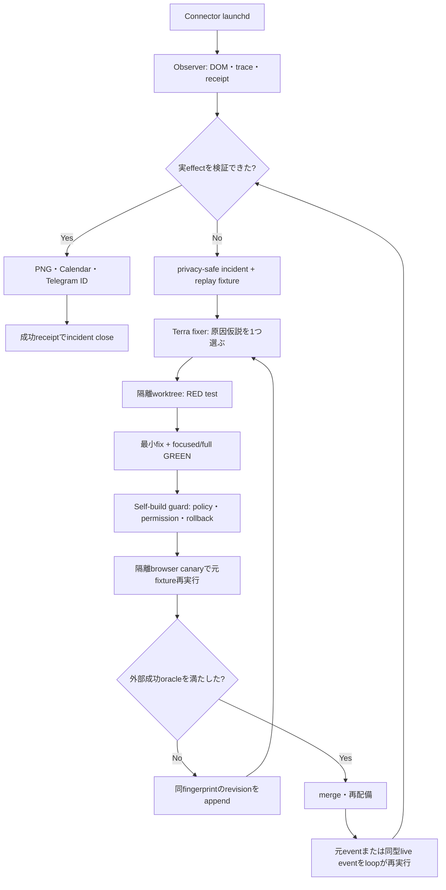

運用上Daisと対話中のCodexはこのloopのworkerでも常時監視者でもない。Observerは各browser action、現在URL、control label、
validation error、network/consoleの安全な分類、screenshot hash、provider readbackを同一run/event/capability versionへbindする。
raw page本文、cookie、OTP、電話、email、回答値はincidentへ入れない。FixerはTerraだけを使い、一revisionにつき原因仮説一つ、
RED一つ、最小fix一つに限定する。PR作成、test GREEN、mergeのいずれもincident完了ではない。完了oracleは、元failureが消え、
実providerでsubmit後の登録済みmarker、full-page PNG、Calendar readback、Telegram positive message IDが同一event lineageに揃うことだけである。

`incident_fingerprint + capability_version + revision`をappend-only SSOTにする。canary失敗は同fingerprintへ新revisionを追加し、
`attempted`で永久除外しない。最大3 revision/24時間、各revision 15分、同じtest failureまたは同じcanary failureが3回続いた場合だけ
`blocked`へ遷移し、次wakeまでbackoffする。通常failure、retry、修復途中をTelegramへ連投せずdurable ledgerへ保存し、成功または
hard-safety blockerだけを一通送る。資金移動、権限拡大、secret/allowlist変更、guard自身の変更、外部規約同意の新規拡大は
self-fix対象外で、既存hard safetyを維持する。

O1B-25進捗92（応募0回とmulti-source未接続の再監査）: existing launchd run 131中の最新durable stateは
`inventory=28 / calendar gate=24 / eligible=6 / Luna ranked=6 / spend ordered=4 / unsuppressed=0 / write attempts=0`である。
したがってConnectorはLumaへ到達してevent pageを開いているが、4候補すべてをwrite前のsuppressionで除外しており、Apply controlを
押す関数へ一度も到達していない。candidate historyには`LUMA_FORM_INPUT_REQUIRED` 2件、`LUMA_RSVP_UNAVAILABLE` 3件が
`retry_after=null`で残り、現suppression contractでは永久除外になる。画面上の「開く、読む、閉じる」はdiscovery/inspectionであり、
応募動作ではない。直接修正は、required formのschema読取・verified回答・入力readback・submitを実装し、そのcapability versionが上がった時に
同理由の旧suppressionを再評価することである。

multi-sourceについて、`connector-events-pack.js`にはLuma exhaustion後のConnpass handoff部品があるが、native runtimeは
`luma-event://`だけを受理し`handoffEventSource`を呼ばない。旧Connpass capabilityも`official_api_discovery_only / registration_allowed=false /
coverage_credit=false`であり、Peatix、Meetup、Doorkeeper、Eventbriteの稼働adapterは存在しない。従って現loopは実質Luma-onlyである。
正しい完成形はsource registryが各siteのdiscovery、authenticated registration、effect readback、screenshot evidence能力を宣言し、
一つのsourceで日付を埋められなければ次sourceへ進むことである。単にURLを見つけただけ、read-only API候補を得ただけではcoverage creditを与えない。

外部根拠:

- Luma Help Center, https://help.luma.com/p/collect-registration-questions — “we collect name and email for all guests, you can collect more information”。required custom questionsを通常flowとして扱う。
- connpass API v2（履歴 / 進捗145で撤回）: active runtimeはAPIを使わず、Connector専用CloakBrowser `:9222`へ固定する。
- Meetup GraphQL API, https://www.meetup.com/api/general/ — API accessはMeetup Proの提供能力として記載される。契約・権限を実測するまでbrowser/API registration capabilityを宣言しない。

O1B-25進捗93（Luma-only禁止を主要求へ昇格）: multi-sourceを後半TODOだけに置くと、runtime実装者が前半の旧「Luma中心」記述を
正本と誤認できるため、§5.2のnon-negotiable invariantと§10.1Aの日次UXを更新した。ConnectorのidentityはLuma agentではなく
event application agentであり、`open`日が残る限りLuma→Connpass→Peatix→Meetup→Doorkeeper→Eventbriteをcapability gate付きで
継続する。一候補・一providerの失敗をpass終了条件にしない。この時点の旧Connpass API discovery coreは進捗145でactive runtimeから撤回し、
browser registration/readback/screenshotのlive proof前はregistration capabilityを有効化しない。この差をO1B-20/20A/20Bへ分離した。

O1B-25進捗94（P0-10A self-heal incident envelope / RED→GREEN、live readback待ち）: existing launchd run 132を
schedule待ちせず実行中から自然終了まで観測し、`inventory=28 / spend ordered=4 / unsuppressed=0 / write attempts=0 / write=null`を
再確認した。これはpage inspectionだけでApplyを押していない実測証拠である。native-passへ、同selectionかつdurable historyに
`LUMA_FORM_INPUT_REQUIRED / retry_after=null`がある場合だけ、`schema version / sha256 fingerprint / component /
incident class / safe reason / observed_at / 7整数selection`のclosed envelopeをmode 0600 `self-heal-incidents.jsonl`へappendする処理を追加した。
event ref、event名、page本文、個人情報、secretは保存せず、同fingerprintを二回実行しても一行だけにdedupeする。実装前はfile ENOENTで
focused RED、実装後native 25/25、outbound 314/314 GREEN。次はcommit/push後の本物のlaunchd wakeで一行をreadbackし、その一行を
`lm:type:self-heal` issue intakeへ配送するP0-10Bへ進む。

O1B-25進捗95（P0-10A existing launchd LIVE GREEN / 画面・state照合）: push済みcommit `bab93b34e`を参照する
既存launchd run 133をkickstartし、別executorを起こさず自然終了まで観測した。実画面/CDPではevent pageを順に開閉した後
`about:blank`だけが残り、browser telemetryは`page.goto→page.close`を反復し、Apply clickは0回だった。終了後last-resultは
`inventory=28 / calendar eligible=6 / spend ordered=4 / unsuppressed=0 / write attempts=0 / write=null`、launchd exit 1である。
同runはmode 0600 `self-heal-incidents.jsonl`へ一行を生成し、closed fieldsはschema version、sha256 fingerprint、component、
`apply_blocked_by_suppression`、`LUMA_FORM_INPUT_REQUIRED`、observed_at、7整数selectionだけだった。これで「pageを見たが応募していない」
故障をConnector自身がprivacy-safeに検出・永続化するP0-10Aをlive完了した。登録、Calendar、Telegram screenshot receiptは増えておらず、
応募成功とは扱わない。次の一件はP0-10Bのincident→self-heal issue deliveryである。

O1B-25進捗96（P0-10B incident→self-heal issue / RED→GREEN、launchd receipt待ち）: pending incident一件だけを読み、
既存`createGhIssueClient`の`lm:type:self-heal` labelとHTML marker dedupeを使ってprivacy-safe GitHub issueへ配送し、provider issue URLを
mode 0600 `self-heal-issue-receipts.jsonl`へ一度だけ保存する処理をnative-passへ追加した。本文はsafe reason、7整数selection、
RED test・最小fix・実Apply/submit/readback/screenshotのacceptanceだけで、event ref、event名、page本文、identity、cookie、secretを含まない。
実装前はissue create 0でRED、実装後native 26/26、outbound 314/314 GREEN。最初のfocused runでは既存incident-only testがdefault clientへ
fall throughし、実run 133 fingerprintに対するGitHub issue `#1409`を作成した。issueは正しい本物incident inputだがtest isolation違反なので、
同testへfake clientを注入し、再実行ではnetwork送信なしで26/26 GREENを確認した。次はcommit/push後の既存launchd wakeがmarkerで
issue #1409を再利用し、local issue receiptを一行保存することをlive readbackしてP0-10Bを閉じる。

O1B-25進捗97（P0-10B existing launchd LIVE GREEN）: push済みcommit `33798f72e`後、schedule-owned existing launchd
run 134を別executorなしで自然終了まで観測した。GitHub検索では同incident title/markerのissueは一件だけで、run終了後に
mode 0600 `self-heal-issue-receipts.jsonl`が一行生成された。receiptはrun 133 incidentと同じsha256 fingerprint、
`https://github.com/Daisuke134/life-manager/issues/1409`、observed_atだけを持つ。これでincident検出→dedupe issue→provider URL receiptを
実loopで完了した。run 134自体の応募は依然Apply 0 / write nullであり、次はP0-11でproducerを復旧し、issue #1409を
RED test→required-form fix→PRへ変換する。

O1B-25進捗98（P0-11 producer実行とwrapper root fix / GREEN、再live検証待ち）: legacy dev stateをcopy-only migrationし、
520 filesのcopy/verifyと`done.jsonl` byte一致を確認後、既存launchd `ai.anicca.rockstar_ibot-dev`をkickstartした。producer run 6は
issue #1409を隔離worktreeへ渡し、実coding agentがcommit `ee94c69f6`とPR #1410を作成した。しかし外側daily wrapperは
`invalid_machine_result`でexit 1だった。実測根因は二つで、worktree内testが親の`LIFE_MANAGER_REPO`を継承してprimary checkoutを参照したこと、
PR URLとmachine result保存後に未設定`LM_DEV_TELEGRAM_TARGET`のparameter expansionがshellを終了させたことである。これを固定するRED testを
追加し、test gate直前で`LIFE_MANAGER_REPO`をunset、Telegram target不在時は既に保存した`pr_open`を壊さずskipする最小修正で
focused 3/3、daily loop 13/13 GREENを確認した。PR #1410自体は`LUMA_FORM_INPUT_REQUIRED`のeffect分類を変えるだけで、required formの
schema読取、入力、Submit、登録済みreadback、screenshotを実装していないため受入不可・未mergeである。次はこのproducer修正をpushし、
既存launchdのexit 0/machine resultをlive確認した後、insufficient PRを再修正cycleへ戻す。

O1B-25進捗99（全executor Terra統一 / RED→GREEN）: agent runnerの実configを監査すると、browser/tool/applicationは
`gpt-5.6-terra`だった一方、self-heal producerが使う`high-value-agent`とrepeatable/diagnostic/marketingは
`gpt-5.6-luna`、escalationはSolが第一候補だった。全ての実行可能task classがCodex `gpt-5.6-terra`一候補だけを持つ
contract testを追加し、変更前5 subcase RED、config統一後runner全12/12 GREENを確認した。既存producer run 7は修正版mainを使い
exit 0まで完了したためwrapper root fixはlive GREEN。次はCloakBrowserでLuma一件のhuman-equivalent golden traceを取得し、
その実DOM/form/submit/readback/screenshotをrequired-form adapterとself-heal canaryの正本にする。

O1B-25進捗100（human-equivalent golden trace / LIVE GREEN、loop移植待ち）: CloakBrowser daily-driverの実sessionで
Luma候補を操作した。`thirdspace-thirdweeks-gradations`は電話、Instagram handle、推薦文に加え、HTML `required`へ現れない
custom multi-selectとapp-level required checkboxを要求し、Instagram sessionもsuspendedだったため虚偽handleを入れず中止した。
次に無料networking event `https://luma.com/vzpwpjg4`（YOKOHAMA CONNÉCT #44）をワンクリック登録し、Luma画面の
「参加予定」をreadback、full-page PNG SHA-256 `e951d9a3a9708b24f1066417916d089c1c2d75e63f956b01b3422655e7e3a61c`を保存した。
主催者本文がLumaだけでは不十分と明記したため公式GatherUsへhandoffし、trusted Gmail senderのOTP、newsletter opt-out、
10-step profile（既知値のみ、未知属性はskip）を完了した。公式画面の「登録をキャンセル」「準備完了」をreadbackし、PNG SHA-256
`616dd5e543382003f7975999838d2aea557089507dc54c900b67a7c30209adf4`を保存した。Google Calendar event
`lurekf4ek87ejr13lei3r46p14`をAPI readbackし、Telegram text `7718`、Luma画像 `7720`、公式画像 `7721`を実送信した。
これはgolden traceでありloop成功とは数えない。次sliceは質問label/control型を読むform adapter、profile answer policy、trusted OTP、
cross-site completion marker、二枚のscreenshot/Calendar/Telegram receiptを同じevent lineageでloopへ移植する。

O1B-25進捗101（Luma custom form schema / RED→GREEN）: golden traceの標準required inputだけでなく、HTML `required`を
持たないcustom multi-selectとapp-level required checkboxを同じclosed schemaへ正規化する`luma-registration-form`を追加した。
出力はfield key、正規化label、control kind、required、bounded optionsだけで、入力値・電話・email・回答本文を保持しない。
unlabeled、duplicate key、secret-shaped label/key、50件超をfail-closedにする。module不存在RED後、focused 2/2、既存provider込み
11/11 GREEN。次はこのschemaとprivate profileを受け、既知fieldだけを回答し、Instagram等の未解決required fieldでは虚偽入力せず
候補継続を返すprofile answer policyを実装する。

O1B-25進捗102（profile-backed answer policy / RED→GREEN）: form schemaに対し、profileのfield key完全一致、label完全一致、
許可済みphone mapping、明示済みCode of Conduct/Media Release consentだけを回答へ変換するpolicyを追加した。multi-selectは
実画面で観測したoptionから最大3件だけ、checkboxは明示trueだけを許可する。Instagram handle等の未解決required fieldは
`candidate_not_actionable / LUMA_REQUIRED_PROFILE_FIELD_UNAVAILABLE`を返し、`N/A`や架空handleを作らない。form外option、duplicate、
token/password等のsecret-shaped回答をfail-closedにする。module不存在RED後、schema/provider回帰込み14/14 GREEN。次はこのplanを
実DOMへ適用するbounded fill executorと、未知field時に同passの次候補へ進むruntime状態遷移を接続する。

O1B-25進捗103（bounded form fill executor / RED→GREEN、submit配線待ち）: `ready` answer planだけを受け、exact field keyが
一件だけ存在することを確認してtext/phoneの`fill`、explicit consentの`check`、観測option完全一致のmulti-select clickを行う
executorを追加した。各操作後にinput value、checked、aria-pressedをreadbackできなければ成功にしない。non-ready plan、missing/ambiguous
control、未知control kindは外部effect前にfail-closed。module不存在RED後、schema/policy/provider回帰込み16/16 GREEN。
次はlive DOM schema readerとprivate profile loaderを合成し、confirm click前にplan→fill→readbackを必須化する。

O1B-25進捗104（self-healing revision contract / TODO順序正本化）: self-healing完成条件を「issue/PRを作る」から、Observerの
privacy-safe replay fixtureをTerra fixerがRED→最小fix→GREENへ変換し、self-build guardと隔離browser canaryを通し、再配備後の
Connector自身が同型live eventで登録済みmarker、PNG、Calendar、Telegram positive IDを揃えることへ更新した。
`incident_fingerprint + capability_version + revision`をappend-only SSOTとし、canary failureはdoneにせず次revisionへ戻す。
上限は3 revision/24時間・各15分、同一failure 3回だけblocked/backoff。残TODOを11D submit配線→12 capability再評価→13 Observer
trace→14 revision-aware Terra producer→15 consumer/canary→16 live replay→17 cross-site OTP→18 lineage receiptの依存順へ並べ直した。

O1B-25進捗105（11D form submit stack / RED→GREEN、private loader実配線待ち）: live DOMをdialog scopeだけでclosed schemaへ読み、
trusted private profileを引数なしreaderから取得し、answer plan→bounded fill→effect readbackをconfirm click前に必須化した。
初回reviewでLocator scope内からdocument全体を列挙する不具合を検出し、dialog外controlを除外するRED test後にscope root基準へ修正した。
focused 21/21、native runtime 14/14 GREEN。さらに`LUMA_REQUIRED_PROFILE_FIELD_UNAVAILABLE`をknown-no-effectへ分類し、
同じpassで次のranked candidateへ進むruntime testと、Events Packがtrusted readerだけをproviderへ渡すcomposition testをRED→GREENにした。
残る11Dはworkerがmode 0600 private profileを実際に読むloaderとdeploy wiringであり、値をrepo・log・receiptへ保存しない。

O1B-25進捗106（11D private profile loader / RED→GREEN、deploy seed待ち）: workerのdurable data root配下
`private/connector-luma-form-profile.json`だけをsubmit時に遅延読込するloaderを追加した。fileはmode 0600・16KB以下・closed schema、
回答はbounded scalar/最大3件array/明示consentだけを許可し、extra key、secret-shaped value、object回答をfail-closedにする。
provider readerは引数なしで、page/candidate/DOMをprivate loaderへ渡さない。module不存在とworker reader未配線をREDで確認後、
profile/provider/policy 16/16、worker 28/28 GREEN。残る11Dはprivate volumeへの実seed、worker再配備、live submit readbackである。

O1B-25進捗107（11D private seed/deploy wiring / RED→GREEN、live再配備待ち）: deploy entrypointがowner-only identity profileから
phoneだけを初回seedし、空のform answersと未同意consentを持つmode 0600 private fileを生成する。既存private fileは上書きせず、
strict loaderで検証してからread-only bind mountでworkerのdurable private pathへ渡す。token、identity、回答値はstdout/stderrへ出さない。
deploy test 2/2とmerged compose configがGREEN。次はfeature buildをlocal workerへ再配備し、実container内のmode/loader readback後に
既存Connector loopをwakeしてlive registration chainを確認する。

O1B-25進捗108（Terra judgment acceptance root fix / LIVE RED→GREEN）: feature worker再配備後の既存launchd run 148は、
agent runnerが`gpt-5.6-terra`でpreference judgmentをsuccessにした直後、`connector_native_luna_failed`でresult生成前に終了した。
根因は全executorをTerra一候補へ統一した後もConnector judgment wrapperが`gpt-5.6-luna`だけをsuccessとしていたこと。
Terra resultを受理するcontractへ更新し、変更前3 failure RED、変更後judgment/native 18/18、agent-runner 12/12 GREEN。
次は既存launchdを再wakeし、judgment後のwrite attemptと実provider submit/readbackを確認する。

O1B-25進捗109（12A capability-aware suppression / RED→GREEN）: run 149はTerra preference/goal judgmentを全日程で通過したが、
旧`LUMA_FORM_INPUT_REQUIRED` attemptが4候補をterminal suppressionし、`unsuppressed=0 / write attempts=0`で終了した。
form capability versionが旧attemptと異なる時だけsuppressionを解除し、同versionで一度再試行した後は再び抑制するcontractを追加した。
legacy→v1解除、v1再抑制、v1→v2解除のRED後、suppression/native 17/17 GREEN。次はversionをruntime configと新attemptへ保存し、
legacy JSONLを値欠落のまま安全にmigrationして実runでApplyへ進める12Bである。

O1B-25進捗110（12B capability version persistence / RED→GREEN、live再評価待ち）: native configを
`luma-form-submit-v1`へ固定し、suppression入力と新しいcandidate attempt全件へ同versionを渡すようにした。既存JSONLの
versionなし5-key行と新6-key行を両方closed schemaで読めるため、過去stateを削除・書換せずappend-only migrationできる。
旧form failureがv1で一度再試行され、その結果がv1 attemptとして保存されるruntime RED後、runtime/suppression 17/17、
native entrypoint 26/26 GREEN。次は既存launchd runで`unsuppressed>0 / write attempts>0`と実provider resultを確認する。

O1B-25進捗111（native private profile + pre-confirm outcome closure / LIVE RED→GREEN）: run 150は旧form suppressionを解除して
write境界へ到達したが、host-native packにprivate readerが渡らず、candidate-local pre-confirm errorをoutcome classifierが拒否したため
`connector_native_write_failed`でbounded result前に終了した。native runtimeにもmode 0600 loaderの引数なしreaderを接続し、
control/schema/plan/fill/confirm unavailableをknown-no-effectとして同pass継続するclosed mappingを追加した。
lazy reader REDと5 error分類RED後、provider/runtime/profile 35/35、native entrypoint 26/26 GREEN。次の既存runで
versioned attempt、次候補継続、登録済みreadbackのいずれまで到達するかを確認する。

O1B-25進捗112（browser ownership再監査 / Connector専用railへ収束、live E2E未達）: golden traceの実session logを再読すると、
成功時の操作主体は`apps/rockstar_ibot`に導入済みの`playwright-core`であり、`chromium.connectOverCDP("http://127.0.0.1:9222")`
から既存CloakBrowser daily-driverを直接操作していた。Gigの成功B0/B1 laneは別の専用CloakBrowser `:9223`、profile、lock、vaultを
所有し、`browser-foundation`と`cdp_default_tab.py`がtarget IDとtab専用WebSocketを先に確定するため、agentがbrowser discovery、
window選択、module探索を即興しない。Connector run 164〜169はこのownership railを持たず、raw DOM mutation、desktop-wide
`Cmd-Tab/cliclick`、未導入`require('playwright')`へ逸れた。run 169は外部submit前に停止し、最新commit `9dc56bd98`は正しい
`playwright-core` pathを固定したがlive未実証である。

ConnectorはGigの稼働資産を一切変更・参照依存しない。`profitable-claude/skills/gig-work`、Gig launchd、`:9223`、
`gig-daily-driver` profile、Gig state/lock/vaultはDO NOT TOUCHである。Connector repository内にConnector専用tab-owner railを実装し、
`:9222`上のtarget ID、page WebSocket、owner token、baseline targetsをprivate receiptとしてTerraへ渡す。Terraは受け取った一tabだけを
同一turnで観測→入力→submit→明示的完了markerまで操作し、browser/package/tab探索、別browser起動、desktop座標操作をしてはならない。
候補attempt履歴はtelemetryであり除外gateにしない。生年月日`2002-01-30`はmode 0600 private profileへseed済みだが、全agentの
個人情報SSOT統合は未完了である。

O1B-25進捗113（16A Connector tab-owner rail / RED→GREEN、runtime配線は16B）: Connector repository内へ
`connector-tab-owner.js`を追加した。`:9222`以外を拒否し、baseline targetを除外した後にcanonical Luma URLへ一致する
page targetが正確に一つだけの場合に限り、owner token、target ID、page WebSocket、baseline targetsを含むschema v1 receiptを
mode 0600でatomic保存する。Chrome内部pageや他site targetは候補外とし、同一event tabが複数なら曖昧な所有権として停止する。
新規contractと既存daily-driverのfocused testは8/8 GREEN。次はこのreceiptを親loopからTerraへ渡し、Terraの接続先を
所有tab一つへ限定する16Bである。live submitはまだ成立していない。

O1B-25進捗114（16B owned-tab Terra wiring / focused GREEN、live E2Eは16C）: daily-driverはpage作成前に`:9222`の
baseline target IDsを取得し、遷移後に16Aの一意receiptを生成してproviderへ渡す。providerはreceiptをagentic registration境界へ
そのまま渡し、receipt欠落・別port・target/WebSocket不一致ではTerraを起動しない。Terraは`gpt-5.6-terra`のbrowser laneで、
browser endpointへ接続後、各pageの`Target.getTargetInfo`を使ってreceiptのtarget IDと一致する一pageだけを選び、他pageの内容を
探索しない。focused ownership/provider/pack testは36/36 GREEN。既存runtime suiteの47/48で残る1件は、進捗112で廃止済みの
candidate budget cursorを期待する旧testであり、今回のownership変更による失敗ではない。次はprivate profile SSOT統合後、
Connector launchd自身でlive submit/readbackを行う。現時点では外部submit成功を主張しない。

O1B-25進捗115（private user-profile SSOT direct read / GREEN）: native-passはTerra実行時の本人情報を、電話番号だけの
派生Luma profileではなくmode 0600の`~/.config/anicca/job-search/profile.json`から必要時に直接読む。readerはcandidate rootを必須にし、
256 KiB、深さ、配列数、制御文字、secret-bearing keyをbounded validationし、再帰freezeした値だけを一回のregistration actionへ渡す。
決定論form executor用の既存最小profileは別境界として維持する。実SSOTは値を表示せずcandidate 23 fields、facts 23件を読めることを確認し、
関連44/45 GREEN。唯一のfailureは廃止済みcandidate budget cursorを期待する旧testである。次は最新launchdをkickstartし、loop主体の
live Luma submitと親readbackを実証する16Cである。

O1B-25進捗116（live run 170 / reconciliation continuation fix）: commit `6276dd8a6`の既存launchdをkickstartし、
CloakBrowser `:9222`、mode 0600 tab-owner receipt、本人SSOT direct readerが実runへ到達した。runはinventory 27、Calendar候補20、
eligible 5、spend ordered 3を得たが、write attemptは1で登録0だった。原因は旧`unknown_effect`を親readbackで`absent`へ確定した直後に
`break judgmentLoop`し、再submitも次候補も行わない制御フローである。`absent`は同じcandidateを即retry、`unavailable`は次candidate、
`unknown/login_required`だけpass停止へ変更した。候補budgetは停止gateにならない現contractへ旧testを更新し、ownership/profile/provider/
native/launchd focused testは65/65 GREEN。次runでTerra child起動、実submit、親readbackを確認するまで16Cは未完了である。

O1B-25進捗117（Dream Killer control removal batch 1）: Connector native runtimeでreconciliation readbackが`login_required`、
`unknown`、`unavailable`になっても`break judgmentLoop`せず、そのcandidateをtelemetryへ記録して次candidateへ進む。
write outcomeも`verified_success`だけを現在runの成功境界とし、`known_no_effect`、`unknown_effect`、`recovery_required`は次candidateへ
継続する。legacy candidate sequenceも`adapter_failure`、`login_required`、`transport_unavailable`、`unknown_effect`、未知statusが
sequence全体を終了する権限を廃止し、各candidateをskip ledgerへ残して全件試行後に`next_provider_required`を返す。
focused runtime/candidate testsは19/19 GREEN。次は既存launchdをlive実行し、候補間継続とTerra submitを実測する。

O1B-25進捗118（browser transaction continuity OSS調査 / spec only、実装なし）: live run 171のTerraはowned targetへ正しく到達し、
registration form、textbox、checkbox、multi-selectを観測したが、各actionを別々のinline Node processで実行し、毎回
旧Terra executorは`chromium.connectOverCDP()`→page再探索→`browser.close()`を繰り返した。このためoverlayとform stateを何度も失い、同じ入力を
再試行した。Luma selector不足ではなくbrowser session lifecycleが根因である。

採用案はMicrosoft公式OSS `microsoft/playwright-mcp`をConnector専用の長寿命browser tool sessionとして使うことである。
同READMEはMCPをpersistent state、rich introspection、iterative reasoning、long-running autonomous workflow向けと明記し、
`--cdp-endpoint`、`--shared-browser-context`、action/navigation/settle timeout、output directoryを提供する。
Playwright公式APIは`connectOverCDP()`が既存Chromiumへ接続しdefault contextを返す一方、CDP接続はPlaywright protocolより
low fidelityであり、`browser.close()`はconnected browserから切断してBrowser objectをdisposeすると明記する。したがってTerraへ
raw shellを許す構成を廃止し、親loopが一度だけMCP sessionを`:9222`へ接続、16A receiptのowned targetをcurrent pageへ固定、
Terraは同一MCP sessionのaccessibility snapshot、click、fill、check、select、screenshotだけで一transactionを完了し、親readback後に
MCP clientだけをdetachする。外部CloakBrowser、context、owned pageをTerraにcloseさせない。

比較したOSS:

- `microsoft/playwright-mcp`（採用）: Codexがstdio MCPをnative登録でき、長寿命session、CDP endpoint、shared context、snapshot、
  monitoring/outputを一体で提供する。Source: https://github.com/microsoft/playwright-mcp
- `microsoft/playwright-cli`（fallback）: named sessionはCLI call間でcookie/storageを保持し、`attach --cdp=<url>`と外部browserを残す
  `detach`を提供する。ただしCLI commandを多数生成する現在の癖を残しやすいため第一選択にしない。
  Source: https://github.com/microsoft/playwright-cli
- `browser-use/browser-use`（不採用）: `BrowserSession(BrowserProfile(cdp_url=...))`で既存browserへ接続し、一つのAgent runを維持できるが、
  現在のTerra/Codex runnerを別agent frameworkへ置換する範囲が大きい。Source: https://github.com/browser-use/browser-use
- `browserbase/stagehand`（不採用）: `act()`/`agent.execute()`、action caching、self-healingは有用だが、別SDK/agent runtimeと
  Browserbase中心の依存を増やす。Source: https://github.com/browserbase/stagehand

16B補正TODO: (a) Connector専用Playwright MCP sidecarをper-candidateで起動し`:9222`へ一回だけattach、(b) owner receiptのtarget IDを
MCP current pageへbindして他tab toolをTerraへ公開しない、(c) agent-runnerのTerra turnへbrowser MCPだけを注入しshell browser codeを
禁止、(d) form openからsubmit/readback/screenshotまで同じsession IDをtrace、(e) parentがreadback後にMCPをdetach、
(f) action途中のMCP crashは同candidate stateを再読込し、次candidate/providerを止めない。live E2Eはこの移行後に再実行する。

O1B-25進捗119（CloakBrowser本体 + successful Gig rail差分監査 / 進捗118を訂正）: ConnectorはCloakBrowserを使っていないのではない。
実runは既存CloakBrowser `:9222`へPlaywright CDPで接続し、CloakBrowser page上のLuma formまで到達している。CloakBrowser公式は
Playwright/Puppeteer drop-in stealth Chromiumで、persistent contextとhumanized actionabilityを提供する。今回のform継続失敗はbrowser
engineではなくConnector harnessの所有権と実行lifecycleである。Source: https://github.com/CloakHQ/CloakBrowser

成功中Gigの実codeは、親が`Target.createTarget`でdefault authenticated contextへ専用tabを作り、`target_ownership.claim_target()`で
ownerをdurable ledgerへ記録し、`target_id`と直接の`ws://.../devtools/page/<target>`を返す。別経路ではtaskごとのbrowser context、
token、generation、heartbeat、renderer liveness probe、operation lockを持ち、agentにはそのpage WebSocket一つだけを渡す。
agentはcontextをreleaseせず、親がagent終了後に同じtargetをreadbackしてcleanupする。Gigはbrowser endpointへ再接続して全pageを
毎command探索する構成ではない。

Connectorは親がPlaywright `context.newPage()`を作る一方、Terraへbrowser endpointとtarget receiptを文章で渡し、Terra自身が毎actionで
inline Nodeを生成して`connectOverCDP()`、全page列挙、target再探索、`browser.close()`を繰り返す。つまりCloakBrowser binaryは同じでも、
成功Gigのpage-scoped ownership rail、operation lock、one-session transaction、parent-owned cleanupをコピーしていなかった。

進捗118の「Playwright MCPを第一選択」は撤回する。既にあるPlaywright CLI/MCPの追加は根因修正ではない。第一選択はGigの汎用browser
foundation patternをConnector repositoryへcopy+tweakすることとする。ただしGigのcode/state/profile/launchd/`:9223`はread-onlyで、
Connectorは自分の`:9222`、owner namespace、ledger、lock、evidenceを持つ。

16B再補正TODO: (a) 親がCDP `Target.createTarget`でLuma event tabを作る、(b) Connector専用owner ledgerへtargetをclaim、
(c) 親が同じPlaywright pageでform schemaを観測し、Terraへsanitized schema・未解決の通常質問・private profileだけを一turn渡す、
(d) browser endpoint、page WebSocket、owner receipt、tab一覧、inline Node、`browser.close()`、context/page releaseをTerraから除外、
(e) Terraの回答をclosed schemaで検証してから親が同じpageでopen form→全field→submit→markerまで実行、
(f)親が同じtargetで独立readback・screenshot後にtargetをclose/release、(g)renderer livenessとstale-owner GCをConnector自身が持つ。

O1B-25進捗120（Superpowers型closed-loop self-healingを全loop共通基盤へ昇格 / 実装順序確定）: run 174の実stateを
read-only再監査した。Connector launchdは累計174 run、直近exit 1、healthcheckは直近exit 0、`:9222`は応答中である。
run 174はTerraが実Luma formをsubmitし、親loopが`pending approval` markerと登録page PNGを独立readbackした一方、
confirmation mail / QR取得で`ticket_evidence_failed`となり、現pipelineの順序上CalendarとTelegramへ到達しなかった。
したがって「外部submit不能」はすでに真ではないが、Gig型page ownershipを持たず、Terraがinline Nodeごとに
`connectOverCDP()`、全page探索、`browser.close()`を反復するtransaction lifecycleと、登録成功後のoptional evidence failureが
task delivery全体を止める状態機械が未修復である。

Daisの明示判断により、機能開発の順序を次へ固定する。まずGig資産を変更せずConnector専用`:9222` railでsingle-page transactionを
成立させる。その一件を閉じた直後はprovider追加より先に、今回の二つの実故障を最初のreplay fixtureとして共通Observer / Fixer /
Canary / Promotion基盤を完成させる。FixerはCodex/Terra runnerからSuperpowersの`systematic-debugging`、
`test-driven-development`、`verification-before-completion`を必須工程として使う。issue作成、PR作成、test GREEN、merge、restartの
いずれもhealedではない。同じfailure classの実taskをproduction loop自身が再実行し、task固有のexternal receipt oracleを満たした時だけ
`healed`へ遷移する。

共通self-healing contractはbrowser専用にしない。各loop adapterは`observe / classify / expect / reconcile /
buildReplayFixture / runCanary / verifyExternalEffect / rollback`を実装し、共通control planeは
`incident_fingerprint + capability_version + revision`、修正budget、protected path、permission、canary、promotion、rollbackを所有する。
Connectorのexternal oracleはprovider marker、Calendar ID/readback、登録page PNG SHA、Telegram card/photo positive IDである。
Gigはmarketplace official historyのexact request ID、mailはprovider message ID、paymentはprovider receipt、on-chain effectはtransaction
signatureを使う。process livenessやagent自己申告をbusiness successへ昇格しない。

Observer envelopeにはrun/task/event、loop、capability/version、stage、safe action class、URL class、control class、期待effect、
観測effect、target owner/generation、screenshot SHA、provider readback、code commitだけを保存する。raw page本文、cookie、OTP、token、
email、電話、profile、form回答、raw promptは保存しない。修復は一revisionにつき原因仮説一つ、RED一つ、最小fix一つ、15分以内、
最大3 revision/24時間とし、historical replay→focused/full test→隔離browser canary→one bounded live effect→external receiptの順で昇格する。
同じtest/canary failureが3回続いた時だけbackoffし、単なる`attempted`で永久除外しない。

O1B-25進捗121（16B再補正 Task 1 durable target lease / RED→GREEN）: Connector repository内へ
`connector-target-lease.js`を追加した。Connector専用mode 0600 atomic ledger、target単位owner token/generation fence、heartbeat、
renderer probe、exact fenced release、heartbeat期限切れtargetだけのstale GCを持ち、`:9222`以外のpage WebSocket、credential-bearing
Luma URL、別owner、stale fenceを拒否する。`connector-tab-owner`は注入されたleaseのdurable claimが成功するまでownership receiptを
発行しない。production runtimeからのlease生成・`Target.createTarget`・親cleanup配線は次のTask 2であり、まだlive ownership成功を
主張しない。TDDはmodule不在RED、lease未接続REDを実測後、focused ownership/provider関連28/28、pretest 12/12、Connector/outbound
320/320がfresh GREEN、失敗0件である。

O1B-25進捗122（16B再補正 Task 2 parent-created target lifecycle / RED→GREEN）: Connector専用
`connector-browser-target-controller.js`を追加し、親が既存CloakBrowser `:9222`のdefault authenticated contextへ
`Target.createTarget`を一回だけ実行し、返されたtarget IDとPlaywright pageをboundedに一致確認する。daily-driverのproduction railは
そのexact targetをdurable leaseへclaimし、renderer probe、navigation前heartbeat、親task/readback後heartbeatを行い、finallyで
owner token/generationが一致するtargetだけを親がclose/releaseする。production runtimeはConnector evidence directory内の
`target-leases.json`を渡すため、旧`context.newPage()` receipt-only branchを使わない。Terra側はまだendpointを受け取りinline Nodeと
反復`connectOverCDP()`を行うため、single-page agent capabilityとlive effectはTask 3まで未完である。controller/lease/owner/driver/
agent receipt/runtime/provider focused 48/48、pretest 12/12、ownership testsを常設登録したConnector/outbound 335/335がfresh GREEN、
失敗0件である。

O1B-25進捗123（16B再補正 Task 3 model-only decision / parent-owned effect RED→GREEN）: Gigの実codeを再照合すると、
成功境界はagentへpage操作を委譲することではなく、modelが判断だけを返し、親codeが同一owned target上でbrowser effect、
readback、evidence、cleanupを完結する構造だった。Connectorもこの境界へ変更した。Terraにはsanitized form schema、未解決の
required普通質問、private profileだけを一回渡し、endpoint、page WebSocket、target/owner receipt、tab inventory、Playwright bootstrap、
`connectOverCDP()`、`browser.close()`を一切渡さない。Terraの回答は未知key、重複、不完全、観測option外、secret-shaped値を拒否し、
親owned pageだけがreal locator fill/check/select、final submit、provider marker readback、PNG取得を行う。focused testは旧境界で2件RED、
修正後17/17 GREEN、pretest 12/12、Connector/outbound 336/336 GREEN、失敗0件である。これはcode/test完了であり、最新commitを使った
既存Connector launchdの実submit、親marker、PNG、Calendar、Telegram receiptはまだ未実証なので16C/16Dは未完のまま維持する。

O1B-25進捗124（Task 3 schedule-owned run 178 / ownership GREEN・新規submit未到達）: commit `dcd552c3b`を参照する
既存Connector launchdがschedule自身でrun 178を開始したため、重複kickstartせず自然終了まで観測した。runは4候補を処理し、
2件を`LUMA_RSVP_UNAVAILABLE / known_no_effect`、2件を`TICKET_EVIDENCE_FAILED_FAILED / recovery_required`としてappendした。
後者2件では親provider readbackに基づく新しいPNG object/provider receiptが生成されたが、candidate-attempt 35→39に対して
Calendar delivery receipt 2→2、Telegram photo receipt 2→2で増分0だった。Connector target lease ledgerは終了時targets 0で、
親cleanupは成立した。新規form submitを必要とするcandidateへ到達しておらず、Terra form-decision turnも実行されていないため、
このrunを16Cのcorrected live submit acceptanceとは扱わない。Calendar、Telegram、full lineageも未成立なので16Dも未完である。

O1B-25進捗125（verified registration core deliveryとoptional ticket enrichment分離 / RED→GREEN）: run 178で再現した
`registration verified + PNG generated → confirmation/QR failure → Calendar/Telegram未到達`を回帰testにした。旧pipelineは
verified provider receiptの直後にconfirmation mailとticket QRを必須化し、失敗時にCalendar前でreturnしていた。修正後は
provider marker/PNG receiptをcore effect oracleとしてCalendar、coverage、登録page Telegram card/photoを継続し、mail/QR/ticket photoは
verified artifactが得られた時だけ追加送信するbest-effort enrichmentとした。ticket evidenceまたはticket Telegram failureはbounded
`unavailable` statusとして返すが、登録済みeventをapplication failureへ戻さない。Calendar receipt、coverage rebuild、Telegram positive
card/photo IDの既存fail-closed gateは変更していない。回帰testは旧codeで1件RED、修正後focused 21/21、pretest 12/12、
Connector/outbound 337/337 GREEN、失敗0件。この時点のlive未実証記録は履歴であり、現在状態は進捗145以降とactive TODO SSOTを参照する。

O1B-25進捗126（optional ticket分離のexisting launchd LIVE GREEN / 16D full lineage成立）: commit `84fa453f1`後、
idleだった既存Connector launchdだけをrun 179として一度kickstartし、自然終了まで観測した。candidate attemptは39→41、
Calendar/coverage delivery receiptは2→3へ増えた。`luma-event://event/thirdspace-thirdweeks-gradations`は親provider readbackで
`verified_success / open_coverage`となり、同一write resultへprovider markerにboundしたfull-page PNG SHA
`8d1713988bc4e3760253e23c1905fc7ea0f68307c7d5ab7122499c9feda754ed`、Google Calendar evidence ref、Telegram card positive ID
`7864`、登録page photo positive ID `7865`が揃った。target lease ledgerは終了時targets 0である。これでticket enrichment failureが
core Calendar/Telegram deliveryを止めないことと16Dの4証拠lineageをlive完了した。ただしagentic-registration evidenceは生成されず、
既登録effectの親readbackだったため、corrected railで新規form submitを行う16Cは未完のまま維持する。

O1B-25進捗127（16C run 180 / 新規submit可能候補なし）: 16Cだけを次のactive itemとして既存Connector launchdを
run 180で一度wakeした。fresh inventory 27件、Calendar gate対象21件、eligible 4件、Luna ranked 4件、zero-yen spend policy後2件を
同じpassでattemptしたが、2件とも親provider readbackで`LUMA_RSVP_UNAVAILABLE / known_no_effect`だった。Terra childと
agentic-registration evidenceは生成されず、candidate attemptは41→43、delivery receiptは3→3である。これはbrowser rail failureではなく、
現inventoryに新規submit可能なfree候補が無いことを示す。corrected railの実form submit証拠は存在しないため16Cを完了扱いせず、
次のschedule wakeでも全ranked candidateを再評価する。16C成立前にObserver/Fixer実装へ順序を飛ばさない。

O1B-25進捗128（Calendar-gap-first・multi-source必達へ順序変更）: Daisの明示判断により、イベントの好み・テーマ・
goal alignmentは除外gateではなく順位情報だけにする。Google Calendarの空き、往復移動、現地参加可能性、provider受付状態、
既存の支出上限を満たす候補は、弱いfitでも応募対象に残す。「anything」は無制限課金、時間衝突、満席、online-only、
利用規約違反まで許可する意味ではない。Lumaでsubmit可能候補が無ければ同じpassでConnpass→Peatix→Meetup→Doorkeeper→
Eventbriteへ進み、各providerの全候補が尽きるまで一候補・一providerの失敗で終了しない。完了条件はagent自己申告ではなく、
providerの登録済み/承認待ちmarker、参加用QRまたはprovider ticket/receipt、Calendar ID/readback、登録page PNG SHA、
Telegram card/photo positive IDを同一event lineageへ揃えることとする。

この判断により、旧「Luma corrected railのlive submit後にObserver」という順序を変更する。最初に共通source registryと
provider handoff state machineを作り、Connpassを最初の代替providerとしてdiscovery→authenticated registration→effect readback→
screenshot/QR evidenceまでlive promotionする。その後、Lumaを含む全provider横断で最初の実登録を必達し、初めてObserver/Fixerへ進む。

O1B-25進捗129（multi-source Task 1 closed provider registry / RED→GREEN）: `event-provider-registry.js`を追加し、
provider順をLuma→Connpass→Peatix→Meetup→Doorkeeper→Eventbriteへ固定した。各providerはexactly
`discovery / registration / effect_readback / screenshot_evidence / ticket_or_qr`を宣言し、各能力は`active / advisory_only / blocked`
とbounded safe reasonだけを持つ。Lumaは既存live proofにより全能力active、この時点のConnpass API-only状態は進捗145でsupersededされ、
advisory、残りproviderはadapter live proofまでblockedである。registryはimmutable・content-addressed・in-process provenanceで、
credential、browser endpoint、個人情報を持たない。Connpass promotionはprovider marker、PNG SHA ref、admission ticket/QR相当ref、
Calendar evidence ref、Telegram card/photo positive IDの全てが揃わなければ拒否する。module不在RED後、focused 3/3、pretest 12/12、
常設登録後のConnector/outbound 340/340 GREEN、失敗0件。次はTask 2でdurable provider cursorとsame-pass handoffをnative runtimeへ接続する。

O1B-25進捗130（multi-source Task 2A durable provider cursor / RED→GREEN）: `event-provider-cursor.js`を追加した。
cursorはexactly `schema_version / registry_id / date / provider / candidate_index / generation / observed_at`だけを持ち、event名、URL、
本文、identity、profileを保存しない。`known_no_effect`は同providerの次candidate、`provider_exhausted`は固定順の次providerへforward-onlyに
進み、`unknown_effect`、末尾providerからの黙ったwrap、registry drift、stale/forged cursorを拒否する。mode 0600のatomic JSON storeは
一時fileをfsync後renameし、完全なcursorだけを再読出しする。module不在RED後、registry込みfocused 6/6、pretest 12/12、
常設登録後のConnector/outbound 343/343 GREEN、失敗0件。これはcursor contract/storeだけであり、native runtimeのsame-pass handoffは
Task 2Bとして未完である。

O1B-25進捗131（multi-source Task 2B1 same-pass runtime transition / RED→GREEN）: native runtimeへTask 2Aの
verified registry/cursorを接続した。`known_no_effect`はcandidate indexを進め、Luma候補枯渇は同じpassの返却cursorをConnpassへ進める。
既存のunknown-effect親readbackが`unknown`の間はcursorを一切進めず、再submitもしない。返却cursorはprovider/date/index/generation/timeと
registry IDだけで、event名、URL、page本文、identityを持たない。外部のdurable workflow設計も、Temporalが「complete, ordered log」を保持して
停止前の状態へ戻すこと（https://docs.temporal.io/workflows）、AWS Step Functionsがstate errorを`catch errors, retry failed states`で扱うこと
（https://docs.aws.amazon.com/step-functions/latest/dg/concepts-error-handling.html）、Azure Durable Functionsが「状態、チェックポイント、再試行、復旧を管理」
すること（https://learn.microsoft.com/ja-jp/azure/azure-functions/durable/durable-functions-overview）を公式原文で再確認した。既存15件PASSかつ
新assertだけFAILのRED後、focused 16/16、pretest 12/12、outbound 344/344 GREEN、失敗0件。Connpass network discoveryはまだ実行せず、
次はTask 2B2で`provider-cursor.json`をnative-passへatomic persistenceする。

O1B-25進捗132（multi-source Task 2B2 native-pass persistence / RED→GREEN）: production native-passを旧Luma-only
`cursor.json`の独自validator/direct writeからTask 2Aのregistry-bound atomic storeへ切り替えた。first wakeは最初のopen dateからLuma cursorを
生成し、mode 0600 `provider-cursor.json`をtemp fsync→renameで保存する。次wakeは同一registry IDのcursorだけをruntimeへ渡す。
旧`cursor.json`は新cursorまたは明示nullのdurable recordが成功した後にだけ削除し、途中失敗で両方を失わない。event ref、page text、URL、
identityはprovider cursorへ保存しない。provider file不在RED後、native-entrypoint 26/26、runtime 16/16、pretest 12/12、outbound 344/344 GREEN、
失敗0件。Task 2のcursor contract・runtime transition・wake間persistenceは完了した。この次手記録は履歴で、進捗145によりbrowser discoveryへ置換した。
native runtimeのConnpass cursor branchへ接続する。実network call、browser、registration、Calendar、Telegramはまだ実行していない。

O1B-25進捗133（履歴 / 進捗145でsuperseded: Connpass official API runtime handoff）: Connpass provider cursorを
native runtimeへ接続した。resumed Connpass cursorだけでなく、Lumaが同じpassで枯渇してConnpassへ遷移した場合も、その場で既存packの
exhaustive official-v2 handoffを呼ぶ。API keyは`LM_CONNECTOR_CONNPASS_API_KEY`からprocess内configへ渡すだけでresult/cursor/stateへ保存しない。
key不在はnetwork call 0の`waiting_for_authorized_source`、API unavailable/emptyもcoverageをopenに保つ。発見候補は
`registration_allowed=false / coverage_credit=false`のadvisoryであり、registration、Calendar write、Telegramを呼ばない。公式API v2は
「すべてのAPIエンドポイントでは、APIキーによる認証が必須」「1秒間に1リクエストまで」、非API crawling/scrapingは禁止と明記する
（https://connpass.com/about/api/v2/）。公式helpも「APIキーをリクエストヘッダーに設定」「適切な間隔をあけてアクセス」とする
（https://help.connpass.com/api/）。既存16件PASSかつhandoff未呼出しのRED後、runtime 17/17、native-entrypoint 26/26、pretest 12/12、
outbound 345/345 GREEN、失敗0件。次はTask 3BでConnpass候補をLuma provenanceへ偽装せず、共通Calendar/移動gateへ通す。

O1B-25進捗134（multi-source Task 3B provider-neutral Calendar/travel gate / RED→GREEN）: 既存Luma Calendar gateの
候補評価を一つの共有evaluatorへ抽出し、verified Connpass handoffを直接受けるgateを追加した。Luma inventoryへ偽装せず、同じ
direct timed conflict、all-day conflict、直前/直後location、inbound/outbound route、5分buffer付きexpanded windowを適用する。
gate receiptにはopaque Calendar event refだけを残し、home、venue、隣接予定locationを出力しない。eligible候補だけをread-only Connpass
adapter境界へ残し、eligible 0では同じdateのprovider cursorをPeatixへ進める。discoveryだけではcoverage credit、registration、Calendar write、
Telegramを発生させない。既存5件PASSかつConnpass evaluator未実装のRED後、Calendar focused 6/6、runtime 17/17、pretest 12/12、
outbound 346/346 GREEN、失敗0件。これでTask 3 official discovery + Calendar/travel gateは完了。次はTask 4 Connpass authenticated
registration adapterを、親owned Connector target、effect readback、PNG、admission receipt、Calendar、Telegramの順で実装・live promotionする。

O1B-25進捗135（direct site authorization + Task 4A provider-neutral parent browser rail / RED→GREEN）: Daisは
Luma、Connpass、Peatix、Meetup、Doorkeeper、Eventbriteの各siteからConnectorによるbrowser registrationの個別許可を取得済みと明示した。
この直接許可をwrite permissionの正本とし、公開generic documentだけからapproved account actionを禁止と推論して停止しない。
Calendar/移動gate、支出上限、固定host allowlist、親effect readback、外部evidenceは引き続き必須である。

既存Connector browser railを`withEventPage(provider,url)`へ一般化した。固定provider-host対応だけが
`createTarget → claimExact → probe → heartbeat → goto → parent task/readback → release`へ入り、既存`withLumaPage`は同じ関数の互換wrapperである。
Connpass subdomainを含むapproved hostはConnector専用`:9222`のdefault contextに親owned targetを一つ作る。provider mismatch、任意origin、URL内credential、
`:9223`は拒否し、Gigのcode/state/profile/browserへ触れない。既存12件PASSかつ新Connpass rail不在のRED後、ownership focused 22/22、
pretest 12/12、outbound 348/348 GREEN、失敗0件。次はTask 4B Connpass page adapterでlogin/readback、form、submit、marker、PNGを閉じる。

O1B-25進捗136（Task 4B1 Connpass parent readback/submit adapter / RED→GREEN）: `connpass-browser-provider.js`を追加した。
adapterは`dailyDriver.withEventPage("connpass", canonical_url)`だけを使い、親owned pageの観測を
`absent / login_required / registered / pending / unavailable / unknown`へ閉じる。登録済み・抽選/承認待ちmarkerは親が独立readbackし、
その後だけfull-page PNGを撮り、event ref・observed timeとevidence storeへbindする。approved registration controlはexact accessible nameだけを
一度clickする。login/unavailable/control不在などclick前失敗はknown no-effect、click後marker不明はunknown effectとして再submitを禁止する。
page text、cookie、session、identityをresultへ返さない。module不在RED後、focused 3/3、pretest 12/12、常設outbound suite 348/348 GREEN、
失敗0件。これはadapter単体であり外部submitはまだ行っていない。次はTask 4B2でCalendar-eligible Connpass candidateをcommon write/evidence
pipelineへ接続し、Task 4B3でConnector自身の実browser submitとpromotionを行う。

O1B-25進捗137（Task 4B2A common verified provider event inventory / RED→GREEN）: `event-provider-date-inventory.js`を
追加した。verified Connpass handoffとrolling coverageのopen date、Calendar-eligible candidateのin-process identityを全て照合し、
event ref、canonical URL、start/end、venue、source handoff IDをimmutable/content-addressed inventoryへ投影する。API key、page text、identity、
browser stateは含めない。runtimeはeligible候補が1件以上の時だけこのinventoryを生成し、0件なら次providerへ進む。Calendar syncと
native write pipelineのinventory gateは、verified Luma inventoryまたはこのverified provider inventoryだけを受ける。ConnpassをLuma refへ
偽装しない。module不在RED後、inventory/runtime/Calendar/write focused 46/46、pretest 12/12、常設outbound suite 348/348 GREEN、失敗0件。
次はTask 4B2BでConnpass deterministic job、effect key、execution/reconciliation、provider screenshot evidence storeを追加する。

O1B-25進捗138（Task 4B2B Connpass job + evidence receipt / RED→GREEN）: `connpass-rsvp-adapter.js`と
`connpass-evidence-store.js`を追加した。job ID/effect keyはtenant、Connpass event ID、canonical subdomain URL、start time、identity refから
deterministicに生成し、canonical URLをimmutable `canonical_url_ref`として保持する。adapterはparent provider inspectを先に行い、absentだけを
一度submitする。unknown/login/unavailableを区別し、unknownでは再submitせずreconcileへ戻す。registered proofはConnpass専用mode-0600
immutable storeのprovider receiptとPNG objectをE1/E2へ、canonical URL HEAD 200をE3へ通し、verifier-produced outbound receiptだけを返す。
Luma event ref、Luma job、Luma evidence directoryを使わない。両module不在RED後、focused 4/4、pretest 12/12、常設outbound suite
348/348 GREEN、失敗0件。次はTask 4B2Cでruntimeのeligible candidateをこのprovider/job/storeとcommon write pipelineへ接続する。

O1B-25進捗139（Task 4B2Cの実装slice固定）: runtime配線の前に、既存write pipeline、coverage evidence、bounded result、
candidate-attempt、Telegram lineageに残るLuma固有contractをprovider-neutralへするTask 4B2C1を置く。verified Connpass inventoryを
Luma goal decisionへ偽装せず受け入れ、既存Luma検証を維持することを完了条件とする。その後Task 4B2C2でConnpass provider/job/storeを
runtimeへ接続し、known no-effectは次候補/providerへ進み、unknown effectはreadback reconciliation前に再submitしない。複数の独立境界を
一変更に混ぜず、各sliceをRED→GREEN→full suite→commit/pushで閉じる。

O1B-25進捗140（no-terminal-failure UX contract）: Connectorの成功outcomeを`applied_bundle`一つにする。
候補0、provider障害、login切れ、form未対応、満席、closed、timeout、browser crash、unknown effect、Calendar/Telegram一時障害は
内部のattempt/incident/recovery stateであり、ユーザーへ「申込めなかった」を最終結果として送って終了してはならない。ただし全wakeは
成功・継続・故障の状態をTelegramへ必ず報告し、報告後も申込み処理を停止しない。同一runでは
次候補→次provider→次open日→次探索windowへ進み、runの時間境界を越える時はexact cursor、effect fence、owner generation、retry timeを
durableに保存して次wakeが継続する。unknown effectはprovider readbackでpresent/absentを確定するまで再submitしない。外部siteが成功を
返した後も、親readback、Calendar create/readback、registration PNG、ticket/QRまたは同等provider receipt、Telegram card/photoのpositive
message IDが同一event lineageに揃うまで成功ではない。Calendarに参加可能なgapがない場合は既存予定へ衝突する登録を作らず、探索windowを先へ延長して最初のopen gapを
処理する。この契約が保証するのは「故障で諦めるterminal pathが存在しないこと」と「成功まで安全に継続すること」であり、第三者siteの
可用性を偽装したfalse successではない。

`applied_bundle` acceptance criteria:

1. provider親readbackが`registered`または`pending_approval`を証明する。
2. canonical event URL、event ref、start/end、provider receipt、PNG SHA-256が一致する。
3. Google Calendar event IDをcreateまたはidempotent existing readbackで取得する。
4. ticket/QRがproviderから提供される時は保存し、提供されない時はproviderが返す同等admission receiptを保存する。
5. Telegram card IDとphoto IDがともにpositiveで、Calendar event IDと同じlineageを参照する。
6. 上記未達時は`applied_bundle`を生成せず、候補/provider継続またはdurable recoveryへ遷移する。

進捗140時点の残TODO（履歴のみ。現在の実行順には使わず、最新のActive remaining TODO SSOTだけを使う）:

1. Task 4B2C1を閉じる: verified Connpass inventoryをLuma goalへ偽装せず、write、coverage、bounded result、attempt、Telegramの全contractが受理する。完了条件はfocused、pretest、constant outbound suiteが全緑でcommit/push済み。
2. Task 4B2C2を閉じる: runtimeがConnpass provider/job/evidence storeを生成し、Calendar-eligible候補をcommon write pipelineへ渡す。完了条件はknown no-effectで次候補/providerへ進み、unknownでreconcileし、runtime testが実call順を証明する。
3. Connpass live submitを行う: 既存Connector launchdと`:9222`だけで実eventへ申込み、親readbackを得る。完了条件はprovider receipt、PNG SHA、Calendar ID/readback、Telegram card/photo IDが一lineageに揃うこと。
4. Connpassをpromotionする: step 3のlive proofをsource registryへ入力する。完了条件は`registration_allowed=true`が完全な外部proofでのみ成立し、clone/incomplete proofが拒否されること。
5. every-wake Telegram reportingを実装する: 各wakeは`applied / continuing / recovering`のclosed status、試行件数、safe failure class、現在cursor、次の自動行動を含むprivacy-safe reportを生成する。完了条件は全終了pathでreport recordが1件作られ、positive message ID取得までdurable outboxから消えず、送信後も未完了cursorが継続すること。
6. exhaustive continuationを閉じる: candidate→provider→date→window cursorを一つのforward-only state machineにする。完了条件は候補0、満席、closed、form failure、provider down、browser crashの各fixtureがsuccessまたは次cursorへ遷移し、terminal failureへ遷移しないこと。
7. Peatixを追加する: official discovery、parent-owned submit/readback、evidence、isolated live proof、promotionを順に行う。完了条件はstep 3と同じ`applied_bundle`。
8. Meetupをstep 7と同じgateで追加する。完了条件は実`applied_bundle`。
9. Doorkeeperをstep 7と同じgateで追加する。完了条件は実`applied_bundle`。
10. Eventbriteをstep 7と同じgateで追加する。完了条件は実`applied_bundle`。
11. provider横断live acceptanceを行う: 一providerを意図的にknown-no-effectへし、同一runが次providerで登録を成立させる。完了条件はhandoff traceと実`applied_bundle`が同一run IDにあること。
12. post-registration recoveryを閉じる: Calendar、PNG、ticket、Telegramの各境界で中断し、次wakeがproviderへ再submitせず不足artifactだけを補完する。完了条件は各fault-injectionで外部登録1回、最終bundle1個。
13. Observer trace packを実装する: safe action class、expected/observed effect、owner generation、screenshot SHA、provider readback、commit、cursorをprivacy-safeに記録する。完了条件は全failure classがdedupe可能incidentとreplay fixtureを生成すること。
14. Superpowers Fixerを復旧する: incidentごとにsystematic-debugging→一仮説→実RED→最小GREEN→verification evidenceを生成する。完了条件は同一revisionの重複fixなし、上限3 revision/24時間、全変更がcommit/pushされること。
15. guarded consumer/canaryを復旧する: historical replay→focused/full test→protected-path/permission→rollback→isolated browser canary→one bounded live effectを通す。完了条件は外部oracle成功だけがmerge/redeployされ、失敗revisionが自動rollbackされること。
16. production self-healを実証する: 既知fixture一件をproductionと同型の隔離環境で再現し、Observer→Fixer→consumer→canary→再実行を通す。完了条件は再実行の`applied_bundle`でincidentが`healed`になること。
17. Observer SDKを他loopへadapter展開する。Gigはread-onlyのまま別repo sliceとし、mail、Calendar、payment、収益loopへ順に導入する。完了条件は各loop固有external oracleでhealed判定すること。
18. rolling coverageを閉じる: 今日から20日後の`open=0`まで反復し、gapがなければ次windowへ延長する。完了条件は各日が実証拠付き`covered_existing / covered_new / unavailable`で、少なくとも一件の新規`applied_bundle`があること。
19. restart acceptanceを行う: Mac再起動後にConnector、Observer、producer、consumer、CloakBrowser、heartbeat、idempotency、stale-owner GCを実測する。完了条件は手動介入なしで未完cursorが再開し、新規または既存bundleを正しくreadbackすること。
20. canonical branchへmergeし、legacy bridge、Docker worker、重複scheduleを退役する。完了条件はcanonical commitで単一scheduleだけが稼働し、次wakeの実`applied_bundle`またはidempotent no-duplicate readbackがあること。

O1B-25進捗141（Task 4B2C1 provider-neutral downstream contracts / RED→GREEN）: verified Connpass inventoryが
Luma goal decisionなしでcommon write chainへ入るfocused REDを追加し、従来の`goalDecision.ranked_events`強制参照で失敗することを確認した。
write context、registration coverage evidence、coverage TelegramをLumaまたはin-process verified provider inventoryへ拡張し、Connpassの
選定理由はCalendar gap適合というboundedな事実だけを使う。Luma inventoryでは従来どおりverified goalとranked eventを必須にする。
focused 22/22、pretest 21/21、常設outbound suite 349/349 GREEN、失敗0件。次はTask 4B2C2でruntimeがConnpass
provider/job/evidence storeを生成し、eligible候補をこのwrite chainへ接続する。

O1B-25進捗142（every-wake Telegramは絶対運用invariant）: 「成功時だけTelegram」を撤回する。Connectorの全wakeは、外部申込みの
成否に関係なく一件のstatus reportをdurable outboxへappendし、Telegram providerのpositive message IDをreadbackするまでdeliveredにしない。
`applied` reportはprovider/Calendar/screenshot/ticket lineageを示す。`continuing` reportは候補/provider/date/window cursor、試行件数、次の
自動actionを示す。`recovering` reportはsecret・PII・raw logを含まないfailure class、effect uncertainty、retry時刻、self-heal incident refを
示す。Telegram transport failure自体もreport lossを許さず、次wakeが古い未配信outboxを先に再送してから当該wake reportを送る。各wakeは
report enqueueなしで終了してはならず、enqueue後の申込みcontinuationも止めてはならない。完了条件はprocess exit、browser crash、provider
timeout、Calendar failure、Telegram failureを含むfault-injectionで、wake IDごとのreport recordが欠落0、重複delivery0、復旧後positive
message IDありとなること。

週次Telegramも別の必須deliveryとする。Calendar週境界ごとに一件、wake数、attempt数、provider別handoff、実登録、Calendar反映、
screenshot/ticket証拠、open coverage、未配信outbox、incident、self-heal revisionと次週の自動actionを集約する。登録0件や全provider障害でも
週次reportを省略せず、`continuing`または`recovering`として送る。週次reportは`week_start + tenant + report_kind`でidempotentにし、positive
message ID取得までdurable outboxから消さない。完了条件はsuccess週、登録0週、process停止を跨ぐ週、Telegram停止週のfault-injectionすべてで
週次record欠落0、重複delivery0、transport復旧後positive message IDありとなること。

O1B-25進捗143（Task 4B2C2 Connpass runtime execution wiring / RED→GREEN）: 既存Connpass cursor testを
verified-empty Luma inventoryへ変更し、旧runtimeが`CONNECTOR_NATIVE_PROFILE_FAILED`でConnpass前に停止するREDを確認した。Luma候補0でも
provider cursorがConnpass以降ならprofileを保持してhandoffを続行し、Connpass専用evidence store、`:9222` parent-owned browser provider、
deterministic job builder、RSVP executorをcommon write pipelineへ注入する。cursor index以降のeligible候補を順番に試し、verified successで停止、
known-no-effectで次候補を経てPeatixへhandoff、unknown/recoveryではcursorを進めず再submitを防ぐ。Connpass event refとbounded known failure
codesもcandidate outcome contractへ追加した。focused 41/41、pretest 21/21、常設outbound suite 349/349 GREEN、失敗0件。次はTask 4B3で
既存Connector launchdと`:9222`を使う実Connpass registrationを行い、parent readback、PNG、Calendar、Telegramを一lineageで実証する。

O1B-25進捗144（Calendar eligible 0のprovider-stop gate除去 / RED→GREEN）: live state run 189はLuma inventory 27件、
Calendar eligible 0件、write 0件、provider cursor Luma固定で停止していた。provider cursor付きtestへ全Luma候補eligible=falseを入力し、
`luma !== connpass`のREDを確認した。Luma calendar gateのeligibleが0件ならLumaを`provider_exhausted`として同じrunでConnpass handoffへ
進める。provider registryなしの従来単独runtimeはincomplete continuationを維持する。focused runtime 17/17、常設outbound suite
349/349 GREEN、失敗0件。次は最新commitを向く既存launchdをwakeし、実Connpass applied bundleを検証する。

O1B-25進捗145（Dais直接指示: Connpass APIを使用せずbrowser-onlyへ変更）: Connpass API key、公式API client、API paginationを
active runtime pathに使用しない。Connector専用CloakBrowser `:9222`のparent-owned targetでConnpass calendar/explore pageを読み、公開event
cardをexhaustiveに収集し、同じdaily driverでevent page→submit→parent readback→screenshotへ進む。discovery targetとregistration targetは
Connector owner ledger、liveness、cleanupに従い、Gig `:9223`、Gig state、別browser profileを使用しない。旧API module/testは履歴互換として
残してもactive runtimeから到達不能にし、source registryのConnpass transportは`cloakbrowser_daily_driver`とする。完了条件はAPI keyなし・
network API call 0でverified browser inventoryを作り、Calendar gate後の実eventでapplied bundleが成立すること。

O1B-25進捗146（Codex harness調査とbrowser discovery配線）: commit `f74a5870b`でactive runtimeの
`handoffEventSource`、Connpass API key、API response依存を除去し、Connector-owned `:9222`のcalendar pageから対象日のofficial event URLを読み、
各event pageの公開structured detailをverified handoffへ投影するbrowser discoveryを配線した。既存launchd run 197を実行したが、heartbeatは
`worker_failed`、last exit 1で、実申込、Calendar、PNG、Telegramの新規外部証拠は0件である。したがってbrowser配線はcode-completeでもlive未完了で、
Task 2は閉じない。

O1B-25進捗147（Dais直接指示: main session待機を除去し、Observer→Healerを先行）: Connectorのlive runはlaunchd自身に
継続させ、Codex main sessionはrun完了待ちのdurable ownerにならない。進捗146の「実`applied_bundle`後にObserver」という順序を撤回し、
最初に既存incident intakeをprivacy-safe Observer envelopeへ拡張し、次にexternal-submit権限0のHealerをisolated worktreeでshadow稼働する。
Connector Actorのbrowser discovery/applyは同時に継続し、Observer/Healerの完成を理由に止めない。production promotionは従来どおり
historical replay、focused/full test、permission check、rollback、isolated browser canary、one bounded live effectを全て通過するまで禁止する。
ローカルDais版はChatGPT subscriptionでログイン済みCodex CLI認証をtrusted Mac mini上のSDK/`codex exec`が再利用する。公式Codexは
local SDK threadのstart/resume、`codex exec --json`のthread/turn/item/error JSONL、skills/worktree付きScheduled tasksを提供する。
世界向けlocal版は各user自身のChatGPT/Codex認証を使い、managed cloud版はtenant別API/service credentialを使う。Daisのsubscription/authを
共有backendへ流用しない。Source: https://learn.chatgpt.com/docs/auth 、https://learn.chatgpt.com/docs/codex-sdk 、
https://learn.chatgpt.com/docs/non-interactive-mode 、https://learn.chatgpt.com/docs/automations 。

O1B-25進捗148（privacy-safe Observer foundation GREEN）: `skills/connector/lib/observer-envelope.js`を追加し、normal completion、
tool failure、timeout、process crashを同じschemaへ正規化した。envelopeはwake/run、stage、safe action、expected/observed effect、owner generation、
provider readback、screenshot SHA、code commit、cursor、stable fingerprintだけを許可し、URL、email、Bearer値を拒否する。正常wakeは全件replayへ、
failureはstable fingerprintでdedupeしたreplayとincidentへmode 0600で保存する。native-passの正常/例外pathとrun.sh親のsignal-exit pathへ配線し、
Observer/native focused test 33/33 GREEN、失敗0件。実行中run 200は旧process imageのため新Observerを含まず、次wakeのlive traceは未実証である。
したがってObserver foundation code/testは完了だが、Codex JSONL thread/turn/item adapterはCodex-native Actor移行時、live trace readbackは次wakeで閉じる。

O1B-25進捗149（run 200確定結果と実行順SSOT統合）: 既存Connector launchd run 200は自然終了し、state=`not running`、last exit 1、
heartbeat=`worker_failed`、continuation=`runtime_incomplete`だった。bounded resultはopen 18、inventory 27、Calendar gate 0、eligible 0、
write attempt 0、write nullで、Connpass cursorは2026-08-07 / candidate 0 / generation 2から前進しなかった。candidate attempt、Calendar delivery、
photo deliveryにも増分はなく、実申込、Calendar追加、PNG、Telegramの新規外部証拠は0件である。run 200はObserver導入前のprocess imageだったため、
Observer replay/incidentも0件である。次の実行順は、Observer foundation完了→Healer shadow→guarded canary→Codex Actor/JSONL adapter→
every-wake/weekly Telegram→bounded browser discovery→forward-only continuation→loop自身のlive submit→production self-healの順とする。
Telegram outboxが未完成のまま次のlive wakeを意図的に起動しない。Gig、`:9223`、Gig/CloakBrowser stateは全工程でread-onlyを維持する。

#### Codex-native Connector Actor / Healer contract

> **履歴のみ / 進捗169で失効:** 以下のHealer-first contract、acceptance、test matrix、execution stepsは実装経緯を残すための履歴であり、
> 現在の設計・順序・完了条件には使わない。現在の正本は進捗169のExternal sources、Core 6、Active remaining TODOだけである。

**Overview:** 現在のConnectorは独自Node runtimeがTerraへ限定promptを渡すため、TerraはCodex CLIと同じshell、skills、MCP、継続thread、
JSONL observabilityを持たない。Observer foundationの次にHealerとCodex Actorをshadow稼働し、every-wake Telegram outboxがGREENになった後で
live task deliveryを再開し、常設agentをCodex SDK/CLI harnessへ移す。
同じ`gpt-5.6-terra`へConnector専用toolsを与える。目的はCodex対話sessionを永久ownerにせず、Mac mini上のConnector自身が毎日実行・観測・修復すること。

**Authentication and distribution boundary:** local single-user Mac miniは保存済みCodex CLI authenticationをtrusted runnerで再利用できる。
subscription契約だけで能力は生えず、同じAGENTS、skills、MCP、CloakBrowser tool、Calendar、Telegram permissionが必要である。世界向けlocal版は
各userが自分のCodex/ChatGPT authenticationとbrowser/Calendarを所有する。Daisのauthを他userへ共有しない。cloud版はAPI keyまたはservice credentialを
tenantごとに管理し、一人のsubscriptionをmulti-user backendとして流用しない。公式根拠:
https://learn.chatgpt.com/docs/non-interactive-mode 、https://learn.chatgpt.com/docs/codex-sdk 、
https://learn.chatgpt.com/docs/mcp-server 、https://learn.chatgpt.com/docs/customization/overview 。

**As-Is → To-Be:** `launchd → custom Node runtime → bounded Terra prompt`を、
`launchd → Codex SDK persistent thread (Terra) → Connector skill + :9222 browser tool + Calendar + Telegram → structured applied_bundle`へ置換する。
normal Actorはrepo codeを変更せずevent discovery/applyだけを行う。Healerは外部申込権限を持たないisolated worktreeでincident replay、Superpowers、
test、修正、commit/pushを行い、guarded canary通過後だけrevisionをActorへ配備する。

**Acceptance criteria:**

1. launchdが非対話Codex threadを起動し、model readbackが`gpt-5.6-terra`、thread IDがwake間でresumeされる。
2. ActorはConnector `:9222`、Calendar、Telegram、owner-only stateだけを使い、Gig `:9223`、別profile、repo sourceを変更しない。
3. Codex JSONLの`thread/turn/item/command/MCP/file-change/error/usage`をObserverがprivacy-safe traceへ変換する。
4. 正常runはLuma-first provider cursorから実`applied_bundle`を作り、未知UIはincidentへ変換して次candidate/providerまたはHealerへ進む。
5. Healerのrevisionはhistorical replay、focused/full test、permission check、rollback、isolated browser canaryを通るまでproductionへ入らない。
6. local user、別local user、cloud tenant間でauth、browser、Calendar、Telegram、state、thread IDが混ざらない。

**Test matrix:**

| # | To-Be | Test name | Cover |
|---|---|---|---|
| 1 | non-interactive Terra thread/resume | `connector-codex-actor.test.js` | OK: 二wakeが同thread IDで前進し、stale threadはbounded replacementされる |
| 2 | Actor tool boundary | `connector-codex-permissions.test.js` | OK: `:9223`、別profile、repo edit、unknown MCPを拒否し、`:9222` applyだけが通る |
| 3 | structured observability | `observer-envelope.test.js` / `connector-codex-observer.test.js` | OK: success、tool failure、timeout、compaction、process crashが同じincident schemaへ入る |
| 4 | Actor/Healer separation | `connector-healer-policy.test.js` | OK: Actor code editとHealer external submitが双方拒否される |
| 5 | guarded promotion | `connector-healer-canary.test.js` | OK: replay、test、permission、rollback、canaryの一つでも欠ければpromotionを拒否する |
| 6 | every-wake Telegram | `connector-wake-outbox.test.js` | OK: 全exit pathでrecord欠落0、positive ID前の削除0、delivery重複0 |
| 7 | multi-user isolation | `connector-tenant-isolation.test.js` | OK: two-tenant fixtureと二つのlocal auth/profileでcross-read/write 0 |
| 8 | restart | `connector-restart-acceptance.test.js` | OK: Mac再起動後にthread/state/outbox/cursorを復元し、二重申込0 |

**Boundaries:** iPhone等のmobile deviceはcontrol/status UIとcredential handoffを提供し、初期版のfull Codex harnessは各userのMacまたはmanaged cloud runnerで動かす。
Codex subscription quota、API usage、browser/site制約は消えない。Actorへunrestricted code self-modificationと外部submitを同時に与えない。

**Execution steps:** privacy-safe Observer envelope/replay → isolated Superpowers Healer shadow → guarded consumer/canary → shadow self-heal E2E →
Codex Actor/JSONL shadow → every-wake/weekly Telegram completion → bounded browser discovery → forward-only continuation → Actor production切替 →
既存Connector launchdのLuma-first live submit/evidence → 次wake idempotency → production self-heal → fallback provider → rolling coverage →
multi-user/restart → public claim acceptance → canonical mergeの順を固定する。各sliceはfocused test、full relevant suite、spec更新、commit、pushで
閉じてから次へ進む。live E2Eは既存Connector launchdだけを主体とし、main sessionはeventを手動submitしない。

**E2E judgment:**

| Item | Value |
|---|---|
| UI変更 | あり（CloakBrowser上のprovider form操作と登録完了readback） |
| 結論 | Maestro: 不要。macOS CloakBrowser CDP、provider marker、Calendar readback、PNG SHA、Telegram positive message IDの実E2Eを必須とする |

O1B-25進捗150（event registration OSS監査とpublic claim gate / spec only、実装・live effectなし）:
2026-08-06にGitHub repository/code searchと公開Webを英語・日本語で監査した。Browser Use、Stagehand、Playwright CLI/MCP、
OpenAI computer useにはagentic browser action、form操作、persistent session、self-healingの再利用可能な基盤がある。一方、公開範囲では
`event discovery → Calendar conflict gate → Luma/Connpass等へのbrowser submit → parent readback → ticket/QR/PNG → Calendar write/readback
→ Telegram evidence → wake間continuation`を一製品として閉じるOSSは確認できなかった。Luma webhook/APIとZapier連携は主催者側または
登録後同期、Calendar assistant研究は予定作成、Browser Useのapply例は汎用form実行であり、Connectorの完成形とは異なる。

この不在確認を「世界に存在しない証明」にしない。public copyは、実証前は「公開OSSでは同一のend-to-end systemを確認できなかった」とだけ述べる。
`world's first`の無限定断言は禁止する。少なくともLumaとConnpassの各providerで、常設Connector自身による新規submit、providerの
registered/pending parent readback、Calendar ID/readback、PNG SHA、ticket/QRまたは同等receipt、Telegram card/photo positive message IDを
同一event lineageへ揃え、cross-provider continuation、restart continuation、公開再現手順を実証した後だけ、日付・調査範囲・機能範囲を付けて
`To our knowledge, the first open-source/local-first autonomous connection agent ...`と表現できる。private systemや未公開agentの存在可能性を
留保する。現在は新規live submit証拠0件なので、このclaim gateは未達である。

実装は完全一致OSSを探し続けて停止せず、Stagehand/Browser Use/Playwrightの公開patternとworking Gigのread-only実測patternをcopy+tweakする。
親が単一target、operation lock、liveness、cleanup、external oracleを所有し、ActorはConnector専用tool/skill経由でそのtargetだけを操作する。
provider別に固定するのはdiscovery capability、required form schema、success oracle、evidence extractionだけとし、汎用browser action、Observer、
retry、cursor、Calendar、Telegramを重複実装しない。Connpass旧実装の`キャンセル`文字列一致は登録成功oracleとして永久に再利用しない。

Sources: https://github.com/browserbase/stagehand 、https://github.com/browser-use/browser-use 、
https://github.com/browser-use/browser-use/blob/main/examples/use-cases/apply_to_job.py 、https://github.com/microsoft/playwright-cli 、
https://github.com/microsoft/playwright-mcp 、https://developers.openai.com/api/docs/guides/tools-computer-use 、
https://help.luma.com/p/webhooks 、https://docs.luma.com/reference/post_v1-events-create 、
https://zapier.com/apps/eventbrite/integrations/luma/255718389/add-new-eventbrite-attendees-to-luma-as-calendar-persons 、
https://help.connpass.com/organizers/event-admin.html 。

O1B-25進捗151（Dais直接指示: task delivery firstへ再順序化 / spec only、実装・live effectなし）:
進捗149の「Healerを先に完成してからlive task delivery」を撤回する。Connectorが本来の仕事をできることを先に証明するため、Observer foundationの次は
Every-wake Telegramの最低限の安全網、bounded browser discovery、forward-only continuation、既存Connector launchd自身のkickstartとLuma-first
live submit、同一lineage evidence、次wake idempotencyまでをP0 task-delivery sliceとして閉じる。その後にweekly rollupと本格的な
Healer/consumer/Codex-native migrationへ進む。kickstartは独立TODOとして明記し、main sessionの手動申込を成功証拠にしない。

O1B-25進捗152（Dais直接指示: Terra self-observing/self-healing foundation first）:
進捗151のtask-delivery-first順序を撤回する。main sessionがprovider故障を一件ずつ直し続ける運用を避けるため、privacy-safe Observerの次に
Superpowers Healer、guarded consumer/canary、shadow self-heal E2E、Codex-native Terra Actorを完成させる。その後、Every-wake Telegram、
browser continuation、常設loop自身のlive submitへ進む。Healerは外部申込権限0、Actorはproduction code変更権限0を維持し、同じagentへ
unrestricted self-modificationとexternal submitを同時に与えない。明白な修正でもfocused RED→GREENはproject guardrailとして最小限だけ行い、
不要なtest abstractionや広いfixture追加は行わない。

中断前のEvery-wake outbox foundationはcommit `0026c1a4e`でappend-only outbox、positive-ID delivery ledger、native complete/incomplete/failure、
run.sh process-crash経路まで実装し、native/Observer/state focused suiteをexit 0で確認した。ただし送信失敗→次wake先行再送→重複0のacceptanceが
未完なので、Every-wake TODOは未完のままHealer/Actor後に再開する。外部Telegram送信、launchd kickstart、event submitはこの進捗では0件。

O1B-25進捗153（Codex-native Healer shadow foundation / RED→GREEN）:
privacy-safe `observer-incidents.jsonl`の最初の未処理fingerprintを一件だけclaimし、fingerprint由来branchとisolated worktreeを作り、
`codex exec --json --model gpt-5.6-terra --sandbox workspace-write -C <worktree> -`へSuperpowers systematic-debugging、単一仮説、focused RED、
最小GREEN、fresh verification、commit/pushを指示するHealer foundationを追加した。Codex childへ継承する環境はPATH/HOME/CODEX_HOME等の
実行最小集合だけとし、Connector Telegram target、Gmail/Calendar keyring、Maps key、browser/profile credentialを渡さない。
promptでもexternal event submit、browser、Calendar、Gmail、Telegram、payment、launchd、production deploy/mergeを禁止する。
同一fingerprintはrevision ledger存在時に二重起動しない。focused test 1/1 GREEN。

この進捗ではHealer TODOは未完である。残りは24時間3 revision capの境界、Codex JSONL failure/timeout、worktree/branch衝突、実commit/push readback、
常設shadow runner配線、secret/PII scanを閉じること。production merge/deploy、launchd変更、外部申込、Calendar、Telegram、browser effectは0件。

O1B-25進捗154（Healer failure ledgerと24時間revision cap / RED→GREEN）:
Codex childがnonzeroまたは`thread.started`なしで終了した時に例外だけで消える経路を、privacy-safe`revision_failed` ledgerへ変更した。
isolated worktree作成失敗も`worktree_failed`として記録し、同一failureの無限再起動を防ぐ。成功・失敗を合わせ、直近24時間に3 revisionが
存在する場合は4回目をCodex起動前に`revision_cap`で停止する。focused Healer test 2/2 GREEN。残りはtimeoutの明示分類、branch/worktree
衝突回復、実commit/push readback、常設shadow runner、secret/PII scanであり、Healer TODOは引き続きin progress。

O1B-25進捗155（Healer shadow runner render-only配線 / RED→GREEN）:
`healer-shadow-cli.js`とbounded shell entrypointを追加し、既存render-only launchd rendererから
`ai.anicca.rockstar_ibot-connector-healer-shadow`を15分間隔・5分throttleで生成する。runnerはConnector owner-only stateと隔離worktree rootだけを
Healerへ渡し、自身ではinstall、load、kickstart、merge、deploy、browser、Calendar、Telegram、event submitを行わない。rendererは従来どおり
live `~/Library/LaunchAgents`出力を拒否する。rendered contract focused 2/2、Healer focused 2/2 GREEN、shell syntax GREEN、空incident CLIは
`status=duplicate`、rendered plistは`plutil OK`。live launchd登録・Terra実起動・外部effectは0件。

Healer TODOはまだin progressである。次はCodex timeout分類、branch/worktree衝突回復、Terraが作ったcommit/pushのremote readback、privacy scanを閉じ、
その後にこのrendered shadow scheduleを安全にinstallして一件のprivacy-safe fixture incidentで実測する。

O1B-25進捗156（Healer revision commit/push parent readback / RED→GREEN）:
Codex childの終了や自己申告だけで`revision_created`にする経路を撤回した。親Healerがisolated worktreeの`HEAD`を40桁commitとして読み、
incidentのbase commitから前進していること、`git status --porcelain`が空であること、`git ls-remote --heads origin <branch>`が同じcommit SHAを
返すことを独立検証する。dirty worktree、base据え置き、remote欠落・不一致は`revision_failed`としてledgerへ残しpromotion候補にしない。
Healer focused 2/2 GREEN。外部申込、Calendar、Telegram、browser、live launchd effectは0件。

O1B-25進捗157（Healer Codex bounded timeout / RED→GREEN）:
Codex childへ既定45分のwall-clock timeoutと`SIGTERM`を設定し、`ETIMEDOUT`またはtimeout signalを通常failureと分離して
`revision_timeout`としてprivacy-safe ledgerへ保存する。timeout revisionも直近24時間3 revision capへ含め、例外だけでledgerが欠落する経路を
閉じた。Healer focused 3/3 GREEN。外部申込、Calendar、Telegram、browser、live launchd effectは0件。

O1B-25進捗158（Healer orphan branch/worktree collision recovery / RED→GREEN）:
前回crashで同じfingerprint/revisionのbranchまたはworktree登録が残った場合だけ、親Healerが`-recovery1`の新branch・新pathで一度だけ再試行する。
認証、base commit、repository等の非collision Git failureは再試行せず`worktree_failed`へ記録する。既存pathの削除・上書きは行わない。
Healer focused 4/4 GREEN。外部申込、Calendar、Telegram、browser、live launchd effectは0件。

O1B-25進捗159（Healer secret/PII parent scan / RED→GREEN）:
成功候補revisionへrepo既存の`gitleaks 8.30.1`と`scripts/security/pii_shape_scan.py`を親Healerから必須実行する。gitleaksはincidentの
base commitからcandidate HEADまでのcommit範囲を`.gitleaks.toml`・redaction付きで検査し、PII scannerは既存allowlistでisolated worktreeを
検査する。どちらかがnonzeroならremote commitが存在しても`revision_failed`でpromotion候補にしない。Healer focused 4/4 GREEN。
今回変更2ファイルはgitleaks no leaks、PII shape scan clean。repo全体gitleaksの既存16件は今回差分外のfixture/evidenceであり、値は表示していない。
外部申込、Calendar、Telegram、browser、live launchd effectは0件。

O1B-25進捗160（live Observer incidentのunknown base commit解決 / RED→GREEN）:
実owner stateのprivacy-safe incident一件を読み、`code_commit=unknown`のためそのままではisolated worktree作成が必ず失敗すると確認した。
literal `unknown`の場合だけ親Healerがcanonical checkoutの`git rev-parse HEAD`を読み、40桁SHAをbase commitとしてworktree、prompt、gitleaks範囲、
HEAD前進判定へ一貫して使用する。任意の不正ref、曖昧refにはfallbackしない。Healer focused 5/5 GREEN。live incident 1、revision 0、
Healer launchd未登録。外部申込、Calendar、Telegram、browser effectは0件。

O1B-25進捗161（Healer launchd実登録run 1 / PATH blocker RED→GREEN）:
rendered `ai.anicca.rockstar_ibot-connector-healer-shadow`を実`~/Library/LaunchAgents`へmode 0600で登録し、launchctl bootstrap/kickstartした。
run 1はlaunchd既定PATHが`/usr/bin:/bin:/usr/sbin:/sbin`のみでNode/Codexを解決できずlast exit 2、revision 0、stdout/stderr 0 bytesで終了した。
incidentは未消費、外部effectは0件。Healer shellへConnector native runnerと同じHomebrewを含むcanonical PATHを追加し、renderer focused 1/1、
shell syntax GREEN。次は最新commitでlive labelをreloadし同じprivacy-safe incidentを再実行する。

O1B-25進捗162（Healer launchd run 2 / parent rejectionとisolated dependency fix）:
PATH修正後にlive Healer labelをbootout/bootstrapし、run 2をkickstartした。launchd→Healer CLI→実Terra
`codex exec --json --model gpt-5.6-terra`→fingerprint由来isolated worktreeへ人間なしで到達した。TerraはHealer PATHへ`$HOME/.local/bin`を
足す仮説で2ファイルを変更したが、commit 0、remote branch 0、worktree dirtyだったため親は`revision_failed`として正しく拒否した。
実Codexは既に`/opt/homebrew/bin/codex`から起動済みであり、この仮説を根因として採用しない。

commit前停止の実根因はisolated worktreeに`apps/rockstar_ibot/node_modules`がなく、native testが`jsqr` module missingで起動不能だったこと。
新しいnetwork installを行わず、canonical checkoutの実directory・非symlinkを親が検証し、worktreeへ同一targetのdirectory symlinkを作るdependency
preparationを追加した。既存別targetや通常fileは拒否する。Healer focused 5/5 GREEN。run 2の外部申込、Calendar、Telegram、browser、merge、deployは0件。

O1B-25進捗163（Healer launchd run 3 / parent-owned commit/pushへ修正）:
実fixture incidentをbase commit `69b31169c9be6ec65cc3eb0499f71b560da39523`からrun 3で処理し、launchd→Healer→実Terra→isolated
worktreeで、Terraがfocused testを通す正しいfixture修正を作るところまで人間なしで到達した。しかしCodex `workspace-write`はlinked worktree外の
canonical `.git/worktrees/*` metadataを書けないため、Terra自身のcommit/pushは成立せず、親はdirty worktree・base HEAD・remote branch 0を
`revision_failed`として拒否した。したがって「Terraへrepo全体の`.git`書込権限を広げる」は採用しない。

Healer contractを、Terraはisolated worktree内で診断→RED→最小GREEN→fresh verificationだけを行い、親Healerが変更検出後に依存symlinkだけを
厳密除外して`git add`→commit→pushする形へ変更した。依存symlinkはcanonical `apps/rockstar_ibot/node_modules`への実target一致を検証できる場合だけ
clean判定から除外し、他のuntracked/dirty pathは拒否する。失敗fingerprintは成功まで最大3 revision内で再試行し、成功済みfingerprintはdedupeする。
Healer focused 6/6 GREEN。run 3の外部申込、Calendar、Telegram、browser、merge、deployは0件。この時点の「次はHealer再実行」は
進捗164のDais直接指示で撤回され、現在の次作業には使わない。

O1B-25進捗164（Dais直接指示: 最小task-delivery-firstへ再順序化）:
Healer、guarded consumer、persistent Actor migrationを最初の実申込より先に完成させる順序を撤回する。最初の目的は常設Connectorが毎日browserで
実eventへ申込み、親readback、Calendar、PNG、Telegramまでを同一lineageで完成することである。既に動作実績があるGig/OpenClaw型を最小再利用し、
親がCloakBrowser `:9222`の一つのtarget、operation lock、liveness、cleanup、readbackを所有し、Actorにはその直接page WebSocketと一件の操作だけを
渡す。Actorによるbrowser全体への再接続、全page走査、新browser/profile起動、`browser.close()`を禁止する。モデル変更をroot fixにせずTerraを維持する。

実行は一つのbounded E2E runnerに集約し、Calendar gap→Luma候補→page claim→fill/click/submit→parent readback→Calendar→PNG→Telegramを順に行う。
一候補が失敗したら同じrunで次Luma候補、Lumaが尽きたらConnpass、さらに次providerへ進む。main sessionは故障診断とbrowser-assisted復旧を行って
成功操作をrunnerへ固定してよいが、main sessionの手動申込だけをproduction成功証拠にしない。修正後に常設Connector launchd自身が同じE2Eを再実行し、
実`applied_bundle`を作ることをacceptanceとする。Self-healingはこのlive task-delivery成立後、実際に観測した故障だけを対象に最小追加する。

O1B-25進捗165（既存parent-owned browser lifecycleの再実測）:
最新実コードを再読し、`connector-browser-target-controller.js`が`:9222`へ`Target.createTarget`した一targetをpage WebSocketへ固定し、
`connector-target-lease.js`がowner token/generation、probe、heartbeat、release、stale cleanupを所有し、`cloakbrowser-daily-driver.js`が
`claimExact`後の同じpageでnavigate→task→parent cleanupを行うことを確認した。Actorへendpoint全体を渡す経路やActor自身の`browser.close()`は
このproduction railに存在しない。4 moduleの構文はGREEN、`:9222/json/version`はbrowserとWebSocket endpointを返した。browser/profile/Gig
`:9223`の変更、event submit、Calendar、PNG、Telegramは0件。Step 3は新規再実装せず既存実装で完了し、次はこのrailへbounded E2E runnerを直結する。

O1B-25進捗166（既存bounded E2E runnerの再実測）:
`skills/connector/native-pass.js`が唯一の常設runnerとして`connector-native-runtime.js`を呼び、Calendar gapと候補順を決め、LumaまたはConnpassの
providerを同じparent-owned daily-driverへ渡し、submit/readback後に`connector-native-write-pipeline.js`がCalendar sync、full-page PNG、ticket/QR、
Telegram message/photo positive receiptを同じevent lineageへ保存する接続を確認した。一時inline Nodeや別E2E scriptを追加せず、この既存runnerを正本にする。
runner/runtime/write pipeline/Luma providerの構文はGREEN。外部effectは0件。Step 4を完了し、次は既存Connector launchd自身のLuma-first live E2Eである。

O1B-25進捗167（live run 215 / Connpass discovery terminal停止の最小修正）:
既存Connector launchd run 215を自然終了まで観測した。前回stateのConnpass cursorからbrowser discoveryへ入り、約5分後に
`connector_native_provider_discovery_failed`、write attempt 0、last-result更新0、exit 1で終了した。新規申込、Calendar、PNG、delivery receiptは0件。
every-wake recovery Telegramはpositive message ID `8084`を保存した。provider discovery failureをloop全体のterminal errorにせず、browser-only
Connpass候補0のhandoffへ正規化して`provider_exhausted`で次日Lumaへcursorを進める最小修正を行った。runtime構文とdiff checkはGREEN。次はpush済み
codeで常設launchdを再実行し、Luma候補の実write attemptとparent readbackを確認する。Step 5はlive submit未達のためin progressのまま維持する。

O1B-25進捗168（live run 216 / Connpass handoff validation failure boundary）:
push済みrun 216も約4分で同じ`connector_native_provider_discovery_failed`、write attempt 0、last-result更新0、exit 1となった。したがって例外は
discovery call内部ではなく、その後のhandoff検証区間にある。recovery Telegram positive message ID `8088`は保存済み。Connpass discovery開始から
write開始直前までを一つのbounded boundaryにし、その区間の失敗だけを`provider_exhausted`として次日Lumaへ進める。write開始後はfailure codeが
変わるため握り潰さず、unknown effect readbackを維持する。構文とdiff checkはGREEN。新規申込、Calendar、PNG、delivery receiptは0件。

O1B-25進捗169（外部browser-agent best practice調査 / minimal runner設計確定）:
Browser Use、Stagehandの公式docsとOSS実装を外部クロールし、反復browser業務の主経路は毎回のfull agent explorationではなく、最初の成功runを
決定的scriptへ固定し、通常はcache/replay、想定外UIだけbounded agent fallbackで修復する構造だと確認した。現在のConnectorはこの逆で、
`native-pass.js`→21日coverage→大量discovery→ranking/gates→provider cursorを毎wake再実行し、Submit前に失敗する。進捗165/166で確認した
browser/write部品の存在は維持するが、それらを包む旧orchestrationをproduction runnerとして再利用する判断は撤回する。

#### External sources and adopted decisions

1. Browser Use README: https://github.com/browser-use/browser-use
   - 核心の引用: “one-off tasks through an agent → CLI. Repeatable automation in code → Python library.”
   - 決定: 日次Connectorの主経路は決定的code。LLM agentは探索・未知form・修復だけに限定する。
2. Browser Use Scripts: https://docs.browser-use.com/cloud/agent/scripts
   - 核心の引用: “Scripts turn a successful browser run into a reusable workspace asset.”
   - 決定: 最初のLuma成功操作をversioned workflow scriptとして保存し、後続wakeはscript-firstで実行する。
3. Stagehand Deterministic Agent: https://docs.stagehand.dev/v3/best-practices/deterministic-agent
   - 核心の引用: “convert agent-discovered workflows into fast, deterministic scripts”
   - 決定: agentが成功したaction列をcache/replayし、site変更時だけcacheを修復する。
4. Stagehand Agent Fallbacks: https://docs.stagehand.dev/v3/best-practices/agent-fallbacks
   - 核心の引用: “Use an agent fallback as a failsafe when a one step action unexpectedly becomes a multi-step flow.”
   - 決定: direct actionを先に試し、失敗時だけ最大10 stepのagent fallbackを同じpage/sessionで実行する。
5. Stagehand Prompting Best Practices: https://docs.stagehand.dev/v3/best-practices/prompting-best-practices
   - 核心の引用: “Use `act()` for single actions on web pages. Each action should be focused and clear.”
   - 決定: navigate、observe、fill、submit、readbackを別actionにし、agentへ複数作用を一文で委任しない。
6. Browser Use Sessions: https://docs.browser-use.com/cloud/agent/sessions
   - 核心の引用: “A session holds the agent’s conversation and can reuse its live browser.”
   - 決定: 一wakeは一つのConnector-owned session/pageを最後まで再利用し、候補ごとのtarget churnを禁止する。
7. Stagehand History: https://docs.stagehand.dev/v3/best-practices/history
   - 核心の引用: “The history API captures every Stagehand operation for debugging, auditing, and workflow analysis.”
   - 決定: actionごとにmethod、timestamp、safe input、result、durationをappend-only記録する。raw prompt、credential、cookieは記録しない。
8. Browser Use OSS agent settings: https://github.com/browser-use/browser-use/blob/main/browser_use/agent/views.py
   - 核心の引用: “max_failures: int = 5” / “step_timeout: int = 180”
   - 決定: Connectorはより小さく、候補ごとagent fallback最大10 step、連続failure 3回、wake全体10分でcircuit-openにする。
9. Stagehand self-heal integration: https://github.com/browserbase/stagehand/blob/main/packages/core/tests/integration/agent-cache-self-heal.spec.ts
   - 核心の引用: “Second run should replay from cache, self-heal, and update the file.”
   - 決定: self-healはcodebase全体の自動改変ではなく、失敗したcached action/selectorだけを同じfixtureで修復し、成功後にcacheを更新する。

#### 1. Overview

旧Connector loopをproduction pathから削除し、既に存在する`:9222` ownership、Luma submit/readback、Calendar、PNG、Telegram部品を一つの
minimal script-first runnerへ直結する。目的は一wakeで一件の実`applied_bundle`を完成することであり、21日coverageやHealer完成ではない。

#### 2. Acceptance criteria

1. Connector native本体、healthcheck、Healer、旧bridgeはcleanup中unloadedで、自動wake 0。
2. production entrypointは一つだけで、旧`native-pass.js`/`connector-native-runtime.js` orchestrationを呼ばない。
3. 一wakeのbrowser session 1、owned target 1。候補切替は同じpageのnavigateで行い、候補ごとのcreate/close 0。
4. Lumaから開始し、無料、受付中、Calendar非衝突の最初の候補へdirect actionsでfill→Submitする。
5. direct action失敗時だけ同じpageでagent fallbackを最大10 step実行し、成功action列をprovider/workflow version付きcacheへ保存する。
6. agentの`success`文字列を完了証拠にせず、親readbackが`registered`または`pending`を観測する。
7. provider receipt、Calendar ID/readback、PNG SHA、Telegram message/photo positive IDを同じ`applied_bundle`へ保存する。
8. 一候補failureは次候補へ進み、Luma枯渇時はConnpassへ進む。連続failure 3回または10分でcircuit-openし、tab churnを停止してTelegram報告する。
9. foreground live E2Eで実bundleを作るまでlaunchdをloadしない。load後の次wakeで同一event再submit 0。
10. self-healは失敗したcached actionだけを修復する。repo-wide autonomous code edit、automatic merge/deployは初期production pathに存在しない。

#### 3. As-Is / To-Be

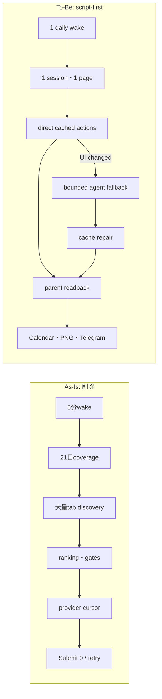

#### 4. Verification matrix

| # | To-Be | Verification | Cover |
|---:|---|---|---|
| 1 | 単一entrypoint | loaded Connector labelとprocess treeが各1 | OK |
| 2 | 単一session/page | action historyのsession ID 1、target ID 1 | OK |
| 3 | script-first | 正常fixtureでagent call 0、cached action replay成功 | OK |
| 4 | bounded fallback | selector変更fixtureでdirect failure→agent最大10 step→cache更新 | OK |
| 5 | circuit breaker | 連続failure 3で停止、追加target 0、Telegram positive ID | OK |
| 6 | live submit | 実Luma parent readback=`registered/pending` | OK |
| 7 | applied bundle | provider/Calendar/PNG/Telegramの同一lineage | OK |
| 8 | idempotency | 次wakeの同一event Submit 0 | OK |

| Item | Value |
|---|---|
| UI変更 | 外部Luma/Connpass UIをbrowserで操作。Anicca app UI変更なし |
| 結論 | Maestro不要。実CloakBrowser foreground E2Eとparent readbackが必要 |

#### 5. Boundaries

- Gig code/state/profile/launchd/`:9223`はread-only。
- CloakBrowser profile、credential、cookie、registration receipt、Calendar/Telegram evidence、append-only stateを削除しない。
- 旧orchestration fileは`rg`で他consumer 0を確認してからGit patchで削除し、broad `rm`を使わない。
- 有料event、CAPTCHA、決済、未知consentを初期minimal runnerで自動作用しない。無料の別候補へ進む。
- 21日coverage、multi-user cloud、repo-wide Healer、public claimは最初のlive bundleの前提にしない。

#### 6. Execution steps

1. Connector関連launchd/processを全停止し、旧bridge/Healerを含むloaded owner 0を確認する。
2. 現production call graphを`keep / direct-reuse / delete`へ分類し、state/evidence consumerを分離する。
3. 旧entrypoint、coverage/ranking/gate/cursor/Healer production wiringを削除する。
4. 一session・一pageのminimal runnerを作り、direct action→parent readback→downstream evidenceを接続する。
5. selector-change時だけbounded agent fallbackを実行し、成功action cacheとsafe historyを保存する。
6. foregroundでLuma live E2Eを実行し、失敗を同じrunで修正・再実行する。
7. 実`applied_bundle`後だけ単一daily launchdをloadする。
8. 次wakeの重複0とTelegram positive receiptを確認する。
9. Luma failure→Connpass continuationを同じsessionでlive実証する。
10. 実故障から得たcache repairだけをself-healingとして昇格する。

### Historical remaining TODO snapshot（進捗169、superseded。履歴のみ）

1. [x] Provider-neutral downstream write、Connpass runtime write dependencies、Luma Calendar-eligible 0 handoff、Connpass state persistenceを閉じる。証拠: 進捗141、143、144、commit `65241d6a2`、`e822bfa3a`、`d0e05f5d8`、`1cfa2e56f`。
2. [x] Privacy-safe Observer envelope/replayを実装する。完了条件: success、tool failure、timeout、process crashが同じschemaでrun/wake、stage、safe action、expected/observed effect、owner generation、screenshot SHA、provider readback、commit、cursorへ正規化され、secret/PII/raw logなし、fingerprint dedupe可能なincidentとreplay fixtureを各1件生成する。証拠: 進捗148、focused 33/33 GREEN。
3. [in progress] 旧Connector production orchestrationを削除し、minimal script-first runnerへ置換する。完了条件: Connector関連loaded owner 0でcleanupし、旧coverage/ranking/gate/cursor/Healer wiringをentrypointから除去し、一session・一page・direct action・bounded agent fallbackだけを残す。
4. Foreground Luma live E2Eを閉じる。完了条件: minimal runnerが無料・Calendar非衝突eventへ実Submitし、親が`registered`または`pending`をreadbackする。失敗時は同じpage/sessionで最大10 step fallbackし、成功action cacheを保存する。
5. 同じLuma eventの`applied_bundle`を完成する。完了条件: provider receipt、ticket/QRまたは同等receipt、full-page PNG SHA、Calendar ID/readback、Telegram card/photo positive message IDが同一lineageに存在する。
6. 次wake idempotencyを実証する。完了条件: 同一eventへの再submit 0、未処理candidateから継続、every-wake Telegram positive message IDを確認する。
7. Luma失敗時のConnpass browser-only fallbackをlive実証する。完了条件: 同じsession/pageが次providerへ進み、Connpassの実`applied_bundle`を作る。
8. Circuit breakerとdaily schedule acceptanceを閉じる。完了条件: failure 3または10分でtarget churnを停止し、実bundle後だけ単一daily launchdをload、二重owner・二重申込・Telegram無報告が各0。
9. Cached action self-healを実証する。完了条件: selector変更fixtureでdirect replay失敗→bounded agent fallback成功→cache更新→次run agent call 0。repo-wide automatic edit/merge/deploy 0。
10. Post-registration recoveryを閉じる。完了条件: Calendar、PNG、ticket、Telegram各境界の中断後、providerへ再submitせず不足artifactだけを補完し、外部登録1回・bundle1個。
11. Peatix、Meetup、Doorkeeper、Eventbriteを一providerずつ同じscript-first contractで追加する。各providerの完了条件は実`applied_bundle`。
12. Restart、multi-user isolation、public claim gate、canonical mergeを順に閉じる。Gigはread-onlyを維持し、legacy runner/bridge/Healer/重複schedule 0を最終確認する。

当時の「現在と完成形」スナップショット（進捗169時点。現行状態ではない）:

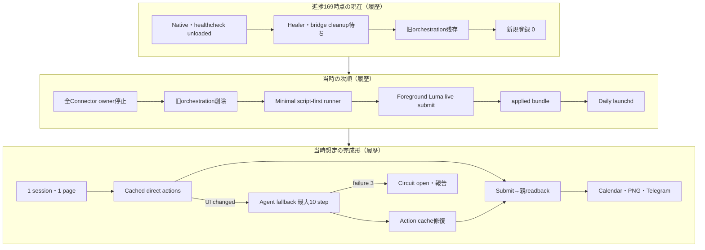

旧P0チェックリスト（履歴のみ。現在の実行順SSOTではない）:

**P0 — task deliveryを前進させる（最優先）**

1. [x] candidate outcomeの4分類contractとtable-driven testを追加する。focused 2/2、outbound 289/289。
2. [x] `LUMA_RSVP_UNAVAILABLE`、`LUMA_FORM_INPUT_REQUIRED`、満席、受付終了を`known_no_effect`へ正規化する。focused 9/9、outbound 289/289。
3. [x] append-only `candidate-attempts.jsonl`を作り、event ref、outcome、safe reason、observed_at、retry_afterを保存する。runtime 9/9、native 18/18、outbound 289/289。
4. [x] candidate attempt履歴をappend-only telemetryとして保持するが、active write rankingから候補を除外する停止gateには使わない。過去failureを含むranked candidateは全件attemptableにする。
5. [x] 同日候補をすべて順番に試し、同日枯渇時は同じpassで次open日へ進む。focused 13/13、native 19/19、outbound 300/300。
6. [x] candidate budgetによる途中終了を廃止し、`known_no_effect`では同じpass内の次候補・次open日へ進む。process crash用cursorは外部effect境界の復旧にだけ使う。
7. [x] unknown effectはLuma readbackでpresent/absentを確定するまで再submitしない。関連15/15、native 20/20、outbound 302/302。
8. [x] submit後のLuma登録済みpageをfull-page PNGで取得し、event ref、canonical URL、取得時刻、SHA-256、Calendar event IDへbindする。focused 30/30、native 21/21、outbound 302/302。
9. [x] Telegramへ結果cardと登録済みpage画像を実送信し、画像のpositive provider message IDをdelivery receiptへ保存・readbackする。run 103、card `7372`、photo `7594`、native 23/23、outbound 307/307。
10A. [x] Connectorのcandidate outcomeとselection telemetryから、本文・個人情報・secretを含まないdedupe可能なincident envelopeを生成し、mode 0600 local ledgerへ永続化する。native 25/25、outbound 314/314。
10B. [x] incident envelopeを`lm:type:self-heal` issue intakeへdedupe付きで配送し、provider issue URLをdurable receiptとして保存する。issue #1409、run 134、mode 0600 receipt一行。
11A. [x] Luma formを標準required input、custom multi-select、app-level required checkboxを含むclosed schemaへ正規化する。focused 2/2、provider回帰込み11/11。
11B. [x] verified profileの完全一致回答と明示consentだけをanswer planへ変換し、未知required fieldで虚偽入力せず次候補へ進める。回帰込み14/14。
11C. [x] exact controlだけをfill/check/selectし、各effectをreadbackするbounded executorを追加する。回帰込み16/16。
11D. [x] live DOM schema reader→private profile loader→answer plan→fill readbackを`submitLumaOnPage`のconfirm click前へ接続し、未知fieldでは同passの次候補へ継続する。
12. [x] attempt/suppressionへ`capability_version`を追加し、旧form failureを新versionで一度だけ再評価する。同versionの無限retryは禁止する。run 151で`luma-form-submit-v1`再評価を実測済み。
13. Observer trace packを実装する。run/task/event/capability versionへsafe action class、URL class、control class、expected/observed effect、owner generation、screenshot SHA、provider readback、code commitをbindし、PII/secretなしのreplay fixtureをincidentへ添付する。
14. [pause] self-fix producerはsingle-page submit transactionのlive acceptanceまで停止する。成立後はSuperpowers `systematic-debugging`→`test-driven-development`→`verification-before-completion`を強制し、一revision一仮説・一RED・一最小fixとして再開する。
15. self-build consumerをrevision-awareに復旧する。historical replay、protected-path、permission、focused/full test、rollback、隔離CloakBrowser canary、one bounded live effect、external receiptを順に通過したrevisionだけをmerge・再配備する。canary failureは同incidentの次revisionへ戻し、live receiptだけで`healed`にする。
16A. [x] Connector専用tab-owner railをrepository内へ実装する。`:9222`の既存CloakBrowser default contextから一tabだけをowner token付きで取得し、target ID、page WebSocket、baseline targetsをmode 0600 receiptへ保存する。Gigのcode/state/profile/portへ依存しない。focused 8/8 GREEN。runtimeからの利用は16Bで閉じる。
16B. [x] Terraをbrowser executorからform-answer decisionへ縮小する。親が観測したsanitized schemaと未解決質問だけを一turnで判断させ、endpoint、page WebSocket、target/owner receipt、browser/package/tab探索、inline Node、`connectOverCDP()`、`browser.close()`を渡さない。親owned pageだけがuser-facing action、submit、readback、screenshot、cleanupを行う。focused 17/17、pretest 12/12、outbound 336/336 GREEN。live effectは16Cで実証する。
16C. Connector launchd自身を最新commitでwakeし、Lumaまたはpromotion済み代替providerの実eventでform入力→final submit→登録済みまたは承認待ちmarkerを親loopが独立readbackする。Luma候補枯渇時は同じpassで次providerへ進み、agentのJSON自己申告だけを成功にしない。
16D. [x] 同じevent lineageへfull-page PNG SHA-256、Google Calendar event ID/readback、Telegram card/photo positive message IDを保存する。run 179でPNG SHA、Calendar evidence ref、card `7864`、photo `7865`をlive readbackした。
17. golden traceで確認したtrusted Gmail OTPとLuma→主催公式site handoffをprovider capabilityとして実装し、Lumaだけでは本登録にならないeventを公式readbackまで完了する。
18. Lumaと公式siteの二枚のscreenshot、Calendar event ID、Telegram message IDを一つのevent lineage receiptへ保存し、loop主体のlive E2Eを実証する。
19. source registry contractを追加し、各providerの`discovery / registration / effect_readback / screenshot_evidence` capabilityをclosed schemaで宣言する。
20. [superseded] 旧Connpass API探索。進捗145によりactive runtimeから撤回し、browser-only discoveryへ置換。
21. Connpassの認証済みbrowser registration adapter、登録済みreadback、screenshot evidenceをTDD/E2Eで追加し、初めて`registration_allowed=true`へpromotionする。
22. Peatix、Meetup、Doorkeeper、Eventbriteを同じregistryへ一siteずつ追加する。各siteは実account/session、利用規約に沿う探索経路、submit、readback、screenshotのlive proofが揃うまでadvisory-onlyとする。
23. dateごとにLuma→Connpass→Peatix→Meetup→Doorkeeper→Eventbriteの順でhandoffし、一sourceの候補枯渇・満席・未対応formでpass全体を終了しない。
24. [x] 次wakeで成功eventとknown失敗eventの双方を再選択しないことを実証する。run 113、attempt 5行・delivery 2行不変、write=null。
25. `open=0`まで反復し、21日統合Telegram briefingを送る。
26. Mac再起動後のConnector、producer、consumer launchd、heartbeat、healthcheck、stale-loop self-healを実機検証する。
27. canonical branchへ統合し、legacy bridge / Docker worker / 重複scheduleを退役する。

### 旧P0順序（進捗128の履歴のみ。現在の正本ではない）

1. [x] Gigの成功browser-foundation patternをConnector側へcopy+tweakする。親が`:9222` default contextにtargetを作成・claimし、Terraはsanitized formの回答判断だけを一turn返す。親だけが同一targetでreal action、submit、readback、screenshot、close/releaseを行い、inline Node、全page探索、反復`connectOverCDP()`、Terra側`browser.close()`を廃止する（16B再補正、進捗121〜123）。
2. [x] source registry contractを実装し、Luma、Connpass、Peatix、Meetup、Doorkeeper、Eventbriteを`discovery / registration / effect_readback / screenshot_evidence / ticket_or_qr`能力でclosed schema宣言する（19、進捗129）。
3. [x] native runtimeへprovider cursorとhandoff state machineを接続する。Task 2A contract、Task 2B1 runtime transition、Task 2B2 native-pass atomic persistenceを完了。あるproviderの候補0、満席、未対応form、known no-effectで同じpassを終えず、次候補→次providerへ進む（23、進捗130〜132）。
4. [superseded] 旧Connpass API discovery記録。現在は進捗145のbrowser-only contractへ置換済み。
5. Peatix、Meetup、Doorkeeper、Eventbriteを一siteずつ同じcontractへ追加し、各siteのlive submit/readback/evidence後だけregistrationを有効化する（22）。
6. promotion済みproviderを横断する既存Connector launchd runで、Calendar gapを持つ実eventへform入力→submit→親marker readbackを成立させる。Lumaに限定せず最初の実登録まで候補/providerを継続する（16C）。
7. 同一event lineageへprovider marker、ticket/QRまたは同等receipt、PNG SHA、Calendar ID/readback、Telegram card/photo positive IDを揃える（16D、17、18）。
8. `repeated_connect_over_cdp`、`registration_verified_then_ticket_evidence_failed`、`provider_exhausted_then_handoff`をprivacy-safe replay fixtureにし、共通Observer SDK/envelope、expectation state machine、incident fingerprintを実装する（13）。
9. Superpowers型Fixer producerをrevision-awareに復旧する。各incidentで`systematic-debugging`による単一仮説、TDDの実RED→最小GREEN、fresh verification evidenceを必須にする（14）。
10. guarded consumerと隔離canaryを復旧する。historical replay→focused/full test→protected-path/permission→rollback→isolated browser canary→one bounded live effect→external receiptを順に通す（15）。
11. Connector production loopが同じfailure classを再実行し、task固有external oracleを揃えた時だけincidentを`healed`にする。
12. Observer SDKをGig、mail、Calendar、payment、もう一つの収益loopへadapter方式で展開する。Gigのcode/state/profile/launchd/`:9223`はread-onlyのまま、導入はGig所有repo側の独立sliceで行う。
13. rolling 21日の`open=0`まで反復し、各日を`covered_existing / covered_new / unavailable`の実証拠で閉じる（25）。
14. Mac再起動後のConnector、Observer、producer、consumer、CloakBrowser、heartbeat、healthcheck、idempotency、stale-owner GCを実機検証する（26）。
15. canonical branchへ統合し、legacy bridge、Docker worker、重複scheduleを退役する（27）。

### Browser E2E判定

| Item | Value |
|---|---|
| UI変更 | あり（外部Luma/各providerの実UIを操作） |
| 結論 | Maestro: 不要。macOS CloakBrowser CDPの実E2E、provider readback、PNG、Calendar、Telegram receiptを必須とする |
| Gig境界 | DO NOT TOUCH。Gig repository、launchd、`:9223`、profile、state、lock、vaultをConnector E2Eへ使用しない |

**P1 — Connectorをconnection-to-cash agentにする（local）**

26. `registered→attended→connected→followed_up→meeting→opportunity→won→cash_received`のforward-only lifecycleを追加する。
27. event前Telegramへ、目的、会うべき人物像、30秒Rockstar_ibot説明、event固有QR/landing linkを送る。公開情報にない参加者名は創作しない。
28. event固有link、名刺/連絡先交換、inbound message、次回Calendarからconsentあるconnectionだけをeventへ紐付ける。
29. connectionごとに役割を`potential_user / customer / partner / employer / investor / collaborator`として証拠付き分類する。
30. 交換済み連絡先またはinbound相手だけへ、会話文脈付きfollow-upを実行し、無差別送信を禁止する。
31. reply→meeting→opportunityをGmail/Calendarから追跡し、停滞時に次のsafe actionを自動実行する。
32. payment、invoice、payroll/contract receiptをopportunityへ結び、cash receivedだけをConnector実収益とする。
33. Telegramへ週次funnelと「どのevent→誰との接点→何の機会→いくら受領」を直接link付きで送る。
34. 30日local canaryでevent別の登録、参加、connection、meeting、won、cash、costを実測する。
35. Connector起点の月間実収益が$10Kへ届くまで、conversionが最も弱い一段だけを毎週改善する。

**P2 — 同じcoreをRockstar_ibot Webへ移す**

36. localのidentity、policy、browser、Calendar、Gmail、Telegram、ledgerをtenant interfaceへ分離する。
37. cloud scheduler/worker、tenant別OAuth/secret/browser isolation、idempotency、rate limitを実装する。
38. Web panelへConnector funnel、connection graph、opportunity、cash attribution、証拠を投影する。
39. 別user一人でonboarding→event登録→connection→follow-up→paid outcomeを実証する。
40. Stripe subscriptionのactive paid、new/expansion/contraction/churn MRRをConnector実収益とは別ledgerで測る。
41. local Connectorのconnection-to-cash能力とWeb subscription MRRを両方維持し、合算時も内訳を失わない。

完了条件: 少なくともLumaとConnpassの実登録を含み、各providerでsubmit後の登録済みpage PNG、確認mailまたはprovider receipt、
ticket/QR（提供時）、Calendar、Telegram画像message IDが同一eventとして照合され、
今日を含む21日間（今日〜20日後）に未処理の空き日がない。各日は次のどれか一つである。

- `covered_existing`: 既に参加確定した東京の対面eventがあるため、重複予約しない。
- `covered_new`: Connectorが新たに東京の対面eventを予約し、receiptを取得した。
- `unavailable`: 固定予定と前後移動時間で実行可能なevent枠が残っていないため、重複予約しない。

単にCalendarへ何か一件あるだけでは`covered_existing`にしない。既存予定が短時間なら、その前後の
free intervalへ参加できるeventを探す。`unavailable`は、候補eventの開催時間と前後移動時間が
固定予定に衝突することをCalendar event IDと時刻で証明できた場合だけ使う。「候補を見つけられない」
ことを`unavailable`へ変換してはならない。終了条件は21日分の`open`が0件になったことだけである。
既存eventのcancelや予定変更で枠が空けば、その日は次回runで自動的に`open`へ戻る。

検索の停止条件は「候補が見つからなかった」ではなく、rolling 21日coverageが埋まったことである。

```text
今日〜20日後についてGoogle Calendarの全calendarを読む
  → 既存event、勤務、学校、移動時間からbusy/free intervalを計算
  → 既存の東京対面eventがある日はcovered_existing
  → 固定予定で参加可能な時間が残らない日はunavailable
  → それ以外をopenとして、日付の早い順に処理
  → Luma mainのTokyo / In Person inventoryを最後まで取得
  → agentが全候補を読み、好み・目標・人との出会い・serendipityでranking
  → free intervalと前後移動時間に収まる最上位候補へ申込
  → 満席・失敗・確認なしなら同じ日の次候補へ即時進む
  → Lumaを十分に探索しても確保できない時は別の許諾済み予約sourceへ進む
  → ConnpassはConnector専用CloakBrowserで候補発見し、同じparent-owned railで登録・readbackする
  → Connpassで確保できなければPeatix→Meetup→Doorkeeper→Eventbriteへ同じcapability gateで進む
  → 東京・対面・時間非衝突・自動支出policy内を確認
  → 完了画面または確認mailを取得
  → Calendar、QR、Telegramを作成
  → その日をcovered_newにする
  → 21日分のopenが0になるまで続ける
```

好みは自然言語promptと実際の参加結果から学習する。AI、crypto、英語、founder等は「高く評価する
例」であり、それ以外を除外するkeyword listではない。最も重要な目的は、Daisが家に留まらず、
毎日東京で人と会い、経験と接点を増やすことである。

同じ壊れた申込画面を無限に繰り返さない。失敗した候補は記録し、同じ日の別候補へ進む。
「0件」「検索した」「時間切れ」を正常終了にせず、`open=0`になるまで継続状態を次のjobへ渡す。
認証challenge等で一候補を完了できなくても人間の操作待ちでloop全体を止めず、別候補へ進む。

Connector内部構成:

```text
Connector Lead（21日coverageと応募完了を所有）
  ├─ Calendar Tool       gogで予定を取得・作成、重複と時刻を計算
  ├─ Event Scout         Luma本文を読み、候補とserendipityをagent判断
  ├─ Registration Tool   CloakBrowser :9222で申込、完了画面・mail・QRを取得
  ├─ Confirmation Tool   gog Gmailで確認mail、承認、cancelを照合
  ├─ Routes Tool         前後予定と移動時間を使い、申込可能か計算
  ├─ Connection Tool     event固有link・交換済み連絡先・reply・次回meetingを紐付け
  ├─ Follow-up Tool      consentあるconnectionだけを会話文脈付きで追跡
  └─ Connector Ledger    discovered→registered→attended→connected→meeting→won→cash_receivedを記録
```

Calendar/Routesの時刻計算、dedup、状態遷移、証拠照合はdeterministicに行う。どのeventへ応募するかは
agentが本文と履歴を読んで判断し、keyword/regexの固定分類へ戻さない。現地で人と会うこと自体はDaisが行うが、
参加準備、event固有の接点取得、交換済み連絡先/inbound相手へのfollow-up、返信、次回面談、opportunity、cash attributionは
Connectorのscopeとする。公開参加者情報からの無差別連絡、contact情報の推測、同意のないmarketing送信はscope外とする。

### 5.3 Order 1C — 資金調達・アクセラレーター

- [x] O1C-00A Rockstar_ibot startup contextのrepository-owned正本を設計し、product/companyの境界を固定
- [x] O1C-00B current production URL、GitHub、Telegram、demo、founder videoを実readbackしてcanonical link setを作成
- [x] O1C-00C root READMEの日英first-viewをRockstar_ibotのphysical / mental / financial product storyへ統一
- [x] O1C-00D 旧application-kitの日英answers、deck、one-pager、asset manifestをRockstar_ibot正本から再生成
- [x] O1C-00E `apply-to-funder`のYC/company configをRockstar_ibot正本参照へ変更し、旧Anicca product値をsubmit不可にする
- [x] O1C-00F startup context freshness / contradiction / old-product regression gateを実装し、previewで検証

O1C-00A実装実測（2026-08-02 JST）: `.agents/startup-context.json`へexact facts、
`.agents/product-marketing-context.md`へ意味的positioningを分離し、
`scripts/startup-context/lib.mjs`で必須field、product/company境界、claim evidence、安定SHA-256 digestを
検証する。`node --test test/startup-context.test.mjs`は6/6 pass。private email、電話、住所、credentialは
正本へ含めていない。

O1C-00B実装実測（2026-08-02 JST）: product、GitHub、TelegramはHTTP 200に加えてresponse bodyの
`Rockstar_ibot`一致まで監査し、canonical public setへ採用した。`/dashboard`はHTTP 200だがpage titleが
`Anicca Dashboard`であるため`legacy`へ降格し、応募添付を禁止した。既存video inventoryでは
79.2秒のRockstar_ibot founder videoという記録はあるがlocal fileをreadbackできず、57.8秒候補は
旧Anicca product pitchである。public demoも実物を確認できないため、demo / founder videoはURLを推測せず
`unverified`かつ添付禁止とした。実物の修復とYC要件適合はO1C-05で行う。

O1C-00C実装実測（2026-08-02 JST）: `README.md` / `README.ja.md`のfirst-viewを、身体・心・お金の
3 organ、委任範囲での実行、receipt付きTelegram報告、local / Webが同じcoreである説明へ統一した。
旧`Anicca Dashboard` badgeを削除し、product / Telegram / repositoryの検証済み導線へ置換した。
資産増加・投資収益を保証せず、self-funding / x402はFinancial Organの技術文脈として後段に保持する。
startup context testは12/12 pass。

O1C-00D実装実測（2026-08-02 JST）: `scripts/startup-context/build-kit.mjs`が
`fundraising/application-kit/`へREADME、日英answers、10-section deck、one-pager、assets manifestを
同じcontext version / SHA-256 digest付きで生成する。2回連続buildは同じfile setと内容になり、旧repo、
旧backend homepage、private email、電話、未置換placeholderをvalidatorが遮断する。legacy dashboardと
未確認demo / founder videoはmanifestの`excluded`へ入り、添付assetにならない。testは15/15 pass。

O1C-00E実装実測（2026-08-02 JST）: repository-owned `skills/apply-to-funder/`と
`fundraising/funders/yc-fall-2026.json`を追加した。program configはYC固有の質問と公式evidenceだけを持ち、
product/company/homepage/repository/traction/revenueを複製できない。公式YC pageを再確認し、Fall 2026は
late applicationを受付中、founder videoは1分・founderだけ・原稿朗読なしという現行要件を記録した。
previewはcontext digestとapplication digestへbindし、旧product field、stale context、未確認media、digest
不一致をfail-closeする。旧skillのbaseline testではsemantic context bindingが無く、transport gateが
揃えば旧Anicca pitchを提出できることを確認した。新skillは現在preview-onlyで、未確認founder videoを
blockerとして表示し、旧submit scriptへのfallbackを禁止する。OpenClaw exportはallowlist fileだけを
専用Rockstar_ibot directoryへ出し、`submitted/**`を拒否する。関連testは23/23 pass、skill validatorもpass。

O1C-00F最終監査（2026-08-02 JST）: install isolation 1件と、OSS / startup context / export /
apply-to-funder 34件の合計35/35 testがpass。canonical 3導線はHTTP 200とRockstar_ibot本文一致、
application kitは2回連続生成で同一、skill validatorもpassした。YC previewはcontext / application digestへ
bindされ、未確認founder videoをexpected blockerとして保持し`submit_allowed: false`である。監査証拠は
`docs/evidence/fundraising/2026-08-02-startup-context-audit.json`。O1C-00は完了し、現在地をO1B-25へ戻す。

- [ ] O1C-01 repository-owned startup contextを全funder applicationのcompany facts正本として接続
- [ ] O1C-02 funder/accelerator registryを再構築
- [ ] O1C-03 MUFG運営/CVC deny gateとpartner確認を実装
- [ ] O1C-04 YC descriptionを制約内へ修正
- [ ] O1C-05 58秒founder videoを検証してupload
- [ ] O1C-06 founder profileを完了
- [ ] O1C-07 YC Fall 2026へ実提出
- [ ] O1C-08 完了画面、確認mail、ledger、Telegramを照合
- [ ] O1C-09 cold outreachを1日3〜5通で再開
- [ ] O1C-10 follow-up最大2回を自動実行
- [ ] O1C-11 Gmail reply/rejection/meetingを型付きstatusへ反映
- [ ] O1C-12 meetingをCalendarへ登録し面談資料を生成
- [ ] O1C-13 全form送信を既存CloakBrowser daily-driverで行い、新browserを起動しない
- [ ] O1C-14 公式program pageを毎日探索し、固定list外の新規募集をregistryへ追加
- [ ] O1C-15 deadline、location、solo可否、terms、eligibilityを提出当日に再検証
- [ ] O1C-16 会社facts、traction、MRR、deck、videoのfreshness gateを実装
- [ ] O1C-17 `gog`でconfirmation/replyをthread ID単位に取得し、Job Hunter ledgerへ統合
- [ ] O1C-18 application→confirmation→interview→offer/reject→fundedのfunnelをWebへ投影
- [ ] O1C-19 accelerator以外のVC/angelはthesis一致時だけ1日3〜5件へpersonalized outreach
- [ ] O1C-20 採択・面談の結果を次のpitchとtarget rankingへ反映する週次reflection
- [ ] O1C-21 旧`apply-to-yc`のfield/video/progress知識を後継YC providerへ移植
- [ ] O1C-22 古いSummer application IDがFall 2026へ継続可能かYC home実画面で確認
- [ ] O1C-23 `yc-w26.json`のbatch、deadline、amount、URLをcurrent official factsへ更新
- [ ] O1C-24 YC操作を別Chrome `9223`から既存CloakBrowser daily-driver `:9222`へ移行
- [ ] O1C-25 current company facts、founder profile、58秒動画、demo、progressをpreviewで全確認
- [ ] O1C-26 Submitを一度だけ実行し、完了画面とconfirmation mailを取得
- [ ] O1C-27 YC reply/interviewを毎日追跡し、Calendarと面談準備へ接続

完了条件: 実accelerator提出と確認receipt、reply追跡、面談calendar経路が動く。

### 5.4 Order 2 — 求人応募

- [ ] O2-01 job worktreeの未commit変更を整理
- [ ] O2-02 canonical mainへrebase
- [ ] O2-03 206 testを再実行し緑化
- [ ] O2-04 PR、review、merge
- [ ] O2-05 canonical runtimeで実cycle
- [ ] O2-06 700万円未満reject・1,000万円targetを実logで検証
- [ ] O2-07 Guardian、Lifecycle、summary.v2を完成
- [ ] O2-08 Ashbyへ実応募しreceipt取得
- [ ] O2-09 Workdayへ実応募しreceipt取得
- [ ] O2-10 面接mail→Calendarを実証
- [ ] O2-11 trace、週次reflection、segment Pareto、20% holdoutを実装
- [ ] O2-12 既存daily-driver owner `ai.anicca.job-search-daily`を維持し、共有browserや他tabを閉じない

完了条件: AshbyとWorkdayの実receipt、canonical実cycle、面接mail→Calendarが揃う。

### 5.5 Order 3A — CFO実行基盤復旧

- [ ] O3A-01 runtime database URLをsecret providerから注入
- [ ] O3A-02 bootが正しいenv/secretを読む
- [ ] O3A-03 financial executorをlaunchdへ登録
- [ ] O3A-04 enqueue→claim→execute→receipt→Telegramを実証
- [ ] O3A-05 restart、retry、dead-letter、dedupを実証
- [ ] O3A-06 死んだ`ai.anicca.cfo-daily`残骸を退役
- [ ] O3A-07 data freshnessと失敗をTelegramへ警告

### 5.6 Order 3B — Dais個人CFO

- [ ] O3B-00 公式current docsとlocal secret有無を監査し、必要credential/scope/契約をDaisへ一括質問
- [ ] O3B-01 account、transaction、position、liability schema
- [ ] O3B-02 JPY、original currency、FX provenance
- [ ] O3B-03 Moneytree LINK契約済みならproduction OAuth、未契約ならMoneytree Web公式exportへ実接続
- [ ] O3B-04 銀行・card・証券の実残高と実明細をimportし、fake/mock/dry-runを完了証拠にしない
- [ ] O3B-05 Binance read-only接続
- [ ] O3B-06 Daisのon-chain walletをread-only取得
- [ ] O3B-07 内部振替の二重計上防止
- [ ] O3B-08 merchant正規化と支出category
- [ ] O3B-09 subscription検出と利用状況
- [ ] O3B-10 1か月・3か月・12か月集計
- [ ] O3B-11 net worth、cash flow、burn、runway、budget、baseline、anomaly
- [ ] O3B-12 daily/weekly/monthly Telegram report
- [ ] O3B-13 reportの全数値からsource receiptへ遡れることを実証
- [ ] O3B-14 CFO Lead Agentのgoal、input、tool、output、停止条件を定義
- [ ] O3B-15 Bookkeeper、Cashflow、Income、Capital、Fiat/NISA、Crypto、Tax、Reporter specialistのcontractを定義
- [ ] O3B-16 specialistが同じ統一財務台帳だけを読み書きし、agent間chatを正本にしない
- [ ] O3B-17 FinRobot型の「数値はコード、解釈はagent、全数値は出典付き」をcontract test化
- [ ] O3B-18 Actual Budgetのaccount/transaction/budget modelをRockstar_ibot schemaと比較し、移植範囲を決定
- [ ] O3B-19 Ghostfolio/rotkiのUX・会計modelについてlicense reviewとcopy禁止境界を記録
- [ ] O3B-20 Financial Organの日次close loopと週次reflection loopを実装
- [ ] O3B-21 specialistごとの予測、提案、実行、結果を同一decision IDで追跡
- [ ] O3B-22 self-improvement変更をhistorical replay→shadow→canary→promotionで検証
- [ ] O3B-23 agentが権限、損失上限、署名policyを自己変更できないことをtest
- [ ] O3B-24 CFOが全specialist結果を一つの人間向けTelegram briefingへ統合

完了条件: Daisの総資産、収入、支出、負債、投資、cryptoがJPYで照合され、1か月・3か月報告が正しい。

### 5.7 Order 4 — 暗号資産運用

- [ ] O4-01 Anicca-ownedとDais-ownedをwallet・ledger・reportで分離
- [ ] O4-02 Dais main Binanceはread-onlyを維持
- [ ] O4-03 CFOから失ってよいcanary上限を算出
- [ ] O4-04 strategy data、backtest、paper trade
- [ ] O4-05 fee、slippage、drawdown、benchmark比較
- [ ] O4-06 paper gate通過strategyだけ小額canary
- [ ] O4-07 1取引・1日・1か月loss cap
- [ ] O4-08 asset/destination allowlist
- [ ] O4-09 LLMから独立したpolicy signer
- [ ] O4-10 emergency stopとrecovery
- [ ] O4-11 fill、fee、transfer、P&LをCFOへ照合
- [ ] O4-12 負けるstrategyを縮小・停止し、勝つstrategyだけ段階増額
- [ ] O4-13 TradingAgents型のanalyst→bull/bear→trader→risk→portfolio reviewをpaper環境へ接続
- [ ] O4-14 ai-hedge-fundのbacktesterとRockstar_ibotのfee/slippage/benchmark要件を比較
- [ ] O4-15 debate agentの多数決ではなく、独立Risk Governorのpolicy gateを最終権限にする
- [ ] O4-16 reflectionが未来dataを参照しないlook-ahead防止evalを通す

完了条件: 所有者別会計、全cap、緊急停止、after-fee P&L、CFO照合が実canaryで成立する。

### 5.8 Order 5 — 法定通貨投資・NISA

- [ ] O5-01 emergency cash reserveと投資可能余剰をCFOから算出
- [ ] O5-02 NISA保有、年間残枠、生涯残枠、課税口座を分離
- [ ] O5-03 J-Quants等から市場dataを取得
- [ ] O5-04 Daisの証券会社と正式execution APIを実測
- [ ] O5-05 NISA口座でAPI注文可能かを口座・商品別に検証
- [ ] O5-06 allocation、積立、rebalance proposal
- [ ] O5-07 approval/signing policy
- [ ] O5-08 order→fill→receipt→CFOを実証
- [ ] O5-09 fee、配当、税、FX込みperformance
- [ ] O5-10 monthly Telegram report
- [ ] O5-11 FinRobotのvaluation operatorとOpenBBのdata interfaceをJ-Quants/NISA向けに評価
- [ ] O5-12 Fiat/NISA Agentの提案をRisk GovernorとCFO Leadが別々にreview
- [ ] O5-13 benchmark、tax、fee後performanceを週次reflectionへ戻す
- [ ] O5-14 NISA制度・年間枠・生活防衛資金をagentが自己変更できないpolicyとして固定

完了条件: cash reserve、NISA、課税口座、cryptoを混ぜず、提案から約定・CFO反映まで照合される。

### 5.9 Order W — Rockstar_ibot Webアプリ化

- [ ] OW-01 localのjob、specialist contract、ledger、report templateをshared coreとして切り出す
- [ ] OW-02 全financial row、decision、secret、artifactへtenant境界を追加
- [ ] OW-03 tenant別Google OAuth、Moneytree OAuth、exchange/broker credential vault
- [ ] OW-04 tenant別browser profile、scheduler、worker、rate limit、cost budget
- [ ] OW-05 Telegram account connectionと同じ直接link/添付UXを再現
- [ ] OW-06 Web panelへnet worth、cash flow、1/3/12か月、応募funnel、agent別成果を表示
- [ ] OW-07 user自身がpermission、budget、risk cap、停止を確認・変更できる設定画面
- [ ] OW-08 data export、account disconnect、token revoke、全data削除を実装
- [ ] OW-09 security review、tenant isolation test、secret leak test、financial action audit
- [ ] OW-10 Stripe subscriptionとtrue MRR、churn、active paidを計測
- [ ] OW-11 Dais以外のpilot user一人でbank接続からTelegram月次報告まで実証
- [ ] OW-12 pilotの誤分類・誤通知・離脱理由をevalへ戻し、10人→100人へ段階拡大

完了条件: Daisローカル版を書き直さず、同じcoreを別userが自分の口座・Telegram・risk policyで
安全に使い、最初の有料継続利用と月次reportまで成立する。

## 6. agent判断とdeterministic処理の境界

agentが判断する:

- event、accelerator、jobの意味・適合性・優先度
- 相手ごとの応募文面・返信
- 市場状況からの候補戦略と説明
- transactionのmerchant/category候補とconfidence
- 支出の意味、通常状態からの逸脱理由、利用者へ伝える優先度
- 複数の投資仮説、反対意見、riskの説明、実行候補のranking
- specialistを呼ぶ必要があるか、追加dataを調べるべきか、いつ判断を保留するか

deterministic codeが担当する:

- API/browser tool
- 金額計算
- 権限と上限
- ledger
- deduplication
- receipt検証
- retry、heartbeat、emergency stop
- 口座残高、複式/振替照合、JPY換算、tax lot、fee、PnL、NISA枠
- permission、allowlist、loss cap、生活防衛資金、署名、注文の最終gate
- source timestamp、freshness、decision ID、監査履歴、Telegram delivery

意味判断をregexやkeywordだけで実装しない。固定形式のparseだけにregexを許可する。
specialist agentの合議、多数決、CFO Leadの指示のいずれも、deterministic policy gateを
上書きできない。

## 7. ローカルからRockstar_ibot Webアプリへの進化

新しい二つ目のRockstar_ibotを作らない。同じruntime、ledger、receipt、Telegram文面を
ローカルとWebで共有する。

```text
段階L: DaisのMacで実証
  CloakBrowser daily-driver :9222
  + local scheduler / executor
  + PostgreSQL ledger
  + Telegram
          ↓ 同じjob・同じreceipt・同じsnapshot hash
段階W: 既存Rockstar_ibot panelへ投影
  Telegram = 毎日の操作面
  Web panel = 詳細、履歴、グラフ、証拠
          ↓ Order 1〜5のlocal実証完了後
段階C: Rockstar_ibot Webアプリとして提供
  tenant別connector
  + tenant別secret / browser profile
  + managed scheduler / worker
  + subscription
```

ローカル版で得た実装を捨ててWeb版を書き直さない。Webアプリは同じcoreの別表示・別配置である。

### 7.1 画面の役割

- Telegram: 朝の要約、完了報告、例外警告、承認、停止
- Web panel: 全資産、1か月・3か月推移、応募funnel、receipt、agent別P&L、設定
- CloakBrowser daily-driver: ローカルの外部Web操作。ユーザー画面ではない
- ledger: TelegramとWeb panelの唯一の数値正本

## 8. 月間1,000万円への経済モデル

月間1,000万円を一つの曖昧な数字にしない。dashboardでは次を分ける。

```text
月間総経済効果
  = 給与手取り増分
  + Rockstar_ibotその他事業の継続売上
  + agentの外部純収益
  + 暗号資産・法定通貨投資の実現純利益
  + 削減した固定費

事業MRR
  = 毎月継続して支払う顧客からの売上だけ
```

給与、資金調達額、含み益、元本入金をMRRとして数えない。

各agentの寄与:

| agent | 月間1,000万円へどう寄与するか | 正しい計測 |
|---|---|---|
| Events | 登壇、顧客、投資家、採用機会を増やす | 登録→参加→商談→成約 |
| Fundraising | 資金とnetworkを獲得し、runwayと事業成長速度を上げる | 調達額はMRRでなくcapital |
| Job Hunter | より高い安定収入を獲得する | 旧職との差額、手取り、継続月数 |
| CFO | 無駄な固定費を止め、投資可能余剰を増やす | 解約・削減済み金額、cash flow |
| Crypto Manager | 分離された小額capitalをrisk-adjustedに運用する | fee後実現P&L、drawdown |
| Fiat/NISA | 長期資本を税制込みで複利運用する | 税・fee後performance |
| Rockstar_ibot Webアプリ | Daisで実証したsystemを他userへ月額提供する | active paid、churn、真のMRR |

真のMRRを月間1,000万円にする算式例:

| 月額単価 | 必要な継続有料user |
|---:|---:|
| ¥10,000 | 1,000人 |
| ¥20,000 | 500人 |
| ¥50,000 | 200人 |

最初はDais一人のローカル運用で、支出削減、応募、収入、投資、Telegram UXを実証する。
その後、同じcoreをRockstar_ibot Webアプリへ統合し、有料userの継続売上をMRRとして積み上げる。

### 8.1 Connector単体がlocalで月$10,000へ寄与するloop

最初の目標はWeb subscription MRRではない。DaisのMacで動くConnectorがeventを通じて作ったconnectionから、
**実際に受領したUSD 10,000/月の帰属可能収益**を作ることである。保証値ではなく、cash receiptまで到達した検証目標である。

Connector実収益へ含める:

- eventで出会った人が購入したRockstar_ibot/pilot/consultingの実入金
- event connectionから生じたcontract、partnership、referralの実入金
- event connectionが直接生んだ新しいjob/contractの月次手取り増分

含めない:

- 登録数、参加数、名刺数、返信、meeting、proposal、口約束
- 資金調達額、含み益、元本移動、未回収invoice
- eventとのsource pathを証明できない売上や給与

月$10Kは単一商品価格ではなく、次のcash ledger式で測る。

```text
Connector attributable cash
  = Rockstar_ibot / pilot cash received
  + consulting / contract cash received
  + partnership / referral cash received
  + verified monthly job or contract income uplift
  - event fee / travel / follow-up / delivery cost
```

たとえば`paid pilot $4K + consulting/contract $4K + verified income uplift $2K = $10K`は一つの検証可能な構成であり、
forecastではない。各項目はevent、connection、opportunity、payment/payroll receiptまで同じlineageを持つ場合だけ計上する。

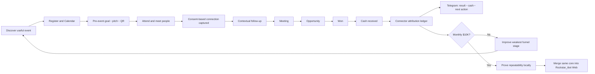

Connectorは登録数を最大化しない。`cash_received / attended`とnet cashを改善する。最初はsampleが小さいため、eventを
connectionのverified first touchとして保存し、cashまでのpathを全件表示する。複数touchpointがある時はConnector単独売上と断定せず、
`connector_assisted`として分離する。localでこのloopを成立させた後、同じlifecycle、policy、receipt、Telegram templateを
Rockstar_ibot Webへ移す。Web subscription MRRはその後の別収益streamである。

根拠:

- ソース: [OpenAI Orchestration and handoffs](https://developers.openai.com/api/docs/guides/agents/orchestration) / 核心の引用: 「A manager should stay in control and call specialists as bounded capabilities」
- ソース: [Telegram Bot API](https://core.telegram.org/bots/api#sendmessage) / 核心の引用: 「On success, the sent Message is returned」
- ソース: [HubSpot lifecycle stages](https://knowledge.hubspot.com/records/use-lifecycle-stages) / 核心の引用: 「Lifecycle stages are used to track how contacts or companies move forward in your process」
- ソース: [Google Analytics attribution](https://support.google.com/analytics/answer/10596866) / 核心の引用: 「Attribution is the act of assigning credit for important user actions to different ads, clicks, and factors along the user's path」
- ソース: [Stripe Subscription analytics](https://docs.stripe.com/billing/subscriptions/analytics) / 核心の引用: 「新規登録、アップグレード、ダウングレード、再有効化、解約を含む各顧客のすべての MRR の推移」

## 9. 完成時の全体図

```text
                              Dais
                               │
                    1つのTelegramチャット
                               │
       ┌───────────────────────┼────────────────────────┐
       │                       │                        │
イベント・資金調達          求人応募                   CFO
応募・追跡・面談          応募・返信・面接       総資産・支出・収支
       │                       │                        │
       └───────────────────────┼────────────────────────┘
                               │
                        資金配分・危険管理
                               │
                    ┌──────────┴──────────┐
                    │                     │
              暗号資産運用          法定通貨・NISA
             AniccaとDais分離          長期資産形成
                    │                     │
                    └──────────┬──────────┘
                               │
                          統一財務台帳
                               │
                      計測 → 学習 → 改善
                               │
                         Telegramへ報告
```

### 9.1 Rockstar_ibotのOrgan構造

Rockstar_ibot全体は四つのorganを持つ。同じuser、Calendar、Telegram、memoryを共有するが、
organごとに目的、data、権限を分離する。

```text
Rockstar_ibot
│
├─ Daily Organ
│   └─ 今日の予定、応募、連絡、優先順位、実行状況
│
├─ Physical Organ
│   └─ 睡眠、運動、食事、通院、身体data
│
├─ Mental Organ
│   └─ 気分、注意、習慣、瞑想、介入、振り返り
│
└─ Financial Organ
    └─ 残高、支出、収入、資金調達、投資、risk、純資産
```

Daily Organは一日の入口であり、他organの正本dataを所有しない。たとえば「今夜のイベント」と
「今月使えるevent予算」はDailyとFinancialの両方に関係するが、予定の正本はCalendar、
予算の正本はFinancial ledgerとする。

### 9.2 Financial Organ — CFO Leadとspecialist

```text
                              Dais
                               │
                        Telegram / Web
                               │
                         CFO Lead Agent
               目標、優先順位、task分解、最終説明
                               │
       ┌───────────┬───────────┼───────────┬───────────┐
       │           │           │           │           │
  Bookkeeper   Cashflow     Income      Capital     Reporter
  Agent        Agent        Agent       Agent       Agent
  明細整理     予算・burn   給与・事業   資金調達     人間向け報告
  振替照合     subscription 求人成果     runway       link/添付
       │           │           │           │           │
       └───────────┴──────┬────┴───────────┴───────────┘
                          │
                  Portfolio Strategy Team
                 ┌────────┴─────────┐
                 │                  │
          Fiat / NISA Agent    Crypto Agent
          日本株・ETF・現金      Binance・wallet
                 │                  │
                 └────────┬─────────┘
                          │
                  Independent Review
             ┌────────────┴────────────┐
             │                         │
        Tax/Audit Agent          Risk Governor
        税・出典・照合            上限・権限・停止
             │                         │
             └────────────┬────────────┘
                          │
             Deterministic Policy + Signer
          金額計算・NISA枠・loss cap・allowlist
                          │
                 Bank / Broker / Exchange
```

役割:

| role | 自分で考えること | 自分では変更・実行できないこと |
|---|---|---|
| CFO Lead | 今日の財務課題、必要なspecialist、優先順位、Daisへの説明 | ledger数値の創作、risk gateの上書き、秘密鍵操作 |
| Bookkeeper | merchant/category候補、明細の意味、確認が必要な取引 | 残高計算、振替の二重計上、原本削除 |
| Cashflow | 支出の異常、予算改善、subscription、runway改善案 | 予算値の無断変更、契約の即時解約 |
| Income | Job Hunter、事業収入、agent収益の改善仮説 | 給与やMRRへの資金調達額・含み益の混入 |
| Capital | accelerator、VC、grant、runwayの資金調達戦略 | 調達を売上として計上、契約への無断署名 |
| Fiat/NISA | allocation、積立、rebalance、投資仮説 | NISA枠・生活防衛資金・注文上限の変更 |
| Crypto | strategy、market調査、paper結果、canary提案 | Dais main口座の出金、loss cap変更、無許可asset |
| Tax/Audit | source不足、税区分、照合差、監査質問 | 不明差額を推測で埋める |
| Reporter | 全agentの結果を人間が理解できる一通へ編集 | 未確認の成功、数字、linkの創作 |
| Risk Governor | 反対意見、集中risk、流動性、停止提案 | policy signerを迂回した執行 |

CFO Leadだけを常時「親」とするが、すべてのspecialistを毎回起動しない。残高同期ならBookkeeper、
支出異常ならCashflow、投資日ならFiat/NISAとRiskだけを呼ぶ。これはagent数を増やすこと自体を
目的にせず、必要な専門判断だけを呼ぶためである。

### 9.3 一日のFinancial Organ loop

```text
OBSERVE
  Moneytree / bank / card / Binance / wallet / broker / incomeを同期
     ↓
RECONCILE
  残高、明細、振替、為替、freshnessを決定的コードで照合
     ↓
CFO PLAN
  CFO Leadが今日解くべき問題と必要なspecialistを選ぶ
     ↓
SPECIALIST ANALYSIS
  支出、収入、資金調達、Fiat、Crypto、Taxを必要な分だけ分析
     ↓
CHALLENGE
  bull/bearではなく、提案に応じた反対仮説とRisk reviewを行う
     ↓
POLICY GATE
  金額、権限、生活防衛資金、NISA枠、loss cap、allowlistをcodeで検査
     ↓
EXECUTE
  読取、応募、通知、承認済み注文など許可されたtoolだけを実行
     ↓
VERIFY
  providerの完了結果、mail、fill、残高変化を元のdecisionへ結合
     ↓
REPORT
  「何をした・なぜ・いくら・結果・次」をTelegramへ直接link付きで送る
```

### 9.4 self-improvement loop

各specialistはloopを持つが、勝手にpromptや権限を書き換えて即本番化しない。

```text
予測・提案をdecision ID付きで保存
       ↓
後日の実結果と比較
       ↓
失敗理由・成功理由を週次reflection
       ↓
prompt / tool / data sourceの改善案を生成
       ↓
過去期間を使ったhistorical replay
       ↓
現行版とのshadow比較
       ↓
小範囲canary
       ↓
accuracy、after-fee効果、false positive、costが改善した時だけpromotion
       ↓
悪化時は自動rollback
```

self-improvementの対象:

- 調べるsourceと追加query
- 説明の分かりやすさ
- category提案
- anomalyの優先順位
- investment researchと反対仮説
- Telegram reportの有用性

self-improvementの対象外:

- bank/exchange permission
- withdrawal権限
- loss cap
- NISA制度値
- 生活防衛資金
- owner境界
- secret、signer、allowlist

これらのhard safetyはDaisの明示変更とtestなしに変えない。

## 10. Telegram逐語文面の正本

以下はこのtrackでDaisへ届く**正確なtemplate**である。`{{...}}`だけをledgerの実値で置換する。
実装はi18n/templateから生成し、agentが数値や成功を創作しない。

### 10.0 人間向け報告の絶対規則

Telegramは開発者用logではない。利用者が知りたいのは「自分の代わりに何をしたか」である。

通常メッセージに次の内部語を出さない:

- launchd、cron、runner、worker、queue、bounded、timeout、parse
- receipt、ledger、E1/E2/E3、JSON、HTTP status、stack trace
- adapter、provider、runtime、process、exit code

必ず利用者の言葉へ変換する:

| 内部状態 | 利用者へ伝える言葉 |
|---|---|
| job succeeded + evidence verified | 「応募が完了しました。確認メールも届いています」 |
| process succeeded but evidence missing | 「操作は行いましたが、応募完了を確認できていません」 |
| timeout | 「応募画面の途中で止まりました。応募済みにはしていません」 |
| delivery parse error | 「Telegramへの報告送信に失敗しました」 |
| dead-letter / retry scheduled | 「明日もう一度試します」 |
| Gmail reconciliation | 「応募先からのメールを確認しました」 |

すべての行動報告は、次の7問へ上から順に答える。

1. 何をしたか
2. どこへ応募したか
3. 何の役割・登壇内容・programか
4. どの履歴書、deck、動画、応募文を使ったか
5. なぜDaisに合うと判断したか
6. 本当に完了したか、相手から確認が来たか
7. 次に何が起き、Daisに何が必要か

内部診断は通常非表示とし、本文中の`[技術詳細を見る]({{technical_detail_url}})`を
タップした時だけ表示する。

実装時はTelegram templateへcopy lintを置き、上記内部語が通常本文に入ったらtestを失敗させる。
また、履歴書、職務経歴書、cover letter、deck、動画、LT概要はファイル名だけで終わらせず、
Telegram添付または認証済みpanel linkから実物を開けることを完了条件にする。

リンクのUX規則:

- `［履歴書を見る］`のようなURLを持たない疑似buttonは禁止
- 外部のevent・求人・programは、本文中のMarkdown linkから公式pageへ直接開く
- 履歴書、職務経歴書、cover letter、deckはTelegramへ実ファイルを添付する
- 添付に加えて、認証済みRockstar_ibotの恒久URLも本文へ置く
- private artifactへ公開URLを発行しない。user認証または短寿命signed URLを要求する
- 状態変更操作はlink先に確認画面を出し、誤tapだけで取消・送信・売買しない
- Telegram inline keyboardを使う場合も、tap後に目的画面が直接開くことをE2E testする

### 10.1 毎朝の統合briefing

```text
☀️ おはようございます。今日のRockstar_ibot報告です。

純資産: ¥{{net_worth}}（前日比 {{net_worth_delta}}）
現金: ¥{{cash}}
投資: ¥{{investments}}
暗号資産: ¥{{crypto}}
負債: ¥{{liabilities}}

今月の収入: ¥{{income_mtd}}
今月の支出: ¥{{spend_mtd}}
今月の純増減: ¥{{net_change_mtd}}
生活可能期間: {{runway_months}}か月

応募状況:
・イベント: {{event_count}}件
・資金調達: {{funder_count}}件
・求人: {{job_count}}件
・面談予定: {{meeting_count}}件

今日の実行:
{{today_actions}}

[今日の詳細を開く]({{daily_detail_url}})
[今日の実行を止める]({{pause_confirmation_url}})
```

### 10.1A Connectorの24時間UX

Connectorは一日一回の検索cronではなく、21日間の空きを継続的に埋めるevent application loopである。
責務はdiscover、申込、確認mail、QR、Calendar登録までで終わる。現地参加後の連絡や関係管理はしない。

| 時刻 / trigger | 裏側で行うこと | Daisへ届くもの |
|---|---|---|
| 00:05 | 日付を一日進め、今日〜20日後の全Calendar、cancel、変更を再照合 | 通常は無通知 |
| 00:15〜06:00 | `open`日を日付順に全許可providerで探索・申込・receipt/Calendar照合。一候補・一providerの失敗では止まらない | 通常は無通知 |
| 06:30 | 21日coverage、既存予約、今回の新規予約、未処理の空きを集計 | 朝のConnector briefingを一通 |
| 新規予約成立時 | そのrunで成立した複数eventをまとめて保存 | 3週間の空きを何件埋めたかを一通。eventとCalendarの直接link付き |
| 09:00 | 夜間に届いた各providerの確認、承認、cancel receiptを再照合 | 状態が変わったeventだけ通知 |
| 12:00 | 残っている`open`日と、朝以降に公開されたeventを再探索 | 新規予約成立時だけ通知 |
| 18:00 | cancelや予定変更で再び空いた日を検知し、同日の別候補へ申込 | 置換予約が成立した時だけ通知 |
| 23:45 | 未確認申込と未処理の空きを次runへ再投入 | 正常時は無通知。翌日も同じ状態から継続 |

固定時刻はschedulerの起動契機であり、event選択をhardcodeするものではない。新規予約が06:30以降に
成立すれば、翌日まで隠さず成立時に送る。候補単位の失敗は通知せず、別候補へ進む。

現在の次の文面は禁止する。

```text
🔌 Connector 日報 {{date}}
本日の新規登録なし（none: 対面AI/crypto候補が見つからなかった or horizon埋済）
```

禁止理由:

- 「候補がない」と「すでに埋まっている」という別状態を`none`へ潰している
- AI/cryptoをhard filterにし、startup、founder、VC、product、finance、serendipityを捨てている
- 21日間のどの日に空きがあるか分からない
- どのeventへ申し込み、確認mailとCalendar登録が完了したか分からない
- event名、日時、場所、申込link、QRへ直接移動できない

朝のConnector briefing:

```text
🔌 Connector 3週間計画 {{date}}

確認期間: {{window_start}}〜{{window_end}}
既存の対面予定: {{covered_existing_count}}日
新しく予約済み: {{covered_new_count}}日
固定予定で追加不可: {{unavailable_count}}日
未処理の空き: 0日

今日の予定:
{{event_time}} {{event_name}}
場所: {{event_location}}
申込状態: {{registration_status}}

[今日のイベント]({{canonical_event_url}})
[QRを開く]({{ticket_url}})
[3週間のCalendar]({{calendar_coverage_url}})
```

新規予約成立時:

```text
🎟️ 3週間の空きを{{covered_new_count}}件埋めました。

確認期間: {{window_start}}〜{{window_end}}
未処理の空き: {{open_count}}日

今回予約したevent:
{{confirmed_event_rows}}

各eventについて申込完了画面または確認mailを取得し、Calendarへ登録しました。

[予約したeventを開く]({{confirmed_event_list_url}})
[3週間のCalendarを開く]({{calendar_coverage_url}})
```

新規予約0件が許される文面:

```text
✅ 今後3週間のevent予定はすでに埋まっています。

確認期間: {{window_start}}〜{{window_end}}
既存予約でcovered: {{covered_existing_count}}日
固定予定により追加不可: {{unavailable_count}}日
未処理の空き: 0日
今回の新規予約: 0件

理由: 21日間に申込可能な空きが残っていないため、二重予約しませんでした。

[3週間のCalendarを開く]({{calendar_coverage_url}})
[予約済みeventを開く]({{confirmed_event_list_url}})
```

「見つからなかった」だけを理由に新規予約0件を送ってはならない。`open`が残る限り探索と申込を
継続する。Connectorの報告対象はevent applicationだけであり、現地参加、相手への連絡、返信、
次回面談を実行・報告しない。

### 10.2 イベント登録

```text
🎟️ イベント参加の申込みが完了しました。
イベント: {{event_name}}
日時: {{event_datetime}}
場所: {{event_location}}
申込者: {{registration_identity}}

このイベントを選んだ理由:
{{selection_reason}}

当日のQRをこのメッセージに添付しました。
カレンダーにも登録済みです。

イベントページ: {{canonical_event_url}}

[イベントページを開く]({{canonical_event_url}})
[カレンダーを開く]({{calendar_event_url}})
[申込内容を見る]({{application_detail_url}})
```

一候補の証拠が不足した場合も、そのwakeのTelegram報告を省略しない。未確認候補をCalendarへ登録せず、
privacy-safeなfailure class、現在cursor、次の自動actionを`continuing`または`recovering`としてdurable outboxへ記録し、
同じ日の次候補へ進む。account lock、予期しない課金、identity不一致は同じ必須報告に高severityを付ける。
Telegram transport自体が故障してもpositive message IDを得るまでoutboxから削除せず、Connector本体は安全な別候補で継続する。

LT・登壇応募:

```text
🎤 {{event_name}}へLT登壇を申し込みました。

発表タイトル: {{talk_title}}
発表時間: {{talk_duration}}
話す内容:
{{talk_summary}}

Rockstar_ibotを紹介する部分:
{{product_demo_summary}}

提出したもの:
・登壇者プロフィール: {{speaker_profile_name}}
・発表概要: {{abstract_name}}
・デモURL: {{demo_url}}
・スライド: {{slide_status}}

現在の状態: 主催者の確認待ち
回答予定: {{expected_reply_date}}

[提出した登壇内容を見る]({{talk_application_url}})
[イベントページを開く]({{canonical_event_url}})
[カレンダーを開く]({{calendar_event_url}})
```

### 10.3 アクセラレーター提出

```text
🚀 {{program_name}}へ応募しました。

会社: {{company_name}}
応募したprogram: {{program_name}}
応募日時: {{submitted_at}}

このprogramを選んだ理由:
{{fit_reason}}

提出したもの:
・応募回答: {{application_answer_version}}
・pitch deck: {{deck_name}}
・創業者動画: {{founder_video_name}}
・product demo: {{demo_name}}
・使用した実績値: {{traction_as_of}}時点

相手からの確認メール: 受信済み
現在の状態: 書類選考待ち
次に確認する日: {{followup_at}}

[応募回答を見る]({{application_detail_url}})
[pitch deckを開く]({{deck_url}})
[確認メールを見る]({{confirmation_mail_url}})
```

### 10.4 投資家・アクセラレーターからの返信

```text
📨 {{sender_name}}から返信が届きました。
判定: {{reply_status}}
要点: {{reply_summary}}
必要な次の行動: {{next_action}}

{{meeting_datetime_line}}

[返信案を見る]({{reply_draft_url}})
[カレンダーを開く]({{calendar_event_url}})
```

### 10.5 求人応募

```text
💼 求人への応募が完了しました。

会社: {{company}}
職種: {{role}}
勤務地: {{location}}
提示年収: {{salary_range}}

この求人を選んだ理由:
{{fit_reason}}

提出したもの:
・履歴書: {{resume_name}}
・職務経歴書: {{career_history_name}}
・cover letter: {{cover_letter_name}}
・追加回答: {{additional_answers_summary}}

相手からの応募確認メール: {{confirmation_mail_status}}
現在の状態: {{human_status}}
次に確認する日: {{followup_at}}

[求人ページを開く]({{job_url}})
[提出した履歴書を開く]({{submitted_resume_url}})
[応募内容を見る]({{application_detail_url}})
```

### 10.6 面接確定

```text
📅 面接が決まりました。
会社: {{company}}
職種: {{role}}
日時: {{interview_datetime}}
形式: {{interview_format}}

カレンダーへ登録済みです。
会社調査、想定質問、回答材料も準備しました。

[面接準備を見る]({{interview_prep_url}})
[カレンダーを開く]({{calendar_event_url}})
```

### 10.7 支出異常

```text
⚠️ 支出に異常を検知しました。
項目: {{merchant_or_category}}
今月: ¥{{current_amount}}
通常: ¥{{baseline_amount}}
差: {{difference_percent}}%

主な明細:
{{transaction_lines}}

[明細を見る]({{transaction_detail_url}})
[予算を変更する]({{budget_edit_url}})
[今月だけ除外する]({{ignore_confirmation_url}})
```

### 10.8 未使用subscription

```text
💡 未使用の可能性が高いsubscriptionがあります。
サービス: {{service_name}}
料金: ¥{{monthly_fee}}／月
最終利用確認: {{last_used_at}}
年間削減額: ¥{{annual_saving}}

[解約手順を見る]({{cancellation_guide_url}})
[維持すると記録する]({{keep_confirmation_url}})
[判断を保留する]({{snooze_confirmation_url}})
```

### 10.9 暗号資産の実行報告

```text
₿ 暗号資産の取引を実行しました。
所有者: {{owner}}
戦略: {{strategy}}
取引: {{side}} {{asset}}
約定額: ¥{{notional}}
手数料: ¥{{fee}}
現在の実現損益: ¥{{realized_pnl}}
本日の損失上限残り: ¥{{loss_budget_remaining}}

取引証拠: {{receipt_url}}
```

損失停止時:

```text
🛑 暗号資産運用を自動停止しました。
所有者: {{owner}}
理由: {{stop_reason}}
本日の実現損益: ¥{{realized_pnl}}

新規注文を停止し、未約定注文を取り消しました。
資金は元の隔離口座またはwalletに残っています。

[停止理由を見る]({{stop_detail_url}})
[停止を維持する]({{keep_stopped_url}})
```

### 10.10 NISA・法定通貨投資

```text
📈 今月の投資案です。
投資可能余剰: ¥{{investable_surplus}}
生活防衛資金: ¥{{emergency_reserve}}（保護）
NISA年間残枠: ¥{{nisa_remaining}}

提案:
{{allocation_lines}}

この提案後の資産配分:
{{post_allocation_lines}}

[投資案の詳細を見る]({{proposal_detail_url}})
[今回は見送る]({{skip_confirmation_url}})
```

約定後:

```text
✅ 投資注文が約定しました。
口座: {{account_type}}
商品: {{instrument}}
約定額: ¥{{filled_amount}}
手数料: ¥{{fee}}
NISA年間残枠: ¥{{nisa_remaining}}

注文証拠: {{receipt_id}}
CFOの総資産へ反映済みです。
```

### 10.11 月次締め

```text
💰 {{year_month}}の月次報告です。

純資産: ¥{{net_worth}}
前月比: {{net_worth_change}}

給与・事業収入: ¥{{earned_income}}
事業MRR: ¥{{business_mrr}}
agent外部純収益: ¥{{agent_net_income}}
投資実現損益: ¥{{investment_realized_pnl}}
削減できた固定費: ¥{{cost_savings}}
月間総経済効果: ¥{{total_economic_effect}}

支出: ¥{{spend}}
暗号資産最大下落: {{crypto_drawdown}}%
NISA利用額: ¥{{nisa_used}}

応募成果:
・イベント参加: {{events_attended}}件
・資金調達面談: {{fundraising_meetings}}件
・求人面接: {{job_interviews}}件

月間1,000万円目標まで: ¥{{target_gap}}
来月の重点: {{next_month_focus}}

[月次報告の詳細を見る]({{monthly_report_url}})
[元データを見る]({{source_detail_url}})
```

### 10.12 ユーザーが実際に体験するTelegram UX

Daisはagentを起動・選択・監視しない。Rockstar_ibot managerが裏でspecialistを呼び、Daisには次の3種類だけを送る。

1. 朝: 今日の予定、残高、重要な変化、agentが今日行うことを一通。
2. 日中: 実登録・実応募・面談・入金・異常だけをcompletion cardとして送る。通常retryは送らない。
3. 月末: MRR、収入、支出、agent別純効果、目標gap、翌月の一手を一通。

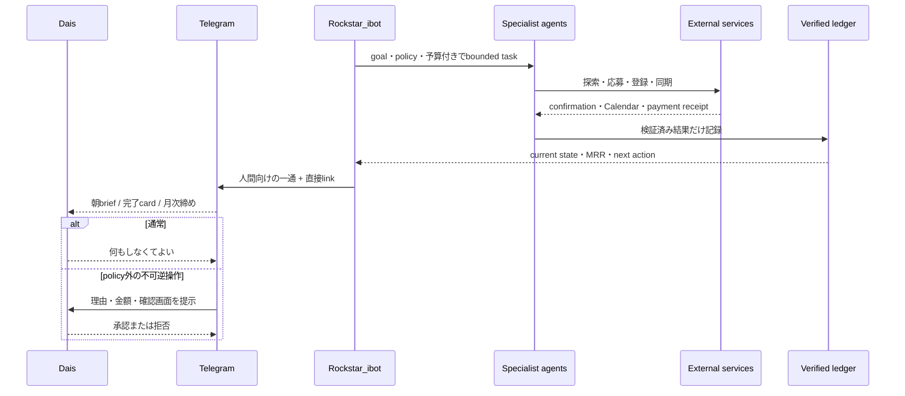

Telegramを開いた後に起こること:

- `[イベントを見る]`でLuma公式page、`[Calendar]`で実予定、`[証拠を見る]`で認証済み詳細へ直接移動する。
- completion cardには、Connectorがsubmit後に取得した「登録済み」と読めるLuma公式page画像を直接添付する。DaisはTelegram内だけで登録状態を視認できる。
- 画像にはevent名、登録済み状態、取得時刻をcaptionで示す。画像のmessage ID、artifact hash、event refが一致しなければ完了扱いにしない。
- 返信しなくてもloopは次のopen日、応募、reply追跡、財務更新へ進む。
- Telegram送信成功はpositive `message_id`を保存できた時だけ。表示文面だけを成功証拠にしない。
- 人間を呼ぶのはpolicy外の送金・売買等だけで、通常の無料event登録や既定範囲の行動には承認を要求しない。

## 11. 最終利用体験

### 11.0 全実装後の一枚図

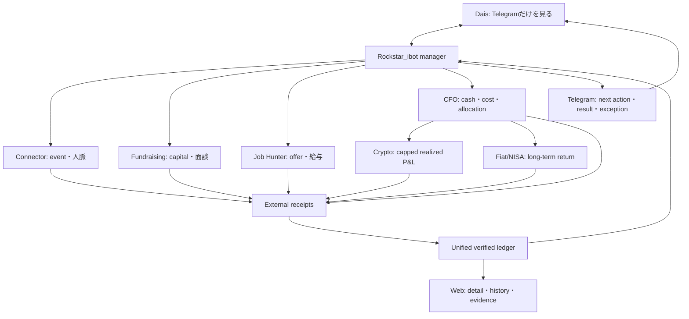

```text
                         Rockstar_ibot
                              │
                  goal・権限・risk policy・予算
                              │
       ┌──────────────┬───────┴────────┬──────────────┐
       ▼              ▼                ▼              ▼
  Connector       Fundraising      Job Hunter    Financial Organ
  21日を埋める     応募→返信→面談    応募→面接→offer  CFO Lead
  Calendar/QR      accelerator/VC    給与改善          │
       │              │                │        ┌─────┼────────┐
       │              │                │        ▼     ▼        ▼
       │              │                │      支出   Crypto   Fiat/NISA
       │              │                │      改善   運用      長期運用
       └──────────────┴────────┬───────┴──────────────┘
                               ▼
                共通runtime + decision/receipt ledger
                               │
                    ┌──────────┴──────────┐
                    ▼                     ▼
             Telegram（毎日の行動面）   Web（資産・履歴・証拠）
```

このsystemが増やす対象は一つではない。Connectorは出会いと機会、Fundraisingは提出・面談・資金、
Job Hunterはofferと給与、CFOは可視性・費用削減・資金配分、CryptoとFiat/NISAはrisk調整後の資産形成を
担当する。すべてを同じdecision IDとreceiptで測り、給与、調達額、含み益、元本をMRRへ混ぜない。
利益、採択、offer、10M MRR、billionaire到達は保証値にしない。毎日の実行と結果を測り、失敗した仮説を
縮小し、証拠上よい経路へ時間とrisk budgetを段階配分する。

毎朝:

- 総資産と前日比
- 1か月・3か月の収入と支出
- 異常支出と不要subscription
- event登録と当日QR
- accelerator応募・reply・meeting
- job応募・reply・interview
- cryptoとNISAの成績
- 今日agentが実行する行動

日中:

- event QRが届く
- accelerator提出確認が届く
- investor/recruiter replyを追跡する
- meeting/interviewをCalendarへ登録する
- financial cap違反時は自動停止する

月末:

- source receipt付き財務報告
- agent別の収入・費用・利益・損失
- 応募→返信→面談→採択のfunnel
- crypto/NISAのafter-fee成績
- 翌月の予算、資金配分、改善対象

## 12. 2026-08-01時点の資金調達queue

固定listを永続的な正本にはしない。以下は**今日のbootstrap queue**であり、毎日公式pageから
再取得する。締切、terms、eligibilityが変わったprogramを古いJSONのまま提出しない。

| 優先 | program | 2026-08-01の公式事実 | 今日の判断 |
|---:|---|---|---|
| 1 | [SPC Founder Fellowship F26](https://www.southparkcommons.com/founder-fellowship) | 8月2日締切、solo founder可、SF/NYC/Bangalore、$400Kで7% + 次round $600K | **最優先でprepare**。NYC peer groupへの直接経路にもなる |
| 2 | [YC Fall 2026](https://www.ycombinator.com/apply) | 7月27日の定時締切後もlate application受付、10〜12月SF | 既存draftを現在batchへ移し、事実と動画を再検証して提出 |
| 3 | [a16z SPEEDRUN](https://speedrun.a16z.com/faq) | SR007締切後もoff-cycle受付。次回SR008は2027年1〜4月SF。solo可、最大$1M | 古い`a16z START` specを使わず、SPEEDRUN最新form specを新設 |
| 4 | [Entrepreneurs First](https://apply.joinef.com/) | London Fallは8月4日、SF Bridgeは8月30日。full-time/in-person | 居住・visa・full-time条件を確認してqualify |
| 5 | [Techstars](https://www.techstars.com/for/founders) | 複数programへ随時応募、標準投資$220K | fintech/AI/NYCなど個別program単位でdeadlineをdiscover |
| 6 | [Antler Japan](https://www.antler.co/location/japan) | 6週間Tokyo、$150K初期投資。掲載cohort日付は既に経過 | 次cohort公開をdaily watcherで検知。古い日付では提出しない |

YCの標準dealは$500Kで、$125Kが7%、残り$375Kがuncapped MFN SAFEである。
a16z SPEEDRUNは最大$1Mで、$500Kが10%、残り$500Kが次roundである。SPCは$400Kで7%と
次round $600Kである。したがって「数億ドルを1%で調達」は初期roundの現実的な前提ではない。
$100Mを1%で調達するにはpost-money $10Bが必要であり、まずproduct tractionと段階的な
valuation上昇が必要である。

## 13. Fundraising agentの連続loop

```text
毎日06:30 DISCOVER
  公式accelerator/VC/grant page・newsletter・既知registryを取得
        │
        ▼
QUALIFY（agent判断）
  Rockstar_ibotとの適合、solo可否、地域、締切、terms、競合、MUIT conflict
        │
        ├─不適合 → 理由付きskip + 次回再確認日
        ▼
PREPARE
  application-kitの事実 + 最新traction + deck + 58秒video + program別回答
        │
        ▼
VERIFY（deterministic gate）
  全必須field / facts freshness / URL / terms / CAPTCHA / 重複 / denylist
        │
        ▼
ACT
  既存CloakBrowser daily-driver :9222で一度だけsubmit
        │
        ▼
RECEIPT
  完了画面 + canonical URL + Gmail message/thread IDを同じattemptへ結合
        │
        ▼
TRACK（gog Gmail + Calendar）
  submitted → confirmed → interview → offer/rejected → funded
        │
        ▼
LEARN（週次）
  program別の返信率・面談率・採択率からtargetとpitchを更新
```

探索は「登録された5件を順番に回す」だけではない。registry entryに
`source_url`、`last_verified_at`、`next_deadline`、`terms_hash`、`solo_allowed`、
`location`、`status`を持たせる。毎日、新規programを発見し、既存programの変更も検知する。

localでは`gog`を使う。すでにOAuthとCLIがあり、launchdからJSONで安定して読めるためである。
Gmail MCPは対話調査には使えても、停止中のaccept watcherのように定期workerが「MCPで読め」と
表示するだけでは実行にならない。Web版では同じmail interfaceをtenant別Google OAuth/Gmail APIへ
差し替え、localの個人tokenを他userへ流用しない。

## 14. Telegramに今日届くべき実例

過去状態を説明する文面は2026-08-01の実ファイルとlaunchdに基づく。完成時templateの
`{{...}}`は、送信時にCalendar、応募結果、確認mail、統一ledgerの実値だけで置換する。

```text
🎟️ 今後3週間の空き予定を埋めました。

確認期間: {{window_start}}〜{{window_end}}
対象日: 21日
既存の対面予定で埋まっていた日: {{covered_existing_count}}日
今回新しく予約した日: {{covered_new_count}}日
固定予定で追加できない日: {{unavailable_count}}日
未処理の空き日: 0日

今回追加した予定:
1. {{event_date_1}} {{event_name_1}}
   {{event_time_1}} / {{event_location_1}}
   理由: {{selection_reason_1}}
   [イベントページ]({{canonical_event_url_1}})・[Calendar]({{calendar_event_url_1}})

2. {{event_date_2}} {{event_name_2}}
   {{event_time_2}} / {{event_location_2}}
   理由: {{selection_reason_2}}
   [イベントページ]({{canonical_event_url_2}})・[Calendar]({{calendar_event_url_2}})

すべて参加申込み、確認メール、Calendar登録を照合済みです。
既存予定と移動時間が重なる予約はありません。

[3週間のCalendarを開く]({{calendar_coverage_url}})
[参加予定とQRの一覧を開く]({{confirmed_event_list_url}})
```

新しく予約しなかった場合に許される唯一の通常報告:

```text
✅ 今後3週間はすでに埋まっています。

確認期間: {{window_start}}〜{{window_end}}
対象日: 21日
既存の対面予定でcovered: {{covered_existing_count}}日
固定予定で追加可能な時間なし: {{unavailable_count}}日
未処理の空き日: 0日
今回の新規予約: 0件

理由: 予約できる空き枠が残っていないため、二重予約を作りませんでした。
「イベントを見つけられなかった」ことを理由にはしていません。

[3週間の予定をカレンダーで見る]({{calendar_coverage_url}})
[参加予定の一覧を見る]({{confirmed_event_list_url}})
```

```text
🎤 LT応募状況 2026-08-01

AI Tinkerers Tokyo:
・登壇申込みを送信済み
・主催者からの最終回答はまだ確認できていません

AI Tinkerers San Francisco:
・登壇申込みを送信済み
・現在は主催者の確認待ちです

connpass:
・募集中のLT枠を見つけられます
・申込み完了を確認する方法がまだないため、勝手に送信していません

今日の新規LT応募: 0件
次の行動: 主催者からの確認メールまで追跡できる状態にしてから、実際のLTへ1件申し込みます

[過去の登壇応募を見る]({{talk_application_history_url}})
[候補イベントを見る]({{talk_candidate_list_url}})
```

```text
🚀 資金調達queue 2026-08-01

1. SPC Founder Fellowship F26 — 締切 8/2、NYC選択可、未提出
2. YC Fall 2026 — late application受付中、既存draftは未提出
3. a16z SPEEDRUN SR008 — off-cycle受付、最新form spec未作成
4. Entrepreneurs First London — 締切 8/4、適格性確認待ち

YC既存draft:
・応募回答20項目: 入力済み
・創業者紹介動画: upload済み
・入力漏れ: なし
・現在の状態: 最終送信前
・相手からの応募確認メール: なし

まだ送信していないため、「YCへ応募済み」とは表示しません。

[YC応募内容を見る]({{yc_application_url}})
[使用する動画を見る]({{founder_video_url}})
[応募先一覧を見る]({{funder_pipeline_url}})
```

過去の実応募を新しいUXで表す場合:

```text
💼 Anthropicの求人への応募が完了しました。

会社: Anthropic
職種: Financial Services Industries Enterprise Account Executive
応募日: 2026-05-30

この求人を選んだ理由:
金融業界でのCRM導入経験と、AI agentを実際に構築・運用している経験の両方を活かせるためです。

提出したもの:
・履歴書: Daisuke_Narita_Resume.pdf
・cover letter: Anthropic FSI向けに作成したPDF
・応募者情報: Daisの共通プロフィール

応募完了画面: 確認済み
現在の状態: 返信待ち

履歴書とcover letterをこの報告から開けます。

[提出した履歴書を開く]({{submitted_resume_url}})
[cover letterを開く]({{cover_letter_url}})
[求人ページを開く]({{job_url}})
```

```text
🎤 AI Tinkerers Tokyoへ登壇を申し込みました。

イベント: AI Tinkerers Tokyo - Shinagawa: May 26th Meetup
応募日: 2026-05-06
応募内容: Aniccaの自律運用とRockstar_ibotへつながる実装demo

提出したもの:
・登壇者プロフィール
・demo proposal
・product URL
・GitHub URL

イベント主催者の画面では申込み受付を確認しました。
カレンダーにも予定を追加済みです。
現在の状態: 主催者からの最終回答待ち

[提出した登壇内容を見る]({{talk_application_url}})
[イベントページを開く]({{canonical_event_url}})
[カレンダーを開く]({{calendar_event_url}})
```

採択後の実際のUX:

```text
🔥 SPC Founder Fellowshipから面談招待です。
状態: interview_requested
拠点候補: New York City
メールthread: 証拠保存済み
締切: 2026-08-06 17:00 JST

候補日時をCalendarの空き時間と照合しました。
面談資料:
・Rockstar_ibot 90秒説明
・Daisのfounder-market fit
・Daisローカル実証の応募/CFO metrics
・なぜ今、なぜ1人で開始できるか

[返信案を確認する]({{reply_draft_url}})
[面談資料を見る]({{meeting_prep_url}})
[辞退の確認画面を開く]({{decline_confirmation_url}})
```

## 15. 生活と会社がどう変わるか

```text
現在
  Daisがevent、求人、accelerator、メール、口座を別々に見る
  → 応募漏れ、返信漏れ、数字の分断、壊れたcronに気づけない

local完成後
  Rockstar_ibotが候補を探す
  → 応募・確認証拠を取る
  → Gmail返信とCalendarを追う
  → 銀行・card・Binanceをread-onlyで集計
  → 毎朝Telegramで「資産・支出・応募・面談・今日の行動」を一通にする

成長後
  LTでRockstar_ibotの実証を話す
  → user / founder / investorとの接点
  → acceleratorで密度の高いpeer group、partner支援、資金
  → product改善と有料user獲得
  → 同じcoreをRockstar_ibot Webへ提供
  → 真のMRRを積み上げる
```

各agentは単独で「儲けを保証」しない。Eventsは機会、Fundraisingはcapitalとnetwork、Job Hunterは
給与、CFOは漏出削減、Crypto/NISAはrisk-adjusted return、Web appは継続売上を担当する。
これらの寄与を同じledgerで計測し、月間1,000万円へのgapを毎月更新する。accelerator採択、
投資利益、unicorn、billionaireは目標であって保証値ではない。

### 15.9 Codex executor の共通 browser capability

全 Codex agent は native `browser_use`、external browser、full CDP、computer use、in-app browser を利用可能にする。これは Connector 固有の例外ではなく、同じ agent runner を使う全 task class の共通 provider capabilityである。browser taskは既存CloakBrowser daily-driver sessionを直接観測・操作し、site固有selectorや都度生成するPlaywright/CDP scriptを主経路にしない。外部作用の完了はagentの自己申告ではなく、親loopが完了画面・receipt・Calendar readback・Telegram media message IDを独立検証して確定する。

2026-08-06実測: 旧OpenClaw ConnectorはCamofoxのaccessibility snapshotと汎用`click/type/press/screenshot`をagentへ直接渡してLuma/Connpassを操作していた。現行Codex runnerはprovider共通設定で`browser_use`、`browser_use_external`、`browser_use_full_cdp_access`、`computer_use`、`in_app_browser`を明示的にdisableし、Terraへshellだけを渡していた。その結果、run 164ではTerraがPlaywright module pathを誤り、実画面の登録完了markerではなく自分の宣言文を`observed_marker`として返した。根本修正は全Codex agentから上記disableを除去し、native browserを共通能力として宣言する。

run 165でnative computer pathを実測すると、Terraは全画面`screencapture`、`Cmd-Tab`、`cliclick`座標操作へ逸れ、CloakBrowserではなくCodex画面を操作した。Connectorのproduction browser contractは、Playwrightを別browserとして起動するのではなく、既存CloakBrowser daily-driver `:9222`へ`connectOverCDP()`するcontrollerとしてだけ使う。desktop-wide操作、新browser/profile、DOM mutationは禁止し、同じevent tabをuser-facing role/label、auto-wait、実fill/click/check/selectOption/pressで最後まで操作する。private profileにはDaisの正しい生年月日をmode 0600で保持し、通常の未知主観質問はprofileまたはtruthful general purposeで回答して継続する。

候補attempt履歴は観測telemetryであり、申込停止gateではない。過去`known_no_effect`や期限付きretryを理由にranked candidateを除外せず、全候補をattemptableに保つ。一候補の`known_no_effect`やcandidate budget到達でpassを終了せず、同じrunで次候補へ進む。`unknown_effect`は同じURLを再送信する前にprovider readbackで登録有無を確定する。

run 169ではTerraがCloakBrowser接続前に未導入の`require('playwright')`を選び、`MODULE_NOT_FOUND`になった。production executorはrepo rootの既存`apps/rockstar_ibot/node_modules/playwright-core`を絶対解決して読み、package探索を行わず直ちに`:9222`へ接続する。

## 16. 実装前に残る不確実性

| # | 不確実性 | 解消方法 / gate |
|---:|---|---|
| U01 | CloakBrowser `:9222`のlogin sessionがLuma/YC/SPCでfreshか | 各siteをread-onlyで開き、login identityとcookie expiryを記録 |
| U02 | 直近Connector runner成功が実登録を意味するか | result JSON、完了画面、mail、ledgerを照合。runner successだけでは登録扱い禁止 |
| U03 | connpass browser-only discover/submitと証跡取得が可能か | `:9222` parent-owned discovery、実submit、readback、Calendar、Telegramを一lineageで実測 |
| U04 | LT応募と一般参加登録をどう区別するか | `attendance_application`と`talk_proposal`を別entity・別receiptにする |
| U05 | YC既存draftがFall 2026へ安全に移行できるか | current home画面、batch、application ID、submit前previewを実測 |
| U06 | YC動画・demo・tractionが現在の真実か | application-kit、dashboard、動画実体、production URLを提出当日に照合 |
| U07 | SPC 8/2までに必要field/動画を揃えられるか | formをread-only captureし、missing field listと所要時間を出す |
| U08 | a16zの旧`START` specと現SPEEDRUNの差 | 旧specを無効化し、公式current formから新specを生成 |
| U09 | 各programがagentによるform入力を許容するか | terms/robots/form表示を提出直前に確認。CAPTCHA/明示禁止はhuman handoff |
| U10 | Gmail検索がconfirmationと営業mailを誤結合しないか | nonce/domain/thread/time fenceと送信attempt IDで結合、spoof testを追加 |
| U11 | 返信分類の型とCalendar timezone | confirmation/interview/offer/reject/request_infoをschema化し、JST/現地TZを保持 |
| U12 | MUITとの利益相反 | MUFG/MUIT運営・CVCをdeny。LPだけの関与と業務外応募の線引きを確認 |
| U13 | Moneytree LINKの契約、client ID、本番利用審査、料金 | Moneytreeへ正式確認。OAuth client取得前はLINK接続済みにせず、公式Web exportの実データrailを先行 |
| U14 | MoneytreeがDaisの全銀行/card/証券と必要履歴を返すか | production本人同意または公式Web exportで、実1口座から残高・1/3/12か月明細・categoryを実測 |
| U15 | Binance Japan口座で使えるendpointと履歴範囲 | read-only `USER_DATA` keyをIP制限し、balance/trades/deposit/withdraw履歴を実測 |
| U16 | Binance Earnやwallet外資産を総資産へ含められるか | product別endpointを列挙し、unsupportedは手動snapshotとして明示 |
| U17 | JPY換算の価格sourceと時刻 | original currencyを保存し、FX/crypto quote sourceとtimestampを全行へ付与 |
| U18 | subscriptionの「未使用」を何で判断するか | 支払明細だけで断定せず、login/app usage/mail receiptの有無とconfidenceを表示 |
| U19 | crypto/fiatのexecution権限 | Order 3Bはread-only。Order 4/5で隔離口座、上限、signer、emergency stopを実証 |
| U20 | local profileをWeb multi-tenantへどう移すか | tenant別OAuth、secret、browser profile、worker isolationのcontract test |
| U21 | 「NYC」がNew York CityかYCの音声認識か | queueでは両方を扱う。SPC NYCとYC SFを混同しない |
| U22 | 調達額と希薄化の許容範囲 | cap table scenarioを提示し、法務・税務確認後だけsign。資金調達額をMRRに入れない |
| U23 | specialistを増やすほど品質が本当に上がるか | single CFO baselineとspecialist構成を同じeval setで比較し、改善しないroleは統合 |
| U24 | specialist間で数字や結論が食い違う場合の正本 | 数字は統一ledger、解釈は出典付き意見として保存し、Risk/CFO reviewで解消 |
| U25 | FinRobot/TradingAgentsをどこまで直接移植できるか | dependency、data provider、test、Apache-2.0 noticeをcode-level spikeで確認 |
| U26 | Ghostfolio/rotki/Firefly IIIのAGPLコードをproductへ使えるか | 法務/license review完了までUX・schema研究だけとし、source codeをcopyしない |
| U27 | self-improvementが過学習やrisk増加を起こさないか | time-split replay、shadow、canary、rollbackを必須にし、permission/capを対象外にする |
| U28 | 多数agentのcostとlatencyが日次利用に耐えるか | 必要なspecialistだけ起動し、single-agent baseline比の有用性/cost/時間を計測 |
| U29 | Luma mainの各日inventoryを「最後まで読んだ」とどう証明するか | pagination、infinite scroll、日付・東京・対面条件、取得件数と最終cursorを探索証跡へ保存 |
| U30 | 都度承認なしで自動予約してよい有料eventの支出policy | 日次・月次上限と対象を一度だけ設定し、範囲内は自動決済、範囲外は無料の別候補へ進む |
| U31 | rolling 21日のeventが勤務・学校・既存予定・移動時間と両立するか | 全Calendarと経路時間を申込前gateにし、重複時は同日の別時間・別候補へ進む |
| U32 | Summer 2026のYC applicationをFall 2026へ継続できるか | 現行YC homeをread-only確認し、継続不可なら既存回答を新applicationへ安全に移す |
| U33 | 既存YC回答・動画・tractionが現在も正確か | production、dashboard、application-kit、動画実体を照合し、古い主張を修正してからsubmit |

## 17. 変更規則

1. 順序変更はDaisの明示指示だけで行う。
2. 状態変更時は、この文書のcheckboxと証拠pathを同じcommitで更新する。
3. 推測でdoneにしない。外部receiptまたは再現可能な実測を要求する。
4. 他trackの作業をこの文書へ追加しない。
5. 新しい候補部品を発見したら、URL、license、実測日、採用判断を§4へ記録する。

## O1B-25進捗170（汎用Autonomous Connector / Browser Harness採用境界）

進捗169のscript-first判断を維持しつつ、対象をLuma専用automationに限定しない。Lumaは最初に探索するmain providerであり、
Connectorの本体は、既知providerでは検証済みaction cacheを決定的に再生し、未知providerまたはUI変更時には同じConnector-owned
browser session/page上でbounded browser agentが画面を観察して申込を完遂するprovider-neutral autonomous runnerである。
初回にagentが成功した操作はversion付きprovider/domain workflowとして保存し、次wakeからagentなしで再生する。cached actionが壊れた場合は、
失敗した一操作だけをagentが発見し直し、親readbackで期待状態を確認してからcacheを更新する。

### External source and adopted Browser Harness decision

1. Browser Use Browser Harness: https://github.com/browser-use/browser-harness
   - 核心の引用: “Connect an LLM directly to your real browser with a thin, editable CDP harness.”
   - 採用: 未知provider、未知ordinary field、iframe/dialog/dropdown/shadow DOM、UI変更時のbounded fallback engineとして使う。
2. Browser Use Browser Harness: https://github.com/browser-use/browser-harness
   - 核心の引用: “The harness improves itself every run.”
   - 採用: 学習先をConnector専用のprovider domain skill、browser helper、versioned action cacheに限定する。repo-wide editは禁止する。
3. Browser Use Browser Harness SKILL: https://github.com/browser-use/browser-harness/blob/main/SKILL.md
   - 核心の引用: “Prefer to find elements with the accessibility tree, not screenshots.”
   - 採用: AX treeを第一観察経路、targeted DOMを第二経路、layout/画像判断だけscreenshot、特殊UIだけ座標/CDP操作にする。
4. Browserbase Stagehand: https://github.com/browserbase/stagehand
   - 核心の引用: “use AI when you want to navigate unfamiliar pages, and use code when you know exactly what you want to do.”
   - 採用: 正常wakeはscript/cache-first、未知または破損時だけagentを呼ぶ。
5. Browserbase Stagehand: https://github.com/browserbase/stagehand
   - 核心の引用: “auto-caching combined with self-healing remembers previous actions, runs without LLM inference, and knows when to involve AI whenever the website changes.”
   - 採用: repair後はagentなしrerunを必須にし、成功したreplacement actionだけを昇格する。

### Final production behavior

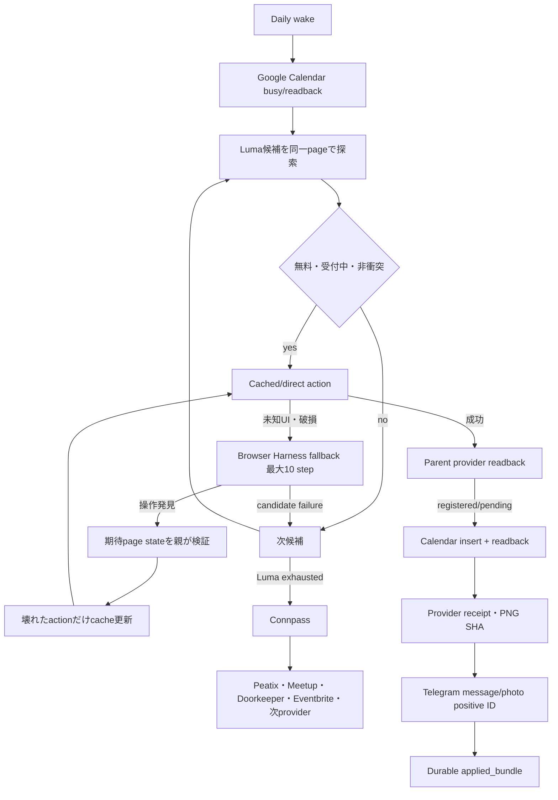

未知providerには事前scriptを要求しない。browser agentは現在pageのAX tree、DOM、視覚状態を観察し、navigate、observe、fill、submit、readbackを
一作用ずつ実行してよい。ただし、成功判定、browser lifecycle、target ownership、外部証拠、再送防止は常にparent codeが所有する。
agentの自己申告、exit 0、Telegram failure reportを登録成功に数えない。

Browser Harnessはそのまま無制限に常駐させず、Connector adapterの内側に置く。

- `BU_CDP_URL`/`BU_CDP_WS`相当の接続先はConnector所有`:9222`のclaimed page/targetだけ。Gig `:9223`は永久read-only。
- 一wakeはsession ID 1、target ID 1、page 1。候補/provider切替は同じpageのnavigateで行う。
- browser agentは新browser/profile、全page走査、任意tab作成、`browser.close()`、desktop-wide操作を行わない。
- agentが永続更新できるのはConnector専用provider domain skill、browser helper、versioned action cacheだけ。
- credential、cookie、private profile値、raw prompt、contact情報をaction history/cacheへ保存しない。
- CAPTCHA、MFA、決済、有料event、未知consent、虚偽回答は自動突破しない。その候補をsafe failureとして次へ進める。
- 一candidate failureでwakeを終了しない。Luma候補を継続し、枯渇後はConnpass、次にconfigured providerへ進む。
- 連続failure 3回またはwake 10分でcircuit-openし、追加操作/target churnを止め、durable stage/action historyとTelegram recovery receiptを保存する。

### O1B-25進捗171（Item 1 / 物理停止状態の再実測）

branch `feature/connector-native-completion`、commit `9204f2e65`、remoteとのahead/behind 0、dirty file 0を確認した。
`launchctl print`の実測では`ai.anicca.rockstar_ibot-connector-native`と
`ai.anicca.rockstar_ibot-connector-native-healthcheck`はdomainに存在せずstatus 113、Native/healthcheck process 0である。
`ai.anicca.rockstar_ibot-connector-healer-shadow`はloaded、`state = not running`、runs 8、last exit 0で、Healer process 0である。
`ai.anicca.rockstar_ibot-connector-host-bridge`はloaded、`state = running`、PID 853、runs 1である。Item 2のconsumer/ownership
証明前なのでHealerとbridgeは変更していない。

CloakBrowser `127.0.0.1:9222`はChromium PID 69767がlistenし、`/json/version`はChrome 145とbrowser WebSocketの存在を返した。
Gig `127.0.0.1:9223`はChromium PID 74198がlistenすることだけをread-only確認し、接続、target列挙、profile/state/lock/vault/code変更は0である。
Connector safe evidenceの最新mtimeは`evidence/target-leases.json`と`evidence/tab-owner.json`の
`2026-08-07T01:26:54+0900`で、heartbeatは`2026-08-07T01:23:32+0900`、wake delivery ledgerは
`2026-08-07T01:22:15+0900`である。内容、credential、cookie、private profile、raw logは出力・変更していない。
Item 1を完了し、Native scheduling disabledを維持したままItem 2へ進む。

### O1B-25進捗172（Item 2 / Connector owner境界確定とlegacy owner unload）

installed plist、launchd process path、repo call path、listener/client、Gig launchd/codeをread-onlyで照合した。
Healer shadowはworktreeの`skills/connector/healer-shadow.sh`→`healer-shadow-cli.js`→`lib/healer-shadow.js`だけを起動する
Connector専用ownerである。Host bridgeはcanonical Rockstar_ibotの`connector-host-bridge-boot.sh`→
`connector-host-bridge-server.js`→`connector-host-bridge.js`を起動し、旧Docker workerだけが
`LM_CONNECTOR_BRIDGE_URL`/`LM_CONNECTOR_BRIDGE_TOKEN`名を持つ旧Connector runtime railである。port 18793はPID 853のlistenerだけで
established client 0だった。Gig launchdは`profitable-claude/.../gig-work`を起動し、Gig codeにHealer、host bridge、port 18793、
Connector tokenの参照は0である。

このowner証明後に`ai.anicca.rockstar_ibot-connector-healer-shadow`と
`ai.anicca.rockstar_ibot-connector-host-bridge`を`launchctl bootout`した。両labelはstatus 113、Connector関連process 0、port 18793
listener 0になった。Native/healthcheckもstatus 113を維持し、全Connector launchd ownerは0である。Connector CloakBrowser `:9222`は
PID 69767、Gig `:9223`はPID 74198のlistenerを維持した。Gigへのwrite、restart、target操作は0である。
installed plistはmode 0600のまま保存し、Connector native/host-bridge state directory、token、profile、cookie、receipt、evidence、logを
削除・変更していない。Item 2を完了し、次はItem 3のexact inventoryを作る。

### O1B-25進捗173（Item 3 / exact keep・direct-reuse・delete inventory）

`.codegraph/` markerはあるがCLIがindex不存在を返したためindexを作らず、production entrypoint `skills/connector/run.sh`から
`rg`、CommonJS `require`、`module.exports`、launchd plist/boot pathを追った。分類は次のとおり。`delete`はstate/evidenceの削除ではなく、
Item 5でofficial production call pathからGit patchで除去する対象である。他track/eval consumerがあるmoduleはfileを削除せずConnector production
importだけを切る。

#### Keep inventory（そのまま保護する責務）

| File | Symbol / responsibility | Exact decision |
|---|---|---|
| `skills/connector/run.sh` | env load、absolute state dir、single process lock、heartbeat、crash envelope | official shell entrypointとして保持。ただし`native-pass.js`の旧orchestration呼出先をminimal runnerへ置換する |
| `skills/connector/lib/load-connector-env.js` | `loadConnectorEnv` / bounded env load | keep |
| `skills/connector/lib/native-state.js` | `acquireLock`、`heartbeat`、`readHealth`、`recordContinuation`、`releaseLock` | keep。lock/append-only continuationを新runnerから使う |
| `skills/connector/lib/observer-envelope.js` | `buildObservation`、`appendObservation` | keep。safe action history/circuit reportへ使い、raw prompt/PIIを追加しない |
| `skills/connector/lib/wake-report-outbox.js` | `enqueueWakeReport`、`deliverPendingWakeReports`、`recordProcessCrash` | keep。every-wake Telegram rail |
| `apps/rockstar_ibot/lib/connector-browser-target-controller.js` | `CONNECTOR_CDP_ENDPOINT`、`createConnectorBrowserTargetController` | keep。`:9222` target create/find/closeをparentだけが所有する |
| `apps/rockstar_ibot/lib/connector-target-lease.js` | `createConnectorTargetLease` | keep。owner token/generation/fence/heartbeat/release |
| existing Connector state/evidence trees | registration receipt、Calendar evidence、Telegram delivery、PNG/object、ticket、idempotency、observer/attempt ledgers | immutable/append-only keep。削除・移動・truncate禁止 |

#### Direct-reuse inventory（新minimal runnerへ直接つなぐ部品）

| File | Symbol / responsibility | Exact decision |
|---|---|---|
| `apps/rockstar_ibot/lib/connector-tab-owner.js` | `createConnectorTabOwner` | ownership receipt/fencingをreuse。ただし候補ごとのclaim/createは禁止 |
| `apps/rockstar_ibot/lib/cloakbrowser-daily-driver.js` | `DAILY_DRIVER_CDP`、`connectorEventUrl`、`resolvedDailyDriverEndpoint` | endpoint/url validationをreuse。現`withEventPage`の候補ごと`newPage()/close()`はreuseせず、一wake一page lifecycleへ置換 |
| `apps/rockstar_ibot/lib/luma-browser-provider.js` | `createLumaBrowserProvider`、`submitLumaOnPage`、`readSavedLumaPaymentMethodOnPage` | Luma direct fill/submit/parent proofをreuse。paid pathは初期runnerで無効 |
| `apps/rockstar_ibot/lib/luma-registration-form.js` | `readLumaRegistrationForm`、`normalizeLumaRegistrationForm` | reuse |
| `apps/rockstar_ibot/lib/luma-form-answer-policy.js` | `buildLumaFormAnswerPlan` | verified profileとtruthful answerだけreuse |
| `apps/rockstar_ibot/lib/luma-form-fill.js` | `fillLumaRegistrationForm` | exact control fill/check/select readbackをreuse |
| `apps/rockstar_ibot/lib/connpass-browser-provider.js` | `createConnpassBrowserProvider`、`readConnpassRegistrationStateOnPage`、`submitConnpassOnPage` | Luma exhausted後のsame-page fallbackとしてreuse |
| `apps/rockstar_ibot/lib/connpass-rsvp-adapter.js` | `buildConnpassEventApplicationJob`、`executeConnpassRsvpJob` | provider job/receipt contractをreuse。旧coverage loop adapterはproductionで使わない |
| `apps/rockstar_ibot/lib/google-calendar-busy-inventory.js` | `inspectGoogleCalendarBusyInventory`、`isVerifiedGoogleCalendarBusyInventory`、`privateGoogleCalendarBusyContext` | pre-submit conflict checkへreuse |
| `apps/rockstar_ibot/lib/transport/calendar-gog.js` | `makeGogCalendar` | Calendar list/create/get readbackへreuse |
| `apps/rockstar_ibot/lib/connector-calendar-sync.js` | `syncVerifiedRegistrationToGoogleCalendar`、`isVerifiedConnectorCalendarSync` | provider success後だけreuse |
| `apps/rockstar_ibot/lib/luma-evidence-store.js` | `createLumaEvidenceStore` | full-page PNG/object SHA/provider receipt storageをreuse |
| `apps/rockstar_ibot/lib/connpass-evidence-store.js` | `createConnpassEvidenceStore` | Connpass PNG/object SHA/provider receipt storageをreuse |
| `apps/rockstar_ibot/lib/luma-ticket-qr.js` | `captureOfficialLumaTicketQr`、`createLumaGuestBinding`、`createLumaTicketQrStore`、`decodeQrPng` | ticket/QR capture/readbackをreuse |
| `apps/rockstar_ibot/lib/connector-ticket-telegram.js` | `buildConnectorTicketCaption`、`deliverConnectorTicket`、`sendOpenClawMedia` | Telegram photo delivery/positive IDをreuse |
| `apps/rockstar_ibot/lib/outbound-guardian.js` | `notifyOpenClawPhoto`、`parseOpenClawMessageId` | bounded Telegram media send/receipt parsingだけreuse。Docker recovery/guardianは使わない |
| `apps/rockstar_ibot/lib/connector-candidate-outcome.js` | `classifyConnectorCandidateOutcome`、`isVerifiedConnectorCandidateOutcome` | safe next-candidate分類へreuse。suppression gateへ接続しない |
| `apps/rockstar_ibot/lib/canonical-event-url.js` | `canonicalEventUrl`、`connpassEventUrlsFromText` | provider-neutral identity/idempotencyへreuse |
| `apps/rockstar_ibot/lib/event-provider-registry.js` | `createEventProviderRegistry`、`isVerifiedEventProviderRegistry`、`promoteEventProvider` | configured provider capability schemaだけreuse。durable cursorは接続しない |

`apps/rockstar_ibot/lib/connector-native-write-pipeline.js`の`runNativeConnectorWrite`はCalendar、PNG、ticket、Telegramを実装済みだが、
rolling coverage、goal serendipity、coverage assembler/Telegramを入力contractへ埋め込んでいるため関数丸ごとのdirect reuse対象外とする。
上表の下位componentを新しいprovider-neutral evidence chainへ直接接続する。

#### Delete/retire inventory（official production pathから除去）

| File / wiring | Symbol / path | Consumer proof and action |
|---|---|---|
| `skills/connector/native-pass.js` | 現`runNativePass`、provider cursor load/store、coverage result bounding、legacy photo backfill、self-heal issue delivery | production consumerは`run.sh`一つ、他はtest。official file pathをminimal runnerへrewriteし、必要なreceipt validationだけ新bundle moduleへ移す |
| `apps/rockstar_ibot/lib/connector-native-runtime.js` | `runNativeConnectorPass`、`calendarGateFailureCode` | non-test production consumerは現`native-pass.js`だけ。production import 0にする |
| `apps/rockstar_ibot/lib/connector-events-pack.js` | `createConnectorEventsPack`の21日inventory/spend/goal/coverage composition | old runtime/legacy runtime services用。minimal runnerからimportしない |
| `apps/rockstar_ibot/lib/rolling-event-coverage.js`、`rolling-event-coverage-store.js`、`connector-coverage-*` | `buildRollingEventCoverage`、continuation、assembler、coverage Telegram/refresh | eval/legacy runtime consumerがあるためfileは即削除せず、Connector production pathから全import 0にする |
| `apps/rockstar_ibot/lib/event-preference-ranking.js` | preference ranking | production selectionから除去 |
| `apps/rockstar_ibot/lib/event-goal-serendipity.js` | goal/serendipity judgment | production selectionから除去 |
| `apps/rockstar_ibot/lib/event-spend-policy.js` | `planDateSpend`を含むfree-event前ordering | free-event production selectionから除去。有料作用は初期runner全体で禁止 |
| `apps/rockstar_ibot/lib/connector-candidate-suppression.js` | `latestCandidateAttempts`、`activeSuppressedEventRefs` | telemetryは保持するがstop/filter gateとしてのproduction importを除去 |
| `apps/rockstar_ibot/lib/event-provider-cursor.js` | `createEventProviderCursorStore`、`createEventProviderCursor`、`advanceEventProviderCursor` | non-test Connector consumerは現`native-pass.js`/runtime。durable provider cursorを新runnerへ持ち込まない |
| `apps/rockstar_ibot/lib/connector-agentic-registration.js` | `runConnectorAgenticRegistration` | old runtimeだけがconsumer。Browser Harness bounded same-page adapterへ置換 |
| `apps/rockstar_ibot/lib/connector-native-write-pipeline.js` | `runNativeConnectorWrite`のcoverage-coupled composition | old runtimeだけがproduction consumer。下位evidence componentへ置換後import 0にする |
| `apps/rockstar_ibot/lib/connector-coverage-runtime-services.js`、`connector-host-bridge.js`、`scripts/connector-host-bridge-*` | Docker/host bridge client/server/install path | legacy Docker runtimeだけ。official Connector production pathとlaunchdからretire。token/stateは削除しない |
| `skills/connector/healer-shadow.sh`、`healer-shadow-cli.js`、`lib/healer-shadow.js` | repo-wide Healer execution | launchdは進捗172でunloaded。production render/install/importを0にする。history/test consumer確認後までfileは保持 |
| `skills/connector/healthcheck.sh` | legacy minute healthcheck/retry owner | launchdはunloaded。daily runnerに別ownerを作らず、production renderから除去 |
| `skills/connector/render-launchd.sh` | native + healthcheck + Healerの3 plist render | single daily Connector plistだけをrenderするようItem 17で置換 |
| `apps/rockstar_ibot/launchd/ai.anicca.rockstar_ibot-connector-native.plist.template` | `StartInterval=300` | daily CalendarIntervalのsingle labelへ置換。foreground acceptance前はload禁止 |
| `apps/rockstar_ibot/launchd/ai.anicca.rockstar_ibot-connector-native-healthcheck.plist.template`、`ai.anicca.rockstar_ibot-connector-healer-shadow.plist.template`、`ai.anicca.rockstar_ibot-connector-host-bridge.plist.template` | duplicate healthcheck/Healer/bridge owners | production render/install wiringから除去。installed plist/stateはfinal cleanup gateまで保存 |

Deletion boundaryを再確認した結果、削除禁止対象はCloakBrowser profile/auth、Connector/Gig lock、credential/token、private profile、cookie、
registration receipt、Calendar evidence、Telegram receipt、PNG/object、ticket/QR、observer/attempt/continuation JSONLである。Item 3ではcode/stateを削除せず、
inventoryとconsumer proofだけを追加した。次はItem 4でこのinventoryに対するfocused production contractをREDにする。

### O1B-25進捗174（Item 4 / minimal production contract RED）

`apps/rockstar_ibot/lib/connector-minimal-runner.test.js`を追加し、新production APIを
`runMinimalConnectorWake(input, dependencies)`に固定した。実browser外部作用はfake boundaryの外へ置き、runnerの実behaviorとして次を要求する。

1. Luma候補からConnpass候補までopen 1、session ID 1、target ID 1、page ID 1、close 1でnavigateする。
2. direct action failure時だけ同じpageを渡し、agent fallbackへbrowser objectを渡さず`maxSteps = 10`にする。
3. provider successはparent `readProviderState`の`registered/pending`後だけevidence chainへ進む。
4. 連続failure 3回で4回目のnavigateを行わずcircuit-openとTelegram wake reportを返す。
5. wake 600,000ms超過時はagentを追加実行せず、navigate 1で停止してwake reportを返す。

focused REDを実行し、production moduleがまだ存在しないため`MODULE_NOT_FOUND: ./connector-minimal-runner.js`でfail 1となった。
これはItem 5/6の実装がないことを検出する期待したREDで、syntax checkはGREENである。

`skills/connector/test/minimal-production-contract.test.js`も追加し、実`render-launchd.sh`を隔離temp dirで実行して出力を検査する。
期待はConnector plist 1個、`StartCalendarInterval` 1個、`StartInterval`/healthcheck/Healer/host bridge/`:9223` 0である。
focused REDでは実出力がnative、healthcheck、Healerの3 plistだったためfail 1となり、旧duplicate owner wiringを正しく検出した。
Item 4はRED contract固定として完了し、Item 5で旧production orchestrationを除去してからItem 6でGREENへ進める。

### O1B-25進捗175（Item 5 / 旧production orchestration除去）

inventoryに従いGit patchでofficial production pathを縮小した。`skills/connector/native-pass.js`の旧717行を、
`runMinimalConnectorWake`へowner token、state dir、provider順`luma→connpass`、failure上限3、wake上限600,000ms、agent上限10だけを渡す
thin adapterへ置換した。`connector-native-runtime.js`、provider cursor、coverage、ranking、serendipity、spend、suppression、self-heal issue、
Docker/host bridgeのofficial importは0になった。old runtime moduleと他track/eval consumerは削除していない。

`skills/connector/test/native-entrypoint.test.js`の旧orchestration behavior 1,138行を退役し、official adapterがbounded minimal contractだけを
forwardし`provider-cursor.json`を作らないbehavior testへ置換した。`apps/rockstar_ibot/lib/connector-minimal-runner.js`はItem 6用の明示的RED
skeletonとして追加し、まだ外部作用を持たない。

`skills/connector/render-launchd.sh`はnative plist一個だけをrenderし、healthcheck/Healer sidecarを生成しない。
native plist templateは`StartInterval=300`を除去し、daily `StartCalendarInterval` 09:00 localへ変更した。これはrender contractだけで、
live install/loadは行っていない。Native、healthcheck、Healer、host bridgeのlaunchctl statusは全て113を維持する。

focused adapter/renderer testsは3/3 GREEN、syntax check 2/2 GREEN、official old-import scan 0、`git diff --check` GREENである。
minimal runner behavior testsは実装skeletonの`Connector minimal runner not implemented`により期待どおり4/4 REDを維持する。
state、profile、auth、token、cookie、receipt、Calendar/Telegram evidence、PNG、append-only ledgerの変更・削除は0。Item 5を完了し、
Item 6でprovider-neutral coreを実装して4 REDをGREENにする。

### O1B-25進捗176（Item 6 / provider-neutral minimal runner core GREEN）

TDD REDへ`every recorded action contains only the safe audit fields`を追加し、未実装skeletonでfocused 5/5 REDを確認後、
`apps/rockstar_ibot/lib/connector-minimal-runner.js`へ`runMinimalConnectorWake(input, dependencies)`を実装した。

coreはCalendar gapsを一回観測し、`browserRail.open()`を一回だけ実行する。ordered provider/candidate loopは同じowned
`session_id`、`target_id`、`page`を`browserRail.navigate()`へ渡し続け、終了時だけ`finally`で`browserRail.close()`を一回実行する。
Luma candidateを順番に処理し、枯渇後は同じpageでConnpassへ進む。direct actionが`completed`でない時だけ同じpageを
`runAgentFallback`へ渡し、browser objectは渡さず`maxSteps=10`にする。agent/direct resultは成功証拠にせず、parent
`readProviderState`が`registered`または`pending`を返した時だけ`completeEvidence`へ進む。

連続candidate failure 3回では4回目のnavigate前に`consecutive_failure_limit`、wake elapsed 600,000ms以上では追加agent前に
`wake_deadline`でcircuit-openする。全terminal pathは`reportWake`のpositive Telegram provider IDを要求する。
browser action auditは`purpose`（navigate/observe/fill/submit/readback）、safe `method`、ISO `timestamp`、success/failed `result`、
非負`duration_ms`だけを`recordAction`へ渡し、owner token、URL、private value、raw promptを含めない。

focused minimal coreは5/5 GREEN。official adapter/rendererを含むfocused suiteは8/8 GREEN。これはdependency fixtureによるcore contract証明であり、
実browser、provider Submit、Calendar、PNG、Telegram外部作用は0である。Item 6を完了し、Item 7でConnector-owned pageだけを実操作できる
Browser Harness bounded adapterを接続する。

### O1B-25進捗177（Item 7 / Browser Harness page-scoped bounded adapter）

local `browser-harness --version`は0.1.0、doctorはlatest 0.1.8 available、Chrome/daemon alive、active connection 0を返した。
公式mainの`src/browser_harness/daemon.py`を再読し、`BU_CDP_WS`はbrowser-level WebSocketへ接続後、`Target.getTargets`で全pageを列挙し、
最初のpageへattachし、pageがなければ`Target.createTarget`、条件によりinspect tabを`Target.closeTarget`することを確認した。
したがって公式CLIをConnector `:9222` browser endpointへそのまま接続すると、一owned target境界に違反する。local package update、daemon接続、
profile変更は行わず、Browser HarnessのAX-first→targeted DOM→coordinate fallbackとfocused action contractをpage-scoped adapterとして採用した。

TDD REDで`apps/rockstar_ibot/lib/connector-browser-harness-adapter.test.js`を追加し、module不存在によるREDを確認後、
`createBrowserHarnessAdapter`を実装した。adapterはexact
`ws://127.0.0.1:9222/devtools/page/<claimed-target-id>`だけを受理し、browser endpoint、Gig `:9223`、credential-bearing URL、malformed
page endpointを同期拒否する。agent proposalは`observe/fill/submit/readback`とallowlisted AX/DOM/coordinate method、一つのsafe controlだけに閉じる。
`browser_close`、`target_create`、`target_close`、`new_tab`はperform前に`unsafe_agent_action`へする。

fallbackは毎stepでsanitized page observation→一focused proposal→parent perform→parent expected-state readbackを行い、最大10 stepで止まる。
成功条件はagent proseではなく`readExpectedState`の`registered/pending`だけで、成功したsafe action列だけを`repaired_actions`として返す。
core側もowned target IDとpage WebSocketの完全一致を検証し、同じ`page`と`pageWebsocket`だけをadapterへ渡すようRED→GREEN更新した。

adapter/core focused testsは9/9 GREEN。ownership/controller/lease、official adapter/rendererを含む関連suiteは後続fresh verificationで確認する。
実`:9222`接続、target操作、Submit、Calendar、PNG、Telegram作用は0。Item 7を完了し、Item 8で既存Luma direct workflowとproduction
dependency boundaryを接続する。

### O1B-25進捗178（Item 8 / Luma script-first workflow）

TDD REDで`apps/rockstar_ibot/lib/connector-luma-workflow.test.js`を追加し、module不存在を確認後、
`createLumaScriptFirstWorkflow`を実装した。default discoveryはowned pageをLuma Tokyoへnavigateし、既存
`collectLumaInventory`、`readLumaTimelineSnapshot`、`advanceLumaTimeline`でvirtualized timelineのendを証明する。発見したevent detailも
同じpageのnavigateと既存`readRawLumaEventDetail`/`normalizeLumaEventDetail`で読むため、target create/closeは0である。

selectionはproviderの発見順をそのまま保ち、`event_status=scheduled`、`rsvp_status=available/approval_required`、
`ticket_price_status=free`、`ticket_price_minor=0`、Calendar direct conflict 0の候補だけを返す。subjective ranking、goal/serendipity、
spend ordering、past attempt/suppression gate、21日coverageは入力にも停止条件にも存在しない。

direct actionは既存`submitLumaOnPage`へverified profile readerを渡し、`agenticRegister`はundefinedに固定する。既知formは
reader→truthful answer policy→exact fill→Submitで進み、`registered` resultだけを`completed`へする。unknown required profile/schema/fill/control/
confirm/browser actionはprovider textを保存せず`direct_action_requires_fallback`へ正規化し、Item 7のsame-page adapterへ渡せる。
parent readbackは`registered`、`pending`、`absent`、`unavailable`だけへclosed normalizationし、agent resultを成功判定に使わない。

workflow focused 4/4、既存Luma discovery/detail/form/provider回帰を含む43/43 GREEN、syntax/diff check GREEN。
実browser target、Submit、Calendar、PNG、Telegram作用は0。Item 8を完了し、Item 9で成功actionをversioned cacheへ保存・replayする。

### O1B-25進捗179（Item 9 / versioned provider action cache）

TDD REDで`apps/rockstar_ibot/lib/connector-action-cache.test.js`を追加しmodule不存在を確認後、
`createConnectorActionCache({ path })`を実装した。cache keyはprovider、workflow version、page state、expected effect
`registered_or_pending`の完全一致で、entryはsafe `purpose/method/control` action列、updated timestamp、content hash IDだけを持つ。
fileはatomic renameとmode 0600、parentはmode 0700で作る。provider state/receipt、URL、owner token、credential、cookie、private form value、
raw promptはschemaに存在せず、email/空白/raw text/browser lifecycle methodをvalidationで拒否する。

`saveVerifiedRepair`はparent stateが`registered/pending`の時だけ最大10 actionを保存し、同じprovider/workflow/page state entryだけを置換して
他provider/versionを維持する。`replay`はcached actionを順番にperformし、agentを呼ばず、全action後のparent readbackが
`registered/pending`の時だけ`completed`を返す。action failure/readback failure/cache missは外部成功を主張しない。

minimal coreもTDDでcache-firstへ更新した。candidate navigate後に`runCachedAction`を先に実行し、verified cache hitではdirect/agent call 0で
evidence chainへ進む。cache miss/failureだけdirect→bounded fallbackへ進む。fallback actionは同じpageでparent readback成功後にだけ
`saveRepairedActions`へ渡し、保存成功後にevidence chainへ進む。cache/core focusedは10/10 GREEN。

実state cache、browser、Submit、Calendar、PNG、Telegram作用は0。Item 9を完了し、次はItem 10。ただしforeground live E2Eの前に、
official native adapterへ実browser rail、Calendar、Luma workflow、cache、fallback、evidence/report dependenciesを組み立てるproduction compositionを
Item 10の最初のTDD sliceとして閉じる。scheduleは引き続きunloadedを維持する。

### O1B-25進捗180（Item 10A-1 / pre-submit parent readback refactor）

Refactor Guardでminimal runnerと既存test coverageを確認し、登録済みpageを再訪した時の事前readbackだけが未固定と判定した。
先にbehavior testを追加し、現行実装が`applied_bundle`ではなくcandidate failure/circuit-openへ進むREDを確認した。

`runMinimalConnectorWake`はcandidate URLへnavigateした直後、cache/direct/agentより前にparent
`readProviderState({ phase: "pre_submit" })`を実行する。`registered`または`pending`ならSubmit系を一切呼ばず既存のevidence chainへ進み、
`absent/unavailable`だけ従来のcache→direct→bounded fallbackへ進む。外部action後のreadbackは`phase: "post_submit"`として区別した。
これによりlive E2E途中でevidence chainが失敗しても、次runがproviderへ重複Submitせず不足evidenceを回収できる。

minimal runner、action cache、Luma workflow、official adapter/rendererのfocused suiteは18/18 GREEN。追加contractは既登録時に
readback 1、cache 0、direct Submit 0、agent 0を確認した。実browser、Submit、Calendar、PNG、Telegram作用は0。
Item 10は未完で、次はItem 10A-2 production dependency compositionをTDDで構築する。scheduleは引き続きunloadedを維持する。

### O1B-25進捗181（Item 10A-2a / production browser rail）

production compositionの最初の危険境界として`createProductionBrowserRail`のcontractをREDで固定し、module不存在を確認後に実装した。
railはPlaywright CDPを`http://127.0.0.1:9222`へ一回だけ接続し、parent controllerが`Target.createTarget`で一targetを作る。
そのexact targetをLuma discovery URLでdurable leaseへclaimし、probe/heartbeat後に同じPlaywright pageをwake全体へ返す。

candidate navigationは同じpageの`goto`だけを使い、前後でfence heartbeatを更新する。正常closeはownerのexact-target releaseだけで、
browser-level `close()`は呼ばない。claim前に失敗した場合だけparent controllerが自分で作ったtarget IDをexact closeする。
lease ledgerとtab-owner receiptは既存private evidence pathを再利用し、Gig `:9223`、profile、auth、cookie、credentialへ触れない。

production rail、target controller、target lease、tab ownerのfocused suiteは14/14 GREEN。契約上connect 1、target create 1、claim 1、
same-page goto 1、release 1、browser close 0を確認した。実`:9222`接続とexternal writeは0。Item 10は未完で、次はLuma/Calendar/cache/fallbackを
official native adapterへ組み立てる残りのproduction dependenciesをTDDで接続する。scheduleは引き続きunloadedを維持する。

### O1B-25進捗182（Item 10A-2b / Calendar conflict contract補正）

production dependency routerの配線前監査で、minimal runnerの`readCalendarGaps` contractはbusy interval配列を要求する一方、
Luma default conflict filterは`{ busy_intervals: [...] }` objectだけを読んでいたことを確認した。このままcompositionがverified inventoryから
interval配列を渡すと、全予定を空扱いして衝突eventを候補に残す。

実配線と同じbusy interval配列を渡すbehavior testを追加し、conflicting candidateが残るREDを確認した後、
`defaultCalendarFree`を配列とverified inventory objectの両contractへ対応させた。overlap条件はevent start < busy endかつevent end > busy startを維持する。
Luma workflow、minimal core、Google Calendar inventoryのfocused suiteは15/15 GREENで、conflicting candidate 0、non-conflicting candidate 1を確認した。

実Calendar read、browser、Submit、PNG、Telegram作用は0。Item 10は未完で、次はこのbusy interval配列を実Google Calendar inventoryから生成し、
Luma/cache/fallbackへ渡すproduction dependency routerをTDDで接続する。scheduleは引き続きunloadedを維持する。

### O1B-25進捗183（14日探索窓 / Browser Harness・Sol・multi-agent運用判断）

Daisの明示判断により、production candidate探索窓は**今日を含む14日間**へ固定する。旧21日coverageは復活させず、
14日を全件埋めるcoverage completionもSubmit前提にしない。一wakeは14日内のCalendar非衝突候補を探し、実申込可能な最初の候補へ進む。
AI/cryptoはhard filterではなく、同日・同時間帯に複数の無料・受付中・非衝突候補がある場合だけのstable tie-breakとする。
AI/crypto以外の候補を抑止せず、「何かに参加する」を「好みの候補がないので何にも参加しない」より優先する。

Browser Harness、Sol、Healer、multi-agentのproduction運用は次へ固定する。

1. daily wakeの通常経路はcached/direct actionだけで、LLM call 0を標準とする。
2. cache/direct actionが現在pageで失敗した時だけBrowser Harness fallbackを同じsession/pageで最大10 step起動する。
3. fallback成功後はparent readbackが`registered/pending`を確認し、replacement actionだけversioned cacheへ保存する。次runはagentなしで再生する。
4. 高価なSolを常時loop、候補探索、通常form入力へ使わない。安価なbounded browser modelで解けず、ordinary UI変更の修復価値が高い場合だけ
   escalation候補にできるが、同一wakeの10 step/10分/circuit上限を超えない。
5. repo-wide Healerはdaily Connectorの前提・sidecar・自動retry ownerにしない。正常workflowとlive bundle完成後、再現可能なcode defectだけを
   isolated repair taskへ渡す将来boundaryとし、browser apply、merge、deploy権限を同じagentへ集約しない。
6. Connector本体はsingle parent orchestratorを維持する。Calendar→同一page navigation→Submit→readback→evidenceは順序依存であり、
   複数agentの同時browser操作を禁止する。multi-agentは将来、複数providerのread-only discovery/researchなど独立・並列・高価値の作業にだけ使い、
   parentが候補を統合後、一つのActorだけがexternal writeを行う。

一次資料:

- Stagehand Agent Fallbacks: https://docs.stagehand.dev/v3/best-practices/agent-fallbacks — direct action失敗時にだけagent fallbackを使い、例も`maxSteps: 10`。
- Stagehand Deterministic Agent Scripts: https://docs.stagehand.dev/v3/best-practices/deterministic-agent — 初回agent workflowをcacheし、以後LLM inferenceなしで再生する。
- Browser Use Deterministic rerun: https://docs.browser-use.com/cloud/agent/cache-script — 初回agent実行後、同じtaskをcached scriptでLLM cost 0再実行する。
- OpenAI Practical Guide to Building Agents: https://openai.com/business/guides-and-resources/a-practical-guide-to-building-ai-agents/ —
  single-agentへtoolsを段階追加して複雑性を抑え、tool overlapや複雑な分岐が限界になった時にmulti-agentを検討する。
- Anthropic Multi-agent Research System: https://www.anthropic.com/engineering/multi-agent-research-system —
  multi-agentは独立方向を並列探索するbreadth-first taskに強い一方、token消費が大きく、依存が多く共有contextが必要なtaskには不向き。

この進捗はarchitecture/spec判断であり、実browser、Calendar、Submit、PNG、Telegram作用は0。Item 10は未完で、次は14日Calendar inventoryと
single-parent Luma/cache/fallbackをproduction dependency routerへ接続する。scheduleは引き続きunloadedを維持する。

### O1B-25進捗184（Item 10の実行順明確化）

Item 10の本文を、live E2E直前に残るproduction dependency配線を含む二段階へ補正した。10Aは14日Google Calendar inventory、
single owned browser rail、Luma、action cache、bounded Browser Harness fallback、parent readback、evidence/report dependencyをofficial
entrypointへ接続する。10Bはscheduling disabledのforeground processで実Luma Submitと`registered/pending` readbackを行う。
10Aをunit testだけでItem 10完了にせず、10Bの実provider readbackまで同じItemのacceptanceとする。

この進捗はTODO順序の明確化だけで、実browser、Calendar、Submit、PNG、Telegram作用は0。次の一件はItem 10A。

### O1B-25進捗185（Item 10A-1 / gog 14日Calendar production reader）

TDD REDで`createProductionCalendarReader` contractを追加し、production export不存在を確認後に実装した。readerは既存
`makeGogCalendar`へgog binary、Google account、keyringを渡し、Asia/Tokyoの本日00:00をinclusive start、14日後00:00をexclusive endとして
`inspectGoogleCalendarBusyInventory`を実行する。これにより対象日は今日を含む14日間で、旧21日coverage依存はない。

verified Google Calendar inventory以外を拒否し、minimal runner/Lumaへはprivate event title、location、calendar ID、account、keyringではなく、
参照化済み`busy_intervals`だけを返す。gog未認証、Calendar列挙失敗、event列挙失敗、未検証inventoryは空Calendarとして継続せずfail-closedにする。

production Calendar reader、browser rail、Google Calendar inventory、Luma workflow、minimal coreのfocused suiteは17/17 GREEN。
固定clock `2026-08-07T08:30:00.000Z`ではrangeが`2026-08-06T15:00:00.000Z`以上、
`2026-08-20T15:00:00.000Z`未満となることを確認した。これはAsia/Tokyoの8月7日から8月20日までの14 local daysである。

実gog、Google Calendar read、browser、Submit、PNG、Telegram作用は0。Item 10は未完で、次はItem 10A-2としてLuma、action cache、
bounded Browser Harness、evidence/reportをofficial entrypointへ組成する。scheduleは引き続きunloadedを維持する。

### O1B-25進捗186（Item 10A-2a / Luma provider action router）

TDD REDで`createProductionProviderRouter` contractを追加し、production export不存在を確認後に実装した。routerは同一owned pageを
Luma discovery、versioned action cache replay、既存direct Submit、bounded Browser Harness fallback、parent provider readbackへ渡す。
cache keyはprovider `luma`、workflow `luma_registration_v1`、page state `registration_page_v1`、expected effect
`registered_or_pending`へ固定した。

cache replayはagentを呼ばず、replay後にLuma parent readbackを行う。direct failure時のfallbackはowned page、exact `:9222` page WebSocket、
最大10 step、expected stateだけをBrowser Harness adapterへ渡す。fallback actionsはparent stateが`registered/pending`の時だけ既存private
action cacheへ保存され、observed timestamp以外のprovider text、form value、credential、cookie、raw promptを追加しない。

provider order上のConnpassは維持するが、Item 14のlive実証前に未検証actionを成功扱いしないため、このrouter sliceではcandidate 0を返す。
Luma/cache/Browser Harness/core/production focused suiteは23/23 GREEN。

実gog、Google Calendar read、browser、Submit、PNG、Telegram作用は0。Item 10は未完で、次はItem 10A-2bとしてevidence、Telegram wake report、
safe append-only action historyをofficial entrypointへ組成する。scheduleは引き続きunloadedを維持する。

### O1B-25進捗187（Item 10A-2b-1 / minimal operations outbox）

旧`wake-report-outbox`は21日coverageのopen count/cursor schemaへ結合しているためproduction minimal pathへ再接続せず、TDD REDで
`createMinimalProductionOperations` contractを追加して新しいsmall boundaryを実装した。

`recordAction`はcoreから受けたpurpose、safe method、timestamp、success/failed result、durationとsafe wake IDだけを
`action-history.jsonl`へappend-only、mode 0600で保存する。URL、provider text、form value、Telegram target、credential、cookie、raw promptは
schemaに存在せず、予期しないfieldを拒否する。

`reportWake`は`applied_bundle`、`completed_no_effect`、`circuit_open`をcurrent wake reportとして送信前にdurable outboxへ保存し、
Telegram positive message IDをparent parserが確認した後だけdelivery receiptを追記する。同じwakeの重複callは再送0。一時send failureはreportを
削除・成功扱いせず、次wakeが過去pending reportから順に再送して各positive IDを保存する。本文先頭は`Connector:::`で送信元を明示する。

minimal operations focused suiteは2/2 GREEN。private state directoryと全JSONLはmode 0700/0600、Telegram target persistence 0を確認した。
実Telegram、browser、Calendar、Submit、PNG作用は0。Item 10は未完で、次はこのoperations boundaryとminimal evidence chainをofficial
production dependenciesへ接続する。scheduleは引き続きunloadedを維持する。

### O1B-25進捗188（Item 10A-2b-2 / minimal applied bundle evidence chain）

TDD REDで`createMinimalEvidenceChain` contractを追加し、module不存在を確認後に実装した。入口はparent readback済みのLuma
`registered/pending`だけで、agent result、prose、process exit codeを成功条件にしない。

chainは同じowned pageからfull-page PNGを一回取得し、既存`createLumaEvidenceStore`へimmutable objectとprovider receiptを保存する。
parentがPNG SHA-256とreturned object refのhash一致を確認する。Google Calendarはcanonical event URL hashをidempotency keyとしてgog adapterの
`findConnectorEvents`を先に実行し、0件だけcreate、続いて別の`findConnectorEvents`でexact event ID/URLを独立readbackする。

Calendar readback成功後にTelegram messageとregistered-page photoを送り、両方のpositive provider IDをparent parserで確認する。
provider receipt ref、artifact ref/SHA、Calendar event ID/URL/readback time、Telegram message/photo IDsを一つのcontent-addressed、immutable、
mode 0600 `applied_bundle`へ保存する。Telegram target、credential、cookie、form value、raw promptはbundle schemaへ入れない。

minimal evidenceと既存Luma evidence storeのfocused suiteは3/3 GREEN。fixture上でscreenshot 1、Calendar pre-read 1、create 1、
independent post-read 1、Telegram message 1、photo 1、bundle 1を確認した。

実browser、gog、Calendar write、Submit、PNG、Telegram作用は0。Item 10/11は未完で、次はCalendar reader、browser rail、provider router、
operations、evidence chainを一つのofficial production dependency factoryへ組成し、native entrypointをforeground実行可能にする。
scheduleは引き続きunloadedを維持する。

### O1B-25進捗189（Item 10A-2c-1 / production Browser Harness parent boundary）

TDD REDで`createProductionBrowserHarness` contractを追加し、module不存在を確認後に実装した。各fallback stepは同一owned pageを一回観察し、
sanitized control token、kind、public label、required flagだけをaction proposerへ渡す。page/browser object、profile value、credential、cookieはmodel入力に渡さない。

modelはpurpose/method/controlの一作用だけを提案し、parentが観察registryからexact controlを解決する。fill/selectの実値はparent `resolveValue`だけが
private profileから取得し、model proposalやcache actionには保存しない。click/check/submitを含む実操作もparent `operateControl`だけが実行する。
各step後の成功判定はLuma workflowのparent `readProviderState`だけで、`registered/pending`まで最大10 step。cache replayも同じparent
`performAction`を使い、registryがない時だけpageを再観察する。

production harness、bounded adapter、action cacheのfocused suiteは9/9 GREEN。fixture上で2操作、page observation 2、parent operation 2、
parent readback 2、model入力private value 0を確認した。

実model、browser、Calendar、Submit、PNG、Telegram作用は0。Item 10は未完で、次は実DOM/AX observer/performer、private profile resolver、
bounded local agent proposerをこのparent boundaryへ接続する。scheduleは引き続きunloadedを維持する。

### O1B-25進捗190（Item 10A-2c-2 / real page adapter and bounded Terra proposer）

実page adapterとして`inspectPageControls`、`operatePageControl`、`createLumaPrivateValueResolver`をTDDで追加した。observerは同じowned pageの
visible/enabled input、textarea、select、checkbox、radio、button、button-role linkを最大100件読み、public labelとstable per-page control tokenだけを返す。
現在値やpage HTML全体はmodel observationへ入れない。

parent performerはtokenに対応するexact locator一件だけをfill/check/select/click/Enterし、browser lifecycle、navigation、new tabを持たない。
fill/select valueはprivate Luma form profileのphoneまたはexact form answer labelからparentが解決し、model/cache/historyへ保存しない。

`createBoundedActionProposer`はfallback step時だけ既存local agent runnerを`browser-lane-agent`、Terra、30秒timeoutで呼び、sanitized controlsから
purpose/method/control一件だけをstructured outputで返す。page WebSocket、browser object、private valueをprompt/requestへ渡さず、Solは使わない。
provider routerもfallbackへexact candidate identityを渡すようRED→GREEN補正し、step後のreadbackが対象eventを確認できるようにした。

production provider/router/harness、bounded adapter、cacheのfocused suiteは14/14 GREEN。実model、browser、Calendar、Submit、PNG、Telegram作用は0。
Item 10は未完で、次はCalendar reader、browser rail、Luma workflow、action cache、Browser Harness、operations、evidenceを一つのofficial
production dependency factoryへ組成し、native CLIのmissing dependency failureを除去する。scheduleは引き続きunloadedを維持する。

### O1B-25進捗191（Item 10A-2d / official production dependency factory and native entrypoint）

TDD REDで`createMinimalProductionDependencies` contractを追加し、14日gog Calendar reader、single browser rail、Luma workflow、private action cache、
production Browser Harness、provider router、minimal operations、minimal evidence chainを一wakeで一度だけ組成するfactoryを実装した。
minimal runnerへ返すのはrequired 12 functionsとbrowser railだけで、旧coverage/ranking/gate/cursor/Healer dependencyは0。

`skills/connector/native-pass.js`はmissing dependency rejectionを除去し、allowlisted shared env/process envからgog account/keyring、Telegram target、
tenant、Calendar ID、既存private Luma form profile pathを読み、official factoryをdefaultで構築する。Telegram targetがenvにない場合は既存private
`telegram-default-allowFrom.json`をNode parentがmode/shape検証して読む。owner tokenそのものはwake IDへ保存せずSHA-256 prefixへする。

`native-state.js`へ専用owner token commandを追加し、`run.sh`からinline Node token生成とinline Telegram JSON parserを削除した。
旧`connector-events-pack.js`存在checkもminimal production module checkへ置換した。official shell/native import scanでevents-pack、old runtime、coverage、
ranking、serendipity、provider cursor参照0、inline `$NODE_BIN -e` 0を確認した。

factory/core/native/state focused suiteは19/19 GREEN、shell syntax GREEN。実gog、model、browser、Calendar write、Submit、PNG、Telegram作用は0。
Item 10は未完で、次はsignal/process crash時だけ残る旧coverage wake outbox呼出しをminimal crash reporterへ置換し、foreground preflightを行う。
scheduleは引き続きunloadedを維持する。

### O1B-25進捗192（Item 10A complete / minimal process crash report）

TDD REDで`reportMinimalCrash` contractを追加し、module不存在を確認後、`skills/connector/minimal-crash-report.js`を実装した。
signal/process crash時はexisting native configからhashed wake IDとTelegram targetだけを取得し、minimal operationsへ
`circuit_open / process_crash / consecutive_failure_count=0`を報告する。browser、Calendar、provider Submit、agent、factory本体を再起動しない。

`run.sh`の旧`wake-report-outbox.js process-crash`呼出しをminimal crash reporterへ置換した。official run/native/crash pathの
old wake outbox、events pack、inline Node参照は0。既存observer envelopeはprivacy-safe crash fingerprint記録として保持し、Healerを起動しない。

crash/native/state/operations focused suiteは11/11 GREEN、shell syntax GREEN。これでItem 10Aのproduction compositionとentrypoint cleanupは完了。
実gog、model、browser、Calendar write、Submit、PNG、Telegram作用はまだ0。次はItem 10Bの前にphysical foreground preflightとして、
schedule unloaded、Connector process 0、`:9222` health、Gig `:9223` read-only境界、private config存在だけを再確認し、そのままbounded foreground live E2Eへ進む。

### O1B-25進捗193（Item 10A foreground preflight / Luma 14日候補境界補正）

foreground直前の物理preflightを再実測した。Native、healthcheck、Healer、host bridgeの4 Connector labelはすべてunloaded、
Connector processは0。Connector-owned Chromium `:9222`はPID 69767、Chrome 145、browser WebSocketありでhealthy。
Gig `:9223`は別PID 73537のlistenerとしてread-only確認だけを行い、code、launchd、browser、lock、profile、state、vaultへのwriteは0。
private envとLuma form profileは既存のmode 0600、local agent runnerはmode 0755。preflight時点のbranchは
`feature/connector-native-completion`、HEAD `babf80985`、remote同期済みだった。scheduleはunloadedを維持する。

同じ監査で、Google Calendar readerは東京時間14日へ制限済みだが、Luma candidate workflowには日付窓filterがなく、14日外の
無料eventもSubmit候補になり得る不整合を発見した。東京時間 `2026-08-07` の境界testを先に追加し、開始直前と14日後00:00以降の
candidateも残るREDを確認した。

`createLumaScriptFirstWorkflow`はproduction clockを受け、Asia/Tokyoの今日00:00以上、14日後00:00未満の半開区間で候補をfilterする。
official production factoryもCalendar readerと同じ`now`をLuma workflowへ渡す。境界では今日00:00と最終日23:59:59を含み、
直前と14日後00:00を除外した。Luma workflow、production factory、minimal runnerのfocused suiteは17/17 GREEN。

実gog、browser、Submit、Calendar write、PNG、Telegram作用はまだ0。Item 10Aを閉じ、次の一件はschedule disabledのまま
official foreground runnerをbounded実行するItem 10B。実Luma `registered/pending` parent readbackが得られなければItem 10は完了にしない。

### O1B-25進捗194（Item 10B foreground起動failure / executable contract修復）

schedule unloadedのままofficial `skills/connector/run.sh`を660秒hard timeout付きforeground processとして直接起動したが、
OSが`Permission denied`で即時exit 126を返した。stdout 0 byte、stderrは起動拒否だけで、browser、gog、provider Submit、Calendar write、
PNG、Telegram作用は0。原因はtracked file modeが100644で、official entrypointにexecute bitがなかったこと。

entrypointのexecute bitを検査するtestを追加してREDを確認し、`run.sh`をmode 100755へ復元した。native entrypoint suiteは4/4 GREEN。
Item 10Bは未完で、次の一件は同じbounded foreground commandを再実行し、最初に到達する実境界を観測すること。scheduleはunloadedを維持する。

### O1B-25進捗195（Item 10B foreground wake 1 / providers exhausted）

execute bit修復後、schedule unloadedのままofficial `run.sh`を660秒hard timeout付きで再実行した。Google Calendar busy readは
2,690msでsuccess、single owned `:9222` pageでLuma provider discoveryは44,529msでsuccess。14日内の最終candidateは0件で、
Item 14前のConnpass production routerは意図どおり0件のため、wakeは`completed_no_effect / providers_exhausted`で終了した。

外部作用はprovider Submit 0、Calendar write 0、PNG 0、applied bundle 0。every-wake Telegram reportはpositive provider ID `8226`を
parent receiptへ保存した。owned target leaseは終了時に解放済みで、browser-level closeとschedule loadは0。CLIは現状
`applied_bundle`以外をexit 1にするためprocess exitは1だが、stderr/stdoutは0、process crash reportは起動していない。

現在のfailureは、Lumaに実際に該当候補がない場合と、detail/date/open/free normalizationで候補を誤除外した場合をsafe historyから
区別できないこと。Item 10Bは未完。次の一件はprovider text、URL、個人情報を保存せず、observed/detail-valid/window/open/free/conflictの
件数だけをparentが記録する診断contractをTDDで追加し、同じ実pageで0件の原因を特定すること。

### O1B-25進捗196（Item 10B diagnosis slice 1 / safe Luma eligibility audit）

既存read-only semantic inspectorを一回bounded実行し、Tokyo inventory complete、7 scroll rounds、公開candidate 37件、先頭candidateの
JSON-LD Event 1件、description/location/organizerとnormalizationが有効であることを確認した。provider本文、title、URL、個人情報は出力・保存せず、
Submit、Calendar、PNG、Telegram作用は0。この結果から「公開candidate 0」ではなく後段filterで0になったと確定した。

`createLumaScriptFirstWorkflow`へsafe aggregate audit contractを追加した。default discoveryはinventory observed countとnormalized candidateだけを返し、
workflowは`observed_count / normalized_count / window_count / free_open_count / calendar_free_count`の5整数だけをcallbackへ渡す。
event identity、title、URL、date、provider text、form valueはaudit schemaに存在しない。Luma workflow suiteは7/7 GREEN。

Item 10Bは未完。次の一件はこのaggregate auditだけをmode 0600 append-only stateへ保存するminimal operations配線をTDDで追加し、
official foreground wakeで37件がどのfilterで0になるかを実測すること。scheduleはunloadedを維持する。

### O1B-25進捗197（Item 10B diagnosis slice 2 / aggregate audit production persistence）

minimal operationsへ`recordDiscoveryAudit`が存在しないREDを確認後、mode 0600 append-only
`luma-discovery-audits.jsonl`を追加した。schemaはwake ID、recorded timestamp、`observed / normalized / window / free_open /
calendar_free`の5整数だけで、各値0..500と`observed >= normalized >= window >= free_open >= calendar_free`をparentが検証する。
余計なfieldを拒否し、URL、title、provider text、form value、credential、cookie、raw promptは保存できない。

official production factoryはminimal operationsをLuma workflowより先に一度だけ構築し、このaudit callbackをdefault workflowへ渡す。
minimal operations、production factory、Luma workflow、minimal runnerのfocused suiteは21/21 GREEN。

Item 10Bは未完。次の一件はschedule unloadedのままofficial foreground wakeを再実行し、実aggregate countから0候補のexact filterを特定すること。

### O1B-25進捗198（Item 10B foreground wake 2 / Luma zeroのexact filter確定）

schedule unloadedのまま3回目のofficial foreground wakeを実行した。safe aggregateはobserved 37、normalized 37、14日window 22、
free/open 3、Calendar free 0。37件すべてのdetail readerは有効で、候補0のexact reasonは3件の無料受付中Luma候補がすべて
Google Calendar busy intervalとoverlapしたこと。discoveryは37,821ms、Calendar readは2,589msでsuccess。

wakeは`completed_no_effect / providers_exhausted`、provider Submit 0、Calendar write 0、PNG 0、bundle 0。
every-wake Telegram positive provider ID `8228`を保存し、owned leaseを解放した。schedule load、browser-level close、Gig writeは0。

Item 10Bは未完。次の一件はCalendar title、ID、locationを出さず、busy inventoryがcancelled/transparentを除外し、3候補とのoverlapが
実blocking intervalであることをread-only確認する。正当な衝突ならLumaへ無理にSubmitせず、同一wakeで次providerへ進むため
Item 14のConnpass actionをItem 10B blockerとして前倒しする。14日窓は変更しない。

### O1B-25進捗199（Item 10B blocker確認 / Calendar conflictは正当）

gogから同じ東京時間14日rangeをread-only再取得し、title、Calendar ID、event ID、location、attendee identityを出力せずaggregateだけを検査した。
source event 91件は全件confirmed、transparent 1件、opaqueまたはmissing 90件、timed 90件、all-day 1件。
self attendee responseはaccepted 1、needsAction 10、self attendeeなし80で、declinedは0。busy inventory実装はcancelledとtransparentを除外し、
Luma conflict filterはtimedだけを見るため、3件が全除外された原因はcancelled/transparent/declined/all-dayの誤blockingではない。

14日内のLuma free/open candidate 3件は実timed予定と正当に重なる。14日窓を拡張したり重複時間へSubmitしたりしない。
Item 10Bの新規Luma external successは現在の外部候補状態では成立不能だが、Connector本来の要件どおり同じwakeで次providerへ進む必要がある。
次の一件はItem 14のConnpass actionをこの環境blocker解消として前倒しし、旧provider cursor/coverage runtimeを復活させず、
既存Connpass codeをfile/symbol/call path単位で再inventoryすること。scheduleはunloadedを維持する。

### O1B-25進捗200（Item 14前倒し / Connpass exact reuse inventory）

Connpassの現行file/symbol/call pathを再inventoryした。productionへdirect-reuseするのは
`connpass-browser-discovery.js::{readCalendarBindings,readEventDetail}`、
`connpass-browser-provider.js::{readConnpassRegistrationStateOnPage,submitConnpassOnPage}`、
`connpass-evidence-store.js::createConnpassEvidenceStore`。canonical subdomain/event identity contractも維持する。

そのままproductionへ戻さないのは`discoverConnpassDateWithBrowser`。これは日単位calendar pageに加え候補ごとに
`dailyDriver.withEventPage`を呼ぶため、one wake/one target/same page contractに合わない。`connector-events-pack`、Connpass API capability handoff、
coverage/date inventory/provider cursor、`buildConnpassEventApplicationJob`、`executeConnpassRsvpJob`の旧runtime job orchestrationもminimal pathへ戻さない。

新規wrapperは`ConnpassScriptFirstWorkflow`一つだけとし、同じowned pageをcalendar→detail→candidate navigationへ再利用する。
今日を含む14日、Tokyo、無料/受付中/Calendar非衝突だけをprovider orderで返す。direct actionは既存`submitConnpassOnPage`を使い、
申込後のアンケート/確認画面またはUI変更は同じpageの最大10 step Browser Harnessへ渡す。成功は親
`readConnpassRegistrationStateOnPage`の`registered/pending`だけ。candidateごとのtarget create/close、旧cursor、coverage、ranking、gateは0。

Item 10B/14は未完。次の一件はこのminimal Connpass workflow contractをTDD REDで固定すること。scheduleはunloadedを維持する。

### O1B-25進捗201（Item 14前倒し / minimal Connpass workflow core）

TDD REDで`connector-connpass-workflow.js` module不存在を確認し、`createConnpassScriptFirstWorkflow`を実装した。
workflowのproduction-facing APIは`discoverCandidates / runDirectAction / readProviderState`の3操作だけで、Lumaと同じminimal core contractへ揃えた。

discoveryはConnpass event refとgroup subdomainを保持したcanonical URL、開始/終了時刻をparent validationし、Asia/Tokyoの今日00:00以上、
14日後00:00未満、registration available、price free/0、Google Calendar timed interval非衝突だけをprovider orderで返す。
direct actionは既存`submitConnpassOnPage`、readbackは既存`readConnpassRegistrationStateOnPage`を同じsupplied owned pageで呼ぶ。
`registered/pending`以外を成功にせず、target/session create、page close、cursor、coverage、ranking、LLM callは0。

Connpass workflow/provider、Luma workflow、minimal runnerのfocused suiteは19/19 GREEN。実browser、Submit、Calendar write、PNG、Telegram作用は0。
Item 10B/14は未完。次の一件は`readCalendarBindings`と`readEventDetail`を同じpageで14日分だけ巡回するdefault Connpass discoveryをTDDで実装し、
price/open stateを公開DOMからfail-closedで正規化すること。scheduleはunloadedを維持する。

### O1B-25進捗202（Item 14前倒し / Connpass detail fail-closed normalization）

公開Connpass calendarの直接curlはHTTP 403で失敗したため、取得不能と一般化せず、既存CloakBrowser readerへ接続するpure normalizationを先に固定した。
TDD REDで`normalizeConnpassEventDetail`不存在を確認後、canonical group subdomain/event identity、title、開始/終了時刻、venue、controls、
JSON-LD offersとpublic price labelを正規化する関数を追加した。

registrationは明示申込controlだけ`available`、受付終了/満員だけ`closed`、既登録controlだけ`registered`、それ以外`unknown`。
priceは明示的な0円offerまたは無料/free labelだけ`free/0`で、それ以外`unknown/null`。未知状態を無料・受付中と推定しない。
Connpass discovery/workflow/provider focused suiteは6/6 GREEN。実browser、Submit、Calendar write、PNG、Telegram作用は0。

Item 10B/14は未完。次の一件は`readEventDetail`がoffers、controls、price labelsを公開DOMから返すcontractをREDで追加し、
同じowned pageのdefault 14日discoveryへ接続すること。scheduleはunloadedを維持する。

### O1B-25進捗203（Item 14前倒し / Connpass real DOM eligibility extraction）

`readEventDetail`のbrowser callbackを最小DOM fixture上で実行するTDD testを追加し、offers未返却のREDを確認した。
readerはJSON-LD Eventのoffersからprice/priceCurrencyだけ、visible control候補からpublic labelだけ、price/fee/amount/dt/dd nodeから
無料/free/参加費/円に関係する300文字以下のpublic labelだけを各最大100件抽出する。HTML全体、入力値、cookie、credentialは返さない。

このraw出力を進捗202のfail-closed normalizationへ渡せる。Connpass discovery/workflow/provider focused suiteは7/7 GREEN。
実CloakBrowser、Submit、Calendar write、PNG、Telegram作用は0。

Item 10B/14は未完。次の一件は同じowned pageで必要なcalendar monthを最大2回、各event detailを順次`goto`するdefault discoveryをTDDで接続し、
candidateごとのtarget create/close 0を固定すること。scheduleはunloadedを維持する。

### O1B-25進捗204（Item 14前倒し / one-page 14日Connpass default discovery）

月跨ぎfixtureでdefault discoveryが存在せずworkflow validationに失敗するREDを確認後、同じowned pageだけを使うConnpass discoveryを実装した。
Asia/Tokyoの今日を含む14 local datesからcalendar monthを一つまたは最大二つ生成し、各month URLへ同じpageでnavigateする。
14日内のbindingだけをevent refで重複排除した後、同じpageで各canonical detailへ順次navigateし、進捗202/203のfail-closed normalizationを適用する。

month/pageごと、candidateごとのbrowser session/target create/closeは0。旧date loop、coverage、provider cursor、API handoffは参照しない。
月跨ぎcontractはcalendar navigation 2、detail navigation 2、supplied page identity一つを確認した。Connpass workflow/discovery/providerとminimal runnerの
focused suiteは15/15 GREEN。実browser、Submit、Calendar write、PNG、Telegram作用は0。

Item 10B/14は未完。次の一件はofficial production factory/routerへConnpass workflowを接続し、provider-specific cache/readback/direct/fallbackを
同じpageへroutingするTDD slice。scheduleはunloadedを維持する。

### O1B-25進捗205（Item 14前倒し / provider-neutral production router）

production routerがConnpass discoveryへ常に空配列を返すREDを確認後、Luma/Connpass workflow mapへ置換した。
providerごとにworkflowだけを選び、cache、performAction、Browser Harness、same owned pageは共有する。Connpass cache keyは
provider `connpass`、workflow `connpass_registration_v1`、page state `registration_page_v1`、expected effect `registered_or_pending`。

discovery、cache replay後readback、direct action、fallback、parent readback、verified repair saveを選択provider workflowへrouteする。
未知providerは拒否し、旧cursor/coverage/runtime jobへfallbackしない。production/router/workflow/minimal runner focused suiteは15/15 GREEN。
実browser、Submit、Calendar write、PNG、Telegram作用は0。

Item 10B/14は未完。次の一件はofficial factoryでConnpass workflowを一度構築し、production Browser Harnessのexpected-state readbackも
provider-neutral mapへするTDD slice。scheduleはunloadedを維持する。

### O1B-25進捗206（Item 14前倒し / official Connpass factory and bounded fallback）

production Browser HarnessがConnpass providerを拒否するREDと、official factoryがConnpass workflowをrouterへ渡さずinvalidになるREDを確認した。
HarnessはLuma/Connpass workflow mapからinput providerのparent readbackだけを選ぶ。観察、agent proposal、parent control operation、private value resolver、
最大10 step、same page contractは共通で、agentにpage/browser objectやprivate valueを渡さない。

official factoryはConnpass workflowをwakeごとに一度構築し、Browser Harnessとproduction routerの双方へ渡す。
Connpass fallback fixtureはsame page operation後のConnpass parent `pending`だけでcompletedとなる。factory/router/Harness/workflow/minimal runnerの
focused suiteは20/20 GREEN。実browser、Submit、Calendar write、PNG、Telegram作用は0。

Item 10B/14は未完。次の一件はschedule unloadedのままofficial foreground wakeをbounded実行し、Luma conflict後の実Connpass discovery、
候補/action/readbackの最初の外部境界を観測すること。evidence chainのConnpass一般化前なので、登録後にevidenceで中断してもpre-submit parent readbackで
重複Submit 0を維持し、その不足artifactだけを次sliceで補完する。

### O1B-25進捗207（foreground Connpass wake / provider failure isolation修復）

schedule unloaded、Connector process 0、`:9222` healthyを再確認後、official foreground wakeを660秒hard timeoutで実行した。
Calendar read 2,634ms、Luma discovery 47,528msはsuccessし、aggregateは37/37/22/free-open 3/Calendar-free 0。
続くConnpass provider discoveryは1,085msでfailedし、wakeはexit 2。Submit、Calendar write、PNG、bundleは0。

このrunで、provider discovery例外がwake全体へ漏れ、Telegram every-wake reportも送られないcore contract違反を確認した。
TDD REDでLuma discovery例外後にConnpassへ進めずthrowすることを再現し、provider単位のfailure isolationを実装した。
discovery failureはsafe action historyへfailedを残し、consecutive failureを加算して次providerへ継続する。3件でcircuit-open、provider exhausted時も
`completed_no_effect / provider_discovery_failed`をTelegram報告し、finallyでowned pageをreleaseする。

minimal runner/factory/Harness focused suiteは18/18 GREEN。Item 10B/14は未完。次の一件はConnpass discovery内部の
calendar navigation/binding read/detail navigation/detail normalizationへsafe error codeを付け、再foreground wakeでexact broken actionを特定すること。
scheduleはunloadedを維持する。

### O1B-25進捗208（Connpass safe stage diagnosis）

Connpass calendar navigationのprivate browser errorがそのまま漏れるREDと、runner reportがgeneric
`provider_discovery_failed`へ潰れるREDを確認した。default discoveryはcalendar navigation、calendar bindings read、detail navigation、
detail read/normalizationの4境界をsafe codeへ変換する。元error message、URL、page text、credentialは保存・送信しない。

runnerはallowlist済み4 codeだけをlowercase safe reasonとしてTelegramへ渡し、未知errorはgeneric reasonのままにする。
Connpass workflow/minimal runner/production focused suiteは18/18 GREEN。実browser action/Submit/Calendar write/PNG作用は0。

Item 10B/14は未完。次の一件はofficial foreground wakeを再実行し、safe stage codeで壊れたConnpass actionを一つに特定して修復すること。
scheduleはunloadedを維持する。

### O1B-25進捗209（Connpass same-event canonical redirect修復）

safe diagnosis wakeはLuma成功後、Connpass discovery 815msでfailedしたが、provider isolationにより
`completed_no_effect / provider_discovery_failed`をTelegram positive ID `8240`で報告し、owned leaseを解放した。Submit 0。
終了後のread-only target URLはroot `connpass.com/event/393711/`で、calendarとdetail navigation/readまで到達したことを確認した。

calendar bindingのgroup subdomain URLと、同じevent IDのdetail canonical root URLが異なるfixtureを追加し、旧exact URL一致がinvalidになるREDを確認した。
両URLはそれぞれHTTPS Connpass allowlistで正規化済みのため、event refが同一ならdetail canonicalを採用する。event ID不一致は引き続き拒否する。
Connpass workflow/discovery/minimal runner/production focused suiteは21/21 GREEN。

Item 10B/14は未完。次の一件は同じofficial foreground wakeを再実行し、Connpass discovery継続と実candidate/action/readbackを観測すること。
scheduleはunloadedを維持する。

### O1B-25進捗210（Connpass canonical修復後のlive再検証）

commit `84bb86ee5`でsame-event canonical redirect修復後、schedule unloadedのofficial foreground wakeを再実行した。
Calendar read 2,978ms、Luma discovery 35,849msはsuccess。Connpass discoveryは1,055msでfailedし、
`completed_no_effect / provider_discovery_failed`をTelegram positive ID `8241`で報告した。Submit、Calendar write、PNG、bundleは0。

canonical host差だけが根因という仮説はliveで反証された。4つのwrapped browser stage codeにも該当しないため、残るfailure locationは
calendar rows shape/size validation、calendar binding validation、またはdetail event-ref identity mismatchのparent validationに限定された。
Item 10B/14は未完。次の一件はこの3validationを別safe codeへ分け、再wakeで一つを特定してそのactionだけを修復すること。
scheduleはunloadedを維持する。

### O1B-25進捗211（Connpass detail identity safe diagnosis）

実pageがdetailまで到達後にgeneric parent validationで落ちたため、最有力のdetail event-ref mismatchだけを次の単一仮説とした。
異なるevent IDへredirectするfixtureがgeneric invalidになるREDと、そのcodeがrunnerでgeneric reasonへ潰れるREDを確認した。

event-ref mismatchは`CONNPASS_DETAIL_IDENTITY_MISMATCH_FAILED`へ変換し、runner allowlistから同じlowercase safe reasonをTelegramへ渡す。
一致条件自体は緩めず、別eventへのredirectを候補として受け入れない。Connpass workflow/minimal runner/production focused suiteは20/20 GREEN。
実browser、Submit、Calendar write、PNG作用は0。

Item 10B/14は未完。次の一件はofficial foreground wakeを再実行し、identity mismatch仮説をliveで確認または反証すること。
scheduleはunloadedを維持する。

### O1B-25進捗212（Connpass identity仮説のlive反証）

identity mismatch safe diagnosis後のofficial foreground wakeでもConnpass discoveryは779msでgeneric failureとなった。
wakeは`completed_no_effect / provider_discovery_failed`、Telegram positive ID `8249`、Submit/Calendar write/PNG/bundle 0。
終了pageは再びroot `connpass.com/event/393711/`。detail identity mismatch仮説はliveで反証された。

calendar pageを離れてdetailへ到達しているためrows shape/size failureも除外できる。残るgeneric locationは複数binding内の後続binding validation、
またはdefault discovery後のouter candidate validationに限定された。Item 10B/14は未完。次の一件はこの2境界だけを別safe codeへ分けること。
scheduleはunloadedを維持する。

### O1B-25進捗213（Connpass remaining parent validation diagnosis）

calendar binding invalid fixtureとouter candidate invalid fixtureがどちらもgeneric invalidになるREDを確認した。
前者を`CONNPASS_CALENDAR_BINDING_VALIDATION_FAILED`、後者を`CONNPASS_CANDIDATE_VALIDATION_FAILED`へ分離し、runner safe reason allowlistへ追加した。
URL、event title、page text、raw errorは保存・送信せず、validation条件自体も緩めていない。

Connpass workflow/minimal runner/production focused suiteは21/21 GREEN。実browser、Submit、Calendar write、PNG作用は0。
Item 10B/14は未完。次の一件はofficial foreground wakeで二つのどちらが実failureか確定し、そのvalidationだけを修復すること。
scheduleはunloadedを維持する。

### O1B-25進捗214（runner provider candidate contract diagnosis）

workflow全throw path監査で、workflow成功後のrunner `verifiedCandidates`が未分類境界として残っていることを確認した。
malformed candidate fixtureがgeneric discovery failureになるRED後、`PROVIDER_CANDIDATE_CONTRACT_FAILED`を追加した。
provider/canonical URL/event ref contract failureは次providerへ継続し、safe reason `provider_candidate_contract_failed`だけをTelegramへ送る。
candidate内容、URL、title、raw errorは保存・送信しない。

Connpass workflow/minimal runner/production focused suiteは22/22 GREEN。実browser、Submit、Calendar write、PNG作用は0。
Item 10B/14は未完。次の一件はofficial foreground wakeでgeneric failureがparent candidate contractかを確認すること。
scheduleはunloadedを維持する。

### O1B-25進捗215（Connpass remaining contract diagnosis complete）

parent candidate contract診断後のlive wakeも865msでgeneric failure、Telegram positive ID `8254`、Submit 0となり、その仮説も反証された。
全throw pathを行単位で再監査し、未分類runtime contractはcalendar rows shape/size、discovery result shape/size、Calendar conflict checkerに限定した。

3 fixtureがgenericになるRED後、それぞれ`CONNPASS_CALENDAR_ROWS_CONTRACT_FAILED`、
`CONNPASS_DISCOVERY_RESULT_CONTRACT_FAILED`、`CONNPASS_CALENDAR_CONFLICT_CHECK_FAILED`へ分離し、runner allowlistへ追加した。
条件は緩めず、raw values/errorは保存・送信しない。Connpass workflow/minimal runner/production focused suiteは23/23 GREEN。

Item 10B/14は未完。次の一件はofficial foreground wakeでexact safe stageを得て、その一箇所だけを修復すること。
scheduleはunloadedを維持する。

### O1B-25進捗216（Connpass calendar noise root cause and fix）

全remaining contract診断後のlive wakeでexact reason `connpass_calendar_rows_contract_failed`を取得した。
Calendar read 2,636ms、Luma discovery 33,976ms、Connpass failure 947ms。Telegram positive ID `8260`、Submit 0。
root causeはConnpass calendarのraw event anchorsが500件超で、14日filter前のcapが全体を拒否したこと。

501件の14日外noiseと1件の有効binding fixtureを先に追加し、旧実装がrows contract failureになるREDを確認した。
raw rowsは最大5,000でfail-closed、先に14日filterとevent-ref dedupeを実行し、その後のeligible bindingsは最大500のままにした。
無制限化せず、candidate detail churnも14日内最大500に制限する。Connpass workflow/discovery/minimal runner/production focused suiteは26/26 GREEN。

Item 10B/14は未完。次の一件はofficial foreground wakeでConnpass discoveryがroot causeを越え、実candidate/action/readbackへ進むか確認すること。
scheduleはunloadedを維持する。

### O1B-25進捗217（Connpass detail contractのpublic field分離）

進捗216のcalendar noise修復後、live wakeの最後のsafe failureは`connpass_detail_read_failed`だった。
このcodeはdetail normalizationの全失敗を一つに潰しており、どのpublic fieldが壊れているか親コードから判別できなかった。

`normalizeConnpassEventDetail`をfield別にfail-closedへ分離した。
title empty/300超は`CONNPASS_DETAIL_TITLE_INVALID_FAILED`、start不正は`CONNPASS_DETAIL_START_INVALID_FAILED`、
end不正は`CONNPASS_DETAIL_END_INVALID_FAILED`、`end <= start`は`CONNPASS_DETAIL_RANGE_INVALID_FAILED`とする。
`connector-connpass-workflow.js`のdetail catchはこの4 codeだけをpreserveし、それ以外のtransport/reader failureだけ`CONNPASS_DETAIL_READ_FAILED`にする。
`connector-minimal-runner.js`のsafe discovery allowlistへ同4 stageを追加し、every-wake reportで正確なstageが出るようにした。

保存・送信するのはstage code名だけで、fieldの値、DOM、raw JSON-LD、個人情報は保存しない。
Connpass discovery/workflow/minimal runner/production focused suiteは27/27 GREEN。

Item 10B/14は未完。実registration evidenceは0のままで、Submit 0、Calendar write 0、PNG/applied_bundle 0。
次の一件はscheduling disabledのままofficial foreground runnerを実行し、新しいexact failure codeを取得すること。scheduleはunloadedを維持する。

### O1B-25進捗218（Connpass detail titleの現行公開DOM修復）

進捗217後のofficial foreground wake `wake-87a44a029ad3077540cf6485`をscheduling disabledのまま実行した。
Calendar read 2,632ms success、Luma discovery 36,099ms success、Connpass discovery 1,500ms failed。
exact safe reasonは新codeの`connpass_detail_title_invalid_failed`で、field分離が意図どおり機能した。Submit 0、Calendar write 0。

現行公開DOMをread-onlyで実測した。Connpass detailページは`application/ld+json`を0ブロックしか持たず、
`<time datetime>`も0で、先頭`<h1>`はsite headerのためtextが空だった。旧実装のtitle源`event.name || h1`は両方nullになる。
実際のtitleは`h2.event_title`内の`div.current_event_title`にある（実測: `明るい宇宙農村 第31作`）。

壊れている一箇所だけを直し、title源を`event.name || .current_event_title || h1`にした。start/end/rangeとeligibility条件は緩めていない。
JSON-LD無し・空h1・`.current_event_title`ありのREDを先に確認し、focused suiteは28/28 GREEN。

Item 10B/14は未完。実registration evidenceは0、Submit 0、Calendar write 0、PNG/applied_bundle 0。
次の一件は同じofficial foreground runnerを再実行し、title通過後の次のexact failure codeを取得すること。scheduleはunloadedを維持する。

### O1B-25進捗219（Connpass detail hCalendar start fallback修復）

現行Connpass detailはJSON-LD `startDate` が存在しない場合があり、既存の `starts_at: null` が親の `CONNPASS_DETAIL_START_INVALID_FAILED` を発生させていた。
回帰テストを先に追加し、`node --test apps/rockstar_ibot/lib/connpass-browser-discovery.test.js` のREDで6件中5件pass・1件fail（hCalendar fallbackの期待値が実際null）を確認した。

`readEventDetail`内に属性ヘルパーを追加し、`starts_at: event.startDate || attr(".dtstart .value-title", "title")` とした。属性値はtrimし、要素または属性が空/欠落ならnullを返す。既存JSON-LD `event.startDate`優先、`normalizeConnpassEventDetail`のfail-closed検証、`dtend`およびその他のworkflowは変更していない。
GREENは `node --test apps/rockstar_ibot/lib/connpass-browser-discovery.test.js apps/rockstar_ibot/lib/connector-connpass-workflow.test.js apps/rockstar_ibot/lib/connector-minimal-runner.test.js apps/rockstar_ibot/lib/connector-minimal-production.test.js` で30/30 pass・0 fail。live E2Eはprimaryによる検証待ちで、実registration evidenceは未取得のまま。

### O1B-25進捗220（Connpass detail hCalendar end fallback修復）

進捗219のstart fallback後に実行されたproduction wake `wake-4b2120875dc0761f8be5e813` は、正確なsafe reason `connpass_detail_end_invalid_failed` で終了した。これはJSON-LD `endDate` 欠落時に親のend validation境界へ到達したことを示す。
回帰テストを先に追加し、`node --test apps/rockstar_ibot/lib/connpass-browser-discovery.test.js` のREDで8件中7件pass・1件fail（hCalendar dtend fallbackの期待値が実際null）を確認した。dtend要素欠落のstarts/ends fixtureと既存テストは通過した。

`readEventDetail`の既存属性ヘルパーを再利用し、`ends_at: event.endDate || attr(".dtend .value-title", "title")` とした。属性値はtrimし、要素または属性が空/欠落ならnullを返す。JSON-LD `event.endDate`優先、`normalizeConnpassEventDetail`とerror code、workflow/runner/action harnessは変更していない。
GREENは `node --test apps/rockstar_ibot/lib/connpass-browser-discovery.test.js apps/rockstar_ibot/lib/connector-connpass-workflow.test.js apps/rockstar_ibot/lib/connector-minimal-runner.test.js apps/rockstar_ibot/lib/connector-minimal-production.test.js` で32/32 pass・0 fail。live end E2Eはprimaryによる検証待ちで、実registration evidenceは未取得のまま。

### O1B-25進捗221（Connpass detail hCalendar start/end production E2E）

parser repairのcode commitはstart `7ae7ea12a`、end `712a90a01`。official launchd run 61（wake `wake-532e937b61455bbd420e4380`）を実行し、Connpass detailのstart/end fallbackを含むproduction discoveryが完走した。
action historyは`calendar_busy success 3215ms`、Luma `provider_discovery success 37775ms`、Connpass `provider_discovery success 3846ms`。最終reportは`completed_no_effect / providers_exhausted / consecutive_failure_count 0`（`2026-08-09T13:24:25.801Z`）、Telegram deliveryはprovider message ID `10035`（`2026-08-09T13:24:49.576Z`）。

Luma auditはobserved 29、normalized 29、window 14、free_open 2、calendar_free 0で、Calendar競合によりeligible applicationが無かったことを支持する。Connpass candidate countは直接記録されていないため主張しない。`connpass_detail_start_invalid_failed` と `connpass_detail_end_invalid_failed` はこのwakeにいずれも出現せず、両provider discovery actionはsuccessだった。providersがeligible candidateを返さなかったため、submit/navigation/readbackは発生していない。

`native-pass.js`は`applied_bundle`の場合だけ意図的にexit 0するため、`completed_no_effect`でlaunchdのlast exitが1になるのは現在の明示contractであり、新しいexceptionの証拠ではない。current stderrのmtimeはこのrunより前で、このrunによる新規stderr書き込みはない。
このproduction E2EによりConnpass detail parser bug（start/end fallback）は閉じたが、Item 10B/14と実registration evidence（Submit、Calendar write、PNG、applied_bundle）は未完のまま。より大きいapplication objectiveは完了扱いにしない。

### O1B-25進捗222（orphaned target lease lockの自動回復とproduction再検証）

2026-08-10のpreflightで、3つのConnector launchd plistが削除済みworktreeを参照し、Nativeが`EX_CONFIG`を反復していた。branch `feature/connector-native-completion` のexact HEAD `6456a0f3f6c55eeb8ef33c4bda7ac7810ae26536`へ同じlinked worktree pathを復元し、依存を再構築した。parser focused baselineは32/32 GREEN、Native/healthcheck/Healerはunloaded、CloakBrowser `:9222`はhealthyだった。

最初のofficial wake `wake-55fb5b982b1453dead2c7287` はCalendar read success後、provider discovery actionを作る前にexit 2となった。production evidenceには2026-08-09 22:45:07 JSTから残る0-byte `target-leases.json.lock` があり、対応するConnector processは0だった。`withLedgerLock()`が`wx`の`EEXIST`を永久busyとして扱うため、orphaned legacy lockが全browser rail openを停止していた。

TDD REDはtarget lease 9件中7 pass/2 failで、stale zero-byte lockを回収できず、finallyが置換済みlockを消すことを固定した。修復commit `a435c14ce` はO_EXCL/mode 0600を維持し、schema version、PID、unguessable owner token、acquired timestampをlockへ書く。10分超かつowner PID deadの場合だけ一回回収し、legacy empty/unparseable lockはmtimeでageを判断する。fresh lockとlive PIDは奪わず、releaseはexact owner token一致時だけunlinkする。GREENはtarget lease 9/9、Connpass parser/workflow/minimal runner/productionを含むfocused suite 41/41、diff check 0件。

修復後のofficial launchd run 1、wake `wake-88fce9dad21004d03804283c` はstale lockを自動回収し、Calendar `success 2929ms`、Luma discovery `success 32517ms`、Connpass discovery `success 3849ms`まで完走した。最終reportは`completed_no_effect / providers_exhausted / consecutive_failure_count 0`、Telegram provider message IDは`10298`。lockはrun後absentで、3つのConnector labelは再びunloaded。Submit、Calendar write、candidate attempt、applied bundleの増分は0。

Luma aggregateはobserved 30、normalized 30、14日window 16、free/open 4、calendar-free 0。公式と同じCalendar readerとowned pageによるread-only再測定で、4件すべてが実timed予定と重複した。対象は8月18日Japan-Taiwan Innovation Summit Day 1（conflict 3）、8月19日同Day 2（4）、8月19日偏愛ナイト（1）、8月23日ライフセーバーと海を楽しもう（1）。したがって今回の0申込はparser/browser failureではなく、非衝突候補0による正しいsafe no-effectである。Item 10Bの新規`registered`/`pending` evidenceは外部候補条件が満たされていないため未完のまま維持し、Calendar gateは緩めない。

### O1B-25進捗223（SSOT current-state consistency reconciliation）

2026-08-10 JST、現行実装SSOTを履歴と突合し、現在の14日・無料/Calendar非衝突acceptance、productionのexact 2 provider（Luma → Connpass）、
Items19/20の将来provider拡張、最新wake `wake-88fce9dad21004d03804283c` / Telegram provider ID `10298`、lock absent、3 label unloadedを一つのcurrent-stateへ統合した。
旧rolling-21、全6 provider、5分schedule、過去run番号は履歴として残し、現行status・completion gateと分離した。これはdocumentation-onlyのreconciliationであり、runtime/code behaviorの変更はない。

### O1B-25進捗224（Ponytail full / Connector architecture実装照合）

Ponytail `full`でproduction entrypointから`run.sh`、minimal runner、provider router、Browser Harness、evidence chain、wake reportまでを再トレースした。
別architecture文書は作らず、GitHub上の既存SSOT冒頭へ現行full flowを一枚で統合した。候補gateはagent判断ではなく決定論的であり、
bounded action proposerの実provider/modelはCodex `gpt-5.6-terra`、現行proposerとminimal `applied_bundle` chainはLuma専用である。
Connpassはdiscovery/direct action配線済みだが、fallbackとbundleのproduction接続・live acceptanceはItem14の未完境界として明示した。
runtime、schedule、provider設定、外部stateは変更していない。

### O1B-25進捗225（Item 10B fresh foreground wake / Connpass eligibility audit plan）

Ponytail `full`とSuperpowers systematic debuggingでofficial foreground entrypointをfresh実行した。wake
`wake-09de6a1e9ab465b938ff29dd`はCalendar `success 2397ms`、Luma discovery `success 30916ms`、
Connpass discovery `success 3615ms`で、`completed_no_effect / providers_exhausted / consecutive_failure_count 0`、
Telegram provider ID `10325`だった。Luma aggregateはobserved 30、normalized 30、14日window 16、free/open 4、
Calendar-free 0で、Submit/Calendar write/applied bundle増分0。lockは終了後absent、3 labelsはunloadedを維持した。

コード故障ではなく現在のLuma外部候補条件がItem 10Bを成立させない一方、Connpassはgate別aggregateを保存しないため、
成功discovery後の0件理由を証拠から特定できない。候補条件を緩めず、既存Luma auditと同型のprivacy-safe 5-count Connpass auditだけを
追加する実装planを`docs/superpowers/plans/2026-08-10-connector-connpass-eligibility-audit.md`へ固定した。
これはItem 10B/14のroot-cause diagnosisであり、いずれのcompletionも前倒ししない。

### O1B-25進捗226（Connpass eligibility audit GREEN / production root cause確定）

Lunaがplan `2026-08-10-connector-connpass-eligibility-audit.md`をTDD実装した。REDはworkflow 9 pass / 1 fail、
operations 3 / 1、production 6 / 1で、callback・persistence・factory wiringの欠落をそれぞれ再現した。commit `6c99f9abc`は
Connpass workflowへ既存gate順の5-count callback、operationsへmode `0600` append-only `connpass-discovery-audits.jsonl`、
production factoryへ内部callback wiringを追加した。Sol fresh regressionは30/30 pass、task review/final reviewはCritical 0・Important 0。

同commitのofficial wake `wake-44d1f986c595554429c6ea29`はLuma `30→30→16→4→0`、Connpass `6→6→6→0→0`を
同一lineageへ保存し、`completed_no_effect / providers_exhausted / failures 0`、Telegram ID `10332`で完了した。
Submit/Calendar write/bundle増分0、audit mode `0600`、locks absent、3 labels unloaded。これにより現時点の0申込は、
LumaではCalendar conflict、Connpassではfree/open 0という外部候補条件であり、discovery code故障ではないと確定した。

**Current execution cursor override:** Calendar gateや無料条件を緩めず、Item 10B/14を未完のまま、Item19先頭のPeatix provider sliceだけを
10B unblockerとして先行する。Peatixでeligible candidateを得たら同じofficial runnerのSubmit→parent readback→evidence chainへ接続し、
10B/14のlive acceptanceへ戻る。Meetup以降、schedule、restart、mergeはPeatix slice完了前に開始しない。

### O1B-25進捗227（Peatix public discovery measured contract / TDD plan）

Connector-owned一時targetでPeatixをread-only実測した。東京検索は`a.event-card`からcanonical `/event/<id>`を返し、detail page内の
`/event/<id>/get_view_data`は`status`、`isOpen`、`isFinished`、Tokyo wall-clock `datetime/datetimeEnd`、`tickets[]`を公開JSONで返す。
無料券の実測差分は、利用可能例が`price 0 / status 10 / seatsAvailable > 0`、締切済み例が
`price 0 / status 100 / seatsAvailable 0 / salesEnds経過`だった。従ってキーワード「無料」や`price 0`だけを申込可能性として扱わず、
event open、ticket status、在庫、sales deadlineを同時gateにする。

Ponytail `full`で範囲を二ファイルのdiscovery-only sliceへ削った。plan
`docs/superpowers/plans/2026-08-10-connector-peatix-discovery.md`は一つのowned pageでsearch→same-origin public JSONを読み、
exact identity、14日window、free/open、Calendar conflict、privacy-safe 5-count auditをTDD固定する。Submit、OTP、readback、evidence、
production router、registry promotion、scheduleは含めない。live read-only auditとfresh reviewが通るまで`DEFAULT_PROVIDERS`は
`["luma", "connpass"]`を維持し、Peatixをproduction supportedと表示しない。

### O1B-25進捗228（Peatix public discovery GREEN / live gate evidence）

Lunaがplan `2026-08-10-connector-peatix-discovery.md`をTDD実装した。初回REDはmodule不在、初回GREENは6/6だったが、
fresh Sol reviewとofficial one-target read-only auditがPeatix実payload wrapper、search render false-zero、unique cap順序を反証した。
同じLunaへ戻したfix `68781d94c`はstrict `json_data.event`、render wait、canonical dedupe後100 unique capを追加した。
次のlive auditで実名称keyが`event.name`であることと、実empty markerが`.search-results .no-results`であることを測定し、fix
`c53ae4666`は未計測`title` aliasを除去して、`a.event-card, .search-results .no-results`のbounded waitと真の0件auditを追加した。

最終focusedは7/7、Luma/Connpass/Peatix/runner regressionは33/33、fresh Sol final reviewはCritical 0・Important 0でship。
同commitのofficial Connector railによる実Calendar付きread-only auditは、owned session/target/page各1でPeatix
`observed 20 → normalized 20 → 14日window 3 → free/open 1 → Calendar-free 0`を観測した。external write 0、
candidate 0、終了後lock absent。従ってdiscovery code故障は解消し、現queryの0申込理由は唯一のfree/open候補がCalendar conflictである。
PeatixはまだSubmit/readback/evidence未実証なのでproduction provider順とregistryを変更せず、次cursorは同じpublic JSON gateを保った
bounded search coverage拡張で別のCalendar-free候補を探し、その後だけPeatix auth→submit sliceへ進む。

### O1B-25進捗229（Peatix transient false-zero correction / bounded XHR coverage plan）

進捗228後のbounded pagination probeで、Peatixの`.search-results .no-results`は非空検索のXHR完了前にも一時表示されるため、
DOM union selectorだけでは再び0件を正常扱いし得ると判明した。response完了後の実測はpage 1–5のすべてでpayload 20、DOM cards 20、
no-results 0であり、事前のpage 1/2 DOM 0は真の空結果ではなかった。従って進捗228のpage-1 live countはそのrunでは正しいが、
現readerのreadiness contractは全timingで十分ではない。

公式frontend bundleとbrowser responseをread-only実測し、page route `dr=YYYY-MM-DD:YYYY-MM-DD`が公開XHR
`/search/events?dr=range&dr_from=...&dr_to=...&p=N&size=20`へ変換され、JSON `json_data.events[]`がpositive event IDを返すことを確認した。
plan `docs/superpowers/plans/2026-08-10-connector-peatix-bounded-coverage.md`はDOM readinessを削除し、responseをnavigation前から待つ。
今日からday 13、20件×最大5ページ、100 uniqueに限定し、detail/free/open/Calendar gateは変更しない。Submit、production order、registry、
scheduleは変更せず、このcorrectionのfresh review/live audit完了後にのみPeatix auth/submitへ進む。

### O1B-25進捗230（Peatix bounded XHR coverage GREEN / live eligible candidate）

Lunaがplan `2026-08-10-connector-peatix-bounded-coverage.md`をTDD実装し、Peatix discoveryをDOM readinessから
navigation前に待機する公開`/search/events` responseへ置き換えた。REDは5/11 pass・6 fail、GREENはfocused 11/11、
Luma/Connpass/Peatix/provider regression 37/37。fresh Sol reviewはCritical 0・Important 0・Minor 0でshipと判定した。
実装commitは`df31b2dcb`で、provider順、registry、Submit、scheduleには変更を加えていない。

同commitのofficial Connector railを実Google Calendar inventory付き、owned session/target/page各1、external write 0でread-only実行した。
実aggregateはPeatix `observed 100 → normalized 100 → 14日window 87 → free/open 61 → Calendar-free 22`。
search順の最初の候補はevent `5075819`、2026-08-21 19:00–20:30 JST、一般無料券`price 0 / status 10 /
seatsAvailable 45`で、実Calendar非衝突だった。終了後はPeatix target 0、owner lock absentを確認した。診断用NodeのCDP接続だけが
target/lease cleanup後もevent loopを保持したため、その診断process自身へCtrl-Cしたが、browser/sessionやproduction processは停止していない。

これによりPeatixのeligible candidate探索は閉じた。一方、account auth、Submit、parent readback、Calendar write、PNG、Telegram、
`applied_bundle`はまだ0なので、Peatixをproduction supportedへ昇格せず`DEFAULT_PROVIDERS = ["luma", "connpass"]`を維持する。
次cursorは所有アカウントのauthを確立し、event `5075819`を先頭にPeatix Submit→parent readback→evidence chainを最小sliceで閉じる。

### O1B-25進捗231（Peatix owned account auth / measured checkout boundary）

既存のConnector GmailとCalendar GmailはいずれもPeatix email loginでaccount-not-foundだったため、同じ所有Calendar Gmailで
Peatix accountを新規作成した。氏名はprivate profileから読み、生成passwordはmacOS Keychain `peatix.com`へ保存し、repo/state/logへ
private valueを保存していない。signupのreCAPTCHAをその場で通過後、実pageはPeatix user dashboardへ遷移し、logged-in
`マイチケット`とaccount dashboardをreadbackした。外部event registration、Calendar write、evidence bundleはこのauth工程では0。

同じowned pageでevent `5075819`のcheckoutをfinal Submit直前までread-only測定した。実flowは
`/sales/event/5075819/tickets`の無料券input `number_of_tickets_6536845`→`#next-button`→`/form`の必須氏名・account email・
organizer privacy確認→`#form-submit-button`→`/confirm`の唯一の外部申込境界`#confirm-button / チケットを申し込む`。
最終buttonは押しておらず、Submit 0を維持する。

Ponytail `full`で最初の実装をbrowser provider二ファイルへ限定した。plan
`docs/superpowers/plans/2026-08-10-connector-peatix-direct-submit-readback.md`は、exact event/ticket identity、explicit privacy consent、
unknown required field fail-closed、final click at most once、click後のsame-event parent readbackをTDD固定する。login/CAPTCHA、generic form AI、
production router、evidence、scheduleは含めない。次cursorはLunaによるこのprovider RED→GREENとfresh Sol reviewである。

### O1B-25進捗232（Peatix direct browser provider GREEN / fresh review ship）

Lunaがplan `2026-08-10-connector-peatix-direct-submit-readback.md`をTDD実装した。初回REDはmodule-not-found、0 pass・1 fail。
初稿GREEN後のPonytail gateで687 LOCの汎用化を棄却し、実測三画面だけへproduction 97 LOC・test 71 LOCまで縮約した。
最終focusedは5/5、Peatix/Luma/Connpass/runner regressionは42/42、`node --check`と`git diff --check`もpass。
最終commitは`80ed90662913d5427c36574d31ec1d064d242990`。

fresh Sol reviewと実canonical-page preflightは、full candidate gateを迂回する簡略object、pathだけのconfirm照合、runnerが渡す
`/event/<id>`からticketsへ進めない停止、`https://peatix.com:444`をexact originと誤認する4件を発見した。同じLunaがすべて修正し、
final reviewはCritical 0・Important 0でship。現在のproviderはfull Peatix/free/open/ticket identity、exact HTTPS origin/port/userinfo/query/hash、
same-event canonical開始、unknown required fieldのpre-submit停止、final click最大1、exact event/ticket markerのpost-click readbackを固定する。

この進捗ではproduction workflow/router/orderへ未接続なので外部Submit、Calendar write、PNG、Telegram bundleは0。
次plan `docs/superpowers/plans/2026-08-10-connector-peatix-workflow-submit.md`は、公開detailのusable free ticket IDをcandidateへ運び、
既存Peatix workflowからreview済みproviderのdirect action/readbackへdelegateする二ファイルsliceである。

### O1B-25進捗233（Peatix workflow Submit/readback integration GREEN / fresh review ship）

Lunaがplan `2026-08-10-connector-peatix-workflow-submit.md`をTDD実装した。初回REDは13件中10 pass・3 failで、
ticket identity欠落、`runDirectAction`未定義、`readProviderState`未定義を検出した。初稿GREEN後のfresh Sol reviewは、
discovery用の緩いcandidate validationをactionでも再利用したため、closed、paid、cross-event、numeric ticketでも
private profile/providerへ到達し、注入providerの`registered`を`completed`へ誤昇格できるImportantを発見した。

同じLunaがprofile/provider呼出し前のstrict `actionCandidate`を追加し、Peatix provider、event ref/canonical同一ID、exact HTTPS origin、
available/free/0、string positive ticket ID、title/time rangeを固定した。無効5種はprofile/submit/readback call 0。
最終commit `ba2d0c5ce86727b351a518768a6ee3647435ea80`、focused 14/14、Peatix/Luma/Connpass/runner regression 45/45。
fresh Sol re-reviewはCritical 0・Important 0でshipした。公開detailのsource順で最初のusable free ticket IDをcandidateへ保存し、
discoveryだけではprivate profileを読まず、direct action時だけin-memory profileをproviderへ渡す。

まだofficial operationsにPeatix aggregate audit sinkがなく、production router/native provider順にも未接続なので、Submit、Calendar write、
PNG、Telegram bundleは0。次plan `docs/superpowers/plans/2026-08-10-connector-peatix-discovery-audit.md`は既存5-count validatorを再利用し、
`peatix-discovery-audits.jsonl`へ同一wake lineageのmode 0600 rowだけを追加する最小sliceである。

### O1B-25進捗234（Peatix aggregate discovery audit GREEN / review ship）

Lunaがplan `2026-08-10-connector-peatix-discovery-audit.md`をTDD実装した。REDは4/5 pass・1 failで
`recordPeatixDiscoveryAudit`未定義を検出し、既存`safeDiscoveryAudit`とappend-only writerを再利用する7 net LOCのproduction差分で閉じた。
commit `cdf8758bf`、operations/production regression 12/12、`node --check`、`git diff --check` pass。
fresh Sol reviewは正しい`peatix-discovery-audits.jsonl`、wake ID/timestamp、invalid orderingの非追記、mode 0600、
保存fieldが5件数とlineageだけでprivate/provider detail 0であることを確認し、Critical 0・Important 0でshipした。

次plan `docs/superpowers/plans/2026-08-10-connector-peatix-production-router.md`は既存production factory/routerへPeatix workflow、
workflow version、audit callback、lazy in-memory attendee profileを接続する。native `DEFAULT_PROVIDERS`はevidence chain完成まで
`["luma", "connpass"]`を維持するため、この進捗でもSubmit、Calendar write、PNG、Telegram bundleは0。

### O1B-25進捗235（Peatix production factory/router GREEN / fresh review ship）

Lunaがplan `2026-08-10-connector-peatix-production-router.md`をTDD実装した。REDは9件中7 pass・2 failで、
Peatixがselected provider外であることを検出した。既存factoryにPeatix workflowを一度だけ生成し、third route、
`peatix_registration_v1`、aggregate audit callback、direct action時だけ評価するin-memory attendee profileを追加した。
commit `8c40002fc`、指定production/operations/workflow/provider/runner regression 42/42、`node --check`、`git diff --check` pass。

fresh Sol reviewは同一pageのcache/direct/readback、Peatix audit、profileのdiscovery時0回/direct時1回・出力非漏洩、unknown provider fail-closed、
既存Luma/Connpass/Browser Harness不変、native `DEFAULT_PROVIDERS`不変を確認し、Critical 0・Important 0でshipした。
次plan `docs/superpowers/plans/2026-08-10-connector-peatix-evidence-store.md`は、exact Peatix event identityとregistered-page PNGだけから
tenant-scoped immutable provider receipt/artifactを保存する二ファイルsliceである。evidence chain/native order未接続なので外部作用は引き続き0。

### O1B-25進捗236（Peatix evidence store adversarial GREEN / final review ship）

Lunaがplan `2026-08-10-connector-peatix-evidence-store.md`をTDD実装し、初回REDはmodule-not-found、focused GREEN 2/2、
Luma/Connpass/Peatix store regression 5/5だった。fresh Sol adversarial reviewは初稿に、case-insensitive filesystemでのtenant大小文字横断、
receipt tuple digest非再計算、構造を持たないsignature-only PNG受理、`exists→rename` TOCTOU、CRC/IDAT未検証を発見した。

同じLunaがcanonical lowercase tenant、request tenant/event/time/artifactからのprovider ID再計算、exact `{sha256}` marker、
`linkSync` atomic no-replace、全chunk CRC32、IHDR制約、bounded IDAT inflate、exact row length、filter 0–4を実装した。
最終commit `6aa3e963b`、focused 2/2、3-store 5/5、構文/diff check pass。fresh Sol final reviewはtenant/digest/marker/atomicの
adversarial tamperをすべて拒否し、実Playwright full-page PNG 1280×2421・63,727 bytesのrecord/read SHA一致を確認、
Critical 0・Important 0でshipした。

次plan `docs/superpowers/plans/2026-08-10-connector-peatix-applied-bundle.md`は既存minimal evidence orchestrationをLuma/Peatixの
exact identity/storeだけで分岐し、provider receipt、full-page PNG/SHA、Calendar create+readback、Telegram message/photo positive IDsを
一つのimmutable `applied_bundle`へ束ねる。native order未接続なので、この進捗でも実application external effectは0。

### O1B-25進捗237（Peatix applied bundle GREEN / fresh review ship）

Lunaがplan `2026-08-10-connector-peatix-applied-bundle.md`をTDD実装した。初回REDは3件中2 pass・1 failで、
Peatix positiveだけが既存Luma-only gateに拒否された。既存orchestrationをprovider descriptorで最小分岐し、Peatix exact event ref/URL、
registered-only、review済みPeatix store/receipt、Calendar create+独立readback、full-page PNG/SHA、Telegram message/photo positive IDs、
immutable provider-specific bundleを接続した。

fresh Sol reviewはLuma photo captionから`Connector:::`が落ちたbyte回帰と、URL parser正規化によりPeatixのdot-segment、`:443`、
uppercase host、空白等をcanonicalとして受理するImportantを発見した。同じLunaがLuma message/caption完全一致を復元し、Peatix URLを
primitive raw string `https://peatix.com/event/<same-positive-id>`との厳密比較へ変更した。攻撃8種はscreenshot/store/Calendar/Telegram/bundle
call各0。最終commit `513a9ff34`、focused 4/4、指定回帰26/26、fresh Sol re-reviewはCritical 0・Important 0でshipした。

次plan `docs/superpowers/plans/2026-08-10-connector-private-identity-loader.md`は既存private envの
`DAIS_LEGAL_NAME_ROMAJI`一keyだけをConnector closed allowlistへ追加する。native order未接続なのでこの進捗でも外部application effectは0。

### O1B-25進捗238（Connector private attendee loader GREEN / fresh review ship）

Lunaがplan `2026-08-10-connector-private-identity-loader.md`をTDD実装し、closed allowlistへ既存private env key
`DAIS_LEGAL_NAME_ROMAJI`を一つだけ追加した。初稿reviewはparserがNUL/CR/LF以外の埋め込みC0を受理するImportantを発見し、
同じLunaが全allowlisted値を`[\x00-\x1f\x7f]`でfail-closedへ修正した。最終commit `47554f660`、focused/native 6/6、
Connector全体23/23。fresh Sol re-reviewは全33 C0/DEL合成値拒否、unknown secret/token除外、実env値の読取/出力/変更0を確認し、
Critical 0・Important 0でshipした。

次plan `docs/superpowers/plans/2026-08-10-connector-peatix-native-foreground.md`はnative configで既存private
`DAIS_LEGAL_NAME_ROMAJI + GOG_ACCOUNT`からin-memory attendee profileを構築し、official foreground provider順を
`Luma → Connpass → Peatix`へ変更する。scheduleはunloadedを維持し、このplanの実装testでは外部application effect 0。

### O1B-25進捗239（Peatix native foreground wiring GREEN / fresh review ship）

Lunaがplan `2026-08-10-connector-peatix-native-foreground.md`をTDD実装し、official foreground provider順を
`Luma → Connpass → Peatix`へ変更した。既存private envの`DAIS_LEGAL_NAME_ROMAJI + GOG_ACCOUNT`だけから
凍結attendee profileをin-memory構築し、Peatix dependency factoryへの入力に限定した。private値はwake settings、JSON、
logへ保存しない。欠落・不正email・不正氏名はdependency factory前にfail-closedする。

初回commit `9e347e013`のfresh Sol reviewはnative氏名上限2,000文字とPeatix provider上限200文字の不一致をImportantとして発見した。
同じLunaが201文字をfactory前に拒否する回帰を追加し、commit `b1f9de00c`で境界を200文字へ一致させた。re-reviewは200文字で
factory/wake各1、201文字で各0を実測し、Critical 0・Important 0でshipした。focused 5/5、指定回帰29/29、`node --check`、
`bash -n`、`git diff --check`は全PASS。schedule/launchd変更と外部application effectは0。

次の一件はschedule unloadedのまま`skills/connector/run.sh`をofficial foreground wakeとして一度だけ実行し、実Peatix候補の
Submit→parent readback→Calendar→PNG/SHA→Telegram→immutable applied bundleを同一lineageで実測する。post-click ambiguity時は
再Submitせず、同じregistrationのreadbackと不足artifact recoveryだけを修復する。

### O1B-25進捗240（Peatix official foreground wake / circuit-open diagnosis）

schedule unloadedのままofficial `skills/connector/run.sh`を一度foreground起動した。wake
`wake-f75b5ddac08c7f35ff9f6a46`のPeatix aggregateは`100 → 100 → 87 → 61 → 21`で、実eligible candidateは存在した。
先頭3候補はいずれもpre-submit provider readback後にdirect actionがnon-completedとなり、Peatix未対応のBrowser Harness fallbackも
failed、3連続で`status=circuit_open / safe_reason=consecutive_failure_limit`となった。official runnerはexit 1。

recovery Telegramはpositive provider ID `10466`。新規applied bundle、Calendar write、PNG evidenceは0。runner終了後はConnector process 0、
lock absent、Connector-owned Peatix page 0で、scheduleはunloadedを維持する。action historyはdirect action内部のsafe reasonを保存しないため、
現時点ではform/control認識失敗とfinal click後readback ambiguityをdurable evidenceだけで区別できない。再run/再Submitは行わず、次の一件は
同じowned Peatix accountのdashboard/ticketをread-only測定し、今回の登録有無を先に確定する。登録済みならreceipt/readback recoveryだけ、
登録0ならfinal Submit直前までのbounded診断で壊れたactionを一つに特定する。

### O1B-25進捗241（Peatix circuit root cause / pre-submit privacy mismatch）

同じCDP `:9222` contextでowned Peatix accountへ再loginした。passwordはKeychainから値非表示で利用し、CAPTCHAなしで成功。
dashboard `attending_events`の実ticket APIは`count=0`で、wake 240による登録は0と確定した。event `5086816`を診断pageで
final confirm前まで測定すると、free ticket、required visible name 1、email 1、unknown 0、form submit 1に対し、organizer privacy
controlは0だった。実direct provider outcomeは`status=unavailable / reason=privacy_control_unavailable`、URLは同eventの`/form`。

したがって3候補共通failureはpost-click ambiguityではなく、Peatix providerがprivacy controlを常に1個要求したpre-submit contract mismatch。
final confirm、Calendar、Telegram application report、state/repo writeは診断中0。次plan
`docs/superpowers/plans/2026-08-10-connector-peatix-optional-privacy-control.md`はprivate profileの明示consent `true`を維持し、
実formでcontrol 0なら続行、1ならcheck、複数ならfail-closedへ最小TDD修正する。scheduleはunloadedを維持する。

### O1B-25進捗242（Peatix optional privacy control GREEN / fresh review ship）

Lunaがplan `2026-08-10-connector-peatix-optional-privacy-control.md`をTDD実装した。REDはprivacy control 0の実form fixtureが
`privacy_control_unavailable`で停止する既存挙動を再現。commit `c0d62283a`はprivate profileの
`accept_organizer_privacy=true`必須を維持し、control 0なら続行、1ならcheck、2以上ならfinal effect前にfail-closedへ変更した。
production差分は2行、変更fileはproviderとfocused testの2つだけ。

fresh Sol reviewはname/email、unknown required field、cross-event confirm、ambiguous readback、private値非露出も含めてCritical 0・
Important 0でshipした。focused 6/6、指定回帰54/54、合成境界13/13、syntax、`git diff --check`は全PASS。
次の一件はschedule unloaded、dashboard ticket count 0、Peatix auth復旧済みをpreconditionにofficial foreground runnerを再実行し、
実registrationから同一lineageのapplied bundleまで完走させる。

### O1B-25進捗243（Peatix foreground wake 2 / shared CDP profile recovery）

official foreground wake `wake-86b8bc9ba54736f1ff436f1c`をschedule unloadedのまま実行した。Calendar、Luma、Connpass、Peatix
discoveryは成功し、Peatix aggregateは`100 → 100 → 87 → 60 → 21`。先頭3候補はdirect non-completed、Peatix未対応の
Browser Harnessもfailedし、`circuit_open / consecutive_failure_limit`でexit 1。recovery Telegram provider IDは`10478`。
dashboardの実`attending_events` countは0、新規bundle、Calendar write、PNGは0。lock/page cleanupはPASS。

read-only再診断中に共有CDP `:9222` ownerが起動直後SIGTRAPするprofile固有故障を発現した。empty profileでは同じwrapper/binaryが
3/3安定する一方、canonical profileはcache 1.2GBとsession restoreを除外してもcrashした。CloakBrowser wrapperを公式最新0.5.6へ
更新後も旧profileだけ再現したため、旧profileとcacheを削除せずlocal quarantineへ退避し、canonical pathへclean profileを作成した。
復旧後は18秒4/4 probe、launchd running、runs 1、never exited、single about:blank pageを実測。旧Cookies/History/Local Storageは
quarantineに保全している。次の一件はKeychainからPeatix authだけを復旧し、dashboard登録0確認後、official条件の先頭3候補を
final confirmなしで測定してdirect non-completedの次のexact actionを特定する。

### O1B-25進捗244（Peatix first-three form diagnosis / CSS selector root cause）

clean `:9222` profileでPeatix authをKeychainから復旧し、dashboard ticket count 0、Calendar 89 timed / 0 all-dayをread-only確認した。
official discovery再測定は`100 → 100 → 87 → 60 → 21`。先頭3候補をfinal confirmなしで診断した。

- `5075819 / 6536845`: name 1、email 1、privacy 0、unknown 0。両fieldはid/nameあり・visibleだが、providerが特殊文字を含む
  DOM idをraw `#${id}`へ直結し、Playwright selector construction error→`control()` null→`required_field_unavailable`。
- `5099281 / 6515320`: name 1、unknown required 1、privacy 0→`unknown_required_field`。
- `5104728 / 6525407`: email 1、unknown required 3、privacy 0→`unknown_required_field`。

3件ともauth redirect、confirm到達、final click、registration、Calendar/Telegram/state writeは0。診断pageはcloseし、CDPはsingle
about:blankを維持。次plan `docs/superpowers/plans/2026-08-10-connector-peatix-css-id-selector.md`は先頭candidateを阻害する
raw DOM id selectorだけをbrowser-native `CSS.escape`相当へ最小TDD修正する。後続2件のunknown question/Harnessはdeferする。

### O1B-25進捗245（Peatix special DOM ID selector GREEN / fresh review ship）

Lunaがplan `2026-08-10-connector-peatix-css-id-selector.md`をTDD実装した。REDは`name[0]`/`email[0]`のvalid DOM idで
raw selectorがrejectされ、focused 7件中6 pass・1 fail、exact result `required_field_unavailable`を再現。commit `20bc57e30`は
form browser context内のid selector生成一行だけを`#${CSS.escape(n.id)}`へ変更し、空idのname attribute fallbackを維持した。

fresh Sol reviewは角括弧、leading digit、引用符、backslash、空id fallbackを含む合成6 case、focused/workflow 21件、runner 9件を
全PASSし、Critical 0・Important 0でshipした。重複/不足field、unknown required、cross-event confirm、ambiguous readbackは
fail-closedを維持し、private出力とscope creepは0。次の一件はschedule unloaded、stable `:9222`、Peatix auth、dashboard count 0を
preconditionにofficial foreground runnerを再実行し、先頭candidateのregistration→applied bundleを完走させる。

### O1B-25進捗246（Peatix foreground wake 3 / organizer privacy radio root cause）

official wake `wake-25b38794d36ad3e2f2933b51`をschedule unloadedで実行した。Peatix aggregateは
`100 → 100 → 87 → 60 → 21`。先頭3候補はdirect non-completed、Peatix未対応Harness failedで
`circuit_open / consecutive_failure_limit`、recovery Telegram provider ID `10515`。新規bundle、Calendar、PNGは0、cleanup PASS。
dashboard `attending_events` countは0で、3候補とも未登録のためpost-click ambiguityはない。

先頭`5075819 / 6536845`のpatched-equivalent診断はspecial ID escaping後にname/emailを正しくfillし、両fieldのDOM intended-value一致と
HTML validity PASSを確認した。form submit後も`/form`に残り、公開errorは「必須項目にすべて入力してください。」。未選択controlは
一択radio「確認し同意する。」で、input自体にrequired属性はないが親は`dl.field.required`。公開promptは主催者のprivacy policyを
読んだ・確認した旨で、Peatix terms、marketing、data-sharing、event questionではない。final confirm clickとregistrationは0。

次plan `docs/superpowers/plans/2026-08-10-connector-peatix-organizer-privacy-radio.md`は既存private profileの
`accept_organizer_privacy=true`を根拠に、この測定済み一択required privacy radioだけを検出・checkする。generic radioや他同意は
fail-closedを維持する。

### O1B-25進捗247（Peatix organizer privacy radio GREEN / adversarial review ship）

Lunaがplan `2026-08-10-connector-peatix-organizer-privacy-radio.md`をTDD実装した。REDは実測`dl.field.required`の一択privacy radioを
checkせずform submitする挙動をfocused 8件中7 pass・1 failで再現。初稿`91b61cc5a`はprivacy prompt/optionを部分一致したため、fresh
Sol reviewがprivacy+marketing、第三者提供、写真同意、「同意しない」、`I do not agree`までcheck/final effectへ進むImportantを発見した。

同じLunaがadversarial REDを追加し、commit `510d019b4`でpromptを
`^.+のプライバシーポリシーを読んだ・確認した$`、optionを`確認し同意する。`の正規化後完全一致へ限定した。re-reviewは5攻撃caseが
全て`needs_fallback`、check 0、final 0、実測positiveだけregistered/check 1/final 1を確認し、Critical 0・Important 0でship。
focused 9/9、指定回帰46/46、review suite 41/41、syntax、diff checkはPASS。

`connector-native-runtime.test.js`の2件は親commitでも同一で、旧Connpass停止cursorを期待するtest debt。production/native runtime差分は0、
現行required順`Luma → Connpass → Peatix`とはtest期待だけが不一致で、このprivacy sliceのintegration defectではない。次の一件は
schedule unloaded、stable CDP、auth、dashboard count 0でofficial foreground runnerを再実行する。

### O1B-25進捗248（Peatix foreground wake 4 / confirm Kana validation root cause）

schedule unloadedでofficial wake `wake-ee7cb6e10d6aac929b40458b`を実行した。Peatix aggregateは
`100 → 100 → 87 → 59 → 21`。先頭`5075819 / 6536845`はtickets、name/email、測定済みorganizer privacy radio、
`/confirm`まで到達したが、最終作用後の登録readbackはなく、後続2候補もunknown required fieldで失敗し、3連続
`circuit_open / consecutive_failure_limit`。recovery Telegram provider IDは`10541`。dashboard count 0、applied bundle、
Calendar write、PNGは0、lock/page cleanupはPASS。

同eventをregistration 0確認後にroute-abort付きで診断した。`#confirm-button`はvisible/enabled、direct jQuery click handler 1件、
document ready complete。通常Playwright clickも一回のcancelable/bubbling `MouseEvent`もconfirm POST 0、URL/button/error不変だった。
handlerを`HTMLFormElement.submit` stub付きで一回だけinstrumentすると、`$.fn.valid()`がfalse、`preventDefault` 1、submit 0。
invalid fieldは`lastname_edit`と`firstname_edit`だけで、ruleは両方`required,kanaAlphabet`、公開errorは姓・名を全角カタカナで
入力する要求だった。他controlのvalidityはtrue。wrapperは全復元し、dashboard count 0、診断page closeを確認した。

したがってroot causeはclick方式ではなく、現private attendee profileがPeatix固有の姓・名カナを持たずconfirm formへ入力できないこと。
既存private application evidenceにはフリガナlabel後の全角Katakana 2 segmentがあり、値を表示せず確認済み。次plan
`docs/superpowers/plans/2026-08-10-connector-peatix-kana-identity.md`はそれをmode-0600 private identity SSOTへ移し、
native frozen profileへだけ渡す。推測transliteration、repo/state/logへの値保存、provider form変更はこのsliceで0。

### O1B-25進捗249（Peatix private Kana identity boundary GREEN / fresh review ship）

Lunaがplan `2026-08-10-connector-peatix-kana-identity.md`をTDD実装した。REDはfocused 6件中4 pass・2 failで、
factory profileの姓/名カナ欠落とidentity file欠損時の非fail-closedを再現した。production変更は`native-pass.js` 24行追加・1行変更、
testは44行追加・3行変更の2 filesだけ。mode-0600 private identity SSOTから`candidate.name_kana.family/given`を読み、regular file、
bounded size、exact mode、JSON shape、各1〜100文字の全角Katakana+長音を検証する。final path symlink、欠損、緩いmode、invalid JSON、
empty、Hiragana、Kanji、Latin、digit、punctuation、control、overlengthはdependency/browser作成前にfail-closedする。

既存application answerのlabelを除く2 segmentを値非表示でprivate SSOTへ移した。実fileはmode 0600、regular、family/given key、
長さ3/4、character class valid。実値はrepo diff、test、wake input、result、Telegramへ0。factory profileだけが
`family_name_kana/given_name_kana`を持ち、profile/configともfrozen、wake contractは不変。focused 6/6、syntax、diff check、
実SSOTを使うbrowserなしfactory probeは全PASS。fresh Sol reviewはCritical 0・Important 0で`ship`。

次の一件はPeatix providerがconfirm画面の測定済み`lastname_edit/firstname_edit`だけへprivate Katakana値をfillし、jQuery valid後に
既存final boundaryを一回だけ実行する別2-file TDD slice。登録成功はclickで推定せず、parent readbackを維持する。

### O1B-25進捗250（Peatix confirm Kana pre-submit proof / exact selector contract）

private SSOT値をmemory内だけで使い、event `5075819 / 6536845`を専用owned pageでconfirmまで再現した。exact confirm POSTは
route guard済みで、final click、handler、submitを0に固定した。validator field名は`lastname_edit/firstname_edit`だが、実DOM idは
別の`lastname/firstname`で、推測id selectorは不存在。exact scoped name selectorでfamily/givenをfillするとintended-value equalityは
true/true、長さ3/4、両rulesは`required,kanaAlphabet`、Peatix `#confirm-form`のjQuery `valid()`はtrue、error listは空になった。

診断中のconfirm POST、registration、Calendar、PNG、Telegram application report、state/repo writeは0。dashboard HTTP 200、
attending count 0、page closeを確認した。次plan
`docs/superpowers/plans/2026-08-10-connector-peatix-confirm-kana-fill.md`はprovider/profileとfocused testの2 filesだけで、
実測name selectorへのfillとprovider validator trueをfinal clickのpreconditionにする。direct form submit、synthetic click、retry、
推測selectorは作らず、registered判定は既存parent readbackだけを維持する。

### O1B-25進捗251（Peatix confirm Kana fill GREEN / fresh review ship）

Lunaがplan `2026-08-10-connector-peatix-confirm-kana-fill.md`をTDD実装した。REDはfocused 10件中8 pass・2 failで、
exact confirm name fieldの未fillとinvalid Kana profileの非fail-closedを再現した。production差分は16行追加・2行変更、test差分は
16行追加・5行変更のprovider/test 2 filesだけ。private profile境界で姓/名カナを各1〜100文字の全角Katakana+長音へ限定し、
exact `#confirm-form [name="lastname_edit"]` / `[name="firstname_edit"]`を各1回fillする。missing、duplicate、hidden、推測id drift、
validator missing/false/throwはfinal click 0でprivacy-safe failure。Peatix自身のjQuery validationがtrueのときだけ既存final clickへ進む。

成功判定はclick/validationから推定せず、同event/ticketのparent readbackだけを維持する。post-click ambiguousはclick 1でもnon-success、
retry 0。focused 10/10、provider/workflow/minimal-production/native/renderer integration 40/40、syntax、diff checkはPASS。
差分はsynthetic test値だけで実identityは0。fresh Sol reviewはCritical 0・Important 0で`ship`。

次の一件はschedule unloaded、dashboard count 0をpreconditionにofficial foreground runnerを一度実行する。post-click ambiguityなら
再Submitせずdashboard/provider readbackを先に行い、登録済みなら不足evidence recoveryだけ、未登録なら次のexact safe boundaryだけを修復する。

### O1B-25進捗252（Peatix post-Kana official discovery failures / bounded retry plan）

Kana fill ship後、schedule unloadedでofficial foreground wakeを3回観測した。全runでPeatix dashboard attending count 0、対象event/ticket
marker 0、Peatix Submit/registration/Calendar/PNG/bundle 0。したがって重複外部作用はない。

- `wake-d5ba56cd989efaaa5c0cb514`: Luma discovery成功、Connpass/Peatix discovery失敗。Peatix相当は30,827ms、reportは
  `completed_no_effect / provider_discovery_failed`を書いたがOpenClaw gateway 10秒timeoutでdelivery 0。report exception後に残ったtargetは
  owner ledgerとexact ID一致を確認してそのtargetだけcloseし、他browser pageは不触。
- `wake-c139a5cef8be846e68f14261`: Luma/Connpass discovery成功、Connpass audit `6→6→6→0→0`、Peatix discoveryだけ13,201msで
  失敗、Peatix audit 0。cleanup PASS、every-wake Telegram provider ID `10607`。
- `wake-5219f5218de94c69ac3600ab`: Luma/Connpass/Peatix discoveryが331,991ms / 30,021ms / 13,591msで失敗。
  actionはCalendar+discoveryだけ。最後のreportは古い未配信wake送信中のgateway timeoutでcurrent delivery前に停止、cleanup PASS。

Peatix単独UI searchはHTTP200、exact `/search/events?p=1&size=20` JSON page1/20 rowsを1.7秒。専用同一pageの
Connpass→Peatix遷移もUI HTTP200、exact JSONを4,298msで取得し、source/parser/response predicateは正常。official 3 failureは
page1 navigation/readのtransientと確定した。次plan
`docs/superpowers/plans/2026-08-10-connector-peatix-page1-discovery-retry.md`は同じowned pageでpage1 transactionだけを一回即時retryする。
5分retry、新page/target、timeout拡張、detail retry、Submit変更は0。report backlog transportはこのdiscovery slice後に別修復する。

### O1B-25進捗253（Peatix page-1 same-page retry GREEN / fresh review ship）

Lunaがplan `2026-08-10-connector-peatix-page1-discovery-retry.md`をTDD実装した。REDはworkflow 17件中14 pass・3 failで、
page1 read/navigation transient回復とbounded final failureの未実装を再現。test helper統合後のproduction差分は20行追加・10行変更、testは
43行追加の2 filesだけ。既存waiter→goto→response→JSON transactionをprivate helperへ抽出し、page1の
`PEATIX_SEARCH_NAVIGATION_FAILED` / `PEATIX_SEARCH_READ_FAILED`だけ同じpageで最大2 attemptにした。attemptごとにwaiterを新規作成し、
row accumulationは成功後だけ。row contract、page2〜5、detail、candidate、Calendarはzero retry、safe code/order/dedup/100 capは不変。

focused 16/16、workflow/minimal-production/minimal-runner/native/renderer integration 41/41、syntax、diff checkはPASS。network、Submit、
browser/session/target作成、timeout/backoff、schedule変更は0。fresh Sol reviewはCritical 0・Important 0で`ship`。
次の一件はschedule unloaded、dashboard count 0、owned page/lock absentでofficial foreground wakeを一度実行し、Peatix audit→candidate→
direct action→parent readbackを観測する。登録済みなら再Submitせずevidence recovery、未登録なら次のexact safe boundaryだけを修復する。

### O1B-25進捗254（current-wake report blocked by older pending / priority plan）

Peatix page1 retryのofficial再実証前に、wake report transportをdurable stateから再監査した。`wake-d5ba...`はreport rowがあるが
delivery rowがなくpending。`wake-5219...`の`reportWake`はreportsをoldest-firstで走査し、最初の`d5ba...`送信がOpenClaw gateway
10秒timeoutになったため、current `5219...`を送る前にthrowした。current deliveryは0だが、report rowはappend済みで削除/破損はない。

同じtransportは事前probeでpositive ID `10604`、別wake `c139...`でpositive ID `10607`を返しており、credential/channel故障ではなく
old pendingとcurrent deliveryの順序結合がroot cause。次plan
`docs/superpowers/plans/2026-08-10-connector-current-wake-report-priority.md`はcurrentを先に一回送ってpositive IDを確定後、oldest pending
一件だけをbest-effort recoveryする。current失敗はhard failure、historical失敗はpending維持。JSONL削除/変更、Bot API、gateway restart、
queue、backoff、browser/discovery/Submit/schedule変更は0。

### O1B-25進捗255（current-wake report priority GREEN / adversarial review ship）

Lunaがplan `2026-08-10-connector-current-wake-report-priority.md`をTDD実装した。初回REDはfocused 6件中4 pass・2 failで、
historical送信failureのcurrentへの伝播とoldest-firstによるcurrent ID後回しを再現。current reportを先に一回送って実positive IDを保存後、
oldest pending一件だけをbest-effort送信するよう変更した。current failureはhard、historical failureはreceiptを作らずpending維持、duplicate
currentは再送0、JSONLはappend-only。

fresh Sol reviewは、実時計duplicateで新しい`created_at`が既存rowと衝突するImportantと、既存delivery rowを未検証で信頼するImportantを
発見。同じLunaがadversarial REDを追加し、保存済み`created_at`を正本として業務fieldだけ照合、driftはrejectへ修正した。deliveryは
exact keys、schema 1、safe wake ID、正のnumeric-string provider ID、canonical ISO instantをread時に検証し、malformed schema/ID/type/
wake/instantはsend 0でfail-closed。re-reviewはCritical 0・Important 0で`ship`。

focused 8/8、operations/runner/production/native/renderer integration 33/33、syntax、diff checkはPASS。productionは44追加・8削除、testは
85追加・10削除の2 files。100 LOC soft target超過は、外部報告を誤って成功扱いしない実時計duplicateと破損receipt matrixの最小regressionを
維持するためで、追加service/queue/transportは0。次の一件はschedule unloaded、dashboard count 0でofficial wakeを一度実行し、
Peatix page1 retry、direct registration/readback、current-first report ID、owned cleanupを同一wakeで確認する。

### O1B-25進捗256（long-wake provider page degradation / same-owned-page reset plan）

`wake-1c35ba934bd42dc1b0ff5c4d`はCalendar成功後、Luma 276,735ms、Connpass 72,912msまで同じowned pageで探索し、
Peatix page1 retryを2回とも失敗して44,952msで`provider_discovery_failed`になった。Submit、provider action、Calendar write、bundleは0。
一方、Peatix単独fresh pageはpage1 20 rowsを1.7秒、専用Connpass→Peatix同一pageも4,298msで成功している。source/parserではなく、
長時間provider遷移後のpage state劣化が現在の最小反証可能root causeである。reportはcurrent-first順序を通ったが、current送信自体が
OpenClaw gateway 10秒timeoutとなりpositive ID 0。このtransport故障はpage reset後の別sliceで閉じる。

次plan `docs/superpowers/plans/2026-08-10-connector-provider-page-reset.md`は、最初以外の各provider探索直前に既存
`browserRail.navigate(owned, "about:blank")`を既存action recorder経由で一回だけ行う。同じsession/target/pageを維持し、
new target/session/tab、retry、timeout拡張、provider-specific分岐、persistent stateは0。reset failureは当該providerのdiscovery failureとして
既存failure count/circuit/report/cleanupへ流す。変更targetはrunner/test 2 files、production ≤12 LOC、test ≤55 LOC。

### O1B-25進捗257（same-owned-page provider reset GREEN / fresh review ship）

Lunaがplan `2026-08-10-connector-provider-page-reset.md`をTDD実装した。REDはfocused 2件とも期待どおりfailし、
provider間`about:blank`欠落とreset failure後の誤discovery継続を再現。runnerのprovider loopをindexedにし、最初以外のproviderで既存
`action("navigate", "browser_rail", ...)`から同じ`owned`を`about:blank`へ一回だけnavigateする最小差分を入れた。
reset failureはfailed actionを記録し、当該provider discoveryを呼ばず、既存failure count/report/finally closeへ流れる。

production +5/-1、test +53/-9の2 filesでsoft target内。new session/target/page、trailing reset、retry、timeout、provider分岐、persistent stateは0。
runner focused 10/10、production/operations/native/renderer integrationを含むSol再実行34/34、syntax、diff checkはPASS。
fresh Sol reviewはCritical 0・Important 0で`ship`。次の一件はschedule unloaded、dashboard 0、owned page/lock absentを再確認し、
official foreground wakeを一度だけ実行してLuma→reset→Connpass→reset→Peatix discovery/direct/readbackとexact cleanupを実測する。

### O1B-25進捗258（page-reset live反証 / stale CDP probes cleanup / Gateway report plan）

schedule unloaded、clean HEAD `4cc2fd6ee5`でofficial `wake-d94d51d12b091af392ae0337`を実行。開始前に再loadedされていた
legacy Connector host bridge PID 910 / `127.0.0.1:18793`をexact labelだけbootoutし、plist/state/browser/Gig変更0を確認した。
Calendarは3,200ms成功。同じsession/target/pageでLuma失敗129,578ms→`about:blank` reset成功32,280ms→Connpass失敗101,787ms→
同reset成功9,109ms→Peatix失敗23,431ms、3連続circuit-open。reset 2回、new target/session 0、Submit/Calendar write/bundle 0。
page stateだけがroot causeという仮説は反証され、3 providerすべてaudit前に失敗するshared discovery故障が残る。

report rowは`circuit_open/consecutive_failure_limit/3`としてappendされたが、message CLI固定10秒Gateway timeoutでdelivery 0、worker exit 1。
owned targetはfinally後も残ったためowner ledger完全一致IDだけを手動closeし、lock/process/target absentを再確認した。`:9222`には終了済み
read-only probeのNode WebSocketが45本残っていた。Connector worktree、parent 1109、無名/既知page列挙probe、`:9222`接続中を全て満たす
39 PIDだけをSIGTERMしsurvivor 0。browser本体、named service、別cwd、code-mode kernel、user pageは不触。

installed OpenClawの一次実装ではmessage CLIにtimeout optionがなく内部default 10秒。一方、正式Gateway CLIは`--timeout`を持ち、内部と同じ
method `send`を使える。60秒・caller idempotency keyの一回実送信probeはpositive message ID `10646`を返した。従って先行commitのraw Bot API
計画は実装前に棄却し、次plan `docs/superpowers/plans/2026-08-10-connector-gateway-report-send.md`でtext reportだけを既存Gateway callへ置換し、
wake IDをidempotency keyとして渡す。raw token配線、retry、queue、Gateway restart、photo変更は0。

### O1B-25進捗259（bounded Gateway Connector text delivery GREEN / fresh re-review ship）

Lunaがplan `2026-08-10-connector-gateway-report-send.md`をTDD実装した。初回REDは旧message CLI、60秒timeout/params欠落、
malformed keyのspawn前拒否欠落、current/historical wake ID未伝達を再現。installed/live-proven Gateway `send`専用senderを追加し、numeric target、
safe idempotency key、message boundをspawn前検証、60秒timeout、top-level positive IDだけを成功とし、stderr/private値をgeneric errorへ封じた。

初回fresh reviewは、global legacy senderを必須key化したことでevidence/coverage/legacy outboxを壊すCriticalと、scope外Guardian incident keyの
timeout不安定性Importantを発見。同じLunaが再REDし、legacy sender/Guardianを元のまま残して別Gateway senderを追加した。minimal operationsは
各wake ID、evidenceは既存event URL SHA、coverageは既存snapshot ID、legacy outboxはwake IDをstable keyとして渡す。Guardian incident変更は
全除去しscope外へ戻した。re-reviewはCritical 0・Important 0で`ship`。

実差分は10 files、production +46/-12、test +126/-4。4-file soft target超過は、全既存Connector text callerのpartial external effectと
duplicate notificationを防ぐcompatibility回帰を閉じるために必要で、新service/token/raw Bot API/retry/queue/config/photo変更は0。
focused+runner/production/native/renderer/outboxを含むSol再実行69/69、全syntax、diff checkはPASS。次の一件はclean push後、CDP stale probe
cleanup後のofficial foreground wakeを一度実行し、provider discovery回復とcurrent report positive IDを同一runで確認する。

### O1B-25進捗260（CDP cleanup recovery / Gateway live proof / Peatix safe-stage plan）

clean HEAD `28b37ad3d`、schedule/legacy bridge/process/lock/owned target absent、CDP Node client 6でofficial
`wake-906cff42e7602a666f8c91aa`を実行。Calendar 2,641ms、Luma discovery 41,045ms、reset 48ms、Connpass 4,052ms、reset 96ms、
Peatix 96,422msですべて成功。Peatix aggregateは`100→100→87→59→21`。直前wakeの全provider failureと32秒resetは再現せず、
Connector worktree由来stale CDP probe 39本のcleanupがshared discovery故障を解消した。

Peatix先頭3候補はpre-readback後、cache miss、direct non-completed、未対応Harness failedとなり3連続circuit-open。current reportは新Gateway
senderでpositive ID `10661`、old pending一件も`10662`、lock/process/owned target cleanupはPASS。Submit成功、Calendar write、PNG、bundleは0。
終了後Peatix dashboardを専用read-only targetで監査し、authenticated/dashboard true、event link 0、registration marker 0、exact target cleanup PASS。
従って3候補のunknown post-click registrationと重複外部作用は0。

browser providerは静的safe `reason`を返すが、Peatix workflowが全て`direct_action_unverified`へ、runnerが3回目を
`consecutive_failure_limit`へ潰すため現在のrepair actionを一意化できない。次plan
`docs/superpowers/plans/2026-08-10-connector-direct-safe-reason.md`は既存reason→workflow operation→circuit reportだけをbounded伝播する。
action history schema、新store、event identity/URL/title、DOM/selector/private値、browser action、retryは0。

### O1B-25進捗261（Peatix direct safe stage GREEN / fresh review ship）

Lunaがplan `2026-08-10-connector-direct-safe-reason.md`をTDD実装した。REDはPeatix `unknown_required_field`が
`direct_action_unverified`、valid/malformed candidate failureが`providers_exhausted`、discovery circuitが`consecutive_failure_limit`へ潰れる
4契約を再現。browser providerが返す既存静的reason全件だけをallowlistし、valid reasonを`peatix_<reason>`、unknown/URL/private/欠落を
`direct_action_unverified`へした。runnerはvalid direct reasonをfailed fallbackより優先し、candidate/discovery circuit reportへ最後のexact safe stageを渡す。

差分はworkflow/runner + testsの4 files、production +21、tests +51でsoft target内。action-history exact schema、external effect、browser action、
retry/store/event identity/URL/title/DOM/selector/private値は0。focused+browser provider+production/nativeを含むSol再実行55/55、syntax、diff checkはPASS。
fresh Sol reviewはCritical 0・Important 0で`ship`。次の一件はdashboard registration 0、clean HEAD、schedule unloadedでofficial wakeを一度実行し、
最初の3候補が返すexact safe stageをcurrent Gateway report positive IDとともに取得する。

### O1B-25進捗262（Peatix same-page Browser Harness GREEN / fresh review ship）

plan `docs/superpowers/plans/2026-08-10-connector-peatix-browser-harness.md`をLunaがTDD実装した。最初のREDはPeatix proposer、
fallback readback route、provider-neutral private resolver、unapproved radio guard、production factory compositionの5契約を再現した。
primary Sol diff reviewでcross-question option誤適用と実Peatix Kana/privacy control欠落を見つけ、追加RED 2件を再現して修復した。
fresh Sol reviewはprivacy question欠落許可、汎用surnameのKana誤解釈、Connpass cached replay provider欠落のImportant 3件を反証し、
同じLunaが追加REDで全件を再現してから修復した。fresh re-reviewはCritical 0・Important 0で`ship`。

production Harnessは既存allowlistへPeatixを追加し、same owned page、最大10 step、parent `registered|pending` readbackを維持する。
モデルへ渡すのはvalidated providerとsanitized control/questionだけで、page、websocket、candidate identity、private value、dynamic page stateは渡さない。
入力値は親のin-memory Peatix attendee profileまたは既存mode 0600 form profileのexact answerだけに限定し、radio/checkboxは
exact question+option、またはexact Peatix privacy question+consentだけを許可する。KanaはKana明示labelまたは`lastname_edit`/`firstname_edit`だけで、
汎用Last/First/姓/名は拒否する。cached replayもLuma/Connpass/Peatix全てでvalidated provider contextを渡す。

差分はHarness/factoryと各testの4 files、production +54/-17、tests +98。Sol再実行はfocused 20/20、runner adjacent 23/23、
native contract 7/7、4 file syntax、diff checkが全てPASS。browser、model、Submit、Calendar write、PNG、Telegram、state/private profile write、
session/target/page作成、schedule変更は0。Item 10B/14/19は未完。次の一件はこのcommitをpush後、schedule unloadedのままofficial foreground
`skills/connector/run.sh`を一度bounded実行し、Peatix parent readbackまたはexact safe failure、dashboard registration増分、Gateway positive ID、
lock/process/owned target cleanupを実測する。

### O1B-25進捗263（Peatix Harness live / completed-control blind spot確定）

push済みcommit `7b72dfcc7`、schedule/Native/healthcheck/Healer/legacy bridge unloaded、Connector process/lockなし、`:9222` healthy、
clean branch/remote一致をpreconditionにofficial `skills/connector/run.sh`を一度だけforeground実行した。
`wake-db550678c5bda2cf1f3890bb`はCalendar 2,535ms、Luma discovery 42,460ms、same-page reset 78ms、Connpass discovery
6,020ms、reset 109ms、Peatix discovery 125,495msで全providerを同じowned page上で通過した。

Peatix先頭3候補はpre-readback後、direct actionが2,793/2,424/2,321msでnon-completedとなり、今回初めてproduction Browser Harnessへ到達した。
候補1は19msでsafe failure。候補2は59,420ms、最大10 step全てでTerraが同じ`control_4`へ`fill/ax_fill`を返し続け、
候補3も6,622msのstep 1で同じactionを返してnon-completed。Harness observationはcontrolのlabel/requiredだけで、親が値をfillした後も
「入力済み」を示すbooleanがないため、各stepがモデルには同じ未完画面に見えることを実evidenceで確定した。private値、URL、candidate identityは
agent request/resultへ0。全作用はfillだけでsubmit/final confirmation clickは0。

runは`circuit_open / peatix_unknown_required_field / consecutive_failure_count 3`、current Gateway Telegram provider ID `10714`、
historical recovery ID `10715`。専用read-only Peatix auditはHTTP 200、authenticated true、event link 0、registration marker 0。
監査targetはexact root targetだけcloseし、記録済みowned target absent、target lease 0、lock/process absent、browser healthy、Git cleanを確認した。
Provider registration、Calendar write、PNG、applied bundle増分は0。Item 10B/14/19は未完。

次plan `docs/superpowers/plans/2026-08-10-connector-harness-progress-observation.md`はHarness/test 2 filesだけで、値を読まず
input/select/check groupのcompleted booleanだけを観察し、completed fieldを次action enumから除外する。同一targetを候補間で共有しても
agent evidenceが`fallback-N/step-N`で上書きされないようin-process連番を付ける。次の一件はこのRED→GREEN、fresh review、push後の一回だけの
official foreground再wakeである。

### O1B-25進捗264（Harness completed-control observation GREEN / fresh review ship）

Lunaがplan `2026-08-10-connector-harness-progress-observation.md`を2-file TDD実装した。最初のREDはcompleted未観察、
completed controlのagent enum残留、actionable 0でagent call、completed fillのDOM到達、same-target evidence path上書きの5件を再現した。
primary Sol diff reviewで未命名radioの誤group化と同一submit clickの最大10回再作用を見つけ、追加REDで再現。さらにform→confirmで
DOM index tokenが再利用される正当actionをguardが止める問題をpath-change REDで閉じた。fresh Sol reviewはtrim後radio名の誤group化と
`ax_click`→`coordinate_click` method-switch bypassのImportant 2件を反証し、同じLunaが追加REDで再現・修復。fresh re-reviewは
Critical 0・Important 0で`ship`。

default observerはtext/textarea/selectの非空、checkbox checked、non-empty exact raw radio name groupのcheckedを値非表示の
`completed` booleanへ変換する。空/whitespace-only radio nameはself checkedだけを使う。モデルには全sanitized controlとbooleanだけを渡し、
completed answer controlをstructured enumから除外する。value、selected value、cookie、URL、candidate identity、private profileは渡さない。
completed actionはresolver/DOM前に拒否する。

同一targetの各fallbackはin-process sequenceを持ち、agent evidenceを`target-*/fallback-N/step-N`へ分離する。同一fallbackでは
origin+pathname、control、normalized effectで成功済みmutationをdedupeし、query/hashまたはclick method変更では再許可しない。
form→confirmのexact path変更後は同tokenを許可し、candidate fallbackごとにguardをresetする。page stateはin-memoryだけで
model/log/evidence/stateへ保存しない。

差分はHarness/test 2 files、production +27/-8、tests +52。Sol再実行はfocused 28/28、runner adjacent 23/23、native 7/7、
syntax/diff checkが全てPASS。browser/model/Submit/Calendar/PNG/Telegram/state/private write、session/target/page作成、schedule変更は0。
Item 10B/14/19は未完。次の一件はcommit/push後、schedule unloadedのofficial foreground wakeを一度だけ実行し、Peatix Harnessが
同一control repetitionを0にして次field/form/confirmまたは新しいexact safe boundaryへ進むことを実測する。

### O1B-25進捗265（Peatix Harness live progress / optional-method boundary確定）

push済みcommit `c12a0fbb8`、schedule/legacy labels unloaded、process/lockなし、clean branch/remote一致、`:9222` healthyを
preconditionにofficial foreground `skills/connector/run.sh`を一度だけ実行した。`wake-c937e27dea6b55e51327e83e`はCalendar 2,761ms、
Luma discovery 48,648ms、reset 62ms、Connpass 4,721ms、reset 179ms、Peatix 158,333msでsame owned pageを維持した。

Peatix先頭3候補のdirect actionは22,531/3,086/1,287msでnon-completed。Harnessは63ms safe failure、20,935msで2 step、
5,604msで1 stepを実行した。前wakeの同じ`control_4`×10は0になり、candidate 2はstep 1 `control_4/fill`からstep 2
`control_6/check`へ進んだ。candidate 3は別`fallback-2/step-1`へ保存され、evidence上書き0。completed observationとcandidate sequenceを
live実証した。

停止したstep 2はagentが任意text inputを選び、kind非互換のcheck methodを返したことがroot cause。専用pre-submit診断targetでfinal submit 0のまま
同formを測定し、control 6はrequired falseの所属組織text inputと確認した。別の既知eligible formの公開required controlは漢字氏名、ひらがな氏名、
email、phoneの4つで、既存private form profileはphoneのみを持つが値は表示・保存していない。診断targetは各exact ID absentまでcleanupした。

runは`circuit_open / peatix_unknown_required_field / consecutive_failure_count 3`、Gateway Telegram provider ID `10729`。
read-only auditはHTTP 200、authenticated true、event link 0、registration marker 0。agent作用はfillとDOM前に失敗した非互換checkだけで、
final submit click、provider registration、Calendar write、PNG、bundle増分0。owned/audit target absent、lock/process absent、browser healthy、Git clean。
Item 10B/14/19は未完。

次plan `docs/superpowers/plans/2026-08-10-connector-harness-required-control-method.md`はHarness/test 2 filesだけで、
required incomplete answer controlとbutton/linkだけをagent enumへ残し、agentはcontrolだけ選ぶ。purpose/methodは親がkindから
input/textarea→fill、select→select、checkbox/radio→check、button/link→clickへ決定する。次の一件はTDD、fresh review、push後の一回だけの
official foreground wakeである。

### O1B-25進捗266（required-only control / parent-owned method GREEN / fresh review ship）

Lunaがplan `docs/superpowers/plans/2026-08-10-connector-harness-required-control-method.md`を2-file TDD実装した。REDは
control-only proposerのaction欠落、element/group `required`未継承、optional answerのagent enum残留、agent-supplied methodが各control kindへ
そのまま到達する4境界を再現した。Ponytail圧縮後、agent JSON schemaと返却値をvalidated `control` tokenだけへ縮小し、
input/textareaは`fill/ax_fill`、selectは`fill/ax_select`、checkbox/radioは`fill/ax_check`、button/linkは`submit/ax_click`を
親が観測済みkindから決定する。unknown/missing token、optionalまたはcompleted answer controlはDOM前にfail-closedする。

default observerはelementの`required`、`aria-required=true`、またはnearest既存`fieldset, dl.field, [role=group], .field`の
class `required` / `aria-required=true`だけをbooleanへ変換する。private value、selected value、URL、candidate identity、profileはagentへ渡さず、
既存exact question+option approval、completed guard、normalized-effect dedupe、exact path transition、fallback evidence sequence、最大10 step、
parent `registered|pending` readbackを維持する。

差分はHarness/test 2 files、production +21/-27、tests +41/-10。Luna focused/adjacent 41/41、Sol再実行50/50、syntax、diff checkはPASS。
native runtime/write 37/39の2失敗は`expected connpass / actual peatix`で、Lunaがclean HEAD archiveでも同一2件を再現した既存provider cursor期待値であり、
今回の2-file差分由来ではない。fresh Sol reviewはCritical 0・Important 0で`ship`。browser/model/Submit/Calendar/PNG/Telegram/state/private write、
session/target/page作成、schedule変更は0。Item 10B/14/19は未完。次の一件はcommit/push後、schedule unloadedのofficial foreground wakeを
一度だけ実行し、required fieldの親method、form/confirm進行または次のexact safe boundary、dashboard増分、Gateway positive ID、cleanupを実測する。

### O1B-25進捗267（required-parent method live proof / Japanese full-name boundary）

push済みcommit `2ca1fc8f7`、schedule/Native/healthcheck/Healer/legacy bridge unloaded、process/lockなし、remote一致、`:9222` healthyで
official foreground `skills/connector/run.sh`を一度実行した。`wake-57b1fcec2b743b251614c7a6`はCalendar 2,939ms、Luma 55,839ms、
reset 223ms、Connpass 6,353ms、reset 497ms、Peatix 169,440msでsame owned pageを維持した。Lumaはwindow 16、free/open 9、
calendar-free 0、Connpassは6/6/6/0/0、Peatixは100/100/87/56/18だった。

Peatix先頭3候補はdirect action後、Harnessが162ms failure、15,752msで2 step、5,362msで1 step。agent evidenceはcontrol tokenだけで、
候補2が`control_4`→`control_6`、候補3が別`fallback-2/step-1`の`control_4`を選択した。前wakeのagent-supplied methodは0で、
全action methodを親がobserved kindから決める契約をlive実証した。runは`circuit_open / peatix_unknown_required_field / 3`、
Gateway Telegram provider ID `10746`。final click、provider registration、Calendar write、PNG、applied bundle増分は0。

final submitを持たない専用owned-target診断で同じcalendar-free候補18件の先頭3 formを再測定した。候補1の氏名とexact organizer privacyは
親resolver可能。候補2は氏名だけ可能で、渋谷との関係、参加動機、発見経路、個人情報同意のsubjective required回答は未登録。
候補3は電話だけ可能で、exact `お名前（漢字）`と`お名前（ひらがな）`が未解決だった。dashboardはHTTP 200、authenticated、
event link 0、registration marker 0。production owned targetと診断targetはexact ID absent、lock/process absent、Git/remote一致を確認した。

任意質問を推測して申込む案は棄却し、候補2はsafe skipを維持する。次plan
`docs/superpowers/plans/2026-08-10-connector-peatix-japanese-full-name.md`は既存mode-0600 identity SSOTの`candidate.name_ja`と
validated Katakana family/givenだけから親in-memoryの漢字氏名・ひらがな氏名を作り、上記exact 2 labelsだけを解決する。
private valueのmodel/log/state出力、profile write、arbitrary answer、browser action、schedule変更は0。Item 10B/14/19は未完。

### O1B-25進捗268（parent-owned Japanese full-name / privacy-safe evidence GREEN）

Lunaがplan `docs/superpowers/plans/2026-08-10-connector-peatix-japanese-full-name.md`をRED→GREEN実装した。初回REDはexact
`お名前（漢字）`/`お名前（ひらがな）`がnull、in-memory attendee profileの2値欠落、missing/invalid/padded `name_ja`受理を再現。
既存mode-0600 private SSOTのtrim済み`candidate.name_ja`とvalidated Katakana family/givenだけを読み、親in-memory profileへ
`name_kanji`/`name_hiragana`を追加し、上記exact 2 labelsだけをresolverへ接続した。agent request、wake input、action history、JSON state、
error textへprivate値は渡さない。実private SSOTは値非表示のread-only auditでmode 0600、required key/type、trim、length、non-emptyを満たした。

初回fresh reviewはImportant 3件で`rethink`した。`name_ja`がC1制御文字を許すこと、`ヷ..ヺ`を単純変換すると等価Hiraganaにならないこと、
登録成功pageの生full-page PNGが既存name/emailを含むprivate値をdurable artifact/Telegramへ漏らし得ることを反証した。plan scopeを6 filesへ
明示改訂・push後、同じLunaが追加REDでevidence DOM replacement欠落とreplacement failure後の副作用継続を再現した。

GREENはC0/DEL/C1を拒否し、Katakanaを`U+30A1..U+30F6`と長音記号だけへ限定する。registered readback後、evidence chainは
validated provider/status/event_refと静的labelだけのself-contained receiptへ`page.setContent`で元DOMを完全置換してからfull-page PNGを取得する。
title、URL、original DOM、form/profile value、script、external resourceはreceiptに入れない。置換失敗はscreenshot、evidence store、Calendar、
Telegram、bundle全て0でfail-closedする。既存PNG SHA、provider receipt、Calendar readback、Telegram IDs、applied bundle順序は維持する。

差分は6 files、production +23/-5、tests +55/-7で改訂soft target内。Luna focused 55/55、Sol再実行privacy/evidence含む64/64、
Peatix/provider/native隣接63/65。残る2失敗はclean HEADでも同一のlegacy provider cursor期待値で今回差分外。6-file syntax、diff checkはPASS。
fresh re-reviewはCritical 0・Important 0で`ship`。browser/model/Submit/Calendar/PNG/Telegram/state/private profile write、schedule変更は0。
Item 10B/14/19は未完。次の一件はcommit/push後、schedule unloadedのofficial foreground wakeを一度だけ実行し、candidate 3の
漢字→ひらがな→電話→form/confirm→parent registered readback、privacy-safe PNG、Calendar/Telegram/applied bundleまたは次exact safe boundaryを実測する。

### O1B-25進捗269（Peatix live navigation timing boundary）

commit `96bd8e36a`をpush済み・Git clean・remote差分0でpreflightし、Native/healthcheck/Healer/host bridgeの4 labelsとscheduleをunloadedのままofficial foreground runnerを1回実行した。共有daily-driver `:9222`はPlaywright persistent ownerが既存JavaScript dialog処理の`Page.handleJavaScriptDialog: No dialog is showing`でSIGTRAPするinfra故障を実測した。同じChromium binary、同じmode-preserving profile、同じ`:9222`をraw Chromiumのtemporary launchd ownerで起動し、同一PID、LISTEN、WebSocketを60秒連続で確認してからrunnerを開始した。`:9223`/`:9226`/`:9227`、cookie、login state、Connector code以外のbrowserには触れていない。このtemporary ownerはConnectorのproduction browser ownership完了証拠にはしない。

wake `wake-d6050c563e395e783ba6b2c7`はCalendar `success 2881ms`、Luma discovery `success 30309ms`、Connpass discovery `success 5178ms`、Peatix discovery `success 41032ms`。Peatix auditはobserved 100、normalized 100、14日window 87、free/open 56、Calendar-free 18で、実申込可能候補が存在した。3候補のprovider directは`987ms`/`707ms`/`367ms`で戻り、fallbackは候補1と18094msで2 step、候補2は49msでfail、候補3は13696msで2 step進んだ。最終reportは`circuit_open / peatix_form_navigation_failed / consecutive_failure_count 3`、Telegram provider ID `10776`。lock/process/owned pageは終了後absent、provider registration、Calendar write、PNG、applied bundleは0。

コード照合で、direct providerは`#next-button`をclick後にnavigationを待たず即時`page.url()`を検査していた。fallback step 1はticket pageの3 controlから`control_12`を選び、step 2はformの11 controlへ増加したため、click自体は遅延完了し、directのURL検査だけが早すぎたことが確定した。次plan `docs/superpowers/plans/2026-08-10-connector-peatix-navigation-wait.md`はPeatix provider/testの2 filesだけで、既存のstrict same-event `stepUrl`とPlaywright `waitForURL`を使い、ticket→formとform→confirmのみを有界待機する。Item 10B/14/19は未完、scheduleはunloadedを維持する。

### O1B-25進捗270（Peatix exact navigation wait GREEN）

Lunaがplan `docs/superpowers/plans/2026-08-10-connector-peatix-navigation-wait.md`をTDD実装した。REDはclick promise開始後にURLが変わる非同期fixtureで旧実装が`form_navigation_failed`になることを再現した。GREENは`#next-button`と`#form-submit-button`の各click前にPlaywright `waitForURL`を開始し、`domcontentloaded`・30秒以内・既存strict `stepUrl`の同一Peatix host/event/expected stepのみを受け入れる。missing wait、wrong event/host/step/query/fragment、timeoutは従来safe reasonでfail-closedし、final click/readback条件は緩めていない。

差分はprovider/testの2 files、production +11/-4、tests +29/-2。Lunaはprovider 13/13、計画adjacent 72/72、Sol独立再実行はexpanded adjacent 75/75、2 file syntax、diff checkが全てPASS。Sol差分監査でwrong-event testのvacuous selector assertionを1件発見し、同じLunaがselector比較へ修正後に全testを再PASSした。fresh Sol reviewはCritical 0・Important 0で`ship`。implementation/test中のbrowser、model、Submit、Calendar、PNG/evidence、Telegram、state/private profile、schedule/launchd変更は0。Item 10B/14/19は未完。次の一件はcommit/push後、schedule unloadedのofficial foreground wakeを1回実行し、directがformへ入りHarnessの日本語氏名処理へ進むか、confirm/readback/applied bundleまたは次exact safe boundaryを実測する。

### O1B-25進捗271（Peatix required fields complete / wrong button boundary）

push済みcommit `70fd3acf1`、Git/remote一致、scheduleと4 Connector labels unloaded、lock/process absent、temporary raw Chromium ownerの同一PID・`:9222` healthyをpreconditionにofficial foreground wakeを1回実行した。wake `wake-d3924a29861bd5e0e973d9e3`はCalendar `success 2717ms`、Luma `30593ms`、Connpass `3565ms`、Peatix discovery `57515ms`で全てsuccess。auditはLuma `30/30/16/9/0`、Connpass `6/6/6/0/0`、Peatix `100/100/87/56/18`。Peatix候補1のdirectは旧実測987ms未満から2896msに変わり、form navigation waitをliveで越えた。

候補3のHarnessは`control_4 → control_5 → control_8 → control_11`の4 stepまで進んだ。値を出力しない専用no-submit診断で、最初の3 controlはexact `お名前（漢字）`、`お名前（ひらがな）`、`電話番号`で全てparent resolverが解決可能、3 field fill後の残requiredは0と実測した。その後のmodel enumは`Close`/`Accept all cookies`/`Back`/`Filter`/`Clear`/`Apply`/`Cancel`/`Save preferences`の8 buttonだけで、選ばれた`control_11`は`Accept all cookies`だった。Peatixの実form submitはinput submitのpublic `value`を表示文字に使うが、現行inspectorはanswer値漏洩防止のため全input valueをlabel源から除外し、実submitを欠落させていた。

最終reportは`circuit_open / peatix_unknown_required_field / 3`、Telegram provider ID `10818`。Provider registration、Calendar write、PNG/bundleは0。dashboardはHTTP/authenticated、registration marker 0。official/diagnostic targetはexact cleanup、lock/process absent、Git clean、既存Coconala pageのみ残した。次plan `docs/superpowers/plans/2026-08-10-connector-harness-form-submit-control.md`はHarness/testの2 filesだけで、未完requiredがあればそれだけ、完了後はform-associated submitだけをagentとparent DOM actionに許す。Item 10B/14/19は未完、scheduleはunloadedを維持する。

### O1B-25進捗272（required-answer form scoped submit control GREEN）

Lunaがplan `docs/superpowers/plans/2026-08-10-connector-harness-form-submit-control.md`をTDD実装した。初回REDはfocused 21/24で、input-submitのpublic `value` label欠落、cookie buttonのagent enum混入、parentの任意button/link実行を再現。初回GREEN 24/24後、fresh Sol reviewはImportant 3件を発見した：cookie/preferences別form submitとgeneric button value、parentの未完required中早期submit、同一pageの別token/reindex重複submit。planを先に改訂・pushし、同じLunaの改訂RED/GREENは24/27から27/27。re-reviewはrequired cookie formが併存するとsubmit formが2つになるImportant 1件を追加発見し、再度plan先行更新後の最終RED/GREENは28/29から29/29。

最終実装は、sanitized controlにboolean `submittable`を追加し、観測内のrequired-answer formがexactly 1つ、そのformのsubmit/image controlもexactly 1つの時だけtrueにする。registrationとcookieの両formにrequiredがある、または同一formにsubmitが複数ある場合は全submit false。`element.value`は`input[type=submit|image]`のpublic labelだけに使い、answer/generic button値はモデルへ出さない。proposerは未完requiredを優先し、parent `performAction`も全observationの未完required中submitとnon-submittable button/linkを独立拒否。重複防止signatureはcontrol tokenではなくexact page pathの`submit:form-submit`作用単位とし、path変化後のみ次submitを許す。

Luna最終focused 29/29、adjacent 80/80、Sol拡張再実行93/93、2 file syntax、diff checkが全てPASS。最終fresh re-reviewはCritical 0・Important 0で`ship`。implementation/test中のbrowser/model/Submit/Calendar/PNG/evidence/Telegram/state/private profile/schedule/launchd作用は0。Item 10B/14/19は未完。次の一件はcommit/push後、schedule unloadedのofficial foreground wakeを1回実行し、候補3でrequired 3 field後のexact form submit、confirm/readback/applied bundleまたは次exact safe boundaryを実測する。

### O1B-25進捗273（Peatix JavaScript submit exact DOM diagnosis）

push済みcommit `106d350b7`、Git/remote一致、scheduleと4 Connector labels unloaded、lock/process absent、temporary raw Chromium owner PID `22279`の`:9222` healthyをpreconditionにofficial foreground wakeを実行した。wake `wake-07aceaf5f2c3aeb0f14f1fbf`はCalendar、Luma、Connpass、Peatix discoveryを全てsuccessで完了し、auditはLuma `30/30/16/9/0`、Connpass `6/6/6/0/0`、Peatix `100/100/87/57/19`。候補1のHarnessは`control_4 → control_6`で氏名とprivacy、候補3は`control_4 → control_5 → control_8`で漢字氏名・ひらがな氏名・電話番号をparent-owned resolverだけで完了した。その後はいずれもagent stepを追加せず、最終reportは`circuit_open / peatix_unknown_required_field / 3`、Telegram provider ID `10850`。Provider registration、Calendar write、PNG/applied bundle増分は0。owned pageはcleanupされ、`:9222`はnewtab 1枚、lock/process absent、Git cleanを確認した。

actual Calendar busy inventoryと同じPeatix discoveryを使うvalue-free/no-submit診断で、先頭3候補をtickets→formまで再測定した。全候補のrequired-answer formはexactly 1つ。実送信controlは全てexactly 1つの`input#form-submit-button[type=button]`、enabled、HTML form associationなしだった。cookie/filter controlsは別IDで、候補2のsubjective required answersは引き続き未解決のためsafe skip対象である。MDNのcontractどおり`input[type=button]`は`value`がpublic labelで、default submit behaviorではなくJavaScript click handlerが作用を持つ。既存Peatix direct providerも同じexact IDを既に使用している。

次plan `docs/superpowers/plans/2026-08-10-connector-peatix-known-submit-control.md`はHarness/testの2 filesだけ、production +8〜18 LOC、tests +25〜45 LOCのsoft targetとする。exact Peatix ID、一意性、enabled、required-answer form exactly 1を全て満たすcontrolだけを既存`submittable`へ通し、generic rule、required優先、parent enforcement、same-page duplicate-effect guardは変更しない。Item 10B/14/19は未完、scheduleはunloadedを維持する。

### O1B-25進捗274（known Peatix submit first GREEN / fresh review fix-first）

LunaのTDD初回REDはfocused 30/31で、required completion後も`input#form-submit-button[type=button]`のpublic `value` labelが欠落しsubmit候補0になる一点だけを再現した。初回GREENはfocused 31/31、Luna adjacent 82/82、Sol expanded 103/103、両JS syntax、diff checkが全てPASS。差分はHarness production +5/-2、test +36で、exact ID/count、enabled、required-answer form exactly 1を満たす既知controlへ既存`submittable`を付けた。

fresh Sol reviewはImportant 2件で`fix-first`。第一に、共通inspectorのPeatix特例がprovider/domainへ束縛されず、`provider=luma`でも同DOM IDがsubmit候補になった。第二に、labelを生成できないrequired answerが観測配列から消えると、parentのpending判定が不完全なsubsetだけを見てsubmitを許可した。planを先に改訂し、特例を`provider=peatix`かつstrict `https://peatix.com/sales/event/<id>/form`へ束縛し、registryもprovider一致を要求する。さらにenabled/non-hidden required answerが一つでもsanitized controlへ表現不能なら全submitをfail closedにする。初回diffは未commit、browser/model/provider/Calendar/evidence/Telegram/state/profile/schedule/launchd作用0。Item 10B/14/19は未完。

### O1B-25進捗275（known Peatix submit final GREEN / ship）

同じLunaがfresh-review amendmentをTDD実装した。改訂REDはfocused 31/34で、wrong provider/host/path、cross-provider same-page registry reuse、unlabeled enabled required answerの3 fail-openを再現。最終GREENはfocused 34/34、Luna adjacent 85/85、Sol expanded 106/106、両JS syntax、diff checkが全てPASS。最終fresh re-reviewはCritical 0・Important 0で`ship`。

最終実装はinspectorへproviderとpage URL contextを渡し、既知Peatix特例を`provider=peatix`かつstrict `https://peatix.com/sales/event/<id>/form`へ限定する。registryはpageだけでなくproviderも束縛し、provider切替時は再観測する。enabled/non-hidden required answerをsanitized label付きcontrolへ一つでも表現できなければ、既知Peatixとgeneric form submitの両方を全てnon-submittableにする。generic form-associated submit/image、required優先、parent enforcement、same-page duplicate-effect guardは維持した。最終差分はHarness production +31/-18、test +75/-1の2 filesのみ。implementation/test中のbrowser/model/provider/Calendar/evidence/Telegram/state/profile/schedule/launchd作用は0。Item 10B/14/19は未完。次の一件はcommit/push後のclean preflightを通し、schedule unloadedのofficial foreground wakeでexact submit→confirm→parent readback→applied bundleまたは次safe boundaryを実測する。

### O1B-25進捗276（exact form submit live / confirm control boundary）

commit `f8c257bd2`、Git/remote一致、4 Connector labels unloaded、lock/process absent、`:9222` owner PID `22279` healthyをpreconditionにofficial foreground wakeを実行した。wake `wake-a85aefe7a153ce0513e7d7df`はCalendar `2959ms`、Luma discovery `42012ms`、Connpass `6237ms`、Peatix `51959ms`で全てsuccess。auditはLuma `30/30/16/9/0`、Connpass `6/6/6/0/0`、Peatix `100/100/87/56/19`。候補1は氏名/privacyを処理、候補2はsubjective requiredでsafe skip、候補3は`control_4 → control_5 → control_8 → control_9`を選択した。step 4は新しいexact form submitで、Harnessはtransition/readback中にexceptionとなった。最終reportは`circuit_open / peatix_unknown_required_field / 3`、Telegram provider ID `10868`。Provider registration、Calendar write、PNG/applied bundle増分0。owned page、lock、processはcleanupされ、baseline newtab 1枚、Git cleanを確認した。

no-final-submit診断をactual候補3で実行し、required 3件をparent resolverで完了後、exact form submit clickは`status=success`、errorなし、strict same-event `/sales/event/5104728/confirm`へ遷移した。confirm pageのrequired Kana family/givenと表示名は全てcompleted。最終registration controlはexactly 1つのenabled `a#confirm-button`、public label `チケットを申し込む`、form associationなしで、現行inspectorの`a[role=button]` selectorから欠落していた。最終registration clickは0。diagnostic pageはexact cleanupし、temp scriptも削除した。

次plan `docs/superpowers/plans/2026-08-10-connector-peatix-confirm-control.md`はHarness/testの2 filesだけで、strict provider/host/same-event confirm path/tag/ID/exact label/enabled/uniqueの全条件を満たすanchorだけをbutton/submittableへ変換し、form submitはsame-event confirm URL wait後だけsuccessを返す。ordinary link、cookie/filter、未完・unlabeled・competing required、cross-eventはfail closed。Item 10B/14/19は未完、scheduleはunloadedを維持する。

### O1B-25進捗277（Peatix final control first GREEN / fresh review fix-first）

Lunaの初回GREENは、strict Peatix confirm URL・candidate event ID・exact `a#confirm-button`・公開label `チケットを申し込む`・enabled・unique・form非関連・全required answer完了かつ同一form所属を満たすcontrolだけを最終作用へ変換し、form submitの前にsame-event `/confirm` waitを開始するところまで実装した。focused 39/39、planned adjacent 90/90、Sol全Connector回帰は299/302 PASS。残る3件はclean HEADの別展開でも同一再現し、legacy provider cursor期待値2件と必須email未注入fixture 1件で今回差分外だった。

fresh Sol reviewはImportant 2件を実証して`fix-first`。第一に、最終click後の遷移/readback待機がなく、即時readbackは`absent`でfallback failedとなる一方10ms後に実登録になるfixtureを再現した。外側runnerはfallback completed時だけpost-submit readbackするため、この状態で次候補へ進むと重複申込になり得る。第二に、CSS-hiddenのexact `a#confirm-button`がsubmittableとして露出した。planを先に改訂し、最終click前からbounded effect/readback waitを開始してambiguous timeoutでは次候補を許可しないこと、delayed registrationでclick 1回・terminal outcome 1回・次候補作用0を回帰化すること、最終anchorにbrowser-visible条件を追加することを必須にした。初回diffは未commit、browser/model/provider/Calendar/evidence/Telegram/state/profile/schedule/launchd作用0。Item 10B/14/19は未完。

### O1B-25進捗278（Peatix ambiguous final effect / runner stop ownership）

同じLunaがreview指摘2件をRED化し、`hidden final anchor`と`delayed registration`は2/2 FAILで旧挙動を再現した。Harness側のGREENはCSS/ARIA hidden、display/visibility/content-visibility/opacity、zero-size、detachedを最終controlから除外し、exact final click前から30秒bounded parent readbackを開始して`registered|pending`だけsuccess、timeout/click例外を`failed / effect_unknown`として保持する。focused Harness 41/41、minimal production 10/10、syntax、diff checkはPASSした。

ただし既存minimal runnerはfallbackの`effect_unknown`も通常failedとして次候補へ進めるため、3-file ownershipだけでは重複外部作用を防げない。fake `pending|completed`やunbounded waitは採用しない。plan ownershipをrunner本体/testの2 filesだけ拡張し、exact `effect_unknown`を受けたwakeはfailure countを1回加算して即`circuit_open / effect_unknown`、次候補navigation/direct/Harness作用0とする。その他failureの3-consecutive契約は変更しない。現時点の5-file code/test差分は未commit、live作用0。Item 10B/14/19は未完。

### O1B-25進捗279（Peatix final readback unresolved-promise boundary）

5-file GREENはhidden/detached/CSS/zero-size final controlをfail closedにし、delayed parent `pending`を一度だけ観測してadapter後段でも保持し、runner `effect_unknown`をfailure count 1で即`circuit_open`にした。Luna focusedはHarness 41/41、runner 15/15、minimal production 10/10、Sol独立adjacent 107/107、全Connector 303/306 PASS。残る3件はclean HEAD同一baseline failureで新規FAIL 0。

fresh Sol re-reviewは追加Important 1件を発見した。30秒deadline判定がpoll iteration間だけにあり、単一の`readProviderState()` promiseが未解決ならsettlementとrunnerが無期限停止する。planを先に改訂し、各parent readbackを残りoverall budgetとのraceにし、readback側settle時はtimerをclear、budget expiryはexact `failed / effect_unknown`としてrunner即停止へ渡す。never-resolving readbackでもbounded completion、final click 1、次候補0を決定的回帰にする。現差分は未commit、live作用0。Item 10B/14/19は未完。

### O1B-25進捗280（Peatix final effect settlement final GREEN / ship）

同じLunaが5-file ownership内で最終修正した。strict same-event confirm上のbrowser-visibleなexact `a#confirm-button`だけを最終作用へ許可し、final click前から固定30秒のparent readback settlementを開始する。各readbackはremaining overall budgetとraceし、never-resolving promiseでもboundedに`failed / effect_unknown`へ収束する。`registered|pending`だけをsuccess authorityとしてstashし、adapter直後の再readbackで一時的に`absent`へ戻っても検証済みstateを失わない。timeout/click例外の`effect_unknown`はrunnerがfailure count 1で即`circuit_open / effect_unknown`にし、次候補navigation/direct/Harness作用を行わない。通常failureの3-consecutive契約は維持した。

REDはhidden finalと10ms delayed registrationが2/2 FAIL、追加REDはnever-resolving readbackが旧実装でbounded completion不能、runnerは`effect_unknown`後も次候補へ進むことを再現した。最終GREENはHarness 42/42、runner 15/15、minimal production 10/10、Sol独立expanded adjacent 108/108、全changed JS syntax、diff checkがPASS。全Connectorは304/307 PASSで、残る3件はclean HEADでも同一のlegacy provider cursor期待値2件とrequired-email fixture 1件、新規FAIL 0。fresh Sol re-reviewはCritical 0・Important 0で`ship`。変更は既存Harness/test、minimal runner/test、selector fixtureの5 filesだけで、新module/service/stateは0。implementation/test中のbrowser/model/provider/Calendar/evidence/Telegram/private profile/schedule/launchd作用0。Item 10B/14/19は未完。次の一件はcommit/push後のclean preflightを通し、schedule unloadedのofficial foreground wakeを1回実行してparent `registered|pending`、durable `applied_bundle`、Calendar/PNG/Telegram、exact cleanupまたは次safe boundaryを実測する。

### O1B-25進捗281（Peatix live registration / real ticket readback boundary）

push済みcommit `45614f420`、Git/remote一致、4 Connector labels unloaded、lock/process absent、`:9222` healthyをpreconditionにofficial foreground wakeを1回実行した。wake `wake-877cc479184926f7e70c1d65`はCalendar `3470ms`、Luma `38292ms`、Connpass `4684ms`、Peatix discovery `72844ms`で全てsuccess。auditはLuma `30/30/16/9/0`、Connpass `6/6/6/0/0`、Peatix `100/100/87/55/18`。Peatix候補1はpre-readback、cache、direct `2752ms`の後、Browser Harnessを`35195ms`実行した。

最終reportは`circuit_open / effect_unknown / 1`、Telegram provider ID `10906`。修復どおり次候補navigation/submitは0で、曖昧外部作用後の重複をliveで防いだ。Calendar/PNG/applied bundle増分0、owned target/process/lockはcleanupされた。専用read-only CDP targetでPeatix実dashboardを監査するとauthenticated true、新規`https://peatix.com/event/5075819/ticket`と同一event attendance linkがexactly 1で、実申込成功が確定した。

実success ticket pageはstrict同一event URL、`body.webticket` 1、`section.ticket` 1、`#qr-code img.js-qrcode-image` 1。public ticket IDとlegacy registration markerはDOMにない。canonical event pageは同一event `/ticket` visible link 1、checkout control 0、legacy marker 0。現parent readerはこの実Peatix success shapeを未認識なため30秒settlementが正しく`effect_unknown`へ停止した。次plan `docs/superpowers/plans/2026-08-10-connector-peatix-ticket-readback.md`は既存Peatix provider/testの2 filesだけで、strict同一event canonical ticket linkまたはticket shellをparent `registered`へ変換し、再Submit 0で既存成功をCalendar/PNG/Telegram/applied bundleへ続ける。Item 10B/14/19は実registrationのみ達成、bundle acceptanceは未完、scheduleはunloadedを維持する。

### O1B-25進捗282（Peatix ticket readback first GREEN / malformed observation fix-first）

Lunaの初回GREENはstrict same-event ticket page shellまたはcanonical visible ticket linkをparent `registered`へ追加した。provider 16/16、named adjacent 83/83、Sol独立relevant 107/107、全Connector 307/310 PASSで、残る3件はclean HEAD既知failure、新規FAIL 0。さらに新readerを実canonical event `5075819`へread-only接続し、Submitなしでexact `registered`を返す隔離E2EもPASSした。

fresh Sol reviewはImportant 1件で`do not ship`。malformed DOM observationの`markers: ""`が`length===0`を満たしてticket shell booleanと組み合わさるとregisteredを捏造でき、`markers`欠落はTypeErrorになることを直接再現した。planを先に改訂し、measured success branchの前に`Array.isArray(observed.markers)`を必須化する。string/object/null/missingは全てthrow/submit/evidenceなしのprivacy-safe `unavailable`、valid empty arrayとlegacy exact markerは維持する。初回2-file差分は未commit、live作用0。Item 10B/14/19のbundle acceptanceは未完。

### O1B-25進捗283（Peatix ticket readback final GREEN / ship）

同じLunaがmalformed observationをRED化し、`markers: ""`は旧実装でregistered誤判定、null/欠落は例外になることを再現した。GREENはexplicit status処理後、measured ticket/canonical successとlegacy marker length参照の前に`Array.isArray(observed.markers)`を必須化した。string/object/null/missingは全てthrow/goto/clickなしの`unavailable / readback_unavailable`、valid empty arrayとlegacy exact marker authorityは維持する。

最終provider 17/17、named adjacent 83/83、Sol独立expanded relevant 108/108、2-file syntax、diff checkがPASS。serialized全Connectorは308/311 PASS、残る3件はclean HEAD同一baseline。default concurrencyでHarnessの100ms synthetic navigation fixtureが一度118msとなったが、単独11msとserialized suiteでPASSしproduction timeout 30秒の差分回帰ではない。fresh Sol re-reviewはCritical 0・Important 0で`ship`。実canonical event `5075819`へのread-only隔離E2EもSubmitなしでexact `registered`。最終差分は既存Peatix provider/testの2 filesのみ、実装/test中のbrowser write/model/Calendar/evidence/Telegram/private profile/schedule/launchd作用0。次はcommit/push後、schedule unloadedのofficial wakeでpre-submit registered、Peatix click 0、Calendar/PNG/Telegram/applied bundleを実証する。Item 10B/14/19のbundle acceptanceは未完。

### O1B-25進捗284（Peatix registered no-resubmit live / evidence page boundary）

push済みcommit `aa61ffafb`、Git/remote一致、4 Connector labels unloaded、lock/process absent、`:9222` healthy、bundle/message/photo baselines `2/3/2`でofficial foreground wakeを1回実行した。wake `wake-8acecb7a754670f673321262`はCalendar `3288ms`、Luma `49959ms`、Connpass `7237ms`、Peatix discovery `69752ms`で全てsuccess。auditはLuma `30/30/16/9/0`、Connpass `6/6/6/0/0`、Peatix `100/100/87/55/18`。

Peatix候補1へnavigate後、parent pre-readbackは32msで実登録を認識した。provider cache/direct/Browser Harness/Peatix clickは全て0で、再Submit防止をlive実証した。その直後`completeEvidence`が`Connector minimal pass unavailable`でthrowし、evidence file、Calendar write、Telegram delivery、wake report、bundle増分は0、baseline `2/3/2`を維持した。

専用CDP targetの隔離診断で、registered Peatix page上の`page.setContent`はdefault load、`domcontentloaded`、事前`about:blank` resetの全てで30秒timeoutを再現した。一方、同じowned pageでstrict `about:blank`へ移動後、親固定のescaped receipt HTMLを`document.open/write/close`し、screenshotするとvalid PNG 16,901 bytesを得た。診断のfile/Calendar/Telegram/state writeは0、exact target cleanup済み。次plan `docs/superpowers/plans/2026-08-10-connector-peatix-evidence-page-reset.md`はminimal evidence/testの2 filesだけで、Peatix receipt renderのみこの実測pathへ変え、Lumaと後段evidence/Calendar/Telegram/bundle gateを維持する。Item 10B/14/19のbundle acceptanceは未完、scheduleはunloaded。

### O1B-25進捗285（Peatix evidence page reset / TDD・review完了）

Ponytailで既存owned page、固定escaped receipt、PNG/evidence/Calendar/Telegram/bundle chainを再利用し、新target・renderer・library・retry・state schemaは追加しない境界を維持した。LunaのREDはPeatix `setContent` never-settlesが250ms内に完了せず、reset API欠落がdownstream前にfail closedしないことを再現した。最終実装はminimal evidence/testの2 filesだけで、Peatixのみexact `about:blank` resetとURL readback後、親生成済み`receiptHtml`を`document.open/write/close`し、3組の`dt/dd` skeleton booleanを検証してから既存chainへ戻す。Lumaは従来`setContent`のまま。Luna focused 8/8・adjacent 83/83、Sol独立expanded Peatix/Harness/native-entrypoint 116/116、syntax、diff checkがPASS。fresh Sol reviewはCritical 0・Important 0で`ship`。実装/test中のbrowser/provider/Calendar/evidence/Telegram/profile/state/launchd/schedule作用は0。Item 10B/11/14/19 bundle acceptanceは未完で、次の一件はcommit/push後のclean preflightとschedule-unloaded official wakeによるregistered pre-readback、Peatix click 0、Calendar/PNG/Telegram/applied bundleの実証。

### O1B-25進捗286（Peatix evidence live成功 / Calendar transport境界）

pushed commit `083b7a2cb`のschedule-unloaded official wake `wake-b9c68c36c0ff24c5a9117b52`はCalendar busy 3,087ms、Luma discovery 30,214ms、Connpass 3,482ms、Peatix 57,922ms後、candidate 1を384msでnavigateし、parent pre-readback `registered`を6msで観測した。Provider submit/direct/Harness clickは0でno-resubmitを再実証した。修復済みrendererはPeatix provider receiptとSHA-256 PNG artifactを実保存したが、Calendar event、Telegram message/photo、applied bundleは増分0でexit 2。原因は`transport/calendar-gog.js`のConnector URL gateがLuma hostだけを許可し、source titleも`Luma`固定のため、strict Peatix canonical URLをGoogle Calendar create前に拒否すること。次plan `docs/superpowers/plans/2026-08-10-connector-peatix-calendar-transport.md`はcalendar gog production/testの2 filesだけで、exact `https://peatix.com/event/<positive integer>`と固定`Peatix` source titleを追加し、Lumaと全malformed rejectionを維持する。Item 10B/11/14/19 bundle acceptanceは未完、scheduleはunloaded。

### O1B-25進捗287（Peatix Calendar transport / TDD・review完了）

LunaのREDはfocused transport 18/19で、exact Peatix createだけが`Connector calendar invalid`、www/subdomain/port/trailing slash/query/hash/credentials/nonnumeric/zero/ticket/sales/searchの12 variantsは旧実装でもgog run 0で拒否されることを実測した。最終差分は`transport/calendar-gog.js`とtestの2 filesだけ。Connector URL gateはvalidated `{url, sourceTitle}`を返し、Peatixはraw inputとcanonical outputがともにexact `https://peatix.com/event/<positive integer>`の場合だけ固定`Peatix` source titleで許可する。Lumaは既存hostsと固定`Luma` titleを維持し、idempotency property、gog argv、Calendar receipt readbackは不変。Luna focused 19/19と全named adjacent、Sol独立expanded 135/135、syntax、diff checkがPASS。fresh Sol reviewはCritical 0・Important 0で`ship`。実装/test中のbrowser/provider/Calendar/evidence/Telegram/state/profile/launchd/schedule作用は0。Item 10B/11/14/19 bundle acceptanceは未完で、次の一件はcommit/push後のschedule-unloaded official wakeによるCalendar create/readback、positive Telegram IDs、durable applied bundle、exact cleanupの実証。

### O1B-25進捗288（Calendar create成功 / same-event recovery境界）

`3f398e535`のofficial wake `wake-b6e743b9f56f32f6137b2298`はPeatix registeredをSubmit 0で再観測し、strict Calendar transportを越えてprivate idempotency付きGoogle Calendar eventをexact 1件作成した。bundleは未作成。production-equivalent不足artifact診断は同じmessage idempotency keyでTelegram message positive ID `10946`、privacy-safe receipt PNGでpositive ID `10949`を得たが、official bundle acceptanceには数えない。次official recovery wake `wake-d66a62d5c9221ead4175454b`では作成済みCalendar intervalが元eventをdiscovery conflictとして除外し、後続候補2件へ進んだ後`circuit_open / effect_unknown`で停止、bundle増分0。このlive差分から、残る原因はprovider/Calendar/Telegram能力ではなくsame-event Calendar self-conflictである。実gog readbackは`extendedProperties.private.lm_connector_event`にcanonical URL SHA-256を返す。次plan `docs/superpowers/plans/2026-08-10-connector-peatix-calendar-self-recovery.md`はbusy inventory、Peatix workflow/testの3 filesだけで、このvalid hashとcandidate canonical URL hashがexact一致するoverlapだけを無視し、別予定overlapは維持する。Item 10B/11/12/14/19 bundle acceptanceは未完、scheduleはunloaded。

### O1B-25進捗289（Calendar self-recovery / fresh review fix-first）

Luna REDはfocused workflow 16/19で、valid marker非公開、same-event overlap除外不能、malformed marker非rejectを再現した。初回GREENはfocused 19/19、busy inventory 3/3、Sol独立expanded 122/122、syntax、diff checkがPASSしたが、fresh Sol reviewはImportant 2件で`fix-first`。第一にactive eventのpresent-invalid `extendedProperties`/`private` container（primitive/null/array）がmarker absentとしてverified inventoryへ入る。第二にmarker parseがcancelled/transparent除外より先で、従来なら無視するeventのmalformed markerがinventory全体を停止する。planを先に改訂し、active eventではcontainerのgenuine absenceとpresent-invalidを分離して後者をfail closed、cancelled/transparentはmarker parse前に従来どおり除外する回帰を追加する。現3-file差分は未commit、実装/test中のbrowser/provider/Calendar/evidence/Telegram/state/profile/launchd/schedule作用0。Item 10B/11/12/14/19 bundle acceptanceは未完。

### O1B-25進捗290（Calendar self-recovery / 最終GREEN・re-review）

review指摘をRED 18/20で再現後、active eventの`extendedProperties`と`private`はgenuine absenceだけmarker-freeとして許可し、present-invalid primitive/null/arrayをinventory invalidへ変更した。cancelled/transparentはmarker parse前に除外し、malformed markerを持つexcluded eventも従来どおりbusy inventoryへ影響させない。Peatixはstrict canonical URL SHA-256とexact一致するtimed overlapだけを自己eventとして無視し、別overlap・wrong/absent markerはblockする。最終差分はplanned 3 filesだけ。Luna focused 20/20、busy 3/3、evidence 8/8、minimal production/runner 25/25、provider/Harness 59/59、Sol独立expanded 123/123、syntax、diff checkがPASS。native 2 failuresはclean HEAD同一baseline。fresh Sol re-reviewはCritical 0・Important 0で`ship`。実装/test中のbrowser/provider/Calendar/evidence/Telegram/state/profile/launchd/schedule作用0。Item 10B/11/12/14/19 bundle acceptanceは未完で、次の一件はcommit/push後のofficial recovery wakeでoriginal event registered、Submit 0、Calendar create 0/readback 1、positive Telegram IDs、new durable bundle、exact cleanupを実証する。

### O1B-25進捗291（Peatix same-event recovery / official applied bundle）

pushed commit `ae8837498`のschedule-unloaded official wake `wake-57a417724891bb095e4b864b`は、Luma→Connpass後のPeatix discoveryで作成済みCalendar intervalのexact same-event hashだけを自己衝突から除外し、original `peatix-event://event/5075819`へ戻った。navigate 209ms、parent pre-readback `registered` 17ms、provider cache/direct/Harness Submit actionは全0。Google Calendar private idempotency readbackはevent exact 1でduplicate create 0。immutable applied bundleは2→3へ増え、bundle `applied-bundle:cb4be9afc9d0d55212c84908b7483dfd964ea6b5eefaff7a20c89b180e9759b0`、mode 0600、PNG 16,901 bytes・bundle SHA exact一致・mode 0600、Calendar ID/readback、Telegram message positive ID `10971`、photo positive ID `10973`を同一lineageで保存した。wake reportも`applied_bundle`、delivery positive ID `10975`。exit 0後process/lock 0、active target leaseなし、CDP healthy、Git clean/upstream 0/0。これによりItem 10B、Item 11、Item19のPeatix substageをacceptする。scheduleはItems10〜16完了までunloadedを維持し、次の一件はItem12の各partial boundary recovery fixtureとduplicate Submit 0の証明。

### O1B-25進捗292（Item 12A / ticket・PNG・Calendar recovery plan）

Item 10B/11 acceptance後の次active gateはItem12。live recoveryはSubmit 0、Calendar 1、bundle 1まで閉じたが、途中wakeでreceipt render/provider evidenceとTelegramが再実行され、「不足artifactだけを補完」のfixture契約は未完。Ponytailで既存provider storeの`readExternalReceipt`/`readArtifact`、Calendar private idempotency/readback、mode 0600 atomic stateを再利用し、Item12を2 sliceへ分ける。先頭12A plan `docs/superpowers/plans/2026-08-10-connector-evidence-recovery-12a.md`はminimal evidence production/testの2 filesだけで、provider ticket/PNG成功後とCalendar readback成功後のexact checkpointを追加する。recreated chainは保存済みreceipt/artifactを検証してpage render/screenshot/storeを0、既存Calendarを検証してcreateを0にする。title、venue、attendee、target、ticket ID、canonical URL、raw page/PNG/private valueはcheckpointへ保存しない。Telegram/photo/final bundle recoveryは次12Bまで前倒しせず、Item12 checkboxは未完、scheduleはunloaded。

### O1B-25進捗293（Item 12A Ponytail scope reduction / provider pointer only）

12A初回GREENはfocused 11/11まで到達したが、Calendar stageをcheckpointへ複製するとproduction差分がsoft targetを超え、checkpointだけでCalendar成功を信じるstale authorityも生じる。Ponytailでscopeを削り、Calendar checkpointは作らない。保存するのはprovider receipt/PNGへのmode 0600 exact pointerだけ。recreated chainはprovider store readerでpointer/receipt/artifact/SHAを検証してpage render/screenshot/storeをskipする一方、Calendarは既存private idempotency find/create/independent-readbackを毎回実行する。Calendar create後crashは次runのfindでexisting exact 1を再利用し、create total 1。prior Calendar success後にeventが削除・変化してもlocal pointerだけでTelegram/bundleへ進まない。planを先に改訂し、Lunaへbroad rewriteを戻してpointer branchだけへ圧縮する。現2-file差分は未commit、Item12は未完、scheduleはunloaded。

### O1B-25進捗294（Item 12A / fresh review fix-first）

12A最終初回差分はRED 8/11からGREEN focused 11/11、Sol独立expanded 127/127、production +102/-59、tests +81までscopeを圧縮したが、fresh Sol reviewはImportant 3件で`fix-first`。第一に初回provider `record`結果はref構文/SHAだけで、recovery側に追加したdeterministic provider ID（tenant/event_ref/observed_at/artifact SHA）検証が未適用。第二にcheckpoint `statSync`/`readFileSync`と親directoryがsymlinkを追従し、state root外read/writeを許す。第三にcorrupt testはextra-keyだけで、symlink、forged receipt identity、artifact bytes/SHA、missing receipt、wrong provider/event/URL hashを未固定。planを先に改訂し、初回/recovery共通identity validator、`lstat` path-component拒否、全matrix downstream effect 0を必須化する。現2-file差分は未commit、browser/provider/Calendar/Telegram/bundle/live作用0。Item12は未完、scheduleはunloaded。

### O1B-25進捗295（Item 12A / provider evidence・Calendar recovery完了）

同じLunaが初回provider `record`とrecoveryの両方へtenant/event ref/observedAt/raw artifact SHAのdeterministic receipt identityを適用し、checkpoint fileとstate root配下の全path componentを`lstat`でsymlink拒否した。mode 0600 exact pointerはprovider/event refs、canonical URL hash、receipt/artifact refsとSHA、status、first observed timeだけを保存し、title、venue、attendee、Telegram target、ticket ID、canonical URL、Calendar data、raw PNG/private valueを保存しない。recreated chainはprovider storeのreceiptとraw artifact bytes/signature/SHA/identityを検証し、page render、screenshot、provider recordを0にする一方、Calendarは毎回private idempotency find/create/independent readbackを実行する。create後readback crash fixtureは再起動後に既存exact 1を再利用し、Calendar create total 1。

corruption matrixはinvalid JSON/extra key、wrong provider/event/URL hash、forged/malformed receipt、malformed/mismatched artifact ref、missing receipt、artifact bytes/SHA mismatch、SHA/ref/receiptが内部整合するnon-PNG、file/parent symlinkを固定し、全caseでpage/Calendar/Telegram/bundle作用0。最終2-file差分はproduction +109/-59、test +128/-2。Luna focused/adjacent、Sol独立relevant 43/43、syntax、diff checkがPASS。変更外baselineはPeatix date fixture 19/20、native旧provider期待15/17で同一。fresh Solは初回Important 3件と追加matrix 1件をfix-first後、最終re-review `ship`。12Aは完了したがItem12 checkboxは12BのTelegram message/photo/final bundle recoveryと四境界matrixまで未完。scheduleはunloaded。

### O1B-25進捗296（Item 12B / Telegram・final bundle recovery plan）

次active sliceは12B。現chainはTelegram message/photoのpositive IDをfinal bundleにだけ保存するため、message成功後のphoto failureまたは両方成功後のbundle write failureで、recreated chainが先行deliveryを再送する。Ponytailで新transport/DB/queue/retry/serviceを棄却し、12Aのevent identity、checkpoint root、`immutableJson`、positive ID parser、Calendar independent readbackを再利用する。plan `docs/superpowers/plans/2026-08-11-connector-evidence-recovery-12b.md`はminimal evidence production/testの2 filesだけをLuna ownershipとし、exact immutable message/photo receiptを追加する。checkpointはtarget、message/caption、title、venue、attendee、ticket ID、canonical URL、raw PNG/private valueを保存せず、provider/event/URL hash/receipt/artifact/Calendar identityとpositive delivery IDだけをbindする。recreated chainはprovider evidenceと現在Calendarを毎回検証し、保存済みmessage/photoをskipして不足stageだけを送る。final bundleは最初の成功Calendar timestampと両positive IDからdeterministicに再構成し、既存fileとbyte-identicalなら同一bundleを返す。runnerの次candidate continuationはItem13まで前倒ししない。Item12は四境界fixtureがregistration 1、Calendar 1、bundle 1、Submit 0を満たすまで未完、scheduleはunloaded。

### O1B-25進捗297（Item 12B / fresh review fix-first・runner proof追加）

Luna初回REDはfocused 12/17で新規5件全FAIL、GREEN後は17/17、圧縮後16/16、production +116/-11、test +100。Sol独立expanded 89/89、syntax、diff checkもPASSしたが、fresh Sol reviewはImportant 3件で`fix-first`。第一にphoto receiptはmessage checkpoint SHAだけを照合し、重複保持するmessage provider IDとCalendar timestampのexact一致を要求しないため、photo側だけ改変して再送skip/bundle化できる。第二にcorruption testはmessage中心で、photo固有identity、message欠落、receipt/artifact mismatch、unsafe IDs、parent symlink、bundle symlink/collisionが未固定。第三に四境界testの`records`はprovider evidence保存回数でexternal registration数ではなく、存在しない`provider-submit` labelの0件countはSubmit 0の証明にならない。planを先に3-fileへ改訂し、evidence production/testに加えてrunner test一件だけをLuna ownershipへ追加する。real runnerのparent pre-readback `registered`とreal evidence chainを合成し、cache/direct/Harness Submit pathを実計数してexternal registered state 1、Submit 0、Calendar create 1、bundle 1を固定する。runner production、provider、browser、scheduleは変更しない。bundle `created_at`は既存provider first-observed意味を維持し、stable message timestampは`calendar_readback_at`だけへ使う。現code/test差分は未commit、Item12未完、schedule unloaded。

### O1B-25進捗298（Item 12B・Item 12 / 四境界recovery完了）

同じLunaがphoto receiptのmessage checkpoint SHAに加え、重複保持するpositive message IDとfirst Calendar readback timestampもmessage receiptへexact一致させ、bundle `created_at`をprovider evidence first-observedへ戻した。delivery corruption matrixはmessage側8 case、photo ID/timestamp/SHA/receipt/artifact/unsafe ID、message欠落+photo残存、file symlink、checkpoint parent symlink、bundle directory symlink、immutable collisionを全て通過し、不足Telegram/bundle作用0。message成功→photo失敗のrestartはmessage resend 0、photoだけ補完。photo成功→bundle write失敗のrestartは両Telegram resend 0、bundle exact 1。completed rerunも現在Calendarを独立readback後、同一bundle IDを返しbundle count 1。

新runner integrationはreal `runMinimalConnectorWake`のparent pre-readback `registered`とreal evidence chainを合成し、registered external state Set size 1、provider evidence record 1、Calendar create 1、cache/direct/Harness Submit function call各0、final bundle 1を四境界sequenceで実計数した。runner production変更0。最終差分はevidence production +119/-10、evidence test +106/-1、runner test +28。Luna focused evidence 16/16・runner 16/16とadjacent、Sol独立expanded 90/90、3-file syntax、diff checkがPASS。変更外baseline3件は同一。fresh Sol reviewは初回Important 3件fix後、最終`ship`。これでItem12をacceptする。次はItem13の同一event既登録readback→Submit 0→未処理candidate continuationとevery-wake Telegram positive ID。scheduleはItems13〜16完了までunloaded。

### O1B-25進捗299（Item 13A / existing bundle disposition plan）

Item13は13A exact existing-bundle readback、13B runner continuation、13C official foreground wakeへ分割する。production stateをread-only実測するとmode 0600 exact-schema bundleはLuma 2、Peatix 1で、accepted Peatix bundleはItem12 checkpoint導入前に作成済み。provider receiptのobserved_at/event_ref/artifact SHAはbundle `created_at`/refsと一致する。このまま次wakeを走らせるとcheckpoint不在のためevidence recapture/photo resend後までrunnerが既完了を識別できない。先頭13A plan `docs/superpowers/plans/2026-08-11-connector-idempotent-wake-13a.md`はminimal evidence production/testの2 filesだけ。applied bundle exact schema/file digest、provider/event/status、deterministic provider receipt、raw artifact bytes/signature/SHA、現在Calendar exact 1 ID/URLを全て再検証し、runtime-only `completion_disposition: reused`を返す。新規bundleは`created`。persisted bundle schemaは変更せず、legacy checkpoint migration、runner変更、browser/provider action、Telegram resend、schedule作用は0。Item13は13B/13Cまで未完、schedule unloaded。

### O1B-25進捗300（Item 13A / fresh review fixture fix-first）

Luna 13A初回RED 5/5からGREEN、full evidence 21/21、adjacent 104/107で残る3件はclean HEAD baseline。Sol独立expanded 95/95、syntax、diff checkもPASSしたがfresh Sol reviewはImportant 3件で`fix-first`。第一にsemantic corruptionはfield変更後のdigest/filenameを再構成せずouter digest mismatchで落ちるため、provider/status/receipt/artifact/ID/time個別guard未証明。第二にmultiple fixtureはwrong filename copyで複数matching分岐へ届かず、128 entry boundも実測していない。第三にLuma bundleはunrelated scanだけで、Luma deterministic receipt/artifact/Calendar reuse path未証明。planを先に改訂し、全semantic mutationを自己整合core digest・bundle ID・filenameで作成、同一provider/eventの異なるvalid matching core 2件、valid entries 129件、Luma exact legacy reuseとrender/record/Telegram/Calendar create 0を必須化する。production差分は凍結、test fixtureだけを同じLunaへ戻す。Item13未完、schedule unloaded。

### O1B-25進捗301（Item 13A / existing bundle disposition完了）

Item13A最終実装はapplied-bundlesを最大128 exact entryでscanし、filename/mode/size/exact schema/stable digest/provider/event/status、deterministic provider receipt、raw PNG signature/SHA、positive Telegram IDs、現在Calendar exact ID/URLを再検証する。legacy Luma/Peatix bundleはruntime-only `completion_disposition: reused`を返し、page render/screenshot/provider record/Telegram/Calendar create/bundle mutation全0。新規bundleは`created`、次invocationは同じpersisted bytesの`reused`。matching legacy後のCalendar missing/duplicate/ID-URL mismatchはreplacement createせずfail closed。valid same-event bundle 2件とvalid entries 129件もfail closed、unrelated valid bundleは非match。

fresh review指摘後、semantic mutation 7件はcore digest/bundle ID/filenameを自己整合で再計算し各field guardへ到達、multipleは異なるvalid matching core 2件、boundはfully valid 129件、Lumaもexact deterministic reuseを実証した。review-fix production変更0、最終re-review `ship`。差分はproduction +122/-1、test +37/-8。Luna focused 24/24、Sol独立expanded 98/98、syntax、diff checkがPASS。変更外baseline3件は同一。13Aは完了、Item13 checkboxは13B runner continuationと13C official wakeまで未完。schedule unloaded。

### O1B-25進捗302（Item 13B / reused bundle runner continuation plan）

次active slice 13Bはminimal runner production/testの2 filesだけ。13A evidence chainのruntime `completion_disposition`をexact `created|reused`で必須化し、`created`は従来どおり新規`applied_bundle`でwake終了、`reused`だけはfailure countを増やさず同じsession/target/pageの次candidateへ継続する。pre-submit `registered`だけではreuseを推論せず、exact bundle/provider/artifact/current Calendarを検証したevidence結果だけを権威にする。all reusedで新規bundleなしなら`completed_no_effect / existing_bundles_reused`、provider discovery failureがあればそちらを優先する。every-wake Telegramは既存`reportWake`だけをterminal delivery点とし、runnerとreal `createMinimalProductionOperations` fixtureでwake report 1、mode 0600 positive delivery row 1、duplicate delivery 0を実証する。provider/evidence/operations/browser/schedule production変更0。13C official wakeまでItem13未完、schedule unloaded。

### O1B-25進捗303（Item 13B / fresh review malformed disposition reporting）

Luna RED 17/21からGREEN runner 19/19、operations 8/8、evidence 24/24、Sol独立expanded 109/109、syntax、diff checkがPASS。production差分はrunner +12/-2だけでreused continuation、created terminal、all reused reason、provider discovery failure priorityを実装した。fresh Sol reviewはImportant 1件で`fix-first`。malformed `completion_disposition`は`invalid()`をthrowしてowned page cleanupは行うが`reportWake` 0のため、planのevery terminal wake positive Telegram receiptに反する。planを先に改訂し、malformed evidence resultは`circuit_open / evidence_result_invalid`、malformed dispositionは`circuit_open / evidence_disposition_invalid`として既存`finish`をexact 1回通し、positive ID、report row 1、delivery row 1、cleanup 1、Submit追加0を必須化する。現2-file差分は未commit、Item13未完、schedule unloaded。

### O1B-25進捗304（Item 13B / runner continuation完了）

同じLunaがmalformed result/dispositionのreport 0をRED 18/19で再現し、null/array/stringは`circuit_open / evidence_result_invalid`、missing/unknown/non-string/contradictory disposition/status/idは`circuit_open / evidence_disposition_invalid`として既存`finish`をexact 1回通すGREENへ修正した。real production operations fixtureはpositive Telegram ID、report row 1、delivery row 1、mode 0600、send 1、cleanup 1、cache/direct/Harness Submit 0。通常pathは13A `reused`だけfailure countを増やさず同一session/target/pageの次candidateへ継続し、`created`だけ新規`applied_bundle` terminal。all reusedは`completed_no_effect / existing_bundles_reused`、provider discovery failureは優先維持。

最終差分はrunner production +16/-2、test +116/-3。Luna focused runner 20/20、operations 8/8とadjacent、Sol独立expanded 110/110、syntax、diff checkがPASS。変更外baseline3件は同一。fresh Sol re-reviewは`ship`。13Bは完了、Item13 checkboxは13C official schedule-unloaded foreground wakeのlive reused Peatix、Submit 0 continuation、later candidate handling、positive every-wake Telegram ID、cleanup実証まで未完。schedule unloaded。

### O1B-25進捗305（Item 13C / official second wake preflight）

13C live plan `docs/superpowers/plans/2026-08-11-connector-idempotent-wake-13c-live.md`を作成した。preflightはHEAD `0f55ddf4c`、Git clean/upstream 0/0、Native/healthcheck/Healer shadow/host bridge 4 labels全unloaded、`:9222` raw Chromium healthy。baselineはapplied bundle 3、wake report 99、wake-report delivery 111。official `skills/connector/run.sh`をpushed worktreeからforegroundでexact 1回だけ起動し、plist load、新browser/session、manual provider action、substitute executorは0。既存exact bundleのprovider/Calendar readback後`reused`、同event cache/direct/Harness Submit 0、同じsession/target/pageでlater distinct candidateへnavigation/readback、terminal report 1とpositive Telegram delivery ID、既存bundle/evidence message/photo/Calendar create duplicate 0、process/lock/owned page cleanupをacceptanceとする。新candidateがbundleを作ればdelta exact1、作らなければdelta0とterminal safe reasonを必須化する。Item13はlive acceptanceまで未完、schedule unloaded。

### O1B-25進捗306（Item 13C first official wake / safe failure・Peatix ordering境界）

pushed code `0f55ddf4c`とlive-plan HEAD `a155f96db`のofficial foreground wake `wake-9bb615ee5684f064d329e016`をschedule-unloadedでexact 1回実行した。Calendar 3,099ms、Luma discovery 28,907ms、Connpass 4,145ms、Peatix 61,168ms。auditはLuma `31/31/17/10/1`、Connpass `6/6/6/0/0`、Peatix `100/100/87/59/18`。wakeはPeatixの最初の未処理candidateがcache/direct/Harness後`effect_unknown`となり、consecutive failure 2で安全停止。bundle delta 0、report 99→100、delivery 111→112、positive Telegram provider ID `11062`。process/lock 0、owned page cleanup、CDP newtab 1、4 labels unloaded、Git clean/upstream 0/0。Item13 acceptanceは未達。

原因はPeatix discoveryがCalendar-free 18件をsearch順のまま返し、exact overlapping same-event `connector_idempotency` marker付きのaccepted bundle candidateを先頭化しないこと。既存eventへ到達する前のambiguous candidateがrunnerの正しいeffect-unknown circuitを開いた。2回目wakeは起動していない。Ponytail修復plan `docs/superpowers/plans/2026-08-11-connector-peatix-existing-first-13c.md`はPeatix workflow/testの2 filesだけで、既存strict URL SHA+overlap predicateを再利用し、exact-covered候補群→残候補群のstable partitionを行う。filter/ranking/stop gate、runner/evidence/Calendar/provider action/browser/schedule変更0。Item13未完、schedule unloaded。

### O1B-25進捗307（Item 13C Peatix existing-first / GREEN・review完了）

Luna REDは追加3件中2件で、single exact-coveredが`[A,B,C]`のまま、multiple exactも元search orderのままを再現し、wrong/absent/other/non-overlap controlは既存どおりPASS。GREENはtimed overlap + canonical URL SHA exact一致の一predicateをsame-event conflict exemptionとdiscovery stable partitionの両方へ再利用し、`exactCovered.concat(unprocessed)`を返す。両partition内の相対順序、candidate bytes、candidate count、audit 5 counts、重複0を維持し、wrong/absent/another-event/non-overlap/malformed markerは優先なし、unrelated overlapはblock維持。filter/ranking/state/runner/evidence/Calendar I/O/provider action/browser/schedule変更0。

最終差分はPeatix workflow production +25/-13、test +69。Luna focused追加3件とadjacent、Sol独立新規3件を含むrelevant suiteがPASS。変更外baseline3件は同一。syntax、diff check PASS、fresh Sol reviewはCritical 0・Important 0で`ship`。次はcommit/push後、4 labels unloadedのofficial foreground wakeをexact 1回再実行し、existing Peatix reused、同event Submit 0、later candidate handling、positive Telegram report、cleanupを検証する。Item13未完、schedule unloaded。

### O1B-25進捗308（Item 13C second official wake / reuse成功・evidence report境界）

pushed commit `3e3a9ca94`のofficial foreground wake `wake-b3f05e7a9c4a5afc322e3d2d`をschedule-unloadedでexact 1回実行した。Peatix stable partition後、candidate 1はnavigate 435ms、parent readback 23msの直後にcache/direct/Harness Submit row 0で13A exact bundleを`reused`し、同じsession/target/pageのcandidate 2へnavigate 347ms、readback 10msで継続した。candidate 2のpublic event refは`peatix-event://event/5065833`、pre-readback `registered`でSubmit row 0。provider receipt/PNG checkpoint、Google Calendar exact event/readback、Telegram message checkpoint positive ID `11079`をmode 0600で保存したが、photo deliveryが失敗してbundle delta 0。

`completeEvidence` throwがrunnerのterminal `reportWake`を通らずnative-pass exit 2となり、wake report/delivery delta 0。process/lock 0、owned page cleanup、CDP newtab 1、4 labels unloaded、Git clean/upstream 0/0はPASS。Item13 live reuse/continuation/Submit0は実証したがevery-wake positive reportとfinal later-event bundleが未完。Ponytail plan `docs/superpowers/plans/2026-08-11-connector-evidence-error-report-13c.md`はrunner production/testの2 filesだけで、evidence throwを一度だけ`circuit_open / evidence_completion_failed`へ収束し、failure count +1、positive report/delivery、cleanup、same-wake retry 0を固定する。Item12 checkpointから次official wakeがmessage再送0でphoto/final bundleを補完する。Item13未完、schedule unloaded。

### O1B-25進捗309（Item 13C evidence completion error reporting / GREEN・review完了）

Luna REDは`completeEvidence` throwがrunner外へescapeしterminal report 0となる現行故障を2件で再現した。GREENはそのcall boundaryだけをcatchし、既存bounded failure countを一度だけ増やして既存`finish("circuit_open", "evidence_completion_failed")`へ収束する。同wakeのevidence retry、cache/direct/Harness Submit、raw error保存は0、finallyのowned page cleanupとreal production `reportWake`を維持する。Ponytailでduplicate fixtureを除き、最終scopeはrunner production/testの2 files、production `+13/-7`、test `+59/-10`。provider/evidence/Calendar/Telegram/browser/state schema/schedule production変更0。

Luna serialized focused/adjacentは変更外の日付依存Peatix baseline 1件を除きPASS。Sol独立runner/operations/evidence/production/Harness/entrypoint/contract/outboxは63/63 PASS、syntaxとdiff check PASS。real operations fixtureはwake report 1、delivery 1、mode 0600、positive Telegram ID、send 1、failure count 1、生error非露出を実証した。fresh Sol reviewはCritical 0・Important 0で`ship`。次はcode/specをpush後、4 labels unloadedのままofficial foreground recovery wakeをexact 1回実行し、saved message ID `11079`の再送0、photo checkpoint、final bundle、positive every-wake report/delivery、cleanupを確認する。Item13未完、schedule unloaded。

### O1B-25進捗310（Item 13C recovery wake / live acceptance完了）

pushed repair commit `25d8e423d`のofficial `skills/connector/run.sh`を4 labels unloadedのままexact 1回だけ起動し、wake `wake-21bc904af45627b27b6f0277`がexit 0で完了した。Luma/Connpass/Peatix discovery後、Peatix event `5065833`はparent pre-readback `registered`、cache/direct/Harness Submit action 0。Item12のimmutable message checkpoint SHA/mtimeとpositive ID `11079`を変えず、欠損photoだけをpositive ID `11089`で配送し、final Peatix bundleをexact 1件作成した。bundle 3→4、wake report 100→101、delivery 112→113、terminal `applied_bundle`、failure count 0、positive every-wake report ID `11090`。

独立read-only Calendar検証はcanonical idempotency marker exact 1件でbundle event ID `heomnknrb9a60ibva27716lvs8`と一致。bundle digest/filename、provider receipt identity、PNG SHA/signature、message→photo checkpoint lineage、regular file/no symlink、mode 0600が全PASS。process/lock 0、owned page cleanup、CDP original newtab 1、4 labels exit 113 unloaded、Git clean/upstream 0/0。進捗308の既存Peatix bundle exact reuse、同event Submit 0、same session/target/pageでlater candidate continuationと、このrecovery wakeのevery-wake positive report/final bundleを合わせてItem13 acceptanceを閉じる。scheduleはItems10–16 acceptanceまでunloaded維持。

### O1B-25進捗311（Item 14A / Connpass auth・live candidate・evidence plan）

Ponytail `full`でItem14の現行production境界を再測定した。unauthenticated Connpass detail 6件は全て無料だがstatus `unknown`、うち5件にevent固有high-priority `ログイン・会員登録`があった。所有emailは既存Connpass account登録済みで、official password reset→`:9222` loginを完了し、実event pageでexact `このイベントに申し込む`をreadbackした。account重複作成0、event application Submit 0。macOS Keychain保存はOS対話待ちで完了せず、成功扱いにしない。

認証済みpageと実14日Google Calendar inventoryで再測定すると、無料・受付中・Calendar非衝突candidateはevent `400028` exact 1件。join pageはparticipation radio 2、required bounded radio 1問、optional fields、final `申し込みを確定する` 1で、既存Browser Harnessのbounded form境界に収まる。現行runner/router/Connpass direct/readbackは接続済みだが、minimal evidence chainのprovider descriptorはLuma/Peatixだけなので、今wakeすると実登録後にbundleを完成できない。実申込は起動していない。

plan `docs/superpowers/plans/2026-08-11-connector-connpass-applied-bundle-14a.md`はminimal evidence production/test 2 filesだけ。既存`createConnpassEvidenceStore`、checkpoint、Calendar、Telegram、bundle scannerを再利用し、Connpassだけparent-verified actual pageをfull-page PNG化する。discovery/registration/Harness/runner/Calendar gate/provider order/schedule変更0。人工Luma failure hookはlive acceptanceをsyntheticにするため作らず、Item14のproduct invariantを「Luma external effect 0（bounded known-no-effect / exact reuse / eligible exhaustion）→同じowned pageで実Connpass bundle」と明文化する。現在はLuma free/open 10、Calendar-free 0なのでtruthful exhaustionを使う。Item14未完、schedule unloaded。

### O1B-25進捗312（Item 14A0 / fresh review store tuple-binding fix-first）

Luna REDはConnpass evidence provider descriptor未登録を25 pass / 1 failで再現し、GREENはminimal evidence production/test 2 files、production +30/-3、test +64へ縮約した。Connpass exact candidate/current page URL、actual full-page screenshot、setContent/navigation 0、created→reused、identity/status fail-closedを追加し、Luna focused 27/27 + three stores 5/5、Sol独立expanded 63/63がPASSした。

fresh Sol reviewは`fix-first`。既存`connpass-evidence-store` readerがreceiptの`event_ref/artifact_sha256`を返さず、minimal evidence側のoptional照合を通るため、保存receiptの意味的改変をprovider ID再計算で検出できない。artifact markerのevent refもread contractでは期待eventへbindingできない。4 files/100 LOC超へのscope膨張を避け、evidence diffはreversible stash `item14a-evidence-wiring-frozen`へ退避した。prerequisite plan `docs/superpowers/plans/2026-08-11-connector-connpass-evidence-store-hardening-14a0.md`はConnpass store production/test 2 filesだけで、receipt exact keys + tenant/event/time/artifact provider ID再計算、artifact marker exact `{sha256}` + object bytes digestを固定する。Item14未完、event Submit 0、schedule unloaded。

### O1B-25進捗313（Item 14A0 / Connpass evidence store hardening完了）

Luna REDはvalid receipt readが3 fieldsしか返さないことと、stale provider IDを残したsemantic `event_ref`改ざんが通ることを0/2で再現した。GREENはConnpass store production/test 2 filesだけに限定し、receipt exact 5 keys、tenant/event/observedAt/artifact SHA tupleからのprovider ID再計算、artifact marker exact `{sha256}`、marker/ref/object bytesの同一digest検証を実装した。focused Connpass 2/2、serialized Connpass/Luma/Peatix store regression 6/6、syntax、diff checkがPASS。

fresh Sol reviewはCritical 0・Important 0で`ship`。live Connpass evidenceはまだ0のためmigrationは不要で、Luma/Peatix store production変更0。Item14A wiringはreversible stashの別sliceとして維持し、次に復元してexact Connpass descriptorと下流作用前のcorruption rejectionを閉じる。Item14未完、event Submit 0、schedule unloaded。

### O1B-25進捗314（Item 14A / Connpass minimal evidence wiring完了）

Item14A0 push後にfrozen diffを復元し、Luna REDはConnpass 3-field receipt readerがminimal evidence reuseを通す穴を27 pass / 1 failで再現した。GREENはConnpass descriptorだけにexact 5-field/type gateを追加し、candidate canonical URLとcurrent page exact一致、actual full-page PNG、setContent/goto 0、created→reused、identity/status/receipt/artifact/object bytes corruptionの下流作用前拒否を固定した。Luma/Peatix contract変更0。

最初のfresh reviewはexisting bundle scanがConnpass current URL確認より先にある点を`fix-first`とした。追加REDは作成後のwrong event/query/hash/about:blank pageでもreusedになることを27 pass / 1 failで再現し、GREENはConnpass-only page URL gateをbundle scan前へ移した。最終scopeはproduction/test 2 files、101 insertions/1 deletion。Sol独立minimal evidence + three provider stores 33/33、syntax、diff check PASS、fresh re-reviewは`ship`。次は4 labels unloadedを再確認後、official runner exact 1 wakeで実event `400028`を申込み、同一lineageのConnpass bundleを検証する。Item14未完、event Submit 0、schedule unloaded。

### O1B-25進捗315（Item 14 live wake / canonical evidence recovery plan）

pushed commit `e3663062e`のofficial runnerを4 labels unloaded、process/lock 0、CDP既存page 1、Git clean/upstream 0でexact 1回起動した。wake `wake-546099b19a3ad84aef0742e3`はLuma discovery 61,188msでeligible exhaustion後、同じowned browser railでConnpassへ継続。Connpass auditはobserved/normalized/free-open/calendar-free `6/6/5/1`、event `400028`へnavigateし、pre-readback absent、cache/direct/post-readbackを実行した。Browser Harness action 0。post-readback後のevidenceがthrowし、terminal `circuit_open/evidence_completion_failed`、failure count 1、every-wake Telegram positive ID `11138`でexit。bundle 4、Connpass receipt/checkpoint/artifact/object 0のため、Calendar/evidence Telegram/bundle作用前にfail closedした。process/lock 0、owned page cleanup、CDP original newtab 1、schedule unloadedを維持。

raw exceptionは設計どおり保存しない。Luna read-only診断は、direct actionがevent application link click後にjoin/completion pageからcanonicalへ戻さない一方、Item14A evidenceがstore前にcurrent URL exact一致を要求する境界を最有力原因とした。次slice plan `docs/superpowers/plans/2026-08-11-connector-connpass-canonical-recovery-14b.md`はrunner production/test 2 filesだけ。同じowned pageをcanonicalへexact 1回navigateし、canonical parent readbackを再実行してregistered/pendingならevidence、そうでなければcache/direct/Harness/Submit retry 0でsafe failする。URL gateは弱めない。Item14未完、schedule unloaded。

### O1B-25進捗316（Item 14B / canonical evidence recovery実装完了）

Luna REDはConnpass direct completed後のjoin URLを現行runnerがそのままevidenceへ渡し、`circuit_open/evidence_completion_failed`になることを0/1で再現した。GREENはcompleted operation後のConnpassだけ、同じowned pageをcandidate canonicalへnavigateし、既存action wrapperでcanonical parent readbackを再実行する。registered/pendingだけevidenceへ渡し、navigation/readback/nonregisteredはcache/direct/Harness/Submit retry 0のまま同じsafe terminalへ収束する。session/target/page/cleanup追加0。

最初のfresh reviewはpre-submit already registeredにも不要なrecoveryを実行する点を`fix-first`とした。追加REDはcanonical navigate 2回を2 pass / 1 failで再現し、GREENは`completed operation`がある場合だけに限定。pre-submit registeredはinitial navigate 1、pre-readback 1、cache/direct/Harness/Submit 0、recovery 0、evidence 1、cleanup 1。最終scopeはrunner production/test 2 files、production +13、test +50。Sol独立adjacent 82/82、syntax、diff check PASS、fresh re-reviewは`ship`。次はpushed codeでofficial recovery wake exact 1回を実行し、Submit 0とConnpass bundleを確認する。Item14未完、schedule unloaded。

### O1B-25進捗317（Item 14 recovery wake / join-form false-positive確定）

pushed commit `b471264ec`のofficial runnerを4 labels unloaded、process/lock 0、Git clean/upstream 0でexact 1回起動した。wake `wake-74fc59b0adddc2abc8603791`はLuma eligible exhaustion後、Connpass event `400028`へ継続。pre-readback nonregistered、cache、direct、post-readbackの後、Item14Bのcanonical navigateとcanonical parent readbackを実行した。action historyは11 rowsでBrowser Harness 0。canonical recovery action自体はsuccessだがterminalは`circuit_open/evidence_completion_failed`、failure count 1、every-wake Telegram positive ID `11154`。bundle 4、Connpass receipt/checkpoint/artifact/object 0、process/lock 0、Connector-owned page cleanup。preexisting CDP 3 pagesはConnectorが閉じず、外部ownerによるURL変更だけを観測した。

runnerの唯一の分岐から、canonical parent stateはregistered/pendingではなかったと確定する。したがってevent pageのinitial application link click後にjoin formへ遷移した状態を既存text readbackがfalse-positive registeredとしており、final `申し込みを確定する`は2 wakesとも未実行。plan `docs/superpowers/plans/2026-08-11-connector-connpass-join-handoff-14c.md`はConnpass workflow production/test 2 filesだけ。direct completedはaction結果registered/pendingかつpage URLがcandidate canonical exactの場合だけとし、join/complete/query/hash/wrong/about:blankはsafe direct failureとして既存bounded Browser Harnessへsame-page handoffする。Item14未完、schedule unloaded。

### O1B-25進捗318（Item 14C / Connpass join-form handoff実装完了）

Luna REDはcanonical positiveに加えjoinとexact URL rejection matrixを追加し、現行workflowがjoin/noncanonicalでもcompletedを返すことを1 pass / 2 failで再現した。GREENはsupplied direct action後にowned `page.url()`だけを読み、outcome registered/pendingかつcandidate canonical exactの場合だけcompletedを返す。join/complete/query/hash/wrong-event/about:blank/missing/throwing URLは既存`failed/direct_action_unverified`。guard自身のnavigate/click/credential read 0で、runnerは同じjoin pageを既存bounded Browser Harnessへ渡せる。

最終scopeはConnpass workflow production/test 2 files。Sol独立workflow/provider/runner/production/operations/Harnessは98/98、syntax、diff check PASS。fresh Sol reviewは`ship`。次はpushed codeのofficial wake exact 1回で、Browser Harness handoff、final confirmation Submit最大1、canonical registered/pending、Connpass applied bundleをlive検証する。Item14未完、schedule unloaded。

### O1B-25進捗319（Item 14 live Harness / provider quota blockerとnative known-form plan）

pushed commit `d3b62b0ac`のofficial runnerを4 labels unloaded、process/lock 0、CDP newtab 1、Git clean/upstream 0でexact 1回起動した。wake `wake-928666cc8425d896f6e85ac9`はLuma exhaustion後にConnpass event `400028`へ継続し、pre-readback、cache、direct safe failure、Browser Harnessへ初めてhandoffした。Harness actionは3,317msでsafe failしDOM action/final confirmation Submit 0。その後provider/candidateを継続し、3 consecutive safe failuresで`circuit_open/evidence_completion_failed`、failure count 3、every-wake Telegram positive ID `11168`。bundle 4、Connpass receipt/artifact/checkpoint 0、process/lock 0、owned page cleanup、CDP newtab 1、schedule unloaded。

latest sanitized agent evidenceはHarnessがlocal Codex開始前quotaで2 attemptsとも失敗したことを示す。実可用性probeはClaude direct monthly limit、local Claude proxy 403、DeepSeek credit不足、Gemini 401。OpenClaw free Qwenは応答したがwallet warningをJSON前へ付け、既存strict contractが意図どおり拒否するためvalidatorを弱めない。plan `docs/superpowers/plans/2026-08-11-connector-connpass-native-known-form-14d.md`はHarness production/test 2 filesだけ。既存sanitized observationからfree online viewing、exact Connpass referral、exact `はい、わかりました`、exact final `申し込みを確定する`だけをunique native controlとして選び、parent resolverとfallback-local final Submit one-shotを固定する。未知UIは従来agent fallbackでsafe fail。Item14未完、schedule unloaded。

### O1B-25進捗320（Item 14D / Connpass exact native known-form実装完了）

Luna REDはagent unavailableの既知フォーム、safe resolver、path変更後のsecond Submit latchを0/3で再現し、全radio group同時表示fixtureも0/1でagentへ到達した。GREENは既存Harness内だけにConnpass native selector、同一predicateのparent resolver、fallback-local Submit one-shotを追加した。最初のfresh reviewは無料を保証しないonline別表記と空・未知questionのnative許可をImportant 2件として`fix-first`。Round 1 REDはunqualified online、online/referral空question、unknown acknowledgementがselector/resolverを通ることを再現し、測定済みexact `オンライン参加（無料）`、`参加方法`、exact Connpass referral question、acknowledgement questionsだけへ縮小した。

最終scopeはHarness production/testの2 files、code commits `29ca6141b`と`e047723b5`。Sol独立Harness/adapter/runner/production/workflow/provider/evidenceは127/127、syntax、diff checkがPASS。scoped fresh re-reviewは2 findings addressed、新Critical 0・Important 0で`ship`。private profile read/prompt保存、新provider/model/cache/page/target/session/retry/scheduleは0。read-only preflightは4 labels unloaded、Git clean/upstream 0/0、Connector process/lock 0、`:9222` healthy、基準値bundle/report/delivery/action `4/104/116/674`、Connpass evidence 0。stale `tokyo-builders` hostのevent `400028` join probeはradio 0だったため、次official wakeはcurrent canonical discovery結果だけをtruthとしてexact 1回実行する。Item14未完、schedule unloaded。

### O1B-25進捗321（Item 14 live wake / actual Connpass DOM observation plan）

pushed HEAD `4ee1510e6`、4 labels unloaded、process/lock 0でofficial runnerをexact 1回起動した。wake `wake-382acd76ce42e6a911178743`はLuma `observed/normalized/free-open/calendar-free=32/32/10/0`のeligible exhaustion後、同じowned browser railでConnpassへ継続。Connpass `6/6/5/1`の唯一candidateは同じevent ID `400028`だがcurrent canonical hostは`osaka-driven-dev`。pre-readback、cache、directからjoin pageへ到達し、Harness step 1は4,037msでDOM action 0のままCodex usage limitへfallbackしてsafe failureした。後続Peatix discovery/readbackを継続し、terminal `circuit_open/evidence_completion_failed`、failure count 2、every-wake Telegram positive ID `11210`。bundle/Connpass evidenceは`4/0`、report/delivery/actionは`105/117/691`、process/lock 0、owned page cleanup、4 labels unloaded、Git clean/upstream 0/0。成功扱いにしない。

read-only exact candidate再探索と実DOM probeで、14D fixtureとの差を確定した。safe ticketは`input[name=participation_type]`、label `オンライン視聴枠（YouTube） 無料 ...`だがHTML requiredなし。unsafe siblingは`オンライン登壇枠（Zoom） 無料 ...`。required referralは`.question_list > .question`の`必須 このイベントは何を見て知りましたか？`、option exact `Connpass`。2件の`はい、わかりました。`はspeaker-only optionalで操作不要。現行inspectorは`.question_list`と`participation_type`意味を観測せず、native exact predicateへ届かなかったことが根因。plan `docs/superpowers/plans/2026-08-11-connector-connpass-real-dom-observation-14e.md`はHarness production/test 2 filesだけ。exact Connpass join URLでpublic group/questionを正規化し、safe viewing prefixとexact referralだけをnative化、optional ack native codeを削除する。Item14未完、schedule unloaded。

### O1B-25進捗322（Item 14E / actual Connpass DOM normalization完了）

Ponytailで既存Harnessのinspector、native selector、parent resolver/operator、submit latchだけを再利用し、新module/model/cache/page/session/retry/scheduleは0。initial REDは45/48、初回GREEN後のfresh reviewはexact join provenanceと`.question_list` scopeのImportant 1を発見した。fix round 1は非join safe-looking controlとexact join外generic questionを49/51のREDで固定し、共有exact URL predicate、`connpass_join` observation state、proposer/resolver gate、action直前URL downgrade、exact join group限定を追加。Sol独立7 suiteは85/85。actual current join pageのread-only probeはpublic controls 16、required 9、optional 7、safe viewing選択true、resolver true、agent call 0、write 0で、一時targetはcleanupした。

scoped re-reviewはwhole-regex `/i`がuppercase pathを許可するImportant 1を発見。fix round 2は50/51 RED後にcase-sensitive exact pathとuppercase path負例2件を追加し、最終85/85、syntax、diff check、clean statusがPASS。final fresh reviewはCritical 0・Important 0で`ship`。production/test commits `5a757e6c3`、`1c4084ad2`、`0d1839f7f`、plan commits `21b5b9d2d`、`13e58195d`。private profile read、browser fill/click/Submit、Calendar/evidence/Telegram/state write、schedule作用0。Item14 checkboxは未完のまま、次の一件は4 labels unloaded、clean/upstream、process/lock 0をpreconditionにofficial foreground wakeをexact 1回実行し、same-run Luma no-effect→Connpass native agent 0→canonical readback→applied bundleまたは次exact safe boundaryを実測する。

### O1B-25進捗323（Item 14 live native wake / post-submit false pending plan）

pushed HEAD `164774bdd`、4 labels unloaded、Git clean/upstream 0/0、process/lock 0、`:9222` healthy、baseline bundle/report/delivery/action/Connpass receipt `4/105/117/691/0`でofficial runnerをexact 1回起動した。wake `wake-963fc9da9e4da332ca9801a5`はLuma `32/32/17/10/0`の正しいeligible exhaustion後、同じowned railでConnpass `6/6/6/5/1`のevent `400028`へ継続。cache 0ms、direct 2,259ms、native Harness 324ms、post-submit readback 2ms、canonical navigate/readbackまでaction上はsuccessだったが、terminal `circuit_open/evidence_completion_failed`、bundle/Connpass receipt/artifact delta 0、every-wake Telegram positive ID `11250`、failure count 1。process/lock 0、wake target absent、4 labels unloadedでcleanup。成功扱いにしない。

read-only canonical再検証はexact candidate URLのままprovider state `absent`。join pageはfinal controlだけを表示する一方、readerは`pending`を返した。DOM局所化で`補欠`部分一致は一般の参加者sectionにあるvisible `補欠者`文脈2 nodesだけで、user statusではない。現readerが全bodyをspace-collapse後に`/補欠/`部分一致するため、final click直後に偽pendingを返し、runnerがcanonicalへ早期遷移して申込を永続化しなかったことが根因。plan `docs/superpowers/plans/2026-08-11-connector-connpass-post-submit-readback-14f.md`はprovider/test 2 filesだけ。pendingをexact canonical event pathかつexact visible lineへ限定し、join page `補欠者`をunknownへ戻す。Item14未完、schedule unloaded。

### O1B-25進捗324（Item 14F / post-submit false pending修復完了）

Luna REDはactual join-shaped DOMとcanonical substring-only `補欠者`を4/6で再現し、exact canonical line `補欠`はpendingを維持した。GREENは既存parent reader内だけでraw case-sensitive pathを`/event/<positive integer>/`へ限定し、visible `innerText`を改行単位で正規化したexact lineだけをpending markerとして許可。login、registered、unavailable、absent分岐は不変。差分はprovider/test 2 files、production 6/3、tests 45/0で、新waiter/action/cache/state/moduleは0。Luna combined 91/91、Sol独立91/91、syntax、diff checkがPASS。pushed commit `3feb31310`。

actual current pageのread-only production reader再測定はjoin `unknown`、canonical `absent`、write 0で、一時target cleanup。fresh Sol reviewはCritical 0・Important 0で`ship`、reviewer独立107/107。偽pendingを成功扱いする経路は閉じた。Item14未完、schedule unloaded。次の一件はclean/upstream、4 labels unloaded、process/lock 0、`:9222` healthyを再確認し、official foreground wakeをexact 1回だけ起動する。実effectが成立すればcanonical readback→Connpass receipt/artifact→Calendar→Telegram→applied bundle、未確定なら既存one-submit latchで重複作用0のsafe boundaryを記録する。

### O1B-25進捗325（Item 14 live wake / delayed real effectとsettlement plan）

pushed HEAD `d23fbd3a5`、4 labels unloaded、clean/upstream、process/lock 0、`:9222` healthy、baseline bundle/report/delivery/action/Connpass receipt `4/106/118/703/0`でofficial wakeをexact 1回起動した。wake `wake-f56a23d2571628dbcb718a70`はLuma `25/25/17/10/0`後、同じowned railでConnpass `6/6/6/5/1`へ継続。pre-readback absent、cache 0ms、direct 2,034ms、native Harness 808ms。14Fにより偽pendingは発生せず、final click後の即時readbackをterminalにせず、同event再Submitは0。その後same pageでPeatix `100/100/87/60/13`へ進み、terminal `circuit_open/evidence_completion_failed`、failure count 2、every-wake Telegram positive ID `11265`。bundle/Connpass receipt delta 0、process/lock 0、owned target absent、4 labels unloaded。成功扱いにしない。

wake完了後のread-only exact canonical checkは`registered`へ変化しており、final clickの実外部作用が808msより遅れて成立したことを確認した。問題はSubmit失敗ではなく、Harnessがreal effect settlementを待たずlater providerへ進んだこと。既存Peatix final clickは30秒overall deadline、各readback promise race、click 1、timeout `effect_unknown`を既に持つ。plan `docs/superpowers/plans/2026-08-11-connector-connpass-final-settlement-14g.md`はHarness/test 2 filesだけで、この既存waitをexact Connpass join URL・same event ID・final labelへ束縛して再利用する。次wakeはcanonical pre-readback registeredのためSubmit 0で不足bundleを回収する。Item14未完、schedule unloaded。

### O1B-25進捗326（Item 14G / Connpass final effect bounded settlement完了）

Luna REDはdelayed registration未settle、wrong URL click許可、never-resolving readback未boundedの3件を51/54で再現。GREENは既存Peatix final effect helperをprovider-neutral名へ一般化し、Connpass exact case-sensitive root/one-subdomain join URL、same positive event ID、unique exact submittable `申し込みを確定する`、parent readerをclick前に全検証する。pollはclick前に生成、click開始でreleaseし、registered/pendingの実provider stateだけをadapterへ返す。never-resolving/rejected/timeoutは既存30秒deadline raceから`effect_unknown`となり、adapterとminimal runnerがlater candidate/provider前に停止する。Peatix behaviorとConnpass one-submit latchは維持。

Ponytail trim後の差分はHarness production/test 2 files、production 28/14、tests 69/2。Luna/Sol関連94/94、Harness 54/54、syntax、diff checkがPASS。pushed commit `f5e761557`。fresh Sol reviewはCritical 0・Important 0で`ship`、独立94/94。実装/test中browser/provider/Calendar/evidence/Telegram/state/schedule作用0。Item14未完、schedule unloaded。次の一件はcanonical registeredをpre-readbackしてSubmit 0のままConnpass receipt/artifact、Calendar exact 1、positive Telegram message/photo/report IDs、new applied bundle、cleanupをofficial recovery wake exact 1回で実証する。

### O1B-25進捗327（Item 14 recovery wake / registered candidate filter plan）

pushed HEAD `f986aee1c`、4 labels unloaded、clean/upstream、process/lock 0、`:9222` healthy、baseline bundle/report/delivery/action/Connpass receipt `4/107/119/720/0`でofficial recovery wakeをexact 1回起動した。wake `wake-8073885e011beebea1bfc0da`はLuma no-effect後、Connpass audit `6/6/6/5/1`を保存したがConnpass candidate readback/action 0のままPeatixへ進み、terminal `circuit_open/evidence_completion_failed`、failure count 1、every-wake Telegram positive ID `11281`。bundle/Connpass receipt delta 0、process/lock 0、owned target cleanup、4 labels unloaded。成功扱いにしない。

actual detailのread-only正規化はevent `400028`、`registration_status=registered`、free、exact interval。production Calendar reader＋同じConnpass workflowのisolated read-only再現はbusy intervals 90、audit `6/6/6/4/0`、returned candidates 0。current workflowがwindow後に`registration_status !== available`を除外するため、既登録eventをparent pre-readback/evidenceへ戻せないことが根因。plan `docs/superpowers/plans/2026-08-11-connector-connpass-existing-first-recovery-14h.md`はworkflow/test 2 filesだけ。in-window exact registeredをrecovery partitionとしてavailable eligibleより先に返し、新規申込用Calendar/free-open gateはavailableだけに維持する。Item14未完、schedule unloaded。

### O1B-25進捗328（Item 14H / Connpass existing-first recovery完了）

Luna REDはregistered omission、registeredへのCalendar gate誤適用、audit mismatchを11/14で再現。GREENは既存window gate直後に`registeredExisting` partitionだけを追加し、in-window registeredをavailable candidatesより先にstable returnする。registered recoveryだけがavailable-only price/open/Calendar gateをbypassし、availableの順序・無料・受付中・非衝突条件は不変。`free_open_count`はavailable free/openのみ、`calendar_free_count`はreturned candidate count。差分workflow/test 2 files、production 7/2、tests 50/0。real timed intervalを使うCalendar conflict fixtureをtest-only follow-upで固定した。

Luna/Sol関連144/144、syntax、diff checkがPASS。pushed commits `2a4809974`、`39775a5f6`。actual production Calendar reader＋workflowのread-only再測定はaudit `6/6/6/4/1`、candidate exact 1、event `400028`、status registered、write 0で一時target cleanup。fresh Sol reviewはCritical 0・Important 0で`ship`。実装/test中Submit/browser write/Calendar write/evidence/Telegram/state/schedule作用0。Item14未完、schedule unloaded。次のofficial recovery wake exact 1回はsame-run Luma no-effect→Connpass registered pre-readback→Submit 0→receipt/artifact→Calendar→Telegram→applied bundleをacceptanceとする。

### O1B-25進捗329（Item 14 live wake / Connpass Calendar transport plan）

pushed HEAD `577aa534c`、4 labels unloaded、clean/upstream、process/lock 0、`:9222` healthy、baseline bundle/report/delivery/action/Connpass receipt `4/108/120/732/0`でofficial recovery wakeをexact 1回起動した。wake `wake-78fa52609051935647435ecd`はLuma no-effect後、Connpass existing-first candidateをparent `registered`として回収し、provider cache/direct/Harness Submit actionは全0。immutable provider receipt 1、PNG artifact 1、evidence checkpoint 1を保存したが、Calendar、Telegram event delivery、applied bundleは増分0で`circuit_open/evidence_completion_failed`、failure count 1、every-wake Telegram positive ID `11293`。成功扱いにしない。

checkpointはprovider `connpass`、event ref `connpass-event://event/400028`、status `registered`、provider receipt refとartifact ref/SHA-256を同一lineageで保持する。実コードでは`transport/calendar-gog.js`のConnector canonical URL gateがLumaとPeatixだけを許可し、正規Connpass URLをGoogle Calendar create前に拒否する。次plan `docs/superpowers/plans/2026-08-11-connector-connpass-calendar-transport-14i.md`はCalendar gog production/testの2 filesだけ。rootまたは一段subdomainのexact `https://<host>.connpass.com/event/<positive integer>/`と固定`Connpass` source titleを追加し、Luma/Peatixと全malformed rejectionを維持する。Item14未完、schedule unloaded。

初回Luna GREEN後のfresh Sol reviewはCritical 0 / Important 1で`fix-first`。`-bad.connpass.com`、`bad-.connpass.com`、64文字labelの3 variantsがgog `run`へ到達することを独立再現した。planを先に改訂し、optional subdomainを1〜63文字、ASCII英数字始終、中間hyphenだけの一段DNS labelへ限定する。3 variantsを先にRED化してから同じLunaが最小regexだけを修正する。現code/test差分は未commit、live作用0、Item14未完、schedule unloaded。

### O1B-25進捗330（Item 14I / Connpass Calendar transport完了）

fix REDはfocused 20/21、review指摘3 hostが`run` actual 3 / expected 0。最終GREENはoptional Connpass labelを1〜63文字、ASCII英数字始終、中間hyphenだけへ限定した。root/valid一段subdomain、raw canonical exact、固定`Connpass` source title、private idempotency、Luma/Peatixは維持する。差分はplanned Calendar transport/test 2 files、production +7、tests +45だけ。

Luna transport 21/21、minimal evidence/production/runner 61/61、Connpass workflow/provider 20/20、Harness 58/58、native entrypoint 8/8、canonical helper 4/4、syntax/diff checkがPASS。Sol独立166/166とfocused/canonical 25/25、idempotency/evidence 33/33、adversarial 10/10もPASS。native-runtime 2 failuresはclean HEAD同一cursor baselineで新規failure 0。fresh Sol re-reviewはCritical 0 / Important 0で`ship`。実装/test中browser/provider/Calendar/evidence/Telegram/state/profile/schedule/launchd作用0。Item14未完、schedule unloaded。次はcommit/push後のofficial recovery wake exact 1回でcheckpoint reuse、Connpass Submit 0、Calendar create/readback 1、positive Telegram message/photo IDs、durable applied bundle、same-run Luma→Connpass lineage、exact cleanupを実証する。

### O1B-25進捗331（Item 14 live Connpass applied bundle acceptance完了）

pushed commit `5d6ca0489`、clean/upstream、4 labels unloaded、process/lock 0、`:9222` healthy、baseline bundle/provider receipt/report/delivery/action `4/24/109/121/738`でofficial wakeをexact 1回起動した。wake `wake-bc2b2f00e4eb1aeb237e6743`はexit 0。同一wake auditでLuma `32/32/17/10/0`、about:blank handoff後Connpass `6/6/6/4/1`。Connpass candidateをparent `registered`でreadbackし、action deltaはcalendar observe、Luma discovery、handoff navigate、Connpass discovery、candidate navigate、readbackの6件だけ。provider cache/direct/Harness Submit actionは全0。

既存provider receipt `099d…`とartifact SHA `10f34…`を再利用し、bundle 4→5。new bundle `applied-bundle:d9f0c88a13319c0c5917af61aef834b195377d412ad4400267a7c3705ef954c1`はmode 0600、provider `connpass`、event ref `connpass-event://event/400028`、status `registered`、Calendar ID `k7mufbmh1045f4phnooc5dbckc`、readback timestamp、Telegram message positive ID `11307`、photo positive ID `11308`を同一lineageに保存した。PNG objectは1,394,431 bytes、mode 0600、recomputed SHA exact一致。外部`gog` read-only再検証は記録Calendar ID exact 1、`confirmed`、html link/intervalあり、64文字private idempotency markerあり。wake reportは`applied_bundle`、failure count 0、positive Telegram ID `11309`。process/lock 0、target lease 0、4 labels unloaded、Git clean/upstream。Item14をacceptする。次の一件はItem15 circuit breaker acceptance。

### O1B-25進捗332（Item 15 / existing-first circuit-breaker acceptance plan）

Ponytail fullで現runner/operations/launchd testsとimmutable live evidenceを照合し、Item15に新production/testが不要と判定した。現runnerは3 consecutive failureと600,000ms deadline、safe five-field action history、terminal report、owned-page cleanupを既に個別回帰化する。operationsはcurrent circuit reportのpositive Telegram ID、current-first recovery、delivery idempotencyを持つ。production rendererはsingle daily plistだけを出し、`StartInterval`/healthcheck/healer/bridge/`:9223`/retry sidecarを禁止する。

live正本はofficial wake `wake-a85aefe7a153ce0513e7d7df`の`circuit_open / peatix_unknown_required_field / 3`、positive Telegram ID `10868`、provider/Calendar/PNG/bundle effect 0、owned page/process/lock cleanup。人工failureを再発生させず、plan `docs/superpowers/plans/2026-08-11-connector-circuit-breaker-15.md`でnamed tests、durable row、5分window、現launchd unloadedを統合検証する。code/test LOC 0、Item15は検証完了まで未完、schedule unloaded。

### O1B-25進捗333（Item 15 / deadline boundary fix-first）

初回統合検証はrunner/operations/launchd 33/33、durable failure3/report/delivery、positive Telegram `10868`、delivery後5分report 0、4 labels unloaded、process/lock 0、single daily/no retry templateを確認した。fresh Sol reviewはCritical 0 / Important 1で`fix-first`。Calendar readが600,001msを消費したfixtureはdeadline後にbrowser targetをopenし、候補0 discoveryが600,001msを消費したfixtureは`completed_no_effect / providers_exhausted`を返すことを独立再現した。10分OR branchとdeadline後target/action 0に反する。

planを先に改訂し、ownershipを既存minimal runner/testの2 filesだけへ限定する。Calendar後open前、open後provider action前、discovery後candidate/次provider前、および次browser/readback/actionを開始し得る長時間境界後にdeadlineを再検査する。in-flight operationのcancel/race、新timer/module/service/retry/scheduleは追加しない。既存bounded dependencyが戻った時点でone terminal `circuit_open / wake_deadline`をreportし、owned cleanup以外の後続作用0を必須にする。Item15未完、schedule unloaded。

### O1B-25進捗334（Item 15 / reject-after-deadline fix-first）

初回fixはRED runner 24/28、GREEN 28/28、minimal stack 73/73。Calendar/open/reset/discovery/navigation/readback/cache/direct/fallback/canonical/save後にdeadline guardを追加し、in-flight race/cancel 0、completeEvidence成功は`applied_bundle`維持。fresh Sol re-reviewはCritical 0 / Important 1で`fix-first`。Calendar、browser open、candidate navigation、pre/post readback、saveRepairedActionsが600,001ms経過後にthrowする独立fixtureではraw rejection、terminal report 0を再現した。owned取得後はcleanup 1だがone `circuit_open / wake_deadline`契約を満たさない。

planを先に改訂し、同じrunner/test ownershipで未捕捉境界のreject-after-deadlineをtable regression化する。最小実装は外側error boundary一箇所。elapsedがdeadline以上なら既存finishでone deadline terminal、deadline未満なら元errorをそのままrethrowする。既存local catch、positive report、finally cleanup、completeEvidence成功、finish自身のerrorは変更しない。Item15未完、schedule unloaded。

### O1B-25進捗335（Item 15 / circuit breaker acceptance完了）

第二REDはCalendar/open/candidate navigation/pre-readback/post-readback/saveRepairedActionsのdeadline-crossing throw 6境界をraw rejectionとして再現し、期限前raw error identityはPASS。最終GREENは既存runner外側にdeadline-aware catch一箇所を追加し、deadline以上だけexisting finishへ収束、期限前は同じerrorをrethrowする。完了済みcompleteEvidenceはdeadlineを跨いでも`applied_bundle`を維持する。差分はplanned runner/test 2 filesだけ、runner +21/-1、tests +72。

Luna runner 36/36、minimal stack 81/81、Sol独立81/81、syntax/diff checkがPASS。final fresh Sol re-reviewはCritical 0 / Important 0で`ship`。独立6境界はone `circuit_open / wake_deadline`、report 1、owned cleanup 1、後続browser/evidence 0。期限前error同一object/report 0、finish Telegram rejection同一error/attempt 1、deadline-crossing completeEvidence successはapplied bundle/report 1/cleanup 1。3-failure、effect_unknown、recoveryも非退行。

live正本 `wake-a85aefe7a153ce0513e7d7df`はexact safe reason、failure count 3、positive Telegram ID `10868`、application artifact 0、cleanup済み。delivery後5分report 0、4 labels unloaded、single daily templateにretry sidecar 0。実装/test中live作用0。Item15をacceptし、scheduleはItem16完了までunloadedを維持する。

### O1B-25進捗336（Item 16 / cached-action self-heal composed plan）

Ponytail fullで現action cache、production provider router、bounded Harness adapter、minimal runnerを追跡した。検証済みfallback actionはparent `registered|pending` readback後だけexact provider/workflow/page-state entryへ保存され、cache replayもparent readback成功時だけcompletedを返す。Item16に新production/service/schema/repo editorは不要。未完はselector-change first wake→cache repair→second wake agent 0を一fixtureで合成するacceptanceだけ。

plan `docs/superpowers/plans/2026-08-11-connector-cached-action-self-heal-16.md`は既存minimal production test 1 fileだけ、test +70〜110 LOC。mode 0600 temp cacheへsingle stale submit actionをseedし、同一owned pageでcached failure→direct failure→real bounded adapter replacement→parent registered→exact one-action replacementを通す。synthetic page stateだけresetしたsecond wakeはreplacement replay→parent registered、direct/Harness/proposer 0。単一action fixtureなので「壊れたactionだけ更新」を捏造せずexactに証明する。production/browser/provider/Calendar/Telegram/live state/launchd/schedule/repo edit/merge/deploy作用0。Item16未完、schedule unloaded。

### O1B-25進捗337（Item 16 / cached-action self-heal acceptance完了）

Lunaはplanned existing minimal production test 1 fileだけへcomposed fixture +98 LOCを追加し、production変更0。初回fixture REDはtest expectation 2件だけを修正し、production API blocker 0。最終fixtureはreal action cache、production provider router、bounded Harness adapter、minimal runnerを直接合成する。first wakeはsingle stale cache replay failure→direct failure→one-step replacement→Harness readback→parent `registered`→real cache saveの順。同一pageだけを使用し、cache exact entryはreplacement 1件、stale 0、mode 0600。

synthetic page stateだけabsentへ戻したsecond wakeはreplacement cache replay→parent registeredでapplied bundleへ進み、direct/fallback/proposer/Harness action増分0、cache bytes不変。両wakeでsynthetic evidence/report/open/close各1、repo edit/merge/deployとlive external作用0。Luna composed 11/11、full 90/90、Sol独立90/90、syntax/diff checkがPASS。native entrypoint 2 failuresはknown cursor baseline。fresh Sol reviewはCritical 0 / Important 0で`ship`、独立focused/adjacent 55/55。Item16をacceptする。次はItem17 single daily production schedule cutover。

### O1B-25進捗338（Item 17 / single daily production schedule plan）

Items10〜16 acceptance後のread-only preflightはclean/upstream HEAD `6abe5acc0`、Native/healthcheck/Healer/bridge 4 labels unloaded、process/lock 0。installed native plistはunloadedだがlegacy `StartInterval=300`、canonical repo templateは09:00 `StartCalendarInterval`で`StartInterval` 0。次plan `docs/superpowers/plans/2026-08-11-connector-single-daily-schedule-17.md`はcode/test変更0、既存rendererとcanonical templateだけを再利用する。

rendererはlive LaunchAgents直書きを拒否するため`mktemp -d`へexact 1 plistをrenderし、plutil、ProgramArguments、WorkingDirectory、09:00 daily、no StartInterval/healthcheck/Healer/bridge/`:9223`を検証後、installed native exact fileだけをmode 0600で置換する。native labelだけbootstrapし、他3 labels unloaded、process/lock 0を確認する。Item17ではkickstartしない。Item18でloaded production ownerを`launchctl kickstart`し、別executorを作らずfirst launchd-owned wakeをwatchする。Item17未完、現時点は4 labels unloaded。

### O1B-25進捗339（Item 17 / single daily production schedule loaded）

pushed HEAD `fab51d60b`、clean/upstream、4 labels unloaded、process/lock 0からcutover。private `mktemp -d`へexisting rendererでexact 1 native plistを生成し、plutilとJSON assertionでlabel、current worktree `run.sh`、WorkingDirectory、09:00 `StartCalendarInterval`、Throttle 60、`StartInterval` 0、healthcheck/Healer/bridge/`:9223` token 0を確認した。installed native exact fileだけをmode 0600で置換し、temporary renderはexact削除。

`launchctl bootstrap`後、native label loaded 1、state `not running`、runs 0、never exited、event trigger Hour 9 / Minute 0。installed lint PASS、mode 0600。native healthcheck、Healer shadow、host bridgeはloaded 0、Connector process/lock 0、Git clean/upstream。Item17をacceptする。次はItem18としてloaded native ownerを`launchctl kickstart`し、別executorを作らずfirst launchd-owned wakeのbundle/continuation、positive Telegram、session/target、cleanup、exitをwatchする。

### O1B-25進捗340（Item 18 / first launchd-owned wake plan）

Item17後のpreflightはnative loaded 1、state not running、runs 0、never exited、09:00 trigger、他3 labels unloaded、process/lock 0、target lease 0、baseline bundle/report/delivery/action `5/110/122/744`。plan `docs/superpowers/plans/2026-08-11-connector-first-scheduled-wake-18.md`はloaded ownerへ`launchctl kickstart` exact 1回だけを実行し、manual `run.sh`/Node/browser executorは起動しない。

launchd runs 0→1、terminal report/delivery positive ID、new bundleまたは既存registered/bundle reuseから未処理candidateへのSubmit 0 continuation、live Connector target lease最大1、final process/lock/lease 0をacceptanceとする。session IDはsafe historyへ意図的に永続化しないため、production session-one contract testとlive target-oneを組み合わせる。他3 labels loaded 0とsingle daily trigger、Git clean/upstreamを維持する。Item18未完。

### O1B-25進捗341（Item 18 / first launchd-owned wake acceptance完了）

baseline bundle/report/delivery/action `5/110/122/744`、native runs 0からloaded labelへ`launchctl kickstart` exact 1回。manual runner/Node/browser executorとsecond kick 0。launchd PID `86408`、runs 1でofficial wake `wake-be80daf280c27a9aab26163c`を実行し、state not running、last exit 0へ復帰した。同一wake auditはLuma `32/32/17/10/0`、Connpass `6/6/6/4/1`、Peatix `100/100/87/59/11`。今回claim targetはexact 1。

action delta 14はobserve/navigate/readbackだけでcache/direct/Harness Submit 0。Luma no-effect→Connpass existing registration/bundle reuse→Peatix existing registrationのmissing photo/final bundleを回収した。bundle 5→6、new `applied-bundle:1fd10f527dd4270e3bfb7ac305dd695d60f2f84c5130ad8374b6cd08f7f50a30`、mode 0600、provider peatix、registered、Telegram既存message `11167` reuse、new photo positive ID `11333`。wake report `applied_bundle`、failure count 0、positive Telegram ID `11334`。

外部gog再検証はCalendar ID exact 1、confirmed、link/private 64-char markerあり。PNG 16,826 bytes、mode 0600、recomputed SHA exact一致。exit後current wake lease 0、CDP current target 0、process/lock 0。ledgerには今回以前のlegacy target records 9件が残るため削除せずItem22 cleanupへ登録する。native loaded 1、runs 1、09:00 daily、他3 labels unloaded、Git clean/upstream。Item18をacceptし、次はItem19 Meetup provider。

### O1B-25進捗342（Item 19M / Meetup provider grounded plan）

Ponytail fullでproduction call pathとshared CloakBrowser `:9222`の実ページを測定した。Meetupはlegacy registry/daily-driver host allowlistに名前だけ存在するが、official minimal runner、provider router、Harness workflow、evidence、Calendar、native provider列には未接続。Tokyo Find pageはevent linkを返し、detailのSchema.org Event JSON-LDはcanonical URL、start/end、offline mode、Place/addressを持つ。shared sessionはMeetup未認証でlogin pageにGoogle/Apple/Facebook/emailがある。

Firecrawl英日3 queryは同一quota不足のため停止せず、CloakBrowser Google検索3 queryとMeetup Help原文3件へ切替えた。公式Finding guideはRSVPでhost groupへ自動加入、attendance guideは登録済みevent pageの`Edit RSVP`、waitlist guideはGoing badgeだけがattendingでwaitlistにはstatus labelがないと定義する。実ページではMeetup UIが`Free`でも本文に現地1,500円、ワンドリンク、gym feeを持つ候補が複数ある。そのためUI Freeだけを採用せず、対面Tokyo JSON-LD＋明示free文言＋金額/mandatory purchase marker 0＋visible Attend＋Calendar非衝突を同時に要求する。strict eligibleの観測候補はIQ Cafe Tokyo event `315756352`、2026-08-20 20:00–21:00 JST、本文`Free Event`/`無料イベント`、金額marker 0。live時点で再読取する。

plan `docs/superpowers/plans/2026-08-10-connector-meetup-provider-19m.md`は、new Meetup workflow一つ、既存closed router/Harness/native allowlist、既存browser-provider evidence storeの実需要二件目parameterization、minimal evidence、gog Calendarのsurgical wiringだけ。Meetup専用agent/service/DB/queue/scheduler、推測direct-submit、provider-wide refactorは追加しない。初回未知flowはexisting bounded Harness、成功条件はexact pageの親`registered` readbackだけ。reviewed code merge時だけdaily labelを一時unloadし、official first wakeの実bundleとofficial second wakeのSubmit 0を確認後にMeetup `[x]`、09:00 single label reload、commit/pushする。現時点でItem19 Meetup未完、production supported表示なし、外部write 0。

### O1B-25進捗343（Item 19M-A / Meetup discovery・parent readback完了）

Lunaはnew Meetup workflow/test 2 filesだけをTDD実装した。初期REDはmodule missing後stub exportで0/8、初期GREEN 9/9。strict `www.meetup.com/<ascii-group>/events/<positive-id>/` identity、ordered dedup、JSON-LD exact identity、scheduled/offline/Tokyo/14日window、明示event/admission/participation-fee free、money/mandatory purchase/waitlist/full/cancel rejection、Calendar exact-marker recovery、five-count audit、親`Edit RSVP|Going` readback、stable direct safe failureを追加した。

fresh Sol初回reviewはCritical 2 / Important 2。実Find anchorのrecommendation queryをdefault readerがraw返却してstrict parserが全拒否、detailはDOMContentLoaded時JSON-LD 1だがAttend 0で約2秒後にAttend 1、一般語`free`誤認、free keywordなしを再現した。Lunaはdefault readerだけverified Meetup anchorのquery/fragmentを除去し、注入入力のstrict rejectionは維持。Find URLをexact `keywords=free`へ変更し、default detail/parent viewへ5秒bounded registration-control waitを追加、一般free語を明示料金無料から分離した。第二RED 8/12→GREEN 12/12。

fresh Sol再reviewはCritical 1 / Important 1。generic `Log in`がreadinessを即成立させることと`not a free event`の否定漏れを再現した。第三RED 9/12→GREEN 12/12で、predicateはvisible RSVP/event terminalだけを許可し、fake pageがlogin-only false→Attend/Going trueを実評価する。英日否定無料を拒否する。最終fresh Sol re-reviewはCritical 0 / Important 0で`ship`。Sol独立focused 12/12、syntax、diff checkもPASS。production/browser/Calendar/Telegram/state/schedule外部作用0。

Meetup auth preflightはshared session未認証、Google OAuth saved session 0、Meetup Keychain existing credential 0、email recovery mail 0。公式email signup入力は全validだがhidden hCaptchaがsubmitを停止することを実frameで確認した。生成credentialはrepo/state/logではなくmacOS Keychainだけへmode外保存し、account/sessionは未作成。CAPTCHAをコードで迂回しない。Item19 Meetupは未完でproduction supported表示なし。scheduleはreview済みConnector branchの09:00 daily label loadedを維持し、new codeは分離worktreeだけ。

### O1B-25進捗344（Item 19M-B / Meetup closed production wiring完了）

Meetup discovery・parent readbackのpushed `823ad0d5b`を既存official production factory/router、bounded Browser Harness、native provider順へ最小配線した。LunaのREDはproduction 11/12、Harness 54/55、native 6/8で、Meetup route/provider/order欠落を再現した。最終差分はplanned 6 filesだけで、workflow version `meetup_registration_v1`、closed provider allowlist、Peatix後のnative順、同じowned pageとMeetup event identityに束縛したcache observationを追加した。Meetup fallbackはexact parent state `registered`だけを成功とし、absent/pending/unavailableを成功へ昇格しない。Luna GREENはproduction 12/12、Harness 55/55、native 8/8、adjacent runner 36/36。Sol独立expanded 123/123、production syntax、diff checkがPASSし、fresh Sol reviewはCritical 0・Important 0で`ship`。実装/test/review中のbrowser/provider/Calendar/evidence/Telegram/profile/state/launchd/schedule作用は0。Item19のMeetup acceptanceは未完で、次の一件はregistered Meetup pageのfull-page PNG、deterministic provider receipt/readback、strict Meetup Calendar URL/source titleをTDDで接続する19M-C。

### O1B-25進捗345（Item 19M-C / Meetup evidence・Calendar transport完了）

Meetupの実登録page evidenceとCalendar境界をexisting minimal chainへ接続した。Luna REDはprovider store 2/4、minimal evidence 28/30、gog Calendar 22/23で、Meetup factory/provider/strict valid URL欠落を再現した。最終差分はplanned 6 filesだけ。既存Connpass store seamをprivate parameterizationし、hard-coded Meetup wrapperはexact `meetup-event://event/<positive>`、`provider-receipt://meetup/<sha256>`、tenant-scoped `outbound/meetup`、mode 0600 atomic object/receipt、deterministic tuple readbackを持つ。evidence chainはexact `https://www.meetup.com/<lowercase-ascii-slug>/events/<same-positive-id>/`、parent `registered`、current page exact一致をdownstream前に要求し、registered pageを`fullPage:true`で直接PNG化する。Meetupではreceipt HTML生成、`setContent`、`goto`、`evaluate`を0にした。初回record直後とrecoveryの双方でreceipt keys/provider ID/event/observed/artifact tupleとPNG SHAを再読し、Calendar create/readback、positive Telegram message/photo、immutable applied bundleへ進む。gog transportは同じstrict URLだけをfixed source title `Meetup`で許可し、malformed variantsはvalid idempotency fixtureでもgog run 0。review前にfalse-positive testと公開generic factoryをfixし、fresh review Important 1の初回readback欠落はRED 30/31→GREEN 31/31で閉じた。Sol独立focused 58/58、expanded 110/110、syntax、diff checkがPASSし、fresh Sol re-reviewはCritical 0・Important 0で`ship`。実装/test/review中のbrowser/provider/Calendar/evidence/Telegram/state/launchd/schedule作用は0。Item19 Meetup live acceptanceは未完で、次の一件はGoogle passkeyによる既存Meetup account authを成立させ、official first/second wakeの実bundleとSubmit 0を証明する19M-D。

### O1B-25進捗346（Item 19M-D0 / official wakeのPeatix hidden Kana blocker確定）

review済みMeetup commits `823ad0d5b`、`83e9d1ba2`、`607c14048`をstable scheduled worktreeへfast-forwardし、remote 0/0を確認した。mutable worktree更新前にsingle 09:00 native labelをunloadし、Native/healthcheck/Healer/bridge全4 labels unloaded、process/lock 0、`:9222` page 1、Git cleanからofficial `skills/connector/run.sh`を660秒hard timeout付きforegroundでexact 1回だけ実行した。wake `wake-c86028333ac947edb19541de`はLuma、Connpass、Peatixの各auditを1件増やし、Peatix三候補で同じ`peatix_kana_control_unavailable`となってcontractどおりfailure count 3でcircuit-openした。wake report 111→112、delivery 123→124、positive Telegram provider ID `11375`、bundle 6→6、Meetup audit 0。終了後process 0、owned active target 0、CDP baseline page 1、Git clean/upstream 0/0。Meetup authより前にPeatixがglobal circuitを開くためItem19 Meetupは未完。

read-only実DOM測定では実三候補のconfirm pageすべてが`#confirm-form`内にexact `lastname_edit`/`firstname_edit`を各1件持つが、保存済みattendee profileの編集用`.field-bundle`が`display:none`で両control 0x0、required falseだった。三件とも既存jQuery form validationはtrue。旧direct providerはvisible-only `control()`で両方をnullにして値欠落と誤分類していた。次plan `docs/superpowers/plans/2026-08-10-connector-peatix-hidden-kana-recovery.md`はPeatix browser provider production/testの2 filesだけ。両exact control visibleなら従来fill、両方hiddenかつform validなら保存済み値を再入力せずconfirm、片側/重複/visibility mismatch/invalidはfail closedとする。scheduleはunloaded。

### O1B-25進捗347（Item 19M-D0 / Peatix hidden Kana recovery GREEN）

Lunaがplan `2026-08-10-connector-peatix-hidden-kana-recovery.md`をPeatix browser provider production/testの2 filesだけでTDD実装した。REDは16/19で、hidden exact pair validが`kana_control_unavailable`、hidden pair invalidも同reason、visible non-editable controlがfinalまで進む3 failureを再現した。初回GREEN後のfresh Sol reviewは、Playwright Locatorが常に`fill()` methodを持つためmethod有無がeditable proofにならないImportant 1を発見。fix round 2はfixtureが常にfillを持つ実semanticsで18/20 REDを再現し、exact single locatorの`isEnabled()`と`isEditable()`が両方boolean trueの場合だけvisible Kana pairをfillする。欠落/throw/nonboolean/disabled/non-editable、zero/one-sided/duplicate/visibility mismatchはfinal click前にfail closed。exact hidden pairはprivate stored valueをread/fill/forceせず既存jQuery validationへ進み、invalidなら`confirm_validation_failed`。Luna/ Sol独立focused+adjacent 123/123、syntax、diff checkがPASS。変更外Peatix workflow 22/23の1 failureはstable clean HEAD同一の日付fixtureで新規回帰0。fresh Sol re-reviewはCritical 0・Important 0で`ship`。implementation/test/review中のbrowser/provider/Calendar/evidence/Telegram/state/launchd/schedule作用0。Item19 Meetupは未完で、次の一件はcommit/push後のofficial schedule-unloaded wakeでPeatix同reason解消とMeetup audit到達をlive検証する。

### O1B-25進捗348（Item 19M-D0 live wake 2 / Peatix confirmed settlement blocker確定）

pushed repair `8ae15d93c`をstable worktreeへfast-forwardし、4 labels unloaded、process 0、`:9222` page 1、Git clean/upstream 0/0、bundle 6からofficial foreground wakeをexact 1回実行した。wake `wake-75c37a34330326e9a35672db`はhidden Kana reasonを越え、Peatix三候補のdirect confirm操作へ進んだが、全てparent readback `peatix_readback_unavailable`となりfailure count 3でcircuit-open。wake report 112→113、delivery 124→125、positive Telegram ID `11384`、bundle 6→6、Meetup audit 0。終了後process/active target 0、CDP baseline page 1、Git clean。

read-only canonical/ticket再測定で候補`5086816`はvisible same-event ticket linkとQR shellを持つ実`registered`、前二候補はticketなし。Browser historyは成功候補だけfinal clickの約2秒後にstrict `/sales/event/5086816/confirmed`へ遷移し、前二候補はconfirmに留まることを示した。旧direct providerはfinal click直後にreadbackし、`confirmed` pathを認識せずeffect済み成功もunavailableへ落としていた。既存planへD0bを追記し、final click後のbounded exact same-event confirmed待機→同じpageのcanonical event navigation→既存parent ticket/marker readbackをTDD追加する。confirmed URL単独は成功証拠にせず、wrong/missing transitionは再Submit 0でfail closed。scheduleはunloaded、Item19 Meetupは未完。

### O1B-25進捗349（Item 19M-D0b / Peatix confirmed settlement ship）

LunaへPeatix browser provider production/testの既存2 filesだけを所有させ、final click後のsettlementをSuperpowers TDDで修復した。REDはfocused 22件中9 failureで、8ms delayed exact same-event `/confirmed`が旧即時readbackでは`readback_unavailable`、malformed/missing confirmedはcanonical readbackなしとなる故障を再現した。GREEN commit `e9f953eac`はstrict same-event confirmedを30秒bounded waitし、exact confirmed後だけ同じowned pageをcanonical event URLへnavigateし、既存parent ticket/marker readbackで実registeredを判定する。confirmed URL単独、wrong event、auth、query/fragment、credential/port、unrelated/missing transitionは成功0、final click再試行0。既登録pre-readback no-opは維持する。

Luna focused 22/22、production Harness 55/55、minimal runner 36/36、minimal production 12/12、Sol独立expanded 125/125、syntax、diff checkがPASS。fresh Sol reviewはCritical 0 / Important 0で`ship`。別workflow 1 failureは未変更の日付依存testで単独再現し新規回帰0。review済みcommitをstable scheduled worktreeへfast-forwardし、両remote branchへpushした。implementation/test/review中のbrowser、provider Submit、Calendar、evidence、Telegram、state、launchd、schedule外部作用0。Item19 Meetupは未完。次は4 labels unloaded、process/lock 0、clean/upstreamからofficial foreground wakeをexact 1回実行し、実登録済みPeatixのpre-readback/evidence回復とMeetup audit到達または次のexact safe boundaryを観測する。

### O1B-25進捗350（Item 19M-D0c live wake / direct effect-unknown blocker確定）

pushed HEAD `818ad151b`、4 labels unloaded、process 0、active target lease 0、`:9222` page 1、bundle/action/report/delivery/audit baseline `6/816/113/125`からofficial foreground wakeをexact 1回実行した。wake `wake-995f1e9d54b9a832392ffa63`はLuma、Connpass、Peatix discoveryを成功し、action 816→835、report 113→114、delivery 125→126、positive Telegram ID `11394`。Peatix audit 29→30、bundle 6→6、Meetup audit 0。

Peatix candidateはcache 1ms、provider direct 31,219msの後に`peatix_readback_unavailable`となったが、existing runnerはdirect failureを通常fallback可能と扱いBrowser Harnessを34,041ms実行した。Harnessが`effect_unknown`を返し、wakeはfailure count 1の`circuit_open / effect_unknown`で安全停止。process 0、active lease 0、owned page cleanup、Git clean/upstreamを確認した。D0bはconfirmed settlementを越えた場合を正しくreadbackするが、confirmedなしのfinal click済みambiguous effectをouter fallbackから止める契約が未接続だった。

Ponytailで新provider statusやworkflow変更を棄却し、plan `2026-08-11-connector-peatix-direct-effect-unknown.md`を追加した。既にrunnerへ届くexact `peatix_readback_unavailable`を既存agent `effect_unknown` terminal contractへ接続するrunner/test 2-file TDDだけを行う。direct exact 1後はHarness 0、次candidate 0、evidence 0、cleanup/report exact 1を必須とする。scheduleはunloaded、Item19 Meetupは未完。

### O1B-25進捗351（Item 19M-D0c / direct effect-unknown stop ship）

Lunaへexisting minimal runner production/testの2 filesだけを所有させ、Peatix direct final effect不明後のouter fallbackをSuperpowers TDDで停止した。REDはfocused 36/37で、single Peatix candidateのdirect `failed / peatix_readback_unavailable`後に旧runnerがHarnessへ進み`providers_exhausted`となる故障を再現した。GREEN commit `898950bb9`はexact reasonを既存`circuit_open / effect_unknown` contractへ接続し、direct 1、Harness 0、次candidate 0、evidence 0、cleanup/report 1、failure count 1を固定した。

fresh Sol reviewはreason-only guardがnon-Peatix spoofも停止するImportant 1を発見。fix commit `be75bc8f3`は`provider === "peatix"`を同時に必須化し、非Peatix同reasonが従来fallbackへ進むRED 37/38→GREEN 38/38を追加した。Luna minimal production/evidence/operations、Peatix provider、Harness adjacent 128/128、Sol独立expanded 166/166、syntax/diff checkがPASS。workflow 1 failureは既知の日付依存。fresh re-reviewはCritical 0 / Important 0で`ship`。review済みcommitsをstable scheduled worktreeへfast-forwardしremoteへpushした。implementation/test/review中のbrowser、provider、Calendar、evidence、Telegram、state、launchd、schedule作用0。Item19 Meetupは未完。次は4 labels unloadedのofficial foreground wake exact 1回でPeatix ambiguous時Harness 0またはPeatix evidence回復後Meetup audit到達をlive検証する。

### O1B-25進捗352（Item 19M-D0d live wake / direct-to-confirm variant確定）

pushed HEAD `5c5a97925`、4 labels unloaded、process/active lease 0、`:9222` page 1、baseline action/report/delivery/Peatix audit/bundle `835/114/126/30/6`からofficial foreground wakeをexact 1回実行した。wake `wake-145a8e4a4f58e9239f113b3f`はLuma、Connpass、Peatix discoveryを成功し、action 835→854、report 114→115、delivery 126→127、Peatix audit 30→31、positive Telegram ID `11404`。bundle 6、Meetup audit 0。

action差分はprovider direct 30,857ms後にもBrowser Harness 33,983msが1件あり、terminalはfailure count 1の`circuit_open / effect_unknown`。historyでcandidate `5101994`は`/tickets → /billing → /confirm`が1秒以内、Harness action後に`/confirmed`へ遷移していた。D0c guardのlive対象`peatix_readback_unavailable`ではなく、directがNext後に`form`だけを待って`peatix_form_navigation_failed`となる別variantだった。process/active lease 0、owned page cleanup、Git clean/upstreamを確認した。

external click 0のtemporary owned pageで`/billing`をread-only測定するとsame-event `/confirm`へ遷移し、required field 0、confirm control exact 1、form-submit 0。targetをexact cleanupしbaseline page 1へ戻した。plan `2026-08-11-connector-peatix-direct-confirm-transition.md`を追加し、Peatix provider/test 2 filesだけでNext後のstrict same-event `form|confirm`をbounded waitする。confirm直行時はform blockを省略し、既存confirm identity/Kana/validation/final/confirmed/canonical readbackへ合流する。scheduleはunloaded、Item19 Meetupは未完。

### O1B-25進捗353（Item 19M-D0d / direct-to-confirm ship）

LunaへPeatix browser provider production/testの既存2 filesだけを所有させ、Next後にattendee formを省略してconfirmへ直行する実variantをSuperpowers TDDで修復した。REDはfocused 23/24で、same-event billing transient→8ms後same-event confirmの新規fixtureだけが旧form-only waitで`form_navigation_failed`になることを再現した。GREEN commit `967ff73c3`はNext click前からstrict same-event `form|confirm`を30秒bounded waitし、form時だけ既存attendee fill/form-submit、confirm時はそのblockを0にしてcommon confirm identity/Kana/validation/final/confirmed/canonical readbackへ合流する。billing停留、wrong event、auth、query/hash、credential/port、unrelatedはfinal click 0。

Luna focused 24/24、minimal runner/production/evidence、Harness adjacent 136/136、Sol独立expanded 160/160、syntax/diff checkがPASS。workflow 1 failureは既知の日付依存。fresh Sol reviewはCritical 0 / Important 0で`ship`。review済みcommitをstable scheduled worktreeへfast-forwardしremoteへpushした。implementation/test/review中のbrowser、provider、Calendar、evidence、Telegram、state、launchd、schedule作用0。Item19 Meetupは未完。次はofficial wake exact 1回で、既登録Peatixのpre-readback/evidence bundleまたはdirect-to-confirm completion、同wake Meetup audit到達、duplicate Submit 0を検証する。

### O1B-25進捗354（Item 19M-D0e live wake / swipe-ticket readback blocker確定）

pushed HEAD `2795acbd7`、4 labels unloaded、process/active lease 0、page 1、baseline action/report/delivery/Peatix audit/bundle `854/115/127/31/6`からofficial foreground wakeをexact 1回実行した。wake `wake-97558353b86abced2440ac33`はLuma、Connpass、Peatix discoveryを成功し、action 854→872、report 115→116、delivery 127→128、Peatix audit 31→32、positive Telegram ID `11411`。bundle 6、Meetup audit 0。

新direct-to-confirm pathはcandidate `5101994`を4,417msで`/tickets → /billing → /confirm → /confirmed → canonical`まで完走し、Browser Harness 0をlive実証した。canonical readbackだけが`unavailable`となり、D0c guardどおりfailure count 1の`circuit_open / effect_unknown`、次candidate/evidence 0で停止。process/active lease 0、owned page cleanup、Git clean/upstreamを確認した。

external click 0のread-only測定でcanonicalはticket link/marker/checkout各0。exact `/event/5101994/ticket`はauth redirectなし、`body.webticket`と`section.ticket`各1だが旧QR image 0。現行swipe ticketはvisible `.ticket_cover`、`.ticket_event`、`.ticket_event-name`、`.ticket_summary`が各exact 1。旧readerがQR型だけをticket shellとするため実registeredを認識できず、次wakeで再Submitし得る。plan `2026-08-11-connector-peatix-swipe-ticket-readback.md`を追加し、provider/test 2 filesだけでQR OR swipe shell proofとcanonical→ticket read-only probe/restoreをpre-submit/post-confirmへ接続する。private ticket text/valueは読取・保存0。scheduleはunloaded、Item19 Meetupは未完。

### O1B-25進捗355（Item 19M-D0e / swipe-ticket readback ship）

LunaへPeatix browser provider production/testの既存2 filesだけを所有させ、QR型でないswipe ticketのsame-event readbackとpre/post ticket probeをSuperpowers TDDで実装した。REDはfocused 25/29で、swipe shell未認識、pre-submit既登録回収なし、unproven probeのcanonical restoreなし、post-confirm登録回収なしを再現した。GREEN commit `f05fb785d`はexact ticket URL、`body.webticket`、`section.ticket`、visible exact `.ticket_cover/.ticket_event/.ticket_event-name/.ticket_summary`各1をQR shellと並ぶboolean proofにする。ticket text、confirmation number、ticket/private valueは読取・保存・log 0。

pre-submitはexisting canonicalStartのsame-event/markerなしを通った時だけticketをread-only probeし、registeredならfinal click 0、proof不成立ならcanonical exact restore後にexisting flowへ進む。wrong marker/auth/malformedはprobe 0。post-confirm canonical unavailableもticket proof registeredだけを成功にする。Luna focused 29/29、runner/production/evidence/Harness adjacent 136/136、Sol独立expanded 165/165、syntax/diff checkがPASS。workflow 1 failureは既知の日付依存。fresh Sol reviewはCritical 0 / Important 0で`ship`。review済みcommitをstable scheduled worktreeへfast-forwardしremoteへpushした。implementation/test/review中のbrowser、provider、Calendar、evidence、Telegram、state、launchd、schedule作用0。Item19 Meetupは未完。次はofficial wake exact 1回でsame-event swipe ticket pre-readback、Submit/Harness 0、evidence bundle、Meetup audit到達または次exact safe boundaryをlive検証する。

### O1B-25進捗356（Item 19M-D0e live wake / Peatix partial evidence recovery境界）

pushed HEAD `4d8ee7fd8`、4 labels unloaded、process/active lease 0、page 1、baseline action/report/delivery/Peatix audit/bundle `872/116/128/32/6`からofficial foreground wakeをexact 1回実行した。wake `wake-90b09e9c1a0f9e5c2fb5b340`はLuma、Connpass、Peatix discoveryを成功し、action `872→891`、report `116→117`、delivery `128→129`、Peatix audit `32→33`、positive every-wake Telegram ID `11424`。bundle 6、Meetup audit 0。

Peatix candidate `5101994`はpre-submit swipe-ticket probeをprovider direct 373msで`registered`と再読取し、final click、Browser Harness、次candidate Submitをすべて0にした。続くevidence chainはimmutable provider receipt、16,738-byte privacy-safe PNG、SHA-256一致artifact、evidence checkpoint、exact Calendar create/readback、positive Telegram message ID `11422`までdurable保存した。Telegram photo deliveryだけがcheckpoint作成前に失敗し、runnerはcontractどおりfailure count 1の`circuit_open / evidence_completion_failed`を一回報告してcleanupした。photo checkpointとapplied bundleは0。

初期診断の「evidence開始前失敗」はstate実測で棄却した。既存Item 12 partial recoveryがこのexact境界を既に覆い、次wakeはprovider receipt、PNG、Calendar、message checkpointを検証・再利用してphotoとbundleだけを補完する。新code、test、schema、retry、provider actionは追加しない。次の一件はschedule-unloaded official recovery wake exact 1回でSubmit/Harness 0、Telegram photo positive ID、新Peatix `applied_bundle`、同wake Meetup audit到達または次exact safe boundaryを確認する。Item19 Meetupは未完、scheduleはunloaded。

### O1B-25進捗357（Item 19M-D0e / Peatix partial evidence live recovery成功）

pushed HEAD `2b995f27e`、4 labels unloaded、process/active lease 0、page 1、baseline action/report/delivery/Peatix audit/Meetup audit/bundle `891/117/129/33/0/6`からofficial recovery wakeをexact 1回実行した。wake `wake-32bd9e6c2fc4cb6d5ae16f11`はexit 0、action `891→910`、report `117→118`、delivery `129→130`、Peatix audit `33→34`、bundle `6→7`、Meetup audit 0。terminalは`applied_bundle / applied_bundle`、failure count 0、positive every-wake Telegram ID `11431`。

same-event `5101994`はpre-submit swipe-ticket probeをprovider direct 412msで`registered`と再読取し、Browser Harness 0、final registration click 0。既存provider receipt、16,738-byte PNG、Calendar readback、Telegram message ID `11422`を再利用し、不足していたTelegram photoだけpositive ID `11430`で補完した。新bundle `006c9804…`はmode 0600、exact schema、provider `peatix`、status `registered`、same Calendar ID、message/photo IDs、artifact SHAを同一lineageへ保存し、artifact再計算SHAがexact一致した。process/active lease 0、page 1、4 labels unloaded、Git clean/upstreamでcleanupした。

このwakeはcreated bundleで正しく停止したためMeetup discoveryは次wakeへ継続する。次の一件はSSOT commit/push後のschedule-unloaded official second wake exact 1回。Peatix bundle reuseでprovider registration click 0を維持して同じowned railのMeetup auditへ到達し、既存Meetup account authの次exact境界を観測する。Item19 Meetupは未完。

### O1B-25進捗358（Item 19M-D0f / second wakeが別Peatix既登録bundleを回収）

pushed HEAD `657f9aec1`、4 labels unloaded、process/active lease 0、page 1、baseline action/report/delivery/Peatix audit/Meetup audit/bundle `910/118/130/34/0/7`からofficial second wakeをexact 1回実行した。wake `wake-49def955964d4b75ef5f0c43`はexit 0、action `910→934`、report `118→119`、delivery `130→131`、Peatix audit `34→35`、bundle `7→8`、Meetup audit 0。terminal `applied_bundle / applied_bundle`、failure count 0、positive every-wake Telegram ID `11435`。

same-event `5101994`のexisting bundleをreadback/reuse後、Peatixは別candidate `5110502`の実`registered` stateを回収し、provider receipt、privacy-safe PNG、exact Calendar readback、Telegram message/photo positive IDs `11433/11434`、mode 0600 bundle `8cba1543…`を新規保存した。Browser Harness actionは0。1 wakeにつき新created bundle 1件で停止する既存contractによりMeetup discoveryはまだ0であり、故障扱いにしない。process/active lease 0、page 1、4 labels unloaded、Git clean/upstreamでcleanupした。

次の一件はSSOT commit/push後のschedule-unloaded official continuation wake exact 1回。Peatixの既存bundleをSubmitなしで順次reuseし、新しいregistered evidenceがあれば同じ安全単位でbundle化する。Peatix eligible exhaustion後に同じowned railでMeetup auditへ到達するまで継続する。Item19 Meetupは未完。

### O1B-25進捗359（Item 19M-D0g / third continuation wakeがPeatix evidence backlogを回収）

pushed HEAD `da2f4f093`、4 labels unloaded、process/active lease 0、page 1、baseline action/report/delivery/Peatix audit/Meetup audit/bundle `934/119/131/35/0/8`からofficial continuation wakeをexact 1回実行した。wake `wake-6c2642ccc53b7fb8f58510fb`はexit 0、action `934→960`、report `119→120`、delivery `131→132`、Peatix audit `35→36`、bundle `8→9`、Meetup audit 0。terminal `applied_bundle`、failure count 0、positive every-wake Telegram ID `11442`。

Peatixの既存bundleを順次reuse後、既登録event `5086816`のprovider receipt、privacy-safe PNG、Calendar readback、Telegram message/photo positive IDs `11440/11441`、new bundle `001f7c59…`を回収した。Browser Harness 0。新created bundle exact 1で停止するcontractを維持し、process/active lease 0、page 1、4 labels unloaded、Git clean/upstreamでcleanupした。次の一件は同じofficial continuation wakeをexact 1回ずつ続け、Peatix evidence backlogを重複作用なしで消化してMeetup auditへ到達すること。Item19 Meetupは未完。

### O1B-25進捗360（Item 19M-D0h / fourth continuation wakeがPeatix evidence backlogを回収）

pushed HEAD `d4f91fe96`からofficial continuation wake `wake-7e03669ef85da279af67d9d4`をexact 1回実行した。4 labels unloaded、process/active lease 0、page 1を維持し、action `960→991`、report `120→121`、delivery `132→133`、Peatix audit `36→37`、bundle `9→10`、Meetup audit 0。Peatix既登録event `5104187`のprovider receipt、privacy-safe PNG、Calendar readback、Telegram message/photo positive IDs `11444/11445`、new bundle `16ae1e9c…`を回収した。Browser Harness 0、terminal `applied_bundle`、failure 0、every-wake Telegram ID `11446`。cleanup後もprocess/lease 0、page 1、4 labels unloaded。次wakeも同じ1-bundle-per-wake contractでPeatix backlogを消化しMeetup到達まで継続する。Item19 Meetupは未完。

### O1B-25進捗361（Item 19M-D0i / candidate navigation timeoutのreport欠落を確定）

pushed HEAD `927ebf892`、4 labels unloaded、process/active lease 0、Connector開始前CDP page 4、Git clean/upstreamからofficial continuation wake `wake-8f883c25e400a12b505e4b23`をexact 1回実行した。Calendar、Luma、Connpass、Peatix discoveryは成功し、Peatix audit `37→38`、action `991→1002`。candidate navigation/readback後、次candidate navigationが30,029msでfailedとなり、期限前raw errorがrunner外へescapeした。exit 2、report/delivery/bundle/Meetup audit delta 0、provider registration/Calendar/evidence/Telegram effect 0。成功扱いにしない。

cleanup後process/active lease 0。current CDP page 4は全てopenerなしのCoconala既存pageで、Connector target/orphanではないためclose 0。故障はcandidate navigationの期限前throwだけがlocal safe-failure境界を持たず、outer catchが意図どおりraw rethrowすること。plan `2026-08-11-connector-candidate-navigation-report-19m.md`はrunner/test 2 filesだけで、failed candidateをreadback/Submit 0のまま`candidate_navigation_failed`として加算し次へ継続、3回でexisting circuit/report/cleanupへ収束させる。deadline crossingは`wake_deadline`を維持する。Item19 Meetupは未完、scheduleはunloaded。

### O1B-25進捗362（Item 19M-D0i / candidate navigation safe reporting ship）

Lunaへrunner production/testの2 filesだけを所有させSuperpowers TDDを実行した。初回RED 38/40は期限前candidate navigation raw throwのescapeを再現し、初回GREEN commit `6885c7f64`はnavigation failureを1回加算、failed candidateのreadback/cache/direct/Harness/evidence 0、次candidate継続、3回で`circuit_open / candidate_navigation_failed` report 1、deadline crossingは`wake_deadline`として40/40 PASSにした。

fresh Sol reviewはcatchが`action()`内の`recordAction` errorも誤変換するImportant 1を発見。fix RED 40/41はnavigation成功後のaudit errorがraw rejectせずresolveする欠陥を再現した。fix commit `900c04c3f`はnavigation task内でthrown valueをcaptureし、outer catchはsentinel trueかつ`Object.is` identity exact一致だけをsafe変換する。success audit failureとnavigation failure後のfailed audit failureは従来raw reject、report 0、provider処理0、cleanup 1を維持する。

Luna runner 41/41、operations 8/8、production 12/12、evidence 31/31、Meetup 12/12、Harness 55/55。Sol独立combined 159/159、syntax、diff check、clean/upstream PASS。Peatix 22/23の1件は変更外の既知date-sensitive fixture。fresh Sol re-reviewはCritical 0 / Important 0で`ship`。review済み2 commitsをstable branchへfast-forwardしremoteへpushした。実装/test/review中のbrowser/provider/Calendar/evidence/Telegram/state/schedule作用0。次の一件は4 labels unloadedのofficial wake exact 1回でpositive every-wake reportまたはPeatix/Meetup safe continuation、process/lease/target cleanupをlive受入する。Item19 Meetupは未完。

### O1B-25進捗363（Item 19M-D0i / candidate navigation repair live acceptance）

pushed HEAD `6485da221`、4 labels unloaded、process 0、CDP page 1、Connector ledger target交差0、Git clean/upstreamからofficial live acceptance wake `wake-d1a34863460886359e2347ae`をexact 1回実行した。exit 0、action `1002→1035`、report `121→122`、delivery `133→134`、Peatix audit `38→39`、bundle `10→11`、Meetup audit 0。candidate navigationは全て成功し、別既登録Peatix event `5117607`のprovider receipt、privacy-safe PNG、Calendar readback、Telegram message/photo positive IDs `11463/11464`、new bundle `323c881d…`を回収した。terminal `applied_bundle`、failure 0、positive every-wake Telegram ID `11465`。

cleanup後process 0、Connector ledger targetとcurrent CDP pagesの交差0、4 labels unloaded、Git clean/upstream。current CDP page 2の追加分はConnector ledger外でclose 0。navigation repairはsafe continuation、positive report、bundle completion、target cleanupのlive acceptanceを満たす。Meetup auditはnew bundle exact 1で停止する既存contractにより0。次の一件はofficial continuation wakeをexact 1回ずつ続け、Peatix evidence backlog exhaustion後にMeetup auditへ到達すること。Item19 Meetupは未完。

### O1B-25進捗364（Item 19M-D0j / Peatix evidence backlog continuation）

pushed HEAD `d1466d7a3`からofficial continuation wake `wake-ad059ed57b669d7bb18edc1e`をexact 1回実行した。exit 0、action `1035→1068`、report `122→123`、delivery `134→135`、Peatix audit `39→40`、bundle `11→12`、Meetup audit 0。Peatix既登録event `5123894`のprovider receipt、privacy-safe PNG、Calendar readback、Telegram message/photo positive IDs `11467/11469`、new bundle `cd9a01f9…`を回収した。terminal `applied_bundle`、failure 0、every-wake Telegram ID `11470`。cleanup後process 0、Connector ledger targetとCDP pageの交差0。次wakeも同じcontractでbacklog exhaustionからMeetup到達まで継続する。Item19 Meetupは未完。

### O1B-25進捗365（Item 19M-D0k / Peatix evidence backlog continuation）

pushed HEAD `baad99d47`からofficial continuation wake `wake-0f40af62c3f097c6e52ea1d6`をexact 1回実行した。exit 0、action `1068→1106`、report `123→124`、delivery `135→136`、Peatix audit `40→41`、bundle `12→13`、Meetup audit 0。Peatix既登録event `5129151`のprovider receipt、privacy-safe PNG、Calendar readback、Telegram message/photo positive IDs `11476/11477`、new bundle `3c8820c2…`を回収した。terminal `applied_bundle`、failure 0、every-wake ID `11478`。cleanup後process 0、Connector ledger target/CDP交差0。次wakeもbacklog exhaustionからMeetup到達まで継続する。Item19 Meetupは未完。

### O1B-25進捗366（Item 19M-D1 / Meetup discovery到達・Calendar-safe skip・audit欠落を確定）

pushed HEAD `9fc3e88c4`、4 labels unloaded、process 0、CDP page 2、Connector ledger target交差0からofficial continuation wake `wake-698594817b79bbe91ab869a5`をexact 1回実行した。Peatix audit `41→42`で既存10 bundlesをreadback/reuseし、新bundle 0。その後same owned railでMeetup discoveryを48,171ms実行したがcandidate 0。terminal `completed_no_effect / existing_bundles_reused`、failure count 1、report `124→125`、delivery `136→137`、positive Telegram ID `11483`、bundle 13、process 0、Connector target交差0。Peatix evidence backlogはexhaustしMeetup production到達をlive実証した。

isolated exact-target read-only測定でdefault Meetup workflow＋実Calendarは`observed/normalized/window/free-open/calendar-free = 14/12/12/1/0`、candidate 0。唯一のstrict free eventは2026-08-20 20:00–21:00 JSTで、実Calendarの19:30–21:00 timed Connector eventと重複し、安全skipは正しい。Calendarなしでは同eventがcandidate 1。英`free`/`free event`・日`無料`の3-query診断は追加detail readiness failureでwhole discoveryをfail closedしたためproduction拡張を棄却した。

`createMinimalProductionDependencies`は`operations.recordMeetupDiscoveryAudit || noop`を渡すが、production operationsに同methodがなくMeetup auditがdurable保存0。plan `2026-08-11-connector-meetup-discovery-audit-19m.md`はoperations production/test 2 filesだけで、既存safe five-count validatorをMeetup fileへcopy-tweakする。URL/title/event/profile/authは保存0。Item19 Meetup bundle acceptanceは候補なしのため未完、scheduleはunloaded。

### O1B-25進捗367（Item 19M-D1 / Meetup discovery audit persistence ship）

Lunaへoperations production/testの2 filesだけを所有させSuperpowers TDDを実行した。REDは8/9で`recordMeetupDiscoveryAudit is not a function`を再現。GREEN commit `189b57bc8`は既存`safeDiscoveryAudit`、append、wake ID、exact timestampを再利用し、`meetup-discovery-audits.jsonl` writerとfrozen exportだけを追加した。invalid monotonic countsはappend 0、valid rowはschema/wake/five counts/timeのみ、mode 0600、URL/event/title/profile/ticket/auth/private bytes 0。

Luna/ Sol独立operations 9/9、production 12/12、Meetup 12/12、runner 41/41、evidence 31/31、Harness 55/55、combined 160/160 PASS。syntax、diff、clean/upstream PASS。fresh Sol reviewはCritical 0 / Important 0で`ship`。既存production factoryが同methodをMeetup workflowへ注入済みで追加配線0、他provider/report/action変更0。review済みcommitをstableへfast-forwardしpushした。次の一件はschedule-unloaded official wake exact 1回でMeetup audit `14/12/12/1/0`相当のdurable row、positive every-wake report、target cleanupをlive受入する。Item19 Meetup bundleは候補Calendar conflictのため未完。

### O1B-25進捗368（Item 19M-D1 / Meetup discovery audit live acceptance）

pushed HEAD `3bc80b94e`、4 labels unloaded、process 0、Meetup audit baseline 0、Connector ledger target交差0からofficial wake `wake-1cf5b5ef7ea3d42a3e4f78c4`をexact 1回実行した。Peatix audit `42→43`、既存10 bundlesをreuse後、same owned railでMeetup discoveryを26,115ms実行。durable Meetup audit `0→1`はexact `observed/normalized/window/free-open/calendar-free = 14/12/12/1/0`、mode 0600、schema/wake/timeとaggregate counts以外0。terminal `completed_no_effect / existing_bundles_reused`、failure 1、report `125→126`、delivery `137→138`、positive Telegram ID `11496`、bundle 13、新規registration/Calendar/evidence effect 0。

cleanup後process 0、Connector ledger target/CDP交差0、Git clean/upstream。Meetup discovery/audit/safe Calendar skipはlive受入完了。唯一strict candidateが実Calendar conflictのためMeetup applied bundleは外部non-conflict候補待ちで未完だが、安全条件を緩めない。NO PASSIVE WAITINGにより次の実装itemはDoorkeeper providerへ進み、各wakeでMeetup候補再探索を継続する。Item19 Meetup `[pending: no non-conflict candidate]`、Doorkeeper未着手、scheduleはunloaded。

### O1B-25進捗369（Item 19D-A / Doorkeeper grounded discovery plan）

Ponytail fullでexisting provider workflow/router/Harness/native/evidence/Calendar seamsとDoorkeeper実サイトをread-only追跡した。repoにはdaily-driver host allowlist、tab owner、legacy provider registryのDoorkeeper名だけがあり、official minimal workflow/router/native/evidenceへの実装は0。Doorkeeper専用agent/API client/DB/queue/schedulerは作らず、既存same-page workflow interfaceとCalendar gateを再利用する。

公式参加者helpはaccountなしemail申込、無料eventの必要事項入力後の`申し込む`、完了pageとticket mailを定義する。公式APIはpublic event fieldsを持つがalphaかつPublic API Access token必須なのでactive runtimeには追加しない。実東京一覧はpage 1が50 rowsで08-11〜08-19、page 2が50 rowsで08-19〜08-26。14日窓のexact東京会場rowは12。detail JSON-LDはexact canonical、start/end、OfflineEventAttendanceMode、東京住所、Offer price/currency/availabilityを持ち、visible exact`申し込む`も実測した。有料detailは同UIで`1,000円 会場払い`を持つため、price zero/JPY/InStock/all-offers exactをfail-closedで要求する。

実Calendar read-only比較は`observed/normalized/window/free-open/calendar-free = 100/100/12/8/0`。無料受付中8件すべてが実予定と重複し、Doorkeeperの現在external write 0は故障ではなくsafe skip。Firecrawl searchはInvalid tokenで3 query失敗したため停止せず、crwl公式本体/API/help、Google英日検索、gh code search、shared CloakBrowser実DOMへ切替えた。registration再利用可能OSSは旧widget以外0。

plan `docs/superpowers/plans/2026-08-11-connector-doorkeeper-discovery-19d.md`はnew workflow/test 2 filesだけ、production約220〜320 LOC、test約260〜360 LOC。ordered listing pagination→canonical/Tokyo/window prefilter→detail JSON-LD free/open gate→Calendar→five-count audit→parent readbackをTDD実装する。direct submitはstable safe failureでexisting Harnessの後続sliceへ残す。Item19 Meetupは`[pending: no non-conflict candidate]`、Doorkeeperはdiscovery未実装、Eventbrite未着手、4 schedule labelsはunloaded。

### O1B-25進捗370（Item 19D-A / Doorkeeper discovery workflow ship）

Lunaがplan `2026-08-11-connector-doorkeeper-discovery-19d.md`に従い、Doorkeeper workflow本体と専用testの2 filesだけをTDD実装した。初回REDはmodule不在、初回GREENはfocused 10/10。fresh Sol reviewのImportant 3件に対し、監査をexact `discovered_count / within_window_count / eligible_count / calendar_free_count / selected_count`へ修正し、default listing/detail readerの`goto()`後実URL完全一致を必須化し、readbackの`中止 / 延期 / 受付終了`を本文と可視controlの両経路でfail closedにした。回帰は4件RED→14/14 GREEN、残control経路は1件RED→最終15/15 GREEN。最終fresh Sol verdictはspec PASS / quality SHIP、指摘0。

Sol独立検証はfocused 15/15、syntax、diff check、exact 2-file ownershipがPASS。隣接Meetup/Peatix/Connpassは48/49で、唯一のPeatix date-sensitive fixtureは変更前base `cbfabd5bd`でも同じFAILを再現した。review済み3 commits `f6c7e3eb4`、`d0078f05c`、`fee320763`をstable `feature/connector-native-completion`へfast-forwardしremoteへpushした。4 Connector labelsはexact全UNLOADED、process 0。Doorkeeperはpublic discovery、strict JSON-LD eligibility、Calendar ordering、privacy-safe five-count audit callback、parent readbackまで完了したが、production router/Harness/native/audit persistence/live registrationは未接続。次の一件はこの既存workflowをproduction railへ最小配線するsliceであり、Item19 Doorkeeper checkboxとscheduleは未完のまま。

### O1B-25進捗371（Item 19D-B1 / Doorkeeper production routing plan）

Doorkeeper production wiringをPonytailで4つの閉じたsliceへ分割した。順序はB1 router/factory、B2 privacy-safe audit persistence、B3 native provider order、B4 Browser Harnessのmodal/form action。新agent/service/API/DB/queueを作らず、各sliceは既存seamのcopy-tweakとproduction/test 2 filesだけにする。

先頭plan `docs/superpowers/plans/2026-08-11-connector-doorkeeper-routing-19d.md`は`connector-minimal-production.js`とmatching testだけをLuna ownershipとする。exact provider `doorkeeper`、workflow version `doorkeeper_registration_v1`、same page/Calendar、cache/direct/fallback/readbackを既存router mapへ追加し、factoryはreview済み`createDoorkeeperScriptFirstWorkflow`を生成する。audit methodは後続B2までoptional no-op、native orderとHarness allowlistは後続まで凍結するため、このslice単独のofficial wake reachabilityと外部作用は0。Item19 Doorkeeper、scheduleは未完。

### O1B-25進捗372（Item 19D-B1 / Doorkeeper production routing ship）

Lunaが`connector-minimal-production.js`とmatching testの2 filesだけをTDD変更した。REDは既存12件GREEN、新Doorkeeper 2件だけ`Connector minimal production unavailable`でFAIL。GREENはfactory/router 14/14、Doorkeeper workflow+minimal runner 56/56、syntax、diff checkがPASS。exact `doorkeeper`をunknown providerへfallbackしない明示mapに追加し、workflow version `doorkeeper_registration_v1`、same page/Calendar、cache/direct/fallback/readback/save contractを既存境界で再利用した。factoryはreview済みworkflowを`now`とoptional audit no-opで生成しrouterだけへ渡す。production +19/-3、test +56、private cache metadata追加0、browser rail open 0。

fresh Sol reviewはspec PASS / quality SHIP、指摘0。Sol独立14/14、56/56、syntax/diff/ownership、4 labels exact UNLOADEDがPASS。review済みcommit `a774eaa41`をstableへfast-forwardしpushした。native provider order、Harness allowlist、audit persistenceは未変更なのでofficial wakeはまだDoorkeeperへ到達せず外部作用0。次の一件はB2 Doorkeeper five-count auditのmode 0600 durable persistence。Item19 Doorkeeper、scheduleは未完。

### O1B-25進捗373（Item 19D-B2 / Doorkeeper durable audit plan）

次active slice B2 plan `docs/superpowers/plans/2026-08-11-connector-doorkeeper-audit-19d.md`はoperations production/testの2 filesだけ。Doorkeeper workflowのexact新5キー`discovered / within_window / eligible / calendar_free / selected`をinteger 0〜500かつ単調減少で検証し、schema/wake/timeとaggregate countだけを`doorkeeper-discovery-audits.jsonl`へmode 0600 appendする。URL、event、title、profile、ticket、auth、private Calendar dataは保存0、invalid inputはappend 0。既存4providerの旧5キーvalidator/filesは変更しない。native/Harness/schedule/live作用0。Item19 Doorkeeper、scheduleは未完。

### O1B-25進捗374（Item 19D-B2 / Doorkeeper durable audit ship）

Lunaがoperations production/testの2 filesだけをTDD変更した。REDは既存9件GREEN、新1件がmethod未定義でFAIL。GREENはoperations 10/10、production+Doorkeeper workflow 29/29、syntax、diffがPASS。separate validatorはexact新5キー、integer 0〜500、`selected <= calendar_free <= eligible <= within_window <= discovered`を要求し、schema/wake/exact time/countsだけを`doorkeeper-discovery-audits.jsonl`へmode 0600 appendする。invalid matrixはline count 1のまま、URL/private field 0。既存4provider validator/files変更0。

fresh Sol reviewはspec PASS / quality SHIP、Critical/Important 0。単調各境界の個別testはoptional Minorで、全4条件のproduction検証と非単調rejectは成立。Sol独立10/10、29/29、syntax/diff/ownership、4 labels UNLOADEDがPASS。review済みcommit `c7269d886`をstableへfast-forwardしpushした。次の一件はB3 native provider orderへDoorkeeperをMeetup後に追加する2-file slice。HarnessはB4まで未接続、Item19 Doorkeeper、scheduleは未完。

### O1B-25進捗375（Item 19D-B3 / Doorkeeper native order plan）

次active B3 plan `docs/superpowers/plans/2026-08-11-connector-doorkeeper-native-order-19d.md`はnative-pass production/testの2 filesだけ。review済みfactory/router/workflow/auditをofficial bounded wakeから到達可能にするため、frozen provider順をexact `Luma → Connpass → Peatix → Meetup → Doorkeeper`へ一行拡張する。failure 3、wake 10分、agent step 10、private profile境界は不変。Harness allowlistはB4まで凍結し、このslice中のofficial wakeは0、4 labels UNLOADEDを維持する。Item19 Doorkeeper、scheduleは未完。

### O1B-25進捗376（Item 19D-B3 / Doorkeeper native order ship）

Lunaがnative-pass production/test 2 filesだけをTDD変更した。3つのexact-order assertionを先に五providerへ変え、REDは5/8で旧4-provider差分だけ3 FAIL。`DEFAULT_PROVIDERS`末尾へ`doorkeeper`を一項目追加しGREEN 8/8、production+runner 55/55、syntax、diffがPASS。exact順はLuma→Connpass→Peatix→Meetup→Doorkeeper、budgets 3 failures/600000ms/10 stepsとprivate profile factory-only境界は不変。official wake、browser、provider、Calendar、Telegram作用0。

fresh Sol reviewはspec PASS / quality SHIP、指摘0。Sol独立8/8、55/55、exact order/budgets、syntax/diff/ownership、4 labels UNLOADEDがPASS。review済みcommit `75d48f2e3`をstableへfast-forwardしpushした。次の一件はB4 Browser HarnessでDoorkeeperのvisible exact申込link→modal required fields→single submit→parent readbackをboundedに扱う2-file slice。B4 review完了までofficial wakeは起動しない。Item19 Doorkeeper、scheduleは未完。

### O1B-25進捗377（Item 19D-B4a / Doorkeeper Harness final-effect plan）

Harness wiringをPonytailでB4a provider/final-effect core、B4b default DOM modal trigger/visibility、B4c factory injectionへ分割した。先頭plan `docs/superpowers/plans/2026-08-11-connector-doorkeeper-harness-core-19d.md`はHarness production/test 2 filesだけ。exact Doorkeeper ref/current canonical、single submittable exact`申し込む`buttonをclick前検証し、既存30秒parent readback latchで`registered`だけを成功、未確認を`effect_unknown`、Submit max1にする。default selector/link、factory、native、liveは変更せずofficial wake 0、4 labels UNLOADED。Item19 Doorkeeper、scheduleは未完。

### O1B-25進捗378（Item 19D-B4a / Doorkeeper Harness final-effect ship）

LunaがHarness production/testの2 filesだけをTDD変更した。baseline 55/55へDoorkeeper 4 testsを追加しRED 55 pass/4 fail、initial GREEN 59/59、隣接33/33。exact positive ref、lowercase group canonical candidate/current URL完全一致、single exact`申し込む`submittable button、30秒parent readback、Submit max1を既存latchへ追加した。click success/throw/failure後もreadbackし、`registered`だけ成功、未確認は`effect_unknown`。

fresh Sol初回reviewはImportant 2件。非final fill後の`pending`が共通adapterでcompletedになり得たためRED 60/61を再現し、Doorkeeperはregistered以外をunavailableへ正規化した。candidate/current双方のquery、fragment、credentials、port、www、uppercase groupもtable-drivenで全action 0を固定。最終61/61、隣接33/33、fresh re-review spec PASS / quality SHIP、指摘0。Sol独立61/61、33/33、syntax/diff/ownership、4 labels UNLOADEDがPASS。review済みcommits `bc85bf986`,`8617db14e`をstableへfast-forwardしpushした。default DOM modal triggerとfactory injectionは未実装のためofficial wake 0。次はB4b default DOM。Item19 Doorkeeper、scheduleは未完。

### O1B-25進捗379（Item 19D-B4b1 / Doorkeeper measured DOM inspection plan）

shared `:9222`の新規診断target一枚だけで実Doorkeeper detailを再測定し、exact visible trigger `a[href=#new_registration_modal]` 1、modal closed時hidden required email+submit、open後same form内visible email+submitを確認した。fill/submit 0、診断target close後absent。次plan `docs/superpowers/plans/2026-08-11-connector-doorkeeper-dom-inspection-19d.md`はHarness production/test 2 filesだけ。exact selector/page/event/visibility/formを使い、closedはtriggerだけ、open後はpublic label Emailとsingle submittable submitだけへ正規化する。一般link selector、click、factory、liveは変更0。official wake 0、4 labels UNLOADED。Item19 Doorkeeper、scheduleは未完。

### O1B-25進捗380（Item 19D-B4b1 / Doorkeeper measured DOM inspection ship）

LunaがHarness production/test 2 filesだけをTDD変更した。61-test baselineへ実測DOM4 testsを追加しRED 61/65、initial GREEN 65/65、隣接33/33。Doorkeeper時だけexact modal anchor selectorを追加し、lowercase non-www canonical/event一致、visible unique trigger、hidden modal omission、exact required email→public`Email`、same exact formのsingle submitをemail complete後だけsubmittableへ正規化した。raw field名/value/private output 0、click/fill/submit 0。

fresh Sol初回reviewのImportant 3件に対し、非Doorkeeper selectorをbyte-equivalent維持して既存control不変、sole primary wrong-form submit、ancestor hidden/aria/inline/computed/zero-boxを追加。再reviewでtriggerを同時に隠すmaskingを指摘され、trigger/email/submitを一対象ずつ独立させた。最終67/67、隣接33/33、fresh re-review spec PASS / quality SHIP、指摘0。Sol独立67/67、33/33、syntax/diff/ownership、4 labels UNLOADEDがPASS。review済みcommits `f52333fbd`,`7a072341d`,`7221adf94`をstableへfast-forwardしpushした。次はB4b2 exact modal trigger activationとmutation signature分離。factory/liveは未接続、Item19 Doorkeeper、scheduleは未完。

### O1B-25進捗381（Item 19D-B4b2 / Doorkeeper modal activation plan）

次active plan `docs/superpowers/plans/2026-08-11-connector-doorkeeper-modal-activation-19d.md`はHarness production/test 2 filesだけ。review済みdefault inspectorのexact unique modal triggerだけをDoorkeeperでparent-authorized `ax_click`にし、modal-trigger mutation signatureをfinal form-submitから分離する。同page trigger再clickはDOM action 0、required Email fill後のfinal submitはB4a max1/registered-only latchを維持。arbitrary link/identity/duplicateはaction 0。factory/native/liveは変更せずofficial wake 0、4 labels UNLOADED。Item19 Doorkeeper、scheduleは未完。

### O1B-25進捗382（Item 19D-B4b2 / Doorkeeper modal activation ship）

LunaがHarness production/testの2 filesだけをTDD変更した。exact Doorkeeper triggerはprovider/candidate/current canonical、link、exact label、flags、strict control identityへ束縛し、modal-trigger mutation signature/latchをfinal form-submitから分離した。same trigger再選択はDOM click 0のままEmail fillとfinal Submit max1へ進む。default proposerもexact triggerだけを選び、generic linkは候補外。正規triggerと同じ意味のwrong-token linkが併存する場合は、選択identityはstrictのままtoken非依存のsemantic duplicate全件を数えてfail closedする。

fresh Sol初回reviewはdefault proposer omissionをImportantとして検出し、RED後`2229bb9b6`で修復。fresh re-reviewはstrict tokenだけを数えるambiguity退行を検出し、RED後`1b35d4a2f`で修復。最終fresh reviewはSHIP、Critical/Important 0。却下済みpath-change実験`bc043cb2c`は`cd82201dd`で明示revertし、最終treeはreview済み`1b35d4a2f`とbyte-identical。Sol独立Harness 72/72、隣接33/33、syntax/diff、remote equality、clean status、却下symbol/test不在がPASS。official wake/browser/provider/Calendar/Telegram作用0。次はB4c production factory injection。Item19 Doorkeeper、scheduleは未完。

### O1B-25進捗383（Item 19D-B4c / Doorkeeper factory injection plan）

Ponytail実測で、official factoryはDoorkeeper workflowを生成しprovider routerへ渡す一方、default `createProductionBrowserHarness`には渡していない一行欠落を確認した。次active plan `docs/superpowers/plans/2026-08-11-connector-doorkeeper-factory-injection-19d.md`はminimal-production production/testの2 filesだけ。default factory-created Harnessが既存Doorkeeper workflowのparent readbackへ到達するREDを先に置き、既存参照を一引数で接続する。新workflow/rail/session/target/abstract layerは0、official wake 0、4 labels UNLOADED。Item19 Doorkeeper、scheduleは未完。

### O1B-25進捗384（Item 19D-B4c / Doorkeeper factory injection ship）

Lunaがminimal-production production/test 2 filesだけをTDD変更した。browserHarnessを注入しないofficial factory testはREDで`failed`、Doorkeeper parent readback 0、click 0を再現。既にfactoryが生成する`doorkeeperWorkflow`をdefault `createProductionBrowserHarness`へ一引数で渡し、GREENはcompleted、readback 1、safe click 1、browser rail 0。新workflow/rail/session/target/abstraction 0、他provider配線と順序は不変。

fresh Sol reviewはSHIP、Critical/Important 0。Sol独立factory 15/15、Harness+Doorkeeper workflow 87/87、syntax/diff/ownershipがPASS。実装branchが却下済みpath-change mergeを親に含んだためbranch mergeはせず、stableで当該mergeと誤記docsを明示revertし、review済み実装commitだけを`4f77b43fd`としてcherry-pickした。official wake/browser/provider/Calendar/Telegram作用0、4 labels UNLOADED。次はschedule unloadedのままofficial bounded wakeでDoorkeeper discovery/auditと安全なlive pathを実測する。Item19 Doorkeeperのproduction supported表示と実`applied_bundle`は未完。

### O1B-25進捗385（Item 19D / Doorkeeper first official safe wake audit）

4 labels unloaded、Connector process 0、lock absent、Git clean/upstream 0/0、`:9222`既存page 2、target-ledgerとのintersection 0から、official `skills/connector/run.sh`を660秒hard timeout付きforegroundでexact 1回実行した。wake `wake-fb5b7ed37e176464d8f6502a`はCalendar 2,590ms、Luma/Connpass/Peatix/Meetup/Doorkeeper discoveryを同じowned pageで順に完走し、`completed_no_effect / existing_bundles_reused / consecutive_failure_count 0`、Telegram provider ID `11616`で終了した。CLI exit 1は`applied_bundle`以外の既定、stdout/stderr 0 byte。

safe auditはLuma `31/31/16/9/0`、Connpass `6/6/6/4/1`、Peatix `100/100/87/59/9`、Meetup `2/0/0/0/0`、Doorkeeper `0/0/0/0/0`。action historyのsubmit表示8件は`provider_cache` 4と`provider_direct` 4だがcandidate attempt増分0、applied bundle 12→12、Calendar/evidence write 0で、既存bundle readback/reuseのみ。Doorkeeper auditは初回1行をmode 0600で保存した。終了後process 0、lock absent、owned target intersection 0、既存page 2維持、4 labels unloaded、Git clean。Doorkeeperの本線到達とsafe audit persistenceは実証したが、候補0のため実`applied_bundle`とproduction supported表示は未完。次はDoorkeeper discovery 0を実サイトと比較し、parser/source故障ならTDD修復、実在0ならItem19を未完のまま次provider候補を探索する。

### O1B-25進捗386（Item 19D / Doorkeeper listing DOM repair plan）

公式3 URLを独立取得した。Doorkeeper東京eventsは「東京のイベント情報一覧」とcanonical event link 50件、東京prefectureは9件、global eventsは50件を返すため、進捗385の`discovered_count 0`は実在0ではない。raw HTMLでは各eventが`.global-event.events-list`で、その子が`.events-list-items-wrap`。productionは最初の`.events-list-items-wrap`を全体rootと誤認し、その子の`.events-list-item, li`を探すため常にrows 0になる。GitHub code search 3件は再利用可能な同DOM parser 0。

次active plan `docs/superpowers/plans/2026-08-11-connector-doorkeeper-listing-dom-19d.md`はDoorkeeper workflow production/test 2 filesだけ。現行DOM fixtureをREDにし、exact `.global-event.events-list` rootsへ一箇所修正する。title/date/Tokyo venue、pagination、detail/eligibility/Calendar/audit/Harness/factory/nativeは不変。implementation中official wake 0、4 labels UNLOADED。Item19 Doorkeeperと実bundleは未完。

### O1B-25進捗387（Item 19D / Doorkeeper listing DOM repair ship）

LunaがDoorkeeper workflow production/test 2 filesだけをTDD変更した。現行DOM fixtureでREDは14/15、actual `[]`。productionはexact `.global-event.events-list` rootsを列挙し、既存title/date/Tokyo venue抽出を再利用してGREEN 15/15、minimal production+Harness 87/87。broad `li`/arbitrary anchor fallback、新抽象化、pagination/detail/eligibility/Calendar/audit/Harness/factory/native変更0。

fresh Sol reviewはSHIP、Critical/Important 0。Sol独立15/15、87/87、syntax/diff/ownership/remote equality、4 labels UNLOADEDがPASS。review済み`0faf0c6fe`をstableへfast-forwardした。次は同じofficial foreground wakeをexact 1回実行し、Doorkeeper discovered count >0または次のexact safe boundary、external effect、cleanup、Telegram receiptを実測する。Item19 Doorkeeperと実bundleは未完。

### O1B-25進捗388（Item 19D / Doorkeeper detail eligibility live audit and repair plan）

4 labels unloadedのままofficial foreground wakeをexact 1回実行した。wake `wake-ca4b16f40b59b247ba2eb6a3`は`completed_no_effect / existing_bundles_reused / failures 0`、Telegram provider ID `11624`。Doorkeeper auditは修復前`0/0/0/0/0`から`discovered 100 / within_window 12 / eligible 0 / calendar_free 0 / selected 0`へ改善した。candidate attempt増分0、bundle 12→12、stdout/stderr 0、終了後process 0、lock absent。

公式detail 3件を比較すると各pageはvisible modal trigger `申し込む` 1とhidden final submit `申し込む` 1を持つ。先頭2件のJSON-LDはOffline/InStock/price 0 JPY/exact URL。detail readerはvisibilityを保存するが`normalizeDetail`はhiddenを含む同label全2件を数えてtotal 1を要求するため、valid eventも全てrejectする。次active plan `docs/superpowers/plans/2026-08-11-connector-doorkeeper-visible-trigger-19d.md`はworkflow production/test 2 filesだけ。visible exact controlだけを一意性判定へ使う。Harness/modal/final Submitは不変、implementation中official wake 0、4 labels UNLOADED。Item19 Doorkeeperと実bundleは未完。

### O1B-25進捗389（Item 19D / Doorkeeper visible eligibility ship）

LunaがDoorkeeper workflow production/test 2 filesだけをTDD変更した。visible trigger 1 + hidden final submit 1の現行DOM fixtureでRED 14/15。exact label controlsをvisibilityで先にfilterするproduction 1 predicateによりGREEN 15/15、Harness+Doorkeeper adjacent 87/87。duplicate visible、hidden-only、unavailable/payment/JSON-LD/Calendar、後段modal/final Submitは不変。

fresh Sol reviewはSHIP、Critical/Important 0。Sol独立15/15、87/87、syntax/diff/ownership/remote equality、4 labels UNLOADEDがPASS。review済み`fdbd624c7`をstableへfast-forwardした。次はofficial foreground wake exact 1回でeligible count、external registration/bundleまたは次のexact boundaryを実測する。Item19 Doorkeeperと実bundleは未完。

### O1B-25進捗390（Item 19D / Doorkeeper eligible live audit）

4 labels unloadedのままofficial foreground wakeをexact 1回実行した。wake `wake-8a72c3d2835045b75a326d67`は`completed_no_effect / existing_bundles_reused / failures 0`、Telegram provider ID `11630`。Doorkeeper auditは`discovered 100 / within_window 12 / eligible 4 / calendar_free 0 / selected 0`となり、visible eligibility修復で4件が無料・受付中・東京対面まで通過した。4件すべてが実Google Calendar busy intervalと競合し、candidate attempt増分0、applied bundle 12→12、external registration/Calendar/PNG増分0。

終了後process 0、lock absent、target-ledger/current CDP intersection 0、既存page 2維持、Doorkeeper audit mode 0600、4 labels unloaded、Git clean/upstream 0/0。Doorkeeperは本線discovery・eligibility・Calendar conflict safe skipまでlive実証済みだが、非衝突候補がないため実`applied_bundle`とproduction supported表示は未完のまま保持する。次はItem19順序のEventbriteを同じone-provider-at-a-time contractで追加し、Doorkeeperは将来の非衝突wakeでacceptanceを閉じる。

### O1B-25進捗391（Item 19E / Eventbrite discovery・eligibility grounded plan）

Item19の次provider Eventbriteを公式Tokyo listing/detailで実測した。`/d/japan--tokyo/free--events/`は現行responseで`data-testid="search-event"` card 20件を持ち、exact event anchorはnumeric `data-event-id`、Tokyo location、paid status、tracking query付き`www.eventbrite.com/e/...` URLを公開する。同じevent linkが反復されるためquery/hash除去とevent ID dedupeが必要。detail JSON-LDは`SocialEvent`、Offline/Online attendance、`AggregateOffer.lowPrice/highPrice`、compact `InStock`を使い得る。public registration controlはexact `Get tickets`。zero-price JSON-LDでも本文にdoor priceがある実例を確認したため、body money markerを独立gateにする。GitHub code search 3件はこのidentity/free/body-price/Calendar/privacy contractを満たす再利用実装0。

Ponytailで初回を新規workflow/test 2 files、production 220〜300 LOC、test 220〜320 LOCへ限定した。`.com` exact canonical、14日Tokyo対面、`Event|SocialEvent`、zero `Offer|AggregateOffer`、InStock、visible exact control、unsafe/money否定、Calendar、5-count audit、strict readback、zero-click direct safe failureだけをTDD実装する。shared production router、Harness checkout、evidence、native provider orderは次slice。plan `docs/superpowers/plans/2026-08-11-connector-eventbrite-discovery-19e.md`がexecutor SSOT。implementation中official wake 0、4 labels UNLOADED。Item19 Eventbrite/Doorkeeper/Meetupと実bundleは未完。

### O1B-25進捗392（Item 19E-A / Eventbrite discovery・eligibility ship）

LunaがEventbrite provider-local workflow/test 2 filesだけをSuperpowers TDD実装した。初期REDはmodule-not-found、初期GREEN 8/8。fresh reviewは`1,000円`未検出、unsupported zero-price offer type、hidden completion marker ambiguityのImportant 3件を反証し、Lunaが各RED 3件から修復した。第二reviewはforeign-domain `/Offer` suffixのImportant 1件を再現し、compact `Offer|AggregateOffer`またはexact `http(s)://schema.org/`だけへ限定、foreign/mixed type regressionを追加した。最終focused 11/11、Doorkeeper/Meetup adjacent 27/27、stable minimal production込み53/53、syntax/diff/2-file scope/remote equalityがPASS。production 319 LOC。final scoped reviewはSHIP、Critical/Important 0。

review済みimplementation `3930c1688`をstable Connector branchへfast-forwardした。exact `.com` canonical/dedupe、Event/SocialEvent、zero Offer/AggregateOffer、InStock、body money否定、Tokyo offline 14日窓、Calendar、five-count privacy、strict readback、zero-click direct safe failureがcode-levelで完了。shared router、Harness checkout、audit persistence、native provider order、official wakeは未変更・未実行。次active sliceはproduction router/factoryへEventbrite workflowをclosed injectionする。4 labels UNLOADED、Item19 Eventbriteと実bundleは未完。

### O1B-25進捗393（Item 19E-B / Eventbrite closed production router plan）

review済みEventbrite workflowをproductionへ接続する次sliceをPonytailでshared 2 files、production 15〜30 LOC、test 45〜90 LOCへ限定した。既存Doorkeeper optional workflow patternを再利用し、Eventbrite version、routerのdiscovery/cache/direct/injected-fallback/readback/save-repair、factory default/injected workflowだけをTDD配線する。operations audit persistence、default Browser Harness、native `DEFAULT_PROVIDERS`、evidence、live wakeは変更0。これによりpartial providerがofficial wakeへ入らないclosed wiringを維持する。plan `docs/superpowers/plans/2026-08-11-connector-eventbrite-production-router-19e.md`がexecutor SSOT。4 labels UNLOADED、Item19 Eventbriteと実bundleは未完。

### O1B-25進捗394（Item 19E-B / Eventbrite closed production router ship）

Lunaがminimal production router/factoryとfocused testの2 filesだけをTDD変更した。新規2 testsは未配線でRED 0/2。Eventbrite workflow import/version、optional validation、discovery/cache/direct/injected fallback/readback/save-repair route、default/injected factoryを+19 production LOCで配線しGREEN production 17/17、Eventbrite 11/11、Doorkeeper/Meetup 27/27。test +58 LOC。fresh Sol reviewはSHIP、Critical/Important 0。Sol stable独立検証はnative entrypoint込み63/63、syntax/diff/2-file scope/remote equality PASS。review済み`0ecd49b70`をstableへfast-forwardした。

Native `DEFAULT_PROVIDERS`、default Browser Harness、audit persistence、evidenceは差分0なので、partial Eventbriteがofficial wakeへ入る経路はまだ0。次active sliceはprivacy-safe Eventbrite discovery auditをoperationsへ永続化し、その後Harness registration controlを別sliceで接続する。4 labels UNLOADED、Item19 Eventbriteと実bundleは未完。

### O1B-25進捗395（Item 19E-C / Eventbrite privacy-safe audit plan）

Eventbrite workflowの5-count auditをappend-only stateへ保存するsliceをoperations production/test 2 files、production 3〜6 LOC、test 30〜55 LOCへ限定した。Doorkeeperとexact同型のkeys/inequalitiesなので既存safe validatorを直接再利用し、`eventbrite-discovery-audits.jsonl`、writer、frozen operations exportだけを追加する。新registry/validator/schemaは作らない。mode 0600、extra/private fieldとinvalid countはappend 0。plan `docs/superpowers/plans/2026-08-11-connector-eventbrite-audit-19e.md`がexecutor SSOT。native order/live wake変更0、4 labels UNLOADED、Item19 Eventbriteと実bundleは未完。

### O1B-25進捗396（Item 19E-C / Eventbrite privacy-safe audit ship）

Lunaがoperations production/test 2 filesだけをTDD変更した。`recordEventbriteDiscoveryAudit`未実装でRED 0/1。既存exact five-key validatorを再利用し、Eventbrite JSONL path/method/frozen exportをproduction +6 LOCで追加してGREEN operations 11/11、minimal production 17/17、Eventbrite 11/11、Doorkeeper/Meetup 27/27。test +30 LOC。fresh Sol reviewはSHIP、Critical/Important 0。Sol stable独立検証は合計66/66、syntax/diff/2-file scope/mode0600/invalid append0/remote equality PASS。review済み`b8fd256d3`をstableへfast-forwardした。

次active sliceはEventbrite public `Get tickets`からcheckoutを開き、無料ticket選択・必要identity・最終Submit・parent readbackを一作用ずつ行うBrowser Harness contract。実DOMをread-only測定してから最小TDD planを切る。native order/live wakeはまだ変更0、4 labels UNLOADED、Item19 Eventbriteと実bundleは未完。

### O1B-25進捗397（Item 19E-D0 / Eventbrite hydrated CTA repair plan）

official Eventbrite detail 3件を`:9222`のisolated diagnostic pageでread-only比較した。各pageはhydration後にexact `data-testid="conversion-bar-checkout-button"` 1件、visible/enabled 1件、labelは全て`Reserve a spot`。download済みSSR HTMLは`Get tickets`なので、現行exact label判定は評価timingでeligible/absentが変わる。offline/online双方で同variant。診断clickではsame top page内の`/checkout-external` frame、visible input 1、`Register` 1、`Close` 1、hCaptcha framesを観測したがfinal Submit 0。全diagnostic pageを閉じbaseline page 2、Connector ledger/current page intersection 0へ戻した。

Ponytailでworkflow/test 2 files、production 1〜4 LOC、test 4〜15 LOCへ限定し、exact `Get tickets|Reserve a spot`の一意visible predicateをeligibility/absent readbackで共有する。fuzzy label/checkout/Harness/native変更0。plan `docs/superpowers/plans/2026-08-11-connector-eventbrite-hydrated-cta-19e.md`がexecutor SSOT。4 labels UNLOADED、Item19 Eventbriteと実bundleは未完。

### O1B-25進捗398（Item 19E-D0 / Eventbrite hydrated CTA repair ship）

LunaがEventbrite workflow/test 2 filesだけをTDD変更した。hydrated `Reserve a spot` detail/readbackはRED 0/1。exact `Get tickets|Reserve a spot` predicate共有でGREEN後、fresh reviewがexact CTA 1 + fuzzy CTA 1でも通るImportantを反証した。Lunaがmixed visible controlをRED固定し、visible checkout control総数exact 1かつ唯一labelがliteral predicate一致をeligibility/readback双方へ適用した。最終Eventbrite 13/13、stable production/operations/Doorkeeper/Meetup合計68/68。production net +1、test +22。final scoped review SHIP、Critical/Important 0、syntax/diff/2-file scope/remote equality PASS。review済み`d397ff052`をstableへfast-forwardした。

post-integration read-only production-workflow diagnosticではhydrated official pageのidentity/Tokyo/offline/zero AggregateOffer/InStock/exact offer URL/`Reserve a spot`一意controlが全PASSし、独立したevent-owned overview money markerでeligible 0に安全停止した。checkout/final Submit 0。diagnostic pageをexact cleanupしbaseline page 2、Connector ledger/current-page intersection 0、label unloadedを維持した。次active sliceは`/checkout-external` frame inspector/actorを、final Submitなしのopen/observe境界からTDDする。Item19 Eventbriteと実bundleは未完。

### Active remaining TODO SSOT（進捗496。これ以外の残TODO一覧は履歴）

以下を一件ずつ順番に閉じる。各itemはspec更新、実検証、commit、pushまで完了してから次へ進む。

1. [x] **物理停止状態を再確認する。** Git branch/commit/dirty state、Native/healthcheck/Healer/host bridgeのlaunchd state、Connector process、`:9222` health、最新safe evidence timestampをread-onlyで記録する。Native schedulingはforeground live acceptanceまでdisabledを維持する。Gig code/launchd/browser/lock/profile/state/vault/`:9223`へのwriteは0。証拠: 進捗171。
2. [x] **Connector ownerとGig consumer境界を確定する。** `rg`とcall pathでHealer shadowとhost bridgeのplist、process、port、token consumerを列挙し、Gig consumer 0とConnector ownershipを証明する。証明後だけHealerとConnector-owned legacy bridgeをunloadする。profile、auth、receipt、append-only stateは削除しない。証拠: 進捗172。
3. [x] **exact keep / direct-reuse / delete inventoryを作る。** production entrypointから全call pathを追い、file名とsymbol名単位で分類してこのspecへ追記する。`keep`は`:9222` target ownership/fencingとdurable evidence、`direct-reuse`はLuma reader/filler/submit/readback、Calendar、PNG、Telegram、receipt/idempotency、`delete`は旧native-pass orchestration、21日coverage、bulk tab discovery、ranking/gates、spend ordering、suppression stop gate、durable provider cursor、Healer-first wiring、5分retry、重複schedule。consumer未確認の削除は禁止する。証拠: 進捗173 inventory tablesとconsumer call path。
4. [x] **production interfaceとfocused destructive-boundary testsを先に固定する。** 一entrypoint、一session、一target、一page、candidate navigationでcreate/close 0、Gig `:9223` write 0、agent `browser.close()` 0、inline generated Node 0、failure 3/10分circuit-openを失敗する契約testとして追加する。大規模test frameworkは作らない。証拠: 進捗174、focused RED 2件。
5. [x] **旧production orchestrationをGit patchで除去する。** official Connector entrypointからcoverage/ranking/gate/cursor/Healer/healthcheck/bridge依存を外す。state/evidence/receipt fileは削除しない。broad `rm`は使わない。旧moduleが他trackで必要ならproduction pathからだけ切り離す。証拠: 進捗175、focused 3/3 GREEN、minimal core 4/4 expected RED。
6. [x] **provider-neutral minimal runner coreを実装する。** Daily wake→Calendar gap→ordered provider/candidate→same-page navigation→direct action→official parent / child-frame readback→downstream evidence→close owned page→exitを一entrypointへ接続する。action historyはpurpose、safe method、timestamp、result、durationだけをappend-only保存する。証拠: 進捗176、focused 8/8 GREEN。
7. [x] **Browser Harness bounded adapterを接続する。** Connector-owned claimed pageだけを操作対象にし、AX tree→targeted DOM→screenshot/coordinateの順で観察する。navigate/observe/fill/submit/readbackを一作用ずつ実行し、candidateごと最大10 agent step、browser/session/target作成権限なし、永続更新先はprovider skill/helper/cacheだけに制限する。証拠: 進捗177、adapter/core 9/9 GREEN。
8. [x] **Luma script-first workflowを接続する。** Lumaを必ず最初に探索し、無料・受付中・Calendar非衝突の最初のcandidateへ既存reader/filler/Submitをdirect actionとして適用する。未知ordinary required fieldまたはUI変更だけBrowser Harnessへ渡す。過去attempt/suppressionを申込停止gateにしない。証拠: 進捗178、Luma関連43/43 GREEN。
9. [x] **versioned provider/action cacheを実装する。** provider、workflow version、page state、safe selector/action、expected effectを保存する。fallback成功時はofficial parent / child-frame readbackがexpected stateを確認後、replacement actionだけ更新する。credential、cookie、private value、raw promptは保存しない。証拠: 進捗179、cache/core 10/10 GREEN。
10. [x] **production配線後にforeground configured-provider live E2Eを実行する。** 10A [x]: 14日Google Calendar inventory、single owned browser rail、Luma、action cache、bounded Browser Harness fallback、official parent / child-frame readback、evidence/report dependencyをofficial entrypointへ接続済み。10B [x]: scheduling disabledのままbounded foreground runnerを起動し、Lumaを先頭に、候補0なら同一session/pageで次providerへ進み、今日を含む14日内の実際の無料・Calendar非衝突eventへSubmitする。AI/cryptoは同日競合候補のtie-breakだけに使い、一般eventをstop/filterしない。完了条件はofficial parent / child-frame readbackが新規`registered`または`pending`を観測すること。証拠: 進捗283の実registration、進捗291のsame-event no-resubmit acceptance。
11. [x] **同じregistrationのexternal evidence chainを完成する。** Provider receipt/ticket/QRまたは同等receipt、Calendar event IDと独立readback、registered page full-page PNGとSHA-256、Telegram message positive ID、Telegram photo positive IDを同一lineageのdurable `applied_bundle`へ保存する。不足が一つでもあれば成功扱いにしない。証拠: 進捗291。
12. [x] **post-registration recoveryを実証する。** Calendar、PNG、ticket、Telegram各境界の中断fixtureから、providerへ再Submitせず不足artifactだけを補完する。完了条件は外部registration 1、Calendar event 1、bundle 1、duplicate Submit 0。証拠: 進捗295、298。
13. [x] **idempotent second foreground wakeを実証する。** 同じeventを既登録としてreadbackし、Submit 0で未処理candidateへ継続する。every-wake Telegram positive message IDを保存する。証拠: 進捗308、310。
14. [x] **Luma no-effect→Connpass continuationをlive実証する。** Lumaがexternal effect 0（bounded known-no-effect、exact bundle reuse、またはCalendar gate後eligible exhaustion）の同一runで、session ID/target ID/pageを変えずConnpassへnavigateし、未知UIならBrowser Harnessで申込を完遂する。人工failure hookは使わない。完了条件はConnpassの実`applied_bundle`とprovider handoff historyが同一run lineageにあること。証拠: 進捗331。
15. [x] **circuit breakerを実証する。** 3連続safe failureまたは10分でcircuit-openし、その後のbrowser action/target creationが0、exact safe stage/action historyとTelegram recovery positive IDが保存されることを確認する。5分automatic retryは0。証拠: 進捗335。
16. [x] **cached action self-healを実証する。** selector変更fixtureでdirect replay failure→同じpageのbounded fallback→expected state readback→cache更新→agentなしrerun成功を確認する。更新は壊れたactionだけ、repo-wide edit/merge/deployは0。証拠: 進捗337。
17. [x] **単一daily production scheduleをrender/loadする。** Items 10–16のacceptance後だけ、official minimal runnerを一日一回起動するConnector labelを一つloadする。Native旧schedule、healthcheck、Healer、bridge、5分retry、重複runnerはloaded 0にする。証拠: 進捗339。
18. [x] **最初のscheduled wakeを完走観測する。** 実`applied_bundle`または既登録readbackによるSubmit 0 continuation、Telegram every-wake positive ID、session/target各1、owned page cleanup、process exitを確認する。failure時はscheduleを増やさず同じentrypointだけを修復する。証拠: 進捗341。
19. [ ] **providerを一つずつ拡張する。** Peatix [x] → Meetup [pending: Calendar非衝突候補0] → Doorkeeper [pending: Calendar非衝突候補0; evidence chain/Calendar adapter accepted] → Eventbrite [pending: eligible候補0; evidence chain/Calendar adapter accepted] → TECH PLAY [pending: Calendar非衝突候補0; action/readback/evidence/Calendar adapter and official no-effect wake accepted] の順に、未知browser flow、official parent / child-frame readback、Calendar、PNG、Telegram、idempotencyを個別にlive実証する。各providerは実`applied_bundle`を得るまでproduction supportedと表示しない。Peatix証拠: 進捗291。Meetup/Doorkeeper/Eventbrite/TECH PLAYはproduction rail、privacy-safe live audit、safe cleanupまで受入済みだが、現在の非衝突候補がないproviderの実bundleは未完。TECH PLAYの実測証拠: 進捗475〜478。
20. [x] **unknown-provider discovery contractを閉じる。** 事前domain skillのないevent site一件で、same-page Browser Harness fallbackが登録可能性を判断し、許可された無料申込を完遂するかsafe failureで次providerへ進むことを実証する。成功時は新provider skill/cacheを保存し、次run agent call 0を確認する。証拠: 進捗479〜496。
21. [x] **restartとdurable continuationを実証する。** 各external-effect境界でprocess restartし、既存provider registration、Calendar、evidence、Telegram receiptをreadbackして重複作用0で継続する。append-only historyと既存receiptを変更・削除しない。証拠: 進捗501。
22. [x] **最終production cleanupを行う。** legacy runner、legacy bridge、Healer、healthcheck、重複plist/schedule/process consumerをcall pathで再確認し、production owner 1、schedule 1、browser session/target各1、Gig変更0を実測する。recoverable Git patch以外でcodeを削除しない。証拠: 進捗429。
23. [x] **canonical merge gateを閉じる。** Production scheduled wakeの実bundleまたはidempotent continuation、positive Telegram IDs、no-duplicate proof、clean git status、remote pushを確認後だけcanonical branchへmergeする。merge後の次wakeも同じacceptanceで観測する。証拠: 進捗510。

完成後のuser-facing Telegram UXは毎wake一通以上とする。成功時はevent/provider/date/status、Calendar readback、証拠画像を送る。
承認待ちは`pending`、候補なしは探索providerとexternal write 0、circuit-openは停止stage、safe reason、duplicate effect 0、次daily wakeでの再開を送る。
Telegram通知そのものはapplication evidenceではなく、provider readback、Calendar readback、PNG SHA、positive delivery IDsを束ねた`applied_bundle`だけを成功の正本にする。

### O1B-25進捗399（Item 19E-D1 / Eventbrite checkout-frame trigger plan）

Eventbrite hydrated DOMをshared CloakBrowserのexact diagnostic pageでread-only再計測した。canonical detailのvisible/enabled top CTAは`button[type=button][data-testid=conversion-bar-checkout-button]` exact 1、label `Reserve a spot`。click後は公式originの`/checkout-external` frame exact 1が出現し、query keysに`eid`を持ちcandidate event IDとexact一致した。frame内はlanguage select、3組のticket stepper、`Register` primary、`Close`を観測したが、Register click 0、外部registration/Calendar/evidence/Telegram effect 0。diagnostic pageはexact cleanupし、元のunrelated page 2、Connector ledger/current-page intersection 0へ復帰した。

Ponytailにより全checkout実装を棄却し、先頭sliceをcanonical CTA openとsame-event checkout-frame確認だけへ縮小した。plan `docs/superpowers/plans/2026-08-10-connector-eventbrite-checkout-frame-19e.md`はproduction Harness/testの2 files、production約60–90 LOC、test約90–130 LOC。Eventbrite exact candidate/current URL、一意visible CTA、専用`submit/ax_click`、bounded frame origin/path/`eid`確認をTDDし、ticket stepper/Register/attendee/final Submit/readbackは操作0で次sliceへ残す。Item19 Eventbriteと実bundleは未完、scheduleはunloaded。

### O1B-25進捗400（Item 19E-D1 / Eventbrite stable child checkout-frame trigger ship）

LunaがHarness production/testのexact 2 filesをSuperpowers TDD実装した。初回REDはEventbrite provider/trigger不在を2件で再現。初回GREEN後のfresh Sol reviewsは、visible exact＋fuzzy/disabled/alternate-token ambiguity、exact＋wrong/duplicate frame、main-frame-only誤認、parent URL drift、25ms transient success、101番目duplicate切捨てをImportantとして実測した。同じLunaへ戻し各反例をRED→GREENで閉じ、最終commits `81b1b3ade`、`597dddd91`、`e86e034e8`、`a39c3ba6d`をreviewした。

final contractはcandidate event ref/canonical/current URL exact、visible same-testid CTA総数exact 1、literal `Get tickets|Reserve a spot`、`submit/ax_click`のみ、parent canonical継続、official `/checkout-external` child frame総数exact 1、query `eid` exact 1/candidate一致、500ms連続安定を要求する。Eventbrite locator要素100超は即fail closed、main frame、fuzzy/disabled/injected duplicate、wrong/duplicate eid、late duplicateはoperateまたはsuccess 0。fresh final reviewはSHIP、Critical/Important 0。

stable統合後はHarness/production/Eventbrite/operations/registry 115/115、syntax、diff、exact 2-file scope、remote equality PASS。production net +116は初期soft targetを26 LOC超えたが、増分はreviewで実測したidentity/race/overflow安全境界だけで機能scope追加0。shared CDPの隔離実受入ではproduction exportがhydrated CTA exact 1（`Reserve a spot`）をクリックexact 1、same-eid official child frame exact 1を500ms確認して`success`。ticket mutation/Register/final Submit/private value/readback/Calendar/evidence/Telegram effectは0。diagnostic pageをexact cleanupしbaseline 2、4 schedule labels unloadedを維持した。次active sliceはcheckout frame内ticket selectionとattendee formを実測し、default factory/runFallback injection、final parent readbackを分割TDDする。Item19 Eventbriteと実bundleは未完。

### O1B-25進捗401（Item 19E-D2 / Eventbrite explicit-free marker repair plan）

Google英日3-queryと公式Eventbrite detail 3件をread-only比較し、within-windowの一意ticket候補をproduction workflow＋実Calendar 106 busy intervalsへ通した。auditは`discovered/within/eligible/calendar-free/selected = 1/1/0/0/0`で、Calendar判定前にeligible 0。exact detail再測定ではcanonical/event/offer URL一致、Tokyo address、Offline、zero JPY AggregateOffer/InStock、visible `Reserve a spot` exact 1が全PASSした一方、本文の`参加費無料`から既存`MONEY_MARKER`が`参加費`だけを抽出していた。これは真の無料候補を落とすfalse positive。

別の一意ticket候補は公式本文が`Admission free. One drink minimum.`で、既存markerはminimum purchaseを検出しないfalse negative。Ponytailによりcheckout実装を一旦止め、plan `docs/superpowers/plans/2026-08-10-connector-eventbrite-free-phrase-19e.md`をworkflow/test 2 files、production約15–30 LOC、test約35–60 LOCへ限定した。exact explicit-free phraseだけを除去後、残本文のpaid/minimum-purchase markerをfail closed評価する。ticket/Register/final Submitは0、diagnostic page cleanup後baseline 2、schedule unloaded。Item19 Eventbriteは未完。

### O1B-25進捗402（Item 19E-D2 / Eventbrite free-phrase repair ship・live discovery acceptance）

LunaがEventbrite workflow/testの2 filesだけをTDD修復した。初回REDは`参加費無料`をeligible 0へ誤拒否、初回GREEN後のfresh Sol reviewは`Free admission fee required`、`No participation fee waiver`、`参加費無料化の対象外`の誤通過と、`No minimum purchase`/`No purchase required`の誤拒否を再現した。fix後のre-reviewは否定purchase句＋後続`waiver`の接頭辞除去を再現。同じLunaへREDを戻し、free/negative-purchaseは後続wordなしの完結節だけを除去、bodyとcontrol labelを分離し、残本文へmoney/minimum-purchase markerを適用した。commits `176d11444`、`052ec113c`、`62b87c0bc`、fresh final review SHIP、Critical/Important 0。

stable統合後Eventbrite/Harness/production/operations/registry 117/117、syntax/diff/exact 2-file scope、remote equality PASS。実Eventbrite＋実Google Calendar再測定では、既知候補auditが修復前`1/1/0/0/0`から修復後`1/1/1/0/0`へ改善。公式Tokyo free一覧全体はanchor 80、unique detail 20、raw paid-statusは全`free`、strict audit `discovered/within/eligible/calendar-free/selected = 20/3/1/0/0`。唯一eligible eventは実Calendar conflictのためregistration/CTA/ticket/Register/Calendar/evidence/Telegram effect 0が正しい。隔離page cleanup後baseline 2、4 schedule labels unloaded。Eventbrite Item19 bundleは`[pending: no non-conflict candidate]`だがNO PASSIVE WAITINGによりsafe ticket/action contract実装へ進む。

### O1B-25進捗403（Item 19E-D3 / Eventbrite single-free-ticket step plan）

公式Tokyo free一覧page 2–3もread-onlyでstrict detail＋実Calendar評価した。anchor 108、unique detail 27、within-window 7、eligible 3、Calendar-free 1、selected 1。Calendar-free candidateを実際に発見したためEventbrite Item19は外部候補待ちblockerではない。一方、Calendar-conflictの一意ticket candidateでcheckout stateをmutation 0で再測定し、visible ticket card exact 1、`General Admission / Free`、stepper quantity `1`、increase exact 1 enabled、decrease exact 1 disabled、primary `button[type=button]` label `Register` exact 1を確認した。

Ponytailによりattendee/final submitを同時実装せず、plan `docs/superpowers/plans/2026-08-10-connector-eventbrite-ticket-step-19e.md`をHarness production/test 2 filesへ限定する。same-event child frame、一意free card、quantity 1、一意primaryだけを別tokenで公開し、最初のRegister click後ticket card消失500msを確認する。attendee field/final Register/readback/factory/native order/evidenceは0。diagnostic cleanup後baseline 2、schedule unloaded。Item19 Eventbriteは未完。

### O1B-25進捗404（Item 19E-D3 / Eventbrite ticket-step ship・attendee実DOM acceptance）

LunaがHarness production/test 2 filesだけをTDD実装した。commits `eb6744e4e`、`fd683735a`、`1dbe6d732`、`3295d6383`、`e685f850c`、`f6fd5f8fc`。fresh Sol reviewの反例を同じLunaへ戻し、実testid exact binding、`1,000円`・`JPY 1,000`等のcurrency amount、要素/祖先のinline＋computed visibility、click直前DOM＋canonical/frame/eid再検査をfail closed化した。final reviewはSHIP、Critical/Important 0。計画のsoft targetは超過したが、新規file・抽象化・後続field/final実装は増やさず、レビューで実証された不可視・有料・TOCTOU回帰だけを同じ2 filesへ収録した。

stable統合後Harness/Eventbrite workflow/minimal production/operations/registry 107/107、syntax、diff check、clean remote equality PASS。実Google Calendar再読取でCalendar conflict 0を確認後、実Eventbrite候補でtop CTA 1回、ticket `Register` 1回、final submit 0回を実行し、両action `success`、parent canonical exact、official child frame exact 1、same eid exact 1を実測した。attendee実DOMはvisible controls 10、必須 `buyer.N-first_name` / `buyer.N-last_name` / `buyer.N-email` / `buyer.confirmEmailAddress` の4 fields、任意marketing checkbox 2 fields、primary `eds-modal__primary-button` exact 1。diagnostic targetは全削除し、CDP page baseline 2、target-ledger intersection 0、4 schedule labels unloadedを確認した。Item19 Eventbriteはstructured private identity、attendee fill、final Register、registered readback、factory/native/evidenceが未完。

### O1B-25進捗405（Item 19E-D4a / Eventbrite structured private identity ship）

既存private SSOTはlegal name exact 2 tokens、preferred name exact 1 token matchを実測。Lunaがnative production/test 2 filesだけをTDD実装し、commits `542b2631e`、`551941a3d`。0600 bounded private job profileを一度だけ読み、private legal nameとenv legal nameのexact一致、preferredのcase-insensitive exact 1 matchからpreserve-case `given_name` / `family_name`を既存attendee profileへ追加した。不一致、0/2 preferred match、token数不正、raw/trimmed 200超、C0/C1 controlはdependency/wake作成前にfail closed。private値のlog/error/wake伝播は0。fresh Sol review SHIP、Critical/Important 0。stable統合後native/Harness/minimal production 102/102、syntax、diff check、clean remote equality PASS。Eventbrite field inspection/fill/final/readback/factory/native/evidenceは未完。

### O1B-25進捗406（Item 19E-D4b1 / Eventbrite attendee inspector ship）

LunaがHarness production/test 2 filesだけをTDD実装し、commits `9f194e691`、`600fc311f`、`c5c39a55c`。ticket card visible 0後、same-event official child frame内の実測4必須inputsだけをevent-bound control tokenとして公開し、value本文は返さずcompleted booleanだけを返す。fresh reviewでhidden/disabled duplicateをactive filter前に消す反例を再現し、raw semantic candidate exact1をactive判定より先に要求した。unknown required、wrong tag/type/name、hidden/detached/disabled/optional duplicate、101+はall controls 0。marketing checkboxとprimary buttonは非公開、Eventbrite field performActionはresolve/operate 0を維持。final review SHIP、Critical/Important 0。stable統合後major suites 108/108、syntax、diff check、clean remote equality PASS。private resolve/fill/final/readback/factory/native/evidenceは未完。

### O1B-25進捗407（Item 19E-D4b2a / Eventbrite attendee private-value ship）

LunaがHarness production/test 2 files、29 insertionsだけをTDD実装し、commit `aadb62cb3`。`provider=eventbrite`かつsafe required incomplete input＋case-sensitive exact labelsだけを受理し、`First name`→`given_name`、`Last name`→`family_name`、`Email` / `Confirm email`→同一`email`を既存frozen attendee profileから変換なしで返す。wrong/case/fuzzy/completed/kind/missing/非trim/overlengthはnull、generic provider resolverは不変。private値のlog/error/observation追加0。fresh Sol review SHIP、Critical/Important 0。stable統合後Harness/native/minimal production 104/104、syntax、diff check、clean remote equality PASS。same-frame fill/final/readback/factory/native/evidenceは未完。

### O1B-25進捗408（Item 19E-D4b2b / Eventbrite attendee fill ship・live fail-closed）

LunaがHarness production/test 2 filesだけをTDD実装し、commits `b4b250a9b`、`a6a0a6de5`。event-bound exact4 controlsの1 fieldをsame child frameでfillし、private resolve後にDOM exact4＋parent canonical＋official child exact1/eid＋same Frameを再検査、locator count1 fill1、post completed=trueを要求する。wrong/completed/missing/DOM・page・frame・eid drift、locator0/2、postcondition falseはfailed、final effect 0。初回fresh review SHIP後のlive E2Eで、実DOM literal `buyer.N-*`に対し未実測numeric patternがcontrols 0となる反例を発見。同じLunaへliteral N REDを戻し、numeric/case/fuzzyをrejectした。final review SHIP、Critical/Important 0。stable統合後major suites 121/121、syntax、diff check、clean remote equality PASS。

修復後live再試行は実Calendar conflict 0、top CTA 1回success、ticket control exact1を観測したが、ticket Register click後official checkout frameが消えpostcondition failed。field resolve/operate 0、final Register 0でfail closedした。同一候補の連打を止め、diagnostic page cleanup後CDP baseline 2、4 schedule labels unloaded。Item19はfresh checkoutでの4-field live acceptance、final control/click/readback/factory/native/evidenceが未完。

### O1B-25進捗409（Item 19E-D4c1 / Eventbrite final inspector ship・live opt-out boundary）

LunaがHarness production/test 2 filesだけをTDD変更し、exact4 fieldsが全てcompletedのsame-event frameで、primary raw exact1、`button[type=button]`、visible/enabled、label exact `Register`、既知marketing checkboxがoptional/uncheckedのときだけread-only final controlを公開した。primary DOMへtokenをbindせず、performActionはresolve/operate/final-effect 0のfailedを維持する。fresh Sol reviewはSHIP、Critical/Important 0。stable独立検証はHarness/Eventbrite adjacent 122/122、syntax、diff、clean remote equality PASS。review済みcommit `26ceb0985`をpushした。

実checkoutではhCaptcha後にticket actionの30秒postconditionがfailedを返した後、同じframeが遅れてattendee stepへ進むeffect-unknown境界を観測した。再clickせず、Calendar競合候補をDOM診断専用として4 fieldsをexact1回ずつ入力し、全4 completed、final click 0を確認した。`organizationMarketingOptIn`は既定checked、`ebMarketingOptIn`はuncheckedで、最終controlを公開しないfail-closed判定は正しい。標準`uncheck()`は装飾inputがiframe viewport外のため30秒timeout、external registration/Calendar/evidence/Telegram effect 0。診断pageは自然終了し、既存unrelated pages 2、Connector target intersection 0へ復帰した。

次active plan `docs/superpowers/plans/2026-08-10-connector-eventbrite-marketing-optout-19e.md`は、既知checked inputと一意可視labelを同時検証し、labelへの通常click exact1＋post uncheckedだけをTDDする。DOM property代入、force/coordinate click、unknown checkbox、final Register clickは0。4 labelsはUNLOADED、Item19 Eventbriteと実bundleは未完。

### O1B-25進捗410（Item 19E-D4c2 / Eventbrite marketing opt-out ship・live acceptance）

LunaがHarness production/testの2 filesだけをSuperpowers TDDで変更し、最終production commit `f1d199569`をpushした。公式DOMにlabel associationが存在せず、装飾inputがiframe viewport外で標準`uncheck()`できない実測に合わせ、same-event official child frame内の既知optional marketing inputをoriginal ElementHandleへ固定し、exact `Space` key action 1回だけでchecked→uncheckedへ遷移させる。global duplicate id、input/token/handle/page/frame/eid drift、hidden/disabled/required/unknown、post reversion、101+ actionable controlsは全てfail closed。DOM property代入、force/coordinate/page-owned click、label click、final Register clickは0。official first-party checkbox keyboard semanticsだけをtrust boundaryとし、custom hostile event handlerは対象外。fresh Sol reviewはSHIP、Critical/Important 0。最終Harnessを含む独立suiteは143/143 PASS、syntax/diff/clean remote equality PASS。

実CloakBrowser acceptanceではproduction Harness自身がtop ticket action exact1、attendee 4 fields exact4、organization marketing opt-out exact1を実行し、final `Register` read-only control exact1・submittable=trueを確認した。結果は`ticket_clicks=1 / field_actions=4 / opt_out_actions=1 / final_readonly_count=1 / completion_marker_count=0 / final_clicks=0`。private値は出力0、外部registration/Calendar/evidence/Telegram effect 0。owned Eventbrite pageはcleanupされ、完了後CDPのEventbrite page 0（unrelated pages 14は不変対象外）、4 schedule labelsは全てUNLOADED。

次active sliceはticket click後30秒timeout＋遅延attendee遷移を`effect_unknown`として確定し、retryを禁止する。続いてfinal Registerをexact1回だけ実行し、official readbackでregistered/pendingを確定する。factory/runFallback/native provider order/evidence/Telegram bundleはfinal readback acceptance後まで未接続。Item19 Eventbriteと実`applied_bundle`は未完。

### O1B-25進捗411（Item 19E-D4c3 / Eventbrite ticket effect-unknown ship）

LunaがHarness production/test exact 2 filesをSuperpowers TDD変更し、commit `6048dc947`をpushした。REDはticket `Register`操作success後もcardが残り続けるfixtureで、operate exact1なのにactualが通常`failed`となりretry禁止情報を失う不具合を再現。GREENは`waitForEventbriteTicketStep` trueを従来の`success`、falseだけを`failed / safe_reason=effect_unknown`へ固定した。paid/duplicate/disabled/page/frame/eid drift等のpre-operation failureはoperate 0・通常failedのまま。effect-unknown pathはoperate exact1でoperationへ戻る経路0、final attendee Register/readback/factory/native/Calendar/evidence/Telegram変更0。

fresh Sol reviewはSHIP、Critical/Important 0。Sol独立検証はHarness 93/93、Eventbrite 15/15、minimal production 17/17、operations 11/11、adapter 4/4、review統合143/143、syntax/diff/exact 2-file scope PASS。4 schedule labelsはUNLOADED。次active sliceはfinal attendee `Register`をsame original controlへbindしてexact1回だけ操作し、既存Eventbrite `readProviderState`でregistered/pending相当のofficial effectを確定する。timeout/unavailableはeffect-unknownで再送禁止。Item19 Eventbriteと実`applied_bundle`は未完。

### O1B-25進捗412（Item 19E-D4d / Eventbrite final Register・official child completion readback live acceptance）

Lunaがfinal attendee `Register`をsame original controlへbindし、exact1回だけ操作するHarness contractをTDD実装した。parent canonical、same-event official child frame、exact4 completed fields、marketing unchecked、一意visible/enabled primaryをclick直前に再検査し、final click後はprovider readbackが`registered`だけを成功、未確認は`effect_unknown`として再送禁止にする。parent readbackは正本canonical link exact1と明示stateだけへ縮小し、generic auth/body markerと同event関連anchorの誤判定を除去した。final implementation・parent repairはfresh Sol review SHIP、Critical/Important 0、各commitをpush済み。

実Calendarはbusy 102、candidate `2026-08-14 00:00–02:00 JST`とのconflict 0。保持したexact candidate pageでticket actionは遅延し`effect_unknown`となったため再clickせず、attendee fields exact4、organization marketing opt-out exact1、final attendee `Register` exact1だけを実行した。初回parent-only post-readbackは`absent`だったが、外部作用後に同じfinalを再送せずread-only診断を行い、main frame直下の公式same-eid `/checkout-external` child exact1で`Thanks for your order!` exact1、`YOU'RE GOING TO` exact1、`Register` button 0を確認した。nested child 2はcompletion 0。注文番号、email、本文、private valueは出力・保存0。

Lunaがchild completion readbackをworkflow/test 2 filesだけでTDD実装し、HTTPS、raw authority exact `www.eventbrite.com`、path、single exact eid、port/userinfo（empty `@` / `:@`を含む）、fragment、direct child exact1、frame count 16以下を要求した。nested、duplicate、partial marker、Register残存、evaluate errorはfail closed。commits `b90567ae2`、`72ea17fcc`、`35df3f171`、`52f808cac`。focused 19/19、Harness 96/96、minimal/operations/adapter 32/32、fresh Sol final review SHIP、Critical/Important 0、remote push完了。

同じ保持pageへproduction workflowの`readProviderState`をaction 0で再実行し、`candidate_pages=1 / status=registered / action_count=0`を実測した。完了後はowned pageだけを閉じてtarget 0、unrelated pages `4→4`、保持process 0、一時script 0、Git clean、4 Connector labels exact UNLOADED。Eventbrite provider registrationは実在するが、factory/runFallback/native order、Calendar/evidence/Telegramを束ねる実`applied_bundle`は未完。

### O1B-25進捗413（Item 19E-D5a / Eventbrite production factory injection plan）

Ponytail fullでproduction接続をD5a factory injection、D5b fallback dispatch、D5c native provider orderの3 sliceへ分割した。先頭plan `docs/superpowers/plans/2026-08-12-connector-eventbrite-factory-injection-19e.md`はminimal production factory/testの2 filesだけ。既にfactoryが生成する`eventbriteWorkflow`をdefault Browser Harness constructionへ1参照渡す。production約1 LOC、test約20〜40 LOC。新agent/service/state/browser railを作らず、fallback map、native order、official wake、external effectは0。D5aをTDD・fresh review・pushで閉じるまで後続sliceへ進まない。Item19 Eventbrite `applied_bundle`とscheduleは未完。

### O1B-25進捗414（Item 19E-D5a / Eventbrite production factory injection ship）

Lunaがminimal production factory/test exact 2 filesだけをSuperpowers TDD変更した。REDはdefault factory-created Harnessのsafe mocked final actionが`failed`、Eventbrite readback 0となり、factoryが生成済みworkflowをHarnessへ渡していない欠陥を再現。GREEN commit `05b1b37e3`はHarness constructionへ`eventbriteWorkflow`を1行渡し、同じfixtureが`success / registered`、Eventbrite readback exact1となった。runFallback map、native order、live state変更0。

factory 18/18、Harness 96/96、Eventbrite workflow 19/19、合計133/133、syntax、diff、exact 2-file scope PASS。fresh Sol review SHIP、Critical/Important 0。remote push完了。次の一件はD5b exact Eventbrite fallback dispatch。Item19 Eventbrite `applied_bundle`とscheduleは未完。

### O1B-25進捗415（Item 19E-D5b / Eventbrite fallback dispatch plan）

Plan `docs/superpowers/plans/2026-08-12-connector-eventbrite-fallback-dispatch-19e.md`はHarness production/test exact 2 files。既存`runFallback` workflow mapへ`eventbrite`を1項目追加する。production約1 LOC、test約70〜130 LOC。successはEventbrite workflow readbackで`completed`、ticket/final `effect_unknown`はmutation exact1・second proposal/operation 0で即停止することをTDDする。factory/native/runner/evidence/Calendar/Telegram/schedule変更0、official wake 0。D5bをfresh review・pushで閉じるまでD5cへ進まない。

### O1B-25進捗416（Item 19E-D5b / Eventbrite fallback dispatch ship）

LunaがHarness production/test exact 2 filesだけをSuperpowers TDD変更した。REDは`runFallback({provider:"eventbrite"})`がworkflow dispatch前に`Connector production Browser Harness invalid`でrejectする欠陥を再現。GREEN commit `413d6ec9f`は既存workflow mapへ`eventbrite: eventbriteWorkflow`を1項目追加した。success fixtureはproposal/operation/click/Eventbrite readback各exact1、Luma readback 0、`completed / registered`とbounded repaired actionを返す。effect-unknown fixtureはproposal/operation/click exact1、repaired action 0、second proposal/operation/click 0で`failed / effect_unknown`停止。

Harness 98/98、Eventbrite workflow 19/19、adapter 4/4、minimal production 18/18、合計139/139、fresh reviewer追加検証147/147、syntax、diff、exact2-file scope PASS。fresh Sol review SHIP、Critical/Important 0。remote push完了。次の一件はD5c native provider order。Item19 Eventbrite `applied_bundle`とscheduleは未完。

### O1B-25進捗417（Item 19E-D5c / Eventbrite native provider order plan）

Plan `docs/superpowers/plans/2026-08-12-connector-eventbrite-native-order-19e.md`はnative-pass production/test exact 2 files。frozen provider orderをexact `Luma → Connpass → Peatix → Meetup → Doorkeeper → Eventbrite`へ末尾1項目拡張する。production 1 LOC、test 3 LOC。failure 3、wake 600000ms、agent steps 10、private identity factory-only境界は不変。implementation/review中official wake 0、4 labels UNLOADED。D5cをTDD・fresh review・pushで閉じた後だけ実production wakeへ進む。

### O1B-25進捗418（Item 19E-D5c / Eventbrite native provider order ship）

Lunaがnative-pass production/test exact 2 filesだけをSuperpowers TDD変更した。既存exact-order assertions 3件を6-providerへ先に更新し、REDは10件中7 pass / 3 failで旧5-providerとの差分だけを再現。GREEN commit `d21205b1b`はfrozen `DEFAULT_PROVIDERS`末尾へ`eventbrite`を一項目追加しnative 10/10。exact orderはLuma→Connpass→Peatix→Meetup→Doorkeeper→Eventbrite。budgets 3/600000/10、private identity factory-only/non-wake境界は不変。

runner 41/41、minimal production 18/18、contract 1/1、Harness 98/98、Eventbrite workflow 19/19、Sol combined 186/186、syntax、diff、exact2-file scope PASS。native-runtime 15/17の2件はbase `bd1ef2e4d`でも同じ`actual peatix / expected connpass`を再現し、native-pass import 0の変更外既知fixture。fresh Sol review SHIP、Critical/Important 0。remote push完了。

### O1B-25進捗419（Item 19E-D6 / Eventbrite official live acceptance plan）

Plan `docs/superpowers/plans/2026-08-12-connector-eventbrite-live-acceptance-19e.md`はcode変更0。pushed/clean/upstream、4 labels UNLOADED、Connector process 0、lock absent、current target intersection 0をpreconditionに、official `skills/connector/run.sh`を660秒hard timeout付きforegroundでexact 1回だけ実行する。baselineはbundle 13、report 129、delivery 141、action 1322、Eventbrite audit 0、unrelated CDP pages 4。plist load、launchctl、manual provider/browser action、second wakeは0。既登録Eventbrite候補ならfinal Submit 0のpre-readback reuseからCalendar/evidence/Telegram `applied_bundle`、候補なし/conflictならdurable audit＋external write 0＋positive reportを受入する。終了後process/lock/owned target 0、unrelated pages不変、4 labels UNLOADEDを必須とする。

### O1B-25進捗420（Item 19E-D6 / first official live wakeがnon-consecutive failure累積でEventbrite前にsafe stop）

Pushed HEAD `122d3bbf9`、4 labels UNLOADED、process 0、lock idle、Git clean/upstream 0/0、current CDP page 4、Connector ledger intersection 0からofficial `skills/connector/run.sh`を660秒hard timeout付きforegroundでexact 1回だけ実行した。wake `wake-52bdd8157305ec034d927a85`は約93秒、action `1322→1360`、Luma audit `130→131`、Peatix audit `46→47`、report `129→130`、delivery `141→142`、bundle `13→13`、Eventbrite audit 0。terminalは`circuit_open / provider_discovery_failed / consecutive_failure_count 3`、positive Telegram provider ID `12089`、CLI exit 1。final Eventbrite Submit、new Calendar/evidence bundle、duplicate external effectは0。

action historyはLuma discovery success、Connpass discovery failure、Peatix discovery success、複数candidateのregistered readback/bundle reuseを含む一方、runner local counterがsuccessで一度も0へ戻らないことをコード照合した。離れた失敗total 3が「3連続」と誤分類され、Meetup/Doorkeeper/Eventbrite前でcircuitが開いた。終了後process 0、lock idle、owned target intersection 0、CDP `5→4`、unrelated pages 4、4 labels UNLOADED、Git clean/upstream。safe stop/report/cleanupは正しいがEventbrite live acceptanceは未達。

### O1B-25進捗421（Item 15/19E / consecutive failure reset plan）

Plan `docs/superpowers/plans/2026-08-12-connector-consecutive-failure-reset.md`はrunner production/test exact 2 files。verified registered bundleが`completion_disposition=reused`を返した時だけ`consecutiveFailures=0`へ戻す。provider discovery成功はcandidate outcome成功ではないためresetせず、候補内の個別navigate/readback/action successもresetしない。cross-providerを含む三candidate/discovery outcome failureの既存circuit contractは維持する。production約1〜2 LOC、test約25〜55 LOC。new state/retry/wake/schedule作用0。TDD・fresh review・push完了後にofficial wake exact 1回だけ再実行する。

### O1B-25進捗422（Item 15/19E / verified reused bundle failure reset ship）

初期案のprovider discovery success resetは既存accepted cross-provider three-failure tests 5件を壊すことをRED後に実測し棄却した。plan/SSOTを先に`19858fa13`で縮小更新。Lunaがrunner production/test exact 2 filesだけをTDD変更し、verified registered bundleが`completion_disposition=reused`を返すbranchでだけ`consecutiveFailures=0`へ戻す1 LOCを追加した。REDはfailed candidate→registered reused bundle→later failuresの歴史total 3を誤ってcircuit-openしrunner 41/42。GREEN commit `37940015d`はrunner 42/42、既存cross-provider三失敗contractを無変更で維持する。

minimal production 18/18、Harness 98/98、operations 11/11、evidence 31/31、Sol combined 200/200、syntax、diff、exact2-file scope PASS。fresh Sol review SHIP、Critical/Important 0。remote push完了。provider order、budgets、effect_unknown、deadline、report schema、live state変更0。

### O1B-25進捗423（Item 19E-D6 / repaired official live wake preflight）

修復後baselineはbundle 13、report 130、delivery 142、action 1360、Luma/Connpass/Peatix/Meetup/Doorkeeper/Eventbrite audits `131/54/47/4/3/0`、CDP unrelated pages 4。pushed/clean/upstream 0/0、process 0、lock idle、target intersection 0、4 labels UNLOADED。既存live planに従いofficial foreground `skills/connector/run.sh`をexact 1回だけ再実行する。manual provider/browser action、second concurrent executor、schedule loadは0。Eventbrite auditまたはfinal Submit 0のregistered reuse `applied_bundle`、positive report、exact cleanupを受入条件とする。

### O1B-25進捗424（Item 19E-D6 / repaired wakeがEventbrite到達・page1-only discovery gap確定）

Pushed HEAD `c2539e78b`、4 labels UNLOADED、process 0、lock idle、Git clean/upstream 0/0、CDP page 4からofficial foreground wakeをexact 1回実行した。wake `wake-8fb25d522faf88565a7316b0`は約120秒、action `1360→1404`、Luma/Connpass/Peatix/Doorkeeper/Eventbrite audits `131→132 / 54→55 / 47→48 / 3→4 / 0→1`、Meetup 4。report `130→131`、delivery `142→143`、bundle `13→13`。terminal `completed_no_effect / provider_discovery_failed / consecutive_failure_count 2`、positive Telegram ID `12107`、CLI exit 1。failure resetにより前wakeのfalse circuitを越え、DoorkeeperとEventbriteへproduction到達した。

Eventbrite durable auditはexact `discovered/within/eligible/calendar-free/selected = 80/0/0/0/0`。default readerをコード追跡するとbase listing URLを1回だけ読む。isolated shared-browser read-only実測はexact `?page=1/2/3`でcards `80/80/28`、既登録event `1997468673573`出現数 `0/0/4`、全final URL exact。diagnostic pageはcloseしregistration/Calendar/evidence effect 0、Connector ledger intersection 0。page3の実候補をproductionが探索しないことが次の先頭故障。

### O1B-25進捗425（Item 19E-D6a / Eventbrite bounded pagination plan）

Plan `docs/superpowers/plans/2026-08-12-connector-eventbrite-pagination-19e.md`はEventbrite workflow production/test exact 2 files。supplied owned pageでbase、`?page=2`、`?page=3`をexact順に読み、各goto後URL exactと既存card selector/row contractを要求して全rowsを連結する。page4、新page/context/browser、pagination clickは0。途中navigation/read errorはpartial rowsを返さずexisting safe listing failure。production約15〜30 LOC、test約35〜70 LOC。detail/free/Tokyo/window/Calendar/readback/action変更0。TDD・fresh review・push後にofficial wake exact 1回で既登録page3 candidateを受け入れる。

### O1B-25進捗426（Item 19E-D6a / Eventbrite bounded pagination ship）

LunaがEventbrite workflow production/test exact 2 filesだけをSuperpowers TDD変更した。REDはcurrent readerがpage1だけを読み、3-page expectationとpage2 read failure rejectionの2件を失敗して19/21。GREEN commit `25b3fd3e7`はsame supplied pageでexact `[LIST_URL, LIST_URL?page=2, LIST_URL?page=3]`を順にgotoし、各final URL exactと既存selector/row shapeを検査、全3 pages成功後だけrowsを返す。URL drift/evaluate errorはpartial rows/detail reads 0でexisting safe listing codeへfail closed。page4、新page/context/browser、link clickは0。

Eventbrite 21/21、minimal production 18/18、Harness 98/98、operations 11/11、Sol combined 148/148、syntax、diff、exact2-file scope PASS。fresh Sol review SHIP、Critical/Important 0。production +19 LOC、test +58 LOC、remote push完了。detail/free/Tokyo/window/Calendar/readback/action変更0。

### O1B-25進捗427（Item 19E-D6 / paginated official live wake preflight）

最新baselineはbundle 13、report 131、delivery 143、action 1404、Luma/Connpass/Peatix/Meetup/Doorkeeper/Eventbrite audits `132/55/48/4/4/1`、current unrelated CDP pages 5。pushed/clean/upstream、process 0、lock idle、target intersection 0、4 labels UNLOADED。official foreground `skills/connector/run.sh`をexact 1回実行し、page3既登録candidate `1997468673573`のpre-readback `registered`、final Submit 0、Calendar/evidence/Telegram `applied_bundle`またはexact safe blocker、positive report、cleanupを受け入れる。

### O1B-25進捗428（Item 19E-D6 / paginated production live acceptance・current eligible 0）

Pushed HEAD `39b53e563`からofficial foreground wake `wake-e289aa2e9963209e6996f099`をexact 1回実行した。action `1404→1448`、Luma/Connpass/Peatix/Doorkeeper/Eventbrite audits `132→133 / 55→56 / 48→49 / 4→5 / 1→2`、Meetup 4。report `131→132`、delivery `143→144`、bundle `13→13`。terminal `completed_no_effect / provider_discovery_failed / 2`、positive Telegram ID `12117`、CLI exit 1。process 0、lock idle、owned target intersection 0、4 labels UNLOADED、unrelated CDP pages 5を維持した。

Eventbrite auditはpagination修復前`80/0/0/0/0`からexact `188/0/0/0/0`へ増え、3-page production探索をlive実証した。既登録event `1997468673573`のpage3 anchorは現在Eventbrite自身の`data-event-paid-status=paid` exact4で、detailは`SocialEvent`、2026-08-14 00:00–02:00 JST、official CTA exact1だがminimum-purchase safety gate対象。無料判定を緩めて既登録effectをproduction bundleへ偽装しない。Eventbriteはdiscovery/action/readback/native live auditまで完了、実`applied_bundle`はcurrent eligible candidate 0とevidence adapter未接続によりpending。

Root `README.md`へConnectorのtrigger→6-provider discovery→deterministic gate→click-once action→official readback→Calendar/PNG/Telegram bundle→cleanupを示すMermaid flow、effect state transition、provider acceptance表を追加した。SSOT冒頭のprovider順、latest wake、evidence境界、lifecycle、TODO境界、architecture図を現行6-provider stateへ更新し、旧Luma/Connpass-only・3-provider記述を撤回した。

### O1B-25進捗429（Item 22 / single daily production owner cleanup完了）

Live受入とREADME/SSOT同期をpushed HEAD `471b0e357`で完了後、installed mode-0600 native plistだけを`gui/501`へbootstrapした。exact label `ai.anicca.rockstar_ibot-connector-native`はloaded、state `not running`、active count 0、runs 0、last exit never、calendar trigger exact `Hour=9 / Minute=0`、program/working directoryはcurrent Connector worktreeのofficial `skills/connector/run.sh`。RunAtLoad、KeepAlive、StartInterval、second kickは0。

`ai.anicca.rockstar_ibot-connector-native-healthcheck`、`ai.anicca.rockstar_ibot-connector-healer-shadow`、`ai.anicca.rockstar_ibot-connector-host-bridge`はexact全UNLOADED。Connector process 0、lock idle、current CDP pageと9件のlegacy target-ledger historyのintersection 0、Git clean/upstream 0/0、Gig code/state変更0。旧plist filesは削除せずunloaded inventoryとして保持し、実行consumerはNative daily owner exact1。Item22を完了する。

### O1B-25進捗430（Item 19D-E1 / Doorkeeper evidence store plan）

Current worktreeは`feature/connector-native-completion`、HEAD/remote `37ddf1d85e22`、dirty 0、ahead/behind 0/0。Native daily labelだけloaded・not running・runs 0、他3 labels unloaded、process 0、lock absent。最新durable wakeは`wake-e289aa2e9963209e6996f099`のままで、Doorkeeper実`applied_bundle`は未完。

PonytailでDoorkeeper evidence adapterを2 sliceへ分割する。先頭plan `docs/superpowers/plans/2026-08-12-connector-doorkeeper-evidence-store-19d.md`は既存provider-neutral evidence store production/test exact 2 filesだけを変更し、`doorkeeper-event://event/<positive integer>`と`provider-receipt://doorkeeper/<64 hex>`をmode-0600 immutable receipt/artifactへ束縛するwrapperをTDD追加する。production約8〜12 LOC、test約40〜70 LOC。minimal evidence chain、Calendar transport、Telegram、browser、native order、launchd、live state変更0。store review/push後にだけevidence-chain配線へ進む。Item19 Doorkeeperは実bundleまで未完。

### O1B-25進捗431（Item 19D-E1 / Doorkeeper evidence store ship）

Lunaが`connpass-evidence-store.js`とmatching testのexact 2 filesだけをSuperpowers TDD変更した。REDは既存4件GREEN、新Doorkeeper 2件だけ`createDoorkeeperEvidenceStore is not a function`でFAIL。GREEN commit `81e26e153`は既存private `createBrowserProviderEvidenceStore`を変更せず、exact Doorkeeper event/receipt namespaceとcollision messageを持つwrapper/exportだけを追加した。production +10/-1、test +55/-1。

Doorkeeper store testは実mode-0600 receipt/artifact/object、deterministic receipt tuple、tenant非露出、invalid event ID、tampered receipt rejectionを固定する。Sol独立でevidence関連37/37、syntax、diff、exact2-file scope PASS。fresh Sol reviewはspec PASS / quality APPROVED、Critical/Important/Minor 0で`ship`。browser、Calendar、Telegram、Connector state、launchd、external effectは0。次active sliceはDoorkeeperをminimal evidence chainへ配線し、current registered pageのfull-page PNG→provider receipt→Calendar→Telegram→`applied_bundle` contractをTDDする。Item19 Doorkeeper実bundleは未完。

### O1B-25進捗432（Item 19D-E2 / Doorkeeper minimal evidence chain plan）

Plan `docs/superpowers/plans/2026-08-12-connector-doorkeeper-evidence-chain-19d.md`は`connector-minimal-evidence.js`とmatching testのexact 2 files。review済みDoorkeeper storeをprovider mapへ追加し、exact event refと`https://<lowercase-group>.doorkeeper.jp/events/<same ID>`を束縛する。registered current pageを置換・navigate・receipt renderせずfull-page PNG化し、初回provider receipt/artifact readback後だけ既存Calendar/Telegram/checkpoint/bundle pipelineへ進む。production約25〜40 LOC、test約65〜95 LOC。

Calendar gog transport、discovery/action/readback、Harness、native、schedule、live stateは変更0。このsliceはinjected Calendar/Telegramで`created→reused`とinvalid identity/state/current URLのdownstream effect 0をTDD固定する。review/push後にDoorkeeper Calendar transportを別sliceで追加し、official wakeはその後だけ実行する。Item19 Doorkeeper実bundleは未完。

### O1B-25進捗433（Item 19D-E2 / Doorkeeper minimal evidence chain ship）

Lunaが`connector-minimal-evidence.js`とmatching testのexact 2 filesだけをSuperpowers TDD変更した。REDは33件中32 pass / 1 failで、新しいDoorkeeper正常系が未登録providerとして失敗した。拒否を期待するfail-closed testは未登録providerでも通るため、Doorkeeper canonical guardだけを一時的に除去するreversible mutationを追加実測し、uppercase host fixtureが`Missing expected rejection`で失敗することを確認後、guardを復元した。

GREEN commit `4f30d50c4`はreview済みDoorkeeper storeをprovider mapへ配線し、`doorkeeper-event://event/<positive ID>`、exact lowercase group host、同一event ID、`registered` state、current page URL exactを要求する。現在ページをnavigate・置換・receipt renderせずfull-page PNG化し、初回provider receipt/artifactを永続storeから再読取してからだけ既存Calendar→Telegram→`applied_bundle` pipelineへ進む。created後のexact rerunは同じbundleをreusedし、screenshot/Calendar/Telegram重複作用0。

Sol独立でfocused 33/33、adjacent evidence 39/39、syntax、diff、exact2-file scope PASS。fresh Sol reviewはspec PASS / quality APPROVED、Critical/Important/Minor 0で`ship`。Calendar gog transport、discovery/action/readback、Harness、native、schedule、live state、external effectは0。次active sliceはDoorkeeper canonical URLをCalendar gog transportへ追加する。Item19 Doorkeeper実bundleは未完。

### O1B-25進捗434（Item 19D-E3 / Doorkeeper Calendar transport plan）

Plan `docs/superpowers/plans/2026-08-12-connector-doorkeeper-calendar-transport-19d.md`はCalendar gog adapter/testのexact 2 files。既存`connectorCanonicalUrl`へexact `https://<lowercase-group>.doorkeeper.jp/events/<positive ID>`と固定`sourceTitle=Doorkeeper`を追加し、同じURLをdescription/source-urlへ渡す。production約8〜15 LOC、test約35〜60 LOC。

HTTP、uppercase raw host、`www`、root/nested host、credentials、explicit port、query、fragment、trailing slash、zero/nonnumeric ID、extra/search pathは`gog`実行前にfail closed。Luma/Peatix/Connpass/Meetup、Calendar receipt/idempotency/readback、browser、evidence、native、schedule、live stateは変更0。TDD・fresh review・push後だけofficial foreground wakeへ進む。Item19 Doorkeeper実bundleは未完。

### O1B-25進捗435（Item 19D-E3 / Doorkeeper Calendar transport ship）

LunaがCalendar gog adapter/testのexact 2 filesだけをSuperpowers TDD変更した。REDは25件中24 pass / 1 failで、新しいexact Doorkeeper正常系だけが既存Peatix fallbackで拒否された。GREEN commit `0c2dddfad`はMeetup後・Peatix前へ7 LOCのstrict branchを追加し、lowercase one-group host、group 1〜63文字、`www`除外、positive numeric event ID、raw/canonical URL exact equalityを要求する。accepted argvはexact description/source-url、single `sourceTitle=Doorkeeper`、既存private idempotency propertyを保持する。

拒否tableは未知providerの既存fail-closedでも通るため、raw equalityだけを一時除去するreversible mutationを実行した。uppercase raw host、explicit default port `:443`、fragmentの3件が`gog run`へ誤到達してnegative testが24/25、calls=3で失敗することを確認後、guardを復元した。Sol独立でfocused＋adjacent 58/58、syntax、diff、exact2-file scope PASS。fresh Sol reviewはspec PASS / quality APPROVED、Critical/Important/Minor 0、追加boundary probe 8/8で`ship`。

Luma/Peatix/Connpass/Meetup、Calendar receipt/idempotency/readback、browser、minimal evidence、native、schedule、live state、external effectは変更0。次active sliceはpushed/clean preflight後、既存daily ownerをkickstartするofficial wake exact 1回。Item19 Doorkeeper実bundleはcurrent non-conflict candidateの有無を含め未完。

### O1B-25進捗436（Item 19D-E4 / Doorkeeper official live acceptance plan）

Plan `docs/superpowers/plans/2026-08-12-connector-doorkeeper-live-acceptance-19d.md`はcode変更0。pushed/clean HEAD `4032eea1e`、upstream 0/0、Native daily label loaded・not running・runs 0、legacy 3 labels unloaded、process 0、lock absent、CDP pages 4。baselineはbundle 13、report 132、report delivery 144、action 1448、provider audits Luma/Connpass/Peatix/Meetup/Doorkeeper/Eventbrite `133/56/49/4/5/2`。

既存daily owner exact 1を`launchctl kickstart`で一度だけ発火し、同じofficial `skills/connector/run.sh`を最大12分watchする。manual provider/browser action、second executor、second wake、schedule変更は0。Doorkeeper Calendar-free candidateがあればregistered readback→provider receipt/artifact→Calendar create/readback→PNG→positive Telegram message/photo→Doorkeeper `applied_bundle`を要求する。再びCalendar-free 0ならtruthful audit、Doorkeeper external write 0、Eventbrite continuation、positive every-wake delivery、exact cleanupだけを受入し、成功を偽装しない。

### O1B-25進捗437（Item 19D-E4 / Doorkeeper official live no-effect acceptance）

Pushed/clean HEAD `63bf21451`、Native daily label loaded・not running・runs 0、legacy 3 labels unloaded、process 0、lock absent、CDP pages 4から、既存launchd ownerをexact 1回kickstartした。wake `wake-92673cc7fd429b07eec79c43`は約180秒、action `1448→1492`、Luma/Connpass/Peatix/Doorkeeper/Eventbrite audits `133→134 / 56→57 / 49→50 / 5→6 / 2→3`、Meetup 4、report `132→133`、report delivery `144→145`、bundle `13→13`。terminalは`completed_no_effect / provider_discovery_failed / consecutive_failure_count 2`、positive Telegram provider ID `12183`、launchd last exit 1。

Doorkeeper durable auditはexact `discovered/within/eligible/calendar-free/selected = 100/12/4/0/0`で前wakeと同じ。4 eligibleは実Calendar conflictにより安全に全skipされ、Doorkeeper provider/Calendar/evidence/Telegram external write 0。Eventbrite audit `188/0/0/0/0`まで正常継続し、成功やbundleを偽装していない。new evidence delivery/photo receipt 0、new applied bundle 0。終了後Native label not running・runs 1、legacy 3 labels unloaded、process 0、lock absent、CDP pages 4、owned target intersection 0、Git clean/upstream 0/0。

Doorkeeper evidence store→minimal evidence chain→Calendar transport→official production reach/cleanupは受入済み。Item19 Doorkeeper実`applied_bundle`だけはcurrent Calendar-free candidate 0のためpendingであり、安全gateは緩めない。NO PASSIVE WAITINGにより次active sliceはEventbrite evidence adapterを同じstore→chain→Calendar順で閉じる。

### O1B-25進捗438（Item 19E-E1 / Eventbrite evidence store plan）

Plan `docs/superpowers/plans/2026-08-12-connector-eventbrite-evidence-store-19e.md`は既存browser-provider evidence store production/testのexact 2 files。private generic storeを変更せず、`eventbrite-event://event/<positive integer>`と`provider-receipt://eventbrite/<64 hex>`をmode-0600 immutable receipt/artifactへ束縛するwrapper/exportだけをTDD追加する。production約8〜12 LOC、test約40〜70 LOC。

Eventbrite minimal evidence chain、Calendar transport、browser/action/readback、native order、launchd、schedule、live stateは変更0。store review/push後にだけEventbrite evidence-chain配線へ進む。Item19 Eventbrite実`applied_bundle`は未完。

### O1B-25進捗439（Item 19E-E1 / Eventbrite evidence store ship）

Lunaが`connpass-evidence-store.js`とmatching testのexact 2 filesだけをSuperpowers TDD変更した。REDは既存6件GREEN、新Eventbrite 2件だけ`createEventbriteEvidenceStore is not a function`でFAIL。GREEN commit `b9b7b691c`はprivate generic storeを変更せず、exact Eventbrite event/receipt namespaceとcollision messageを持つwrapper/exportだけを追加した。production +10/-1、test +51。

Eventbrite store testは実mode-0600 receipt/artifact/object、deterministic receipt tuple、tenant非露出、invalid event ID、stored receipt tuple tamper rejectionを固定する。Sol独立でstore＋evidence 41/41、syntax、diff、exact2-file scope PASS。fresh Sol reviewはspec PASS / quality PASS、Critical/Important/Minor 0で`ship`。browser、Calendar、Telegram、Connector state、launchd、external effectは0。次active sliceはEventbriteをminimal evidence chainへ配線する。Item19 Eventbrite実bundleは未完。

### O1B-25進捗440（Item 19E-E2 / Eventbrite minimal evidence chain plan）

Plan `docs/superpowers/plans/2026-08-12-connector-eventbrite-evidence-chain-19e.md`は`connector-minimal-evidence.js`とmatching testのexact 2 files。review済みEventbrite storeをprovider mapへ追加し、exact event refと現行workflowのcanonical 2 path（`/e/<slug>-tickets-<same ID>`または`/e/<same ID>`）を束縛する。registered親pageを置換・navigate・receipt renderせずfull-page PNG化し、初回provider receipt/artifact readback後だけ既存Calendar/Telegram/checkpoint/bundle pipelineへ進む。production約28〜45 LOC、test約75〜110 LOC。

Calendar gog transport、Eventbrite discovery/action/child-frame readback、Harness、native、schedule、live stateは変更0。injected Calendar/Telegramでcreated→reused、両canonical path、invalid identity/state/current URLのdownstream effect 0をTDD固定する。review/push後にEventbrite Calendar transportを別sliceで追加する。Item19 Eventbrite実bundleは未完。

### O1B-25進捗441（Item 19E-E2 / Eventbrite minimal evidence chain ship）

Lunaが`connector-minimal-evidence.js`とmatching testのexact 2 filesだけをSuperpowers TDD変更した。REDは既存34件GREEN、新Eventbrite slug/direct-ID正常系2件だけprovider未接続でFAIL。GREEN commit `d21e11c75`はreview済みstore、exact event/receipt refs、現行workflowと同じ2 canonical path、registered-only provider mapを配線した。親current page URL exactを要求し、navigate・置換・receipt renderなしのfull-page PNGを保存、初回receipt/artifactをdurable storeから再読取してからだけ既存Calendar→Telegram→bundleへ進む。

初期negative tableのuppercase candidateはdefault lowercase page mismatchでも拒否できcanonical guard欠落をmaskしたため、candidateとpageUrlを同じuppercase raw hostにする恒久回帰caseへ修復した。`value !== expected`だけを一時除去するとnamed testが`Missing expected rejection`でFAILしdownstream到達を検知、guard復元後focused 36/36、adjacent store込み44/44、default reviewed store isolated smoke、syntax、diff、exact2-file scope PASS。fresh Sol reviewはspec PASS / quality PASS、Critical/Important/Minor 0で`ship`。

Calendar transport、Eventbrite action/child-frame readback、Harness、native、schedule、live state、external effectは0。次active sliceはEventbrite canonical URLをCalendar gog transportへ追加する。Item19 Eventbrite実bundleは未完。

### O1B-25進捗442（Item 19E-E3 / Eventbrite Calendar transport plan）

Plan `docs/superpowers/plans/2026-08-12-connector-eventbrite-calendar-transport-19e.md`はCalendar gog adapter/testのexact 2 files。現行Eventbrite workflowのcanonical 2 pathを既存`connectorCanonicalUrl`へ追加し、exact description/source-urlと固定`sourceTitle=Eventbrite`を既存idempotent Calendar createへ渡す。production約8〜16 LOC、test約45〜75 LOC。

HTTP、non-www/wrong/subdomain host、uppercase raw host、credentials、explicit port、query、fragment、trailing slash、zero/nonnumeric ID、invalid/extra/listing/search pathは`gog`前にfail closed。既存5 providers、Calendar receipt/idempotency/readback、Eventbrite workflow/Harness、evidence、native、schedule、live stateは変更0。TDD・fresh review・push後だけofficial wakeへ進む。Item19 Eventbrite実bundleは未完。

### O1B-25進捗443（Item 19E-E3 / Eventbrite Calendar transport ship）

LunaがCalendar gog adapter/testのexact 2 filesだけをSuperpowers TDD変更した。REDは27件中26 pass / 1 failで、新しいEventbrite accepted testだけが既存Peatix fallbackで拒否された。GREEN commit `c3f5f9d79`はDoorkeeper後・Peatix前へ7 LOCのEventbrite branchを追加し、現行workflowと同じslug/direct-ID path grammar、exact `www.eventbrite.com`、raw/canonical equality、固定`sourceTitle=Eventbrite`を要求する。accepted 2形式はexact description/source-url、single source title、既存private idempotency propertyを保持する。

raw equalityだけを一時除去するとnamed rejection testがcalls=3でFAILし、uppercase raw host、explicit default port `:443`、fragmentが`gog run`へ誤到達することを確認後、guardを復元した。Sol独立でfocused＋adjacent 63/63、syntax、diff、exact2-file scope PASS。fresh Sol reviewはspec/security/quality PASS、Critical/Important/Minor 0で`ship`。

既存5 providers、Calendar receipt/idempotency/readback、Eventbrite workflow/Harness、minimal evidence、native、schedule、live state、external effectは0。次active sliceはpushed/clean preflight後、既存daily ownerをkickstartするofficial wake exact 1回。Item19 Eventbrite実bundleはcurrent eligible candidateの有無を含め未完。

### O1B-25進捗444（Item 19E-E4 / Eventbrite evidence adapters official wake plan）

Plan `docs/superpowers/plans/2026-08-12-connector-eventbrite-evidence-live-acceptance-19e.md`はcode変更0。clean/pushed HEAD `9b79a8ad1`、Native label loaded・not running・runs 1、process 0、lock absent、CDP pages 4。baselineはbundle 13、report 133、report delivery 145、action 1492、provider audits `134/57/50/4/6/3`。

既存daily ownerをexact 1回kickstartし最大12分watchする。Eventbrite eligible/Calendar-free candidateがあればcomplete evidence bundle、eligible 0継続ならtruthful audit・Eventbrite external write 0・positive wake report・exact cleanupだけを受入する。manual provider/browser action、second executor/wake、schedule変更、安全gate緩和は0。

### O1B-25進捗445（Item 19E-E4 / Eventbrite evidence adapters official live no-effect acceptance）

Pushed/clean HEAD `205fa0c8e`から既存Native daily ownerをexact 1回kickstartした。wake `wake-c19c857730b2187b62448756`は約171秒、action `1492→1536`、Luma/Connpass/Peatix/Doorkeeper/Eventbrite audits `134→135 / 57→58 / 50→51 / 6→7 / 3→4`、Meetup 4、report `133→134`、report delivery `145→146`、bundle `13→13`。terminalは`completed_no_effect / provider_discovery_failed / consecutive_failure_count 2`、positive Telegram provider ID `12237`、launchd last exit 1。

Eventbrite durable auditはexact `discovered/within/eligible/calendar-free/selected = 188/0/0/0/0`。current 14日window内eligible候補0のためEventbrite action/Calendar/evidence/Telegram external write 0、new receipt/photo delivery 0、new bundle 0で安全に終了し、成功を偽装していない。Doorkeeper audit `100/12/4/0/0`までのprovider continuationも維持した。

終了後Native label not running・runs 2、legacy 3 labels unloaded、process 0、lock absent、CDP pages 4、owned target intersection 0、Git clean/upstream 0/0。Eventbrite action/readback→evidence store→minimal chain→Calendar transport→official production reach/cleanupは受入済み。Item19 Eventbrite実bundleだけはcurrent eligible candidate 0でpending。次active sliceは発見済み次providerを確定し、一providerだけ追加する。

### O1B-25進捗446（Item 19F-D1 / 次provider TECH PLAY選定・discovery plan）

次providerをTECH PLAYに確定した。公式event index <https://techplay.jp/event> は「開催予定463件/開催中27件/全490件」とcurrent supplyを公開し、canonical detailを`https://techplay.jp/event/<positive ID>`へ束縛する。公式RSS <https://rss.techplay.jp/event/w3c-rss-format/rss.xml> は「点在している技術勉強会、セミナー情報をまとめて掲載」と説明し、実測でcurrent canonical detail 50件を返した。EventRegistはpublic discoveryが弱く、こくちーずプロは反復occurrence identityと有料/noisy supplyの追加境界が必要なため、先頭providerには採らない。

2026-08-12のRSS 50件をpublic detail payloadと照合した実測は14日window内24件、東京現地8件。そのうちTECH PLAY内のnative action、fee 0、空席、open表示を同じevent/ticket identityに持つ構造上の候補は4件（`999211 / 999190 / 999180 / 999179`）。実Google Calendar busy 45区間とのread-only照合では4件とも非衝突。ただし先頭`999211`はtitleが「小学生・中学生対象」でDais向けではないため、明示school-age-only markerをeligibility gateでskipし、残る3件をaction候補にする。共有CDPはTECH PLAY匿名、read-only一時tabはbefore/afterとも4 pagesでcleanupし、button click・login・external writeは0。GitHub code searchでは公式RSS consumerを複数確認したが、Connectorのidentity/free/Calendar/action-safety contractを満たす再利用workflowは0だった。

Plan `docs/superpowers/plans/2026-08-12-connector-techplay-discovery-19f.md`は新規TECH PLAY workflow/testのexact 2 files。公式RSS最大50→canonical detail→native/offline/Tokyo/14日/open/exactly-one-free-ticket→Calendarのread-only discoveryとaggregate auditだけをTDD追加する。production約160〜220 LOC、test約180〜260 LOC。100 LOC soft targetを超えるため、action/readback、routing/Harness/native order、evidence、Calendar transport、launchd/live stateは次sliceへ分離した。このsliceの外部作用は0で、Item19 TECH PLAY実bundleは未完。

### O1B-25進捗447（Item 19F-D1 / TECH PLAY read-only discovery ship）

Lunaが新規TECH PLAY workflow/testのexact 2 filesだけをSuperpowers TDD実装し、code commit `34dc4fe82`をpushした。初回REDはfactory file不在の`MODULE_NOT_FOUND`。追加REDはticket ID型、current URL/detail base contract、hydration後DOM、window終端、event ID欠落、school-age-only、hidden apply、recruitment、joined/Stripe、coverage orderを個別に捕捉した。最終production 312 LOC / test 225 LOC。100 LOC soft target超過は、action/readback/routing/evidenceを別sliceへ切り離したうえで、main-document responseのbounded original-HTML parseとsafe-field projectionに必要なprovider boundaryとして受入する。

初版のlive DOM `#app[data-page]` readerはfixture 10/10でも実TECH PLAY detail `999284`でhydration後attribute 0となり`TECHPLAY_DETAIL_RESULT_CONTRACT_FAILED`。成功を偽装せず、`page.goto`が返すmain-document Response exact 1回のURL/status/textを検証し、2MB HTML・1.5MB data-page・10,000 div上限、HTML entity decode、single app payload、JSON parse、csrf/auth/profileを除くsafe projectionへTDD修復した。second fetch、click、login、Calendar write、Telegram、external writeは0。

Sol独立でfocused＋Eventbrite/Doorkeeper adjacent 47/47、両file syntax、diff、exact2-file scope PASS。unique-free-ticket guardを一時緩和するとnamed unsafe testが999189を誤選択して1 fail、復元後GREEN。fresh Sol reviewはspec/correctness/security/privacy PASS、Critical/Important/Minor 0で`ship`。

実共有CDP＋公式RSS 50件＋各canonical detail＋実Google Calendar busy 45区間のread-only E2Eは約21秒で`discovered/within/eligible/calendar-free/selected = 50/22/3/3/3`。明示school-age-only `999211`を除外し、順序はClaude Code対面無料`999190`（ticket `98036`）→Python対面無料`999180`（`98030`）→`999179`（`98029`）。TECH PLAY owned pageはclose後0、current page inventoryにTECH PLAY origin 0。absolute page countは並行sessionのunrelated Buyma page追加で4→5だが、そのpageは非所有として保持した。次active sliceはTECH PLAY official parent action/readback contract。Item19実bundleは未完。

### O1B-25進捗448（Item 19F-D2 / TECH PLAY authenticated form・parent readback plan）

TECH PLAY公式email accountを作成・確認し、passwordはmacOS Keychain service `anicca.connector.techplay`だけへ保存した。共有CDPでlogin済み。Google OAuth passkey challengeは外部application effect前に中止し、event applicationは0。認証はConnectorのsetupでありlive application acceptanceには数えない。

authenticated公式input `https://techplay.jp/event/join/999190`は選択済みfree ticket `98036`、required organizer questions 6件（氏名、email、年齢、career、所属、職種）、CTA exact `同意して内容を確認する`。既定ONは東京area、event tags 3、organizer、profile icon公開、input preset保存の計7項目。private SSOTの事実を一時入力し7項目を全OFFにしてcontent confirmへ進むと、exact `https://techplay.jp/event/join/999190/confirm`、final CTA exact `申し込みを確定する` 1件を確認した。final clickは0、一時tabは各回4→4でcleanupした。

Plan `docs/superpowers/plans/2026-08-12-connector-techplay-parent-readback-19f.md`は既存TECH PLAY workflow/testのexact 2 files。canonical eventのsame event ID＋exactly-one same ticket ID＋`is_joined === true`だけを`registered`、same current native-open ticketのfalseだけを`absent`にする。join/confirm page、redirect、identity/ticket ambiguity、malformed/closed state、page driftは`unavailable`。production約45〜75 LOC、test約70〜110 LOC。Browser controls/private values/final click/routing/evidence/Calendar/live stateは次slice。Item19実bundleは未完。

### O1B-25進捗449（Item 19F-D2 / TECH PLAY exact parent readback ship）

LunaがTECH PLAY workflow/testのexact 2 filesをTDD変更し、code commit `f910a4eeb`をpushした。初回REDは14件中13 pass / 1 failで現stubのregistered常時unavailableを捕捉。GREEN後、fresh reviewが募集開始前でも`absent`になるImportant 1件を反証したためshipを止め、同じLunaがstrict factory clock、event end、既存`recruitmentOpen`をreadbackへ追加した。default bounded reader経由のregistered/absentとstatus-only privacyも直接固定した。

最終focused 16/16、Eventbrite 21/21、Doorkeeper 15/15、combined 52/52、両file syntax、diff、exact2-file scope PASS。ticket-ID guard除去mutationはnamed wrong-ticket caseをregisteredへ誤判定して1 fail、復元後GREEN。fresh re-reviewはCritical/Important/Minor 0で`ship`。実authenticated canonical `999190` / ticket `98036` readbackは`absent`、owned tab 4→4、external write 0。次active sliceはTECH PLAY input/confirm inspector。Item19実bundleは未完。

### O1B-25進捗450（Item 19F-D3 / TECH PLAY input・confirm inspector plan）

Plan `docs/superpowers/plans/2026-08-12-connector-techplay-input-inspector-19f.md`はproduction Browser Harness/testのexact 2 files。初回Lunaが大きいHarness境界の読込段階で差分0のまま停止したため、code前にscopeをinput pageだけへ縮小した。exact input URL、same event/ticket、dynamic required question groups、known default-on opt-outs、review CTAをbounded privacy-safe controlsへ投影するread-only slice。confirm final CTAは次slice。production約70〜100 LOC、test約110〜170 LOC。

value resolver、private profile更新、click/fill、final-effect readback配線、workflow factory/router/native order、evidence、Calendar、live stateは変更0。review/push後にaction operationを別sliceで追加する。Item19実bundleは未完。

### O1B-25進捗451（Item 19F-D3 / TECH PLAY exact input inspector ship）

Lunaがproduction Browser Harness/testのexact 2 filesをTDD変更し、code commit `c5e96420d`をpushした。初回REDは新規1件だけFAIL・既存98 GREEN。実DOM照合でCTA type submit、career/職種radio group 3/33へ修正。fresh reviewはbaseline GREENが隠すticket未選択、option欠落、tag/type偽装、checkbox drift、global ID衝突、privacy未証明などを反証し2回`fix-first`。同じLunaが各反証を独立fixtureへ戻し、最終re-reviewはCritical/Important/Minor 0で`ship`。

最終production +96 / test +157、Full Harness 110/110、TECH PLAY workflow 16/16、combined 126/126、syntax、diff、exact2-file scope PASS。ticket value guard除去mutationはwrong-ticket negativeを非emptyへ誤受理してFAIL、復元後GREEN。実authenticated join `999190`は49 safe controls（radio37/input4/checkbox7/button1）、pending47、review submittable false、private leak 0。一時tabは他sessionの同時pageをownershipで区別し最終4へ復元、click/fill 0。次active sliceはconfirm final CTA inspector。Item19実bundleは未完。

### O1B-25進捗452（Item 19F-D4 / TECH PLAY confirm inspector plan）

Plan `docs/superpowers/plans/2026-08-12-connector-techplay-confirm-inspector-19f.md`は同じHarness/testのexact 2 files。exact same-event confirm URLで一意のvisible enabled `BUTTON type=button` `申し込みを確定する`だけをsafe final controlへ投影する。production約20〜40 LOC、test約60〜100 LOC。

final click、private resolver、input operation、effect polling、workflow factory/router/native order、evidence、Calendar、schedule/live stateは変更0。review/push後にprivate values＋operationを別sliceで閉じる。Item19実bundleは未完。

### O1B-25進捗453（Item 19F-D4 / TECH PLAY exact confirm inspector ship）

LunaがHarness/test exact 2 filesへconfirm projectionをTDD追加し、code commit `ecc3b27aa`をpushした。exact same-event `/event/join/<ID>/confirm`、一意visible enabled `BUTTON type=button` `申し込みを確定する`、150-node/global-ID/visibility/page-drift/residual-registration-controlを検証する。header search/menuはfinalのnearest main外として無視し、main内は既知`内容を修正する`以外のinput/textarea/select/buttonを拒否する。

最終Full Harness 115/115、TECH PLAY workflow 16/16、combined 131/131、syntax、diff、exact2-file scope PASS。event-ID guard除去mutationはwrong-eventで`techplay_final_999191`を誤公開してFAIL、復元後GREEN。実confirmはprivate SSOT入力＋career/job選択＋7 opt-out解除＋review CTAだけで到達し、safe final control 1件、private leak 0、final click 0、owned page cleanup。fresh review Critical/Important/Minor 0で`ship`。次active sliceはparent-only private value resolver。Item19実bundleは未完。

### O1B-25進捗454（Item 19F-D5 / TECH PLAY private value resolver plan）

Plan `docs/superpowers/plans/2026-08-12-connector-techplay-private-values-19f.md`はHarness/test exact 2 files。既存private identityから日本語氏名/email、mode-0600 form SSOTからDOB・所属・career・職種をexact mappingし、年齢をAsia/Tokyo当日計算するparent-only resolverを追加する。production約25〜45 LOC、test約70〜110 LOC。

DOM操作、proposer、final click/readback、workflow factory/router/native order、evidence、Calendar、schedule/live stateは変更0。resolver ship後にprivate form stateをexact answersへ更新し、input operationを別sliceで閉じる。Item19実bundleは未完。

### O1B-25進捗455（Item 19F-D5 / TECH PLAY private value resolver ship）

LunaがHarness/test exact 2 filesへparent-only resolverをTDD追加し、code commit `c7fe75b66`をpushした。日本語氏名・email・所属はexact scalar、career・職種はexact own-property question＋public option完全一致だけをboolean true、年齢は一致するvalid DOBからAsia/Tokyo当日で18〜100の10進stringとして解決する。ticket/opt-out/review/final、unknown・state欠落・trim/case driftはprivate reader前に拒否し、private getter/Proxy例外はmessageを外へ出さずnullへ閉じる。

fresh reviewはnormalized lookupによるkey/option driftとmalformed getterのprivate-bearing error伝播をImportant 2件反証し、同じLunaがexact lookup/equalityと全profile accessのfail-closed回帰へ修正した。exact equality guard除去mutationはnamed negativeを`true !== null`でFAILさせ、復元後はFull Harness 122/122＋TECH PLAY workflow 16/16、合計138/138、両file syntax、diff checkがPASS。最終re-reviewはCritical/Important/Minor 0で`ship`。production +40 / test +106がsoft targetを46 LOC超えるが、追加分はreviewで実証した漏洩・誤回答回帰を同じ2-file境界内に固定する最小差分で、新module/routingは0。

既存private form SSOTへ実フォームで確認済みのcareer・所属・職種exact 3 keysを非表示で追記し、mode 0600と既存DOBを保持した。実private identity＋form profileを使うread-only resolver auditは6/6 non-null、private value出力0。DOM操作、final click/readback、workflow factory/router/native order、evidence、Calendar、schedule/live stateは変更0。次active sliceはTECH PLAY exact input operation。Item19実bundleは未完。

### O1B-25進捗456（Item 19F-D6 / TECH PLAY exact input operation plan）

Plan `docs/superpowers/plans/2026-08-12-connector-techplay-input-operation-19f.md`はHarness/test exact 2 files。validated inspectorが全DOM契約通過後だけscalar/radio/opt-out/reviewへ一意tokenをephemeral bindingし、same join URL＋candidate event/ticketをaction前後に再検査する。scalarは`ax_fill`、private answerとexact一致するradioだけ`ax_check`、既定ON opt-outだけ`ax_uncheck`。TECH PLAY inputでは親processが一意controlを決定し、modelにprivate値やradio選択を推測させない。

production約45〜75 LOC、test約90〜150 LOC。review/final CTA、final-effect/readback success、factory/router/native order、evidence、Calendar、Telegram、schedule/live applicationは変更0。ship後のlive E2Eもreview/final click 0でinput completionとcleanupだけを実測する。Item19実bundleは未完。

### O1B-25進捗457（Item 19F-D6 / TECH PLAY live transient hydration repair plan）

Luna実装commit `75975b32b`はvalidated DOM後binding、parent deterministic 13 input actions、same join URL＋candidate event/ticketのpre/post reinspection、local CDP websocket/maxSteps contractを追加した。setter set-then-throw cleanupをSolが反証して修復後、Harness 128/128＋TECH PLAY workflow 16/16、合計144/144、syntax、diff、unique-radio mutationがPASSし、fresh re-reviewはCritical/Important/Minor 0で`ship`。

しかしauthenticated実DOM E2Eはaction後のimmediate post-inspectionが0 controlsとなり`agent_action_failed`。run差により6 answer後または最初のscalar後に再現したが、いずれも意図したDOM値自体は変化し、review/final click 0、private projection leak 0、owned pageは4→5→4へcleanupした。guard番号付き実関数診断と前後countで、stable DOMはselector 65 nodes / safe controls 49、mutation直後だけ88件のauxiliary `INPUT type=text`が加わり153 nodesとなって150 boundを超え、短時間後65へ戻ることを確定した。role空のhidden native checkbox 7件はstable Inspectorが既に49 controlsで受理し、原因ではない。

Plan `docs/superpowers/plans/2026-08-12-connector-techplay-optout-companion-repair-19f.md`は同じHarness/test exact 2 files。150-node Inspector contractは緩めず、operation成功後だけsame join URL＋candidateへのbounded reinspectionでstable 49-control postconditionを待つ。mutation再実行、oversized observation受理、model callは0。never-stable/page drift/wrong postconditionは失敗を維持する。review/final、factory/router/native order、evidence、Calendar、scheduleは変更0。修復後に同じ実E2Eを再実行する。Item19実bundleは未完。

### O1B-25進捗458（Item 19F-D6 / TECH PLAY exact input operation live ship）

Repair commit `84873e7f6`はInspectorの150-node上限を維持したまま、TECH PLAY input mutation成功後だけ最大20 attempts・19 sleeps×25ms＝475msのread-only stable postcheckを追加した。各pollはsame event/canonical URL/ticket binding＋exact join URLを再検証し、同じtoken/kind/label/questionが`completed:true`のときだけ成功する。allow-empty observationはこのpostcheck callsiteだけで、操作・private resolve・model proposerのretryは0。never-stable、inspector throw、wrong completion、page/candidate drift、invalid injected sleepはfail closed。

REDはpost-inspect call 3だけ104 auxiliary nodesを加え153 nodes→0 controls、その次をstable49にして旧実装FAIL。postcondition guard弱体化mutationはwrong-completedをsuccessへ誤判定してnamed test FAIL、復元後Harness 131/131＋TECH PLAY workflow 16/16、合計147/147、syntax、diffがPASS。fresh reviewは必須finding 0で`ship`。repair差分はHarness +18/-9、test +44/-1のexact 2 files。

authenticated実E2E再実行はparent deterministic actions 13、external proposer 0、safe controls 49、answer controls 40全完了、opt-out 7全OFF、review CTA submittable、join URL維持、review/final click 0。scalar private（氏名/email/DOB/所属）のprojection leak 0。career/職種は公開radio labelsなのでprivacy対象外と明示した。owned pageは4→5→4へcleanup。次active sliceはreview CTA navigation＋confirm final action/effect readback。Item19実bundleは未完。

### O1B-25進捗459（Item 19F-D7 / TECH PLAY review navigation plan）

Plan `docs/superpowers/plans/2026-08-12-connector-techplay-review-navigation-19f.md`はHarness/test exact 2 files。全input完了後に一意の`techplay_review_<eventId>`だけを親processが選び、same candidate join pageを再検査してからexact confirm URL waitを先にarmし、一回だけclickする。navigation後は既存confirm inspectorの一意`techplay_final_<eventId>`を必須にする。

production約30〜55 LOC、test約65〜105 LOC。external proposer/private値/final click/effect readback、factory/router/native order、evidence、Calendar、scheduleは変更0。ship後live E2Eはconfirm到達とfinal safe control 1件、final click 0まで。Item19実bundleは未完。

### O1B-25進捗460（Item 19F-D7 / TECH PLAY exact review navigation live ship）

Plan修復commit `aa98f53ed`、code commit `34fff7b14`をpushした。LunaはHarness/test exact 2 filesだけをSuperpowers TDD変更した。初回REDはcompleted inputが`review_blocked`/13 actionsで停止。GREENはparent deterministic 13 inputs後、一意のexact review CTAをsame join page・event/canonical/ticket bindingへ再固定し、30秒`domcontentloaded` exact same-event confirm URL waitをclick前にarmして1回だけ押す。pre-click failureはhistory 13、attempt済みで効果未証明は`effect_unknown`/history 14とし、reviewを再試行しない。final CTAは観測だけでclick 0。

fresh Sol reviewは、再inspection中のticket driftと、confirm証明後の余分なloopで`maxSteps=14`がstep limitになるImportant 2件を反証した。同じLunaがevent/canonical/ticket全3要素をclick直前まで再比較し、exact final証明後はhistory 14で即`final_blocked`を返すよう修復。ticket driftはclick 0/history 13、positiveは`maxSteps=14`/confirm inspect 1回へ固定し、re-reviewはCritical/Important 0で`ship`。

初回authenticated実E2EはURL wait自体がtimeout 30000・`domcontentloaded`でexact confirmへresolveしたが、直後のconfirm Inspectorだけhydration前で0 controlsとなり`effect_unknown`。直後の外部inspectionはexact final 1件だったため成功を偽装せず、既存postcheck budgetを再利用するplanへ更新した。修復はempty observationだけ最大20 attempts・19 sleeps×25ms＝475ms read-only retryし、各attempt前後のexact confirm URLとevent/canonical/ticket bindingを再検証する。never-stable/inspect throw/URL・ticket driftは即またはbounded `effect_unknown`、review/input/proposer mutation retryは0。pollを1 attemptへ弱体化するとtransient testと19-sleep境界がFAILし、復元後GREEN。fresh re-reviewはspec/quality PASS、Ponytail `Lean already. Ship.`。

Sol独立でHarness 137/137＋TECH PLAY workflow 16/16、合計153/153、両file syntax、diff check PASS。最終authenticated実E2Eは`final_blocked`、13 input＋reviewのprivate-free history 14、external proposer 0、operate 14、review click 1、final click 0、exact `https://techplay.jp/event/join/999190/confirm`、safe final control exact 1、scalar private projection leak 0。owned pageは4→5→4、既存4 pagesを全保持した。application、provider readback、Calendar、evidence、factory/router/native order、schedule変更は0。次active sliceはfinal CTA one-shot＋registered effect readback。Item19実bundleは未完。

### O1B-25進捗461（Item 19F-D8 / TECH PLAY final action＋registered readback plan）

Plan `docs/superpowers/plans/2026-08-12-connector-techplay-final-effect-19f.md`はHarness/test exact 2 files。既存final-effect latchと既存TECH PLAY workflow `readProviderState`だけを再利用し、exact confirmの一意`techplay_final_<eventId>`を最大1回clickする。成功はsame canonical event・same sole ticket・`is_joined === true`から得る`registered`だけ。pending/absent/unavailable/malformed/reject/timeoutは成功にせず、attempt済みならhistoryへfinal actionを1件だけ残して`effect_unknown`、再click 0。

full deterministic pathは13 inputs＋review＋final＝15 actions、external proposer 0。`maxSteps=14`は現行`final_blocked`を保持し、15以上だけfinal actionへ進める。production約35〜65 LOC、test約75〜130 LOC。Calendar/evidence/factory/router/native order/report/scheduleは次slice。このsliceで実final applicationは行わず、全配線後に既存launchd ownerをexact 1回wakeしてapplication→registered readback→Calendar→evidence→Telegramを同じbundleで閉じる。Item19実bundleは未完。

### O1B-25進捗462（Item 19F-D8 / TECH PLAY final action＋registered readback ship）

LunaがHarness/testのexact 2 filesをSuperpowers TDD実装し、code commit `818f387f0`をpushした。exact confirmの一意final CTAだけを元element handleへ固定し、effect waitをclick前にarmする。`locator.count()`後にもsame confirm URL、event/canonical/ticket binding、同一handleのconnected/visible/label/type/enabled/token/idを再検証してから最大1回clickする。count中のticket差し替えとlocator retargetはclick 0・final history 0でfail closedする。

成功は既存TECH PLAY parent readbackの`registered`だけ。pending/absent/unavailable/malformed/reject/timeoutは各1 attempt後`effect_unknown`で再click 0。click throwもregistered証明時だけ成功する。full pathは13 inputs＋review＋final＝15 private-free actions、external proposer 0、review click 1、final click 1。`maxSteps=14`はfinal click 0の`final_blocked`を維持した。

RED、maxSteps guard・post-wait binding guard・count-time binding guardのmutation proof、Harness 147/147、TECH PLAY workflow 16/16、両syntax、diff checkがPASS。fresh Sol reviewは初回にcount await中のCritical driftを反証し、修復後re-reviewはCritical/Important 0で`ship`。実final applicationは未実行で、factory/router、audit、Calendar、evidence、native order、official launchd acceptance、schedule safetyは次slice以降。Item19実bundleは未完。

### O1B-25進捗463（Item 19F-D9 / TECH PLAY discovery audit plan）

次active sliceはproduction factoryの前提となるTECH PLAY discovery audit persistence。Plan `docs/superpowers/plans/2026-08-12-connector-techplay-discovery-audit-19f.md`はoperations/test exact 2 files、production約4〜8 LOC、test約25〜45 LOC。既存`safeDoorkeeperDiscoveryAudit`、JSONL append、private directory、`0600` contractをそのまま再利用し、`techplay-discovery-audits.jsonl`とthin recorderだけを追加する。

Node公式`fs.appendFileSync`と英語・日本語のGitHub code searchを照合し、新package/logger/DBは不要と判断。factory/router、Harness、evidence、Calendar、native order、launchd、実applicationは変更0。Item19実bundleは未完。

### O1B-25進捗464（Item 19F-D9 / TECH PLAY discovery audit ship）

Lunaがoperations/test exact 2 filesをSuperpowers TDD実装し、code commit `59b1d6696`をpushした。production +5 LOCでexact private file `techplay-discovery-audits.jsonl`、既存`safeDoorkeeperDiscoveryAudit`＋appendを使うthin `recordTechPlayDiscoveryAudit`、frozen operations exportを追加した。新logger/package/schema/DBは0。

REDはmissing methodで新規test 1 fail。GREENはexact schema/counts/timestamp、private field非保持、directory `0700`、file `0600`、missing/extra/type/range/monotonic invalidの非appendを証明した。shared monotonic guard mutationはnamed TECH PLAY testをFAILさせ、復元後focused 1/1＋operations 12/12、両syntax、diff check PASS。fresh Sol reviewはCritical/Important 0で`ship`。factory/router以降と実applicationは未実行。Item19実bundleは未完。

### O1B-25進捗465（Item 19F-D10 / TECH PLAY production factory＋router plan）

Plan `docs/superpowers/plans/2026-08-12-connector-techplay-production-router-19f.md`はproduction factory/test exact 2 files。既存explicit provider branchesだけを拡張し、`createTechPlayDiscoveryWorkflow`、cache identity `techplay_registration_v1`、router six operations、default audit callback、Browser Harness readback injectionを同一workflow instanceへ接続する。production約20〜35 LOC、test約60〜110 LOC。

Node CommonJS公式docs、英語provider-router、 日本語dependency-injectionの3検索と既存Eventbrite/Doorkeeper実装を照合し、新registry/framework/packageは不要と判断。private profile wiringは現行を再利用し、evidence、Calendar、native order、launchd、実applicationは変更0。Item19実bundleは未完。

### O1B-25進捗466（Item 19F-D10 / TECH PLAY production factory＋router ship）

Lunaがproduction factory/test exact 2 filesをSuperpowers TDD実装し、code commit `cfbf7455a`をpushした。既存explicit branchesへ`createTechPlayDiscoveryWorkflow`、cache identity `techplay_registration_v1`、optional 3-method validation、router six operationsを追加し、default factoryは同一TECH PLAY workflowをaudit callback付きでBrowser Harnessとrouterへ注入する。private profile追加、新registry/framework/packageは0で、unknown provider fail-closedを維持した。

REDはTECH PLAY未配線でfocused 4 fail。GREENはrouter 6経路＋private-free cache metadata、injected discovery/no rail、default audit callback、default Harness exact final＋registered readback＋proposer 0を証明した。cache version mutationでnamed router testがFAILし、復元後production 22/22、Harness 147/147、TECH PLAY workflow 16/16、adapter 4/4、operations 12/12、両syntax、diff check PASS。fresh Sol reviewはCritical/Important 0で`ship`。evidence、Calendar、native order、launchd、実applicationは未実行。Item19実bundleは未完。

### O1B-25進捗467（Item 19F-D11 / TECH PLAY immutable evidence store plan）

Plan `docs/superpowers/plans/2026-08-12-connector-techplay-evidence-store-19f.md`はgeneric browser evidence store/test exact 2 files。既存`createBrowserProviderEvidenceStore`へprovider `techplay`、exact positive event ref、exact 64 lowercase hex receipt ref、provider collision messageだけを渡すthin wrapperに限定する。production約8〜12 LOC、test約35〜60 LOC。

Node公式atomic file API、英語immutable provider receipt、日本語tamper-evident SHA-256の3検索と既存Eventbrite/Doorkeeper wrapperを照合し、generic store変更や新packageは不要と判断。factory、Calendar、applied-bundle chain、native order、launchd、実applicationは変更0。Item19実bundleは未完。

### O1B-25進捗468（Item 19F-D11 / TECH PLAY immutable evidence store ship）

Lunaがgeneric evidence store/test exact 2 filesをSuperpowers TDD実装し、code commit `792d860d0`をpushした。production net +9 LOCのthin `createTechPlayEvidenceStore`だけで、provider `techplay`、positive event ref、64 lowercase hex receipt ref、provider collision messageを既存content-addressed storeへ固定した。generic behavior・依存追加は0。

REDはmissing exportで新規2 fail。GREENはexact receipt tuple＋PNG readback、private tenant path、file `0600`、tenant非露出、wrong event/ref/provider、receipt tuple・artifact marker・object tamper、collision fail-closedを証明した。provider namespace mutationは2 testsをFAILさせ、復元後focused 10/10、evidence suites 50/50、outbound pretest 33/33、両syntax、diff check PASS。fresh Sol reviewはCritical/Important 0、Ponytail `Lean already. Ship.`。Calendar、applied-bundle chain、native order、launchd、実applicationは未実行。Item19実bundleは未完。

### O1B-25進捗469（Item 19F-D12 / TECH PLAY Calendar canonical URL plan）

Plan `docs/superpowers/plans/2026-08-12-connector-techplay-calendar-url-19f.md`はCalendar gog transport/test exact 2 files。`connectorCanonicalUrl`へexact `https://techplay.jp/event/<positive ID>`とfixed source title `TECH PLAY`だけを追加し、raw-equals-canonical gateでHTTP、host/case、credentials、port、query、fragment、trailing slash、join/confirm/list/searchをgog実行前に拒否する。production約7〜12 LOC、test約30〜55 LOC。

Google Calendar Events insert公式docs、英語canonical source URL、日本語event source URLの3検索と既存Doorkeeper/Eventbrite branchesを照合し、generic canonicalizer変更は不要と判断。evidence chain/store、factory/router、native order、launchd、実Calendar mutationは変更0。Item19実bundleは未完。

### O1B-25進捗470（Item 19F-D12 / TECH PLAY Calendar canonical URL ship）

LunaがCalendar gog transport/test exact 2 filesをSuperpowers TDD実装し、code commit `1f6b57857`をpushした。production +7 LOCでexact `https://techplay.jp/event/<positive ID>`のみをfixed source title `TECH PLAY`へ写し、既存共通経路が同じURLをdescription/source URLとprivate idempotency propertyへ渡す。

REDはcanonical acceptance 1 fail。GREENはHTTP、host/case、credentials、port、zero/non-numeric ID、query、fragment、trailing slash、list/search、実形`/event/join/<id>`・`/confirm`をinjected runner実行前に拒否した。raw-equality mutationはreject testのcalls 0→3でFAILし、復元後focused 2/2、既存provider込みtransport 29/29、両syntax、diff check PASS。fresh Sol reviewはCritical/Important 0、Ponytail最小差分で`ship`。applied-bundle chain、native order、launchd、実Calendar mutation/applicationは未実行。Item19実bundleは未完。

### O1B-25進捗471（Item 19F-D13 / TECH PLAY applied evidence bundle plan）

Plan `docs/superpowers/plans/2026-08-12-connector-techplay-applied-bundle-19f.md`はevidence chain/test exact 2 files。TECH PLAY exact event/receipt refs、same-ID canonical parser、shipped evidence store、registered-only stateをprovider mapへ追加し、Doorkeeper/Eventbrite同様にowned canonical parent pageのfull-page PNGを置換・再navigationなしで取得する。その後は既存receipt/artifact validation→Calendar create/readback→Telegram message/photo→checkpoint→`applied_bundle`→reuseを変更せず使う。production約24〜45 LOC、test約80〜135 LOC。

Node SHA-256公式docsと英語・日本語bundle検索、既存Eventbrite/Doorkeeper implementationを照合し、新schema/queue/serviceは不要と判断。factory、native order、launchd、実外部作用は変更0。Item19実bundleは未完。

### O1B-25進捗472（Item 19F-D13 / TECH PLAY applied evidence bundle ship）

Lunaがevidence chain/test exact 2 filesをSuperpowers TDD実装し、code commit `ed907d3a8`をpushした。TECH PLAY exact event/receipt refs、same-ID canonical parser、shipped store injection、registered-only provider mapを追加。owned pageがcanonical parent URLと一致するときだけfull-page PNGを1回取得し、`setContent`/`goto`/`evaluate`/receipt renderingは0。receipt/artifactの厳密readback後だけ既存Calendar→Telegram message/photo→checkpoint→bundle→reuseへ進む。

REDはprovider未配線で1 fail。GREENはcreated→reused bundle、duplicate external effect 0、receipt/artifact-before-Calendar、exact Calendar canonical、Telegram receipts、event/canonical/page drift、pending/absent、wrong receipt/artifact/tamper fail-closedを証明した。no-render branch mutationはnamed testをFAILさせ、復元後evidence 39/39＋adjacent 103/103、両syntax、diff check PASS。fresh Sol reviewは主要5 guardsのmutationも再確認しCritical/Important 0で`ship`。generic bundle schema、factory、native order、launchd、実外部作用は変更0。Item19実bundleは未完。

### O1B-25進捗473（Item 19F-D14 / TECH PLAY native reachability plan）

Plan `docs/superpowers/plans/2026-08-12-connector-techplay-native-reachability-19f.md`はnative pass/test exact 2 files。frozen provider order末尾へ`techplay`を追加し、official native inputの`maxAgentSteps`を10→15にするexact 2 LOC production change。runner default、failure cap 3、wake timeout 600000、cursorなし、private-free boundary、CLI/exit、launchd plistは維持する。

Node process公式docs、英語max-step/provider-order、日本語provider順検索と既存native boundaryを照合し、新registry/runtime変更は不要と判断。実launchd wake/applicationは次slice。Item19実bundleは未完。

### O1B-25進捗474（Item 19F-D14 / TECH PLAY native reachability ship）

Lunaがnative pass/test exact 2 filesをSuperpowers TDD実装し、code commit `ce8848715`をpushした。frozen provider順は`luma → connpass → peatix → meetup → doorkeeper → eventbrite → techplay`、official native inputはexact `maxAgentSteps:15`。failure cap 3、wake 600000ms、cursorなし、private-free input、runner default 10、CLI/exit、plistは不変。

REDはprovider/orderとstep budgetでfocused 3 fail、GREEN 10/10。provider削除mutationは3 fail、15→14 mutationは1 fail。復元後production/runner/Harness adjacency 211/211、両syntax、diff check PASS。fresh Sol reviewは広域既存3 failuresが変更file非依存であることをHEAD comparisonまで実測し、Critical/Important 0、Ponytail `Lean already. Ship.`。次は既存launchd ownerのofficial wakeで実application→registered readback→Calendar→evidence→Telegram→cleanupを一回閉じる。Item19実bundleは未完。

### O1B-25進捗475（Item 19F-D15 / official launchd acceptance plan・実state修正）

Plan `docs/superpowers/plans/2026-08-12-connector-techplay-official-acceptance-19f.md`を作成。read-only preflightで`gui/501/ai.anicca.rockstar_ibot-connector-native`はunloadedではなくdaily 09:00 trigger付きでloaded、active 0、runs 2、last exit 1、exact worktree直結、owner lockなしと実測した。共有CDPのpre-existing page targetsはexact 4。旧「schedule unloaded」記述は現stateと矛盾するため、この実測を正本にする。

既存labelを`-k`なしでexact 1回kickstartし、new wake ID、TECH PLAY `applied_bundle`、registered、final action 1、Calendar exact canonical 1、receipt/PNG、Telegram message/photo、bundle/checkpoint、page 4→5→4、lock cleanupを独立readbackする。failure/effect unknown時はdaily scheduleを先にunloadしてから修復する。手動executor・plist reinstall・既存page closeはしない。Item19実bundleは未完。

### O1B-25進捗476（Item 19F-D15 / official wake実測・no-effect exit修復plan）

09:00 schedule起動と手動kickstartが同一PIDへcoalesceし、official wake `wake-7aef819a21c24d01047fb372`はexact 1 ownerで完走した。7 providersを探索し、最新auditはDoorkeeper `eligible=4/calendar_free=0`、Eventbrite `eligible=0/calendar_free=0`、TECH PLAY `eligible=3/calendar_free=0`。既存registered bundleは再検証されたが、非衝突候補がないため新規application・Calendar・bundleは0。durable report `completed_no_effect / existing_bundles_reused`とTelegram delivery ID `12758`は記録済み。Connector-owned pageだけが閉じ、pre-existing 4 pagesは全保持された。

実故障は業務no-opではなく終了契約の矛盾。`native-pass.js`が`completed_no_effect`をexit `1`へ写し、`run.sh`が同じ安全結果を`worker_failed`、launchdが`last exit code=1`と記録した。誤作動防止の契約どおりscheduleをunload済み。Plan `docs/superpowers/plans/2026-08-12-connector-no-effect-exit-contract-19f.md`はnative entrypoint/test exact 2 files、production約5〜10 LOC、test約15〜35 LOC。`applied_bundle`と`completed_no_effect`だけをexit `0`、`circuit_open`・invalid・throwをnon-zeroに維持する。provider/filter/window/effect/report/plist変更は0。修復後は同じplistをreloadし、official wakeの`worker_finished`、exit 0、report delivery、4-page restoration、lock cleanupを再実測する。Item19の実TECH PLAY bundle acceptanceは非衝突候補が現れるまで未完のまま可視化する。

### O1B-25進捗477（Item 19F-D16 / healthy no-effect exit ship）

LunaがPlan `docs/superpowers/plans/2026-08-12-connector-no-effect-exit-contract-19f.md`のexact 2 filesをSuperpowers TDD実装し、code commit `96277e017`をpushした。pure `nativeExitCode`は`applied_bundle`と`completed_no_effect`だけを0、`circuit_open`・unknown・missing・non-objectを1へ写し、既存reject catchの2を維持する。provider、discovery、14日window、Calendar/evidence/Telegram effect、report、`run.sh`、plistの変更は0。

REDは新named testが`nativeExitCode is not a function`で1 fail、既存10 pass。GREENはnative 11/11、runner 42/42、Connector command 88/88、syntax、diff check PASS。fresh Sol reviewはCritical/Important 0で`ship`。広域globの既存`minimal-crash-report` 1 failureは変更外のprivate email fixtureで、このdiffが触らない`productionConfig`境界。GNU Bash、Node.js、launchdの公式exit契約もzero=successで一致する。

### O1B-25進捗478（Item 19F-D16 / official healthy no-effect E2E・README architecture sync）

修復済みHEAD `96277e017`を指すinstalled plistをlint後、単一daily labelをbootstrapし、existing ownerを`-k`なしでexact 1回kickstartした。wake `wake-44eb04e69ececde08a73a2d1`はaction `1582→1628`、report `135→136`、delivery `147→148`で完走。terminalは`completed_no_effect / existing_bundles_reused / consecutive_failure_count 1`、Telegram ID `12782`、heartbeat `worker_finished`、launchd `last exit code=0`。scheduleはdaily 09:00のexact 1 labelでloadedを維持する。

Doorkeeper audit `100/12/4/0/0`、Eventbrite `184/0/0/0/0`、TECH PLAY `50/22/3/0/0`。既存registered candidateはreadback/bundle reuseし、非衝突候補0のため新規application・Calendar/evidence/Telegram photo effectは0、bundle `13→13`。owned page `4→5→4`、元のexact 4 target ID/URLを保持、lockなし。READMEのMermaid provider loopへTECH PLAY、healthy no-effect exit、全7 providerの実statusを同期した。Item19の各pending live bundleは将来の非衝突候補だけが閉じられ、現在の残TODOはItem 20 unknown-provider contract、Item 21 restart continuation、Item 23 canonical merge gate。

### O1B-25進捗479（Item 20A / unknown-provider Browser Harness seam plan）

Active TODO 10B〜23を現物監査した。Items10B〜18と22は現行証拠・runtime readbackとも完了。Item19はPeatix以外のlive bundleが0で未完だが、Meetup/Doorkeeper/Eventbrite/TECH PLAYはいずれも現在のCalendar非衝突候補0という外部条件待ちであり、NO PASSIVE WAITINGに従ってItem20へ進む。Item21は同一process内fixtureのみで実process restart証拠がなく未完。Item23はfeatureが`origin/main`へ未包含、canonical main worktreeがdirtyかつbehindのため、Items20/21後に別clean integration worktreeで閉じる。

未知site候補はKokuchProを採用する。公式東京一覧はoccurrence固有URLと募集中状態を公開し、公式guideは無料・会場払い・銀行振込とorganizer追加設問を区別する。read-only CloakBrowserで同一隔離pageを使い、一覧80 URLと詳細35件をclick/fill/submit 0で測定した。厳密な`料金制度 無料イベント`は0件で、「無料ドリンク」等を無料参加と誤認し得るため、本文中の`無料`だけを許可根拠にしない。pageは`4→5→4`、既存4 targetを保持した。

Plan `docs/superpowers/plans/2026-08-12-connector-unknown-provider-harness-20a.md`はBrowser Harness production/test exact 2 files、production約12〜24 LOC、test約45〜85 LOC。先頭sliceでは一つの明示設定されたextension provider/workflowだけを既存generic same-page fallbackへ通すconstructor seamをTDDする。未設定・別token・malformed configは引き続きfail closed。registry/crawler/service/package、factory/router/native order、Calendar/evidence、launchd、実applicationは変更0。次sliceでKokuchPro discovery/strict-free gate/router配線を行い、official wakeでsafe failure→次provider継続を実証する。

### O1B-25進捗480（Item 20A / configured extension Harness seam ship）

LunaがPlan `docs/superpowers/plans/2026-08-12-connector-unknown-provider-harness-20a.md`のHarness production/test exact 2 filesをSuperpowers TDD実装した。`extensionProvider`と`extensionWorkflow`は両方なしまたはexact pairだけを許可し、lowercase safe token、既存7 providerとの非衝突、`readProviderState`を要求する。instance-local predicateはexact extension tokenだけを既存same-page generic observe→one action→perform→readback loopへ通し、未設定unknown・別token・partial/malformed configはfail closedのまま。factory/router/native order、discovery、Calendar/evidence、launchd、実applicationは変更0。

初回REDは149件中147 pass/新規2 fail、GREEN 149/149。fresh Sol reviewはextension action結果の自己申告`provider_state`が将来独立workflow readbackを迂回し得るImportantを提示した。現行generic action pathでは当該fieldが外側へ伝播せずpre-fix matrixは既にPASSだったが、同じLunaがextensionを`finalEffectProviderState` cacheから明示除外し、actionがregistered/pendingを自己申告してもworkflowがabsent/unavailable/malformed/throwなら必ずfailedとなる8組のregressionを追加した。最終focused 150/150、Harness＋adapter 154/154、syntax/diff check PASS。fresh Sol re-reviewはSpec compliance/Code qualityとも合格、Critical/Important 0。code commits `e44a11451`、`0d99afad4`。Item20は未完で、次sliceはbounded proposerとproduction routerへ同じsingle extension configを配線する。

### O1B-25進捗481（Item 20B / bounded proposer extension plan）

Plan `docs/superpowers/plans/2026-08-12-connector-unknown-provider-proposer-20b.md`はHarness production/test exact 2 files。`createBoundedActionProposer`へ一つのoptional `extensionProvider`を追加し、exact configured tokenだけを既存structured Terra action選択へ通す。prompt/schemaはprovider、step/state、sanitized public controlsだけ、private valueとcandidate本文は0。既存10-step cap、Terra metadata gate、evidence path、native fast path、7 provider behaviorを変更しない。production約4〜10 LOC、test約30〜60 LOC。factory/router/native/discovery/Calendar/evidence/launchd/実browser effectは次slice以降。

### O1B-25進捗482（Item 20B / bounded proposer extension ship）

LunaがHarness production/test exact 2 filesをSuperpowers TDD実装した。`createBoundedActionProposer`はoptional `extensionProvider`を既存safe token grammarで構築時検証し、組み込み7 providerとのcollisionを拒否する。exact configured tokenだけが既存structured Terra runnerへ到達し、prompt/schema、10-step cap、Terra metadata gate、evidence path、native fast path、action contractは不変。private value、candidate本文、websocketのprompt/request露出0。

初回REDは150/151。Solの独立pre-reviewでextension未設定時の`provider === extensionProvider`が欠落providerの`undefined === undefined`を通す反例を検出し、同じLunaがmissing provider REDを追加して`extensionProvider != null` guardへ修正した。最終Harness＋adapter 155/155、syntax/diff check PASS。fresh Sol reviewはundefined/null/unconfigured/second-token境界を含めSpec compliance/Code quality PASS、Critical/Important 0。code commit `b45f183dd`。factory/router/native/discovery/Calendar/evidence/launchd/実browser effectは0。Item20次sliceはKokuchProのcanonical discovery、strict-free/Tokyo/offline/14日/Calendar gate、verified readback workflow。

### O1B-25進捗483（Item 20C / KokuchPro canonical candidate contract plan）

KokuchPro公式filter URL `area-東京都/charge-0`に`et=0`、`start_date=2026-08-12`、`end_date=2026-08-26`、`enabled=1`を指定すると、公式見出しが無料・東京都・同期間を明示し、募集中の公開event URLを返す。公式detail `89a92aac6c9a221ec337481b51c1bbef`は2026-08-20 19:00〜20:30、池袋の会場/東京都住所、`料金制度 無料イベント`、単一無料ticket、募集中、申込むを独立表示する。一方、有料counterexampleは本文に無料語があっても`料金制度 有料イベント`と`￥1,000`を表示するため、body keywordは無料根拠にしない。

Plan `docs/superpowers/plans/2026-08-12-connector-kokuchpro-candidate-contract-20c.md`は新workflow/test exact 2 files。exact HTTPS `www.kokuchpro.com/event/<lowercase 32hex>/[optional positive occurrence]/`からstable refを作り、single explicit zero-JPY available ticket、free scheme、open/not-full、Tokyo offline、今日を含む14日内だけをprivate-free candidateへ正規化するpure contractに限定する。production約70〜100 LOC。network/browser/action/readback/profile/Calendar/evidence/factory/router/native/launchdは変更0。

### O1B-25進捗484（Item 20C / KokuchPro canonical candidate contract ship）

Lunaが新規workflow/test exact 2 filesをSuperpowers TDD実装した。exact HTTPS `www.kokuchpro.com/event/<lowercase32hex>/[optional 1〜20桁positive occurrence]/`だけをstable refへ写す。structured detailはbounded/trimmed/control-free public text、明示timezone付きsemantic ISO、single safe ticket ID、free scheme、zero JPY、available/open/not-full、`東京都` prefix、offline、Tokyo 14-day start windowを全て満たす場合だけfrozen private-free candidateになる。identity corruptionはinvalid、ordinary ineligibilityはnull。I/Oは0。

fresh Sol初回reviewは(1) canonical_url/href/urlとdetail event_refのalias競合、(2)千葉住所中のTokyo文字、(3)`2026-02-30`のDate rolloverをImportantとして反証した。同じLunaが全URL/identity alias exact一致、`東京都` prefix、暦日/時刻/offset数値検証をRED→GREENで追加。最終KokuchPro＋TECH PLAY 26/26、syntax/diff check PASS。fresh Sol再reviewは3件解消、Critical/Important 0。production 107 LOC、code commits `beb3baa1b`、`dc633d1a0`。既存Peatix named test 1 failureはこの新file未importでも単独再現する変更外既知failure。Item20次sliceはofficial filtered listing/detailをsame owned pageで読むbounded discovery workflow。

### O1B-25進捗485（Item 20D / KokuchPro bounded browser discovery plan）

shared CloakBrowserの隔離contextで公式KokuchProをread-only再測定した。Tokyo/free/offline/open/2026-08-12〜26 filterは336件、1ページ40件、canonical root/occurrence event URLを返す。同queryの`page=2`は見出しを保持して41〜80件を返す。公式detailはschema.org Event exact 1にcanonical URL、Offline、東京都Place/address、zero-JPY InStock Offer、zoned start/endを持ち、明示tableが`料金制度 無料イベント`とsingle `無料 / 募集中` ticketを独立表示した。direct `/entry/`は公式loginへredirectし、会員登録必須を表示する。click/fill/submit/external effectは0、専用context release後pageは元の4件へ復帰した。

Ponytailでpagination2ページ目以降、auth/action/readback、factory/router/native/evidenceをdeferした。Plan `docs/superpowers/plans/2026-08-12-connector-kokuchpro-browser-discovery-20d.md`は既存workflow/test exact 2 files、production約80〜100 LOC。passed pageだけで公式filter先頭40件をdedupeし、各detailのJSON-LD＋明示ticket表をItem20C contractへ渡し、Calendar-free候補とfrozen auditを返す。次sliceでsame-page Harnessが実login boundaryをsafe failureとして分類する。

### O1B-25進捗486（Item 20D / official recurring-card boundary correction）

初回実E2Eはwhole-document event anchorsが40を超えて`LISTING_RESULT_CONTRACT_FAILED`。result selectorを`.event_list .event_item`へ限定後も、公式40 cards中2 recurring cardsが各5 dated occurrence URLを公開し、unique canonical URLは48だった。これは一覧外noiseではなく同一cardに表示された別開催日であり、40 URLへ切ると実候補を失う。

計画をcodeより先に訂正する。first official pageの1〜40 result cardsだけを読み、各cardは最大20 unique exact occurrence/root URL、全体最大800 rowsへbounded化する。card/DOM順dedupeを維持し、41 cards、1 card 21 URLs、801 rowsはfail closed。pagination、auth/action/readback、factory/router/native/evidenceは引き続きdeferする。read-only実測は専用contextをreleaseし、external application/Calendar/evidence/Telegram effect 0。

### O1B-25進捗487（Item 20D / final review correction plan）

実公式first page＋実Google Calendarのread-only E2Eは`busy_intervals=105`、audit `48/0/0/0/0`、candidate 0、KokuchPro owned page cleanup 0残存、focused＋TECH PLAY 36/36 PASS。code commit `d4f59cdf5`をremoteへpushした。fresh Sol reviewはCritical 0だが、(1) window判定をeligibility正規化に内包して`within_window_count`と`eligible_count`が常に同値、(2) top-level JSON-LD array要素内の`@graph`を展開せずhidden second Eventを見逃す、のImportant 2件を実反例で検出したためItem20Dは未accept。

同じworkflow/test exact 2 filesへ戻す。production約20〜35 LOC、test約40〜70 LOC。identity/time/windowだけを先に分類し、within-window後にfree/Tokyo/offline/open/ticket eligibilityを判定して5段auditの意味を復元する。全JSON-LD scriptのtop-level object/arrayと各`@graph`をbounded flattenし、Event総数exact 1以外をfail closedにする。pagination、auth/action/readback、factory/router/native/evidence、external effectは0のまま。同じLunaのRED→GREEN後、fresh Sol re-reviewと同じ実E2Eを再実行してからacceptする。

### O1B-25進捗488（Item 20D / bounded browser discovery accepted）

同じLunaがfresh reviewの2反例をRED `20/22`で固定し、identity/time/windowをeligibilityより前に分類して5段auditを復元、top-level object/arrayと再帰`@graph`を最大256 nodesでflattenしてschema Event総数exact 1以外をfail closedにした。GREENはfocused 22/22、KokuchPro＋TECH PLAY 38/38、syntax/diff check PASS。code commit `6cd5013cb`をpushした。

修復後の実CloakBrowser＋実Google Calendar read-only E2Eは`busy_intervals=105`、official first page `discovered=48 / within_window=0 / eligible=0 / calendar_free=0 / selected=0`、candidate 0。したがって今回は全48開催回が現在の14日窓外であり、eligibility落ちとの混同はない。application/Calendar/evidence/Telegram effect 0、KokuchPro owned page残存0、元のunrelated 4 pagesを保持した。fresh Sol re-reviewはSHIP、Critical/Important 0、HEAD/remote一致。Item20Dはaccept。Item20次sliceはsame-page Harnessで実`/entry/`→login boundaryをsafe failure分類し、次provider継続契約を固定する。

### O1B-25進捗489（Item 20E1 / KokuchPro exact auth readback plan）

同じowned pageで公式detailと`/entry/`をread-only再測定した。detailはcanonical exact、同一`POST ${canonical}entry/` form 2、visible `申込む` 2。direct entryは`https://www.kokuchpro.com/auth/login/?continue=<candidate entry path>`へ遷移し、title `ログイン - こくちーずプロ`、password input 1、official POST login form 1、visible `ログイン` 1。click/fill/submit/private value/external effect 0、owned page cleanup後unrelated 4 pagesを保持した。

Ponytailでworkflow readbackとHarness停止を分割する。Plan `docs/superpowers/plans/2026-08-12-connector-kokuchpro-auth-readback-20e1.md`はKokuchPro workflow/test exact 2 files、production約25〜45 LOC、test約55〜90 LOC。canonical pageのcandidate-bound entry formsだけを`absent`、official loginのexact decoded `continue`＋password1＋official login form1だけを`auth_required`、その他を`unavailable`にする。action/Harness/factory/router/native/evidence/Calendar/cache/schedule変更0。次sliceでHarnessが`auth_required`後の追加proposal/operation 0でsafe failureを返す。

### O1B-25進捗490（Item 20E1 accepted / 20E2 terminal Harness plan）

LunaがKokuchPro workflow/test exact 2 filesをTDD実装した。RED 23/24はcanonical entry boundaryが旧readbackで`unavailable`になる欠陥を再現。GREENはcanonical pageのcandidate-bound同一POST entry forms 1/2だけ`absent`、exact official login URLのdecoded candidate-bound `continue`＋password1＋official POST login form1だけ`auth_required`、URL/authority/query/fragment/candidate/DOM/drift/evaluate ambiguityを全て`unavailable`にした。focused 24/24、KokuchPro＋TECH PLAY 40/40、syntax/diff check PASS、commit `ea17b87df`をpush。fresh Sol reviewはSHIP、Critical/Important 0。

実owned pageでproduction readback自身をaction 0で再実行し、official detailは`absent`、direct entry後のexact login URLは`auth_required`。cleanup後KokuchPro page 0、unrelated 4 pagesを保持した。Plan `docs/superpowers/plans/2026-08-12-connector-extension-auth-stop-20e2.md`はHarness production/test exact 2 files、production約12〜25 LOC、test約45〜80 LOC。configured extensionのpre-existingまたはaction後`auth_required`をterminal safe failureにし、login-page observe/proposal/operation/private resolution/retryを0にする。factory/router/native/evidence/Calendar/cache/schedule変更0。

### O1B-25進捗491（Item 20E2 / scope-before-auth review correction）

Lunaの初回TDDはRED Harness 151/153、GREEN 153/153、Harness＋adapter 157/157、syntax/diff check PASS、commit `d07d897b7`をpushした。extension-only auth preflight、action後auth latch、synthetic empty observation/no proposal、`safe_reason=auth_required`、既存repaired actions保持を実装し、auth後の実inspect/proposal/operation/private resolve/retry 0を満たした。

fresh Sol reviewはCritical 0だが、auth preflightがadapter scope validationより前にworkflow readbackを呼ぶImportant反例を検出。malformed websocket、`maxSteps=0`、wrong expected state、null pageでもreadbackが先行し、workflowが`auth_required`ならinvalid rejectionを迂回した。Item20E2は未accept。同じHarness/test exact 2 filesへ戻し、adapterがscopeを検証した後のfirst logical observe内でextension readbackを実行する。invalid scopeはreadback/inspect/proposal/operation/resolve全0、valid authは実DOM inspect以降0をRED→GREENで固定し、fresh re-review後だけacceptする。

### O1B-25進捗492（Item 20E2 accepted / 20F1 durable audit plan）

同じLunaがinvalid scope回帰をRED 153/154で固定し、extension auth preflightをadapter scope検証後のfirst logical observe内へ移動した。GREEN focused 154/154、Harness＋adapter 158/158、syntax/diff check PASS。malformed websocket、maxSteps 0、wrong expected state、null pageはreadback/inspect/proposal/operation/resolve全0で従来どおりreject。valid pre-existing authはworkflow readback 1、実DOM inspect以降0、action後authはmutation exact1後の追加action 0で`safe_reason=auth_required`を返す。commit `9aa13ab2f`をpushし、fresh Sol re-reviewはSHIP、Critical/Important 0。Item20E2をaccept。

production接続前にprivacy-safe auditを先に閉じる。Plan `docs/superpowers/plans/2026-08-12-connector-kokuchpro-audit-20f1.md`はminimal operations production/test exact 2 files、production約3 LOC、test約30〜45 LOC。既存strict five-count validatorを再利用し、`kokuchpro-discovery-audits.jsonl`へschema/wake/5 counts/timestampだけを0600 appendする。workflow/router/browser/native/evidence/Calendar/cache/schedule変更0。次sliceでdefault KokuchPro workflowをfactory/router/Harness extension seamへ注入する。

### O1B-25進捗493（Item 20F1 accepted / 20F2 production factory plan）

Lunaがminimal operations production/test exact 2 filesをTDD実装した。RED 12/13はKokuchPro recorder不在、GREEN 13/13は既存strict five-count validatorを再利用して`kokuchpro-discovery-audits.jsonl`へschema/wake/5 counts/timestamp exact keysだけを0600 appendする。extra/missing/noninteger/out-of-order/>500は追記0、URL/title/ticket/auth/profile/emailを保存しない。commit `c7ed4409a`をpushし、fresh Sol reviewはSHIP、Critical/Important 0。Item20F1をaccept。

Plan `docs/superpowers/plans/2026-08-12-connector-kokuchpro-production-factory-20f2.md`はminimal production factory/router production/test exact 2 files、production約25〜45 LOC、test約90〜140 LOC。既存KokuchPro workflowをdurable audit callback付きでdefault createし、routerのexact provider/version、bounded proposerのsingle extension token、Harnessのexact extension workflow pairへ接続する。同じpassed pageでdiscovery/direct/readback/fallbackをrouteし、auth safe failure時のagent proposal/operation/private resolve/cache saveは0。browser host/native order/evidence/Calendar/schedule変更0。次sliceでdaily driver host、その後native orderを個別に閉じる。

### O1B-25進捗494（Item 20F2 accepted / 20F3 auth continuation plan）

Lunaがminimal production factory/router production/test exact 2 filesをTDD実装した。RED 22/26、GREEN minimal-production 26/26、KokuchPro 24/24、Harness 154/154、syntax/diff check PASS。default KokuchPro workflow＋durable audit、exact route/version `kokuchpro_registration_v1`、single extension proposer/Harness pairを接続し、same-page discovery/direct/readback/fallbackとpartial workflow fail closedを実証した。auth preflightはinspect/proposal/operation/private resolve/cache save全0。commit `81873516d`をpushし、fresh Sol reviewはSHIP、Critical/Important 0。Item20F2をaccept。

Ponytail再調査によりplanned daily-driver host sliceは棄却する。official minimal production railはowner-fenced targetを一つopenし、provider間を同じpageで`about:blank`経由navigateするため、`cloakbrowser-daily-driver.js`のprovider host allowlistは本call pathにない。代わりにrunner未完を先に閉じる。現状はKokuchPro fallback `auth_required`を通常candidate failureとして数え、3候補ならcircuit-openして次providerへ進めない。Plan `docs/superpowers/plans/2026-08-12-connector-auth-provider-continuation-20f3.md`はminimal runner production/test exact 2 files、production約4〜10 LOC、test約55〜85 LOC。exact auth failureでcurrent providerの残candidateを捨て、failure count/cache/evidence 0のまま同一session/target/pageで次providerへ進む。native order/schedule変更0。

### O1B-25進捗495（Item 20F3 accepted / 20F4 native order plan）

Lunaがminimal runner production/test exact 2 filesをTDD実装した。RED 42/43はprovider Aのfirst candidateが`auth_required`後も残2 candidatesを試してcircuit-openし、provider Bへ未到達。GREEN 43/43、syntax/diff check PASS、production 1 LOC。exact auth failureでcurrent candidate loopだけをbreakし、failure count/cache-save/evidence/残候補処理0、同じsession/target/pageを`about:blank`経由でprovider Bへ渡して実fixture `applied_bundle`、report failure count 0を証明した。ordinary failure/effect_unknown/circuitは不変。commit `3b2f1b297`をpushし、fresh Sol reviewはSHIP、Critical/Important 0。Item20F3をaccept。

Plan `docs/superpowers/plans/2026-08-12-connector-kokuchpro-native-order-20f4.md`はnative pass production/test exact 2 files、production 1 LOC、test約4 LOC。frozen orderをexact `luma → connpass → peatix → meetup → doorkeeper → eventbrite → techplay → kokuchpro`へ末尾追加する。timeout/failure/agent steps/factory/runner/browser/evidence/schedule変更0。fresh review後だけofficial foreground wakeで実8-provider continuation、durable audit、safe auth/no-effect、Telegram、owned cleanupを観測する。

### O1B-25進捗496（Item 20F4 / unknown-provider contract accepted）

Lunaがnative pass production/test exact 2 filesをTDD変更し、KokuchProを凍結順序の末尾へ追加した。native 11/11、minimal production 26/26、runner 43/43、fresh Sol code review SHIP、Critical/Important 0。code commit `64fbfea3c`をpushし、HEADとremoteは一致した。

実KokuchProの公式listing/detail read-only E2Eはaudit `discovered/within-window/eligible/calendar-free/selected = 48/0/0/0/0`、external effect 0。別の同一owned page実測でofficial detail readback `absent`、direct entry後のcandidate-bound official loginを`auth_required`と分類し、click/fill/private resolve/cache/evidence effect 0、owned page cleanupを確認した。production factoryはこのexact workflowをsingle extension Harnessへ接続し、runner fixtureは`auth_required`で現provider残候補を破棄、failure count 0のまま同一session/target/pageを次providerへ渡す。

official launchd wake `wake-0ff1160ceb01d1698b00962b`はLuma、Connpass、Peatix auditを各1行増やし、Meetup discoveryでwake全体の3件目safe failureへ到達して既定どおり`circuit_open / provider_discovery_failed / consecutive_failure_count=3`、Telegram provider ID `13150`、owned page cleanup、duplicate external effect 0、process exit 1となった。KokuchPro前の停止はfailure threshold 3を保持した正しい安全動作であり、受入のために閾値を緩めたりprovider順を変えない。fresh Sol acceptance reviewは、公式KokuchPro実測、production配線、auth continuation fixture、official circuit wakeの合成証拠でItem20をSHIPと判定した。Item20をacceptし、次active itemはItem21 restart/durable continuation。

### O1B-25進捗497（Item 21A / Telegram photo idempotency plan）

Item21の既存実装を実測した。evidence、Calendar、Telegram message、photo、bundleのimmutable checkpointと同process recovery fixturesはあるが、`notifyOpenClawPhoto`だけが`openclaw message send`を使いidempotency keyを持たない。photo external effect直後かつcheckpoint永続化前のprocess lossでは重複photoを防げないため、OS process restart acceptanceをまだ主張できない。

local installed OpenClawの`SendParamsSchema`は`mediaUrl`、`forceDocument`、required `idempotencyKey`を持ち、Gateway `send`は同key再送をdedupeする。PonytailでItem21を3 sliceへ分ける。Plan `docs/superpowers/plans/2026-08-12-connector-photo-idempotency-21a.md`はoutbound guardian production/test exact 2 files、production約12〜24 LOC、test約45〜80 LOC。private 0700 temp dir/0600 PNGを保持し、photo transportだけをGateway send＋caller keyへ移す。21Bでevidence chainのstable photo keyを接続し、21Cで別Node OS processを各external-effect境界から再開してduplicate effect 0を実証する。

### O1B-25進捗498（Item 21A accepted / evidence photo key 21B plan）

Lunaがoutbound guardian production/test exact 2 filesをTDD変更した。初回RED 22/25、GREEN 25/25。`notifyOpenClawPhoto`はnumeric Telegram targetとsafe idempotency keyをspawn前検証し、private 0700 temp dir/0600 PNGを保持したままOpenClaw Gateway `send`へexact `mediaUrl`、caption、`forceDocument=true`、caller keyを渡す。transport、parse、filesystem failureはprivate stderr/target/caption/pathを含めず固定文へsanitizeし、positive top-level message IDだけを受け入れる。

fresh Sol初回reviewはtemp cleanup failureを握り潰してsuccess receiptを返し得るImportantを検出。同じLunaがRED 25/26で固定し、cleanup failureをsanitizeしてthrowしsuccessを禁止した。最終26/26、syntax/diff check PASS、fresh Sol re-review SHIP、Critical/Important 0。code commit `5fc0f8be5`をpushし、HEAD/remote一致。Plan `docs/superpowers/plans/2026-08-12-connector-evidence-photo-key-21b.md`はminimal evidence production/test exact 2 files、production約1〜3 LOC、test約15〜35 LOC。既存canonical URL SHA-256からexact `connector-evidence-photo:<hash>`を既存sendPhotoへ渡す。new state/service/retry/real external effectは0。

### O1B-25進捗499（Item 21B accepted / OS-process restart 21C plan）

Lunaがminimal evidence production/test exact 2 filesをTDD変更した。RED 38/39はphoto optionsのidempotency key不在、GREEN evidence 39/39＋guardian 26/26。既存canonical URL SHA-256からexact `connector-evidence-photo:<64 lowercase hex>`を一つのphoto call siteへ渡し、全providerで決定的、message namespaceと分離、raw URL/title/tenant/Telegram target非包含を実証した。checkpoint/bundle schemaは不変。production 1 LOC、code commit `19114e2c8`をpushし、fresh Sol review SHIP、Critical/Important 0、HEAD/remote一致。

Plan `docs/superpowers/plans/2026-08-12-connector-os-process-restart-21c.md`はtest-only exact 2 new files、production LOC 0。real runner/evidence chainを別Node OS processでprovider readback、evidence checkpoint、Calendar effect、Telegram message effect、Telegram photo effect、bundle boundaryから順に終了・再開する。durable fake external ledgersはeffectを先に保存し、次processは同じidentity/keyをreadbackして外部effect countを増やさない。最終条件はprovider/evidence/Calendar/message/photo/bundle各1、Submit/cache/direct/Harness 0、history byte-identical、0600 receipts、reused final rerun。

### O1B-25進捗500（Item 21C / process fixture implementation sliced）

21Cを一括で実装するLuna executorがfile write前に停滞したため、Ponytailで同じtest-only 2 filesへの段階追加へ縮小する。21C1はprovider registered readback後にchild processを終了し、次childがSubmit/cache/direct/Harness 0でreal evidence chainへ入り、0600 evidence checkpointを残して終了する。21C2は同じfixtureへCalendarとmessage/photo gateway ledgerを追加、21C3はbundle write boundaryとfinal reused rerunを追加する。production code/schema、最終acceptance、外部effect count各1は不変。executor停滞によるplaceholder以外のtest/production変更はまだ0。

### O1B-25進捗501（Item 21C accepted / 別OS process durable continuation）

Lunaがtest-only exact 2 files、production LOC 0でreal `createMinimalEvidenceChain`を別Node OS processから再開するfixtureを完成した。同じprivate stateを7つのdistinct positive PIDで順に開き、durable provider registered readback、evidence effect直後exit 42、Calendar effect直後43、Telegram message直後44、photo直後45、applied-bundle directory mode 0500による書込拒否、mode 0700復旧後の`created`、次runの`reused`を実行する。各effectは外部ledgerを先に0600保存し、次processが同じidentity/idempotency keyをreadbackする。

最終台帳はprovider/evidence/Calendar/message/photo/bundle各1、Submit/cache/direct/Harness各0、message/photo keyは別namespace、evidence/message/photo checkpoints 3件とbundle 1件は全0600。seedしたappend-only action historyはbyte-identicalで、private URL/ref/title/tenant/targetはchild stdout/stderrへ0。provider ledgerを`registered`から`absent`へtamperした追加processはchain前にsilent nonzeroとなり、PID/effect countを増やさない。focused 1/1、minimal evidence/runner/outbound guardian隣接108/108、syntax、diff checkがPASS。fresh Sol初回reviewのdurable provider readback Importantをexact validation＋tamper regressionで修復し、re-reviewはSHIP。code commit `5328c50ce`をpushし、Item21を完了する。

### O1B-25進捗502（Item 22 final production cleanup再監査）

Item21後もproduction ownerは`ai.anicca.rockstar_ibot-connector-native` exact 1 labelだけで、09:00 daily、active count 0、program/working directoryはfeature worktreeのofficial `skills/connector/run.sh`。native healthcheck、healer shadow、host bridge、legacy fill-gaps、daily reportは全UNLOADED、Connector process 0、lock absent。shared CDPはunrelated page 4、durable target ledger 9件とのintersection 0で、Connector-owned pageは残っていない。installed plistはmode 0600・lint PASS、state 705 filesのうち旧PNG 4件だけが0644だったためbytes/pathを変えず0600へ締め、全705 filesを0600へ統一した。bundle 13、checkpoint 30は削除・変更せず、Gig code/state変更0。Item22のsingle-owner cleanupを再acceptし、次active itemをItem23 canonical merge gateとする。

### O1B-25進捗503（Item 23 canonical merge plan）

`origin/main`とfeature HEADのmerge-treeは284 changed files中4 conflictsだけを返した。production conflictは`connector-native-write-pipeline.js` 1件、testはpipeline/coverage Telegram 2件、履歴plan 1件。feature側はmain側に対してprovider-neutral inventory、registration PNG/photo receipt、Luma confirmation/ticket evidenceと後続acceptanceを含む新しいConnector contractであり、4 filesはfeature contentを保持する。その他のcanonical late-approval/CFO変更はthree-way auto-mergeを保持する。

Plan `docs/superpowers/plans/2026-08-12-connector-canonical-merge-23.md`はdirtyな既存main checkoutを触らずclean integration worktreeを作り、Lunaがexact 4 conflictsだけを解決、Solがcanonical＋Connector regression/fresh review/remote ancestryを検証して非force mergeする。その後single native plistをmerged commit pathへ切替え、existing labelをexact 1回kickstartし、positive Telegram、bundle/checkpoint non-duplication、process/lock/owned-page cleanupまで実測する。新schedule/provider順/circuit緩和/Item19の偽applicationは0。

### O1B-25進捗504（Item 23 merge regression RED / 23A・23B plan）

Clean integration worktreeでfeature HEADをmergeすると284 files中予告どおり4 conflicts。Lunaがfeature側accepted contractへexact解決し、conflict-focused 32/32、restart/evidence/runner/guardian 109/109、native 18/18、canonical late-approval 41/41、diff/syntax/secret scanがPASSした。full Connectorは589中583 pass・6 fail。同じ6件をmerge前featureでも再現したためmerge由来ではない。

5件はtest drift。Luma 2・Peatix 1は2026-08-10/11 fixtureがreal clock 2026-08-12の14日window外になり、既存fixed clock注入がその3 factoryだけ欠落。native runtime 2はLuma exhausted後に同一runでConnpass emptyを処理してPeatixまで進む現行contractに対し、旧中間cursor Connpassを期待している。Plan 23Aはtest-only exact 3 files、production 0でclock 3行とPeatix/generation期待を直す。

残るcrash report 1件はproduction fail-safe回帰。last-resort reporterはwake IDとTelegram targetしか使わないのにfull production configを構築し、報告不要のemail/legal name/Kana/keyring欠落で報告前に停止する。Plan 23Bはnative pass/crash reporter/test exact 3 files。shared env＋owner hash＋既存strict Telegram targetだけのnarrow report configを切り出し、ordinary production configの全identity validationを維持する。fake private identityをtestへ足す案はstartup failureとreport failureを再結合するため棄却する。

### O1B-25進捗505（Item 23 canonical PR security gate / 23C〜23E plan）

Clean integration commit `fb66c6bdf`はConnector full `589/589`、canonical late-approval `41/41`、fresh Sol review SHIPでPR `#1936`へpush済み。repository-wide CIはTruffleHog、Python、Shell、review gateがPASSし、OSS self-contained 13件、gitleaks current tree 23件、PII shape 16件だけがFAILした。`origin/main`単体にもOSS 12件、gitleaks 15件、同一PII 16件が存在し、canonical化で休眠fixture/historyを全tree scanへ戻したことが主因。Connector production behaviorのFAILではない。

23Cは実secret 0を確認した上でsynthetic key/idempotency/hash/proseを低entropy構築またはredactし、featureが履歴へ作ったexact 10 commit fingerprintだけを既存history baselineへ追加する。23Dはtest 9件を非PII fixture、履歴7件を明示redactionへ変え、PII allowlist追加0。23Eはdeveloper-local env/pathをportable defaultまたはinstall-time placeholderへ変え、legacy retirement render regressionを追加し、最終bytesからmanifest hash/inventoryを再計算する。scannerのpath/rule緩和、実個人値のallowlist、production provider/order/circuit変更は0。23C→23D→23Eを各々focused verification、commit、pushで閉じ、全CI green後だけmain mergeとcanonical wakeへ進む。

### O1B-25進捗506（Item 23C current tree GREEN / full-history baseline RED）

Lunaがproduction 0、test/history exact 14 filesと`.gitleaksignore`を修正し、current-tree finding `23→0`、focused `125/125`、diff checkをPASSした。feature由来のexact commit fingerprint追加は予定どおり10件だけ。初めて到達可能になったfull-history stageはraw report 1,631件でREDだが、branch/tag重複を除くunique fingerprintは104件。82件はHEADに存在しない旧`skills/earn/marketing-engine/evidence`の3 commits、残22件はtest/docsのgeneric 20、Stripe test fixture 1、disabled integration doc curl 1。TruffleHog filesystem/history verified 0を維持し、非generic 2件を個別確認後、追加104 exact fingerprintだけをbaseline化する。path/rule/commit-wide allowlistとraw値保存は0、新しいunbound synthetic findingが引き続きFAILするnegative proofを要求する。これで23C planを現実のfull-history gateへ更新し、23Dへはhistory 0後だけ進む。

### O1B-25進捗507（Item 23C accepted / current tree＋full history gitleaks GREEN）

非generic 2件はHEAD不在のinvalid Stripe-key negative testとdisabled integration docのpublic placeholderと個別確認した。Lunaはredacted reportの1,631件を104 unique fingerprintへ正規化し、feature由来10件と合わせexact 114行だけを`.gitleaksignore`へ追加した。最終ignore 968行、重複0、path/rule/commit-wide allowlist 0。current treeはfinding `23→0`、full historyは14,132 commits scanでfinding `1,631→0`、focused `125/125`、diff checkがPASS。未baselineのsynthetic secret-shaped fixtureはscan rc=1を実証し、fixtureはGit patchで除去して残存0。raw secretのreport/saveは0、production code変更0。Item23Cを閉じ、次active sliceを23D PII redactionとする。

### O1B-25進捗508（Item 23D accepted / PII shape GREEN）

Lunaがtest 8 filesのGmail/E.164 fixture 9件を非PIIのexample addressまたはscanner対象外の明示的分割fixtureへ置換し、history evidence/plans/spec 5 filesの個人値7件を`<REDACTED_EMAIL>`または`<REDACTED_PHONE>`へ置換した。PII finding `16→0`、変更focused `48/48`、security scanner contract `8/8`、diff checkがPASS。`.pii-shape-allowlist`追加0、production code変更0、個人値のchat/log再出力0。Item23Dを閉じ、次active sliceを23E portable OSS boundaryとする。

### O1B-25進捗509（Item 23E accepted / portable OSS boundary GREEN）

Lunaがdeveloper-local test fixture 3件をsynthetic化し、Connector/healthcheck env defaultをportable state homeへ移し、README/SKILLのlocal-root依存を除去した。legacy archive plistsは`__REPO_ROOT__`/`__LIFE_MANAGER_HOME__` placeholderとなり、retirement fallbackがXML 5文字escape→sed replacement escape→unresolved placeholder拒否→`plutil`→0600 installの順でrenderする。native rendererは実在regular `--connector-env-file`を必須化し、rendered plistの`LM_CONNECTOR_SHARED_ENV_FILE`と`LIFE_MANAGER_STATE_HOME`へ明示する。不在envはwake/lock前にexit 2。manifestは最終`runtime/agent-runner/config.json` SHAと`skills/anicca-booking` inventoryをverifier exact algorithmで更新した。

初回fresh Sol reviewの「portable default先に実credentialなし」「legacy pathのXML escapeなし」2 Importantを同じLunaがRED→GREENで修復し、re-reviewはSHIP。focused review `9/9`、全変更focused `24/24`、Connector `360/360`、OSS contract `11/11`＋verifier PASS、security contract `8/8`、PII clean、gitleaks current/history no leaks（14,134 commits / 579.29 MB）、shell syntax、diff checkがPASS。scanner/allowlist弱体化0、production API変更0。Item23Eを閉じ、次はPR全CI green確認→main merge→canonical plist実render/install→単一wake acceptance。

### O1B-25進捗510（Item 23 accepted / canonical merge＋post-merge production wake）

PR `#1936`はOSS self-contained、gitleaks current/full history、TruffleHog filesystem/history、PII、Python、Shell、CodeRabbitの全7 checks GREEN後にnon-force mergeし、canonical `main` merge commitは`4f1960592c5d5296b584109f13d550d61c0fa541`。clean integration worktreeを同commitへexact fast-forwardし、feature/integration ancestryとremote main一致を確認した。production native plistはrendererから再生成し、canonical `run.sh`、実在external env file、portable state homeをreadbackしてmode 0600・lint PASS後、native label exact 1件だけをreloadした。legacy/healthcheck/Healer/bridge labelsはloaded 0。

同じlaunchd labelをexact 1回kickstartしたofficial wake `wake-4a753f4dcd2917a18effb1db`は、Luma→Connpass→Peatix→Meetup→Doorkeeper→Eventbrite→TECH PLAY→KokuchProを同じowned pageで完走し、`completed_no_effect / existing_bundles_reused`、launchd exit 0。Telegram deliveryはprovider ID `13447`、report `137→138`、delivery `149→150`。configured provider auditは7 filesすべて各+1。bundle `13→13`、evidence `132→132`で新規/重複external effect 0、owned pageは一時`5→6`から元のexact 5 target IDsへ復帰、process 0、lock absent。Item23 canonical merge gateをacceptし、実行可能なItems1〜18・20〜23を完了する。残るItem19はMeetup/Doorkeeper/Eventbrite/TECH PLAYに将来Calendar非衝突候補が出現した時だけ各実bundleで閉じるexternal-condition TODOである。

### O1B-25進捗511（Item 23F plan / provider別fallback budget RED）

最終docs PR `#1947`のreviewで、native passのglobal `maxAgentSteps: 15`はTECH PLAYのreview/final flowに必要だが、同じ値がnormal providerのgeneric Browser Harnessへそのまま渡るとadapterのhard upper bound 10を超えるlatent failureを確認した。canonical wakeでは該当normal fallbackを踏まなかったためexit 0証拠とは矛盾しないが、次のunknown UIで起動前validation failureになり得る。Ponytailでrunner設定・Harness上限・TECH PLAY flowの変更を棄却し、production composition境界でnormal providerだけ`min(native budget, 10)`、TECH PLAYだけ15を保持する2-file sliceへ縮小する。Plan `docs/superpowers/plans/2026-08-12-connector-provider-step-budget-23f.md`をTDDし、fresh review後に同じPRへpushする。NEXT図もaccepted unknown-provider railの継続条件を明示した。

### O1B-25進捗512（Item 23F accepted / provider別fallback budget GREEN）

Lunaがproduction router/test exact 2 filesをTDDした。REDはnative budget 15がnormal LumaとTECH PLAYの両方へ15で渡ることを再現。GREENはproduction composition境界で整数かつ1以上を要求し、normal providerを`min(maxSteps, 10)`、TECH PLAYを15のままHarnessへ渡す。runner config、Harness validators、provider order、circuit、final-effect semanticsは変更0。fresh Sol reviewが文字列`"15"`の数値化bypassをImportantとして検出し、同じLunaがstring/NaN/Infinity/0/negative/decimalをHarness call 0でfail-closedするRED→GREENを追加した。re-reviewはSHIP。focused `28/28`、adjacent/native `99/99`、full Connector `360/360`、syntax、diff checkがPASS。Item23Fを閉じ、最終docs/code PRの全CI greenとmain mergeへ戻る。

### O1B-25進捗513（最終PR merge / SSOT・production readback確定）

PR `#1947`はOSS self-contained、gitleaks current/full history、TruffleHog filesystem/history、PII、Python、Shell、CodeRabbitの全7 checks GREEN後にnon-force mergeし、`main` merge commitは`f1a13b2e7672c7a847d9f6d23bb559b13be07c3c`。clean integration worktreeのHEADと`origin/main`は同commitで一致し、Item23 baseline `4f1960592c5d5296b584109f13d550d61c0fa541`のancestryも確認した。

productionのread-only最終確認はnative label exact 1、09:00 daily、`not running`、runs 1、last exit 0。healthcheck・Healer・bridgeはunloaded、Connector process 0、lock absent、durable target ledgerと現在の共有browser pagesのintersection 0。installed plistはcanonical integration worktreeの`skills/connector/run.sh`、portable state home、実在external env fileを指す。Item23Fを含む実行可能なItems1〜18・20〜23を完了する。残TODOはItem19の4 providerだけで、Meetup・Doorkeeper・Eventbrite・TECH PLAYに将来Calendar非衝突の実候補が出た時点で、各first live `applied_bundle`を外部条件付きで受け入れる。

### O1B-25進捗514（current runtime再監査 / Active TODO再正規化）

`2026-08-16T19:51:01+0900`のread-only監査ではcanonical mainは監査開始時の`3d4b35c4c`から並行push後の`5a9f390b2`へ進み、専用`docs/connector-status-20260816` worktreeは後者をbaseにclean作成した。native runner/provider/routerのproduction pathはfinal acceptance `56ebf9c57`以降変更0だが、legacy Docker recoveryで共有`outbound-guardian.js`を変更したmerge `36f2123ca`があるため、current-main provenanceは次のofficial native wakeで再証明する。installed native plistはmode 0600、main checkoutの`skills/connector/run.sh`、09:00 daily、external env file、portable state homeを指す。

最新wake `wake-d7fc192bd446f613acd15b02`は`applied_bundle / peatix / registered / consecutive_failure_count 0`。bundle `bcb664…`はprovider receipt、PNG SHA `63c12c…`、Calendar IDとreadback、Telegram message `20545`・photo `20546`を持ち、wake delivery `20549`もpositive。durable countはbundle 14、checkpoint 33、wake report 140、delivery 152、action 1807。process 0、lock absentで終了している。Peatixの実申込chainは成功として維持する。

一方、native plistは10:35にmain pathへreloadされ、launchctlはruns 0 / never exited。最新wakeは10:42だがlaunchctl runsが増えていないため、reload後のscheduled owner証拠ではなくforeground証拠である。healthcheckとHealerはloadedだが、削除済み`connector-native-completion` worktreeを参照してlast exit `EX_CONFIG`。retire済みhost bridgeもloaded/runningし、port 18793 serviceを保持する。Connector必須のCloakBrowser `127.0.0.1:9222`はlistener 0で、Gig専用`:9223`だけが別ownerで稼働している。したがって進捗513のsingle-owner/browser-ready状態は現在のproduction stateとして失効した。

provider auditはLuma `35/35/29/17/1`、Connpass `5/5/5/3/0`、Peatix `100/100/86/60/11`。直前wakeはMeetup `14/12/11/1/0`、Doorkeeper `150/13/5/0/0`、Eventbrite `200/0/0/0/0`、TECH PLAY `50/22/1/1/1`。TECH PLAYは実Calendar-safe selected 1があるのに`techplay_direct_requires_harness`でcircuit-openしたため、単なる外部候補待ちではなくC-LIVE-01の実修復/acceptance対象へ戻す。Meetup・Doorkeeper・Eventbriteは外部条件待ち、KokuchProはwindow＋auth条件待ち。現在の唯一の順序SSOTを`0.2.1 Active remaining TODO SSOT`へ更新した。

隔離worktreeから共有checkoutの既存依存を`NODE_PATH`で参照し、`node --test 'lib/connector-*.test.js'`を実測してConnector全560件がPASSした。依存を参照しない初回実行の4失敗は`playwright-core`/`jsqr`を解決できないworktree環境だけが原因であり、production code回帰ではない。これは静的回帰証拠であって、C-OPS-01〜03および各providerのlive acceptanceを代替しない。

### O1B-25進捗515（Connector core scope再確定）

Daisの明示指示により、Connector current contractを「Luma、次にConnpassをprimaryとして無料・受付中・東京・28日内・Calendar非衝突eventを探索し、実申込、official readback、event本体のGoogle Calendar登録、Telegram evidence、durable receiptまで行うlocal loop」へ再確定した。priorityはYC hackathon→open LT→AI→crypto→startupで、公開情報が`strong/moderate`を支える候補だけをauto-apply eligibleとし、`other/weak/unknown`はSubmitしない。Connectorは会うべき人物を予測せず、移動時間・前後buffer・経路・Rockstar_ibot Web AppのCalendar enrichment・cloud化を実装しない。

実装照合では`skills/connector/native-pass.js`のprovider順序がLuma→Connpass→残り6 rails、`event-goal-serendipity.js`が全eventをexact 1回返してomit禁止、write pipelineがofficial receipt後にevent本体をCalendarへexact 1件作成しTelegram message/photoを送ることを確認した。Lumaはofficial ticket/QRを取得できる時だけ追加送信し、QR unavailableでもverified registration page evidence・Calendar・Telegram core chainは継続する。一方、native runtimeのcandidate gateには旧`createConnectorRouteMinutes`/`homeLocation`/`routeMinutes`依存が残るため、C-CORE-03で削除する。既存fallback実装は削除せず、追加first-live proofを`DEFERRED_NON_BLOCKING`へ移した。進捗514のC-OPS/C-LIVE順序は履歴とし、current Active TODOを`0.2.1`のC-CORE-01〜07へ置換した。

### O1B-25進捗516（Connector Growth official wake / Connpass live inventory境界）

immutable release `9623dff4cf47cd461d2bc4f40971c0a258253dab`、per-loop current root、hourly native label exact 1のproduction ownerをexact 1回kickstartした。wake `wake-db8dc90f4305a8bddf7cb9c5`はLuma discoveryを成功し、Connpass APIでTokyo 28日inventoryを`observed/normalized/free-open/Calendar-free = 283/283/264/125`まで取得した。Connpass lifecycleは開催前`preopen`かつ参加型`participation`だけを受付中として扱い、公開descriptionを8,000文字、ranking chunkを25件かつ24,000 UTF-8 bytes以下、transient chunk retryをexact 1へ制限したreleaseで実行した。

Connpass semantic rankingは67,106ms後にsafe failureとなり、Peatix discovery `100/100/56/11`へ継続した。terminalは`completed_no_effect / provider_discovery_failed / consecutive_failure_count 1`、process exit 0、wake report `203→204`、action history `2960→2966`、positive Telegram provider ID `36465`。applied bundle `32→32`、Connpass action-boundary receipt `0→0`、provider Submit、Calendar create、evidence bundleの新規external effectは0。したがってCG-46はinventory readbackだけ成立し、action boundaryは未完。次のatomic cursorはランキング失敗classをsecret非露出のstable stage receiptへ分離し、同じ125件でboundary receiptまで到達すること。

### O1B-25進捗517（Connector Growth Connpass action boundary accepted）

公式wake群でConnpass 125候補のsemantic rankingを再現し、model chunk omissionをbounded retry後のrecursive bisectでexact-once回収、3 worker固定並列、公開body 1,000文字transport、45秒timeoutへ修復した。LT詳細classifierはrankingが`open_talk`とした候補だけへ限定した。ranking成功後もTelegram境界が即時失敗したため、秘密を保存しないstable stage codeをaction historyへ追加して実測した結果、ranking validatorがprovider候補を`provider/event_ref/url/title/body`へ縮退させ、参加枠・LT状態・人数・締切を落としていたことを確定した。production routerで元のverified provider factsへAIの`priority_class / preference_fit / preference_reason / auto_apply_eligible`だけをmergeするRED→GREENを入れた。

immutable release `cf6843d4c8ba7ced84c420afcb035844433682fc`は隔離106/106 testをPASSし、native owner exact 1、`StartInterval=3600`へloadした。official wake `wake-a27f9e8bba85c87d84dda625`はCalendar 3,508ms、Luma 47,558ms、Connpass 589,180ms、Connpass action boundary 22,561msでsuccess。`connpass-action-boundary-deliveries.jsonl`は0→1、candidate snapshot SHA-256 `433b9497834cfba6d2c0d708ed78c114ba4b55d7a492eace264a817345ad4e04`、Telegram provider ID `36655`、wake delivery ID `36656`を保存した。Connpass Submit、Calendar create、applied bundleは0。ownerはprocess/lockを残さず終了したが、合計が10分を越えたためterminalは意図どおり`circuit_open / wake_deadline`、launchd last exit 1。CG-46をacceptし、次のatomic cursorはrankingをwake budget内へ収める性能修復である。

残るatomic orderは進捗520のlistだけを正本とする。この旧listは履歴である。

### O1B-25進捗518（Connector Growth ranking/LT performance accepted）

CG-PERF-01としてranking coreへ候補・prompt・URL・error文字列を一切保存しない7数値のaudit contractを追加し、mode-0600 `ranking-audits.jsonl`へwake-bound appendした。official wake `wake-518eec6c6fdf825d5d15a23d`でlarge-inventory 3件chunkを実測し、Connpass rankingは`request/retry/bisect = 53/5/3`、request合計575,621ms、最大23,715ms、並列wall 195,767msまで短縮した。一方、Connpass provider discovery全体は569,798msであり、ranking後のopen-talk詳細classifier直列実行が約374秒を占める支配要因と確定した。

CG-PERF-02としてopen-talk候補だけを検証する既存gateを維持したまま、独立classifierを固定並列3、入力順保持、各候補fail-closedへ変更した。immutable release `453d403a4312d9b75431794a26f4fe48da4bbced`のofficial wake `wake-26e8fb9e312c47aee0eea983`はCalendar 7,989ms、Luma 61,530ms、Connpass discovery 366,778ms、action boundary 14,923ms、terminal Telegramまで約473秒で終了した。ranking auditは`62/8/6`、request合計654,765ms、最大25,015ms、並列wall 229,990ms。Connpass boundary provider ID `36719`、wake provider ID `36720`、Submit external effect 0、process/lock残留0。これでLuma→Connpass→boundary→terminal reportの600,000ms未満をacceptする。

同wakeはmanual boundary成功後にもpermission未確認候補をrouterへ3件流し、external Submit 0ながら`connpass_action_permission_required` circuitを作った。後続RED→GREENではmanual boundary callbackがある時はreceipt成功後にConnpass candidate actionを全skipし、permission verified時だけfactoryがcallbackを外して許可済みaction pathへ進む。focused 98/98、gitleaks PASS、pushed commit `0ad36c5c74d210a828fa221f7f64996ad0514f87`。次のatomic cursorはCG-28 official response readbackである。

### O1B-25進捗519（manual Connpass final behavior / fallback continuation accepted）

immutable release `a4de36d94781ad548c068fbea56c3e2966893fbb`は隔離143/143 testをPASSし、hourly native owner exact 1へloadした。official wake `wake-23ea2ae091732a256c6c4955`はCalendar 3,453ms、Luma 50,231ms、Connpass 351,453ms、manual action boundary 11,271ms、Peatix 93,165msを経て約528秒で`completed_no_effect / providers_exhausted / consecutive_failure_count 0`、exit 0。Connpass candidate Telegram provider ID `36746`、wake provider ID `36748`、bundle `32→32`。boundary後のConnpass provider cache/direct/Harness/readbackは全0で、未許可external Submit 0のままfallbackへ継続した。process/lock残留0。

CG-28のofficial Gmail threadをread-only再取得し、message countは2。provider起点messageと問い合わせ送信message `1a03ed4ba35ffa46`だけで、その後のofficial responseは0。permissionは未確認のためmanual Telegram boundaryをcurrent final behaviorとして維持する。CG-44は同wakeのLuma Calendar-free候補がsemantic strong/moderate gateを通らず実bundle 0であり、既存過去Luma bundleをcurrent acceptanceへ代用しない。次のnatural hourly inventoryで継続する。

### O1B-25進捗520（main統合 / final release canary accepted）

fallback providerを完了可能時間未満で開始しない160,000ms reserveを追加した。main canary `wake-bb5f1355ebc26383bfac3adc`はLumaとConnpassを約520秒で終え、Peatixを開始せずwake deadline内へ収めたが、意図したdeferを`circuit_open / wake_deadline`としてexit 1にしていた。これはprimary provider失敗ではないため、RED→GREENでterminalを`completed_no_effect / fallback_deferred_for_wake_budget / consecutive_failure_count 0`へ修正した。focused 92/92、diff check、gitleaksがPASSし、feature commit `01ac42f0d`、main merge commit `2cd76436ef99dd744d0dccb1f07ebd90e0d40632`をremote mainへpushした。

origin/main祖先のread-only immutable release `/Users/anicca/loops/connector/releases/20260827T062731-2cd76436`を切り、隔離92/92 test後にhourly native owner exact 1へloadした。official canary `wake-7da1a87dbbe80c08f7815f43`はCalendar 3,395ms、Luma 40,040ms、Connpass 374,794ms、manual action boundary 20,201ms、ranking wall 234,454msで約480秒後に狙ったhealthy terminalへ到達した。Connpass candidate Telegram ID `36827`、wake Telegram ID `36830`、launchd `runs 1 / exit 0 / not running`。Luma inventoryは`35/35/32/11/2`、Connpass inventoryは`283/283/264/125`、bundle `32→32`、新規talk receipt 0、Peatix discovery 0、未許可Connpass Submit 0、Calendar create 0、process/owner lock残留0。性能・manual boundary・release provenanceはacceptするが、候補依存のCG-44/45/47と24自然wakeのCG-48は代用せず未完を維持する。

残るatomic orderは次だけを正本とする。各項目は前項のofficial receiptなしにskipしない。

1. **CG-28 response watch** official Gmail threadを各監視境界でread-only再取得する。明示許可が届くまではConnpass external Submit 0とmanual Telegram boundaryを維持し、許可が届いた時だけscopeを保存して次の自然wakeから有効化する。
2. **CG-44 Luma live bundle** 自然hourly wakeで本物のLuma strong/moderate候補を待ち、official registration/pending readback、event Calendar exact 1、PNG/receipt、Telegram IDs、applied bundle exact 1を同一event identityで閉じる。候補不在を過去bundleで代用せず次wakeへ継続する。
3. **CG-45 replay-zero** CG-44直後の自然hourly wakeで同event Submit 0、Calendar duplicate 0、既存bundle reuse exact 1、後続candidate continuation、exit 0を証明する。
4. **CG-47 LT receipt** open LT候補を自然inventoryで検出し、attendance registrationとは独立したtalk application receipt、official readback、Telegram IDを保存する。LT枠不在を申込成功へ昇格しない。
5. **CG-48 24-hour soak** このfinal releaseの自然hourly receiptを24回連続で収集し、各wakeのexit 0または明示的healthy no-effect、duplicate external effect 0、concurrent owner 0、page/owner-lock cleanup、positive Telegram deliveryを集計する。manual kickstartは24回へ数えない。
6. **CG-51 final closure** CG-28/44/45/47/48のterminal evidence後にfinal test/effect/provider-limit stateを更新し、remote main ancestry、loaded immutable SHA、launchd cadence、official receipts、replay-zeroを再読backする。差分があればmainへcommit/pushしreleaseを再検証、差分がなければ現releaseを維持し、Telegram milestoneを送ってDONEにする。

### O1B-25進捗521（LT transition live-path repair / final soak baseline）

完了監査で、`talk-application-transition-store.js`はDB contractとunit testだけで、local Connector production pathから呼ばれていないことを確定した。active runnerはverified open-talk候補のordinary formを1回Submitし、official `provider_verified` readback後にreference-only `talk-applied-bundles`を作るため、そのfinal evidence chainに既存state contract `discovered → application_ready → submitted → provider_verified`をlocal mode-0600 JSONLとして接続した。provider receiptのない入力はtransition/bundleとも0、exact retryは同じ3 transitionを再利用して追加0、talk pack本文・bio・abstract・outlineは保存0。REDはtransition file不在で1/2 failure、GREEN 2/2、runner/production/talk adjacent 100/100、syntax、diff check、変更2ファイルsecret scanがPASS。feature commit `c8d1cacd4`、remote main merge `b67966ecb5e1456b2e709fbd8d09562fa30fe6f3`。

origin/main祖先のread-only immutable release `/Users/anicca/loops/connector/releases/20260827T064926-b67966ec`は隔離97/97後、single hourly ownerへloadした。manual canary `wake-bbb7c33df6cd4ed64bd6a32e`はLuma 37,085ms、Connpass 342,431ms、manual boundary 37,516ms、Peatix 89,747msを経て約570秒で`completed_no_effect / providers_exhausted / consecutive_failure_count 0`、Telegram candidate `36875`、wake `36877`、launchd exit 0。Luma inventory `35/35/32/11/2`、Connpass `283/283/264/125`、attendance bundle 32、talk bundle/transition 0、未許可Connpass Submit 0、process/owner lock 0。実open LT候補はなく、成功を代用しない。

CG-48のsoak baselineはJST 06:59、loaded launchd `runs=1`はこのmanual canaryのみ。durable countはwake report 217、delivery 229、action 3,055、Connpass boundary 8、attendance bundle 32、talk bundle 0。以後manual kickstartを行わず、同じloaded releaseの`runs=2〜25`だけを24回の自然hourly receiptとして数える。

### O1B-25進捗522（Luma long-description ranking repair / soak restart）

旧releaseの自然wake 6回を監査し、5回連続の`provider_discovery_failed`がすべてLumaに集中する一方、各`luma-discovery-audits.jsonl`は公開inventoryとCalendar-free候補を正常保存していた。失敗時刻はdiscovery audit直後かつranking request前であり、provider ranking入力が実イベントの8,000文字超の公開説明をtransport用1,000文字へ切る前に拒否していた。公開本文を正規化境界の8,000文字へ先にbounded sliceし、model transportは既存どおり1,000文字、元candidate本文とsecret拒否契約は維持した。REDはlong-description fixtureで`event preference ranking invalid`、GREENはfocused 110/110、release suite 881/881。feature commit `d6050dd85`、remote main merge `57ed7c000638dd434b91f28fb07b51118bd6dacb`。

origin/main exact SHAのread-only immutable release `/Users/anicca/loops/connector/releases/20260827T171500-57ed7c000`を作成し、single hourly ownerへloadした。manual canary `wake-89092cc25c3296d557b2ee34`はCalendar 42,162ms、Luma discovery 59,251msをsuccessで通過し、Luma rankingは1 request / 8,040ms、inventoryは`26/26/23/9/2`。Connpassは`286/286/286/265/128`、ranking wall 206,418ms、未許可Submit 0のmanual boundaryを維持し、terminalは`completed_no_effect / fallback_deferred_for_wake_budget / consecutive_failure_count 0`、Telegram wake ID `37843`、launchd exit 0、process/owner-lock残留0。旧Luma generic failureは実経路で解消した。

CG-48は旧releaseの失敗列を破棄して再開する。新baselineはloaded launchd `runs=1`（上記manual canaryのみ）、wake report 226、delivery 238、actionはcanary終了時のdurable countを基準にする。以後manual kickstartを行わず、同じreleaseの`runs=2〜25`だけを24回連続の自然hourly receiptとして数える。残るatomic orderは進捗520のCG-28→CG-44→CG-45→CG-47→CG-48→CG-51を維持する。
