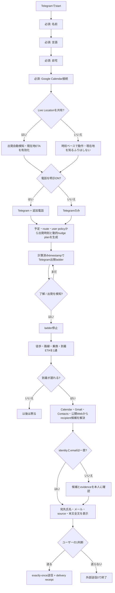

# Rockstar_ibot — DAILY organ 設計・残作業・UX（handover 可能な形で）

**Date**: 2026-08-01 · **Updated**: 2026-08-02 · **Status**: launch 済み製品の daily 完成作業中
· **Repo**: canonical `Daisuke134/life-manager`
· **Active daily branch**: `origin/feature/lm-departure-nudge`（re-review → merge → deploy 待ち）
· **App**: `apps/rockstar_ibot/`

**親 spec**: `2026-07-29-rockstar_ibot-finance-marketing-platform-design.md`（platform 全体・§7.4 Telegram
UI/UX・§10.2 Today・§12 Order 表）。あの Order 表は **runtime 移行の順序**であって daily 機能の順序ではない。
**daily の順序はこのファイルが正本**。

---

## 0. これを初めて読む agent へ（handover 前提。ここだけで作業に入れること）

| 質問 | 答え |
|---|---|
| これは何の製品か | **Telegram で完結する生活エージェント**。出発時刻を知らせ、家を出てから着くまで案内し、遅れる時は宛先と本文を提示して本人の1タップ承認後だけ相手へ連絡する。ユーザーが日常で持つ必要があるのは **スマホ1台だけ** |
| 誰が使うか | Dais（本人）→ 友人・家族 → 一般ユーザー。これは private beta ではなく **launch 済みの実製品**。daily の完成度を上げながら実利用者を増やす。全員 **Telegram の中だけ**で日常利用が完結する |
| コードはどこか | `apps/rockstar_ibot/`。`scheduler.js`（60秒 tick・呼び出し）· `lib/wake-filter.js`（鳴らす予定の選別・出発時刻の解決）· `lib/travel.js`（`[Travel]` block 生成）· `lib/late-notice.js`（遅刻連絡）· `lib/slash-command.js`（Telegram コマンド router） |
| **本番はどこで動くか** | ★ **Railway の `life-call` service** ★（`railway logs -s life-call`、link は `~/anicca-project` から）。ローカル compose（`rockstar_ibot-local-*` コンテナ）は **credential を持たない空の器**で、本番ではない（§1 参照）。全体図と folder tree = **§8** |
| データはどこか | Supabase。`lm_users` `lm_wake_log` `lm_travel_log` `lm_ask_log` `lm_user_locations` |
| 状態の見方（★実行可能★） | `set -a; . ~/.openclaw/.env; set +a` の後 `curl -s "$SUPABASE_URL/rest/v1/<table>?select=*&order=…&limit=3" -H "apikey: $SUPABASE_SERVICE_ROLE_KEY" -H "Authorization: Bearer $SUPABASE_SERVICE_ROLE_KEY"`。**鍵を stdout に出さない** |
| ★間違えやすい点★ | canonical は **`Daisuke134/life-manager`**。`anicca-project`(=anicca-products) の LM spec は写しで正本ではない。`~/.openclaw/skills/anicca-rockstar_ibot/` は OSS/BYOK 単身版であって本番ではない |
| 触ってはいけない | writer loop・記事・SNS・収益 loop（別 agent 担当）。physical / mental organ（親 spec Order 36、daily 出荷後） |

---

## 1. 実測（2026-08-01 06:41–07:00 JST、この session で自分が叩いた生の値）

### 1.1 ライブ位置は届いている（前 session の「未達」は誤診）

| 観測 | 実測値 |
|---|---|
| `lm_user_locations` | `observed_at=2026-07-31T21:41:01Z`、取得時刻 `21:41:15Z` = **14秒前**。`latitude=35.6796 / longitude=139.723085`、`source=telegram_live_location` |
| 逆ジオコード | `南元町, 新宿区, 東京都, 160-8484`（Nominatim）= 自宅と一致 |
| ★誤診の原因★ | 同じ行の `updated_at` は `2026-07-21T02:35:07Z` のまま。upsert が `observed_at` だけ更新している。**鮮度を見る列を間違えた** |

**規則**: 位置の鮮度は **`observed_at`**。`updated_at` を鮮度に使わない。

### 1.2 ★#1 呼び出し不発の原因（究明完了）★

| 手順 | 実行したこと | 出た結果 |
|---|---|---|
| a | ローカル compose の scheduler ログを読む | `[scheduler] PUBLIC_WSS not set — calls would have no media bridge URL; loop still runs but won't dial` |
| b | そのコンテナの env を実点検（`docker exec`） | `PUBLIC_WSS / LM_CALL_SECRET / TELNYX_API_KEY / TELNYX_CONNECTION_ID / GEMINI_API_KEY / SUPABASE_URL / SUPABASE_SERVICE_ROLE_KEY / COMPOSIO_API_KEY / GOOGLE_API_KEY` **すべて MISSING** |
| c | 同ログの `[travel]` 行 | `[travel] started` はあるが `inserted=` の行が**1本も無い** |
| → | **ローカル compose は空の器**。Supabase 資格情報が無いので `supaUsers()` が空配列を返し、対象ユーザーが0人。**そもそも1度も呼び出しを評価していない**。テスト中に再起動したのはこの器であって、鳴らない側の主体ではなかった | |
| d | 本番 Railway `life-call` のログ | `[scheduler] started — tick every 60s, escalating wakes at T-10/5min`（PUBLIC_WSS 警告**なし** = 本番は設定済）· `[travel] uid=lm_784ad279- inserted=2 checked=10` ← **ユーザーが見た travel 挿入は本番の仕事** · `[late] uid=lm_784ad279- decision=late sent=false tg_message_id=513` |
| e | 本番ログに `WAKE T-` / `dial failed` があるか | **どちらも無い**。= 発信を試みてすらいない |
| f | `lm_users` の実列を確認 | `call_enabled` / `daily_automation_enabled` / `notifications_enabled` の**列自体が存在しない**（コードは `!== false` 判定なので undefined は通す = 抑制していない）。`wake_policy="travel-only"`、`paid=true` |
| g | `shouldWake` の条件（`lib/wake-filter.js:17-25`） | travel-only は「location があり、home と異なる」なら true。テスト予定（渋谷）は**通る** |
| h | ★Railway のデプロイ履歴★ | `bb11f4c7… | SUCCESS | 2026-08-01 01:23:35 JST` ← **試験の発火窓（T-10 = 01:25:30–01:27:30 / T-5 = 01:30:30–01:32:30）の直前に本番が再デプロイ＝再起動している** |

**結論（原因は2層ある）**

| 層 | 内容 | 証拠 |
|---|---|---|
| 直接原因 | 試験の発火窓の直前 **01:23:35 に本番 `life-call` が再デプロイされた**。comp 変数の設定が Railway の再デプロイを誘発している。新プロセスの起動と最初の tick が窓に間に合わなかった | 上記 h。加えて本番ログの `[late] decision=late` は「その tick が回った時には既に予定時刻を過ぎていた」ことを示す |
| ★構造原因（本体）★ | **発火窓が 2分しかないのに、tick 周期が保証されていない**。`scheduler.js:333` は `if (mins > lvl.min + 0.5 \|\| mins <= lvl.min - 1.5) continue;` = 各レベル約2分の窓。ところが同じ 60秒 tick に late / mental / care / diet が相乗りし、ユーザー毎に最大90秒の timeout を持つ。ユーザーが増えるほど周期は伸び、**窓を跨いだ瞬間に呼び出しは永久に失われる** | `scheduler.js:332-336`、同 tick 内の organ 群、本番ログに他ユーザーの `[care] status=history_unavailable` が毎 tick 出続けている |
| ★計測の穴★ | 窓を逃した呼び出しは **どこにも記録が残らない**。`claimWake` は発信直前にしか行われず、発信失敗時は `releaseWake` で claim を消す。だから `lm_wake_log` を見ても「鳴るはずだったのに鳴らなかった」が**存在しない事象として見える** | `scheduler.js:337-355` |

**棄却した仮説（再検討しないこと）**

| 仮説 | 棄却理由 |
|---|---|
| 深夜は意図的に抑制されている | `scheduler.js` に時間帯ガードは無い（旧 OpenClaw skill の `*/5 6-23` cron の記憶だった） |
| `wake_policy` / `shouldWake` の除外 | `travel-only` + 実在の venue = 通る（`wake-filter.js:17-25`） |
| ユーザー側のスイッチが OFF | `call_enabled` 等の列が **存在しない** |
| PUBLIC_WSS 未設定 | ローカルのみ未設定。本番は設定済（起動警告が出ていない） |
| Composio がイベントを見ていない | 同じ予定に対し travel が `inserted=2`、late が `decision=late` を出している = 見えている |

### 1.3 ~~未解決の観測~~ → **判別完了（2026-08-01）。前提が間違っていた**

**旧記述（誤り）**: 「`lm_wake_log` 全履歴で `answered_at` が null」。id 960/961/962 だけを見た早合点だった。

**実測**: 441行中 **11行に `answered_at` が入っている**（id 773/782/790/805/844/874/890/891/902/906/937、
2026-07-18〜07-28）。Telnyx `call_events` API と DB を全件突合した結果:

| AMD result | 件数 | `answered_at` |
|---|---|---|
| `human` | 10 | **10件すべて SET** |
| `machine` | 32 | 32件すべて null |
| `not_sure` | 1 | null |

**43/43 で完全一致、取りこぼしゼロ。** さらに `machine` 判定の通話（2026-07-29T23:11、120秒）の録音を
実際にダウンロードして書き起こしたところ、日本語キャリアの留守番電話だった（「こちらのお電話は
留守番電話に転送されました」）。**AMD の判定は正しく、null は「本当に出ていない」という真実**。

**結論: 記録経路は健全。壊れているのは記録ではなく現実。**

| 実際に起きたこと | 件数 | 今の DB の見え方 |
|---|---|---|
| 人が出た | 10 | `answered_at` SET |
| 鳴ったが応答なし | 31 | `answered_at IS NULL` |
| 留守電に転送された | 32 | `answered_at IS NULL` ← **区別できない** |
| webhook 自体が来ていない（本物の故障） | 0 | `answered_at IS NULL` ← **区別できない** |

★ 製品として最も重い事実 ★: **直近4日（07-29〜08-01）の起床コール7本は全部留守電で、Dais は一度も
出ていない。** そしてその事実は今 DB から読み取れない。

★ 2026-08-02 追記（#2a の帰結）★: **`amd_result='human'` かつ `answered_at IS NULL` は今や正当な結果**
= 人は出たが `answered_at` の PATCH だけが失敗し、我々が**意図的に追いかけない**ことを選んだ行（理由は row 2a ③）。
この行を「出ていない」と読んではいけない。**それでも §1.3 が塞いだ穴は塞がったまま**である — 判別は
`answered_at` ではなく **`amd_result`** が担っており、`human` が入っている時点で「人が出た」は確定している。
失われているのは事実ではなく**その秒**だけ。区別できないままなのは `amd_result IS NULL` の行だけで、それは
依然として「webhook が来ていない = 本物の故障」を意味する。

因果チェーンは全 hop 実証済（Telnyx 発呼 + AMD 有効 → webhook 登録 `…/telnyx-events` → 署名検証（unsigned
POST が 403 = 鍵設定済）→ `client_state` 復号が `event_key` と **byte 一致**（id 960 にヒット）→ PATCH →
行更新。`human` イベントの秒単位タイムスタンプが `answered_at` と一致、発呼 +8〜24秒）。壊れている hop はゼロ。

**残る欠陥（= #2 の実作業）**: 0行 PATCH が**見えない**。`server.js:294` は `marked` を stdout に出すだけで、
`markAnswered` は「0行一致」と「HTTP失敗」の**両方で false** を返すので区別不能。`server.js:816` は戻り値を
捨てている。Telnyx が署名鍵をローテートしたら全 webhook が 403 になり `answered_at` は永久に全 null になるのに、
DB には痕跡が一切残らない。**これは #1b と同じ「失敗が存在しない事象に見える」クラス**。

### 1.3.1 ★Telnyx の再送契約★（2026-08-02 公式 docs 実取得。#2a の根拠であり、今後の全 webhook 作業の前提）

記録が消える経路はもう1本あった。**Supabase への PATCH が失敗しても handler が 200 を返していた**ので、
Telnyx は「届いた」と解釈して**二度と送ってこない**。落ちていたのは Supabase の数秒だけなのに、失われるのは
その検知**そのもの**。これも §1.3 と同じ「失敗が存在しない事象に見える」クラスで、しかも**こちらが自分から
再送の権利を捨てている**ぶん質が悪い。

| 事実 | 引用 | 出典 |
|---|---|---|
| 2xx 以外は「受け取っていない」扱い = 再送/failover の対象 | "Your endpoint must return a `2xx` HTTP status code to indicate successful receipt... All response codes outside this range, including `3xx` codes, will indicate to Telnyx that you did not receive the webhook." | https://developers.telnyx.com/development/api-fundamentals/webhooks/receiving-webhooks |
| Voice 側も同じ | "If that URL does not resolve, or your application returns a non 200 OK response, the webhook will be delivered to the failover URL" | https://developers.telnyx.com/docs/voice/programmable-voice/receiving-webhooks |
| 再送は指数バックオフ。primary 3回 + failover 3回 = **最大6回**（数字は Messaging の retry policy 表に明記。Voice は同じ primary→failover 機構を数字なしで記載） | "Up to **3 attempts** per URL with exponential backoff... **Total attempts**: Up to 6 total (3 primary + 3 failover)." | https://developers.telnyx.com/docs/messaging/messages/receiving-webhooks |
| ★応答は2秒以内★（Call Control は connection 設定 `webhook_timeout_secs` 0–30 で上書き可） | "Webhooks will be retried to each of the supplied URLs if your application does not respond in **2000 milliseconds**." | https://developers.telnyx.com/development/api-fundamentals/webhooks/receiving-webhooks |
| 再送は**同一 payload**（`client_state` も `data.id` も同じ）。変わるのは `meta.attempt` | "`attempt` \| `meta` \| Delivery attempt number (increments on retries)" / "Track processed event IDs (`data.id`) and skip duplicates" | https://developers.telnyx.com/docs/voice/programmable-voice/voice-api-webhooks |

**ここから出る2つの帰結**:

1. **再処理は安全でなければならない**（同一 payload が最大6回来る）。実際そうなっている = `recordAmdResult` は
   フィルタ無し（最終観測が勝つ）、`markAnswered` は `answered_at=is.null` のラッチ（最初の human が勝つ）。
   #2a はこの2性質に**依存している**ので、`test/telnyx-events-retry-http-contract.test.js` が両方を pin し、
   ラッチを外すと RED になる事を実測済（下の 2a）。
2. ★**2秒の壁は我々の応答コードと無関係に再送を生む**★ — `/telnyx-events` は Supabase の PATCH を最大2本 +
   Telnyx の hangup を**待ってから**応答している。合計が 2000ms を越えれば、200 を返していても Telnyx から
   見れば失敗で、同じ event がもう一度来る。今回の変更で壊れるものではない（1 の冪等性が受け止める）が、
   **書き残さないと「なぜか毎回2回書かれている」の原因究明をまた1から始めることになる**。将来この handler に
   I/O を足す時の上限は 2000ms で、超えるなら「先に 200 を返して非同期で書く」への設計変更が要る。

---

## 2. 外部調査（2026-08-01、一次資料）

| 論点 | 結論 | 出典 |
|---|---|---|
| Telegram ライブ位置の更新頻度 | **Bot API に更新間隔の規定は無い**。`edited_message` として push されるが頻度は送信側クライアント任せ。SLA は無い | core.telegram.org/bots/api §editMessageLiveLocation |
| `live_period` | 60–86400秒、または `0x7FFFFFFF` で**無期限** | 同 §sendLocation:「must be between 60 and 86400, or 0x7FFFFFFF for live locations that can be edited indefinitely」 |
| 位置誤差 | `horizontal_accuracy` = 0–1500 m | 同 §Location:「The radius of uncertainty ... 0-1500」 |
| ★設計への帰結★ | **秒単位の追従案内を作らない**（「次で乗換」「前から3両目」は禁止）。位置は「家を出たか」「大きく遅れているか」の粗い判定にだけ使う | 上記の SLA 不在から |
| 乗換ステップ（日本・米国） | **Google Routes API v2 `computeRoutes` TRANSIT** が両国同一スキーマ。`transitDetails.transitLine`（路線）· `headsign`（行先）· `stopDetails`（乗降駅・時刻）· `stopCount`。$5.00 / 1,000 calls | developers.google.com/maps/documentation/routes/reference/rest/v2/TopLevel/computeRoutes |
| ★出口番号★ | **Routes API にも Transitland/OTP にも無い**。番線も無い | 同上スキーマ |
| 出口番号の入手先 | 日本固有データ。鉄道事業者の公開データ（ODPT 等）を別途引く。米国は概念自体が無い | odpt.org / transit.land |
| 未検証 | NAVITIME / Ekispert の実レスポンス項目（docs が JS 描画で読めず）。必要なら試用キーで実 call | docs.ekispert.com |

---

## 3. 残 TODO（1 から順。番号 = 実行順。飛ばさない）

### 3.0 2026-08-02 最新 checkpoint（これより古い行と矛盾したらこちらが勝つ）

**製品の位置づけ**: private beta / beta ではない。Rockstar_ibot は既に launch 済みで、登録・Google
Calendar 接続後に実利用できる。ここでいう「出荷」は新製品の公開ではなく、**launch 済み製品が約束している
daily journey を完成させ、友人・家族を含む利用者へ通常どおり案内・promotion できる状態にすること**。

**登録契約**:

| 種類 | 項目 | 無い場合 |
|---|---|---|
| 必須 | 名前 · 言語 · 自宅 · Google Calendar | daily journey を開始しない。どの予定を、誰に、どこから案内するか決められない |
| 任意（推奨） | Telegram Live Location | 時刻ベースの連投と予定経路は動く。ただし「家を出た」自動停止・現在地ETA・実測の遅刻判定は行わず、知っているふりをしない |
| 任意（追加 channel） | 電話 | 無くても daily 全体が Telegram で動く。有効化した人だけ Telegram と同じ判定に電話が追加され、留守電なら即切る |
| 任意（recipient evidence） | Gmail / Google Contacts | Calendarのorganizer/attendeeで宛先が一意なら不要。不明・曖昧な時だけ接続を提案し、許可された範囲で関連thread/contactを検索する |

**2026-08-02 のコード実測**:

- `origin/feature/lm-departure-nudge` に 2c の6段連投、`[了解]` 停止、電話なし cohort 修正がある。
- B1 修正後、`wakeTick` の外側 filter は `daily_automation_enabled !== false` のみ。電話 gate
  `call_enabled === true` は `wakeCallOnce` 内に残り、Telegram 連投は電話設定から独立する。
- `lib/travel.js` の `_geoMemo` は従来 `has()` しかなく cache が一度も成立していなかった。成功時だけ
  `_geoMemo.set(addr, geo)` する修正が branch にある。実測は travel block あり = geocode 0 / route 0、
  block なし10 tick = geocode 2 / route 3、同一経路 user を20人追加しても増加0（修正前は geocode +20）。
- B1/S1–S4/geocode 回帰の検証 receipt は新規3 file + wake 回帰2 fileで
  **tests 46 / pass 46 / fail 0**、対象2 fileの `node --check` は両方 OK。全 suite は
  **2198 / 2193 / fail 5**で、5件は既知 baseline のみ。
- ★現在の `main` はまだ上記 branch の完成形ではない★。re-review → newer `main` を巻き戻さない merge →
  Railway deploy → production receipt が必要。
- ★row #5 は未完成で、現 `lib/late-notice.js` は遅刻判定後に `sendLateNotice()` を自動実行する★。
  これは「宛先・本文を表示し、`[送る]` まで外部送信0」という製品契約に反するため、promotion 前の blocker。
- ★hard-code audit★ `田中さん` / `tanaka@…` / `19:12` / `12分` 等の§5表示は説明用fixtureであり、
  runtime値ではない。一方、branchの `NUDGE_LEVELS = [25, 10, 5, 0, -3, -7]` は実際のhard-codeで、
  現 `externalAttendees()` / `notify.js` はCalendar attendeeだけを読み、organizerを除外する。Gmail・Contacts・
  Webの人物探索は宛先解決に未接続。したがって2cと#5はこのまま完成扱いにしない。

**2026-08-08 の live 実測（08-02 の行と矛盾したらこちらが勝つ。すべてこの日に自分で叩いた値）**:

| 観測 | 実測値 | 取り方 |
|---|---|---|
| 本番 build | `https://life-call-production.up.railway.app/health` → 200 `{"ok":true,"service":"life-call","build":"lm2a-webhook-retry-v1"}` = commit `c6ce45fdb`（08-02） | curl |
| `origin/main` HEAD | `c849fecda`（08-06、connector 系）。daily 差分ではない | git |
| 出発連投 branch | `origin/feature/lm-departure-nudge` `923a412fd` は **main の祖先ではない**（`git merge-base --is-ancestor` → NO）= 2c は未 merge・未 deploy | git |
| QR 導線 | `aniccaai.com/life-manager` → 200、body に `LifeManagerBotbot?start=lp`。`/start` → `onboardLink()` → `aniccaai.com/lm?tg=<chatId>` | curl + `lib/telegram.js:123-126` |
| Telegram | webhook mode、`last_error_date: null`、`@LifeManagerBotbot`。`telegram_chat_id` で multi-tenant 解決 | getWebhookInfo / getMe |
| 利用者 | `lm_users` = **3行**（すべて 06-18〜06-25 の検証行）= 他人が登録を完走した実績は**まだ0** | PostgREST `Content-Range: 0-2/3` |
| local 依存 | DAILY 実行経路（`server.js` / `scheduler.js` / `lib/*`）に `/Users/operator` · `~/.openclaw` · `launchctl` · `osascript` の参照 **0**。`~/Library/LaunchAgents` の `rockstar_ibot-*` は Dais 個人の earn / connector job で、新規 user の daily 経路には乗らない | grep + plist 実物 |

**この実測から出る結論**:

- ★cloud-only は「設計目標」ではなく**ほぼ現状**★。Railway プロセス内 60秒 tick で完結し、Mac が落ちても他人の1日は回る。残るのは**停止させて7 cycle 数える実 receipt**だけ（下の #7）。
- ★配布を止めているのは cloud 移行ではなく、#5（無断送信）・#2c 未 deploy（電話 OFF の人に出発 push が1通も行かない）・監視不在の3点★。
- ★親 spec 側（`2026-07-19-anicca-one-repo-consolidation-spec.md`）に daily の残作業を書き足さない★。2026-08-08 に PR #1392 が親 spec へ §9.5.1 / §9.8.1 / 8j / 8k / 8l を足そうとしたが、内容は本 spec の §5.3.1 / §3.0.1 と重複していた。**daily の正本はこのファイル1つ**。親 spec に残すのは portfolio 順序（§0.4.6）だけとし、PR #1392 は cloud-only(#7) と監視(#8) をここへ移した上で閉じる。

### 3.0.1 hard-code禁止契約（2026-08-02追加）

**禁止するもの**:

- 人名、メールアドレス、会社名、イベント名、場所、時刻、遅刻分数をsource codeのproduct dataとして埋め込む。
- `T-25`等の固定配列を全user・全eventへ適用する。
- event titleの姓名から `first.last@company.com` のようなメール形式を推測して送る。
- Web検索の同姓同名を、Calendar/Gmail/Contactsとのidentity一致なしに宛先へ採用する。
- spec・test fixture・prompt exampleの文字列をruntime fallbackとして使う。

**許可するもの**: test fixtureの架空値、UI説明例、version付きpolicy/schema。ただしfixtureは `example.invalid` または
`<recipient_email>` のように実データでないと明示する。policy値はsource literalではなく、`lm_daily_policy` の
user/tenant設定とversion付きdefault rowから読み、いつ・なぜその値になったかをreceiptに残す。

#### 動的nudge plan

eventごとに `nudge_plan` を生成・永続化し、固定 `NUDGE_LEVELS` を廃止する。入力はevent start、routeから得た
departure time / travel duration、userの支度時間・過去のack/出発反応、event重要度、Live Locationの有無と鮮度、
現在時刻、user/tenant policy。出力は単調増加する実送信timestampと各messageの目的。送信本数・最小間隔・
quiet hours・lateへのhandoffもpolicy dataであり、source codeの数字にしない。

遅刻分数は `route ETA - event start` から毎回算出する。`now - planned departure`をそのまま遅刻分へ足す近似を
確定値として表示しない。Live Locationなしでは「自宅を今出た場合の推定」と明示する。

#### 動的recipient resolver

`recipient resolver` は次のevidenceをuserごと・eventごとに検索し、candidateを同一人物へentity resolutionする。

1. **Google Calendar**: `event.organizer` と `event.attendees[]` の氏名・email・self/resource・response status。
   organizerを一律除外しない。self、会議室resource、declined attendeeは除外する。
2. **接続済みGmail（任意）**: event title、organizer、参加者名、会社/domain、descriptionの識別子で関連threadを
   検索し、実message headerのFrom/To/Ccと署名contextをevidence化する。無関係なmailbox全体をpromptへ渡さない。
3. **Google Contacts / People（任意・別read permission）**: 許可済みcontactのname、nickname、email、organizationを
   検索する。Gmail接続済みだからContacts権限もある、とみなさない。
4. **公開Web検索**: event/会社/人物の公式page・公開professional contactを確認する。非公開メールや推測emailを
   作らない。Web単独のcandidateは自動確定しない。
5. **本人確認**: evidenceが衝突する、複数人が同score、送信可能なemailが無い場合はTelegramで候補を表示して
   本人に1回選ばせる。選択はevent/関係性memoryへ保存し、次回から再利用する。

resolverの出力は `{display_name, email, source, evidence_refs, confidence, event_role}`。承認cardはこの実値と、
どのsourceで確定したかを表示する。宛先0件/曖昧ならsend buttonを出さない。宛先決定と送信承認は別の権限で、
resolverが確信しても自動送信してはならない。

公式契約: Calendar eventは`organizer`と`attendees[]`（email/displayName/self/organizer/resource/responseStatus）を返す。
People `people.searchContacts` はContacts read scopeでname/email/organization等を検索する。Gmail
`users.messages.list`は接続userのmailboxを`q`で絞る。出典:
https://developers.google.com/workspace/calendar/api/v3/reference/events ·
https://developers.google.com/people/api/rest/v1/people/searchContacts ·
https://developers.google.com/workspace/gmail/api/reference/rest/v1/users.messages/list

**ここからの実行順**:

1. re-reviewを通す（B1とgeocodeコストの独立検算）。
2. 固定 `NUDGE_LEVELS` を動的・永続化されたevent別 `nudge_plan`へ置き換える。B1/cache等の安全修正は維持する。
3. 自動メール送信を止め、Calendar→Gmail→Contacts→公開Web→本人確認のrecipient resolverと承認ledgerを作る。
4. daily差分だけを、newer `main` を巻き戻さずmergeする。
5. Railway deploy後、電話なし実userへの動的連投・ack停止・電話opt-in・留守電切断・API costを実測する。
6. #3 家を出た検知と、位置なし縮退 UX を完成する。
7. #4 乗換ステップを完成し、実予定で地図アプリを開かず到着する。
8. #6 電話なし・位置なし・Gmail/Contactsなしを含む実user E2Eと、全failure UXを通す。
9. #7 Mac Mini を停止したまま7 cycle 回し、cloud-only を receipt で閉じる（2026-08-08 追加）。
10. #8 死活監視を cloud 側に置き、意図的に落として5分以内の実TG警告を受け取る（2026-08-08 追加）。
11. #9 登録契約を §5.1 の必須項目へ戻す（名前・言語・自宅の欠落、電話の必須化、英語固定を直す。2026-08-08 追加）。
12. 友人・家族へ通常のlaunch済み製品として案内し、実利用feedbackを回収して継続改善する。

★ **この表の「DONE」は "branch に入った" という意味であって "本番で効いている" ではない。両者を混同すると、
2026-08-01 16:56 の実測（下の #0）と同じ嘘を繰り返す。** ★

| # | 作業 | 無いと何が起きるか | done（実 receipt） |
|---:|---|---|---|
| **0** | ★ 1a〜2b の 35 commit を `main` へ merge して Railway へ deploy ★ | **2026-08-01 16:56 実測**: live の `life-call` は `main` の `fce82564c`（deploy 10:13 JST）で、daily organ の修正は **1つも本番に無い**（`git merge-base --is-ancestor` で `da7dec52b` / `1eb594fe7` / `a42746699` / `7e077d132` すべて NO）。証拠 = 16:47 JST に実架電があり `amd_result` が `null`（AMD 記録コードが未 deploy）。**留守電に2分喋って課金する挙動はこの瞬間も生きている**。1d の Composio 減も deploy 前は測れない | live deploy の commit が 2b を含む。deploy 後の実架電行に `amd_result` が入り、`machine` なら通話が数秒で終わる |
| **1** | ~~呼び出し不発の原因究明~~ → **原因特定済（§1.2）。残りは修正3点** | 呼び出しが静かに消える = 製品が存在しない | ①窓を「取りこぼさない」形に変更（下記 1a）②逃した呼び出しを記録（1b）③時間に敏感な loop を他 organ から分離（1c）。実予定で T-10/T-5 が両方 `lm_wake_log` に載る |
| 1a | ~~発火条件を「2分の窓」から**追い付き方式**へ~~ ✅ **DONE 2026-08-01**（commit `da7dec52b`、merge `9873e0ce9`） | tick が遅れた瞬間に永久に失われる | 実装: `scheduler.js` の窓判定を撤廃し `mins <= lvl.min+0.5 && mins > LATE_CUTOFF_MIN(-15)` で due 判定 → **最も緊急な1件だけ発信**、超えられた粗いレベルは claim だけして鳴らさない。検証（自分で実行）: `node --test test/wake-catchup.test.js` → `tests 5 / pass 5 / fail 0`、`node test/scheduler.test.js` → PASS。cases = ①T-5 を5分過ぎた tick でも1本鳴る ②通常は T-10 → T-5 の2本 ③両方 due の tick でも1本 ④出発を15分超過なら鳴らさない ⑤発信失敗で claim が解放され次 tick が再試行 |
| 1b | ~~「鳴るはずだったのに鳴らなかった」を記録~~ ✅ **DONE 2026-08-01** | 失敗が**存在しない事象**に見える（今回の3日を溶かした原因） | 実装: 新 ledger `lm_wake_miss`（`migrations/2026-08-01-lm-wake-miss.sql`、本番 Supabase に適用済 = `http=201`、PostgREST 読み取り `http=200`）+ `lib/wake-miss.js` + `scheduler.js` の `noteWakeMiss()` + `/status` の1行。記録する2事象 = ①`dial_failed`（`releaseWake` が claim を消す**前**に理由を残す）②`no_call_before_departure`（departure が `LATE_CUTOFF_MIN` を越えた時点で最細レベルの claim が無い = 一度も試みていない）。`(uid,event_key)` 主キー + merge-duplicates upsert なので 60秒 tick の連続失敗は1行を更新するだけ。`first_seen_at` は payload に入れないので「いつ壊れ始めたか」が保持される（実測: first_seen_at=01:04:57.5 / occurred_at=01:04:58.9）。★§5.4 の「自分から言う」も実装★ = `notified_at IS NULL` を条件にした PATCH を lock にして**1 miss につき Telegram 1通だけ**送る（retry tick は無言）。検証（自分で実行）: `node --test lib/wake-miss.test.js lib/slash-command.test.js test/wake-miss-record.test.js test/wake-catchup.test.js test/telegram-slash-http-contract.test.js` → **tests 55 / pass 55 / fail 0**（1a の回帰5件を含む）+ 本番 Supabase への実 round-trip（write → upsert → read → `/status` 行 `🔔 Missed: the 13:15 call could not be dialled (...)` → 検証行を DELETE、表は空に戻した） |
| 1c | ~~呼び出し loop を care / diet / mental / late から分離~~ ✅ **DONE 2026-08-01**（設計 = §3.1 方式A） | 他 organ の遅さが呼び出しを殺す。ユーザーが増えるほど悪化 | 実装: `wakeUserOnce` を **`wakeCallOnce`（poll + fetch + event 公開 + 発信のみ）** と **`organsUserOnce`（8 organ）** に分割し、`wakeUserOnce` は両者の合成として温存（Inngest `makeWakeUserHandler` と既存 suite がこの名前を呼ぶ）。新規 `lib/event-cache.js` = wake tick が fetch を所有し organ tick は読むだけ（`calendar-cache` のキーが分単位で回るため、素朴に2ループへ分けると Composio が倍増する）。新規 `lib/organ-run.js` = 全 organ を `[organ:<name>] uid=… ms=…` で計測（成功は stdout・失敗は stderr）。`startWakeLoop()` = **固定60秒・user 毎 20秒**（`WAKE_USER_TIMEOUT_MS`）、`schedulerPollInterval()` を意図的に使わない（#1d の劣化を dial に波及させない）。`tick()` は organ 側へ。`maybe-start-loops.js` + `server.js` で本番起動に配線。★review 指摘の修正込み★: H-1 dial 前の `recordDailyComposioPoll` await を fire-and-forget 化（20秒予算を会計処理が食う = 潰したはずの構造の縮小版だった）/ H-2 `claimWake` に `claim_token` を持たせ `releaseWake` を所有権付きに（migration `2026-08-01-lm-wake-log-claim-token.sql` を本番 Supabase へ適用済 `http=201` / `read_http=200`。放棄された tick が後続の**成功した** claim を消して**二重架電**する経路を封鎖）/ M-4 organ の失敗ログを stderr へ戻す。検証（自分で実行）: `node --test` 10 files → **tests 104 / pass 104 / fail 0**、`node -e` で `startWakeLoop / wakeTick / wakeCallOnce / organsUserOnce = function` + `WAKE_USER_TIMEOUT_MS = 20000`。★最重要 assertion は mutation で kill 確認済★ = 全 organ を 5000ms stall させて `wakeCallOnce` が 1.5ms で完走（分割前の順序を復元した mutant では 5007ms で RED） |
| 1e | ~~organ tick の `call_enabled !== false` filter を外す~~ ✅ **DONE 2026-08-01** / **2cでwake側も更新** | dial が別 loop に出た今、**電話番号を出さない人（#6）に care/diet/mental/precepts/relations が1つも届かない**。さらに2cをwake loopへ載せた後は、wake外側の電話filterがTelegram連投まで消してしまう | 最終形: `tick()` と `wakeTick()` のcohort filterは `daily_automation_enabled !== false` のみ。電話無効userにもorgansとTelegram連投が走る。実dialだけを `wakeCallOnce` 内の `call_enabled === true` でgateし、`daily_automation_enabled=false` は全停止のまま。2c/B1回帰46/46でpin |
| 1d | ~~Composio 予算超過で tick が5分に落ちるのを止める~~ ✅ **コード DONE 2026-08-01 / 本番実測は deploy 待ち**（設計 = §3.2） | 7月は実測 20,488 で既に劣化済。8月も現ペースで約5日で再劣化 = 製品が毎月半分は5分刻みで動く | 実装: `lib/calendar-cache.js` の `cacheKey(uid, window, ttlMs)` がバケット幅に **TTL そのもの**を使う（`minuteBucket` 廃止）。幅と失効を1つの数字が決めるので二度とズレない。`ttlMs<=0`（= キャッシュ無効）は key を作らず transport へ直行（幅0の除算・全窓の1キーへの潰れ・読まれない `entries` 行の蓄積を回避）。検証（自分で実行）: `node --test lib/calendar-cache.test.js test/wake-catchup.test.js test/wake-loop-isolation.test.js lib/events.test.js` → **tests 39 / pass 39 / fail 0**、および実 `fetchUpcomingEvents` を 60秒刻みで5回呼ぶ E2E で **transport hits = 1**（修正前は 5）。`wake-catchup` が緑 = 発火は `now` と `startMs` の差で決まり fetch 時刻に依存しない = **精度据え置き**。★未検証★ 本番 `lm_api_cost` の実減少は deploy 後1日数えるまで確認できない（この branch は未 merge・未 deploy） |
| **2** | ~~`answered_at` が常に null の判別~~ ✅ **DONE 2026-08-01**（判別 = §1.3、記録経路は健全だった） | ①応答なし ②留守電 ③webhook が来ていない（本物の故障）が **すべて `answered_at IS NULL`** で見分けられなかった。署名鍵ローテートで全滅しても痕跡ゼロ | 実装: migration `2026-08-01-lm-wake-log-amd-result.sql` で `amd_result` 追加（本番適用済 `http=201` / `read_http=200`）。`call.machine.detection.ended` を受けたら**必ず**行を PATCH、`answered_at` は `human` の時だけ。★2つの書き込みは冪等性の規則が逆★ なので `markAnswered`（`answered_at=is.null` フィルタ必須 = 一度きりのラッチ）と `recordAmdResult`（フィルタ無し = 最終観測が勝つ）を**別関数**にし、`applyAmdDetection` が合成（1つの PATCH に融合すると、応答済みの行に後から来た検知が filter で捨てられて**また記録漏れになる**）。0行一致と HTTP 失敗を `{ok, matched, error}` で分離し、webhook 側で別々の stderr 行に。bridge 側（戻り値を捨てていた）も同じ2分類をログするように。★backfill 21行★ = Telnyx `call_events` を handler と同じ `client_state` 復号で再導出し、**書く前に**全21行が実在行に解決し矛盾ゼロ（human↔SET 3/3、machine/not_sure↔NULL 18/18）を確認してから投入。Telnyx の保持期間が 07-25 までなので残りは**推測せず NULL のまま**。検証（自分で実行）: `node --test` 4 file → **tests 51 / pass 51 / fail 0**、`node --check server.js` OK、本番 `lm_wake_log` の実 census = **machine 17 / human 3 / not_sure 1** |
| **2b** | ~~留守電への発話を止める + 電話を既定 OFF~~ ✅ **コード DONE 2026-08-01 / 課金減は deploy 待ち**（Dais 2026-08-01、正本 = §5.2.1） | AMD が `machine` でも bridge は喋り続け、キャリアの録音上限120秒で切られていた（`hangup_source` 43件すべて `callee`）。1本 約$0.05 の Gemini Live を**人に届かない留守電**に払っていた。実測 `human` 3 / `machine` 17 | 実装: `amd_result` を先に永続化し、`human` 以外をhangup。電話defaultはfalse、panel表示も同じdefaultを使う。★2c後の最終境界★ `wakeTick` は電話なしuserにもTelegram連投するため電話filterを持たず、実dial直前の `wakeCallOnce` だけが `call_enabled === true` を要求する。検証15 file 192/192、branchのB1回帰46/46。本番で留守電秒数を実測して閉じる |
| **2d** | ~~`/test-call` も留守電に当たったら切る~~ ✅ **コード DONE 2026-08-02 / 実架電の receipt は別途**（正本 = §5.2.1） | `server.js` の `/test-call` は `wakeUid`/`wakeEventKey` を積まないので `client_state` が空になり、webhook が `"no wake context"` で早期 return して **hangup 経路に到達しない**。AMD は動き課金も出る。ユーザー起点かつ rate limit 付きだが、**まだ留守電に金を払える最後の場所** | 実装: ①原因は 2b の hangup が壊れていた事ではなく **`/test-call` が自分を名乗らなかった**事。`client_state` に**呼び出しの「種類」**を持たせ（wake = `{wakeUid, wakeEventKey}` / test = `{testUid}`）、`decodeCallClientState` 1本が両方を返して webhook が `kind` で分岐する ②★stream URL には触っていない★ — `buildStreamUrl` の query は `signCtx([summary,dateTime,location,urgency,lang,name,wakeUid,wakeEventKey])` で署名され `/ws` bridge が**同じ順序の配列**で検証するので、種類を query 項目で運ぶと署名の意味が片側だけ変わる。代わりに `placeCall({to, streamUrl, clientState})` に任意引数を1つ足して透過（`amdDialOptions(url, env, {clientState})` は明示値が URL 由来に勝つ。wake 経路は無変更）③★test 呼び出しは Supabase に一切書かない★ — scheduler が作る `lm_wake_log` 行が**存在しない**ので、`applyAmdDetection` を流用すると全 test call が `matched=0` を返し、「本物の wake 行が消えた」を意味するはずの §1.3 の警報が**恒常ノイズに化ける**。よって `applyTestCallDetection` は記録せず hangup だけを行う ④★hangup 条件は wake と完全に同一★ — `human` は切らない / `not_sure` は切る（実測 machine 17 : human 3、外すコストは「1回の nudge を逃す」対「2分の課金発話」で非対称）/ **空・読めない result は誰も切らない**（あれは AMD の判定ではなく payload の解析失敗。ここで切ると Telnyx の schema 変更1つが「全 test call が応答直後に死ぬ」に化ける = §1.3 の無音全損クラス）。同一性は両者が `shouldMarkAnswered()` を共有する事で担保（人間の定義を変えたら両方が一緒に動く）。検証（自分で実行）: `node --test lib/telnyx-webhook.test.js` → **tests 5 / pass 5 / fail 0**、`lib/dial.test.js + test/scheduler.test.js + lib/answered.test.js` → **tests 13 / pass 13 / fail 0**、`test/testcall-amd-hangup.test.js + lib/late-notice.test.js` → **tests 31 / pass 31 / fail 0**、実 `server.js` を実 HTTP + 実 Ed25519 署名で叩く `test/testcall-amd-hangup-http-contract.test.js` → **tests 1 / pass 1 / fail 0**（fake fetch が未知の host/path で throw するので「Supabase に書かない」が主張でなく物理制約。dial body の `client_state` が `kind:"test"` に戻る事と、stream URL の query 項目が9個から増えていない事を pin）、`node --check server.js` OK。全 suite: 変更前 **tests 2037 / pass 2031 / fail 6** → 変更後 **tests 2052 / pass 2046 / fail 6** で**失敗は同一の6 file**（`event-participation-entities` / `panel-corrective-red` / `panel-corrective3-four-blockers` / `panel-corrective4-logout` / `panel-display-policy` / `browser-task-telegram-http-contract` = 本変更と無関係の既知 baseline。`git stash` して `panel-corrective-red` 単体が同じ **tests 11 / pass 10 / fail 1** で落ちる事も確認済、直していない）。★未検証★: 実架電の通話秒数は deploy 後に Telnyx 側で実測する（下の 0-receipt と同じ receipt 欄で閉じる） |
| **2a** | ~~webhook の PATCH 失敗時に Telnyx へ 200 を返すのをやめる~~ ✅ **コード DONE 2026-08-02 / 実再送の receipt は別途**（根拠 = §1.3.1） | Supabase が落ちている間、大声でログは出るが Telnyx には「受け取った」と答えるので**再送の権利を自分から捨てている**。落ちていたのは数秒でも、失われるのはその検知そのもの。しかも痕跡は stderr にしか残らず DB は永久に NULL = §1.3 と同じ「失敗が存在しない事象に見える」クラス | 実装: `server.js` の `/telnyx-events` 末尾で `outcome` を 200 に畳んでいた三項を分解し、**`!detection.amd.ok` の時だけ 503**（body = `record failed; send it again`）。★実際に引けた線は「書き込みが着地したか」対「着地して0行だったか」の**1本だけ**★ = ①`!ok` → 5xx を返して Telnyx に再送させる（§1.3.1 の「2xx 以外 = 受け取っていない」。primary 3 + failover 3 の指数バックオフ）。★この線の粗さを正直に書く★ — `patchWakeLog`（`lib/late-notice.js:196-207`）は**あらゆる失敗を同じ `{ok:false}` に畳む**ので、一時的なもの（5xx / fetch の throw）だけでなく**恒久的なものまで再送を要求してしまう**。実測（`node -e` で直接呼んで確認）= `http_400`（schema drift）· `http_401`（service-role 鍵ローテート）· `http_404` · `unreadable_response` · `missing_args` · `recordAmdResult` の **`missing_result`** が全部 `{ok:false,matched:0}` → 全部 503 → 6配送すべてで同じように失敗する。★`missing_result` が一番痛い★ — `lib/late-notice.js:245-247` は「読めない result は AMD の判定ではなく**我々の** parse 失敗だから誰も切らない」と長々と論じているのに、同じ入力が今度は**6配送を焼く**。代償 = 配送予算の空焼き + failover URL を無意味に鳴らす + **本物の障害と schema の typo が見分けられない**。当面それでも受け入れる理由 = 逆側の誤り（本物の障害に 200）は検知**そのもの**を消すが、無駄な再送は何も消さないから。★本来の直し方★ = `patchWakeLog` に retryable / permanent を返させ前者だけ escalate する（この分岐を広げるのではなく**あちら**を直す。でないと2つが drift する）。振る舞い変更なので**今回はやらない** = 別 TODO ②`matched === 0` = 書き込みは**着地して**正しく0行だった = その `uid+event_key` の行が存在しない → 再送しても永久に埋まらないので **200 で閉じる**（ここで 5xx を返すと6回の配送を焼いた上、本物の障害と見分けがつかなくなる = §1.3 の警報をノイズに変える 2d と同じ罠）③★`answered_at` の PATCH 失敗は 5xx にしない★ — ただし理由は「ラッチのせいでどうせ no-op だから」では**ない**（それは誤り。ラッチは `answered_at=is.null` なので、最初の書き込みが着地していなければ列は NULL のままで、再送された書き込みは**普通に着地する**）。本当の理由は3つ = (1) この書き込みは `amd_result` が成功した**後**にしか走らないので、再送を頼むと成功済みの `amd_result` を配送のたびに書き直す (2) 書かれる時刻は**再送時の時計**で指数バックオフの分だけズレる = 「無い」より悪い答えになる (3) `amd_result='human'` が「人が出た」事実を既に記録しているので、失うのは事実ではなく**その秒**だけ（失敗は既存の `report()` が stderr に残す）④★`/test-call` 分岐は常に 200★ — 書く先が無く、唯一の副作用である hangup は**再送できない**（最初のバックオフが明ける頃には通話がキャリアの録音上限で終わっており、切る相手がいない）。検証（自分で実行）: 新規 `test/telnyx-events-retry-http-contract.test.js` = 実 `server.js` を実 HTTP + 実 Ed25519 署名で叩き、fake fetch が未知の host/path で throw する（= 「Supabase に届く前に答えた」が緑にならない物理制約）。**先に RED を踏んだ** → `tests 5 / pass 3 / fail 2`（`expected 5xx, got 200` が Supabase 500 と ECONNREFUSED の2件だけ。`matched=0` / 正常系 / test call の3件は現状どおり緑 = 変えてはいけない所を変えていない証拠）→ 実装 → `test/telnyx-events-retry-http-contract.test.js + test/testcall-amd-hangup-http-contract.test.js + test/testcall-amd-hangup.test.js + lib/late-notice.test.js` で **tests 38 / pass 38 / fail 0**（下の characterization test を足した後の再実測値。実装直後の 37/37 は当該 test を書く前の数）。★再送安全性を characterization test で固定★（§1.3.1 の帰結1）= 同一 event を2回配送し「1回目 Supabase 500 → 5xx / 2回目 200 + `answered`」を pin した上で、`answered_at` の全 PATCH が `answered_at=is.null` を**持つ**事と `amd_result` の全 PATCH が**持たない**事を assert → **mutation で kill 確認済**: `markAnswered` から `filter: "&answered_at=is.null"` を外すと当該1件だけが `tests 6 / pass 5 / fail 1`（`answered_at must be latched so a resent event cannot rewrite the first human proof`、actual URL に `answered_at=is.null` 無し）で落ち、戻すと `tests 6 / pass 6 / fail 0`。全 suite `node --test lib/*.test.js test/*.test.js` = **tests 2080 / pass 2075 / fail 5**、失敗は既知 baseline の部分集合（`panel-corrective-red` / `panel-corrective3-four-blockers` / `panel-corrective4-logout` / `panel-display-policy` / `browser-task-telegram-http-contract`。6件目の `event-participation-entities` は単体で `tests 8 / pass 8 / fail 0` = 今回緑）。★未検証★: **実際の再送で行が埋まる**所は本番でしか見えない。本番の `SUPABASE_URL` を壊す実験は**しない**（生きている書き込みを落とすので）。deploy 後に `/health` の build tag 更新を確認し、実 AMD event が 200 で処理され続けている事をログで見る |
| **2c** | ★ 出発の押し切りをTelegram連投にする。branchの固定6段はinterimで、event別 `nudge_plan`へ置換 ★（§3.0.1 / §5.2.1） | 電話filterでは電話なしuserへ届かず、固定 `[25,10,5,0,-3,-7]` では予定・移動・支度・反応履歴が違うuserを同じ時刻で扱う | `wakeTick` cohortはdaily-enabled全員、dialだけopt-in。event start / route departure / user policy / ack history / locationから送信timestampを生成・永続化。ack / 出発 / late handoffで停止。sourceにuser固有時刻や固定rung配列0。B1/cacheの46/46を維持し動的plan testを追加 |
| **3** | 位置を「家を出た」判定に接続し、**位置なし縮退 UX**も完成（鮮度は `observed_at`） | 位置userには追従できず、位置なしuserに知っているふりをすると信頼を失う | 位置あり: 実予定で出発検知 → 連投停止 → 現在地ETA。位置なし: 時刻ベース連投 + `[出た][了解]` で停止、現在地ETAや出発検知を主張しない。`updated_at` を鮮度に使う箇所0 |
| **4** | 乗換ステップ + 取得できる出口番号 | **これが無いと地図アプリを消せない** = 商品の主張が嘘になる | 実イベント1件で徒歩・路線・行先・乗換・乗降時刻・到着ETAを1通で受信し、地図アプリを開かず到着。番線/出口は実dataがある時だけ表示し、推測しない |
| **5** | ★ 自動送信を廃止し、動的recipient resolver + 宛先・本文を見せる1タップ承認へ ★ | 現コードは自動送信し、Calendar attendeeしか見ずorganizerを落とす。Gmail/Contacts/Web evidenceを使わず、相手も遅れている・連絡済み・私的contextがある場合に誤送信する | **DONE（2026-08-08 production receipt）**: Railway `life-call` deployment `e284947e-fbc0-451a-943c-6d28c186395f` = `SUCCESS` / repo `Daisuke134/life-manager` `main` / exact commit `dcd9ad9ad3e25f1a7127ba40689653c1e2927e6b`; `/health` HTTP 200 `{ok:true,service:life-call,build:lm2a-webhook-retry-v1}`。Supabase read-only集計（宛先・本文・UID・draft IDは記録しない）で drafts **6** = `awaiting_decision=1`, `do_not_send=1`, `sent=1`, `recipient_missing=2`, `recipient_ambiguous=1`; decisions **2** = `send=1`, `do_not_send=1`; delivery claims **1**; provider receipts **1**; Telegram receipt **1** (`status=sent`, message idあり、attempts=2)。Timeline: resolved draft `11:37:36Z` → send decision/claim `11:39:45Z` → provider receipt `11:39:46Z` → durable `sent` + Telegram receipt `11:43:41Z`; 11:43:47Z の同一callback replayは `ok=true,sent=true` だが新claim/provider receipt **0**。`do_not_send` rowは `11:26:39Z`作成・`11:29:46Z` terminal更新後、重複event group **0**。missing/ambiguousは approval-card message id・decision・claim・provider/Telegram receipt **各0**でsend controlなし。Telegram `getWebhookInfo` HTTP 200: pending **0**, last error **null**; receipt chat `getChat` HTTP 200。Resend provider APIはproduction keyがsend-onlyのため一覧・個別read-backともHTTP 401（provider側read権限の制約）だが、DB provider receiptは1、今回のrecoveryから送信API呼出しは0。検証: focused late suite **66/66**, Telegram/onboard **33/33**, `git diff --check` PASS。`npm test`は既知out-of-scope Connector path scanner 1件（2 boot/deploy scriptの `${HOME}/.openclaw/.env`）のみで exit 1。 | 
| **6** | 電話なし・位置なしでもdaily coreが動く（両方任意、推奨機能） | 任意permissionを必須にすると通常利用できず、逆にpermissionなしで現在地を知るふりをすると嘘になる | 実userで4 matrix（位置×電話）をE2E。全員に連投・予定経路・承認が届く。位置ONだけ出発自動検知/現在地ETA、電話ONだけ追加架電。留守電即切断。失敗時は沈黙せずTelegramで説明 |
| **7** | ★ Mac Mini を停止したまま7 cycle 回し、cloud-only を receipt で閉じる ★（2026-08-08 追加。旧 PR #1392 の 8k を移設） | 「Dais の Mac でだけ動く」機能が daily に混ざったまま配ると、他人の1日が他人の電源に依存する。user に要求してよいのは **Telegram と QR 1枚だけ**で、install・端末・鍵・ローカル環境を要求した瞬間この製品は配れない | Mac 停止状態で7 cycle: 全 user の travel autofill / 出発連投 / 遅刻承認 / panel が無傷。DAILY 実行経路の local 参照 grep 0 hit（2026-08-08 時点で既に 0、停止 receipt だけが未取得）。local 一式は**別 deployment の選択肢**として同一 commit SHA で起動できる |
| **8** | ★ 死活監視を cloud 側に置く ★（2026-08-08 追加。旧 PR #1392 の 8l を移設） | 落ちたことに気付けないまま他人の1日を預かる状態になる。今は webhook `last_error` も scheduler tick の停止も、誰も見ていない | webhook `last_error` / `/health` / scheduler tick の3点を **cloud から**周期監視し、意図的に落として **5分以内に実 TG 警告**が届く。`pending_update_count` 閾値超過でも同様。監視経路の local 依存 grep 0 hit |
| **9** | ★ 登録契約を §5.1 の必須項目へ戻す ★（2026-08-08 実測で発覚） | 実装の登録は Calendar → **電話番号（必須）** → Stripe → Gmail(任意) で、しかも全文が英語。§5.1 の必須は **名前・言語・自宅・Calendar** で電話は任意 = 契約が逆転している。自宅が無ければ「自宅からの出発時刻」を名乗れず、言語が無ければ日本語の user に英語で話しかける | `/start` 直後に名前・言語・自宅を chat 内で取得し、`lm_users` に永続化。電話は任意（skip 可）へ戻す。言語設定に応じて登録文面が切り替わる。実 user 1人で登録完走の receipt |

**運用規則（今回の教訓）**: ★試験中に本番へ env を設定しない★ — Railway では変数設定が再デプロイを誘発し、
発火窓を破壊する。試験の前後30分は本番の設定変更を行わない。

### 3.1 #1c の設計（2026-08-01 実測に基づく決定。方式A = プロセス内 wake 専用 tick）

**実測した障害構造**（この session で `scheduler.js` を読んで確認）

| 事実 | 場所 | 何が起きるか |
|---|---|---|
| tick は `setTimeout` 再帰で**前 tick の完走を待つ** | `scheduler.js:623-637` | 次の tick の時刻 = 全ユーザー × 全 organ の合計。ユーザーが増えるほど wake が遅れる |
| 90秒 timeout は **organ 毎でなく user 毎** | `scheduler.js:596-611` | late+mental+wake+care+diet+precepts+relations が1つの予算を共有する |
| late と mental は **wake より前**に走る | `:367` `:376`（wake は `:385`） | 前2つが90秒を使い切ると wake に到達せず user ごと abandon = **鳴らない** |
| `fetchUpcomingEvents` の throw は `return` | `:363-364` | カレンダー取得の失敗が wake ごと消す（organ 毎 try/catch の外側） |
| organ 毎の経過ms ログが**無い** | 全 organ は結果のみ | `tenant timeout 90000ms` が出ても**誰が食ったか分からない** |
| 予算劣化で tick が5分に落ちる | `composio-budget.js:6-12` | wake も道連れ（→ #1d で別途潰す） |

**採用した方式 A（プロセス内に wake 専用 tick）**

```text
  今                                    A のあと
 ┌──────────────────────────┐        ┌────────────────┐  ┌──────────────────────┐
 │ tick 60s（1本）           │        │ wake tick 60s  │  │ organ tick（別タイマー）│
 │  poll → events           │        │  events        │  │  late / mental / care │
 │  → late → mental         │        │  → wake だけ    │  │  / diet / precepts    │
 │  → ★wake★                │        │  user 毎 20s   │  │  / relations          │
 │  → care → diet → …       │        │  上限          │  │  user 毎 90s 維持     │
 │  user 毎 90s を全員で共有  │        └───────┬────────┘  └──────────┬───────────┘
 └──────────────────────────┘                │ events を書く         │ events を読む
                                             └────► プロセス内キャッシュ ◄┘
```

| 決定 | 理由 |
|---|---|
| wake を独立タイマーに出す | 「他 organ の所要時間に影響されない」= 別 tick でしか満たせない。同一 tick 内の順序入替では累積 drift が残る |
| wake の user 毎 deadline を 20秒に短縮 | wake がやるのは events 取得 + 発信のみ。90秒は他 organ 用の予算であって wake には過大 |
| **wake tick が events を取得し、organ tick はキャッシュを読む** | 素朴に2ループへ分けると Composio 呼び出しが**倍**になる（`calendar-cache` のキーが分単位で回るため別ループは常に miss）。取得の所有者を wake に一本化すれば呼び出し数は据え置き |
| organ 毎の経過ms ログを入れる | done 条件が「ログで確認」。今は計測が存在しないので、隔離できた証拠を出せない |
| 別プロセス / 別 role にはしない | `lm_runtime_scheduler_leases` の `scheduler_key`、`runtime-up.js` の「compose の scheduler はちょうど1つ」不変条件、railway/Dockerfile の単一 `node server.js` を全部壊す必要がある。今の障害モード（遅い organ が同一 user 予算を食う）は A で消えるので、その代償に見合わない |

**A が守らないもの（正直に）**: プロセス crash と、Node のイベントループを**同期的に**塞ぐ organ。前者は再起動の話（別問題）、後者は現状の organ が全て I/O 待ちなので該当しない。該当し始めたら別プロセス（方式B）へ上げる。

**実装後に判明した既知の穴（2026-08-01 の review 実測）**

| 穴 | 内容 | 扱い |
|---|---|---|
| Composio 倍増の抜け道 | `putEvents` は fetch の**後**にある。fetch 自体が 20秒予算を超えて放棄される / throw すると publish されず、organ tick は毎周期 fallback fetch する = **呼び出しが持続的に2倍**。両ループの `now` が同じ分バケットに入れば `calendar-cache` の in-flight promise 共有で吸収されるので、常時ではなく位相依存 | 監視対象。#1d（予算そのものを下げる）で fetch 頻度が落ちれば露出も落ちる |
| `resolveDeparture` の可変長 | wake 対象イベント毎に Google Directions を**直列で**叩き、個別 timeout が無い。20秒予算の中で唯一長さが読めないブロック（予定3件 × 7秒で予算超過 → 放棄） | イベント毎 timeout か `Promise.all` 化。#1d と同時に扱う |
| `lm_event-cache` の evict 無し | TTL 超過でも Map から消さないので、退会したユーザーの payload がプロセス終了まで常駐 | ユーザー数比例の緩いリーク。数百人規模までは無害 |
| `deps.wake` の二義性 | `tick()` では organ 半分、`wakeTick()` では dial 半分を指す（既存テスト2件が `tick()` に `wake:` を注入しているため互換で残した） | `deps.organs` 一本化は既存テスト側の修正とセットで |

---

### 3.2 #1d の設計（2026-08-01 実測に基づく決定。キーの分解能を TTL に合わせる）

**実測（本番 Supabase `lm_api_cost` を自分で数えた）**

| 期間 | `composio_call` |
|---|---|
| 2026-07 合計 | **20,488**（`DEGRADE_AT` = 19,500 超過 → 7月中に tick が5分へ劣化していた） |
| 2026-08 直近1時間 | **157**（00:00 UTC に月次カウンタがリセットされ60秒へ復帰） |
| 現ペースの8月着地 | **約113,000**（約5日で再劣化） |
| 対象ユーザー | 2人 |
| 二重 fetch | 同一 uid が 02:20:52 と 02:20:53 に `GOOGLECALENDAR_EVENTS_LIST` を2回 |

**原因（構造）**

`lib/calendar-cache.js` の TTL は5分（`DEFAULT_TTL_MS`）。ところが `cacheKey()` は
`[uid, minuteBucket(timeMin), minuteBucket(timeMax)]` で、`timeMin/timeMax` は `lib/events.js:37` が
`nowMs` から作る。つまり **キーは毎分回る**。TTL が「5分前の答えでいい」と宣言しているのに、
キーがその答えに二度と辿り着けなくする。60秒 tick では**構造的に必ず miss**する。
キャッシュは存在するのに、一度も効いていない。

```text
 今                                     1d のあと
 tick t   key=[u|100|460]  → MISS 実fetch     tick t   key=[u|20|92] → MISS 実fetch
 tick t+1 key=[u|101|461]  → MISS 実fetch     tick t+1 key=[u|20|92] → ★HIT★
 tick t+2 key=[u|102|462]  → MISS 実fetch     tick t+2 key=[u|20|92] → ★HIT★
 …毎分 実fetch                                …5分に1回だけ実fetch
```

**決定**: `cacheKey` の分解能を **TTL と同じ幅**に落とす（`minuteBucket` → `bucket(value, ttlMs)`）。
TTL 自体は変えない。「5分古い答えを許す」という既存の宣言を、キーが実際に守るようにするだけ。

| 決定 | 理由 |
|---|---|
| TTL を延ばすのではなくキーを粗くする | 鮮度の契約（5分）は既に妥当。壊れているのは契約ではなく到達手段 |
| バケット幅 = TTL（別の knob を作らない） | 2つの knob がズレた瞬間に同じバグが再発する。1つの数字が両方を決める |
| ★wake の発火精度は据え置き★ | 発火判定は `now` と `startMs` の差で行う（fetch 時刻ではない）。5分古いリストでも T-10/T-5 の計算は正しい。影響を受けるのは**直前に作られた/変更された予定**だけで、最大5分。T-10 の余裕より短い |
| 二重 fetch も同時に消える | 1秒差の2呼び出しは同じバケットに落ちるので、`calendar-cache` の in-flight promise 共有が効く |
| Google の push 通知（watch channel）は採らない | 公開 endpoint + 更新管理が要る。効果は大きいが 1d の範囲を超える。予算が再び逼迫したら別 spec |

**この設計が守らないもの（正直に）**: 別 horizon の呼び出し（travel 30分ループ、ask 20分ループ、
panel、context-graph）は `timeMax` が違うので別キーのまま。1d が潰すのは支配項である60秒 wake tick。

## 4. 経路案内の実装方針（#4 の設計）

```
 予定（Google Calendar）
    │
    ▼
 Google Routes API v2  computeRoutes  travelMode=TRANSIT      ← 日本・米国 共通
    │   返る: transitLine（路線）/ headsign（行先）/ stopDetails（乗降駅・時刻）/ stopCount
    │   返らない: ★番線★ ★出口番号★
    ▼
 出口番号の付与（日本のみ・別データ源）
    │   鉄道事業者の公開データ（ODPT 等）を 駅 + 目的地方向 で引く
    │   取れない駅 → ★書かない★
    ▼
 Telegram に1通
```

| 国 | 経路 | 出口番号 |
|---|---|---|
| 日本 | Google Routes API v2 TRANSIT | 別データ源。取れた駅だけ表示 |
| 米国 | 同じ API・同じスキーマ | 概念が無い。表示しない（欠落ではなく仕様） |

---

## 5. UX — これが実装の目的（機能はこの体験を作るための手段）

### 5.0 約束（この3行が製品そのもの）

```
 ① もう遅刻しない        出発時刻は向こうから来る。予定表を開く必要が無い
 ② もう道に迷わない      経路は出た瞬間に届く。地図アプリを開く必要が無い
 ③ もう気まずくならない  遅れる時は、宛先と文面を確認して1タップすれば相手へ話が通る
```

**日常利用でユーザーが用意する物 = スマホ1台と Telegram。** 初回だけ Google Calendar OAuth のため
browserを開く。別のRockstar_ibotアプリ・地図アプリ・乗換アプリ・カレンダーを開く習慣は不要。

daily journey の必須入力は **名前・言語・自宅・Google Calendar**。**Telegram Live Location と電話は任意**。
任意permissionを渡さない人にもcore journeyを届け、渡した人には精度/channelを追加する。

### 5.1 登録（1回だけ、チャットの中で終わる）

```text
 /start
   ├─ 名前（チャットに直接入力）
   ├─ 言語
   ├─ 自宅
   └─ Google Calendar      → ボタン → /lm?tg=<chat_id>（OAuth はブラウザが1回開くだけ）
        ▼
   ✅ daily core開始
   ├─ Live Location（任意・推奨）→ 出発自動検知 / 現在地ETA / 実測遅刻判定を追加
   ├─ 電話（任意）              → Telegramに追加するreminder channel。明示ONだけ
   └─ Gmail / Contacts（任意・必要時）→ Calendarだけで宛先不明の時にrecipient evidenceを追加
```

**この後、ユーザーが操作を覚える必要は無い。** コマンドは存在するが、知らなくても製品は成立する。

### 5.1.1 完成後の user journey（Mermaid正本）



### 5.2 いつもの1日（3種類の場面。値はすべてruntime data）

下記の `<…>` は表示契約を示すplaceholderであり、実名・実email・実時刻・分数はCalendar / route / location /
recipient resolver / user policyから毎回生成する。specの例示値をruntime defaultへコピーしてはならない。

```text
 <nudge_at>  出発前 ──────────────────────────────────  #1
 ┌────────────────────────────────────────────┐
 │ ⏰ <event_start> <event_title> / <location> │
 │ <departure_at> に出て。あと <remaining>分  │
 │ [ 了解 ]        [ 出発を変更 ]             │
 └────────────────────────────────────────────┘
   ★ 反応が無ければ Telegram を連投して押し切る（下の 5.2.1）★
   → ここで「カレンダーを開く」という行為が消える

 <left_at>  家を出た（位置ON時）──────────────────  #3 + #4
 ┌────────────────────────────────────────────┐
 │ 🚶 <walk_to_origin>                         │
 │ <board_at> <line>・<headsign>               │
 │ <transfer_at> <station>で乗換               │
 │ <alight_at> <station> → <verified_exit>     │
 │ 到着 <route_eta> / 予定 <event_start>       │
 └────────────────────────────────────────────┘
   → ここで「地図アプリを開く」という行為が消える
   ★この1通で経路が完結する。以後は黙る★

 <decision_at>  route ETA > event start ─────────  #5
 ┌────────────────────────────────────────────┐
 │ ⚠️ <late_minutes>分ほど遅れる見込みです      │
 │ <recipient_name>（<recipient_email>）        │
 │ source: <Calendar/Gmail/Contacts/Web/確認済> │
 │「<generated_message_body>」                 │
 │ [ 送る ]             [ 送らない ]            │
 └────────────────────────────────────────────┘
   → ここで「気まずい謝罪の文面を考える」が消える
   押すまで1通も飛ばない。既定は送らない側。
   相手も遅れている・既に伝達済み・本人しか知らない事情は推測せず、最終判断を本人に残す
```

**「3種類」は出発促進・経路・承認という場面の分類**であり、通知本数のhard-codeではない。出発促進の回数と
timestampはevent別 `nudge_plan`、経路/承認の再通知条件もuser policyとdelivery stateから決める。

### 5.2.1 ★出発の押し切りは Telegram の連投で行う（電話ではない）★ — Dais 2026-08-01

**Dais verbatim**: "No meaning in rusuden no meaning. We must stop. Rockstar_ibot can just message him on
telegram. that is much better. 連投もそこら辺いいしね。逆に better yes i think. posted a lot to telegram to
send me message is much better since it would hit me to actually leave to the place more!!"

**この決定を生んだ実測（§1.3）**: 直近4日の起床コール7本は**全部留守電**。全履歴でも `human` は3件、
`machine` は17件。Charon は毎回2分間留守電に向かって喋り、1本あたり約 $0.05 の Gemini Live を払っていた
（`hangup_source` は43件すべて `callee` = キャリアの録音上限で切られていた）。**人に一度も届かず、金だけ出ていた。**

| | 旧（廃止） | 新 |
|---|---|---|
| 出発の押し切り | 📞 電話（出るまで鳴る） | 💬 **Telegram 連投**。反応があるまで間隔を詰めて送る |
| 留守電に当たったら | 2分喋り続ける | **即切る**（そもそも既定では架けない） |
| 電話 | 既定 ON | **既定 OFF**。`call_enabled` を明示的に立てた人だけの追加チャンネル |
| 理由 | — | 電話は「出る」という1つの動作を要求する。Telegram は**画面に残り続ける**ので、出発という行動に直接効く（Dais の実感） |

**連投の形**（固定rungではなく、eventごとに生成する）

```text
 <plan[0].at>  予定・場所・計算済み出発時刻を含むopening     [ 了解 ]
 <plan[1].at>  未ack/在宅/残時間に合わせたfollow-up
 <plan[n].at>  route ETAを再計算したaction message
 <handoff_at>  route ETAが予定を越えたら遅刻承認cardへhandoff
 ─────────────────────────────────────────────────
  [ 了解 ] / 出発検知 / event取消・変更 / late handoffで★即停止★
  停止条件が無い連投は嫌がらせであって製品ではない
```

branchの `[25,10,5,0,-3,-7]` は最初のbehaviorを証明したinterim fixtureであり、production contractではない。
実装は `lm_daily_policy` + event/user dataから `nudge_plan` を生成し、同じeventでもuser・場所・移動時間・
反応履歴が変われば送信timestampも変わる。

**止め方が設計の本体**: ①`[ 了解 ]` を押す ②位置が動いて出発が検知される（#3）③予定時刻を過ぎて
late organ の領域に入る — のいずれかで打ち切る。押し切りは「反応が無い間だけ」続く。

**「留守電なら即切る」を電話の全経路に効かせる（#2d、2026-08-02）**: 2b で切れるようになったのは
scheduler が架ける wake 呼び出しだけだった。ダッシュボードの「Call me now」(`/test-call`) は
`client_state` を積んでいなかったので、Telnyx の検知 webhook が「これは誰の呼び出しか」を復号できず
`"no wake context"` で早期 return し、**hangup に到達する前に処理が終わっていた**。壊れていたのは
hangup ではなく**呼び出しが自分を名乗らない事**である。

直し方で意図的に選んだ3点:

| 決定 | なぜそうしないと壊れるか |
|---|---|
| 種類は **stream URL の query ではなく `client_state`** に持たせる（`placeCall({clientState})` を透過） | `buildStreamUrl` の query は `signCtx([summary, dateTime, location, urgency, lang, name, wakeUid, wakeEventKey])` で HMAC 署名され、`/ws` bridge が**同じ順序の同じ配列**で再計算して検証する。項目を1つ足すと署名の対象が片側だけ変わり、**全通話が bridge に拒否される**。引数なら署名と desync しようがない |
| test 呼び出しは **Supabase に一切書かない** | test 呼び出しに対応する `lm_wake_log` 行は**存在しない**（scheduler が作っていない）。`applyAmdDetection` を流用すると全 test call が `matched=0` を返し、「本物の wake 行が消えた」を意味するはずの §1.3 の警報が恒常ノイズになる。**信用できない証拠は、証拠が無いより悪い** |
| hangup 条件は wake と **完全に同一**（`human` 切らない / `not_sure` 切る / **空・欠落は誰も切らない**） | 空の result は AMD の判定ではなく payload の解析失敗。ここで切ると Telnyx の schema 変更1つが「全 test call が応答直後に死ぬ」に化ける（§1.3 の無音全損クラス）。逆に `not_sure` を残すと実測 machine 17 : human 3 の分布で 2分の課金発話を払い続ける。両経路が `shouldMarkAnswered()` を共有するので、**人間の定義を変えたら wake と test が一緒に動く** |

記録（証拠）と hangup（金）は**別々の失敗をする別々の関心事**である、というのが 2b から続く一貫した形:
wake 呼び出しは「記録してから切る」、test 呼び出しは「記録する先が無いので切るだけ」。どちらも
`human` には触れない。

### 5.3 任意permissionの4状態（#3 / #6）— coreは全員同じ、追加精度だけが違う

| Live Location | 電話 | 必ず届くcore | 追加されるもの |
|---|---|---|---|
| OFF | OFF | 時刻ベース連投 · 予定経路 · 遅刻可能性の承認カード | なし。現在地・出発済みを知るふりはしない |
| ON | OFF | 同じcore | 出発自動検知 · 連投自動停止 · 現在地ETA · 実測遅刻判定 |
| OFF | ON | 同じcore | 追加電話。Telegramは減らさない。留守電なら即切る |
| ON | ON | 同じcore | 位置精度 + 追加電話の両方 |

**電話は付加であって前提ではない。位置は精度であって前提ではない。** 判定engineとTelegram journeyは1つ。
位置OFFの承認カードは「現在地から遅刻確定」ではなく、予定出発時刻からの**推定**だと明示する。

### 5.3.1 遅刻連絡の権限境界（#5）

§3.0.1のrecipient resolverがCalendar organizer/attendees、接続済みGmail、許可済みContacts、公開Web evidenceを
event contextに対して検索する。ただしRockstar_ibotは他人も遅れているか、既に口頭で合意したか、本人だけが知る
私的contextを推測できない。したがって card に **送信先の氏名・メールアドレス・source/evidence・送る本文全文・
根拠となるETA** を表示し、操作は `[送る] [送らない]` の1判断に固定する。

- `[送る]`: 表示した宛先へ表示した本文をexactly once送信し、delivery receiptをTelegramへ返す。
- `[送らない]`: 外部送信0で永久終了。別tickで同じ確認を再表示しない。
- 複数宛先: 全員を隠さず列挙する。誰に飛ぶか不明な状態では送信buttonを出さない。
- 宛先なし: 「Calendarに連絡先がありません」と伝え、送信しない。
- identity曖昧: 候補とevidenceを本人へ示して選んでもらう。Web検索だけで見つけた推測emailには送らない。
- Gmail/Contacts未接続: Calendarだけで解決できれば動く。解決できなければ接続を提案するか本人へ尋ねる。
- ★現コードとの差★: `processLocationLateNotice()` は現在承認前に `sendLateNotice()` を呼ぶ。row #5ではこの
  side effectを durable approval claim の**後**へ移し、callback以外の経路から呼べないようtestで封じる。
  `externalAttendees()`のorganizer一律除外も廃止し、resolverのevent role判定へ一本化する。

### 5.4 うまく行かない日（ここが信頼を決める）

| 事象 | ユーザーに見える物 | 黙って壊れない保証 |
|---|---|---|
| 位置が来ていない | 「位置が3時間届いていません。共有し直しますか?」+ ボタン | `observed_at` の経過で判定（#3） |
| 呼び出しが鳴らせなかった | 「8:05 の呼び出しに失敗しました。今から出れば間に合います」 | 逃した呼び出しを記録する（#1b） |
| 経路が取れない | 「経路が取れませんでした。所要は約35分です」 | 推測の出口番号を書かない（#4） |
| 予定の場所が不明 | 「どこでやりますか?」と1回だけ聞く | 既存の ask organ |

**原則**: 沈黙で失敗しない。ユーザーが「今日は来なかったな」と気付く前に、こちらから言う。

### 5.5 コマンド（覚えなくていいが、ある）

| command | 何が起きる |
|---|---|
| `/status` | 次の予定・出発時刻・位置の最終受信（`observed_at` からの経過）・直近の失敗 |
| `/where` | 今どこにいると認識しているか。ずれていたら共有の張り直しを案内 |
| `/stop` | 今日の呼び出しを止める |
| `/panel` | web パネル（履歴と設定だけ。日常では開かない） |

### 5.6 この後 chat の中に増えていく物（同じ形を守る）

daily が閉じたら、同じ「チャットで完結・外部actionの承認は1タップ・通知量はuser policyと状況から決める」型のまま面を増やす。

| 順 | 何 | 体験（形は同じ） |
|---|---|---|
| 次 | 予約（歯医者・美容室・レストラン） | 「金曜18時で取れます。予約しますか? [ 取る ][ やめる ]」 |
| 次 | 移動の手配（航空券・ホテル・新幹線） | 「この便が最安です。押さえますか? [ 押さえる ][ 他を見る ]」 |
| 次 | お金（口座・支出・請求） | 「今月は先月比 +¥32,000。原因はこれです」 |
| 後 | physical / mental（親 spec Order 36） | 同じ1通の形 |

**新しい画面を作らない。** 増えるのは通知の種類だけで、操作は常に「ボタン1つ」。
ユーザーがチャット以外を理解する必要が無い状態を、機能追加のたびに守る。

---

## 6. なぜ日次で価値があるか（課金の形）

| 事実 | 帰結 |
|---|---|
| 遅刻・道迷い・気まずさは **毎日** 発生する | 価値の発生も毎日。月1回まとめて価値を出す製品ではない |
| 1回の遅刻の損失（信用・機会）は月額を軽く超える | 「1日1回助かれば元が取れる」が説明として成立する |
| 動き続けることが前提 | **落ちている日はゼロ円の価値**。だから #1b（失敗を記録して自分から言う）が課金の前提条件 |

**課金の設計原則**: 「毎日効いている」ことを毎日見せられる製品だけが日次・秒次の課金を正当化できる。
だから通知は少なく、しかし**助けた瞬間は必ず可視**にする（出発の1通・経路の1通・承認の1通が領収書を兼ねる）。

---

## 7. launch済み製品のdaily完成とpromotionまでに起きること

| 段 | 条件 | 判定 |
|---:|---|---|
| 1 | #1（1a/1b/1c）+ #2 + #3 | 実予定で呼び出しが鳴り、出たかが記録され、出発が検知される。**逃した時は自分から言う** |
| 2 | #4 | ★ Dais が Google Maps を消す ★ = daily の合格判定。他の指標は見ない |
| 3 | #5 + #6 + #7 + #8 + #9 | 他人に渡しても事故らない（無断送信0・番号なしでも全部届く・Mac が落ちても回る・落ちたら5分で気付く・登録が §5.1 の契約どおり） |
| 4 | 友人・家族へ通常の製品として案内する | beta/testerと呼ばない。見るのは1つ:「地図アプリを開いたか」。開いたなら理由を聞き、そのjourney gapを直す |
| 5 | promotionを拡大 | 利用receiptとfeedbackを根拠に案内先を増やす。売り文句は「乗換案内アプリの代わり」ではなく **「もう調べなくていい」** |

---

## 8. アーキテクチャと folder tree（どこで何が動くか）

### 8.1 repo の正体

`Daisuke134/life-manager`（repo ID 1248111245）は **anicca を改名・統合した monorepo**。
散らばっていた物を1つに寄せる先がここ。旧 `life-manager-v0`（ID 1273052304）は archive 済み・redirect のみ。

| 中に入っている物 | 場所 |
|---|---|
| Rockstar_ibot 本体（API・panel・Telegram・reports・scheduler） | `apps/rockstar_ibot/` |
| web（landing / `/lm` 登録画面） | `apps/landing/`（`app/` + `netlify/` functions） |
| 求人 loop | `apps/job-search-loop/` |
| provider/transport 境界 | `adapters/` |
| 可搬 scheduler / worker runtime | `runtime/` |
| 常駐サービス（x402 endpoint 等） | `services/` |
| 汎用能力（**製品の credential を持たない**） | `skills/` |
| 配置定義 | `deploy/local/compose.yaml`（ローカル一式）· `apps/rockstar_ibot/railway.toml`（本番） |
| 仕様の正本 | `docs/superpowers/specs/` · 実行スライス = `docs/superpowers/plans/` |
| Anicca 側の身元・状態 | `identity/` · `state/` · `control-room/` · `templates/` |

親 spec §6.1 が layout の SSOT。`packages/*`（loop-core / job-protocol / finance-engine /
marketing-engine / product-packs …）は**目標形**で、現状は既存慣習を優先している。

### 8.2 今の実行系（2026-08-01 実測）

```text
                    ┌──────────────── ユーザーのスマホ ────────────────┐
                    │  Telegram（日常の全操作）      ブラウザ（登録のみ）│
                    └───────┬───────────────────────────────┬─────────┘
                            │ webhook / 通知 / ライブ位置      │ 1回だけ
                            ▼                                 ▼
        ┌──────────────────────────────────┐      ┌──────────────────────────┐
        │  Railway  service = life-call    │      │  Netlify  apps/landing   │
        │  = apps/rockstar_ibot             │      │  aniccaai.com/lm         │
        │   server.js  … /telegram /ws /api│      │   Google login → OAuth   │
        │   scheduler.js 60s tick          │◀─────│   → Stripe               │
        │     ├ wake   T-10 / T-5 の呼び出し│      └──────────────────────────┘
        │     ├ travel 30分毎 [Travel] 挿入 │
        │     ├ late   遅刻検知 → 連絡      │
        │     └ ask / mental / care / diet │
        └───────┬───────────────┬──────────┘
                │               │
                ▼               ▼
   ┌────────────────────┐  ┌──────────────────────────────────────┐
   │ Supabase (Postgres)│  │ 外部 API                              │
   │  lm_users          │  │  Composio  → Google Calendar          │
   │  lm_wake_log       │  │  Unipile   → Gmail 送信               │
   │  lm_travel_log     │  │  Google Maps / Routes → 移動時間・経路 │
   │  lm_ask_log        │  │  Telnyx + Gemini Live → 音声通話      │
   │  lm_user_locations │  │  Stripe    → 課金                     │
   └────────────────────┘  └──────────────────────────────────────┘

   ローカル（deploy/local/compose.yaml）: api / scheduler / worker / postgres:18 / minio
     → 現状 credential 未投入 = ユーザー0人 = 何も発火しない「空の器」（§1.2）
```

| 問い | 今の答え |
|---|---|
| daily はクラウドで動くのか | **動く。Railway `life-call`**（Mac が落ちていても継続） |
| データはどこ | **Supabase**（`lm_*` テーブル）。ローカル compose は自前 postgres を持つが本番データではない |
| web は同じ repo か | **同じ。`apps/landing`**（Netlify 配信、登録と決済だけ） |
| Mac は要るか | 日常運用には**不要**。ローカル一式は移行検証用 |

### 8.3 目標形（親 spec の Order。daily 出荷後に効いてくる）

```text
 今                                   目標
 Railway life-call（単一 service）  →  Railway 上に API / scheduler / worker pool を分離
 Supabase                           →  Rockstar_ibot 所有の managed Postgres（tenant 分離・quota）
 launchd + OpenClaw の残り          →  すべて Rockstar_ibot の job（Order 15 で OpenClaw-free）
 単一テナント運用                   →  月額の multi-tenant（Order 25）・1,000 tenant 検証（Order 26）
```

**daily の完成とpromotion拡大はこの移行を待たない。** launch済みの現行Railway + Supabaseで§7の段5まで到達できる。

## 9. 更新規律

daily の TODO 状態が変わった瞬間にこのファイルを更新して commit する。
番号は**実行順**であり、消化しても振り直さない（済んだ行に done receipt を書く）。
UX（§5）は spec の一部である — チャットで新しい体験を語ったら、その場でここに焼き直す。
`~/anicca-project` 側の同名ファイルは正本を指すポインタであり、そこを編集しない。
