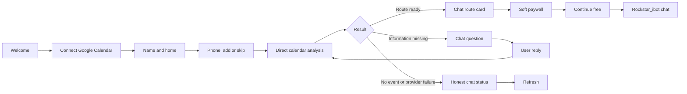
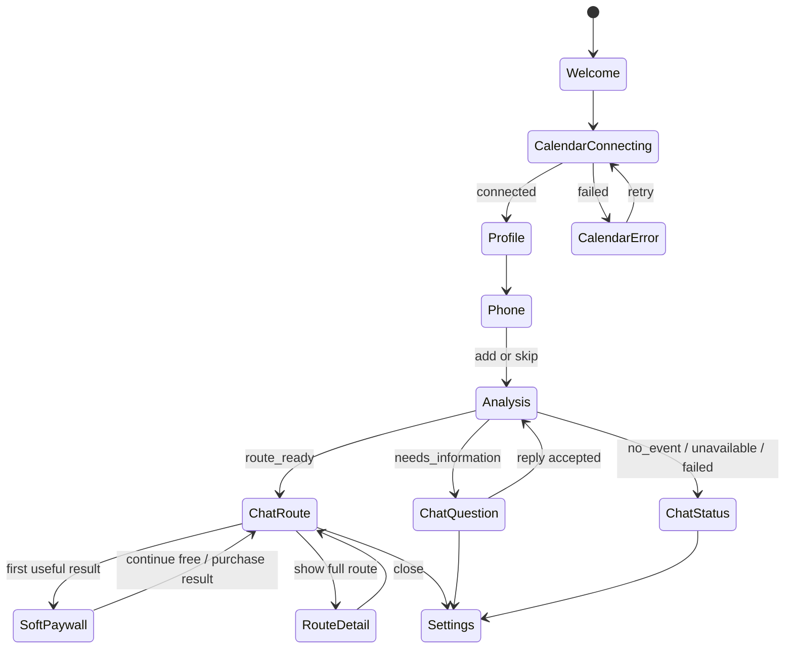

# Rockstar_ibot iOS — Product and UX Specification

Status: **Approved by Dais. Full production implementation is in progress through TestFlight, App Store submission, and real provider/device receipts.**

## Source of truth

- DAILY behavior and remaining production gates: `docs/superpowers/specs/2026-08-01-lm-daily-organ-design.md`
- Cloud backend: `apps/rockstar_ibot/`
- Existing web onboarding and control surface: `apps/landing/`
- iOS source to create: `apps/rockstar_ibot-ios/`
- Product name: **Rockstar_ibot**

This file is the source of truth for the Rockstar_ibot iOS product. It does not replace the DAILY source of truth. A requirement owned by DAILY keeps its original DAILY number and completion receipt.

PR #1414 merged into `main` as `4aacb109d6ebba52ee0afa63fe1ff94025a2600d`, so the DAILY gates referenced here are present on the implementation base.

External primary evidence used by this revision:

- [Apple Localization](https://developer.apple.com/localization/) — iOS supports an app language independent of the device language, and Xcode string catalogs separate user-visible localized resources.
- [Apple APNs registration](https://developer.apple.com/documentation/usernotifications/registering-your-app-with-apns) — App Store notification delivery uses APNs registration and a device token.
- [Transit API terms](https://transit.ls8h.com/terms) — the API is free and unauthenticated but provides no continuity, response-time, completeness, or freshness guarantee.
- [Google Maps pricing](https://developers.google.com/maps/billing-and-pricing/pricing) — Geocoding and route SKUs have separate billable usage and no-cost caps.
- [Composio pricing](https://www.composio.dev/pricing) — the free plan contains 20,000 tool calls per month.

## 1. Overview — What and why

Rockstar_ibot iOS is the native phone surface for the existing Rockstar_ibot backend. It is not a second calendar engine, a general AI chat application, or a replacement for the DAILY organ.

The behavioral promise is the same as the web and Telegram product:

> Connect the calendar once. Rockstar_ibot understands the next commitment, determines when the user must leave, and presents the next physical action in one conversation.

The iOS difference is onboarding. Telegram must collect setup data inside chat and open a browser for OAuth. iOS MUST use native screens for setup, then move the user into the same chat-first managed-day experience.

### 1.1 Product decisions

1. The existing backend remains the decision and side-effect authority.
2. iOS onboarding uses native screens. Daily operation uses one chat thread.
3. The English experience is implemented and approved first.
4. Japanese is implemented from the same semantic messages before App Store submission.
5. A screen MUST NOT mix English and Japanese system-generated text.
6. Phone number `null` is valid. Calls remain disabled until the user adds a number and explicitly enables calls.
7. The first useful calendar result appears before the soft paywall.
8. The soft paywall never blocks the free path in this release.
9. Routes are exact only for fields returned by an authoritative provider. Unsupported precision is omitted.
10. Late detection, live location, and attendee messaging are not exposed by the iOS v1 API.
11. The first TestFlight demo uses foreground/manual refresh. App Store submission additionally requires APNs delivery into the same chat.
12. No production TestFlight user is enrolled until DAILY #5 prevents every approval-free external late email.

### 1.2 Product flow



## 2. Acceptance criteria

### A. Web behavior parity and native onboarding

1. The iOS client MUST use the same authenticated Rockstar_ibot user, Calendar connection, profile, route engine, call channel, billing state, and backend decisions as the web product.
2. Behavioral parity means shared backend state and outcomes. It does not mean copying the web layout into a web view.
3. The first screen MUST contain the Rockstar_ibot promise and one primary action: `Connect Google Calendar`.
4. The app MUST NOT show a separate Rockstar_ibot login screen before Calendar connection.
5. OAuth state, nonce, callback ownership, expiry, and replay protection MUST be enforced by the backend.
6. After Calendar connection, onboarding MUST collect `name` and `home_address` on native screens.
7. `product_locale` MUST be stored as `en` during the English-first milestone. In the bilingual milestone, the profile screen MUST preselect the supported iOS preferred language (`en` or `ja`), fall back to `en`, and let the user explicitly confirm or change it before analysis.
8. The phone screen MUST provide `Add phone number` and `Skip for now`. Skip MUST persist `phone=null` and `calls_enabled=false`.
9. Calendar, name, product locale, and home are required before direct analysis begins. Phone is not required.
10. Direct analysis MUST run for the authenticated user even when `phone=null` and `paid=false`. It MUST NOT reuse the scheduler cohort that historically required both fields.
11. Analysis MUST terminate visibly as exactly one of `route_ready`, `needs_information`, `no_upcoming_event`, `route_unavailable`, or `failed`.
12. Every terminal analysis state MUST allow the user to reach chat. No empty spinner is a terminal state.

### B. Strict product localization

13. The initial implementation milestone MUST be completely English for every system-generated surface.
14. The App Store milestone MUST provide complete English and Japanese system-generated experiences.
15. `product_locale` MUST be separate from `call_language`. A new call configuration defaults `call_language` to `product_locale`, and the user can change call language only after calls are enabled.
16. The active locale applies to onboarding, chat copy, route instructions, station and line display names, actions, errors, paywall, settings, notifications, accessibility labels, and account deletion.
17. English system-generated strings MUST contain no Hiragana, Katakana, or CJK ideographs.
18. Japanese system-generated sentences MUST contain no untranslated English prose. Registered names and route codes such as `JR`, `IC`, `A2`, and `Z01` remain unchanged.
19. Calendar titles, calendar notes, and addresses authored by the user remain in their original language and MUST be represented as `user_content`, not system copy.
20. Provider-derived station, stop, line, and headsign names MUST have both `en` and `ja` display values before the route is returned as `route_ready`.
21. English display values MUST use the provider's official English name. When the provider has no official English value, the backend MUST use deterministic transliteration and record `localization_source=transliteration`.
22. If a provider-derived navigation name cannot be localized or transliterated, analysis MUST return `route_unavailable` with a localized reason. The client MUST NOT display mixed-language navigation.
23. Changing `product_locale` MUST re-project every system-generated historical message into the selected locale. User content remains unchanged.
24. Google-owned OAuth and account chooser pages are outside the app localization boundary. The first Rockstar_ibot screen after callback MUST use `product_locale`.

### C. Chat-first mobile experience

25. After onboarding, the primary surface MUST be one chronological Rockstar_ibot chat thread.
26. The app MUST have no bottom tab bar, calendar grid, day timeline, or required map screen.
27. Chat messages MUST come from a durable backend outbox with a stable message ID and monotonic cursor.
28. Launch, foreground entry, manual refresh, and APNs receipt MUST fetch the same outbox. These paths MUST NOT create duplicate messages.
29. The user MUST understand the next action from the collapsed chat card without opening another screen.
30. A route card MUST show the event, origin, destination, leave time, arrival time, total duration, buffer reason, fare when returned, and an ordered summary of route legs.
31. Tapping `Show full route` MUST open a read-only detail sheet. Closing the sheet MUST return to the same chat position.
32. The detail sheet MUST NOT perform route calculation or mutate Calendar state.
33. The composer MUST submit text only when the backend has an open question. General-purpose AI chat is not part of iOS v1.
34. Every mutation MUST carry an idempotency key. Retrying the same reply, profile save, call request, device registration, or deletion request MUST produce one side effect.
35. Failed and stale states MUST remain visible with localized retry actions. The app MUST NOT show a false success.

### D. Honest event-anchored routes

36. A route MUST be anchored to the actual Calendar event date, event timezone, and start time.
37. Outbound transit MUST use `arrive-by` semantics. A return route MUST use `depart-at` semantics.
38. Day crossings and daylight-saving transitions MUST be represented as ISO-8601 instants plus an IANA timezone.
39. The backend MUST preserve provider departure and arrival timestamps, access and egress walking time, transfer count, service name, headsign, platform, fare, and geometry when those fields exist.
40. `platform`, `fare`, and `geometry` are nullable provider facts. The UI MUST omit a null fact without replacing it with guessed text.
41. Station entrance, station exit, optimal train car, and crowding MUST NOT appear in v1 because the selected free provider does not authoritatively return them.
42. Japan transit routing MUST use Transit API first, a durable cache second, and budgeted Google fallback third.
43. Transit API results MUST display provider attribution and freshness. The client MUST provide a localized warning that the source is unofficial and service information must be confirmed when disruption matters.
44. Google fallback MUST execute only after an explicit provider failure or unsupported journey. It MUST NOT run in parallel with an accepted Transit API result.
45. Reusing the same normalized address MUST cause zero new Google Geocoding requests after the first successful persistent cache write.
46. An unavailable route MUST explain one concrete reason: missing origin, missing destination, provider unavailable, localization unavailable, no journey, or timeout.

### E. Session and tenant boundary

47. The app MUST exchange the existing Supabase/Google identity result for a versioned mobile session.
48. Every backend user ID MUST be derived from the validated session. A client-supplied UID MUST never authorize data access.
49. Access and refresh tokens MUST be stored in Keychain. Refresh token rotation and server-side revocation are required.
50. Every profile, event, message, route, question, call, subscription, device, and deletion operation MUST reject cross-tenant access.
51. Logout MUST revoke the mobile session and remove local tokens. Calendar disconnection is a separate confirmed action.

### F. Calls, paywall, settings, push, and deletion

52. Calls MUST remain disabled for `phone=null`.
53. Adding a phone number MUST validate E.164 format and MUST NOT enable calls without a separate explicit toggle.
54. `Call me now` MUST require an explicit tap and confirmation, use the existing backend call path, and enforce server-side cooldown, daily maximum, and idempotency.
55. Scheduled calls remain backend-owned. iOS MUST NOT create local timers that place calls.
56. The soft paywall MUST be presented only after the first useful resolved analysis.
57. `Continue free` MUST always dismiss the paywall and return to chat. Entitlement MUST NOT gate route or chat in this release.
58. Settings MUST contain Calendar status, name, home, product language, phone, call enablement, call language when enabled, subscription/restore, logout, and account deletion.
59. The TestFlight demo gate MUST work through foreground/manual refresh without APNs.
60. The App Store gate MUST register a production APNs token, receive a new-message notification, open the correct chat message, and deduplicate the subsequent outbox fetch.
61. Account deletion MUST require confirmation, revoke sessions and provider connections, delete the authenticated Rockstar_ibot account data, and display the backend receipt.

### G. Cost, safety, and operational truth

62. DAILY #5 MUST be complete before production TestFlight enrollment. Until then, iOS staging MUST expose no late-notice action and no attendee-send endpoint.
63. The mobile API MUST contain no live-location, late-detection, recipient-resolution, late-approval, or attendee-send route in v1.
64. Provider usage MUST be recorded by provider, SKU, operation, user, request ID, quantity, unit, pricing version, estimated USD, `actual_billed_usd` as a nullable number, and `actual_status=known|unknown`. Missing billing data MUST use `actual_status=unknown`, never a numeric zero.
65. Cost records MUST include Google Geocoding/Routes, Transit calls, Composio calls, Gemini tokens/session usage, Telnyx CDR cost, Resend sends, Railway resources, and Supabase plan allocation.
66. Ledger failure MUST be visible to the owner. A failed cost write MUST NOT silently become a recorded zero.
67. Owner reporting MUST separate measured cost, estimated cost, fixed allocation, and unknown cost.
68. Beta budget policy MUST warn at `$0.50/day`, disable nonessential paid fallbacks at `$1.00/day`, and stop new nonessential provider work at `$2.00/day`.
69. Calendar and route reads required to display previously cached truth remain available after budget degradation.
70. Phone calls MUST have separate per-user and global daily limits because voice cost can dominate route cost.

## 3. As-is / To-be

### 3.1 Measured as-is state

The following values were read from provider monitoring, provider records, Railway usage, and production `lm_api_cost` on 2026-08-08. They are not a final invoice.

| Area | Measured as-is | Risk |
|---|---|---|
| Google Maps | Rolling seven-day estimate `$30.880`; Geocoding month-to-date `16,176` against the `10,000` no-cost cap | Repeated Geocoding is about 99% of confirmed variable cost |
| Railway rockstar_ibot | Rolling seven-day resource estimate `$0.302` | Workspace subscription and credit allocation are not attributed in the ledger |
| Telnyx | 24 attempts, 17 connected, 1,020 billed seconds, provider cost `$0.034` | Internal websocket-time ledger under-recorded provider cost by about 10.45x |
| Gemini Live | 17 sessions, 97.542 wall-clock seconds, estimate `$0.037391` | Token billing and usage metadata are not recorded |
| Composio | Rolling seven-day `14,164` calls; month-to-date `15,038 / 20,000` free calls | At the measured pace, the free cap is reached in about 2.45 days |
| Transit API | Free, read-only, no authentication | Call count, uptime, and source freshness are not measured |
| Supabase / Resend | Cost attribution unavailable | Unknown is currently indistinguishable from zero in product reporting |

#### 3.1.1 Remaining-build cost truth

- The confirmed rolling-seven-day variable-cost estimate is `$31.253`, or `$4.465/day` when linearized. At that unchanged rate, another 12–18 hours is approximately `$2.23–$3.35`; 48 hours is approximately `$8.93`. These values are risk indicators, not an invoice or a promise that traffic is linear.
- Xcode, XcodeGen, Maestro, and the selected Transit API add `$0` of measured per-use provider cost. TestFlight upload has no measured incremental fee beyond the existing Apple Developer account.
- Executor/model spend, Apple Developer fixed membership allocation, Railway subscription/credits, Supabase plan allocation, Resend cost, and final Google/Gemini discounts or credits remain `unknown`. They MUST NOT be reported as zero.
- Gate 1 remains the cost emergency: it MUST remove repeated Geocoding, persist route/geocode results, reduce Composio polling, and enforce the `$0.50/$1.00/$2.00` daily degradation thresholds before public beta traffic.

### 3.2 Product and architecture change

| Area | As-is | To-be |
|---|---|---|
| Onboarding | Telegram/web asks phone and payment before the canonical required profile is complete | Native Calendar → name/home → phone add/skip → direct analysis |
| Language | English and Japanese appear together in settings and provider route data | English-first semantic UI, then complete English/Japanese projections with script-consistency tests |
| Identity | Web cookie/Telegram identity paths | Supabase identity exchange to revocable mobile bearer session |
| Primary UI | Telegram, panel, and web onboarding | One native chat thread after native onboarding |
| Analysis cohort | Scheduler historically selects paid users with a phone | Authenticated direct analysis works for `paid=false`, `phone=null` |
| Routes | Runtime collapses provider response to integer minutes and does not anchor every query to the event | Event-anchored structured route with exact-as-returned legs and localized display names |
| Route detail | Telegram shows leave time and duration | Collapsed actionable card plus read-only detail sheet |
| Cost | Best-effort partial ledger; repeated Maps and Composio work | Persistent caches, budgeted fallback, provider-complete ledger, hard degradation thresholds |
| Notifications | Telegram is the reliable channel | Foreground/manual TestFlight demo, then APNs opening the same durable chat |
| Late notice | Production DAILY currently contains approval-free send risk | No mobile surface or endpoint until DAILY #5 is complete |

## 4. UX specification

### 4.1 Visual direction

- Native SwiftUI, not a web view.
- Warm off-white conversation surface, black primary text, and one lime action color.
- One main action per onboarding screen.
- Large type and generous spacing during setup.
- Compact information density inside route cards.
- System accessibility settings MUST control text size and VoiceOver output.
- Chat is visually familiar like Telegram, while branding, typography, and cards remain Rockstar_ibot-specific.

### 4.2 Screen map



### 4.3 Welcome and Calendar connection

English-first copy:

```text
Rockstar_ibot
Your day, already handled.

Rockstar_ibot reads your calendar, adds travel time,
and tells you exactly when to move.

[ Connect Google Calendar ]
Read-only access first. You stay in control.
```

Connection states are `Connecting`, `Connected`, `Action required`, `Error`, and `Disconnected` in English. Japanese uses the corresponding localized keys; no English state label remains on the Japanese screen.

### 4.4 Profile and phone

The profile screen asks for name, product language, and home/usual starting point. During the English-first milestone, product language is fixed to English. In the bilingual milestone, the screen preselects the supported iOS preferred language, falls back to English, and presents `English` and `日本語`. Confirming a new language re-renders the entire Rockstar_ibot screen before the next input. Home explains that it is required for the first trip and is never shown to event attendees.

The next screen explains calls and provides:

```text
Phone number
[ Add phone number ]
[ Skip for now ]

Calls remain off until you enable them in Settings.
```

Skipping phone leads to the same analysis and chat experience.

### 4.5 First analysis

The app shows one progress state with concrete backend phases: `Reading upcoming events`, `Checking locations`, and `Calculating the next trip`. Each phase is a server-reported state, not a fake timer.

Failure replaces the progress view with a localized terminal result and one action. It never loops indefinitely.

### 4.6 Chat and route card

The chat message leads with the decision:

```text
Your next event is Roppongi meeting at 2:10 PM.
Leave by 1:40 PM to arrive with 3 minutes of buffer.
```

The card then shows:

```text
SHIBUYA → ROPPONGI
27 min                         Arrive 2:07 PM
Walk 7 min → Toei Bus To 01 → Walk 6 min
IC ¥210
[ Show full route ]
```

An English route uses `Shibuya Station`, `Roppongi`, `Toei Bus To 01`, and `toward Shimbashi Station`. It MUST NOT display `渋谷駅`, `六本木`, `都01`, or `新橋駅前` as system navigation text.

A Japanese route uses the Japanese display projection for the same semantic steps. Calendar-authored event titles remain unchanged.

### 4.7 Route detail sheet

The sheet displays the same route, never a second calculation:

```text
1:40 PM  Walk 500 m to Shibuya Station
1:47 PM  Take Toei Bus To 01 toward Shimbashi Station
          Board at Shibuya Station · Platform 51
2:01 PM  Walk 450 m
2:07 PM  Arrive · 3 minutes early
```

The bottom honesty note states that live location is off and that entrance, exit, best-car, and other unsupported fields are omitted.

### 4.8 Question, error, and empty-day messages

- Missing home: asks for the starting point and opens the reply composer.
- Missing destination: names the Calendar event and asks for the destination.
- Ambiguous destination: shows the ambiguity and asks one concrete question.
- No upcoming event: confirms Calendar sync and reports that no physical event requires travel.
- Provider failure: preserves the event, shows that the route is unavailable, and provides `Try again`.
- Budget degradation: uses cached truth and states that live route refresh is temporarily unavailable.

### 4.9 Soft paywall

The paywall appears after the first resolved useful result. It contains `Upgrade`, `Restore purchases`, and `Continue free`. Dismissing, canceling, or failing purchase always returns to chat with route access intact.

### 4.10 Settings

Settings is a sheet, not a tab. It shows current server state and supports localized changes for profile, locale, Calendar, calls, subscription, logout, and deletion.

## 5. Data and API contract

All endpoints use `/api/mobile/v1` and `Authorization: Bearer <mobile-access-token>` after session exchange.

### 5.1 Endpoints

| Method | Path | Purpose |
|---|---|---|
| POST | `/session/calendar/start` | Create one-use OAuth state and callback URL |
| POST | `/session/exchange` | Exchange the validated callback code for mobile tokens |
| POST | `/session/refresh` | Rotate refresh token and return a new access token |
| DELETE | `/session` | Revoke current mobile session |
| GET | `/bootstrap` | Return localized profile, connections, settings, offer, and first-analysis state |
| PATCH | `/profile` | Save allowlisted name, home, product locale, phone, and call settings |
| POST | `/analysis` | Analyze the authenticated user's next event directly |
| GET | `/chat?cursor=<cursor>` | Return localized stable messages and next cursor |
| POST | `/questions/{id}/reply` | Submit one answer to one open backend question |
| POST | `/calls/test` | Place a confirmed, rate-limited call using the configured number |
| PUT | `/devices/apns` | Register or replace the authenticated user's APNs token |
| DELETE | `/devices/apns` | Remove the authenticated user's APNs token |
| DELETE | `/account` | Delete the authenticated account after confirmed request |

Every mutation requires `Idempotency-Key`. Duplicate keys with the same payload return the original result. A duplicate key with a different payload returns `409` and creates no side effect.

### 5.2 Bootstrap projection

```json
{
  "user": {
    "id": "opaque-server-derived-id",
    "name": "string|null",
    "productLocale": "en|ja",
    "timezone": "IANA timezone",
    "home": { "status": "ready|missing", "display": "user-authored string|null" },
    "phone": { "status": "configured|missing", "masked": "string|null" },
    "callsEnabled": false,
    "callLanguage": "en|ja|null"
  },
  "calendar": { "status": "connected|action_required|error|disconnected" },
  "offer": { "status": "available|unavailable" },
  "analysis": { "status": "idle|running|route_ready|needs_information|no_upcoming_event|route_unavailable|failed" }
}
```

### 5.3 Localized chat message

```json
{
  "id": "stable-server-id",
  "cursor": "monotonic-opaque-cursor",
  "createdAt": "ISO-8601",
  "locale": "en",
  "type": "analysis|question|route|route_unavailable|call_status|system",
  "text": "fully localized system text",
  "userContent": {
    "eventTitle": "original Calendar title|null",
    "eventLocation": "original Calendar location|null"
  },
  "question": { "id": "string|null", "prompt": "localized string|null" },
  "route": null,
  "actions": [
    { "id": "reply|refresh|show_route|call|upgrade", "label": "localized string" }
  ]
}
```

The outbox stores semantic message type and arguments. `/chat` projects system text into the current `product_locale`, so changing locale does not leave old system messages in the previous language.

### 5.4 Route projection

```json
{
  "status": "route_ready",
  "provider": "transit|google",
  "providerAttribution": "localized string",
  "computedAt": "ISO-8601",
  "timezone": "Asia/Tokyo",
  "eventId": "string",
  "origin": { "displayName": "Shibuya", "userContent": "original value|null" },
  "destination": { "displayName": "Roppongi", "userContent": "original value|null" },
  "leaveAt": "ISO-8601",
  "arriveAt": "ISO-8601",
  "durationSeconds": 1620,
  "bufferSeconds": 180,
  "transferCount": 0,
  "fare": { "currency": "JPY", "amount": 210, "medium": "IC" },
  "steps": [
    {
      "sequence": 1,
      "mode": "walk|train|subway|bus|transfer|other",
      "instruction": "localized string",
      "from": "localized string|null",
      "to": "localized string|null",
      "service": "localized string|null",
      "headsign": "localized string|null",
      "platform": "provider fact|null",
      "departAt": "ISO-8601|null",
      "arriveAt": "ISO-8601|null",
      "durationSeconds": 420
    }
  ]
}
```

The numeric values above define JSON types only. Runtime values come from the actual event and provider response and MUST NOT be copied into source defaults.

## 6. Test matrix

Every To-be requirement has an OK path.

| # | To-be behavior | Test name | OK coverage |
|---:|---|---|---|
| 1 | OAuth one-use ownership | `mobile-calendar-session-contract.test.js` | Invalid, expired, replayed, and wrong-owner state create zero sessions |
| 2 | Server-derived tenant | `mobile-tenant-isolation.test.js` | User A cannot read or mutate user B data |
| 3 | Required profile | `mobile-profile-contract.test.js` | Analysis waits for name/home/locale/Calendar |
| 4 | Phone skip | `mobile-phone-null-contract.test.js` | `phone=null`, `paid=false` reaches real analysis and chat |
| 5 | Direct terminal analysis states | `mobile-analysis-terminal-state.test.js` | All five terminal states return without an infinite spinner |
| 6 | Event-anchored route | `mobile-route-anchor.test.js` | Provider query uses event date, timezone, and arrive-by/depart-at |
| 7 | Provider field preservation | `mobile-route-projection.test.js` | Times, legs, platform, fare, transfers, and walk seconds survive projection |
| 8 | Unsupported precision omitted | `mobile-route-honesty.test.js` | No entrance, exit, best-car, crowding, or invented fact appears |
| 9 | Geocode persistence | `mobile-geocode-cost-guard.test.js` | Repeated normalized address causes zero new Google calls after cache write |
| 10 | Transit-first fallback | `mobile-route-provider-budget.test.js` | Accepted Transit result causes zero Google fallback calls |
| 11 | Complete English projection | `mobile-localization-en.test.js` | Generated English strings contain zero Japanese script characters |
| 12 | Complete Japanese projection | `mobile-localization-ja.test.js` | Generated Japanese UI contains no untranslated English prose |
| 13 | User content exception | `mobile-localization-user-content.test.js` | Original Calendar title remains unchanged and isolated as user content |
| 14 | Locale switch re-projection | `mobile-chat-locale-switch.test.js` | Historical generated messages return in the newly selected locale |
| 15 | Stable cursor and message IDs | `mobile-chat-cursor.test.js` | Refetch and APNs fetch produce no duplicate message |
| 16 | Idempotent reply | `mobile-question-reply.test.js` | Duplicate reply mutates one event once |
| 17 | Call gate | `mobile-test-call-contract.test.js` | Null phone, disabled calls, rate limit, confirmation, and duplicate request are safe |
| 18 | Soft paywall free path | `test_paywall_continue_free` | Cancel, failure, and continue preserve route access |
| 19 | Route card and sheet | `test_route_card_and_detail_sheet` | Card is actionable alone; detail preserves every projected leg |
| 20 | Accessible UI | `test_dynamic_type_and_voiceover_labels` | Controls remain reachable at accessibility text sizes |
| 21 | APNs deep link | `test_push_opens_stable_chat_message` | Production push opens one message and outbox refetch deduplicates it |
| 22 | Account deletion | `mobile-account-deletion.test.js` | Confirmation deletes only the authenticated account and returns receipt |
| 23 | Complete cost event | `provider-cost-contract.test.js` | Every provider operation records quantity, price source, estimate, and actual/unknown |
| 24 | Budget degradation | `provider-budget-gate.test.js` | Warning/degrade/stop thresholds preserve cached truth and block nonessential spend |
| 25 | No late surface | `mobile-v1-surface-contract.test.js` | Mobile router exports no location, late, recipient, approval, or attendee-send endpoint |

### 6.1 iOS UI / E2E judgment

| Item | Value |
|---|---|
| UI change | Yes |
| Conclusion | Maestro required. Native onboarding, locale consistency, chat rendering, route detail, paywall, settings, and deletion require end-to-end UI verification. |
| Automated staging E2E | Pre-authorized staging tenant → name/home → skip phone → analysis → route card → detail → soft paywall → continue free → settings |
| English E2E | Every generated visible string and accessibility label is English; provider station and line names are English |
| Japanese E2E | Every generated visible string and accessibility label is Japanese; provider station and line names are Japanese |
| Manual TestFlight E2E | Real Google OAuth → controlled real Calendar event → real provider route → foreground refresh → production APNs → confirmed call when configured |

Google consent/account chooser is not asserted by Maestro because it is an external system-browser surface. The manual TestFlight gate verifies real OAuth. Staging Maestro MUST use the real staging API and a pre-authorized tenant; production code contains no fake success path.

## 7. Boundaries

### 7.1 In scope

- Native SwiftUI onboarding and chat client.
- English-first implementation and complete English/Japanese App Store release.
- Shared Rockstar_ibot backend state and behavior.
- Required name, product locale, home, and Calendar connection.
- Phone add/skip, calls disabled by default, confirmed test call.
- Direct first analysis for free users without a phone.
- Event-anchored exact-as-returned route card and read-only detail sheet.
- Semantic localized outbox, question replies, soft paywall, settings, APNs, and account deletion.
- Provider-complete cost ledger, route/geocode cache guards, and budget degradation.
- Maestro video and real TestFlight receipts.

### 7.2 Out of scope

- Core Location, background location, live location, or current-position claims.
- Lateness detection, recipient resolution, late drafts, approval, or external attendee delivery.
- General-purpose AI conversation.
- Calendar grid, day timeline, bottom tabs, or editable map.
- Offline mutation, offline route recalculation, or offline message sending.
- Entitlement-based route/chat gating.
- Station entrance/exit, optimal car, crowding, booking, or ticket purchase.
- A second scheduler or route engine implemented in Swift.
- Replacing Google Calendar, Telegram, the web control center, or the existing backend.

## 8. Remaining work — execution order and delegation boundary

### 8.0 Current execution receipt

- Gate 0 Task 1 is complete on `feat/lm-daily-late-approval`: resolver focused tests and fresh review are green and the commits are pushed.
- Gate 0 Task 2 is complete on the same branch: durable decision/claim/receipt tests are green, isolated staging PostgreSQL role/RPC read-back is complete, fresh re-review is green, and production Supabase was not touched.
- Gate 0 Task 3 review fixes are GREEN and pushed at `3e89a4133`: later ticks reuse the immutable draft and the scheduler no longer owns the pre-approval mail capability. Gate 0 Tasks 4–6 remain incomplete.
- Gate 1 is incomplete. Two uncommitted RED cost-guard tests exist in the DAILY worktree and are not completion evidence.
- Gate 2 is complete on `feat/lm-mobile-contract-luna` at `ada35f98c`: the English mobile contract suite is 15/15 GREEN and pushed. This freezes fixtures only; it is not a deployed mobile API.
- Gate 3 is not implemented. Its worktree contains no completion commit or GREEN backend receipt.
- Gate 4 Task 1 has generated the native Xcode skeleton in `feat/lm-ios-product`, but it remains uncommitted and has no GREEN Swift test receipt. It is not a working app.
- Local delivery tooling is ready: Xcode `26.6 (17F113)`, matching iOS `26.5 (23F77)` Simulator runtime, and Maestro `2.8.0` are installed. The prior iOS `26.3` runtime mismatch is removed.
- The Calendar seed utility has 12/12 focused tests GREEN in its isolated worktree, but it is test support and not product completion evidence.
- HTML and web prototypes are not delivery artifacts and MUST NOT be used for the demo or any acceptance receipt. The first showable product MUST be the native iOS app running in an iOS Simulator or on an iPhone; the distributable demo MUST be a real TestFlight build.

The following order is the only execution order. A later gate does not begin before the dependency named in its row is green. The executable Superpowers plans are:

- Master coordination: `docs/superpowers/plans/2026-08-08-rockstar_ibot-ios-master.md`
- DAILY late approval: `docs/superpowers/plans/2026-08-08-rockstar_ibot-daily-late-approval.md`
- Provider cost guard: `docs/superpowers/plans/2026-08-08-rockstar_ibot-provider-cost-guard.md`
- Mobile backend: `docs/superpowers/plans/2026-08-08-rockstar_ibot-mobile-backend.md`
- Native iOS product: `docs/superpowers/plans/2026-08-08-rockstar_ibot-ios-product.md`
- Sync, APNs, Maestro, and TestFlight: `docs/superpowers/plans/2026-08-08-rockstar_ibot-ios-integration.md`
- App Store release: `docs/superpowers/plans/2026-08-08-rockstar_ibot-ios-app-store.md`

| Gate | Remaining deliverable | Dependency | Primary ownership | Completion receipt |
|---:|---|---|---|---|
| 0 | DAILY #5: eliminate approval-free external late email and prove exactly-once approved send / permanent no-send | Merged DAILY SSOT | DAILY backend worktree | Production-safe tests and DAILY receipt |
| 1 | Cost emergency: persistent geocode cache, Transit-first fallback, Composio polling reduction, provider-complete cost events, beta budget gate | Approved iOS spec; MUST NOT overlap Gate 0 files | Cost/backend worktree | Seven-day usage comparison and daily owner report |
| 2 | Freeze `/api/mobile/v1` schemas, semantic message keys, locale rules, auth/session rules, cursor and idempotency fixtures | Approved iOS spec | Mobile-contract worktree | Contract tests green for `paid=false`, `phone=null`, cross-tenant, duplicates |
| 3 | Implement mobile session, bootstrap/profile, direct analysis, localized chat projection, question reply, call, device, and deletion adapters | Gate 2 | Mobile-backend worktree | Node contract suite green |
| 4 | Create `apps/rockstar_ibot-ios`, app configuration, typed API models, Keychain session, service protocols, and state machine | Gate 2 fixtures | iOS-core worktree | Swift unit tests green with real contract fixtures |
| 5 | Implement English onboarding, analysis states, chat, route card/detail, paywall, settings, and accessibility | Gate 4 | iOS-English worktree | English unit/UI tests and screenshots green |
| 6 | Implement Japanese resources and backend route-name projection; run strict no-mixed-language suites in both locales | Gate 5 | Localization worktree | English/Japanese script-consistency tests green |
| 7 | Add foreground/manual synchronization, APNs registration, notification deep link, and duplicate suppression | Gates 3 and 5 | Mobile integration worktree | Simulator/local push tests plus TestFlight production APNs receipt |
| 8 | Add Maestro staging flows and deterministic screenshot/video capture | Gates 5–7 | E2E worktree | Both locale flows pass and video artifacts exist |
| 9 | Run real TestFlight Google OAuth, Calendar, route, free/no-phone, configured-call, push, deletion, and cost receipts | Gates 0–8 | Primary integration session | Provider and device receipts; no mock/dry/simulated success |
| 10 | App Store privacy, localization metadata, screenshots, signing, archive, upload, submission health, and review submission | Gate 9 | Release session | App Store Connect submission receipt |

### 8.1 Parallel execution rule

After Gate 2 freezes the contract, Gate 3 and Gate 4 can run in parallel because their file ownership does not overlap. Gate 0 and Gate 1 can also run in parallel in distinct backend modules when their plans prove non-overlapping file ownership. Every executor MUST work in `.worktrees/<feature>` and MUST NOT switch the live root checkout.

Luna executors receive one gate-sized implementation task with exact owned files and frozen interfaces. The primary session integrates and runs E2E. One fresh Sol review is the maximum review pass for the integrated diff; VCSDD and Codex Review are prohibited.

### 8.2 Planned slices and soft size targets

| Slice | Soft target | Reason for boundary |
|---|---:|---|
| DAILY safety | 3–6 files, 150–300 changed LOC | External side-effect safety must ship independently |
| Cost guard | 4–8 files, 200–400 changed LOC | Shared web/mobile backend economics |
| Mobile contract/backend | 8–14 files, 400–700 changed LOC | Auth, projections, and actions share one API boundary |
| iOS core + English UI | 15–25 files, 800–1,400 changed LOC | New native target; split further by screen/state in its implementation plan |
| Japanese localization | 4–10 files, 200–500 changed LOC | Must be rejected independently for mixed-language defects |
| Push/E2E/release | Separate plans | Production credentials, device behavior, and external submission require separate receipts |

## 9. Execution and verification commands

Each implementation plan uses TDD: write the failing test, record RED, make the minimum change, record GREEN, run the gate suite, commit, and push before moving to the next gate.

Backend minimum:

```bash
cd apps/rockstar_ibot
node --test test/mobile-*.test.js lib/mobile-*.test.js
npm test
```

iOS minimum:

```bash
cd apps/rockstar_ibot-ios
xcodebuild test \
  -project RockstarIbot.xcodeproj \
  -scheme RockstarIbot \
  -destination 'platform=iOS Simulator,name=iPhone 16'
```

Maestro minimum:

```bash
maestro test apps/rockstar_ibot-ios/maestro/english-onboarding-route.yaml
maestro test apps/rockstar_ibot-ios/maestro/japanese-onboarding-route.yaml
maestro test apps/rockstar_ibot-ios/maestro/push-deep-link.yaml
```

Spec and repository checks:

```bash
git diff --check
```

The full existing backend suite has known baseline failures documented in the DAILY SSOT. An executor MUST record the baseline before its first RED and MUST NOT repair or mix unrelated baseline failures into a gate.

## 10. Definition of done

### TestFlight demo done

A real user can install the app, connect a real Google Calendar, save name and home, skip phone, receive one real event-anchored route in an English-only chat, open its detail, pass through the soft paywall for free, and refresh the same durable conversation. Maestro captures the staging journey. No late/location surface exists.

### App Store v1 done

The TestFlight definition remains green in English and Japanese; production APNs opens the correct deduplicated message; account deletion works; a configured phone can place one confirmed rate-limited call; the cost dashboard separates measured, estimated, fixed, and unknown amounts; DAILY #5 is closed; App Store privacy/signing/metadata are complete; and App Store Connect records a submitted build.

The backend remains the manager. The iPhone is the native onboarding and action surface.
