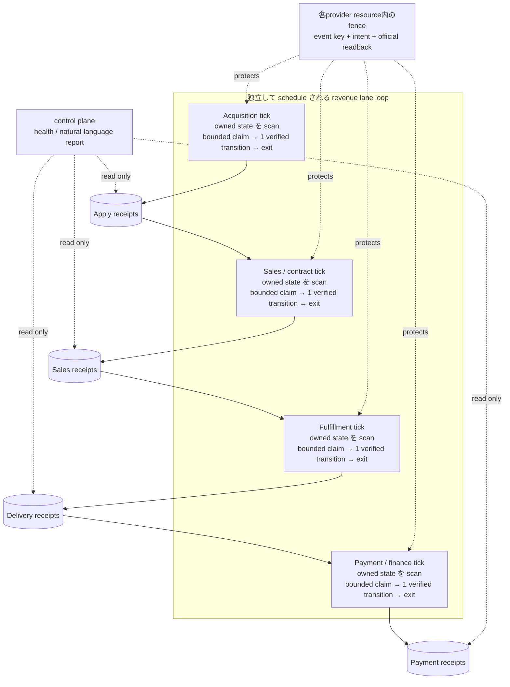
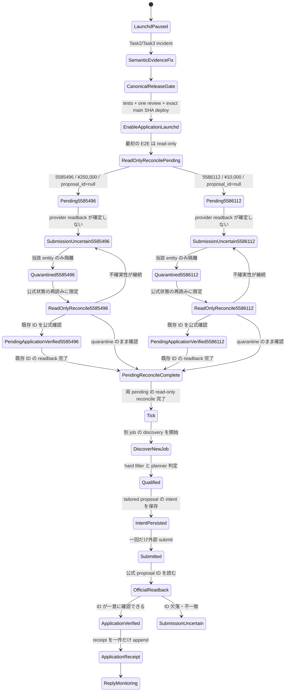
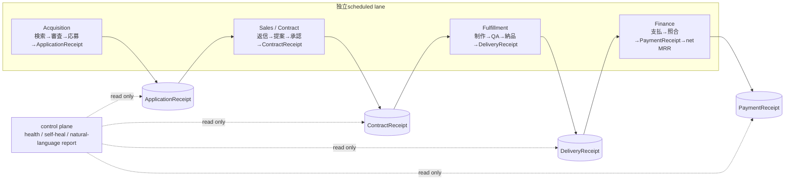
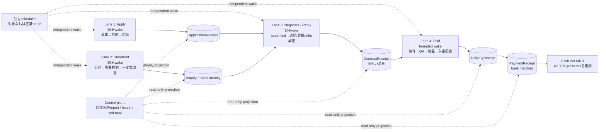
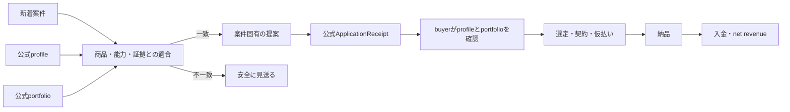
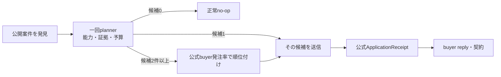

# Lancers 月額 SNS 運用で first net MRR 10,000 USD、target 20,000 USD を目指す設計仕様

**作成日:** 2026-08-13
**正本:** Rockstar_ibot (`Daisuke134/life-manager`)
**対象:** Lancers の acquisition、月額契約、納品、着金を一つの収益ループとして扱う
**状態:** Applyは公式ApplicationReceipt 30件、Storefrontはcanonical 1件、production browserはsole ownerへ収束。契約候補0、Paid未完成のためnet MRRは未発生

canonical repository は Rockstar_ibot とし、Lancers の credential、browser session、
runtime state、receipt、ledger は外部に残す。この仕様は runtime state を移動・複製・変更しない。

この文書をLancers money loopの**設計・acceptance gate・完了証拠・現在地・残TODOの唯一の正本**とする。
各TODOは一件ずつ実行し、完了証拠をこの文書へ反映してcommit/pushしてから次へ進む。実行時の件数・
金額・receiptの事実は外部runtime stateとappend-only ledgerを権威とし、この文書へ推測値を転記しない。

実行の基本形は、各 entity の business state を一本の直線として保持し、実行だけを
4 つの revenue lane に並列化する構成である。entity ごとの常駐 loop/process/cron や、
buyer・payment を何日も待つ一つの常駐プロセスは作らない。後段 lane の実装は slice ごとに
追加するが、この architecture contract は Slice 1 から固定する。

## 1. 目的と成功の定義

目的は、Lancers 上の単発応募数ではなく、実際に継続している顧客契約から最初に
**net MRR 10,000 USD** を得て、次に **net MRR 20,000 USD** へ拡大することにある。
社内の安全目標は **25,000 USD** とする。
これは予測値や売上保証ではなく、公式 readback と受領証憑から再計算できる
受入条件である。

### 1.1 MRR の定義

計上対象は、Lancers 公式画面または公式通知で **active の月額 recurring contract**
と確認できる契約だけである。月額契約の公式フローは次の順序とする。

```text
相談・交渉 → client offer → client approval → active monthly contract
```

現在の MRR は一つの対象期間 `mrr_period`（契約の service period、形式 `YYYY-MM`）について
だけ計算する。receipt の取得日、銀行入金日、集計実行日ではなく、契約が提供する service
period に帰属させ、過去月の累積を現在の MRR に足さない。対象集合は、その `mrr_period` に
属する active recurring contract の `PaymentReceipt` だけである。

各 receipt の最低限の一意帰属キーは次である。

```text
payment_receipt_key = (contract_external_id, mrr_period, provider_receipt_id)
```

同じ `provider_receipt_id`、同じ contract、同じ `mrr_period` を二度 ledger に計上しない。
receipt は一つの `payout_batch_id` に一度だけ属し、一つの bank transaction に重複帰属させない。

対象 `mrr_period` の全 receipt を合算した net MRR は、次の式で計算する。

```text
net_mrr_usd(mrr_period) = recorded_fx(mrr_period,
  sum(gross_monthly_receipts_jpy for active recurring receipts in mrr_period)
  - sum(platform_fee_jpy for active recurring receipts in mrr_period)
  - sum(ai_cost_jpy for active recurring receipts in mrr_period)
  - sum(subcontractor_cost_jpy for active recurring receipts in mrr_period)
  - sum(refunds_jpy for active recurring receipts in mrr_period)
)
```

- `gross_monthly_receipts_jpy` は、Lancers が `confirmed/received` とした、手数料控除前の月額対価である。
- `platform_fee_jpy` は、Lancers の provider 明細にある手数料の実額である。
- `bank_settlement_jpy` は同じ provider payout batch に帰属する実際の銀行入金額であり、net の式に追加控除として入れない。
- `refunds_jpy` は同じ契約に帰属する provider-confirmed refund の実額である。AI 原価と外注原価もそれぞれ別項目として契約または支払に紐づける。
- `signed_provider_adjustment_jpy` は provider settlement 明細に記載された符号付き調整額だけであり、net の原価や fee に自動分類しない。
- provider の payout 対象額は別式で照合する。

```text
provider_payout_target_jpy(payout_batch_id) =
  sum(gross_monthly_receipts_jpy for receipts in payout_batch_id)
  - sum(platform_fee_jpy for receipts in payout_batch_id)
  - sum(refunds_jpy for receipts in payout_batch_id)
  + signed_provider_adjustment_jpy(payout_batch_id)

bank_reconciliation_delta_jpy(payout_batch_id) =
  bank_settlement_jpy(unique bank_transaction_id for payout_batch_id)
  - provider_payout_target_jpy(payout_batch_id)
```

`provider_payout_target_jpy` は provider の settlement 明細から再計算し、
各 `payout_batch_id` の対象 receipt、gross、fee、refund、符号付き adjustment は一度だけ合計する。
一つの batch に対応する `bank_transaction_id` は一件だけ、一つの bank transaction は一つの batch
だけにする。同じ receipt、bank transaction、batch の複数帰属を禁止する。
`bank_reconciliation_delta_jpy` は必ず `0` のときだけ `matched` とし、non-zero または対象 receipt、
bank transaction、provider 明細の欠落は `unknown` / `unmatched` とする。根拠付き adjustment が
あっても non-zero delta を `matched` としてはならず、G6/G7 を閉じない。手数料は net の式と
payout target の各一回だけに現れ、bank settlement を再度 fee として控除しない。
provider payout target、fee 明細、銀行入金のいずれかが未取得なら reconciliation は `unknown` とし、
MRR gate を開けない。

- `PaymentReceipt` が `received` であることを必須とし、対象 `mrr_period` 外の receipt、未受領の請求、提案額、見積額、予測、未受領の offer、単発売上は MRR に含めない。
- 為替は集計時に都合よく選ばず、取得時刻とレートを記録した `recorded_fx` を使う。
- 単発売上は別の `one_off_revenue` として表示し、gross MRR と net MRR に混ぜない。
- `$20,000` の受入判定と `$25,000` の安全目標は、同じ式・同じ証憑で検証する。

対象 `mrr_period` の公式 source readback 完了を示す `source_completeness_receipt`（または
明確に同等の source completeness evidence）があり、かつその source に対応する ledger 集合が
空または合計 `0` のときだけ、該当値を verified zero と表示する。PaymentReceipt の rows が
単に 0 件であること、source failure、未取得、missing timestamp だけでは zero と断定せず、
`unknown` / `unverified` とする。この source completeness schema/evidence は後段 finance slice
で追加する必須要件であり、Slice 1 では扱わない。

### 1.2 収益の流れ

```mermaid
flowchart LR
  A[公開案件を発見] --> B[適格性・利益性を判定]
  B --> C[意図を保存して応募]
  C --> D[公式 proposal ID readback]
  D --> E[ApplicationReceipt]
  E --> F[返信・交渉]
  F --> G[client offer]
  G --> H[承認]
  H --> I[active monthly contract]
  I --> J[月次制作・納品]
  J --> K[公式納品 readback]
  K --> L[PaymentReceipt received]
  L --> M[gross monthly receipts]
  L --> Q[provider payout target + fee statement]
  Q --> R[bank settlement readback]
  R --> S[bank reconciliation matched]
  S --> M
  M --> N[fee / AI / subcontract / refund を実額控除]
  N --> O[記録済み FX で USD 換算]
  O --> P[net MRR USD]
```



応募や storefront の件数は `P` の代替ではない。`PaymentReceipt` まで到達しない
枝は収益として閉じない。

## 2. 初期の検証済みベースライン（履歴）

以下は初期sliceで観測した履歴である。現行stateと唯一のactive TODOは§18を正本とする。

| 観測 | 事実 | 計上・運用上の意味 |
|---|---|---|
| 応募 | `application_verified` が現在14件 | 直前baseline 11件から、readback-only reconcileで公式proposal ID `27803189`、`27808073`、`27808988`の3件が一意に増えた |
| 作業・納品・支払 | `WorkEvent`、`DeliveryReceipt`、`PaymentReceipt` は記録なし。記録された baseline ledger revenue は **¥0** だが PaymentReceipt source completeness は未確認 | source completeness がない記録なしは MRR の 0 を証明せず、active recurring contract の受入証拠もない |
| 現在の pending | 0件 | project `5585496 → 27803189`、`5586112 → 27808073`、`5585503 → 27808988`を公式readbackし、3件ともreceipt化してpendingから削除した。submitは0件 |
| application launchd incident | Task2 source が Task3 safety gate より先に schedule され、launchd が自動実行された。その review 前の実行で、二つ目の null-ID pending project `5586112`（¥10,000）が作成された | verified incidentとして記録する。Task 6C receipt acceptanceまでjobを停止し、acceptance後にcanonical normal releaseで再開した |
| storefront | 公式画面は受付中6、受付休止中0、非表示0、下書き0。canonical receipt IDは`1338233`の1件 | 6件は同一content groupだが、出品上限違反や非公開必須とは確認できていない。販売・未処理件数ではない |
| storefront observability | 4 状態を合算し、合計を `unprocessed` として表示 | `partial 6/6 official_timestamp_missing` という誤解を生む |
| storefront 最新実行 | `listing_readback_mismatch` を観測 | 不一致に成功アイコンを付けてはならない |
| work-sync | プロセスは alive だが productive progress がない | alive と成果を同じ health signal にしない |
| ソース配置 | 現行の deployed source は canonical repo 外。worktree/feature branch を稼働 SSOT にしてはならない | canonical repo に source/schema/test/launchd template/spec/plan を揃え、検証済み main commit の release artifact だけを deploy する。runtime state は移動・削除しない |

過去 baseline の`application_verified=11`と、今回一意に追加された3 receiptを分けて保持する。
current reportはledger再測定値14件を使い、`observed`、`qualified`、`submitted`、`verified`を別状態で報告する。

## 3. 顧客・商品・価格

### 3.1 ICP

対象は、**日本語の商用組織案件として、継続SNS運用を外部ownerへ明示的に委任するbuyer**である。
`qualified` はkeyword一致ではなく、Lancers公式detailの`依頼主の業種`が空でなく、公開`依頼概要`に
SNS/channel、継続scope、外部委任の三つが明示される状態とする。`依頼主の業種`はbuyerが事業用途の
公式分類を選んだ証拠であり、buyer自身の顧客がB2Bだと推測する証拠には使わない。個人趣味、単発投稿、
継続不明、外部owner不明はG1のqualifiedにしない。clarificationでunknownをqualifiedへ昇格させず、
最初の応募前に公開detailから証拠を揃える。

### 3.2 商品境界

販売するのは、顧客のパスワードを預からない月次 SNS コンテンツ運用パックである。
含むものは、月次企画、投稿文の draft、画像の方向性、投稿カレンダー、月次改善レポート。

含まないものは、顧客アカウントへのログイン、直接投稿、広告運用、広告費の預かり・
支払い、電話営業、訪問作業である。AI を使うこと自体を価値主張にせず、顧客の課題に
結び付いた成果物を提示する。

### 3.3 パッケージ

| パッケージ | 価格 | 固定スコープ | revision の上限 |
|---|---:|---|---:|
| Founding（最初の 3 社、3 か月） | ¥98,000/月 | 1 channel、8 drafts/月、企画・画像方向性・カレンダー・改善レポート | 1 consolidated round |
| Standard | ¥198,000/月 | 1 channel、12 drafts/月、競合観察、企画・画像方向性・カレンダー・改善レポート | 1 consolidated round |
| Premium | ¥398,000/月 | 2 channels、24 drafts/月、企画・画像方向性・カレンダー・改善レポート | 2 consolidated rounds、優先 revision |

`draft` は投稿文の draft 1 件、対応する画像方向性 1 件、カレンダー上の配置 1 件を
一単位とする。revision は顧客からまとめて受け取る修正依頼を一回処理する単位であり、
上限を超える修正、追加 channel、追加 drafts、投稿代行は現契約に含めない。必要なら
別スコープとして再見積もりし、承認されるまで作業を開始しない。Premium の priority は
修正回数無制限を意味せず、許容された二回を capacity の範囲内で先に処理する意味である。

capacity は、契約が要求する base drafts と revision 最大数を合わせた draft-equivalent
で記録する。Founding は 16、Standard は 24、Premium は 72 units を一契約の上限消費と
する。capacity 使用率は、active contract が予約した units を現行 cap で割って求める。初期 intake cap は Founding 3 社分の 48 units/月とし、3 社を超える契約は、実際の
支払・納品時間・原価を測定して cap を更新するまで受けない。cap を自動で増やしたり、
スコープ外作業を capacity に隠したりしない。

### 3.4 目標構成（例示であり収益の真実ではない）

```text
3 Founding + 10 Standard + 7 Premium
= 3×¥98,000 + 10×¥198,000 + 7×¥398,000
= ¥5,060,000 gross MRR
```

この組合せは計画を考えるための例示にすぎず、受入判定は実際の `PaymentReceipt`、
実費、記録済み FX から計算する。見込み契約数や proposal 金額で置き換えない。

初期のacquisition配分は、公式ApplicationReceiptを14件持つ応募surfaceを70%、公開だけでinquiry実績が
未確認のStorefront surfaceを30%とする。両者は同じ商品、価格、Sales / Contract、Fulfillment、Financeを
共有し、入口だけが異なる。上のgross MRR例を入口別に割る計画モデルは次である。

| acquisition surface | 契約構成の計画例 | gross MRR例 | net MRR $20k目標への初期寄与 |
|---|---:|---:|---:|
| 応募 | 2 Founding + 7 Standard + 5 Premium | ¥3,572,000/月 | 70% = $14,000/月 |
| Storefront | 1 Founding + 3 Standard + 2 Premium | ¥1,488,000/月 | 30% = $6,000/月 |
| 合計 | 3 Founding + 10 Standard + 7 Premium | ¥5,060,000/月 | 100% = $20,000/月 |

gross JPYとnet USDを固定為替で同一視しない。右端は獲得責任の配分であり、各surfaceの実netは、入口を
`contract_external_id`へ帰属させたPaymentReceipt、fee、AI cost、subcontract cost、refund、recorded FXが
揃った時だけ確定する。最初の3 Founding契約までは48 units/月のcapacity capを守り、納品時間と実原価を
測る前に20契約へ拡大しない。Storefrontが実測で高い成約率・retention・net marginを示した場合だけ、
この70/30配分を50/50またはStorefront優先へ更新する。

## 4. ループ構造と既存契約の再利用

acquisition は補助機能ではなく、最初に動かす **first-class primary loop** である。
ただし acquisition の完了は応募 receipt までであり、契約・納品・支払を省略して収益とは呼ばない。

### 4.1 四つの lane を並列に実行する architecture

business state は entity ごとに直線で進むが、実行は lane ごとの scheduled loop に分ける。
各 lane は自分の state、receipt、provider resource identityを所有する。一つのshared business queueや
account-wide browser mutexを四laneの必須境界にしない。handoffはimmutable receipt identityで行い、reportは
各laneのreceiptをread-only projectionする。



read/planだけでなく、別provider resourceを所有するlaneの通常actionも独立して進めてよい。同一project、thread、listing、
contractへの重複effectだけをexact provider ID、event key、intent、lease、freshness、official readbackで防ぐ。browser restartや
認証更新のようにsession全体を実際に変更する操作だけは短いshared guardを許可する。providerの明示制限、429、session破損、
実測lock contentionがない限りaccount-wide serializationを追加しない。公式readbackが返らない遷移はverified transitionではない。

#### state ownership と handoff

| lane | 所有する state / transition | 次 lane へ渡す公式証拠 |
|---|---|---|
| acquisition | `observed → qualified → submitted → application_verified` | 一意の `ApplicationReceipt` と公式 proposal ID readback |
| negotiation / contract（sales） | `application_verified` または `buyer_replied → contract_active / lost` | buyer reply、offer、approval、active monthly contract の公式 readback |
| fulfillment | `contract_active → delivery_verified` | 納品の公式 readback 後だけ `DeliveryReceipt` |
| payment / finance | `delivery_verified → payment_received → bank_reconciled → net_mrr` | `PaymentReceipt received`、provider settlement、bank readback、cost ledger |

handoff は状態名だけで成立させず、各 lane の公式 receipt/readback を伴わせる。どの lane も
official receipt を飛ばして次の state、金額、MRR を作らない。

#### scheduling、idempotency、backpressure

- 四つの lane はそれぞれ独立した scheduled tick とし、各 tick は自laneのstate/receiptだけをbounded batchでclaimする。
- claim には lease と fencing を付け、各 entity は一 tick につき高々一つの verified transition だけを実行し、readback・receipt・ledger を永続化してから process が終了する。bounded batch は一つの lane の遅延や失敗が全体の queue を占有しないための上限である。
- buyer の返信、deadline、payment、次の review を待つときは `waiting_for` と `next_tick_at` を durable state に保存する。sleep、常駐待機、数日間続く straight-shot process は使わず、future tick が再開する。
- intent の一意 event key と at-most-once action envelope、authoritative readback、receipt の一意 key で再実行を冪等にする。不確実な effect は blind resend せず、read-only reconcile に戻す。
- 一つの entity の失敗はその entity だけを quarantine する。一つの lane の tick が失敗しても他 lane は bulkhead の内側で継続し、acquisition が capacity backpressure で pause しても sales・fulfillment・finance は停止しない。
- capacity は acquisition の claim/admit 上限として扱い、active contract が予約した draft-equivalent を超える応募を受け付けない。resource-local fenceの待ち時間は観測対象にし、未測定のworker poolやaccount-wide limiterは追加しない。

#### control plane と storefront の境界

supervisor/health と natural-language report は**control plane**であり、五つ目の revenue lane
ではない。lane の進捗、stalled entity、incident、次の automatic action、active contract、
delivery、payment、net MRR を観測して報告するだけで、健康に見せるために receipt を製造したり
business state を変更したりしない。storefront は acquisition の表示・入口であり、revenue lane、
contract、payment、MRR の代替ではない。

### 4.2 lane ごとの責務

| lane | 責務 | 収益への閉じ方 |
|---|---|---|
| acquisition | 公開案件の発見、適格化、応募、proposal ID readback、`ApplicationReceipt` | 応募は契約・収益ではない |
| negotiation / contract | 返信分類、質問、月額 offer、scope・金額確認、active 化 | Lancers の公式 monthly contract 状態を確認 |
| fulfillment | ブランド文脈、月次制作、QA、納品、readback | `DeliveryReceipt` は公式納品 readback 後だけ |
| payment / finance | PaymentReceipt、手数料・原価・返金、銀行 settlement、ledger | received の実額だけを net MRR に反映 |

storefront は acquisition の表示面であり、独立した revenue lane ではない。listing の
数、published 状態、proposal 数を MRR と合算しない。

### 4.3 外部作用の共通契約

応募、offer、納品、支払記録などすべての外部作用は、次の順序で閉じる。

```text
intent → external effect → official provider readback → receipt → ledger
```

readback が不一致・欠落・null のときは成功として記録せず、既知の provider 状態を
再読して不確実状態を解消する。単一の状態を複数 receipt に変換しない。

### 4.4 既存 acquisition の扱い

application launchd が safe deployment 後に enable された正常稼働時、既存の acquisition は 30 分ごとに最大 20 件を discover し、planner が eligible / ineligible
を分類し、proposal・price・due date を生成して submit し、公式 proposal ID を readback して
receipt を記録する。この流れは再利用する。新しい crawler、vector DB、別の ranking 基盤、
新しい共通 kernel は作らない。

不足しているのは、利益性を含む選別と HOL isolation である。これを first slice の境界内で
最小限補う。

### 4.5 Coconala topology の再利用境界

Coconala で proven な general topology/contracts、すなわち lane loop、shared queue/ledger、
single browser lock、at-most-once action envelope、authoritative readback を再利用する。
巨大な `gig_pass.sh` や Coconala site 固有の DOM/business rule はコピーしない。Lancers adapter
だけが Lancers 固有の discovery、DOM、submit、readback を所有する。Coconala の ongoing refactor
が完了することは G1 の前提にせず、既存の proven contract をこの slice に必要な範囲で固定する。

### 4.6 canonical SSOT と安全な deployment

canonical repository は Rockstar_ibot の main だけである。source、schema、test、launchd template、
spec、plan はすべて canonical repo に置き、secret、browser session、runtime state、append-only
ledger、evidence は外部に残して不可侵とする。worktree は一時的な開発隔離であり、launchd/cron/service
が worktree や feature branch を実行してはならない。`~/.local` などの untracked mutable source を
唯一の runtime SSOT にもしない。

安全な順序は、(1) tests と許可された一回の fresh adversarial review を通す、(2) canonical main に
merge/push する、(3) exact main commit SHA から release artifact を install し manifest と deployed
SHA を記録する、(4) その後にだけ application service を enable する、である。repo 外で hotfix を
行った場合も、service enable 前に byte-for-byte で canonical repo に反映する。merge/deploy の検証後
は temporary worktree を削除するが、runtime state はこの source migration のために移動・削除しない。
application launchd は verified incident の blocker、canonicalization、safe deployment、provider-only検証、
最初の正常wakeを順に閉じた後だけ検証済みreleaseでenabledにする。現在はTask 6Cの本番acceptance待ちで
disabled / unloadedであり、receipt検証後に30分tickを再開する。qualified案件がないtickは外部送信せず
`no_eligible_project`で終了する。

### 4.7 ideal canonical folder tree

以下を最終的な最小treeとする。`[planned]`以外は現在存在する。laneごとのDB、queue、service package、
project別folderは追加せず、4 laneは同じLancers adapter、marketplace-core、ledgerを再利用する。

```text
rockstar_ibot/
├── apps/lancers-revenue/
│   ├── launchd/
│   │   ├── ai.anicca.lancers-revenue-application.plist
│   │   ├── ai.anicca.lancers-revenue-sales.plist             [planned G4]
│   │   ├── ai.anicca.lancers-revenue-fulfillment.plist       [planned G5]
│   │   └── ai.anicca.lancers-revenue-finance.plist           [planned G6]
│   ├── scripts/
│   │   └── install-local.sh
│   └── tests/
│       ├── test_application_loop_hol.py
│       └── test_install_local.py
├── skills/earn/lancers/scripts/
│   ├── lancers_adapter.py
│   ├── status.py
│   ├── application_loop.py
│   ├── application_tick.py
│   ├── sales_loop.py                                         [planned G4]
│   ├── fulfillment_loop.py                                   [planned G5]
│   └── finance_loop.py                                       [planned G6]
├── skills/_shared/marketplace-core/
│   ├── schemas/
│   │   ├── opportunity.schema.json
│   │   └── event.schema.json
│   └── scripts/
│       ├── application_transaction.py
│       ├── contracts.py
│       └── ledger.py
├── skills/gig-work/schemas/
│   └── application_decisions.schema.json
├── runtime/agent-runner/
│   ├── agent_runner.py
│   ├── token_budget.py
│   └── config.json
└── docs/superpowers/
    ├── specs/2026-08-13-lancers-20k-net-mrr-design.md
    └── plans/2026-08-13-lancers-first-verified-application.md
```

後続laneのtestは、実装時に既存`apps/lancers-revenue/tests/`へ各lane一つの最小E2E regressionとして
追加する。先に空file、抽象base class、共通orchestratorを作らない。

## 5. Acquisition の設計判断

### 5.1 検索面と hard filter

公開検索は provider の新着順を再利用する。G1のdefault queryは **`SNS運用` 一つ**に固定する。
無queryの全カテゴリ新着20件ではSNS案件が他カテゴリに押し出され、二回のofficial wakeがともに
20件全件ineligibleになった。一方、read-only比較では`SNS運用`が13 normalized案件、うち予算上限
¥98,000以上6件を返したため、最初の`ApplicationReceipt`へ進む最小修正として採用する。

次のquery群はG3のcoverage候補であり、G1でmulti-query aggregator、dedupe、global rankingを作らない。
最初のreceiptと実測funnel後、一tick一queryのdeterministic rotationが必要かを判断する。

```text
SNS投稿、コンテンツ制作、X運用、LinkedIn、B2Bマーケティング、
AI活用、継続依頼、長期、月額
```

coverage比較の一次結果は、無query 20件（¥98,000以上6件だがSNS中心ではない）、`SNS運用`
13件/6件、`SNS投稿`17件/1件、`コンテンツ制作`4件/1件、`LinkedIn`2件/1件、`月額`8件/4件である。
ここで分母はnormalized件数、後者は予算上限¥98,000以上の件数であり、qualified件数や収益ではない。
G1 default query接続はTDDで実装済みである。REDはdefault discoveryが`None`を受けることを再現し、
GREENはdefaultで`SNS運用`、明示overrideで指定queryをそのまま渡すことを確認する。production差分は
`application_loop.py`の定数と既存call boundaryだけで、status、adapter、state、ledger、schema、submitは
変更しない。統合後のmechanical verificationはapplication 10 tests、installer 2 tests、agent-runner
15 testsがPASSする。canonical main `9e26a71759b8918a1269a31f48b4a3f9bad6671f`をimmutable normal
releaseへdeployし、13 filesのmanifest hash一致後にofficial wakeを一回行う。結果はrun 1、exit 0、
stderr 0、`observed_count=13`、`eligible_count=0`、`submitted=false`、`no_eligible_project`であり、
default queryが本番で効いたことと、外部作用がゼロだったことを示す。

同じ13件をprovider-onlyで再分類したreason集計は`sns_staff_evidence_unknown=13`、
`small_b2b_evidence_unknown=6`、`budget_below_98000=6`である。検索カードのdescriptionは188–200文字で、
公開detail全文3件も確認したが、既存の`専任不在 / 少人数 / リソース不足` proxyは0件だった。
したがって次のbottleneckはquery配線やparserではなく、marketplace本文でほぼ観測できない
「SNS担当0–1人」を全応募の必須条件にしたICP contractである。承認後のread-only detail probeでは、
予算¥98,000以上6件の全件に公式`依頼主の業種`があり、全件にSNS＋継続scope、4件に外部委任、
2件に240文字以内で三信号を含む完全一致引用がある。したがって、次のproduction mutationは予算通過
カードだけのdetail enrichmentと、`commercial_buyer_evidence`＋`ongoing_sns_outsourcing_evidence`の
truthful contractへの置換である。資格decisionはstate/receiptへ永続化されないためmigrationは不要だが、
schema、prompt、runtimeは一つのexact-SHA releaseとして原子的にdeployする。

Task 6BのTDD実装は完了する。検索結果13件のうち予算通過カードだけを対象に公式detailを取得し、
6件をenrichする。detail取得/必須欄不一致は6件で、各rowのteaserを維持してfail-closedし、他rowを
止めない。qualificationは`commercial_buyer_evidence`と`ongoing_sns_outsourcing_evidence`へ原子的に
置換し、旧staff fieldはschema/runtimeで拒否する。実provider-onlyの同一snapshotではCodex/Lunaが
13 decisions中1件をeligibleとし、元schemaとruntime validationはerror 0、完全一致semantic evidence、
observed budget、¥98,000 minimum、fee 20% allowance、70% marginはすべて通る。実引用内の改行を跨ぐ
`運用`と`依頼`は40文字以内・双方向だけを認め、bareな`依頼`は拒否する。

mechanical verificationはLancers 15 tests、installer 2 tests、agent-runner 15 tests、py_compile、
schema JSON parse、diff checkがPASSし、application stateとledger hashは不変である。次の外部作用は、
このschema/prompt/runtimeを同一canonical main SHAとしてdeployしたofficial wake一回だけである。

canonical main `8487560899dfbf17b129e815b25148feea633293`をnormal immutable releaseとして
原子的にdeployし、13 filesのmanifest hash一致後にofficial wakeを一回行う。run 1、exit 0、stderr 0、
`observed=13`、`eligible=0`、`submitted=false`、`no_eligible_project`で終了し、このwake時点の二つのpending、
application/terminal/ledger hash、`application_verified=11`は不変である。保存済み同一snapshotで
runtime-validだったeligible候補は既存claim/pendingではないため、差は重複filterではなくfresh planner
decisionである。この時点ではAcquisitionを同releaseでenabledに維持し、次のbounded tickを実行した。

次のofficial wakeは`observed=13`、`eligible=1`でproject `5585503`（¥98,000）をsubmit境界へ進め、
stateへ一意claim/pendingを一件追加するが、公式ID readbackを閉じられず`submission_uncertain`になる。
normal schedulerは直ちにdisabled/unloadedへ戻し、3 pendingをreconcile-onlyで再読する。公式DOMのread-only
診断では`/mypage/proposals`にproject link、own `提案をみる` link、proposal ID `27808988`、対応card IDが
すべて存在する。root causeはreaderがURL username `keiodaisuke`と可変display name
`SNS・AI業務設計室`を同値と要求したことである。identityはproject ID、own proposal URL、official proposal
ID、card IDの一致で閉じ、可変display nameをidentity条件にしない。これをTDD修正し、readback-onlyで
amount/dueを含むtermsを再検証するまでnormal schedulerを再開しない。

projected net gross margin は proposal 時点の JPY 見積で次の式に固定する。

```text
projected_net_gross_margin = (
  proposal_price_jpy
  - expected_platform_fee_jpy
  - expected_ai_cost_jpy
  - expected_subcontractor_cost_jpy
  - expected_revision_refund_allowance_jpy
) / proposal_price_jpy
```

各 `expected_*` は算定 source と version を記録し、`projected_net_gross_margin < 70%` は
不適格とする。実績の fee、AI、外注、refund は別の finance ledger で照合し、projected 値で
net MRR を計上しない。

次をすべて満たさない案件は応募しない。

- 日本語の商用組織案件で、公式`依頼主の業種`があり、SNS/channel・継続scope・外部owner委任が公開`依頼概要`に明示される。
- remote で完結する。
- 顧客パスワードを要求しない。
- 直接投稿、広告費の取り扱い、電話営業、訪問を要求しない。
- AI 利用が許容されている。
- scope と deadline が現実的である。
- projected net gross margin が 70% 以上である。
- 継続契約への転換可能性がある。
- 現在の capacity 内で納品できる。

### 5.2 planner の ranking

planner 一つの決定で次の順に評価する。ML ranking system は導入しない。

1. 継続・月額の明示度
2. 継続SNS運用を外部ownerへ委任することが明示されているか
3. 公式業種欄を持つ商用組織案件か
4. Founding 以上の予算に見合うか
5. 商品の固定 deliverable に合うか
6. 要件が具体的か
7. 競争、revision、deadline のリスクが低いか

### 5.3 応募上限と重複防止

- 最初の 3 active recurring contracts に到達するまでは、capacity に応じて次を守る。
- capacity 使用率が 70% 未満なら、一 tick 最大 2 応募、Japan day あたり最大 10 応募。
- 70% 以上 90% 未満なら、一 tick 最大 1 応募、Japan day あたり最大 5 応募。
- 90% 以上なら Premium 候補だけを一 tick 最大 1 件受け付け、増分後の使用率が 100% 以下になる場合に限る。それ以外は pause する。
- 同一会社または同一 job に重複応募しない。
- `submission_uncertain` は当該 job だけを quarantine し、別 job の discovery・応募を止めない。

### 5.4 Proposal の固定構造

proposal は次の五要素を持つ。一般的な「AI で効率化できます」だけの文章は不採用とする。

1. buyer が明示した具体的な問題
2. 最初の 30 日で納品するもの
3. channel 数、draft 数、revision cap
4. 価格と due date
5. 継続 scope と、必要な clarification **一問だけ**

この clarification は、既に揃っている qualified 証拠の不足を埋めるためには使わない。
pure unknown を G1 の qualified に変える質問は送らない。

## 6. 応募後から契約までの状態

`application_verified` は proposal ID の公式 readback 後にだけ付与する。

| 状態 | 次の自動動作 |
|---|---|
| `application_verified` | reply monitoring に移る |
| `buyer_replied` | 5 分以内に内容を classify する |
| `clarification_required` | 質問は一問だけ送る |
| `commercial_intent` | Applyならproposal選定/仮払いを待ち、Storefront相談なら見積回答を送り、月額化ならclientへ公式月額offerを依頼する |
| `client_offer_received` | client-originated offerのscope、money、仮払いを公式画面で確認し、条件が合う時だけ承諾する |
| `contract_active` | fulfillment lane を開始する |
| `lost` | 理由を記録する |
| `submission_uncertain` | 当該 job を quarantine し、公式再読みに限定する |

`submission_uncertain` から成功状態へ推測で進めない。再送は provider readback が未実施
だからという理由だけで行わず、既存の intent・provider 状態・receipt の一意性を検証して
から判断する。

### 6.1 first slice の状態フロー



この flow は per-project process の図ではなく、shared ledger 上の durable state と future tick の
関係を示す。first slice の証明は、`5585496` と `5586112` の両方が二重 submit されず、両方が
readback-only quarantine に留まり、どちらも別の新規 qualified job の discovery・一回の検証済み
応募を block しないことを示すことである。application launchd が disabled の間は auto-discover や
blind resubmit を行わず、semantic evidence/schema の修正と read-only reconcile を先に行う。

## 7. Fulfillment と finance

### 7.1 Fulfillment

active contract ごとに durable な brand context を保持し、月次で次を生成する。

- 月次企画
- パッケージで定めた投稿 draft
- 各 draft の画像方向性
- 投稿カレンダー
- 月次改善レポート

納品前に factuality、禁止内容、重複、brand fit を QA する。revision cap を超えたら
作業を増やさず、契約外 scope として再見積もりに戻す。`DeliveryReceipt` は納品物を作った
時点ではなく、公式 provider readback が完了した時点でだけ append する。control tick が
再実行されても、active work を最初からやり直さず、既存 intent・receipt・state を読み取る。

### 7.2 Finance

`PaymentReceipt` が `received` であることを必須とし、次を分離して記帳する。

- gross receipts
- Lancers fee
- AI cost
- subcontractor cost
- refund
- one-off revenue
- active recurring MRR
- net MRR

各 receipt は `contract_external_id`、契約 service period の `mrr_period`、`provider_receipt_id`
へ一意に帰属させ、対象 `mrr_period` 外の receipt や過去月累積を現在 MRR に入れない。各
`payout_batch_id` の対象 receipt、gross、fee、refund、符号付き provider adjustment を一度だけ
合計し、unique `bank_transaction_id` 一件と照合する。同じ receipt、batch、bank transaction を
複数帰属させない。`bank_reconciliation_delta_jpy=0` だけを `matched` とし、non-zero または
missing は `unknown` / `unmatched` のまま G6/G7 を閉じない。
支払が pending、推定、画面表示だけで受領証拠がない場合は net MRR に入れない。

## 8. 真実性・安全不変条件

1. **外部作用の重複ゼロ:** intent の一意キー、provider readback、receipt の一意キーを使い、再実行で二重応募・二重納品・二重請求をしない。
2. **不確実状態の隔離:** null ID や readback mismatch は対象 job だけを quarantine し、blind resubmit と HOL block を禁止する。
3. **金額の過大計上ゼロ:** `PaymentReceipt received` 以外を net MRR に入れず、fee・原価・refund と FX を別記録する。
4. **secret 漏洩ゼロ:** 顧客 password、Lancers credential、browser session、認証コードを repo、proposal、通常 report、ledger の公開欄へ書かない。
5. **不一致を成功にしない:** provider の ID、状態、timestamp、金額が一致しないときは success icon、receipt、収益記帳を発行しない。
6. **商品境界を越えない:** 顧客 password、直接投稿、広告運用、広告費、電話営業、訪問作業は受けない。
7. **証拠と推論を分ける:** observed、qualified、submitted、verified、active、received を一つの件数に潰さない。

## 9. Observability と owner report

### 9.1 表示規則

- storefront は `published`、`paused`、`hidden`、`draft` を別々に表示する。四状態の合計を `unprocessed` と呼ばない。
- `listing_readback_mismatch` に成功アイコンを付けない。
- 応募は `observed`、`qualified`、`submitted`、`verified` を別々に表示する。
- 対象 `mrr_period` の `source_completeness_receipt`（または明確に同等の source completeness evidence）があり、公式 source readback 完了後の対応 ledger 集合が空または合計 `0` のときだけ verified zero を表示する。rows が 0 件だけ、source failure、missing timestamp は `unknown` / `unverified` とする。
- selector、内部 timestamp code、内部 lock code は通常の owner report に出さない。
- state change、incident、recovery は直ちに報告し、正常な executive summary は一日一回にまとめる。
- report には active recurring contracts、gross MRR、net MRR、delivery status、実際の costs、次の automatic action を含める。

### 9.2 現状を正しく表す report 例

```text
Lancers daily summary
- acquisition: ON、30分tick、最大1応募/tick
- last local observation: observed 13 / qualified 0 / submitted 0 / newly verified 0
- application receipts: 14 / pending: 0 / blocker: なし
- storefront official counts: 受付中6 / 受付休止中0 / 非表示0 / 下書き0
- storefront integrity: canonical receipt 1338233は1件、同一content group 6件、latest readback mismatch
- official source timestamp: 未確認（local observation timeと混同しない）
- WorkEvent / DeliveryReceipt / PaymentReceipt / gross MRR / net MRR / bank settlement: source completeness未確認のためunknown
- AI processing cost: provider usage receipt未接続のためunknown
- next automatic action: acquisitionは次の30分tick、reporterは次の5分tick。同一semantic状態は同日再送しない
```

このreportは「14件応募したので売上見込みがある」「listing 6件なので未処理」と言わない。
未検証値は`unknown` / `unverified`または状態名で表し、推測値を補わない。公式source timestampと
local observation timeを別fieldにし、内部code `official_timestamp_missing`をownerへそのまま出さない。

### 9.3 G2 active slice

現行Telegram reporterはcanonical repo外のmutable sourceを5分ごとに実行し、4 laneを毎回enqueueする。
storefront readerは四状態を正しく読んだ後に合計6を`target_count`と`unprocessed_count`の両方へ入れ、
`partial / 未処理6件 / official_timestamp_missing`として送る。acquisition observerも実応募loopとは異なる
無query・最大100件の公開検索を行い、planner未通過32件を`observed_unprocessed_count=32`とするため、
実loopの`SNS運用`13件、qualified 0、submitted 0と一致しない。直近実行は一部messageを送った後に
`telegram_report_failed`を反復し、outboxはdelivered 1075、delivery_uncertain 34である。

誤報停止を優先し、`ai.anicca.lancers-revenue-telegram-report`だけをdisabled / unloadedにした。
application launchdはenabledのまま維持する。G2は新しい収益lane、DB、crawlerを作らず、既存ledger、
application state、application launchdの最終valid JSON、公式storefront四状態、既存durable outboxを再利用する。
通常summaryは一日一回、state change / incident / recoveryだけ即時とし、同じ状態を5分ごとに再送しない。

G2の実装は既存launchd labelと5分pollを維持するが、legacy 1,161行のreporter/observabilityを移植しない。
canonical releaseへ最小report tickと既存`telegram_outbox.py`のbyte-compatible snapshotだけを置く。
report tickは同じapplication account lockを使うread-only observerであり、lock busy時はprovider画面へ入らず
`account_lock_busy`をtruthful blockerとして扱う。application transaction、state、ledger、listingを変更しない。

一つのsnapshotは次だけを持つ。

- acquisition最終valid JSONの`observed_count / eligible_count / submitted / verified_count / reason / error`
- application stateのpending件数とledgerのcumulative `application_verified`件数
- ledger最新receiptの`observed_at`を`official_readback_observed_at`として表示する
- official storefrontの受付中 / 受付休止中 / 非表示 / 下書きとlatest listing readback error
- actual AI costはmeter未接続なら`unknown`。qualificationの予測費をactualと呼ばない
- `source_observed_at`はlocal observation time、provider event timeは`unknown`として分離する

dedupe keyは`lancers:g2:<JST YYYY-MM-DD>:<semantic-status-sha256>`とする。時刻文字列をhashへ入れず、
同じsemantic stateは同日一回、同日中にfunnel/pending/blocker/storefront状態が変わった時だけもう一回送る。
翌日は同じ状態でもdaily summaryを一回送る。provider message IDを受けた時だけdeliveredとし、送信開始後の
receipt欠落はdelivery uncertainへ隔離してblind retryしない。`partial / failed / readback mismatch`は`⚠️`、
全必須sourceが正常な時だけ`✅`を使う。

RED後の実測で、snapshot/render/dedupe/delivery/CLIだけで265 LOCを要し、公式`/myplan`四状態readerと
account lockがまだ含まれないことを確認した。180 LOC見積りはacceptanceを欠くため撤回する。変更規模の
soft targetはhandwritten reporter 320 LOC以下、既存outbox snapshotを除いてproduction 2 files、
installer/launchd 2 files、test 2 filesである。application loop、marketplace ledger schema、新DB、新service、
report envelope framework、CloudEvents、ML/agent compositionは作らない。

G2 implementationはLunaがTDDで実装し、reporter 320 LOC、focused tests 12件、installerを含むLancers
統合30件、agent-runner 15件、compile、diff checkがPASSする。canonical releaseは15 filesとなり、既存
report labelはexact release内のreporterを指し、`StartInterval=300`、`RunAtLoad`なしでrenderされる。
installerはlaunchctlを呼ばず、application schedulerの設定・state・ledger・listingを変更しない。

許可されたfresh adversarial review 1/1は、(1) application `ok:false`でもsuccess iconになれる、
(2) reporter実行時刻をsource観測時刻として表示できる、(3) Telegram provider ID `0 / -1 / error`を
deliveredにできる、の三つをHIGHとして反証した。同じLunaが各REDを観測し、completeにはapplication
`ok is True`を必須化、`source_observed_at`はapplication JSON内のtimezone付きRFC3339だけを採用、
provider IDは正の十進整数/文字列だけを受理するよう最小修正した。二回目のreviewは行わず、primaryが
focused 12 / Lancers 30 / runner 15、320 LOC ceiling、compile/diff checkを再検証する。

canonical main / deployed release `d63dfd1ad38458e0e5cb076cd9563df5b374bd72`で本番acceptanceを完了した。
外部送信なしの実snapshotはapplication `observed=13 / qualified=0 / submitted=0 / newly verified=0`、
pending 0、cumulative verified 14、storefront `受付中6 / 受付休止中0 / 非表示0 / 下書き0`、
blocker `listing_readback_mismatch`、actual AI cost unknownを返し、`未処理`と
`official_timestamp_missing`を表示しない。同一snapshotの一時outbox投入は一回目true、二回目false、
positive receiptだけdeliveredとなる。

既存report ownerをenable / bootstrap / kickし、Telegram provider message ID `15922`で一件だけdeliveredを
確認した。直後の同一状態kickは`enqueued=0 / attempted=0 / delivered=0`である。既存34件の
`delivery_uncertain`は再claimしない。reporterはexact releaseを`StartInterval=300`で参照し、applicationも
同じexact releaseへreloadして`StartInterval=1800`、enabled / loaded / not runningを確認した。
application state、ledger、listingは本番report送信で変更しない。G2は完了し、次のactive sliceはG3である。

### 9.4 G3A active slice: bounded query coverage

G3は一つの巨大変更にしない。順序は **G3A query coverage → G3B eligible ranking → G3C capacity quota**
とし、各sliceをexact-SHA deploy、実tick、receipt/state不変確認まで閉じてから次へ進む。

現在のacquisitionは30分ごとに`SNS運用`一語だけを検索し、最大20件をprovider新着順で取得する。
直近の実tickは13件を観測してqualified 0件である。hard filter、公式detail enrichment、70%以上の
projected margin、claim重複防止、一tick最大1応募はすでに存在する。G3Aで不足しているのは、仕様に記録した
検索面を時間をかけて漏れなくscanすることだけである。

G3Aは次の10 queryをこの順で固定する。

```text
SNS運用、SNS投稿、コンテンツ制作、X運用、LinkedIn、
B2Bマーケティング、AI活用、継続依頼、長期、月額
```

UTC epochの30分slotを`floor(timestamp / 1800) mod 10`でindex化し、一tickにつき一queryだけを選ぶ。
同一slotの再実行は同じqueryを選び、10 slot、すなわち5時間で全queryを一巡する。新しいcursor state、
DB、scheduler、HTTP client、crawlerを追加しない。provider呼出しは従来どおり一tick一回、queryごとの
limitは20、sortはproviderの`started_at`を維持する。テストや診断用の明示`query` overrideはrotationより
優先し、値を変更しない。

clock値は一tickで一度だけ取得し、query selectionとplannerのtick dateへ同じ値を渡す。timezone-aware
`datetime`またはtimezone付きRFC3339ならrotationする。既存互換の`date`や不正clock値では、安全な既定
`SNS運用`を検索し、planner date validationは従来どおりfail closedする。rotationはcoverageだけを所有し、
複数queryの結果をmergeしない。cross-query dedupeは既存claim/fingerprintが担い、eligibleの順位は
provider順のままG3Bへdeferする。capacityに基づくtick/day quotaは、G4のactive contract sourceを
先取りせずG3Cへdeferする。

Ponytail比較では、全10 queryを毎tick取得してmerge/dedupe/global rankする案はHTTP負荷を10倍にし、
新しいrank contractを同時に要求するため棄却する。単一固定queryを維持する案は最小だが、qualified 0の
検索面を永久に反復するため棄却する。決定的な一query rotationが、既存境界を再利用してcoverageを
10倍へ広げる最小変更である。

G3Aのsoft targetはproduction 1 file / 25 LOC以下、existing test 1 file / 35 LOC以下、spec/planのみである。
Lunaはprimaryが完成させたplanだけを直接実装し、RED-first TDDを行わない。実装後にfocused regressionと
既存suiteを実行する。fresh Sol adversarial reviewは1回だけで、provider call増加、clock drift、override、
同一slot安定性、claim/submit boundを一次証拠で反証する。primaryだけがspec/plan、deploy、実E2Eを所有する。

G3Aはcanonical main / deployed exact release `a2081bc0462623a6da1ba531bcb73f17219c7ee4`で完了した。
production差分は`application_loop.py`の23 additions / 2 deletions、変更production fileは一つである。
primaryの実装後検証はHOL 15、Lancers統合30、agent-runner 15、compile、diff checkが全てPASSした。
fresh Sol adversarial review 1/1は、aware datetime / RFC3339 / offset同値、same-slot、fallback、clock例外、
明示override、empty/nonempty discovery、pending quarantine、claim除外、2 eligibleを反証し、必須修正なしの
`ship`判定である。追加reviewは行わない。

exact releaseへapplication/report ownerをreloadし、application ownerを一回kickした。UTC slotは
`LinkedIn`を選び、provider discoveryは`observed=2 / qualified=0 / submitted=false / verified=0`、exit 0、
stderr 0で終了した。application state、ledger、listingのSHA-256はpre/postで一致し、pending 0、
fingerprints 19、application verified receipts 14を維持する。applicationは1800秒、reporterは300秒で
enabledである。G3Aはquery coverageだけを閉じ、次のactive sliceはG3B deterministic eligible rankingである。

### 9.5 G3B active slice: deterministic eligible ranking

G3Aは検索面を広げたが、従来の`_plan_and_submit`はvalidated eligibleをprovider row順のまま並べ、先頭一件を
送った。G3Bはeligible gate、proposal生成、submit/readback、tick上限を変えず、validated eligibleの送信順を
projected net contributionで決定的にする。

rank keyは次の順である。

1. `price_jpy - expected_platform_fee_jpy - expected_ai_cost_jpy - expected_subcontractor_cost_jpy - expected_revision_refund_allowance_jpy`のprojected net JPYが大きい候補を優先する。
2. 同点はPythonのstable sortで既存provider row順を維持する。project IDを人工的なtie breakerにしない。

全eligibleはすでに公式業種、SNS/channel、継続scope、外部委任、observed budget、70%以上marginのruntime
validationを通る。したがってrankerはvalidationを複製しない。`reason_codes`、proposal文の形容、buyer名、
keyword、公開証拠にないbuyerのB2B度、競争率、将来売上をscoreに使わない。rankは収益receiptではなく、
validation済み応募の送信順を決める算術規則である。

Ponytail比較では、新score field/schema、二回目のplanner、ML ranker、historical conversion DBを作る案を
棄却する。最初の支払前には学習signalがなく、既存のvalidated decisionだけで十分だからである。
G3Bのsoft targetはproduction 1 file / 15 LOC以下、existing test 1 file / 35 LOC以下である。
Luna/Terraはprimaryの完成planから直接実装し、実装後にregressionと既存suiteを実行する。fresh Sol
adversarial reviewは1回だけで、net JPY順、stable tie、claim除外、最大1 submitを反証する。

G3B implementation commit `0c700ab99c30bdc40f1a8b1c6c15d04dab01eb1f`はproduction 9行、test 32行で、
HOL 16、Lancers統合31、agent-runner 15、compile、diff checkがPASSする。fresh Sol adversarial review
1/1は70%境界、巨大値、invalid costs、generic/monthly、逆ID stable tie、claimed最上位、invalid plannerを
反証し、必須修正なしの`ship`である。exact release deploy後の実tickはquery `B2Bマーケティング`を選んだ。

この実tickはprovider_count 0 / normalized_count 0を返し、state、ledger、listingを変更せず、pending 0、
receipts 14を維持したが、applicationは`ok=false / error=no_normalized_opportunities`、exit 1にした。
root causeは`status.run_discovery`の既存empty-result contractが`ok=false`を返す一方、application側は
`no_normalized_opportunities`をerror branchの後でしか例外扱いせず、正常な空集合branchへ到達できないこと
である。これはranking不具合でもprovider blockでもない。G3Bを閉じてG3Cへ進む前に、G3B.1としてapplication
boundaryだけでempty resultを`ok=true / reason=no_eligible_project / submitted=false`へ正規化する。

G3B.1はstatus contractを変えず、production 1 file / 3 LOC以下、existing test 1 file / 20 LOC以下とする。
network/provider/schema/invalid argument等の他errorは従来どおりfail closedする。planner/submitは呼ばず、
state/ledgerを変更しない。primaryがplanを書き、Lunaが直接実装し、fresh Sol reviewを1回だけ行う。

G3B.1 canonical main / deployed exact releaseは`086037263acc11c3877875094d51bd79ed8b3ced`である。
productionは一行置換、testは19行追加で、HOL 17、Lancers統合32、agent-runner 15、compile、diff checkが
PASSする。fresh Sol adversarial review 1/1は独立19 payloadでmissing/nonempty/malformed/other errorを
fail-closed、対象emptyだけsuccess、planner/submit 0と確認し、`ship`である。追加reviewは行わない。

同じUTC slotのquery `B2Bマーケティング`でlaunchd ownerを再実行し、`ok=true / no_eligible_project /
observed=0 / eligible=0 / submitted=false / verified=0`、exit 0、stderr 0を確認した。state、ledger、listingの
SHA-256はpre/post一致、pending 0、fingerprints 19、verified receipts 14である。application 1800秒、reporter
300秒は同じexact releaseでenabled。G3B rankingとG3B.1 empty normalizationは完了した。

building-agentsの判断境界を再適用すると、G3Bの`月額 / 毎月 / 定期`regexは自然言語からbusiness priorityを
hardcodeするため不適合である。全eligibleはすでにplannerの継続scope判断とgrounded evidence validationを
通るため、G3B.2では新しいschemaや第二plannerを追加せず、rank keyを許可された決定論的算術である
projected net JPY降順だけへ縮小する。同点のprovider stable order、claim除外、最大1 submitは維持する。

これは月額適格性を緩和しない。eligible/ineligibleの自然言語判断は既存plannerが所有し、codeはその結果の
budget/margin bookkeepingと送信順だけを扱う。production 1 file / 6 changed LOC、test 1 file / 20 LOC以下。
primaryがspec/plan、Lunaが直接実装、fresh Sol review 1回、exact-SHA deployと実tickを所有する。

G3B.2 implementationのgit正本は`f427f480b2c5ee43dceae72f2852116274212c33`、primary plan correctionを
含むcanonical main / deployed exact releaseは`68f42e5b44680a22e6c0f6603d31550bf5c94f0b`である。productionは
`+2/-4`、testは`+2/-2`で、HOL 17、Lancers統合32、agent-runner 15、compile、diff checkがPASSする。
fresh Sol adversarial review 1/1はAST上もrank pathにregex・自然言語分岐がないこと、projected net算術、
stable tie、claimed首位除外、invalid planner fail-closed、最大一discover/submitを確認し、`ship`である。

exact releaseへ両ownerをreloadした実application tickはquery `AI活用`、`observed=1 / eligible=0 /
submitted=false / verified=0`、exit 0、stderr 0で終了した。application state、ledger、listingのSHA-256は
pre/post一致、pending 0、fingerprints 19、verified receipts 14である。G3B.2は完了した。

### 9.6 二つのacquisition surfaceの現在地

Lancersの売上入口は二つあるが、別々の収益pipelineではない。

1. **応募surface**: 10 query rotation → planner → submit → official proposal readback。14件の
   `application_verified`がある。30分ownerはcanonical exact release `295749ad…`でenabledであり、最新実tickは
   query `LinkedIn`、observed 2、eligible 0、submitted 0、exit 0である。現在応募していない直接理由はloop停止ではなく、
   そのtickに公開証拠・価格・margin・safetyを満たす案件が0件だったためである。
2. **Storefront surface**: 自社商品`SNS AI workflow`を公開し、inbound inquiry/orderを受ける。canonical
   listing receipt `1338233`はpublishedだが、公式画面は受付中6件、同一content group 6件、最新実行は
   `listing_readback_mismatch`である。

両surfaceの後は同じSales / Contract → Fulfillment → Finance laneへ合流する。しかしledgerの実イベントは
現在`application_verified=14`だけで、ContractReceipt、WorkEvent、DeliveryReceipt、PaymentReceiptは0件である。
exact-release `work-sync`は5分でenabledで、公式message APIからboard 1、required reply 1を観測する。しかし
application receiptまたはstorefront contractへの公式correlationは0であり、現行ownerは本文をhash化して観測するだけで
分類・返信・offer送信を行わない。したがって応募柱はproposal receiptまで、storefront柱はlisting公開までしか働かず、
どちらも受注・納品・入金を作っていない。

公式board `9024494` / message `58918062`をread-onlyで本文まで実測した。buyerはフィギュアのリペイント・カスタムの
過去制作写真を要求しており、目標商品である月額SNS content operationsとは一致しない。これは過去の広すぎる応募から
発生したout-of-scope返信であり、存在しない制作実績を捏造して返してはならない。現行loopが`required_reply=1`を
検出し続けながら進まない根因は、Sales laneが本文のbusiness intentとevidence gapを分類し、honest declineまたは
target向けclarificationへ遷移させるaction boundaryをまだ持たないことにある。

Lancers公式「受注・報酬受け取りの流れ」は、プロジェクト方式を「応募 → 質問・相談と提案内容のすり合わせ →
選ばれて受注確定 → 発注者の仮払い → 作業・納品 → 報酬支払」と説明する
（https://www.lancers.jp/help/beginner/lancer）。現状は最初の応募receiptだけを閉じており、公式フロー上も売上ではない。

sourceはRockstar_ibot `origin/main`、immutable exact-SHA release、repo外runtime stateへ分離済みであり、三canonical ownerは
exact release `295749ad…`へ収束済みである。一方、repo外mutable `listing_tick.py`を30分ごとにpublish modeで動かす
第四のlegacy storefront ownerがenabled、105 runsで残っていた。canonical source/deploy境界の外からlisting mutation権限を
持つため、idle状態でdisable/unloadした。plist、receipt、provider listingは削除せず、application/listing/ledger hashは前後不変である。

Storefrontの追加実測では、`listing.json`は全在庫ではなく最後に検証できたcanonical receipt一件だけを保持する。
管理画面readerは四状態の件数しか保存せず、6件のID inventoryを持たない。既存published receiptがある通常経路は
ID `1338233`の管理画面行と公開pageを厳密照合し、不一致ならpublish formへ進まず
`listing_readback_mismatch`で終了する。したがって現在のstateが残る限りこのloopは新規duplicateを作らないが、
余分5件の作成主体と各listingの同一性は未確定である。直近97回は成功79、browser connect失敗2、account失敗1、
readback mismatch 15で、末尾は連続mismatch、launchd last exitは1である。G4A後のStorefront sliceは、providerを
変更せず6件のID、URL、title、status、public hashをinventoryし、canonical候補が一意な場合だけ後続のadopt/archive
判断へ進む。再publish、delete、archiveはinventory sliceに含めない。

### 9.8 Storefront inventoryの実測境界

G4A完了後のread-only DOM probeで、受付中6件の公式IDは連番
`1338228, 1338229, 1338230, 1338231, 1338232, 1338233`、titleは全件
`SNS投稿業務を整理しAI活用の手順書とチェックリストを作成します`と確認した。管理対象の正しい境界は
`.p-project-plan-myplan__stores .p-project-plan-myplan__store`で、各container内の
`.p-project-plan-myplan__store-content-over-title-link`が一意なtitle/ID sourceである。

旧readerのpage全体`a[href^="/menu/detail/"]`は、管理対象6件に加え、別領域
`.p-project-plan-myplan__update-hint`のおすすめID `1335076`と`1326580`も全state pageで拾う。
inventoryはこのglobal selectorを再利用しない。公式anchor countは受付中6、受付休止中0、非表示0、下書き0で、
各stateのcontainer row数と一致しなければsource incompleteとする。

6件すべてを旧`_production_public_reader`で読むと`listing_readback_mismatch`になる。ID `1338233`の公開pageを
field別に実測すると、title、subtitle、description、notice、3 planのdescription、価格
`¥10,000 / ¥20,000 / ¥30,000`、納期`3 / 5 / 7日`はlocal product JSONと一致する。一方、公開tagは
local 3 tags + industryだけでなく`投稿代行 / AI代行 / java ai`を含む7件であり、旧readerのexact tag配列が
全pageをfalse mismatchにする。またID `1338233`の`og:url`は自身を指すがcanonical linkは元ID
`1338228`を指す。inventoryはprovider public truthを抽出・hashし、local expected値との一致をhardcodeしない。

現在のStorefront商品は月額content operations packではなく、単発またはLancers継続期間選択付きの
AI活用手順書で、価格は¥10k/¥20k/¥30kである。これはStorefrontが公開されていても、3.3の
Founding ¥98k / Standard ¥198k / Premium ¥398k recurring offerと一致しない。G7のMRRへ寄与するには、
各listingを月額offerへ明示接続するか、月額scope/priceへ置換する必要がある。Lancers公式FAQ 909は公開中
パッケージを出品管理の「編集する」から料金表を保存して価格変更できると説明し、FAQ 911は内容・納品数・対応時間・
option・titleを見直すよう案内する。非公開化は価格変更の前提ではない。出品数上限や6件の同時公開禁止を示す
一次資料は確認できていないため、6件を非公開・削除するTODOは置かない。listing数と低単価spot売上をnet MRRに数えない。

Storefront inventoryは新しいsource file、daemon、launchd label、DB、state fileを追加しない。すでにexact releaseへ
含まれる`telegram_report.py`は四状態count、CDP/account/browser helper、manual CLIを所有するため、ここへ
inventory-only modeを追加する。既存`work_sync.py`の120秒parent watchdogを再利用し、scheduled reportの通常経路は
変更しない。exact releaseから一回だけinventory modeを実行し、次をsanitized JSONへ出す。

- 四状態のofficial countsと、管理containerから得た全listing ID/title/status/public URL
- 各public pageのHTTP/route、canonical URL、og URL、plan price/delivery、provider-visible field setのhash
- 同一content hash群とcanonical target ID。ただしarchive/adopt/delete対象の判断・mutationはしない

message、buyer identity、cookie、token、browser payload、seller private dataは出さない。paginationは公式countへ
達するまでboundedに読み、count mismatch、duplicate ID、route drift、public HTTP/ID不一致、deadlineはfail closedする。
live acceptanceは6 official rows、6 public readbacks、one JSON、exit 0、stderr/orphan 0、application/listing/ledger
hash不変である。

実inventoryはexact release `d0553944fa32856f9dc6e1fbec7a5992efe8f286`から一回実行し、exit 0、stdout一行、
stderr 0、orphan 0、`logged_in=true / source_complete=true`を確認した。公式状態はpublished 6、paused 0、
hidden 0、draft 0、IDは`1338228`〜`1338233`である。全6件は同一content SHA-256
`999d290c4b84e90c28a89728e394e178c9e76487180a2ceb6ac12e641203d285`、canonical targetは一意に
`1338228`、全planは`¥10k/3日・¥20k/5日・¥30k/7日`である。publish/archive/deleteは0、application、listing、
ledgerのhashは不変である。Storefront read-only inventoryは完了した。

6 public URLを`crwl crawl`と既存Chromeの実DOM/screenshotで一件ずつ再検証した。全URLはHTTP 200で、
取得Markdownは各25,635文字、1440px viewportの可視本文は各3,984文字、ページ高さは各4,233pxである。
商品titleは各33文字、業務内容は各281文字、料金表の可視textは各312文字、注文時のお願いは各81文字であり、
6件すべて完全一致する。HTML byte差とcrawl hash差はown URLと「こちらもあわせて承ります」の並びによるもので、
商品差ではない。公開pageはmain imageが未設定のplaceholderで、販売実績は満足0 / 残念0と表示する。

public canonical/OG truthは次である。`1338228`だけがself-canonicalで、`1338229`〜`1338233`のcanonical URLは
すべて`https://www.lancers.jp/menu/detail/1338228`を指す。OG URLは各自URLを指すが、現状の6 duplicateを
独立したICP/query入口として数えてはならない。公式`/myplan`は受付中6、受付休止中0、非表示0、下書き0、
「受付中と受付休止中を含めて最大20件掲載できる」と表示するため、6件はprovider上限ではない。各6 cardの
`検索結果の表示人数`、`パッケージの閲覧人数`、`お気に入り`、`相談数`、`注文数`はすべて0である。
Storefront売上0の直接funnelは、`検索表示0 → 閲覧0 → 相談0 → 注文0`である。

各planの公開DOMにはスポットに加え3ヶ月継続/6ヶ月継続があり、後者はprovider-native
`/monthly_work_contracts/client/keiodaisuke/add?project_plan_menu_id=<plan_id>&month=3|6`へ接続する。
したがって独自のrecurring checkoutを作らず、既存packageのtitle、main image、業務内容、price/scopeを直し、
このnative monthly contract boundaryを公式readbackするのが最短である。

inventory後のprimary実測ではinventory reporter processは残存せず、application
`e26ac5c56c6a48b34eba6098e15d45c8aa81df069db56596a5bc4cf1a274f0e2`、ledger
`7a58d8fb6e66a9b83e288c348cb638bf94ab483c5b6187c22458c2f32ef173ca`、listing
`db22b6ba9055c39e6d76a846a66fa3f6348a6e430105e3fcd13013ea570dc701`のSHA-256は事前値と一致した。

### 9.8.1 Storefront canonical offer skill

Storefront alignmentは一度限りの手編集ではなく、canonical `skills/earn/lancers/`内のrepeatable skillとして所有する。
既存application/report/work-syncのscheduler、shared ledger、Chrome CDPを再利用し、新daemon、DB、state、checkout、
listing publisherは作らない。skillは明示実行時だけ既存listing一件を編集し、定期的な商品mutationは行わない。
最初のtargetはpublic canonicalがselfを指す`1338228`だけであり、`1338229`〜`1338233`を削除、非公開、再publish、
一括編集しない。

canonical product `monthly-sns-content-ops-v1`は3.2/3.3をprovider formへ次のように写像する。

| provider field | canonical value |
|---|---|
| title | `小規模B2B企業向けにSNS投稿企画と月次コンテンツ制作を代行します` |
| subtitle | `企画・投稿案・画像指示・月次カレンダー・レポートまで毎月まとめて納品します` |
| category | `Web集客・マーケティング` → `SNSマーケティング・運用代行` |
| required service type | `コンテンツ作成・投稿` |
| industry | `コンサルティング・シンクタンク` |
| Founding | ¥98,000、30日、1媒体・月8投稿案、1 consolidated revision |
| Standard | ¥198,000、30日、1媒体・月12投稿案、競合観察、1 consolidated revision |
| Premium | ¥398,000、30日、2媒体・月24投稿案、競合観察、2 consolidated revisions |

説明本文は、月次企画、投稿文draft、画像方向性、投稿カレンダー、月次改善レポートを納品物として明示する。
顧客password、account login、直接投稿、広告運用・広告費、撮影・動画編集、comment/DM対応、電話、訪問は含めない。
3/6ヶ月継続はprovider-native `/monthly_work_contracts/...` routeを維持し、独自checkoutを追加しない。main imageは
公式推奨16:9の1220×686 PNGをcanonical assetとして同梱し、文字・logo・実績数値を捏造せず、monthly content
calendar、post cards、reportを視覚化する。

apply前にproduct JSONのfield長、3 plan、価格、target ID、public self-canonical、logged-in edit routeをfail closedで
検証する。保存後はpublic title、subtitle、description、notice、3 price/delivery、canonical URL、画像placeholder解消、
spot/3ヶ月/6ヶ月routeを公式pageからreadbackする。stdoutはsecretを含まない一行JSONとし、他5 listingのcontent
hashとapplication/listing/ledger hashが不変であることをprimaryが確認する。検索結果への反映は公式完了画面の
「最大24時間」を観測境界とし、保存直後の検索表示0を失敗と誤判定しない。

Ponytailの最小差分は`SKILL.md`、product JSON、実行script、必須main imageの4 skill filesと、exact-release installer/
既存installer regressionの2変更である。handwritten productionは約180 LOCをsoft targetとし、legacy 1,458 LOC
`listing_tick.py`をcanonical化せず、実測済みDOM境界だけをcopy+tweakする。

実装はcanonical `skills/earn/lancers/SKILL.md`、product JSON、1220×686 PNG、161 LOCの
`storefront_offer.py`としてmainへ入り、exact release `ec8255263f7e4ba5c58afa03b11ef11444868f95`へdeployした。
公式bundleとDOMから、SNS中カテゴリーは追加の必須`ProjectPlanCategoryForm.service_type[0]`を持ち、
`コンテンツ作成・投稿`選択時に`/v1/project_store_api/project_category/66`を取得すること、画像uploadは
`/v1/project_store_api/project_blob/add` 200後にprovider image DOMが確定することを実測した。scriptはこの二境界を
待ち、target以外へ進まない。

同releaseの一回のapplyは`action=updated / aligned=true`で終了した。公式public readbackはtitle一致、main imageあり、
plan価格`¥98,000 / ¥198,000 / ¥398,000`、納期`30 / 30 / 30日`、spot / 3ヶ月 / 6ヶ月routeを各3件確認した。
直後の再applyは`action=unchanged`で外部作用0である。公開pageは1440×900 viewportで高さ5,578pxとなり、代表画像、
業務内容、3 plan、注文時のお願いが可視である。

read-only inventoryはpublished 6 / paused 0 / hidden 0 / draft 0を維持する。`1338228`だけが新content SHA-256
`a43d27e7182e82b501876473936be12da898a4c264a037526a7da9ebc448eda7`かつself-canonicalである。他5件は旧content
SHA-256 `999d290c4b84e90c28a89728e394e178c9e76487180a2ceb6ac12e641203d285`のまま不変で、provider canonical groupは
`1338229`へ移った。削除・非公開・再publishは0である。application、ledger、listing state SHA-256はそれぞれ
`e26ac5c56c6a48b34eba6098e15d45c8aa81df069db56596a5bc4cf1a274f0e2`、
`7a58d8fb6e66a9b83e288c348cb638bf94ab483c5b6187c22458c2f32ef173ca`、
`db22b6ba9055c39e6d76a846a66fa3f6348a6e430105e3fcd13013ea570dc701`で事前値と一致した。

管理画面`1338228` cardの更新直後baselineは既知の検索表示、閲覧、お気に入り、相談、注文を含む全表示counterが0である。
検索index反映はprovider表示の最大24時間境界で継続観測し、0の間は売上や失敗を捏造しない。application、report、
work-syncの三ownerは同じ`ec825526…`を参照し、work-syncは公式board 1 / required reply 1 / storefront contract candidate 0を
観測した。boardはContractReceiptではなく、次のactive sliceはG4B ContractReceipt sourceである。

### 9.9 G3B.3 planner contract recovery と単一release収束

#### 一次証拠と実際の根因

planner contract recovery前のofficial application ownerはquery `SNS投稿`から17件を取得したが、`planner_failed`、応募0、exit 1で終了した。
同一release、同一runner、同一model、同一公開入力をsubmissionなしで再現すると、providerは38秒、rc 0、schema validで
終了した一方、17件中9件のdecisionだけを返した。provider reported usageはinput 14,676、output 1,909、reasoning 976、
API equivalent estimate USD 0.02613である。静的schemaはarrayを最大40件にするだけで、入力17件と出力17件の
cardinalityを表現しないため、Structured Outputとしては正しい9件がbusiness contractでは不完全だった。

同じ17件に対して、canonical schemaから一時的に`minItems=maxItems=17`と17件の`request_id enum`を加えた
schemaをexisting runnerへ渡すと、同じ一回のLuna callが38秒、rc 0、schema validで、入力と同順の17 IDを全て返した。
したがってauth、model availability、timeout、JSON syntax、runner routingは根因ではない。

17/17 resultを現行validatorへ通すと、唯一modelがeligibleとしたproject `5585701`はproposal、date、budget、fee、
70% margin、commercial quote、SNS signal、ongoing signalを全て通り、`OUTSOURCING_SIGNAL_RE`だけで拒否された。
quoteは公開description中の「集客の実務を任せられるパートナーを採用し…」という外部委任根拠だが、手書き語彙に
含まれない。これは自然言語判断をmodelからregexへ戻した第二の不整合である。同時に同案件は週次MTGとZoom選考が
必須なのに、modelは現在の「live call必須はineligible」という明示instructionを見落とした。regexは偶然この案件を
止めただけであり、これを取り除くだけではunsafe submitになる。cardinality不一致、semantic regex false rejection、
model safety missの三つを別々のboundaryで閉じる。根因修正を応募数のためのgate緩和に使わない。

現行callerはさらに、runner stdout/stderrを`DEVNULL`へ捨て、validatorの全例外を`planner_failed`へ潰し、finallyで
evidence rootを削除する。一方existing agent-runnerはattemptごとのstdout、stderr、schema errors、error class、usage、
result path、summaryをすでに生成する。新しいobservability serviceを作る必要はなく、callerが既存証拠を読むだけでよい。

この判断は次の一次資料と公式実装に基づく。

- [OpenAI Codex non-interactive mode](https://learn.chatgpt.com/docs/non-interactive-mode): scheduled automationには
  `codex exec`を使い、進捗/errorはstderr、machine-readable eventは`--json` JSONL、最終structured resultは
  `--output-schema`と`-o`で分離する。
- [OpenAI Structured Outputs](https://developers.openai.com/api/docs/guides/structured-outputs): JSON modeではなく
  strict JSON Schemaで必要field・enumを契約化し、refusalをprogrammatically区別する。
- [openai/codex output-schema test](https://github.com/openai/codex/blob/main/codex-rs/exec/tests/suite/output_schema.rs):
  CLIが指定schemaを`text.format`の`strict:true`としてprovider requestへ渡す公式実装証拠である。
- [openai/codex-action](https://github.com/openai/codex-action/blob/main/src/runCodexExec.ts): inline schemaを一時fileへ書き、
  `codex exec --output-schema`へ渡す。tick固有schemaは新しいSSOTではなく、canonical base schemaから作るephemeral contractでよい。
- [Anthropic, Building Effective Agents](https://www.anthropic.com/engineering/building-effective-agents): well-defined taskは
  single LLM callから始め、複雑性は実測改善がある場合だけ増やし、simplicity・transparency・ACIを優先する。
- [Anthropic, Effective context engineering](https://www.anthropic.com/engineering/effective-context-engineering-for-ai-agents):
  最小のhigh-signal context、right-altitude instruction、少数のcanonical examplesを使い、brittleなif/else judgmentを避ける。
- macOS `launchctl(1)`と[Apple launchd OSS](https://github.com/apple-oss-distributions/launchd): plistの置換はloaded jobを
  自動更新しない。`bootout`後に`bootstrap`し、`launchctl print`で実際にロードされたProgramArgumentsを検証する。

#### 採用する最小設計

一回の30分tickは現行どおり一query、通常一planner call、最大一submitとする。primary plannerがeligibleを一件以上返した
時だけ、最上位一件へ独立した安全確認を一call追加する。新しいagent service、retry loop、queue、DB、daemon、
schema SSOTを追加しない。

1. canonical `application_decisions.schema.json`をbaseとしてevidence directoryへephemeral schemaを作り、そのtickの
   `decision count=N`と許可`request_id`を拘束してexisting agent-runnerへ渡す。runner後のduplicate/exact ID set validationは維持する。
2. eligibility、商用性、継続性、外部委任、live-call必須性はprimary modelが判断する。promptへeligible一例と
   「週次MTG・Zoom選考必須ならineligible」一例だけを加える。コードからSNS/継続/外部委任のsemantic keyword regex gateを除く。
3. primaryがeligibleを返した場合だけ、既存agent-runnerのTerra read-only `diagnostic-agent` routeへ最上位一件の公開本文、
   policy、primary decisionを渡す。ephemeral strict schemaは`safe_to_submit`、`blocker_evidence`、`reason`を必須にし、
   `safe_to_submit=true`の明示一致だけを許可する。runner failure、grounding failure、否認は全てsubmit 0とする。
   これにより自然言語safety judgmentをregexへ戻さず、実測した同一modelのinstruction missを送信前に独立拒否する。
4. deterministic codeは、全ID一対一、quoteが公開descriptionの指定sectionに完全一致、日本語、priceが観測budget内、
   fee・AI・外注・refund、70% margin、date、proposal safety、duplicate claim、公式submit/readbackだけを検証する。
5. errorは`planner_runner_failed`、`planner_contract_incomplete`、`planner_contract_invalid`、
   `safety_rejected`、`no_eligible_project`を区別し、
   expected/returned count、runner status/error classだけをsanitized logへ出す。cookie、prompt本文、proposal本文、buyer identityは出さない。
   raw evidenceは成功時削除、失敗時はexisting planner rootに最新一runだけ残し、次tickのresetで置換する。
6. authoring SSOTはRockstar_ibot `origin/main`だけ、runtimeはそのcommitからinstallerが作るread-only exact-SHA releaseだけとする。
   worktree、feature branch、repo外mutable sourceを実行しない。既存installerはartifact/plist/manifest作成だけを所有し、
   canonical deploy entrypointがinstaller実行後にapplication/report/work-sync三ownerを同じSHAへ`bootout → bootstrap`する。
   manifestへreport labelも含め、三つの`launchctl print`のProgramArgumentsとWorkingDirectoryがmanifest SHAと一致しなければ
   deployをnonzero failureにする。production activationで手動command列やinstall-only経路を使わない。

Ponytail比較では、promptだけにregex語彙を追記する案は新しい表現で再発し、blind retryは同じ曖昧契約へ費用を二重払いし、
案件ごとのplanner分割は最大20 callとranking mergeを生み、validatorを削除する案は金額・duplicate・grounding安全性を失う。
primary一callだけの案も、実測で週次MTG必須をeligibleにしたため棄却する。採用案は通常一call、eligible発生時だけ
既存Terra routeの一安全callを払い、新しいserviceを作らず三つのfailure boundaryを閉じる。

soft targetはapplication production 1 file / 75〜110 changed LOC、installer 1 file / 25〜40 LOC、既存test 2 filesの
期待値更新を含む合計4 files / 150〜220 changed LOC、既存static schemaを変更せず、new dependency 0、
new service/state/DB 0である。ユーザー指示に従い新しいtest fileやRED-first作業は作らない。直接実装後、
旧semantic-regex期待をmodel safety境界へ置換し、保存済み17件相当のdirect contract check、既存suite、
fresh Sol adversarial review一回、submissionなしreal tick、eligibleが実在する後続tickの公式ApplicationReceiptで行う。

acceptanceは、(a) 同一17件で17/17 decision、(b) regex false rejectionなし、(c) `5585701`をconditional Terra safety callが
週次MTG/Zoom根拠付きで拒否、(d) normal tickがopaque `planner_failed`でなく`no_eligible_project`、`safety_rejected`、
または最大一件のverified application、(e) 一query・通常一planner call・eligible時だけ一safety call・最大一submit、
(f) failureにsanitized stage/count、(g) verified submitがない限りapplication state/ledger不変、
(h) canonical deploy entrypointが三ownerをmanifestと同じexact main SHAへactivateし不一致時nonzero、の全てである。

#### 完了証拠

実装はprimary Solが直接行い、production/test/schema実装subagentは使用していない。implementation
`573e7f0e18c7838942b01ed2b445e7a538166fac`、activation verification correction
`15aa37984d250b26fa9244657de0ae0e2f52d089`、zsh nounset correctionを含むcanonical main / deployed exact releaseは
`295749ad7865bb5612ce7124beba13fb1d16a59c`である。fresh Sol adversarial reviewは許可された一回だけ実施し、
installerのnot-loaded error分類とProgramArguments scope検証というImportant二件を修正した。追加reviewは行わず、
primaryがfocused 17、Lancers 46、agent-runner 15、installer 2、py_compile、zsh syntax、plist lint、diff checkを再検証した。

submission-free exact-release検証では公開`SNS投稿`17件に対してLunaが17件を入力と同順・同一ID集合で返した。
project `5585701`は改善後のprimary判断でineligibleとなった。以前の誤ったeligible decisionを同じ公開rowへ強制投入した
独立Terra安全検証も`safe_to_submit=false`、`reason=live_interaction_required`、公開descriptionへの完全一致quoteで拒否し、
deterministic outcomeは`rejected`である。この検証でapplication、ledger、listingのhashは変化していない。

canonical installerをactivation modeで実行し、manifest、application、telegram-report、work-syncのProgramArgumentsと
WorkingDirectoryを全てexact release `295749ad…`へ収束した。配備前後のapplication
`e26ac5c5…`、ledger `7a58d8fb…`、listing `db22b6ba…` hashは一致する。その後、既存application launchdを
一回だけkickした実money tickはquery `LinkedIn`、observed 2、eligible 0、submitted false、
`reason=no_eligible_project`、exit 0、stderr 0で終了した。pending 0、fingerprints 19、ApplicationReceipt 14は不変、
planner evidence rootは削除済み、Python orphanは0である。G3B.3とStorefront canonical offer alignmentは完了し、
次のactive sliceはG4B ContractReceipt sourceである。

### 9.7 G4A canonical Sales / Contract source

次の一件は、応募数やlisting数を増やすことではなく、二つの入口から来た買い手の反応を同じ公式sourceで
5分ごとに観測できるようにすることである。現行`work-sync`は`/mypage/proposals/all/working`だけを読み、
working cardが0件なら即終了する。14件の`ApplicationReceipt`、メッセージ、storefront inquiry/orderを読まず、
working cardが存在した場合も公式受注状態を確認せず`order_awarded`を作るため、Sales / Contract sourceとしては
使用できない。

Lancersの公式message UIが使用するread-only sourceは次である。

1. `GET /v1/message_api/boards/?limit=20`
2. `GET /v1/message_api/boards/{board_id}`
3. `GET /v1/message_api/boards/{board_id}/messages`

board detailの`with.proposal`は応募surface、`with.job`と`with.serviceItemContract`は案件・storefront契約surfaceへの
公式correlation boundaryである。raw API fieldは`is_required_reply`、`unread_count`のsnake_caseであり、既存の
camelCase前提observerは再利用しない。`with={}`、欠損ID、未知statusはactive contractへ昇格せず`unknown`として
fail closedする。

実測payloadではboardsとmessagesはどちらもJSON配列、detailはobjectである。boardsは`id`、`modified`、
`is_required_reply`、`unread_count`を持ち、detailは`id`、`with`を持つ。messagesは`id`、`board_id`、`modified`、
`is_required_reply`、`send_user`を持つ。API envelopeに`next`、`total`、`has_next`はない。公式UIはboardsを
`limit=20&modified=<last modified>`、messagesの過去方向を`limit=20&message_id=<oldest id>&direction=prev`で
追加取得する。G4Aはこのcursorをboundedにたどり、empty pageでcomplete、cursor非進行、duplicate conflict、
上限到達をincomplete failureとする。最初の20件だけを全件としてzero/healthy表示してはならない。

G4Aは既存`ai.anicca.lancers-revenue-work-sync`という5分ownerを置換し、新しいschedulerやDBを追加しない。
canonical `work_sync.py`はaccount/browser lockを再利用し、一回のbounded tickでboards、detail、messagesをGETして、
次のsanitized snapshotだけを出力する。

- source completenessと観測board数
- official `is_required_reply` / unread数
- `with.proposal.id`でApplicationReceiptへ一意に対応したboard数
- `with.serviceItemContract`を持つstorefront/contract候補数
- board/messageのopaque IDとcontent hash。本文、相手の氏名、secretはstdout、state、Telegramへ出さない

このsliceはPOST、返信、offer、発注URL click、ContractReceipt、capacity計算、ledger appendを行わない。
現行working-card observerが作る根拠の弱い`order_awarded`も発行しない。message本文の意味分類は後続G4でmodelに
担当させ、G4Aのdeterministic codeは公式fieldの検証、ID相関、件数、hashだけを扱う。

Ponytail判定では、既存274行のmutable `work_sync.py`をそのままcanonical化して誤った`order_awarded`境界を残す案、
新しいsales serviceを追加して二重schedulerにする案、新しいschema/DBを先取りする案を棄却する。最小の有効解は、
既存labelを同じ5分scheduleのcanonical read-only sourceへ置換し、exact-SHA installerへ含めることである。

G4A acceptanceは次の全てである。

1. source、launchd template、installer、最小regressionがcanonical repoにあり、exact release manifestに含まれる。
2. raw snake_case payload、empty `with`、duplicate ID、provider failure、本文非露出をfail closedで検証する。
3. live read-only tickが公式boards/detail/messagesを読み、exit 0でsanitized snapshotを一件出す。
4. application state、listing state、append-only ledgerのpre/post hashが一致する。
5. 既存mutable work-sync plistをexact release pathへ置換し、5分ownerは一つだけである。
6. fresh Sol adversarial reviewは一回だけで、外部送信、誤ったcontract昇格、secret漏洩、二重schedulerを反証する。

追加のlive診断で、旧mutable work-sync processは成功JSONを出した後もPlaywright driverの
`Page.handleJavaScriptDialog: No dialog is showing`例外後に終了せず、launchd上で約1日16時間running、
CPU time約35時間、run count 316の一processとして残っている。これは短い5分tickのcontract違反であり、
次tickの再起動ではなく同一processのspinである。G4Aは正常・provider failure・cleanup failureのいずれでも
bounded time内にprocessを終了し、page/runtime close時の例外をstable errorへ変換する。live acceptanceでは
一回のkick後にJSON一行、exit、launchd idle、orphan Python/Playwright process 0を確認する。旧processの停止は、
exact release plistが準備できた切替直前に一度だけ行い、空白期間や二重ownerを作らない。

唯一のfresh adversarial reviewは`FIX_FIRST`とし、二点をdeploy blockerにした。第一に、任意の
`with.proposal.id`を応募由来として数えず、既存`marketplace-ledger.sqlite3`をSQLite read-only modeで開き、
`platform=lancers AND event_type=application_verified`の14 proposal ID集合と一致するboardだけを
`application_board_count`へ入れる。ledger file不在、schema/query失敗、duplicate conflictはsource incompleteであり、
DB作成・migration・appendは行わない。第二に、一fetch 20秒だけでは最大約8,000逐次callとcleanup hangを止められない。
同じcanonical script内の親watchdogが、別process groupのworkerとして一tickを実行し、全体120秒をhard deadlineにする。
deadline、invalid worker JSON、unexpected stderr、異常exitではworkerとPlaywright descendantsをprocess groupごと終了し、
親だけがstable nonzero JSONを一行出す。正常workerも一行JSONとexitを必須にし、残存process groupを許さない。
これは二回目のreviewを追加せず、同じTerra修正後にprimaryのmechanical testとlive exit/orphan確認で閉じる。

G4Aは完了した。implementation `a8a0a9d59560e3c72f9cdb7afe0df59fd559d556`に対するfresh Sol
adversarial review 1/1は`FIX_FIRST`で、verified receipt相関とtick全体watchdogの二点だけを指摘した。
review追加は行わず、修正commit `bfd1fc568553744b682cb6fa7e5755f1b8442bc4`で次を閉じた。

- ledgerをURI `mode=ro`で読み、14件の`application_verified` external IDsと一致するproposal boardだけを数える。
- launchd ownerは親watchdog、Playwright tickは別process groupのworkerとし、120秒deadlineでgroup全体を終了する。
- valid worker failure JSONはそのまま返し、stderr、exit/JSON不一致、複数行、timeoutはstable failureにする。
- focused 8、Lancers 40、agent-runner 15、installer 2、compile、plist、diff/static guardがPASSした。

canonical mainとdeployed exact releaseは`bfd1fc568553744b682cb6fa7e5755f1b8442bc4`である。旧mutable
work-sync PID `34089`をbootoutし、同labelをexact releaseへbootstrapした。real owner tickは約3秒でJSON一行、
exit 0、stderr 0、launchd idleになり、旧PID、worker PGID `24129`、同groupのPlaywright descendantは0である。
application、ledger、listingのSHA-256はpre/post一致した。application/report/work-syncの三ownerは同じexact
release pathに揃い、それぞれ1800秒、300秒、300秒でenabled、`RunAtLoad`なしである。

公式snapshotは`board_count=1 / required_reply_count=1 / unread_count=0 / application_board_count=0 /
storefront_contract_candidate_count=0`である。board `9024494`、message `58918062`は観測できたがdetailは`with={}`
で、14 ApplicationReceiptまたはservice item contractへの公式相関がない。これは返信を見つけた事実であって、
契約・売上の証拠ではない。本文のread-only実測ではフィギュアのリペイント実績写真を求めるout-of-scope inquiryであり、
月額SNS運用の商談ではない。G4Cが本文を分類し、公開・保有する実績だけでgroundingできる返信を作るまで自動返信しない。
このentityの正しい次状態は`portfolio_evidence_missing / out_of_scope`であり、売上見込みへ数えない。

## 10. 段階的 acceptance gate

各 gate は、その前段の証拠が揃った後にだけ開ける。以下は実装ファイルの手順ではなく、
ユーザーが次に体験する収益 slice の境界である。

| Gate | 受入条件 | 必須証拠 |
|---|---|---|
| G0 定義 | MRR 式、商品境界、4 lane、lane-local state/receipt、per-entity straight state、resource-local effect fence、receipt 順序、安全不変条件がこの仕様と一致する | 仕様レビュー記録 |
| G0.5 canonical source / safe deployment | source/schema/test/launchd template/spec/plan を canonical Rockstar_ibot repo に揃え、tests と許可された一回の fresh adversarial review を通し、main に merge/push した exact commit SHA の release artifact を install して manifest/deployed SHA を記録する。worktree/feature branch/untracked `~/.local` source は実行せず、その後にだけ application service を enable する。runtime state、secret、browser session、append-only ledger、evidence は移動・削除しない | test result、レビュー記録、main commit、artifact manifest、deployed SHA、service enable の順序、runtime state 不変の確認 |
| G1 first slice | semantic evidence/schema、canonicalization、G0.5を完了してapplication launchdを再有効化する。既存null-ID pendingをblind resendせず公式readbackし、targetごとの金額・納期とproposal IDを照合して`ApplicationReceipt`へ確定する。その後、公式業種欄、継続SNS運用の外部委任証拠、70%以上のprojected margin、一tick最大1応募を持つnormal acquisitionを30分bounded loopで稼働させる。G1は後段laneを先取りしない | `5585496 → 27803189`、`5586112 → 27808073`、`5585503 → 27808988`、submit 0のreconcile、pending 3→0、receipt 11→14、normal wake `observed=13, eligible=0, submitted=false`、launchd enabled、deployed SHA `038bee20e9b331baf5dd84eb4b0c1cd23b3b6432` |
| G2 truthful acquisition | **完了。** storefront の四状態、readback mismatch、応募の四段階、incident/report 頻度を正しく表示する | exact release `d63dfd1…`、Telegram message ID `15922`、同一状態の再kick 0送信 |
| G3A query coverage | **完了。** 10 queryを30分slotで一件ずつ決定的にrotationし、provider呼出しとsubmit boundを増やさない | exact release `a2081bc0…`、review 1/1 ship、実tick `LinkedIn / observed 2 / submitted false`、state/ledger/listing不変 |
| G3B eligible ranking | **完了。** validated eligibleをprojected net JPY、provider stable orderで並べ、自然言語priorityをhardcodeしない | exact release `68f42e5b…`、review 1/1 ship、実tick `AI活用 / observed 1 / submitted false`、state不変 |
| G3B.1 empty search normalization | **完了。** providerの正常な0件をfailureではなくno-op successとして扱う | exact release `086037263…`、実tick `B2Bマーケティング / observed 0 / ok true / submitted false`、state不変 |
| G3B.3 planner contract recovery | 入力N件をdynamic strict schemaでN件へ拘束し、semantic judgmentをprimary model、eligible候補のsafety vetoをconditional Terra、grounding・金額・receiptをdeterministic codeへ分離する。failure stage/countをsanitized表示し、canonical deploy entrypointで三ownerを同一exact releaseへ収束する | 17/17 contract check、no regex false rejection、`5585701` safety rejection、real tickが明示結果または最大一verified application、state/ledger safety、三owner SHA一致 |
| G4A canonical Sales source | **完了。** 応募返信とstorefront inquiry/orderの公式message sourceを、既存5分work-sync ownerからread-only観測する。外部送信・ledger appendはしない | exact release `bfd1fc568…`、review 1/1 FIX_FIRST修正済み、real tick exit 0、board 1 / required reply 1 / officially correlated 0、state/ledger不変、orphan 0 |
| G3C capacity quota | authoritative active contract sourceに基づくcapacity quota（<70%=2/10、70–<90%=1/5、>=90%=Premiumのみかつ100%以下） | active contract source、tick/day quota、100% cap、duplicate拒否 |
| G4 contract | buyer reply を 5 分以内に classify し、一問の clarification、月額 offer、scope・money 確認を経て active contract を公式 readback する | provider の offer・approval・active 状態と契約 receipt |
| G5 fulfillment | brand context を再利用し、固定 scope と revision cap 内で制作・QA・納品し、公式 readback 後だけ `DeliveryReceipt` を出す | deliverable hash、QA 結果、revision count、delivery readback |
| G6 finance | 対象 `mrr_period` の active recurring contract receipts だけを `contract_external_id + mrr_period + provider_receipt_id` へ一意帰属させ、`source_completeness_receipt` で公式 source readback 完了を確認し、provider payout target、fee 明細、銀行 settlement を `payout_batch_id` ごとに照合する。unique bank transaction 一件との `bank_reconciliation_delta_jpy=0` だけを `matched` とし、non-zero/missing は `unknown` / `unmatched` のままにする。net 式では fee・AI・subcontract・refund を実額で一度だけ控除し、FX を記録して net MRR を再計算できる | 対象 mrr_period、source_completeness_receipt、provider receipt、receipt key、payout batch、payout target、fee 明細、unique bank transaction、銀行照合、cost attribution、ledger、計算結果 |
| G7 target | 対象 `mrr_period` の `source_completeness_receipt` があり、公式 source readback 完了後の active recurring Lancers contract receipts だけから net MRR が USD 20,000 以上。過去月の累積、未受領、単発、重複 receipt は除外し、USD 25,000 は内部安全目標として別表示する | 対象 mrr_period、source_completeness_receipt、複数契約の active readback、全 PaymentReceipt、receipt key、全 payout batch、各 unique bank transaction、全 cost、recorded FX、全 batch の `bank_reconciliation=matched`、再計算可能な ledger |

G1 が閉じるまで、product mutation、negotiation、fulfillment、新規 common kernel、新規 DB、
multi-account、別 marketplace は開始しない。

四 lane の architecture contract を G0/G1 で固定することは、後段 lane の実装を G1 に持ち込む
ことを意味しない。sales、fulfillment、finance はそれぞれ独立した後続 slice として一つずつ
実装し、G1 は acquisition の receipt 境界だけを閉じる。

### 10.1 現在地、残TODO、時間境界

G0の設計、canonical acquisition runtime、semantic ICP/margin gate、一tick一応募上限、exact-SHA
installer、planner isolation、許可されたadversarial review 1/1は完了している。商用ICP releaseの最初の
正常wakeは`observed=13, eligible=0`、次のwakeはproject `5585503`を唯一のeligibleとして一度だけ
provider境界へ進めた。公式read-only DOMではown proposal URL、card ID、proposal ID `27808988`を確認したが、
runtimeはURL username `keiodaisuke`と可変display name `SNS・AI業務設計室`の一致を要求したためreadbackを
空にした。さらに複数pending時に対象projectではなくsorted先頭descriptorの金額・納期を使う第二の照合不具合があった。

Task 6C commit `37410365dce1f513bfef6ada5379f88aa9f44308` は、構造的なproject/proposal/card検証を維持したまま
username/display-name一致だけを除去し、pending descriptorを対象`project_id`で選ぶ。null-ID pendingから
公式readback ID `27808988`を受けてreceipt化する回帰を含み、Lancers 18 tests、installer 2 tests、
agent-runner 15 tests、py_compile、diff checkが通る。production変更は`application_tick.py`の11 additions /
2 deletionsであり、新規state、DB、service、manual proposal adoptionは追加しない。

Task 6Cを含むcanonical main `250d7d5479f9bb744ce282951303cbc7142a25ad`を13-file exact-SHA
`reconcile-only` releaseとしてdeployし、official launchd ownerを一回だけ実行した。runはexit 0、stderr 0、
`submitted=false`で、3 pendingすべてを公式readbackした。project/proposal mappingは
`5585496 → 27803189`、`5586112 → 27808073`、`5585503 → 27808988`である。stateはpending 3→0、
ledgerは`application_verified` 11→14となり、各`lancers:application_receipt:<proposal_id>:v1`は一意である。
application launchdはreconcile検証直後にdisabled / unloadedへ戻した。その後、同じproduction codeを含む
最新canonical mainをnormal modeでinstallして30分schedulerを再開した。

SSOT更新後のcanonical main `038bee20e9b331baf5dd84eb4b0c1cd23b3b6432`をnormal modeでinstallした。
installはapplication stateとledgerを変更せず、rendered plistから`--reconcile-only`だけを除き、
`StartInterval=1800`を維持する。起動前preflightは公開`SNS運用`13件、account ready、planner route ready、
process/lockなしである。official launchd ownerの最初のnormal wakeはrun 1、exit 0、stderr 0、
`observed_count=13`、`eligible_count=0`、`submitted=false`、`reason=no_eligible_project`で終了した。
stateはfingerprints 19 / pending 0、ledgerは14 receiptのまま変わらず、launchdはenabled / loadedである。

G1とG2は完了した。G2のfresh adversarial reviewは許可された1/1だけで、追加reviewは行わない。
役割は固定する。primary Solが調査、設計判断、spec、implementation plan、production/test実装、acceptance、deployを所有する。
Luna/Terraはproduction runtime内部のplanner/safety judgmentとしてのみ使い、coding implementerには使わない。
RED-first TDDは行わず、直接実装後に最小regressionと既存suiteで検証する。
reviewは実装後のfresh Sol adversarial verifier一回だけであり、FIX_FIRSTは同じLunaへ一度返した後、primaryが
機械的に再検証する。
次の直列TODOは以下であり、一度に先頭一件だけを実装する。

売上がまだ発生しない原因は、観測基盤の不足ではなく、customer-facing conversion pathが未完成だからである。
直近作業はruntime散在、pending HOL、planner contract、公式readback、exact-release deploymentを直し、応募を安全に
再開できる状態を作った。しかしこれは売上入口のmechanicsであり、buyerが買う商品、返信、契約、納品、支払を完成させて
いない。今後は新しいcrawler、scheduler、DB、worktree ownerを増やさず、既存三ownerとshared ledgerへ下表を一件ずつ足す。

| 順序 | 残TODO | 完了条件 | 作業時間の目安 |
|---|---|---|---:|
| 完了 | Storefront read-only inventory | exact releaseから公式6 listing、canonical `1338228`、単一content groupを確定。mutation 0、state/ledger不変 | 完了 |
| 完了 | G3B.3 planner contract recovery | 17/17 dynamic contract、conditional Terra safety veto、semantic/model境界、sanitized failure、real tick、canonical deployによる三owner同一SHAを閉じた | 完了 |
| 完了 | Storefront canonical offer alignment | exact release `ec825526…`のcanonical skillから`1338228`だけを画像あり、specific ICP、月額SNS deliverable、¥98k–¥398k、native 3/6ヶ月routeへ揃えた。再applyはunchanged、他5件とstate/ledger不変。更新直後funnel baselineは0、検索反映は最大24時間で継続観測 | 完了 |
| 完了 | G4C fenced Sales reply | 既存work-syncでbuyer-last一件だけをclaimし、Coconalaの返信contractでhonest declineを生成。送信前fence、公式message ID、本文readback、blind resend 0をlive確認 | 完了 |
| 完了 | G4C verified offer grounding | canonical storefront productと公式応募条件をsales contextへ接続し、価格・納期質問の公式値をdeterministic検査。実proposalとread-only compositionで混同0を確認 | 完了 |
| 完了 | G3A.1 claimed-only query fallback | default queryが既処理案件だけを返した場合も次queryへ進む。liveで別query 19件→eligible 13→最大1応募→公式receiptを確認 | 完了 |
| 完了 | G3B.4 application capability priority | Coconalaと同じくfeasibilityをpriorityより先に確定し、完成動画制作必須を`video_or_animation`、企画・構成・台本だけを応募可能として実案件で確認した。Application ownerを再開し、納品可能案件の公式receiptまで確認 | 完了 |
| 完了 | G4B.1 official Contract source | 既存Work Syncからproject進行中、月額契約、storefront `serviceItemContract`を読み、現在0件を`source_complete=true`でlive確認。source failureを0件と混同しない | 完了 |
| 条件待ち | G4B.2 ContractReceipt promotion | 最初のpositive sourceが持つ実ID・金額・仮払いstatus・detail URLをreadbackし、一意receiptへ昇格する。observerは5分ごとに継続する | provider positive検知時に即実行 |
| 1 | G3C capacity quota | G4B.1のauthoritative countをdurable snapshotへ保存し、初期3社cap、tick/day quota、100% capをApplicationへ適用する | 2–4時間 |
| 4 | G5 Fulfillment lane | active contractと固定scopeを入力として制作→QA→納品→公式delivery readbackを実装する。仮払い前は作業しない | 2–4日 |
| 5 | G6 Finance lane | payment/payout/cost/bankを公式receiptで照合し、初めてnet MRRを計上する | 2–4日 |

G1で閉じたのは応募receiptであり、受注・納品・入金の証明ではない。

G1 後は G2→G3→G4→G5→G6→G7 を一つずつ閉じる。4 lane の実装・実E2Eは集中作業で
best 5日、base 10日、worst 20日以上を計画値とする。これは入金時間ではない。buyer acceptance、
delivery、provider payoutを含む最初の入金は best 1–3週、base 3–8週、worst 8週以上、
net MRR USD 20,000 は best 2–4か月、base 4–9か月、worst 9か月以上または未達を仮説レンジとする。
売上の事実は G6/G7 の公式 receipt と銀行照合だけで確定し、この時間レンジを収益証拠に使わない。



entity の business state は `discovered → applied → contract_active → delivered → paid` の直線である。
実行は上図の4 laneが独立tickで自laneのstate/receiptをscanするため並列であり、projectごとの常駐loopも、
全工程を待ち続けるgiant passも作らない。

### 10.2 continuous activation policy

`nonstop` は、一つのprocessが常駐して無制限に応募し続ける意味ではない。各laneは短いscheduled tickで
起動し、自laneのstateからbounded件数だけを処理し、公式readbackとreceiptを保存して終了する。
対象がないtickは何も送信せず正常終了し、次tickを待つ。provider不確実性、capacity超過、resource fence競合、
schema不適合ではfail closedし、blind retryやgate緩和を行わない。

| lane | activation | schedule / bound | ONにする条件 |
|---|---|---|---|
| Acquisition | **ON** | 30分tick。G3Aも最大1応募/tick、10 queryを5時間で一巡 | exact canonical normal release、receipt acceptance、G3A実wake完了 |
| Sales / Contract source | **G4Aでread-only ON** | 5分bounded tick。公式boards/detail/messagesをGET、外部送信0 | canonical exact release、sanitized snapshot、state/ledger不変、review 1/1 |
| Sales / Contract actions | OFF | source snapshotから一件だけclaim | model分類・offer・公式contract readbackを直接実装し、最小regressionと実E2Eを通した後 |
| Fulfillment | OFF | active contractだけをbounded claim | 最初の`ContractReceipt`を得て、固定scope・QA・revision cap・delivery readbackを直接実装し、最小regressionと実E2Eを通した後 |
| Finance | OFF | payment/payout eventをbounded claim | `DeliveryReceipt`を得て、PaymentReceipt・fee/cost・bank reconciliationを直接実装し、最小regressionと実E2Eを通した後 |

Acquisitionは保守boundで継続scanする。最初の公式proposal IDと`ApplicationReceipt`が得られた後も
停止せず、G3のcapacity規則が実測で有効になるまで最大1応募/tickを維持する。将来boundを上げる場合も、
最初の3 active recurring contractsと実測capacityを根拠にし、単に応募件数を増やすためには上げない。
後段laneは上流receiptが一件もない状態で空回しさせず、各activation gateを一つずつ閉じてからONにする。

## 11. First implementation slice の厳密な境界

Slice 1 は、application service を安全に戻す canonical source/deployment gate と、acquisition の
一つの実証だけである。4 lane の topology は指定するが、sales・fulfillment・finance の実装を
この slice に持ち込まない。

### 含むもの

1. application launchd を disabled のままにし、Task2/Task3 の順序事故で生じた semantic evidence/schema の blocker を修正する。
2. source、schema、test、launchd template、spec、plan を canonical Rockstar_ibot repo に揃える。secret、browser session、runtime state、append-only ledger、evidence は外部の不可侵領域に残し、worktree/feature branch/untracked `~/.local` source を runtime にしない。
3. tests と、ユーザーの明示 override がない限り slice につき最大一回の fresh adversarial review を通し、同じ実装者が必要な FIX_FIRST を行った後、primary が mechanical verification を実施する。Critical / Important は閉じるまで block、Minor は記録する。
4. canonical main に merge/push し、exact main commit SHA から release artifact を install、manifest と deployed SHA を記録する。これらが完了する前に application service を enable しない。
5. service を enable した後の最初の E2E は read-only reconcile とし、project `5585496`（¥250,000）と `5586112`（¥10,000）の両方が `proposal_id=null` の readback-only quarantine に留まり、blind resend されず、どちらも他 entity の progress を block しないことを確認する。
6. 既存 public search から新規案件を一件 discover する。application launchd が disabled の間は auto-discover せず、両 pending の reconcile と安全な service enable の後だけ行う。
7. hard filter と planner で qualified と判定する。
8. buyer の具体的課題を含む tailored proposal、価格、due date、継続 scope、質問一問を作る。
9. intent を保存し、外部 submit を一回だけ行う。
10. Lancers 公式画面で proposal ID を readback する。
11. verified な場合だけ `ApplicationReceipt` を正確に一件 append する。
12. 両 pending の状態にかかわらず、新規 job の discovery と上記応募が完了することを示す。

### 含まないもの

月額商品そのものの変更、buyer との negotiation、monthly offer の送信、契約の active 化、
納品、顧客ブランド context、直接投稿、広告運用、PaymentReceipt、net MRR 記帳、self-improvement、
new common kernel、new DB、multi-account、別 marketplace、per-project resident loop/process/cron、
数日間 buyer/payment を待つ monolithic process、lane を束ねる giant pass、browser mutation の
完全並列化は Slice 1 に含めない。

`mrr_period`、`contract_external_id`、`provider_receipt_id`、`payout_batch_id`、
`bank_transaction_id`、`source_completeness_receipt` の一意帰属 schema/evidence は後段 finance
slice の必須 schema evolution とする。Slice 1 ではこれらを作成・移行・記帳・readback せず、
応募 receipt の公式 ID 検証だけを行う。

Slice 1 の成功は「応募件数が増えた」ではなく、canonical source を安全に deploy した後、
二つの既存 null-ID pending が readback-only quarantine のまま再送されず、未確定 entity が
全体を止めない状態で、一件の新規応募が公式 ID と一件の receipt まで閉じることである。

## 12. 後段の順序と自己改善

後段は次の順で進める。

1. truthful acquisition / reporting
2. profitable B2B filter、tailored proposal、capacity
3. reply / monthly contract
4. fulfillment
5. payment / net MRR
6. self-improvement

self-improvement は最初の実支払の後にだけ開始する。比較するのは application volume ではなく、
product version、proposal version、job type ごとの net MRR、retention、revision cost である。
一度に一変数だけを変え、劣化したら戻す。最初の payment 前に learning infrastructure や ML
ranking を作らない。

後段の各 slice は既存の Superpowers workflow（writing-plans → using-git-worktrees → subagent-driven-development → TDD RED/GREEN → requesting/receiving-code-review → verification-before-completion → finishing branch）を参照する。ユーザーがその slice で明示的に override しない限り、fresh adversarial review は各 slice につきちょうど一回（最大一回）とする。FIX_FIRST なら同じ implementer が receiving-code-review / systematic-debugging の手順で修正し、primary が mechanical verification を実行する。二人目の reviewer は起動しない。一次証拠で Critical / Important は block、Minor / nitpick は記録する。

## 13. Best / base / worst の target path

| 経路 | 進み方 | net MRR の扱い |
|---|---|---|
| Best | 最初の 3 Founding 社が実支払・継続し、納品原価を保ったまま Standard/Premium へ拡張。例示構成の 3/10/7 契約を active 化し、recorded FX と実費控除後に USD 20,000 を超える | ¥5,060,000 は gross の例であり、net MRR は証憑からのみ確定する。USD 25,000 は安全目標として別 gate |
| Base | Founding 3 社を先に閉じ、capacity と margin を実測してから一件ずつ Standard/Premium を追加。支払・retention・revision cost が揃わない期間は target を未達のまま正直に表示 | proposal、offer、未受領請求を足して target 到達とは言わない |
| Worst | qualified job は見つかっても buyer が月額契約・支払に進まず、または原価・revision が margin を壊す | 対象 `mrr_period` の `source_completeness_receipt` があり、対応 ledger 集合が空または合計 `0` のときだけ net MRR は ¥0 相当として停止・原因報告する。source completeness がなければ `unknown` とし、応募数で穴埋めしない |

Best でも構成と為替は仮定であり、受入は G6/G7 の実証だけである。Base と Worst を
正常な結果として報告できることも設計の一部である。

## 14. 非目標

- Lancers 以外の marketplace や複数アカウントを同時に立ち上げること
- 新しい crawler、vector DB、ML ranking、新しい revenue DB、別の common kernel を作ること
- storefront listing 数、応募数、proposal 額を売上や MRR として表示すること
- 顧客 password を預かること、直接投稿、広告運用、広告費を扱うこと
- 単発案件を MRR に混ぜること、未受領の請求を収益にすること
- 実支払前に自律学習基盤を構築すること
- worktree、feature branch、untracked mutable source を launchd/cron/service の runtime SSOT にすること
- per-project resident loop/process/cron、buyer/payment を日単位で待つ monolithic process、lane を束ねる giant pass を作ること
- 単一 Lancers account の browser/provider mutation を完全並列化すること
- supervisor/health/report を五つ目の revenue lane にすること、または receipt を作って health を装うこと
- capacity/browser lock の throughput を実測する前に read collector や mutation worker を分割すること
- Slice 1 で negotiation、fulfillment、finance、product expansion を先取りすること

## 15. 最も強い棄却案と棄却理由

最も強い棄却案は、実装を単純に見せるために topology の分離境界を捨て、全 entity を一つの
常駐 pass に詰め込む案である。次の代替案はそれぞれ局所的な利点を持つが採用しない。

| 棄却する案 | 最強の主張 | 棄却理由 |
|---|---|---|
| entity ごとの resident loop/process/cron | 各 project が独立し、失敗を追いやすい | project 数に比例して process・lease・監視・browser競合が増え、shared ledger の durable state と二重管理になる。lane loop が bounded claim する方が同じ isolation を少ない topology で実現する |
| buyer/payment を一つの straight-shot process が何日も待つ | 最初から最後まで一つのコードパスで理解できる | sleep 中の process は再起動・lease切れ・重複作用に弱く、day-scale wait を実行資源に固定する。waiting state と future tick に分ける |
| acquisition→sales→fulfillment→finance の giant pass | schedule overhead が少なく、一回の pass で全体を進められる | 一 lane の障害が全 lane を止める。独立 tick と bulkhead なら一 entity/lane failure を隔離でき、acquisition pause 中も後段を進められる |
| browser/provider mutation の完全並列化 | account の throughput を最大化できる | 一つの Lancers account で race、duplicate effect、readback 混線を生む。shared account/browser lock と event-key/fencing/readback が先であり、分割は throughput の実測後だけ行う |
| 複数 marketplace・複数 account・大量応募を先に増やす | 案件母数と短期 funnel を増やせる | `submission_uncertain`、二つの null-ID pending、duplicate listing、receipt 不在を隠し、応募を MRR と誤認する。まず一つの Lancers topology で公式 readback・一意 receipt・実支払境界を閉じる |

storefront を独立 revenue lane にする案も同じ理由で棄却する。storefront は acquisition surface
であり、listing 数や proposal 額は contract、PaymentReceipt、net MRR の証拠ではない。

## 16. この設計が間違う最有力の筋

最有力の architecture risk は、capacity backpressure と一つの account/browser lock が throughput
を想定以上に serialize することである。まず lease wait、batch completion、browser hold time、
lane ごとの productive progress を測る。測定で read-only collection と serialized mutation が
真の bottleneck と分かった場合だけ、その二つを分割する。per-project loop や完全並列 mutation
を先に増やしてこの ceiling を隠さない。

最有力の business risk は、**日本の小規模 B2B がこの固定 scope と価格で月額契約を買うほどの
価値を感じないこと**である。G1〜G3 が通っても、qualified reply から offer・初回支払へ進まない、
または revision cost が 70% margin を壊すなら、この商品仮説が間違っている。応募数を増やして
隠さず、実支払・retention・revision cost を観測し、G4〜G6 を開けない理由として報告する。
self-improvement は最初の実支払後、一変数ずつ行う。

## 17. Coconala application parity（現在の先頭TODO）

Lancersの応募数が止まった直接原因はsubmit/readbackではなく、Coconalaにない独自の事前審査である。
旧plannerは最大20案件の全件にB2B業種引用、継続SNS外注引用、¥98,000最低価格、予測粗利70%、
独立した二回目のAI safety判定を要求し、一件の欠落・型違いでbatch全体を破棄した。実測直近20 tickは
`observed=184 / submitted=0`で、`no_eligible_project=12`、`planner_contract_invalid=5`、
`planner_failed=3`である。

正本は、実収益を記録したCoconala production
`/Users/operator/profitable-claude/skills/gig-work/scripts/application_planner.py`のcontractとする。
Lancers固有差分は公開snapshot、応募DOM、公式proposal readbackだけに限定する。

1. planner判断は`submit_required`または`hard_prohibited`の二択とする。
2. hard prohibition class、原文引用、proposalのnull規則はCoconalaと同一にする。動画・animationは
   全面禁止ではなく、案件全体で制作が必須なら`video_or_animation`で拒否する。
3. 低予算、単発、弱いportfolio、曖昧scope、継続性不足、分野実績不足は拒否理由にしない。
4. 既知のbudget最大だけを価格上限にし、一律の最低価格、B2B/SNS限定、予測粗利gateを応募前から外す。
5. plannerが一部IDを省略しても、返った正しい判断をbatch全体ごと捨てない。未知ID、重複ID、型不正は拒否する。
6. plannerの並び順を実行順として使い、既存の一tick最大一応募、durable claim、readback-only pending、
   公式proposal ID照合、append-only ApplicationReceiptは変更しない。
7. 二回目のAI safety verifierは削除する。hard prohibitionを同じplanner contractで一回だけ判断し、
   deterministic validatorがclass・原文引用・価格上限・日付・proposal leakを検証する。
8. productionの既定discoveryは30分slotの検索語が0件なら次の検索語へ順にfallbackし、候補を得た時点で
   plannerへ渡す。全10語が空、またはprovider errorの時だけ候補なし／失敗とする。明示queryと注入sourceは
   一回だけ呼び、testやoperator指定の境界を変えない。

Live read-only実測の公開候補数は`SNS運用=13、SNS投稿=17、コンテンツ制作=4、X運用=0、
LinkedIn=2、B2Bマーケティング=0、AI活用=1、継続依頼=19、長期=20、月額=10`である。
最初のexact-release tickが`observed=0`だったのは`X運用`slotであり、market全体が空だったためではない。

このsliceの完了条件はexact releaseへdeploy後、既存launchdを一回kickし、公開案件を観測して、
`submit_required`があれば最大一件が公式proposal IDまで確定すること、なければ全件の
`hard_prohibited`またはprovider上の候補不在を具体的に報告することである。応募は売上ではない。
残るmoney loopは、reply検知→route別見積/仮払い/contract readback→bounded fulfillment→delivery readback→
PaymentReceipt/fee/cost/bank reconciliationの順で、一件の上流receiptを得るたび一laneずつONにする。

実装・本番E2Eはexact release `4fba401baa257532b6d1e675fc7ed97c2db0233f`で完了する。
Application・Telegram reporting・Work syncの3 ownerはこの同一releaseへ収束する。最初のkickは
`X運用`の公開候補0件を正直に返す。fallback導入後のkickは次検索面で`observed=2 / submit_required=2`、
project `5586109`を最大一件だけprovider境界へ送り、同tickのreadbackは`submission_uncertain`となる。
blind resendなしのread-only reconcileで公式proposal ID `27810514`を取得し、pendingは`1→0`、
`ApplicationReceipt/application_verified`は`14→15`となる。これによりApplication laneの
discover→judge→proposal→submit→official readback→ledgerはliveで実証済みである。
reporterは古いapplication tickだけを読むと、reconcile後も`submission_uncertain`を残すため、validated stateの
`pending=0`を優先してこのstale blockerを消す。receipt累計15、pending 0、blocker noneを状態変化として一度だけ送る。
同様に、現在の公式storefront readが成功した時は古いmutation logの`listing_readback_mismatch`で上書きしない。
現在の公式sourceが失敗した時だけstorefront blockerを出す。

次の先頭TODOは、同じprojectのbuyer replyを公式sourceから検知してreply一件をclaimし、Applyならclientのproposal選定/仮払い、
Storefrontならseller見積回答→client仮払い、月額報酬ならclient-originated offer→seller承諾を公式readbackして、
contract IDを確定するSales laneである。応募だけでは売上ではなく、ContractReceipt、DeliveryReceipt、
PaymentReceiptの順に後段を閉じるまでMRRは増えたと報告しない。

### 17.1 G4C Sales reply action

公式一次資料のseller flowは、client相談→seller回答/見積→client注文・仮払い→作業開始→納品→検収である。
Sales replyを先にlive実証した後は、実注文を停止点にしない。公式browser画面、frontend request、response shapeを
read-onlyで調べ、現在0件を正しく返すContract sourceを先に実装する。推測したpayloadやfake contractは使わない。

G4Cは新scheduler、別service、別DBを作らず、既存5分work-sync ownerへ次だけを追加する。

1. boardとmessageの公式`is_required_reply=true`をbuyer-lastの根拠にし、一tick最大一件だけ扱う。
2. Coconala productionの局所優先contractをコピーする。最新の質問へ直接答え、検証済み事実だけを使い、
   不明点は一問まで、不要なCTA・価格・納期・実績を作らない。能力外の必須作業はhonest declineする。
3. 返信本文は送信前にowner-only atomic stateへ保存する。POST開始後は公式readbackだけを行い、blind resendしない。
4. 公式frontendと同じ`POST /v1/message_api/boards/{boardId}/messages`へ`description`と
   `rich_description`をmultipart送信し、positive message IDと同じID・本文のGET readbackだけを成功とする。
5. raw buyer本文、氏名、cookie、tokenはsnapshot・ledger・reportへ出さない。出力はboard/message ID、status、hashだけである。

最小差分はproduction 1 file、schema 1 file、installer 1 file、spec 1 fileである。既存work-syncのlock、
watchdog、CDP session、pagination、exact-release installerを再利用する。

最初のlive actionはexact release `dc0a48fd1cb44e0436d88124c8c8c8b1cf965797`で完了する。公式board
`9024494`のbuyer-last message `58918062`はフィギュアの物理的なリペイント実績を求めるout-of-scope問い合わせである。
read-only compositionで「実績なし」だけの曖昧な返信を検出したため、物理作業は対応不能と明言するCoconala型の
honest-decline contractへ修正してからownerをONにした。POSTは公式message ID `58931455`を返した。直後の公式GETは
20件未満の最初のpageをさらにpaginateして既出messageを重複検出したため、送信済みfenceを保持しblind resendせず、
providerの短pageを終端とする実挙動へ修正した。次tickはPOST 0で同じID・本文をreadbackし、`pending=null`、
`handled=[9024494:58918062]`、`required_reply_count=0`、exit 0となる。application stateとledgerのSHAは前後不変である。

これはSales transportとhonest declineの実証であり、受注・売上ではない。現在の先頭ボトルネックは、target inquiryへ
canonical productまたは公式ApplicationReceiptのscope・価格・納期をgroundingするsourceがSales promptにないことである。
次sliceは新しいplanner/serviceを作らず、既存storefront product JSONと公式proposal readbackを同じwork-sync contextへ渡す。

### 17.2 G4C verified offer grounding

Salesはcanonical `monthly-sns-content-ops-v1.json`の3 tierだけをstorefront商品のscope・価格・納期として使う。
応募threadでは`with.proposal.id`が既存ApplicationReceiptの公式proposal ID集合に含まれる場合だけ
`/work/proposal/{proposal_id}`をread-onlyで開き、安定した`契約金額 (税抜) :`、`予定納期 :`、`提案文 :`、
`依頼番号:`を取得する。job IDがある場合は依頼番号も一致させる。応募threadではこの公式proposalを優先し、
storefront tierを混ぜない。価格または納期を質問された返信は、model生成後に公式値を含むことをdeterministicに検査する。

実ページでproposal `27810514`はproject `5586109`、価格¥150,000、納期`2026-08-21`、提案本文292文字へ
相関する。read-only compositionへ「提案金額と納期に変更はありませんか？」を入力すると、
「150,000円、2026年8月21日で変更なし」と返り、¥98,000 storefront tierを混ぜない。
raw proposal本文とbuyer会話は一時promptだけに存在し、state、snapshot、ledger、reportへ保存しない。

productionはexact release `6fc0c7f06794890013e5d96a9d387e953c003226`へ収束する。deploy後のwork-syncは
公式board 1、required reply 0、pending 0、`reply_action=no_reply_required`、exit 0で、handled済みthreadを再送しない。
同releaseのapplication ownerをkickしたslotは公開候補1件をqualifiedとしたが、project `5583089`をproviderが
terminal blockとして拒否したため応募0、exit 0である。次の30分slotは別queryへrotationする。owner Telegramは
provider message ID `17028`で、ApplicationReceipt累計15、pending 0、storefront受付中6、売上unknownを正直に報告する。

現在はAcquisitionが30分ごと、Sales source/actionが5分ごと、owner reportが5分ごとに同じexact releaseで稼働する。
応募・listing・返信は売上ではない。次のstate transitionはbuyerの注文・仮払いによる実`serviceItemContract`である。
receiptは実contractが出るまで作らないが、公式source reader、empty-source completeness、validation、dedupは先に実装する。

### 17.3 G3A.1 claimed-only query fallback

live tickは現在slotの公開候補1件`5583089`を取得したが、そのprojectは直前tickでprovider terminal blockとして
durable claim済みである。現行default discoveryはproviderが1件以上返した時点でquery fallbackを終了し、その後の
claim filterで0件になって`duplicate_project`を返す。このため別queryに未処理案件があっても30分tickを失う。

修正は既存`_run_default_discovery`だけで行う。各queryの正常結果を既存`_filter_claimed_rows`へread-onlyで通し、
未処理が1件でもあれば従来どおりそのresultを返す。全件claimedなら次の既存queryへ進む。全10queryが空またはclaimed
の場合だけ最後のno-op resultを返す。explicit queryとinjected discovererは一回だけ、provider errorは即時終了、
一tick最大一応募、planner、claim、readback、ledger contractは変更しない。

production exact release `ad773841c28faf7f2db7fa1130efdd2f57f9e553`の最初のkickは、claimed済み
project `5583089`しかないqueryを終了点にせず次queryへ進む。次queryから公開19件を取得し13件を
`submit_required`と判断、project `5586413`を一件だけprovider境界へ送る。送信前stateは金額¥5,000、
納期`2026-08-17`、proposal ID nullをdurable pendingとして保持する。同tickは`submission_uncertain`で終了するが、
次のowner kickはsubmit 0のreadback-only reconciliationで公式proposal ID `27810707`を取得する。
pendingは1→0、ApplicationReceiptは15→16、fingerprintは21→22となる。これによりclaimed-only fallback、
一tick一応募、blind resend 0、公式readback、append-only ledgerをliveで確認する。

### 17.4 G3B.4 application capability priority

公式`/mypage/proposals`は応募17件、公式work-syncはcompleteな`serviceItemContract` 0件を示す。
応募機構は動くが、直近二件は収益候補ではなく納品不能な誤応募である。project `5586413`はAI映像・音声・
字幕・BGM/効果音を含む完成ショート動画と動画生成経験を必須とし、proposal `27810707`はその制作を約束した。
project `5579721`はPremiere Proによるカット、テロップ、BGM/SE、animation、色・音調整、thumbnailを必須とし、
proposal `27810811`はその全工程を約束した。後者は公式機能で撤回済み、前者はproviderが撤回不能と返す。
append-only ApplicationReceiptは事実として残し、契約・売上には数えない。前者へbuyer replyが来た場合はSales laneが
能力外を正直に訂正し、受注しない。

根因はsubmit/readback、検索件数、価格gateではない。同じplanner prompt内でhard prohibitionと
`AI・高報酬を優先`を並べたため、modelがpriorityをfeasibilityより強く解釈した。Application ownerは追加誤応募を
防ぐため一時disabled/unloadedとし、Sales source/actionとTelegram reportingは継続する。

Ponytailの最小修正は新しいclassifier、regex、AI verifier、DB、schedulerを追加しない。
既存Coconalaの単一planner判断をそのまま明確化し、次の順序だけを固定する。

1. 案件全体から納品可能性を先に確定し、その後だけrecurring、AI、web、高報酬を順位付けする。
2. hard prohibition必須案件を、継続・AI・高報酬・低予算・簡単そうという理由で`submit_required`へ変えない。
3. 完成動画そのものの生成・編集・書き出しが必須なら`video_or_animation`とする。
4. 企画、構成、台本、文章だけで完成動画制作が不要なら動画語を含んでも応募可能とする。
5. mechanical keyword ruleではなく案件全体を読み、hard prohibitionの原文引用を返す。

完了条件はproduction 1 fileのprompt差分と既存test 1 fileの最小regression、Lancers suite、agent-runner suite、
installer、py_compileが通ることに加え、公式公開本文を入力したexact plannerが`5586413`と`5579721`を
`video_or_animation`へ分類し、文章だけの動画台本controlを`submit_required`へ分類することである。その後だけ
canonical mainのexact releaseを三ownerへ配備し、Application ownerを再enableして一回kickする。一tick最大一応募、
durable claim、official readback、Sales/Telegram/Work Syncとの同一SHAは変更しない。

実装commit `9ba34d40ec50e39c251edcf7ca1cb868cfdf5285`はproduction 1 fileのprompt 3行と既存test
1件だけを変更する。公式公開detailを同commitのisolated exact releaseから再取得してplannerへ渡した結果、
`5586413`は`video_or_animation`と原文引用、`5579721`も`video_or_animation`と原文引用を返す。
完成動画の編集・生成を依頼範囲外と明記した企画・構成・台本だけのcontrolは`submit_required`を返す。
Lancers 49 tests、agent-runner 15 tests、installer 2 tests、py_compile、diff checkは通る。
検証済みbehavior commitは`cd5c82bde51b5fbdfd439a99f621dfe9f654b0a4`であり、現在のproduction exact SHAは
runtime `deployment.json`を配備正本とする。
Application、Work Sync、Telegram reportingは同じreleaseへ収束し、三ownerともenabledである。最初のlive tickは
project `5586452`を選び、同tickは`submission_uncertain`でdurable pendingを保持した。次kickはsubmit 0の
readback-only reconciliationで公式proposal ID `27810937`を取得し、pendingは1→0、ApplicationReceiptは
17→18となる。公式proposalはブロックチェーン経済システムの設計・wallet接続・transaction処理・backend連携・
test environment導入を¥900,000、納期`2026-10-09`で提案し、架空の経験・portfolioを主張しない。
Work Syncはboard 1、required reply 0、complete contract candidate 0、exit 0で、owner Telegramはprovider
message ID `17184`にreceipt累計18、pending 0、売上unknownを送る。G3B.4は完了し、先頭TODOはG4B公式sourceの
先行実装である。

### 17.5 G4B Contract source先行実装

外部注文を捏造せず、注文待ちも停止点にしない。CloakBrowserのseller accountで公式注文・仕事管理画面を開き、
frontendが実際に使うread-only requestとresponse contractを確認する。GitHub上の既存Lancers client実装と公式資料も
比較し、安定した公式sourceを一つ選ぶ。現在0件は`source_complete=true / contract_count=0`で正常終了し、login失効、
pagination不完了、型欠損はunknown/failureとして0件と混同しない。

既存5分Work Sync owner、CDP session、account lock、watchdog、shared marketplace ledgerを再利用する。
新scheduler、新DB、contract判断用AI、HTML keyword判定は作らない。deterministic codeは公式ID、金額、status、
project/listing相関、pagination、dedup、receipt bookkeepingだけを扱う。公式active/paid-before-work条件を満たすcontractだけを
一意な`ContractReceipt`へappendし、同じcontractの再観測はno-opにする。raw buyer本文、氏名、token、cookieは保存しない。

完了条件は、公式sourceの現在0件をlive E2Eで確認すること、source failureを0件に偽装しないこと、実provider shapeに
基づくpositive fixtureを一意receiptへ変換できること、既存Sales replyとApplication state/ledgerを壊さないこと、三ownerを
同一exact releaseへ再配備することである。これを閉じた後、同じofficial active contract countをG3C capacityへ接続する。

公式一次資料は、projectではランサー承諾とclient仮払い後に仕事開始、packageではclient仮払い後に仕事開始、
monthlyではoffer時に仮払いされランサー承諾で契約成立と説明する。sourceはseller accountの
`/mypage/proposals/all/working`、`/monthly_work_contracts/lancer`、message API board detailの
`with.serviceItemContract`である。`契約書管理`は電子契約書一覧であり、受注sourceには使わない。

production exact release `03d831a217e90740ed5a65cbc7f7e99eb733fce6`のWork Sync live E2Eはexit 0、
`source_complete=true`、`project_working_count=0`、`monthly_contract_count=0`、
`storefront_contract_candidate_count=0`、`contract_candidate_count=0`、required reply 0を返す。
公式monthly pageの`/offers` navigationをcontract detailと誤認した初回failureは、公式hrefと表示名を実測して除外した。
application stateとledgerは前後不変、ApplicationReceiptは18、pending 0である。G4B.1は完了し、G4B.2はpositive
sourceを5分observerが検知した時に実shapeで閉じる。active engineeringはG3C capacity snapshotへ進む。

## 18. 現行 money-loop checkpoint と唯一の残TODO正本

本節が現行state、売上ボトルネック、実装順、時間境界の正本である。上の件数と「次のTODO」は完了時点の履歴として
残し、現在判断には使わない。source、runtime、provider、ledgerの再測定なしに本節の数値を将来へ持ち越さない。

### 18.1 現物を再測定した現在地

| 面 | 実測した事実 | 判定 |
|---|---|---|
| canonical Git | current `origin/main`はwebsite-neutral Gig kernel更新を含み、installed Lancers releaseより先へ進んでいる | mainとinstalled releaseの同一性を推測せず、promotion時にmanifest bytesを再検証する |
| installed release | `~/.local/state/anicca/lancers/deployment.json`はimmutable release `82acfd306fab1840183fe4d63d1e21c929f54e9e`と21-file manifestを保持 | customer state、browser profile、ledger、receiptを保存したまま、common kernelへの移行元として扱う |
| production browser | `ai.anicca.lancers-revenue-browser`はdisabledでlaunchd serviceなし、loopback`:9227` listenerなし | historical recovery receiptは有効だがcurrent authenticated inventoryを証明しない。最初のsliceはread-only復帰 |
| Apply | Application ownerはdisabled。durable ledgerは`application_verified=32`、application stateはfingerprint 119、pending 0、terminal blocked 7 | application effectは再開前。最後のprovider observationは2026-08-15でstale |
| Apply latest reconcile | project `5586218`、¥8,000、納期`2026-08-19`は一度だけ送信後、submit 0のreadback-onlyで公式proposal ID `27812863`へ確定。pending 1→0 | own-proposalは第462–463回の音声文字起こし＋整文を明記し、公開full scopeと一致。blind resend 0、receipt exactly 1 |
| capacity | retained `contracts.json`はsource complete、active contract 0を返すがobserved_atは2026-08-15 | fresh inventoryまでcurrent capacityは`unknown`。stale zeroから応募を許可しない |
| Sales source | retained snapshotはboard 1、required reply 0、unread 0、contract candidate 0 | current reply/offer stateはfresh inventoryまで`unknown`。存在しないbuyerへのeffect 0 |
| Contract | retained project working 0、monthly 0、Storefront contract candidate 0 | ContractReceipt 0はledger truth。current provider absenceは未確認 |
| Storefront canonical | 公式inventoryは`published=1 / paused=0 / hidden=5 / draft=0`。`1338228`だけactive、旧`1338229–1338233`は各owner wakeでPOST 302→公式archived readback。public profile料金表もcanonical一件だけ | ¥98,000 / ¥198,000 / ¥398,000、画像、portfolio `743964`、spot/3か月/6か月routeは公開page一致。連続wake `status_effect_count=0` |
| Storefront demand | canonical `1338228`は2連続production wakeで`action=unchanged / aligned=true / status_effect_count=0`。公式counterは`表示1 / 閲覧0 / お気に入り0 / 相談0 / 注文0` | owner exit 0、duplicate mutation 0、各wake後owned tab 0。7日需要実験を欠測なしで再開 |
| Reporting | retained Telegram outboxとhistorical provider ACKは保存されているがreport ownerはdisabled | stale snapshotをcurrent reportとして再送しない |
| Paid | ledger eventは`application_verified` 32件だけ。retained公式snapshotは入出金履歴0、残高0円。ContractReceipt、DeliveryReceipt、PaymentReceipt、bank matchは0件 | current provider financeはfresh inventoryまで`unknown`。received cashは0件 |

### 18.2 なぜ応募しているのにお金にならないか

応募数だけが解決策ではない。durable ledgerには累計32件の公式応募receiptがあり、retained公式snapshotのcontract candidateは0件である。
売上になる境界は応募ではなく、buyerが選ぶ／相談する、sellerが正しいreply・見積を返す、buyerが仮払いする、sellerが
契約を承諾する、納品・検収が終わる、支払・payout・銀行入金が照合される、の後段である。

公式Lancersフローもこれを支持する。projectは提案選択後に正式開始して仮払い、packageは相談→見積→仮払い→作業→納品→
検収、月額契約はclient offer時に仮払いしてseller承諾で成立する。したがってApplicationReceipt、listing公開、proposal金額を
収益へ昇格させない。

現在の直接ボトルネックは次の三つである。

1. **Storefront acquisition:** split-brainと重複5件は解消したが、公式funnelは`表示1→閲覧0→相談0→注文0`であり、需要がまだない。
2. **Sales conversion:** buyer-lastを読む/返信するtransportはあるが、購入意思→route別の見積/選定/client-originated月額offer→仮払い済みactive contract→ContractReceiptはpositive event待ちである。現在のseller-lastへfake返信・fake見積は作らない。
3. **Revenue completion:** funded contractから制作・QA・公式納品・検収・PaymentReceipt・fee/cost/payout・bank matchへ進むPaid ownerがない。

### 18.3 Coconala four-lane parityを採用する

LancersもCoconalaと同じ四つのuser-facing business stageを使う。ただし、stageごとのscheduler、brain、ledgerを作る意味ではない。
runtime ownershipはprovider-neutral Gig loop、Portfolio CEO、common Browser ACI、resource-scoped lease、effect kernel、project/QA、money truthへ統合する。

1. **Apply** — 公開募集の発見、model判断、応募、公式ApplicationReceipt
2. **Storefront** — 商品在庫、公開状態、需要counter、相談獲得、一商品一変数改善
3. **Negotiate / Reply** — 全buyer-last、返信、質問、Storefront見積、client offer確認/承諾、仮払い済みContractReceipt
4. **Paid** — funded work、要件、制作、QA、納品、検収、PaymentReceipt、fee/cost/payout、銀行照合

Reporting、health、self-heal、self-improvementはcontrol planeであり第五laneにしない。Financeも独立user-facing laneへ
増やさず、Coconalaと同様にPaidの後半stageとして所有する。

Coconalaでproduction実証されたdirect owner contractをcopyする。具体的にはlane-local scheduler/state、有限queue、
single semantic judgement、durable intent/outbox、presend freshness、official readback、exact-ID dedupe、thread/entity-local
failure、every-wake human reportである。LancersのURL、DOM、status、form、feeだけをLancers公式画面から差し替える。

Coconalaの巨大shell、provider固有selector、古いHermes callsite、新scheduler、新DB、project別loopはcopyしない。
Coconala Storefront directはまだproduction未稼働なので、Storefrontのコードを成功例として丸ごとcopyしない。Lancersで既に
公開済みのcanonical商品`1338228`と公式inventory/counterを使い、同じlane contractだけをcopyする。



四laneはそれぞれ別owner、別schedule、別lane-local state、別provider resource identityを持ち、他laneの完了を待たずにwakeする。
対象がなければ正常no-opで終了し、次wakeへ進む。ただし「完全に依存0」ではない。entityのbusiness stateには
`Apply/Storefront → Negotiate → Paid`という公式receipt依存があり、Paidは仮払い済みContractReceiptなしに仕事を始めない。
依存をprocess待機にせずdurable stateへ置くことで、lane自体は止まらない。

source取得、model判断、成果物制作だけでなく、別project、別thread、別listing、別contractを所有する通常actionも独立して
進める。防ぐ対象はaccount全体の同時利用ではなく、同じprovider resourceへの重複effectである。各laneはowner-specific tabと
lane-local stateを持ち、同一resourceだけをexact ID、event/action intent、freshness、official readbackでfenceする。browser restartや
認証更新のようなsession-wide mutation以外にaccount-wide lockを要求しない。429、session破損、providerの明示制限を実測した時だけ
最小のshared limiterを追加する。

Coconalaのproduction truthも単一shared business ledgerではない。Applyは`applied.jsonl`、Storefrontは`shuppin.jsonl`、
Negotiateは`connector-outbox.sqlite3`、Paidは`paid-progress.jsonl`等をlane-localに所有する。共通の
`telegram-outbox.sqlite3`は通知transportでありbusiness queueではない。Lancersもこのcontractをcopyし、既存
`marketplace-ledger.sqlite3`をimmutable receipt event storeとして再利用してよいが、全laneが待つ共有mutable queueにはしない。
handoffは`ApplicationReceipt → ContractReceipt → DeliveryReceipt → PaymentReceipt`のidentityで行い、reportingだけがread-onlyで
横断projectする。

現行LancersにはApplication、Work Sync、Storefront観測が同じ`account_lock` helperを使う箇所がある。これはprovider規則ではなく
既存implementation detailである。競合が収益を止めていない間はlock除去だけのrefactorをTODOにせず、今後のNegotiate/Paidを
wake-wide lockへ入れない。Coconala Paidに残るsend→直後readbackのlegacy lockも四lane共通ruleとしてcopyしない。

#### verified session / rate boundary

Lancers利用規約第8条は自動提案機能を利用した提案にも会員が正確性と責任を負うことを明記する。ただし、これは任意の外部browser
automationを包括的に許可する文ではない。同規約第31条は、人為的な高負荷accessとmessage機能による大量送信を禁止する。
したがって安全contractはglobal mutexではなく、短いscheduled tick、bounded page/request count、応募最大1件/tick、有限reply queue、
同一effectのexact-ID dedupe、429時の当該lane backoffである。rate limit探索を目的とするstress testは行わない。

同じproduction login sessionへowner-specific tabを4枚だけ作り、`/mypage/proposals`、`/myplan`、
`/mypage/proposals/all/working`、`/monthly_work_contracts/lancer`を同時にread-only GETした実測は、四画面ともHTTP 200、
same-origin維持、login redirect 0である。作成したtabは全てcloseし、既存tab数へ戻した。retained production logsでは
provider由来の429、401、403、`session_expired`、`login_required`は0件であり、自前`account_lock_busy`は5件ある。
これは必要なbounded four-lane read concurrencyをsessionが処理でき、観測済みcontentionがproviderではなくlocal lockにある証拠である。
別resourceへの同時writeを無制限に安全と証明するものではないため、外部effectはlane quotaとresource-local fenceを維持する。

### 18.4 ApplyとStorefrontから$10Kへ進むgame plan

| pillar | buyer獲得 | Negotiateへのhandoff | 初期の$10K責任 |
|---|---|---|---|
| Apply | 公開案件をmodelが能力・禁止事項・条件から柔軟に判断して応募。返信後、案件scopeに合う月額継続を提案する | proposal ID、project条件、buyer conversation | 70%。1 Founding + 4 Standard + 2 Premium = ¥1,686,000 gross MRR |
| Storefront | buyerが公開packageを見て相談/見積依頼。閲覧→相談→注文の実counterから商品を一変数ずつ改善 | listing/product/version、inquiry、選択tier | 30%。1 Founding + 1 Standard + 1 Premium = ¥694,000 gross MRR |
| 合計 | 二入口は独立してbuyerを獲得する | 同じNegotiateとPaidへ合流 | 2 Founding + 5 Standard + 3 Premium = ¥2,380,000 gross MRR |

入口は二つでもNegotiateとPaidは共通である。応募案件用の公式proposal条件とStorefront用3 tierを混ぜず、
Negotiateがsource identityから正しい価格・scope・納期を選ぶ。

最初の$10Kは応募件数ではなく、次の実測式で閉じる。

```text
net_mrr_usd = recorded_fx(
  received recurring payments JPY
  - provider fees - AI cost - subcontract cost - refunds
)
```

このmixは$10K netの証拠ではない。70% net marginなら`¥2,380,000 × 0.70 = ¥1,666,000 net`であり、
記録済みUSDJPYが166.6以下なら$10Kを超える。実marginまたはFXが条件を満たさなければ、同じtierでStandard/Premiumを
一件ずつ追加する。最初は48 capacity units、Founding 3社まででdelivery時間、revision、実原価を測り、実PaymentReceipt後に
capacityを増やす。初期獲得配分70/30はApplyに30 receipt、Storefrontにinquiry実績0という現在の証拠から置く。
最初の10件の実payment cohortで、より高い`contract conversion × retention × net margin / owner time`を出したpillarへ配分を移す。

### 18.5 Telegram-first human experience

四laneの各wakeは内部でraw code、provider response、timing、hash、receiptを構造化保存する。一方、Telegramへは人が一読で
「何を見たか、何をしたか、公式確認できたか、何をしなかったかと理由、次に何をするか、収益はいくらか」が分かる
自然な日本語を送る。raw error codeだけの通知、成功していないeffectへの✅、proposal/listing価格を売上として表示することを禁止する。

| icon | 人への意味 | 使用条件 |
|---|---|---|
| `✅` | 正常に観測し、安全に終了 | failureなし。effect 0でも正常no-opなら可 |
| `📨` | 応募を公式確認 | provider proposal IDのreadback後だけ |
| `🛍️` | Storefrontを観測・改善 | public before/afterまたは正直なno-change |
| `💬` | 返信・見積・offer承諾を公式確認 | seller-side message/estimate IDまたはaccepted client offer/contract IDのreadback後だけ |
| `🛠️` | funded workを制作・納品 | ContractReceiptがあり、作業/納品stageを正確に表示 |
| `⚠️` | 不確実・確認待ち・部分失敗 | blind retryせず、行わなかったeffectと次のreadbackを明記 |
| `🚫` | 能力外・禁止条件で実行しない | modelの根拠を自然文で説明 |
| `🎉` | 実収益 | received PaymentReceipt、実fee/cost、bank match後だけ |

標準message envelopeはtransport非依存にする。現在はTelegram、open-source/cloud版は同じ`human_message`をEmailへ送れる。
transportごとにbusiness判断やmessage本文を再実装しない。

money summaryは二つの時間軸を混ぜず、次の四値を同時に表示する。新しいDBや計算serviceは作らず、公式
`PaymentReceipt`のread-only projectionだけで計算する。

```text
今月入金総額 = received_atが当月の全PaymentReceipt gross（継続 + 単発）
今月net revenue = 同じreceipt集合のgross - provider fee - AI cost - subcontract cost - refund
今月単発売上 = 同じ当月集合のうちone-off PaymentReceipt
現在net MRR = 対象service periodのrecurring PaymentReceiptだけを既存net MRR式で集計
```

proposal額、listing価格、未受領offerはどの値にも入れない。source completenessがない場合は`0`ではなく`不明`とする。
当月入金とservice-period MRRは基準日が異なるため、一方から他方を差し引いて推計しない。

```text
[Lancers][応募] 📨 1件の応募を公式確認しました
「〇〇運用支援」へ150,000円、納期9月30日で応募し、Lancersの提案ID 12345を確認しました。
今回は他の5件には、能力外または既応募のため送信していません。次回も新しい募集を確認します。

[Lancers][交渉] ⚠️ 送信結果を確認中です
買い手の質問へ返信した可能性がありますが、公式メッセージIDをまだ確認できません。
同じ返信は再送せず、次回は公式履歴の確認だけを行います。ユーザー操作は不要です。

[Lancers][Paid] 🎉 入金を確認しました
月額Standard契約の198,000円を受領しました。Lancers手数料、AI原価、返金を差し引いたnetは確認済み金額です。
銀行入金との照合差額は0円です。今月入金総額は○円（継続○円・単発○円）、今月net revenueは○円、現在net MRRは○円です。
```

すべてのwake、見送り、失敗、effect、readbackはdurable eventとして残す。Telegramは各laneのwakeごとに一つの自然文へ
集約し、個別effectと重大failureは即時通知する。同じreceiptや同じfailureを再送しない。Emailへ移行してもこの契約を変えない。

### 18.6 残TODO — この順序だけを使う

provider-neutral architectureと未知市場contractの正本は
`docs/superpowers/specs/2026-08-22-rockstar_ibot-gig-economy-loop-design.md` §4.8–§4.10である。
本表はLancersのcurrent production receipt順だけを所有し、共通architectureを複製しない。

| 順序 | 一件の作業 | 完了証拠 | 実装目安 |
|---:|---|---|---:|
| 完了 | **exact-release + G3C収束**: main/feature/current/installed/3 ownerを`621e13b39…`へ統一。Application live tickは`observed=2 / eligible=0 / submitted=false / no_eligible_project`、state/ledger/listing不変、pending 0、orphan 0。Work Syncはofficial source complete、reply 0。Telegramは同一snapshot送信0 | manifest bytes一致、release writable 0、owner 3本exit 0、G3C current decision allow。自然にJapan day 10件へ達した時の`daily_quota_reached`だけ継続観測 | 完了 |
| 完了 | **Storefront canonical convergence**: productでcanonical `1338228`とsuperseded `1338229–1338233`を宣言し、一wake一mutation、presend exact-ID再観測、POST、公式status readback、canonical receiptを持つ独立30分ownerを追加。旧5件をpausedへ収束 | release `cb9ed535d…`、公式`published 1 / paused 5`、receipt `1338228`、second wake `action=unchanged / status_effect_count=0`、owner exit 0 | 完了 |
| 完了 | **Apply acquisition outcome診断**: 10 query公式件数を分離し、validator通過済み能力外を既存claimへ保存、Coconala同様にdefault wake最大3探索turnへ進めた。Lancersのrequired生成AI宣言value 1も正直に選択する | release `829824532…`、`observed 21 / eligible 8`、provider block submit 0、次候補`5584041`一回送信、proposal `27812830`、receipt 26、pending 0、blind resend 0 | 完了 |
| 完了 | **production browser owner recovery**: manual PID任せをやめ、既存profileと`:9227`をsole reproducible ownerへ束ねる。attach timeout時は専用profileのLancers targetだけをcloseして一度retry | release `65a08a957…`、browser PID=launchd PID `29096`、login ready。Application / Storefront / Work Sync exit 0、Storefront/Work Sync second wake effect 0、self-heal E2E 12.59秒、state/ledger不変 | 完了 |
| 完了 | **seller proof + public catalog convergence**: 公開portfolio `743964`とpackage `1338228`をApplication判断へ接続し、旧商品5件を受付休止から公式非表示へ収束 | release `add41af43…`、no-fit送信0、旧5件archived、public料金表1件、連続Storefront wake effect 0、Application/ledger/contracts不変 | 完了 |
| 1 | **Read-only common inventory**: disabled Lancers profileをisolated ownerで復帰し、account identity hash、login、opportunities、messages、applications、active work、listing、contract、finance/payout、official URL、evidence hashをcommon `market-inventory`へ取得する | fresh authenticated inventory、source complete、2回の同値read、marketplace mutation 0、owned tab残存0 |
| 2 | **First-trust profile**: public profileと32 proposal outcomeを再観測し、Lancers公式の外部実績申請面へCoconala等の真正な受注・完了・評価proofを渡せるかLunaが判断する。absolute-cheapest taskはprofile評価代替にしない | profile before/after、外部実績official ID/stateまたは根拠付きblocked、虚偽0、同一申請replay effect 0 |
| 3 | **First-review application canary**: review-bearing、bounded、objective acceptance、credible buyer、non-negative net、再利用可能proofを持つ一件をLunaが個別判断し、common Browser ACIとeffect kernelで送信する | exact project/proposal ID、strategy/profile/proof version、official readback、next replay submit 0 |
| 4 | **Maximal positive-lifetime-EV acquisition**: 各fresh候補をLunaが個別判断し、別jobは最大並列、同じjobだけlease直列化する。Lancers native自動提案はcandidate-level Luna intent/readbackを証明するまでinventory-only | 全positive-EV候補にdecision、各proposal official ID、dynamic capacity、overbooking 0、duplicate 0、provider throttle時の縮退receipt |
| 5 | **Negotiate / Contract completion**: buyer-last、Storefront相談、client-originated月額offer、仮払い済みactive contractをcommon Sales stageへ接続する。イベントがない時は正常no-op | message/offer/contract exact ID、ContractReceipt、次wake duplicate reply/承諾 0、存在しないbuyerへのeffect 0 |
| 6 | **Paid fulfillment and finance**: funded contractだけをcommon project→general-agent workflow→独立QA→official deliveryへ進め、fee/refund/payout batchと銀行transactionを一意照合する | 仮払い前work 0、成果物hash、独立QA、DeliveryReceipt、PaymentReceipt、payout `received`、bank delta 0、重複納品0 |
| 7 | **Learning and OSS conformance**: profile/proof/proposal/price strategyをfunnel outcomeへ帰属し、一度に一変数だけkeep/revertする。redacted fixture、provider conformance、zero-spend install、secret/PII scanをLancersで通す | first honest review、received net、strategy verdict、clean fixture/conformance、secret 0。二市場received後にOSS stable gate |
| 並行観測 | **Storefront demand**: fresh inventory復帰後にcanonical listing counterを欠測なく観測し、実需要が出るまで新generic listingを増やさない | official before/after、同一snapshot mutation 0、first inquiry/order exact ID |

実装はstraight shotのbig bangではなく、上表のofficial receiptを一つずつ閉じる。buyer event待ちは同じresourceだけを待たせ、
Upwork、Storefront、別job、次市場のread-only inventoryを止めない。最大の不確実性はcode量ではなく、最初の選定・評価・継続率である。

### 18.7 Storefront first demand experiment

公式counterはcanonical `1338228`が`表示1 / 閲覧0 / お気に入り0 / 相談0 / 注文0`である。現在は購入率ではなく
検索・推薦cardから詳細pageへ到達するvisibility/clickが先頭funnel blockerなので、最初の一変数は価格ではなくtitleとする。

Lancers自身が同categoryで推薦する公式listingを比較すると、`1229687`は「低価格でInstagram運用代行し、集客につなげます」
で満足116件、`1257166`は「運用代行・丸投げOK」「集客、売上、フォロワー」で満足114件、`1325483`は
「更新が止まっている企業様へ」で満足53件である。作業名だけでなくbuyer problemまたは正直なoutcomeをtitle前半へ置く
共通patternがある。`1234379`の薬機法対応というniche proofも満足47件だが、未保有資格を模倣しない。

decisionは`change`、changed fieldは`title`、beforeは
「小規模B2B企業向けにSNS投稿企画と月次コンテンツ制作を代行します」、proposedは
「B2B企業のSNS更新を止めず見込み客に伝わる投稿を毎月制作します」とする。価格、scope、画像、説明、category、
auto-tagは変えない。hypothesisは、buyer problemと安全なbenefitを検索語`B2B / SNS / 投稿 / 制作`と同時に示すことで
7日以内の公式閲覧countを増やすこと。ownerはpublic before→一回save→public exact readbackを行い、次wakeはmutation 0とする。
7日後に閲覧が増えなければ、titleをkeepと推定せず次の一変数を判断する。

production ownerはこの一変数effectを完了した。immutable release `1f47f4bcf50d7a69ab8dbe8bf04bbede25a47489`で
`changed_field=title / aligned=true / status_effect_count=0`を公式public readbackし、receiptを
`monthly-sns-content-ops-v1` version 2、listing `1338228`へ更新した。直後のsecond wakeは
`action=unchanged / mismatched_fields=[] / status_effect_count=0`で、重複保存0である。公式analytics再測定は
`表示1 / 閲覧0 / お気に入り0 / 相談0 / 注文0`であり、変更直後に売上改善を主張しない。現在の判断は`observing`である。

一次証拠:

- Lancers公式category: https://www.lancers.jp/menu/browse/online_marketing/social_marketing/social_content
- Lancers公式listing `1229687`: https://www.lancers.jp/menu/detail/1229687
- Lancers公式listing `1257166`: https://www.lancers.jp/menu/detail/1257166
- Lancers公式listing `1325483`: https://www.lancers.jp/menu/detail/1325483
- Lancers公式listing `1234379`: https://www.lancers.jp/menu/detail/1234379

### 18.8 一次証拠

- Lancers「プロジェクト方式とは」: https://www.lancers.jp/faq/C1004/169
- Lancers「仮払いって何ですか」: https://www.lancers.jp/faq/C1013/332
- Lancers「パッケージ取引全体の流れ」: https://www.lancers.jp/faq/S000/852
- Lancers「月額報酬の契約手続き」: https://www.lancers.jp/faq/M0002/825
- Lancers月額報酬の公式directionは、clientが「月額報酬」を選び、内容・金額を入力して仮払い付きofferを送り、lancerが承諾して契約成立する。Coconalaのseller-originated offer effectをそのままcopyしない。
- Lancers利用規約: https://www.lancers.jp/help/terms — 第8条は自動提案機能を利用した提案を想定し、第31条は人為的な高負荷accessと大量message送信を禁止する。
- canonical Storefront公開page: https://www.lancers.jp/menu/detail/1338228
- split-brain側の旧公開page: https://www.lancers.jp/menu/detail/1338233
- GitHub code searchではLancers `serviceItemContract`の外部OSS実装は見つからず、現行Rockstar_ibot sourceだけである。provider selector/routeは公式frontend実測を正本にする。
- Coconala four-lane current SSOT: `/Users/operator/profitable-claude/docs/loop-engineering/26-gig-loop-asis-tobe-plan.md` §T
- Coconala Apply: `application_direct.py`のlane-local owner、instant receipt report、exact outbox dispatchをcopyする。
- Coconala Negotiate: `reply_detector.py`、`requested_estimate.py`、`telegram_report.py`のsingle semantic judgement、有限queue、official readback、自然言語every-wake reportをcopyする。
- Coconala Paid: `paid_direct.py`、`delivery_queue.py`、formal delivery browserのresume、thread-local failure、delivery readbackをcopyする。
- Coconala Storefront directは現時点でproduction owner未稼働のため、成功コードとしてcopyしない。
- Coconala current SSOT `P0-four-lane-parallel`はlane固有ID/page/stateでの独立実行を要求し、account-wide serializationを要件にしない。Replyはwake-wide common CDP lockを除去済みで、同一wakeは`reply-detector.lock`、同一effectはconnector outbox CASで保護する。
- Coconalaのlane truth storeはApply=`applied.jsonl`、Storefront=`shuppin.jsonl`、Negotiate=`connector-outbox.sqlite3`、Paid=`paid-progress.jsonl`で分離され、共通`telegram-outbox.sqlite3`は通知transportである。
- Lancers公式FAQにはproject方式、仮払い、package取引のbusiness lifecycleはあるが、同一accountの別resource actionをaccount-wide lockで直列化する要件は確認できない。未確認のprovider制限をarchitecture requirementにしない。
- production CDP read-only verificationは四lane相当のprotected routeを同時取得し、HTTP 200が4/4、login redirect 0、owned tab残存0。retained logsはprovider 429/401/403/session-expired/login-required 0、自前account-lock contention 5件である。

### 18.9 Apply hard-prohibited progression

公式public searchを10 queryで再測定すると、normalized候補は`SNS運用13 / SNS投稿17 / コンテンツ制作2 /
X運用0 / LinkedIn2 / B2Bマーケティング0 / AI活用2 / 継続依頼18 / 長期20 / 月額10`であり、market不足ではない。
直近default wakeはclaimed-onlyのLinkedInを越え、`AI活用`の未claim案件`5580524`で止まる。この案件は保険営業者限定の
Zoom interviewで、modelの`hard_prohibited`は正しいが、そのoutcomeをdurable claimへ保存しないため次wakeも同じ案件を
未処理として再評価し、次queryへ進まない。

Coconala Direct Applyは`hard_prohibited / duplicate_fenced / failed_transient`をsafe no-effect outcomeとして保持し、
一wake最大3 parent turnまで既存cursorを進める。Lancersもcontractだけをcopyする。新しいstate、DB、schedulerは作らず、
既存`application.json.fingerprints`へvalidator通過済み`hard_prohibited` projectの同じapplication markerをaccount lock下で
atomic追加する。default ownerだけ最大3 discovery/planner turnを行い、empty、all-claimed、または全件hard-prohibitedなら次queryへ
進む。effect候補、provider error、planner error、pending/uncertain、capacity stopでは即終了する。explicit queryとinjected source、
一tick最大1応募、durable pending、公式proposal readback、ApplicationReceiptは変更しない。変更targetはproduction 1 file
35–55行と本節だけである。acceptanceは実ownerで新queryへ進み、最大1件だけ公式proposal ID/receiptを得るか、3 turn全てを
正直なno-opで閉じ、次wakeで同じhard-prohibited案件を再評価せず、duplicate external effect 0であることとする。

### 18.10 Paid handoffの先頭slice

**USER OUTCOME:** 最初の契約が発生したwakeでPaidが見落とさず、仮払い確認前に制作せず、同じ公式contract identityを次stageへ渡す。

**CURRENT OBSERVATION:** `work_sync.py`はproject進行中ID、月額契約ID、Storefront `serviceItemContract` IDを公式sourceから取得するが、
件数へ変換した後にIDを捨てる。durable `contracts.json`は`source_complete`と4種類のcountだけであり、Paidはpositive contractを
再特定できない。現在の公式sourceはproject 0、月額0、Storefront candidate 0である。

**FIRST-SOURCE BOUNDARY:** Lancers公式FAQはprojectを「提案選択後に正式開始し、依頼金額を仮払い」、月額報酬を
「client offer時に仮払いし、seller承諾で契約成立」と定義する。一方、`/mypage/proposals/all/working`の`進行中`表示だけでは
個別projectの仮払い完了・金額・納期を完全readbackできない。したがって一覧IDをContractReceiptやfunded workへ直接昇格しない。

**NEXT DIRECT ACTION:** 既存Work Sync snapshotだけを拡張し、`contract_candidates`へsource kind、公式entity ID、関連board ID、
公式detail path、`funding_status=requires_detail_readback`を保存する。countは同じ配列から導出し、source failure時は従来どおり
古いcomplete snapshotを上書きしない。新DB、新scheduler、空のPaid serviceは作らない。

**PLAN SIZE:** production 1 file、約15–25行。spec以外のsupport fileは0。既存state JSONへ後方互換なfieldを1つ追加する。

**DONE EVIDENCE:** exact-release `caacf57122154a9c9e6577cc667bae3a55517e0c`のWork Sync owner自身がexit 0で公式sourceを観測し、
`contracts.json`を`source_complete=true`、project 0、monthly 0、Storefront 0、count 0、sanitized
`contract_candidates=[]`としてatomic保存する。Application stateとreceipt ledgerのSHA-256は前後一致し、provider effectは0、
immutable releaseのwritable fileは0である。最初のpositive candidateでは同じIDの公式detail readbackがfunding・amount・scope・dueを
確認した後だけContractReceiptを一意発行し、Paid queueへ昇格する。

### 18.11 Apply conversion qualityの先頭slice

**USER OUTCOME:** 応募数を増やすのではなく、buyerが「このsellerなら全scopeを完遂できる」と判断できる案件へだけ応募し、
返信・選定・ContractReceiptへ進む確率を上げる。

**CURRENT OBSERVATION:** 認証済み公式`/mypage/proposals`を100件表示で直接観測すると、応募26件は募集中22、選定中3、
cancel 1、進行中0である。多くは締切前なので落選26件とは断定しない。一方、応募対象にはB2B SNS運用だけでなく、営業closer、
経理、倉庫robot、blockchain game economy、英語native必須、動画編集、物理figure塗装等が含まれ、Work Syncのbuyer-last 0、
公式contract candidate 0である。

**ROOT CAUSE:** 現行plannerは`submit_required`と`hard_prohibited`の二択である。違法・物理・必須live等のhard prohibitionでなければ、
全必須scopeを実際に完遂できるか、買い手にcredible fitを示せるか、scopeと報酬が採算に合うかにかかわらずsubmitへ送る。
Coconalaの同じ二択contractを、より広いLancers keyword検索面へそのまま適用した差分が原因であり、柔軟性ではなくnormalなbid/no-bidが
欠落している。Lancers公式lancer guideも、依頼内容、残り時間、依頼金額を確認し「提案できるか検討」するよう求める。

**NEXT DIRECT ACTION:** 既存plannerへLancers固有の`skip_not_fit`を1つ追加する。案件全文から、現在の自律delivery systemが
全必須成果物を正直に完成できず一部scopeしか対応できない、未保有の個人経験・属性を選定理由として必須要求される、またはscope・
期限・報酬から正のmarginで完遂できない時だけ選ぶ。keyword、title category、経験語の単独一致、固定最低価格で判断しない。
理由は短いsemantic reasonと公開本文の連続exact excerptを返し、proposal・price・dateはnullにする。validated
`skip_not_fit`は既存application fingerprintへdurable claimし、同じ案件を次wakeで再応募しない。default ownerの最大3探索turnと
一tick最大1応募は維持する。shared Coconala schemaは変更せず、Lancersのruntime schemaだけ拡張する。

**PLAN SIZE:** production 1 file、約25–35行。新schema、DB、service、scheduler、keyword listは0。

**DONE EVIDENCE:** exact-release Application owner自身がofficial public sourceを読み、not-fit candidateを外部effect 0でclaimし、
同wake内にfit candidateがあれば最大1件だけ公式proposal IDとApplicationReceiptへ進む。not-fitだけなら正直なno-opでexit 0。
次wakeの同project duplicate effect 0、pending/state valid、既存receipt不変、Telegramは「能力・採算が合わず見送り」と自然文投影する。

### 18.12 Apply判断へfull public detailを渡す

**CURRENT OBSERVATION:** semantic bid gateの最初のproduction wakeは16件を観測し、eligible 3、no-effect claimを少なくとも3件追加し、
project `5586553`へ¥8,000・納期3日で一度だけ応募する。次wakeはsubmit 0の公式readbackでproposal ID `27812849`を取得し、
pending 1→0、ApplicationReceipt 26→27となる。proposal一覧cardの`当選`labelと異なり、authoritative proposal detailは依頼状態
`募集中`・撤回可能、Contract source 0であるため、awardや売上には昇格しない。

応募先の公式full detailは1記事¥2,200、競合25件、応募時の個人質問、面談を要求するが、送信proposalは質問へ回答せずgenericな
記事制作だけを提案する。捏造はないがbuyer requirementを満たさず、$10Kへの期待値も低い。

**ROOT CAUSE:** `status.py`はbudget maxが¥98,000以上のcardだけをdetail fetchし、detail parserも旧label`依頼概要`だけを読む。
現DOMは`依頼詳細`であり、低価格cardはsearch teaserだけがplannerへ渡る。今回のfull detailは1,686文字、必須質問は924文字目から
存在するため、model判断ではなく入力欠落である。

**NEXT DIRECT ACTION:** 既存のbounded public GETを全cardへ適用し、`依頼詳細`をprimary、`依頼概要`を互換fallbackとして読む。
本文が2,000文字以内なら全文、超える時だけ冒頭1,400文字と末尾600文字を保持して、成果物と末尾の応募条件・注意事項を同時に渡す。
detail取得失敗は件数へ明示し、teaser fallbackを維持する。新browser、crawler、model call、keyword filterは作らない。

**PLAN SIZE:** production 1 file、約6–10行。既存最大20件、timeout、body cap、same-origin URL validationを維持する。

**DONE EVIDENCE:** public detail probeで`5586553`の`依頼詳細`、応募条件、質問、面談がplanner descriptionへ含まれる。
exact-release ownerはfull detailを読んでskipまたはfitを判断し、max 1 proposal、official ID readback、duplicate effect 0を維持する。

### 18.13 category別proposal formのAI declaration

**CURRENT OBSERVATION:** full-detail exact ownerは19件を読み、eligible 2まで絞るが、最優先project `5586221`で
`proposal_form_changed`、submit 0、pending 0、receipt 27のまま終了する。公式protected detailは募集中、exact proposal link 3本、
正常なform action・amount・due controlを持つ。read-onlyで同じ`_production_prepare`も成功する。

**ROOT CAUSE:** `5586221`は文字起こし・整文categoryで、proposal formに`ProposalAiDeclaration` fieldが存在しない。
現submitterは全categoryでAI declaration option value 1とexact labelを無条件要求するため、prepare後・intent保存前に正常formを拒否する。
一方、project `5584041`のライティングformでは同fieldがrequiredであり、AI使用を正直にvalue 1で申告する必要がある。

**NEXT DIRECT ACTION:** form内に`data[ProposalAiDeclaration][ai_declaration]`が1件以上存在する時だけ、既存exact value 1、required、
label text、checked readbackを要求する。fieldが0件ならproviderがそのcategoryで申告を要求していないため何も追加しない。fieldがあるのに
expected option/labelが欠ける場合は従来どおりfail closedする。

**PLAN SIZE:** production 1 file、約6–10行。category listや別submitterは作らない。

**DONE EVIDENCE:** exact-release owner自身が`5586221`のprovider formを通過し、最大1submit後に公式proposal IDをreadbackするか、
providerが返す次の具体的blockerだけを報告する。AI fieldあり案件ではvalue 1のchecked readbackを維持する。

### 18.14 category横断のfull-scope detail

**CURRENT OBSERVATION:** category別AI field修正後、exact ownerは`5586221`へ一度だけsubmitし、次wake submit 0で公式proposal ID
`27812861`をreadbackする。pending 1→0、ApplicationReceipt 27→28、exit 0、immutable writable file 0である。しかし公式own-proposalは
「文字起こし原稿をもとに整文」と書き、公開依頼の必須scope「音声から文字起こし＋整文」の前半を提供済みinputと誤認する。

**ROOT CAUSE:** categoryごとにmain detailのprovider labelが異なる。writingは`依頼詳細`、transcriptionは`依頼の目的・背景`である。
現`_DetailParser`は3 labelのwhitelistなので、後者はindustry以外を取得できずteaserへfallbackする。個別labelを追加し続けるとcategory
拡張ごとに同じ欠落を再発する。

**NEXT DIRECT ACTION:** public detailの全`dt/dd` pairを、非空・label 120文字以内の同一構造として取得し、industryを含めprovider順に
`label: value`で連結する。2,000文字head+tail、8MiB body cap、same-origin、timeout、HTML text cleaningは維持する。空detailだけfailし、
category label list、keyword、DOM別parserは増やさない。

**PLAN SIZE:** production 1 file、約6–10行。新request、model、schemaは0。

**DONE EVIDENCE:** public probeでwriting `5586553`の応募質問と、transcription `5586221`の「文字起こしと整文」の両方がplanner
descriptionへ入る。exact ownerは次の`5586218`でeligibleを19件中1件まで絞り、一度だけsubmitする。次wakeはsubmit 0で公式proposal ID
`27812863`を取得し、pending 1→0、ApplicationReceipt 28→29となる。公式own-proposalは「第462回～第463回」の音声を正確に
文字起こしし、その後読みやすく整文すると全必須scopeを明示し、未提示の文字起こし原稿を提供済みと仮定しない。

production release `a20eaad4a345cffbef9be10870a2ef05535d170b`の最初のowner wakeは、旧2件停止を越えて
`observed=21 / eligible=8`へ進み、先頭`5586766`を公式`provider_terminal_blocked`としてsubmit 0でclaimした。
fingerprintは31→41、pendingは0、ApplicationReceiptは25であり、plannerが検証した能力外とprovider受付不能を次wakeで
再評価しない。次wakeは`5584041`へ進んだが、submit前に`proposal_form_changed`で停止した。

公式応募formのread-only実測で、従来fieldに加えて`data[ProposalAiDeclaration][ai_declaration]`がrequiredになり、
value 0=`生成AIを使用していない / 使用しない`、value 1=`生成AIを使用している / 使用するが、著作権の侵害がなく、修正の
要望も対応できる`の二択が未選択であることを確認した。route、canonical、proposal textarea、amount、due date、form actionは
既存contractと一致する。Rockstar_ibotは生成AIを使うため、次の最小sliceは既存submitterで公式value 1のexact labelだけを選択し、
checkedをpresend検証する。変更は`application_tick.py` 1 file、6–12行で、新field/schema/state/serviceを作らない。

このsliceは完了した。release `829824532eae871bc86835bbd087f60b40fc6ae0`は公式value 1のexact required controlと
labelを検証して選択する。production ownerは`5584041`を一回だけ送信し、¥70,000・納期`2026-08-21`・proposal ID
nullのpendingを保存した。次wakeはsubmit 0のreadback-onlyで公式proposal `27812830`を確認し、pending 1→0、
ApplicationReceipt 25→26、fingerprint 41→42、owner exit 0である。Work Syncの直後再観測はsource complete、
required reply 0、active project/monthly/storefront contract candidate 0であり、次の売上境界は実buyer選定・仮払いである。

### 18.15 Telegram natural-language projection

**USER OUTCOME:** Lancers loopが何を確認し、何を実行し、何を待っていて、実収益が確定したかを、内部実装を知らない人が
Telegramだけで理解できる。正常no-op、確認待ち、failure、実receiptを混同しない。

**CURRENT OBSERVATION:** exact Telegram ownerは最新ApplicationReceipt後に`enqueued=1 / attempted=1 / delivered=1`で終了し、
provider message ID `18441`を取得する。transportは動作する。しかし本文は`Lancers G2 owner snapshot`、`acquisition`、
`application receipts`、`blocker none`、`unknown`をそのまま表示し、応募1件の公式確認、現在返信待ち、公開Storefront数、
未確定売上という人の判断に必要な意味へ翻訳していない。snapshot sourceはApplyとStorefrontだけで、Work SyncやPaymentReceiptを
まだ入力として持たない。

**NEXT DIRECT ACTION:** 新service、DB、scheduler、transportを作らず、既存`render_snapshot`だけを自然な日本語へ変える。
ApplicationReceipt増分があれば`📨`、正常no-opは`✅`、pendingまたはsource failureは`⚠️`を使う。確認件数、適合件数、送信件数、
公式確認件数、累計、確認待ち、Storefront四状態を文章化する。内部blocker codeは既知の人向け理由へ変換し、未知codeもcode自体を
送らず「公式確認を完了できなかったため次回再確認する」とする。PaymentReceipt source未接続中は売上0と推測せず、
「まだ公式入金を集計できない」と明示する。sourceがない交渉件数を作らない。

**PLAN SIZE:** production 1 file、約25–40行。semantic hash、outbox、delivery、state、ledgerは変更しない。旧本文と同じsnapshot keyが
idempotency conflictになるため、event keyのformat namespaceだけを`human:v1`へ一度切り替え、同じ自然文snapshotは従来どおり重複送信しない。

**DONE EVIDENCE:** exact release `a28e8c519c61fe163abb58321aae250a863bd6f0`のTelegram owner自身が実wakeし、provider message ID
`18453`、exit 0、`enqueued=1 / attempted=1 / delivered=1`を返す。実配信本文にraw `G2`、`owner`、`blocker`、`unknown`を
含まず、ApplicationReceipt 29、pending 0、Storefront `受付中1 / 受付休止中5 / 非表示0 / 下書き0`を正しく表示する。
ContractReceipt・PaymentReceiptがない状態を受注・売上として表示しない。直後の同一snapshot wakeはoutbox件数
`1168→1168`、`enqueued=0 / attempted=0 / delivered=0`、exit 0で、同じ自然文を再送しない。四ownerは同じrelease、
manifest 21 files、immutable writable file 0である。このsliceは完了し、次の先頭はbuyer-last/ContractReceiptの実event観測である。

### 18.16 Storefront demand receipt

**USER OUTCOME:** 公開しているだけのStorefrontを売上loopと呼ばず、検索表示→詳細閲覧→お気に入り→相談→注文のどこで止まるかを
各owner wakeの公式値で追い、一度に一変数だけ改善できる。

**CURRENT OBSERVATION:** public page `https://www.lancers.jp/menu/detail/1338228`はcanonical title、3価格、spot/3か月/6か月route、
お気に入り0を返す。認証済み公式`/myplan`のcanonical cardはtooltip labelと値を
`検索結果の表示人数=1 / パッケージの閲覧人数=0 / お気に入り=0 / 相談数=0 / 注文数=0 / 満足=0 / 残念=0`として返す。
既存Storefront ownerは同じcardを公式inventory確認に使うが、content alignment後の`listing.json`へ需要counterを保存しない。
そのため7日後のkeep/revertをowner自身のdurable before/afterで判断できない。

**NEXT DIRECT ACTION:** 新crawler、analytics service、DB、schedulerを作らず、既存Storefront ownerの同じ認証pageから売上funnelに必要な
最初の5値だけをexact tooltip labelで読む。non-negative integer、canonical listing ID、一意labelを検証し、既存`listing.json` receiptへ
`demand`としてatomic保存する。満足/残念は最初の注文後に必要になる品質指標で、現在のvisibility bottleneckには追加しない。
readback failureは古いcomplete receiptを上書きせず、外部変更を増やさない。

**PLAN SIZE:** production 1 file、約20–30行。既存browser、account lock、receipt writerを再利用する。

**DONE EVIDENCE:** exact release `f589cd974a2b24b108768e4665c8da62103bc164`のStorefront owner自身がcanonical listing
`1338228`を公式readbackし、`listing.json`へ`search_impressions=1 / detail_views=0 / favorites=0 / inquiries=0 / orders=0`と
新しい`observed_at`を保存する。public content、画像、価格`98000 / 198000 / 398000`、納期各30日、spot/3か月/6か月各3routeは
一致する。連続2 wakeとも`action=unchanged / status_effect_count=0`、exit 0で、second wakeのstderr増分と外部mutationは0である。
このsliceは完了した。title変更後7日までは別fieldを変更せず、同じreceipt seriesで検索表示→詳細閲覧の変化を判断する。

### 18.17 Planner decision isolation

**USER OUTCOME:** modelが20案件中1件のno-effect理由を不正に返しても、安全な別案件への応募loop全体を止めない。

**CURRENT OBSERVATION:** exact Application ownerの実wakeは公開案件20件、未claim 16件をplannerへ渡し、16判断を受け取るが、
`planner_contract_invalid`、submit 0、state/ledger不変でexit 1になる。保存したproduction evidenceと同じ公式queryを1件ずつvalidatorへ
通すと15件はvalidで、project `5585443`だけがinvalidである。公式本文は
`各ハイブランド店舗でのリサーチや商品撮影業務`だが、modelはexact quoteに`各ハイブランド店舗でのリサーチや商品撮影など`を返す。
応募可能な`5586662`と`5586803`は価格上限、納期、proposalを含めvalidである。

**ROOT CAUSE:** runtimeは全decisionを一括validateし、1 entityのsemantic evidence不一致をbatch全体のfailureへ昇格する。
これは「一entity failureは他entityへ波及させない」という共通lane contractに反する。promptは既にexact excerptを要求しており、
同じmodelを再実行しても別の言い換えが起きうる。

**NEXT DIRECT ACTION:** top-level shapeとduplicate request IDはbatch failureのまま維持し、各decisionを既存validatorへ個別に通す。
invalid decisionはclaim、submit、receiptを一切行わず、そのwakeだけ除外する。1件以上validならvalid集合で既存no-effect claimと最大1応募を
続行し、全件invalidだけを`planner_contract_invalid`にする。keyword、quote補正、regex fallback、追加model callは作らない。

**PLAN SIZE:** production 1 file、約8–12行。schema、prompt、state、DB、schedulerは変更しない。

**DONE EVIDENCE:** 保存済み同一16判断は15 valid / 1 isolated invalidとなる。exact ownerの次wakeはinvalid entityへeffect 0のまま、
別のvalid candidateを最大1件だけ送るか、providerの次の具体的blockerを返す。pending intent、公式proposal ID readback、
ApplicationReceipt、次wake duplicate effect 0を維持する。

### 18.18 Public evidence whitespace normalization

**CURRENT OBSERVATION:** decision isolation releaseの実wakeは最初の16判断から15件を安全に処理し、fingerprintを48→63へ進める。
project `5586662`の`submit_required`は不可能な日付`1444-14-14`のため正しくeffect 0で除外される。次turnで同projectは
`skip_not_fit`になり、公式質問3行を根拠にするが、公式public textは項目間に空行2つ、model quoteは改行1つであるため、
文字列の意味と順序が同一でもexact byte substringに失敗する。結果はsubmit 0、pending 0、receipt 29、stateはvalid no-effect claimだけ更新する。

**NEXT DIRECT ACTION:** 公開excerptとpublic textのwhitespaceだけをcollapseして連続一致を確認する。文字、語順、句読点は補正せず、
`商品撮影業務`を`商品撮影など`へ変えるような言い換えは引き続きinvalidとする。hard/skipのbusiness判断、class、price/date、
exact public source requirementは変更しない。

**PLAN SIZE:** production 1 file、約3–5行。model call、retry、keyword、regex fallbackは0。

**DONE EVIDENCE:** 保存済みturn-2の3行quoteはvalidになり、前wakeの言い換えquoteはinvalidのままである。exact release
`0c975066f904dd9928baa22b064fe0144afd3771`のApplication ownerは残るno-effect案件をclaimして次queryへ進み、合計43件を確認、
eligible 0、submit 0、pending 0、receipt 29、fingerprint 63→78、exit 0の正直なno-opで閉じる。Telegram ownerは同じ状態を
「今回の確認を安全に完了」「43件確認、適合候補0、新しい応募0、累計29、確認待ち0」と自然文でprovider message ID `18481`へ配信する。

### 18.19 Storefront funnel reporting

**USER OUTCOME:** Telegramだけで、Storefrontが公開中かだけでなく、検索表示→詳細閲覧→お気に入り→相談→注文のどこで止まるかを
人の言葉で理解できる。

**CURRENT OBSERVATION:** Storefront ownerは公式5 counterを`listing.json.demand`へ保存するが、Telegram snapshotは`/myplan`の
公開/休止/非表示/下書きcountだけを読み、需要funnelを表示しない。現在は公開1件でも`search_impressions=1 / detail_views=0 /
favorites=0 / inquiries=0 / orders=0`であり、先頭の売上blockerは相談や注文ではなく詳細pageへのclick 0である。

**NEXT DIRECT ACTION:** 既存Telegram ownerが同じstate directoryのcanonical listing receiptをstrict readし、5 counterを既存
Storefront snapshot、human message、semantic hashへ加える。receipt不正または未接続時は0とせず「取得できませんでした」と表示する。
新browser read、DB、service、schedulerは作らない。

**PLAN SIZE:** production 1 file、約15–25行。既存outboxとdaily semantic dedupeを維持する。

**DONE EVIDENCE:** exact release `ac52228477a2a4b4aa7dd72dcb48611268154ba0`のTelegram ownerはStorefront四状態に加え、
検索表示1、詳細閲覧0、お気に入り0、相談0、注文0を自然文でprovider message ID `18484`へ配信し、exit 0になる。
直後の同一snapshotはoutbox `1171→1171`、`enqueued=0 / attempted=0 / delivered=0`で、counterが変化した時だけ一件送る。

### 18.20 Negotiate / Contract reporting

**USER OUTCOME:** buyerから返事が来ているか、loopが返信したか、契約・仮払い候補があるかを、Application/Storefrontと同じTelegramで
自然に確認できる。返信不要0件をfailureと呼ばず、buyer-lastやuncertainを見落とさない。

**CURRENT OBSERVATION:** exact Work Sync ownerは公式sourceからboard 1、unread 0、required reply 0、reply action
`no_reply_required`、contract candidate 0を返す。しかしdurable `contracts.json`はcontract count/candidatesだけを保存し、会話件数、未読、
返信必要、reply actionを捨てる。Telegram ownerはこのstateを読まず、交渉laneを表示しない。

**NEXT DIRECT ACTION:** Work Syncの同じsuccessful wakeで既存`_sales_action`後に、board count、unread count、required reply count、
application board count、sanitized reply statusを既存`contracts.json`へ追加する。Telegramは同じstate directoryからstrict readし、
会話・返信必要・未読・契約候補を人向け文章へ投影する。reply effect、provider route、intent/dedupe、DB、schedulerは変更しない。
source不正または欠損時は0へ変換せず「公式状態を取得できませんでした」と表示する。

**PLAN SIZE:** production 2 files、約25–40行。新service、launchd、schema、DBは0。

**DONE EVIDENCE:** exact release `dd3b6bc1174b1d091f4dd763789156705dd403f0`のWork Sync ownerはboard 1、unread 0、
required reply 0、`no_reply_required`、contract candidate 0を`contracts.json`へ保存し、effect 0、exit 0になる。Telegram ownerは
「公式会話1件、返信必要0件、未読0件、契約候補0件。今は相手からの返信・仮払い待ち」とprovider message ID `18491`へ配信する。
直後の同一snapshotはoutbox `1172→1172`、enqueue 0、exit 0である。

### 18.21 Finance zero-source projection

**USER OUTCOME:** 「売上不明」だけで止まらず、Lancers公式入出金sourceがcompleteで空なら今月入金と現在MRRを正直に0と表示する。
入出金履歴が現れたら提案額や残高から推測せず、実rowをPaymentReceiptへ読むまでnetを確定しない。

**CURRENT OBSERVATION:** 認証済み公式`/mypage/payment`はHTTP 200、exact heading `入出金履歴`、
`現在のランサーズ口座残高 0円`、empty state `履歴はありません`、説明`ランサーズ口座に入金・出金の履歴があると表示されます`、
table 0を返す。公式説明はclient仮払い・支払確定からlancer報酬獲得まで全てのお金の履歴を閲覧できると明記する。
現Telegramはこのsourceを読まず、常に売上未接続と表示する。

**NEXT DIRECT ACTION:** 既存Work Sync browserのsuccessful Sales処理後に同pageをGETし、exact route、amount block、empty heading/説明、
table 0を検証する。emptyかつbalance 0の時だけ`finance.source_complete=true / payment_history_count=0 /
account_balance_jpy=0 / received_gross_jpy=0`を既存`contracts.json`へ保存する。positive row、selector変化、balance conflictは0へ変換せず
`source_complete=false / finance_detail_readback_required`とする。Telegramは今月入金0円、現在net MRR 0円を表示し、AI原価未接続のため
今月net revenueは未集計と明示する。

**PLAN SIZE:** production 2 files、約25–40行。既存browser/state/reportを再利用し、新Paid service、launchd、DBは0。

**DONE EVIDENCE:** exact release `ec01da31dbc4c8adf18d418f771b1a80277bbffa`のWork Sync ownerは公式payment pageから
complete zeroを`contracts.json.finance`へdurable保存し、effect 0、exit 0になる。Telegram ownerは公式入出金履歴0件、口座残高0円、
今月入金0円、現在net MRR 0円、今月net revenue/AI処理費未集計をprovider message ID `18500`へ自然文配信する。
直後の同一snapshotはoutbox `1173→1173`、enqueue 0、exit 0である。positive historyでは0へ変換せず実row readbackへ進む。

### 18.22 Latest acquisition receipt after repair

**CURRENT OBSERVATION:** planner isolationとpublic evidence whitespace修正後の新しい30分slotで、exact Application ownerは公開案件13件、
eligible 1を見つけ、project `5585080`へ¥10,000、納期`2026-08-21`のintentを一意保存する。最初のwakeは
`submission_uncertain`、proposal ID null、pending 1、receipt 29で止まり、blind resendしない。

**DONE EVIDENCE:** 直後の同じowner wakeはsubmit 0のreadback-onlyで公式proposal ID `27812869`を確認し、pending 1→0、
ApplicationReceipt 29→30、fingerprint 78→80、exit 0になる。Work Syncは直後もboard 1、reply required 0、contract candidate 0、
finance complete zero、effect 0である。Telegram ownerは公式確認1件、累計30件、pending 0と全funnelをprovider message ID `18507`へ配信する。
次の収益境界はbuyer reply/選定/仮払いによるpositive contract candidateであり、応募額¥10,000を売上へ計上しない。

### 18.23 Production browser recovery

**USER OUTCOME:** rebootや長時間稼働後もLancers専用browserが一つのreproducible ownerから復帰し、壊れたloop-owned tab一枚で
Apply、Storefront、Negotiateの全laneが停止しない。

**CURRENT OBSERVATION:** `127.0.0.1:9227`のmanual Chromium PIDはHTTP endpointと認証済み公式画面を返す一方、Playwright
`connect_over_cdp`はWebSocket接続後10秒で毎回timeoutする。14 targetへOriginなしCDP `Runtime.evaluate`を送ると、Storefront edit 4枚、
working 2枚、profile 1枚、detail 3枚、signup 1枚の合計11枚が2秒以内に応答せず、3枚だけが応答する。既存
`_cleanup_stale_targets`はlogin/reminder routeだけを閉じるため、この壊れたLancers targetを回収しない。応答不能11枚だけをcloseすると、
同じPID、同じprofile、同じlogin sessionのままPlaywright attachは0.61秒で成功し、application、contracts、ledger hashは不変である。
fresh一時profileでは現行最小flagと正常job-search flagの両方が0.4秒以内にattachできるため、missing flag単独説は棄却する。

**NEXT DIRECT ACTION:** Coconala隣接の正常job-search owner contractを再利用し、既存Lancers installerから専用profile、loopback
`:9227`、`RunAtLoad + KeepAlive`のbrowser plistを生成・activationする。attach timeout時だけ、既存stdlib CDP inventory/close helperで
専用profile内のLancers targetを閉じて一度だけretryする。新browser framework、DB、monitor、schedulerは作らない。

**PLAN SIZE:** production 3 files、約40–70行。既存`application_tick.py`、installer、12行plistのみ。新test fileは作らず、既存installer
2件、Application focused 19件、isolated Chromium、production三owner E2Eで検証する。

**DONE EVIDENCE:** exact release `65a08a9577220f38a7820814c31ef370750da929`へBrowser、Application、Storefront、Work Sync、
Telegramの5 ownerが収束する。browser PID `29096`はlaunchd PIDと一致し、Playwright attach 0.96秒、公式account ready、release writable
file 0である。Work Syncは2連続exit 0、reply 0、契約0、finance complete zero。Storefrontは2連続exit 0、`unchanged`、
`status_effect_count=0`、公式counter `1→0→0→0→0`。Applicationは公開20、eligible 0、submit 0、pending 0、exit 0。
Telegramはprovider message ID `18746`へfresh自然文を配信し、second wakeはoutbox 1181→1181、enqueue 0である。

専用browserに公式`/mypage`の応答不能targetを一枚作るproduction self-heal E2Eでは、最初のattach timeout後に既存helperが
Lancers targetをcloseし、一度だけretryして12.59秒でaccount readyへ復帰する。targetはabout:blank一枚へ戻り、application、contracts、
ledger hashは前後一致する。manual PID 67110はSIGTERMを無視したため、3 revenue owner停止・port/profile確認後にexact PIDだけを
SIGKILLし、同じprofileをlaunchd ownerへ引き継いだ。cookie、credential、receipt、ledgerの削除は0である。

今回の変更境界に対応するinstaller 2件とApplication 19件は21/21 PASSする。repository全体のlegacy discoverは51件中42件PASS、
9件FAILであり、全suite greenとは判定しない。9件は今回のdiffに含まれない`status`、`telegram_report`、`work_sync`の現行production
shapeに対して旧文字列・旧件数・旧object shapeを期待するtest driftである。browser recoveryのDone根拠には使わず、上記のfocused
21件とproduction owner自身のeffect/readback/second-wake/self-healだけを使う。収益TODOより先にtest置換作業へ広げない。

### 18.24 Negotiate / Contract slice 1 — semantic buyer-last

**USER OUTCOME:** buyerの質問、辞退、感謝、購入意思を自然言語で理解し、必要な返信だけを5分ownerが送り、合意できた月額案件は
clientの公式offerへ進む。不要な返信、fake見積、seller-originated月額offerを作らない。

**CURRENT OBSERVATION:** production Work Syncは公式board `9024494`一件、required reply 0、unread 0、incoming monthly offer 0、
active contract 0を返す。ログイン済み実画面の`/monthly_work_contracts/lancer/offers`は「申請されたオファーはありません」、
`/monthly_work_contracts/lancer`は「申請された契約はありません」である。旧`work_sync.py`はbuyer-lastなら常に一件返信し、
価格・納期質問を本文keyword regexで判定していたため、Coconala current contractのsemantic `reply / wait / stop`より狭く、感謝・辞退にも
不要な返信を作り得た。

**FIRST-SOURCE BOUNDARY:** Lancers公式FAQ
https://www.lancers.jp/faq/M0002/825 はclientがプロフィール/メッセージから月額報酬を選び、内容・月額・支払方法を入力して
仮払い付きofferを送り、lancerは「承諾」または「お断り」すると定義する。https://www.lancers.jp/faq/M0002/807 は
仕事内容と月額を事前合意し、client offerをlancerが承諾した時点で契約開始・仮払い完了、その後は月末支払確定と定義する。
https://www.lancers.jp/faq/M0002/879 は合意項目をscope、volume、frequency、conditions、初月/翌月以降の金額とする。
したがってCoconalaのseller-side `send_estimate` effectはコピーせず、single semantic judgement、intent、presend再観測、official
message readback、dedupeだけをコピーする。

**NEXT DIRECT ACTION:** 完了。既存`reply_composition.schema.json`をLancers Salesの最小semantic contractへ拡張し、modelへrole付き累積会話、
verified proposal、canonical product、上記公式月額directionを渡す。modelは`reply / wait / stop`と本文/uncertaintyを返す。deterministic
codeはID、role、hash、intent、fresh readbackだけを守り、価格・納期keyword regexを削除する。`wait / stop`はprovider effect 0で同じ
buyer messageをhandledへ閉じ、uncertaintyはhandledにせずthread-local retryとする。新DB、service、scheduler、seller estimate actionは0。

**PLAN SIZE:** production 2 files、約30–50行。既存`work_sync.py`と既存schemaだけを変更する。Telegramに新status文が必要な場合だけ
既存formatter 1 fileへ2行以内を追加する。新file、新test、fixture matrixは作らず、保存済み実conversationのread-only model実行と
production no-op wakeで確認する。

**DONE EVIDENCE:** commit / exact release `9045bfeace618ed2e1fabf92d4ea87e201fb406e`。保存済み実boardはmessage 2件、buyer 1件、
latest sellerであり、buyerまでで切ったread-only semantic runと全conversation runはいずれもno effectを返す。canonical productに対する
代表会話では、直接投稿というscope外条件が混ざる時はofferを促さず範囲差分だけを返し、scope、週3、素材支給、画像条件、初月/翌月
¥98,000まで合意した購入意思では、clientへ「仮払い付き公式offer」を依頼するgrounded replyを返す。sellerがofferを送る記述は0である。

production Work Sync ownerは同releaseで二回連続exit 0、公式board 1、required reply 0、unread 0、project/monthly/Storefront contract 0、
`no_reply_required`、reply effect 0、finance complete zeroを返す。二回ともApplication、receipt ledger、Sales stateのSHA-256は前後一致する。
schemaは`reply / wait / stop`の三形を受け、`wait`とnon-null bodyの矛盾を拒否する。既存reply intent/readback focused checkとinstaller
3件はPASSする。既知の旧`contract_candidates`期待値一件は今回のdiff外でFAILを維持し、Done根拠に使わない。positive real buyer/offerの
effect→公式readback→次wake duplicate 0は、§18.6 Negotiate / Contract本体の残TODOとして残る。

### 18.25 Negotiate / Contract slice 2 — incoming monthly offer source

**USER OUTCOME:** clientが月額offerを送った最初の5分wakeで見落とさず、offer 0とsource不明を混同せず、承諾前に公式条件を読む対象を
exact provider IDで次actionへ渡す。

**CURRENT OBSERVATION:** ログイン済みproduction `/monthly_work_contracts/lancer/offers`はHTTP 200、exact empty marker
「申請されたオファーはありません」を返す。`work_sync.py`は`/monthly_work_contracts/lancer`のactive contractだけを読み、offer一覧を
訪問しないため、将来client offerが届いても現行snapshotは`contract 0`のまま見落とす。

**FIRST-SOURCE BOUNDARY:** Lancers公式lancer guide https://www.lancers.jp/monthly_work_contracts/guide/lancer は、合意後にclientから
offerが届き、sellerは「仕事内容」「月額報酬」を確認し、不一致なら断って詳細を確認、一致時は「承認する」で契約締結すると説明する。
FAQ https://www.lancers.jp/faq/M0002/807 は承諾時に契約開始・仮払い完了、承諾期限3日とする。公式empty pageにはpositive detail/formが
存在しないため、未観測selectorで承諾effectを先に実装しない。

**NEXT DIRECT ACTION:** 完了。既存`_contract_sources`が同じowned pageでoffer一覧もGETする。exact empty markerとnumeric detail hrefを相互検証し、
`incoming_monthly_offer_count`とsanitized `incoming_monthly_offers[{provider_id,detail_path}]`を既存`contracts.json`へ保存する。
nonemptyなのにexact href 0、duplicate ID、empty markerとの矛盾はsource failureとし0に変換しない。Telegramはincoming offer countを表示する。
provider POST、click、承諾intent、ledger appendはこのsliceでは0。

**PLAN SIZE:** production 2 files、約25–40行。既存`work_sync.py`と`telegram_report.py`だけ。新DB、schema、service、scheduler、test fileは0。

**DONE EVIDENCE:** commit / exact release `8a8350f93dde36b469c07f6c07b133f93007431c`。manifest 21 files一致、writable 0、
Browser / Application / Storefront / Work Sync / Telegramの5 ownerは同じimmutable working directoryへ収束する。Work Sync production ownerは
二回連続exit 0で、公式incoming monthly offer 0、sanitized rows `[]`、reply 0、contract 0、finance source completeを返す。
Application、receipt ledger、Sales stateのSHA-256は二wake前後で一致する。

Telegram ownerは「公式会話1件 / 返信必要0件 / 未読0件 / 月額オファー0件 / 契約候補0件」をprovider message ID `18812`へ
自然文配信する。同一snapshotのsecond wakeはoutbox `1182→1182`、enqueue / attempted / deliveredすべて0である。positive offerの
条件判断・承諾・active/funded readbackは、未観測のformを推測してclickせず次sliceに残す。

### 18.26 Application conversion audit — portfolio proof is the first blocker

**USER OUTCOME:** 応募件数だけを増やさず、clientが公式画面で確認できる実績証拠と一致する案件へ応募し、
`ApplicationReceipt → buyer reply → contract`の転換率を上げる。

**CURRENT OBSERVATION:** 公式応募一覧には現在29案件が残り、状態は募集中24、選定中4、キャンセル1、作業中0である。
canonical ledgerにはApplicationReceiptが30件ある。差分1件はproject `5579721` / proposal `27810811`で、公式proposal detailは404、
parent projectは再募集中であり、契約ではない。選定中4件はYouTube運営、LP制作、物理フィギュア塗装、市場調査で、proposal IDは
`27808073 / 27803083 / 27803069 / 27799702`。契約・仮払い・PaymentReceiptはいずれも0である。

公式profile `https://www.lancers.jp/profile/keiodaisuke`は実績・評価0で、公式`/myportfolio`は「新規作成」だけを表示し、
portfolio item 0である。Lancers公式「提案を投稿しよう」
https://www.lancers.jp/help/guide/lancer/project/3 は、clientが提案者のprofileを必ず閲覧し、特にportfolioを最も重視するため、
過去作品・実績が一つでもあれば提案前に登録するよう明記する。同「提案をつくろう」
https://www.lancers.jp/help/guide/lancer/project/2 は、依頼内容とずれた提案は当選から遠ざかり、予算・納品物・scheduleを明確にするよう求める。

直近のApplication owner実wakeはexact release `8a8350f93dde36b469c07f6c07b133f93007431c`でexit 0、公開19件を確認したが、
全件既処理のため`duplicate_project`、新規応募0、pending 0、receipt 30のままである。これは送信故障ではない。

**ROOT CAUSE:** 現plannerは公開案件本文と汎用能力だけで応募可否を決め、公式profile/portfolioに存在するseller proofを入力に持たない。
そのため物理塗装、動画編集、一般事務、低単価記事など、現在の公開商品と証拠が一致しない過去応募が混ざった。30件で契約0は
Sales laneの送信故障ではなく、buyerが選ぶ前のcredibility/fit不足が先頭blockerである。Coconalaの4-lane contractは再利用するが、
Coconalaの応募量だけを先にコピーしても同じ低転換を増幅する。



**NEXT DIRECT ACTION:** 新framework、DB、scheduler、monitorを作らない。既存の本物のSNS・AI業務設計成果物から、秘密・顧客情報・
未達実績を含まない一件だけを選び、既存Lancers browser ownerで公式portfolioへ公開する。公開後はprofile側のitem表示をreadbackし、
Application plannerへ公式profile/portfolioのsanitized seller proofを渡す。modelは案件ごとに「全必須scopeをこの証拠でcredibleに完遂できるか」を
判断し、証拠と商品が一致しない案件は応募しない。portfolioが0のまま応募quotaだけを増やさない。

**PLAN SIZE:** 最初のsliceは既存成果物選定、公式portfolio form実測、1件公開、public profile readbackのみ。新production service 0、
新DB 0、既存scheduler変更0。続くplanner接続は既存Application 1 file、約15–30行をsoft targetとする。

**DONE EVIDENCE:** portfolio item 1件がpublic profileに表示され、title・説明・画像/URLが本物の成果物と一致し、未達売上や架空client実績を
含まない。次のApplication owner wakeはそのseller proofを入力に持ち、provider effectは引き続き最大1件、公式proposal ID readback、
next-wake duplicate 0を維持する。buyer replyまたは契約が出るまでApplicationReceiptを売上と呼ばない。

**PORTFOLIO DONE:** exact release `75cddb3205886774456495ee89453c5b9a9eb268`のStorefront ownerがportfolioを一件作成し、
公式ID `743964`、public URL `https://www.lancers.jp/profile/keiodaisuke/portfolio_popup/743964`を返す。公開title、subtitle、
自主制作であること、未達の顧客実績・売上効果を示さないこと、生成AI利用、canonical package `1338228`、cover画像を公式detailで確認する。
readback hydration修正後のexact release `7a46786793f612b092bde5a5af0fff9aaf6a6855`では連続2 wakeが
`action=unchanged / portfolio_effect_count=0 / status_effect_count=0 / exit 0`で、duplicate portfolio・listing mutationはいずれも0。
Application、ledger、contractsのSHA-256は前後一致する。途中の実blockerはStorefrontとportfolioのcategory taxonomy差、
二段category、非同期画像upload、React一覧hydrate、実URL`portfolio_popup`であり、各々公式DOM/APIを実測して最小修正した。

### 18.27 Application seller-proof binding

**USER OUTCOME:** 新規応募が、実際の公開profile・portfolio・canonical packageで証明できる仕事だけを対象にし、buyerへ架空実績を示さない。

**CURRENT OBSERVATION:** public seller proofはprofile `keiodaisuke`、portfolio `743964`、package `1338228`として公式readbackできる。
一方、Application planner inputは案件snapshotと汎用能力文だけで、このseller proofを含まない。したがってmodelは「技術的に納品可能」と
「このsellerとして選ばれるcredible evidenceがある」を分離できず、過去30件に公開商品と関係の薄い案件が混ざった。

**NEXT DIRECT ACTION:** product JSONに公式portfolio IDを固定し、既存Application promptへ同productからsanitized seller proofを一つ追加する。
plannerはportfolio title/description、package scope/plans/exclusionsだけを公開実績として使い、未掲載の顧客実績、評価、売上、専門職歴を主張しない。
案件の全必須scopeがseller proofと確認済み能力にgroundできる場合だけ応募する。新HTTP、browser read、DB、model call、schedulerは追加しない。

**PLAN SIZE:** production 2 files、約20–35行。既存product JSONと`application_loop.py`だけ。provider effect/readback/state/ledgerは変更しない。

**DONE EVIDENCE:** planner promptのSELLER_PROOFが公式ID `743964 / 1338228`とpublic内容に一致し、物理作業・動画完成品・有人営業など
証拠外の案件をcredible fitとして扱わない。production Application ownerは同じ最大1件、公式proposal ID、pending reconciliation、
daily quotaを維持し、次のfresh candidateで具体的な応募または正直なno-fitを返す。

**DONE:** exact release `a7430de331506e725ec1861bd3b30c245741ba7f`のproduction Application ownerへ、公式profile、portfolio
`743964`、canonical package `1338228`のsanitized seller proofを接続した。公開BUYMA案件`5575002`は外部account上の商品画像加工・
出品作業を必須とするため`skip_not_fit`となり、ownerは送信0、pending 0、ApplicationReceipt 30、exit 0で終了した。見送りclaim後に
全queryを再走査して既処理案件だけとなった最終結果は`duplicate_project`であり、応募故障ではない。新HTTP、browser、DB、scheduler、
外部作用は増やしていない。

### 18.28 Public seller catalog convergence

**USER OUTCOME:** buyerが公式profileを見た時、購入できるcanonical商品とそのportfolioだけが一貫して表示され、試作中に作った旧商品を
現行offerと誤認しない。

**CURRENT OBSERVATION:** 公式public profileは自己紹介、portfolio `743964`、canonical package `1338228`に整合する。一方、内部inventoryが
`published 1 / paused 5`でも、public profileの料金表は旧`1338229–1338233`を含む6件を表示する。認証済み公式settingを実測するとstatusは
`active=受付中 / paused=受付休止中 / archived=非表示`であり、受付休止はpublic catalogから消す操作ではない。

**NEXT DIRECT ACTION:** 新service、DB、schedulerを作らず、既存Storefront ownerのsuperseded reconciliationだけを変更する。旧5件のうち
`archived`でない最初の一件をfresh official readbackし、一wake一件だけ`非表示`へ保存し、同じsettingで`archived`をreadbackする。
canonical `1338228`は変更しない。

**PLAN SIZE:** production 1 file、約10–15行。既存status form、account lock、scheduler、browser、official readbackを再利用する。

**DONE EVIDENCE:** 5 ownerが同一exact release、旧5件が公式`archived`、public profile料金表がcanonical一件だけ、連続wakeの
`status_effect_count=0`、Application state・receipt ledger・contract snapshot不変。

**DONE:** production exact release `add41af43515bbacfa29da94733aa4a3b534912e`へ5 ownerを収束した。既存Storefront ownerが
`1338229→1338230→1338231→1338232→1338233`を各wake一件ずつ`POST /myplan/<id>/setting` 302で非表示へ変更し、同じ公式settingで
全5件`archived`、canonical `1338228`だけ`active`を確認した。後続2 wakeは`action=unchanged / superseded_visible_count=0 /
status_effect_count=0 / exit 0`である。未ログインpublic profileを別経路で再取得し、料金表はcanonical一件、portfolio一件だけを表示する。
Application state、ApplicationReceipt ledger、contract snapshotのSHA-256は前後一致し、listing receiptだけが最新観測時刻へ更新された。

### 18.29 Application capability coverage — public software proof

**USER OUTCOME:** SNS案件だけでなく、実際に納品できるAI・software・automation案件も公開成果物にgroundして見つけ、案件ごとに柔軟に応募する。

**CURRENT OBSERVATION:** GitHub公式APIとraw READMEで`https://github.com/Daisuke134/life-manager`はpublic、MIT、default branch mainであり、
API、scheduler、worker、Postgres、object store、Telegram reporting、receipt付き外部action loopの実sourceを公開する。一方、Applicationの
seller proofはSNS portfolio/packageだけで、検索語もSNS中心である。公式Lancers検索のread-only実測では`Python`に未処理4件、
`システム開発`に未処理2件があり、AI/API PoC上限20万円、CRM/マーケ基盤PM上限300万円を現queryが安定して観測しない。

**NEXT DIRECT ACTION:** 新classifier、category table、DB、schedulerを作らない。既存Applicationのseller proofへ公式public repositoryの
URL・title・説明・licenseだけを追加する。modelは固定whitelistではなく案件全体と公開sourceを照合する。10 queryの総数を増やさず、
低シグナルの`LinkedIn / 継続依頼 / 長期`を実測済み`Python / システム開発 / ChatGPT`へ置換する。

**PLAN SIZE:** production 1 file、約10–20行。Storefront product/receipt、Application effect、state、ledger、browser、schedulerは変更しない。

**DONE EVIDENCE:** production planner inputがpublic repositoryの正確なURLと説明を含み、実測した未処理software案件を観測する。ownerは
最大一応募、公式proposal ID、pending reconciliation、daily quotaを維持する。能力外・低margin・証拠不一致なら送信0を正常結果とする。

**PRODUCTION EVIDENCE:** exact release `3fd41da5dbf287ece790da21b7a2f683b84d8c92`のApplication ownerは、固定queryでは未観測だった
AI/API PoC `5586377`を`Python` queryから適合一件として選んだ。一回送信後はdurable pendingで停止し、次wakeはsubmit 0のreadback-onlyで
公式proposal `27813129`へ確定した。pending 1→0、ApplicationReceipt 30→31、blind resend 0である。提案は公開Rockstar_ibot sourceを
顧客実績ではなく制作例として正直に示し、補助金情報収集→構造化→match→将来API化のscopeにgroundする。

**FIRST REAL BLOCKER:** provider構造化予算は10–20万円だが、本文はPoC予算10–15万円程度と具体化する。plannerは広いstructured maxを
使って18万円で提案した。今後は新しい価格parserを作らず、modelへ「本文の狭い具体予算をproviderの広い帯より優先する」と一文だけ追加する。
proposal額を売上には数えず、現在の契約・入金は0のままである。

### 18.30 Human report healthy no-op semantics

production report `18894`はpending 0、公式source complete、ApplicationReceipt 31、Storefront/契約/入出金の正確な件数を表示する一方、
Application最終reason `duplicate_project`をblockerとして扱い、冒頭を⚠️「確認が必要」と誤表示した。`duplicate_project`は公式claim/readbackで
既処理と確認した正常no-opである。新reporterを作らず、既存blocker projectionで`no_eligible_project / duplicate_project /
provider_reconciled / daily_quota_reached / capacity_details_required`だけをhealthy outcomeとして扱う。source failure、submission uncertain、
pending、storefront mismatchは引き続きwarningにする。完了証拠は同じproduction snapshotが✅、件数31、pending 0、売上0を自然文表示し、
次wake同一snapshot送信0となること。

**DONE:** exact release `e192d126067a35e5dc36378048d4f1ed0dc0ffcf`のTelegram ownerは同じhealthy snapshotを✅
「今回の確認を安全に完了しました」とrenderし、provider message ID `18896`で配信した。本文はApplicationReceipt累計31、pending 0、
Storefront受付中1/非表示5、会話1、返信必要0、offer/contract 0、公式入出金0、net MRR 0円を分離する。直後のsecond wakeはoutbox
`1188→1188`、enqueue 0、send 0、exit 0である。

### 18.31 Negotiate / Contract live boundary

**CURRENT OBSERVATION:** production Work Syncは5分ごとに公式board、buyer-last、`/monthly_work_contracts/lancer/offers`、project working、
monthly contract、Storefront `serviceItemContract`を観測する。現在はboard 1、required reply 0、incoming offer 0、active contract 0、finance
source complete、入出金0である。存在しないbuyerへreply/accept effectを作らない。

**FIRST SOURCES:** Lancers公式lancer guide `https://www.lancers.jp/monthly_work_contracts/guide/lancer`は、client offerの「仕事内容」と
「月額報酬」を確認し、不一致なら断って確認、一致時は「承認する」で契約締結すると定義する。公式FAQ
`https://www.lancers.jp/faq/M0002/825`はclientが内容・月額・支払方法を入力してoffer時に仮払いし、seller承諾で契約成立、
`https://www.lancers.jp/faq/M0002/807`は承諾時に仮払い完了、承諾期限3日と定義する。

**REAL BLOCKER:** current official offer pageはexact empty markerだけでpositive detail form、form action、CSRF field、accept POST response、
active contract readback shapeを持たない。GitHub code searchにも既存client実装はない。未観測selector/routeを推測してaccept effectを実装しない。

**NEXT DIRECT ACTION:** 既存5分observerが最初のoffer IDを検知したwakeで、そのexact detail URLをread-only取得し、scope、初月/翌月金額、
支払・仮払い表示、期限、accept/decline formを実測する。会話で合意したcanonical product/verified proposal条件と一致する場合だけdurable intent→
fresh presend→一回承認→active contract exact ID/funding readback→ContractReceipt。timeout/unknownはeffect 0またはreadback-onlyで、blind accept 0。

### 18.32 Application competition evidence

**CURRENT OBSERVATION:** AI/API PoC `5586377`は応募時に公式提案数126件、再観測時129件である。現Application snapshotはbuyer scope、
budget、categoryを渡すが、公式proposal countを捨てるため、modelは同じcredible fitでも競争3件と129件を区別できない。

**FIRST-SOURCE BOUNDARY:** public detail HTMLは`tableSummary__col--worksNum`内にexact label `提案数`とnumeric countを表示する。
既存public GETはこのHTMLを取得済みであり、新requestや認証は不要である。

**NEXT DIRECT ACTION:** 既存`_DetailParser`でこの一つの公式summary fieldだけを取得し、既存detail description末尾へ`提案数: N件`として渡す。
hard thresholdやkeyword filterは作らず、modelがscope、seller proof、価格、納期、競争を案件全体で比較する。提案数の少なさだけで能力外案件へ応募しない。

**PLAN SIZE:** production 1 file、約15行。schema、adapter、network、state、ledger、schedulerは変更しない。

**DONE EVIDENCE:** `5586377`のsame public HTMLからnumeric proposal countを取得し、normal discoveryのplanner snapshotへ保持する。

**DONE:** current public detailを再取得し、公式`提案数: 130件`を取得した。同じ既存detail GETを通るenrichmentは成功1/失敗0で、
Applicationのnormal planner snapshotにもexact fieldを保持する。hard threshold、追加request、schema、state、ledger、scheduler変更は0である。

**PRODUCTION EVIDENCE:** exact release `5c4d1102bde0b9d05e0a518c4f45ead97e7dc305`へ4 revenue ownerをreloadし、先にWork Syncで
公式working 0、返信必要0、monthly offer 0、入出金0を更新した。続くApplication ownerは10 queryを順に探す既存default discoveryを実行し、
`no_eligible_project / observed_count 0 / exit 0`で終了した。ApplicationReceipt 31、fingerprints 107、pending 0は不変で、重複送信0である。
したがって現在の応募側blockerは実行故障ではなく、公開中の未処理・納品可能案件がそのwakeに0件だったことである。

### 18.33 Application conversion funnel

**CURRENT OBSERVATION:** authenticated official `/mypage/proposals/limit:100/sort:Proposal.id/direction:DESC`は現在提案30件を表示する。
stable proposal row `li.p-mypage-work__media.c-media-job`の公式statusは、募集中25、選定中4、キャンセル1、進行中/終了0である。
ledgerのApplicationReceiptは31件で、proposal `27810811` / project `5579721`はreceipt後にofficial proposal detailが404となり、current一覧にもない。
30件の大半はまだ募集終了前であり、契約0を30件すべての確定失注とは扱わない。一方、初期応募には現在のgateなら送らない動画編集、物理制作、
native属性必須などが含まれ、旧selection qualityも0 conversionの一因である。

**NEXT DIRECT ACTION:** 新service、DB、scheduler、modelを作らず、既存Work Syncが同じ公式proposal一覧を一wake一GETで読む。
current、open、selecting、canceled、ended、working、unknownと、ledger receiptからcurrent一覧へ残らない件数だけを`contracts.json`へ保存する。
Telegramは累計receiptとcurrent funnelを分離して自然文表示し、募集中を失注、proposal額を売上と呼ばない。

**PLAN SIZE:** production 2 files、約40–60行。外部effect、Application state/ledger、schema、schedulerは変更しない。

**DONE EVIDENCE:** production Work Syncが公式30 = 25 + 4 + 1を完全に読み、Telegramが同じ件数と契約0を表示する。

**DONE:** exact release `bb2ac1b26e07c79fc75d0a1641d18c2c2c21533b`のproduction Work Syncはexit 0で、current 30、
募集中25、選定中4、キャンセル1、進行中/終了/unknown 0、累計公式応募からcurrent一覧にない提案1を`contracts.json`へ保存した。
返信必要0、incoming monthly offer 0、contract candidate 0、公式入出金0も同じwakeで確認した。

### 18.34 Telegram delivery idempotency

**CURRENT OBSERVATION:** proposal funnel追加後のreportはoutboxへ一件enqueueしたが、旧`openclaw message send`のfixed 10秒gateway timeoutで
callerは`receipt_missing`となった。Gateway一次logは同時刻にtarget chatへのprovider message ID `19057`成功を記録し、outboxは正しく
`delivery_uncertain`でblind retryを止めた。これはbusiness lane failureではなく、送信済み後にACKを失うtransport境界である。

**NEXT DIRECT ACTION:** repo内でlive-provenの`openclaw gateway call send --timeout 60000`をそのまま再利用する。message SHAからstable
`idempotencyKey`を作り、positive top-level `messageId`だけをdelivery receiptにする。旧uncertain rowはGateway一次logのexact IDでreconcileし、
再送しない。人向け本文から内部語`receipt`を除く。

**PLAN SIZE:** production 1 file、約5–10行。Telegram token、raw Bot API、新queue、新retry、新serviceは0。

**CURRENT RESULT:** outbox uncertain rowはGateway一次logのmessage ID `19057`で再送なしに`delivered`へreconcileした。
exact release `68826874ce172302b9cd23ce2db10443b665b0c1`はrepo内でlive-provenのGateway 60秒+message SHA idempotencyへ置換し、
人向け本文の内部語を除去した。次のsemantic snapshot変化でpositive top-level message IDとsecond-wake send 0を確認するまで本sliceは未完である。

### 18.35 Application buyer-quality ranking

**USER OUTCOME:** 応募可能な案件が複数ある時、納品能力とseller proofを満たす候補の中から、実際に発注する可能性が高いbuyerを先に選び、
応募数ではなく`ApplicationReceipt → ContractReceipt`の転換率を上げる。

**CURRENT OBSERVATION:** Coconalaの稼働実装は37件のclosed案件から、誰かを採用したbuyerの発注率中央値61%、誰も採用しなかったbuyerの
中央値7%を観測し、発注率を能力判定ではなくcandidate rankingに使う。hard gateは新規buyerまで除外してmoney entranceを閉じるため撤回済みである。
Lancers公式public client profile `https://www.lancers.jp/client/mottomotto`は認証なしで発注率72%、発注460/掲載635、評価398/3を表示し、
authenticated project detail `5586377`の同じbuyer cardも72%、460/635、398/3を表示する。一方、現Search parserは`/client/gambagentenkaiki`
のような公式usernameではなくanchor表示名「動画編集サポーター｜初心者歓迎」を`buyer_external_id`へ保存する場合があり、profileと結合できない。

**FIRST-PRINCIPLES DECISION:** buyer発注率は「この仕事を納品できるか」ではなく「buyerが誰かを雇う確率」の観測値である。したがって
hard reject、固定40% gate、二回目のmodel safetyには使わない。既存plannerが能力・禁止事項・seller proof・予算を満たした候補だけを返した後、
候補が複数ある場合だけpublic client profileを取得し、Coconalaの`_candidate_rank_key`と同じく高額帯、予算、known rateの順で並べ、
同条件のunknownは元順序のまま後置する。
profile取得・parseに失敗しても応募入口を閉じず、元のplanner順位へ戻す。



**NEXT DIRECT ACTION:** search cardの`/client/<username>`をexact buyer IDとして保持し、既存cookie-free GETをclient profileにも安全に再利用する。
profile headerのexact label `発注率`とnumeric percentを取得し、`_plan_and_submit`の複数eligible候補だけをstable sortする。

**PLAN SIZE:** production 2 files、約45–70行。`status.py`のprovider parser/fetch boundaryと`application_loop.py`のrank keyだけ。
新schema、DB、state、ledger、browser、model call、scheduler、hard threshold、拒否理由は追加しない。

**DONE EVIDENCE:** public search cardからbuyer usernameを正しく保持し、公式profileとauthenticated detailの双方で同じ発注率72%を読む。
複数候補はknown rate降順、unknownは元順序を維持し、一候補だけのtickは追加profile request 0。production ownerは引き続き一wake最大一応募、
公式proposal ID readback、pending reconciliation、daily/capacity quota、next-wake duplicate effect 0を維持する。

**DONE:** exact release `83671e5b9f73ff151a034f55a8557854098cb3f3`はpublic search cardのbuyerを表示名ではなく公式usernameで保持し、
cookie-free official profileから`mottomotto=72%`、`gambagentenkaiki=95%`を取得する。同予算の実行確認は95→10→unknown、異なる予算は
Coconalaと同じく高予算を先にした。hard reject、固定rate gate、二回目model、browser、state、ledgerは追加していない。production Application ownerの
初回wakeは公開6件を観測したが全件durable claim済みで`duplicate_project 5586723 / submitted false / exit 0`、pending 0、receipt 31、
application stateとledgerのSHA-256は前後一致した。したがって重複応募0を保ったまま、次のfresh複数候補でrankingが自動適用される。

### 18.36 Storefront first-paid-proof price

**USER OUTCOME:** canonical packageの検索露出を壊さず、実績0のbuyerが最初の相談・注文をしやすい入口を作る。

**CURRENT OBSERVATION:** authenticated rendered searchでcanonical `1338228`は`B2B SNS投稿`2位、`B2B SNS運用`5位、
`SNS投稿カレンダー`12位に表示されるため、title/keywordは先頭blockerではない。一方、listing demandはsearch impression 1、detail view 0、
favorite 0、inquiry 0、order 0である。公式競合detailは、同じ投稿企画・カレンダー領域を15,000/30,000/60,000円、レビュー0の近似月次商品を
60,000円、直近に実購入のある上位商品を19,800/29,800/49,800円で販売する。canonical Foundingは98,000円で、seller実績0の入口として高い。
Coconalaのproduction evidenceも最初の勝ち筋をspeed + low-priceとし、価格を上限の8割に置いた過去応募が失注を増やした。

**NEXT DIRECT ACTION:** title、scope、納期、画像、説明、Standard、Premiumを変えず、Founding価格だけ98,000→29,800円へ下げ、product versionを4へ進める。
これは最初の3 paid contractsまでのfounding priceであり、10K MRRの最終単価ではない。既存Storefront owner自身が一回updateし、public detailで
29,800/198,000/398,000円をreadbackし、次wake mutation 0を確認する。

**PLAN SIZE:** production data 1 file、2行。新code、service、DB、scheduler、listing、model call 0。外部作用は既存Storefront owner一回だけ。

**DONE EVIDENCE:** public detailのFoundingだけ29,800円、listing ID `1338228`不変、status active、portfolio `743964`不変、
product version 4のlisting receipt、next-wake `action=unchanged / effect 0`。Application state、contract state、ledgerは不変。

**FIRST REAL BLOCKER:** exact release `478a0ea2f7fe2a50c3e5f95702d859cfc678e901`の初回Storefront wakeは保存前に`form_changed`で停止し、
公式価格98,000円、listing receipt version 3、Application/contracts/ledgerのSHA-256は不変だった。現行edit DOMはcover一枚がある時、既存coverを
置換するfile inputと追加画像用inputの二つを表示する。旧codeの`count == 1`仮定だけが誤りである。既存projectblob画像を子に持つslotをexact一件
選び、追加slotを使わない。production code差分は1 file 4行で、新selector、DB、service、state transitionは増やさない。

**DONE:** exact release `3b2b19aa34def93738ed5d7a627cfb9ce6c73b8c`のStorefront ownerがcanonical listing `1338228`を一回更新し、
public detailとowner readbackの双方で29,800/198,000/398,000円、status active、portfolio `743964`、cover一枚を確認した。listing receiptは
product version 4へ進み、Application、contracts、ledgerのSHA-256は不変である。直後のsecond wakeは`action=unchanged / aligned=true /
status_effect_count=0 / portfolio_effect_count=0 / exit 0`で、重複save・画像追加・別listing作成は0だった。

### 18.37 Application fresh-opportunity latency

**USER OUTCOME:** 納品可能な新着案件を、品質・重複防止・日次capacityを壊さず、競合より早く発見して応募する。

**CURRENT OBSERVATION:** production Application ownerは30分wakeだが、current codeは一wake内で10 queryを順にfallbackし、
最大3回plannerを動かす。一queryを5時間待つ旧説明は現行実装には当てはまらない。2026-08-15の公式実tickは公開6件を観測し、
全件既処理のため`duplicate_project 5586723 / submitted false / exit 0`となり、Application stateとledgerのSHA-256は不変だった。
累計ApplicationReceiptは31件、pending 0、当日receipt 1、active contract 0である。Coconala production Applyは60秒wakeだが、
Lancersは一wakeで複数のpublic search/detail GETとmodel判断を行うため、60秒をそのままコピーしない。Lancers retained logsの
provider 429 / 401 / 403 / session failureは0である。

Lancers公式「提案をつくろう」は、依頼とのずれを当選阻害とし、予算・納品物・scheduleの明示を推奨する。
https://www.lancers.jp/help/guide/lancer/project/2
現行plannerは公開依頼全体、verified seller proof、正直な価格、実行可能な最短納期を一回で判断し、この要件を維持する。
Lancers利用規約第31条の人為的高負荷・大量message禁止に対し、stress test、無制限送信、daily cap撤廃は行わない。

**NEXT DIRECT ACTION:** 新scheduler、queue、DB、crawler、parallel browserを作らず、既存Application ownerの`StartInterval`だけを
1800秒から300秒へ短縮する。一wake最大1応募、一日10ApplicationReceipt、active contract時のAcquisition backpressure、exact-ID dedupe、
presend再観測、公式proposal readbackは変更しない。Coconalaの速いwakeというproven contractだけをcopyし、Lancersの重いtickへ5分で適応する。

**PLAN SIZE:** production config 1 file / 1行、SSOT 1 section。application code、prompt、schema、state、ledger、browser lock、他laneは変更0。

**DONE EVIDENCE:** plist lint、exact release deploy、loaded ownerのinterval 300、production wake exit 0。candidateがなければhealthy no-op、
candidateがあれば最大1件だけ公式proposal IDへ閉じる。state pending 0、next-wake duplicate submit 0、provider 429/session failure 0を確認する。

**DONE:** commit `72c1eca9237121100d229c42850da07a38f63851`をorigin/mainへpushし、5 ownerを同一exact releaseへreloadした。
loaded Application ownerは`run interval = 300 seconds`で、production wakeは公開6件を観測し`duplicate_project 5586723 / submitted false /
exit 0`。stateとledgerのSHA-256は不変、pending 0、provider 429/session failure 0だった。

### 18.38 First-review conversion ranking parity

**USER OUTCOME:** 評価0の新規sellerが、納品可能な候補の中で最初の有償契約を取りやすい案件へ先に応募する。

**CURRENT OBSERVATION:** public seller profile `keiodaisuke`は、明確なSNS/AI自己紹介、対応可能、料金表29,800円、portfolio一件を公開するが、
登録日は2026-08-10、24時間返信率と実績評価はまだ表示なしである。公式AI/API PoC `5586377`は提案132件に増えており、評価0のfirst-paid入口として
競争が強い。現行Lancers plannerは既存detail GETから公式提案数を読み、候補をsemanticに並べるが、その後のbuyer-quality stable sortは
高額帯、予算、発注率、元順序だけで、Coconala production `_candidate_rank_key`の`applicants_count`を移植していない。

**NEXT DIRECT ACTION:** 既存description内の固定provider field `提案数: N件`を数値として読み、複数eligibleのstable sortへだけ追加する。
順序はCoconalaと同じく高額帯、予算、known buyer rate、rate、少ない提案数、元の新着順。能力外を提案数だけで通さず、提案数不明を拒否せず後置する。

**PLAN SIZE:** production 1 file / 3行、SSOT 1 section。追加GET、schema、state、ledger、model call、hard threshold、拒否ruleは0。

**DONE EVIDENCE:** compile、exact release deploy、同予算・同buyer qualityの複数eligibleで公式提案数の少ない候補が先、unknownは元順序を維持。
production ownerは最大1応募、公式proposal readback、next-wake duplicate effect 0を維持する。

**DONE:** commit `c3259e92efe07892421a1ccd3e6a10a6a5744df8`をorigin/mainへpushし、5 ownerを同じexact releaseへreloadした。
直接checkは同予算・同発注率で`提案3件 → 30件 → 不明`を確認した。production Application wakeは約90秒でbounded終了し、
`no_eligible_project / observed 0 / submitted false / exit 0`。pending 0、重複応募0、provider failure 0である。

### 18.39 Seller trust and capability alignment

**USER OUTCOME:** buyerがproposalからseller profileへ移動した時、応募scopeと実在する能力証拠が一致し、最初の有償契約を判断できる。

**CURRENT OBSERVATION:** public profile `keiodaisuke`は料金表29,800円とSNS portfolioを公開するが、subtitleとdescriptionはSNS運用・AI手順書だけで、
Python/API/system automation応募に使う公開software proof `https://github.com/Daisuke134/life-manager`を表示しない。公式profile checklistはさらに
プロフィール写真、ビジネス経験、本人確認、機密保持確認、電話確認を未完として表示する。本人確認・電話・資格・顧客成果は自動生成できず、捏造しない。

**NEXT DIRECT ACTION:** 既存canonical productへseller profileのpublic subtitle/descriptionだけを追加し、既存Storefront ownerがlisting/portfolio mutation 0の
wakeで一回だけ保存する。内容はSNS制作に加え、Python、API、scheduler、worker、Postgres、object storage、Telegram reporting、公式readbackを持つ
MIT公開Rockstar_ibotを実装証拠として明示する。保存前にpublic profileを読み、保存後はbuyer-visible public profileの完全一致で閉じる。

**PLAN SIZE:** production data 1 file、production code 1 file / 約30行、SSOT 1 section。新lane、scheduler、DB、state、receipt type、model callは0。

**DONE EVIDENCE:** Storefront owner自身の`profile_updated / profile_effect_count 1`、public profile exact subtitle/software URL、次wake
`profile_aligned true / profile_effect_count 0`。listing `1338228`、価格、portfolio、Application state、contracts、ledgerは不変。

**FIRST REAL BLOCKER:** 初回production wakeは保存button click前のbrowser validationでPOST 0となり、`profile_submission_uncertain`でfail closedした。
public profileとlogged-in formは旧値のまま、Application、contracts、ledger、listing receiptのSHA-256も不変である。公式formは未使用で非表示の
時間単価row 1〜4を空欄のまま`required`にしており、`form.checkValidity()`はその8 fieldだけをinvalidと返す。修正は保存直前にinvalid ID、非表示、
exact 8 fieldを検証し、そのrequired属性だけをbrowser DOMから外す。visibleまたは別fieldがinvalidなら保存せず`profile_form_changed`とする。

二回目wakeでも公式profile POST 0、public/form旧値、business state全SHA不変だった。保存buttonはoverlayされていないが`js-no-double-click`であり、
通常clickのactionability retry中にtimeoutする。同じStorefront ownerの既存save経路で実証済みのforce click + no-wait-afterだけを再利用し、
official `/mypage/profile` POST responseとbuyer-visible readbackは引き続き必須とする。

三回目wakeはPOST前に`profile_form_changed`で停止した。installed exact releaseで同じ順序をread-only再現すると、route、public selector、field count、
invalid exact 8 ID、save buttonは一致した。唯一のtiming依存値はCSS layout由来の`offsetParent`である。安全guardをpresentation上の非表示から、
providerのexact 8 ID、empty value、invalid count 8へ変更する。別ID、入力済みfield、追加invalidが一つでもあれば保存しない。

installed exact functionの行traceで、保存POST後のredirect完了前にrecursive public readbackの`page.goto`を開始し、navigation collisionで落ちることを
確定した。public/formは旧値のままである。force clickは維持するが`no_wait_after`を外し、official POST navigation完了後だけpublic readbackへ進む。

official POST responseをその場で読むとstatus 200、fieldは送信値を保持するが、server validationは「自己紹介にURLを入力することはできません」と返した。
URL文字列だけを削除し、MIT公開Rockstar_ibotと検索可能なGitHub repository名`Daisuke134/life-manager`をverified proofとして残す。

**DONE:** exact release `371358668d8f42fc06f55fa34bd4a30f818a1e71`のStorefront ownerが一度だけprofileを保存し、
`profile_updated / profile_aligned true / profile_effect_count 1 / exit 0`で閉じた。cookie-free public profileはsubtitle
「AI・API自動化とSNS運用を、設計・実装・制作まで支援します」と、Python/API/scheduler/worker/Postgres/object storage/
Telegram reporting/official readback、MIT公開repo名`Daisuke134/life-manager`を表示する。listing `1338228`、価格29,800/198,000/398,000円、
portfolio `743964`は不変で、Application、contracts、ledger SHA-256も不変だった。listing receiptだけproduct version 5へ進んだ。
直後のsecond Storefront wakeは`action=unchanged / profile_aligned true / profile_effect_count 0 / portfolio_effect_count 0 /
status_effect_count 0 / exit 0`で、重複save 0である。本人確認、電話、NDA、写真、顧客実績は自動生成していない。

### 18.40 Contract trust boundary

**CURRENT OBSERVATION:** Lancers公式本人確認画面は、本人確認済みmarkが提案選定と提案可能案件を増やし、報酬出金にも必須と明記する。
完了には本人のマイナンバーカードと暗証番号、または運転免許証等の本人確認書類が必要である。機密保持確認は本人確認完了後に住所・氏名を表示して
本人が署名・同意する。電話確認は登録済み番号から専用dialへ約30秒発信し、発信者番号一致を確認する。現在はいずれも未完である。

**DECISION:** codeは身分証、暗証番号、署名、本人発信を生成・代行しない。このtrust不足をApplication、Storefront、Reply、Work Sync停止理由にはせず、
official buyer reply/offerを処理し続ける。本人確認完了後は同じ公式画面でNDAと電話markを再観測する。架空のverified markはreportしない。

### 18.41 Coconala proposal price-speed parity

**USER OUTCOME:** 評価0のsellerが、納品可能な案件で最初のpaid proofを取りやすいproposalを出す。

**CURRENT OBSERVATION:** Coconala production plannerは、能力・scope・budgetを満たした後に「競合より少し安く、速く、品質を具体的に示す」を使う。
Lancersは本文の狭い具体予算と最短納期を既に使うが、価格は「競争力とscopeに合う」までで、低価格方向が明示されない。public profileは登録直後・評価0、
累計ApplicationReceipt 31、ContractReceipt 0であり、最初の選定では実績のある競合と同価格を取る根拠がない。

**NEXT DIRECT ACTION:** Coconalaのproven sentenceだけを既存Lancers plannerへ移し、scopeと正のmarginを守りながら競合より少し安い価格、
実行可能な最短納期を選ばせる。固定discount率、最低価格、category rule、二回目model、価格parserは追加しない。

**PLAN SIZE:** production 1 file / 1文、SSOT 1 section。schema、state、ledger、scheduler、browser、submitterは変更0。

**DONE EVIDENCE:** compile、exact release deploy、production owner exit 0。一wake最大1応募、daily 10件、公式proposal readback、duplicate effect 0を維持する。

**DONE:** exact release `77cf5a64708b59b4cc92f59cc1ce506fb1ebb07e`へ5 ownerをreloadした。reload直後のApplicationは
stale contracts snapshotを`capacity_source_unavailable`としてeffect 0で停止したため、Work Sync ownerを先に実行した。公式sourceはcurrent proposals 30
（募集中25、選定中4、cancel 1）、reply required 0、incoming monthly offer 0、working 0、monthly contract 0、payment 0、source complete true。
続くApplication ownerは`no_eligible_project / observed 0 / submitted false / exit 0`で終了した。pending 0、一wake最大1応募、daily cap、
公式proposal readback、duplicate effect 0は維持され、次のfresh eligibleから新price-speed contractが適用される。

### 18.42 Official buyer-first proposal contract

**CURRENT OBSERVATION:** 公式応募履歴はApplicationReceipt 31件、募集中25、選定中4、working 0、buyer-last 0、ContractReceipt 0である。
最新AI/API proposal `27813129`は案件固有の構成と納品物を示す一方、依頼文の6個の応募質問を見出し単位で全て直接回答せず、修正条件・連絡方法も
明示しない。proposal一覧DOMの`当選`labelは`display:none`であり、依頼detailは当選人数0、進行中0、募集中を返すため、成約signalに使わない。

**FIRST SOURCE:** Lancers公式「受注のためのアクションを取ろう①」は、良い提案を、依頼内容を把握して自己PRだけで終わらず、冒頭で
clientの関心を取り、制作手順・schedule、clientが知りたい想定問答（修正回数、連絡方法等）を示すものと定義する。
https://www.lancers.jp/lp/beginner/l/03

**NEXT DIRECT ACTION:** この公式contractだけを既存semantic plannerへ加える。固定template、keyword、二回目model、既存proposalへの追送、
追加schemaは作らない。新規proposalは冒頭で依頼理解と提供価値を示し、応募質問へ漏れなく直接回答し、実行手順・schedule・納品物、
関係する場合だけ修正回数とLancers messageでの連絡方法を示す。検証済みでない実績は作らない。

**PLAN SIZE:** production 1 file / 1文、SSOT 1 section。state、ledger、browser effect、scheduler変更0。

**DONE EVIDENCE:** compile、exact release deploy、Work Sync→Application production owner exit 0。次のfresh eligible proposalから新contractを使い、
一wake最大1応募、official proposal ID readback、duplicate effect 0を維持する。

**DONE:** exact release `682170416906dd89466c2e062cf874d7b328addc`へ5 ownerをreloadした。Work Syncは公式proposal 30
（募集中25、選定中4、cancel 1、working 0）、reply required 0、monthly offer 0、contract candidate 0、payment history 0を
`source_complete=true / exit 0`で再観測した。続くApplication ownerは公開候補2件を読み、既応募project `5577746`を
`duplicate_project / submitted false / exit 0`で閉じた。application state SHA-256 `9cb19876…fe48`とledger SHA-256
`abdb58d0…eb6`は前後一致し、重複proposal 0である。次のfresh eligible proposalからbuyer-first contractが適用される。

### 18.43 Public software portfolio proof

**USER OUTCOME:** AI/API案件のbuyerが、profileを開いた時に応募文だけでなく公開制作物で実装能力を確認できる。

**CURRENT OBSERVATION:** public profile本文はRockstar_ibotのPython、API、scheduler、worker、Postgres、object storage、Telegram reporting、
official readbackを記載するが、portfolioはSNS制作例1件だけである。公式AI/API proposalは競合133件、account実績0件であり、公開proofの差が大きい。

**FIRST SOURCE:** Lancers公式portfolio formは「制作物をビジュアルに見せることで、クライアントがあなたを選びやすくなる」と説明し、
AI・システム開発・運用 / AI自動化・エージェント開発を公式categoryとして提供する。公式beginner guideもprofile充実と案件固有proofを受注actionに置く。

**NEXT DIRECT ACTION:** 既存Storefront owner、既存portfolio form、既存の安全なworkflow assetを再利用し、MIT公開Rockstar_ibotの
software portfolioを1件だけ作る。新listing、画像生成、DB、schedulerは作らない。顧客実績、売上効果、未実装機能は記載しない。
初回作成後にofficial portfolio IDをproduct SSOTへ固定し、次wakeはmutation 0にする。

**PLAN SIZE:** production 2 files、約25–40行。既存portfolio helperをitem単位へ一般化するだけで、新abstract layerは作らない。

**DONE EVIDENCE:** production Storefront owner自身が1回createし、public profileにexact title/category/descriptionをreadbackする。
続くwakeはportfolio effect 0。Application、contracts、ledgerは不変とする。

**FIRST EFFECT:** exact release `7f6b9c60c39468ed31ebe7c01eb0802d4135849b`のStorefront ownerが一度だけcreateし、official
software portfolio ID `743987`を返した。cookie-free public profileはAI/API portfolioをSNS portfolioより先に表示し、exact title、
Rockstar_ibotの実装説明、制作期間1ヶ月、参考価格180,000円、生成AI利用を表示する。listing `1338228`とSNS portfolio `743964`は不変、
Application、contracts、ledger SHA-256も前後一致した。product SSOTへ`743987`を固定し、next wakeでduplicate create 0を確認する。

**DONE:** exact IDを固定したrelease `1e3f45720309d48aa2150a77375a080db5bdcc61`のsecond Storefront wakeは
`action=unchanged / software_portfolio_external_id=743987 / portfolio_effect_count=0 / profile_effect_count=0 / exit 0`である。
public profileはsoftware `743987`とSNS `743964`の2件を一意に表示し、duplicate portfolio createは0である。

### 18.44 Application software proof handoff

**CURRENT OBSERVATION:** software portfolio `743987`は公開済みだが、Application planner snapshotはSNS portfolio `743964`と
GitHub source proofだけを渡し、Lancers内のsoftware portfolio identityを渡さない。

**NEXT DIRECT ACTION:** 既存seller-proof objectへsoftware portfolioのofficial ID、Lancers URL、title、descriptionだけを追加する。
新model、filter、network、schema、stateは作らない。AI/API案件ではこの公式proofを使い、SNS/文章案件では無関係なproofを押し込まない。

**PLAN SIZE:** production 1 file、約6行。**DONE EVIDENCE:** compile、exact release deploy、production Application exit 0、
次のfresh proposalからofficial portfolio identityを利用可能にし、一wake最大1応募とduplicate effect 0を維持する。

**DONE:** exact release `82acfd306fab1840183fe4d63d1e21c929f54e9e`のseller-proof objectはsoftware portfolio `743987`の
official ID、Lancers URL、title、descriptionを保持する。Work Syncはsource complete、contract 0、payment 0を再観測した。続くApplicationは
既応募project `5577746`を`duplicate_project / submitted false / exit 0`で閉じ、application state `9cb19876…fe48`とledger
`abdb58d0…eb6`は前後一致した。次のfresh AI/API proposalからLancers内のsoftware proofを利用できる。

### 18.45 Storefront AI market evidence

**CURRENT OBSERVATION:** official package search `AI自動化`は3,046件、1ページ60件で、AI system/app 435、AI automation/agent 401、
AI consulting 333件を表示する。organic上位の初期価格は概ね10,000〜50,000円で、PR枠と実績保有sellerが混在する。広いAI自動化listingを
もう1件作るだけでは差別化にならない。current SNS listing `1338228`はsearch impression 1、detail 0、inquiry/order 0である。

**DECISION:** 新しいgeneric AI listing、second Storefront scheduler、広告購入は作らない。software portfolio `743987`をApplyとprofile相談の
proofとして先に使い、最初のbuyer inquiryまたはcontractで実需要のscopeを得てから、一商品・一変数でpackage化する。現時点の次の収益境界は
buyer selection/reply/fundingであり、Work Syncを5分ごとに継続する。

**REPORT EVIDENCE:** current Telegram ownerは同じhealthy revenue snapshotをstate-change dedupeし、enqueue 0、delivery 0、exit 0で閉じた。
通知badge 5のDOMはnotification page上のbuyer event、contract、paymentを示さず、売上signalには使わない。
