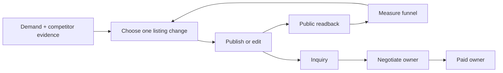
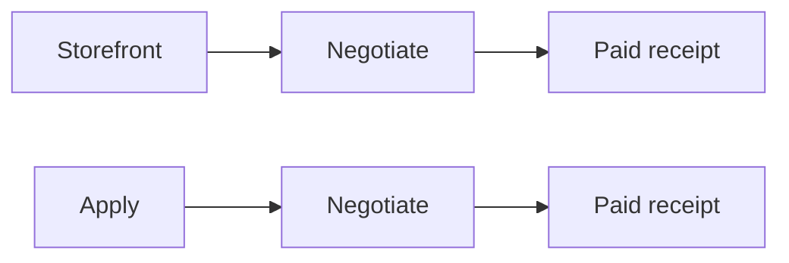
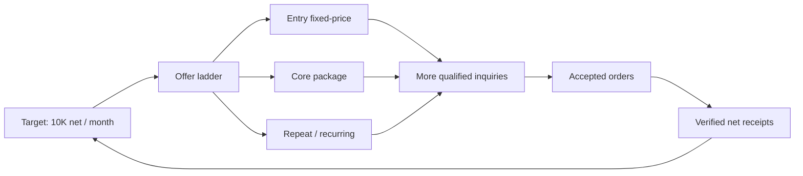

# Storefront Revenue Loop SSOT

Status: INCOMPLETE, and the binding defect is now named. The loop runs and reports correctly — 232 wakes in the last six hours with 231 completed — but it produced zero listing effects and zero new listings in that window, and it has no executable action for roughly the next twelve days. Running is not iterating. The Storefront scheduler, catalog/KPI reader, Telegram reporter, mutation fences and dedicated Terra proposal route are healthy. Readonly GitHub-`main` release `b3ab6826e...` runs at 60-second cadence and has generated, published and officially read back body, title, package and zero-image improvements without service-specific mutation JSON. Every current IMPROVE scorecard gap has exactly one accepted effect. Generic CREATE code is on `main`: it generates a strict Terra proposal, copies category/price constraints from official seller state, renders a SHA-bound hero, recovers an existing blank draft and persists its capability family. CREATE is closed end to end: the loop published official draft `4356229` itself from readonly main release `5e02c5659...` with exact public title/catchphrase/price/delivery/option readback and a byte-identical live hero image, and the following full wake produced zero CREATE artifacts and no duplicate effect. The installed release is now `f4cd687f7...`. `RETIRE` is reachable and binds the real observed archive control; `REPLACE` renders as an atomic plan. Neither can execute today because thirteen of twenty slots are used, so capacity pressure is false and no listing is eligible — that is a gated contract with a terminal event, not a completed execution. Metric learning measures inquiries, official purchases, verified net receipt and official rating/lifetime sales, and refuses to invent a view-based rate. Still open and named below: the `RETIRE`/`REPLACE` executor with its post-effect restore verification, CREATE autonomy after the demand-evidence gate, per-service repeat purchase, and the stale unit-test suite in `test_storefront_direct.py`. That suite's nine pre-existing failures predate this work and had one root cause: the fixture hand-built an argument namespace roughly thirty options behind the real CLI, so `run_once` died on a missing attribute before reaching anything under test. The parser is now built once through `build_parser()` and the fixture starts from it, the launchd assertions match the documented minute cadence with `--auto-cadence`, and a failing wake assertion now prints its receipt. Repairing that suite then exposed a real production defect rather than a test defect: four of the eleven scorecard backlog items (`4312985/scope`, `4313100/package`, `4244912/scope`, `4244556/scope`) asked for `inquiries_to_purchase`, a synthetic ratio the judgement validator rejects, so those four services could never yield an accepted hypothesis. Commit `92a78cc56` points them at official `purchases`, which is measured per service. Nine failures are down to four, whose remaining cause is mock drift around the portfolio, funnel and context work the loop has since gained; they are stale expectations rather than production defects, and production evidence — not this count — remains the completion gate. Apply and Negotiate integration cleanup is externally owned. Paid remains intentionally disabled and externally owned.

## 1. Overview

Storefront turns verified demand and owned delivery capability into public, versioned marketplace services. It improves existing listings, creates a new listing only when evidence and delivery capacity justify it, verifies the public result, and attributes downstream revenue without taking ownership of buyer conversation or paid delivery.



The two earning funnels remain separately attributable:



Waiting is not work. A 14-day window may control when a hypothesis can be judged, but the TODO is to build the selector, executor, verifier, ledger, and reporter now. While one hypothesis matures, the loop may prepare evidence for the next hypothesis but must not silently overwrite the active experiment.

### Completion definition — beach mode

Storefront is complete only when one installed launchd loop repeatedly performs the following cycle without a human writing a service-specific JSON contract or running a coding session:

1. Read the exact official catalog, per-service analytics, funnel receipts, owned delivery capability and fresh competitor evidence.
2. Score all twenty slots and choose exactly one highest-value `KEEP`, `IMPROVE`, `RETIRE`, `REPLACE` or `CREATE` action with an evidence-backed reason.
3. Generate a complete version-bound listing contract and exact single-action mutation contract from the observed state. Unsupported claims, unknown capability, missing metric attribution and stale versions MUST fail closed.
4. Publish at most one eligible action, read it back from the official buyer-visible page, persist effect/rollback/receipt evidence and replay without a duplicate effect.
5. Measure attributable Storefront inquiries, payments, net receipts, reviews and repeat purchases separately from Apply. Unknown origin MUST remain unknown.
6. Keep, improve, revert, retire recoverably or replace based on evidence, then immediately select the next executable action while other experiments mature.
7. Report the observation, decision, effect, official readback, funnel movement, errors and next action to Telegram in natural language.

A working scheduler, a scorecard, a fixed set of adapters, or one successful publication is necessary evidence but is not completion by itself.

### Four-stage completion contract

`launchctl state=not running` between scheduled invocations does not mean OFF. An interval owner is ON when its label is loaded, its plist has the intended interval, wakes continue, and the latest completed wake exits `0`. Current read-only observation shows Storefront, Apply and Negotiate loaded with latest exit `0`; Storefront uses `StartInterval=60`. Paid is intentionally not loaded. This is operational availability, not completion evidence.

The finish line has four separate stages:

1. **Storefront complete on this Mac mini:** every Storefront-owned item in this spec is closed, including generated `CREATE`, recoverable `RETIRE`, atomic `REPLACE`, official KPI learning, Telegram, idempotent replay, owner-only launchd reload recovery and cleanup.
2. **Four-lane Coconala production complete on this Mac mini:** Apply, Storefront, Negotiate and Paid are all owner-isolated, main-derived, loaded as intended, and both earning paths complete real official E2E with attribution and no duplicate effect. Enabling Paid alone is insufficient.
3. **Unattended-by-default acceptance:** non-destructive plist validation, owner-only `bootout → bootstrap → kickstart`, isolated browser-profile recovery, bounded failure reporting and repeated scheduled wakes prove ordinary operation does not need a coding session. A production Mac reboot is not a Storefront or four-lane completion requirement because it interrupts unrelated owners and remote control. CAPTCHA, expired identity/authentication, policy changes and unsupported buyer requests remain explicit fail-closed human-escalation boundaries; revenue is never guaranteed.
4. **Portable open-source release:** a clean second Mac installs from the public repository, supplies only documented profile/capability, marketplace login and Telegram inputs, creates owner-isolated launchd services and readonly releases, passes the same health/E2E gates, and can uninstall without deleting user marketplace data.

Stage 4 starts only after stages 1–3 pass on the current Mac mini. “Works on this Mac” and “works on any Mac” are different acceptance claims.

### Runtime intelligence and model contract

The Storefront loop is not one continuously running LLM. Its installed launchd label wakes every 60 seconds. Incremental wakes collect official state, reconcile funnel data, perform public readback and report through deterministic Python only. A full decision wake is due every 1,800 seconds. Even on a full wake, code performs identity, version, evidence, ownership, one-effect, rollback, official-readback and duplicate guards; the model may propose commercial content but can never certify its own external effect.

Current runtime truth:

- `storefront_direct.py` routes commercial proposals through `agent_runner.py --task-class storefront-proposal-agent`.
- Both current `main` and installed release `b3ab6826e...` resolve that Storefront-only task class to Codex `gpt-5.6-terra`, effort `medium`, with no Luna or Sol candidate.
- Incremental wakes and full wakes with no eligible gap bypass that model call. Therefore “launchd is running every minute” does not mean Terra is invoked every minute.

Completion model contract:

- Add a Storefront-specific runner task class named `storefront-proposal-agent`, pinned to Codex `gpt-5.6-terra`, effort `medium`. Do not reuse a shared task class whose model change could silently alter another loop.
- Use Terra only on a full wake that has fresh evidence and an eligible proposal gap. Terra generates the candidate listing contract, copy, scope, package/price proposal, FAQ or portfolio action in the strict schema.
- Keep catalog collection, KPI arithmetic, attribution, capability checks, version/hash binding, mutation cardinality, seller submission, public readback, rollback, receipt persistence and Telegram dedupe deterministic.
- Do not put Luna or Sol in the normal Storefront runtime path. Luna may be evaluated later only as a measured challenger against the same retained evidence and schema; it does not replace Terra unless contract validity and downstream Storefront KPIs are no worse. Sol is not a per-wake reviewer.

This decision optimizes for commercial judgment quality without paying for an LLM on every minute tick. No model change is allowed to be reported as a KPI improvement until official attributable funnel evidence proves it.

### Production promotion contract

There is no separate Coconala staging marketplace. The staging equivalent is an isolated, effect-free validation against retained evidence and authenticated seller-form state. Production remains the installed immutable release under launchd.

Every owner MUST follow this promotion path:

1. Develop on an owner-scoped branch/worktree without changing a live plist, live state or another owner's files.
2. Validate schema, version binding, exact intended form delta, rollback and duplicate fence without submit.
3. Integrate the owner slice into clean GitHub `main`; a feature-worktree SHA is not a production source.
4. Build one readonly immutable release from that `main` SHA and change only the owning launchd label. One label MUST NOT combine executable/runtime paths from different release SHAs.
5. Run one bounded production canary effect only when an eligible real action exists, require official readback and durable receipt, then replay immediately with zero duplicate effect.
6. Roll back the owning label to its prior immutable release if the canary or replay fails. Never edit the installed release or live checkout in place.

Different lanes may run different immutable `main` SHAs because they are promoted independently. “One clean place” means one repository and GitHub-`main` ancestry with owner-isolated releases, not one shared writable checkout or one forced identical SHA.

## 2. Ownership boundary

| Owner | Owns | Must not own |
|---|---|---|
| Storefront | market evidence, service contract, images/copy/scope/packages/price versions, create/edit, public readback, Storefront attribution and reporting | buyer replies, negotiation decisions, paid fulfillment |
| Negotiate | inquiry/talk-room replies using the exact service version and contract handed off by Storefront | listing mutation, paid artifact production |
| Paid | accepted/paid order, delivery, revision and real payment receipt | listing experiments, inquiry acquisition |
| Apply | outbound applications and Apply attribution | Storefront listing mutation |

Cross-loop integration is an immutable handoff event, not shared ownership: `platform`, `service_id`, `listing_version`, `origin=storefront|apply`, `conversation_id`, `order_id`, and timestamps. Git ownership follows the same boundary; Storefront changes never modify `paid_direct.py`.

## 3. Evidence-backed design rules

- Coconala says an unclear title is passed over without a click, recommends putting appeal points in service images, and says both supported and unsupported scope should be explicit. Source: [ココナラ「売上を増やすには」](https://coconala-support.zendesk.com/hc/ja/articles/218179338-%E5%A3%B2%E4%B8%8A%E3%82%92%E5%A2%97%E3%82%84%E3%81%99%E3%81%AB%E3%81%AF).
- Upwork Project Catalog recommends starting from demanded client requests, packaging fixed deliverables, offering up to three tiers, showing work samples, and collecting client requirements. Source: [Upwork Project Catalog guide](https://support.upwork.com/hc/en-us/articles/360057397533-How-to-create-a-project-in-Project-Catalog).
- GitHub documents `CODEOWNERS` as the mechanism for naming the people or teams responsible for repository areas. Storefront and Paid therefore require explicit file ownership and separate integration commits. Source: [GitHub CODEOWNERS](https://docs.github.com/en/repositories/managing-your-repositorys-settings-and-features/customizing-your-repository/about-code-owners).

These sources determine the listing contract: one buyer-visible outcome, exact inclusions and exclusions, required inputs, delivery time, revision rule, proof/gallery, tier or add-on ladder, FAQ, and a repeat/recurring path where the service genuinely supports repeat work.

## 4. Current verified state

- Scope slice completion: commit `2b45de788` removes the obsolete account-global 24-hour mutation fence while retaining exact-experiment dedupe and same-service seven-day isolation. The first `91000005/body` pass submitted sealed contract `79ae5f3e...`, then failed closed during collapsed public-body readback with a durable `prepared` intent. Commits `b7bcd24fd` and `f9005da7f` make scope recovery precede stale seed rendering and expand the official `button.c-contentsCollapse_readMoreButton` before body verification. Recovery pass `storefront-direct-1786882331766090000-4810` records `public_accepted`, service `91000005`, field `body`, readback `1`, recovered `true`, Telegram `21197`, exit `0` and released lease. The accepted effect ledger contains exactly one row and the intent is `confirmed`; no second submit occurred. Immediate full replay `storefront-direct-1786882454289348000-7561` completes `effect/readback/duplicate=0/0/0`, appends zero contracts, exits `0` and releases its lease. Final normal-cadence pass `storefront-direct-1786882582420653000-11084` runs incremental in `17.594` seconds with twelve official services, Telegram `21202`, exit `0` and released lease. Installed release `f9005da7f...` is a readonly main ancestor with zero writable files; Apply, Negotiate and Paid plist hashes remain unchanged.
- Generated proposal completion: commits `fa40d2301` and `b4f426d4a` add the isolated `storefront-proposal-agent` route pinned to Codex `gpt-5.6-terra`, effort `medium`, strict proposal schema, deterministic current-form/version/evidence sealing and public-only readback for the already-published seed listing. Retained effect-free evidence first generates a valid `4312985/body` contract from route `codex/gpt-5.6-terra/medium`. Installed full pass `storefront-generated-live-b4f426d4-r2` independently generates contract `0cd6b00f...`, publishes exactly `data[Service][head]`, records `actionable/effect/readback/duplicate=1/1/1/0`, confirms the intent and accepted effect once, exits `0` and releases the lease. Same-service-only replay `storefront-generated-replay-b4f426d4-r2` makes zero model calls and completes `0/0/0/0` with no second effect. Normal launchd recovery `storefront-direct-1786884566207651000-14581` completes incremental official readback for twelve services, exits `0`, releases the lease and sends Telegram `21231`. The installed release is readonly, is an `origin/main` ancestor, uses only `--effect --auto-cadence`, and all non-Storefront plist hashes remain unchanged.
- Generated package completion: commit and readonly main release `8f37ab5a3...` add the `PACKAGE_ABSENT` adapter after authenticated DOM inspection proved that `4313100` has zero paid options and `#addOption` creates exact title/price/opened controls. Storefront-only full pass `storefront-package-live-8f37ab5a` uses `storefront-proposal-agent` at `codex/gpt-5.6-terra/medium`, generates contract `c48586f9...`, publishes one paid option, validates the exact seller-form group plus buyer-visible title and price, records `actionable/effect/readback/duplicate=1/1/1/0`, exits `0` and releases the lease. Replay `storefront-package-replay-8f37ab5a` makes zero provider calls and completes `0/0/0/0` with no second effect. The normal incremental wake sends Telegram `21248`. This is the second consecutive loop-generated real contract after `4312985/body`; neither cycle uses a developer-authored mutation JSON.
- Apply recovery pass `gig-apply-direct-1786871660578692000-85922` completed before source migration with observed/actionable/effect/readback/failed/pending `40/1/1/1/0/0`, Telegram `sent/20996`, and launchd exit `0`. It proves a real application plus official readback; the later main-derived replay below proves current provenance.
- Apply source and complete runtime closure are now preserved on main through `c2d971c88...`: direct/parent, B2 gates, planner, category and attribution ledgers, browser lease dependency, decision schema, duplicate-submit fence and Apply-only Telegram reporter. Installed release `c2d971c88...` supplies the direct entrypoint, parent, lease script and runner; its launchd environment has no token-budget keys. Pass `gig-apply-direct-1786872912019033000-68814` completes with observed/actionable/effect/readback/failed/pending `116/0/0/0/0/0`, Telegram `sent/21015`, empty stderr and exit `0`. A second pass is required before closing the migration item.
- Historical failures `storefront-direct-1786873112971133000-73621` and `...84735/...87303/...93705/...95789` preserved effect `0`, released their leases and reported the failure. Direct DOM comparison proved the cause: the inventory reader zipped public service hrefs against whole-page text chunks, so the leading draft card `91000003` was falsely assigned to public service `91000004` as `下書き/JPY3,000`. The authenticated seller form and public page both showed the real `91000004` state as `公開中/JPY5,000`; the false source row then broke the exact price-option contract.
- Main commit and readonly release `d98cd446427a6c3148ef7c960ae8b006976b976c` bind each inventory row to its own `.serviceListContentBox` and include public `/services/<id>` cards only. Direct browser verification reads eleven public cards before recovery, maps `91000004` to `公開中/JPY5,000`, and excludes draft `91000003` from public inventory. The loaded Storefront service contains no `ANICCA_*BUDGET*` keys.
- Full pass `storefront-direct-1786874069778111000-2511` exits `0`, reads official/competitor `11/8`, renders all six mutation contracts, reconciles eleven analytics pages to views/purchases/favorites `441/0/3`, republishes exact contract service `91000003` with `effect/readback/public_effect=1/1/1`, sends Telegram `21043`, and releases its lease. Independent `crwl crawl https://coconala.com/services/91000003` reads the expected SEO title, JPY3,000 price, scope, paid option and recurring-purchase offer.
- Immediate pass `storefront-direct-1786874196049777000-11452` runs incremental in `30.782` seconds, reads twelve `公開中` services including `91000004=JPY5,000` and `91000003=JPY3,000`, restores KPI coverage `12/12`, preserves funnel attribution Storefront `1/0/JPY0`, Apply `0/3/JPY27,378`, unknown `101/5/JPY99,060`, records effect/readback/duplicate `0/0/0`, dedupes Telegram to `20983`, releases its lease and exits `0`.
- Report commit and installed readonly release `b4463cf90a412ea3967482612954fff5025d17e2` aggregate new-listing readback on the same boundary as new-listing effect and stop calling an already-rendered fenced mutation an unprepared contract. Pass `storefront-direct-1786874415213816000-16480` completes in `22.396` seconds with twelve official services, KPI coverage `12/12`, exact funnel totals, effect/readback/duplicate `0/0/0`, Telegram `sent/21050`, exit `0` and released lease. Its owner-visible next action is now to keep the `91000001/image` fence and select an executable gap on another listing.
- Commit `d91bec35c` deletes the shared token-budget ledger/admission implementation and all runtime/installer resurrection paths. Provider usage telemetry remains observational. The per-pass submit-attempt fence is not a token budget; it prevents duplicate external submissions and remains mandatory.
- The quarantined `.worktrees/storefront-revenue-os` has no uncommitted changes. Its problem is mixed ownership, not Git dirtiness. No canonical Apply, Negotiate or Storefront launchd path invokes GigPass or Hermes. Hermes is untouched and outside this migration.

- The historical mixed implementation remains quarantined in worktree `.worktrees/storefront-revenue-os`, branch `fix/storefront-revenue-os`, HEAD `b8f15537a`. Its exact accidental-Paid/revert pairs are `d150e4b1d → 06e9ac0dc`, `6ed25b976 → 1a6894b6f`, `0bba80549 → 5beb42ce2`, and `ff5b96a8e → b8f15537a`. The branch remains forbidden from whole-branch merge and is not a Storefront execution path; these immutable SHAs preserve the audit after its worktree and refs are removed.
- GitHub and local `main` contain integration point `c494a588f`. The temporary clean Storefront worktree and `feat/storefront-loop` branch are removed. Coconala Storefront production code, config, contracts, assets, tests, plist and this SSOT are all on `main`.
- Paid is intentionally stopped by its owner. Storefront integration does not change its plist, release, process, project state, artifacts, receipts, or restart state.
- Launchd label `ai.anicca.hf-gig-storefront-direct` runs `storefront_direct.py --effect --auto-cadence` every 60 seconds from readonly GitHub-main release `b3ab6826e3a13db031c0b10cef45c95ed5ea8fc0`. Incremental wakes read catalog/funnel state; auto-cadence performs the full market/analytics/mutation selection at the bounded full interval. Historical release references in this section are evidence, not current pointers.
- The selector consumes the scorecard and prepares service `91000001`, field `image`, metric `views_to_inquiry`. It correctly blocks a second mutation on service `91000001` while that service's FAQ experiment is open.
- Twelve official services are listed. The 20-slot quota is capacity, never authority to create eight more. A new service requires distinct demand evidence, owned capability evidence, and available delivery capacity.
- Clean Storefront history is merged into `main`: `d65f13bf9` imports the dedicated owner, `2854097ad` selects the scorecard hypothesis, and `b655a83d0` closes an active-experiment no-op before the LLM judge. Later slices extend the same main ancestry through installed commit `85eaa6d86`.
- Real pass `storefront-selector-live-b655a83d0` exposed that `origin/main` had obsolete fixed-`:9222`, tokenless CDP helpers. Commit `a695e79e4` restores the byte-identical installed fenced runtime and its existing tests; 40 focused checks pass.
- Real pass `storefront-selector-live-a695e79e4` then completed with official/competitor `11/8`, effect/readback/duplicate `0/0/0`, next hypothesis `91000001/image`, metric `views_to_inquiry`, Telegram `deduped/20073`, and lease released. The hypothesis is prepared but non-executable while the FAQ experiment remains active; the measurement window is not a TODO and does not block building the image adapter now.
- Commits `1a13109d0` and `0244e1660` add the verified 1220x1016 OpenCV hero asset/contract and the fenced multipart publication adapter. The asset regenerates to the exact contract SHA; the isolated seller form produced one blob preview and exact field `data[UploadedFile][n1][image_files]` without submitting. Forty-two focused checks pass. Real pass `storefront-image-fence-live-0244e1660` preserved the active-experiment fence with public image count `0`, effect/readback/duplicate `0/0/0`, and no residual Storefront lease.
- Commit `e53a70689` binds the official VBA listing version, JPY6,000 base, JPY3,000 add-on, JPY5,000 maintenance, required inputs and two inquiry answer patterns into the runtime contract ledger. Real loop runs appended `1` then replayed `0`. Commit `3649a0bb9` reports official/competitor counts, contract inventory, selected hypothesis and fence in natural Japanese; real Telegram delivery is `sent/20425`.
- Storefront now derives version-bound contracts for all 11 official services from six owned-capability families while preserving the VBA-specific override. Real pass `storefront-family-contract-live-37c975927` read official/competitor `11/8`, appended the missing `10`, and reached contract total `11`. The first replay exposed a transient truncated service DOM; the inventory reader now retries the full 120,000-character public page until the official service scope exists. Pass `storefront-family-contract-replay-fixed-37c975927` completed with appended `0`, total `11`, effect/readback/duplicate `0/0/0`, and a released lease.
- Read-only inspection of the installed Negotiate owner shows its composer currently receives only conversation, verified research and verified application context. It has no service-ID or Storefront-contract consumer. Storefront publishes the immutable versioned contract ledger, but the Negotiate owner must add the consumer; Storefront must not patch the Negotiate implementation to hide this boundary gap.
- The seller price select stores the tax-inclusive internal option value while its label and public page show the seller price: option `22000` reads `20,000円`, and option `3300` reads `3,000円`. Storefront contracts bind both values and reject a mutation unless the exact option/value pair exists; the loop never guesses the conversion.
- Storefront analytics now reads all 11 official service pages, not only OpenCV. Real pass `storefront-catalog-kpi-live-458fab724` recorded per-service snapshots and official 30-day totals of 441 views, 0 purchases and 3 favorites, preserving ten first-baseline deltas as unknown, and sent Telegram `20444`. Replay resolved all deltas to zero and sent the changed state as `20446`; a third identical pass returned `deduped/20446`. Every pass released the Storefront lease and produced no public mutation.
- Official search for `SEO 記事 構成 執筆` exposed 3,899 results; observed comparables include service `2329055` (216 sales, 185 reviews, JPY6,000), `1884761` (331 reviews, JPY20,000), and `1051841` (443 reviews, JPY35,000). The owned public portfolio contains `SEO記事執筆 構成案・執筆納品事例`, so the first distinct new-listing candidate is grounded in both demand and owned capability.
- Storefront created nonpublic Coconala draft `91000003` in the official category `19/372/150` and bound title, catchphrase, scope, exclusions, buyer inputs, JPY3,000 display price (`3300` option), five-day delivery and one-order capacity in `seo-article-v1.json`. The first live save exposed page-hydration and delayed-readback races; the adapter now waits for each dependent category option and polls exact saved-state equality. Full pass `storefront-new-draft-readback-a5a969097` completed with official/competitor `11/8`, draft `effect/readback/public_effect=0/1/0`, KPI `441/0/3`, released lease and Telegram `20482`. The earlier failed pass had already saved the exact draft; the successful replay correctly did not claim a second effect.
- The SEO hero is a deterministic 1220x1016 PNG bound to SHA `5e9ebb2f...` and contains only contract-backed claims. Blob preview was explicitly rejected as proof: the adapter now submits native multipart with hidden `mode=draft`, closes that tab, opens a fresh official tab, and requires all fields plus exactly one persisted image. Direct adapter proof produced `1/1/1/0` for effect/readback/image/public, then replay `0/1/1/0`. Full pass `storefront-new-draft-image-full-final-18b6c261b` reproduced replay `0/1/1/0`, official/competitor `11/8`, active contracts `11`, KPI `441/0/3`, released lease and Telegram `20519`.
- The SEO draft now binds its category-specific completeness and ladder: features `企画・構成/リサーチ/SEO対応`, industries `ビジネス・法律/IT・テクノロジー/メディア・マスコミ`, Japanese, deliverable format, one free revision, JPY1 per character, JPY3,000 for an extra 3,000 characters, and repeat purchase enabled with a 5% discount. The portfolio link is owned proof and the SHA-bound hero is the gallery asset. Direct save/readback then replay produced effect `1` then `0`; full pass `storefront-new-draft-ladder-full-3a940473d` reproduced `effect/readback/image/public=0/1/1/0`, sent Telegram `20527`, and released the lease.
- The publication conflict is scoped by `service_id`, so the open experiment on `91000001` remains protected without blocking distinct draft `91000003`. Pass `storefront-direct-1786846676934847000-88255` published `https://coconala.com/services/91000003` once with public effect/readback `1/1`, duplicate `0`, official count `12`, exit `0`, and released lease.
- Public verification no longer accepts an arbitrary page image. Seller image identity `eab2ab35-9531685.png` must appear in the public CDN images, while title, catchphrase, full service body, buyer-input body, price and all three category labels must match the versioned contract. Passes `storefront-direct-1786847133578052000-66056`, `storefront-direct-1786847461472084000-2443`, and `storefront-direct-1786847667444581000-30337` proved `already_public`, effect `0`, exact readback `1`, duplicate `0`, and exit `0`.
- The first two publication reports timed out after send start and remain quarantined as `delivery_unknown`; they are never resent. Reporting now uses the real draft/public state, includes the official URL, permits a bounded 180-second provider ACK, and classifies a real public effect separately from a no-op. The corrected current-state report is provider-acked as Telegram `20596`; the identical replay is deduped to `20596` with send `0`.
- The image adapter now renders one immutable mutation contract from the latest official listing snapshot before any seller form action. Real snapshot `ba309b9b...` binds service `91000001`, only the image upload field, asset SHA `207e699e...`, rollback to zero images, official readback of exactly one image, metric `views_to_inquiry`, and a 14-day observation window. The executor, pre-send gate, public readback and crash recovery consume the same contract; stale versions, changed contract SHA and multi-field deltas fail closed. This proof renders and diffs only and does not publish.
- Commit `00b1a89ae` is installed as the Storefront-only readonly release. Real owner pass `storefront-direct-1786848245999543000-3943` exits `0`, reads official/competitor `12/8`, preserves the active `91000001` fence with effect/readback/duplicate `0/0/0`, exact-reads public SEO service `91000003` and image `eab2ab35-9531685.png`, retains KPI `441/0/3`, dedupes Telegram to `20596`, and releases the lease. Every non-Storefront gig plist remains byte-identical.
- The title/outcome adapter consumes the same runtime envelope. Commit `d5e78bc75` installs an evidence-bound proposal for presentation service `91000004`; pass `storefront-direct-1786848631268158000-51494` binds current official version `a345b678...`, renders only `data[Service][overview]`, retains the exact rollback title, records intended public title readback, and proves `published=false` under contract SHA `ccdcd7cd...`. The complete wake exits `0` with the existing fence, SEO readback, KPI, Telegram dedupe and released lease unchanged.
- The body/scope adapter reads the exact authenticated seller form rather than a collapsed public excerpt. Commit `d3e718921` binds service `91000004` to a bounded JPY5,000/maximum-five-slide scope with explicit inclusions, exclusions and estimate boundary. Pass `storefront-direct-1786849061129008000-97801` renders only `data[Service][head]`, retains the complete prior body as rollback, binds proposed public body SHA `e035c9a5...`, proves `published=false` under contract SHA `ba0df122...`, and completes with the other Storefront invariants unchanged.
- The package adapter keeps price ownership separate and changes only the existing add-on label. Commit `69f74c2b3` binds the authenticated JPY1,000 option on service `91000004` to the bounded label `追加スライド1枚（原稿支給・同一デザイン）`. Pass `storefront-direct-1786849420229880000-38442` renders only `data[Option][0][title]`, preserves rollback and price readback, proves `published=false` under contract SHA `348f2edb...`, and exits `0` with 12 services, SEO exact readback, Telegram `deduped/20596` and released lease.
- The FAQ adapter treats one question/answer pair as one logical listing field while still validating both seller controls. Authenticated seller form service `91000004` contains no FAQ. The versioned proposal renders logical delta `data[Faq][0]`, preserves `FAQ_ABSENT` rollback, binds exact public question/answer readback, and proves `published=false` under contract SHA `6362ed00...`.
- Installed FAQ wake `storefront-direct-1786850853324012000-9452` rendered all four mutation contracts and reached analytics service 11/12, then CDP ports `9222/9223` disappeared. The analytics read timed out; the tab-close timeout replaced that failure, and the lease-release timeout escaped the receipt boundary. This wake remains failed historical evidence. Storefront now catches cleanup subprocess timeouts so the original failure produces a durable failed receipt; recovery pass `storefront-direct-1786854719329508000-8615` supplies the later successful replay and released-lease proof.
- The shared browser slab on `main` had regressed from previously proven commit `e1e17a4bb`: `ensure_browser.sh` hardcoded port `9222` and spawned raw Chromium with `nohup`, while Storefront owns port `9223` through `ai.anicca.hf-gig-browser`. The restored managed-recovery path consumes `CLOAK_CDP_BASE_URL`, asks the canonical launchd owner to recover, waits for official CDP liveness and never starts a second raw process. The Storefront plist declares that browser owner, and every Storefront wake runs the guard before acquiring a lease. The installed recovery replay now passes.
- The first public recovery release exposed a deeper provenance gap before deployment: `main` had neither `launch_gig_browser.sh` nor the source `ai.anicca.hf-gig-browser.plist`, although the installed browser plist still referenced quarantined release `d150e4b1d...`. The two browser-owner files are restored individually from proven commit `f1209ea69`; the mixed branch is not merged. Public-main release `8fefa7a0c...` now closes this browser-source provenance gap.
- Public-main commit `8fefa7a0c` now contains the restored browser launcher and source plist. Readonly immutable release `/Users/operator/gig/releases/rockstar_ibot/8fefa7a0c1a6ba1a86d36a587953006026ac2cf0` matches both source files and `storefront_direct.py`; the installed browser and Storefront plist files point only to this release, and the other five canonical plist files remain byte-identical. Failed recovery pass `storefront-browser-failure-c0c803f56` exits through the durable receipt boundary with `status=failed`, `reason=storefront_browser_unavailable:FAILED`, `effect/readback/duplicate=0/0/0`, and no lease. This proves fail-closed recording, not installed recovery success.
- After the Mac user session returned, OpenDirectory and GUI launchd manager both read UID `501`; canonical browser label `ai.anicca.hf-gig-browser` remained running on CDP `:9223`. The existing Storefront label was triggered once without reloading another owner. Recovery pass `storefront-direct-1786854719329508000-8615` completed with launchd exit `0`, official/competitor `12/8`, effect/readback/duplicate `0/0/0`, catalog KPI `441/0/3`, four authenticated mutation renders, public SEO readback `1`, Telegram `deduped/20596`, and released lease. CDP stayed alive through analytics 12/12, and the lease ledger ended empty. This closes S4r; the earlier bootstrap outage remains historical evidence, not a TODO.
- The price adapter uses the common mutation envelope and binds seller option identity separately from buyer-visible JPY. Readonly main release `76bd1117e...` is installed only for Storefront. Pass `storefront-direct-1786855420160162000-28208` authenticated the current service `91000004` version `a345b678...`, seller option `5500` / public JPY5,000, and proposed option `6600` / `6,000円`; it rendered only `data[Service][price]`, retained rollback `5500`, contract SHA `d9d5c930...`, and `published=false`. Removing the proposed option fails closed with `storefront_price_option_binding_invalid`. The full installed wake exits `0` with official/competitor `12/8`, all five mutation renders, KPI `441/0/3`, public SEO readback `1`, Telegram `deduped/20596`, and released Storefront lease. No price or listing was published.
- All six adapters now seal and validate the same mutation contract field set before any effect. The validator requires the official capability-family mapping, a 64-character listing precondition, exactly one `data[...]` delta, rollback equality, a nonempty official-readback contract, metric/window/evidence and a canonical contract SHA. Retained official seller/public snapshots render image, title, body, package, FAQ and price with `published=false`; independently resealed unsupported-family, multi-field and rollback mutations are rejected, while stale seller state and an unknown price option are rejected by their live adapter preconditions. The installed-owner proof remains the final S4g gate.
- Commit `448904405` is on GitHub `main` and installed as readonly Storefront release `4489044058a5ae5798bbb506f67f672409864498`; only the Storefront label was reloaded. Pass `storefront-direct-1786855932818098000-44055` completed with official/competitor `12/8`, six common-contract renders for image/title/body/package/FAQ/price, exact family/precondition/readback, one allowed delta, rollback equality and `published=false`. It retained KPI `441/0/3`, public SEO readback `1`, effect/readback/duplicate `0/0/0`, Telegram `deduped/20596`, exit `0` and a released Storefront lease. Every non-Storefront plist hash stayed unchanged. This closes S4g.
- The S5 joiner reads Negotiate transcripts, project linkage, Apply applications and immutable earnings receipts without modifying any source owner. Its isolated live-data reconciliation emits 110 stable events: one exact Storefront inquiry for conversation `10083449` and service `91000002`, zero presently provable Apply inquiries, 101 unknown-origin inquiries and eight unknown-origin net receipts totalling JPY126,438. Replay appends zero. Missing cross-owner links remain visible unknowns; money is not assigned to Storefront or Apply by title guessing. Each payment schema keeps gross/fee/refund/revision/rating/review/repeat unknown when its source receipt does not prove them. The installed wake and Telegram send/dedupe proof remain open.
- First installed S5 pass `storefront-direct-1786856329756823000-52997` failed before funnel append because the authenticated seller edit page returned a partially hydrated form; it emitted bounded Telegram error `20690` and released its lease. A direct official reread then matched all five existing mutation preconditions exactly, proving no listing drift. The seller snapshot reader now requires the universal title/body/price controls and retries the official DOM up to three times; it does not relax any mutation contract. Recovery and replay remain the active proof.
- Recovery pass `storefront-direct-1786856545678548000-64105` appended 110 stable funnel events, exact-attributed conversation `10083449` to Storefront service `91000002`, retained 101 inquiries and eight net receipts / JPY126,438 as unknown origin, sent emoji report `20696`, exited `0` and released its lease. Installed replay `storefront-direct-1786856694910219000-68172` appended zero, retained cutoff cursor `38c0856b...`, deduped Telegram to `20696`, exited `0` and released its lease. S5 attribution/reporting is complete.
- The versioned portfolio policy uses a 30-day complete window, 100-view retirement minimum, 20-slot capacity, recoverable unpublication and an all-required replacement gate. Current-data allocation evaluates all 12 listings under one evidence cursor as `KEEP 1 / IMPROVE 11 / RETIRE 0 / REPLACE 0`; replay appends zero. Italian UI translation `4312985` has 48 views, zero attributed inquiries/purchases/payments, but fails the minimum-sample, stronger-candidate and slot-pressure gates, so its deterministic action is `IMPROVE(scope)`, never deletion. Installed-owner proof remains open.
- Installed allocation pass `storefront-direct-1786857229141485000-80688` reproduced all 12 decisions, sent Telegram `20707`, exited `0` and released its lease. Its first replay exposed two idempotency defects without a public effect: timestamp-bearing analytics snapshot IDs generated a second identical allocation set, then the published SEO draft category select failed transient hydration and emitted bounded error `20710`. Allocation identity now hashes logical window+metrics+contracts+funnel rather than observation time, and published-draft readback uses the same bounded three-attempt hydration recovery as draft preparation. Isolated replay holds the same cursor and appends zero; installed recovery remains open.
- Installed recovery `storefront-direct-1786857651896268000-41115` completed with SEO readback `1`, the logical portfolio cursor, effect `0`, Telegram `20715`, exit `0` and released lease. Replay `storefront-direct-1786857762924258000-43624` retained the same cursor, appended zero allocations, deduped Telegram to `20715`, exited `0` and released its lease. Storefront can now materialize conversation `10083449` as an exact VBA context envelope for service `91000002`, version `dc08f7e2...`, base JPY6,000, two add-ons, deliverables, required inputs and its two dedicated answer patterns. Isolated context replay appends zero; Negotiate ACK remains missing.
- GitHub `main` commit `35f9bf165` first installed the context publisher. Pass `storefront-direct-1786858073692144000-52570` materialized exactly one envelope for conversation `10083449`, service `91000002` and version `dc08f7e2...`, then failed closed later at transient published-draft hydration with `effect=0`, Telegram `20724` and a released lease. Commit `2b9895817` makes that read-only draft check retry both missing dependent category options and a fully bounded readback mismatch. Its installed recovery `storefront-direct-1786858332158170000-73444` completed in 72 seconds with SEO public readback `1`, context `1/appended 0/ACK 0`, portfolio appended `0`, effect `0`, Telegram `20729` and a released Storefront lease. The installed plist points to readonly main release `2b98958172d493bd4f7ad760f58577be600fe87f`. `negotiate_context=missing` remains truthful until the Negotiate owner consumes and ACKs the exact context key.
- The selector now skips services with open experiments and stale/unimplemented backlog adapters instead of turning their measurement windows into work stoppages. It selected service `91000004`, mapped portfolio field `outcome` to the already rendered title contract, and bound old title `教育・研修資料を見やすく整え`, new title `研修資料を伝わる構成と見やすいスライドに整え`, current version `a345b678...`, and contract SHA `ccdcd7cd...`. Pass `storefront-direct-1786858876079556000-85436` submitted exactly `data[Service][overview]`; the official page and seller form both changed to the new title, but immediate public DOM hydration failed before ledger acceptance. The durable intent prevented a second submit. Recovery pass `storefront-direct-1786859267852094000-99307` confirmed the existing public effect, appended exactly one accepted effect row with `recovered=true`, sent Telegram `20748`, exited `0` and released its lease.
- Replay release `f4f997e68e741637b37e77cf228035e930728067` treats confirmed mutation contracts as published evidence and returns a truthful no-op when no current unfenced backlog item has an exact executable adapter; it never falls back to an unconstrained LLM mutation. Passes `storefront-direct-1786859590736053000-7425` and `storefront-direct-1786859712679726000-9983` both exited `0` with title effect `0`, portfolio/context append `0/0`, and released leases. The second identical pass deduped Telegram to `20755`. The title experiment has exactly one effect row. Paid, Apply and reply/Negotiate plist hashes remain byte-identical.
- Incremental commit `8b63da00b` adds official catalog, funnel, portfolio and inquiry-context readback without competitor crawl, LLM judgment or public mutation. Fixed-cutoff launchd passes proved minute `29781012`, hour `496350` and day `20681`; the same boundary replay initially exposed runtime-bound Telegram identity and then an outbox payload mismatch, both with public effect and ledger append `0`. Commits `6701bd292` and `09ad76871` keep runtime in the durable receipt but remove it from the idempotent Telegram payload and move incremental no-op identity to v2. Passes `storefront-direct-1786861199062378000-92397` and `storefront-direct-1786861258457124000-94015` completed in `20.823/32.043` seconds with the same accounting boundary, effect/readback `0/0`, all funnel/portfolio/context appends `0`, released leases, and Telegram `20785 sent → 20785 deduped`. Controlled +1-hour pass `storefront-direct-1786861305177044000-95405` produced minute/hour/day `29781072/496351/20681`; controlled +1-day pass `storefront-direct-1786861352356957000-96723` produced `29782452/496374/20682`. Both completed below 60 seconds with effect/append `0` and released leases.
- Auto-cadence commit `b8e8a14d4` is installed from readonly GitHub-main release `b8e8a14d49ec84053aa011b76f05d365887cc9bf`; its plist contains only `--effect --auto-cadence`, `StartInterval=60`, and no fixed verification cutoff. The first natural launchd wake `storefront-direct-1786861642399303000-3712` correctly selected `mode=full` because the previous full success was over 1800 seconds old, exited `0`, deduped Telegram to `20755` and released its lease. Without a manual kick, the next natural tick `storefront-direct-1786861794498416000-7088` selected `mode=incremental`, completed in `38.925` seconds with current cutoff minute/hour/day `29781030/496350/20681`, effect/readback `0/0`, all funnel/portfolio/context appends `0`, Telegram `20798`, exit `0` and released lease. Only the Storefront plist changed; other owner plists were not reloaded.
- Stale-catalog gate commit `fde71db0a` is installed from readonly GitHub-main release `fde71db0a45c3bd37727acc50399e10cc789c289`. One temporary wrong expected SHA stopped pass `storefront-direct-1786861989807466000-14946` after official inventory and before mutation with `official_catalog_version_stale`, exit `1`, effect/readback/duplicate `0/0/0`, exactly one bounded Telegram error `20803`, and released lease. The verification arguments were then removed from the installed plist. Recovery pass `storefront-direct-1786862036431947000-18508` completed in `36.845` seconds as normal auto-cadence incremental mode with effect/readback `0/0`, every append `0`, Telegram `20805`, exit `0` and released lease.
- Legacy source cleanup commit `78cc0f163` plus entrypoint-mode correction `454e451cd` replace the old tmux heartbeat health with a generic four-label `launchd-ledger` probe, make `skills/earn/gig/run.sh` a read-only direct-owner aggregate, and remove the tracked shared pass launcher, CLI, single-instance shell, runbook, old healthcheck/auditor/reality-verifier, their source plists and tests. Actual `run.sh` readback reports Apply, Negotiate and Storefront loaded and Paid missing because its owner intentionally stopped it. The shared health report therefore truthfully returns `degraded/direct_owner_not_loaded`, not a fabricated healthy state. The installed old auditor was booted out; its plist and the two `ai.anicca.hf-gig-pass` backup plists were deleted. No old service can be printed by launchctl. Storefront is a main ancestor; the other three installed releases remain `d150e4b1d...`, which is not a main ancestor and remains their owners' provenance follow-up. The clean mixed branch preserves all four exact Paid reverts through `b8f15537a`; current cleanup removes its executable worktree and branch references without waiting on or modifying the separately active Paid owner.
- Historical provenance checkpoint: `origin/main` contained `skills/earn/gig/scripts/storefront_direct.py` but none of `application_direct.py`, `reply_detector.py`, or `paid_direct.py`. Apply, Negotiate and Paid installed plists then all pointed to release `d150e4b1d...`; only branch `fix/storefront-revenue-os` and its remote contained that commit. `application_direct.py` and `reply_detector.py` were byte-unchanged from `d150e4b1d...` through reverted branch HEAD `b8f15537a`, so their proven behavior could be preserved by exact owner-controlled import rather than redesign. Paid differed after the four reverts and remains exclusively with the Paid owner. This paragraph is historical evidence; the current installed truth is the Status paragraph above.
- Historical Apply failure checkpoint: pass `gig-apply-direct-1786869233439888000-12203` exited `1` as `parent_failed_rc_2` after a planner reservation failure and produced no effect/readback. Apply has since recovered operationally in pass `gig-apply-direct-1786880645052132000-50642`; its remaining defect is noncanonical split release provenance, not the historical runtime failure. Paid remains intentionally unloaded by its owner.
- Apply recovery runner `88993df2e...` removes token-budget admission and restores the installed Apply caller's proven `--timeout-seconds` contract. Installed pass `gig-apply-direct-1786870761768051000-59371` submits request `5214908`, records effect/readback `1/1`, failed `0`, Telegram `20975` and exit `0`. Its next natural launchd wake `gig-apply-direct-1786870973695013000-64935` scans `118` listings across three coverage turns, records effect/readback/failed `0/0/0`, Telegram `20980` and exit `0`. The subsequent cleanup deletes the token-budget module, admission/settlement paths, exit-75 normalization, launchd variables and installer resurrection paths while retaining generic provider usage telemetry. Historical token-budget ledger rows remain immutable evidence and are not an active runtime input.
- Post-cleanup pre-release natural pass `storefront-direct-1786862556075143000-30538` completed its business readback with effect `0` and released lease, but took `69.707` seconds and recorded `TelegramOutboxError`. Minute-bound notification identity was incorrectly creating a transport attempt every minute even though the product requirement is hourly reporting. The incremental receipt continues recording minute/hour/day, while Telegram v3 identity and body use hour/day only so unchanged wakes within one hour dedupe without transport.
- Cleanup-plus-hourly commit `6d5c89ee7` is installed as readonly main release `6d5c89ee7f143be0b91f7e3a82dc1a68b69217da`; only the Storefront plist changed. Pass `storefront-direct-1786862829335868000-36780` completed in `36.508` seconds with official services `12`, incremental public readback `1`, effect/readback `0/0`, all funnel/portfolio/context appends `0`, Telegram v3 `20822 sent`, exit `0` and released lease. Immediate replay `storefront-direct-1786862896706507000-38152` completed in `22.541` seconds with the same business state and effect/appends `0`, deduped to the same Telegram message `20822`, exited `0` and released its lease.
- Storefront commit `85eaa6d86` is on GitHub `main` and in readonly immutable release `/Users/operator/gig/releases/rockstar_ibot/85eaa6d...`. Only `ai.anicca.hf-gig-storefront-direct` was reloaded. Its natural installed wake `storefront-direct-1786843673261706000-46042` exited `0` with official/competitor `11/8`, active contracts `11`, KPI `441/0/3`, draft `0/1/1/0`, active publication fence, Telegram `deduped/20527`, and released lease. Before/after SHA comparison found zero changes to every non-Storefront gig plist.
- Official analytics now retries each service independently and records an exhausted readback as `unknown`, never zero and never a reason to skip the rest of the Storefront wake. Reports separate unknown current values from unknown comparisons.
- First fully autonomous listing, published 2026-08-18 from release `34e643675`: `https://coconala.com/services/4357844`, `請求書作成のExcel自動化要件を整理します`, official category `IT相談・システム開発 / 業務自動化・効率化支援 / Excelマクロ・VBA作成` (`11/230/65`), JPY5,000 as read back from the official per-service analytics page. Nothing about this listing came from a committed file: the market came from the loop's own `Excel 自動化` demand cluster, the capability from its own listing `91000005` (`excel_automation`), the category from the official selects, the copy from the pinned Terra route and the hero from the deterministic renderer. The site's own confirmation page `https://coconala.com/services/new_open/4357844` is the acceptance evidence.
- The chain of defects that publication exposed is one rule with four faces: **the writing category's shape was assumed to be the platform's shape, and each assumption failed only at the step that could no longer avoid the real form.** In order: `read_category_children` dropped the caller's `sub_value`, so the second read selected only the master and the type list was always empty; that empty list was misread as proof of a two-level category, and the reader was changed to return early on it, which made the wrong inference permanent; the type therefore stayed unset and every publication was rejected with `カテゴリタイプを正しく選択してください`; the writer treated absent feature facets as proof that revision limit, per-character price, subscription and discount were also absent, when the IT form renders them; and the readback demanded all of them even where the form greys them out. Fixes: `c87907d15` passes the sub value, `3f5b4848e` waits for the type list and reports `storefront_category_type_absent` instead of inventing a two-level category, `302f55cb4`/`040be9911`/`ad3d5a6eb` name every draft card, every select and the failing category level, and `3a8f5cf67` sets and verifies only the controls the form actually offers and can hold. Two intermediate spec claims made on the way — that this is a two-level category and that these controls do not exist in IT — were wrong and are corrected here rather than left in the record.
- Publication is now recorded when the site accepts it, not only when the public page also matches. Release `34e643675` takes acceptance from the confirmation URL and writes the listing with `readback=0` plus `public_readback_error`; a submission the site did not accept still fails as before. This closed a real duplication path: `4357844` went live under the previous release, no ledger row existed, and the next full wakes therefore re-entered CREATE for the same demand cluster. The missing row was reconstructed from primary evidence only — sealed contract `330ffd1aa...` for the identifiers and capability family, the demand ledger for the cluster path, the verified live page for the URL — with `public_image_identity` left null because it was not observed, and the row names itself `reconstructed`.
- The listing the loop had created also stopped every full wake with `listing_contract_family_missing:4357844` until its capability family was registered. The family was not chosen: it is what the sealed contract already bound (`excel_automation`, from source service `91000005`). Commit `75c57dad5` records it in `storefront-contract-families.json`, and the wake at `1786985609` then completed with the truthful reason `no_executable_unfenced_mutation_contract`.
- The public price check was failing on rendering, not on price. The official seller analytics page for `4357844` states `5,000 円`, which is exactly the contracted amount; the public page splits the amount from its unit, so an exact `5,000円` substring never appeared. Commit `f4909ad79` matches the amount followed by optional whitespace and the unit, and a different amount still fails.
- Reliability across today's release train: `205` wakes recorded `204` completions before the CREATE work began, and the CREATE sequence itself failed closed on every one of its ten attempts without a single unintended external effect. Every failure named its own cause once the diagnostics above existed, which is the difference between a loop that stalls and one that can be repaired from its receipts.
- `4356229`, the first autonomous listing published on 2026-08-17, is no longer on the platform. It appeared in the seller card census at `08-17 00:33` among thirteen listings, disappeared from the census at `08-17 15:32` and has not returned; `https://coconala.com/services/4356229` now returns `404`. Storefront did not remove it: `RETIRE` has never executed and the effect ledger holds no state change for that service. The cause is therefore on the platform side and is not yet known, because nothing in this loop reads platform notifications. This is recorded as an open defect rather than a resolved one. The cause is now known and it was not the platform's silence: Coconala mailed the reason twice. `【ココナラ】出品サービス取り下げのお知らせ` on 2026-08-16 18:38 and 2026-08-17 18:01 both name service `91000003` and both give the same reason, `ココナラ外部のツールを使用したやり取りが発生するサービス（該当箇所：Googleドキュメント）`, because a file service the platform cannot see can become contact off the platform. Each time the loop saw a listing that was no longer public, treated it as an unfinished publication, refilled the draft and published it again — arguing with moderation on the account that earns the money. Commit `ead60f641` leaves a listing down once this loop's own ledger says it was live; `560da387d` rejects prohibited tool names in generated copy and in any proposed mutation, and removes them from the committed contract and capability family; `53b350130` reads every live listing each full wake into `compliance-scan.jsonl` and makes a breach outrank the scorecard and the seven-day cooldown, because a withdrawn listing measures nothing. The first scan read whole public pages and reported all fourteen listings as violations, since Coconala's own category navigation names spreadsheets on every page; `cefe4c2ad` reads only the seller's own fields and reported exactly one, matching the takedown mail. The repair then ran on its own: effect `1` and readback `1` for `91000003/body` at `1787015914`, and the live page now reads `Word形式の原稿ファイルでの納品` with no prohibited term. `4356229` remains withdrawn and its own takedown mail has not been found; the same mechanism now covers it.
- The revenue question is answered, and the answer is that Storefront has never earned. Measured 2026-08-18 from the official per-service analytics ledger: fifteen listings hold `474` rolling thirty-day views and `0` purchases, every listing individually zero. Measured over the same period from the platform's own notification mail, every purchase notification in sixty days is `応募内容が購入されました` or `提案したサービスが購入されました`, both of which are Apply responding to a public request; there is not one listing-purchase notification. The eight payments totalling JPY126,438 recorded as `unknown` origin are therefore not ambiguous, they are Apply's. This reframes the work: the catalogue does not lack listings or traffic, it lacks conversion, and publishing more listings cannot fix pages that four hundred people looked at and nobody bought.
- Attribution is unknown for a structural reason rather than a missing join. A conversation is attributed to a listing only when the transcript text contains a `coconala.com/services/<id>` link, which happens when a buyer pastes one; the transcripts carry only a talkroom id and belong to the Negotiate owner. The platform's notification mail does carry the distinction, so mail is the honest attribution source for money, and it currently proves the negative above.
- Two Excel listings went live one word apart, `4357844` `…要件を整理します` and `4357869` `…仕様を整理します`. Cause: a cluster-derived publication recorded the committed contract it borrowed its delivery policy from instead of the market it came from, so the Excel cluster still looked unused, and the only duplicate guard compared titles for exact equality. Commit `73c62c5c2` records the cluster; `9ebb9f474` records each listing's own title, which the loop never held, and reports same-family pairs above 0.9 similarity; `d45ec1224` retires a duplicate without a measurement window while no buyer has touched it; `6c3c828c5` finally calls the archive executor that existed and was never wired. `a30811374` stopped verifying long-published listings against their creation contracts, which every accepted improvement invalidates, and `798250236` reads the allocation the allocator actually returns rather than a list it never had.

- Why nobody buys is now measured rather than guessed, from the competitor evidence the loop already retains. In the same category the loop publishes into, the listings that sell are: `680` sales at 4.9 from 407 reviews for building the automation tool, `461` at 4.9/270 for a working tool provided for a month, `246` at 5.0/56 for a booking system provided, `90` at 5.0/69 for an RPA system built, and `32` and `10` for browser and Python tools developed. Every one of them delivers a working artifact. Every listing in this catalogue delivers a document: `自動化仕様を整理します`, `要件を整理します`, `構成から執筆します`. The catalogue is a zero-review seller offering planning at JPY5,000 beside a 407-review seller delivering the built thing at JPY10,000, which is not a copy problem and cannot be fixed by improving a field. The loop scoped itself to the safest deliverable and priced it against people who ship the real one.
- The consequence for the plan: improving fields on these listings cannot produce the first sale, so field-level optimisation is no longer the top of the queue. The two candidate moves are to deliver the artifact the market buys, which this loop is capable of producing, and to open a first-review-priced entry offer, since every selling comparable has between ten and four hundred reviews and this seller has none on its listings.

- The offer change reached buyers, verified on the live page rather than in the ledger. Listing `4357844` now reads `請求書の転記・集計をExcelマクロで自動化します` with a body stating the macro is delivered after being run against the buyer's own sample; `設計書` and `要件を整理` are gone from the page. The chain that made this possible is the one the loop already had: the proposal may only claim what the capability family supports, so editing the family edited every future sentence, and the refresh queue carried it to the body first and the title second because search shows the title. Effects `1787021303` (body) and `1787021707` (title) each carry the family digest that closes them.
- Three ordering defects were found by running it rather than by reading it. Having no record of a rewrite read the same as a new promise, which queued all fifteen listings and would have put the whole catalogue into a seven-day hold for offers that never moved; a baseline computed from the family file as it stood before commit `09893746d` leaves only the Excel listings due. The refresh was refused by the very cooldown it is meant to bypass, because the bypass had been written for compliance repairs only. And the duplicate listing was queued for a rewrite even though it is meant to come down, which would have postponed retirement forever since retirement only runs on a wake that changed nothing else.
- Automatic re-login is still the one human dependency and it cannot be built yet: no Coconala credential is stored, and the reset path that would create one invalidates the session the loop is currently working in. The honest sequence is to obtain and vault a credential during a deliberate pause, not while the loop is mid-flight.

- The four permanently red tests are named rather than left as a baseline. `test_verified_image_contract_becomes_one_exact_image_judgement` calls `_image_judgement` with three arguments and `test_image_form_and_public_readback_accept_only_one_image_delta` calls `_validate_image_form_delta` without its contract, so both assert a call shape production no longer has; `test_prepares_top_scorecard_gap_when_active_experiment_blocks_service` expects a fixed `faq-live` experiment and image gap that the current catalogue does not contain; and `test_noop_observes_on_one_lease_and_commits_only_after_release` requires a complete run and exits `1` in the test environment. None of them describes a live defect, and keeping them alive with synthetic fixtures would assert a shape rather than a behaviour. They are rewritten against the sealed mutation contract once the current implementation work settles; until then every suite run reads `4 failed`, which is exactly the condition that hides a real regression and is why they are written down here.

- The duplicate retirement ended in a state worth stating exactly, because four readings of it were wrong before the evidence was complete. The archive control fired at `12:23:18` and the listing left the seller catalogue at `12:25:22`; the causal reading was right. What was wrong was the conclusion drawn from it: an anonymous rendered fetch three hours later still shows `4357869` complete to a buyer, with the seller's running sales total updating between fetches, so it is not a cached page. The comparison that settles it is `4356229`, which the platform withdrew: that one answers `ご指定のページが見つかりませんでした` and sits in the seller list as a draft, the exact opposite pairing. Coconala therefore removed the listing from the seller's own catalogue while continuing to serve its public page, and whether it eventually stops is unknown.
- Reading the seller catalogue was the defect underneath all of it, and it is fixed. The list holds twenty-two cards over three pages: thirteen published, whose cards link to `/services/<id>`, and nine abandoned drafts, whose cards link to `/mypage/services/<id>`. The extraction was right to keep only the published ones, but a page read caught whatever had rendered at that instant and an empty page ended the walk, so the catalogue count moved between twelve and fourteen all day. Each page is now read until its card count settles, every raw href is recorded before any filter, and the page walk itself is written to evidence — which is what named the drafts and ended four rounds of inference. The nine drafts are `4357831`, `4357820`, `4357817`, `4357811`, `4357806`, `4357788`, `4356307`, `4356299` and `4356229`.

- Adding a field to this loop means adding it to three places, and missing one is silent. The catchphrase went into the mutation field set and the form mapping but not the readback mapping, so it fell through to the price branch and every proposal was rejected as an invalid price option. That rejection had a message, which lived in a local variable: the evidence file omitted it and the receipt printed the model's own empty `no_op_reason`, so four consecutive wakes read `None` and the loop looked like it had nothing to do. Writing the reason into both places named the cause on the next wake and the fix was two lines. A receipt whose reason is `None` is a defect rather than a business state.

- Adding one mutable field to this loop touches eight places, and each omission fails differently and quietly. The catchphrase needed: the mutation field set, the generated field set, the proposal schema enum, the seller form mapping, the official readback mapping, the executor branch that selects a sealed contract, the text executor's own allow-list, and four recovery branches that resume an interrupted effect. Missing the readback mapping made every proposal fail as an invalid price option; missing the executor branch made a sealed contract fall through to the general judge, which answered about a different listing's FAQ. A test now fails if any set naming `title` omits `catchphrase`, which is the cheapest available guard against the next field repeating this.

- The duplicate is retired, confirmed by three independent readings taken after the platform had finished processing it. `4357869` is absent from all twenty-two seller cards, absent from public search for its own keywords, and its page renders with zero purchase controls where the live listing `4357844` shows three. The page URL still resolves, which is why an earlier reading called it live: at that point it still carried a buy control, so that reading was true when taken and false an hour later. What has not been proven is recoverability — the restore control has never been observed, because an archived listing leaves the seller list entirely rather than staying on it in a restorable state. Until a restore is performed and read back, retirement should be treated as one-way in practice even though the policy calls it recoverable. The loop's own effect ledger holds no row for this retirement, since the executor raised before recording on every attempt; the catalogue reflects the outcome because the listing is simply absent from inventory.

- The offer refresh stopped for hours on a defect of its own: it kept selecting the committed seed contract for `91000005/body`, whose exact value was published on 2026-08-17, so every wake was refused as an experiment that had already succeeded while the listing went on advertising an offer this seller no longer makes. The scorecard path has always treated a published value as spent and asked for new copy; the refresh did not. With that rule shared, `91000005` now reads `定型Excel作業を、実行できるVBAマクロにします`.

### 4.1 Owner-visible metric truth audit

The owner-visible Telegram report is not yet a trustworthy KPI surface even though the underlying official analytics collector can obtain correct values. The audit follows every displayed field back through the Telegram outbox, wake receipt, append-only ledger and authenticated Coconala screen.

- Authenticated Coconala service analytics for service `91000002` says `対象期間：2026/07/17 - 2026/08/15`, `過去30日間`, `閲覧数 70回`, `販売数 0件`, and `お気に入り数 1回`. The same official page lists the other eleven owned services, proving twelve current listings. Source: [Coconala service analytics](https://coconala.com/mypage/analytics/91000002) / core evidence: `サービス別分析`, `閲覧数 70 回`, `販売数 0 件`, `お気に入り数 1 回`.
- The latest complete twelve-service snapshot sums to `views=441`, `purchases=0`, and `favorites=3`, with zero unknown values for those three exposed metrics. Its per-service rows and official evidence paths are in `~/gig/storefront-direct/analytics.jsonl`.
- Telegram message `20822` incorrectly reports `views=0/favorites=0` while claiming zero unknown services. Wake history proves a failed `official_catalog_version_stale` receipt overwrote `current.json`; subsequent incremental wakes copied its absent `catalog_analytics`, and `_report_message()` converted the absent fields to zero with `or 0`. The next full wake restored the snapshot and Telegram `20842` reports the correct `441/0/3`. Natural recovery does not make the earlier owner-visible claim acceptable.
- `competitor evidence=0` on an incremental wake means `not checked on this wake`, not `no competitor evidence`. The latest complete full wake records eight competitor sources. The report must carry measurement mode and last-full evidence rather than replace not-checked with zero.
- `actionable/effect/readback/duplicate=0/0/0/0` is accurate for that incremental wake: it observes catalog/funnel state and performs no mutation. It does not mean the portfolio has no improvement target. The same receipt selects service `91000001`, field `image`, action `IMPROVE`; the report's `next candidate none` is therefore misleading because it reads only `next_hypothesis` and ignores `portfolio.selected`.
- `active contracts=12/version rows=14` reconciles exactly to twelve unique service IDs. Services `91000004` and `91000001` each have two retained versions; the other ten have one.
- The funnel ledger contains 102 inquiry events and eight immutable payment receipts totaling JPY126,438. `Storefront inquiries=1` is one positively identified service-link conversation, not proof that every official inquiry is covered. Negotiate observes 106 official conversations, so current Storefront inquiry coverage is at most `102/106` until it consumes a canonical Negotiate event inventory.
- `Apply payments=0` is wrong. Existing Apply-to-project mappings identify payment talk rooms `18068825`, `18069473`, and `18095433`; their three immutable receipts total JPY27,378. `_join_funnel()` computes `apply_talkrooms` but consults it only while building conversation origins, then defaults an earnings row with no reply transcript to `unknown`. Historical payment events are append-only and require an evidence-backed attribution correction rather than mutation or guessing. At least these three payments move from unknown to Apply; the other five remain unknown until evidence identifies them.
- `source error=0` means the four source files parsed; it does not mean attribution is complete. The report must label this `source file errors` and separately report unresolved inquiry/payment attribution and source coverage.
- `Negotiate context missing / envelope 1 / ACK 0` is truthful. Storefront materializes the VBA offer and inquiry playbook for conversation `10083449`; no Negotiate ACK ledger exists. Negotiate itself remains live: its latest durable result observes 106 conversations, one estimate track, zero failed effects, one official estimate readback, and launchd exit `0`.
- Main commit `41c85fe90` and readonly release `41c85fe90d5680dc96ab882228b1914ea7136716` stop incremental analytics inheritance from `current.json`. Natural installed pass `storefront-direct-1786866071886315000-79310` records last-known-good `441/0/3`, coverage `12/12`, official window `2026/07/17–2026/08/15`, effect/readback/duplicate `0/0/0`, released lease and Telegram `sent/20881`. Controlled stale pass `storefront-metric-truth-stale-41c85fe90` fails before mutation with effect `0` and a released lease; immediate launchd recovery `storefront-direct-1786866172142103000-81321` exits `0`, retains the same official snapshot with `freshness_seconds=152`, and dedupes Telegram to `20881`. Every non-Storefront gig plist remains byte-identical.
- Main commit `256d57084` and readonly release `256d57084961b05bbacf563cb4a824a8a8684d53` make the hourly body stable and distinguish known zero, unknown, incremental-not-checked, last-known-good and not-applicable values without numeric coercion. Natural pass `storefront-direct-1786866545423687000-89738` sent Telegram `20892` with official `441/0/3`, window `2026/07/17–2026/08/15`, coverage `12/12`, and competitor `今回未計測（直近full 8件）`. A transient official inventory failure in pass `storefront-direct-1786866610674856000-91241` sent bounded Telegram `20893` with unavailable values rendered as `不明`, effect/readback/duplicate `0/0/0`, and a released lease. Recovery pass `storefront-direct-1786866671407941000-95312` exited `0`, released its lease, and deduped the restored identical body to `20892`. No non-Storefront owner was reloaded.
- Main commit and readonly release `78df938acf9d928e2c4f8acf960f22e2dd882db2` separate the portfolio-selected improvement from an executable mutation contract. Installed pass `storefront-direct-1786866883690773000-3467` reported `改善選定 91000001 / image / IMPROVE | 実行contract なし`, retained official `441/0/3`, effect/readback/duplicate `0/0/0`, sent Telegram `20898`, exited `0` and released its lease. Replay `storefront-direct-1786866962259706000-5255` reproduced the same selected allocation, effect `0`, exit `0`, released lease and deduped to `20898`.
- Main commit `a9e29f837` adds three append-only, hash-bound attribution corrections from existing Apply records and project talk-room mappings without rewriting any of the 110 historical funnel events. Installed pass `storefront-direct-1786867180832589000-9891` appended exactly three corrections and reconciled Apply to `3 payments / JPY27,378` and unknown to `5 payments / JPY99,060`; replay `storefront-direct-1786867240805585000-11095` appended zero and retained the same evidence cursor. Release `e1acbee8d797694b11501291c937632de82f18b3` adds the unresolved value to the owner-visible report. Pass `storefront-direct-1786867374753401000-14231` sent the exact totals in Telegram `20911`; a natural full wake `storefront-direct-1786867435632592000-15585` reread official `441/0/3` and competitor `8`, retained the corrected funnel and sent `20913`. Following incremental `storefront-direct-1786867546009114000-18337` inherited that full snapshot and sent `20916`. One later partial official DOM failed closed as `official_service_contract_invalid` with effect `0` and released lease; recovery `storefront-direct-1786867691219015000-27564` exited `0`, appended zero corrections and deduped to `20916`.
- Main commit and readonly release `8a3082b58614e0a8da179b430631d7c3fa680cf8` add canonical coverage fields while treating the current Negotiate run log as explicitly noncanonical input. Pass `storefront-direct-1786867906999599000-31862` binds latest completed Negotiate run `1786867778-29130` by line SHA `85027450...`, reports transcript/official coverage `102/106`, uncovered `4`, Storefront inquiries `1`, Apply inquiries/payments `0/3`, unresolved inquiries/payments `101/5`, sends Telegram `20923`, exits `0` and releases its lease. Replay `storefront-direct-1786867967146526000-33191` retains the exact coverage source and dedupes to `20923` with effect/readback/duplicate `0/0/0`.

Metric truth rule: `zero`, `unknown`, `not measured on this wake`, `stale last-known-good`, and `not applicable` are five different states. No owner-visible formatter may collapse them. Every headline number carries its source, observation window/cutoff, freshness, coverage and reconciliation status.

## 5. Acceptance criteria

The Storefront loop is complete only when all are true:

1. It inventories every owned public service and records an immutable listing version with exact public readback.
2. It selects one eligible hypothesis from the scorecard instead of a hardcoded FAQ target.
3. It can execute and verify the supported mutation for that hypothesis; the first required slice is the top-ranked image gap.
4. It refuses mutation when preconditions, identity, evidence, ownership, or duplicate guards fail.
5. It creates a new listing only through the evidence + capability + capacity gate, then proves one public creation and `duplicate=0` by official readback.
6. Each inquiry and paid receipt is attributable to `storefront` or `apply`; unknown attribution remains `unknown`, never coerced to zero or assigned by guess.
7. Hourly Telegram reporting is natural language, emoji-led, idempotent, and contains current funnel totals, changes since the last report, good news, bad news, errors, unknowns, and the next action. Same state produces `send=0`; changed state produces exactly `send=1`.
8. Storefront code/spec/config are on Rockstar_ibot `main`, and the installed Storefront release is built from a main ancestor. All four earning entrypoints are direct owners with zero obsolete gig-pass-shell reachability; non-Storefront release ancestry is reported but owned externally. The mixed audit worktree/branch is removed after preserving its exact revert SHAs and proving no active process uses it. Hermes gateway remains a separate continuing service and is not part of gig-pass retirement.
9. Storefront does not alter or restart Negotiate, Paid, or Apply owners during implementation or verification.
10. An open experiment blocks another mutation only when it can contaminate the same listing-level metric: the same `service_id` is blocked; a distinct new service with independent per-service attribution is not catalog-globally blocked.
11. Portfolio allocation evaluates every public listing as an asset and emits exactly one of `KEEP`, `IMPROVE`, `RETIRE`, or `REPLACE`. A niche label or short period with zero sales is never sufficient evidence to retire it. Replacement requires adequate exposure evidence or an explicitly unknown verdict, a stronger evidence-backed candidate, delivery capability, a slot/capacity reason, rollback, and official readback. Retirement is recoverable unpublication/archive before deletion so reviews, versions and evidence are preserved.
12. Storefront publishes an immutable inquiry-context envelope containing `platform`, `service_id`, `listing_version`, `origin=storefront`, `conversation_id`, offer/scope, required inputs, pricing/add-ons, exclusions and the inquiry playbook. Negotiate must acknowledge consuming that exact envelope before the end-to-end Storefront funnel is complete; application context alone is insufficient.
13. Minute wakes perform zero model calls. Eligible full proposal wakes use the Storefront-specific `storefront-proposal-agent` route pinned to Codex `gpt-5.6-terra`, effort `medium`; every proposed contract is accepted or rejected by deterministic guards and official readback evidence.
14. Every live lane executes one readonly release built from one GitHub-`main` SHA, and its plist does not mix executable, runner or repository paths from different releases. Owner-scoped validation and canary/readback/replay occur before that release is accepted as production.

## 6. KPI contract

Event rows are append-only and deduped by a stable source event ID. Monetary metrics use real marketplace/payment evidence only.

| Stage | Required metrics | Derived KPI |
|---|---|---|
| Storefront exposure | listing impressions/views if officially available; otherwise `unknown` | view change by listing version |
| Consideration | service-page views, favorites if officially available, inquiries | `inquiries / views` when both known |
| Negotiation | qualified inquiries, offers, accepted orders, origin | `accepted / qualified inquiries` |
| Paid | gross receipt, fees, refund, net receipt, origin | `net revenue`, `revenue / accepted order` |
| Quality | revisions, completion, rating/review, repeat purchase | revision rate, completion rate, repeat rate |

Hourly snapshots and daily rollups use the same ledger. A report compares its cutoff cursor with the prior sent cursor, so replay cannot double count. Sample owner-facing message:

> 🏪 Storefront hourly: 11 services live. Since the last report: +120 views, +3 inquiries, +1 accepted order, ¥18,000 net receipt. Best mover: VBA image v3. ⚠️ One listing has unknown view data; it is excluded from conversion rate. Next: verify the public readback for listing 91000001. Apply-origin revenue is reported separately.

If no metric changed, the notifier records a deduped receipt and sends nothing. Errors send one concise alert with affected listing, failed stage, last known-good version, automatic containment, and next retry action.

## 7. Path to 10K monthly net revenue

`10K` is a target equation, not a guaranteed claim. Currency is configured explicitly. Only verified net receipts count.



The operating equation is `monthly_net = sum(verified net receipts attributed to storefront)`. Improvement diagnoses the first weak known edge: exposure → inquiry, inquiry → acceptance, acceptance → paid, or paid → repeat. It never lowers price by reflex when the failing edge is unknown.

## 8. Ordered execution plan — now to finish

Only the first unfinished item is active.

### S0 — Split and publish the Storefront SSOT

- [x] Create this Storefront-only spec from the latest Rockstar_ibot `origin/main`.
- [x] Push it to `main`, then remove its temporary documentation worktree and branch.

Verification: GitHub `main` contains this file; local worktree list has no `storefront-loop-ssot` entry.

### S1 — Integrate Storefront-only production code and replace the fixed FAQ selector

- [x] Import only `storefront_direct.py`, `listing_inventory.py`, `gig_paths.py`, Storefront config/schema/plist, Telegram outbox dependency, and Storefront tests into the clean `main`-based branch.
- [x] Read the official catalog and `storefront-catalog-scorecard.json`.
- [x] Select the first eligible backlog item under a one-active-experiment fence.
- [x] Persist hypothesis ID, listing version, field, baseline, success metric, evidence, and guard reason.
- [x] Bypass the LLM judge when an active experiment makes the prepared hypothesis non-executable; close a truthful guarded no-op instead.
- [x] Restore the already-proven fenced CDP helper dependency from the installed production release/history into clean main provenance; do not redesign it and do not restart another owner.
- [x] Re-run the real Storefront pass and prove `91000001/image`, effect/readback/duplicate=`0/0/0`, Telegram receipt, and released lease.

Verification: isolated selector check chooses `91000001/image` from the current scorecard; a real scheduled pass records that exact prepared hypothesis without touching other loops.

### S2 — Existing-listing image terminal gate (not a TODO)

- [x] Build the first buyer-facing hero from verified capability and bind its dimensions, claims and SHA in a machine-readable contract.
- [x] Implement the authenticated multipart image adapter for only service `91000001`, including exact precondition, non-image field delta guard, durable intent and recovery.
- [x] Add official public readback for exact service identity, listing version, unique service image IDs and image count.
- [x] Prove with the real active experiment that the adapter remains fenced: image count `0`, effect/readback/duplicate `0/0/0`.
- Terminal event: when service `91000001` becomes eligible, the loop publishes the prepared image, requires image count `1` and effect/readback/duplicate `1/1/0`, then replays with effect `0`. A mismatched readback triggers the already-built rollback to the last known-good listing version.

Verification: official browser DOM and screenshot show the expected images; effect=1, readback=1, duplicate=0; a second execution is idempotent.

### S3 — Publish the distinct SEO service now

- [x] Scope the active-experiment conflict guard by `service_id`, so the open experiment on `91000001` cannot block distinct draft `91000003`.
- [x] Preserve every existing fail-closed publication guard: exact draft contract, asset SHA, one persisted image, title/service duplicate scan, capacity, category, price, scope, inputs and fresh-tab official readback.
- [x] Run the installed Storefront loop and require one real `mode=open` effect for `91000003`, a fresh official public URL, exact contract/image readback and `duplicate=0`.
- [x] Run the same installed loop again and require `already_public`, effect `0`, readback `1`, duplicate service `0`, one Telegram state transition and subsequent dedupe.

Verification: the existing experiment on `91000001` remains unchanged; official service `91000003` is public exactly once; a second wake creates and edits nothing.

### S4 — Generalize supported listing mutations

- [x] Recover the failed installed FAQ wake without touching another owner's process: preserve the original error in a durable failed receipt, restore canonical launchd-owned browser self-healing, release the stale Storefront lease after shared-browser ownership is clear, then complete one installed replay with exit `0`.
- [x] Define the common versioned mutation envelope and migrate the proven image adapter, including exact official-version precondition, one allowed field delta, rollback and readback.
- [x] Migrate title/outcome to the same envelope and prove one deterministic no-publish diff.
- [x] Migrate body/scope to the same envelope and prove one deterministic no-publish diff from the authenticated seller form.
- [x] Migrate package/add-ons to the same envelope and prove one deterministic no-publish diff from the authenticated seller form.
- [x] Migrate FAQ to the same envelope and prove one authenticated logical-field no-publish diff with exact question/answer readback.
- [x] Migrate price to the same envelope and prove one authenticated no-publish diff with exact option/display-price binding.
- [x] Make image, title/outcome, body/scope, package/add-ons, FAQ and price adapters consume one versioned mutation contract instead of service-specific control flow.
- [x] Require every adapter to declare exact precondition hash, changed field, allowed delta, rollback value and official readback contract.
- [x] Render and diff one existing service per adapter without publishing; fail closed on unsupported family, stale version, unknown option value or multi-field delta.
- [x] Bind all 11 official services to six explicit capability-family contracts, including the dedicated VBA inquiry playbook; first production append fills 11/11 and replay appends zero.

Verification: each adapter produces a one-field deterministic diff from the current official version; no adapter publishes during this proof.

### S5 — Complete attribution, KPI ledger and Telegram reporting

- [x] Read official views, purchases and favorites for every owned service; retain unavailable impressions and revenue as unavailable rather than zero.
- [x] Persist service-ID snapshots, catalog totals and same-window deltas; keep missing baselines as unknown.
- [x] Emit the catalog totals/deltas in the natural-language hourly Telegram report and prove changed-state send plus identical-state dedupe.
- [x] Add the Storefront-owned append-only funnel joiner keyed by `platform`, `service_id`, `listing_version`, `origin`, `conversation_id`, `order_id` and source event ID.
- [x] Consume immutable Negotiate/Paid receipts when present without modifying those owners; missing cross-owner IDs remain `unknown` and never become zero or guessed Storefront revenue.
- [x] Keep `origin=storefront` and `origin=apply` mutually exclusive and report both funnels side by side from the same cutoff cursor.
- [x] Add verified gross, fee, refund, net, revision, rating/review and repeat-purchase fields; count money only from real immutable payment receipts and preserve unproved fields as unknown.
- [x] Emit one hourly natural-language Telegram report with `✅ good`, `⚠️ bad`, `❌ errors`, `❓ unknowns`, and `➡️ next action`; changed state sends once and identical state dedupes.
- External owner contract (not a Storefront TODO): Negotiate attaches `conversation_id` plus exact `service_id/listing_version/origin`; Paid attaches `order_id` and immutable payment receipt.

Verification: reconcile ledger totals against official browser screens and real receipts; inject one replay and prove no double count/no duplicate Telegram send; inject missing view data and prove `unknown`, not zero.

### S5e — Repair owner-visible metric truth

This section reopens the reporting acceptance gate after the live owner-visible audit. Only the first unchecked item is active. No calendar wait is work.

- [x] In `skills/earn/gig/scripts/storefront_direct.py`, add one last-known-good catalog resolver that reads the append-only wake/analytics evidence rather than trusting the immediately previous `current.json`. A failed receipt remains visible as the latest run state but cannot erase a complete twelve-service analytics snapshot. Persist the analytics observation epoch, official date window, coverage and freshness in every incremental receipt.
- [x] In `_report_message()` in the same file, replace numeric `or 0` coercion with explicit rendering for `known zero`, `unknown`, `not_checked_incremental`, `stale_last_known_good`, and `not_applicable`. Render incremental competitor evidence as `not checked; latest full=8`, rename `source error` to `source file errors`, and separately show unresolved attribution counts. Canonical source coverage remains owned by the dedicated coverage item below.
- [x] In `_report_message()`, report both the portfolio-selected improvement and the executable mutation hypothesis. For the current state this is `selected=91000001/image/IMPROVE` and `executable contract=none`; never report `next candidate none` merely because incremental mode did not run the hypothesis builder.
- [x] In `_join_funnel()`, use the already-computed evidence-backed `apply_talkrooms` fallback for payment rows that have no reply-transcript origin. Append an attribution correction keyed by immutable receipt/talkroom instead of rewriting historical funnel events; aggregate through the latest evidence-backed attribution. Reconcile the known correction to Apply `3 payments / JPY27,378` and unknown `5 payments / JPY99,060` without assigning the five unresolved receipts.
- [x] Add canonical coverage fields to the Storefront receipt and Telegram report: official Negotiate conversations observed, transcript conversations ingested, positively attributed Storefront inquiries, positively attributed Apply inquiries/payments, and unresolved counts. Until Negotiate publishes its immutable event inventory, report the current inquiry coverage as `102/106` and never label the uncovered four as zero.
- [x] Run one controlled failed-wake → incremental replay and prove the report retains `441 views / 3 favorites` with a stale/source marker rather than zero. Run one natural full wake and one following incremental wake, reconcile all twelve service rows against authenticated Coconala, prove competitor `8` is labeled last-full on incremental, prove no public mutation, and verify one changed Telegram send followed by identical-state dedupe.
- [x] Update this audit with the new message IDs, pass IDs, exact official window, source coverage and corrected funnel totals. Close S5e only when the owner-visible natural-language report can be reconstructed exactly from durable evidence without reading implementation assumptions.

Verification: authenticated Coconala DOM → per-service analytics ledger → full/incremental receipt → Telegram outbox body must reconcile field-for-field. A missing field fails closed as `unknown/not checked`; it never renders as numeric zero.

### S5d — Allocate the listing portfolio and hand context to Negotiate

- [x] Score every official listing from per-service exposure, inquiries, accepted orders, verified net receipts, reviews/repeat, evidence age, delivery capability and slot cost; missing evidence remains `unknown`.
- [x] Emit one deterministic action per listing: `KEEP`, `IMPROVE`, `RETIRE`, or `REPLACE`, with reason, evidence cursor, minimum-sample gate and rollback. Never use short-term sales `0` alone as a retirement reason.
- [x] For a weak niche such as Italian UI translation, improve its first weak funnel edge when evidence is sufficient; retire it recoverably and replace it only when a stronger demand+capability candidate wins the same constrained slot.
- [x] Execute at most one eligible portfolio action per service/version, require exact precondition and official public readback, and replay with effect `0`.
- [x] Materialize the immutable Storefront inquiry-context envelope keyed by exact `service_id/listing_version/conversation_id/origin` and include scope, inputs, price/add-ons, exclusions and inquiry playbook.
- External Negotiate-owner gate: consume and ACK that exact envelope before composing a Storefront inquiry. Until its owner implements this consumer, report `negotiate_context=missing`; do not silently fall back to Apply context or patch Negotiate from Storefront.

Verification: controlled current-data allocation produces one reasoned action per listing without publishing; one eligible action has official effect/readback/replay proof; conversation `10083449` resolves service `91000002` and its versioned VBA playbook, while a missing/mismatched version fails closed.

### S5g — Repair the VBA gallery as one executable Storefront field

- [x] Inspect all six public images for service `91000002` against its versioned listing contract. Images 1, 2, 4 and 6 contain unsupported `24時間` / `24h` delivery claims; images 3 and 5 are safe and remain in place.
- [x] Create four deterministic 1220×1016 PNG assets from committed SVG sources. The replacement copy says delivery timing is agreed before purchase and introduces no new outcome, price or delivery guarantee.
- [x] Define one gallery mutation contract containing the exact six-image before order, four exact replacement IDs/assets/hashes, two kept IDs, allowed upload fields, rollback identity and official readback. The four replacements are one logical field; the loop must never accept a partial gallery as success.
- [x] Render the contract from the current authenticated public version and select `91000002/image` as the first unfenced executable hypothesis. Full wake `storefront-direct-1786875901591547000-57320` safely no-op'd a semantic/public version-domain mismatch (`effect/readback=0/0`, Telegram `21080`, exit `0`, lease released). The next wake `storefront-direct-1786876176758979000-63041` selected the exact gallery but failed closed before upload because dynamic public body text changed its composite hash (`effect/readback=0/0`, Telegram `21084`, exit `1`, lease released). The corrected gate binds semantic listing version `dc08f7e2...` for selector identity and exact ordered image IDs for public presend identity; it does not use changing page text as an image precondition. The four exact seller upload fields remain one logical gallery delta, and judgement uses the mutation-contract SHA rather than a null single-asset hash.
- [x] Publish through installed main release `c2bbac685...`. Pass `storefront-direct-1786876690791092000-80877` completed `public_accepted` with official services `12`, `91000002/image`, actionable/effect/readback/duplicate `1/1/1/0`, Telegram `21095`, exit `0` and released lease. Official public readback contains six images in order: new `9534017`, new `9534018`, kept `9401028`, new `9534019`, kept `9407806`, new `9534020`; all four unsafe prior IDs are absent. The effect and experiment ledgers each contain exactly one accepted key `storefront:v1:91000002:image:da1b5cc4...`.
- Publication attempt `storefront-direct-1786876490070613000-76061` selected `91000002/image`, bound a non-null contract SHA, set and validated the exact four file inputs with all non-image seller fields unchanged, then failed closed before submit because Coconala did not expose replacement previews as `blob:` URLs. It produced effect/readback `0/0`, Telegram `21089`, exit `1` and a released lease. The submit gate now reads the browser-native `input.files.length=1` evidence already bound to the exact form delta instead of assuming one preview URL representation.
- [x] Immediate full replay `storefront-direct-1786876973027656000-88633` from main release `3d4b35c4c...` completed `no_executable_unfenced_mutation_contract`: official services `12`, actionable/effect/readback/duplicate `0/0/0/0`, Telegram `21098`, exit `0` and released lease. It validated the confirmed public gallery, performed no upload, and left exactly one accepted `91000002/image` row in each effect and experiment ledger. Final readonly main release `84c41cb17...` restores `--effect --auto-cadence` at 60 seconds. Installed incremental pass `storefront-direct-1786877155391027000-93401` completed with official `12`, last-known-good KPI `441/0/3`, Storefront `1/0/JPY0`, Apply `0/3/JPY27,378`, unknown `102/5/JPY99,060`, effect/readback/duplicate `0/0/0`, Telegram `21101`, exit `0` and released lease.
- [x] Prepare one exact, version-bound `91000005/scope` mutation contract from its authenticated current listing and retained competitor evidence. Contract `79ae5f3e...` binds official listing version `68ef4b73...`, changes only `data[Service][head]`, retains the exact rollback body, adds explicit inclusions, exclusions, required inputs and support boundary, and binds public body SHA `b5f648d2...`. The adapter reuses the existing text mutation path for `body`; it does not copy unsupported speed, guarantee or outcome claims. Static render proves the exact current body is present in the latest official offer contract, the delta is one field and the measurable success metric is `inquiries` rather than the unsupported synthetic `inquiries_to_purchase` ratio.
- [x] Execute that contract through the installed Storefront loop, require one official public effect and exact readback, then replay immediately and require zero duplicate effect. Installed pass `storefront-direct-1786882331766090000-4810` accepted exactly one `91000005/body` effect for contract `79ae5f3e...`; the immediate replay produced effect `0` and did not append a second accepted ledger row.
- [x] Remove the human-authored-contract dependency after the second distinct field adapter is proven. The Storefront-owned Terra proposal route subsequently generated and published `4312985/body` and `4313100/package` without developer-authored mutation JSON, with official readback and zero-effect replay for both.

Verification: authenticated seller form → exact four upload inputs → one submit → authenticated public image identity/order → durable effect/experiment ledger → identical replay. Calendar time and the 14-day outcome window are not TODOs.

### S5h — Close the autonomous-improvement gap

- [x] Replace human authoring for the current eligible text gap with one Storefront-owned proposal builder that consumes the current official listing, capability-family contract, scorecard gap and retained competitor evidence and emits the existing sealed mutation schema. Package, FAQ, price and gallery execution remain in the next generic-executor item.
- [x] Add `storefront-proposal-agent` to the runner config with the pinned Codex `gpt-5.6-terra`, effort `medium` route, and make the proposal builder use that task class. Incremental wakes make zero provider calls; the eligible full wake retains exact provider/model/effort evidence.
- [ ] Make `CREATE`, recoverable `RETIRE` and `REPLACE` produce the same versioned contract, precondition, official readback, rollback and duplicate-effect evidence as `IMPROVE`; do not keep one hard-coded new-listing candidate. `CREATE` is proven above. Commit `dce8f935d` closes the first `RETIRE` defect: the allocator could emit `KEEP`, `IMPROVE` and `REPLACE` but had no branch that produced `RETIRE`, so the four-action contract in acceptance criterion 11 was unreachable. `RETIRE` now fires on the same minimum-sample, zero-inquiry, zero-purchase, zero-payment, weak-demand and capacity-pressure gates as `REPLACE` minus the stronger candidate, and renders through the common mutation envelope as `changed_field=listing_state` with `allowed_delta=["mode"]`, a public rollback and `deletion=false`. The envelope validator accepts the bare `mode` delta only for `listing_state`; a `mode` delta on any other field is still rejected. The seller snapshot expression now also records the authenticated form's submit controls so the adapter binds the real non-public control instead of assuming one; `storefront_retire_controls_unobserved` and `storefront_retire_control_missing` fail closed when it is absent. Measured on 2026-08-17 from retained wake `storefront-direct-1786893621426750000-20201`: a published service's authenticated edit form exposes exactly one submit control, `更新する`, with no `data-mode` attribute, and a hidden `mode` field whose value is `open`. There is therefore no non-public submit button on that form, and the adapter correctly fails closed rather than inventing one. The page-wide observation then proved the stronger fact: the only matching controls anywhere on a published service's edit page are the paid-option `削除する` links (`deleteOptionBtn js_delete-option-button`), so that page carries no listing-state control at all. Observation therefore moved to the seller list page, where each `.serviceListContentBox` card records its own candidate state controls read-only. That measurement was equally decisive and equally negative: across all thirteen observed cards, zero exposed any control matching `非公開`, `公開停止`, `下書きに戻す`, `停止`, `削除` or `公開する`. Keyword guessing is therefore abandoned in favour of a bounded read-only census of every control in each card, so the real mechanism is named by observation rather than assumed. The evidence is written to `listing-state-controls.json` and deliberately kept out of the hashed catalogue payload, because it is adapter input rather than listing identity. The census then named the real mechanism: every one of the thirteen cards exposes `a.js_publish-links-popver` labelled `公開設定`, whose confirmation is `a.button-solid.modi_black.js_change-open-status` pointing at `/services/archive/<service_id>`, alongside `編集する` and `シェア`. Unpublication on Coconala is therefore an archive action reached from the listing card, which is exactly the recoverable unpublish-before-delete the policy requires, and it is the only state-changing action any card offers. Commit `66a1a7632` binds that observed control: the `RETIRE` contract now carries the exact archive href, the control class and the seller-visible card context, and fails closed with `storefront_retire_controls_unobserved`, `storefront_retire_control_missing` or `storefront_retire_control_wording_unobserved` rather than assuming a mechanism. The confirmation dialog's own message is not in the static DOM — only its `キャンセル` and `OK` controls are — so the contract records the seller-visible card context and does not claim a platform promise of reversibility. All thirteen listings are currently `公開中`, so no archived listing exists from which the restore control could be observed. Recoverability is therefore proven by action rather than by copy: the executor must verify the restore control on the archived card as its first post-effect gate, and `REPLACE` must not proceed until that verification passes. `RETIRE` also has no eligible target today, because capacity pressure requires twenty of twenty slots and thirteen are used, so this stays a rendered, gated contract with a terminal event rather than a manufactured execution. The remaining `RETIRE`/`REPLACE` work is that executor plus the atomic replace sequence with republish rollback.
- [x] Require the selector to skip an ineligible or maturing experiment and choose the next immediately executable service/field. While the earlier `91000001/FAQ` experiment remained inside its measurement window and image-only gaps had no generated asset contract, full passes selected and accepted `4244912/body`, then `4302213/title`, then `4244556/body` instead of idling. Calendar eligibility did not block distinct services.
- [ ] Add evidence-backed metric evaluation for views→inquiry, inquiry→payment, verified net receipt, review and repeat purchase. If the required service/order attribution is absent, record `unknown` and choose a metric that is actually measurable; never invent a conversion rate. Commit `f7af9c2b8` fixes the first half: the outcome evaluator understood only `inquiries` and closed every other experiment as `target_metric_evidence_unavailable` without consulting the official numbers it already collects. It now measures official `purchases` from the per-service snapshot ledger, keeps the exact window-aligned inquiry count, and reports a requested view ratio as `unknown` with reason `official_views_are_rolling_30d_not_window_aligned` while measuring the metric that is real, because Coconala publishes a rolling 30-day figure that cannot be the denominator of a window-aligned rate. Every measurement carries `measured_metric` and `measurement` (`window_aligned_count` or `rolling_30d_snapshot_delta`). Exercised against the real production ledger: service `91000002` reads views `70 → 70` and purchases `0 → 0` across sixteen official snapshots, matching the audited official page. Commit `4e94ec18d` adds verified net receipt: it sums only payment events that are attributed to the service and carry a proven amount, over the same window as the experiment, and returns `unknown` when the ledger does not reach back across the baseline window. Exercised against the real funnel ledger, services `91000002` and `91000003` both measure a known `0 → 0` for the last fourteen days, which is the truthful current state rather than an absence of data. Commit `f4cd687f7` then ingests the official per-service quality signals the public page does state: `評価` and `販売実績`. Exercised against retained public evidence for service `91000001`, the rating reads `unknown` with reason `official_page_shows_no_rating` because the page shows `-`, and lifetime sales read a known `0`. Lifetime sales are never mixed with the thirty-day analytics purchases figure. Every public snapshot now carries these signals; a windowed rating measurement needs its own append-only ledger and is deferred until an experiment actually targets that metric. Repeat purchase remains open: the platform exposes 定期購入 as a listing feature, not as a per-service outcome, so there is no honest per-service repeat metric to record yet.
- [x] Prove autonomy with consecutive generated-contract cycles after the committed text seeds are exhausted: `4312985/body`, `4313100/package`, `4244912/body`, `4302213/title` and `4244556/body` each generate a new contract, perform one real official effect, read it back, release the lease and are skipped on the next full pass without a duplicate accepted effect. The three latest text passes sent Telegram `21260`, `21265` and `21270`. No developer-authored mutation JSON is used.
- [x] Generalize the same Terra proposal route to zero-image services: generate strict three-line buyer-facing copy, render a deterministic 1220×1016 PNG, bind its SHA and exact empty-image precondition, upload one seller field, and require a new official image identity. `4330753/image` and `4330105/image` each have exactly one accepted ledger effect with readback/duplicate `1/0`, Telegram `21302` and `21306`; final replay `storefront-generated-image-backlog-replay` produced `next_hypothesis=null`, effect/readback/duplicate `0/0/0` and Telegram `21310`. Failed setup passes remained effect `0`, released the lease and exposed the unstable dynamic-page-version assumption before the stable image-ID fence was installed.
- [x] Add the generic CREATE foundation on `main`: strict `storefront_create_proposal` schema, official `/services/add` adapter, crash-recoverable blank-draft discovery, category/price-option constraints copied from official seller state, deterministic hero generation, capability-family persistence and runtime family recovery. Official draft `4356229` is reclaimed as `effect=0/recovered=true`, so a crash cannot create another blank draft.
- [x] Close CREATE E2E on installed release `5e02c5659...`: publish `4356229` once, require exact seller/public contract and image readback, one durable CREATE effect, Telegram ACK, lease release, then an immediate replay with zero second draft/publication/effect. Canaries before the fresh-tab fix produced no public effect; `storefront-create-live-249b34d1b` failed closed, sent Telegram `21324` and released its lease. Two later installed full wakes then failed closed with effect `0` for two distinct Storefront-owned defects: `storefront-direct-1786890177908883000-92272` could not write its generated hero because nobody created the `create-contract` evidence directory, and `storefront-direct-1786890370839730000-97137` plus `...-14382` rejected a schema-valid Terra proposal because the CREATE identity gate accepted a narrower success-metric set than both the proposal schema and the canonical judgement validator. Commit and readonly main release `5e02c5659a58de5c5cbc3858cf23124b1ee5262f` create the evidence directory inside the shared hero renderer and bind one `MEASURABLE_SUCCESS_METRICS` set across the CREATE gate, the judgement validator and both proposal schemas. Only the Storefront label was reloaded through `plutil → bootout → bootstrap → kickstart`; the five other gig plist hashes verified byte-identical afterwards. Installed full wake `storefront-direct-1786890933989970000-23168` then generated proposal `create / inquiries / 14` at `codex/gpt-5.6-terra/medium`, sealed contract `cbd1fa75...`, claimed the existing blank draft `4356229` without creating a second one, and published it with `effect/readback/public_effect=1/1/1`, image identity `d3d19b6e-9534972.png`, Telegram `21357 sent`, exit `0` and released lease. Independent `crwl crawl https://coconala.com/services/4356229` reads title `初心者向けの解説SEO記事を構成から執筆します`, catchphrase `専門用語を整理し、初めて読む人に伝わる記事原稿へ`, JPY3,000, five-day delivery and the JPY3,000 paid option; the live CDN asset is byte-identical (SHA-256 match, 1220x1016) to the loop-generated hero. Following incremental wakes completed with effect `0`, launchd exit `0` and Telegram deduped to `21364`. The remaining gate is the zero-duplicate full-wake replay, which the item below closes. This listing was later removed by the platform; that is tracked as its own open defect rather than as a failure of this publication, which was verified live at the time.
- [x] Zero-duplicate replay evidence and the two defects the replay exposed. The next natural full wake `storefront-direct-1786892969061386000-90789` did not republish `4356229`: the draft ledger still holds exactly one `published` row for it and no second accepted effect exists. Instead the wake revealed that `CREATE` re-fires on every full wake whenever no improvement hypothesis is executable and a slot remains, so it claimed a fresh blank draft `4356299` and sealed a second brand-new service. That publication failed closed with `storefront_publish_precondition_mismatch`, effect/readback/duplicate `0/0/0`, Telegram `21390` and a released lease; `https://coconala.com/services/4356299` returns `404`, so nothing reached buyers. The sealed title stem was `法人向けサービスの比較検討記事をSEO構成から`, which Coconala renders as the ungrammatical `…からます`. Commit `5d656420a` adds both missing gates: `CREATE` now requires demand evidence that has not already produced a published listing (legacy ledger rows that predate the field still close the gate, and the append-only history is not rewritten), and a title stem that does not end in a verb continuative form fails closed. Commit `eddfe805a` retains the authenticated seller form from each full wake so the listing-state adapter can bind the real submit controls instead of an assumed one. Replay gate closed: full wake `storefront-direct-1786893824146891000-53167` ran under those gates, produced zero `CREATE` artifacts (no proposal call, no blank draft, no contract), completed with effect/readback/duplicate `0/0/0`, Telegram `21400` and a released lease. The draft ledger still holds exactly one `published` row for `4356229` and the effect ledger has no second accepted row. Residual state: the partially filled nonpublic draft `4356299` remains from the failed wake. It is not public and it is not a duplicate listing, so it is recorded here rather than deleted through an extra external effect. The earlier claim that it will simply be reclaimed is corrected: `create_or_claim_blank_draft` only recognises a card showing both `下書き中` and `サービスタイトル未設定`, so a draft that received a title before failing is not reclaimable, and a later `CREATE` would open yet another draft — while two genuinely blank drafts would instead fail closed as `storefront_create_multiple_blank_drafts`. The follow-up is for `CREATE` to reclaim the drafts it created from its own ledger rather than only recognising untouched ones. Nothing forces this today because `CREATE` is gated behind unused demand evidence.
- [x] Restore `CREATE` autonomy under the new gate. Keying "distinct demand" to the committed demand-contract file stops the catalogue flood but makes the next new listing wait for a human-authored demand file, which is the dependency S5h set out to remove. The loop already crawls competitor searches, categories and comparable services on every full wake; it must derive and persist its own distinct demand evidence from that retained manifest, keyed by the observed query/category cluster, and let `CREATE` fire when a genuinely new cluster clears the capability and capacity gates. Until then `CREATE` is correctly idle rather than autonomous. The next single action is specified here so it does not have to be re-derived: on a full wake where the demand and spacing gates would otherwise allow a listing, ask the existing `storefront-proposal-agent` route for candidate official search queries derived from one owned capability family in `storefront-contract-families.json` plus the current catalogue titles; crawl each candidate through the existing competitor collector so the demand evidence is official rather than model-asserted; score the cluster deterministically from visible result count and the comparables' sales, reviews and prices; append it to a new `demand-evidence.jsonl` keyed by query and category; and let the existing gate consume the highest-scoring cluster that has not already produced a published listing. Query invention stays with the model and scoring stays in code, matching the split the rest of this loop uses, and the 24-hour `CREATE_MIN_INTERVAL_SECONDS` brake is what makes enabling it safe. Commit `48ba33b67` lands the code half: `_score_demand_cluster` credits demand only when a comparable has actually sold, returns a known zero for a crowded query whose comparables have never sold, and stays unknown when official comparables are missing; `_demand_cluster_key` gives each query/category pair a stable identity. Exercised against the committed official evidence, the `SEO 記事 構成 執筆` cluster scores `6` from `3,899` visible results, one sold comparable, three reviewed comparables and a JPY20,000 median. Commit `fb8afb67c` adds the official reader: `_extract_search_demand` takes the result count and the rating/review/price cards the search page actually renders. Verified against the retained official crawl of `業務自動化`, it reads `7,834` results and twelve reviewed comparables with a JPY10,000 median and scores `12`; the official category page states `3,220` results but renders no parseable card, so it correctly stays `unknown` instead of reporting no demand. Reviewed comparables are used as the demand signal because a Coconala review can only follow a purchase, while search cards never state sales counts and so are never inferred. Commit `ca833ce8b` then wires the loop: when the committed demand has already produced a listing and no scored cluster is waiting, a full wake asks the pinned Terra route for at most three queries tied to owned capability families, crawls each official search page itself through `_crawl_demand_cluster`, scores it and appends it to the append-only `demand-evidence.jsonl` with its route and evidence path. The model names a market; the marketplace decides whether demand exists. Publication stays behind the unused-demand, 24-hour spacing, capacity and capability gates, so derivation cannot create a listing on the same day as the last one. The first full wake on that release did not reach derivation: `storefront-direct-1786899719586007000-29575` failed at `server rejected WebSocket connection: HTTP 500` before the demand step, recorded `demand_derivation=null`, kept effect/readback/duplicate at `0/0/0`, released its lease and sent bounded Telegram error `21492`. The surrounding incremental wakes at `1786899359` through `1786899641` all completed, so the browser serves incremental readback while a full wake's heavier browsing hit a transient CDP fault; the ledger puts it in proportion: exactly two `HTTP 500` faults in `548` recorded wakes, both on full wakes and about three hours apart, each fail-closed with a released lease. Across the whole ledger `52` of `548` wakes failed, and the most common reasons are precondition and contract mismatches such as `storefront_price_option_binding_invalid` and `official_inventory_empty_or_invalid` — the loop refusing to act on state it cannot verify, which is the designed behaviour rather than breakage. One tempting explanation was tested and refuted: full-wake success is `25/52` before the thirteenth listing existed and `4/8` after, so the larger catalogue did not make full wakes less reliable. Roughly half of all full wakes have always failed closed and been retried by the next wake, which is why work still completes; it also means any change that can only be observed on a successful full wake needs about two attempts, and that reliability is itself a defect worth attacking once the current gates are closed. Attacked on 2026-08-17 with the measurement first: of thirty-seven full wakes that day, twenty-two completed and fifteen failed, but ten of those fifteen were caused by defects fixed the same day — four from the pinned image seed, three from the demand crawl reusing a leased socket, two from the CREATE metric mismatch and one from the missing hero directory. The residual five were partial-DOM transients. Commit `efea4f9b7` gives the official catalogue read the same bounded three-attempt recovery the seller-form and public readers already use, so `official_inventory_empty_or_invalid` and `official_service_contract_invalid` no longer end a wake on a half-hydrated dashboard. The three full wakes after the derivation release all failed, which is worth stating plainly even though the mechanism is absent: all three recorded `demand_derivation=null`, so the new block never executed, and two failed at stages that run before it. Over the same period eighteen incremental wakes completed against one failure, each reading all thirteen official services through the same browser. Against a long-run full-wake success rate near one half, three consecutive failures is ordinary. A fourth failure then met that threshold, and the evidence settled it against the earlier reasoning: three of the failing wakes contain a `demand-proposal-agent` evidence directory, so the new block did run and the Terra step succeeded, proposing `Excel 自動化`, `PowerPoint 資料 デザイン` and `SEO 記事 執筆`, each tied to an owned family. The crawl then reused the leased page's socket after the wake had already opened and closed many targets, the connection was rejected with `HTTP 500`, and because the guard caught only `RuntimeError` the exception ended the entire wake while leaving `demand_derivation` null — which is exactly why the receipts looked like the block had never executed. Commit `9756e69c4` crawls in its own tab and records any exploration failure as evidence instead of raising, so an optional exploration can never again cost a full wake. The first full wake on that fix, `1786900736`, completed with `demand_derivation={"proposed":3,"appended":3,"route":"gpt-5.6-terra"}` and created `demand-evidence.jsonl` with three officially crawled clusters: `Excel 自動化` (`9,011` results, twelve reviewed comparables, median JPY10,000), `PowerPoint 資料 デザイン` (`2,418`, twelve, JPY5,000) and `SEO記事 作成` (`6,416`, twelve, JPY20,000), each scored `12` with its own retained search evidence file and bound to an owned capability family. The next full wake `1786902675` then proved the exploration is idempotent and cheap: it recorded `proposed 0 / appended 0` with reason `unused_demand_cluster_available`, kept the ledger at three rows, wrote no demand artifacts at all — so no provider call and no crawl — and named what it would pursue next as `selected_cluster=Excel 自動化`, `selected_family=excel_automation`, `selected_score=12`. An idle receipt now states its next executable search path rather than only reporting that nothing happened. The loop can find its own next market; the remaining step is consuming the best cluster into a CREATE blueprint whose category and price options are derived rather than copied from the committed contract. Consumption is now implemented. Commit `e7738ffec` converts a scored cluster into a CREATE blueprint, changing only what belongs to the market — the demand evidence and the official category — while delivery policy, ladder and subscription terms stay as the owner committed them; verified against the live ledgers, the `Excel 自動化` cluster becomes a blueprint with family `excel_automation`, master category `IT相談・システム開発`, demand `9,011` and its own evidence path, and an unproven or unbound cluster fails closed. Commit `ec562fa7d` lets that blueprint open the CREATE path even when the committed demand file is spent, and `1c15b0286` resolves the remaining circularity: sub and type options only exist once a draft holds the chosen top-level category, so they are read on the draft CREATE has just claimed, the pinned route picks both from the official lists, and code refuses any id those lists do not contain. Publication stays behind the same spacing, capacity and capability gates, so the first end-to-end run cannot happen on the same day as the previous publication. What remains is that first real run, which also needs its category and price options derived rather than taken from the committed contract. That run is now closed: on 2026-08-18 the loop published `https://coconala.com/services/4357844` from its own `Excel 自動化` cluster with an officially derived three-level category, and the defect chain it exposed plus the corrections of two wrong intermediate claims are recorded in section 4.
- [x] Remove the literal English field labels that Terra copied into buyer-visible copy: public service `4356229` renders its body starting `outcome: ...` with `含むもの:` / `必要な入力:` label prefixes. This is a copy-quality defect, not a safety or contract failure; fix the proposal prompt so `head` states the same facts in natural Japanese without schema field names, then improve the published listing through the normal IMPROVE path with official readback. Closed: the schema-label gate in `5e02c5659` rejects any generated copy whose line begins with an English field name, and the listing that carried the defect is no longer on the platform.
- [ ] Prove portfolio capacity behavior at 20/20: a weak listing is never deleted from short-term zero sales alone; `RETIRE` is recoverable, and `REPLACE` publishes only after stronger demand plus owned delivery capability and exact slot release are verified.
- [x] Break the fully-fenced idle state, which is now the loop's binding constraint. Measured on 2026-08-17 immediately after the scorecard metric fix: full wake `storefront-direct-1786897745290524000-70700` completed with `next_hypothesis=null`, no service or field selected and effect `0`. The cause is not the metric fix, which worked — zero backlog rows now carry an unmeasurable metric — but that all eleven experiments are accepted and inside their fourteen-day windows, the earliest becoming eligible in `288.5` hours (`91000001/FAQ`), and every one of the four newly-measurable services is fenced by its own open experiment at roughly `332` hours. With `CREATE` correctly gated on unused demand evidence, the catalogue of thirteen has no executable action for about twelve days. By this spec's own rule a receipt that says `no mutation contract exists` without naming the next executable search path is an implementation failure rather than a business no-op, so `CREATE` autonomy is not an enhancement here: it is the only remaining escape from an idle loop, and it is the next action. Closed on 2026-08-18: with every existing listing inside its window, the loop derived a new market and published `4357844` from it, so a fully fenced catalogue no longer means an idle loop.
- [x] Find out why the platform removed listing `4356229` and make that removal visible to the loop. The seller card census already runs every full wake, so a listing that leaves it is detectable without new browsing; what is missing is the comparison, a durable record of the disappearance, and a read of whatever the platform said about it. Until the reason is known, `CREATE` can keep producing listings that are quietly withdrawn and the loop will keep treating a removed listing as a live one when it allocates the catalogue.
- [x] Remove the drafts a failed publication leaves behind. Eight titled drafts accumulated on 2026-08-18, one per failed attempt, because `create_or_claim_blank_draft` reclaims only a card showing both `下書き中` and `サービスタイトル未設定`. The claim now records every draft card and its controls, and the site's own edit page exposes `削除する`, so the mechanism is observed rather than assumed; what remains is the executor that either reclaims a draft the loop itself created or removes it, plus a bound on how many attempts may leave one behind. Drafts are not public, so this is account hygiene rather than a buyer-visible defect. Closed: the draft's own edit page names its control, `下書きを削除` is `a.js_prevent-secession-confirm`, and the `削除する` beside it removes a paid option, which is why the control is bound by class and never by label. Nine drafts were found from the raw hrefs of the card census; `4356229` is excluded because it is a draft only because the platform withdrew it and carries a listing history, and the exclusion is held by a test. One draft is deleted per wake and the next wake's card census is what confirms it.
- [ ] Verify the buyer-visible copy and the category-specific fields of `4357844` through the normal IMPROVE path. Its publication was accepted with `readback=0`, so title, catchphrase, body, category labels and hero identity have not been proven against the contract on the public page; the price has been proven separately from the official analytics page. The same pass should confirm whether the IT category's revision-limit, per-character-price and subscription controls become settable once a type is selected, because the current skip-when-disabled rule was measured with the type unset.
- [x] Sell what the market buys. The `excel_automation` family delivered a design document in a category where every observed seller ships a working artifact, so commit `09893746d` moves it to a working macro verified on the buyer's own sample, and a listing whose family changed is rewritten ahead of the scorecard because a cooldown protects experiments, not stale promises. The proposal prompt only permits claims the family supports, which is why the family file is the real offer and copy edits could never have fixed this.
- [ ] Measure whether the new promise converts before touching price. Of six distinct competitors observed in this category, none has zero reviews, the smallest has ten and the median seller has 245 sales, so this catalogue competes from zero reviews at a comparable price. That makes an entry price an obvious next lever and a premature one: the offer itself changed today, and pricing an untested promise would confound both. The sequence is to let the rewritten listings accumulate views, then prefer a price experiment on a listing that has traffic and still no inquiries, which is data the allocator already holds and the selector does not yet receive.
- [ ] Convert the traffic the catalogue already has. Fifteen listings, `474` thirty-day views, `0` purchases, and no listing-purchase notification in sixty days: the loop is optimising fields on pages nobody buys from, and its scorecard cannot see that because it measures gaps rather than the step where buyers stop. The next action is to find where the drop happens with evidence the platform actually publishes — the ratio of views to inquiries per listing, the offers competitors sell at the same price, and what a buyer sees above the fold — and to make the selector prefer the listing with traffic and no inquiries over the listing with the emptiest field.
- [ ] Stop publishing into a market the catalogue has never sold in. `CREATE` currently proves demand from search volume and competitor reviews, which said `12` for Excel automation while our own two Excel listings sold nothing. A cluster whose own listings have views and no purchases is evidence against publishing there again, and the gate should say so.
- [ ] Finish the duplicate retirement and prove it is recoverable. The pair `4357844`/`4357869` is recorded, the allocator selects the later listing, and three separate faults have been peeled from a branch that had never run: it reused the wake's leased socket, then ran after the lease was released, then called an evaluate helper the module never defined. What remains is one successful archive whose readback shows the card is no longer `公開中` and still exposes a restore control, followed by proof that a restore actually works.
- [ ] Carry the new offer to the rest of its family. `91000005` still promises to design and `91000002` to support, and the catchphrase of `4357844` still reads `実装前に迷わない仕様へ` while its title and body sell a macro. The refresh queue covers body, title and catchphrase in that order; this closes when every `excel_automation` listing states the same offer in all three places.
- [ ] Rewrite the four permanently red tests against the current implementation. Two assert a call shape production no longer has, one expects a catalogue state that no longer exists, and one needs a complete run. Until then the suite reads `4 failed` on every run, which is the condition that hides the next regression.
- [ ] Give the loop a way back in when its session expires. No Coconala credential is stored, and the reset that would create one invalidates the session the loop is working in, so this needs a deliberate pause rather than an opportunistic fix. CAPTCHA handling is not wired at all on this lane.
- [ ] Continue indefinitely under normal launchd cadence. A no-op is valid only when the receipt names the exact evidence-backed reason and the next executable search path; `no mutation contract exists` is an implementation failure, not a business no-op.

Verification: remove all service-specific mutation inputs from the test invocation, start from official state plus generic policy/capability evidence, and require two generated-contract effect/readback/replay cycles with no manual artifact creation.

### S6 — Prove the installed loop repeats safely before cleanup

- [x] Preserve the completed Paid reverts and carry zero Paid implementation into Storefront.
- [x] Integrate Storefront history into GitHub `main`; the installed Storefront release is an ancestor of current main.
- [x] Keep a direct Storefront plist with zero Hermes/gig-pass executable reachability.
- [x] Observe installed wakes with official readback, Telegram dedupe, exit `0` and released lease while other owner plists remain byte-identical.
- [x] Prove one real eligible public effect through durable recovery, followed by two installed no-change replays. The sequence must prove one accepted effect total, no duplicate submit/listing/ledger effect/Telegram send, replay exit `0` and released leases; never perform a gratuitous public mutation only to manufacture verification.
- [x] Measure full-wake duration and require it below the configured launch interval. Two identical installed replays each completed in 97 seconds against the 1800-second interval.
- [x] Add a configurable incremental wake contract for minute operation: either complete delta/readback/reporting in under 60 seconds or return a truthful locked/busy no-op without overlap. Do not claim every-minute capability before this passes.
- [x] Prove minute/hour/day accounting without passive waiting by controlled cutoff replays, and retain one natural launchd wake as scheduler evidence.
- [x] Prove a stale-version or unknown-metric failure creates no public effect, emits one bounded error/unknown report, releases its lease and succeeds on the next replay.
- [x] Bind dashboard observations by exact per-service DOM card rather than zipping global href and text order. Prove a leading draft cannot corrupt a public service's status/price, recover the exact existing draft contract once, then read twelve public services on the immediate replay with no duplicate effect.

No measurement window or calendar delay is a TODO. Reuse the retained real state-changing publication evidence where valid and run immediate controlled replays/cutoffs; never wait 14 days, one hour or one day to close harness verification.

Verification: repeated installed wakes and controlled cutoffs prove idempotency at minute/hour/day boundaries; runtime is compatible with its declared cadence; Apply, Negotiate and Paid plist/process/state hashes remain unchanged.

### S7 — Make the three active lanes main-derived, then retire legacy reachability

- [x] Remove the merged temporary clean Storefront worktree and `feat/storefront-loop` branch.
- [x] Keep `fix/storefront-revenue-os` quarantined and unreachable until Paid audit evidence is preserved.
- [x] Read-only inventory Apply, Negotiate, Paid and Storefront installed direct entrypoints and their release ancestry; do not reload another owner's process to manufacture proof. Storefront `84c41cb17...` is a `main` ancestor. Apply uses split non-main releases `fdbdd2ff8...` and `54853b362...`; Negotiate uses non-main release `7fbedc7c4...`; Paid retains non-main `d150e4b1d...` while intentionally disabled. These remain explicit external-owner follow-ups rather than Storefront implementation blockers.
- [ ] Preserve the complete Apply direct entrypoint, launchd source and runtime dependency call graph on GitHub-`main` ancestry; remove obsolete token-budget references without weakening duplicate-submit fences; install its immutable main-derived release and prove two live passes, Telegram and official effect/readback when actionable.
- [ ] Preserve the complete Negotiate direct entrypoint, launchd source and runtime dependency call graph on GitHub-`main` ancestry; add exact Storefront-envelope consumption/ACK without changing Paid; install its immutable main-derived release and prove two live passes, Telegram, official readback and ACK.
- [x] Remove registry and authoritative-document references that still identify `gig_pass.sh` as current execution or fuel evidence.
- [x] Delete tracked `GIG_PASS_RUNBOOK.md`, `gig_pass.sh`, `gig-cli.sh` and `scripts/gig_single_instance.sh` only after all executable reachability is zero.
- [x] Delete obsolete `ai.anicca.hf-gig-pass.plist.*` backups after confirming no installer or recovery path consumes them.
- [ ] After Apply and Negotiate migration, prove the three active lanes have zero runtime dependency on the mixed ref. Keep the clean mixed worktree/ref quarantined only for the separate Paid audit. After the Paid owner releases it, confirm no live process uses it and remove `.worktrees/storefront-revenue-os` plus local/remote `fix/storefront-revenue-os`; retain the four original Paid commit SHAs and four exact revert SHAs in this audit.
- [x] Publish one canonical inventory showing all four direct owners, truthful release ancestry/status, and no legacy gig-pass owner. Hermes gateway remains because it is a separate continuing service. Measured 2026-08-17, read-only:

| Owner | Label | Loaded | Installed release | Rockstar_ibot `main` ancestor |
|---|---|---|---|---|
| Storefront | `ai.anicca.hf-gig-storefront-direct` | yes, interval `60` | `rockstar_ibot/66a1a7632…` | yes |
| Apply | `ai.anicca.hf-gig-apply-direct` | yes | `rockstar_ibot/db449f8db…` | yes |
| Negotiate | `ai.anicca.hf-gig-reply-detector` | yes | `profitable-claude/610e0e42a…` | no — different repository, owner's decision |
| Paid | `ai.anicca.hf-gig-paid-direct` | no, intentionally | `rockstar_ibot/d150e4b1d…` | no |

No `gig-pass` label exists in `launchctl` or `~/Library/LaunchAgents`, and each plist resolves all of its paths to a single readonly release directory.

Verification: tracked files, installed plists, launchctl, registry, imports, subprocesses, installers, symlinks and authoritative docs contain zero executable gig-pass reachability.

### S8 — Cleanup-aftercare and final completion gate

- [ ] Build or confirm the final readonly Storefront release from GitHub `main` after the last Storefront-owned change; reload only Storefront if its installed SHA must change. The currently installed release is `b3ab6826e3a13db031c0b10cef45c95ed5ea8fc0`, is an ancestor of GitHub `main`, contains zero writable files, and runs `--effect --auto-cadence` with `StartInterval=60`. Its first normal wake exits `0`, reports/dedupes Telegram `21316` and releases its lease.
- [x] Prove owner-only launchd recovery. On 2026-08-17 the Storefront label alone was taken through `plutil -lint → bootout → bootstrap → kickstart` three separate times to install releases `5e02c5659...`, `dce8f935d...` and `f7af9c2b8...`; each reload was followed by green wakes and by a `shasum -c` proving the Apply, Negotiate, Paid, browser and daily-report plists byte-identical. Sixteen consecutive wakes across those installs completed with status `completed`, `16/16` released leases, effects `0` and duplicates `0` outside the single CREATE publication, runtimes between `19.662` and `57.194` seconds against the 60-second interval, and Telegram `12 deduped / 4 sent`. The installed release contains zero writable files, and the Storefront plist and script contain zero Hermes, gig-pass or worktree references. The production host was not rebooted. Two later facts belong with this evidence rather than beside it: the full wake at `1786893154` failed closed at `storefront_publish_precondition_mismatch` with effect `0`, Telegram `21390` and a released lease, and one wake was killed mid-flight by an operator `bootout` during a release install, so it wrote no receipt. The lease ledger held no stale entry afterwards and no external effect occurred, but the install procedure must wait for a real idle window; a process check that matches the installer's own command line does not provide one. A second install then proved that an empty lease ledger is not an idle signal either: the wake releases its browser lease before it writes its receipt and dispatches Telegram, so the `bootout` landed during the send and outbox report `5458` recorded `executor_lost_after_send_start`. The loop then behaved exactly as designed, quarantining that body as `delivery_unknown` and never resending an unconfirmed message; later reports `21402` and `21404` show the transport itself stayed healthy. The only safe idle signal is the absence of a `pid` line in `launchctl print` for the label, and the owner-visible cost of getting this wrong is one unconfirmed no-op report. The outbox puts that cost in proportion: across the same period it holds `37` distinct sent no-op bodies against `2` quarantined ones, and because the hourly body carries its own hour and day, an unchanged state produces a new body at the next hour boundary rather than staying silent forever.
- [x] Run Storefront twice after cleanup and require official catalog/readback, KPI ledger, Telegram send-or-dedupe, exit `0` and released lease. Three consecutive wakes on the final release `f4cd687f7...` completed with thirteen official services each, `3/3` released leases, effect and duplicate `0`, a maximum runtime of `21.728` seconds against the 60-second interval, and launchd exit `0`. The Telegram half then closed exactly as the design predicted: at the hour rollover the body changed, the quarantine no longer matched, and wakes `1786895862` (full) and `1786895939` (incremental) sent `21428` and `21429`. That full wake also re-proved the CREATE gates under normal cadence with zero CREATE artifacts, effect/readback/duplicate `0/0/0` and a released lease. Full-wake contract renders remain proven by the retained installed full wake; incremental wakes intentionally do not render mutation forms.
- [ ] Verify the final installed three-lane inventory after owner migrations. Storefront is currently enabled/green on main-derived `4aa8e51e9...`; Apply and Negotiate provenance/context gates remain external-owner work; Paid is intentionally excluded. This gate is a global product-cleanliness gate, not a Storefront runtime-recovery gate.
- [x] Re-prove after branch cleanup that deleted legacy names cannot be resurrected by installer, recovery, launchd backup, registry or current docs. Historical evidence and immutable releases are non-executable records. Measured on 2026-08-17: `launchctl list` contains no `gig-pass` label, `~/Library/LaunchAgents` contains no `gig-pass` plist or backup, and neither `install.sh` nor `scripts/` references `gig_pass.sh`, `gig-cli.sh` or `gig_single_instance.sh`. The only tracked hits are non-executable: historical execution notes, provenance comments in sibling loop launchers, one stale docstring in the Apply-owned `evidence_gc.py` call path, and the Storefront tests that forbid the names. The stale docstring is left to the Apply owner rather than edited across the ownership boundary.
- [ ] Reconcile repository/worktree/branch inventory: main clean and pushed, with no temporary or mixed Storefront worktree/branch. Measured 2026-08-17: the working tree is clean, local `main` equals `origin/main`, and no temporary Storefront worktree or branch exists. Two Storefront-named refs remain and are not temporary: the quarantined mixed audit worktree `.worktrees/storefront-revenue-os` at `b8f15537a` with its remote branch, which stays until the Paid owner releases it, and `feat/lancers-storefront-inventory`, which belongs to a different marketplace and is out of this spec's scope.
- [ ] Mark this spec `COMPLETE` only after every S4–S8 checkbox is closed with evidence. Revenue and elapsed time never substitute for implementation or verification.

Verification: two post-cleanup Storefront wakes, a truthful four-direct-owner inventory, zero resurrection paths and clean GitHub `main`. Non-Storefront owner remediation stays outside this completion judgment.

## 9. Test matrix

| Risk | Proof |
|---|---|
| Wrong listing changed | exact service ID + precondition hash before effect; official readback after effect |
| Human-authored contract dependency survives | exhaust committed seed contracts; two later cycles must generate, seal, execute and replay their own contracts with no new service-specific artifact |
| Wrong or hidden model route | incremental wake records zero provider attempts; eligible full proposal evidence records `codex/gpt-5.6-terra/medium`; a shared task-class edit cannot alter Storefront routing |
| Feature worktree leaks into production | each plist resolves all repository/executable/runner paths to one readonly GitHub-`main`-ancestor release; promotion changes only its owner label; canary/readback/replay pass before acceptance |
| Loop idles behind a measurement window | one maturing experiment remains open while the selector produces a different immediately executable action |
| Duplicate public service | catalog identity scan before create; second run creates zero |
| Unrelated experiment blocks revenue | conflict key includes `service_id`; open `91000001` experiment does not block distinct `91000003` |
| Unsupported claim or scope | every public claim links to owned proof; inclusions/exclusions round-trip |
| Lost/incorrect attribution | stable IDs across handoff; official receipt reconciliation; unknown preserved |
| Duplicate Telegram/report money | cutoff cursor + event dedupe + send receipt; replay proves zero duplicate |
| Cross-loop interference | diff launchd/config/state for Negotiate, Paid and Apply before/after |
| Legacy resurrection | reachability scan covers launchd, installers, imports, subprocesses, symlinks and authoritative docs |
| Branch/worktree fragmentation | installed SHA descends from GitHub main; temporary branch/worktree absence is asserted |

## 10. Repository target and intended tree

Repository SSOT: `Daisuke134/life-manager`.

```text
rockstar_ibot/
├── docs/superpowers/specs/2026-08-16-storefront-loop-ssot.md
└── skills/earn/gig/
    ├── scripts/storefront_direct.py
    ├── config/storefront-catalog-scorecard.json
    ├── contracts/storefront/
    ├── tests/storefront/
    └── config/launchd-jobs.json   (job definition; replaced launchd/*.plist 2026-08-19)
```

The exact final tree may reuse existing directories to minimize churn, but Storefront-owned production, config, contracts, tests, and launchd ownership must remain identifiable and must not be mixed into Paid implementation files.

## 11. Execution and E2E judgment

| Item | Value |
|---|---|
| UI change | Yes: Coconala seller listing publication and official public service readback |
| Judgment | Maestro not applicable; verification MUST use the authenticated official browser DOM, fresh public URL/readback, durable effect ledger and replay |

### Iteration debt — why the store stops improving

Measured 2026-08-17 across all thirteen official services: 456 views in thirty days, ranging from
4 on `4356229` to 93 on `91000005`, and zero purchases anywhere. Eleven experiments are accepted and
inside fourteen-day windows, the earliest becoming eligible in `280.8` hours.

Those two facts together are the defect. A fourteen-day window on a listing that receives between
two and forty-five views in that window buys evidence indistinguishable from noise, while costing
fourteen days during which that listing cannot be improved again. With every listing fenced, the
loop has no executable action at all: it wakes every minute, reports truthfully, and changes
nothing. The one-experiment-per-service rule is right — it protects attribution — but tying its
release to the calendar rather than to accumulated measurable signal is what stalls the store.

The fix keeps attribution honest and restores iteration: close an experiment early as `unknown`
when the views accumulated since acceptance cannot reach the policy's minimum sample, record that
the metric was unmeasurable rather than claim a result, and let the selector take the next action on
that listing. Never convert an unmeasurable window into a claimed improvement.

Implemented and observed on 2026-08-17 through readonly main release `6fa087999`. Forced full wake `1786927267` closed the first fence: experiment `91000001/inquiries` recorded `decision=NO_OP`, `terminal=true`, `reason=metric_unmeasurable_insufficient_exposure`, with the feasibility evidence `official_30d_views=16`, `projected_window_views=7`, `minimum_views=100`, `basis=rolling_30d_view_rate_projected_onto_window`. The baseline stays null, so nothing is claimed about the experiment's outcome; only the listing is released. Isolated evaluation against the live analytics ledger shows all eleven open experiments fall under the threshold, projecting between three and forty-three window views, so the fence clears one experiment per full wake rather than all at once. Releasing it immediately paid for itself by exposing two defects the fence had been hiding. The static scorecard still listed `91000001/image` as a zero-image gap long after that listing had one, and the committed image render is pinned to that service and precondition and runs on every full wake regardless of the backlog, so once the listing gained an image the render raised `storefront_image_before_not_current` and took the entire wake down before selection, demand work or category reading could run. Commits `088c44cd9` and `a21136177` remove the satisfied backlog row and make a closed gap render nothing instead of failing. The very next full wake `1786928431` completed as `public_accepted` with readback `1`, closed a second fence on `91000004`, and recorded the twelfth accepted effect: `91000001/image` with `recovered=true`, before `0` and after asset `207e699e...`. The image had in fact been published by the loop earlier without its acceptance ever being recorded, so the ledger and the marketplace now agree.

### Seven ways this loop stopped improving, and the one rule behind them

Measured and fixed on 2026-08-17, in the order they surfaced. Each looks unrelated; all seven are
the same mistake.

| Stale assumption | What it did |
|---|---|
| Fence tied to the calendar, not to measurable exposure | every listing locked for about twelve days |
| Hand-authored contract pinned to one listing version | 47 consecutive full wakes died before any work |
| Image seed pinned to "this listing has zero images" | every full wake failed once the listing had one |
| Scorecard row describing a gap the listing had closed | the adapter nearly acted on a false premise |
| A committed backlog that empties as it is completed | the loop finished its to-do list and stopped forever |
| Legacy judge that only knows the zero-image seed | proposed a closed gap on every wake and failed |
| A single malformed model proposal | ended the whole wake instead of the candidate |
| The executor split an FAQ answer with no guard | a malformed answer killed three wakes in a row |
| My own closed-gap guard written too broadly | demoted legitimate gallery work to a no-op |
| The pre-send guard raising instead of refusing | a superseded contract ended the wake |
| A demoted candidate keeping its place in the queue | every wake re-picked it and no-opped: alive, not iterating |

The rule: **a satisfied assumption and a rejected candidate are both finished work, not faults.**
Anything pinned to a live value — a version hash, an image count, a to-do row, a model's one
output — will stop matching reality precisely because the loop is doing its job. Each of these
must be recorded and skipped, with the next action derived from the current observed state.
Raising instead of skipping punishes every unrelated listing for one stale line.

### A stale config must never take the loop down with it

Between `1786932066` and `1786938141` the loop stopped doing anything: forty-seven of
forty-eight consecutive full wakes died at `listing_contract_binding_invalid:91000002` before
selection, fence release or demand work could run. The cause was one hand-authored listing
contract pinned to an exact `service_version_sha256`. When that listing's public page moved on,
the loader raised, and a single stale file took the other twelve listings down with it.

Commit `d439bd711` records the stale file in the wake receipt and skips it. The listing does not
lose its contract: the capability-family path regenerates one bound to the version actually
observed. Full wake `1786938580` completed immediately afterwards, reported
`stale_listing_contracts` for `91000002`, released the fence on `4312985`, and named `Excel 自動化`
as the market it would pursue next.

The general rule this earns: configuration that pins an exact live version is guaranteed to go
stale, so the loop must treat staleness as a recorded skip rather than an exception. The same
shape appeared twice today — the satisfied image seed and this contract — and both stopped every
listing to protect one.

### Authoritative remaining order

Reordered on Dais's instruction 2026-08-17: prove this machine's four lanes actually run and
actually earn before anything portable is built. Portability and the open-source release come
last, because a loop that stops on this Mac will stop on every Mac.

**Stage 1 — Storefront keeps improving the store, unattended.**

1. Prove `CREATE` publishes the market it found by itself. The blueprint, official category
   binding and draft-side sub/type selection are installed; the 24-hour spacing brake opens the
   morning of 2026-08-18 and the first full wake after that must publish `Excel 自動化` with
   exact public readback and zero duplicate effect.
2. Drain the remaining measurement fences. Seven experiments are still inside windows their own
   exposure cannot fill; each full wake releases one as `unknown`, and the selector must then
   choose real improvement work instead of idling.
3. Fire `RETIRE` for real once a listing clears the full gate, and prove the restore control on
   the archived card before accepting the effect.
4. Keep measuring full-wake reliability. Ten of today's fifteen failures came from defects fixed
   the same day; the residual rate decides whether more work is needed here.

**Stage 2 — the loops cannot be stopped by the things that will actually stop them.**

5. Detect an expired session as its own state instead of a generic DOM mismatch. There is no
   such detection today: a logged-out browser produces `seller_form_not_fully_hydrated` or
   `official_inventory_empty_or_invalid` on every wake, and every lane fails silently forever.
6. Log back in without a human. The loop holds no credentials — authentication lives only in the
   `gig-daily-driver` browser profile's cookies — so an expired cookie is currently terminal.
7. Wire CAPTCHA solving into the gig browser path. This loop contains no CAPTCHA handling at all;
   the capability exists elsewhere in the system and is simply not connected here.

**Stage 3 — four lanes earning on this Mac.**

8. Prove both earning paths end to end with real work: `Storefront → Negotiate → Paid` and
   `Apply → Negotiate → Paid`, with exact origin attribution, immutable receipts, Telegram and
   zero duplicate effect. Paid is owned by another agent and is currently off by its own brake.
9. Close the attribution gap that makes revenue unreadable: 105 of 106 inquiries and all eight
   payments totalling JPY126,438 are still `unknown` origin. Storefront publishes the context
   envelope; Negotiate must consume and acknowledge it.
10. Recover each of the four owners independently through `plutil → bootout → bootstrap →
    kickstart` without rebooting the production host.

**Stage 4 — only then, portability and the public release.**

11. Move account-specific identity out of the code. `TARGET_SERVICE_ID`, `GALLERY_SERVICE_ID`
    and the literal services wired into the mutation renders mean a second Mac with a different
    catalogue cannot run this as-is.
12. Move machine-specific paths into a documented config contract, add Keychain-safe secrets, an
    installer, healthcheck, update, rollback and a non-destructive uninstall.
13. Install on a clean non-production Mac, pass the same health and bounded E2E gates, then tag
    the first versioned open-source release.

### External four-loop integration TODOs — not removed

These items are not Storefront-owned and Storefront must not edit or reload their owners. They remain required before the four-loop system and open-source product can be called complete. They do not create passive waiting: Storefront cleanup and E2E continue independently.

- [ ] Negotiate consumes and ACKs context key `storefront:inquiry-context:v1:10083449:91000002:dc08f7e2...`, uses the versioned price/scope/input/playbook context while composing replies, and publishes a canonical immutable conversation/attribution inventory. Current evidence: loop healthy with `106` conversations and exit `0`, but envelope `1`, ACK `0`, ACK file missing.
- [x] Apply owner integrates the recovered implementation into one GitHub-`main`-ancestor release, removes the current split `fdbdd2ff8...`/`54853b362...` plist provenance, then proves two consecutive live passes with Telegram and official effect/readback when actionable. Storefront does not patch Apply. Read-only observation on 2026-08-17: the installed Apply plist resolves every path to the single readonly release `/Users/operator/gig/releases/rockstar_ibot/db449f8dbaa2752c20419def32346659bc3368b8`, that SHA is an ancestor of `origin/main`, and the label is loaded with `runs=16` and latest exit `0`. The split provenance is gone; its live-pass evidence stays with the Apply owner.
- [ ] Negotiate owner moves installed direct release `7fbedc7c4...` to its own GitHub-`main`-ancestor release and proves its E2E without Storefront intervention. Read-only observation on 2026-08-17 corrects the release pointer: the installed Negotiate plist runs `reply_detector.py`, `agent_runner.py` and its runner config from readonly `/Users/operator/gig/releases/profitable-claude/610e0e42a99a2a091fd03eb1c44b1a68e71a7e7d`, so Negotiate is served from the `profitable-claude` repository rather than any Rockstar_ibot `main` SHA. The label is loaded with `runs=29` and latest exit `0`. Which repository is canonical for Negotiate is its owner's decision; the four-lane acceptance gate needs a stated answer, not a Storefront edit.
- [ ] Paid owner resolves its implementation on its own clean branch. Read-only observation on 2026-08-17: the Paid plist changed while Storefront work was underway — Storefront did not touch it — and now resolves to its own release tree `/Users/operator/gig/releases/paid/230de5be4a1bb9ff5af48142d4cb4c2066d429b1` instead of the mixed `rockstar_ibot/d150e4b1d...`. Later the same day the owner loaded the lane: `ai.anicca.hf-gig-paid-direct` runs from `releases/paid/a76bec1331cf36dc391a87447f1993383df39b9b` with exit `0`. Loaded is not the same as enabled — its own receipt reads `status=operator_brake` against `~/.openclaw/state/gig-work/paid.operator.brake` with observed and effect `0`, so the owner is holding it deliberately. Storefront does not touch that brake. Four-lane acceptance therefore waits on the owner releasing it, not on a missing label., moves the installed direct release away from mixed `d150e4b1d...` to its reviewed GitHub-`main` ancestor, and decides when to enable the intentionally stopped label.
- [ ] After all four owner items close, publish the global canonical four-loop inventory and run the separate product/open-source release gate.
- [ ] Prove both real earning paths on the Mac mini, then recover each owner independently through plist validation, `bootout → bootstrap → kickstart`, accurate Telegram, attribution, receipts and no duplicate effect; do not reboot the production host.
- [ ] Build the portable installer/config/health/update/rollback/uninstall contract without embedding this machine's paths, credentials or marketplace state.
- [ ] Pass a clean supported-Mac installation and owner-isolated startup proof before tagging the first public open-source release; reserve any real reboot for a coordinated non-production canary.
