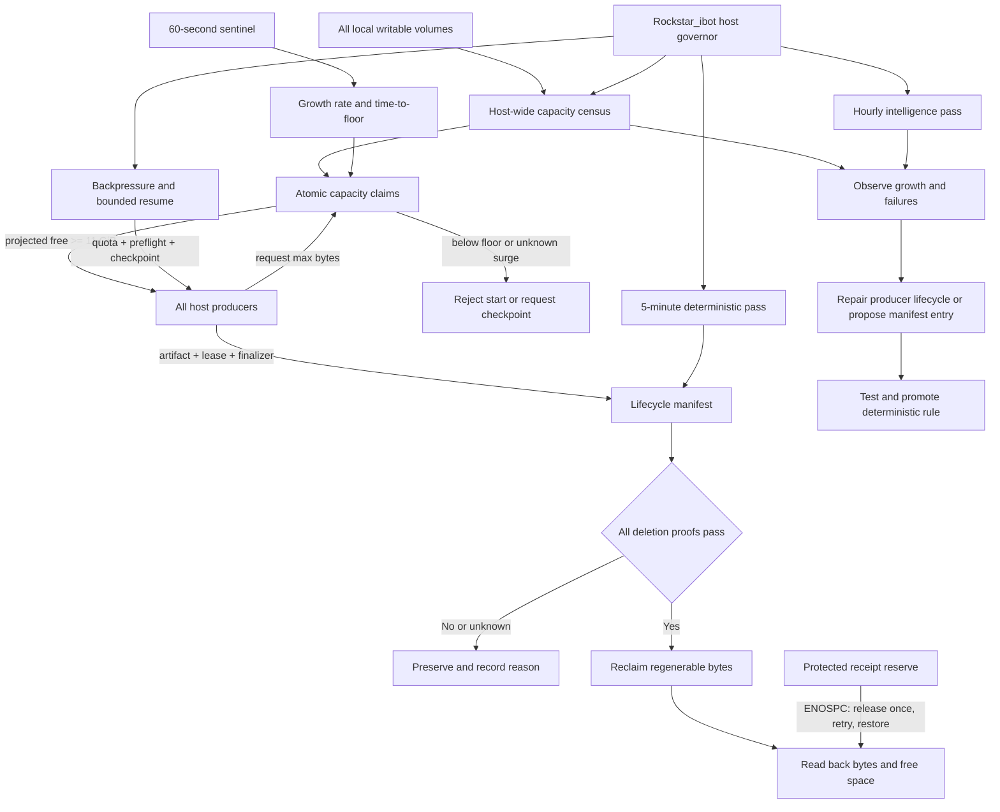

# Mac Host Storage Governor — Rockstar_ibot Disk Cleanup Loop 仕様

OSS公開名: **Rockstar_ibot Disk Cleanup Loop**
実行authority: **Mac Host Storage Governor**
公開skill: **`disk-cleanup`**

状態: Phase 1実装済み。Rockstar_ibot OSS skill、fail-closed governor、guard fallback、回帰テスト、旧cleanup ownerのcutover、正本5分labelのbootstrap/readback、MiB/GiB精度とswap telemetry、ULTRA時のexact-byte full-pass昇格、bootstrap health failureのcleanup内receipt契約、141/153隔離fixture、stale app-serverのsession-owner分離、browser producer lifecycle、Gig/Writer共通producer preflight、Paid/Storefrontのin-flight effect gate/checkpoint、Writer provider-start gate、ULTRA receipt reserve/retryは反映済み。supervisor non-stop/pause-resume契約、host-wide census、hourly intelligence、Writerのin-flight drainを含む全producer backpressure、atomic capacity claims、rapid-growth predictor、unknown-growth containment、24時間/7日観測は未完了。UID 501/GUI bootstrapと`ai.anicca.rockstar_ibot-disk-cleanup`のload readbackは復旧済み。

## 現行実装状況とOSS境界

この仕様は設計だけでなく、現在の実装と未完了のproduction workを追跡する。

| 領域 | 現在の状態 | 一次証拠 |
|---|---|---|
| OSS skill | 実装済み | `skills/self/disk-cleanup/disk_cleanup.py`、`SKILL.md`、`tests/`、`install-launchd.sh`、`launchd/*.plist` |
| fail-closed deletion | 部分実装 | protected root、unknown class、unproved candidate、active lease、symlink、open-path、probe errorをpreserveする実装と12件のRockstar_ibot unit test。versioned manifest、owner必須、remote rebuild proofの統合契約は未完了 |
| clone coverage | 実装済み | Chrome (`com.google.Chrome.code_sign_clone`) と Chromium (`org.chromium.Chromium.code_sign_clone`) の両collectionをallow-list discovery |
| cadence | 部分実装 | OSS plistは`StartInterval=300`。通常passはbounded fast pass、`cleanup-full-pass.at`の1時間マーカー（または互換の`EMERGENCY_GUARD_FULL_PASS=1`）がbounded full cleanupを発火する。Data volumeの空きがexact-byteで3GiB未満なら、fresh markerでもそのpassをfullへ昇格し、worktree starvationを防ぐ。critical full pass後は5分cooldownで逐次full-pass stormを抑制し、hourly/explicit fullも同じcooldownを受ける。不正・未来のtimestamp receiptはdue扱い、cooldown設定が不正ならfullを許可せずfastへfail-closedし、critical markerを書けない場合もfastへfail-closedする。`ai.anicca.rockstar_ibot-disk-cleanup`は`gui/501`へbootstrap済みで、`StartInterval=300`、single lock、kickstart/readbackを実測。`com.anicca.emergency-disk-guard`と`com.anicca.disk-sentinel`は60秒fallback/観測として登録されている |
| runtime guard | 部分実装 | 通常の5分guardは`~/anicca-project/work`と`~/.openclaw/external`だけをbounded fast passし、host inventoryを毎回atomic writeする。Rockstar_ibotの`host-inventory-full.at`とfallbackの`cleanup-full-pass.at`を別々に管理し、各1時間 cadenceでfull census/cleanupを発火する。ULTRA時はfallback guardがexact-byte critical promotionを行い、`cleanup-critical-full-pass.at`の5分cooldown中はfast passへ戻る。hourly/explicit fullの失敗・timeout後も次回はfast passへ戻り、critical receipt書込み失敗もgig rootを追加しない。root size/unknown attributionは未完了 |
| ledger/receipt | 部分実装 | cleanup ledgerを32 MiBでrotateし、約282 MiBから56 KiB + gzip archiveへ縮小。bounded operational logとimmutable incident receiptの正式分離は未完了 |
| production recovery | 未完了 | 非リポジトリreceipt storm、3分超のworktree remote inspection、旧autopruneの無制限home `du` は封じた。旧autoprune/reclaim/janitorをbootout＋disableし、plistは`.disabled-20260821`へ可逆退避した。正本5分labelはload readback済み。2026-08-21T10:55Zのcritical readbackはfree約3.3GiB、swap使用約5.8GiB、`disk-pressure.block`/`disk-writers.stop`有効、cleanupは`evaluated=0/reclaimed=0/protected_deletions=0`だった。その後11GiB超・swap 0へ一時回復したが、OpenClaw/Codex/Chromium等の稼働中producerとhost-wide census gapが残り、24時間/7日観測は未開始。重要なCodex/OpenClaw sessionとVM swapfileは保持している |

### 2026-08-21 incident fix evidence

`/tmp/anicca-*` のソケット・ログ・一時ファイルをGit cloneとして扱っていたため、各passで
`not_a_git_repository` receiptが大量生成され、同時にworktreeのremote inspectionが長時間実行されて
cleanup passを占有していた。Anicca側はclone候補を実体のある`.git`ディレクトリに限定し、通常の5分
guardではworktree remote inspectionを`fast_pass_deferred`として保留する。Rockstar_ibotのlegacy hourly
shimは同じhost guardを呼び、guard側の`cleanup-full-pass.at`（または明示的な
`EMERGENCY_GUARD_FULL_PASS=1`）で保留処理を永続的に飢餓させない。

実測証拠はAnicca cleanup test **56 passed**、Rockstar_ibot disk-cleanup test **12 passed**、guardの
実E2E約9秒（`errors=0`、`protected_deletions=0`、lock残留なし、初回free約5.2 GiB）である。
その後のlive readbackではfree約2.2 GiB、tier=`ULTRA`、`reclaimed=0`、`preserved_reasons={"open":1}`
となった。openなChrome code-sign clone約706 MiBとActions Runner診断ログ約291 MiBは、実行中のため
削除しない。これはloopが常時稼働している証明ではない。guardのログは毎分更新される一方、
`launchctl print gui/501/ai.anicca.rockstar_ibot-disk-cleanup` と `com.anicca.emergency-disk-guard`
は障害時に`141: Reentrancy avoided`であった。現在は`dscl`のUID readbackと`launchctl print gui/501`が
復旧しているが、正式なcleanup labelのload readback、24時間、7日観測が残る。

### 2026-08-21 incident prevention evidence

同日後半の実測では、`cozempic.cli guard` が138件まで孤児化し、そのうち131件が6時間以上古いClaude
transcriptと1対1に対応していた。session UUID、transcript、親PID=1、6時間超のstale条件をすべて満たす
131件だけへTERMを送り、transcriptやsource、session stateは削除していない。unknownな3件は保存した。
guard総数は5件へ下がり、freeは約4.8 GiBへ戻った。

旧`ai.anicca.disk-autoprune`（毎時17分）は、0 GiB incidentの報告後に全homeの`du | sort | head`を
50分以上実行し続けていた。これはcleanup passを塞ぎ、容量警告を遅延させる直接原因だった。プロセスgroup
だけをTERMし、ファイルは削除していない。再起動時の再発を防ぐため、
`~/Library/LaunchAgents/ai.anicca.disk-autoprune.plist.disabled-20260821`へ退避した。
実行scriptが存在しない旧`ai.anicca.disk-reclaim.plist`も同じ方式で退避した。
さらに旧`disk-autoprune.sh`本体はバックアップを保持したまま、canonical emergency guardへ委譲する
compatibility shimへ置き換えた。旧無制限`du`とcache削除へ戻る実行経路は残していない。

Anicca側では、通常minute guardから巨大な`~/gig`を除外し、`cleanup-full-pass.at`のhourly
pass（互換の`EMERGENCY_GUARD_FULL_PASS=1`でも強制可能）だけが`~/gig`を走査するようにした。変更後の実測ログは`11:30:49 LOW DISK`、
`11:30:50 runtime manifest ready`で、従来の約3分16秒から約1秒へ短縮した。recovery health checkの
独自cache削除と重複日本語alertも廃止し、未接続だった`runtime/recovery-health-check.sh`も同じ観測専用
contractへ揃えた。容量変更とalertのauthorityをRockstar_ibotへ一本化した。回帰testは両sourceから旧日本語
alertと広範囲cache削除が消えていることを固定した。
ただしfreeはなお5.9 GiBで、現在の`gui/501`は復旧したものの、正本cleanup labelのload readbackは未達である。

### 2026-08-22 receipt ENOSPC incident — A-25で復旧

2026-08-22T06:37Zのcanonical passは、容量計測と保護判定を完了した後、
`last-receipt.json`のatomic replaceで`Errno 28 (ENOSPC)`になり、exit 1になった。これは削除判断の失敗ではなく、
最終receiptを書けないために1回の実行が失敗扱いになった障害である。

この障害をA-25で閉じた。state directoryに保護されたreceipt reserveを確保し、pre-commit ENOSPC時だけreserveを
解放して同じatomic writeを1回再試行し、成功後にreserveを再作成する。未知path、session、source、swap、重要stateは
削除しない。古いstderrのENOSPC行と`last exit code=1`はincident履歴として保持する。

2026-08-22T07:08Zのplanning readbackでは、Data volumeのavailableは`592,976 KiB`から
`139,808 KiB`まで低下し、swapは`6,048 MiB`使用、tierは`ULTRA`だった。canonical labelは
`gui/501`に登録済み、`StartInterval=300`、`runs=66`、直近`last exit code=0`で、
`last-receipt.json`も07:08Zに更新されている。ただしreserve fileは未実装であり、このexit 0は
ENOSPC recovery contractのPASSではない。当初は容量圧力下でcloneを開始しなかったが、その後free 6.06 GiBを
確認して、合計約121 MiBに収まる4 repositoryだけを`/tmp/lm-cleanup-oss-research`へ固定commitで隔離cloneした。
Kubernetesとsystemdは巨大なためcloneせず、固定commitのproduction sourceとtestだけをGitHub APIで読んだ。

#### A-25 receipt reserve contract

A-25は通常のA-04以降より先に処理するcapacity-safety interruptである。既存の
`HostDiskGovernor._receipt()`だけを共通入口として使い、新しいdaemon、queue、database、cleanup ownerは
作らない。実装soft targetはproduction 1 file + test 1 file、100 LOC未満とする。

1. `state_dir/.receipt-reserve`を1 MiBの実割当済みregular file、mode `0600`として保持する。
   sparse `truncate`だけを成功扱いにせず、書込み、flush、`fsync`、`st_blocks * 512 >= 1 MiB`をread backする。
2. reserve pathは通常のinventory/reclaimer candidateへ絶対に入れない。解放authorityは
   `_receipt()`の`ENOSPC` recovery branchだけである。
3. receipt JSONは64 KiB以下へboundし、既存targetを保持したまま同一directoryのunique temporary fileへ
   mode `0600`で書く。temporaryをflush + file `fsync`してから`os.replace`し、commit後のparent-directory `fsync`は
   best-effortにする。replace前の失敗では旧targetを保持し、partial temporaryを必ず除去する。
4. temporary write、file `fsync`、または`os.replace`が`errno.ENOSPC`の時だけ、reserveがregular fileかつsymlinkで
   ないことを再検証してunlinkし、同じpayloadのatomic operation全体を1回だけ再実行する。他errnoはreserveを
   解放せずraiseする。directory `fsync`はreplace後なので、その失敗を未commitとしてretryしてはならない。
5. retry成功後にreserveを同じsize/modeで再作成してread backする。再作成できなければpassはexit 0にせず、
   次回のcontrol-plane write safetyが失われたことを明示する。
6. RED fixtureはwrite/file `fsync`/replaceの各pre-commit境界をparameterizeして最初の試行だけENOSPCにし、
   旧receiptがretry成功まで残ること、retryが1回、新receiptがvalid JSON/mode 0600、temporary file残留0、
   reserveが1 MiB/mode 0600/allocatedへ戻ることを検証する。他errnoとpost-commit directory `fsync`も
   reserveを消費しないことを最小regressionで固定する。
7. GREEN後は既存canonical labelだけを`bin/launchctl-safe kickstart`し、run count増加、新しい実機receipt、
   `last exit code=0`、reserve size/mode/allocation、protected deletion 0をread backする。人工的なproduction disk-fillは行わない。

#### A-45 persistent execution lock contract

2026-08-22T16:14Zのcanonical passはreceipt処理へ到達する前に、毎run作り直す
`.rockstar_ibot-disk-cleanup.lock` directoryの`mkdir`で`ENOSPC`となり、runs 172、last exit 1になった。
直前receiptはvalid JSON、mode `0600`、receipt reserveは1 MiB/mode `0600`/allocatedで、
`protected_deletions=0`だった。A-25はreceipt commitだけを保護するため、このpre-receipt lock allocationを救済しない。

A-45は新daemon、追加reserve、queue、databaseを作らず、既存single-owner lockだけをstdlibのpersistent
regular-file `flock`へ置き換えるcapacity-safety interruptである。production 1 file + test 1 file、約60 LOCを
soft targetとする。

1. lock pathはstate directory直下のregular file、non-symlink、mode `0600`とする。既存directory lockはactive/staleを
   問わず自動削除・移動せずfail closedにする。旧ownerが正常終了して自分のdirectoryを除去した後だけfile形式へ移る。
2. `os.open`したFDへ`LOCK_EX | LOCK_NB`を適用し、取得成功時だけFDをgovernor instanceがrun終了まで保持する。
   競合時はeffect 0で取得失敗を返し、別passを開始しない。
3. releaseは`LOCK_UN`とcloseだけを行い、lock fileをunlinkしない。次回は既存inodeを再利用し、ENOSPC時に
   directory/pid fileを新規作成しない。
4. symlink、directory、unexpected file type、open/`fchmod`/flock failureはfail closedにし、receipt reserveを消費しない。
5. RED fixtureは旧mkdir方式へENOSPCを注入してCLI exit 1を再現し、GREENではprecreated lock file下で同じ
   allocation failureでもsingle-owner取得、競合拒否、release後再取得、file継続、mode `0600`、reserve不変を証明する。
6. GREEN後は既存canonical labelだけを`bin/launchctl-safe kickstart`し、runs増加、state not running、last exit 0、
   fresh receipt、lock regular/non-symlink/0600、reserve 1 MiB/0600/allocated、protected deletion 0をread backする。

A-45のTDDは旧lock path `mkdir`へENOSPCを注入するfixture、content write/truncate禁止、single-owner競合、
release/reacquire、open/`fchmod`/flock failure、FD cleanup、reserve不変、symlink/unexpected type、全legacy directory
preserveを含むfocused **8 passed**、disk-cleanup full **46 passed**、compile、diff checkを通した。初回reviewは
legacy directory rename race、exact mkdir-ENOSPC fixture、`fchmod` gapを検出した。自動legacy migrationを全廃し、
新規fileだけ`O_CREAT|O_EXCL` + `fchmod(0600)`、既存fileは`O_NOFOLLOW` + `fstat`、所有権はcontentを書かない
nonblocking `flock`だけへ縮小した後、fresh re-reviewはBLOCKER/HIGH/MEDIUMなしで`ship`だった。code commitは
`b3c3ea385`である。

canonical labelを`bin/launchctl-safe` preflight PASS後にkickstartし、runs 176→177、state not running、last exit 0を
read backした。fresh receiptは2026-08-22T16:42:07Z、`errors=0/protected_deletions=0/reclaimed=0`、lockは
regular/non-symlink/mode `0600`、reserveは1,048,576 bytes/mode `0600`/2048 blocks、temporary residue 0だった。
lock size 6の既存PID文字列はpreliminary runのinode内容で、final runはwrite/truncateせずmtimeを変更していないため
曖昧なcleanupを行わず保持した。空き約300 MiB、tier `ULTRA`であり、A-45完了は11 GiB recoveryの証拠ではない。

A-25のTDDはdisk-cleanup **40 passed**、`py_compile`、shell/plist lint、`git diff --check`を通した。
write/file-fsync/replaceのENOSPC、他errno、2回目ENOSPC、sparse reserve、reserve再作成失敗、64 KiB bound、
temporary cleanup、fd ownershipをfixtureで反証し、fresh adversarial reviewはBLOCKER/HIGH/MEDIUMなしで`ship`だった。
canonical labelをpreflight後にkickstartし、`runs=80→81`、`state=not running`、`last exit code=0`をread backした。
新receiptは`observed_at=2026-08-22T08:21:25Z`、`errors=0`、`protected_deletions=0`、mode `0600`で、
reserveは1,048,576 bytes、mode `0600`、2048 blocks、孤児temporary file 0だった。人工的なdisk-fillは行っていない。

#### 2026-08-22 rapid saturation readback and prevention closure

OSS code study後のread-only計測では、Data volume freeが約5.60 GiBから約414 MiBまで短時間に低下し、
その後のreadbackでも`1,033,488 KiB`（約1009 MiB）だった。swapは`9,008 MiB`使用、canonical labelは
`StartInterval=300`、`runs=73`、`last exit code=0`である。直近receiptは
`free_before=1,120,423,936`、`free_after=1,061,883,904`、tier=`ULTRA`、`reclaimed=0`、
`protected_deletions=0`だった。`.receipt-reserve`は存在せず、`last-receipt.json`はmode `0644`だった。

この事象は、cleanup cadenceと新規producer preflightだけでは再発を防げないことを示す。Rockstar_ibot管理下の
producerには、次のcapacity firewallを共通入口とeffect直前の両方で適用する。

```text
projected_free = current_free
               - outstanding_capacity_claims
               - requested_max_allocation
               - max(observed_growth_rate, declared_growth_rate) * reaction_window
```

`projected_free < 11 GiB`なら新規claimをatomicに拒否する。claimはowner、PID、artifact、maximum bytes、expiry、
checkpointを持ち、同時起動するproducerが同じfree bytesを二重に予約できないようsingle lockで直列化する。
開始後もproducerはquota到達前またはprojected floor到達前に自分でcheckpoint/drainし、保護sessionを保持したまま
新規bulk writeを止める。Codex/OpenClaw/browser database、WAL、logなどprotected growthはcleanupが削除せず、
owner側のlossless rotation/checkpoint contractでbounded化する。

未登録application、OS update、APFS snapshotなどRockstar_ibotが開始を阻止できないwriterについて、絶対的な
「disk fullにならない」保証はしない。60秒sentinelがfree deltaとtime-to-floorを計算し、declared claimで説明できない
growthを検出した時点で全managed producerの新規claimを拒否し、既存producerへcheckpoint要求を出し、owner不明の
capacity incidentを通知する。unknown path、session、source、credential、database、swapは削除しない。

したがって完成時の保証は次の4つである。

1. managed producerは11 GiB recovery floorを割る新規allocationを開始しない。
2. in-flight managed producerはquota/projected floor前にcheckpointし、bulk writeを継続しない。
3. unmanaged/protected growthでも、cleanupはdataを壊さずmanaged loadを遮断し、control-plane receiptを書ける。
4. ENOSPCが発生してもA-25 reserveでreceiptを1回回復し、失敗を成功として隠さない。

### 2026-08-21 GUI bootstrap incident and recovery

このincidentの原因はcleanupによる削除ではない。障害中のcleanup receiptは
`evaluated=0`、`reclaimed=0`で、cleanupはpathを回収していない。`protected_deletions=0`であり、
cleanupがplistを変更した証拠もない。

障害中の一次観測は次の通りである。

| 観測 | 障害中 | 復旧後readback |
|---|---|---|
| Directory Service | `dscl . -read /Users/anicca ...` → `eServerError` | `UniqueID: 501`、`NFSHomeDirectory: /Users/anicca`、rc=0 |
| GUI bootstrap | `launchctl` → `141: Reentrancy avoided`（一部操作は153） | `launchctl print gui/501`成功。creator=`loginwindow` |
| cleanup authority | receiptはno-op | 正本labelは`gui/501`へ登録済み、5分間隔、last exit 0。emergency guardは60秒fallbackとして登録済み |
| disk effect | 回収なし | cleanup由来の削除なし。容量はproducerの書込みと他の状態に依存 |

根因は、GUIログインセッションから孤立した古いCodex app-serverが、UID 501のDirectory
Servicesとlaunchd bootstrap domainへの接続を保持したままになったことだった。stale app-serverだけを
終了し、正常なGUI配下へ再接続した後、UID解決と`launchctl print gui/501`が復旧した。これはcleanup
の削除経路ではなく、GUI/bootstrapセッションのhealth incidentである。

今後の必須契約は以下である。

1. cleanupまたはinstallerが`dscl`のUID解決、`launchctl print gui/501`、対象labelの存在をread backする。
2. `141`、`153`、UID解決失敗、またはbootstrap domain不在を検出した場合、cleanupは
   **削除、plist変更、bootstrap、restart、killを実行しない**。
3. そのpassは`gui-bootstrap-health-failure`として、error code、対象domain、label、直前のknown-good
   marker、`evaluated`、`reclaimed`をatomic receiptへ記録する。
4. health failureはdedupe通知し、既存の稼働中authorityを変更せず、復旧readbackが揃うまで
   cutoverを再試行しない。
5. stale app-serverの終了はcleanupの権限ではない。GUI/session ownerの復旧手順として別のrunbookで扱い、
   cleanupはその完了をreadbackするだけである。

このincidentで、cleanupが何も削除していないことと、cleanup labelがロードされていることは別の
命題である。2026-08-21 16:19 JSTに`ai.anicca.rockstar_ibot-disk-cleanup`の`gui/501` load readbackを
取得し、5分authorityの稼働を確認した。`com.anicca.emergency-disk-guard`の登録・実行は引き続きfallbackの
証拠であり、正本labelの代替ではない。

### 2026-08-21 0GB表示 / swap pressure incident

`df -k`のData/VM共有APFS poolは、警告時にavailable=`552288` KiB（約`539.3MiB`）まで低下していた。
従来のsentinel/guardは`FREE_KB / 1048576`を整数表示していたため、実値が0GiB未満のとき通知が
`0GB`になった。これは表示だけの誤報ではなく、APFS containerのfree約1.1GB、VM volumeのswap使用
約15.3–16.3GiB/16.9GiBと一致する実容量圧力だった。

修正後はsentinelとguardがMiB/GiB精度のfree label、`vm.swapusage`、`free_before/after`を同じreceiptへ
記録する。`~/.codex`の約8.2GB増加はgrowth alertとして観測するが、session/transcript/stateを永久保護し、
現行app-serverがDB/WAL/HTTPS接続を開いているためkill・削除しない。manifestにない未知rootは回収せず、
`evaluated=0/reclaimed=0/protected_deletions=0`をfailureとして残し、stop flag/backpressureを維持する。

同日の監査で、旧manifestに誤って登録されていた`~/.codex/.tmp`がquarantine不在時のdirect-remove経路で
64,398,907 bytes回収されたreceiptを確認した。これはsession DB/WALではないが、`~/.codex/**`永久保護契約に
反するため、Anicca cleanup controlは保護token配下の非protected classをmanifest検証時に拒否し、該当entryを
manifestから除去した。回帰testで`.codex/.tmp`の再登録をfail-closedに固定し、以後この経路は実行不可である。

### 2026-08-21 bounded host census and safe reclaim evidence

Rockstar_ibot governorは`host-inventory.json`を毎pass atomic writeする。実機のfast readbackはmount
9件、root 23件、coverage gap 15件を記録し、unknown sizeを削除候補へ昇格させなかった。
fallback passは`host-inventory-full.at`を使い、launchd user domain障害中も1時間ごとにfull censusを発火する。
隔離stateでのfull readbackは約60秒、mode=`full`、mount 9件、root 23件、gap 11件だった。
production fallbackのfull receipt（2026-08-21T09:21:29Z）はgap 10件、preserved 6件、
protected deletion 0件だった。productionの追加managed-home familyは次回full marker更新後に反映される。
probe boundを10秒（`/opt/homebrew`は30秒）へ拡張した隔離full readbackは62.6秒、gap 4件まで減少した。
残りはLibraryのTCC、system tempのpermission、`.Trash`のOS保護領域で、`permission-limited`/
`size-permission-partial`として既知ownerへ分類し、削除候補には昇格しない。
fast inventoryのowner coverage readbackはrequired 12 family / present 12 / missing 0だった。
full inventoryには90秒のglobal probe budgetを置き、個別timeoutの合計がouter 120秒を超えて
full marker更新を飢餓させない。budget枯渇は`size-budget-exhausted`として保存する。
governor全体にも90秒budgetを置き、最大15秒のlsof probeと削除/receipt用30秒余白を含めて
inventoryへ残り時間だけを渡す。probe budget枯渇時は候補をpreserveし、lsof後・bytes計測前にもdeadlineを再確認する。残予算0なら
`df`/`du`を開始せず、full markerを進めず次回へ再試行する。

A-04のfresh canonical full passは2026-08-22T08:30:14Zに`runs=81→82`、`last exit code=0`で完了した。
`host-inventory-full.json`はinventory mode `full`、file mode `0600`、root 23、SHA self-check一致、
`coverage.gaps`の`size-deferred` 0だった。receiptは`errors=0`、`protected_deletions=0`である。
残るgap 11件は`size-timeout` 8、`size-permission-partial` 2、`child-limit` 1であり、A-04の延期解消と
区別してA-05/A-10で追跡する。fresh adversarial reviewはA-04を`ship`とし、production/test変更は不要と判定した。
同reviewでclosedな旧`.host-inventory.*` temporary 1件も観測したため、曖昧な削除は行わずA-10へ回帰契約を登録する。

A-05はinventoryに`permission_owner_receipts`を追加し、TCC、`.Trash`、`/private/tmp`、
`/private/var/folders`のexact path、owner family、exists/symlink/access、`reclaim_eligible=false`を保存する。
子名は列挙・保存せず、既存root 23件と削除candidate生成は変更しない。fixtureはRED 1 failedからGREENへ進み、
disk-cleanup regression **41 passed**、compile/diff check PASS、fresh adversarial reviewは`ship`だった。
2026-08-22T08:44:06Zのcanonical full inventoryはruns 83→85（定期wakeとの重複で2増加）、last exit 0、
file mode `0600`、SHA一致、exact owner receipt 4件、全件non-reclaimable、root 23だった。
同じ実行contextでは4境界とも`readable`であり、interactive contextでTCC/`.Trash`が`permission-error`だった差は
実行主体の権限差としてそのまま観測する。full receiptの`errors=0`、`protected_deletions=0`をread backした後、
次のscheduled fast passが`last-receipt.json`を08:45:15Zに更新したが、full inventory artifactは別fileで保持している。

A-06はmount rootへの`os.access(W_OK)`をvolumeのrw判定に使わず、macOS `/sbin/mount`のdevice-backed、
`local`、非`read-only` metadataと`df` inventoryを照合する。各mountへlocal/writable/optionsを保存し、
coverageへlocal writable mountのexact list/count/missingを保存する。metadata timeout、空、部分欠落では
3 coverage値を`null`にして明示gapを残し、missing 0を偽装しない。full passではdf後にdeadlineを再計算し、
mount probeへ残時間だけを渡す。REDはmetadata timeout、Data metadata部分欠落、残時間二重消費を再現し、
disk-cleanup regression **48 passed**、compile/diff check PASSとなった。初回reviewのHIGH/MEDIUMを修正後、
fresh adversarial re-reviewはBLOCKER/HIGH/MEDIUMなしで`ship`だった。
final sourceによる2026-08-22T09:08:04Z canonical fast passはruns 89→90、last exit 0、mount 9、
local writable device volume 7、Data含有、sealed `/`はread-only、missing 0、mount metadata gap 0、
file mode `0600`、SHA一致、`errors=0`、`protected_deletions=0`をread backした。

A-07の初回fixtureはprotected file自身だけを`sweep()`へ渡していたため、実allowlisted parentの内側にある
`.git`、DB、state JSONL、credential、sourceを`rmtree`できるHIGH gapをadversarial reviewが再現した。
削除前のbounded descendant scanを共通effect pathへ追加し、protected root/pair、memory/source、source/secret suffix、
auth/cookie/credential/session/transcript/ledger/payment/publication receiptを検出したら親全体をpreserveする。
scan error、nested symlink、budget exhaustionもfail-closedにし、`_bytes()`後・effect直前に同じscanを再実行する。
独立16 allowlisted candidateとsafe siblingを使うfixture、および`_bytes()`中に`.env`が追加される競合fixtureは
RED 2 failedからGREENとなり、protected parent 16件を保持しつつsafe siblingだけを回収した。
disk-cleanup regression **50 passed**、compile/diff check PASS、2回のfix-first後のfresh reviewは`ship`だった。
final canonical receiptは2026-08-22T09:28:22Z、runs 93→94、last exit 0、`errors=0`、
`protected_deletions=0`、`reclaimed=0`、mode `0600`である。

A-08では正本schemaの`lease: {path,max_age_seconds}`を現行`Path(item["lease"])`へ渡すと
`TypeError`になりreceiptなしで終了すること、容量計測中にleaseが開始するとartifactを削除することを
それぞれREDで再現した。既存string形式との互換を保つ1つのlease probeを追加し、開始時とeffect直前に
同じ判定を行う。fresh reviewはPython 3.14の`Path.exists()`がpermission等の`OSError`をFalseへ畳む
HIGHを発見したため、`stat()`成功だけをactive、`FileNotFoundError`だけをinactive、その他のschema/probe
errorをactiveとしてpreserveするfail-closed分岐へ修正した。2 focused fixtureと全 **52 tests**、compile、
diff checkはPASSし、re-reviewは`ship`だった。final canonical runは2026-08-22T09:47:31Z、
runs 97→98、last exit 0、`errors=0`、`protected_deletions=0`、`reclaimed=0`である。

A-09では初回`lsof=confirmed-closed`の後、effect境界でpathが`open`へ変わってもcandidateを
削除することをREDで再現した。既存lsof probeをprotected descendant再検査後・final lease check前に
もう一度実行し、timeout budget、probe error accounting、fail-closed preserveを同じ契約で維持する。
初回fixtureはlease path不在をexpiredと呼んでいたためreviewがMatrix 5未証明を指摘し、実在leaseのmtimeを
期限切れにして`max_age_seconds`判定を通るfixtureへ修正した。さらにNaN TTLが比較をすり抜けるHIGHを
parametrized REDで再現し、non-finite、非正数、schema error、clock skewをactiveとしてpreserveする。
実macOSのopen file descriptorでもproduction `_default_lsof()`は`open`を返した。全 **54 tests**、compile、
diff checkはPASSし、2回のfix-first後のre-reviewは`ship`だった。final canonical runは
2026-08-22T10:07:40Z、runs 101→102、last exit 0、receipt mode `0600`、`errors=0`、
`protected_deletions=0`、`reclaimed=0`である。

A-10では`lsof` probe errorがcandidateを保持し`errors=1`になるfixtureと、`du` timeoutが
`size_bytes=null`、`measurement=timeout`、gap、`owner_family`を同時に保持するfixtureを追加した。
host inventoryのatomic replace failureは旧targetを保持する一方、旧closed orphanと自分のpartial temporaryを
残すREDを再現した。writerは90秒budgetより古いregular orphanだけを事前除去し、symlink、新しいfile、
stat errorはpreserveする。unique sibling temporaryをflush + file `fsync`後に`os.replace`し、全failure pathで
自分のtemporaryをfinally除去する。全 **57 tests**、両production moduleのcompile、diff checkはPASSし、
fresh reviewは`ship`だった。production full artifactは`/Users/anicca/Projects`を`repository-worktree`、
`/opt/homebrew`を`build-tool`としてtimeout/unknown sizeへ帰属し、SHA一致、mode `0600`である。
final canonical runは2026-08-22T10:23:14Z、runs 104→105、last exit 0、receipt mode `0600`、
`errors=0`、`protected_deletions=0`、`reclaimed=0`、`.host-inventory.*` orphan 0である。
Anicca cleanup controlのgit/lsof/du probeにも15秒timeoutを設定し、さらにguard外側のgovernor、
runtime-manifest、sweep subprocessにも120秒（kill-after 10秒）のtimeoutを設定した。timeoutは
error/preserveとして扱い、runtime-manifest失敗時はhourly markerを進めない。これによりfull passの
probeが無期限にguard lockを占有しない。

A-11ではcanonical host adapterのreclaimerをproduction変更せず、local bare remote、primary repository、
linked worktreeを実際に作るcharacterization fixtureを追加した。tracked dirty worktreeは
`dirty_worktree`、remoteへ未pushのclean commitは`head_not_on_remote`として、worktree残存、removed 0、
ledger reasonを同時に検証する。host adapter全 **28 tests**、Rockstar_ibot全 **57 tests**、compile、
diff checkはPASSし、fresh reviewは`ship`、BLOCKER/HIGH/MEDIUMなしだった。live ledgerでも実在する
dirty/head-not-on-remote worktreeをpreserveしている。canonical runはruns 106→107、last exit 0、receipt mode
`0600`、`protected_deletions=0`である。このrunの`errors=1`は`/Users/anicca/gig/evidence`のsize probeを
読めず`managed_reclaimer_size_unreadable`としてpreserveしたfail-closed eventであり、削除成功やclean runとは
扱わない。reviewのLOWとしてMatrix 9のtest名に名称driftがあるが、既存testの意味上のcoverageは存在する。

A-12では実allowlist形状の`cfo-*` pathに未知classを与え、productionのclass gateがallowlist、`lsof`、
size probe、削除より前にcandidateをpreserveするfixtureをMatrix 11の正本名で追加した。path残存、
`reclaimed=0`、receiptの`unknown_class`、`protected_deletions=0`をread backし、`lsof`を呼ぶと失敗する
fixtureでprobe前拒否も固定する。[NIST Deny by Default](https://csrc.nist.gov/glossary/term/deny_by_default)の
「明示許可以外をblockする」原則と、[OWASP Input Validation](https://cheatsheetseries.owasp.org/cheatsheets/Input_Validation_Cheat_Sheet.html)の
allowlist validation推奨に従い、
既知classだけへ削除authorityを与える。productionはすでにこの順序だったため人工的なREDやcode変更は
追加しない。Rockstar_ibot全 **58 tests**、canonical host adapter全 **28 tests**、compile、diff checkはPASSし、
fresh reviewは`ship`、重大・中程度の指摘なしだった。reviewのLOWは`protected_deletions`が0初期化される
自己申告counterである点だが、本fixtureはcandidate残存を独立に検証する。final canonical readbackは
runs 107→109、state not running、active count 0、last exit 0、2026-08-22T10:47:14Z receipt、mode `0600`、`errors=0`、
`protected_deletions=0`、`reclaimed=0`である。

A-13では`launchctl print`の実production health probeへreturn code 141/153をparameterizeして注入し、
両方を`launchctl-141`/`launchctl-153`へ正規化した`gui-bootstrap-health-failure` receiptを保存する。
Directory ServicesのUID/home readbackは成功させ、対象domainとlabelを固定した。inventory、discovery、
`lsof`は呼ばれたら失敗するguardで不実行を証明し、candidate残存、`evaluated=0`、`reclaimed=0`、
`errors=1`、`protected_deletions=0`をresultとatomic receiptの両方からread backする。初回reviewで
discovery stubが「不実行」を証明していないと指摘され、例外guardへ修正後の再reviewは`ship`、
ブロッキング所見なしだった。production behaviorは既に正しく、test以外の変更はない。Rockstar_ibot全
**59 tests**、canonical host adapter全 **28 tests**、compile、diff checkはPASSした。正常GUIへの復旧readbackは
canonical runs 109→110、state not running、last exit 0、2026-08-22T10:52:48Z full receipt、mode `0600`、
`errors=0`、`protected_deletions=0`、`reclaimed=0`である。実GUI domainを故障させる操作は行っていない。

A-14ではhealth failure receiptへversioned session separation contractを追加し、stale app-serverの
authorityを`gui-session-owner`、cleanup actionを`observe-only`、`process_kill_authority=false`、復旧条件を
UID・GUI domain・canonical labelのreadbackと明記した。通常passとcanaryは同じchecked health probeと
receipt policyを使用する。初回reviewはcanaryだけprobe例外を送出してreceiptを失うHIGHを検出したため、
共有exception normalizationとcanary regressionをRED→GREENで実装した。両failure pathは`os.kill`が
呼ばれたら失敗するguardを通り、candidate残存、reclaimed/protected deletion 0、atomic receiptを検証する。
`os.kill(pid, 0)`はcleanup lock ownerのliveness probeでありtermination signalではない。
[Apple launchd.plist](https://github.com/apple-oss-distributions/launchd/blob/main/man/launchd.plist.5)の
「plist値ではcurrent stateを証明せずlaunchdへqueryする」契約どおり、external recovery前のlabel missingを
failureに保ち、復旧後もexact canonical labelを再queryして初めてokとするMatrix 29 fixtureを追加した。
fix後のfresh re-reviewは`ship`、blocking findingなし。Rockstar_ibot全 **61 tests**、canonical host adapter全
**28 tests**、compile、diff checkはPASSした。final canonical readbackはruns 112→113、state not running、
last exit 0、2026-08-22T11:08:46Z receipt、mode `0600`、`errors=0`、`protected_deletions=0`、
`reclaimed=0`である。実app-server/sessionへのsignalは行っていない。

A-15ではbrowser producer lifecycleをstatic 6件とdynamic code-sign cloneへ登録した。`~/.cloak`は
identity、`~/.cloakbrowser`はruntimeとしていずれも`preserve`し、profile、cookie、credential、実行binaryへ
削除authorityを与えない。Playwright、Camoufox、Chrome model、Google Updater cacheだけを
`regenerable_output`とし、quotaは0、Playwright leaseは300秒、他leaseはnullのdefer状態をexact testで固定した。
[Chromium User Data Directory](https://chromium.googlesource.com/chromium/src/+/main/docs/user_data_dir.md)が
profileにhistory、bookmark、cookie等を保持し、Macのcache pathをuser data pathから分離する契約、および
[Playwright Browsers](https://playwright.dev/docs/browsers)がbrowser binaryを既定で`~/Library/Caches/ms-playwright`へ
配置し再installできる契約に従う。

初回fresh reviewはHIGHとして、`org.chromium.Chromium.code_sign_clone`が実producerではなくGoogle Chromeを
regeneration proofに使う別製品proof混同を検出した。Chrome/Chromium collectionへ別proofを要求し、Chromiumは
`~/.cloakbrowser/chromium-*/Chromium.app/Contents/MacOS/Chromium`がexactly 1件のregular non-symlink fileの時だけ
登録する。0件・複数件・symlinkはfail-closedで登録しない。REDはguard既存test 8件を失敗させ、Bash 3.2の
`set -u`空配列も修正後、focused **44 passed**、exact lifecycle test **4 passed**、compile、shell syntax、
diff checkがPASSした。fresh re-reviewは`ship`、重大所見なし。external host adapter commitは`6eb344cfb`である。
live fallback source SHA一致後のruntime manifestはmode `0600`、browser static 6件、Chromium dynamic clone 9件、
全dynamic proofが実producer binaryへ一致した。final canonical readbackはruns 118→120、state not running、
last exit 0、2026-08-22T11:46:10Z receipt、mode `0600`、`errors=0`、`protected_deletions=0`、
`evaluated=9/preserved open=9/reclaimed=0`である。実行中browser sessionとcloneは削除していない。

A-16ではbuild/media producer lifecycleを登録した。Xcode DerivedDataは`runtime`、Xcode Archivesと
`~/.openclaw/workspace/runs`は`deliverable`、dynamic repository buildは`repository-build/runtime`、
publication receiptの4 fieldを満たすrunのexact `reel-final.mp4`は`reelclaw-media/deliverable`として
owner、class、quota 0、300秒lease pathをruntime manifestへ保存する。Archives、run root、meta、source、
videoを削除対象にせず、全新規entryのfinalizerは`preserve`で削除authorityを0に固定した。declared leaseの
writer/heartbeatはまだ接続されておらず、現時点では運用保護を追加しない。A-20のproducer preflightとA-36の
heartbeat/drainが実装・実測されるまで削除をenableしない。

[Apple Xcode debugging information](https://developer.apple.com/documentation/xcode/building-your-app-to-include-debugging-information)の
配布build archiveを保持する契約、[Cargo build cache](https://doc.rust-lang.org/cargo/reference/build-cache.html)の
`target`がbuild output/cacheである契約、[Next.js deployment](https://nextjs.org/learn/pages-router/deploying-nextjs-app-other-hosting-options)の
`.next`が`next build` outputである契約を採用した。初回reviewは、writerのないleaseに削除authorityを与えるHIGHと
path-based unlinkのsymlink raceを検出したため、Ponytailでregistration-onlyへ縮小した。focused **48 tests**、
JSON/diff check、primary **37+11 tests**がPASSし、final fresh reviewは`ship`、blocking findingなし。
external host adapter commitは`62bd6b023`である。live fallback runs 474→475はruntime manifestをmode `0600`で
更新し、static 3件をexact readbackした後、回収可能候補0・reserve未回復を正しくexit 3で報告した。実機59 run、
59 videoはpublication receipt 0件のため全保持し、Xcode Archives約29 MiBも保持した。final canonical readbackは
runs 129→130、state not running、last exit 0、2026-08-22T12:38:02Z receipt、mode `0600`、`errors=0`、
`protected_deletions=0`、`evaluated=9/reclaimed=0`である。観測中に空きは約5.7 GiBから3.6 GiBへ低下した。
これはA-16が登録だけで回収を有効化していないこと、およびproducer増加が継続していることの実測であり、
11 GiB reserve回復の証拠ではない。

A-17ではVM/package producer lifecycleをregistration-onlyで登録した。static 16件はClaude VM bundle、
Colima runtime/cache、Docker Desktop runtime、uv/pip/npm/pnpm以外のpackage root、Cargo build/registry、
Go module cache、Ruby gem、Bun、Homebrew、pipx、CocoaPods、SwiftPMをowner別の`runtime`として持ち、
quota 0、300秒lease、`preserve`へ統一した。dynamic pnpm storeはproducer binaryがabsolute regular
non-symlink、leaseがabsolute、version directory名がexact `v[0-9]+`かつregular non-symlinkの時だけ
登録する。A-21のpreflightとA-36のlease writer/heartbeatが未接続なので、declared lease自体はまだ
active保護を追加せず、全A-17 entryの削除authorityは0である。

[Colima FAQ](https://github.com/abiosoft/colima/blob/main/docs/FAQ.md)が`COLIMA_HOME`をconfiguration directory、
VM内`fstrim`を手動disk recoveryと定義する契約、[Docker Desktop resources](https://docs.docker.com/desktop/settings-and-maintenance/settings/#resources)が
container/imageをLinux VM disk imageへ保持しdisk usage limit/locationをowner設定とする契約、
[pnpm store](https://pnpm.io/cli/store)がunreferenced packageの判定・prune・必要時再downloadをpnpm自身の
mark-and-sweepへ委ねる契約を採用した。このためcleanupがVM diskやpackage treeをpath-basedで直接消さない。

TDDはstatic/dynamic contract不足でRED、malformed pnpm名とlogical HOME lease配線でも別REDを取得し、
focused **48 tests**、JSON、Python compile、shell syntax、diff checkがPASSした。fresh reviewはGo module
約512 MiBとpipx約1.4 GiBの未登録をblockerとして検出し、current-host censusからRuby/Bun/Homebrew/
CocoaPods/SwiftPMまで登録後のfinal reviewは`ship`、blocking findingなし。external host adapter commitは
`ba2814739`、deployed fallback source SHA-256は`dcbbc80ddadbf4d7776e9f0e9c500adb36227d17b7c7fff5d07dc329e5feeb82`
でcanonical sourceと一致した。fallback runs 486→487はmode `0600` runtime manifestでstatic 16件、bad 0、
pnpm store実体なしのためdynamic 0をread backし、安全候補0・reserve未回復をexit 3で報告した。
final canonical readbackはruns 137→138、state not running、last exit 0、2026-08-22T13:19:09Z receipt、
mode `0600`、`errors=0`、`protected_deletions=0`、`evaluated=9/reclaimed=0`である。
観測中の空きは一時116 MiBまで低下しcleanup ledger appendもENOSPCになった後、約4.7 GiBへ戻ったが、
cleanupによる回復ではない。A-17はVM/package誤削除を防ぐ証拠であり、11 GiB floor回復、A-26のbounded
ops ledger、A-36のproducer drain完了の証拠ではない。

A-18ではGig project lifecycleをregistration-onlyで登録した。`~/gig/projects`直下のexact
`[1-9][0-9]*`かつregular non-symlink directoryだけを対象とし、ownerはregular non-symlink
`state.json`のsafe adapterだけを採用する。terminalは`state.json`、取引状態、年齢から推測せず、exact schemaの
regular non-symlink `project-terminal.json`だけを受理する。全project artifactは`deliverable`、TTL null、
quota 0、300秒lease、`preserve`に固定し、A-24まで削除authorityは0である。

TDDは`--gig-project-root`未実装とguard未配線でRED、focused **49 tests**、Python compile、shell syntax、
diff checkがPASSし、fresh adversarial reviewは`ship`、blocking findingなし。external host adapter commitは
`a2e991293`、deployed fallback source SHA-256は
`a49e2ed6ba477194ad1c221bb3b0081b03efd96f9aed62ed754ad9558497aae2`でcanonical sourceと一致した。
fallback runs 507→508はruntime manifestをmode `0600`で更新し、numeric project 24件、terminal true 0、
unknown owner 3、preserve違反0、削除0をexact readbackした。final canonical readbackはruns 142→143、
state not running、last exit 0、2026-08-22T13:44:46Z receipt、mode `0600`、`errors=0`、
`protected_deletions=0`、`evaluated=9/reclaimed=0`である。直前runはentrypointの一時的なEACCESでexit 2だったが、
同じentrypointのreadback復旧後runでexit 0を確認した。空きは約2.8 GiB、swap使用は約10.9 GiBでULTRAのままであり、
A-18はGig project誤削除を防ぐ証拠であって11 GiB floor回復の証拠ではない。

A-19ではWriterのforeground providerだけへ既存`bounded-exec.py`のprocess-group境界を再利用し、
`disk-writers.stop`または`disk-pressure.block`が存在する時のin-flight drainを接続した。provider起動前にも
同じexact 2 pathを確認してeffectを開始せずRC 143を返す。起動後にflagまたはSIGTERMを受けた時はprocess
groupへTERM、1秒のgrace、残存groupへKILL、全child reapの順で閉じ、SIGINTは130、timeoutは124、通常終了は
child RCを維持する。既存generation stateのimmutable run/prompt hash、interrupted archive、resume decisionを
そのまま使い、同一run/promptから再開しpublication state/ledgerを更新しない。

この境界は[Python subprocess](https://docs.python.org/3/library/subprocess.html)の`start_new_session`、
[Kubernetes Pod lifecycle](https://kubernetes.io/docs/concepts/workloads/pods/pod-lifecycle/)のTERM後grace、
[systemd.kill](https://www.freedesktop.org/software/systemd/man/latest/systemd.kill.html)のchild escapeを防ぐ
control-group terminationを採用した。REDはstop flag下でproviderがtimeoutまで残ること、leader終了後も
TERM-ignore descendantが残ること、Writer launchdのdisk floorが未固定であることを再現した。修正後はready
同期したreal-process fixtureを含むfocused **44 passed**、compile、shell syntax、JSON、diff checkがPASSした。
fresh reviewはpre-Popen raceとorphan descendant、fixture同期不足を検出し、全修正後のfinal verdictは`ship`である。
code commitsは`ce112513d`と`43074f764`、deployed immutable releaseは
`43074f76422d1ec4935acdba98e553cb8564de94`である。

production Writer dailyは初回にinherited `GIG_DISK_HEADROOM_KIB=0`を検出してexit 1したため、Writer 14 jobsへ
exact `524288` KiBをexplicit environmentとして固定した。再deploy後はruns 1、last exit 0、free
5,179,191,296 bytesのpreflightを通過し、publication owner identity unavailableでprovider起動前に安全停止した。
したがって実provider interruptionはisolated real-process E2E、productionはdeployとprovider effect 0の証拠であり、
live providerを強制中断した証拠ではない。final canonical cleanupはruns 149→150、state not running、last exit 0、
2026-08-22T14:20:23Z receipt、`errors=0`、`protected_deletions=0`、`evaluated=9/preserved=9/reclaimed=0`である。
空き約4.9 GiB、swap使用約10.38 GiBで、A-19はA-36の全producer heartbeat/drainや11 GiB回復の証拠ではない。

A-20の第1 sliceでは、既存`gig_disk_guard.py`をGig browserの次回自然起動とRockstar_ibot self-buildの
dependency/effect 2境界へ接続し、Writer mediaはA-19で既に同じstop pathとprovider境界にあることを回帰testで
固定した。稼働中Gig browserのloaded argvは`/bin/bash .../current/.../launch_gig_browser.sh`であるため、guardを
script内部のprofile作成・Chromium探索より前へ置いた。これによりplist reloadでPID 787のauthenticated sessionを
evictせず、immutable `current` release更新後の次回自然起動からguardへ到達する。browser/self-buildはfloor
536,870,912 bytes、canonical `~/.openclaw/state`、canonical measurement rootをdotenv・inherited environmentより
後で固定し、ignore flagとalternate state pathを解除する。

TDDは初回3 failures、adversarial review後のhost-path bypass/deferred loaded argv契約で追加7 failuresを取得した。
両stop flag、floor 0、hostile dotenv/inherited paths、guard call count、profile/Chromium effect 0、receipt reasonを含む
focused **24 passed**、Paid隣接込み **33 passed**、shell syntax、JSON、compile、diff checkがPASSした。fresh reviewは
loaded argv cutoverとpath overrideのHIGH、KeepAlive retryとfixtureのMEDIUMを検出し、内部guard化とfixture強化後の
final verdictは`ship`である。code commitは`dd3e45b5f`、deployed releaseは
`dd3e45b5f9b198d1893d3dd1c17e4e654f853a1c`、source/runtime browser script SHA-256一致である。production
preflightはRC 1、`reason=disk_writers_stop/effect=0/required_bytes=536870912`、browser PID 787→787をread backした。

ただしA-20は未完了である。実機のactive browser producer 8 labels中、このsliceでnext-start consumerを証明したのは
Gig browser 1件だけで、affiliate 3、job-search 2、provision 2の計7件が未接続である。build/mediaもこのsliceでは
self-buildとWriter mediaだけで、host-wide arbitrary Xcode/media producer coverageを証明していない。canonical cleanup
runsは159→160、2026-08-22T15:12:10Z receiptは`errors=0/protected_deletions=0/evaluated=9/preserved=9/reclaimed=0`、
free 1,173,725,184→1,217,122,304 bytesだったが、launchdは`spawn scheduled`のため新しいlast-exit readbackは未取得である。
Data volume空き約1.1 GiB、swap使用約12.9 GiBで、consumer missing 0と11 GiB recoveryの証拠ではない。

A-20の第2 sliceでは、稼働Affiliate release `9696f23cd`の直系lineageへ3 browser共通entrypointの内部guardを
移植した。passwd由来home、固定512 MiB floor、canonical host/lane state、`python3 -I`を使い、ignore flagと
alternate state環境変数を除去する。guard、port検証、遅延CloakBrowser importの順に通すため、profile作成とbrowser
effectより前にfail closedする。release installerはguardをrelease作成前にregular/non-symlink/readableかつcompile可能と
検証し、SHA-256とexternal dependencyをreceiptへ保存する。既存6 launchd owner、Impact/source/composition plist、
`ensure_agent` non-reload動作は維持した。

live-lineage focused testは**11 passed**（canonical guard欠落専用1 skip）、compile、shell syntax、diff checkがPASSし、
fresh adversarial reviewはBLOCKER/HIGH/MEDIUMなしで`ship`だった。code commitは`3a6b38ac5`。release-only atomic swap後の
`affiliate/current`は`3a6b38ac5e78e8e2eef9c96633ff7517c08579e3`を指し、browser PIDは3119/3112/801で全件不変だった。
実機stop flag preflightはRC 1、`reason=disk_writers_stop/effect=0/readback=0/required_bytes=536870912`で、3 PIDは再度
不変だった。したがってAffiliate 3件はnext-natural-start consumerを持つ。残るbrowser consumerはjob-search 2件と
provision 2件の計4件である。空きは約186 MiBまで低下し、canonical cleanupはruns 170→171へ進んだが
`minimum runtime=300`の再spawn待ちで`state=spawn scheduled`、新last-exitは未取得である。直近16:04Z receiptは
`errors=0/protected_deletions=0/reclaimed=0/preserved_reasons={"open":9}`で、A-20完了や11 GiB recoveryの証拠ではない。

A-20の第3 sliceでは、dynamic port provisioning browserのcallerとchildへ同じpreflightを接続した。初回実装は
port `0`を不正扱いし、child内部だけをguardしたため、fresh reviewが実機interface破壊のBLOCKERと、callerがguard前に
profile作成、Singleton削除、`launchctl remove`を行うHIGHを検出した。port `0..65535`を許可し、Python entrypointへ
`--preflight-only`を追加した。callerはprofile/Singleton/launchctl/sleep/submitの全effect前にpreflight-onlyを実行し、
submitted childもCloakBrowser import/launch前に同じguardを再実行する。これによりcaller確認後にflagが現れるraceも
child側でfail closedにする。

focused **6 passed**、compile、shell syntax、diff checkがPASSし、fresh re-reviewはBLOCKER/HIGH/MEDIUMなしで`ship`だった。
code commitは`02a0bbec1`。実機Instagram provision ownerへstop flag下のpreflight-onlyを実行し、RC 1、
`reason=disk_writers_stop/effect=0/readback=0/required_bytes=536870912`、PID 86819→86819をread backした。
label reload/remove/submitは行っていない。canonical cleanupはruns 180、state not running、last exit 0、16:59:06Z receiptは
`errors=1/protected_deletions=0/reclaimed=0`で、errorは`probe-budget-exhausted` 8件と`probe-error` 1件である。
したがってInstagram provision 1件はnext-start consumerを持つ。残るbrowser consumerはjob-search 2件とX provision
1件の計3件であり、host-wide build/media coverageも未完了である。空き約255 MiB、tier `ULTRA`で、A-20完了や
11 GiB recoveryの証拠ではない。

A-20の第4 sliceでは、X provision browserの既存callerとlive childへ同じpreflightを接続した。新daemon、dependency、
profile、labelは追加せず、Instagramで実証済みのstdlib実装をcopy-tweakした。callerはprofile作成、Singleton削除、
`launchctl remove`、sleep、submitより前にpreflight-onlyを実行し、submitted childもCloakBrowser import/launch前に
同じguardを再実行する。passwd由来home、exact immutable guard、`/usr/bin/python3 -I`、固定512 MiB、canonical
host/lane state、bypass/alternate state env除去、dynamic port `0..65535`を維持する。

production未変更のREDはfocused 6 tests/11 errorsで欠落境界を再現し、GREENはfocused **6 passed**、既存Gig
**30 passed**、compile、shell syntax、diff checkがPASSした。fresh adversarial reviewはBLOCKER/HIGH/MEDIUMなしで
`ship`、code commitは`50c853764300035e93338586b9846c16e2af3a40`である。実機stop flag下のport 0
preflight-onlyはRC 1、`reason=disk_writers_stop/effect=0/readback=0/required_bytes=536870912`、X profileの
mtime/ctime/size不変、PID 12221→12221だった。label reload/remove/submitは行っていない。canonical cleanupは
runs 183→184、state not running、last exit 0、17:19:49Z receiptは`errors=0/protected_deletions=0`、
`evaluated=10/preserved_reasons={"open":10}`、reserve 1 MiB/0600/2048 blocks、temporary 0だった。したがってX
provision 1件はnext-start consumerを持つ。残るbrowser consumerはjob-search 2件であり、host-wide build/media
coverageも未完了である。空き約565 MiB、tier `ULTRA`で、A-20完了や11 GiB recoveryの証拠ではない。

A-20の第5 sliceは標準job-search browserのexact live release `974f36a59`から隔離sparse worktreeを作り、既存
`run-browser.sh`のprofile作成、chmod、Chromium探索、execより前へ同じguardを接続した。production未変更のREDは
focused 3 tests/2 failures、GREENはfocused **3 passed**、browser owner/model/direct-CDP **12 passed**、shell
syntax、diff checkがPASSした。stop flagとhostile inherited envを使った実processはRC 1、profile未作成、
`reason=disk_writers_stop/effect=0/required_bytes=536870912`だった。初回reviewは順序testがcanonical-home probeを
見て実guard移動を検出しないMEDIUMを指摘した。exact guard invocation基準へ修正し、guardをeffect後へ移すmutationが
1 failureになることを確認した後、fresh re-reviewは`ship`だった。

codeはlive lineageの進行に追随して`668ded258`へrebaseし、commit
`04402f38e9ff7727d7b7fcb0b02dbd32103067aa`を`fix/a20-job-search-browser-preflight`へpushした。ただしrelease installは
system Pythonの`tarfile.extractall(filter=...)`非対応でtarget作成前に失敗し、こちらのcurrent swapは0だった。同じ
30秒内に別sessionがsource/currentを`668ded258`、続いて`149e054923d4f821fcba061c23a13e2f8e3cadf4`へcommit/deploy
したため、同一production stateの上書きを停止した。17:42Z時点のcurrent `149e054923d4`にはguardがなく、browser
PID 712は不変である。したがって標準job-searchはcode/review済みだがproduction consumerとして未完了である。
その後も別sessionはsource/currentを`8c73777011bbef19587dce595b16339a0b059fe2`へ更新し、同releaseの
`run-browser.sh`にguardがないことを再readbackした。canonical cleanupはruns 188→189、state not running、last exit 0、
17:46:36Z receiptは`errors=0/protected_deletions=0/evaluated=11/preserved_reasons={"open":11}`、reserve
1 MiB/0600/2048 blocks、temporary 0だった。空き約3.3 GiB、tier `CRITICAL`であり、job-search production反映の
代替証拠ではない。

競合process 0とsource/current `8c737770`の安定をread backした後、隔離branchを最新lineageへrebaseし、commit
`2637df261b051b2209e05dc9a5a8b2a348cebd48`をpushした。Homebrew Python 3.14と正規release verifier/installerを
使い、swap直前にもexpected currentを検証してrelease-only atomic activationした。currentは同commit、resolved
release tree writable 0、source/runtime `run-browser.sh` SHA-256一致である。stop flagとhostile envでcurrent runnerを
実行し、RC 1、temp profile未作成、`reason=disk_writers_stop/effect=0/readback=0/required_bytes=536870912`、browser
PID 712→712をread backした。label reload/kickstartは行わず、fresh production re-reviewは`ship`だった。
canonical cleanupはsafe kick後runs 190→191、state not running、last exit 0、17:56:46Z receiptは
`errors=0/protected_deletions=0/evaluated=11/preserved_reasons={"open":11}`、reserve 1 MiB/0600/2048 blocks、
temporary 0だった。空き約4.26 GiB、tier `CRITICAL`であり、標準job-search 1件はnext-natural-start consumerを持つ。

同じreadbackでGig `current`も`df535e792458ef3f56e81a1049e1ca3e1b27253f`へ切り替わり、deployed
`launch_gig_browser.sh`が`GIG_DISK_HEADROOM_KIB:=0`、両ignore flag既定1へ戻ったことを確認した。A-20第1 sliceの
source commitは残るが、current productionのnext-start consumer証拠は失効したためGigも再度未完了として扱う。

A-20の第6 sliceはMercor browserのprivate profile/session/portをrepoへ移さず、公開runnerと最小private adapterへ
分離した。runnerはprofile、singleton metadata、Chromiumへ触れる前にpasswd由来home、exact immutable guard、
`/usr/bin/python3 -I`、固定512 MiB、canonical host/lane state、bypass/alternate state env除去でpreflightする。
production未変更のREDとhostile `PATH`を使う追加REDを経て、GREENはfocused＋browser owner **7 passed**、shell
syntax、diff checkがPASSした。初回reviewのHIGHだったbare `pgrep`/`rm`は`/usr/bin/pgrep`と`/bin/rm`へ固定し、
fresh re-reviewは`ship`だった。code commitは`a06bba4ddde28bac38e580b2a1e4931406bbd09d`で、current release、
source/runtime SHA-256 `d63fd8a1740065d562aaa2c2e70e9f8c52a8e74252f956360ece79d0ad812c36`が一致する。
private adapterは既存profile、Chromium、port 9334だけをexportしてcurrent runnerへexecし、元runnerはmode 0600の
backupとして保持した。stop flagとhostile envでloaded adapterを実行したproduction preflightはRC 1、
`reason=disk_writers_stop/effect=0/readback=0/required_bytes=536870912`、profile statとsingleton SHA-256不変、
Mercor PID 81814→81814だった。label reload/restartは行っていない。canonical cleanupはsafe kick後runs 196→197、
18:27:56Z receiptは`last exit code=0/errors=0/protected_deletions=0/reclaimed=0/evaluated=11`、
`preserved_reasons={"open":11}`、reserve 1 MiB/0600/2048 blocks、temporary 0だった。空き約1.08 GiB、tier `ULTRA`
であり、A-20完了や11 GiB recoveryの証拠ではない。残るA-20 consumerはGig browser回帰とhost-wide build/mediaである。

A-20の第7 sliceはGig browserへ混入した`floor=0`とpreventive flag bypassを、新機構なしで既存
`dd3e45b5f`契約へ戻した。production変更前の既存testはbrowser境界4 failuresを再現し、launcherとbrowser manifestの
2 filesだけで固定512 MiB、canonical host/lane state、ignore/alternate state env除去を復元した。GREENはbrowser
focused **4 passed**、full file **22 passed/2 existing non-browser failures**、shell syntax、diff checkがPASSした。
残る2 failuresはこのsliceで変更しないApply/Negotiateの現行floor 0 policyである。fresh adversarial reviewは
BLOCKER/HIGH/MEDIUMなしで`ship`、code commitは`24e60462a50f03daf4d6302cf4ae014cab4aa225`である。
他sessionの新しいmainを巻き戻さないよう、そのdescendant `3703700d8f1ea89869b8e8137cc2955ef149af09`を公式builderで
immutable release化し、remote mainとexpected currentをpublish lock内で再検証してrelease-only atomic publishした。
browser labelはreload/restartせず、PID 61802→61802、profile statとsingleton metadataは不変、source/runtime launcher
SHA-256 `7e4d40f37785a89a97c31cb9028f5248dde5ee9935f9521f144c483c72c22915`が一致する。stop flagとhostile envで
current runnerを実行したproduction preflightはRC 1、`reason=disk_writers_stop/effect=0/readback=0/`
`required_bytes=536870912`だった。03:45:05 JSTのcanonical run 200 receiptは`errors=0/protected_deletions=0/`
`reclaimed=0/evaluated=11/preserved_reasons={"open":11}`、reserve 1 MiB/0600/2048 blocks、temporary 0だった。
safe kick由来のrun 201はreceipt更新前にSIGTERM 15となり、成功扱いにしない。次の自然tickはruns 202/PID 8160まで
read backしたがfresh receiptを残さず、その後このCodex GUI contextの`launchctl print`が141
`Reentrancy avoided`、preflight receiptが`blocked_control_plane/mutation_allowed=false`になったため、追加mutationを
停止した。その後空きは約19.1 GiBへ回復して11 GiB floorを超えたが、canonical process不在、receipt/stdoutは
03:46/03:32 JSTから更新せず、回復主体もcanonical receiptで未証明である。fresh run、`last exit code=0`、receiptを
read backするまではGig sliceの最終運用証拠を完了扱いにしない。A-20の実装残りはhost-wide build/media coverageである。

A-20の第8 sliceは、新daemonやplist変更を追加せず、既存の共通
`/Users/anicca/profitable-claude/bin/launchd_run_and_report.sh`にmedia producer preflightを接続した。
対象patternは`reelclaw-*`、`larry-*-reel-*`、`larry-anicca-*`、`larry-*-library-post`、`watercolor-jp-*`で、
registry上のenabled media consumer 26件（Reelclaw 12、Larry 11、Watercolor 3）がこのwrapperを通り、非media Larry
2件は従来動作を維持する。固定512 MiB、passwd由来canonical home、canonical
host stateとmedia専用lane stateを設定し、ignore flagとalternate state envを除去してから、既存runtime
`gig_disk_guard.py`をchild、temporary file、notifierより先に実行する。変更はwrapperとtestの2 files、105 lines、
初期code commitは`5afcaf1c8f1c384d7ef5a2a464c1e3e8d7cd0471`、feature commitは
`681ee2513ac718ddb7ed823f9e468fa1576697ec`である。fresh reviewでLarry 7件のcoverage欠落と、launchdの非privileged
bashがwrapper本文前にhostile `BASH_ENV`および`SHELLOPTS=xtrace`/`PS4` effectを許す2 HIGHを検出した。
TDD REDはLarry 7件のguard欠落、全26 plistのBASH_ENV marker、全26 plistのPS4 markerをそれぞれ再現した。
最小修正はwrapper pattern追加、passwd lookup failure診断、全26 tracked plistの`BASH_ENV=/dev/null`と
`/bin/bash -p`である。feature commitsは`d7c64735`、`af41c5e9`、`31eac7ba`、`e21ee3ad`、production source commitsは
`cc7d4b4e`、`c30ebeb8`、`586d3122`、`f1e98da1`である。GREENはwrapper **7 tests**、既存migration **27 passed**、
plist lint 26/26、shell syntax、diff checkがPASSし、fresh adversarial re-reviewはBLOCKER/HIGH/MEDIUMなしで`ship`した。
実機stop flag下のhostile env検証は、現在のDirectory Services異常でpasswd canonical home解決が失敗したためRC 1、
child effect 0だったが、guard実行前のfail-closedでありmedia専用receiptは未生成だった。したがってこのsliceは安全側の
停止を証明するが、production acceptanceは未完了である。`launchctl-safe preflight`は
`blocked_control_plane/mutation_allowed=false`、raw readbackは141/153なのでlabel mutationは行わない。制御面復旧後に
tracked plistを実機26件へ反映し、同じhostile env検証の
`reason=disk_writers_stop/effect=0/readback=0/required_bytes=536870912` receipt、26 consumer、
fresh canonical cleanup `last exit code=0`をread backする。`ai.anicca.lm-recording-store`の直接wrapperと残るbuild consumerは
この共通wrapper外なので後続A-20 sliceとして残す。system resolver failureはpublic DNS A recordを一回限りの
Git `curloptResolve`へ渡して迂回し、production source `1198809b`とfeature branches
`fix/a20-reelclaw-media-preflight`、`fix/a20-lm-recording-store`をGitHubへpushした。

A-20の第9 sliceは、共通wrapperを迂回していたenabled producer `ai.anicca.lm-recording-store`だけを接続した。
Ponytailで新daemonやdependencyを作らず、34行のtracked adapter、既存schedule/logを保つplist、101行のbehavior testの
3 files、162 insertionsに限定した。adapterはpasswd canonical home、exact current `gig_disk_guard.py`のregular/non-symlink/
readable proof、固定512 MiB、canonical host state、専用lane state、ignore/alternate env除去を行い、guard成功後にだけprivate
`run-store-recordings.sh`をexecする。したがってcredential source、Telnyx request、recording directory作成、MP3 download、
manifest appendはすべてguard後であり、private credential/dataをOSS sourceへ取り込まない。旧live plistにguard rejectとhostile
shell envを与えるREDはchild effectを再現し、GREENはfocused **3 tests**、既存migration **2 passed**、plist lint、shell syntax、
compile、diff checkがPASSした。feature commitは`018b0fa52d778aacb0a9e108fbffe4f938eb5614`、production source commitは
`1198809b`、fresh adversarial reviewはBLOCKER/HIGH/MEDIUMなしで`ship`である。実機stop flag下のhostile env実行は
Directory Services異常でcanonical home解決前にRC 1となり、recording file count 144→144、manifest SHA/mtime不変、
PS4 marker 0だった。これはeffect 0を証明するがguard receiptには到達していない。production plist反映、loaded argv、
専用`disk_writers_stop/effect=0/readback=0/required_bytes=536870912` receipt、fresh canonical cleanup
`last exit code=0`は141/153制御面復旧後の運用証拠として残す。

A-20のbuild consumer censusは実機LaunchAgents 245件を再走査し、242件をplist parse、invalid 3件はraw argvを
read backした。`xcodebuild`、Swift/Cargo/npm/pnpm/yarn/bun/Next/Vite/Gradle/Fastlaneまたはself-buildに一致するmanaged
entrypointは`ai.anicca.rockstar_ibot-selfbuild` 1件だけで、A-20第1 sliceの開始前・effect前2境界guardへ既に接続済みである。
invalid 3件はfleet status、Tailscale bridge、CFOでbuild producerではない。実行中の同build processも0件だった。
Xcode DerivedData/ArchivesはA-16でpreserve登録済みで、任意の人手shell commandを新しいdaemonで包む需要はない。
したがって現在観測可能なmanaged build consumer missingは0であり、A-20のsource実装残りを増やさない。A-20の完了判定は
26 media plistとrecording-store plistのproduction反映、専用guard receipt、canonical cleanup
fresh exit 0/readbackに限定する。新しいmanaged build entrypointが登録された場合はA-35のcoverage gateで未接続を拒否する。

production rollout直前のcontrol-plane lineageは、現在のcommand parentがPID 525のChatGPT/Codex app-serverで、同process配下に
このsessionと複数のactive補助processがあることを示した。これをstale processとして終了すると保護対象の実行中Codex sessionを
巻き込むため、PPID 1や141/153だけを根拠にkill/restartしない。`launchctl-safe preflight`が
`mutation_allowed=true`になるまでtracked plistのcopy/reload/kickstartを停止する。push済みでcleanな2つのA-20 sparse worktreeは
`git worktree remove`で回収し、feature branchとremote commitは保持した。

owner承認後、PID 525のChatGPT/Codex app-serverだけを終了し、OS service、standalone Codex、OpenClaw、browserは
停止しなかった。このthreadは既存standalone app-server PID 1423へ再接続でき、session lossはなかった。しかし再接続後も
`id -un=501`、manager readback 153、`launchctl print gui/501` 141、`launchctl-safe preflight` exit 75、
`blocked_control_plane/mutation_allowed=false`のままである。したがって単一app-server restartはcontrol-planeを復旧せず、
同じcontextから追加app-server、Directory Services、loginwindow、launchdを終了しない。Data volumeは約21.3 GiB空き、
直近canonical receiptは19:20:57Zの`gui-bootstrap-health-failure/errors=1/protected_deletions=0`であり、fresh successではない。

`/Users/anicca/anicca-project`は約9.5 GiB、その`.worktrees`は約4.4 GiBだった。最大の
`cfo-resume-spec`（約1.08 GiB）は、dirty=0、branch upstream 0/0、process/open-path/leaseなしを
read backした後にだけ`git worktree remove`で回収した。branchとremoteは残り、再作成可能である。
active shellがcwdにしていた`affiliate-rockstar_ibot-spec`、dirtyまたはunpushedな全worktreeは保持した。
freeは5.8 GiBから7.7 GiBへread backできた。これはsafe reclaimの証拠であり、reserve 11 GiB回復や
host-wide census completeの証明ではない。

### 2026-08-21 critical full-pass starvation fix

live readbackで空きが1 GiB未満でも`fast_pass`がworktree collectionをdeferし、毎時markerまで
remote-recoverable候補を評価しない状態を再現した。guardはData volumeのexact-byte free KiBを
`ULTRA_GB=3`と比較し、critical時だけ現在のpassをfullへ昇格する。昇格後も`git fetch`、clean、
unlocked、closed、remote head、revalidationの既存条件を維持し、protected rootやactive sessionは
削除しない。critical昇格後は専用markerの5分cooldownを適用し、毎分のgit fetch/lsof stormを
起こさない。hourly/explicit fullが失敗・timeoutしてもcritical markerが次回をfastへ戻し、timestampの
不正値・未来値はdueとして現在値へ更新する一方、cooldown設定の不正値とmarker書込み失敗はfullを
許可せずfastへfail-closedする。Anicca cleanup-control regressionは**63 passed**、
source/runtime SHA-256は一致し、live ledgerではdirty/open/recent/head-not-on-remoteをpreserveした。
これはworktree starvationを解消し、連続full-passを抑制する証拠であり、reserve 11 GiB回復・swap解放・
24時間観測の完了ではない。

### 2026-08-21 producer ledger pressure controls

実測growth ownerは`heartbeat_log.jsonl`約180MiBとStripe `events.jsonl`約346MiBだった。
heartbeat ledgerは64MiB閾値、flock、atomic rename、gzip archive、orphan recoveryを実装し、
runtime SHAをcanonicalと一致させた。Stripe listenerは128MiB閾値、owner-PID lock、active appendと
rotationの直列化、orphan recovery、archive名衝突回避を実装した。両方とも元eventを削除せずarchiveへ
保持する。heartbeatの初回rotationは180,297,803 bytes→3,259,576-byte archive、active 0 bytesを
readbackした。Stripeもproduction rotationをreadbackし、345,871,539 bytes→15MiB gzip archive、
active 32KiBへ縮小した。両方ともevent lineをarchiveへ保持している。
sentinelのwriter stop flagはtier3（free<10GiB）でraiseし、11GiB recovery floorまで保持する
よう更新した。これによりPRESSURE帯のwrite-heavy producerを先にdrainする。

### 2026-08-21 shared producer preflight and in-flight drain readback

`c77b54bcfc896e6e5aa0adeac435cd172252f969`をimmutable Rockstar_ibot releaseへ切り替え、
sourceと`/Users/anicca/gig/releases/rockstar_ibot/current`の`gig_disk_guard.py` SHA-256を一致させた。
Gig 4 laneとWriter laneの次回起動は、実機の`/Users/anicca/.openclaw/state/disk-writers.stop`を
`disk_writers_stop`として検出し、子processを起動せずreceiptへ`effect=0/readback=0`を記録した。
stop flagと`disk-pressure.block`は11GiB回復床まで保持され、2026-08-21T11:29:41ZのData volumeは
`3,407,448 KiB`（約3.25GiB）、swap使用約6GiB、tier=`CRITICAL`である。Rockstar_ibot governorと
emergency guardは`evaluated=0/reclaimed=0/protected_deletions=0`を返しており、未知pathを削除していない。

guard導入前から走っていたApply processは、途中の`refresh.stdout`書き込みで`ENOSPC`になった。
これは新規起動gateのPASSではなく、in-flight producerのdrain/checkpointが未実装である証拠である。
Storefrontの自然終了後、次回起動を止める期限付きoperator brake（60分、disk-pressure-critical）を
`/Users/anicca/gig/state/storefront.operator.brake`へ設定し、Paidにもloaded plistが読む
`/Users/anicca/.openclaw/state/gig-work/paid.operator.brake`を同じ期限で設定した。process kill、
Codex/ブラウザ/クラウドsession削除、VM swapfile削除は行っていない。既存brakeはexpiry後にownerが
再評価できる可逆stateである。

履歴保持を優先し、最終更新が2026-07-25/26でopen processのないCodex agent SQLite (`logs_2.sqlite`
711,053,312 bytes、`state_5.sqlite` 422,010,880 bytes)はSHA-256を確認してgzip archiveへ移し、
`gzip -t`をPASSした後に元ファイルだけを回収した。Storefront evidenceの48時間超の通常JSON
27,495件（307,939,884 bytes）は、readback/submitted/form/intent/eligibility、JSONL、PNGを除外した
tar.gz archiveへ保存し、archive一覧を検証してから元位置を回収した。archiveは再展開可能であり、
重要なcode/session/state/receiptは対象外である。回収後もproducer増加が続くため、freeは約3.3GiBである。

このreadbackで、共通preflightは「新規producer停止」までを証明した。その後Paidには、親/child両方の
effect直前gate、期限付きoperator brakeのreadback、item単位atomic checkpoint、child pending集計、
`effect=1` failureの`delivery_unknown`遷移を接続し、focused test **9 passed**を得た。Storefrontは
blank-draft、prepare、listing mutation、retire、publishのeffect boundaryを接続し、focused test
**27 passed**を得た。Writerにはprovider開始前の11GiB/stop/pressure gateとshell regressionを追加したが、
長時間model passのin-flight drain/checkpointは未完了である。全producer共通のbounded resumeも未完了である。

その後のsentinel readbackでは、2026-08-21T11:32Zにfree=`10.52GiB`、11:36Zに`11.26GiB`へ回復し、
swap=`0`、tier=`2`、stop/pressure flagは解除された。2026-08-21T11:59Zの直接readbackは
`11,779,736 KiB`（約11.23GiB）で、Rockstar_ibot receiptも`errors=0`、`protected_deletions=0`を
維持している。これは一時的な回復であり、24時間/7日連続観測の開始・完了を意味しない。
実装milestoneはOpenClaw Telegram ACK `messageId=27827`で送達した（直接bot経路はtoken未設定で失敗し、
既存gateway経路へ1回retryして成功）。

### 2026-08-22 protected producer saturation and non-stop supervisor contract

現在のreadbackはfree=`4.9GiB`、swap=`0`、`disk-pressure.block`と`disk-writers.stop`が有効で、
sentinelはtier=`4`である。これはcleanup loopが停止した証拠ではない。Rockstar_ibot receiptは約5分ごとに
更新され、直近は`errors=0`、`evaluated=9`、`preserved_reasons={"open":9}`、
`reclaimed=0`、`protected_deletions=0`である。1回のGUI/Directory Services timeoutは`gui-bootstrap-health-failure`
として削除なしで記録され、その後receiptは復旧している。

容量を再消費している一次証拠は次の通りである。

- Codex app-server PID 595/1436が`~/.codex/logs_2.sqlite`（約1.43GiB）とWAL（約30MiB）をopenしている。
- `~/gig/projects/18130722`は約6.8GiBで、`transaction_state`が完了ではなく取引中のprojectである。
  `project_janitor.py --dry-run`は20 projectを走査し、回収可能0件を返す。source/workを消す契約ではない。
- Paid/Codex/Chromiumが稼働中で、進行中producerの出力は重要session・buyer source・deliverableの一部である。

したがって、`open`/in-progress artifactを削除して空きを見せることは禁止する。supervisor契約を次で固定する。

1. `ai.anicca.rockstar_ibot-disk-cleanup`、`com.anicca.disk-sentinel`、`com.anicca.emergency-disk-guard`は、
   tierがULTRAでもunload・disable・自己終了せず、次のwakeを必ず受け付ける。
2. producerのpauseはloop停止ではなく、effect=0のpending/checkpointを保存して同じownerがresumeする状態である。
3. pressure中もstate/receipt/checkpointの最小書込みを許可し、書込み不能時は保護されたreserve/sidecarへ
   fail-closedで退避する契約を実装する。reserveがない状態を成功扱いしない。
4. `free >= 11GiB`の回復readbackが揃うまでproducerを再開せず、supervisorだけが継続する。

このreadback時点で「loopが止まらない」は未完了であり、現在は新規producer停止と安全な保護が実証済み、
in-progress producerのdrainとCodex log budget/rotationが未実装である。

### OSS boundary

公開するdeterministic cleanupの正本はRockstar_ibot repositoryの
`skills/self/disk-cleanup/` とする。ここにはpolicy、validator、tests、launchd template、legacy
compatibility shimだけを置く。ユーザー固有のhome path、process state、Telegram chat ID、credential、
receipt、runtime manifestの実データはrepositoryへ入れず、install時にlocal stateへrenderする。
LLMは削除権限を持たず、unknown pathを削除するための自由なshell実行も公開契約に含めない。

実装済みcommitはRockstar_ibotの `c3e6cf6ff`（hourly markerとallow-listed fail-closed契約まで）を参照する。
Anicca側のguard integrationは`2bf4388a`（critical cooldown receipt fail-closed、tests 63 passed）まで
GitHubへpush済みで、稼働スクリプトのSHA-256も一致する。これらのcommitは実装の到達点であり、
production DONEの証明ではない。

## 1. Overview — What & Why

Rockstar_ibot は、Mac mini 上の全process、repository、agent、browser、build tool、
media pipeline、package manager、VM、system cacheがディスク枯渇でstate、receipt、session、
成果物を壊さず継続できるよう、host-wideな `disk-cleanup` skill と1つのcleanup authorityを
所有する。Rockstar_ibotは回収対象の中心ではなく、Mac全体を監督するownerであり、
Rockstar_ibot自身も他のagentやtoolと同じ1 producerとして計測される。

現在は次の3つが別々に存在する。

- `com.anicca.emergency-disk-guard`: 60秒間隔の回収owner。
- `com.anicca.disk-sentinel`: 60秒間隔の観測、snapshot thinning、stop flag owner。
- `ai.anicca.disk-janitor`: 3,600秒間隔の旧設定。実行scriptはRockstar_ibot governorへ委譲するcompatibility shimであり、独立した削除ロジックを持たない。

過去には複数cleanerが同じcloneを異なる規則で削除し、producerの `.venv` を破壊した。
現在のguardは実行されているが、回収可能artifactを使い切ると
`no-eligible-reclaim` を反復する。active browserのcode-sign clone、dirty/unpushed
worktree、session、stateなどは正しく保護されるため、cleanup cadenceだけを増やしても
容量は回復しない。

現sentinelとguardは異なるroot集合を走査する。どちらにも含まれないrootはgrowth attributionにも
reclaim candidateにも現れない。このcoverage gapを残したままcadenceだけを増やしても、
Mac全体の容量問題は解決しない。

本仕様はData volumeと全local writable volumeをhost-wideに計測するが、削除対象をLLMに
自由判断させない。5分ごとのdeterministic passが、manifest、
owner、class、lease、open-path、再生成証明をすべて確認して回収する。1時間ごとの
intelligence passは原因分析、未分類artifact、producer lifecycle defectを診断するが、
未知のpathを削除する権限を持たない。

Apple `launchd.plist(5)` は `StartInterval` をN秒ごとの起動として定義し、sleep中に複数intervalが
経過した場合はwake時に1 eventへcoalesceすると明記する。scheduler deliveryだけを排他性の証明にせず、
cleanup側もsingle-owner lockをMUSTで持つ。

ソース: [Apple OSS launchd.plist(5)](https://github.com/apple-oss-distributions/launchd/blob/main/man/launchd.plist.5)
/ 核心の引用: “events will be coalesced into one event upon wake from sleep.”

### Guarantee boundary — 「never run out」の正確な意味

有限diskで永久保護dataが無制限に増える場合、cleanupだけで空き容量を永久保証することはできない。
Rockstar_ibotが保証するのは「保護dataを壊して空きを偽装しない」「control planeが最後のreceiptを残せる」
「producerをreserveより前で止める」の3点である。hostを長期継続させる必要条件を次で固定する。

```text
sum(active producer quotas) + protected growth budget + control-plane reserve
  <= writable capacity - recovery floor
```

この不等式を満たせないownerは新規writeを開始できない。protected growthがbudgetを超えた場合は、
そのproducer自身がactive sessionを保持したままrotate/checkpoint/offloadする。cleanupが代わりにsession、source、
credential、database、swapを削除してはならない。回収可能bytesが0ならcapacity incidentを正直に継続し、
supervisorと最小receipt writerだけを動かす。

### OSS comparison and adoption decision

| Source | Observed design | Adopt / reject |
|---|---|---|
| [Kubernetes node-pressure eviction](https://kubernetes.io/docs/concepts/scheduling-eviction/node-pressure-eviction/) | disk/inode signalをthresholdと比較し、workload停止前にnode-level resourceを回収し、minimum reclaimでthreshold oscillationを避ける。核心: “reclaim node-level resources before it terminates end-user pods.” | exact-byte tier、hysteresis、minimum recovery floor、producer admissionへ採用 |
| [systemd journald](https://www.freedesktop.org/software/systemd/man/latest/journald.conf.html) | producer自身がMaxUse/KeepFreeを持ち、active fileではなくarchived fileだけをvacuumする。核心: “only archived files are deleted.” | producer quota、active artifact非削除、owner finalizerへ採用 |
| [pfnet/pfio `FileCache`](https://github.com/pfnet/pfio/blob/52faa1f36ded6bfcb5b78e443fadb019f62275f1/pfio/cache/file_cache.py) | cache writeのENOSPCをcatchし、warning + `False`で本処理を継続する。 | 非必須cache producerのfail-softへ採用。critical receiptはreserve付きfail-closedへ強化 |
| BleachBit [`Cleaner.py`](https://github.com/bleachbit/bleachbit/blob/53cc9131f94edb2ee712957263611efe48c8180b/bleachbit/Cleaner.py) / [`claude.xml`](https://github.com/bleachbit/bleachbit/blob/53cc9131f94edb2ee712957263611efe48c8180b/cleaners/claude.xml) | preview/keep-listを持つが、cleaner catalogにはClaude session削除もwarning付きで定義できる。 | interactive cleanerとしては妥当。無人host governorのdelete catalogとしては棄却 |
| [Czkawka](https://github.com/qarmin/czkawka/blob/105a520bab59d8a0064770b3dbcba0ab47abe59e/krokiet/src/file_actions/connect_delete.rs) | scan結果からuserが選択したitemだけをdelete/trashし、失敗itemを残す。 | observation/action分離だけ採用。user-selection前提のdelete authorityは棄却 |

推奨は既存のmanifest-driven host governorを完成させる案である。汎用cleaner catalog案は対象範囲が広い一方、
session/cacheの意味をowner proofなしで誤分類する。LLM自由判断案は新規pathへ適応できる一方、再現可能な
deletion proofとreview boundaryを失う。intelligenceは候補とtestを作れても、production deletion capabilityは0のままにする。

#### Fixed-commit code study

READMEではなくentrypoint、call graph、state、error recovery、effect/readback、testを固定commitで比較した。

| Repository / fixed commit | 実コードで確認したflow | Rockstar_ibotへの判断 |
|---|---|---|
| [notebooklm-py `3bb0c185`](https://github.com/teng-lin/notebooklm-py/blob/3bb0c1850ac4e85378a831581a0cf1e82fa80272/src/notebooklm/_atomic_io.py#L202) | sibling unique temp作成 → `0600` → write/flush/file `fsync` → `os.replace` → best-effort dir `fsync`。pre-commit errorはtempを消してold targetを保持する。[tests](https://github.com/teng-lin/notebooklm-py/blob/3bb0c1850ac4e85378a831581a0cf1e82fa80272/tests/unit/test_atomic_io.py#L434)はtemp `fsync`のENOSPCも反証する。隔離cloneで該当22 test PASS。 | A-25のatomic writer本体をcopy-tweakする第一候補。既存pass-wide lockを維持し、`filelock` dependencyとWindows retryは持ち込まない。Rockstar_ibot固有の1 MiB reserveとENOSPC 1回retryだけを加える。 |
| [Kubernetes `e81f39c0`](https://github.com/kubernetes/kubernetes/blob/e81f39c0e03ce8ed8e2660c9147b391edd9e262b/pkg/kubelet/eviction/eviction_manager.go#L254) | `synchronize` → signals観測 → threshold/grace/min-reclaim判定 → node-level reclaim →再観測 → critical podを除外してrank/evict。[image GC](https://github.com/kubernetes/kubernetes/blob/e81f39c0e03ce8ed8e2660c9147b391edd9e262b/pkg/kubelet/images/image_gc_manager.go#L349)はhighで開始しlowまでunused imageを回収する。 | tier hysteresis、safe reclaim後のreadback、protected workload非evictionを採用。pod ranker/evictorはhost path deletionへコピーしない。 |
| [systemd `ed22b5a7`](https://github.com/systemd/systemd/blob/ed22b5a77f39b7c1c901c357760d9596e2c9028b/src/journal/journald-manager.c#L143) | `limit = clamp(used + available-after-keep-free, min_use, max_use)`でproducer自身のbudgetを決める。[vacuum](https://github.com/systemd/systemd/blob/ed22b5a77f39b7c1c901c357760d9596e2c9028b/src/libsystemd/sd-journal/journal-vacuum.c#L126)はactive/unknown fileを除外し、archivedだけをoldest-firstでunlinkし、freed bytesを出す。 | producer-owned quota、active/unknown preserve、oldest-first bounded finalizer、bytes readbackを採用。journald固有filename parserはコピーしない。 |
| [pfio `52faa1f3`](https://github.com/pfnet/pfio/blob/52faa1f36ded6bfcb5b78e443fadb019f62275f1/pfio/cache/file_cache.py#L250) | quota超過でcacheをfreezeし、cache writeのENOSPCだけwarning + `False`で上位処理を継続する。 | 再生成可能cache producerのfail-soft contractへ採用。critical receiptへは不採用。 |
| [BleachBit `53cc9131`](https://github.com/bleachbit/bleachbit/blob/53cc9131f94edb2ee712957263611efe48c8180b/bleachbit/CLI.py#L190) | `--preview`と`--clean`を排他にし、曖昧なwildcard excludeは“avoid over-cleaning”でfailする。`Delete.execute(really_delete)`がeffect gate。ただし[Claude cleaner](https://github.com/bleachbit/bleachbit/blob/53cc9131f94edb2ee712957263611efe48c8180b/cleaners/claude.xml)はsession/history削除を定義する。 | plan/effect分離とinvalid exclusion fail-closedだけ採用。catalog、session cleanup、reboot時deleteは棄却。 |
| [Czkawka `105a520b`](https://github.com/qarmin/czkawka/blob/105a520bab59d8a0064770b3dbcba0ab47abe59e/czkawka_core/src/common/deletion.rs#L167) | default `DeleteMethod::None`、dry-run/trash/stop flag、exact selected item、per-item errorとgained bytesを持つ。一方、effectはparallel delete。 | default no-effect、exact candidate、per-item readbackを採用。host governorでは直前再検証を保つためparallel deletionを棄却。 |

この比較によりA-25の変更対象は既存`disk_cleanup.py`とtestの2 filesだけでよく、新しいexecutor、daemon、DB、
third-party dependencyは不要である。実装soft targetは100 LOC未満を維持する。

### Target architecture



### Ownership

| Component | Owns | MUST NOT own |
|---|---|---|
| Rockstar_ibot host governor | Mac全volume census、manifest contract、deterministic sweep、diagnostic report、backpressure | Rockstar_ibot配下だけへのscope限定、unknown pathの自由削除 |
| Producer loop | artifact登録、lease heartbeat、finalizer、終了時cleanup | machine-wide cleanup policy |
| Deterministic pass | 証明済みartifactの回収、decision receipt | LLM判断、source/state/session削除 |
| Intelligence pass | growth attribution、分類候補、producer defect、修正task | 直接削除、保護classの格下げ、自分の判断だけでmanifest mutation |
| Sentinel | disk測定、tier遷移、stop flag | artifact削除 |

## 2. Acceptance Criteria

### 2.1 Single authority

1. Rockstar_ibot repositoryに `skills/self/disk-cleanup/` が存在し、Mac全体を1 hostとして
   管理する全runtime entrypointをmanifest化する。
2. productionでartifactを削除できるentrypointは1つだけである。
3. legacy janitor/cleanerはparity確認後にdisableされ、削除ロジックを実行しない。
4. sentinelは観測とbackpressureだけを行い、削除しない。
5. schedulerは300秒間隔、atomic lock、bounded runtimeを持つ。同時実行数は常に1以下である。
6. scheduler/installerは、GUI bootstrap health readbackが失敗した場合に削除・plist変更・bootstrap・restartを行わず、health-failure receiptだけを残す。
7. stale app-serverの終了をcleanup authorityが自動実行してはならない。復旧後のUID/GUI/domain/label readbackを受けてから次のpassを評価する。

### 2.2 Host-wide observation coverage

1. 毎pass、`/System/Volumes/Data` と全local writable mounted volumeのtotal、used、free、
   inode、mount stateを計測する。
2. top-level censusはMac全体を次のowner familyへ分類する。
   `system`、`user-home`、`agent-runtime`、`repository-worktree`、`browser`、`build`、
   `package-cache`、`vm-container`、`media`、`logs-ledgers`、`downloads-trash`、`unknown`。
3. censusは少なくとも次をcoverageに含める。
   `/Users`、`/Library`、`/private/var/folders`、`/private/tmp`、`/Volumes`、全user home、
   Xcode DerivedData/Archives/Simulator、Homebrew、npm/pnpm/yarn/bun、Cargo、Python/uv/pip、
   Docker/Colima/Lima、browser profiles/code-sign clones、全repository/worktree、agent runtime、
   generated media、logs、Trash、Downloads、APFS local snapshots、deleted-but-open files。
4. root listは観測と削除で別々に手書きしない。1つのversioned host inventoryから、
   observer viewとreclaimer viewを生成する。
5. rootが未分類でもsizeとgrowthは `unknown` として必ず可視化する。未分類は削除しない。
6. 5分passはfast censusと既知candidateだけを処理する。full host censusは1時間ごと、
   PRESSURE遷移時、または2 GiB/hour以上の説明不能growth時に実行する。
7. full census自身のtemporary file、log、ledgerにはhard size limitを持たせ、観測処理が
   ENOSPCを悪化させない。

### 2.3 Fail-closed deletion contract

artifactを削除できるのは、次の条件がすべて真の場合だけである。

1. versioned manifestにexact pathが登録されている。
2. `owner` が空でない。
3. classが `ephemeral`、`regenerable_output`、`managed_regenerable`、または
   remoteで復元可能なcollectionである。
4. active leaseが存在しない。
5. `lsof`/open-path probeが `confirmed-closed` を返す。
6. 削除直前の再検証でもleaseとopen-pathがclosedである。
7. regenerable outputはlockfile、installed binary、remote ref、またはnamed managed
   reclaimerのexact proofを持つ。
8. 回収後にpath absence、reclaimed bytes、free bytesをread backする。
9. probe error、unknown class、unknown owner、missing proofはすべてpreserveになる。

### 2.4 Permanently protected data

次を自動削除、移動、truncate、圧縮、class変更してはならない。

- `~/.claude/**`、`~/.codex/**`、`~/.config/ai/**`
- Claude、Codex、OpenClaw、Rockstar_ibotのsession、transcript、memory
- `**/state/*.jsonl`、money ledger、publication/payment receipt、database
- auth、cookie、browser identity、credential、secret
- source code、`.git`、current worktree
- dirty、unpushed、remote state unreadable、openのworktree
- producer leaseがactiveなartifact
- classificationまたはrebuild proofが不明なpath

protected pathは容量不足時も削除しない。protected dataだけでreserveを回復できない場合、
cleanupは成功を偽装せずcapacity incidentを発行し、write-heavy producerを停止する。

この保護は永久かつ上書き不能である。cleanup tier、容量緊急事態、LLM判断、学習済みpolicy、
operator overrideのいずれも、`~/.claude/**`、`~/.codex/**`、またはClaude/Codexの
session・transcript・memoryへ削除、移動、truncate、圧縮のauthorityを与えない。
容量増加への対応はowner側のlossless checkpoint/rotation/handoffだけとし、cleanupのeffectは常に0にする。

2026-08-26の実機再検証では、Data volumeの空きは1,005,801,472 bytes（約0.94 GiB）、
canonical receiptは2026-08-24T11:02:32Zから更新されず、`protected_deletions=0`、
canonical launchd labelは`gui/501`に未loadだった。launchd control-plane preflight自体はPASSした。
したがって保護違反の証拠はないが、cleanup継続稼働と11 GiB floorは未達であり、完了を宣言しない。

### 2.5 Producer lifecycle contract

Rockstar_ibot、OpenClaw、Claude、Codex、browser automation、Xcode、Docker、media renderer、
package managerを含む新規または既存のwrite-heavy producerは、開始前に次を宣言する。

```json
{
  "artifact_id": "writer-render-cache",
  "path": "/absolute/path/to/cache",
  "owner": "writer-loop",
  "class": "ephemeral",
  "ttl_seconds": 86400,
  "quota_bytes": 2147483648,
  "lease": {
    "path": "/absolute/path/to/writer-render-cache.lease",
    "max_age_seconds": 300
  },
  "finalizer": {
    "kind": "off_volume_quarantine"
  }
}
```

1. producerはartifact作成前にleaseを作る。
2. 実行中はleaseをheartbeatする。
3. 成功、失敗、timeout、signal終了のすべてでfinalizerを実行する。
4. leaseを閉じられなかった場合も、期限切れとopen-path closedの両方が揃うまで保存する。
5. browser/code-sign clone、build、render、temporary cloneはproducer ownerを特定する。
6. quota超過producerは新規artifact作成前に自分のexpired artifactを回収する。

### 2.6 Cadence and tier state machine

| Tier | Condition | Required action |
|---|---|---|
| NORMAL | free >= 20 GiB | 5分pass。producer通常運転 |
| PREVENTIVE | 11 GiB <= free < 20 GiB | expired regenerable artifactを回収。大規模build開始を拒否 |
| PRESSURE | 6 GiB <= free < 11 GiB | pressure override。hourly intelligenceを即時wake。write-heavy producerをdrain |
| CRITICAL | 3 GiB <= free < 6 GiB | 新規producer停止。進行中ownerはcheckpoint後に終了 |
| ULTRA | free < 3 GiB | 非必須write停止。state/receipt/checkpoint書き込みだけ許可 |

1. tierはData volumeのbytesで算出し、丸めたGBだけで判断しない。
2. CRITICAL/ULTRAのhard stopはfree >= 11 GiBを2回連続観測するまで解除しない。NORMALへ戻すには
   free >= 20 GiBを2回連続観測する。
3. cleanup後も6 GiB未満なら成功扱いにしない。
4. stop flagは各producerのpreflightでMUST確認する。
5. recoveryは一度に全loopを起動せず、owner単位でbounded redispatchする。

### 2.7 Capacity firewall and ENOSPC prevention

1. 全managed write-heavy producerはprocess開始前と各irreversible/bulk-write effect直前に、同じcapacity
   admission helperを呼ぶ。helper未接続entrypointが1件でもあればproduction completionを拒否する。
2. admissionはData volumeのexact free bytes、11 GiB recovery floor、全active claim、producerの
   `requested_max_allocation`、観測/宣言growth rate、reaction windowから`projected_free`を計算する。
   reaction windowは`max(2 * sentinel interval, producer checkpoint deadline)`とする。
3. capacity claimの作成・更新・解放はsingle lock下でatomicに行う。同じfree bytesを複数producerへ
   二重予約せず、stale claimはPID、lease、checkpointを検証するまで自動解放しない。既存state directoryの
   bounded atomic JSONを使い、新しいdatabase、daemon、queue、third-party dependencyは作らない。
4. `projected_free < 11 GiB`、stop/pressure flag、unknown surge、claim ledger read failureのいずれかで
   admissionをfail-closedにし、effect=0 receiptを残す。
5. in-flight producerは実使用量とgrowth rateをheartbeatし、quotaまたはprojected floor到達前に
   checkpointしてbulk writeを止める。kill、session削除、source削除をdrainとして扱わない。
6. protected growthのownerはlossless rotation/checkpointまたは同一ownerのbounded offloadを実装する。
   cleanup authorityはprotected fileをtruncate、圧縮、移動、削除しない。
7. 60秒sentinelはfree deltaとtime-to-11GiB/6GiB/3GiB floorを算出する。declared claimで説明できない
   surgeは全managed claimを閉じ、in-flight checkpointを要求し、dedupe capacity incidentを発行する。
8. receipt reserve、claim ledger、stop flag、checkpointはinventory/reclaimerのcandidateから除外する。
9. isolated filesystemでconcurrent claims、rapid unknown growth、crash-stale claim、write/file-fsync/replace
   ENOSPCを再現し、protected deletion 0、oversubscription 0、receipt corruption 0を証明する。
10. 64 KiB以下のreceipt/checkpoint/control flag writeはcapacity claimの対象外とし、bounded control-plane
    writeとしてA-25 reserveで保護する。bulk data writeをcontrol-plane名義へ偽装してはならない。

### 2.8 Intelligence boundary

hourly intelligence passは、次だけを出力する。

- 直近1時間と24時間のfree-space delta
- 全local volumeの上位growth root、owner family、process owner
- cleanupのeligible/preserved/error/reclaimed集計
- `no-eligible-reclaim`、open-path、active-lease、missing-proofのstreak
- quota/lease/finalizerを守らないproducer
- manifest candidateと、その再生成証明
- host inventory coverage gapと新規mount/unclassified root
- 修正対象のproduction file、test、acceptance evidence

intelligence passはpathを削除せず、manifestを直接変更せず、protected classを格下げしない。
候補はfailing test、deterministic validator、review、production canaryを通った後にだけ昇格する。
正常時はLLMを呼ばない。次のいずれかの場合だけwakeする。

- PRESSURE以上へ遷移した。
- 2回連続でreserveを回復できない。
- 2 GiB/hour以上の未知growthを検出した。
- 同じownerで3回連続のlease/finalizer defectを検出した。

### 2.9 Reporting and audit

1. 1 passは `observed_at`、free before/after、tier、eligible count、reclaimed bytes、
   preserved reasons、owner、policy versionを1 receiptに記録する。
2. 高頻度decisionを無制限JSONLへ追記しない。集計可能なbounded operational logと、
   immutable incident receiptを分離する。
3. Telegramはtier遷移、2回連続failure、未知2 GiB growth、recoveryだけを通知する。
4. 同じ状態とpayloadはdedupeする。
5. report delivery failureはcleanupを失敗させないが、delivery failure receiptを残す。

### 2.10 Production completion

1. unit/integration testが全てpassする。
2. fixtureでactive session、active lease、open file、dirty worktree、unpushed worktree、
   state JSONL、secretが保存される。
3. fixtureでexpired cache、closed code-sign clone、verified build output、remote-recoverable
   clean worktreeだけが回収される。
4. production canaryは1つの既知regenerable artifactを回収し、readbackでbytes増加を確認する。
5. immediate replayはduplicate deletion 0、error 0である。
6. 24時間連続でfree >= 11 GiB、protected deletion 0、duplicate cleanup owner 0を観測する。
7. 7日間でENOSPC 0、state write failure 0、cleanup起因producer failure 0を観測する。
8. host inventory coverage reportでlocal writable volume missing 0、required owner family missing 0、
   1 GiB以上のunattributed root 0を観測する。
9. managed producer entrypoint/effect boundaryのcapacity admission consumer missing 0を観測する。
10. isolated saturation matrixでoversubscribed claim 0、receipt write failure 0、protected deletion 0を観測する。

## 3. As-Is / To-Be

| Area | As-Is | To-Be |
|---|---|---|
| Scope | sentinelとguardが異なる限定rootを走査 | 全local writable volumeを1 inventoryで観測し、Mac全体をowner familyへ分類 |
| Ownership | guard、sentinel、janitorに責務が分散 | Rockstar_ibot host governorが唯一の削除authority。Rockstar_ibot自身も1 producer |
| Cadence | emergency guardは60秒、sentinelは60秒。旧autoprune/reclaim/janitorはbootout＋disable済みで、rollback plistを保持 | OSSは5分deterministicを定義済み。正本cleanup labelは`gui/501`へload/readback済み。event-driven/hourly intelligenceは未実装 |
| Decision | manifest回収とlegacy path掃除が混在 | manifest proofのAND条件だけで削除 |
| Intelligence | 人間がalert後に広く調査 | abnormal stateだけLunaが診断しproducer defectをtask化 |
| Sessions | path規則により一部保護 | session/transcript/state/identityをpermanent protected contract化 |
| Active execution | open-path中心 | producer lease + heartbeat + open-pathの二重証明 |
| Worktrees | remote/dirty/open判定はcleanup側に存在 | producer ownershipとremote recovery receiptまで必須 |
| Backpressure | stop flag consumerが不均一 | 全write-heavy producer preflightで同じtier contractを実行 |
| Capacity admission | producerが同じfree bytesを独立に見て同時起動できる | atomic claimでmax allocationを予約し、projected freeが11 GiB未満なら開始/effectを拒否 |
| In-flight growth | 起動後のproducerはstop flagだけでは止まらない | quota/growth heartbeatからfloor到達前にcheckpointし、bulk writeをdrain |
| Unknown growth | 事後のhourly attribution中心 | 60秒sentinelがtime-to-floorを予測し、unknown surge中はmanaged claimを閉じる |
| Logs | ledgerが無制限に増加可能 | bounded ops log + immutable incident receipt |
| Recovery | reserve回復後に複数ownerが競合可能 | owner単位のbounded redispatch |

Test Matrixの`Cover=OK`は、必要な受入テストを定義済みであることを示す。現在の実測PASSは
§6のAtomic TODOとverification receiptに記録し、production未実装の項目をPASSとは扱わない。

## 4. Test Matrix

| # | To-Be | Test name | Cover |
|---:|---|---|---|
| 1 | production削除authorityが1つ | `test_production_has_one_cleanup_authority` | OK |
| 2 | 300秒schedulerとsingle lock | `test_cleanup_launchd_interval_and_singleton_lock` | OK |
| 3 | protected rootsを永久保存 | `test_protected_roots_never_enter_runtime_manifest` | OK |
| 4 | active leaseを保存 | `test_active_lease_preserves_artifact` | OK |
| 5 | expired leaseでもopen pathを保存 | `test_expired_lease_open_path_is_preserved` | OK |
| 6 | probe failureを保存 | `test_lsof_failure_fails_closed` | OK |
| 7 | dirty worktreeを保存 | `test_dirty_worktree_is_preserved` | OK |
| 8 | unpushed worktreeを保存 | `test_unpushed_worktree_is_preserved` | OK |
| 9 | remote recoverable clean worktreeを回収 | `test_closed_clean_remote_worktree_is_reclaimed` | OK |
| 10 | verified build outputを回収 | `test_closed_build_output_with_proof_is_reclaimed` | OK |
| 11 | unknown artifactを保存 | `test_unknown_artifact_is_preserved_and_reported` | OK |
| 12 | bytes単位tier判定 | `test_tier_boundaries_use_exact_free_bytes` | OK |
| 13 | reserve回復前はfailure | `test_reclaim_below_recovery_floor_remains_failed` | OK |
| 14 | hysteresis | `test_recovery_requires_two_consecutive_observations` | OK |
| 15 | stop flagを全producerが尊重 | `test_write_heavy_producers_share_disk_preflight` | OK |
| 16 | intelligenceが削除しない | `test_intelligence_output_cannot_mutate_or_delete` | OK |
| 17 | intelligence wakeを異常時に限定 | `test_intelligence_wakes_only_on_contract_triggers` | OK |
| 18 | logがbounded | `test_operational_log_respects_size_and_retention_bound` | OK |
| 19 | Telegram dedupe | `test_disk_transition_report_is_deduplicated` | OK |
| 20 | recoveryをowner単位に直列化 | `test_recovery_redispatch_is_bounded_by_owner` | OK |
| 21 | canary後のreplayがno-op | `test_production_canary_replay_has_zero_duplicate_effect` | OK |
| 22 | legacy cleanup ownerをdisable | `test_legacy_cleanup_jobs_have_no_delete_authority` | OK |
| 23 | 全local writable volumeを列挙 | `test_inventory_covers_all_local_writable_volumes` | OK |
| 24 | required owner familyを網羅 | `test_host_inventory_covers_required_owner_families` | OK |
| 25 | observerとreclaimerが同じinventoryを使用 | `test_observer_and_reclaimer_share_one_inventory` | OK |
| 26 | unknown rootを可視化して保存 | `test_unknown_large_root_is_attributed_and_preserved` | OK |
| 27 | full censusのdisk使用量をbounded化 | `test_full_census_respects_temp_log_and_ledger_limits` | OK |
| 28 | `dscl`/`launchctl`の141/153をhealth failureとしてfail-closed処理 | `test_gui_bootstrap_health_failure_is_observation_only` | OK |
| 29 | stale app-server復旧後もcleanup labelのload readbackを独立検証 | `test_cleanup_label_load_readback_is_required` | OK |
| 30 | receiptのpre-commit write/file-fsync/replace ENOSPC時だけreserveを解放し、atomic operationを1回再実行してreserveを復元 | `test_receipt_enospc_releases_reserve_retries_once_and_restores_reserve` | OK |
| 31 | concurrent producerがfree bytesを二重予約しない | `test_capacity_claims_serialize_and_reject_oversubscription` | OK |
| 32 | projected freeが11 GiB未満なら開始/effectを拒否 | `test_projected_floor_blocks_start_and_effect` | OK |
| 33 | stale claimをproofなしで解放しない | `test_stale_capacity_claim_requires_pid_lease_and_checkpoint_proof` | OK |
| 34 | in-flight producerがquota前にcheckpointする | `test_inflight_growth_checkpoints_before_recovery_floor` | OK |
| 35 | protected growthはowner rotationでbounded化しcleanupは触らない | `test_protected_growth_uses_owner_rotation_without_cleanup_effect` | OK |
| 36 | unknown surgeはmanaged claimを閉じる | `test_unknown_growth_surge_closes_managed_admission` | OK |
| 37 | 全managed entrypoint/effect boundaryが同じadmission helperを使う | `test_managed_producer_admission_coverage_is_complete` | OK |
| 38 | isolated saturationでもreceipt/protected dataを壊さない | `test_isolated_saturation_preserves_control_plane_and_protected_data` | OK |

### E2E judgment

| Item | Value |
|---|---|
| UI変更 | なし |
| 結論 | Maestro: 不要（理由: macOS launchd、filesystem、process leaseのruntime変更でありiOS UIを変更しない） |
| 代替E2E | 実launchd wake、実Data volume測定、既知regenerable canary、immediate replay、24時間/7日観測 |

## 5. Boundaries

### In scope

- Rockstar_ibotが所有するMac host-wide `disk-cleanup` skillとruntime manifest
- 全local writable volume、全user、system/user cache、repository、worktree、VM/container、
  browser、build、media、log、download、snapshot、deleted-open fileの観測
- 5分deterministic pass
- abnormal-state intelligence pass
- producer artifact/lease/finalizer contract
- disk tier、backpressure、bounded recovery
- legacy cleanup ownerの安全なdisable
- audit、Telegram、production E2E

### Out of scope

- protected session、transcript、memory、state、credentialの削除または圧縮
- Mac mini diskの増設または交換
- cloud storageへのsource/session自動移行
- browser identityの削除
- active browser/processの強制kill
- dirty/unpushed worktreeの自動commit、push、削除
- cleanup LLMによる自由なshell実行
- cleanup成功を売上またはloop成果として数えること

## 6. Execution Steps — Atomic TODO

この表はphase mapである。実装と完了判定の唯一のSSOTは下のAtomic TODO Register A-01〜A-44であり、
後続itemを先に実行しない。

| # | Work | Completion evidence | State |
|---:|---|---|---|
| 1 | 全local volume、top-level root、guard/sentinel/janitor/plist/log/state/manifestをimmutable host censusへ記録 | mount/root/owner family、label、interval、program SHA、last exit、free bytes | 部分完了: bounded `host-inventory.json`はmount 9/root 23を実測。full gapは4件まで縮小し、permission/owner attributionが残る |
| 2 | `skills/self/disk-cleanup/` にcanonical host inventory、manifest、runner、health interfaceを定義 | local writable volume missing 0、required owner family missing 0、schema PASS | 部分完了: inventory schema、atomic writer、fast/full mode、hourly marker、48 tests、90秒census/90秒governor budget、permission/partial size、required owner coverage、local writable missing 0のreadbackは実装。health readbackの残契約は未完了 |
| 3 | protected rootsとfail-closed validatorをTDDで固定 | Test Matrix 3–11 PASS | 完了: protected-root、lease、open-path、probe/atomic failure、unknown classのfail-closed fixture 58 testsと、canonical host adapterのdirty/unpushed real-git fixture 28 testsを実装。A-07〜A-12の統合証跡を保存 |
| 4 | exact-byte tier、hysteresis、single lock、300秒schedulerをTDD実装 | Test Matrix 2、12–14 PASS | 部分完了: exact-byte tier、atomic lock、300秒plist、pressure/recovery floor、hourly full-pass marker、ULTRA時のcritical full-pass promotion、hourly/explicit fullのcooldown、marker fail-closed、bounded fast/full pass、正本labelのbootstrap/readbackは実装・unit/live PASS。24時間観測は未完了 |
| 4a | GUI bootstrap health failureを観測専用fail-closedに固定 | Test Matrix 28–29 PASS、141/153 fixture receipt、復旧後readback | 完了: cleanup内preflight、atomic `gui-bootstrap-health-failure` receipt、141/153隔離fixture、stale app-serverのsession-owner/no-kill分離、UID/Directory Services/`gui/501`/canonical labelの復旧readbackを実装 |
| 5 | Mac全体のproducer censusを作り、artifact/lease/finalizer helperを上位growth ownerへ接続 | 1 GiB以上のunattributed root 0、active lease readback、orphan lease fixture PASS | 部分完了: browser、build/media、VM/package、Gig project lifecycleとChrome/Chromium/pnpmのproducer-specific discovery、`cfo-*`のallow-list discoveryは実装。agent、host-wide census、lease heartbeat/finalizer接続は未完了 |
| 6 | 全write-heavy producerへ共通disk preflightを接続 | producer census missing consumer 0、Test Matrix 15 PASS | 部分完了: `gig_disk_guard.py`をGig 4 laneとWriter laneの共通入口へ接続し、Paid/Storefrontにはeffect直前gateとatomic/attempt checkpoint、Writerにはprovider-start 11GiB gateとforeground provider process-group drainを追加。Gig/guard 11件、Paid 9件、Storefront 27件、Writer focused 44件をPASS。browser/build/media/VM/package/agent等の全producer接続は未完了 |
| 7 | bounded ops log、incident receipt、Telegram dedupeを実装 | Test Matrix 18–19 PASS、message ID | 部分完了: ledger rotationとlast receipt、milestone送信は実装。ops log/incident receiptの正式分離とdedupe契約は未完了 |
| 8 | intelligence input/output schemaとwake gateを実装 | deletion capability 0、Test Matrix 16–17 PASS | 未完了: deterministic cleanupにLLM削除権限はないが、hourly intelligence schema/wake gateは未実装 |
| 9 | owner単位のbounded recoveryを実装 | Test Matrix 20 PASS、duplicate redispatch 0 | 未完了: owner単位のcheckpoint、redispatch、重複抑止は未実装 |
| 10 | 全cleanup test、host inventory test、Rockstar_ibot regression suiteを実行 | failure 0、warning 0、Test Matrix 23–27 PASS | 部分完了: Rockstar_ibot disk-cleanup 12 tests、Anicca cleanup regression **63 tests**、shell/plist lintはPASS。Matrix 23–27は未完了 |
| 11 | effect-free shadow passでlegacy ownerとcanonical ownerのdecision parityを比較 | protected mismatch 0、candidate mismatch説明済み | 未完了: legacy scriptはshim化済みだが、effect-free parity receiptは未作成 |
| 12 | 既知regenerable artifact 1件でproduction canaryを実行 | reclaimed bytes > 0、free bytes readback、protected deletion 0 | 完了: 2026-08-21T10:23:23Zに`cfo-*` exact pathを1件だけ回収。before/reclaimed 196,608 bytes、after 0、removed=true、free 7,252,918,272→7,253,106,688 bytes、protected_deletions=0、canonical lock保持をreadback |
| 13 | immediate replayを実行 | duplicate effect 0、error 0 | 完了: 同じexact pathのreplayは`canary-path-missing`、`duplicate_effect=0`、error=0。`canary-last-receipt.json`はinitial/replay両phaseを保持 |
| 14 | legacy janitor/cleanerの削除authorityをdisableし、canonical labelだけをload | loaded delete owner 1、rollback plist保存 | 完了: `ai.anicca.disk-autoprune`、`ai.anicca.disk-reclaim`、`ai.anicca.disk-janitor`を`gui/501`からbootout＋disableし、plistを`.disabled-20260821`へ保持。`ai.anicca.rockstar_ibot-disk-cleanup`は5分間隔でload/readback済み。sentinelとemergency guardは観測/fallbackとして残す |
| 15 | 24時間連続観測 | free >= 11 GiB、ENOSPC 0、protected deletion 0 | 未完了: 一点readbackではfree約15.5GiBまで回復したが、24時間連続条件は未達 |
| 16 | 7日間連続観測とproducer lifecycle audit | state write failure 0、cleanup起因producer failure 0 | 未完了: 24時間観測後に開始 |
| 17 | rollback restore testと最終production receiptを保存 | prior label復元可能、final receipt、Telegram完了message ID | 未完了: launchd cutover、rollback実演、最終receiptが未完了 |

### Atomic TODO Register（実装完了までの唯一の残TODO SSOT）

各行は1つの作業だけを持つ。順序を飛ばさず、受入証拠が保存されるまで完了扱いにしない。

capacity-safety interruptのA-25とA-04〜A-19を閉じたため、実行queueは
`A-20 → … → A-24 → A-26 → … → A-44`へ進む。A-25の先行完了はA-20〜A-24の
完了を意味しない。data loss、credential/session保護、money safety、ENOSPC recoveryなど重要sliceは
Ponytailでscopeを最小化してTDDを行う。軽微なdocs/readbackは現状実測からstraight fixへ進める。
全itemで必要最小限のregression、fresh adversarial review、実機readback、spec state更新、commit/pushを同じsliceで閉じ、
TDDのためだけの過剰fixtureや後続itemのscaffoldは前倒ししない。

| ID | Atomic action（1作業） | Acceptance evidence | State |
|---|---|---|---|
| A-01 | mount inventoryを保存する | 実機`host-inventory.json`でschema PASS、SHA一致、mount_count=9、unique mount=9、mode=600、temporary file残留0、host-inventory tests 9 PASS | 完了 |
| A-02 | top-level root inventoryを保存する | 実機inventoryでexpected root 23/23、unique path 23、unexpected root 0、owner family 12、SHA一致 | 完了 |
| A-03 | owner-family coverageを保存する | 実機coverageでrequired 12、present 12、missing 0、set equality PASS | 完了 |
| A-04 | size-deferred rootを解消する | `coverage.gaps`のsize-deferred 0 | 完了: 08:30:14Z canonical full、runs 81→82、exit 0、root 23、mode/receipt 0600、SHA一致、size-deferred 0、errors/protected deletion 0、review `ship` |
| A-05 | permission-limited rootを分類する | TCC/system-temp/`.Trash`のowner receipt | 完了: 08:44:06Z canonical full、exact 4 owner receipts、全件reclaim不可、root 23、mode 0600、SHA一致、runs 83→85、exit 0、errors/protected deletion 0、41 tests、review `ship` |
| A-06 | local writable volume coverageを証明する | writable volume missing 0 | 完了: 09:08:04Z canonical fast、mount 9、local writable 7、Data含有、missing 0、metadata gap 0、runs 89→90、exit 0、0600、SHA一致、48 tests、review `ship` |
| A-07 | protected-root fixtureを追加する | protected rootがmanifestへ入らないtest PASS | 完了: independent allowlisted parent 16件をpreserve、safe siblingだけ回収、effect直前競合もpreserve、50 tests、runs 93→94、exit 0、protected deletion 0、review `ship` |
| A-08 | active-lease fixtureを追加する | active lease candidate preserve test PASS | 完了: dict/string schema対応、開始時・effect直前・probe errorをpreserve、52 tests、runs 97→98、exit 0、protected deletion 0、review `ship` |
| A-09 | open-path fixtureを追加する | open path candidate preserve test PASS | 完了: 実expired lease、effect直前2nd lsof、NaN TTL fail-closed、54 tests、runs 101→102、exit 0、protected deletion 0、review `ship` |
| A-10 | probe/atomic-write failure fixtureを追加する | lsof/du failure fail-closed、production size-timeout owner attribution、host-inventory orphan temporary 0 | 完了: lsof/du/replace failure fixture、57 tests、timeout owner 2 roots、SHA一致/0600、orphan 0、runs 104→105、exit 0、protected deletion 0、review `ship` |
| A-11 | dirty/unpushed worktree fixtureを追加する | dirty/unpushed preserve test PASS | 完了: real bare remote + linked worktreeでdirty/unpushedをpreserve、removed 0、ledger reason一致、host adapter 28 tests、Rockstar_ibot 57 tests、review `ship`、runs 106→107、exit 0、protected deletion 0 |
| A-12 | unknown-class fixtureを追加する | unknown candidate preserve test PASS | 完了: allowlisted `cfo-*`でもunknown classをprobe前にpreserve、path残存、reclaimed 0、receipt reason一致、58 tests、review `ship`、runs 107→109、exit 0、errors/protected deletion 0 |
| A-13 | 141/153 failure fixtureを保存する | failure receipt with zero deletion | 完了: production health probeへ141/153注入、inventory/discovery/lsof/delete 0、evaluated/reclaimed/protected deletion 0のatomic receipt、59 tests、review `ship`、runs 109→110、exit 0 |
| A-14 | stale app-server separation receiptを保存する | cleanup never kills app-server receipt | 完了: run/canary共通session-owner/no-kill receipt、probe exception fail-closed、exact label再readback、61 tests、fix-first review→`ship`、runs 112→113、exit 0、protected deletion 0 |
| A-15 | browser producer lifecycleを登録する | artifact/lease/finalizer/quota receipt | 完了: static browser 6件、Chromium dynamic clone 9件、producer-specific exact proof、0/複数/symlink fail-closed、focused 44+4 tests、review fix-first→re-review `ship`、runs 118→120、exit 0、open 9 preserve、protected deletion 0 |
| A-16 | build/media producer lifecycleを登録する | artifact/lease/finalizer/quota receipt | 完了: registration-only、static 3件、dynamic build/mediaはowner/class/lease/quota登録済み、全新規entry preserveで削除authority 0、focused 48 tests、final review `ship`、fallback runs 474→475 runtime manifest 0600、canonical runs 129→130 exit 0、実機59 run/videoとArchives保持、protected deletion 0 |
| A-17 | VM/package producer lifecycleを登録する | artifact/lease/finalizer/quota receipt | 完了: registration-only static 16件、pnpm exact version/proof/lease fail-closed、全A-17 entry runtime/quota 0/lease 300/preserveで削除authority 0、focused 48 tests、final review `ship`、fallback SHA一致/runs 486→487/static 16 bad 0、canonical runs 137→138 exit 0、protected deletion 0 |
| A-18 | agent/gig-project lifecycleを登録する | project owner/terminal/lease receipt | 完了: registration-only numeric project 24件、terminal true 0、unknown owner 3、全件deliverable/preserve、focused 49 tests、fresh review `ship`、fallback runs 507→508/削除0、canonical runs 142→143 exit 0、errors/protected deletion 0 |
| A-19 | Writer in-flight drainを接続する | provider interruption checkpoint/resume test | 完了: exact stop 2 pathのpre-Popen gate、process-group TERM→1秒→KILL/reap、immutable run/prompt checkpoint/resume、focused 44 tests、fresh review `ship`、release `43074f76422d1ec4935acdba98e553cb8564de94`、Writer runs 1/exit 0/provider effect 0、canonical runs 149→150/exit 0/errors 0/protected deletion 0 |
| A-20 | browser/build/media preflightを接続する | producer consumer missing 0 for these families | 部分完了: Affiliate 3 browser、Instagram/X provision、標準job-search、Mercor、Gig、self-build 2境界、Writer media既存境界、共通wrapper配下media 26件とlm-recording-storeをsource接続・push。hostile BASH_ENV/SHELLOPTS/PS4をTDDで遮断し両review `ship`。LaunchAgents 245件+process censusでmanaged build missing 0。実機effect 0だがDirectory Services異常でguard前停止・専用receipt未生成。tracked plist実機反映、canonical fresh exit 0/readback待ち |
| A-21 | VM/package/agent preflightを接続する | producer consumer missing 0 for these families | 未完了 |
| A-22 | supervisor non-stop behaviorを実装する | ULTRA wake keeps supervisor labels loaded | 未完了 |
| A-23 | Codex log budget/rotationを実装する | active app-server handoff with session loss 0 | 未完了 |
| A-24 | completed-project janitorをcanonical loopへ接続する | terminal-only dry-run/live receipt | 未完了 |
| A-25 | `_receipt()`へdurable atomic writeと1 MiB reserve付きENOSPC 1回retryを追加する | Test Matrix 30 PASS、write/file-fsync/replace各ENOSPCで旧receipt保持・retry 1回、他errnoでreserve保持、receipt mode 0600、temporary残留0、reserve 1 MiB/mode 0600/allocated、canonical run count増加、新receipt、last exit 0、protected deletion 0 | 完了: disk-cleanup 40 passed、fresh review `ship`、canonical runs 80→81、08:21:25Z receipt、exit 0、reserve 1 MiB/0600/2048 blocks、temporary 0、protected deletion 0 |
| A-26 | bounded ops logを分離する | operational log size/retention test PASS | 部分完了 |
| A-27 | incident receiptを分離する | immutable incident receipt schema PASS | 未完了 |
| A-28 | delivery-failure aggregationを保存する | Telegram message/delivery-failure IDs read back | 未完了 |
| A-29 | hourly intelligence schemaを実装する | schema PASS and deletion capability 0 | 未完了 |
| A-30 | owner recovery redispatchを実装する | checkpoint/retry/duplicate redispatch 0 | 未完了 |
| A-31 | legacy/canonical shadow parityを保存する | protected mismatch 0 receipt | 未完了 |
| A-32 | full regression matrixを実行する | Test Matrix 3–11 and 18–30 PASS | 部分完了 |
| A-33 | atomic capacity claim ledgerを実装する | concurrent claimsをsingle lockで直列化し、oversubscription 0、stale claim proof fixture PASS | 未完了 |
| A-34 | projected-free admissionを開始/effect境界へ実装する | exact bytes、active claims、requested max、growth rateで11GiB floorを割るstart/effect 0 | 未完了 |
| A-35 | managed producer admission coverageを閉じる | launchd/runtime entrypointとbulk-write effect boundaryのconsumer missing 0 | 未完了 |
| A-36 | 全managed in-flight producerへquota heartbeat/drainを接続する | browser/build/media/VM/package/agent/Gig/Writerがfloor前にcheckpoint、session loss 0 | 未完了 |
| A-37 | protected-growth owner rotationを接続する | Codex/OpenClaw/browser DB/WAL/logのowner-side lossless rotation、cleanup effect 0 | 未完了 |
| A-38 | 60秒rapid-growth predictorを実装する | free delta、declared/observed rate、time-to-floor receiptとunknown surge gate fixture PASS | 未完了 |
| A-39 | unknown/unmanaged growth containmentを実装する | managed claim close、in-flight checkpoint request、dedupe incident、unknown deletion 0 | 未完了 |
| A-40 | isolated capacity saturation matrixを実行する | Test Matrix 31–38 PASS。concurrent start、rapid growth、crash-stale claim、ENOSPCでoversubscription/receipt corruption/protected deletion各0 | 未完了 |
| A-41 | 24-hour production observationを完了する | 24h free≥11GiB、managed floor violation 0、ENOSPC 0、protected deletion 0 | 未完了 |
| A-42 | 7-day production observationを完了する | 7d state-write failure 0、oversubscription 0、cleanup-caused producer failure 0 | 未完了 |
| A-43 | rollback restore testを保存する | prior label restore receipt | 未完了 |
| A-44 | final production receiptを保存する | final receipt、admission coverage missing 0、Telegram message ID | 未完了 |
| A-45 | mkdir不要のpersistent execution lockへ移行する | ENOSPC下でsingle-owner lock取得、競合0、fresh canonical exit 0、reserve保持 | 完了: focused 8/full 46 tests、review `ship`、commit `b3c3ea385`、canonical runs 176→177、exit 0、16:42:07Z receipt、lock 0600、reserve 1 MiB/0600/2048 blocks、temporary 0、protected deletion 0 |

### Required verification commands

```bash
python3 -m pytest skills/self/disk-cleanup/tests -q
python3 -m pytest skills/self/loop-scale/tests -q
python3 -m py_compile skills/self/disk-cleanup/disk_cleanup.py
bash -n skills/self/disk-cleanup/install-launchd.sh skills/self/disk-cleanup/legacy-disk-janitor.sh
plutil -lint skills/self/disk-cleanup/launchd/*.plist
dscl . -read /Users/anicca UniqueID NFSHomeDirectory
launchctl print gui/$(id -u)/ai.anicca.rockstar_ibot-disk-cleanup
df -k /System/Volumes/Data
stat -f '%N %z %Sp %b' ~/.openclaw/state/.receipt-reserve
jq '{observed_at,tier,errors,protected_deletions}' ~/.openclaw/state/last-receipt.json
```

### User GUI tasks

なし。CAPTCHA、OAuth、決済、公開操作を含まない。

### Completion claim rule

spec作成、unit test、launchd load、1回の回収だけではDONEではない。Atomic TODO A-01〜A-44が
順番に完了し、24時間と7日間のproduction observationを満たした時だけDONEとする。
