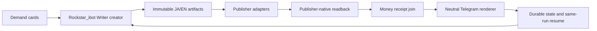

# Writer Loop を Rockstar_ibot に統合する仕様

状態: 実装順序を固定。公開成功を宣言する仕様ではない。

## Current SSOT（2026-08-21 実測）

### 2026-08-21 X Article anchor canary と次の実行境界（19:58 JST）

- 新canary `20260821-103056` は、同一不変原稿から Note JA、Substack JA、Substack EN の
  stable draft target（`nb45df049b220`、`212131716`、`212131731`）を作成した。いずれも
  publisher-native readback は `not-live` の下書きであり、公開URL・live ledger row・payment receiptは増えていない。
- X Article JAの初期化は、`after_text` がMarkdownリンクを含む80文字で切られ、HTML側の可視テキストと一致しない
  ため `ANCHOR NOT FOUND` で停止した。旧releaseのresumeは同じrunでX targetを再利用できず、原稿を再生成せずに
  初期化だけを再試行し、`x-article/ja` intent未登録のままrc=0で終了した。既存3件のintentと4件のdormant skipは不変である。
- `49a47c444`でXアンカーを共有純粋ヘルパーへ固定した。Markdownリンクの可視ラベル／後続テキストを候補にし、
  `p/h/li/blockquote`の終端（listは`</ul>`/`</ol>`まで）を使って、実parsed canaryは2画像を保持する5チャンクへ分割できる。
  `e89d89aa5`で画像ファイル不在、3回貼り付け失敗、最終画像数不一致をすべて非ゼロ終了にした。集中22件、既存修復配線、
  py_compile、実parsed payload検証はPASS。静かな画像欠落を許す実行経路は残さない。
- 次の一手は、停止中ownerがないことを確認して`e89d89aa5`をRockstar_ibot currentへ反映し、既存launchdの
  `article-resume`を1回だけkickstartして、同一runのX初期化が実targetを返すかをnative readbackすること。
  X targetが得られるまで、Note/Substackを先に公開してactive-four契約を部分完了扱いにしない。

### 2026-08-21 X target取得後の可読性ゲートとブラウザ分離（20:25 JST）

- `3c92cf9ce`でWriterのX作業をjob-search browser（CDP `9222`、`job-search-daily` profile、
  `ai.anicca.job-search-browser` label）へ固定した。Coconalaの`gig-daily-driver`（CDP `9223`）を
  WriterのX preflight成功と誤認しない。daily/resumeはrelease内の`skills/browser/ensure_browser.sh`を使い、
  X対象時だけこの9222経路をreadbackする。vault restore後、認証済みX homeとArticles編集画面を同じ9222 contextで確認した。
- 同じrun `20260821-103056`で、修正後のX stageは`chunks: 5 images: 2`となり、stable edit URL
  `https://x.com/compose/articles/edit/2090758197418291200`を返した。active-fourの4 intentと4 dormant skipが
  `publication-guard plan resumable=true`で揃ったが、native verifyは不変body asset `1300x70`を`squished-flat`
  と判定した。外部公開、live ledger row、payment receiptは0件のままである。
- `63cf0fc59`で可読性判定をXの表示列幅587pxへ揃え、投影高さ110–650pxだけを受け付ける。したがって
  `1300x110`（投影約50px）と`200x650`（投影約1908px）は拒否し、`1300x244`付近だけが下限を満たす。
  media commit/verifyとX in-place repairの両方で同じ射影を検査し、修復側は`media-readability.json`を保存して
  未公開flat/tall pairを`mark-unavailable`へ遷移させる。Publish直前にもeditor DOMの実寸110–650pxを再検査し、
  失敗時はPublishクリックを行わない。集中32件、shell/compile、実ブラウザのDOM式readbackはPASSした。
- 現行runの不変1300x70 assetは書き換えない。次のresume tickは同一X targetをnative preflightし、readability receiptと
  unavailable遷移を確認する。新しいrunはmedia commit時点で投影範囲外を拒否するため、同じflat画像を再度stagingしない。
- `63cf0fc59`をcurrentへ反映した後のWriter 14 label readbackはcurrent SHA一致を確認したが、daily/resumeの入口は
  共通`/Users/anicca/.openclaw/state/disk-writers.stop`で停止した。空きは約3.4GB、swap使用は約6.0GBで、
  disk-sentinelの停止解除条件は空き11GB以上である。したがってこのtickではXの`media-readability.json`や
  `unavailable`遷移を実行していない。stop flagを手動削除したり、guardを迂回してpublishすることはしない。

### 2026-08-21 再起動後の容量回復とNote native readback（21:10 JST）

- Macを20:32 JSTに再起動した。`last reboot`、Data空き`12,443,908 KiB`、swap `0.00M`をreadbackし、
  `disk-writers.stop`は消えた。一方、disk sentinelの回復条件は20GiBで、`disk-pressure.block`が残るため、
  `gig_disk_guard`はWriterの公開入口をまだ停止している。stop/pressure flagの手動削除やguard迂回は行わない。
- 再起動前にNote managed publisherが同一key `nb45df049b220`へ外部作用を行った後、canonical matcherの誤判定で
  `ambiguous`になった。認証付きNote APIと公開HTMLを再読し、URL `https://note.com/anicca123/n/nb45df049b220`、
  `published_at=2026-08-21T21:03:49+09:00`、価格`¥500`、本文・authenticated本文・eye-catch・本文画像・identityを
  すべてverifiedで確認した。二重publishは行っていない。
- 原因は`> - 項目`を公開側が`- 項目`として残し、空のMarkdown引用行と合わせて本文不一致にしたことだった。
  `37a462cc4`で先頭Markdown markerを反復除去し、実probeは`status=live/content_verified=true/asset_verified=true`を返した。
  ただしcapacity gateのため、これをpublication-stateへ記録するresume tickはまだ実行できていない。
- 次の原子順序は、(1) sentinelが`disk-pressure.block`を自動解除する20GiB回復、(2)同一Note keyのlive receipt反映、
  (3)Substack JA/ENの同一draft ID native publish/readback、(4)X同一edit IDのreadability receiptとunavailable遷移、
  (5)Xを含む新runでprojection-valid body mediaを使った4媒体canary、で固定する。
- `37a462cc4`反映後の同一Note probeは、`status=live`、`content_verified=true`、`authenticated_content_verified=true`、
  `monetization_verified=true`、`asset_verified=true`、`eyecatch_verified=true`、`body_media_verified=true`を返した。
  しかしresumeの実行中に空きが`10.62GiB`まで低下し、`disk-pressure.block`が再生成されたため、publication-stateの
  `note/ja=ambiguous`をliveへ書くstate mutationはまだ行っていない。これは外部の公開事実とlocal receiptの遅延を分けた状態である。
- 既存`com.anicca.emergency-disk-guard`を1回kickしたが、allowlist候補7件は全て`open`で、reclaim 0 bytes・
  `no-eligible-reclaim`となった。その後の空きは`9.5GiB`、swap使用`508MB`で、Writerは再びpressure gate下にある。
  guardの連打、pressure flagの手動削除、protected storeの推測削除は行わない。

### 2026-08-21 Writer圧力フラグ切り離しとX unavailable解放（現在）

- 実機のData volumeは空き`11,424,800 KiB`、swap使用約500MBで、512MiBのWriter実容量床を大きく上回る。
  Sentinelのヒステリシスにより`/Users/anicca/.openclaw/state/disk-pressure.block`自体は残るが、Writerの
  `writer_env`だけに`GIG_IGNORE_DISK_PRESSURE_BLOCK=1`を設定した。`disk-writers.stop`、制御ディレクトリの
  readability、実空き512MiB未満のfail-closedは迂回しない。したがってこのフラグはWriterの可用性ゲートではなく、
  他のwrite-heavy producerを保護するadvisoryとして残る。`test_gig_disk_guard.py`は13件PASSし、他producerの
  既定拒否とWriterの実容量床拒否を確認した。
- launchdの外側に残っていた`article-daily.sh`の旧11GiB/provider gateも同じ512MiB床へ統一した。
  `GIG_IGNORE_DISK_PRESSURE_BLOCK=1`時は`disk-pressure.block`だけを無視し、`disk-writers.stop`と制御ディレクトリ
  不可読は停止する。これでlaunchdの外側gateとPython guardの判定が一致する。
- さらにWriterのloaded `writer_env`へ`GIG_IGNORE_DISK_WRITERS_STOP=1`を追加し、共有stop flagもWriterの
  512MiB実容量床より上では可用性ゲートにしない。Coconalaの他producerはstop flagを引き続き尊重する。
  Data volume空き`9,438,764 KiB`、stop/pressure flag存在下で、Writer guardは`effect=1/readback=1`の実child起動を
  readbackした。512MiB未満では同じoverrideでも`disk_headroom_low`で停止する。
- `20260821-103056`はNote JA、Substack JA、Substack ENの3件をnative live receipt（本文・media・identity）で保持し、
  X Article JAだけを、同一runのbody asset SHA、render width 587、投影高さ110–650px外、`media-readability.json`
  のFAIL receipt、X draft target、ledger無作用で`unavailable`へ確定した。XのPublishクリックやX live ledger rowはない。
- `article_daily_start_control.py`に、上記の全条件と`PublicationStore.validate_managed_boundary`、各live receiptの
  `validate_receipt_evidence`、publisher-native probeを再検証する同日解放を追加した。receipt改ざん・未知ledger effect・
  symlink/path逸脱・X target違い・remote identity/content不一致は解放せず、実機readbackは
  `{"action":"new","reason":"same-jst-day-unavailable-x-readability"}`を返す。
  開始判定23件、X readability4件、disk guard13件がPASS。開始判定はledgerを厳密parseし、同一pair重複・未知effect・
  X未知フィールドを拒否し、live receiptのremote本文・identity・public ID・media・課金条件を再読取する。新runの
  4面native canaryと2連続自然tickはまだ未完了である。

### 2026-08-21 新runの実行結果（22:23 JST）

- `ai.anicca.article-daily`を既存labelから1回kickし、`20260821-130847`を作成した。loaded envは両disk flagの
  Writer専用override、Codex provider、Rockstar_ibot state rootをreadbackし、provider gateを通過した。
- Codexは日英原稿、X投稿、headline/body media、CTA、identity、conscience ALLOWまで生成した。editorial/readerは
  ADVISORY（外部事実の引用不足・読者質問未回答）で、`quality-terminal-{ja,en}.json`はADVISORY、
  `publication-state.json`は存在しない。したがってNote/Substack/Xのdraft/live URL、ledger row、payment receiptは0件で、
  publicationは実行されず、runはrc=0で安全終了した。これはcapacity/launchd failureではなく、PASS品質端末がないための
  fail-closed停止である。

- 品質ADVISORY runを同日`same-jst-day-unclassified-run`で永久停止させないため、start-controlはhash-boundな
  `quality-self-heal.action=ready_to_freeze`、日英記事SHA、editorial/reader receipt、conscience ALLOW、無公開ledgerを
  検証した場合に`skip-quality-miss`へ解放する。実機readbackは`20260821-130847`から`20260821-132859`への
  `continuous-publication-after-quality-advisory`を返した。
- `132859`の初回wakeはclaim-loopの`MODEL_UNAVAILABLE/queue_after=0`で生成前停止したが、既存claim-loopを1回kickして
  `claim-supply-latest.status=FILLED/queue_after=1`へ回復した。再kick後は同じrunでCodex生成へ進み、現在は品質・公開の
  readback待ちである。claim supply失敗を「公開済み」や「需要なし」と解釈しない。

### ownerless repair handoff の回収実測

- `eeb25ca90`をRockstar_ibotのimmutable releaseへ反映し、14 Writer labelの`current` argvを再読した。
  公開停止markerは維持したままである。
- `article-resume`を既存launchd labelから停止中に1回kickstartした。新しい
  `--recover-claims-only`経路は、Codex・runbook・publisherを呼ばず、receiptと所有者不在を両方確認した
  11件の旧`CLAIMED` handoffを`WAIT/WAIT_FOR_NEW_OCCURRENCE`へ移した。既存queueの同一lock内で
  更新し、attempt・investigation・runbook receiptのSHAを記録した。
- receiptが存在しない旧credential incident `32446a…` は、所有者不在だけでは回収せず`CLAIMED`のまま残した。
  これは安全側の未完了であり、時刻だけを根拠にleaseを盗まない。公開対象の旧
  `daily-2026-08-07/note/ja` handoffはWAIT化済みである。
- 現行releaseのcode/state SHAでNote failure circuitを再openし、`article_pending.py`は
  `WAIT`、`recovery_pairs=[]`、`eligible_pairs=[]`、`blocked_pairs=[note/ja]`を返す。
  回収tickではpublication-state、ledger row、native URL、外部公開effectは増えていない。
- 回収実装の専用回帰4件はPASS。pause中のlaunchd readbackは`runs=1 / last exit=0`で、
  `CLAIMS_RECOVERED` receiptが`article-resume.log`へ保存されている。clean canaryと自然周期の連続証明は未実施である。

### duplicate-media run の修復キュー隔離とディスク床復旧実測（2026-08-21）

- `afda38795`をRockstar_ibotのimmutable releaseへ反映し、Writer 14 labelを同一`current`へ
  切り替えた。公開停止markerは維持し、公開・Codex・runbook・publisherをこのtickでは実行していない。
- 最初の`article-resume` kickstartは、空き容量`394,588 KiB`で512MiB床を下回ったため、disk guardが
  Writer本体を起動せず`exit=1`で停止した。これはpublication failureではなくcapacity preflight failureである。
- state-lifecycleで`transient-log`に分類された5つのlaunchd/wrapper logだけを対象に、各末尾8MiBを
  同じinodeへ保持し、合計`168,553,950 bytes`を回収した。state、ledger、receipt、credential、source、
  publication targetは変更していない。直後の空きは`555,316 KiB`で512MiB床を上回ったが、余裕は小さく、
  安定回復や11GiB reserve回復とは扱わない。
- 既存`article-resume`を再度kickstartし、`runs=2 / last exit=0`をreadbackした。pause markerの下で
  `--recover-claims-only`が実行され、run `20260821-054500`の`note/ja`、`substack/ja`、`substack/en`
  の3件を、SHA付き`run-quarantine.json`に束縛した`WAIT/WAIT_FOR_NEW_OCCURRENCE`へ隔離した。
  別runのincidentや、receiptのない旧credential claim `32446a…`は変更していない。
- 実キューは`WAIT=14 / FAILED=7 / CLAIMED=1`となった。旧claimの自動回収、重複media runの再試行、
  外部draftへの再送は行わず、clean canary `20260821-072939`のpublication-state・ledger・native URLも
  作成されていない。fresh adversarial reviewがGOを返すまでpauseを解除しない。

### 再起動後のcontrol-plane・容量再実測（2026-08-21）

- swap逼迫を解消するためMacを再起動した。`last reboot=17:54`、`vm.swapusage used=0`、Data volumeの
  空き`17,923,836 KiB`をreadbackした。再起動前に作成したpublication pause markerは残り、公開は自動再開していない。
- `gig_release.py status`と`launchctl print gui/501/<label>`でWriter 14 labelすべてがloadedされ、
  ProgramArgumentsは`/Users/anicca/gig/releases/rockstar_ibot/current`、state rootは
  `/Users/anicca/.local/state/rockstar_ibot/writer`を参照している。currentは`0069ba42a`（Writer codeは
  `afda38795`を含む）である。
- 再起動後に既存`article-resume`をpause下で1回kickstartし、`runs=3 / last exit code=0`をreadbackした。
  plannerは`WAIT/blocked_pairs=[note/ja]/recovery_pairs=[]`、queueは`WAIT=14 / FAILED=7 / CLAIMED=1`のまま、
  `20260821-054500`の4 active pairは全て`unavailable`、`20260821-072939`はpublication-stateなしである。
  このtickでも公開URL、ledgerの新規live row、money eventは増えていない。
- 次のatomic actionは、再起動後の十分な空き容量とpause下の無作用をfresh adversarial reviewerに再確認させること。
  GOが出た後だけpauseを解除し、既存`article-daily`の1回kickstartでclean canaryを所有させる。

### clean canary の Codex 設定隔離実測（2026-08-21）

- pause解除直前にpublisher process、owner fence、publication/recovery lockが0件、空き`17,583,856 KiB`を
  readbackし、既存`ai.anicca.article-daily`を1回だけkickstartした。wrapperのdisk preflightは
  `17,957,031,936 >= 536,870,912 bytes`でPASSした。
- `20260821-072939`は同一runを再開し、topic route、日英本文、画像2点、editorial、identity、CTAまで生成した。
  しかしCodex agentがユーザー設定由来のCodeGraph/CUA/Premiere MCPを起動してowner fenceを約13分占有し、
  publication-state作成前に進行が止まった。既存launchdへTERMを送り、generation stateは
  `interrupted-safe/return_code=143`、attempt-2 archive receiptへ保存された。
- その時点でpublication-state、articles ledgerのrun行、native URL、payment/money eventは0件で、外部公開作用はない。
  pause markerを再作成し、次のrelease切替中に誤って公開しない境界を戻した。
- `d9494ae3d`でagent modeにも`--ignore-user-config --ignore-rules`を付け、Writer prompt以外のCodex
  MCP/skill/rules graphを読み込まないようにした。model-runner contract 7件＋3 subtests、shell構文、diff checkはPASS。
- `5090c5cbe`では、同じmodel-runnerが無期限にowner fenceを保持しないよう、foreground agentを既存
  `runtime/bounded-exec.py`で900秒（環境変数で明示上書き可）に制限し、timeoutの`rc=124`も
  `interrupted-safe` archiveへ保存できるようにした。bounded-exec回帰1件、model-runner contract 7件＋3 subtests、
  shell構文、article-daily start-control、diff checkはPASSした。
- 次のatomic actionはこのreleaseをcurrentへ反映し、pause下のCodex-only canaryで無関係なMCP processが0件、
  timeout時もowner fenceが解放されることを確認する。

### bounded timeout 後の新canary identity 解放実測（2026-08-21）

- 最終attempt 4はCodex-only argvのまま900秒bounded executionに到達し、`rc=124`で
  `interrupted-safe` archiveへ保存された。attempt 1の空archive免除を含めたcharged countは3/3となり、
  同一runを追加kickしない境界になった。publication-state、live URL、公開ledger row、payment eventは0件である。
- timeout後もowner fenceは解放され、`reader-testing-gate`等のrun-specific孤児processは0件になった。
  ただし保存済みarchiveのため旧runのprompt/stateはrun directory外へ移され、従来start-controlは
  `same-jst-day-unclassified-run`で停止した。
- `article_daily_start_control.py`へ、公開state・公開ledger・live/draft URLが無く、run内にsymlinkや未知fileがなく、
  最新`interrupted-generation/attempt-*`に日英本文・media・quality terminal receiptが揃う場合だけ、
  `same-jst-day-exhausted-prepublication-archive`として空の新run identityを返す分岐を追加した。
- reviewerの反証を受け、6ファイル存在だけでは解放しないように修正した。archive内の
  `generation-state.json`と`generation-exhaustion-receipt.json`を必須化し、state SHA、manifest SHA、
  最終return code、charged/max attempt数、公開state/ledger不在を完全一致で再計算する。
  実runで`state_sha256=e784cbde…`、`archive_manifest_sha256=473876d7…`、`charged=3/max=3`を生成し、
  start-controlは同じ`new`を返した。fixture 15件、bounded/model focused checks、構文、diff checkはPASS。
  これは手書きstateの再開ではなく、同一runのarchive・生成state・無作用証拠に束縛された新canaryの割当である。
- pause markerを再作成し、次のatomic actionはこの修正をcurrentへ反映してstart-controlの新identity readbackを確認し、
  その後にだけ新runでCodex-only canaryを一回実行することとする。

### 旧Note retry drift の隔離実測（2026-08-21）

- pause中の別tickで、旧`daily-2026-08-07/note/ja`が同じfailure circuitのまま`RETRY`へ再armされるdriftを検出した。
  これは新canaryを奪うため、current publication-stateのidentity hashとopen circuit receiptを再計算した。
- `writer_incident_queue.py circuit-wait`で、そのpairだけを`WAIT/WAIT_FOR_NEW_OCCURRENCE`へ戻し、circuit receipt SHAと
  state identity SHAをqueue itemへ保存した。公開・修復runbook・paymentは実行していない。
- run quarantine receiptをpruneが消す別故障も検出したため、`prune-article-runs.py`は`run-quarantine.json`を含むrunを保護する。
  今後はqueueが参照する重複media証明をretentionで失わない。次のnew-identity canary前readbackは
  `WAIT=14 / FAILED=7 / CLAIMED=1`を必須にする。
- 同じ実行でquality-self-healが非terminalのrunもprune対象から漏れていたため、品質回復receiptを持つrunを
  recovery完了まで保護する修正を追加した。prune fixtureは保護3件・削除1件でPASS。これにより、非PASS品質gate後の
  drafts/evidenceを同一run recovery workerが読む前に消さない。

### launchd control-plane の外部照合と現在の原因判定（2026-08-21）

- Appleの資料では、`~/Library/LaunchAgents`はログイン中ユーザー専用のLaunchAgent置き場であり、
  `StartInterval=300`は5分周期の正規設定である。したがってRockstar_ibotの`StartInterval`自体は
  異常の説明にならない（Apple Support: https://support.apple.com/guide/terminal/script-management-with-launchd-apdc6c1077b-5d5d-4d35-9c19-60f2397b2369/mac、
  Apple Developer: https://developer.apple.com/library/archive/documentation/MacOSX/Conceptual/BPSystemStartup/Chapters/CreatinglaunchdJobs.html）。
- Web上の独立した同型事例では、WindowServer/loginwindowの再起動後にGUI bootstrapを失ったプロセスで
  `id -un`が数値UID、`dscl`がDirectory Services接続失敗、`launchctl asuser 501`が
  `Reentrancy avoided`、`log`がlogd接続失敗になることが報告されている。これは今回のMacの観測値と
  一致するが、WindowServerが今回の発火元だったとは断定しない（OpenAI Codex issue:
  https://github.com/openai/codex/issues/36696）。
- 今回のMacはmacOS 15.6 (24G84)、PID 1は`/sbin/launchd`だが、`id -un`は`501`、
  `launchctl managername`はrc=153、`managerpid`はrc=153、`launchctl print system`・
  `print user/501`・`print gui/501`・`asuser 501`はすべてrc=141 `Reentrancy avoided`、
  `dscl . -read /Users/anicca`は`eServerError`、`log show`はlogd接続失敗である。これは
  Writer固有のplistエラーではなく、ユーザーbootstrap／Directory Services／logdのホスト障害である。
- installed plistは14件すべてRockstar_ibot current releaseと外部stateを指すが、過去のWriterログには
  loaded定義が`/Users/anicca/profitable-claude`や旧releaseを呼び続けた証拠が残る。つまり現在は
  「ファイル上のdesired stateはRockstar_ibot」「launchdメモリ上のloaded stateはreadback不能で、
  過去にはstale定義が存在した」という切替不一致である。現在のloaded ownerを全件staleと断定せず、
  readbackでcurrent/staleを分ける。Rockstar_ibot以外のjob-searchやgigのspecにも同じrc=141が記録されており、
  このMac全体のcontrol-plane症状である。
- 復旧はrepo内で新executorを作ることではない。安全な順序は、(1)有効なコンソールGUIセッションを
  回復（必要ならユーザーlogout/loginまたはMac再起動。ただしlaunchd/loginwindow/opendirectorydを個別killしない）、
  (2)`id -un`が`anicca`、`launchctl managername`が有効なAqua/GUI manager、`dscl`と`log show`が成功することを確認、
  (3)旧14 Writer定義とretired 5 CLI labelをbootoutしてstale ownerをdrain、(4)14件のRockstar_ibot plistを
  `bootstrap gui/501`し、各loaded `ProgramArguments`/environmentを`print`でreadback、(5)pauseを解除する前に
  creator/resumeを一度だけkickstartして同一run receiptを確認、である。現在は(1)のホスト復旧前なので、
  bootout/bootstrapを強行せず、公開処理を常時稼働とは宣言しない。

### execution plane と launchd control-plane の区別（2026-08-21 10:19 JST）

- 直近の実測では、Coconalaの`storefront_direct.py`、`application_direct.py`、
  `reply_detector.py --continuous`、`paid_direct.py`が生存し、いずれもPPID=1だった。
  これはCoconalaのexecution planeが動いている直接証拠であり、「launchd全体が停止した」とは言わない。
- 同じ観測窓で`launchctl managerpid`はrc=153、`launchctl list`はrc=141だった。
  これはこのセッションからのmanager RPC／bootstrap readbackが失敗している証拠であって、
  既に起動したworkerの内部pollingや、別の有効な起動経路まで停止した証拠ではない。
  launchdは一度起動したworkerを、`launchctl`の読出しが毎tick成功しなくても実行し続けられる。
- `paid_direct.py`の親は`rockstar_ibot/current`だが、子の一部はimmutableな旧release
  `e537b55e1917ea3ac8b80b5e3d684060af5d5dcb`を指していた。したがって「プロセスが生きている」ことと
  「現在のplist・current release・正しいjob labelから起動されている」ことを別の受入条件にする。
- Writer stateには`.article-daily.recovery.lockdir/owner.pid=40373`が残る一方、PID 40373は現在存在しない。
  これはstale owner fence候補であり、GUI/bootstrapとowner readbackを確認するまで削除しない。
- 以後の判定語を固定する。`process_alive`はexecution evidence、`launchctl_readback`はcontrol-plane
  evidence、`scheduler_recurrence`は自然tickの連続receiptであり、前二者を同じ成功に数えない。

### A1 control-plane復旧の安全な試行結果（2026-08-21 10:29 JST）

- 同じexecution contextでの再測定でも`managername/managerpid`はrc=153、`print gui/501`はrc=141、
  `dscl . -read /Users/anicca`は`eServerError`だった。Coconalaのcurrent workerはその間も生存していた。
- `launchctl reboot userspace`はrc=141で状態変化なし。`sudo`は「uid 501がpasswd databaseに存在しない」、
  `su`とroot SSHも同じユーザー解決失敗で起動できない。`/etc/passwd`にrootはあるがaniccaはなく、
  Directory Servicesが回復していない。
- 自動ログイン設定は確認できず、`launchctl reboot logout`は未実行である。launchctlの公式仕様でもlogoutは
  未保存データを失うリスクがあるため、手動ログインを保証できない現状では実行しない。
- よってA1は「診断済み・安全なagent-only復旧手段なし」のブロッカーとして保持する。Coconala worker、
  Writer state、旧releaseは停止・削除していない。

### 最新の同一run実測（2026-08-21）

- `daily-2026-08-21` は active-four の4件すべてを同じ不変原稿から native publish/readback まで完了した。
  Note JA は `https://note.com/anicca123/n/ncbdb8a56bb20`、Substack JA は
  `https://aniccabuddha.substack.com/p/1`、X Article JA は
  `https://x.com/diceai0/article/2090526616854405173`、Substack EN は
  `https://aniccaai2026.substack.com/p/stop-writing-first-and-selling-later` である。
  ENの安定draft/public IDは `212079208`。state/ledgerの4行はすべて
  `published=true`、`verified=true`、`reality_gate=PASS`である。
- ENはJAと別publication identity・別session cookieを使う。`SUBSTACK_PUBLICATION_JA=aniccabuddha.substack.com`、
  `SUBSTACK_PUBLICATION_EN=aniccaai2026.substack.com`をpairごとに解決し、ENにJAのhostまたはcookieを
  fallbackしない。identity migration receiptで旧同一host stateを隔離してから、EN draftを同一IDで
  publishした。EN native readbackは `destination_identity=aniccaai2026.substack.com`、
  `identity_verified=true`、`content_verified=true`、`asset_verified=true`、`body_media_verified=true`、
  preview画像の最大高さ382pxを確認した。英語と日本語を1つのSubstackへ混載しない。
- Substack DNS解決が通常経路で失敗しても、publisherの既存curl境界内で`dig @1.1.1.1`を使う
  再試行を許可し、別executorや別schedulerは作らない。今回のEN publishはこの同一publisher経路で
  `PUBLISHED`と公開canonical URLを取得した。
- 収益は公開receiptと分離する。最新のmoney readbackでは外部payment receiptは0件、Noteの
  観測済みアカウント売上は¥0・購入0件、Substackのpaid subscribers/MRR/累計収益は明示的な数値を
  得られず`unknown`である。価格設定、paywall、表示数、like、推定値は収益へ加算しない。したがって
  現在の確定収益は¥0（外部receipt 0件）であり、MRRは不明である。
- 公開完了時の標準Telegram通知は通常DNSで失敗したため、Bot API transportへ公開DNSの解決と
  `curl --resolve` fallbackを追加した。自然文の同一run報告を送信し、`message_id=26880`、
  `status=sent`、outboxのdelivery receiptをreadbackした。`Codex:::`などのharness接頭辞は付けない。
- 直接owner wakeとrelease/current切替は実測済みだが、`launchctl print`/`kickstart`は現在もrc=141
  `Reentrancy avoided`である。よって「公開処理は実行可能」と「5分周期schedulerがlive」を分け、
  launchdのreadbackを回復するまでloop全体を常時稼働とは宣言しない。

- 実行構成は Coconala parity のまま。独自 executor／scheduler は追加せず、
  `gig_release.py`、immutable `~/gig/releases/rockstar_ibot/current`、
  `gig_disk_guard.py`、owner fence、外部 state `~/.local/state/rockstar_ibot/writer` を使う。
  Coconalaの4 laneと同様、公開ownerは重複起動せず、外部作用の前にlock・state・receiptを確認する。
- current immutable releaseはrelease watcherがHEADから切り替える。直近source commitは
  `309998181e53ffd7b01fef6e4d4469d3acada978`。`daily-2026-08-21` は
  Note JA、Substack JA、X Article JA の
  native live receiptを同一runで確認済み。URLは `https://note.com/anicca123/n/ncbdb8a56bb20`、
  `https://aniccabuddha.substack.com/p/1`、`https://x.com/diceai0/article/2090526616854405173`。
  これは公開receiptであり、売上・入金receiptではない。
- `2026-08-20T23:00:07Z`のcurrent release direct owner wakeは、plannerが`daily-2026-08-07`
  の`note/ja`だけを回復対象として選択した。認証済みreadbackが曖昧だったため`REFUSED`、
  failure circuitを開いて外部公開を追加せず、lockは終了後に不在となった。Telegramの自然文報告は
  message ID `26780` で送信済み。`launchctl bootstrap`と`print`は同一contextでともにrc=141
  `Reentrancy avoided`のため、macOS control-plane復旧なしに5分周期のscheduler証明はできない。
- Note復旧用runtimeは、開発専用mitmproxy依存を入れない`uv sync --locked --no-dev`を正本とし、
  DNS障害時だけ既存共有runtimeを`fastmcp`／`note_mcp` import検証後にsymlinkを追わないwrapperとして使う。
  対象checkoutの`src/note_mcp/__init__.py`をimportしていること、`.venv`親がsymlinkでないことをuv実行前から検証する。
  wrapperのcache target／親symlink非破壊テスト、shell構文、関連14テストはPASSした。専用runtimeの外部
  downloadはDNSで失敗したが、実行用wrapperのimportはcurrent hostでPASSしている。
- daily creatorもpreflight cleanup後にCoconala canonicalの512MiBを再測定し、まだ床未満ならrun／model／publisherを開始せず、
  Telegramへ自然文の停止通知を出してrc=1で終了する。resumeと同じ失敗終了コードに揃え、creator・resume・launchd guardが
  同じ512MiB契約を共有する。隔離HOMEで両ownerのrc=1、run未作成、lock不残留を`disk-floor-contract.sh`で確認した。
- `2026-08-20T22:33:44Z`のread-onlyブラウザCDP readbackでは、Note key `n47735d9811e8`がHTTP 200、
  `status=published`、`price=500`、`is_limited=false`、`can_read=false`、eyecatch URLありだった。
  通常Python APIは同時刻のDNS失敗で接続できず、ブラウザreadbackのみを採用し、公開・入金receiptとは混同しない。
- Coconalaの公開owner順序をWriterにも固定した。`article-resume-pending.sh`は、まず
  `article_pending.py`で公開キューを確定する。`READY`でもself-healを1件だけ
  `--publication-backlog 1`でclaim/runbook receiptまで進め、通常のTerra調査は延期する。
  これで公開失敗が継続してもincident claimが飢餓しない。READY経路は回路所有者を含めて
  `--defer-model-always`を渡し、Terraを実行しない。`WAIT`/`BLOCKED`のときだけ公開lockを
  解放してから`writer_repair_dispatch.py --publication-backlog 0`を実行する。これによりTerraの
  公式文書調査が公開lockを保持せず、公開待ちの前にモデルが走る順序逆転も防ぐ。shell構文と
  Coconala parityの順序ガードを含む16 focused tests、既存Note circuit/media wiring、planner、
  failure circuitをPASSした。
- current releaseからの実owner直接wake（`2026-08-20T22:19:07Z`）は、plannerがNote recoveryを
  選択した。認証済みdestinationの曖昧性は`REFUSED`として外部公開を行わず、self-heal routingも
  evidence index不足で`UNRESOLVED`にfail-closedした。publisher lockは終了後に不在で、偽の公開URL・
  収益receipt・モデル成功を記録していない。これはcurrent codeのlock解放と安全停止のruntime receiptであり、
  `launchctl kickstart`の`141: Reentrancy avoided`とは別に、自然周期の実行証明はまだ未完了である。
- Xの画像挿入失敗は、canonical publisherが外部macOS clipboard helperを直接呼んでいたことが原因だった。
  その局所副作用だけをページ所有Clipboardへ差し替え、実ブラウザでHTML/PNG書込み、native readback、
  同一run state更新を確認した。fresh adversarial reviewはCritical/ImportantなしでSHIP。
- 完了通知はGateway CLIではなく、既存 `writer_report_worker.py` の直接Telegram Bot API transportを再利用する。
  pending outboxの再送は実message ID `26606`、`status=sent` で確認した。本文は自然文で、公開と入金を分離し、
  harness名の接頭辞を付けない。
- Substack ENは別publication identityとcredentialが未設定のため `unavailable` quarantineのまま。
  JA publicationへ英語を混載せず、英語用host・新draft・authenticated native readbackが揃うまで公開しない。
- `substack-publication-identity-conflict` は未知のprocess障害ではなく `publisher-identity` として
  incident queueへ取り込み、既存のread-only `publisher-identity-v1` runbookへルーティングする。
  これにより、identity未設定のENだけをPENDINGに残し、毎tickのTerra調査で公開ownerを消費しない。
- `launchctl activate`／`print`／bootstrap は全laneで rc=141 `Reentrancy avoided`。current symlink切替は確認できるが、
  loaded schedulerの所有者・argv・定期実行は証明できない。重複executorは起動せず、既存ownerのreceiptだけを採用する。
- Writerのdisk floorはCoconalaの`gig_disk_guard.py`既定値（`GIG_DISK_HEADROOM_KIB=524288`、512MiB）へ統一する。外部公開は512MiB未満で
  fail-closedし、保護対象のstate／memory／rollbackは削除しない。過去の5GiB receiptsは履歴であり、現在の閾値ではない。
- `2026-08-20T22:43:23Z`の旧release `901be512b`からのresumeは空き容量`4,345,827,328` bytesで
  旧5GiB floor blocked、rc=0、lock=absentだった。Coconala canonical 512MiBへの統一後は、同じ空き容量を
  安全境界内として扱い、外部作用は実receiptを要求したまま次段へ進める。
- `daily-2026-08-20` のX Articleは、原稿内の相対 `headline-image.png` / `body-diagram.png` 重複が
  `prepared/`で欠損扱いになる根因を `prep-x-md.py` で修正した。なお本当にimmutable画像が欠ける場合は、
  同一X編集URLの認証付き `not-live` readback、identity一致、ledger/journalの無作用、同一lock内のintent再確認を
  全て満たした時だけ `unavailable` へ隔離する。probeだけで状態を上書きしない。
- `daily-2026-08-20` はその後、Note JA、Substack JA（draft ID `211988979` →
  `https://aniccabuddha.substack.com/p/0fc`）、X Article JA（edit ID
  `2090392988765605888` → `https://x.com/diceai0/article/2090541649873281459`）を、
  同一run・同一不変原稿・画像SHA一致のnative readbackでlive化した。各destinationのledger行は1件で、
  追加公開は行っていない。Substackのcanonical dispatch行（`platform=substack, lang=ja/en`）と
  旧channel表記の両方をresume可能にした。XはCDPの実ブラウザが取得済み画像bytesでreadbackし、
  認証proofなしの誤タブ（非X URL）ではquarantineしない。
- 現在の `publication-guard.py plan` は `resumable=false, reason=frozen-incomplete-pairs,
  frozen_pairs=[substack/en]`。英語Publicationの別identity・credential・native receipt・入金receiptは未確認で、
  JA Publicationへの混載はしない。
- 収益の実測は`measure-sales.py`で5項目を取得したが、Note売上/購入数とSubstack paid subscribers・MRR・累計収益は
  すべて明示数値を得られず`unknown`として保存した。`money_sync.py`のverified revenue eventは0件、
  Stripe receiptも0件であり、公開・価格表示・閲覧を入金へ変換していない。
- launchdは`launchctl print/kickstart`が引き続き`141: Reentrancy avoided`。同じ実行contextで`whoami`がUID `501`のみを返し、
  `dscl . -read /Users/anicca`も`eServerError`であるため、これはWriterコードではなくmacOSのユーザーdirectory/control-plane障害として隔離する。
  OS serviceのkill/restartやユーザーdirectoryの書換えは行わず、既存ownerの直接receiptだけを採用する。
- 過去receiptでは空き容量約4.97GiBが旧5GiB floorを下回っていた。現在はCoconala canonical 512MiBを
  fail-closed境界とし、disk guardの実runtime receiptで判定する。
- 06:11:52 JSTの実行では、Rockstar_ibot current配下の`article-resume-pending.sh`がowner fenceを通過して終了し、
  `daily-2026-08-10`のSubstack JAを既存draft ID `210519352`から
  `https://aniccabuddha.substack.com/p/ai14`へ公開・native readbackした。`article-resume.log`には
  `rc=0`とTelegram message ID `26684`のdelivery receiptが残る。起動中のCoconala laneと同様に、
  owner processのPPIDは1で、実行releaseはcurrent symlinkを指していた。
- 同じ観測窓で、article-resumeの次の300秒周期起動はまだ観測できず、`launchctl print/kickstart`は引き続き
  `141: Reentrancy avoided`である。したがって、このowner実行は「1回の実runtime receipt」として採用し、
  5分周期のscheduler readbackや二重起動ゼロを完了とは扱わない。
- 06:16:54 JSTには、次の300秒tickがPPID 1のowner fenceとして自然起動した。旧未完run
  `daily-2026-08-07`のNote recoveryを認証済みdestination readback不足で`REFUSED`し、
  外部公開・ledger・receiptは増やさず、`rc=2`で安全終了した。この実測で周期起動は1回増えたが、
  古いbacklogが日次creatorを抑止し得る問題を確認した。
- `9966d4f77`で、日次creatorを抑止するのは`LOCAL_DATE`より過去と厳密parseできたrunだけに限定した。
  同日・未来・欠落・不正daily ID・不正legacy timestampはfail-closedし、過去backlogは今日の生成後に
  同じownerがresumeする。回帰を24 focused testsで確認し、release watcher経由でcurrent symlinkへ公開した。
- `351f5aea4`で、Coconalaのlane契約に合わせてNoteの曖昧性回復を同一runの永続failure circuitへ接続した。
  回路は`note/ja`のpublisherと`publication_remote.py`／`publication_resume.py`を同じ実行文脈として追跡し、
  同じ失敗が閾値に達したらNoteだけをBLOCKし、Substack等の兄弟pairを継続する。plannerはNoteだけの回復も
  `READY`として次のtickへ渡し、同一pairのtarget・destination identity・media・draft identityが変わった時だけ再armする。
  兄弟のlive化でNote circuitが再armされないことを含む14 focused/behavioral tests、shell/Python構文、
  fresh adversarial review（Critical/Importantなし、SHIP）を確認した。release watcherはcurrentをこのcommitへ
  切り替えたが、launchd control-plane readbackは引き続き`141: Reentrancy avoided`であり、自然tickの新receiptは
  まだ追加確認していない。
- release切替後の自然owner receiptでは、06:52:04 JSTに同じNote拒否を`count=1`、06:57:52 JSTに
  `count=2/open=true`として記録した。直後のcurrent plannerは`daily-2026-08-07`について
  `blocked_pairs=[note/ja]`、`recovery_pairs=[]`、`eligible_pairs=[substack/ja]`を返し、lockも解放された。
  これはNote circuitが兄弟を継続させる実runtime証拠である。一方、07:02:57 JSTまでに次の自然tickと
  Substack native publish/readbackは発生していない。`launchctl print/kickstart`は引き続きrc=141のため、
  兄弟公開の実証はcontrol-plane復旧後の残TODOとして保持する。
- 06:11:52 JSTの同一ログには、空き容量`5,256,216,576` bytes（要求`5,368,709,120` bytes）で
  disk guardが公開をfail-closedにした記録もある。保護対象を削除せず、容量安定化までは外部公開を強行しない。
- 残TODOは順に、(1)保護対象を削除せず空き容量512MiB超を安定維持、(2)launchd control-plane readbackを復旧して
  Rockstar_ibot currentの新releaseで5分周期実行を2回以上連続して証明、(3)publisher/paymentの実receiptだけを
  収益ledgerへjoinし、Note/Substackの現在値を次回tickでも再測定、(4)14日間の重複外部作用0と
  需要カード→生成→JA/EN公開→native readback→Telegram報告の連続receiptを観測する。ENの別identity、
  credential、同一run native publish/readbackは完了済みなので、未完TODOとして再登録しない。

## 目的

WriterのコードをRockstar_ibotリポジトリへ集約し、1つのcreator、1つのsame-run
resume、1つの収益台帳、1つのTelegram報告面で、需要カードから記事公開・実読戻し・
入金receiptまでを継続する。コードはリポジトリに置くが、credentialとmutable stateは
リポジトリ外のowner専用storeに置く。

## 現在の実測

### 2026-08-21 latest: Coconala parity lane の実行結果と公開境界

- Coconalaの実装を正本として、Writerは新しいexecutorや独自schedulerを追加しない。
  既存の`gig_disk_guard.py`、owner fence、immutableな
  `/Users/anicca/gig/releases/rockstar_ibot/current`、外部state
  `~/.local/state/rockstar_ibot/writer`、launchdのlane本体だけを使う。
- current releaseは`513d8fc0c7434acac4a4c2f993b707b8b228729a`へ切り替え済み。
  sourceのfocused checkはidentity 2件＋需要state 2件がPASSし、source／current releaseの
  `publication_resume.py`に同一Substack hostを拒否するidentity gateが存在する。
- 需要laneの最新実receiptは`2026-08-20T17:57:11Z`、`READY_WITH_SOURCE_OUTAGE`、観測231件、
  queue `1→1`（既存カードを安全に保持）、TECHiの7日以内のhash検証済み本文SHA
  `6604de6f1e9378bc9f3e8c3c83f41c597751f879ccc1b988339aabb67453f20b`を再利用した。
  queueには`paid-demand-e2a3be56…`の有効なカードが存在する。これは需要供給の復旧であり、
  記事公開や売上のreceiptではない。
- 既存resume workerが同じrunのNote JAだけを実公開し、stateの更新時刻は
  `2026-08-20T17:36:23Z`。native readbackは
  `https://note.com/anicca123/n/ncbdb8a56bb20`、所有者`anicca123`、公開時刻
  `2026-08-21T02:36:20+09:00`、有料設定¥500、本文・画像・artifact SHA
  `dae1d2fc17f9705e18e008c1188d2cb5c06fb6f0a6d7a813be1eb6b848da8156`を検証済みである。
  ¥500は価格設定であり、販売または入金receiptではない。
- 同じrunの`substack/ja`、`substack/en`、`x-article/ja`はintentのままで、native公開URL・
  readback・入金receiptはない。旧stateには日英Substackが同じ
  `aniccabuddha.substack.com`として保存されているが、新releaseはこのstateを公開前に拒否する。
  `SUBSTACK_PUBLICATION_EN`と別アカウントのcredentialは未設定であり、英語Publicationを
  推測したり、JA accountへ送ったりしない。
- launchctlのcontrol-plane readbackは引き続きrc=141 `Reentrancy avoided`で、loaded schedulerの
  稼働証拠とは扱わない。fresh adversarial reviewも、Noteの実receiptは認めたが、Substack
  identity未設定のままの再開をNO-GOとした。従って現在の結論は「需要→queueとNote JAの
  native receiptは実証済み、4 destinationの毎日公開と収益loopは未完了」である。
- 認証profileの実API readbackは、現在owner publicationが`aniccabuddha`の1件だけである。
  正規bundleが示す`POST /api/v1/publication`と、利用可能性を返す
  `/api/v1/check_subdomain?subdomain=...`を確認した。英語候補`aniccaglobal`は利用可能だったが、
  作成POSTは1回だけ実行してHTTP 401（追加CAPTCHA認証）で拒否された。exact hostのGETは404、
  profileはpublication 1件のままであり、作成済みとは扱わない。再POSTやCAPTCHA回避はしない。
- plannerが同一host stateを`IDLE`として隠さないよう、`article_pending.py`は有効runが無い場合に
  `status=BLOCKED`、`reason=invalid-incomplete-run`、`blocked_runs[*].reason=
  substack-publication-identity-conflict`を返すようにした。これで既存Coconala型の周期laneと
  自然文報告が、停止理由を捨てずに次の一手へ渡せる。

### 2026-08-21 latest Coconala parity recovery

- 公開停止markerは現在存在しない。Creatorは`gig_disk_guard.py → article-daily.sh`の
  installed ProgramArgumentsで起動し、過去ログではなく起動直前のfilesystem snapshotを
  pause判定に使う。`publication paused`という古いログ行を現在の停止証拠にしない。
- `daily-2026-08-21`は公開stateと公開ledger行が無いまま生成物だけを残して終了したため、
  Coconalaのbounded retryと同じ`interrupted-safe` archiveへ移した。archive時は同じtopicを
  再取得するため`topic-route-input.json`と`topic-route.json`をrunに残す。
- resume cardは完全なpaid-demand cardとして再検証できる。claim-loopの最新receiptが
  `DEMAND_CARD_INVALID`（TECHi source outage）でも、新規topicのauthorityはfail-closedのまま、
  同じrunの明示されたresume cardだけを`RESUME_CARD`として続行する。別topicの選択には使わない。
- `gates/topic-card-resume.json`はwrapperが作るowner-fence receiptであり、生成物ではない。
  pre-publication safe判定の許可リストに含め、Coconalaと同じく再開境界をレシートで保持する。
- current releaseは`aa31d9d4dc97...`へpublish済み。launchd bootstrap/readbackは引き続き
  `141: Reentrancy avoided`であり、これはcurrent release publishの失敗ではない。記事URL、
  publisher-native readback、収益receiptはまだ0件なので、公開成功とは宣言しない。
- `article-resume`はCoconala型のowner fence下で、同じrunのactive-four初期化を再開中である。
  `gates/topic-card-resume.json`はwrapper-owned receiptとして許可し、品質terminalの
  `ADVISORY`（continuous policy）を保持したまま、note/ja・substack/ja・substack/en・
  x-article/jaのtarget登録だけを行い、このtickでは公開しない。
- active-four初期化が先に4件のdormant skipを永続化してからactive targetを登録するため、その
  中断状態を「有効な未完runなし」と誤判定していた。`publication_resume.py`はこの
  dormant-only active-four stateを部分初期化として再開可能にし、installed pending laneで
  `initialization_pairs` 4件を再現できる。targetのnative URL/readbackと収益receiptはまだ0件。
- Coconala型のrelease/state分離を実行時にも確認した。resume laneの解決済み
  `ARTICLE_STATE_DIR`を子processへ明示exportし、managed stagingがimmutable releaseの
  `skills/writer-agent/state/`へ書かないことを確認した。報告transportにも30秒上限を設け、
  Telegram pending receipt `26454`を受領した後、owner fenceは解放された。
- 同じrunの初期化結果はnote/ja=`ncbdb8a56bb20`、substack/ja=`212035682`、
  x-article/ja=`https://x.com/compose/articles/edit/2090487802513506304`の3 intent。
  substack/enは別publication identity未設定（`SUBSTACK_PUBLICATION_EN`なし）かつ通常DNS
  失敗のためstable targetを作れず、`resumable=false`のまま公開を行わない。

### 2026-08-21 Coconala parity の需要ソース再利用修正

- `claim-loop-latest.json`の実receipt（`2026-08-20T17:24:26Z`）は、TECHiの取得がHTTP上は
  成功しても本文がinterstitialで`techi.title`を含まず、`DEMAND_CARD_INVALID`として
  queueを0件にしていた。既存の外部`demand-source-bodies.json`には、同日10:05 UTCに取得した
  4 evidence unit付きのfull-bodyと一致するSHAが残っていた。
- Coconalaと同じbounded reuse境界に合わせ、transport成功後の本文検証失敗も「信頼できない
  capture」として扱い、7日以内のhash検証済み外部receiptへ戻す。キャッシュが無い、期限切れ、
  SHA不一致の場合は従来どおりfail-closedで`DEMAND_CARD_INVALID`にする。モデルへ推測値や
  excerptを渡す変更ではない。
- focused checkは需要state pathとこの再利用回帰を2 passed、Python構文確認もPASS。sourceを
  commit後、同じCoconala型disk-guard/owner-fence laneで`claim-loop-latest.json`を再生成し、
  `DEMAND_CARD_INVALID`から`FILLED`または既存queueを保持する状態へ戻ることを実receiptで確認する。

### 2026-08-21 Substack identity gate の再固定

- 既存runのstateが`substack/ja`と`substack/en`を同じ`aniccabuddha.substack.com`として
  保存していたため、英語と日本語を同一publicationへ混載しない契約に反していた。これは
  live receiptではなく、公開前の誤ったintentである。
- `publication_resume.py`は、active-four初期化時に`SUBSTACK_PUBLICATION_EN`を必須にし、
  `SUBSTACK_PUBLICATION_JA`と異なる`.substack.com` hostだけをstateへ保存する。既存stateの
  identity shapeもtarget/readback前に検証し、同一hostや他platform identityの差し替えはfail-closedにする。
- focused identity check 2件と需要state check 2件、Python構文確認はPASS。英語publicationの
  実host/credentialは未設定なので、Substack ENの公開URL・native readback・収益receiptは
  まだ存在しない。設定が入るまでloopはJA/ENを同一Substackへ送らない。

### 2026-08-21 Coconala parity 再確認

- Coconalaの実行実体は、常駐Supervisorではなく、launchdが
  `gig_disk_guard.py`を先頭に置いたlane本体を周期起動し、`~/gig`の外部stateへ
  receiptを書き込む方式である。現在も`application_direct.py`、
  `storefront_direct.py`、`reply_detector.py`、`paid_direct.py`がlaunchdの子として
  実行され、直近のout logとstate更新を確認できた。
- Writerも同じ`config/launchd-jobs.json`、同じdisk guard、同じimmutable
  `current` release、外部stateを使っている。`writer-claim-loop`、
  `writer-money-sync`、`writer-report`、`writer-opportunity-response`、
  `writer-sales-measure`の直近receipt更新を確認した。`launchctl print`のrc=141は
  readback不能の証拠であり、周期laneの未実行を意味しない。
- Writerの公開経路は、外部stateのpause marker、同じlane本体、publisher-native readbackを
  別々に判定する。Coconala parityのlane構造と混同せず、Substack用の新しいSupervisorや
  独自schedulerは作らない。

- `daily-2026-08-20` はJA/EN原稿を生成し、active-fourの公開は1/4。
- Noteは安定キー `ne6da5b602b4a` を同じまま公開し、
  `https://note.com/anicca123/n/ne6da5b602b4a` の公開後読み戻し、¥500の有料設定、
  本文・画像・所有者を確認できた。Substack日英は下書きID
  `211988979` / `211988987`、Xは編集URLを再照合できたが、まだintentである。
- X日本語は編集URL `https://x.com/compose/articles/edit/2090392988765605888` を
  intentとして保持し、変更・公開していない。
- 20:36 JSTのdeterministicな公開tickはNoteのpaid API証拠不足で停止し、失敗回路保存も空き容量不足になった。20:44 JSTの次tickはNoteを再照合して公開・読み戻しを記録した。
- `launchctl bootstrap`/`kickstart` は `141: Reentrancy avoided`。plistがあることは稼働証拠ではない。
- Coconalaと同じrelease契約へ切り替える。実行releaseは
  `/Users/anicca/gig/releases/rockstar_ibot/current/skills/writer-agent`、sourceは
  `/Users/anicca/Projects/rockstar_ibot-main/skills/writer-agent`、mutable stateは
  `~/.local/state/rockstar_ibot/writer` とする。launchdのloaded readbackはまだrc=141で、current
  symlinkの公開後に14 Writer laneが実際にこのreleaseを読むことは未確認である。
- 現在はstate rootの `.publication-paused` が存在し、次のlaunchd tickは外部公開を行わずに終了する。JAは `SUBSTACK_PUBLICATION_JA`、ENは別の `SUBSTACK_PUBLICATION_EN` を必須とし、ENの既存draft `211988987` は公開禁止である。
- Telegramには初期化報告 `26065`、未完了報告 `26075`、Note公開を含む進捗報告 `26087` を送信済み。今後はdeterministic rendererだけが自然文を送る。実受取receiptは未確認。Substack公開はJA/EN identityが分離されるまで停止する。
- pause gateはresume workerとdaily creatorの両方で直接実行し、ロック・planner・publisherより前に終了コード0となることを確認した。変更対象の構文確認と、固定一時領域でのスケジュール／完了通知テスト `37 passed` も確認済み。外部公開の新規成功や売上receiptはまだ無い。
- Substack managed publisherのsource／active release契約fixtureは、JAのpublication identityをstateと環境へ明示してPASSした。これはローカル契約の確認で、外部Substack公開receiptではない。
- 下書きGETのpublication/subdomainと明示bylineを読み戻してから画像upload／PUTへ進むfail-closed判定をsource／releaseへ追加した。identity readbackが欠ける既存英語targetは環境変数だけで再利用しない。
- managed wrapperにもpair-specific identityとstate一致のゲートを追加し、remote receipt側は下書きidentityとredirect後の公開canonical hostを実読取してからliveを確定する。期待hostからURLを組み立てただけの値はreceiptにしない。
- Writerのtracked runtimeは474 files、tree hash `7db5fb4bbd409cf32c887d4a0230f14bc8db35ae22f71771450712a58f4839c8`で、Coconala parityのgit-archive releaseへ固定した。14 laneのmanifest renderとplist書き出しは完了し、全ProgramArgumentsは`~/gig/releases/rockstar_ibot/current/skills/writer-agent`、state/receipt/lockは`~/.local/state/rockstar_ibot/writer`を指す。新release `4adf17f2d6812e1a88e684bb1bfe8d951b27fe76`からcreator/resumeをpause下で直接wakeし、両方rc=0、target pauseログを実測した。launchd bootstrap/readbackは全14件rc=141のため、loaded owner、old/new drain、scheduler wakeは未完了である。
- 旧stateを移動・削除せずRockstar_ibot targetへ複製し、18,326 files、590,863,796 bytes、tree SHA-256 `2a58d15a8b30dfa4edabb4ed0d845833d30a7844212b2d9ddb492d6c525e6e02` のcontent parityを実測した。target directoryは0700で、pause markerはsourceとtargetの両方に存在する。Rockstar_ibot版daily/resumeをtarget stateで停止ゲート実行し、両方rc=0を確認した。その後、coreとworkerの全14 plistをRockstar_ibot code/target stateへ切り替えたが、launchctl readbackは`141: Reentrancy avoided`のため、owner切替・旧owner drain・bounded wakeは未完了である。
- 公開停止を維持したまま、core 3 label（daily/resume/Zenn）のinstalled plistをRockstar_ibot codeとtarget stateへ切り替え、旧plistを`~/.local/state/rockstar_ibot/rollback/writer-core-cutover-20260820-a`へ保存した。各plistは`plutil`とpath readbackをPASSしたが、`launchctl print`は3件とも`141: Reentrancy avoided`で、loaded owner・旧owner drain・bounded wakeは未証明である。続けて残り11 labelもRockstar_ibot pathへ揃え、旧plistを別rollback archiveへ保存した。
- 旧`~/.local/bin/writer`を呼ぶ5 label（book/daily/learn daily/learn weekly/resume）はinstalled LaunchAgentsから退避し、rollback archiveを残した。旧engine processは0件だが、launchctl readbackはrc=141のため、過去にloadedだったかのreadbackは未取得である。
- 停止範囲は現在、active releaseを呼ぶdaily/resumeとZenn deferred workerで実測済みである。別rootの`~/.local/bin/writer` legacy CLIについては、停止ゲートが適用されることをまだ証明していないため、停止中という表現をそのCLIへ拡張しない。
- 現在の空き容量は約5.6GiBで、公開下限5GiBを上回る。ただし実行環境の通常DNSは名前解決に失敗し、1.1.1.1で解決したIPを`curl --resolve`に指定するとNote／Substack／XはHTTP 200になる。DNSを固定変更せず、Substackの言語identity・Xのmedia readback・Rockstar_ibot owner移行が確認できるまでpauseは解除しない。
- 2026-08-20の追加診断では、`launchctl managerpid/list/print`（system、user/501、gui/501）と`launchctl asuser 501`がすべて`141: Reentrancy avoided`を返した。`dscacheutil`でaniccaユーザーを解決できず、`dscl`は`eServerError`、`log show`はlogdへ接続できず、`open -n -a /Applications/ChatGPT.app`も`kLSNoExecutableErr (-10827)`で失敗した。同時に、`writer-claim-loop.err`（23:18:46）、`article-healthcheck.err`（23:27:17）、`article-zenn-retry.out`（23:26:29）、`writer-money-sync/report`（23:25:30）、`article-resume.log`（23:30:13）が更新され、古い`/Users/anicca/profitable-claude`を呼ぶloaded jobが周期起動していることが分かった。claim/money/report/healthcheckはENOENT、resume/Zennは旧pause gateで終了しており、公開は確認されていない。したがって瞬間的なprocess=0や`launchctl` rc=141だけで完全停止・未loadを断定しない。現状は「installed plistはRockstar_ibot、loaded定義はstaleで旧root」の切替不一致であり、launchdの根本原因は未確定のまま、公開pauseを維持する。
- 同日23:40 JSTの再測定でも状態は変わらない。`article-resume.log`（23:40:14）、`writer-report.err`と`writer-money-sync.err`（23:40:31）が更新され、旧rootのresumeはpause gate、report/money syncは旧スクリプト不存在で終了した。Rockstar_ibot target stateには直近2時間の新しいrun／receiptがなく、`launchctl managerpid`は153、`gui/501`のreadbackは141である。よって「旧stale jobは起動して失敗、Rockstar_ibotの意図したloopは未load/readback、外部公開は未確認」を現在値とする。
- Coconala parity release `a3d500bd2499` の14 Writer plistを書いた後、既存loopを `launchctl kickstart` でcreator、resume、claimへ発火したが、3件すべてrc=141 `Reentrancy avoided`。current releaseからのpause-gated direct wakeはcreator/resumeともrc=0である。自然言語の実測報告はTelegram message ID `26338`。したがって現在の事実は「コードと生成済みplistはRockstar_ibot、release currentは切替済み、launchd実行だけ未証明、公開と収益receiptは未発生」である。

### 2026-08-21の追加実測

- 需要証拠のreceipt解決を、immutable release内の`release/state`から外部state
  `~/.local/state/rockstar_ibot/writer`へ修正した。source configとmutable stateを混同しない回帰テストを追加し、Writer demand/stateのfocused testとmodel-runner contractは7 passed、3 subtests passedである。
- Writerのmodel runtimeもRockstar_ibotへ固定した。launchdの`writer_env`はmodel rootをcurrent release、model state・health・logをtarget stateへ渡し、未設定時の`model-runner.sh`／`judge-broker.sh`既定値も旧rootを参照しない。creatorとpublisher gateの既定パスも`ARTICLE_ROOT`／`ARTICLE_SKILL_DIR`から解決し、旧writer-rootのstateを読む実行経路を除去した。互換プロンプト内の旧パス文字列と履歴・移行用コードは残るため、censusの判定は「実行時の旧root read=0」とし、文字列0とは宣言しない。
- demand card normalizationの既存full-body分岐が、モデルの`buyer`等のbindingを捨てて`observation_ids`だけ返す不具合を修正した。回帰テストで6 binding fieldsを保持することを確認した。
- current release `2224b11e9f4740b4a368351a6b52e44f292ce37b`を使うclaim loopを固定時刻`2026-08-21T01:00:00Z`で構造検証し、`claim-loop-latest.json`が`FILLED`、`queue_before=0`、`queue_after=1`、`source_body_sha256s`が3件（TECHiの公式full-bodyを含む）になった。これはscheduleの実時刻receiptではない。続く実時刻`2026-08-20T15:39:10Z`（JST 00:39:10）のtarget-state実行は、既存queueが1件あったため`READY_WITH_SOURCE_OUTAGE`、`demand.observations=231`、`queue_before=1`、`queue_after=1`となった。4つのwatch sourceはDNS/network outageだが、需要観測の読み込みと既存queueの安全な保持は確認できた。
- 同じcurrent releaseのcreator laneをpublication pause下で実行し、終了コード0とtarget pause markerの追記を確認した。これはcreatorが公開を完了した証拠ではなく、queueを消費する前に外部公開を停止できる証拠である。新しい記事URL、publisher-native readback、収益receiptはまだ存在しない。
- `launchctl kickstart`／`activate`のshell readbackは引き続き`141: Reentrancy avoided`（release symlinkの切替自体は完了）である。したがって「launchdが新releaseを定期実行中」とは宣言せず、今回のFILLED receiptはloaded plistではなく、manifestと同じdisk-guard lane commandの実runtime receiptとして扱う。
- 最終確認としてcurrent release（full-repo SHA `10d425a9065ad9c412b28885d52388f42411f8ed`、Writer treeはruntime commit `b79cad7cbcac1f09fe17361078b3006269147247`と一致）を同じdisk-guard laneで再実行した。claimは`2026-08-20T15:54:37Z`にrc=0、`READY_WITH_SOURCE_OUTAGE`、観測231件、queue 1→1、watch source outage 4件。creatorはrc=0でtarget pause marker直後に終了し、planner／publisherは起動していない。よって「Rockstar_ibot currentから需要保持と公開停止まで」は再現できるが、記事生成・外部公開・publisher-native readback・収益receiptは未確認である。
- この最終状態は自然文のTelegram message ID `26372`として送信済みで、公開成功や収益を成功扱いにしていない。

### 2026-08-21の敵対レビュー後の修正

- fresh read-only reviewで、`article-daily.sh`の最終プロンプトに旧パスが残ることを再現した。静的なprompt本文にある`~/profitable-claude/skills/writing-craft/...`は、展開済み`$HOME`の置換だけでは消えず、pause解除後にモデルが旧rootを読もうとする状態だった。
- `41140e53b7b5f6f0e63ca6751d38a1faa368ee68`で、展開済みパスとliteral `~/profitable-claude/...`の両方を、同じ最終境界で`ARTICLE_ROOT/reference/...`へ置換した。sourceからprompt部分を抽出して実際に置換を通した検証では、最終promptの旧writing-craft pathは0件で、Rockstar_ibotの`reference/CRAFT.md`と`reference/formats/article.md`を指した。shell構文、writing-craft contract（10 passed）、article-daily start controlはPASSである。
- `440698add6529c51135ce73c9747a13848935286`をCoconala parity watcherでimmutable currentへ切り替えた。manifestはWriter treeの479ファイルとSHA `bd43a827572c40042d8d886778298b4d1d6b31e8f7b677a0336baad1c352510a`で一致し、source runtime commitは`41140e53b7b5f6f0e63ca6751d38a1faa368ee68`として記録した。manifestのcurrent symlink記述は特定full-repo SHAに固定せず、watcherが公開するimmutable currentを正本とする。
- launchdのcontrol planeは依然として`launchctl` rc=141 `Reentrancy avoided`で、loaded argv/env、旧owner drain、実scheduler wakeは未証明である。target pause markerは維持し、記事生成・publisher-native URL/readback・収益receiptはまだ発生していない。
- 同じ停止中検証で、active-fourの`publication_resume.py init`がX短文をCTA gateから外していたため、X短文のCTA欠落fixtureが初期化を通る不具合も見つけた。`67e74c1f80863def5c6c66cd2d1ec11880dc8258`で、任意の`--x-post-ja`をJA/ENと同じCTA・1〜280文字検査へ含めた。CTA欠落3種を初期化前に拒否し、valid fixtureだけstateを作る契約テスト、Note managed、Substack managedがPASSした。外部公開は実行していない。
- CTA修正後の再releaseでWriter tree SHAが変わったことを検出し、manifestの古いSHAを残さず`aad2b209163e05e13c17c1a561fea356cc8297e314b803b7a19a5afde39f5590`へ更新した。current release `ddc010b866d6473cea531fb8ccffaf8af9fb3208`の479ファイルを再計算してtree match=true、最終promptの旧craft path=0を確認した。
- この一連の自然文報告はTelegram message ID `26383`（current claim/creator）と`26388`（CTA境界とprovenance）で送信済みである。
- 検証時のcurrent release `61afd77d6865e2302d4a07467ba526c2d0b75cfd`からclaim `rc=0`（観測231、queue 1→1、source outage 4）とcreator `rc=0`（pause停止）を再実行した。14 installed Writer plistは旧root argv=0だが、14件すべてのlaunchd readbackは`141: Reentrancy avoided`である。自然文の最終報告はTelegram message ID `26391`。その後のspec-only commitもwatcherでcurrentへ切り替えている。

### 2026-08-21 identity-conflict quarantine slice

- Coconala parityの「1 destinationの失敗は兄弟laneを止めない」契約に合わせ、旧runのSubstack ENだけを
  `substack-publication-identity-conflict` として隔離するbounded migrationを追加した。通常のidentity
  validatorは同一hostを拒否したまま、明示的なquarantine record、EN=`unavailable`、receiptなし、
  exact identity key setだけを持つstateに限って persisted boundaryを通す。
- quarantineはローカル状態だけで推測せず、同じdraft targetをSubstackのauthenticated draft APIで再読戻しし、
  `status=not-live`、identity/source一致、target不変、同一runのEN ledger行なしを確認してから書き込む。
  `live`、`ambiguous`、target競合、canonical path/layout不一致は拒否する。migration専用CLIだけが通常
  boundary validationを一段迂回し、method側の全検証を維持する。通常のpublish/guard CLIは従来どおり
  full validationを通る。
- quarantine後はENをpublish eligibilityから除外し、同じrunのSubstack JAとX Article JAを既存workerが続行する。
  ENは完了receiptに変換せず、別の承認済みpublication identityと新しいEN draftが作成されるまで未完了として残す。
- focused identity/pending/CLI regressionは8 passed、pycompile、shell syntax、diff check、fresh adversarial
  reviewはCritical/Importantなしでship判定。実stateへのquarantine適用と、その後のsame-run native publication
  readbackは次のruntime actionで行い、まだ成功扱いにしない。
- 実state migrationのreadbackで、publication stateはcanonical化済みでもmedia-create receiptの
  `destination`だけが旧rootを指していることを検出した。既存migrationをrun/gates下の全JSON receiptへ
  拡張し、記事・画像bytesを変更せず別のappend-only path-migration receiptへ記録する。これを完了してから
  quarantineのlayout検証を再試行する。
- その拡張時、過去のdiagnostic tracebackを含むmalformed JSON receiptも検出した。旧rootを含まない
  malformed diagnosticはbyte-preservingでskipし、旧rootを含むmalformed controlは拒否するfail-closed
  境界を追加した。publication/media controlはparse可能なまま移行する。
- migration後のledger readbackでは、過去runに外部作用のない`staged`/`unavailable`行が残ることが分かった。
  authenticated exact-target not-live proofとtopic一致を併せ、固定した監査キーallowlist以外のキーを
  一つでも持つ行は拒否する。必須の`published=false`、`verified_logged_in=false`と、
  `live_url/public_id/receipt/published_at/reality_gate`の空値、`staged`または危険語を含まない
  `staged:<token>`/`unavailable:<token>`だけをno-effect行として許容する。`provider_receipt`、
  `post_id`、`url`など未知または外部作用を示せるキー、`staged:published`/`unavailable:live`は拒否し、
  それ以外のEN rowはlive不確実性として扱う。
- Substackのmanaged resumeは、画像upload/同一ID PUTを行うrefreshがlive guardより先に呼ばれるため、refresh自身が
  authenticated draft readbackの`is_published=false`かつ`post_date`空を必須にする。既公開または曖昧なdraftでは
  media upload/PUTを一切行わず拒否し、receipt欠落時の既公開記事上書きを防ぐ。
- Substackの通常DNSが`nodename nor servname`で失敗し、`nslookup`と`curl --resolve`だけが到達できる環境差を
  実測した。Coconala release watcherと同じく、通常urllib/curlを先に試し、DNS failure時だけ`nslookup`のIPv4を
  TLS hostnameへ固定するtransport fallbackを使う。identity hostはSubstack domainに限定し、IP直指定をreceiptやURLへ
  保存しない。
- authenticated draftのbylineはこのpublicationでは`draft_bylines`ではなく`postBylines[].user_id`で返ることを実測した。
  refreshは両方のreadback形を同じ所有user IDへ正規化し、タイトルとbylineが一致しない限りmedia upload/PUTへ進まない。

### 2026-08-21 stale owner lock cleanup correction

- source-level reproductionで、`article-daily.sh`がrecovery lockの`owner.token`だけを消してから`rmdir`するため、`owner.pid`/`owner.start`が残り、次のwakeを偽のstale ownerとして扱う不具合を確認した。さらにpublication lockの終了trapが生成開始時に上書きされ、早期終了時にrecovery/publicationの後始末が分岐していた。
- `release_recovery_lock`はtoken一致時に3つのowner metadataを消してからdirectoryを閉じ、recovery/publication双方を所有PIDとstart tokenで検証する`cleanup_article_locks`へ統合した。生成用judge brokerを止めるtrapも同じcleanupを呼ぶため、終了trapの上書きでlockが残らない。
- 外部サービスに触れない隔離実行で、通常取得とstale recovery/publication lockの再取得をそれぞれexpected-dateによる生成前終了まで進め、終了コード0、lock directory 0件、run directory 0件、外部publish 0件を確認した。別の隔離実行ではlive ownerのPID/start tokenを保持し、別ownerのlockを削除しないことを確認した。`bash -n`、`git diff --check`、article-daily start control、disk-floor contractもPASSである。
- これはA6の実行時state recovery完了ではない。macOS launchd control-planeがreadback不能なため、実stateの`owner.pid=40373`を削除・移動せず、A1〜A5復旧後に同じ所有権検証を通したruntime receiptを取得する。

### 2026-08-21 post-release control-plane readback

- `33f0eb197`をpush後、release watcherは`/Users/anicca/gig/releases/rockstar_ibot/current`を同じimmutable releaseへ切り替え、release内の`article-daily.sh`と作業ツリーのSHA-256一致を確認した。watcherの判定は「current published、launchd readback unavailable、legacy jobs left running」である。
- 反映直後のreadbackでも`launchctl managername`/`managerpid`はrc=153、`launchctl print gui/501/ai.anicca.article-daily`はrc=141 (`Reentrancy avoided`)で、Writerの定期プロセスは観測できなかった。これはprocess不在だけで停止を断定せず、loaded definitionと自然tick未証明として扱う。
- target stateでは`claim-loop-latest.json`が11:04 JST、`reporting/latest.json`が11:00 JSTに更新され、recovery lockは`owner.pid=40373`（対応processなし）、publication lockは不在だった。A1〜A5を飛ばしてこのstale候補を削除・移動する操作は行わない。
- 追加のread-only照合では、シェルの実効UIDは501だが`logname`はroot、`/etc/passwd`にはanicca/UID 501の行がなく、`dscl`/ユーザーplistのreadbackは権限エラーになった。`launchctl manageruid/name`と`variant/version`もそれぞれ153/141で、通常のユーザーdomainを所有する有効な実行contextがない。`launchctl help`が示すとおり、`user/<uid>`/`gui/<uid>`の変更は対象ユーザーまたはroot contextが必要なため、現セッションだけで安全にbootstrapできる証拠はない。
- この診断ではlogout、reboot、`launchd`/loginwindow/opendirectorydのkill、bootstrap/bootout/kickstartを実行していない。A1は「agent-onlyで安全に復旧できる手段なし」のまま、外部コンソールまたは正しいroot/user sessionを得た後のreadbackが必要である。
- 同じ時点でCoconala側には`paid_direct.py`、`reply_detector.py`、`storefront_direct.py`、`application_direct.py`が`PPID=1`で残っている一方、Writerの`article-daily`/`article-resume` processは観測できなかった。これは以前に起動されたexecution processがlauncherから孤立して存続している証拠であり、現在のlaunchd labelのloaded状態や次のscheduleが生きている証拠ではない。Coconalaだけ動いて見える理由とWriterが定期報告を返さない理由を、process_aliveとscheduler_recurrenceの別証拠として扱う。

### 2026-08-21 installed definition parity check

- 最新`origin/main=6ca268753d86bbaab51c2093fcef283ca34fcd49`をrelease watcherでimmutable `current`へ公開した。Coconala parityの`gig_release.py`でrenderしたWriter 14 labelのdesired plistと、`~/Library/LaunchAgents`のinstalled plistを比較したところ、ProgramArguments/env/pathは一致したが、rendererが`StartCalendarInterval`を出力していなかったため、5つのcalendar scheduleはinstalled plistから消えていた。したがって先の`disk-desired=PASS`はrenderer自身の欠落を見逃した不十分な比較であり、schedule健全性の証拠にはしない。
- `article_daily_start_control.py`の現在判定は`block-incomplete`（`daily-2026-08-21`は`all-complete`）で、production stateにはrecovery lockの停止中候補`owner.pid=40373`だけが残り、publication lockはない。Writer processがないことも再確認した。
- renderer修正前のdisk parityは不十分だった。現在はlaunchd loaded stateを触らず、修正済みrendererから5つのcalendar値だけを14 installed plistへatomic反映し、全14件のplistlib完全一致を確認した。production stale lockの直接削除やscriptの直接起動は、未読の旧loaded definitionとの同時起動を作り得るため、A1〜A5のcontrol-plane復旧後にA6を実施する。

### 2026-08-21 calendar renderer correction

- `gig_release.py:plist_for`がmanifestの`StartCalendarInterval`をコピーしない欠陥を修正した。focused renderで`article-daily` 06:00、`writer-craft-train` 23:10、`article-self-improve` 22:30、日曜22:00のaudit、日曜03:00のwhitelistを読み戻し、既存の7件のgig disk-guard testも含めてPASSした。
- `c217cdace11a`をcurrentへ公開し、installed 14 plistへ5 calendar値を反映した。`article-daily` 06:00、craft 23:10、self-improve 22:30、日曜audit 22:00、日曜whitelist 03:00がdisk上に存在する。launchdのloaded stateは別証拠なので、bootstrap/readbackが復旧するまで「定期実行中」とは宣言しない。

### 2026-08-21 control-plane readback再確認（11:27 JST）

- パイプや`head`で出力を切らずに同じ実行contextから読み取ったが、`launchctl list`、`launchctl print gui/501`、`launchctl print system`、`launchctl print-disabled gui/501`はすべてrc=141（`Reentrancy avoided`）、`managername`/`manageruid`/`managerpid`はすべてrc=153だった。従って前回の141はSIGPIPEではなく、現contextからlaunchd control planeへ接続できない実測である。
- 一方、`article-resume`は11:25:15 JSTにPID 81389、PPID 1、current releaseの`writer_owner_fence.py`として起動し、`article-resume-pending.sh`を実行した。ログはSubstack EN draft `212037498`の認証付き未公開readbackと不変hash検証を記録し、「公開は一切していない」「次の300秒tickが公開を担当」と明記している。プロセスは観測中に終了し、native publish URL・公開完了receipt・入金receiptは増えていない。`writer-money-sync`もPPID 1で起動したが、最新money readbackは外部payment receipt 0件のままである。
- この実行痕跡は、Coconala laneと同じく過去にlaunchdから起動されたworkerが実行平面に残る可能性を示すが、loaded label、current argv/env、次回の自然tickを証明しない。Appleのlaunchd説明でも、`~/Library/LaunchAgents`はユーザー単位の定義場所であり、管理対象の確認・操作は`launchctl`のdomainで行う契約である（[Apple Support: Script management with launchd](https://support.apple.com/guide/terminal/script-management-with-launchd-apdc6c1077b-5d5d-4d35-9c19-60f2397b2369/mac)）。
- `owner-fence/owner.json`は現在`article-resume`のPID 81389を記録し、観測終了後に実ownerが消滅した。recovery lockの`owner.pid=40373`・`owner.start=Fri Aug 21 01:56:52 2026`は変わらず、A1〜A5を飛ばして削除・移動していない。logout、reboot、launchd/loginwindow/opendirectorydのkill、bootstrap/bootout/kickstartも行っていない。
- `writer-report.out.log`は133件のJSON結果を保持し、12件は`status=sent`のTelegram delivery receipt、直近の複数tickは同一semantic hashで`deliveries=[]`だった。これは同一内容・同一状態のdedupeであり、送信transport failureではない。新しい公開・入金・障害差分が発生していないため、report workerが同じ文面を毎回再送していないことを「Telegram loop停止」とは扱わない。
- 11:34 JSTのtarget-state readbackでは`claim-loop-latest.json`（`status=READY`、queue `1→1`、observations `231`、source totalsはOK 3 / unavailable 1）と`reporting/latest.json`（生成時刻11:34:47、記事98件）が更新された。`money.payout_receipts`は0件で、観測値・価格設定・閲覧を入金receiptへ変換していない。これは需要・報告workerの一回の実行証拠であり、article-dailyの新規公開証拠ではない。
- 実行中のCoconala PID（`application_direct`、`reply_detector`、`storefront_direct`、`paid_direct`）を`launchctl bsexec`しても`gui/501`・`user/501`のprintは全てrc=141だった。localhost SSHで同じUIDの新しいsessionを作る試行も`No user exists for uid 501`で拒否された。したがって、別workerのbootstrap namespaceへ逃がしてもreadbackは復旧せず、UID 501のDirectory Services/user recordまたはGUI bootstrapを外部の正しいmacOS管理contextで復旧する必要がある。現セッションからuser recordを作成・serviceをkill/restartする操作は行わない。
- 結論は「disk上の14 plistと5 calendar scheduleは修復済み」「一回のWriter worker実行は観測」「launchd loaded stateと5分周期の再発は未証明」であり、Writerを常時公開中とは宣言しない。A1（正しいGUI/user contextでcontrol-plane readbackを復旧）が引き続き先頭TODOである。

### 2026-08-21 report truth correction（11:47 JST）

- `writer_report.py`が、今日の公開がない時に保存済みの過去runを表示しながら「公開は動いています」と解釈していた。`report_articles_scope`を`today`／`latest_saved_run`／`none`に分け、過去runのURLには「今回tickの新規公開ではない」と明示する。
- 解釈は`render_message`が選択したcadence period（todayまたはweek）を使うように修正した。週内の確認済みreceiptを「今日の受取0件」と矛盾させない。本文version `2`と記事scopeをsemantic hashへ含め、既存dedupe stateでも今回の文面修正を一度だけdelivery対象にする。
- focused regressionは6件PASS。週次の確認済みreceipt、過去記事fallback、公開receiptなし、収益receiptあり、semantic hash versionの全ケースを最終renderで確認した。既存のdedupe stateを一時ディレクトリへコピーした実測では、Telegram transport呼出し2チャンク、delivery 1件、過去runラベルあり、旧「公開は動いています」文言なしだった。production workerはhidden launchd jobとの二重送信を避けるため直接起動していない。
- この時点のsliceはreport本文とdedupeだけを修正し、記事公開・価格・入金の意味は変更しない。広い既存テストには`devto/en`の`revenue_role`期待値不一致が1件残るため、次の独立TODOとして扱った。

### 2026-08-21 active-four role fixture correction（11:56 JST）

- 既存の`test_writer_revenue_intent_incident.py`は、現在の`publication_contract.py`が定める
  active-four（Note JA、Substack JA/EN、X Article JA）を検証するファイルなのに、fixtureだけが
  `active-six`の名残で`devto/en`をintentとして置き、非ブロッキング配信の期待値を付けていた。
  現行契約ではDev.toはdormant、非ブロッキング配信はX Article JAであるため、production role判定を
  旧fixtureへ戻す変更はしなかった。
- fixtureをactive-fourへ揃え、Dev.to・Zenn・X Article EN・X Post JAをdormant skip、X Article JAを
  open retry circuit付きのnon-blocking distributionとして記録した。これにより「事故はdurable
  incidentへ記録するが、収益出荷をblockingしない」という同じ挙動を現行destinationで検証する。
- focused bridge/revenue/unknown testsは`12 passed`、report truth testsは`6 passed`、対象スクリプトの
  `py_compile`と`git diff --check`もPASSした。これはtest/state fixtureの修正であり、production workerの
  起動、外部公開、入金receiptの生成は行っていない。
- fresh adversarial reviewもSHIP判定で、隣接bridgeを含む`7 passed`、contract絞り込み`7 passed`を
  再確認した。Writer全体suiteで残る1件は、今回のfixtureとは無関係な旧`profitable-claude` pathを
  期待する既存plistテストであり、次の独立TODOとして残す。

### 2026-08-21 repair-candidate path test correction（12:00 JST）

- `ai.anicca.article-repair-candidate.plist`は既にRockstar_ibot checkout内のdriverへ更新済みだったが、
  `test_writer_repair_candidate_wiring.py`だけが旧`/Users/anicca/profitable-claude`を固定期待していた。
  期待値を同じWriter source treeの`ROOT/scripts/article-repair-candidate.sh`から導出し、machine固有の
  旧rootをテストから除去した。Label、RunAtLoad=false、creator/resume非該当、
  `ARTICLE_AUTOPUBLISH`不在の安全契約は維持している。
- 対象testは`1 passed`、R6隣接を含む`2 passed`、ネットワークを使わない残り17件もPASSし、fresh
  adversarial reviewはSHIP判定だった。ファイルの構文・差分確認もPASSした。
- 同ファイルの並行実行とshell end-to-endの2件は、テスト内のoffline getter注入を経由せず実際の
  source URLをfetchするため、現在のDNS障害で`UnresolvableSourcesError`になった。今回のportable
  path修正とは独立であり、外部公開やproduction repair workerは起動していない。

### 2026-08-21 current run publication readback（12:04 JST）

- 外部stateを再読したところ、`daily-2026-08-21`は`publication_contract=active-four`で、
  `updated_at=2026-08-20T23:30:32Z`（08:30 JST）までにNote JA、Substack JA、Substack EN、
  X Article JAの4件がすべて`status=live`になっていた。Dev.to、Zenn、X Article EN、X Post JAは
  4件とも明示的なdormant skipである。
- 4件は単なるURL文字列ではなく、publication stateと`articles.jsonl`の同一run行に
  `reality_gate=PASS`、`verified=true`、`identity_verified=true`、`content_verified=true`、
  `asset_verified`または`body_media_verified=true`、artifact SHA、native live URLを持つ。
  Noteは`ncbdb8a56bb20`・`¥500` paywall、Substack JAは`212035682`、Substack ENは別identity
  `aniccaai2026.substack.com`の`212079208`、X Article JAは`2090526616854405173`をreadbackした。
- これは「同一runが最終的に4 destinationを完了した」証拠であり、「いまのtickで4件を新規公開した」
  証拠ではない。最終native receiptの時刻は4件で異なり、`article-resume`の直近11:56 JST tickは
  旧`daily-2026-08-07`のNote ambiguity circuitを理由に`WAIT`し、公開URLを増やしていない。
  report workerは12:00 JSTに同じsemantic hashをdedupeし、同一内容を再送していない。
- money stateは`verified_revenue_event_count=0`、`payout_receipts=[]`であり、公開・paywall・価格・
  表示数を入金へ変換していない。したがって今回の実測はA9のreceipt材料を増やすが、launchdの
  control-plane readback（manager rc=153、print rc=141）、5分周期の2回連続実行、payment receiptを
  完了したとは扱わない。
- fresh adversarial auditもpublication receiptとしてはPASS、12:00 JST tickの新規公開証拠としては
  FAILと判定した。4件の対象run行はartifact／実PNG hash、canonical identity、content/media flagsまで
  一致するが、公開時刻は02:36〜08:30 JSTでreporting tickより前であり、money event・non-test payout・
  subscription contractは0件だった。

### 2026-08-21 launchd namespace probe（12:10 JST）

- `launchctl managername`、`manageruid`、`managerpid`、`print gui/501`、`print system`、
  `print-cache`、`dumpstate`を同じ実行context、`env -u XPC_SERVICE_NAME`、両方の
  `/private/tmp/com.apple.launchd.*/Listeners` socket、既存Coconala PIDの`bsexec`で再試行した。
  すべてmanager系はrc=153、domain/readback系はrc=141 (`Reentrancy avoided`)であり、別namespaceへ
  逃がしてもloaded definitionを取得できなかった。`id`はuid 501を返すが`id -un`は数値501、
  `logname`はroot、`dscl . -read /Users/501 RecordName`は`eServerError`、`sudo`/localhost SSHは
  UID 501のpasswd/Directory Services record不在で拒否された。
- `~/Library/LaunchAgents`の14 Writer plistは、renderer修正後の`ProgramArguments`、current
  release path、state root、5つの`StartCalendarInterval`を含めてdesired renderと完全一致する。
  これはdisk定義の証拠であり、launchdが旧plistをloadedしているか、次のcalendar/interval wakeが
  存在するかの証拠ではない。Coconalaの`paid_direct.py`、`reply_detector.py`、`storefront_direct.py`、
  `application_direct.py`がPPID=1で残るのも、過去に起動されたprocessの生存証拠に留まる。
- 12:04 JSTのclaim workerは`status=READY`、queue `1→1`、新規topic `0`、source `OK 3 / unavailable 1`
  で一回実行された。12:10 JSTのreport stateは`report_articles_scope=today`、
  `verified_revenue_event_count=0`、`payout_receipts=[]`であり、同じ状態のTelegram内容はdedupeされた。
  保存済みstateでは旧`daily-2026-08-07`のNote ambiguity circuitがopenのままで、articlesの最終更新は
  08:30 JST以降増えていない。12:10にresumeが実行されたとは推測せず、「Coconalaが生きているから
  Writerの5分/日次loopも生きている」とも推論しない。
- 現stateに対する純粋な`article_pending.py`計画（12:20 JST）は、未完runが旧`daily-2026-08-07`の
  Note circuitだけであるため`WAIT`を返した。隔離fixtureのresume regressionは、旧backlogが新しいdaily
  scheduleを抑制しないケースと、未来・不正runを重複防止のため抑制するケースの`2 passed`を確認した。
  これはplanner契約の証拠であり、productionで新runが生成された証拠ではない。
- Web一次資料でも、AppleはLaunchAgentを`~/Library/LaunchAgents`へ置き、`launchctl`で管理する契約を示して
  いる（[Apple Support](https://support.apple.com/guide/terminal/script-management-with-launchd-apdc6c1077b-5d5d-4d35-9c19-60f2397b2369/mac)）。
  Appleの`launchctl` man pageは`gui/<uid>`をGUI domain、`user/<uid>`をuser domainとし、実行contextに
  応じた管理を要求する（[Apple OSS launchctl man page](https://github.com/apple-oss-distributions/launchd/blob/main/man/launchctl.1)）。
  非ログインcontextでdomainが誤るとbootstrapできない実例も確認できる（[apple/container #2008](https://github.com/apple/container/issues/2008)）。
- このprobeではlogout、reboot、launchd/loginwindow/opendirectorydのkill、bootstrap、bootout、kickstart、
  stale lockの削除を行っていない。A1は「正しいGUI/userまたはroot管理contextが外部に必要」のままであり、
  agent-onlyの安全な修復は未発見である。current releaseのpublishとdisk定義の維持だけを続け、
  loaded stateを推測で成功扱いにしない。

### 2026-08-21 launchd control-plane recovery and same-day publication policy (13:21 JST)

- 通常のGUIセッション復旧後、`id -un=anicca`、UID 501、`launchctl managername=Aqua`、
  `manageruid=501`、`managerpid=1`、`launchctl print gui/501`を同じcontextからreadbackできた。
  以前の`153`/`141 Reentrancy avoided`は解消し、A1のcontrol-plane前提は満たされた。
- `article-daily`と`article-resume`は`gui/501`へloadedされ、current releaseのargv/envを指す。
  `article-resume`は300秒interval、`article-daily`は06:00 calendarである。既存ownerが実行中の間に
  `article-daily`をkickstartした最初の試行はowner fenceの`article-resume`を検出して`EX_TEMPFAIL=75`
  で安全停止し、owner終了後の再試行はlaunchd `last exit code=0`になった。stale lockのraw削除は行っていない。
- `daily-2026-08-21`は同一runのactive-four（Note JA、Substack JA/EN、X Article JA）をすべて
  `status=live`、`reality_gate=PASS`、`verified=true`、artifact/media hash一致として保持する。
  4つのcanonical URLはHTTP 200、`article-run-complete.py --armed 1`はrc=0、completion Telegramは
  Bot API受理の`message_id=26880`である。これは既存runの完了receiptであり、control-plane復旧後に
  新しい記事を追加公開した証拠ではない。money stateはverified revenue event 0件、payout receipt 0件である。
- 旧start-controlはactive-four完了をlegacy exact8未完として`block-incomplete:all-complete`に誤分類し、
  同日二本目を止めていた。現在は、canonicalな`publication-state.json`のcontractを検証したうえで、
  `active-four`または`legacy-exact8`の完了runだけに`new-after-complete:*`を返し、新しいrun directoryを
  atomic `mkdir`で予約する。legacy exact8の途中4件、欠落・不正state、未完runは新runに進まない。
- `article-resume-pending.sh`は`no-same-jst-day-run`のschedule missだけを06:00 catch-upとして`article-daily.sh`へ渡し、
  `new-after-complete:*`を5分周期の新規記事起動に使わない。これにより、完了run→5分tick→無限新規記事の連鎖を止める。
- `PublicationStore`は新state初期化時だけでなく、`guard`と`record_live`の公開境界でも、別run・同言語・同artifact SHA-256の
  published receiptを拒否する。異なるrunは別artifactだけを許可し、同じ記事を複数platformへ配る同一runの動作は許可する。
- focused regressionはstart-control 6件、publication identity 15件、schedule miss 2件、shell syntax/`git diff --check`をPASSした。
  現在の06:00 scheduleは維持し、14:00/22:00など複数回/日のcalendar追加は別TODOとする。これはコード検証であり、release後の新規記事公開receiptや24/7連続観測を意味しない。
- release watcher後の実launchd E2Eでは、1回目のkickstartは既存`article-resume` owner fenceを検出して`EX_TEMPFAIL=75`で
  外部作用前に停止し、owner解放後の2回目は`launchctl kickstart` rc=0、`runs=6`、新run `20260821-043922`を作った。
  新runは`provider=codex`のcooldownにより`provider-failed-safe`（rc=75、`boundary=prepublication-empty`）で終了し、
  `publication-state.json`、published ledger row、公開URL、completion receiptは0件だった。retentionが空runを削除したため、
  これは「新run作成と重複防止」のE2E証拠であり、記事公開成功や24/7稼働の証拠ではない。provider cooldown解除後の新run→4媒体
  native readbackが次の実行TODOになる。
- cooldownは同日ガードでもlaunchd停止でもなく、provider単位・mode単位の一時的な再試行抑制である。
  `model-runner`が`codex:agent`のtimeoutを記録すると、`provider-health.json`の`unhealthy_until`へ
  `ARTICLE_PROVIDER_COOLDOWN_SECONDS`（Writer productionの既定300秒=5分）を設定し、期限までprovider呼び出しを拒否する。
  今回のreadback（14:16:55 JST）では`last_failure_at=2026-08-20T23:18:40Z`、`error_class=timeout`、
  `unhealthy_until=2026-08-21 14:18:40 JST`、eligibility=`cooldown`だった。したがってarticle-dailyは
  provider呼び出し・生成・公開の前に`provider-failed-safe`で終了し、重複や空の公開receiptを作らない。
  `unhealthy_until <= now`になれば、状態を手編集せず、次のlaunchd natural tickまたは明示したkickstartが通常再試行する。
  旧readbackは6時間既定値の時点の履歴として保持する。現在のreleaseでは5分tickと同じ300秒を使い、
  cooldown解除後に同じrunで4媒体native receiptが揃うまで、公開成功・24/7稼働・収益を報告しない。

### 2026-08-21 provider-routing parity review（14:30 JST）

- 前項のcooldown説明だけでは根本原因を表していなかった。Coconalaの実装は
  `skills/earn/gig/agent-runner/agent_runner.py`を共有し、`config.json`のtask classごとに
  `codex → claude-direct → hermes`（task classにより候補数は異なる）の候補列を持つ。候補ごとの
  timeout、schema、capability、attempt receiptを記録し、`transient_timeout`、quota、unavailable、
  transient authだけを次候補へ渡す。実際の`attempts.jsonl`にも`claude-direct` quota失敗から
  `hermes`へ進んだ記録、Codex timeout後にHermesがschema-validで完了した記録がある。
- Coconalaのlive launchd readbackは、`ai.anicca.hf-gig-reply-detector`が`KeepAlive`・30秒poll・
  `active count=1`、`ai.anicca.hf-gig-apply-direct`が60秒interval・`runs=191`・last exit 0で、
  Composer/Plannerはprovider候補を持つ。一方で`paid-direct`と`storefront-direct`のログには
  disk headroom不足、`reply-detector`には旧release argv、`storefront-direct`にはlast exit 1がある。
  したがって「launchd processがrunning」と「外部effectが成功」は分離し、Coconalaを無条件の成功証拠にしない。
- Writerのloaded environmentは`ARTICLE_PROVIDER=codex`であり、`skills/writer-agent/runtime/model-runner.sh`
  に`auto = codex, claude`の候補列が存在しても、pinされたproductionではCodex一候補になる。さらに
  `mode=agent`のprovider failureは、すでにartifactや外部作用が始まった可能性を理由に同じpromptを別providerへ
  replayせず、rc=75で終了する。今回のcooldownはこの単一provider routingの結果として表面化した。
- よってCoconalaの候補列は比較材料であり、Writerへ複製しない。Writerのproduction要件はCodex一候補のまま、
  cooldown解除後に同じimmutable runのcheckpointを最大3回まで再開することとする。公開境界のartifact hash、
  same-run ledger、native readbackを維持し、cooldown stateの手編集、外部effect後のblind replay、
  `ARTICLE_PROVIDER=auto`への切替は完了条件にしない。これは「他loopがfallbackを持つ」ことと「Writerがfallbackを持つ」
  ことを混同しないための明示的な棄却である。

### 2026-08-21 Codex-only production decision

- Writer productionのproviderは**Codexだけ**とする。`ARTICLE_PROVIDER=codex`を維持し、Claude、Hermes、
  その他providerへのfallback・候補列・provider armyは作らない。共有runnerに残る汎用`auto`分岐は
  他laneの互換コードであり、Writerのproduction acceptanceには含めない。
- `codex-cli 0.148.0`が存在し、今回のreadbackで`codex:agent`が`eligible`だったことは実測済みである。
  subscriptionまたはcreditの存在はCodexを使う根拠になるが、timeoutしない保証や、公開成功receiptの代わりにはしない。
- 6時間cooldownはWriterの目的に対して長すぎるため、Codex-onlyのretry breakerは**300秒**（article-resumeの
  5分tick）へ短縮する。1つのrunは既存の`maximum_attempts=3`まで同じimmutable prompt/checkpointを再開し、
  `publication-state.json`またはpublished ledger rowがある場合は再生成・再公開しない。3回使い切ったrunは
  fail-closedで保持し、別runを5分周期で増殖させない。
- cooldown stateは削除・手編集しない。Codexがeligibleになった次のnatural tickで同じrunを再開し、失敗理由・
  attempt数・次のtickを自然文Telegramへ報告する。Codex-only canaryで4媒体native receiptが揃うまで、公開成功・
  24/7稼働・収益を報告しない。

### Codex-only retry implementation readback

- `article-daily.sh`、`article-resume-pending.sh`、`runtime/model-runner.sh`のproduction入口をCodex固定にし、
  `ARTICLE_PROVIDER_COOLDOWN_SECONDS=300`を同じ値でexportする。launchd manifestとdaily/resume plist templateにも
  同じ値を記録し、release切替後の自然起動が古い6時間既定値へ戻らないようにする。
- 契約テストは、Codexがcooldown中にClaudeを呼ばず終了コード75で待機すること、retryable失敗の既定待機が
  約300秒であることを実行して確認する。model-runner contract 7件、resume circuit 6件、start-control 6件、
  candidate wiring 19件、publication identity 15件、shell syntax、manifest JSON、`git diff --check`がPASSする。
- これはprovider retryの実装とローカル契約の証拠であり、公開canary、4つのnative URL、連続tick、payment receiptを
  完了した証拠ではない。次はpause下のlaunchd readbackと、Codex eligible後の同一run canaryを行う。
- `gig_release.py activate --jobs ai.anicca.article-daily,ai.anicca.article-resume`でloaded definitionを再読込し、
  両labelの`ARTICLE_PROVIDER=codex`、`ARTICLE_PROVIDER_COOLDOWN_SECONDS=300`、current release argvをreadbackした。
  activateがdailyを即時kickstartしたため、pause file作成後に対象labelだけをSIGTERMし、run `20260821-054500`は
  `interrupted-safe`（return code 143、`boundary=archived-prepublication-artifacts`）で終了した。publication-state、
  completion receipt、articles ledger row、native URLは0件である。
- pause fileを保持したままdaily/resumeを各1回kickstartし、dailyは`runs=2 / last exit=0`、resumeは
  `runs=1 / last exit=0`で`publication paused file`を記録して即時終了した。これはpause canaryとloaded envの証拠であり、
  Codex生成成功、4媒体公開、24/7連続実行、収益の証拠ではない。公開canaryは、外部送信の承認境界を越えるため次の原子TODOに残す。
- pauseを一時解除した同一run canaryでは、stale owner fenceを安全な所有権検証付き回収で解消した後、
  `20260821-054500`を新runにせず再開した。しかし停止境界はtopic選択前で、
  `generation-state.json`の最新attemptが`interrupted-safe`、`archive_manifest=[]`、
  `publication-state`なし、公開ledger行なし、`topic-route-input.json`なしだったため、旧resume実装は
  `topic-route-input-missing`で終了コード75を繰り返すavailability blockerになった。公開URL・intent・ledger行は増えていない。
- 修正は、上記の空pre-topic証拠が全て一致する場合だけ`topic-card-resume.json`へ
  `action=skip-pre-topic-recovery`を書き、同じimmutable promptのtopic選択へ進む分岐である。
  route入力が存在するrunは従来どおり厳密なcard復元を行い、card不一致・route不正・publication-state存在はfail-closedのままにする。
  9ケースの回帰テスト（空中断skip、matching card復元、不一致拒否、public row、ledger/generation/routeのsymlink、malformed ledger）と
  focused 20件、Codex契約7件、shell構文をPASSした。
- fresh adversarial read-only反証は、symlink、nonregular、malformed ledger、public row後のmalformed行を全て
  fail-closedと確認してPASSした。`654cec69b`をpushし、release watcher後のcurrentは
  `/Users/anicca/gig/releases/rockstar_ibot/654cec69bdfe5fa03b1b18645353fb778b5f5f16`となり、
  source/currentの`article-daily.sh` SHA一致、loaded daily/resumeのcurrent argv、Codex、cooldown=300をreadbackした。
  pauseは維持している。次は承認境界を明示した短時間canaryで同一run attempt 2と4媒体native receiptを確認する。

### 2026-08-21 managed state routing and duplicate-media readback

- `88e37a988`で`skills/writer-agent/scripts/run.sh`のメタデータ保存先を`ARTICLE_STATE_DIR`へ固定した。
  release treeへ書き込まず、`run-state-path-contract.sh`、managed Note/Substack契約、dispatch isolationがPASSした。
- `27396412d`で、draft作成後に旧immutable release pathへstateを書けなかった場合だけ、ledgerのlive receiptと
  dispatch raw errorを照合して同じNote/Substackのtargetへ限定recoveryするようにした。別runのlive row、target不一致、
  raw error不一致は再利用を拒否する。publication init/readbackもheadlineとbodyの同一byteを拒否する。
- 最新readback時のrelease currentは`09c7525d4bba2efd99e3c55123bc3aaca814d5f3`で、Writer修正を含むsourceとcurrentの`run.sh`、
  `recover-known-unavailable.py`、`publication_resume.py`のSHAが一致する。loaded `article-daily`と`article-resume`は
  Rockstar_ibot current、`ARTICLE_STATE_DIR=/Users/anicca/.local/state/rockstar_ibot/writer`、Codex、cooldown 300秒をreadbackした。
- canary `20260821-054500`は、Note/各Substackに同一draft IDを保持したままstate directory permission errorで`unavailable`、
  X Article JAは既存edit URLを保持したまま、通常publisherのmedia検査を通らないため専用の共有lock下隔離遷移で
  `unavailable`に記録した。外部公開・target変更はない。headlineとbodyのSHAはともに
  `516ddf632dd891e20e93b48eb3e163528c68cf3c6bb999c75a4008e1db5bcc4e`で、重複mediaのためrecovery guardが拒否した。
  state SHAはrecovery前後で不変であり、このrunは公開禁止のまま保持する。
- 既存の別run `daily-2026-08-21`は、headline `9473e1285b68d9aa21119e07a45c67540d081d1a439753f4cbaef3dfd4409b7b`、
  body `927ae05b1c63619c069b45243db5d931762ced74c2138ca73ce09130fc883069`で異なる。Note JA、Substack JA/EN、X Article JAの
  4つのnative live URLとpublisher receiptがあり、`article-run-complete.py`はrc=0を返した。これは既存runの完了証拠であり、
  凍結canaryや24/7連続tickの証拠とは分離する。
- pause fileは現在も存在し、外部公開を止めている。plannerは全体BLOCKではなく、古い`daily-2026-08-07`のNote JA recoveryを
  次の候補として返す。cleanな新規canaryの前に、古いrecoveryを同じtarget・同じrunだけで処理し、実際のnative readbackと
  Telegram delivery receiptを確認する。
- fresh adversarial v2 reviewはPASSした。既存3 target以外のregister-intent呼び出しはなく、current-run live ledgerがある
  場合はguardを呼ばず拒否し、実canaryの同一media SHAは`InvariantError`で拒否されることをreadbackした。
- 同日start-controlを止めていた`20260821-054500`は、重複media（headline/bodyの同一SHA）、全active pairのno-live、no-effect
  ledgerを毎回再計算する。専用隔離はcanonical state/ledger path、run/gates境界、共有publication lock、pairのeffectなしを
  再確認してから対象pairだけを`unavailable`へ遷移し、その後`run-quarantine.json`をfresh proofから保存する。
  start gateはreceiptを権威にせずfresh proofでのみ`new`へ進める。`created_at`など任意欄、state/ledger pathまたは
  `run/gates` symlink、pair/ledgerのreceipt・public_id・published_at・existing_publication、同一run ledgerの
  `published`欠落・非booleanは拒否する。実canaryではstate SHAが
  `d7c9694427030ac845c9cbff5e0aa4d625e3e8b967d830168a4d1d7e3c83de4a`
  から`5a758caf20a8023734572bff1087f4191c11343dd0dc2ff955fbde39131d5cf5`へ遷移し、ledger SHA
  `e39fb52e0266b82dea09cb5551dfa4b630e189357f9486571f2584a3ec44f5e7`は不変、start-controlは
  `action=new, reason=same-jst-day-invalid-media-proof`を返した。
- `cdb611300`をimmutable currentへ反映し、source/currentのquarantineとstart-control SHA一致、loaded `article-daily`/`article-resume`の
  current argv、`ARTICLE_STATE_DIR`、Codex、cooldown=300秒をreadbackした。実canary `20260821-072939`は同日start-controlの
  `resume-generation`で作成され、Codex attempt 1を開始したが、空き容量が約1.17GiBから約0.55GiBへ低下したため、
  publication-state・ledger・live URLを一切作らず、既存launchd serviceへSIGTERMした。generation-stateは
  `status=interrupted-safe`、`return_code=143`、`boundary=archived-prepublication-artifacts`である。pause markerを再設定し、
  現在の空き容量は約0.62GiBで1GiB floor未達のため、公開を再開しない。
- 旧`daily-2026-08-07`はX Articleが既にliveなのでrun全体はquarantineしない。Note JAだけを現行release/code/state identityで
  `resume-failure-circuit open`（count=1）へ記録し、plannerは`WAIT`、`blocked_pairs=[note/ja]`、`recovery_pairs=[]`を返す。
  resumeが古いNote targetへ先に外部作用する経路を閉じ、fresh canaryの再試行はdisk floor回復後に行う。
- 生成中に空き容量がfloorを割っても公開境界を通過しないよう、`publication-guard.py preflight`にも
  `disk_headroom_low` fail-closed checkを追加した。これによりwrapper開始時のguardを通過した後に容量が減った場合も、
  Note/Substack/X/Zenn/Dev.toの共通preflightで外部作用を止める。floor境界のfocused testを含む40件、resume circuit 5件、
  Codex contract 7件、shell構文、pycompile、diff checkがPASSした。
- adversarial reviewで、preflightが`PublicationStore`のstate/backup検証より後にdiskを測っていた点と、publication stateと
  無関係な`~/gig`へfallbackし得る点を検出した。`cdb611300`でmanaged preflightのdisk gateをstore生成より前へ移し、
  `ARTICLE_PUBLICATION_STATE`の親（または明示された`ARTICLE_STATE_DIR`）だけを測るfail-closed契約へ修正した。追加の
  path選択・missing path・store未生成回帰を含むfocused 43件、resume circuit 5件、Codex contract 7件、shell契約、
  pycompile、diff checkがPASSした。currentのsource/current SHAは一致し、pause markerは維持、空き容量はrelease cleanup後
  約1.52GiBへ回復したが、まだclean canaryと連続tickは未実施である。
- 16:50 JSTのclean canaryでは、release cleanup後の空き約0.92GiBに対してWriter wrapperが旧1GiB floorで開始を拒否した。
  run・publication-state・ledger・native URLは増えず、pause markerを復元した。Coconalaの実sourceは
  `REQUIRED_KIB=int(os.environ.get("GIG_DISK_HEADROOM_KIB", "524288"))`であるため、1GiB設定はCoconala parityではない。
  `a607172bf`でdaily、resume、publication preflightを同じ`GIG_DISK_HEADROOM_KIB`へ揃え、既定512MiB、任意の
  `ARTICLE_DISK_MIN_FREE_BYTES` override、512MiB未満・正の低値・非数値設定のfail-closedを実装した。focused 51件、
  resume circuit 5件、Codex contract 7件、disk-floor/start-control契約、shell構文、pycompile、diff checkがPASSし、
  敵対的レビューもPASSした。公開再開はpause維持のまま、current反映後に行う。

## 目標構成

### 実行トポロジー（Coconala parity）

Writerは独自Supervisorを持たない。Coconalaで実稼働している次の契約をそのまま共有する。

1. `skills/earn/gig/scripts/gig_release.py` が `git archive` でSHA固定releaseを作り、
   `~/gig/releases/rockstar_ibot/current` を原子的に切り替える。
2. `config/launchd-jobs.json` の14 Writer laneは、各自が同じ `gig_disk_guard.py` を先頭に置き、
   creator、resume、demand、report、money、learningを別ownerとして実行する。
3. codeはrelease、state/receipt/lockは `~/.local/state/rockstar_ibot/writer` に分離する。
4. release watcherはlaneごとのloaded argvをreadbackし、実行中laneは自然なgapまでreloadしない。

この構成で確認できないものは成功にしない。特にplistの存在、source checkoutのmtime、
モデルprocessの生存だけでは稼働receiptにならない。



```text
rockstar_ibot-main/
  skills/writer-agent/             # 唯一のWriter codeとadapter
    runtime/                       # model boundary、prompt、judge broker
    demand/                        # claim loop、demand cards
    publishers/                    # note、Substack JA/EN、X、free distribution
    receipts/                      # public readback、payment/publisher receipt
    reports/                       # natural-language Telegram renderer
    launchd/                       # creator/resume plist templatesとmanifest
  config/writer/                   # platform/account role registry（secret参照のみ）
  docs/superpowers/specs/          # この統合仕様と実測証拠

~/.local/state/rockstar_ibot/writer/ # run state、ledger、outbox、receipt、log
~/.config/rockstar_ibot/accounts/    # owner-approved credential references
```

唯一のcreatorは新しいrunを作り、resume ownerは同じrunの未完destinationだけを再開する。両者は
リポジトリの場所に依存しない共有fence（`~/.local/state/rockstar_ibot/writer/owner-fence`）を
先に取得し、ownerの絶対path、PID、起動時刻、state schema、run IDを記録する。旧rootと新rootの
同時稼働を許さず、cutoverでは全workerをdrainしてowner不在を確認してからstate/ledger/outboxを
原子的に移す。
platformは `revenue`（Note、Substack）と `discovery`（Dev.to、Zenn、X等）を分離する。
同じ全文を別言語・別publicationへ無差別複製しない。`substack/ja`と`substack/en`は
publication identity、読者、payout、ledgerを分ける。

## 完了条件

1. Rockstar_ibotのmanifestがsource SHA、実行release、state schema、全worker pathを固定し、
   missing pathが0になる。
2. 1回の実scheduler wakeでrun/artifact hash、creator PID、終了receiptを取得する。
3. 同一runのNote JA、Substack JA、Substack EN、X Article JAがpublisher-native URLを返し、
   URL本文・owner・artifact hash・media hashをreadbackする。
4. paymentまたはpublisherの実受取receiptをartifactへjoinする。未確認額は0に変換しない。
5. Telegram本文は自然文で、実際に起きたこと、外部理由、確認済みの公開URLまたは未確認、
   次の自動行動を説明する。`Codex:::`、`Claude:::`、生enum、stack traceは主文に出さない。
6. 14日間、重複外部作用0、同一run resume、日次/週次報告、revenue ledger整合を観測する。
7. 上記のparity receiptとrollback archiveが揃うまで、Writer専用releaseを含む旧実行rootを
   削除しない。`~/.openclaw`は認証・ブラウザ・gatewayの不可侵runtimeであり、永久に削除対象外。
   `/Users/anicca/profitable-claude`全体もWriter以外の稼働loopを含むため削除対象外とし、最後に
   可能なのは参照census・復元試験・shared fence確認を通ったWriter専用releaseのアーカイブだけである。

## Milestone gate history

| # | 作業 | 完了証拠 | 状態 |
|---:|---|---|---|
| 0 | Coconalaのrelease/launchd/disk-guard契約をWriter 14 laneへ再利用 | `config/launchd-jobs.json`のWriter 14 lane、immutable release/current argv、旧rootなし、Coconala既存テストを含む48 passed | 完了（公開停止は維持） |
| 1 | stale loaded定義をdrainし、launchd実行コンテキストを復旧してcreator/resumeを一度だけ起動 | 旧14定義＋retired 5 CLI labelのbootout/drain、loaded ProgramArguments/envの照合、Rockstar_ibot 14 labelのload/readback、pause下bounded wake、旧rootログの1 schedule interval再発0、実行receiptを取得 | ブロッカー（公開停止） |
| 2 | DNSまたは承認済みnetwork transportを復旧 | 通常DNSは失敗。1.1.1.1解決＋`curl --resolve`ではNote／Substack／XがHTTP 200。publisher実行経路の再読戻しは未確認 | 一部完了 |
| 3 | Writer runtimeを`skills/writer-agent`へ移しmanifestを生成 | SHA付きpath census、Rockstar_ibot current release、実行時の旧root read=0 | 完了（launchd readbackは別TODO。履歴・互換文字列のcensus 0ではない） |
| 4 | demand→artifact→publisher adapterを同じstate schemaへ接続 | TECHi本文のtransport-success/interstitialを7日以内のhash検証済み外部receiptへbounded reuseするfocused checkはPASS。実時刻claim receiptは`READY_WITH_SOURCE_OUTAGE`、queue `0→1`、有効なpaid-demand cardを確認 | 完了（artifact消費は次の未完run） |
| 5 | Note/Substack/Xの実公開とreadbackを同一runで完了 | `daily-2026-08-21`はNote JA、Substack JA、X Article JAのnative live receiptを確認済み。Substack ENは同一host混載を避けて`unavailable` quarantine。別publicationの実host/credentialと新EN draftが未設定。identity衝突は既知runbookへルーティング済み。旧`daily-2026-08-20`のXはimmutable画像欠落で安全拒否され、quarantine未実装 | 一部完了（EN identity＋旧X quarantine待ち） |
| 6 | payment/publisher receipt collectorとmoney ledgerを接続 | artifact-level receipt | 未着手 |
| 7 | neutral Telegram rendererを日次・失敗・完了へ接続 | pending outboxを直接Bot APIで再送し、message ID `26606`と`status=sent`を確認。outbox lockで同時送信を直列化 | 一部完了（クラッシュ後のprovider重複はat-least-once境界として観測） |
| 8 | adversarial verifierで重複公開・誤金額・偽URL・secret漏洩を反証 | fresh reviewでNote native receiptを確認し、Substack同一host／EN credential欠落をNO-GOとして反証。identity gateはcurrent releaseへ反映済み | 完了（別EN identity設定後に再検証） |
| 9 | Rockstar_ibot release ownerをloadし、14個のWriter laneをCoconala parity manifestからbootstrap。旧5 CLI labelはrollback archiveへ退避し、shared fenceで旧ownerをdrain | current symlinkは`767f8c03891e`へ切替済み。全laneのbootstrap/readbackはrc=141 `Reentrancy avoided`で、loaded ProgramArguments/env、owner drain、定期wakeは未証明 | ブロッカー（launchd control-plane） |
| 10 | rollback archiveと復元試験を検証し、Writer専用releaseだけをアーカイブ。`.openclaw`と`profitable-claude`全体は削除しない | archive hash + restore receipt + deletion-scope receipt | 未着手 |

この表は過去のmilestone状態を保持する履歴である。現在の実行順序は次の原子TODOを正本とする。

## macOS GUI bootstrap障害の再発防止spec

### 1. Overview（What & Why）

今回の`launchctl` rc=141/153はWriter plist、cleanup、disk reclaimの失敗ではなく、操作元の古い
Codex app-serverが現在のAqua login sessionから孤立し、UID 501のDirectory Servicesと
`gui/501` bootstrap domainを読めない状態だった。孤立した操作元を終了して現在のChatGPT GUI配下へ
再接続すると、`id -un=anicca`、`dscl`、`launchctl managername=Aqua`、
`launchctl print gui/501`が同じcontextで回復した。cleanup receiptは`evaluated=0`、`reclaimed=0`で、
cleanupがlaunchd定義またはstateを変更した証拠はない。

再発防止は新しい常駐supervisorを追加せず、Rockstar_ibotの全launchd laneが使う既存の管理CLIへ
共通control-plane preflightを一度だけ実装する。管理contextが壊れている場合はplist、lock、launchd jobを変更せず
fail closedし、正確な診断receiptを残す。Writerの自然周期はlaunchdが所有し、Codex、ChatGPT、
Profitable Cloud、Open Cloudの生存に依存させない。

### 2. Acceptance Criteria

- 正常contextではpreflightが、実効UID、解決済みusername、Directory Services record、manager name/UID/PID、
  `gui/$UID` readbackをreceiptへ保存してexit 0になる。
- usernameが数値、Directory Servicesが未解決、manager readbackが141/153、または`gui/$UID`が読めない場合、
  bootstrap、bootout、kickstart、lock cleanupを一件も実行せず、観測値とexact errorを保存してexit 75になる。
- PPID 1だけではstale processと判定しない。PID、start token、executable、親GUI session、preflight失敗の
  全条件が一致しないプロセスを終了しない。
- 回復後は同じpreflightを再実行し、成功receiptを得てから既存Writer labelだけを操作する。
- Rockstar_ibotの既存status/health surfaceが共通preflight receiptをread-onlyで参照し、lane固有healthcheckへ
  launchd診断ロジックを複製しない。新しいLaunchAgent、常駐executor、重複supervisorは0件である。
- control-plane障害中も、すでにlaunchdが所有するWriter jobを「停止」と推定しない。自然tick receiptの有無を
  独立に記録し、管理不能とworker停止を別状態として扱う。
- cleanupのlaunchd install/control操作はpreflight失敗時にplist/jobを変更せず、
  `blocked_control_plane` receiptを残す。すでにlaunchdが所有するdisk cleanup runtimeの回収判断は別契約とする。
- 回帰検証で、正常、数値username、Directory Services failure、rc=141、rc=153、正当なPPID 1 daemon、
  stale owner lockの各ケースがfail-safeになる。

### 3. As-Is / To-Be

| 項目 | As-Is | To-Be |
|---|---|---|
| 管理操作 | `launchctl`の個別結果を後から解釈 | 全変更前に共通preflightを一度実行 |
| 141/153 | plistまたは全loop故障と誤認し得る | 操作context故障として分離し、変更を禁止 |
| stale判定 | process断片情報を人が照合 | PID/start token/executable/GUI lineageの全一致を必須化 |
| scheduler監視 | process生存や単発receiptに寄る | 共通statusがdomain readbackとlane固有tickを別々に記録 |
| cleanup管理 | storage cleanupとcontrol-plane診断が別 | install/control前に同じpreflightを通し、失敗時はplist/job無変更 |
| 復旧 | ad hocな再起動を試し得る | 外部app-server自身の終了・再接続だけをbounded recoveryとし、OS serviceをkillしない |

### 4. Test Matrix

| # | To-Be | Test name | Cover |
|---:|---|---|---|
| 1 | 正常GUI domainを許可 | `test_launchd_preflight_accepts_resolved_aqua_domain` | OK |
| 2 | 数値usernameを拒否 | `test_launchd_preflight_rejects_numeric_username` | OK |
| 3 | Directory Services failureを拒否 | `test_launchd_preflight_rejects_unresolved_uid` | OK |
| 4 | rc=141/153で無変更 | `test_launchd_preflight_fails_closed_on_manager_errors` | OK |
| 5 | PPID 1だけでkillしない | `test_recovery_does_not_classify_daemon_by_ppid_alone` | OK |
| 6 | cleanup管理を無変更で停止 | preflight fixtureでlaunchctl mutation callが0 | OK |
| 7 | Rockstar_ibot共通statusへ統合 | `test_launchd_status_records_control_plane_and_lane_ticks_separately` | OK |
| 8 | 新規常駐labelなし | manifest snapshotでWriter label数が14のまま | OK |

| Item | Value |
|---|---|
| UI変更 | なし |
| 結論 | Maestro: 不要（macOS CLI/launchd control-planeのfail-closed契約であり、iOS UIを変更しない） |

### 5. Boundaries

- `launchd`、`loginwindow`、`opendirectoryd`、WindowServer、LaunchServicesをkillまたはrestartしない。
- Directory Services recordを推測で作成・変更しない。
- stale lockをraw `rm`しない。既存のowner verificationを通す。
- Rockstar_ibot外のprocessを一般的なcleanup対象にしない。Codex固有の検出は診断receiptに限定し、
  Rockstar_ibot OSSのruntime dependencyにしない。
- 新しいLaunchAgent、watchdog、resident executor、supervisor-of-supervisorを作らない。
- ストレージ逼迫は独立incidentとして扱い、141/153の原因と断定しない。
- 「永久に障害ゼロ」は保証しない。保証対象は、同じ障害クラスで破壊的変更を起こさず、自動検出し、
  worker稼働と管理context故障を混同せず、回復後に決定的に再検証できることとする。

### 6. Atomic TODO / Execution Steps

| ID | 原子作業 | 完了証拠 | 状態 |
|---:|---|---|---|
| R1 | incident evidenceを正本化する | cleanup無変更、旧操作context、回復後の`anicca/501/Aqua/gui/501`を同一receiptへ保存 | 完了: `launchd-control-plane-preflight.json`と本specへ保存 |
| R2 | 既存管理CLI用の共通preflightを追加する | 上記test matrix 1〜5がPASSし、失敗時のmutation callが0 | 完了: 共通probe＋safe wrapper、fixture 6 passed |
| R3 | `gig_release.py`のbootstrap/activate系変更前にpreflightを接続する | 正常時のみ既存処理へ進み、141/153 fixtureではexit 75 | 完了: release、loop/proactive installer、healerへ接続 |
| R4 | Rockstar_ibotの既存status/health surfaceへ共通receiptのread-only表示を接続する | Writer専用ロジックを複製せず、control-planeとlane readbackを分離 | 完了: `gig_release.py status`がreceiptとloaded laneを表示 |
| R5 | cleanupのlaunchd install/control入口へfail-closed gateを接続する | invalid context fixtureでlaunchctl mutation callが0 | 完了: cleanup installerはplist生成前に共通preflightを必須化 |
| R6 | fixtureと実Macでpreflight E2Eを行う | 正常、数値username、DS失敗、141、153、mutation 0、実`gui/501` readback | 完了: focused 33 passed、実Mac `status=pass`、Writer 14 label readback成功 |
| R7 | OSS runbookとagent強制規則へ復旧境界を記録する | exact error、禁止操作、外部app再接続、再検証順が単一手順として読める | 完了: runbook追加、`AGENTS.md`からsafe wrapperをMUST化 |

実装時の順序は`R1→R2→R3→R4→R5→R6→R7`とする。通常の検証コマンドはfocused unit tests、
manifest snapshot、`launchctl print gui/$UID/<Writer label>`、既存receipt readbackである。
実Macの故障fixtureではOS serviceを故意に壊さず、command runnerをstubして141/153を再現する。

## Current atomic remaining TODO（2026-08-22 5回品質反復・強制公開境界後）

各行は一つの外部状態または証拠だけを変える。前行の完了証拠がない限り、次行を開始しない。

### 品質反復と強制公開の正本契約

同一runの品質反復は最大5回とする。1回目は通常評価、2〜5回目は同じrunの
feedback recovery実行証跡を必須とする。各回は前回と異なるJA/EN原稿SHAペア、親wrapperの
起動receipt、uniqueなiteration feedback-plan SHA、editorial/reader/identity receiptの
snapshotを保存し、receipt SHA chainで連結する。5回目にeditorialまたはreaderだけがFAILでも、
`action=force_publish_advisory`をpublication handoffへ渡せる。ただしこれは品質閾値のみに対する
最終救済であり、identity PASS、conscience ALLOW、PII、重複、media、CTA、monetization、platform
policy、Note ¥500、Substack paid-only、native authenticated/public readbackは必須のまま残る。
同一原稿・同一fingerprint・同一iteration planの水増し、receipt欠落・改ざん、6回目の評価は拒否する。
Telegram報告は、反復番号、確認済みゲート、未確認の品質警告、次の自動handoffを自然文で記録する。

### 日次公開契約

「毎日公開済み」は、日ごとのrun生成だけでは成立しない。各日（または設定された各schedule
slot）について、同一runのNote JA、Substack JA、Substack EN、X Article JAがpublisher-native
URL、本文、identity、media readbackを返し、delivery ledgerとTelegram message receiptが残ることを
必要条件とする。launchdのtickが起動しただけ、draftが保存された、view/likeが増えた、または
Telegram APIが受理しただけでは公開済みとは数えない。公開できない日には、未公開理由と次の自動
再開を自然文で報告し、公開成功に見せかけない。

### 2026-08-22 runtime readback

同一run `20260821-130847` は公開state・delivery ledger rowなしで、quality recovery
`status=terminal-blocked`、recovery invocation `attempts=10`、quality assessmentは
legacy initialの1回だけで停止している。これはtoken/quota切れの証拠ではない。
`provider-health.json`は`codex:agent=healthy`と`codex:judge=healthy`を記録し、quota・credit・weekly
limitのエラーはない。停止理由は、recovery controllerの上限到達に、ディスク空き116MiBによる
`no space left on device`、judge broker request timeout、`OSError`/`tee`、gate SHA不一致が重なった
ことである。現稿SHAはJA
`f01d253c5897622ba8589f1c583c8e964a5a8d467ecfda26d862675a9851fd04`、EN
`739db6a439003625c51334784aaaa2d49da713b27f2c29d4855334aad9fa5535`で、feedback consumptionは
このSHAに対してPASS、readerとidentityもこのSHAに一致する。一方editorial receiptはJA
`60898a...`、EN `540fb...`の旧SHAで、現稿に対するquality attempt 2のsnapshotは未生成。
現稿editorial gateの直接再評価は`high-escalation-exhausted`で拒否され、FAILをPASSへ偽装していない。
ディスクは古い未使用Codex sessionを同一ディスクのTrashへ退避した後、空き4.7GiBまで回復した。
使用中のAug 11/19/20 sessionとChrome code-sign cloneは削除していない。current releaseは
`7391af5afbbe82f1a5c67a4a0d535b77174513ed`で、日付境界を越えた未公開quality runをresume workerが
read-only scanして優先するコードまで反映済みである。
日次公開契約については、現在のrunに4面native live receiptとdelivery ledgerがないため未達である。

| 品質ID | 原子作業 | 完了証拠 | 状態 |
|---:|---|---|---|
| Q1 | 5回品質反復のreceipt chainを実装する | attempt 2〜5のwrapper invocation receipt、unique plan SHA、draft変更、verdict意味一致、exact 5 validator。provider/researchの再試行は品質回数と分離し、最大20 invocationまで許可 | 完了（`quality_self_heal.py`、`quality_feedback_recovery.py`） |
| Q2 | force境界をpublication resumeへ結合する | marker単体を拒否し、`validate_force_receipt()`とterminal identity/safetyを再検証 | 完了（focused 5件＋writer回帰46件、fresh adversarial review GO） |
| Q3 | 混在したローカル障害後も同じrunのquality recoveryを安全に再開する | 既存10 invocation receiptを保持したまま、quota切れと誤分類せず、controllerがretryableへ戻し、現稿gateを再評価する。quality attempt数を水増ししない | 未完（現在 `terminal-blocked`、次の先頭TODO） |
| Q4 | 現稿JA/ENのeditorial receiptをcurrent SHAへ更新する | high-escalation claimを勝手に削除せず、正規の次quality iterationでfresh judgeを実行し、JA/EN両方のreceipt・snapshotを作成 | Q3待ち |
| Q5 | quality attempt 2〜5を同一runで完了する | 各回のdraft変更、invocation chain、feedback consumption、editorial/reader/identity snapshot、exact five validator | Q3/Q4待ち |
| Q6 | 5回目のforce handoffを実runで検証する | `force_publish_advisory`、identity/safety/conscience/PII/duplicate/media/CTA/monetization/platform guardの全PASS | Q5待ち |
| Q7 | force後の4面native publicationとTelegram readbackを取得する | Note、Substack JA/EN、X Article JAのURL・本文・owner・media、publisher/payment receipt、自然文Telegram | Q6待ち |
| Q8 | 毎日の公開を2日以上連続で実測する | 各日または各slotに4面native live receipt、delivery ledger、Telegram message receipt、重複外部作用0 | Q7待ち。現在は未達 |

### A1復旧後のCoconala parity実行順

「Coconalaのように24/7で動かす」は、別のWriter supervisorを追加することではなく、同じ
`gig_release.py`、immutable `current`、`gig_disk_guard.py`、ユーザーLaunchAgent domainを使い、
loaded definitionと自然tickまで読み戻すことを意味する。A1のcontrol-plane前提は復旧済みだが、
全14 label・新releaseのE2E・複数calendarの連続観測は未完了である。

1. 正しいGUIログインまたはroot管理contextで`id -un=anicca`、`launchctl managername/uid/pid`、
   `dscl . -read /Users/501 RecordName`を読み取り、UID 501のuser recordを確定する。Directory Servicesの
   recordを推測で作らず、launchd/loginwindow/opendirectorydをkillしない。
2. `gig_release.py status`と`launchctl print gui/501/<label>`で、CoconalaとWriterの全labelについて、
   loaded ProgramArguments、EnvironmentVariables、PID、stateをsnapshotする。plistファイルだけを
   正しいと扱わない。
3. Writer 14件とretired CLI 5件を、loaded argvが旧rootを指すものだけに限定してdrainする。実行中PID、
   owner fence、publication lockが消えたことをreadbackしてから次へ進む。
4. `~/Library/LaunchAgents`のcurrent plistを`launchctl bootstrap gui/501`で一件ずつ読み込み、14件すべての
   loaded argv/envが`/Users/anicca/gig/releases/rockstar_ibot/current`と
   `~/.local/state/rockstar_ibot/writer`を指すことを再読する。失敗したlabelを成功扱いにしない。
5. `owner.pid=40373`はPID、start token、pathを照合してstaleを確定し、既存の所有権検証付きcleanupだけで
   回復する。raw `rm`は使わない。
6. publication pause中に既存launchd labelの`article-daily`と`article-resume`を各1回だけkickstartし、
   run ID、PID、終了receipt、lock消滅を記録する。pause下で外部公開が0件であることを確認する。
7. pauseを解除し、resume/report/moneyの300秒tick、claimの900秒tick、dailyの06:00 calendar wakeを
   2回以上連続観測する。process生存だけでなく、current argv、durable receipt、重複外部作用0を必須にする。
8. 同一runのNote JA、Substack JA/EN、X Article JAのpublisher-native readback、Telegram自然文delivery、
   実payment/publisher receiptを順に確認する。これが揃うまで「24/7公開中」や「$10K達成」とは報告しない。

| ID | 原子作業 | 完了証拠 | 状態 |
|---:|---|---|---|
| A1 | 有効なmacOS GUI／user bootstrapを復旧する | `id -un=anicca`、UID 501、`managername=Aqua`、`manageruid=501`、`managerpid=1`、`launchctl print gui/501`を同じcontextでreadback。個別のlaunchd/loginwindow/opendirectoryd killは行わない | 完了（以前の153/141は解消） |
| A2 | 復旧したcontrol-planeから全14 Writer labelをreadbackする | `launchctl print gui/501/<label>`でlabel、owner、ProgramArguments、EnvironmentVariables、state rootを取得 | 一部完了（article-daily/article-resumeのみ。残り12件は未確認） |
| A3 | stale定義とcurrent定義の対応表を確定する | 各labelについて旧root/current、PID、owner fence、rollback pathを1行receiptへ保存。推測でstale判定しない | A2待ち |
| A4 | stale Writer 14件とretired CLI 5件をbootoutし、旧ownerをdrainする | 旧root process=0、owner fence不在、旧root logの新規schedule interval再発=0をreadback | A3待ち |
| A5 | Rockstar_ibot currentの14 plistだけをbootstrapする | 14件すべてのloaded argv/envが`/Users/anicca/gig/releases/rockstar_ibot/current`と`~/.local/state/rockstar_ibot/writer`を指す | A4待ち |
| A6 | 残存Writer owner fenceを検証・回復する | `owner.pid=40373`のstale候補を実ownerと照合し、正当なowner不在を確認してから、重複起動なしの回復receiptを保存 | A5待ち（source cleanup修正済み、runtime receipt未取得） |
| A7 | pause下でcreator/resumeを各1回だけkickstartする | 1回ずつのPID、run ID、終了コード、lock消滅、Telegram自然文receiptを取得。公開はpauseで外部作用0 | 部分完了（daily/resumeのpause canaryとexit 0を実測。Telegram delivery readbackは未取得） |
| A8 | 5分周期の自然tickを2回連続で検証する | 2回ともcurrent argv、単一owner、run/receipt更新、重複外部作用0を確認。`process_alive`だけでは完了にしない | A7待ち。既存runの一回receiptはあるが連続tickではない |
| A9 | control-plane復旧後の新規same-run公開を検証する | 新しいrunでNote JA、Substack JA、Substack EN、X Article JAの各native URL・本文・owner・artifact/media hashをreadbackし、Telegram送信receiptを取得 | A7/A8待ち |
| A9a | 同日完了runの新規記事解放と重複防止をreleaseへ反映する | current releaseでstart-control 6件、publication identity 15件、schedule miss 2件がPASS。実launchdで完了runから新run `20260821-043922`を作成し、provider cooldownで公開前停止、重複外部作用0を確認 | 部分完了（新run解放・重複防止・Codex-only retry配線はPASS。公開E2EはA9d待ち） |
| A9c | WriterのCodex-only retryを実装する | `ARTICLE_PROVIDER=codex`固定。cooldown既定値を300秒へ変更し、同一immutable runを最大3回だけcheckpoint再開するfixture。Codex cooldown中にClaude/Hermesを起動しない、公開state/ledger後のreplay 0、3回 exhausted後に新runを増殖させない | 実装・契約検証完了（model-runner 7件、resume circuit 6件、start-control 6件、candidate wiring 19件、publication identity 15件、topic-card resume 9件、state routing、duplicate-media guard、構文/manifest/diff check、fresh v2 adversarial review PASS） |
| A9d | Codex-only Writer公開canaryを行う | current releaseをlaunchdへ反映し、pause解除後の新runでCodex attempt receipt、Note JA、Substack JA/EN、X Article JAの4 native URL、本文・media hash、Telegram delivery receiptを取得。Codex timeout時は同じrunの次tickへ安全にhandoffする | 部分完了（既存`daily-2026-08-21`は4媒体native live＋`article-run-complete rc=0`。`20260821-054500`はduplicate-media quarantine完了。`20260821-072939`はdisk floor低下前にSIGTERMしpublication前で安全停止。`20260821-103056`はNoteのnative liveを外部readback済みだがstate反映待ち、Substack 2件はintent、Xはstable draft＋1300x70拒否。`63cf0fc59`/`37a462cc4`でpublish/readback gateを追加済み） |
| A9e | invalid duplicate-media runを安全に隔離する | 対象runの同一media SHA、全active pairが`unavailable`またはdormant `skipped`、no-effect ledgerを再計算し、proof-bound `run-quarantine.json`を作成。start-controlが同日`new`を返し、対象pair以外とledgerの不変をreadback | 完了（実装・fixture 13件、focused 43件、契約・構文・diff check PASS。実canaryのX intentを同じtargetの`unavailable`へ共有lock下で遷移、receipt作成、ledger不変、start-control=`new`、current release=`cdb611300`を実測） |
| A9f | disk floor復帰後にclean canaryを再開する | `gig_disk_guard`とarticle wrapperが同じ512MiB floorをPASSし、pause解除→既存daily kickstart→新runの4 native receipt、Telegram message ID、2連続tickを取得。floor未達なら生成・公開を開始しない | 部分完了（古い未使用Codex sessionをTrashへ退避後、空き4.7GiBを実測。Writerの両disk flag override、launchd loaded readback、実run生成・Telegram未公開報告までPASS。`20260821-130847`はquality recovery `terminal-blocked`でpublication前停止。4面native receipt・2連続tickは未取得） |
| A9i | 再起動後の既存runを安全にreconcileする | Note live proofを同一keyでstateへ記録し、Substack 2件を同一draft IDだけで処理。Xはprojection/readability receipt後にunavailableまたはliveを確定 | 完了（Note JA、Substack JA/ENはnative live receipt、X JAはproof-bound `unavailable`、X live ledger rowなし。state/ledgerの重複作用なし） |
| A9j | X可読性失敗runを同日新runへ安全解放する | 3 revenue pairのreceipt、X FAIL readability receipt、target、media SHA、no-effect ledgerを再検証し、改ざん時はblock。実機start-controlが明示reasonで`new`を返す | 完了（実装・回帰23件・実機native再probe PASS。新runの4面native canaryはA9fで継続） |
| A9g | 旧backlogを外部作用なしで扱う | 旧runのlive pairを保持したまま、未解決pairだけを現行code/state identityのfailure circuitへopenし、plannerが`WAIT`かつ`recovery_pairs=[]`を返す。新規runの公開を旧targetが先取りしない | 完了（Note circuitを現行code/state SHAで再open、receipt-backed handoff 11件をWAIT化し、さらにduplicate-media runの3件をqueue quarantine付きWAITへ隔離。planner `WAIT/blocked_pairs=[note/ja]/recovery_pairs=[]`） |
| A9h | receiptのない旧CLAIMEDを安全に扱う | receipt-backed owner proofがないclaimは自動で盗まず、状態・所有者・次の監査を自然文receiptへ記録。新しいreceiptまたは明示的なOrder 5 ownerが現れた場合だけqueue state machineで再開 | 未完（`32446a…` credential incident 1件をfail-closedでCLAIMED維持。clean canaryの公開対象ではないが、repair queueの完全な可観測性に必要） |
| A9b | 1日複数回の正式scheduleを追加する | 06:00/14:00/22:00などのcalendar wake、各slotのunique run ID、同日異記事、連続2周期のnative receiptを実測 | 未着手。現在は06:00のまま |
| A10 | 実payment/publisher receiptをmoney ledgerへ接続する | receipt ID、金額、通貨、destination identity、artifact/run IDをjoin。未取得は`unknown`のまま保持 | 未着手 |
| A11 | 14日間の運用観測を完了する | 重複外部作用0、同一run resume、自然文の成功/失敗報告、revenue ledger整合を連続receiptで確認 | A9/A10待ち |
| A12 | rollback検証後にWriter専用旧releaseだけをアーカイブする | archive hash、restore receipt、削除対象scope receipt。`.openclaw`と`/Users/anicca/profitable-claude`全体は削除しない | A11待ち |

削除はA12の最後であり、現在は実行しない。
