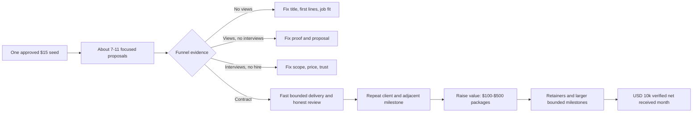
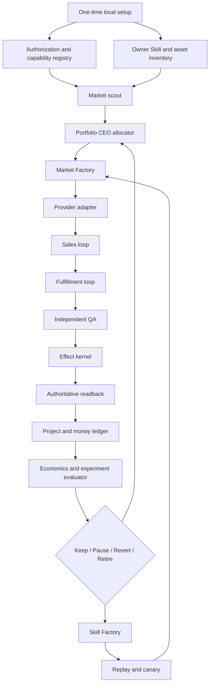
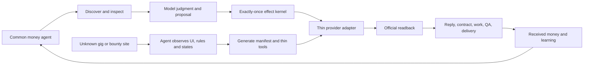
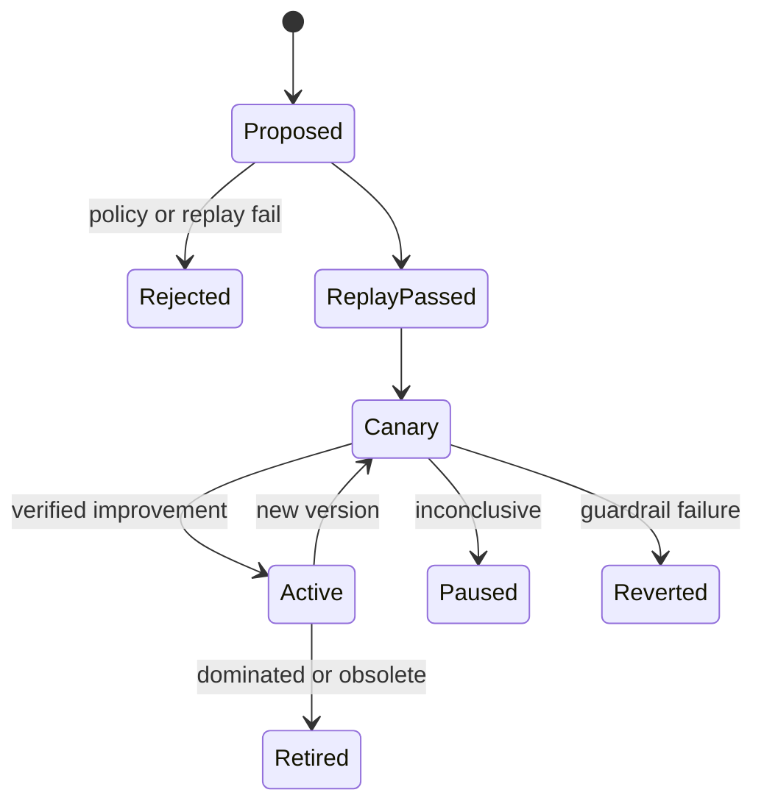
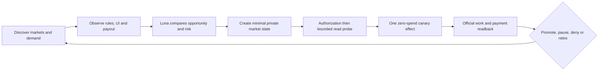
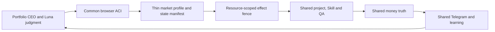
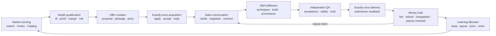
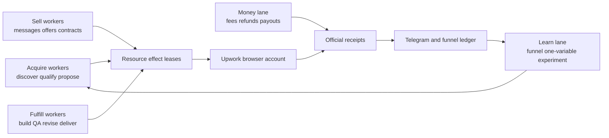
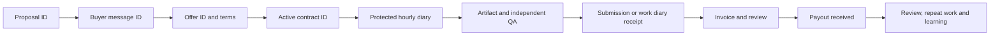

# Rockstar_ibot Open-Source Money Loop Design

## 0. Decision

Rockstar_ibot ultimately contains one revenue system, not one harness per marketplace. Coconala is the
only marketplace lane with observed completed-work earnings, Mercor is the current user-directed
recovery slice, Upwork remains an acquisition lane, and Lancers is the next provider-neutral proof
after Mercor. No market must wait for another market's revenue gate when its account,
resource lease, delivery capacity and effect fence are independent. The resident agent may run
authorized read-only inventory and zero-spend canaries across markets concurrently; an `unknown`
authorization permits only public-policy research, offline fixtures, or explicit manual observation.
Paid work, buyer messages and
unknown effects still preempt acquisition. A new market never receives a new decision brain.

Execution is vertical and atomic rather than a big-bang rewrite. Lancers first closes explicitly
authorized authenticated read-only inventory with external effects zero, then truthful
profile/external-proof grounding, then one
review-bearing non-negative-net application canary with an official proposal ID and replay duplicate
zero. Every later slice closes the next real provider boundary. The full common architecture is fixed
up front, but production acceptance advances one official receipt at a time.

The target is an open-source, local-first agent that discovers demand, builds or selects Skills,
sells work, fulfills it, verifies delivery and payment, and reallocates effort toward the highest
verified net return. It minimizes human intervention; it does not replace identity, biometrics,
CAPTCHA, tax, payout or genuinely human-only work when the provider requires those acts.

Dais has stated that the operating accounts have special approval for the intended Upwork and
Coconala automation. That authorization is an input to the capability registry, not a reason to
force those lanes into read-only mode. Public OSS installations start with no private approval and
must establish their own action-level authorization receipts.

This document changes design and implementation order only. It does not start, stop or modify the
current provider runtimes. `skills/earn/gig/TODO.md` remains the shared production-repair SSOT,
while each provider spec owns its transport/runtime sequence.

The target receipt contract is not implemented end-to-end today. The tracked shared marketplace
contract has Application/Delivery/Payment-shaped records but no mandatory Contract,
Authorization, or QA receipt, and its payment record does not prove actual costs or a bank/payout
match. No provider may claim closed-loop net revenue until that shared gap and its provider adapter
migration pass G5A below.

### 0.1 Verified revenue baseline

The local marketplace earnings ledger contains eight Coconala rows with official `検収完了` state
and `net_of_fee=true`, totaling JPY 126,438. Six August rows total JPY 62,478 through the latest
ledger event on August 12. A separate August 15 Coconala revenue-page read-back reported cumulative
JPY 129,636 and a JPY 5,460 payout request; the JPY 3,198 difference is unresolved, and neither
source proves arrival in the bank. Coconala is therefore the only marketplace with observed
completed-work earnings, but `$1K this month`, bank-received cash, and MRR remain unverified.

The inspected Rockstar_ibot marketplace revenue evidence exposes completed-work rows only for
Coconala; no settled receipt was observed for Mercor, Upwork, Lancers, or CrowdWorks. Mobile-app
subscription/proceeds permanently remain in a separate portfolio/business ledger and MUST NOT be
added to marketplace revenue or marketplace MRR. Official App Store/RevenueCat receipts may enter
only that separate ledger, joined by source and occurrence month. Views, proposals, applications,
offers, pending balances, forecasts, and operator estimates
remain outside `verified_net_received`.

The Upwork account bootstrap uses the owner's normal email/password flow. It MUST NOT choose Google,
Apple or another social-login button. It creates an account only when the owner email has no Upwork
account; otherwise it signs into the existing account to avoid duplicate-account creation. Every
adapter refinement follows authenticated observed Upwork state, not a speculative cross-provider
abstraction.

Current bootstrap state: the owner confirmed no prior Upwork account. A new freelancer account was
created through Continue with Email, its verification email was completed, and a fresh normal
email/password login returned `/nx/create-profile/` with the same owner identity twice. No
Google/Apple/social-login route was used. U1 and U2 are closed; U3 factual profile onboarding is the
first incomplete outcome.

U3 is closed. The authentic owner headshot is attached and Upwork reports `Your profile is ready!`.
Published profile `~01f5fe272d6df34084` reads back Status Online, More than 30 hrs/week and 40%
completion. Identity remains Unverified and Connects is 0; U4 must observe a real proposal entry to
determine whether either state is a submission gate before money is spent.

U4 is closed with a zero-effect live receipt. The observed proposal entry requires 18 Connects while
the account has 0 and presents `Buy Connects to apply`; no identity-verification gate appeared at
that entry. Search and detail fields are now grounded in live Upwork DOM rather than inferred provider
schemas. U5 performs two independent discoveries before any Connects purchase decision.

U5 is closed: two independent reads of the same recency query returned the same ordered ten job IDs.
Saved jobs, proposals, messages, Connects spend and payments remained zero. U6 may now qualify one
live job using the general agent's model/tools and Upwork-local acquisition capacity. Portfolio
admission separately joins official accepted/funded work from every provider, including Coconala,
before allowing a new commitment.

U6/U7 proved qualification, proposal freezing and effect fencing on job
`~022091070478975551162`, but the job is **parked, not the first acquisition target**. It requires 26
Connects, already has 50+ proposals and asks a new 40%-complete profile with no Upwork history to win
a broad $3,000 build. Positive modeled margin did not prove first-contract probability. Treating its
Connects purchase as the next outcome was a sequencing error. The immutable payload
`9fab22a29ea169632f30c3d1a22597c1091ecb97a2897c987ac788ce1d110d19` remains retained for later
requalification; no purchase, proposal, message, contract or payment effect occurred.

U8 is closed. Upwork publicly reads back `Applied AI / AI Agent` at Mitsubishi UFJ Information
Technology, Ltd., April 2025–Present, with the sanitized factual description. The official Find Work
progressbar changed from 40% to `aria-valuenow=70` / `70% completed`; no proposal, Connects or
payment effect occurred. U9 is in progress. Portfolio proof 1, `Rockstar_ibot — Open-Source AI Agent`,
is publicly readable as project `2091143267699150848`; its bound image SHA-256 is
`ed3cef563fc2c43603f82517a48330758f1917b679f96c9ff6ac11bbff4e5136`, and the official Find Work
progressbar changed from 70% to `aria-valuenow=75` / `75% completed`. Portfolio proof 2,
`Rockstar_ibot iOS — Interactive UX Prototype`, is publicly readable as project `2091143845069127680`;
its bound image SHA-256 is `fe867ffd64ef8d055a0b326eefa641aa919a67a77cba6f9db8cc497c07eb4e6d`,
and the official progressbar then read `aria-valuenow=80` / `80% completed`. Portfolio proof 3,
`Daily Affirmations — Published iOS App`, is publicly readable as project `2091144398831636480`;
its bound image SHA-256 is `13746c887768c85292980c7a7068396b935bad81e355d57e932f7e538344ef2d`,
and the official progressbar then read `aria-valuenow=85` / `85% completed`. GitHub linking was not
used because no GitHub web credential or session exists and resetting the account would disrupt existing
repository operations. Instead, the factual second Employment History item, `Marketing Intern` at A10 Lab,
January 2020–January 2021, is publicly readable and moved official completion to
`aria-valuenow=95` / `95% completed`. U9 is closed: the factual `EEG and Machine Learning Research`
Other Experience item is publicly readable with NAIST/ATR, April 2024–April 2026, EEG, machine
learning and mind-wandering detection preserved exactly. The official Find Work progressbar now reads
`aria-valuenow=100` / `100% completed`. The main Upwork path next searches for and applies to a
small paid job with bounded scope, low competition and delivery in one to three days. The unfinished
Project Catalog project remains a private draft. Under the locked zero-spend policy it now becomes an
inbound bootstrap gate alongside invitations and direct offers. For each qualified public job
the loop opens the proposal surface, records the exact Connects requirement, and submits immediately
when authorized free Connects capacity is sufficient. Freelancer Plus, Availability Badge and
proposal boosting are not prerequisites. With Connects purchasing permanently disabled, the loop
MUST continue read-only discovery, candidate aging,
qualification, factual proposal sealing, onboarding-reward inspection, inbox/invitation polling and
Project Catalog inbound acquisition so a zero balance never blocks all acquisition work.

U10–U12 are now closed for first candidate `~022091106411892491962`, a $15 fixed-price
20–30 minute student usability test posted two hours before observation. The owner evidence matches
all explicit gates: current NAIST master's student, age 24, English-capable, AI-tool user, and willing
to share screen/audio for the recorded session. Official job readback showed 10–15 proposals, zero
interviews, verified payment and phone, seven required Connects, and zero available Connects. Connects
History has zero balance and zero transactions; the account UI exposes no free onboarding reward or
monthly grant, while Buy Connects offers only 100 for $15 plus tax. The exact $15 proposal and five
screening answers are frozen at SHA-256
`c37eed9c7a41a712f373504ea1a0555eb6be4a60b4f772763c64d8899c68e926` with no unsupported
claims or attachments. Submission still needs seven Connects; no proposal effect occurred. U13 now
keeps this and at least two backup applications submission-ready while wallet authority is absent.
The official Proposals and Offers readback also shows Offers 0, Invites 0, Active proposals 0 and
Submitted proposals 0; the Invites tab is empty and no educational Connects reward banner is exposed.
There is therefore no current zero-Connect submission path for this account. Free monthly Connects
are offer-dependent rather than a guaranteed refill on a known date; the account's official Connects
history is the only acceptance source for a grant. Publishing a Project Catalog listing does not
create proposal capacity, but it lets clients purchase a bounded service without a freelancer proposal;
therefore it is a distinct zero-Connect acquisition path rather than a prerequisite for outbound jobs.

The proposal effect kernel remains ready before live execution. Under the zero-spend policy, the
active work is to re-read the first candidate, mark it stale if its official state changes, maintain at
least three independently qualified backup candidates, seal one factual proposal per live candidate,
and poll Connects history, invitations and messages without mutation. It persists the full canonical proposal and
Connects pre-state, admits one concurrent submitter through an atomic compare-and-set, re-hashes the
durable body before effect, and verifies only a matching official proposal plus Connects post-state.
Timeout or lost-ack without readback remains `reconcile_unknown` and cannot resend. Live submit and
live replay remain intentionally unclaimed until the replacement first-job candidate passes the new
bootstrap qualification gate.

The production read-only browser provider is implemented. It uses the hidden-target helper and the
dedicated `gig-upwork` profile; sharing the logged-in Coconala browser is forbidden. Live readback
previously proved balance 0, no Connects transactions, Offers 0, Invites 0, Active proposals 0 and
Submitted proposals 0. The five-minute provider contains no buy, billing, Plus or boost command.
Its missing production dependency is now explicit: `ai.anicca.rockstar_ibot-upwork-browser` owns the
existing authenticated profile on 9233 by reusing `launch_gig_browser.sh`; the provider names that
label. Native launchd has accepted the exact plist and release, but the host disk policy blocks the
browser before Chromium starts. The provider therefore keeps the last official inventory unchanged;
fresh 9233 readback remains open.
The dedicated label `ai.anicca.rockstar_ibot-upwork-free-loop` is loaded from immutable release
`c8d2a990351f02d72537d521c10faad2525b867c` at a 300-second interval. Two real wakes both exited
zero, updated only `observed_at`, reproduced identical official evidence hashes and emitted zero
stderr bytes; no proposal, Connects or payment effect occurred.

## 1. Goal, objective and boundaries

### 1.1 Goal

Build a portfolio agent that repeatedly performs:

```text
demand → qualified offer → sale → verified fulfillment → received money
       → attributed economics → one bounded improvement → repeat
```

The portable Mercor browser owner and terminal Mercor/Inbox reporting are packaged and clean-HOME
verified. The active engineering gate is GUI-capable resident continuity with two scheduled Mercor
wakes and one Inbox wake, including a live Telegram ACK or durable `delivery_unknown`. The first Mercor money gate is one
selected application through contract, authorized work, independent QA, delivery, and official payout
`received`. Lancers remains the next provider-neutral acquisition proof after Mercor. USD 10,000
verified net received in one complete calendar month and the
long-range JPY 10,000,000 verified net monthly revenue gate remain scale outcomes, not serialization
gates or income promises.

### 1.1A Coconala-to-Mercor scale thesis

Coconala proves that the Rockstar_ibot acquisition → negotiation → fulfillment → completed-work
earnings loop can produce real marketplace value. Mercor adds global English-language discovery,
role reuse across applications, Japan-supported payouts, and higher displayed hourly planning bands.
Those properties justify prioritizing Mercor, but they do not make USD 10,000 easy or guaranteed.

The scale hypothesis is tested, not asserted:

```text
Coconala proof
→ one Mercor selected contract
→ one accepted delivery and settled payout
→ repeat the same profitable work unit
→ add a second independent provider
→ USD 10,000 complete-month verified_net_received
```

`$1K → $10K` is a tenfold verified-net target. Applications and displayed hourly rates affect the
forecast only. Promotion requires observed selection rate, paid utilization, delivery time, revision
load, fees, tool/model cost, refunds, human minutes, and bank/payout reconciliation.

Official evidence: Mercor says completed assessments “automatically populate when reused in subsequent
applications” ([Apply for a Job](https://talent.docs.mercor.com/how-to/apply)), lists Japan under
Stripe-supported countries ([Supported Countries](https://talent.docs.mercor.com/policies/supported-countries)),
and says hourly contractors are paid every Wednesday
([Payments](https://talent.docs.mercor.com/how-to/payments)). These facts support reach and payout
feasibility, not conversion or income.

### 1.2 Objective function

The allocator maximizes long-run verified contribution, not gross proposal value:

```text
recognized_cash(M) = sum(official payout rows with status=received and received_month=M)
                   - sum(post-payout refunds and chargebacks whose occurrence_month=M)

verified_net_received(M) = recognized_cash(M)
                         - Connects_or_bid_cost_charged_once_in_M
                         - model_and_tool_cost_charged_once_in_M
                         - subcontractor_cost_charged_once_in_M

portfolio_utility = expected_verified_net
                  + expected_reputation_and_review_value
                  + expected_repeat_client_value
                  + reusable_skill_and_market_learning_value
                  - capital_at_risk
                  - deadline_and_refund_risk
                  - account_health_risk
                  - scarce_human_minutes_cost
```

Hard constraints always dominate the score: authorization, identity, customer confidentiality,
budget caps, delivery capacity, quality, effect idempotency and receipt integrity.
Luna judges the non-cash terms from full natural-language evidence. Deterministic code calculates only
official numeric fields, reservations, dedupe, effect/readback and accounting. "Cheapest" is never an
independent objective: the bootstrap target is the smallest truthful scope that can produce an official
review, remains non-negative after fee and execution cost, and has positive long-run utility.

The public open-source default remains `spend_cap_usd=0`. A local owner may separately sign one
bounded capital policy: `bootstrap_connects_seed_usd=15`, `seed_count=1`, `auto_top_up=false`. That
receipt authorizes the resident agent to buy the currently read-back 100-Connect bundle once and use
it only for ordinary proposals. Without that receipt the loop never opens billing. The seed does not
authorize Freelancer Plus, proposal/profile boosts, Availability Badge or the 35-Connect identity
badge. Insufficient balance keeps candidates sealed; it never silently broadens the capital policy.

After the first official payout `received`, acquisition becomes self-funded. The loop may accumulate
up to 10% of trailing verified net received as an acquisition reserve, capped at USD 15 per calendar
month until three independent paid reviews. It buys no bundle until that reserve covers the whole
official price, never charges the owner's external wallet, and never auto-renews. Every Connect cost
is charged once to the job/strategy that consumed it. After three reviews, the allocator may change
the cap only through an evidence-backed experiment using received-cash ROI, not application volume.

Zero-spend acquisition MUST continue alongside any seed: claim only account-visible
onboarding/education rewards, respond to qualified invitations at zero Connects, publish and monitor
one bounded Project Catalog service, accept qualified direct offers, then spend only granted or returned
Connects on a small public job. A normal public `Apply now` path is never classified as zero-cost unless
its official proposal surface explicitly reads back `connects_cost=0`.

### 1.2A Upwork evidence-backed first-job example

The agent does not spray proposals or rely on a hidden zero-Connect category. For the first 100
Connects it uses the current Upwork filters and full job detail to prefer recent jobs with fewer than
15 proposals, verified payment, clear bounded acceptance criteria, credible client hiring/spend and
one-to-three-day delivery by the general agent. It does not boost. A concise proposal leads with the
client's specific problem in the first two sentences, names the exact deliverable, binds truthful
portfolio proof and stays within the displayed budget. Upwork's current guidance says only the first
couple of proposal sentences appear initially and reports that profiles with portfolio items are hired
more often; both are treated as hypotheses measured on this account, not guaranteed conversion.



Ten submitted proposals with zero views stop new proposal spend until the profile/title/first-lines
canary changes. Five viewed proposals with zero interviews stop spend until proof/proposal changes.
Interview without hire changes scope, trust or price. These are bounded diagnostic windows, not
hardcoded semantic rejection rules; the model judges each job and changes one strategy variable.

The first contract optimizes for a real outcome and honest review, not lowest possible headline price.
After one review, reuse the same deliverable and seek repeat/adjacent work. After three independent
reviews, move from micro-projects toward $100-$500 packages; after repeatability, prefer recurring
maintenance and bounded $500-$2,000 milestones. Ticket size remains an output of observed close rate,
delivery time, revisions, actual fee (currently 0%-15% per contract), refunds and received net. USD
10,000 is achieved by repeatable value and repeat clients, never by counting Pending/Available or by
assuming a fixed number of jobs.

Rising Talent is useful but not a bootstrap purchase target: current eligibility also requires an
Upwork invitation or at least $250 earned plus other account conditions, and its ID badge costs 35
Connects. The agent monitors badge eligibility and claims the 30-Connect award if granted, but does not
spend the first proposal seed chasing the badge. Tax information and a matching withdrawal method are
completed before payout; they are payment-readiness ceremonies, not acquisition claims.

During the Upwork proof, `delivery capacity` means active Upwork contracts only. Coconala, Lancers and
other provider work MUST NOT be projected into Upwork capacity, and Upwork state MUST NOT serialize an
independent market. The Portfolio CEO allocates across all fresh market inventories while reserving
accepted scope against the exact provider/project resource.

Each received payout must equal its gross payment minus fee and every refund/chargeback occurring on
or before that payout. Those pre-payout adjustments are already inside the payout amount and are not
subtracted again; only later adjustments become separate negative revenue. The provider fee is also
never subtracted twice.
`Work in progress`, `In review`, `Pending` and `Available` remain operational pipeline fields only;
none is revenue. A payout received after the contract month enters the payout's received month. A
later refund or chargeback enters its actual later month as negative revenue without charging the
original execution cost twice. A transaction ID may belong to only one occurrence month.

One-off revenue, repeat revenue and MRR remain separate. Missing source windows, fees, payout IDs or
project joins are `unknown`, not zero. Only official payout `received` plus complete actual cost
evidence enters `verified_net_received` or the USD 10,000 gate.

### 1.3 Human-minimized contract

Normal operation is autonomous. Human involvement is represented as a typed ceremony, never an
open-ended “please do the rest” handoff:

| Ceremony | Example | Resume evidence |
|---|---|---|
| `identity` | KYC, live interview, biometric or CAPTCHA | Provider state changed to verified |
| `financial` | Bank, tax or payout ownership | Official payout method ID/state |
| `physical_capture` | Required human voice, device or location observation | Bound source artifact hash |
| `client_reserved` | A client explicitly reserves a decision for a human | Client message/contract clause |

The scheduler continues all unrelated lanes while one ceremony waits. The optimizer measures both
net revenue and human minutes so that agent-doable work is preferred when expected economics are
otherwise equal.

### 1.4 Non-goals

- No second scheduler, second commerce ledger or second browser harness.
- No guaranteed-income or “everyone becomes a millionaire” claim.
- No identity impersonation or falsified experience, location, credentials or work receipts.
- No blind retries after an uncertain external effect.
- No revenue recognition from views, proposals, offers, balances, estimates or test payments.
- No self-modification of authorization, effect fences, receipt validation or accounting rules.
- No simultaneous implementation of ten markets before the preceding market closes its gate.
- No Google/Apple/social login for the owner Upwork account.
- No speculative framework. Extract only behavior already proven by Coconala and Upwork, then require
  every later market to reuse it without kernel changes.

## 2. Evidence and repository lessons

### 2.1 Existing Rockstar_ibot evidence

| Existing component | Reuse |
|---|---|
| `application_direct.py` | Discover, qualify, persist intent, apply and reconcile pattern |
| `reply_detector.py` | Changed-thread detection, durable inbox identity, concurrent bounded replies |
| `paid_direct.py` | Contract/order fulfillment and delivery owner pattern |
| `storefront_direct.py` | Inbound catalogue/storefront management |
| `connector_outbox.py` | SQLite intent/action lifecycle, lease, retry and dead-letter behavior |
| `application_effect_fence.py`, `project_effect_fence.py` | Exactly-once mutation fence |
| `project_ledger.py`, `work_event_projector.py` | Canonical project and work state |
| `category_bandit.py`, `experiment_evaluator.py` | Bounded allocation and keep/revert decisions |
| `gig_self_fix.py`, `selfimprove_consumer.py` | Evidence-bound repair proposal and execution |
| `apps/rockstar_ibot/lib/loop-adapter-registry.js` | `plan/execute/reconcile/verify/report` adapter contract |

The adapter registry focused suite passed 13/13 and the Founder CEO evaluator, bandit, registry,
rollback and scale suites passed 75/75 during design research. These results justify reuse; they do
not prove any new marketplace path.

### 2.2 External repositories: learn what, reject what

| Repository | Learn | Reject |
|---|---|---|
| [OpenClaw@4c866a9](https://github.com/openclaw/openclaw/tree/4c866a9) | Skill discovery diagnostics; durable cron lease and interrupted-owner recovery | Replacing Rockstar_ibot or adding another resident agent |
| [OpenAI Agents JS@a47c6ee](https://github.com/openai/openai-agents-js/tree/a47c6ee) | Deferred Skill discovery, call/result correlation, tool guardrails and tracing | Provider policy or commerce state delegated to prompts |
| [Temporal TS samples@69c5360](https://github.com/temporalio/samples-typescript/tree/69c5360) | Reverse-order Saga compensation and recoverable workflow identity | A Temporal service dependency before local SQLite fails |
| [Argo Rollouts@9f8d111](https://github.com/argoproj/argo-rollouts/tree/9f8d111) | `Successful/Failed/Inconclusive`, canary pause, abort and rollback window | Kubernetes as the local runtime |
| [CloakBrowser@7b08984](https://github.com/CloakHQ/CloakBrowser/tree/7b0898497626153a76ce3fd07fbba9b86ca317bc) | Persistent authorized sessions, Playwright surface, CDP input and browser isolation | Treating transport reliability as authorization |
| [browser-use@85ddbfe](https://github.com/browser-use/browser-use/tree/85ddbfedf609166b2d2c76c3d80506649fee82a9) | Serializable history, page fingerprints, loop detection and recovery | Replacing CloakBrowser or trusting model-declared success |
| [upwork/python-upwork@a8d8c1a](https://github.com/upwork/python-upwork/tree/a8d8c1a349d4331b07d57e60c95cb929e37a68fc) | Client/auth fixture shape; its inspected suite passed 116/116 | Deprecated OAuth1 SDK as a runtime dependency |
| [AIHawk@79155b5](https://github.com/feder-cr/Jobs_Applier_AI_Agent_AIHawk/tree/79155b52faccfbd19b834680af285eac70dd2df4) | Profile, resume and generated-artifact organization | Interactive auto-apply runtime without authoritative readback |
| [FiverrAutomation@131f3cf](https://github.com/OminousIndustries/FiverrAutomation/tree/131f3cf9e13eb5edbeb397f32fcb87625a3b6858) | Negative example: why effect identity and readback are mandatory | Fixed coordinates, OCR success guesses and unverified Deliver clicks |

The Agent Skills format supplies a portable directory with at least `SKILL.md`: [Agent Skills
specification](https://agentskills.io/specification). Rockstar_ibot adds a machine-readable manifest
and workflow next to it rather than inventing a second Skill format.

### 2.3 Provider evidence and authorization precedence

Public rules are the safe open-source default. Account-specific or project-specific written
approval may authorize more, but only for the named account, action, transport, jurisdiction and
terms version.

| Provider | Public evidence used by default installations | Design consequence |
|---|---|---|
| Upwork | [Automation policy](https://support.upwork.com/hc/en-us/articles/43342677368467-Use-bots-and-other-automation-properly) directs automation users to request an API key. [GraphQL docs](https://www.upwork.com/developer/documentation/graphql/api/docs/index.html) expose scoped read/write operations. | Public OSS sends no provider-facing automated request until an approved API/action receipt exists. Dais's special approval enables only its recorded actions; API is preferred and approved CloakBrowser fills authorized UI gaps. |
| Coconala | [User terms](https://coconala.com/pages/terms_user) prohibit using a device, software, or algorithm that “自動的に応答する” to delivered services. [Seller flow](https://coconala.com/pages/guide_sell) separates formal delivery, buyer acceptance, room closure, and sales reflection. | Never automate buyer-reserved acceptance. Seller automation requires an action-specific receipt; revenue starts only after official room closure/sales reflection. |
| Lancers | [Terms](https://www.lancers.jp/help/terms) define monthly work as a function where “特段の操作なく契約が更新され、毎月自動で報酬が支払われる”. | The native monthly-payment contract is not blanket permission for external bots. Resolve authorization for each automated read or effect before provider contact. |
| CrowdWorks | [Terms](https://crowdworks.jp/pages/agreement) require client inspection of delivered work, and [official flow](https://crowdworks.jp/pages/guides/employer/index) states “契約後は、『仮払い』を行うことで業務開始が可能”. | Resolve explicit authorization before any automated provider request. Work begins only from an escrow-backed contract receipt and payment only after inspection/official payout state. |
| Fiverr | [Community Standards](https://help.fiverr.com/hc/en-us/articles/32242973123985-Our-Community-Standards) reject unauthorized access and automated mass messaging. [AI guidelines](https://help.fiverr.com/hc/en-us/articles/34998793899665-Using-AI-on-Fiverr-Guidelines-for-freelancers-and-clients) preserve freelancer accountability. | Record exact approval before external automation; reuse official Personal Assistant/Auto-reply where useful, not as a human handoff. |
| LinkedIn | [User Agreement §8.2](https://www.linkedin.com/legal/user-agreement) rejects unauthorized bots, scraping and messages. | Only recorded approved/API actions become effects; otherwise it remains a lead source. |
| Mercor | [AI interview guidance](https://talent.docs.mercor.com/support/ai-interview) restricts LLM-generated interview performance. | Agent handles discovery, profile assets, scheduling and post-hire work only to the exact approved boundary; identity/interview stays a ceremony when required. |
| Prolific | [Participant AI policy](https://participant-help.prolific.com/en/articles/445029-can-i-use-ai-assistance-tools-in-my-submission) allows AI only when the researcher asks. | Permission is study-specific, not account-wide. Eligible studies may become agent lanes; others are mechanically excluded. |
| Outlier | [Community Guidelines](https://outlier.ai/legal/community-guidelines) require work without bots/scripts unless specifically required. | Project-specific authorization is mandatory; never infer it from general account access. |
| TELUS Digital | Current job descriptions include assessment, identity verification and human judgment. | Split agent-doable preparation/administration from any irreducible human judgment and measure net per human minute. |
| uTest | [Tester Guidelines](https://www.utest.com/utest-guidelines) impose cycle confidentiality. | Use an isolated project workspace and exact cycle permission; never publish customer data or fixtures. |
| Babel Audio | [Contributor jobs](https://www.babel.audio/jobs) include human voice capture. | The agent may source, schedule, validate and submit artifacts; required human voice is a typed physical-capture ceremony. |
| Welocalize | Public careers/legal/job surfaces do not establish one global automation boundary. | Resolve authorization per project and task type before mutation. |

Social posts and screenshots are opportunity hypotheses only. Claimed earnings never enter the
ledger without provider and payout receipts.

## 3. Capability and authorization model

### 3.1 Action-level receipt

Every external action resolves from this precedence:

```text
project-specific written approval
  > account-specific special approval
  > official API scope
  > current public provider rule
  > unknown
```

An authorization receipt is scoped by:

```text
(provider, account, action, transport, jurisdiction,
 terms_version, evidence_hash, issued_at, expires_at)
```

It contains no credential. Private evidence lives outside the repository. The public manifest only
declares the schema and safe defaults.

### 3.2 Runtime states

| State | Meaning | Runtime behavior |
|---|---|---|
| `approved_api` | Named API scope authorizes the action | Autonomous effect behind the shared fence |
| `approved_browser` | Special/project approval authorizes browser execution | Autonomous CloakBrowser effect behind the same fence |
| `approved_assisted` | Agent may assist but an explicit human act is required | Produce a typed ceremony and resume from provider readback |
| `denied` | Current evidence prohibits the action | Do not execute or repeatedly retry |
| `unknown` | No valid evidence | Public-policy research, offline fixtures, or explicit manual observation only; send no automated provider request |

No agent or self-improvement Skill may create, broaden or renew its own authorization receipt.

## 4. Full architecture



### 4.1 Local product setup

The installer performs one bounded ceremony:

1. Create owner-only runtime directories and isolated browser profiles.
2. Import or create the owner's factual profile, portfolio and deliverable assets.
3. Connect one provider at a time through its normal login/KYC/payout flow.
4. Record action-level authorization without storing proof or secrets in Git.
5. Configure hard caps: spend, Connects/bids, concurrent jobs, minimum margin and human minutes.
6. Run an authenticated read-only capability probe only when the exact action and transport are
   authorized; otherwise persist `unknown` without contacting the provider automatically.
7. Generate service packages the general agent can truthfully fulfill and verify; a named Skill is optional.
8. Start the first canary with one external effect at a time.

### 4.2 Market Factory

Every market passes the same gates. The factory creates no provider code until the previous gate
has evidence:

```text
research
→ authorization matrix
→ explicit authorization for the exact read action
→ authenticated bounded read-only probe
→ normalized opportunity
→ eligible offer fixture
→ one canary sales effect
→ conversation/contract readback
→ one fulfilled job
→ delivery readback
→ payment and payout receipt
→ three-job replay
→ active portfolio lane
```

The generic adapter contract is:

```text
discover() -> Opportunity[]
inspect(opportunity_id) -> OpportunityDetail
plan_effect(action, payload) -> EffectIntent
reconcile(intent) -> ProviderState
execute(intent) -> TransportAck
readback(intent) -> ProviderReceipt
list_projects() -> ProjectState[]
list_payments() -> PaymentState[]
```

Adapters own transport, selectors/API schema and provider normalization. The kernel owns eligibility,
pricing bounds, capacity, intent, QA, ledger, learning and reporting.

### 4.2A Adapter compression law

Marketplace expansion becomes smaller with every proven provider. The resident agent owns one
commercial loop; provider adapters are replaceable I/O skins, not mini-products.



Directly reusable across every market are pagination and bounded snapshots, model-owned qualification/
pricing/proposals, leases and effect fencing, project/QA/delivery, received-cash accounting and funnel
learning. Provider-specific code is limited to authenticated transport, stable entity extraction,
form actions, official state/readback mapping, provider fees/currency and unavoidable signup/KYC/
payout ceremonies. Semantic fit, category routing, price and proposal content never enter provider
code. Fixed-format provider IDs, URLs, amounts and official states may be parsed mechanically.

| Provider generation | Intended maximum new production surface | Kernel change |
|---|---:|---|
| Coconala + Upwork | Source patterns to consolidate | Only deletion of proven duplication |
| Next market | At most 3 provider files / about 300 LOC | None |
| Third market | At most 2 provider files / about 150 LOC | None |
| Later market | One manifest plus exceptional transport glue / about 100 LOC | None |

Exceeding a target pauses that adapter and first identifies the missing common primitive; it never
justifies another scheduler, planner, ledger or provider-specific decision engine. For an unknown
market the agent performs public-policy research and offline fixtures only. After an exact
action/transport authorization receipt, it may perform
`observe → map states → bounded read-only replay → generate manifest → one canary effect → official
readback`. It completes ordinary signup/login only when authorized. CAPTCHA, identity proof, tax,
payout ownership and legally human-only acts become typed resumable ceremonies. A new delivery Skill
is created only after an observed profitable opportunity cannot use existing Skills.

### 4.2B External implementation comparison and browser ACI boundary

Pinned source inspection confirms that the shared commercial kernel and thin provider boundary should
remain, but the adapter must not become a growing selector script. `browser-use/browser-use` at
`85ddbfedf609166b2d2c76c3d80506649fee82a9` demonstrates an LLM-directed observe/action loop with
step history, callbacks, bounded failures and an optional independent trace judge. `browserbase/
stagehand` at `a21633d53930abc5d62b8dbd6b608995f2ccb4b1` exposes the smaller useful browser ACI:
`observe`, schema-bound `extract` and natural-language `act`, with reusable sessions and metrics.
`Skyvern-AI/skyvern` at `47537c0e5a613f9349c0e17eacb3e5da1dff926e` additionally binds planned browser effects to an
observation epoch, page/tab/frame identity, canonical target/method and one-time approval. These are
transport patterns, not replacements for business truth.

The inspected `Sherry141/AI-Upwork-Proposal-Agent` at
`e1d7a3be874266289a0c523107f135f2266517b5` is intentionally not adopted: it accepts a manually supplied
job description and produces proposal artifacts through a fixed multi-agent graph, but does not own
market discovery, submission readback, replies, contracts, fulfillment, payout or replay-safe money
effects. Its structured proposal output is already covered by the existing schema-bound planner.

Therefore the common browser tool surface is only:

```text
observe(goal) -> page facts, stable element references, screenshot and observation identity
extract(goal, schema) -> typed provider facts plus provenance
act(goal, frozen intent) -> transport acknowledgement and action trace
readback(receipt schema) -> authoritative provider state plus provenance
```

The model chooses navigation, pagination, filters, fields and recovery from live feedback. The kernel
chooses authority, spend/capacity ceilings, effect identity, retry/reconcile state, business events,
accounting and promotion. Before any money-, message-, application-, acceptance- or delivery-changing
action, the frozen effect binds provider/account, source entity, payload hash, observation identity
and expected readback. A generic browser success or model/judge verdict can aid recovery and evals but
never substitutes for the provider receipt.

New-market implementation follows a deletion-first ladder: try the common ACI with a natural-language
market goal and schema; add a declarative state/readback manifest only for stable facts observed twice;
add provider code only for authentication, machine-stable extraction, fees/currency or a mutation that
cannot be expressed safely through the common ACI. No provider gets its own planner, scheduler,
notification path, funnel ledger or learning loop.

Ordinary marketplace forms are never provider code. Luna seals the truthful commercial intent; Terra
uses the common Browser ACI to inspect the current page, fill every visible required field, respond to
validation feedback and submit. Deterministic code may reserve spend/capacity, fence the exact intent
and parse official machine-stable IDs/balances after Terra acts. Provider-specific selector/fill code
is permitted only as an optional compiled fast path that reduces model tokens after the common Terra
path has proved the same form. It has zero judgment or authority: it cannot decide eligibility, change
intent, cause skip, block the wake or become the only route. On missing control, validation mismatch,
unknown UI or any failure before effect, the same sealed intent falls through immediately to Terra in
the same wake. Official ID/balance readback and replay rules are identical for fast and agentic
transports. DOM selectors never become one site's workflow brain.

First common-operator canary reached Terra for the AI/MCP proposal but Terra created an isolated
context, was redirected to login and made no external effect. The operator contract now requires the
provider-owned authenticated persistent default context and forbids isolated/incognito contexts,
alternate profiles and login restoration. Because the fence had already entered reconcile-unknown,
the common effect kernel now reopens the exact intent only when official resource absence plus unchanged
balance proves effect 0; otherwise it remains reconcile-only or verifies an already-visible receipt.
The following canary exposed the remaining routing defect: the browser agent guessed daily-driver CDP
9222 instead of the provider-owned authenticated CDP 9233. The common form operator now receives the
exact local CDP endpoint as ACI input and forbids endpoint discovery or substitution. This is generic
browser ownership routing, not Upwork form logic. `reconcile_unknown` is never terminal when official
resource absence and unchanged balance prove effect 0: the same immutable intent is reopened in that
wake. A verified application appends its WorkEvent and synchronously drives the existing shared
Telegram outbox before acquisition proceeds, matching Coconala's instant-effect reporting; only the
official Proposal ID plus Connects readback renders `[Upwork][応募完了]`.

Unknown-effect reconciliation also accounts for later independent effects. Official resource absence
and an unchanged raw balance prove effect 0 directly. If the raw balance changed, the common ledger may
reopen only when every delta after the unknown intent is exactly explained by other verified provider
effects; for example, unknown pre-balance 67, one later verified 21-Connect proposal and current balance
46 prove the unknown effect spent zero. Any unexplained delta remains reconcile-only. This prevents one
old unknown resource from blocking unrelated acquisition forever without permitting a blind retry.

### 4.3 Sales loop

```text
discover → inspect → eligibility → expected economics → tailored offer
→ persist intent → reconcile → apply/message → official readback
→ negotiate → contract readback
```

The system never sprays irrelevant proposals. It applies to every independently judged positive
**lifetime-EV** candidate while capacity exists, the deliverable is provable and the action is
authorized. Before the first review, reputation, repeat-client probability, reusable proof and market
learning may make a small contract preferable to a larger one; they never justify negative net,
fabricated capability or unpaid full delivery. Rate is an output of economics and account health, not
an arbitrary desire for maximum clicks.

### 4.4 Fulfillment loop

Each accepted scope binds requirements to an execution plan; an existing Skill may be reused but is
never required:

```text
contract scope
→ immutable project workspace
→ execution workflow
→ artifact hashes and provenance
→ independent QA
→ revision if needed
→ delivery intent
→ provider delivery readback
```

The builder cannot approve its own artifact. Private client material remains in owner-only project
storage and is excluded from public fixtures, prompts not authorized for that data, logs and
Telegram.

### 4.5 Exactly-once effect kernel

Every mutation uses:

```text
authorization receipt
→ immutable intent(effect_key, payload_hash, source_identity)
→ read-only reconcile
→ at most one external effect
→ authoritative provider readback
→ canonical receipt
→ ledger projection
```

An HTTP success, DOM click or model claim is not success. A crash after a possible effect enters
`reconcile_unknown`; it never causes a blind retry.

### 4.6 Skill Factory

Skills are optional cached playbooks for repeated profitable methods. The general agent can apply,
accept and execute work directly with its model and tools when no Skill exists. A missing Skill has
zero admission authority and zero execution authority: it cannot cause `skip`, `capability_gap`, a
smaller substituted scope or a request for human work. Create or improve a Skill only after real
repetition shows that packaging the method reduces cost, latency or error. Actual impossibility is
decided from the required outcome, available general tools, policy, time and economics—not inventory.

Regression incident and permanent fix: Upwork independently added `INSTALLED_SKILLS` to its planner
and required every job to be covered by that inventory, while the working Coconala planner explicitly
says missing exact skill/tool/domain experience is never a prohibition. This caused feasible computer
work such as `Mobile App and Website Developer` (`~022091720689866384000`) to be skipped solely because
no Android Skill was installed. Coconala and Upwork now import one
`common_marketplace_feasibility_policy()` SSOT; provider prompts receive no Skill inventory. Exact
read-only replay of the same official evidence changed the decision from `skip` to `submit` at USD
35/hour, with a truthful phased iOS/Android/Web plan and zero external effect. Every market conformance
test must reject a provider prompt containing `INSTALLED_SKILLS`, `installed Skills can complete`, or
any missing-Skill skip authority.

Feasible work is submit-by-default, with high-value work prioritized. A proposal is not an acceptance
of unlimited duration or undefined scope. Missing budget/rate, unverified payment, new-client or low
hire history, competition, Connects cost, advertised duration and ordinary unanswered implementation
details affect ordering, price and questions but never independently authorize skip. Economic skip is
valid only when official displayed compensation makes every truthful scoped offer clearly negative.

Production verification: release `71d41b8e35` evaluated ten current candidates with one Luna call,
returned two `submit` and eight `skip`, and produced zero missing-Skill reason. The two submits were a
USD 500 translation job and a USD 30–50/hour AI/MCP integration job. A later Telegram message for
`~022091501939090462355` still cited a mobile Skill, but its decision occurred at 18:41:30 before the
repaired wake began at 18:51:54; the delayed outbox sent it at 18:59:26. It was stale notification
delivery, not repaired-policy output. Three remaining pre-repair Skill-based unknown reports were
fenced at the existing retry ceiling so they cannot be redriven; history and WorkEvents remain intact.

The submit-by-default refinement was then replayed read-only over the same ten official candidates. It
returned eight `submit` and two `skip`; the only skips required phone/live customer handling. Mobile
App and Website, AI/MCP integration, Claude marketing, Voice AI product work and other feasible jobs
all became submit. Missing Skill, unverified payment, new-client history, duration and Connects alone
produced zero skip. The production transport then closed AI/MCP proposal `2091839815472439297`,
Japanese translation proposal `2091842071424061441`, and OpenClaw agent proposal
`2091845545298235393`. An earlier effect-0 market-survey intent was later reconciled across the
intervening 21-Connect verified effect, reopened at the current balance and submitted as proposal
`2091851780096692225`. Its exact Connects delta is `46 -> 35` and Telegram ACK is `32209`. Each effect
has one official ID, one ledger row and one instant Telegram event. Current official truth is eight
submitted proposals, 35 Connects, zero replies, zero offers, zero contracts and payout-received USD 0.

Owner acquisition policy now preserves the remaining Connects while the first eight-proposal cohort
can produce reply/interview evidence. The existing owner bound `connects_cap=0` pauses only public
Connects-spending proposals. Each wake still reads Messages, invitations, Direct Offers, contracts,
Project Catalog and finance before that gate, so zero-Connect acquisition and every downstream money
lane remain 24/7. This is not a loop shutdown or a permanent proposal quota. The Portfolio CEO may
restore a positive cap after cohort evidence or replenished/returned Connects justify more spend.
The first production pause wake read official balance 47 after a 12-Connect return/grant, preserved all
47, observed messages/invites/offers/contracts all zero, created no form effect and exited 0 with
`free_acquisition.state=connects_spend_paused`.

Pre-contract downstream readiness is complete at fixture/conformance level. Inbox, negotiation,
message effect, Offer economics/capacity, Offer acceptance, delivery, revision and finance/chargeback
pass 66/66. Immutable project workspace, frozen workflow execution, independent deliverable QA,
delivery, revision and finance pass another 41/41. The missing evidence is not another implementation:
no client has yet produced a real message, Offer or contract, so the first production official IDs and
the first contract-to-payout-received path remain event-driven.

The readiness audit then found two real integration defects hidden by component-only tests:
`project_workspace.create_workspace()` had no resident production caller, and `workflow_executor`
treated an installed named Skill as execution authority. The common executor now supports an immutable
`general-agent` workflow whose model and local tools choose the method; named Skills remain optional,
hash/version-checked cached playbooks. After a profitable Offer is accepted and an official contract ID
is read back, the resident Upwork owner creates the common owner-only workspace from the exact frozen
scope/deadline/terms and contract readback. Verified-effect replay repairs a missing workspace without
another Offer click. Focused integration passes 49/49 and the complete combined downstream suite passes
86/86. Production contract IDs remain zero, so no fabricated live workspace or delivery is claimed.

The next call-graph audit found that a created workspace still had no resident production caller for
build or QA. A provider-neutral `project_worker.py` now claims one workspace, runs the frozen general
workflow once, invokes a fresh read-only reviewer, applies the deterministic artifact/contract/privacy
verifier, writes a durable QA receipt and advances only to `deliver` after PASS. It has no marketplace
capability. Offer-effect replay may spawn it again, but the workspace lock and receipts make builder,
reviewer and external effects all zero on replay; different contracts use different processes and
locks. The combined downstream suite now passes 87/87. The next unclosed boundary is QA PASS to the
correct provider delivery mode: fixed-price official milestone submission versus hourly protected time
tracking. No live client Offer exists yet, so production build, QA and delivery effects remain zero.

A Skill bundle is immutable and versioned:

```text
skills/<name>/SKILL.md
skills/<name>/skill.manifest.json
skills/<name>/workflow.json
skills/<name>/tests/
```

Lifecycle:



The factory may compose existing Skills before creating code. It may change offer copy, price within
bounds, category allocation, schedule and workflow ordering. It may not mutate authorization,
identity, accounting, receipt or effect-fence rules.

### 4.7 Portfolio CEO

The CEO chooses one next action from all active lanes:

1. Protect deadlines, revisions, account health and already-paid work.
2. Reconcile unknown external effects before creating new ones.
3. Complete the highest expected verified-net work within capacity.
4. Acquire the highest expected-utility eligible opportunity.
5. Run one bounded experiment when the causal window is complete.
6. Build or repair one Skill only when an observed bottleneck has no existing Skill solution.
7. Retire dominated, unprofitable or authorization-expired lanes.

This is the general money-maximizing agent: not an unconstrained model, but a durable portfolio
allocator whose rewards come only from external receipts.

### 4.8 Founder exploration loop

The portfolio agent does not wait for a human to name every market. After paid work, replies, offers
and unknown effects are safe, it spends bounded public-policy/offline research capacity discovering
new gig, bounty and contracting markets. Provider-facing observation starts only after exact read
authorization. The model—not a keyword list—evaluates visible demand, general-agent feasibility, expected
net cash, payout accessibility, platform rules, automation permission, competition, required human
minutes and account ceremony cost.



The agent first reuses existing credentials, profile facts, portfolio proofs and optional Skills.
Neither a missing provider adapter nor a missing named Skill blocks feasible model-and-tool work.
Ordinary signup/login and provider UI are agent-owned. CAPTCHA, biometrics, identity documents, tax and
payout ownership are typed resumable ceremonies. Owner-funded spend outside an existing cap remains a
human authorization. A new market starts with the common Browser ACI and adds only a manifest plus
unavoidable fixed-format ID/state/fee/readback glue. Navigation, qualification, proposal, conversation
and ordinary forms remain Luna/Terra work. A successful trace becomes deterministic code only after
repetition proves that extraction reduces cost, latency or error without taking judgment from the
model.

Every active market runs the same lifecycle concurrently under separate durable state:
`discover → propose/list → reply → contract/order → Skill work → independent QA → delivery → received
cash → learning`. Paid work and buyer replies always preempt exploration. Cross-market learning shares
winning Skill, buyer problem, proof type, price band, delivery time, revision rate and verified net;
private customer content and credentials never cross projects.

### 4.9 Cross-market blitz-scaling contract

Upwork remains an active USD 10k scale goal, not a serialization gate for other markets. The
user-directed active engineering slice is Mercor resident-runtime recovery; Lancers remains the next
provider-neutral acquisition proof after that slice. Other markets may run public-policy research,
offline preparation, and authorized provider actions concurrently. No `unknown` lane sends an
automated provider request. Paid work, buyer messages and unknown effects retain higher priority, but
one market never pauses independent work on another.

All markets use one commercial brain and one set of rails:



A market may add only its authenticated profile reference, stable official entity/state mapping,
fee/currency/payout normalization and unavoidable mutation/readback glue. It may not add a scheduler,
planner, proposal brain, inbox brain, project system, QA system, notification service, funnel ledger,
money ledger or learning agent. Navigation, pagination, filters and ordinary forms remain model-driven
through `observe/extract/act/readback`. When a market needs more than about three glue files or 300 LOC,
implementation stops and extracts the missing shared primitive before continuing.

Lancers' provider-native automatic proposal surface remains inventory until the system can prove that
each resulting proposal received its own Luna judgment, immutable intent and official readback. Native
automation may reduce transport cost; it may not bypass the common commercial brain or create effects
whose candidate-level decision evidence is missing.

### 4.9A First-trust bootstrap contract

The first job on a zero-review market optimizes for an honest official review and repeatable proof, not
the absolute lowest price. The model prefers a review-bearing project or package with bounded scope,
objective acceptance, credible client history, short feasible delivery, reusable proof and
non-negative verified net. Work types that do not improve the market's principal reputation signal are
ordinary cash opportunities, not reputation bootstrap substitutes. Before underpricing, the agent uses
any provider-supported truthful external-experience import and reads back its official profile effect.

Every application is attributed to the profile, proof, proposal and price strategy versions that
produced it. Funnel evidence is input to Luna, not a hardcoded router: no view suggests profile/fit/first
lines; view without reply suggests proof/proposal; reply without contract suggests scope/price/trust;
contract without received cash suggests fulfillment or payout. The agent changes one variable, waits
for a causally usable official window, then returns `insufficient_evidence`, `keep`, `pause`, `revert`
or `retire`.

Sources: Lancers states that fuller profiles correlate with higher order rates
([profile guide](https://www.lancers.jp/help/beginner/lancer/profile)), supports reviewed external work
history ([external achievements](https://www.lancers.jp/faq/l1001/1085)), and does not project accepted
task work into the principal profile performance/evaluation
([task evaluation](https://www.lancers.jp/faq/l1034/161)). Freelancer likewise states that reputation
affects bid ranking
([rating and bid ranking](https://www.freelancer.com/support/profile/tips-to-boost-your-freelancer-rating-and-bid-ranking)).

### 4.10 Canonical repository and private-runtime tree

OSS uses the existing repository boundaries; it does not create a second framework or one Skill per
market. The target tree is:

```text
rockstar_ibot-main/
├── skills/_shared/marketplace-core/
│   ├── schemas/
│   │   ├── market-inventory.schema.json
│   │   ├── opportunity-decisions.schema.json
│   │   ├── effect-intent.schema.json
│   │   ├── provider-receipt.schema.json
│   │   └── money-truth.schema.json
│   └── scripts/
│       ├── browser_aci.py
│       ├── resource_lease.py
│       ├── effect_kernel.py
│       ├── work_events.py
│       ├── money_truth.py
│       └── provider_conformance.py
├── skills/earn/gig/
│   ├── SKILL.md
│   ├── config/markets/
│   │   ├── upwork.json
│   │   ├── fiverr.json
│   │   ├── lancers.json
│   │   ├── crowdworks.json
│   │   ├── freelancer.json
│   │   ├── mercor.json
│   │   └── ugig.json
│   ├── scripts/
│   │   ├── portfolio_ceo.py
│   │   ├── market_loop.py
│   │   ├── fulfillment_router.py
│   │   └── providers/          # only unavoidable auth/state/fee/readback glue
│   ├── tests/conformance/
│   ├── fixtures/redacted/
│   │   └── <market>/
│   └── install.sh
└── docs/gig-money-loop-install.md
```

This is a destination, not permission to scaffold empty abstractions. Existing files move into the
shared boundary only when a second real market proves reuse. A market manifest contains official URLs,
stable entity/state vocabulary, currency/fee/payout mapping and supported effect names; it contains no
semantic qualification rules, selectors-as-strategy, proposal copy or credentials. Provider glue is
deleted when the common browser ACI can express the same verified behavior.

Private runtime never enters git:

```text
~/.local/share/anicca/credentials.json
~/.config/anicca/gig/markets/<market>.json
~/.cloak/profiles/gig-<market>/
~/gig/state/markets/<market>/
~/gig/projects/<provider>/<contract>/
~/gig/telegram-outbox.sqlite3
~/gig/work-events.jsonl
```

OSS alpha requires a zero-secret isolated install, safe zero-spend defaults, one redacted Upwork
discover→decision→effect/readback replay, duplicate effect 0 and documented local account ceremonies.
OSS stable additionally requires the same conformance suite on a second market through `received`, a
clean-device receipt, no original operator paths/data and provider-only additions within the thin-glue
budget. Tests or fixtures never substitute for the required real provider receipts.

Mercor's tracked portable browser owner, restored provider lane, and terminal Mercor/Inbox receipt
paths pass clean non-Dais HOME release replay. Mercor OSS alpha still requires isolated live private
state, a real Telegram delivery read-back, and a redacted
application replay. Mercor OSS
stable requires one real selected contract through authorized work, QA, delivery, acceptance, settled
payout, and bank/payout match. It reuses the existing Agent Skills `SKILL.md` format and shared
marketplace receipts; it does not create a Mercor framework or second executor.

## 5. Market execution state

Every authorized market may progress concurrently from current evidence. The table records the current
execution role, not a gate that forces one market to wait. Allocation follows measured opportunity,
long-run utility, authorization, delivery capacity and human-minute evidence.

| Role | Market | Intended lane | Unique lesson / Skill |
|---|---|---|---|
| Revenue reference | Coconala | Active acquisition/storefront/paid owners with JPY 126,438 observed net-of-fee completed-work earnings; bank join remains open | Reference effect fence, inbox, paid project, receipt and learning |
| Running | Upwork | Continue acquisition and event-driven downstream lanes | Outbound proposals, Connects economics, contract/milestone lifecycle |
| Next provider proof | Lancers | First-trust profile → application canary → review-bearing payout | Unknown-site ACI, external proof, Japanese contracts and payout |
| Next evidence | Freelancer | Existing account, projects and bids | Bid economics and milestone/payment mapping |
| Next evidence | CrowdWorks | Existing Japanese account | Project/task contracts and escrow mapping |
| Authorized read-only | uGig | Existing account and invoice flow | Fast conformance using already-configured state |
| Authorized read-only | Fiverr | Inbound catalogue plus custom offers | Gig experiments, inquiry and order/revision lifecycle |
| **Current recovery** | **Mercor** | Resident wakes → human-gate identity → shared money receipts → selection/contract/work/payout | Matching, interviews, authorized task work and identity ceremony |
| Discovered | Authorized bounty and new markets | One bounded zero-spend canary at a time | Founder discovery and shrinking adapter cost |

Each later market may finish as `active`, `assisted`, `denied` or `unprofitable`. Upwork denial or
negative margin remains visible evidence and never weakens the shared kernel; the CEO may redirect
capacity only after the active paid/unknown work is safe.

## 6. Upwork reference adapter

Upwork is the reference adapter for Connects accounting and outbound proposal effects. It is not a
global gate for independent Coconala, Lancers, Mercor, or CrowdWorks lanes.

### 6.1 First-contract acquisition policy

The first Upwork objective is one verified paid review, not maximum headline contract value and not
maximum application volume. The deterministic acquisition order is:

1. Add the required factual Employment History item and read back the required-profile baseline.
2. Publish three reusable portfolio proofs, then add only truthful optional items until the main
   profile reaches official 100% readback.
3. Complete account-visible free onboarding/education tasks and verify any Connects award in history.
4. Publish one narrow Project Catalog service and monitor qualified inbound orders/messages.
5. Monitor qualified invitations and direct offers, which require no purchased proposal capacity.
6. Discover recent jobs and prefer clear acceptance criteria, low proposal count, verified payment,
   client hiring history, low Connects and one-to-three-day delivery.
7. Continuously replenish every positive-EV qualified candidate while submission capacity is
   unavailable; re-read official job state before every proposed effect.
8. Freeze a tailored proposal only when the reusable proof matches the job; never deliver the
   client's complete solution as unpaid application work.
9. Use invitations or granted/returned Connects when present; never purchase acquisition capacity.
10. Submit each authorized proposal exactly once, then close contract, delivery, received payment and
   honest review before increasing price or scope.

The loop optimizes the measured funnel
`discovered → qualified → proposed → viewed → interviewed → hired → delivered → paid → reviewed`.
Ten qualified proposals without a view trigger a profile/first-lines/proof correction; they do not
automatically authorize more Connects spend. Project Catalog, invitations and proposals share the
same contract, delivery, payment and review receipts after acquisition.

### 6.1A Beginner-to-USD-10k operating ladder

The strategy assumes no prior reviews, invitations, repeat clients or referrals. It cannot guarantee
income; it runs staged evidence gates until cash reaches USD 10,000 or Upwork proves unprofitable.

| Stage | Objective | What the loop does | Exit evidence |
|---|---|---|---|
| Control plane | Restore trustworthy observation | Native Aqua owner verifies or restarts the existing browser job; one fresh provider wake reconciles account, Connects, Catalog, candidates, inbox, offers, contracts and finance | Complete official inventory; external effects 0 |
| 0 reviews → first cash | Buy trust with a small outcome, not unpaid work | Keep the approved $75 three-day API package live, retain three recent low-competition one-to-three-day candidates, tailor only evidence-backed proposals, and prioritize qualified Catalog orders, invitations and Direct Offers | One contract, independently verified delivery, honest review and official payout `received` |
| 1 → 3 paid reviews | Repeat the proven unit | Reuse the same Skill/package before adding categories, preserve fast response and delivery, ask only for an honest review, and prefer repeat work from satisfied clients | Three independent contract, delivery, payout and review identities with complete economics |
| Repeatable → USD 3k/month | Raise value without widening failure surface | Test one variable at a time across package, price, proof or proposal opening; keep the active-contract cap; retain only changes that improve received net without late work, revision or refund regressions | One complete month at least USD 3,000 verified net received |
| USD 3k → USD 10k/month | Scale the proven winner | Favor repeat clients and larger bounded milestones built from the winning Skill, add Catalog variants only for observed demand, and allocate capacity by received net per constrained delivery hour | One complete month at least USD 10,000 verified net received |

The allocator chooses ticket size from observed close rate, delivery time, revisions, fee and
adjustments; it does not forecast income from a preferred mix. Upwork's guidance supports a complete
profile, niche, tailored proposals, portfolio, feedback, repeat clients and specialized fixed-price
Catalog work. Qualification uses the displayed contract fee, not a universal percentage.

Sources: [beginner tips](https://www.upwork.com/resources/how-to-get-more-jobs-on-upwork), [Project Catalog](https://support.upwork.com/hc/en-us/articles/360057397533-Project-Catalog-for-freelancers), [fees](https://support.upwork.com/hc/en-us/articles/211062538-Freelancer-Service-Fees), [earnings statuses](https://support.upwork.com/hc/en-us/articles/211068418-How-to-track-the-status-of-your-earnings-on-Upwork).

### 6.2 Continuous application reconciliation

Upwork is one continuous state-reconciliation loop, not separate search and delivery scripts. Every
wake first reconciles existing work before creating new acquisition effects. The canonical proposal
states are:

```text
sealed → submitted → viewed → messaged/interviewing → offered → contracted
                    ↘ declined | archived | job_closed | platform_removed
submitted → withdrawn only through a separately authorized owner effect
any nonterminal read failure → unknown, never inferred as rejected or closed
```

Each state transition MUST bind `job_id`, `proposal_id` when assigned, official provider state,
`observed_at`, source surface, receipt hash and Connects delta/refund when exposed. A disappearance
from one surface is not terminal evidence: the loop cross-checks active/submitted proposals, the job
detail, messages, offers and contracts. It records `stopped_reason` only from an official terminal
readback; otherwise it records `unknown` and retries read-only reconciliation without resubmitting.

The single loop uses three cadences under one lease and one ledger:

| Cadence | Required reconciliation |
|---|---|
| Every 5 minutes | Submitted/active proposals, invitations, unread messages, offers and active contracts |
| Every 30 minutes | Refresh open jobs, age sealed candidates, replace closed/stale candidates and keep three submission-ready applications |
| Every 60 minutes | Free Connects history/refunds, contract deadlines, submitted work, payments, fees and payout availability; never purchase capacity |

Paid work, unread client messages, offers and `unknown` effects always preempt discovery. A terminal
proposal releases only acquisition capacity; it does not delete its evidence or count as revenue.
The loop reports each new terminal reason once and never withdraws, resubmits or spends Connects merely
because a proposal is old.

The first-job qualifier rejects a candidate if any of these hold: broad multi-week build, proposal
count above 20, unclear acceptance criteria, unsupported proof requirement, negative expected net,
delivery capacity unavailable, or paid acquisition required before the free bootstrap is complete.
It prefers a reusable micro-service that can be truthfully delivered by the general agent within
one to three days. This rule is a bootstrap constraint; after three independent paid reviews, the
normal expected-verified-net allocator may select larger work.

Qualification, proposal strategy, negotiation, fulfillment planning and learning are model judgments,
not keyword/regex routing. Deterministic code only parses official machine fields, enforces money and
capacity limits, freezes payloads, fences effects and verifies receipts. The model receives the full
official job/client/thread/contract evidence, owner facts, general tools, current capacity and
economics, then returns a schema-bound decision with cited evidence. Missing exact experience, a named
tool recipe or a Skill never forces skip; the proposal states only verified facts and a concrete plan.
Skip remains limited to the shared Coconala feasibility/prohibition policy.

### 6.3 Upwork money-printer Skill system

The Upwork product is not a proposal helper. The existing launchd-owned Upwork loop owns the complete
commercial lifecycle continuously; Codex does not manually choose jobs, write proposals, reply,
negotiate, build, deliver or mark money. Login/signup/KYC are recoverable account ceremonies and may be
added later because the current dedicated profile is already authenticated.



One resident loop composes five bounded Skill families rather than creating another scheduler or
ledger:

| Skill family | Autonomous responsibility | Required terminal proof |
|---|---|---|
| `upwork-acquire` | Search current jobs, inspect full detail/client evidence, apply the shared Coconala feasibility policy, keep the ready queue replenished, generate and seal truthful job-specific proposals, execute an authorized acquisition | Official job/order/invitation/offer identity; proposal or acceptance ID; exact Connects delta; replay effect 0 |
| `upwork-sell` | Detect and answer every new client message, ask only missing scope questions, negotiate profitable bounded terms, accept only supported work | Official message/story ID, offer terms hash and active contract ID; duplicate reply/accept 0 |
| `upwork-fulfill` | Compile the contract into an immutable project, execute directly with general tools or optionally reuse/create a Skill, produce artifacts, run independent acceptance QA, revise when requested and deliver | Artifact/provenance hashes, verifier PASS, official submission/revision ID; duplicate delivery 0 |
| `upwork-money` | Reconcile contract transactions, fees, refunds, disputes, chargebacks and payouts without confusing earnings states with cash | Only official payout `received` enters revenue; Pending/Available excluded; later adjustments attributed once in occurrence month |
| `upwork-learn` | Attribute the entire funnel and unit economics to Skill/strategy versions, diagnose the current bottleneck, change one variable, keep/revert from later evidence and prioritize repeat clients | Evidence-backed keep/pause/revert plus complete discovered-to-received funnel |

### 6.3A Parallel lane and USD 10k operating contract

Current production truth and target architecture are distinct. Current production has one launchd
wake every five minutes and still executes acquisition serially. That is a temporary implementation
defect, not the target contract. The target reuses the Coconala pattern: every independent lane and
independent provider resource progresses concurrently, with no marketplace exception and no arbitrary
application, contract or worker cap.



Discovery, page inspection, model judgment, proposal generation, messages in different rooms,
fulfillment for different contracts, QA, delivery, accounting and learning run concurrently. Effects
are fenced by the narrowest provider resource: one job ID for a proposal, one room/head for a reply,
one offer ID for acceptance and one contract/milestone for delivery. Distinct resources never wait on
an account-wide browser lease merely because they use the same site or profile. Multiple tabs/pages are
normal independent workers. Only genuinely shared mutable state receives a short global reservation:
Connects balance, account settings, KYC, billing and payout. The reservation freezes the expected
delta; official readback releases or reconciles it. Paid deadlines and buyer messages receive higher
economic priority, but they do not stop unrelated acquisition or fulfillment workers.

Application volume is maximized subject only to current authority, truthful capability, positive
expected verified net, provider/account health, available Connects and deliverable capacity. There is
no daily quota, one-effect-per-wake rule, ten-proposal stop, three-candidate target or fixed contract
count. Ten qualified proposals are only the first diagnostic checkpoint: the learner evaluates view
and reply evidence there while acquisition continues for every independently profitable candidate.
Worker count expands from queue depth and measured browser/model/provider capacity and contracts only
when observed errors, throttling, duplicate risk, deadlines or negative economics require backpressure.
Current official truth is eight submitted proposals, 35 Connects, zero replies, zero offers and zero
contracts. The latest is proposal `2091851780096692225` for job `~022091841678706169465`, with
official Connects `46 -> 35`. Runtime count refreshes on the following five-minute wake; the effect
ledger and Proposal ID are authoritative immediately. Public proposal cost varies by job and can change, so the remaining proposal count is
unknown until each fresh preflight; invitations and Direct Offers are prioritized because replying
costs no Connects. No boost, badge, Plus, auto-top-up or new owner-funded Connects purchase is implied.

The sellable work ladder is deliberately narrow before reviews and expands only from delivery and
cash evidence:

| Stage | Preferred work | Operating quantity | Revenue role |
|---|---|---:|---|
| 0–1 paid review | One-to-three-day, explicit-acceptance API integration, automation repair, bounded research/data work, documentation or small app/web work the general agent can complete | Every positive-EV qualified candidate; independent workers scale to measured capacity | Prove delivery, payment and review without suppressing other profitable work |
| 1–3 paid reviews | Repeat the delivered Skill/package and adjacent work with the same proof | Every profitable candidate and every deliverable contract; dynamic backpressure from real deadlines and compute | Establish close rate, revision cost and repeatability |
| Repeatable to USD 3k | Bounded USD 500–2,000 milestones or USD 30–60/hour work whose scope the general agent can complete | Dynamic concurrent portfolio allocated by verified net per constrained hour | Raise verified net per constrained delivery hour |
| USD 3k to USD 10k | Repeat-client retainers and bounded USD 2,000–5,000 milestones; optional Skills accelerate repeated methods | No fixed contract count; accept while each additional contract remains truthfully deliverable and positive-EV | Reach the gate with the best measured mix rather than a prescribed number of jobs |

The USD amounts are planning bands, not hardcoded acceptance rules or earnings promises. Luna may
choose different work and prices when current official scope, competition, client history, fee,
delivery estimate and observed conversion prove higher expected verified net. The USD 10k gate closes
only when one complete calendar month totals at least USD 10,000 official `verified_net_received` after
fees, execution cost, refunds and occurrence-month chargebacks.

### 6.3B Fourth proposal and hourly-contract economics

Proposal `2091811328085401601` is not a USD 25 one-shot. It bids USD 25/hour on an official ongoing
job showing less than 30 hours/week and a one-to-three-month duration. The sealed `delivery_days=2`
means the first bounded scoped outcome, not the lifetime of the hourly contract. Acceptance alone
guarantees neither hours nor revenue; the client's offer must establish the exact hourly rate, weekly
limit and contract-specific Freelancer Service Fee before work begins.

Upwork currently states that the Freelancer Service Fee is fixed per contract at 0–15% and is shown
on the proposal/offer. At USD 25/hour, illustrative four-week economics are:

| Approved hours/week | Monthly gross | Net after 0–15% provider fee, before execution cost/tax |
|---:|---:|---:|
| 5 | USD 500 | USD 425–500 |
| 10 | USD 1,000 | USD 850–1,000 |
| 20 | USD 2,000 | USD 1,700–2,000 |
| 29 | USD 2,900 | USD 2,465–2,900 |

These are arithmetic scenarios, not forecasts. The three-month gross ceiling at 29 approved hours
per week would be about USD 8,700 before fee/cost, but the actual result may be USD 0 if the client
offers no contract or assigns no hours. One such contract therefore may become an anchor client, but
does not alone prove the USD 10k monthly gate.

Hourly work enters protected fulfillment only after official offer readback confirms verified client
billing, rate, weekly limit and fee. Work time must be logged through the Upwork Desktop App tracker
with contract-related screenshots, meaningful memos, adequate activity and no time beyond the weekly
limit. Manual time is not treated as protected. The loop must start/stop tracking around the exact
project task, bind diary segments to project evidence, reconcile Monday invoice/review and Wednesday
availability, and still recognize revenue only at payout `received`.

Sources: [Freelancer Service Fee](https://support.upwork.com/hc/en-us/articles/211062538-Learn-about-the-Freelancer-Service-Fee), [Hourly Payment Protection](https://support.upwork.com/hc/en-us/articles/211068288-How-Hourly-Payment-Protection-works-for-freelancers), [hourly payment cycle](https://support.upwork.com/hc/en-us/articles/211063668-How-payments-for-hourly-contracts-work).

`upwork-acquire` owns continuous candidate replenishment. It searches the authenticated Upwork market,
opens every independently affordable current detail, asks one batched model call to decide every
candidate, and atomically persists every positive-EV owner-only sealed proposal plus every natural-
language skip event.
A static candidate JSON is a cache/output of this Skill, never a human-maintained input dependency.
The same wake may submit a newly sealed proposal only after a fresh official Connects read proves the
exact cost is covered and the effect fence is clear. The owner authorized and completed the one-time
$15 seed purchase: official history proves 150 Connects (100 purchased plus 50 new-member credit).
Auto top-up, Plus, boosting and badges remain disabled; any further owner-funded purchase needs a new
authorization, while later acquisition may reinvest only under the received-cash cap in section 4.4.

Work priority on every wake is `unknown effect → paid deadline/revision → unread client → offer/
contract → delivery/payment → acquisition → learning experiment`. A failure in discovery cannot stop
paid work; a failure in fulfillment pauses new acquisition before deadlines are endangered. The loop
runs indefinitely through launchd, uses bounded retries/backoff, retains durable state across restart,
and emits a fail-visible health receipt instead of silently becoming idle.

```mermaid
flowchart LR
  J[Official job receipt] --> Q[Qualification and margin]
  Q --> P[Proposal intent and effect]
  P --> PR[Proposal ID and Connects readback]
  PR --> M[Message and negotiation]
  M --> C[Offer and contract]
  C --> W[Skill workflow]
  W --> QA[Artifact QA]
  QA --> D[Milestone delivery]
  D --> PAY[Payment, fee and payout]
  PAY --> B[Category/client/price bandit]
```



Required Upwork receipts are job ID, proposal ID, Connects before/after, message/story ID, offer ID,
contract ID, milestone/submission ID, transaction/fee ID and payout availability. Browser and API
effects share the same effect identity, so transport fallback cannot duplicate an action.

### 6.4 Realtime owner visibility and funnel learning

Upwork reuses the existing Coconala `work-events → Telegram outbox → receipt` reporting path. It does
not add another notifier, scheduler, database or reporting agent. Every new model decision and every
official lifecycle transition is projected once with a provider-scoped event key; Telegram delivery
is replay-safe and is not itself evidence that the marketplace effect succeeded.

Event messages are immediate and include provider, decision, job title/ID, model-authored reason,
official effect/readback when present, Connects before/after and the next autonomous action. This
includes `apply`, `skip`, `reply`, `offer`, `contract`, `delivery`, `payment`, `refund`, `chargeback`,
`payout_received`, `incident` and `recovery`. Skip reasons come from the schema-bound model decision,
not regexes or provider-specific keyword rules. Re-observing the same decision or receipt sends zero
additional messages.

Decision and effect notifications are distinct. `[Market][応募判断]` reports only Luna's selected/skip
intent and never counts as an application. `[Market][応募完了]` is emitted only after official proposal/
application ID and spend/capacity readback; it contains that ID, quote and before/after balance and is
the only event that increments the application funnel. Telegram transport runs from the durable outbox
outside the acquisition critical path: send/ACK timeout cannot stop proposal sealing, submission,
readback or sibling work. A pre-repair Skill-based message for `~022091530074067341095` was traced to a
decision at 18:41:30 and delivered after the repaired wake began; it was stale queue delivery, not a
new repaired-policy judgment.

Historical implementation checkpoint: main and production release `908ea66550b0` contained ordered
per-candidate batch decisions, exact authenticated CDP routing, one batched WorkEvent handoff,
fresh-first reporting and parallel hidden job reads. That checkpoint's effect reconciled official proposal
`2091845545298235393` and Connects `67 -> 46`; Telegram ACK is message `32169`. The earlier
release-workspace failure was no longer the active blocker at that checkpoint, when disk headroom was
6.4 GiB without a 20 GiB operating cap or deletion of protected profiles, projects, ledgers or
receipts. This is not a current disk claim; the current Mercor runtime read-back is below the 512 MiB
write floor in its provider spec.

The owner also receives a compact funnel heartbeat instead of one message for every unchanged poll:

```text
discovered → qualified → applied → replied → offered → contracted → delivered → payout received
```

It reports window and lifetime counts, conversion at every boundary, median response/close/delivery
time, quoted and contracted value, Connects spent/refunded, cost per reply/contract, gross, provider
fees, refunds/chargebacks and verified net received. Zero and unknown remain explicit. A stalled-stage
alert names the current bottleneck and the next autonomous experiment.

Self-improvement consumes these same receipts. Luna diagnoses the narrowest measured funnel stage,
changes one of qualification, proof, proposal, price/package or delivery strategy, binds the change
to a strategy version and later emits `keep`, `revert`, `pause` or `insufficient_evidence`. It never
optimizes raw application volume at the expense of expected verified net, truthful capability or
delivery quality.

Production evidence: a live Upwork wake compared ten official candidates and emitted two concise
natural Japanese reasons without deterministic reason translation. The provider-neutral WorkEvent
reached the canonical Telegram outbox, an event-bound provider receipt reconciled it to `sent` with
message ID `31872`, and exact replay kept WorkEvent lines `1 → 1`, outbox rows `1 → 1` and the same
message ID. Fresh application decisions are ordered ahead of reopened historical unknown rows; old
notification recovery no longer delays a new business event by construction.

Independent authenticated job detail reads now use one hidden CDP target per resource and run
concurrently; the only shared trajectory append is file-locked. Production comparison over the same
ten-detail shape reduced search-to-all-details from 49 seconds to 11 seconds and completion span from
44 seconds to 5 seconds (about 4.5x end-to-end), while preserving source order and ten distinct
evidence artifacts. This is the first measured resource-parallel slice; model decisions and effects
remain separate later slices.

### 6.5 End-to-end Upwork completion contract

The loop is not complete merely because acquisition works. It is complete only when one real buyer
event traverses every official state below and exact replay creates no duplicate external effect:



| Stage | Current truth | Required fix | Completion evidence |
|---|---|---|---|
| Acquisition | 4 official proposals, 92 Connects | Replay proposal 4; then execute all affordable positive-EV proposals by job-scoped leases and atomic Connects reservations | Same four IDs, proposal 4 replay `92 → 92`; each new job has proposal ID and exact Connects delta |
| Reply | Rooms/unread 0; code exists but no real buyer event | Persist each official message head before Luna; reply per room without blocking other markets/jobs | Official story/message ID; exact-head replay reply 0 |
| Offer | Offers 0; qualification/effect code exists but live path unproved | Read rate, weekly limit, fee, billing, scope and deadline; Luna accepts/counters/declines | Offer ID, immutable terms hash, official resulting state; replay accept/message 0 |
| Contract | Active contracts 0 | Reserve real delivery capacity and compile accepted scope into private project workspace | Active contract ID, capacity reservation and project identity agree |
| Protected hourly work | Not implemented E2E | Drive Desktop App Time Tracker start/stop, memo, related screenshots, activity and weekly-limit enforcement | Official work-diary segments join exact contract/task; manual protected hours 0 |
| Fulfillment and QA | Shared Skills/verifier exist; no Upwork contract proof | Route scope to existing Skill, produce immutable artifacts, run independent verifier, revise only from buyer evidence | Artifact/provenance hashes and verifier PASS bound to contract |
| Delivery | Effect/fence code exists; no real Upwork delivery receipt | Freeze artifact hash and submit once, or close the hourly scoped outcome through diary/message as contract requires | Official submission/story/work-diary receipt; exact replay delivery 0 |
| Money | Finance reconciliation and 40/40 release tests exist; live cash 0 | Join diary/milestone, gross, contract fee, Connects/model/tool cost, refund/dispute/chargeback, invoice/review/availability and payout | Complete source window; only official payout `received` enters verified cash |
| Retention and learning | No completed Upwork job | Request only an honest review, detect repeat work, attribute full funnel, change one variable | Review/repeat identity and evidence-backed keep/revert/pause |

Acquisition, reply, offer, contract fulfillment, money and learning are independent durable lanes.
Waiting for a buyer event blocks only the matching resource; it never stops discovery, another market,
another room, another contract, notification delivery or reconciliation.

## 7. Self-improvement and promotion

An evaluation window returns exactly one of:

- `insufficient_evidence`
- `keep`
- `pause`
- `revert`
- `retire`

Every application, conversation, contract, artifact, delivery and payment is attributed to a Skill
and strategy version. Only one variable changes per canary. A guardrail failure immediately pauses
new acquisition and preserves already-paid fulfillment. Code changes require fixture replay, focused
tests, immutable release, canary and rollback receipt before promotion.

The agent improves in this order:

1. Fix failed readback or duplicate-risk defects.
2. Improve fulfillment quality and delivery time.
3. Improve qualification and close rate.
4. Improve price and package mix.
5. Reallocate across categories and markets.
6. Compose existing Skills.
7. Create a new Skill only when evidence proves a missing capability.

## 8. Open-source product boundary

The repository includes source, schemas, safe provider templates, redacted fixtures, replay tests,
installer and local operating documentation. It excludes credentials, browser profiles, customer
content, real proposal bodies, identity documents, payout details and runtime ledgers.

Every installer owns their accounts and authorization. Safe public defaults are `unknown`; a local
authorization receipt enables approved actions. The product is reproducible automation, not a
promise of earnings.

## 9. Stage gates

| Gate | Acceptance evidence |
|---|---|
| G0 continuity | Coconala release/TODO remain unchanged while development tests pass |
| G1 authorization | Private action-level receipts exist and public defaults remain safe |
| G1A Upwork identity | Normal owner email/password flow returns the same authenticated Upwork identity twice; no social-login route is used |
| G2 Upwork discovery | One authenticated official job normalizes with zero mutation |
| G2A Upwork bootstrap | Official 100% profile, three proof artifacts, Connects history readback and at least three live submission-ready candidates |
| G3 Upwork proposal | One bootstrap-qualified intent, one proposal, proposal ID and Connects readback |
| G4 Upwork contract | Message, offer and active contract IDs reconcile |
| G5 Upwork delivery | Artifact QA, one delivery effect and official submission state |
| G5A shared money contract | Contract, Authorization, QA, Delivery and net Payment receipts are implemented; actual fee/cost and official payout/bank evidence join idempotently; Mercor plus every active provider adapter passes fixtures |
| G6 first cash | Received payment, fee, cost and payout evidence reconcile to the project |
| G7 repeatability | Three independent paid projects across at least two providers; zero blind duplicate effects |
| G2L Lancers inventory | Two fresh authenticated common inventories, source complete, marketplace effect zero |
| G3L Lancers trust | Truthful profile/external-proof official state or an evidence-backed provider block; replay effect zero |
| G4L Lancers proposal | One review-bearing positive-lifetime-EV decision, proposal ID and replay duplicate zero |
| G5L Lancers contract | Buyer message/offer and funded contract IDs reconcile without fabricated events |
| G6L Lancers delivery | General-agent work, independent QA and official delivery readback bind the contract |
| G7L Lancers cash/review | Fee/cost/refund and payout `received` reconcile; honest review identity is observed or explicitly absent |
| G8 multi-market continuity | Coconala, Lancers, Upwork and Mercor owners each produce fresh independent health receipts; any unauthorized CrowdWorks lane remains no-effect |
| G9 market factory | A third market is added through common ACI without changing kernel contracts |
| G10 learning | One strategy/Skill canary produces an evidence-backed keep or revert |
| G11 portfolio USD 10k | One complete calendar-month source window proves at least USD 10,000 aggregate `verified_net_received`, with provider/project attribution; Pending/Available are excluded and later chargebacks enter their occurrence month |
| G12 JPY 10m | Provider and bank sources prove JPY 10,000,000 verified monthly net |
| G13 replication | A clean third device completes setup and one authorized receipt path |
| G14 OSS alpha | Upwork G6, replay zero, redacted fixtures, secret scan and isolated installer |
| G15 OSS stable | G7, one second-market received path, conformance suite and clean-device receipt |

### 9.1 Upwork live-path test matrix

| To-Be | Verification | Cover |
|---|---|---|
| Email account bootstrap selects existing-login or signup without duplication | Authenticated identity and account-state receipt | Required |
| Profile contains only factual owner data and is application-ready | Official profile completeness readback | Required |
| First acquisition is zero-spend and review-oriented | 100% profile, three reusable proofs, free-reward inventory, one live Project Catalog service, invitation/direct-offer monitoring, three live qualified public-job candidates and no paid effect | Required |
| Discovery reflects current Upwork state | Same job IDs across two authenticated reads | Required |
| Discovery and ready-queue replenishment are loop-owned | With fewer than three ready candidates, one launchd wake searches current jobs, model-selects or skips with evidence, and atomically seals truthful proposals without manual candidate editing | Required |
| First-job qualification rejects high-competition broad builds | Bounded 1-3 day deliverable, proposals <=20, explicit acceptance and evidence-backed proof | Required |
| Qualification separates local and portfolio capacity | Upwork-local acquisition capacity plus an official cross-provider join of every accepted/funded deadline, including Coconala | Required |
| Proposal submits at most once | Proposal ID and Connects before/after, then zero-delta replay | Required |
| Applied work is continuously reconciled | Every official proposal ID maps to one current canonical state and last-observed receipt | Required |
| Stopped work has an evidence-backed reason | Declined, archived, job closed, platform removed or owner-withdrawn requires matching official readback; absence remains unknown | Required |
| Reconciliation preempts acquisition | Unread message, offer, paid deadline or unknown effect blocks a new proposal tick until reconciled | Required |
| Negotiation creates no duplicate message | Official story/message IDs across replay | Required |
| Contract, delivery and money reconcile | Contract ID, submission ID, transaction ID and actual fee/cost evidence | Required |
| USD 10k uses cash truth | Complete calendar-month window; only payout `received`; Pending/Available excluded; cross-month payout and later chargeback attributed once | Required |
| Resident operation survives restart and market drought | launchd restarts the same loop; durable lease/effect state resumes; paid work remains first; no-work wakes end healthy with a next wake rather than terminal success | Required |

| E2E item | Value |
|---|---|
| UI change | Yes: external Upwork signup/login/profile/application workflow |
| Conclusion | Maestro not required; authenticated CloakBrowser E2E and official Upwork readback are mandatory because this is not an iOS UI path |

## 10. Scenario and contrary case

| Scenario | Result |
|---|---|
| Worst | Every lane remains stopped, denied, or negative-margin; effects stop safely and the ledger exposes no verified received cash. |
| Base | Two providers reach repeat paid work; the CEO shifts capacity using verified conversion, margin, retention, and human minutes. |
| Best | Several independent lanes reach USD 10k aggregate verified net received in one calendar month without duplicate effects or policy incidents. |

The strongest argument for implementing all provider adapters immediately is faster apparent market
coverage. It is rejected because thick unproved transports hide whether demand, conversion,
fulfillment or payment is broken. Authorized concurrent read-only inventory is cheap; mutation glue is extracted
only from real canaries and receipts.

The most likely way this design is wrong is that initial reputation value does not compensate for low
ticket size, or that a common Browser ACI costs more and fails more often than thin measured provider
glue. The loop must expose this through complete funnel, quality, time and received-cash evidence; it
may not report a guarantee or substitute Pending/Available for revenue.

## 11. Implementation boundary

The portfolio plan remains
`docs/superpowers/plans/2026-08-22-rockstar_ibot-gig-economy-loop.md`. The current user-directed slice
is the first unchecked item in
`docs/superpowers/specs/2026-08-22-mercor-rockstar_ibot-consolidation.md`: portable Mercor browser
ownership. The Lancers plan at
`docs/superpowers/plans/2026-08-24-lancers-general-money-agent.md` remains the next provider-neutral
lane after the active Mercor slice. Each coding slice targets at most three production/test files and
about 100 changed production/test lines; larger slices are split before execution.
