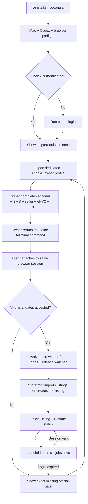

# Coconala One-Session Onboarding Design

## Goal

A non-technical owner starts with a Mac and a ChatGPT/Codex subscription. The installer
shows the official Coconala prerequisites and opens the registration surface. The owner
completes the entire account, SMS, seller, eKYC, consent, and bank setup directly on the
official site in one uninterrupted session. Rockstar_ibot then verifies that setup and
starts the four existing Coconala lanes without ongoing approval prompts.

Coconala is the first and only onboarding implementation in this slice. Upwork,
Mercor, shared cross-market onboarding, and other money printers are deferred until
this Coconala package passes the clean-device acceptance below.

Public product status must remain explicit in the root README and this package README:
Coconala is the only marketplace offered as a one-command OSS product; other
marketplaces are not productized until they independently have one-command onboarding,
official account gates, persistent loop owners, effect readback, and replay-zero. The
long-term product is many concurrent 24/7 money loops, but roadmap intent is never shown
as current installability.

The public start is:

```bash
/bin/bash -c "$(curl -fsSL https://raw.githubusercontent.com/Daisuke134/life-manager/main/scripts/bootstrap-coconala.sh)"
```

If Codex is not authenticated, the installer runs `codex login` first and waits for
the CLI's own successful authentication readback.

Terminal is the only Rockstar_ibot onboarding surface for Coconala. The flow does not
open or require a local web UI and does not ask for language, timezone, skills,
categories, prices, or notification-channel preference.

## Selected approach

Use one official-site handoff before activation. The owner completes registration, SMS,
seller information, required consents, eKYC, and bank registration without alternating
control with the agent. This is selected over field-by-field automation because repeated
agent/owner handoffs create more friction than one guided official session. KYC remains
front-loaded because Coconala requires approved identity verification for withdrawal and
unwithdrawn sales can expire.

## Human boundary

The owner performs the complete official account setup once:

1. create or recover the Coconala account and verify its email;
2. complete SMS verification, seller information, and required consents;
3. use a smartphone to photograph the accepted identity document and their face;
4. register the matching domestic payout account;
5. return to Terminal and run the same bootstrap command once.

The owner does not choose categories, write copy, set prices, make images, configure
launchd, create local files, approve applications, approve replies, approve estimates,
or approve deliveries.

The registered Coconala email remains Coconala's official marketplace notification
address. Rockstar_ibot reports reuse the repository's existing `gog` Gmail transport and
go to the authenticated Google account, which is also the recommended Coconala signup
address. If Gmail OAuth already exists, setup asks nothing. Otherwise it asks for the
Google address once and performs one `gog auth add` ceremony. A nonce-bound setup message
must be sent to and found in that same Gmail inbox before email is marked ready.
Missing Gmail transport never blocks earning; Terminal receipts remain authoritative.
SMTP and Telegram are not part of the public default.

## Architecture

The root installer dispatches `coconala` to one package-owned onboarding controller. The
controller checks prerequisites, runs `codex login` when required, launches the dedicated
CloakBrowser with profile `~/.cloak/profiles/gig-daily-driver`, shows the full official
setup checklist once, and waits for the owner to report completion. It never asks the
owner to duplicate official identity or bank facts in Rockstar_ibot.

The owner performs the entire Coconala setup in that dedicated browser, not Safari or a
separate Chrome profile. After completion, the controller attaches to the same running
browser over CDP. The authenticated cookies remain in that profile, so the owner never
hands a password to Rockstar_ibot and the agent never performs a second login.

After activation, launchd keeps that dedicated browser and all four business lanes alive
while the Mac is running. Browser restarts reuse the same profile and its private session
vault; they do not create another account or ask for setup again. A marketplace-expired
session is the only normal exception: Rockstar_ibot opens the official login recovery page
in the same profile, verifies the restored session, and resumes the lanes. “Always on”
means supervised restart and verified session reuse, not a promise that a third-party
login cookie can never expire.

The controller resumes from a private state receipt. Re-running the command never creates
an account, repeats identity submission, duplicates a listing, or loads a second copy of
a launchd job. Account creation and recovery remain owner actions on the official site.



## Data handling

Identity documents, face images, SMS codes, bank account values, passwords, and session
tokens never enter Git, model prompts, logs, Telegram, email reports, or test fixtures.
Sensitive fields are entered only on official Coconala/eKYC surfaces. Rockstar_ibot does
not collect or persist a second copy. The mode-0600 onboarding receipt contains only
official state names and hashes, not raw identity data.

The public repository contains only schemas, tool contracts, prompts, placeholder
examples, and tests.

## State machine and recovery

Each accepted official boundary has one terminal receipt: preflight, authenticated,
email_verified, sms_verified, seller_information, identity_approved, bank_registered,
launchd_readback, and storefront_listing_readback. A crash resumes at the first missing
receipt. An unknown or contradictory page fails closed and reports the exact official
blocker; it does not start the money loops early.

The initial official setup is one owner-controlled session, not a sequence of alternating
agent prompts. Authentication expiry opens the same official recovery surface and resumes
after readback; Rockstar_ibot never creates another account.

## Activation gate

Apply, Negotiate, Storefront, and Paid are activated only after all of these are true:

- authenticated Coconala session is read back;
- SMS status is accepted;
- seller information is accepted;
- eKYC is officially approved;
- matching domestic payout account is read back;
- public package tests and launchd render checks pass.

An existing listing is not an onboarding gate. After activation, Storefront imports any
existing listings. When the official listing count is zero, Storefront owns capability
discovery, initial service selection, truthful copy/assets, creation, and official
readback. Apply can operate before that listing exists; Negotiate and Paid remain idle
until official buyer activity exists.

Paid remains independently subject to its production delivery acceptance. The onboarding
controller may activate the existing Paid job but cannot manufacture a Paid completion
claim.

## Execution subject and money maximization

The AI system performs Coconala work. Qualification therefore measures the installed
AI/Mac/tool system's demonstrated ability to produce and verify the requested outcome,
not the account owner's personal skill, free time, health, sleep, or manual workload.
Independent profitable projects run concurrently up to real compute, browser, external
tool, platform, deadline, cost, and quality limits. There is no human-capacity throttle.

The economic policy maximizes verified expected net income across eligible Coconala work:
expected payment and repeat value, less marketplace fees, compute/tool cost, deadline and
refund risk. Safety fences prevent duplicate applications, replies, listings, deliveries,
and unsupported claims; they do not impose a human workload ceiling.

Job Hunter is a separate exception because the human is the employee. It must bind jobs
to the person's real history, eligibility, preferences, interview availability, and
offer-acceptance authority. Those human constraints never leak into AI-delivered
marketplace work such as Coconala, Upwork, or future money printers.

## Acceptance

On an independent clean Mac, the owner runs only the one-line bootstrap. The installer
completes `codex login`, opens the dedicated Coconala browser, and prints the full setup
checklist in Terminal. The owner completes all official setup there and reruns the same
command once. The agent then takes over that exact profile without receiving the password. Acceptance
requires official readback for every state, one loaded owner for each launchd label, no
marketplace effect before authentication, no duplicate listing/effect on rerun, and no
private value in the public tree or logs.

Independent clean-device usability and business trials follow the code-owned OSS UX gate.
They use separate owner accounts/profile/state, require README-only completion without
private coaching, and prove official gates, loaded owners, Storefront import/create,
replay-zero and eventual business receipts. They are external acceptance evidence, not
implementation tasks assigned to the coding cursor, and never guarantee time to first sale.

Business completion remains receipt-based: one official Apply application with replay
zero, one official Negotiate reply/estimate with replay zero, one Storefront listing
mutation with replay zero, one Paid delivery with replay zero, and one permitted withdrawal
that arrives at the registered bank. Process exit zero, local state, or a notification is
not a substitute.

Time-dependent sales, buyer traffic, eKYC review duration, and bank-arrival waiting are
acceptance evidence only. They are not coding TODOs and never keep an implementation
session open. The code-owned terminal condition is completion of the ordered atomic TODO
in `skills/earn/gig/TODO.md`.

The code-owned terminal condition is complete. Clean-HOME pre-auth returns blocked with
zero HOME writes; the bootstrap contains no local onboarding UI route and opens the
official Coconala signup URL; rerun selects `finished`; six unique launchd labels render;
all four business entrypoints compile; OSS self-containment passes 11/11; ShellCheck and
the scoped Gig secret scan pass with zero findings. `gog` setup has an acknowledged real
send and same-inbox nonce readback.

## Current remaining work

The Coconala OSS code-owned TODO is empty. Do not add waiting for eKYC review, buyer
traffic, sales, Paid orders, withdrawal windows, or bank arrival. Those are external
outcomes recorded when they occur, not implementation work. Future Upwork, Mercor, and
other marketplace productization belongs to separate provider specs.

## Friend DM

Send this without promising income:

> MacでAIにココナラの応募・返信・出品・納品を24時間運用させるOSSを作ったので、試してほしい！
> 必要なのはApple Silicon Mac、ChatGPTの有料プラン、ココナラ登録に必要なメール・携帯電話・本人確認書類・振込口座です。
>
> Terminalを開いて、これをそのまま貼り付けて実行してください：
>
> `/bin/bash -c "$(curl -fsSL https://raw.githubusercontent.com/Daisuke134/life-manager/main/scripts/bootstrap-coconala.sh)"`
>
> 専用ブラウザが開くので、ココナラ公式画面で登録、メール・SMS認証、本人確認、振込口座設定を完了してください。パスワード、本人確認書類、銀行情報はAIへ送らず、公式画面だけに入力します。完了後、Terminalで同じコマンドをもう一度実行すれば、Apply・Negotiate・Storefront・Paidが起動します。
>
> 収益保証はありません。途中で止まった場合は、秘密情報を隠したTerminalのエラー画面だけ送ってください。
