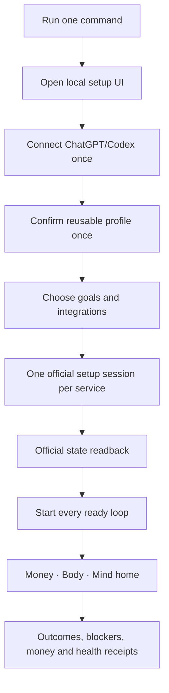

# Rockstar_ibot OSS Onboarding Design

## Product promise

One command turns a Mac into a local Rockstar_ibot. The owner supplies identity or legal
consent only on the official service that requires it. Rockstar_ibot reuses every safe
fact and authenticated session, starts every ready loop, and shows verified outcomes in
one product surface. A new skill plugs into this flow instead of inventing another setup.

```bash
/bin/bash -c "$(curl -fsSL https://raw.githubusercontent.com/Daisuke134/life-manager/main/scripts/bootstrap.sh)"
```

The bootstrap opens a local browser UI. Terminal output remains a recovery surface, not
the normal onboarding product.

## Ideal owner flow



1. Run one command. Dependencies install only when missing; an existing checkout updates
   safely and private data is preserved.
2. A local `localhost` setup UI opens automatically. It explains the next owner action in
   plain language and never exposes logs, plist labels, JSON, ports, or environment keys.
3. Connect ChatGPT/Codex once. The UI waits for official CLI authentication readback.
4. Confirm reusable non-secret facts once: locale, time zone, notification preference,
   goals, and any public profile facts the owner elects to reuse. Passwords, OTPs,
   identity documents, face images, and bank values stay on provider surfaces.
5. Select outcomes, not internal loops: earn money, find a job, manage schedule, protect
   sleep/health, or enable all. Recommended ready integrations are preselected; nothing
   unsupported is presented as active.
6. Each service card shows prerequisites, estimated owner time, why each ceremony is
   required, and one `Connect` button. The service opens in its dedicated persistent
   browser profile. The owner completes the official ceremony once and returns.
7. Rockstar_ibot reads the official state, opens only the first missing provider gate,
   and resumes without asking for the same fact again.
8. Every ready loop starts automatically. A blocked integration does not prevent unrelated
   loops from starting.
9. The home screen shows three organs—Money, Body, Mind—with four states only:
   `Running`, `Needs you`, `Waiting for external result`, or `Issue detected`.
10. Success is an official outcome receipt: application accepted, listing public, customer
    reply sent, delivery accepted, bank arrival, calendar mutation, completed routine, or
    other provider-owned proof. Process state and notifications are diagnostics only.

## Shared integration contract

Every connector/skill that starts a persistent loop ships one public onboarding manifest.
The core reads these manifests; root installers and dashboards never hardcode Coconala,
Upwork, Mercor, Job Hunter, Connector, or future service logic.

Required manifest fields:

- stable integration id, display name, organ, and owner-facing outcome;
- supported platforms and runtime prerequisites;
- reusable profile facts consumed, with purpose and privacy class;
- provider-only ceremonies and their official URLs;
- dedicated browser identity and session policy;
- side-effect-free readiness command and structured state schema;
- activation command and exact long-running owners;
- official effect/readback/replay-zero receipts;
- stop, recovery, upgrade, and uninstall commands;
- money/cost authority and whether owner approval is ever required.

Manifests contain references and contracts, never credentials. Provider adapters read
secret values directly from the private SSOT only when authorized.

## Ask-once data model

One private profile stores reusable facts with source, scope, freshness, and consent. An
integration requests a fact by semantic field id. If a current authorized value exists,
the UI explains reuse and does not ask again. Provider-specific forms remain provider
state; Rockstar_ibot records only status and evidence hashes.

The profile separates:

- person facts used only when the person is the subject, such as Job Hunter employment;
- AI/Mac/tool capability used for AI-delivered marketplace work;
- health and schedule facts used to manage the person's life, never to throttle independent
  AI-delivered Coconala/Upwork work;
- credential references and browser identities, with no secret material in prompts;
- official outcome receipts and payout state.

## Loop activation

The core builds a readiness graph from integration manifests. Independent ready loops
start concurrently. Provider ceremonies become visible `Needs you` nodes. A loop can
depend on another receipt—for example, Coconala business lanes require authenticated,
SMS, seller, eKYC, and bank gates—but cannot silently invent a dependency.

Activation is idempotent: one persistent owner per label, immutable release, official
definition readback, safe resume after interruption, and duplicate external effect zero.

## Coconala integration

Coconala uses the common flow with these provider-specific steps:

1. Open the dedicated `gig-daily-driver` browser profile.
2. The owner completes account/email/SMS/seller/eKYC/bank on official pages.
3. Rockstar_ibot evidence-binds all gates and starts Browser, Apply, Negotiate,
   Storefront, Paid, and Release Watcher.
4. Storefront imports existing listings or, at official count zero, inventories installed
   AI skills, selects a buyer-deliverable capability, measures official demand, creates
   one recoverable draft, binds official category/form options, publishes, reads back,
   and proves next-wake duplicate zero.
5. Apply, Negotiate, Storefront, and Paid remain independent effect owners. The human's
   personal workload never limits AI-delivered work.

## OSS and cloud

OSS and cloud use the same integration manifests, state schema, owner-facing UI, and
receipt vocabulary.

- OSS keeps profile, credentials, browser sessions, state, and artifacts on the owner's
  Mac. The owner supplies the always-on device and ChatGPT/Codex subscription.
- Cloud subscription supplies hosted compute, updates, monitoring, backups, and browser
  workers. The owner connects the same services through provider OAuth/ceremonies and sees
  the same dashboard. Cloud never changes the meaning of Done.
- Owners can export their non-secret profile and receipts, disconnect a provider, and
  delete hosted private state without losing the OSS code or public manifests.

## Acceptance

The code-owned gate is complete only when a clean Mac reaches the local UI from one command,
all manifests render, reusable facts are asked once, every ready loop starts, blocked loops
name one exact owner action, restart resumes state, uninstall preserves/export private data
as documented, and no secret enters Git/logs/prompts/reports.

External usability and business-outcome trials follow this code gate. They remain acceptance
evidence, not implementation TODOs assigned to the coding cursor.
