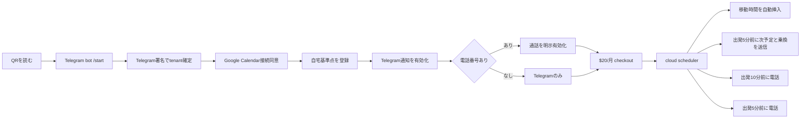

# Rockstar_ibot Cloud: On-Time Core Product Contract

状態: APPROVED — atomic implementation planに従って実装中

正本範囲: cloud Rockstar_ibotの通話、移動時間、Telegram乗換通知、QRオンボーディング

関連SSOT:

- `docs/superpowers/plans/2026-08-08-rockstar_ibot-provider-cost-guard.md` Task 3の経路構造は、本specの経路契約に従う。
- `docs/superpowers/specs/2026-08-08-lm-dais-tenant-cloud-migration-design.md`はDaisテナントのruntime移行だけを扱い、本specの製品挙動を定義しない。
- `deploy/local`はself-host製品として残す。本specはlocal runtimeへ機能を追加しない。

## 1. Overview — What and Why

cloud Rockstar_ibotは、ユーザーがGoogle Calendarや乗換アプリを繰り返し開かなくても、次の予定へ時間どおり移動できる状態を作る。

現行cloudには次の部品がある。

- Google Calendarの今後7日を読み、`[Travel]`ブロックを自動作成する。
- Telnyxで計算済み出発時刻の10分前と5分前に電話する。
- Telegram、Supabase tenant、電話設定、live location、重複防止ledgerがある。
- 日本国内ではTransit APIを先に使い、解決不能時だけGoogleへfallbackする。

しかし、製品体験を壊す4つの欠落がある。

1. 通話は停止している。sourceはTelnyx balanceが`$0.50`未満なら発信を拒否するが、現在balanceは2FA完了前なので未readbackである。最小入金と実call receiptで原因と復旧を同時に閉じる。
2. Transit API呼び出しがイベント日時を送らず、実行時刻の経路を未来の予定へ使う。
3. 移動時間をCalendarへ入れるだけで、出発5分前のTelegram乗換案内を送らない。
4. QRからのオンボーディングがTelegram identityを持つのに、別のSupabase Google Sign-inを要求する。生の`tg` query parameterもtenant identityとして信頼できない。

本specは、次の製品契約を固定する。



## 2. Acceptance Criteria

### 2.1 Runtime and product boundary

| ID | MUST / DO NOT |
|---|---|
| AC-01 | productionはRailwayのcloud Rockstar_ibotを実行主体とし、deploy commit SHA、`/health`、scheduler logをreadbackできる。 |
| AC-02 | `deploy/local`を削除・変更せず、Daisとwebユーザーは同じcloudコードパスを使う。 |
| AC-03 | Calendar block、Telegram message、Telnyx callの完了は、それぞれprovider側のIDと公式readbackで判定する。process livenessとlocal testだけで完了にしない。 |

### 2.2 Emergency call recovery and call policy

| ID | MUST / DO NOT |
|---|---|
| AC-04 | Telnyx portalが表示する入金可能な最小額だけを1回入金し、入金前後のbalanceをTelnyx UIとBalance APIでreadbackする。額を推測しない。 |
| AC-05 | Dais tenantは`call_enabled=true`、`wake_policy=all-events`、正しい電話番号・言語・timezoneを持ち、Supabase readbackが同じ値を返す。 |
| AC-06 | 電話番号を登録していないユーザーと`call_enabled!==true`のユーザーへ電話しない。電話番号を登録しただけではcall opt-inにしない。 |
| AC-07 | timed non-helper eventは`all-events`で対象になる。`[Travel]`、`[PENDING]`、`[APPLIED]`は電話対象にしない。 |
| AC-08 | physical eventは計算済み出発時刻のT-10とT-5に最大1回ずつ電話する。場所なし、online、起床、就寝eventはevent開始のT-10とT-5に最大1回ずつ電話する。 |
| AC-09 | Telnyx呼び出し失敗時はclaimをreleaseし、期限内の次tickでretryする。balance不足はowner Telegramへdedupe alertを送る。 |
| AC-10 | controlled E2E callはTelnyx call ID、webhook署名検証、`lm_wake_log` event key、human/machine判定の結果をcorrelateできる。 |

### 2.3 Event-anchored route contract

Transit APIの公式契約は次を使う。

- endpoint: `GET https://api.transit.ls8h.com/api/v1/plan`
- `date=YYYYMMDD`
- `time=HH:MM:SS`
- outbound: `type=arrival`、anchorはevent start
- return: `type=departure`、anchorはevent end
- `numItineraries=3`
- source: `https://api.transit.ls8h.com/api/openapi.json`

```javascript
{
  provider: "transit" | "google",
  computedAt: "RFC3339",
  serviceDate: "YYYYMMDD",
  timezone: "Asia/Tokyo",
  anchorType: "arrival" | "departure",
  anchorAt: "RFC3339",
  departureAt: "RFC3339",
  arrivalAt: "RFC3339",
  durationSeconds: 0,
  accessWalkSeconds: 0,
  egressWalkSeconds: 0,
  transferCount: 0,
  fare: { currency: "JPY", ticket: 0, ic: 0 } | null,
  steps: [{
    kind: "walk" | "transit",
    mode: "rail" | "subway" | "bus" | "walk" | null,
    service: "路線名" | null,
    trainType: "快速等" | null,
    headsign: "行先" | null,
    from: { name: "駅名", platform: "番線" | null },
    to: { name: "駅名", platform: "番線" | null },
    departAt: "RFC3339",
    arriveAt: "RFC3339"
  }],
  availability: {
    platform: true,
    fare: true,
    stationExit: false
  }
}
```

| ID | MUST / DO NOT |
|---|---|
| AC-11 | Transit queryはuser timezoneでevent anchorを`date`と`time`へ変換する。過去・欠落anchorだけが現在時刻を使う。 |
| AC-12 | `type=arrival`はanchor以前へ到着するjourneyのうちdepartureが最も遅い1件、`type=departure`はanchor以後に出発するjourneyのうちarrivalが最も早い1件を選ぶ。条件を満たすjourney 0件はTransit failureとしてGoogleへfallbackする。 |
| AC-13 | routeはheadsign、routeName、trainType、乗降駅、departure/arrival、platformCode、fare、徒歩秒数を欠落させない。service dateとtimezoneからseconds-since-midnightをRFC3339へ変換し、86400以上は翌日として保持する。providerが返さないfieldは`null`または`false`にする。 |
| AC-14 | 日本国内でaccepted Transit routeがある時、Google route callは0回である。Transit timeout、非2xx、invalid schema、journey 0件の時だけGoogleを1回呼ぶ。 |
| AC-15 | route cache keyはtenant、origin、destination、timezone、service date、anchor time bucket、anchor type、provider modeを含む。`_shared` identityを使わない。 |
| AC-16 | 既存`directionsMinutes` callersはstructured routeの`durationSeconds`から分数を得るadapterを通し、Calendar autofillの現行契約を壊さない。 |
| AC-17 | exact station exit、best car、crowdingを推測・生成しない。source factがないfieldをTelegram本文へ出さない。 |

### 2.4 T-5 Telegram next-event and transit reminder

| ID | MUST / DO NOT |
|---|---|
| AC-18 | `notifications_enabled!==false`かつTelegram boundの全ユーザーへ、次のtimed non-helper eventを1 eventにつき最大1回通知する。call設定とは独立する。 |
| AC-19 | physical eventは出発時刻のT-5、場所なし・online eventはevent開始のT-5を通知時刻にする。60秒tickはthreshold通過後15分までcatch upする。 |
| AC-20 | originはfresh Telegram live location、90分以内に終わる前eventのlocation、home addressの順で決める。fresh locationが無ければ「現在地を把握している」と表示しない。 |
| AC-21 | route取得成功時の本文は、次予定、開始時刻、出発時刻、目的地、徒歩、各乗車の時刻・路線・種別・行先・乗降駅、存在するplatform、乗換、到着、存在する運賃をこの順で表示する。 |
| AC-22 | route取得失敗時も、次予定、開始時刻、目的地、基準出発時刻を送る。経路取得失敗を明記し、通知全体を失敗にしない。 |
| AC-23 | HTML escapingを全Calendar由来textへ適用する。Telegram本文にuid、email、phone、raw provider payload、credentialを含めない。 |
| AC-24 | 送信前に既存`lm_travel_log`へ`leg=telegram-t5`をatomic claimする。Telegram非2xxまたはmessage ID欠落時は同claimをreleaseし、次tickでretryする。新DB tableを作らない。 |
| AC-25 | reminderはComposio予算で5分へ劣化する`organsUserOnce`から分離する。in-process ownerは固定60秒`startReminderLoop`、`LIFE_RUN_LOOPS=false` ownerは既存の毎分Inngest `sweep-wake → wake-user → wakeUserOnce → reminderUserOnce`で走り、どちらのowner modeでも0経路・二重経路を作らない。各tenantを独立timeoutで処理し、route timeoutやTelegram失敗が`wakeCallOnce`、他tenant、他organを止めない。 |
| AC-26 | success logはuidの先頭12文字、event key hash、provider、Telegram message IDを含む。event title、location、phoneをlogへ出さない。 |

Telegram本文の固定形:

```text
🚆 次は 14:00「打ち合わせ」
13:15 出発 → 14:00 到着予定
目的地: 渋谷

13:20 東京駅 2番線
丸ノ内線・荻窪行 → 13:40 新宿駅
13:46 新宿駅からJR線 → 13:55 渋谷駅
徒歩 5分 / 乗換 1回 / IC 209円

※ 出口番号は経路元が返した場合だけ表示します。運行情報が変わることがあります。
```

### 2.5 QR and minimum onboarding

| ID | MUST / DO NOT |
|---|---|
| AC-27 | public QRはRockstar_ibot Telegram botの`/start` deep linkだけをencodeする。uid、chat ID、secret、emailをQRへ入れない。 |
| AC-28 | botはRailway `/panel/onboarding`を開くTelegram Mini App `web_app` buttonを返し、Telegram `initData`のHMAC、5分age、private actorを既存`panel-auth.js`で検証してtenantを確定する。生の`?tg=`をidentityやbinding authorityに使わない。 |
| AC-29 | Supabase Google Sign-in stepを削除する。Google画面はRailwayのtenant-scoped Calendar connectorが開始するGoogle Calendar consentの1回だけ開く。Calendar consent結果は検証済みTelegram tenantへbindする。 |
| AC-30 | onboarding順はCalendar consent → home address → Telegram notifications ON → phone入力または「電話なしで続ける」→ phone入力時だけcall opt-in → Stripe $20/月 → dashboardとする。nameはTelegram profileを使い、空の場合だけ入力させる。 |
| AC-31 | home addressなしではtravel autofillをreadyと表示しない。live location共有中は現在地routeを使い、共有終了後はhome/previous-event fallbackへ戻ることを説明する。 |
| AC-32 | phoneなしのpaid userはCalendar autofillとTelegram reminderを受ける。phoneありかつcall opt-inのpaid userだけがTelnyx callを受ける。 |
| AC-33 | onboarding statusはserver-side `lm_users`と`lm_panel_preferences`だけから復元する。localStorageをtenant identity、connector truth、payment truthにしない。legacy Netlify `telegram-link` actionは410を返す。 |
| AC-34 | Stripe webhookだけが`paid`を書き、success redirectだけでpaidにしない。paid=falseかつcomp window外ではscheduler external effectsを開始しない。 |
| AC-35 | 同じTelegram actorの再scan/reopenは同じtenantを再開し、新tenantを作らない。別Telegram actorは別tenantとなり、他tenantのCalendar、phone、location、billingを読めない。 |

## 3. As-Is / To-Be

| Area | As-Is | To-Be |
|---|---|---|
| Runtime | cloudとlocal製品が同repoに存在する | cloud productのon-time coreだけを変更し、local productは不変 |
| Telnyx | balance gateが通話を停止 | portal最小入金、Dais設定readback、実call receiptで復旧 |
| Call scope | user defaultはtravel-only、calls opt-in | fleetはopt-in維持、Daisだけall-eventsを明示設定 |
| Transit time | `/plan`へfrom/toだけ送る | event timezone/date/time/typeを必ず送る |
| Route data | integer minutesへ射影 | structured routeを保持し、minutes adapterを残す |
| Telegram | autofill時に短いCalendar報告だけ送る | 出発T-5に次予定と乗換を1回送る |
| Location | fresh Telegram live locationがある時だけ現在地を知る | live → previous venue → homeを明示し、推測しない |
| Dedupe | callとtravel blockはatomic claim済み | T-5 reminderは`lm_travel_log/telegram-t5`を再利用 |
| QR identity | `/lm?tg=<chat_id>`とGoogle login | QR→bot→検証済みTelegram Mini App session |
| Google auth | Supabase Google loginとCalendar consent | Calendar consentだけを残す |
| Phone | typed phoneがonboarding必須 | phoneなしTelegram-only経路とphoneありcall経路を分ける |

## 4. Test Matrix

| # | To-Be / AC | Test name | Cover |
|---|---|---|---|
| 1 | AC-01–03 cloud identity/readback | `cloud-runtime-deployment-contract` + production readback | OK |
| 2 | AC-04 Telnyx minimum refill | portal balance before/after receipt | OK |
| 3 | AC-05–07 Dais/fleet call policy | `runtime-preferences` + Supabase readback | OK |
| 4 | AC-08 T-10/T-5 anchors | `wake-levels` + `wake-catchup` + `wake-filter` | OK |
| 5 | AC-09 failed-call retry | `wake-claim-token` + `ch1-atomic-dedup` | OK |
| 6 | AC-10 call correlation | controlled Telnyx call E2E | OK |
| 7 | AC-11 exact Transit query | `travel-transit-wire: event anchor query` | OK |
| 8 | AC-12 journey selection | `transit: arrival/departure constrained selection` | OK |
| 9 | AC-13 route fact preservation | `transit: structured nullable facts` | OK |
| 10 | AC-14 sequential fallback | `travel-transit-wire: accepted route skips Google` | OK |
| 11 | AC-15 tenant/time cache key | `route-cache: scoped anchor key` | OK |
| 12 | AC-16 minutes compatibility | `travel-routes` + `travel-return` | OK |
| 13 | AC-17 no fabricated fields | `transit: unsupported fields absent` | OK |
| 14 | AC-18–19 reminder eligibility/time | `travel-reminder: T-5 and catch-up` | OK |
| 15 | AC-20 origin precedence | `travel-reminder: live previous home precedence` | OK |
| 16 | AC-21 formatter complete route | `travel-reminder: Japanese structured message` | OK |
| 17 | AC-22 route unavailable fallback | `travel-reminder: event-only fallback` | OK |
| 18 | AC-23 escaping/privacy | `travel-reminder: escaping and safe log` | OK |
| 19 | AC-24 claim/release | `travel-reminder: atomic dedupe and retry` | OK |
| 20 | AC-25 isolation | `wake-loop-isolation: reminder never blocks call` | OK |
| 21 | AC-26 delivery receipt | `travel-reminder: provider message id receipt` | OK |
| 22 | AC-27 QR payload | `onboarding-qr: bot deep link only` | OK |
| 23 | AC-28 Telegram identity | existing `panel-auth` replay/stale/cross-actor tests + onboarding binding test | OK |
| 24 | AC-29 no Supabase Google login | `lm-onboard: calendar consent is the only Google auth` | OK |
| 25 | AC-30–32 onboarding branches | `telegram-onboard: phone and no-phone paid readiness` | OK |
| 26 | AC-33 server truth | `lm-onboard: localStorage cannot choose tenant or stage` | OK |
| 27 | AC-34 payment authority | existing `billing` tests + Stripe webhook E2E | OK |
| 28 | AC-35 tenant isolation | `lm-onboard: same actor resume and cross-actor denial` | OK |

### E2E Judgment

| Item | Value |
|---|---|
| UI変更 | あり — QR、Telegram Mini App onboarding、phoneなし分岐 |
| 結論 | Maestro: 不要。iOS appを変更しない。Playwright browser E2E、Telegram provider message ID、Google Calendar official readback、Stripe webhook receipt、Telnyx call receiptを使う。 |

## 5. Boundaries

本specで実行しないもの:

- `deploy/local`のfeature parity、削除、移行。
- Google Calendar app、Google Maps appそのものの削除。
- station exit、車両位置、混雑情報の推測。
- Telegram live locationが無い時のbackground GPS追跡。
- OpenTripPlanner、GTFS server、routing DB、新しいroute providerの導入。
- event application、歯科・健康診断・脱毛予約、money loopのcloud移行。
- YC application、marketing page rewrite、価格変更、annual plan追加。
- Telnyx自動残高追加。今回の明示入金後はlow-balance alertを維持し、無承認の継続課金を作らない。
- Google Gmail connector。Calendar consentだけを扱う。

## 6. Execution Steps

各sliceは前sliceのprovider readback後に始める。1 sliceはproduction 3 files以下、production差分100 LOC以下にする。下記sliceを結合しない。

### Slice 0 — Emergency call recovery

- [ ] Telnyx Authenticator 2FAを現在のportal sessionへ入力する。recovery/resetへ進まない。
- [ ] balanceとportal表示のminimum add-funds amountをreadbackする。
- [ ] private credential SSOTの既存payment methodでminimum amountを1回だけ入金する。
- [ ] 新balanceとTelnyx payment receipt IDをreadbackする。
- [ ] Dais tenantの`call_enabled=true`、`wake_policy=all-events`、phone、language、timezoneをreadbackし、不一致だけをpatchする。
- [ ] production `/test-call`を1回実行し、Telnyx call ID、webhook、`lm_wake_log`、着信をcorrelateする。

### Slice 1A — Structured Transit parser

- [ ] focused baselineを実行して件数と既存failureを記録する。
- [ ] `transit.test.js`へAC-12、AC-13、AC-17のREDを追加する。
- [x] `transit.js`でprovider factsをstructured routeへ変換する。
- [x] `transit.test.js`をGREENにし、既存fixtureと実Transit responseの両方をparseする。

### Slice 1B — Event-anchored query and minutes adapter

- [x] `travel-transit-wire.test.js`へAC-11、AC-14、AC-16のREDを追加する。
- [x] `travel.js`でevent `date/time/type`をTransit queryへ渡し、structured routeとminutes adapterを公開する。
- [x] accepted Transit routeでGoogle call 0、Transit failureでGoogle call 1をGREENにする。
- [ ] 実Transit API 1件でevent anchorとroute factsをreadbackする。

### Slice 1C — Tenant-scoped route cache

- [x] `route-cache.test.js`へtenant/timezone/anchor/provider keyのREDを追加し、`_shared`を廃止する。
- [x] `route-cache.js`でAC-15のkeyを固定する。
- [x] 同tenant・同anchorはprovider call 1、別tenant・別anchorは別cache entryになることをGREENにする。

### Slice 2A — T-5 reminder decision, formatting, and delivery

- [x] `travel-reminder.test.js`へAC-18–26のREDを追加する。
- [x] `travel-reminder.js`にeligibility、origin precedence、formatter、claim/send/release outcomeを実装する。
- [x] `travel.js`の既存`claimTravel`/`unclaimTravel`をreminderから再利用できる形でexportする。

### Slice 2B — Scheduler isolation and production Telegram receipt

- [x] `wake-loop-isolation.test.js`へreminder timeout、call-first、cross-tenant継続のREDを追加する。
- [x] `scheduler.js`の`organsUserOnce`へ独立`organ:travel-reminder`を配線する。
- [x] `wake-loop-isolation.test.js`でroute timeout中もcallが先に完了し、他tenantが進むことをGREENにする。
- [x] production E2Eで再現した5分Composio劣化・7 tenant直列遅延をREDにし、reminderを既存wake分離パターンと同じ固定60秒loopへ移す。
- [x] `maybeStartLoops`から専用reminder loopを1 writerだけ起動し、旧organ側の二重実行を削除する。
- [x] `LIFE_RUN_LOOPS=false`で既存毎分Inngest `wake-user`が同じ`reminderUserOnce`を実行し、in-process modeでは同経路がno-op ownerであることをRED→GREENにする。
- [ ] Telegram test chatへ1件送り、message ID、本文、再実行0件をreadbackする。

### Slice 3A — Telegram actor as onboarding identity

- [x] QRが`https://t.me/LifeManagerBotbot?start=lp`だけをdecodeすることをreadbackする。
- [x] `telegram-onboard.test.js`と`panel-auth.test.js`へMini App、cross-actor、stale、replayのREDを追加する。
- [x] `telegram.js`の`/start` buttonをRailway `/panel/onboarding`の`web_app`へ変更する。
- [x] 既存`panel-auth.js`のTelegram initData/sessionをonboarding tenant authorityとして再利用する。
- [x] production PostgreSQLで再現した新規actorの`42702 uid is ambiguous`を、既存RPCの局所的なconflict arbiter修飾でRED→GREENにする。
- [ ] 隔離した2 actorでcreate、replay拒否、same-actor resume、cross-actor分離をproduction E2Eし、test rowを事後0件へ戻す。

### Slice 3B — Railway Calendar consent

- [x] `calendar-onboard.test.js`へsession scope、single-use OAuth nonce、cross-tenant denial、ACTIVE-only completionのREDを追加する。
- [x] `calendar-onboard.js`へ既存Composio Calendar接続契約を移し、uidをvalidated panel sessionからだけ受け取る。
- [x] `server.js`へ`/panel/onboarding/calendar/start`と`/panel/onboarding/calendar/status`を配線する。
- [x] Google consent後に同じtenantの`calendar_provider=composio_gcal`だけが更新されることをGREENにする。

### Slice 3C — Server-owned onboarding state

- [x] `panel-api.test.js`へname、Calendar、home、notifications、phone/call、paidの固定stage REDを追加する。
- [x] `panel-api.js`で`lm_users`と`lm_panel_preferences`からstageを計算し、scope-bound patchだけを受ける。
- [x] phoneなしは`call_enabled=false`、phoneありでも明示tap前は`call_enabled=false`をGREENにする。
- [x] 同actor再開とcross-actor denialをGREENにする。

### Slice 3D — Onboarding UI

- [x] `panel-ui.test.js`へ固定step順、phoneなし分岐、call consent、server-truth resumeのREDを追加する。
- [x] `panel-ui.js`へCalendar → home → notifications → phone/call → pay → dashboardの画面を実装する。
- [x] localStorageを削除しても同じserver stageへ復元することをGREENにする。

### Slice 3E — Retire legacy Google-login binding

- [x] `onboarding-resume-contract.test.js`へSupabase Google exchange不使用と`telegram-link` 410のREDを追加する。
- [x] `apps/landing/netlify/functions/lm-onboard.js`の`exchange`と`telegram-link`を410へ固定する。
- [x] shadow `LmClient.tsx`を削除し、`LmBody.tsx`をTelegram botへの固定handoffだけにして、`signInWithGoogle`、uid/sig localStorage、raw `tg` bindingを削除する。
- [x] production Netlify functionがlegacy actionへ410を返すことをreadbackする。

### Slice 3F — Payment authority and onboarding E2E

- [x] `billing.test.js`へonboarding scopeから`paid`を書けないREDを追加する。
- [x] Stripe webhook以外が`paid`を書けないことと、unpaid scheduler effect 0を検証する。
- [ ] clean browserと別Telegram actorでtenant isolationをE2E検証する。

### Slice 4 — Deploy and production acceptance

- [x] focused route/reminder/onboarding tests、full `npm test`、scoped landing contract tests、`git diff --check`をPASSさせる。
- [x] fresh adversarial verifierがCritical/Important 0、secret leak 0、duplicate external effect 0を確認する。
- [x] mainへ統合・pushし、Railway/Netlifyのdeploy commit SHAをreadbackする。
- [ ] QRをclean deviceでscanし、Telegram tenant作成、Calendar consent、home、notifications、phoneなし/あり分岐、Stripe test-free live checkout boundaryを確認する。
- [ ] controlled Calendar eventでtravel block、T-10 call、T-5 call、T-5 Telegram routeをprovider ID付きで確認する。
- [ ] 同eventをschedulerで再評価し、追加call 0、追加Telegram 0、追加travel block 0を確認する。
- [ ] 既知failureとprovider availabilityをowner Telegramへ報告し、本specをCOMPLETEへ更新する。

### Verification commands

```bash
cd apps/rockstar_ibot
node --test \
  lib/transit.test.js \
  lib/travel-transit-wire.test.js \
  lib/route-cache.test.js \
  lib/travel-routes.test.js \
  lib/travel-return.test.js
node --test \
  lib/travel-reminder.test.js \
  test/wake-loop-isolation.test.js \
  test/wake-levels.test.js \
  test/wake-catchup.test.js \
  test/wake-claim-token.test.js
node --test \
  lib/telegram-onboard.test.js \
  lib/panel-auth.test.js \
  lib/panel-api.test.js \
  lib/panel-ui.test.js \
  lib/billing.test.js \
  test/onboarding-resume-contract.test.js \
  test/calendar-connect-signature-contract.test.js
npm test
cd ../..
git diff --check
```

## 7. Decision Ledger

| Decision | Chosen | Rejected |
|---|---|---|
| Route provider | existing Transit `/plan`, sequential Google fallback | guidance double-call、OpenTripPlanner、new provider |
| Route truth | nullable structured provider facts | generated exit/platform text |
| Reminder time | physical=departure T-5、non-travel=event T-5 | all events relative to start、message at autofill time only |
| Reminder dedupe | existing `lm_travel_log`, `leg=telegram-t5` | `lm_wake_log` pollution、新table、memory-only dedupe |
| Call policy | fleet opt-in、Dais explicit all-events | fleet default calls、phone presence as consent |
| Tenant identity | verified Telegram actor/session | device-only identity、raw chat query、second Google login |
| Google interaction | Calendar connector consent only | Supabase Google Sign-in plus Calendar consent |
| Current location | fresh Telegram live location only | inferred or claimed background tracking |
