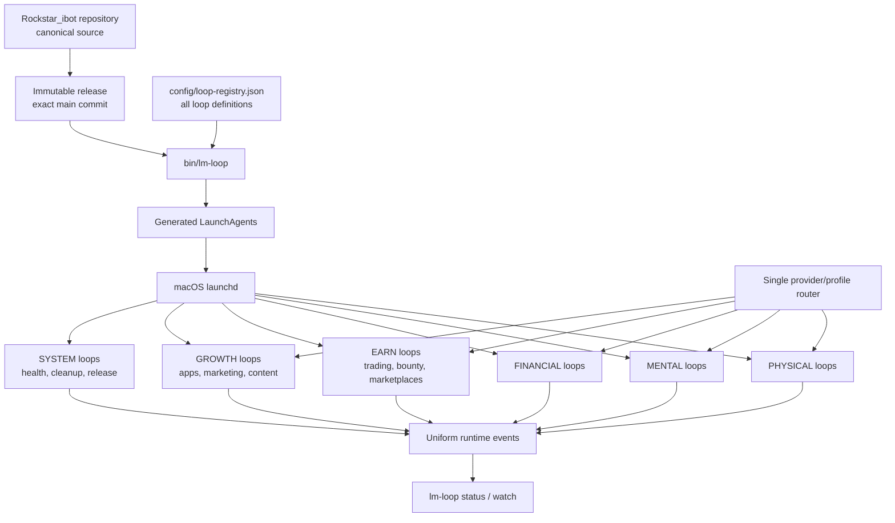

# macOS Rockstar_ibot Loop Control Plane

**Status:** TODO 8 complete / TODO 9 pending
**TODO ID:** `MACOS-LOOP-CONTROL-PLANE-1`  
**Canonical registry:** `config/loop-registry.json`  
**Scope:** macOS launchd only

## 1. Overview

Rockstar_ibot will operate hundreds of loops across physical life, mental life,
financial life, trading, bounties, marketplaces, mobile-app revenue, marketing,
and system maintenance. Today those loops are installed, released, started,
observed, and cleaned through several independent manifests, plist families,
scripts, release roots, and log formats. That fragmentation makes runtime truth
hard to read and makes a new loop easy to install incorrectly.

`MACOS-LOOP-CONTROL-PLANE-1` makes the Rockstar_ibot repository the single source
for every macOS loop. `config/loop-registry.json` becomes the only operational
registry. One CLI renders launchd jobs from it, applies an immutable repository
release, and provides the same lifecycle and observability commands for every
loop. Mutable business state, credentials, logs, evidence, and receipts remain
outside the repository and outside immutable releases.

The control plane manages lifecycle. Existing loop adapters continue to own
business effects through `plan → execute → reconcile → verify → report`.
Individual loops MUST NOT implement their own installer, account switcher,
release selector, monitor, or global cleanup policy.



## 2. Acceptance Criteria

1. `config/loop-registry.json` contains every Rockstar_ibot-owned macOS launchd
   label. No second manifest is authoritative for installation or lifecycle.
2. Every registry entry has exactly one stable loop ID, launchd label, domain,
   repository-relative entrypoint, cadence, effect class, state root, log root,
   cleanup contract, and provider route.
3. `bin/lm-loop apply` validates the complete registry, resolves one exact
   immutable release, generates every plist, loads changed jobs through
   `launchctl-safe`, and reads the loaded arguments back. Invalid entries cause
   zero launchd mutation.
4. `bin/lm-loop start|stop|restart <loop-id|all>` is the only lifecycle command
   documented for operators. `all` expands from the registry and records every
   label result without stopping after the first failure.
5. `bin/lm-loop status [<loop-id|all>]` reports loop ID, domain, launchd state,
   PID when present, installed release SHA, provider/profile alias, last pass,
   last terminal result, next eligible run, and current blocker.
6. `bin/lm-loop watch [<loop-id|all>]` continuously renders the same fields and
   updates from uniform runtime events. It does not infer business success from
   PID existence or exit code alone.
7. Every loop emits JSONL events using one envelope: `version`, `event_id`,
   `timestamp`, `loop_id`, `domain`, `run_id`, `phase`, `status`, `release_sha`,
   `provider`, `profile_alias`, `effect_class`, `effect_status`, `blocker`, and
   `evidence_refs`. Secret values and credential identifiers are forbidden.
8. All model execution goes through one shared provider/profile router. Loop
   code cannot read or replace `auth.json`, choose `CODEX_HOME`, or implement
   account fallback independently.
9. Each loop owns bounded cleanup of its regenerable run artifacts using the
   registry cleanup contract. The central cleanup owner handles only shared
   releases, shared caches, and orphaned artifacts. State ledgers, receipts,
   active releases, protected sessions, and credentials are never cleanup
   candidates.
10. A new loop becomes operable by adding one registry entry plus its tested
    repository-relative entrypoint. No handwritten plist or new monitoring
    integration is required.
11. At least 500 valid registry entries validate and render deterministically;
    `status all` completes within five seconds on the target Mac without starting
    a model or browser.
12. Migration never stops all production loops together. Each label moves only
    after its generated plist, immutable entrypoint, state path, and loaded
    arguments pass readback; failure retains the prior loaded job.
13. After a Mac reboot, enabled loops return through launchd, `doctor` reports no
    unmanaged Rockstar_ibot labels, and a natural scheduled pass emits a uniform
    event from the installed release.

### Operator interface

```text
bin/lm-loop apply
bin/lm-loop doctor
bin/lm-loop start <loop-id|all>
bin/lm-loop stop <loop-id|all>
bin/lm-loop restart <loop-id|all>
bin/lm-loop status [<loop-id|all>]
bin/lm-loop watch [<loop-id|all>]
```

### Registry contract

```json
{
  "schema_version": 2,
  "loops": {
    "fundraiser": {
      "label": "ai.anicca.fundraiser",
      "domain": "earn",
      "entrypoint": "skills/fundraiser-agent/runtime/run.sh",
      "cadence": {"start_interval_seconds": 60},
      "effect_class": "application",
      "state_root": "~/.local/state/rockstar_ibot/fundraiser",
      "log_root": "~/.local/state/rockstar_ibot/fundraiser/logs",
      "cleanup": {"max_runs": 100, "max_age_days": 14},
      "provider_route": "shared-agent-runner"
    }
  }
}
```

The example defines the contract shape; implementation validates allowed domain,
effect, cadence, and route values centrally. Registry values never contain
credential paths or credential contents.

Allowed values are closed and versioned with the registry schema:

- `domain`: `physical`, `mental`, `financial`, `earn`, `growth`, `system`
- `effect_class`: `none`, `publish`, `message`, `money`, `application`, `trade`,
  `account_mutation`
- `provider_route`: `deterministic`, `shared-agent-runner`
- `cadence`: exactly one of `start_interval_seconds`, `calendar_interval`,
  `run_at_load`, or `keep_alive`

## 3. As-Is / To-Be

| Concern | As-Is | To-Be |
|---|---|---|
| Registry | `config/loop-registry.json`, Gig manifest, job-search plists, and independent plist families | `config/loop-registry.json` only |
| Install | Per-loop installers and direct plist edits | `bin/lm-loop apply` |
| Runtime source | Several release roots and some working-tree paths | One exact immutable Rockstar_ibot commit per applied generation |
| Lifecycle | Raw `launchctl`, individual scripts, label knowledge | `lm-loop start/stop/restart` by loop ID |
| Observation | PID, logs, ledgers, and provider receipts inspected separately | Uniform event envelope plus official effect evidence |
| Provider/profile | Per-loop `CODEX_HOME`, auth file, or runner config | One shared provider/profile router |
| Cleanup | Central cleanup plus inconsistent local retention | Per-loop bounded cleanup plus central shared-artifact GC |
| Scaling | Adding a loop requires bespoke plumbing | One registry row plus entrypoint |
| Runtime truth | plist text or working tree can be mistaken for production | loaded launchd args + release SHA + event/effect readback |

## 4. Test Matrix

| # | To-Be | Test name | Cover |
|---:|---|---|---|
| 1 | One authoritative registry | `test_registry_covers_all_life_manager_launchagents` | OK |
| 2 | Complete validated entry | `test_registry_rejects_missing_or_secret_fields` | OK |
| 3 | Atomic apply and loaded readback | `test_apply_is_atomic_and_reads_loaded_arguments` | OK |
| 4 | One lifecycle interface | `test_lifecycle_all_collects_every_label_result` | OK |
| 5 | Uniform status | `test_status_reports_runtime_and_business_truth_separately` | OK |
| 6 | Uniform watch | `test_watch_updates_from_event_envelopes` | OK |
| 7 | Event contract | `test_event_envelope_rejects_secret_and_unknown_fields` | OK |
| 8 | Shared provider router only | `test_loop_entrypoints_do_not_select_auth_or_codex_home` | OK |
| 9 | Cleanup ownership | `test_cleanup_preserves_receipts_active_releases_and_sessions` | OK |
| 10 | One-row onboarding | `test_new_registry_loop_needs_no_handwritten_plist` | OK |
| 11 | 500-loop scale | `test_render_500_loops_and_status_under_five_seconds` | OK |
| 12 | One-label migration safety | `test_failed_migration_retains_prior_loaded_job` | OK |
| 13 | Reboot recovery | `test_bootstrap_generation_has_enabled_recoverable_jobs` | OK |
| 14 | Natural runtime E2E | `test_natural_pass_reports_installed_release_and_effect_state` | OK |

### E2E judgment

| Item | Value |
|---|---|
| UI変更 | なし（terminal CLIのみ） |
| 結論 | Maestro: 不要（iOS UIを変更しない） |
| 必須E2E | clean macOS user install、launchd loaded readback、Mac reboot、自然scheduled pass、`status/watch` readback |

## 5. Boundaries

- macOS launchd only. Linux, Windows, Kubernetes, and cross-platform scheduler
  abstractions are out of scope.
- No new daemon, database, web dashboard, TUI framework, or message bus.
- The mutable repository checkout is never a production entrypoint.
- Business decisions remain inside loop agents and adapters; the control plane
  does not decide trades, applications, publications, messages, or spending.
- The control plane does not count PID, process liveness, local PASS, or model
  output as a completed external effect.
- Credentials remain in private per-profile stores. The repository contains
  aliases and route names only.
- The router does not combine personal ChatGPT subscriptions to circumvent
  provider usage limits. Provider-supported API capacity and explicit profile
  selection remain separate concerns.
- Account/profile management is not duplicated inside loop definitions.
- Historical logs and specs are not rewritten; only current runtime authority
  moves to this control plane.

## 6. Execution Steps and Ordered TODO

| Order | TODO | Done evidence |
|---:|---|---|
| 1 | ✅ Inventory every installed `ai.anicca.*` Rockstar_ibot label and classify owner/domain/effect/state/release | `docs/evidence/runtime/2026-08-28-macos-loop-control-plane-inventory.{md,json}`; 226 installed labels, 208 classified Rockstar_ibot-owned, 14 disabled/unloaded installed ambiguous, loaded/disabled-only rows retained |
| 2 | ✅ Upgrade `config/loop-registry.json` to schema v2 and import all active definitions without changing launchd | 169/169 active classified labels, one external and two retired labels; fixture SHA-256 `35e3b1ae25ed87a815772b14c00c4a87e7e38a87e125bba98f1c04661b9b6c49`; `docs/evidence/runtime/2026-08-28-macos-loop-control-plane-schema-v2.md` |
| 3 | ✅ Implement `bin/lm-loop doctor/status/watch` as read-only commands | five focused tests; live 172-row status/watch; runtime/effect truth separated; `docs/evidence/runtime/2026-08-28-macos-loop-control-plane-readonly-cli.md` |
| 4 | ✅ Implement plist generation and fail-closed `apply` using `launchctl-safe` | five focused tests; production invalid generation zero mutation; isolated exact loaded argv readback and cleanup; `docs/evidence/runtime/2026-08-28-macos-loop-control-plane-atomic-apply.md` |
| 5 | ✅ Implement `start/stop/restart` for one ID and `all`, collecting every return code | four focused tests; isolated one-label start/restart/stop; real collect-all `[0,2,0]`; cleanup remaining 0; `docs/evidence/runtime/2026-08-28-macos-loop-control-plane-lifecycle.md` |
| 6 | ✅ Add the uniform runtime event envelope at the shared runner boundary | exact 15-field schema; private idempotent JSONL; shared-runner integration; invalid-event spoof rejection; existing ledgers unchanged; `docs/evidence/runtime/2026-08-28-macos-loop-control-plane-runtime-events.md` |
| 7 | ✅ Consolidate all model/profile selection into the shared provider router | one explicit `acct2` profile; account rotation and caller provider override 0; duplicate runner 0; active entrypoint direct auth/CODEX_HOME selection 0; Writer normal/repair/session delegated; `docs/evidence/runtime/2026-08-28-macos-loop-control-plane-provider-boundary-progress.md` |
| 8 | ✅ Add per-loop cleanup contracts and central shared-artifact GC reconciliation | immutable loop-run wrapper; marker/terminal/protected gates; loaded/current release protection; isolated 2,097,203-byte pressure recovery; protected deletion 0; `docs/evidence/runtime/2026-08-28-macos-loop-control-plane-cleanup.md` |
| 9 | Migrate active labels one by one: system, growth, earn, financial, mental, physical | each label has old→new loaded readback and rollback receipt |
| 10 | Remove superseded installers/manifests only after registry parity and replay-zero | source dependency scan 0; all enabled loops still loaded |
| 11 | Run 500-loop scale test and clean-user install E2E | render/status budgets pass; no model/browser starts |
| 12 | Run reboot and natural scheduled-pass E2E on the target Mac | enabled recovery, exact release SHA, uniform event, official effect state |

Implementation commands are standardized by this spec:

```bash
python3 -m unittest discover -s runtime/loop/tests -p 'test_*.py'
node --test apps/rockstar_ibot/lib/loop-adapter-registry.test.js
bin/lm-loop doctor
bin/lm-loop apply
bin/lm-loop status all
bin/lm-loop watch all
```

No user GUI task is required. Authentication stays in existing private profile
stores; this control-plane slice never creates or copies credentials.

### TODO 7 execution state

Account rotation and per-caller provider overrides are removed. Gig, Job
Search, Connector, Rockstar_ibot daily, Lancers portable releases, and all X
model calls use the canonical runner with one explicit `acct2` profile. The
duplicate Gig runner is removed after token-budget/history/context parity is
moved. Writer opportunity discovery/response use the shared adapter, while the
legacy Writer CLI delegates production normal and repair/session modes to the
canonical router. Direct active-entrypoint auth/profile selection is zero. Evidence:
`docs/evidence/runtime/2026-08-28-macos-loop-control-plane-provider-boundary-progress.md`.

### TODO 9 execution state

Source preflight is complete: all 169 managed entrypoints are present,
executable, and release-relative. One third-party label is explicit external;
two source-missing/127 labels are explicit retired. No production label has
been cut over yet. Evidence:
`docs/evidence/runtime/2026-08-28-macos-loop-control-plane-source-consolidation.md`.

### TODO 1 execution state

The read-only capture joins installed plist text with loaded and disabled
launchd readback. It records the complete 266-label union, including 40 labels
without an installed plist, rather than treating plist presence as runtime
truth. The installed set contains 208 classified Rockstar_ibot-owned labels. The
169 loaded jobs are represented by schema-v2 entries; 39 disabled jobs remain
migration inventory. Fourteen installed disabled/unloaded labels and 29
loaded/disabled-only labels remain explicitly ambiguous. Unknown releases,
mutable checkout paths, and three invalid plists fail closed for migration. No
launchd mutation or cleanup occurred during inventory.
