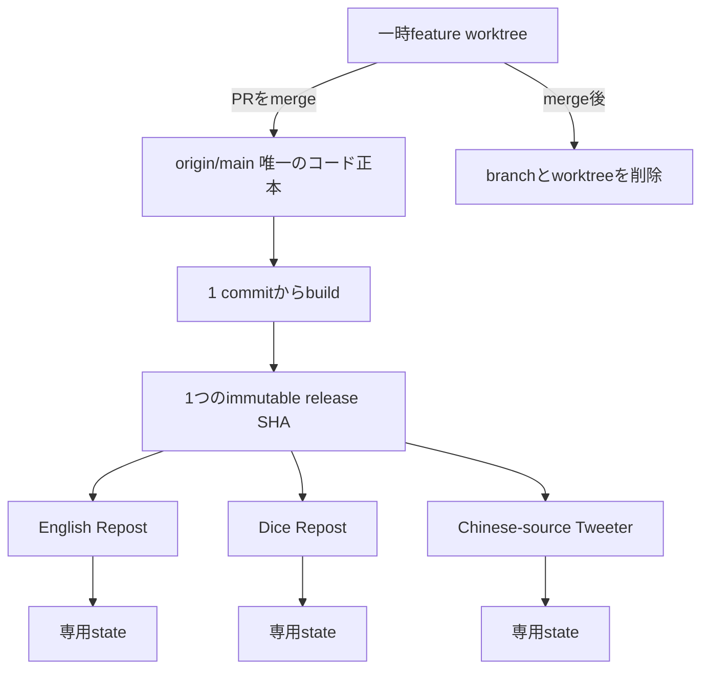
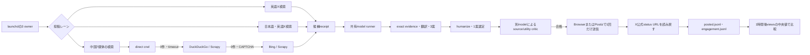

# X成長ループ3本 実験仕様・運用状況

## 実投稿は成立し、6 jobは同じmain releaseへ復旧した

3種類の投稿経路は、実際のX投稿と公式URLの読み戻しまで成功している。したがって、
「日本語リポスト」「英語リポスト」「中国語圏の情報を使った英語オリジナル投稿」が
技術的に成立することは確認できた。

6 jobをGitHub main commit `c50e98ff…` の同じimmutable releaseへ適用し、ProgramArgumentsと
実ファイルをreadbackした。しかし09:08に別のproduction apply ownerが6 plistをmain祖先
`8377ba1b…` へ一括更新した。worktreeやbranchの直接実行ではないが、複数control-plane ownerが
同じplistを同時更新できる競合は残る。release作成時のGCがloaded releaseを保持する修正は有効である。

ただし、**実験基盤の復旧と、実験の勝敗確定は別である**。復旧後wakeでは、Tweeterは
中国語圏5候補からdraftを作ったがcriticが公開前に棄却し、English Repostはaffiliate
payload revisionを通せず、どちらも投稿0だった。Dice Repostで見つかったmanaged loop IDの
不一致はmainで修正済みだが、最新releaseでの実投稿readbackはまだ残る。

## コードはmain 1本、worktreeは作業中だけ使う

Rockstar_ibotのコード正本は、GitHub `Daisuke134/life-manager` の `main` 1本とする。
各loopに永続branchや専用worktreeを持たせない。本番loopはbranchもworktreeも直接実行せず、
`main`の1 commitから作った同じimmutable releaseを実行する。

コードreleaseは共通にする。投稿履歴、重複防止ledger、候補cache、browser identityは
loop別に分ける。これらを1つのstateへ混ぜると、別accountのsource消費や重複判定が衝突する。

worktreeは複数agentが同時に編集する間だけ使う。ライフサイクルは
`作成 → 実装 → test → PR → mainへmerge → branch削除 → worktree削除`で閉じる。
merge後もworktreeを本番ownerや保管場所として残さない。削除前には、dirty変更、未merge commit、
実行中agentのownerを確認し、他セッションが使用中のworktreeは触らない。

本番releaseはappend-onlyとし、作成後に編集しない。cleanupは`current`、`previous`に加え、
loaded launchd jobが参照するexact releaseをpinする。loaded jobが存在する限り、そのreleaseを
削除候補にしてはならない。

## この実験で確かめること

目的は、投稿本数を機械的に増やすことではない。異なる情報源・投稿形式・文体を同じ
計測方法で比べ、どの組み合わせが初速の閲覧数を伸ばすかを学習することである。

検証する仮説は次の4つ。

1. 未使用の個人体験seedがなくても、source固有の事実があれば役立つ投稿を作れる。
2. 中国語圏の一次情報を英語へ翻訳すると、英語圏でまだ広まっていない実務情報を届けられる。
3. 日本語引用、英語引用、英語オリジナルを別owner・別stateで動かすと、重複とqueue競合を防げる。
4. providerの成功通知ではなく、Xの公式URLを読み戻すことで、投稿の実在を証明できる。

## 3レーンは同じ検証パイプラインを共有する

## 3レーンは情報源と投稿形式を分ける

| レーン | アカウント | 投稿 | 情報源 | 宣言上の時刻 | 永続state |
|---|---|---|---|---|---|
| English Repost | `@selawmqt` | 英語の引用投稿 | Xの英語投稿 | 毎時0分・30分 | `~/loops/x-repost-en` |
| Dice Repost | `@diceai0` | 日本語の引用投稿 | Xの日本語・英語投稿 | 毎時5分・35分 | `~/loops/x-repost-ja` |
| Chinese-source Tweeter | `@selawmqt` | 英語の単独投稿 | 中国語圏の公開ページ | 毎時15分 | `~/loops/x-tweeter` |

`loops/x-tweeter/loop.toml`、`config/loop-registry.json`、loaded plistはすべて毎時15分で
一致している。English Repostの0分・30分、Diceの5分・35分と投稿開始時刻を分ける。

## 実際に何が投稿されるか

### English Repost

AI・開発ツール・オープンソース・自動化などの英語投稿を選び、元投稿にない試し方、
判断基準、失敗条件、比較方法を加える。感想だけの引用は出さない。

実投稿例:

> A $399 robot that can roller-skate? Delightful. Next boss fight: teach it a new trick, then see if it gets back up after a fall. Save the before-and-after. That’s the demo.

- 投稿: https://x.com/selawmqt/status/2093017798494838886
- source: https://x.com/ClementDelangue/status/2092931447644442635

### Dice Repost

AI・プロダクト・深層技術・crypto・finance・build in public・お笑いを対象にする。
sourceは日本語でも英語でもよいが、投稿本文は日本語に統一する。文体はprimary、empathy、
funnyの3案を作り、そのwakeの指定toneを優先する。

実投稿例:

> 会社の脳は、寝ているだけじゃない。夢まで見る。9社以上に共通していたのは、信号を拾い、覚え、夢を見て刈り込み、話して探す流れだ。実装前にこの流れを試す。刈り込めなければ、本番には出さない。

- 投稿: https://x.com/diceai0/status/2093018905963032614
- source: https://x.com/femke_plantinga/status/2092918452423983363

### Chinese-source Tweeter

Xの投稿を引用せず、中国語圏の公開ページからsource固有の事実を1つ取り出し、英語の
単独投稿にする。中国語の原文、忠実な英訳、読者が試せる一手をreceiptへ保存し、末尾に
元ページのURLを付ける。

実投稿例:

> When a RAG answer feels “almost right,” it’s tempting to change the prompt. Start with an evaluation set of real user questions, expected sources, and expected answers. Compare retrieval first, then tune the stage that’s weak.

- 投稿: https://x.com/selawmqt/status/2093028734823768073
- source: https://www.bilibili.com/video/BV1xwVr6FEh4/

## source不足では止めず、安全条件でだけ止める

「seedがない」「最初の検索先がtimeoutした」だけでは停止しない。seedは任意であり、
中国sourceはdirect、DuckDuckGo、Bingの順に取得経路を切り替える。

次の場合だけ外部作用を止める。

- source本文にない事実や数字を作っている
- source固有のdetailがなく、一般論しか書いていない
- 指定言語と本文が一致しない
- Xの文字数上限を超える
- 既に使ったsourceまたは同一本文である
- browserのログインaccountが投稿先と違う
- providerが受理した可能性があるのに、公式URLを確認できない
- 誹謗中傷、政治対立、事件性の高い炎上、人の不幸を利用する

最後の「効果が不明」の場合は再送しない。重複投稿を避け、readback専用のreconcileへ進む。

## 60分後viewsの中央値で次の設定を決める

各投稿についてlikes、replies、reposts、bookmarks、viewsを保存する。比較に使う主指標は、
投稿から60分以上経過した最初のsampleのviewsである。最終累計は古い投稿が有利になるため
使わず、初速を同じ条件で比べる。

比較する軸は3つ。

1. `primary`、`empathy`、`funny`のtone
2. `original`と`quote`の投稿形式
3. `reply`と`quote`の反応差。ただし自動replyを使わない構成では、この比較は無効にする

少なくとも2つのarmで各3投稿の計測がそろうまで設定を変えない。条件を満たした場合だけ、
tone weightは0.5、original比率は0.05ずつ動かす。1回の結果で全振りせず、比較対象を残す。

現時点では、投稿経路の成立は証明できたが、どのtone・形式が勝つかを決めるだけのsampleは
そろっていない。したがって、実験の勝者はまだ決めない。

## 3レーンの実投稿までは確認できた

- 3レーンすべてで実投稿とX公式URLの読み戻しに成功した
- 中国語sourceから英語originalを生成し、Bilibili URLを保持した
- seed 0でもsource evidenceから投稿案を作れた
- English RepostをAffiliate queueと別stateへ分離した
- Chinese sourceの1出所timeout後も残りの出所へ進める
- DuckDuckGoがCAPTCHAでもBingへ切り替えられる
- 同じslotの再wakeでledger行数が増えないことを確認した
- Rockstar_ibotの公開mainへ実装、テスト、READMEを統合した

## release削除事故は修正し、同じmain releaseへ統一した

事故原因はrelease作成scriptと中央cleanupが別々にGCを持ち、前者がloaded plistのexact pathを
保護しなかったことである。release作成scriptを中央GCへ一本化し、currentとloaded plistを
保護する回帰テストを追加した。実際に旧loaded release `defa620c…` を残したまま次releaseを
作成できた。

09:08時点のinstalled plistは6本ともexact release
`/Users/anicca/loops/releases/20260828T090440-8377ba1b` を参照する。これはorigin/main祖先だが、
一部loaded stateとterminal eventが追随していない。Tweeterの復旧wakeは中国語圏5候補を収集し、
公開前critic棄却だったため、このwakeの外部作用と重複作用はともに0である。

## 残TODO — この順番で閉じる

Daisがbranchを選んだり、worktreeを手作業で削除したりする必要はない。Codexがowner、dirty、
merge状態をread-onlyで確認し、安全な対象だけを整理する。同じworktreeを別セッションが使用中と
判定した場合だけ、競合する作業を止めずにDaisへ選択を求める。

### 完了: 6 jobを存在するexact releaseへ戻す

- `origin/main`から新しいimmutable releaseを作る
- `runtime/`、`skills/x-repost`、`skills/x-tweeter`、`loops/`、`bin/`、`lib/`をreleaseへ含める
- pass 3本とhealthcheck 3本を同じreleaseへ再適用する
- loaded `ProgramArguments`、release SHA、実ファイルの存在をreadbackする
- 6 jobの直近終了を0へ戻す

### 完了: cleanupがloaded releaseを消さない契約を追加する

- cleanup候補から、launchdが現在参照しているreleaseを除外する
- `current`だけでなくloaded plistのexact pathもpinとして扱う
- cleanup実行後に6 entrypointが存在することを回帰テストする
- current、previous、loadedの最低3世代を混同しない

### 完了: cadenceの正本を一致させる

- Tweeterを毎時15分に統一する
- `loops/x-tweeter/loop.toml`、`config/loop-registry.json`、loaded plistの3つを照合する
- English Repostの0分・30分、Diceの5分・35分と重ならないことを確認する

### P0: 最新releaseで公開E2Eとreplay-zeroを閉じる

- English Repost: live X候補、英語quote、公式status URL
- Dice Repost: 日本語または英語source、日本語quote、公式status URL
- Chinese-source Tweeter: 中国語source、原文・英訳receipt、英語original、公式status URL
- 各レーンのsecond wakeで同じsourceの重複作用が0であることを確認する
- English Repostのaffiliate payload revision failを、一般repostの成功と混同せず解消する
- Dice Repostの最新release wakeを完了し、healthcheckのstale警告を0へ戻す

### P0: production apply ownerを1つにする

- release作成と全registry applyを行う唯一のcontrol-plane jobを特定する
- 手動・別sessionのapplyをowner leaseまたはcompare-and-swapで拒否する
- apply前後にexpected SHAを照合し、途中で別SHAへ変わったらfail-closeする
- 6 plistが同じSHAのまま1 cadence維持されることをreadbackする

### P1: 計測をためて最初の比較を閉じる

- 各tone・形式で60分後viewsを各3件以上集める
- 中央値を比較し、`insufficient-data`のままなら設定を変えない
- 条件を満たした比較だけ`strategy.json`へ反映する
- 日次digestで投稿数、計測coverage、中央値、最良・最低投稿を報告する

### P1: merge済みbranchとworktreeを整理する

- 全worktreeを`使用中`、`dirty`、`未merge`、`merge済みclean`に分類する
- 実行中agentが所有するworktreeと、dirty・未mergeのworktreeは保護する
- merge済みcleanなworktree 5件は削除済み。残る21件を同じ基準で継続整理する
- 対応するlocal・remote feature branchを削除する
- 永続branchが`main`だけになっていることを確認する
- 新しいPRがmergeされたらbranch/worktreeを片付ける手順をrelease workflowへ組み込む

## 配置復旧は完了、公開E2Eとreplay-zeroで運用完了とする

次のすべてを満たした時点で、実験基盤と現在の本番運用を完了とする。

1. 6 jobが存在する同一exact releaseを参照する
2. 3 passと3 healthcheckの直近終了が0である
3. 3レーンでruntime復旧後の実投稿URLをreadbackできる
4. 3レーンのsecond wakeで重複作用が0である
5. cleanup後もloaded releaseが残る
6. GitHub main、release SHA、loaded runtimeの内容が一致する
7. 本番plistがbranch・worktree・mutable checkoutを参照しない
8. merge済みcleanなworktreeとfeature branchが残っていない

toneや投稿形式の勝者決定は、この基盤完了とは別である。各armのsampleが3件未満なら、
「実験は動いているが、勝敗は未確定」と報告する。
