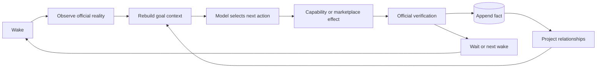
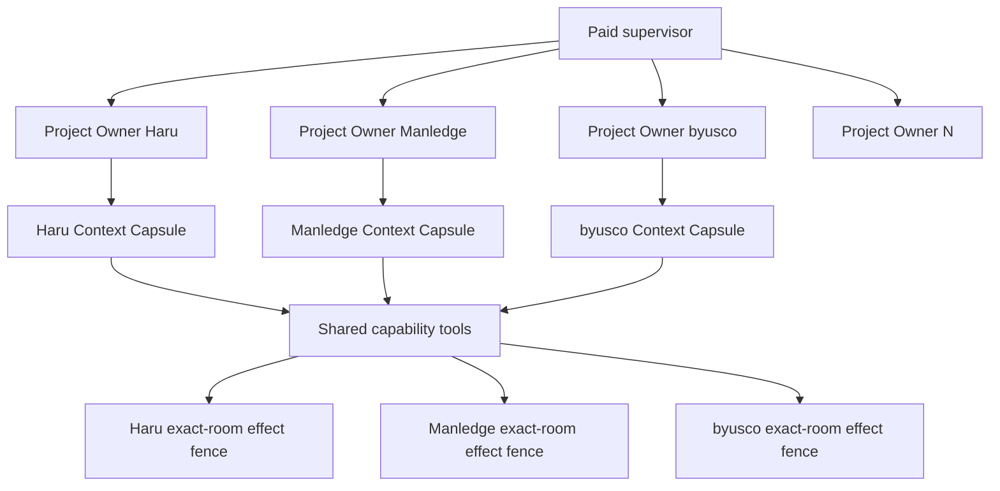
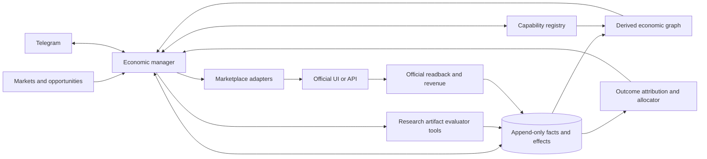
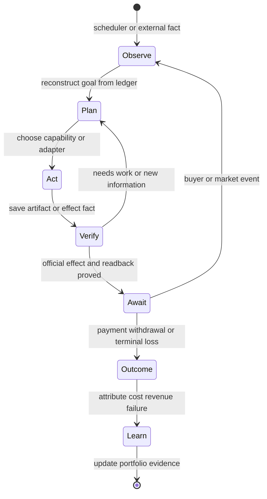
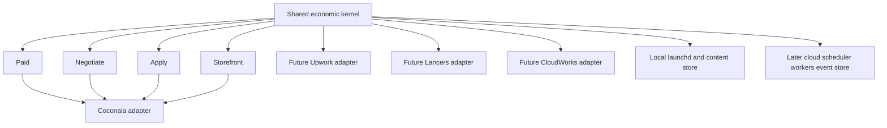

# Open work on the Coconala loop

Ordered. Each item says what was measured, not what is suspected. Anything without
evidence does not belong on this list.

The four lanes run from `~/gig/releases/rockstar_ibot/<sha>/`, cut from `main` by
`gig_release.py`. See `README.md` for how the whole thing is installed.

Current lane names are **Apply, Reply, Storefront, Paid**. `Reply` owns buyer-message
observation, replies, and estimates; do not present it as a separate Negotiate lane.

The Manledge delivery is no longer the active program cursor. The active product objective is a
public, website-neutral, no-human revenue agent whose four installed owners run continuously:
Apply acquires suitable work, Reply handles every buyer event and estimate, Storefront improves
offers from measured conversion, and Paid completes accepted work through official terminal
readback and replay-zero. A marketplace-specific customer case is evidence for this kernel, not a
separate architecture or the definition of completion.

## Active atomic cursor — execute exactly top to bottom

This is the only executable cursor. One checkbox is one bounded change or one bounded
readback; a phase name is never a checkbox. Do not start a later item until every earlier item
is checked. Check an item only with the evidence named after `PASS =`. Chat, process liveness,
model narration, and local success without the named readback are not PASS.

### Manledge closure — account-owner priority override

- [x] `M01` Refresh Coconala talkroom `18169985` and bind the buyer's latest request for
  recipient-identifiable evidence.
  PASS = official buyer message identity and exact text are present in the project context.
  Official selected-talkroom readback observed message `js-talkroomMessage-220315622`, buyer
  feedback SHA256 `d858e5e933fec231d23d7d2b53ffe8d116dd6ab3a751cee435a8a37cf75281a0`.
- [x] `M02` Verify the 100 screenshot filenames against the 100-row roster.
  PASS = `FINAL-NNN-handle.png` maps one-to-one to row `FINAL-NNN`, with 100 unique handles,
  zero missing files, zero extra files, and zero hash mismatches.
  Measured 100 rows, 100 files, 100 unique handles, zero missing, and zero extra. The resulting
  private buyer map is `delivery/manledge-recipient-screenshot-map-100.csv`, SHA256
  `212f5542fd0801ad10bd8e01c885a2c1407868e090da0ed0b4ffa176c9b01061`.
- [x] `M03` Resolve the official X profile display for all 54 successful-DM screenshots previously headed
  `Member`, then capture each resolved profile together with its existing DM thread without
  sending a new message.
  PASS = 54 unique recipient handles have a current official profile readback and a buyer-visible
  screenshot pairing that profile identity with the matching existing thread; failed sends remain
  classified as failed and are never counted as successful DMs.
  Closed with 54/54 official X `new-dm-user-suggestion-<account_id>` to existing conversation
  participant-ID matches in `x-chat-account-mapping-v39.json`; the correction sent zero new X DMs.
- [x] `M04` Submit the 54 corrected identity screenshots and updated cross-reference through the
  installed Paid owner, then read the exact Coconala talkroom back once.
  PASS = the exact seller message and corrected archive filename are present in official Coconala
  DOM, the archive contains all 54 identity-resolved successful-DM pairs, no X message was newly sent, no prior
  archive was resent, and formal delivery remains off.
  Closed by the normal Coconala reply at 19:32 with `manledge-dm-cross-reference-v39.zip`
  (SHA256 `86ef9d22b351d1008d3848d23c84737e6b380c6062e586644e1a27f13d63407b`).
  Official talkroom readback shows the exact message and 32.5 MB attachment; the formal-delivery
  checkbox remained off. Screenshot receipt: `evidence/coconala-manledge-v39-readback.png`.

### Storefront paid-demand correction — current account-owner priority override

Production measurement, not catalogue size, opens this override. The official 30-day seller
analytics currently read 13 services, 479 views, 2 favourites and 0 purchases. The latest natural
Storefront wake selects `Excel 自動化`, but the seller already has three Excel-family services with
195 views and 0 purchases. It then blocks a new offer as
`own_family_has_traffic_without_sales`, allocates 10 services to `IMPROVE`, zero to `REPLACE` or
`RETIRE`, and ends `no_executable_unfenced_mutation_contract`. Storefront is technically alive but
has not proved a product people pay for.

Competitive research may copy public demand facts, package structure and price ranges. It must not
copy another seller's identity, profile image, copyrighted listing image, exact prose, reviews,
portfolio, credentials or results claims. Every published asset and sentence is original and every
capability claim is backed by an installed executable capability.

- [x] `S01` Record the current official catalogue and conversion baseline.
  PASS = one receipt binds all 13 service IDs to title, category, price, views, favourites,
  purchases and current listing version; totals remain reconcilable to the official seller page.
  Closed by `catalog_conversion_baseline`: 13 IDs, 479 views, 2 favourites, 0 purchases,
  with per-listing version hashes and baseline SHA256
  `3556abdf9ec79a4905d018bd33d198077b4313753b7ce65e9d1b93adf27cd89f`.
- [x] `S02` Derive at least three candidate markets from official paid-demand evidence.
  PASS = every candidate has public Coconala comparables with a nonzero review or sale count,
  current displayed price, evidence URL and capture time; result count or views alone score zero.
  Current official observations establish four usable comparables: AI-agent business improvement
  (`/services/3263200`, 19 service reviews, ¥50,000), AI input-work automation
  (`/services/3691561`, 18 service reviews, ¥3,000), embedded AI chatbot
  (`/services/3845411`, one service review, ¥30,000), and LINE plus AI business automation
  (`/services/4265050`, seller total sales 11, ¥300,000). Two monthly AI-support examples
  (`/services/4363787` and `/services/4309850`) each show seller total sales zero, so recurrence
  alone is not paid-demand evidence and does not raise their score.
  The natural owner retained known paid-demand clusters for AI business automation, YouTube script
  production and user-interview analysis; each has reviewed/sold comparables and a current median.
- [x] `S03` Bind each paid-demand candidate to an executable owned capability.
  PASS = each candidate names the installed skill/tool path, deliverable, buyer inputs, exclusions,
  delivery time and proof method; unsupported candidates are rejected before drafting.
  The public skill inventory now extends the capability market without replacing private families;
  `skills/ai-automation-builder/SKILL.md` binds bounded implementation, verification and handover.
- [x] `S04` Rank candidates by verified demand, price, recurring potential and own conversion.
  PASS = the ranker prefers official purchase/review evidence over search volume, penalizes an own
  family with sufficient views and zero purchases, and selects one winner with a durable scorecard.
  The natural owner selected `業務自動化 AI エージェント 開発` (score 12) ahead of one-off
  candidates after recurring potential became a ranking input.
- [x] `S05` Permit a stronger candidate to replace a measured zero-purchase service before all 20
  slots are full.
  PASS = a regression changes one eligible allocation from `IMPROVE` to `REPLACE` when its sample
  is sufficient, purchases/payments are zero and the replacement has stronger paid-demand proof;
  a paid or insufficient-sample service remains protected.
  Closed by the focused portfolio regression: a sufficient-sample zero-purchase offer becomes
  `REPLACE` for stronger paid demand without slot pressure; paid and insufficient-sample offers stay protected.
- [x] `S06` Produce one original, truthful offer contract for the selected market.
  PASS = title, body, packages, FAQ, price, original image brief and recurring-support boundary are
  complete; prohibited-copy checks reject exact competitor prose, identity and image reuse.
  The rejected discovery-only and unrelated-niche drafts never became public. Contract
  `1f77845e1fe8f3c8c16eb25f137a6dfdee826ad36392495d3f0f500af2bedc24` binds one original
  AI-assisted workflow implementation, verified handover, paid-demand pricing, one original image,
  and post-acceptance maintenance; only selected-capability evidence enters the proposal.
- [x] `S07` Resolve the executable mutation/publication contract selected by `S06`.
  PASS = the natural Storefront owner no longer ends
  `no_executable_unfenced_mutation_contract` for that exact contract and records one fenced effect
  intent before any seller-page mutation.
  The owner reused candidate `4371816`, persisted `prepared/readback=1`, checkpointed the exact
  prepared contract instead of regenerating it, and advanced it through one fenced public effect.
- [x] `S08` Publish through the installed Storefront owner and read the seller page back.
  PASS = an immutable main release is current; official Coconala DOM matches the selected original
  title, price, packages, body and image; the retired/replaced listing remains recoverable; replay
  performs zero duplicate effects.
  Natural owner pass `storefront-direct-1787828293102000000-83451` published
  `https://coconala.com/services/4371816` with public effect/readback `1/1`, image identity
  `44547340-9588932.png`, no public readback error, and the generated maintenance option. Natural
  replay `storefront-direct-1787829207737098000-21430` read 14 official services and 14 active
  listing contracts with effect zero and no duplicate publication.
- [ ] `S09` Attribute the first inquiry, order and payment to the originating service.
  PASS = official talkroom/service identity, order and payment receipts retain the same service ID;
  unknown remains explicit and storefront revenue is never inferred from views, favourites or chat.
- [ ] `S10` Continue measured portfolio learning without cloning competitors.
  PASS = each later wake either records a bounded official no-change reason or performs one fenced
  mutation selected from conversion evidence; zero-sale offers can be replaced, paid offers stay
  protected, and no competitor-owned prose/image/identity enters a published contract.
- [ ] `S11` Persist one website-neutral `MarketProductContract` from the accepted Storefront offer.
  PASS = buyer job, delivery kind, inclusions, exclusions, inputs, artifact acceptance, base price,
  recurring-support boundary, capability evidence, paid-demand evidence and originality provenance
  validate without a Coconala service ID, form field or category ID.
- [ ] `S12` Render the same product contract through thin Coconala, Lancers, CrowdWorks and Fiverr adapters.
  PASS = each adapter maps only platform fields, categories, currency and limits; no adapter changes
  the buyer job, invents credentials/results, copies competitor prose/images, or owns product judgment.
- [ ] `S13` Qualify the product independently on each configured marketplace.
  PASS = each platform records current official sold/reviewed comparable evidence and fees; missing,
  unknown or zero-sale evidence remains explicit and never inherits Coconala demand as proof.
- [ ] `S14` Publish one additional-platform canary through its installed Storefront owner.
  PASS = an authenticated and authorized adapter performs one fenced publish, exact official readback
  matches the shared product contract, replay is effect-zero, and inquiry/order/payment retain the
  platform plus listing identity. Unconfigured platforms remain effect-zero rather than blocking others.

### Live four-lane repair

- [x] `R00a` Reproduce the Reply and Paid retention faults from current production state.
  PASS = a repeated official-head probe dispatches the same DLQ action, and a failed Paid owner
  without a resumable tool marker leaves its workspace behind. Production Reply produced 409
  result files in ten minutes, dominated by `already_closed`; the focused regressions failed first.
- [x] `R00b` Bound Paid context-read history and failed workspace retention at their shared owners.
  PASS = each compile records one aggregate per resource key with source count and digest, exact
  live-talkroom proof remains present, and failed workspaces survive only with a valid tool-resume
  marker. The focused Paid/context suites pass 41 tests.
- [x] `R00c` Stop Reply from dispatching an action whose durable `dlq_at` is non-null.
  PASS = three repeated probes dispatch zero workers for the DLQ row while an ordinary pending row
  still dispatches once. The full Reply concurrency suite passes 54 tests.
- [x] `R00d` Use Reply as the current lane name in onboarding and operator-facing lane inventories.
  PASS = README, earning-loop inventory, SLOT inventory and this executable cursor say Reply;
  historical evidence remains historical and the installed compatibility label stays unchanged.
- [x] `R00e` Publish the repair and prove it through the installed owners.
  PASS = a new immutable main release is current; three Reply probes produce no repeated DLQ worker
  results; a natural Paid compile appends a bounded aggregate receipt; free bytes remain above the
  configured floor; Apply, Reply, Storefront and Paid remain loaded under their own owners.
  Closed on main ancestor `10ae7f97a` and current release `2b044e0c4`: four consecutive Reply probes
  produced zero targeted workers and zero `already_closed` results (before: 409 results in ten
  minutes). Natural Paid receipts aggregate 8–64 sources into 2–3 resource rows and occupy
  954–1,090 bytes each while retaining exact live-talkroom SHA. A failed Paid wake left no new
  runtime workspace. Three pre-fix orphan workspaces with no open files and no resume markers
  reclaimed 262 MiB while the current active workspace was preserved; free space remained above
  5 GiB, above the 512 MiB floor. All four owner
  labels remain loaded; interval owners may truthfully be not-running between wakes.
- [x] `R00f` Remove the completed Manledge-only X DM campaign from scheduled execution.
  PASS = `ai.anicca.manledge-x-dm-campaign` is absent from launchd and LaunchAgents, while its logs
  and delivery evidence remain intact. The obsolete 1,200-second owner had run 40 times and last
  exited 1 after the customer case was already closed; its plist is recoverably retained in Trash.
- [x] `R00g` Bound the continuous Reply inbox-head collector.
  PASS = one Coconala collector hang cannot stop the permanent producer; the subprocess exits after
  45 seconds and the supervisor returns to its next 30-second probe. Production PID `972` remained
  alive while probes stopped after `probe-1164` at 19:03 because `_run("head_collect")` had no timeout.
  Release `661923ca0` adds the bound; the focused timeout, overlap and restart regressions pass.
- [x] `R00h` Complete the overdue FORCLE hearing-sheet obligation.
  PASS = authenticated DM `10103725` records the buyer's DOCX request, the completed nine response
  fields contain only private-profile/application evidence, and the seller reply contains the filled
  DOCX. Official readback binds message SHA
  `f158c6de333990a334e382b8abf07d5a0379b48a368f567403b393a0590a0235` and attachment SHA
  `7e0713a9e18a829937e191bcb6f7c6481601c5d653fb5ca840a473844bad4fd8` with no formal delivery effect.
- [ ] `R00i` Route future pre-purchase attachment obligations through a general artifact owner.
  PASS = a buyer-provided DOCX/PDF/XLSX form, requested sample or requested revision remains an
  outstanding buyer action after a seller acknowledgement; the owner reads the verified attachment,
  creates the requested buyer-visible artifact, sends it through the Direct Message attachment
  executor, obtains exact message/filename/SHA readback, and replay performs zero duplicate effects.
- [ ] `R01` Read back production `current` and prove commit `8eb732958` is an ancestor.
  PASS = immutable release SHA plus successful `merge-base --is-ancestor`.
- [ ] `R02` Start one stopped disposable registered browser through `with-browser.sh`.
  PASS = guard reports the same identity reachable and the wrapped command receives its CDP URL.
- [ ] `R03` Run the focused browser startup regression.
  PASS = all tests in `skills/browser/tests/test_cdp_persistent_context.py` pass.
- [ ] `R04` Kickstart the installed Paid owner once after `R01`–`R03`.
  PASS = launchd run count increases once and the owner pins the new immutable release.
- [ ] `R05` Read back project `18128025`'s unpublished BUYMA draft.
  PASS = official account, draft identity, saved fields, and current reload receipt agree.
- [ ] `R06` Measure Paid capacity for that run.
  PASS = before/after free bytes and Paid evidence-byte delta are recorded in one receipt.
- [ ] `R07` Verify runner retention after the Paid run.
  PASS = every `evidence/agent-*/history/` contains at most three generations.
- [ ] `R08` Verify host cleanup recurrence.
  PASS = cleanup launchd run count advances and last exit is zero without protected deletion.
- [x] `R09` Observe three consecutive Reply probes.
  PASS = three official inbox snapshots have increasing capture times no more than 30 seconds apart.
  Release `661923ca0`, owner PID `8577`, produced probes 1–4 at 22:18–22:19 while remaining loaded;
  FORCLE's already-sent seller-last identity produced no duplicate reply.
- [ ] `R10` Read back the Reply durable queue.
  PASS = every live pending buyer event has either an active owner or a terminal receipt.
- [ ] `R11` Read back the latest Apply cycle.
  PASS = official opportunity/application receipt is fresh, or a bounded official no-action receipt exists.
- [ ] `R12` Read back the latest Storefront cycle.
  PASS = official listing receipt is fresh, or a bounded official no-change receipt exists.
- [ ] `R13` Read back the latest Paid cycle.
  PASS = every observed project is terminal, externally waiting with a durable owner, or failed with one exact retry owner.
- [ ] `R14` Replay the completed Paid effects once.
  PASS = effect count zero and duplicate-effect count zero with official readback unchanged.
- [ ] `R15` Write one four-lane runtime manifest.
  PASS = it binds each lane label, immutable release SHA, latest receipt, recurrence, and owner state.

### Shared job kernel

- [ ] `K01` Define one website-neutral `JobContract` JSON Schema.
  PASS = one Coconala fixture validates and one malformed fixture is rejected.
- [ ] `K02` Define the six owner lifecycle states in one schema.
  PASS = only `ACTIVE`, `WAITING_EXTERNAL`, `AWAITING_BUYER`, `TERMINAL_PENDING_REPLAY`,
  `CLOSED_COMPLETED`, and `CLOSED_CANCELLED` validate.
- [ ] `K03` Define the allowed lifecycle transitions in one transition table.
  PASS = every allowed edge passes and every other edge fails.
- [ ] `K04` Define one durable effect-checkpoint schema.
  PASS = website, account, entity, effect key, payload hash, owner, run, and official readback are required.
- [ ] `K05` Fence identical effect keys.
  PASS = a same-key concurrent regression produces exactly one effect.
- [ ] `K06` Preserve different-key parallelism.
  PASS = a different-key regression starts both owners without a shared global lock.
- [ ] `K07` Resume one owner after process exit.
  PASS = retained checkpoints resume the next unfinished effect and repeat no completed effect.
- [ ] `K08` Reject a stale invocation.
  PASS = an old owner revision cannot mutate current state or perform an external effect.
- [ ] `K09` Retain closed tombstones.
  PASS = restart and replay of a closed job are effect-zero.

### Thin adapter boundary

- [ ] `A01` Define one adapter protocol for auth, discover, observe, apply, reply, deliver, and readback.
  PASS = protocol contains no customer, category, or marketplace-specific judgment.
- [ ] `A02` Move Coconala observation behind that protocol.
  PASS = the existing read-only live probe passes only through the adapter.
- [ ] `A03` Move Coconala Apply behind that protocol.
  PASS = one fenced application fixture produces an exact application readback.
- [ ] `A04` Move Coconala Reply behind that protocol.
  PASS = one fenced reply fixture produces an exact message readback and replay-zero.
- [ ] `A05` Move Coconala Paid delivery behind that protocol.
  PASS = one fenced delivery fixture produces exact artifact/message readback and replay-zero.
- [ ] `A06` Add adapter auth-expiry conformance.
  PASS = expired auth performs zero external effect and returns one typed recovery state.
- [ ] `A07` Add adapter pagination conformance.
  PASS = all fixture pages are covered once with no skipped or duplicated entity.
- [ ] `A08` Add adapter attachment conformance.
  PASS = download and upload hashes bind to the same job and cross-job reuse is rejected.
- [ ] `A09` Add adapter terminal-state conformance.
  PASS = completion and cancellation each require official terminal readback before closure.

### Public OSS proof

- [ ] `O01` Run a repository secret and customer-data scan.
  PASS = tracked public files contain no credential value, private context, customer artifact, or raw receipt.
- [ ] `O02` Fix one public bootstrap command.
  PASS = the documented command pins a release and requires no repository-local secret.
- [ ] `O03` Install from that command in a clean temporary home.
  PASS = four owner labels and their immutable arguments are present after installation.
- [ ] `O04` Restart the clean installation once.
  PASS = all four owners recover without manual state repair or duplicate external effect.
- [ ] `O05` Complete one real Coconala job through the shared kernel.
  PASS = discovery through official terminal readback and replay-zero are bound in one receipt chain.
- [ ] `O06` Add a second website using only its adapter and configuration.
  PASS = no kernel, lifecycle, planner, checkpoint, or receipt code is forked.
- [ ] `O07` Complete one real job on that second website.
  PASS = discovery through official terminal readback and replay-zero are bound in one receipt chain.
- [ ] `O08` Publish the OSS release.
  PASS = public tag, bootstrap, architecture, safety boundaries, conformance results, and clean-install proof are readable without private files.

### E2E judgment

| Item | Value |
|------|-------|
| UI change | No |
| Maestro | Not required; this scope is launchd, browser adapter, durable state, and official provider readback |
| Required E2E | Clean-install four-owner recovery plus two real website terminal receipt chains |

The shared model runner now retains only the newest three rotated generations inside each
project-owned `evidence/agent-*/history/` directory. Production cleanup removed 1,115 old
runner generations (356,708,106 bytes) without touching current results, customer artifacts,
delivery/source, state, JSONL ledgers, or Codex/Claude sessions. The host-wide fail-closed
`ai.anicca.rockstar_ibot-disk-cleanup` owner is enabled again at its 300-second interval; its
48 protection tests pass. A closed Sparkle installation cache, not a Paid video build, held
about 2 GiB and was removed after an open-file readback returned empty. Paid replay then kept
all 43 observed agent histories at three generations or fewer while free space recovered to
2.8 GiB.

## Historical Coconala case cursor — evidence only

This section preserves customer-case evidence and liabilities. Its unchecked items feed the
active atomic cursor only when the shared owner naturally observes them; they do not override or
reorder `R01`–`O08`. The target remains verified monthly net cash of at least USD 10,000. Only
official contract, fee, payout, and bank receipts advance it.

### Stage 1 — unblock Paid, then start every current owner

1. [x] Remove Paid's remaining `max_workers=1` and global CDP-lock path. Dispatch one isolated
   owner per paid marketplace entity with distinct tab/target, client identity, URL, state, and
   evidence root. Different clients prepare, build, review, send, and read back concurrently;
   only the same entity/effect key is compare-and-swap fenced. Current-main descendants pass the
   full Paid regression 37/37. A stable production parent and all six project children used the
   same immutable release `a81ec3b630f6d33b3f0ed39706c338169fbe2dc3`; Manledge sent and exactly
   read back one Coconala acknowledgement with `effect=1/readback=1/failed=0`, while every other
   room retained its own project root, target, artifact and receipt. The preceding parallel wake's
   BUYMA Gmail effect and official acknowledgement remained in its separate project ledger; no
   context, attachment, target, receipt, or effect-key crossover was observed.
2. [x] Before dispatch, refresh every current room and compile all relevant DM, talkroom,
   attachments, listing, latest buyer message identity, and effect history into that project's
   private context. Share skills, account references, sessions, and tools only; never customer
   context, artifact, history, or state. Resolve secrets only inside the selected adapter.

### Stage 2 — close the current Paid liabilities concurrently

3. [ ] byusco `18171890`: invalidate the stale note-only decision, consume the latest request,
   publish the reviewed article to the agreed anicca AI blog through the installed owner, read
   back the public URL, report and formally deliver it, obtain buyer completion, and replay with
   zero effects. The earlier note handoff is not completion. The preserved v8 article contract is
   SHA256 `1b0e4818894b4c223421a2142f723d35b4f7751bddd054d2bf0632b33ddab37d`
   with three immutable screenshot assets. Use the account-owned site's existing
   `skills/affiliate/scripts/owned_publish.py` from one clean isolated site worktree: commit only
   the three image paths, then let that adapter stage/commit/push the article JSON and obtain
   `https://aniccaai.com/blog/casican-review` readback. Do not clone Rockstar_ibot, install web
   dependencies, run a site build, or create another publisher.
   Production owner has now published the three immutable images and article to
   `https://aniccaai.com/blog/casican-review`: image commit `1e3c638e21828f74b949fd3433faed38d36e0ad8`,
   article commit `a98e7b32e2a65967023018b1e1c8d301b6cbe90a`, HTTP 200, exact structural
   body/title/tracking-link/image readback, rendered SHA256
   `073bdaa6796d9f3e886436937442f5cdbdf6b3dd3cda80a9e8d639540c30776d`.
   The installed Paid owner then sent the concise anicca AI URL handoff in the exact Coconala
   room with `effect=1/readback=1/failed=0`, message SHA256
   `1e785b86e51d8969762d63dfd87bbbf77fad429e6cd3cd7a141c26080b62439d`, and formal
   delivery off. Remaining closure is the buyer's response, formal delivery, transaction
   completion, and replay-zero; do not republish or resend the handoff while waiting.
4. [ ] LBJ `18130722`: use only the latest explicit buyer approval and latest v98 project-manager
   package. Codex may inspect v98 and repair the generic approval/reviewer code, but must not send
   customer work. A seller acknowledgement must not erase buyer approval. The installed Paid
   owner fresh-reviews v98, formally submits it, reads it back, closes, and proves replay-zero.
   Production release `f315f0b6a9e4b429910d5153c72e34d696ae83a5` generated a fresh v16
   decision with `mode=file`, `delivery_stage=formal`, latest seller identity
   `js-talkroomMessage-220162081`, and the preceding explicit buyer approval identity
   `js-talkroomMessage-220162036`. It performed no effect because this legacy project lacked its
   project-owned `delivery/` workspace. Main and current release
   `608b4b348243cdb62ceead9e54b2126fb629b724` now initialize that workspace idempotently before
   every file prepare; the complete Paid regression passes 39/39. The next installed-owner wake
   must resume the existing approved package, formally deliver it once, obtain official readback,
   and replay with zero duplicate effect.
   The account owner then clarified the required order: the buyer's latest Project Manager share
   request occurred after the earlier URL message, so the package had to be shared again before a
   new approval. The installed owner re-shared the still-live GigaFile URL as a normal message with
   no attachment and the formal checkbox off, naming `LBJ_Proposal12_v98.prproj` and the included
   confirmation MP4. Production result: `effect=1/readback=1/failed=0`; the official Coconala DOM
   contains the re-share message. Current action is now only to await a genuinely newer buyer reply.
   Do not perform another formal delivery unless that newer buyer reply explicitly approves the
   re-shared package; the earlier premature formal event remains historical evidence and must not be
   repeated or represented as this new approval. No newer buyer reply is currently present.
5. [ ] `18183618`: continue the JAIC path without impersonation; use a truthful disclosed-agent
   equivalent, negotiate supported scope, or complete official cancellation when the exact
   provider requirement cannot be performed autonomously. Otherwise obtain completion evidence,
   the four-part report, fresh review, formal delivery, buyer completion, and replay-zero.
   Current durable v4 is buyer-visible and the latest buyer message is an acknowledgement; do not
   send another progress message while awaiting the buyer's substantive feedback.
6. [ ] `18184558`: make no guessed seller-side delivery/cancellation action. Observe official
   Coconala cancellation, enter terminal pending replay, prove all effects zero, and close as
   cancelled. The latest buyer message says they contacted Coconala support and asks us to wait for
   cancellation completion; remain observe-only.
7. [ ] `18180857`: use the buyer-authorized TikTok account and stored credential. The historical
   code is no longer reusable. At the first official observation outside Chii's unavailable
   19:00–22:00 JST window, ask once only whether TikTok authentication can be handled now; do not
   ask for a code in that message. After a newer availability confirmation, start login immediately
   and request a six-digit code only if official TikTok issues a new OTP in that same continuation;
   enter it immediately and never ask again pre-emptively. Then perform the exact campaign scope,
   checkpoint every verified DM/sheet effect, verify the live result, deliver, obtain buyer
   completion, and prove replay-zero.
   At the account owner's direction, one stored-credential login submit was performed at
   `2026-08-24T12:24:33Z`. The official TikTok DOM remained on the email/password route and read
   `試行回数が上限に達しました。後ほどお試しください。`; authentication and OTP challenge were
   both false. Durable evidence is
   `evidence/tiktok-login-preflight-20260824T122433Z.json`. Do not submit login again or contact the
   buyer while that provider state remains. The next TikTok action is read-only provider-state
   observation; only after the limit clears may the owner make one new login attempt and follow the
   OTP continuation above. The installed owner subsequently asked for a safe authentication window
   and obtained exact buyer readback `22時にお願いいたします🙇‍♀️`. At 22:00 JST, make exactly one
   stored-credential login submit. If TikTok still shows the attempt limit, stop without another
   buyer message. If it issues a fresh OTP, ask for that code and enter it immediately in the same
   continuation.
   The account owner has now transferred Chii to a separate agent. The installed Paid owner is
   observe-only for this exact cycle and must produce zero login/OTP/message/DM/sheet/delivery/
   cancellation effects. Preserve existing context/evidence and resume only after a genuinely newer
   official buyer/provider event or a verified handback receipt; do not duplicate the other agent.
8. [ ] `18169985`: the buyer has now explicitly approved the unchanged @diceai0 account, the
   shown DM format with a recipient-specific introduction, a total of 100 DMs, and formal
   delivery with evidence. The buyer then replaced the common body with an explicitly estimated
   monthly compensation-uplift version. Have the installed owner acknowledge that change once
   without asking for approval again. Send unique DMs whose opening is personalized from fresh recipient evidence and whose
   common body exactly preserves the buyer's non-guaranteed estimate plus clickable LOXAD LINE
   URL. The buyer's explicit `csvは問題ありません` makes the approved 100-row CSV the candidate-
   selection authority; do not require every eligibility attribute to be independently visible on X.
   Freshly verify handle/DM reachability/opt-out state and source only the personalized public claim.
   The historical @5555daisuke5555 qualification sample used superseded copy, does not count toward
   the revised-copy total, and must not be resent. Send the revised copy to 100 other unique approved
   CSV candidates. After each effect retain official X Chat readback and a privacy-minimized screenshot.
   Fresh-review one ZIP containing the 100-row ledger, 100 bound screenshots and hash manifest;
   formally deliver it, obtain buyer completion, and replay every effect class at zero.
   Superseding platform constraint: X's official Platform Manipulation and Spam Policy prohibits
   bulk/high-volume unsolicited direct messages. Production correctly verified @diceai0 and
   produced zero new outreach effects. The account owner now sets a maximum of one confirmed DM per
   rolling hour, but pacing is not a policy bypass: send only when a current official candidate
   profile/post explicitly invites relevant work/business/recruitment DMs. Check the approved CSV in
   order, bind the opt-in URL and personalized claim, send/read back/checkpoint at most one, then set
   `retry_not_before` one hour after that receipt. If no candidate has explicit opt-in, stop with a
   machine-readable exhaustion receipt and zero effect; do not send a scope-change message yet.

### Stage 3 — generalize the measured Paid owner into a job-doing agent

9. [ ] Make Paid's project owner the website-neutral execution kernel. Give every discovered paid
   job one stable global owner ID plus website/account/job identities and lifecycle:
   `ACTIVE`, `WAITING_EXTERNAL`, `AWAITING_BUYER`, `TERMINAL_PENDING_REPLAY`,
   `CLOSED_COMPLETED`, or `CLOSED_CANCELLED`. Worker processes are bounded; owner state survives
   waits, failures, revisions, restarts, model failover, marketplace migration, and adapter updates.
   The same owner contract must run Coconala, Upwork and a previously unseen website without
   forking its context compiler, planner, skill composition, producer, reviewer, ledger, or lifecycle.
10. [ ] Keep every verified effect as a checkpoint so a resumed owner never repeats successful
    work. Close only after official acceptance/transaction completion or cancellation plus an
    observe-only replay with every effect zero. Release capacity but retain immutable context,
    artifact, state, receipt, and effect-key tombstones.
11. [ ] Let the model judge the complete job and choose skills/accounts/sessions/tools. Normalize
    every site into one `JobContract`: authoritative brief/conversation/attachments, required
    outcome, deadline, money/fees, permissions, delivery/acceptance rules and official identities.
    Prefer demonstrated software, landing-page, writing, research, and strategy capability. Do not use
    buyer-name, category, or keyword routing. Deterministic code owns only identity, arithmetic,
    checkpoints, fencing, receipts, and exact readback. A model may compose or improve skills, but
    it may not invent a platform effect or bypass a missing official adapter capability.
12. [ ] Require a fresh isolated reviewer to compare exact current requirements with the exact
    artifact/message. Return every actionable finding to the same owner; never submit a known
    low-quality proxy. Only the installed project owner may send once and read back the result.
13. [ ] Reduce each website integration to the smallest mechanical adapter: authenticate/recover,
    discover jobs and events, observe one authoritative entity, apply/reply/deliver through typed
    effects, and exact official readback. Selectors, URLs, upload limits and receipt parsing stay in
    the adapter; job judgment, artifact production, quality review, retries, waits and revenue logic
    stay in the shared kernel. Ship one adapter-conformance harness with recorded DOM/API fixtures,
    a read-only live probe, one fenced live effect, exact readback, and replay-zero so a new website
    is integrated in hours or minutes rather than by copying a lane for days. Bind every effect to
    launchd owner ID, run ID, website/account/entity, effect key, exact payload/artifact hash, and
    official readback. Manual user, foreground Codex,
    ad-hoc script, and uncheckpointed browser effects never satisfy acceptance.
14. [ ] Remove ordinary human approval/customer-work fallbacks after setup. When a requirement
    truthfully needs identity, attendance, consent, physical presence, or unsupported tooling,
    select a disclosed-agent equivalent that satisfies the outcome, negotiate supported scope,
    or complete official cancellation. Never impersonate or fabricate. Close the autonomous growth
    loop: measure net cash and failure classes, discover higher-value opportunities, prefer proven
    capabilities, add or repair the smallest reusable skill/adapter, validate it against the same
    conformance gates, activate a bounded owner, and keep improvements only when official conversion,
    accepted delivery, payout, quality, latency or cost improves without regressions. The model may
    propose and implement its own bounded loops; immutable safety/effect/readback gates remain code-owned.

### Stage 4 — prove no-human Paid before claiming completion

15. [ ] Add regressions patterned on Temporal `e652a4d0`, LangGraph `f09cfe8f`, and Hatchet
    `89d130f3`: process-exit resume, retained sibling checkpoints, stale invocation rejection,
    same-key dedupe, different-key full parallelism, terminal-before-replay rejection, and closed
    tombstone no-op. Add adapter conformance for auth expiry, pagination, attachment/download/upload,
    buyer-event refresh, platform limits, apply/reply/delivery, terminal state, exact readback and
    replay-zero. No adapter may contain job-category or customer-specific judgment.
16. [ ] From the public one-line bootstrap on independent clean Apple Silicon Macs, prove three
    varied real Paid cycles across at least two websites: artifact delivery, external-provider work,
    and revision/cancellation. Then onboard one previously unsupported site by adding only its thin
    adapter and configuration; measure time-to-first-read-only-observation and time-to-first verified
    effect, with a target of hours and a stretch target of minutes.
    Each starts from natural discovery, survives restart/update, carries installed-owner
    provenance, reaches official terminal state, and replays every effect class at zero without
    account-owner or foreground-Codex customer work.

### Stage 5 — improve acquisition and verified net cash

17. [ ] Opportunity/Apply discovers work across registered websites, reads the complete posting and
    attachments, proves current capability, submits only high-fit profitable work, reads back the
    official application identity, and tracks opportunity → application → reply → contract → accepted
    delivery → net payout conversion rather than raw volume. Optimize verified net cash per constrained
    owner-hour, not application count or model-reported success.
18. [ ] Reply consumes each buyer event once with complete cross-surface context,
    answers concisely without apologies/internal detail/unnecessary disclosure, and reads back the
    exact seller message or estimate.
19. [ ] Storefront keeps offers aligned with demonstrated capabilities, correlates inquiry/order
    to listing identity, measures impression → view → inquiry → order, and changes one measured
    buyer-visible variable at a time.
20. [ ] Attribute every contract/payment to Apply or Storefront, subtract marketplace fees and
    attributable delivery cost, and optimize verified net cash toward USD 10,000/month. Pending
    and available balances remain pipeline, not cash.

## Historical onboarding checklist — supporting evidence

The current cursor is the four-lane revenue section above. This older checklist preserves
implementation and acceptance evidence; its unchecked external trials remain inputs to
Stage 4 item 16 above and do not redefine the current order.
Every older buyer-specific action, stop, transfer, artifact version, priority, and completion
claim is historical; Stage 2's latest-message-bound instruction supersedes it.

### Current Coconala-only code TODO — external trials excluded

This session implements only Coconala. Future integration manifests remain possible but
are not active work.

1. [x] One-line clean-Mac bootstrap enters Coconala setup directly in Terminal; no local
   web UI, integration picker, language, timezone or notification-channel question.
2. [x] Installer prepares Codex/CloakBrowser/private Python and keeps secrets on official surfaces.
3. [x] Official account/email/SMS/seller/eKYC/bank gates are evidence-bound and missing gates reopen.
4. [x] Browser, Apply, Negotiate, Storefront, Paid and Release Watcher share one activation/readback contract.
5. [x] Storefront imports existing listings or selects demand and publishes the first listing at count zero.
6. [x] Terminal `outcomes` shows customer-safe Application/Negotiation/Listing/Delivery/Bank receipts.
7. [x] Re-render all six public launchd definitions and compile all four business lane
   entrypoints from current main. Result: six exact labels, four compiled business
   entrypoints, private defaults zero, and tracked public `paid_direct.py` confirmed.
8. [x] Re-run clean-HOME pre-auth/effect-zero simulation and scoped secret/PII scans on
   current main. Coconala/browser-not-ready returns blocked with HOME writes and marketplace
   effects zero; integrations/UI/Gig gitleaks and scoped owner PII scans are zero.
9. [x] Finish the friend-facing README so normal setup requires no manual listing, JSON,
   plist, Python package or notification adapter work. The one-line bootstrap, five
   official owner ceremonies, same-browser handoff, six jobs, first-listing behavior and
   Terminal receipts are above the advanced recovery section.
9a. [x] Make the post-setup ownership explicit: launchd keeps the browser and four business
    lanes alive, browser restarts reuse the dedicated profile/session vault, and an expired
    Coconala login reopens the official recovery surface in that same profile instead of
    creating another account.
10. [x] Reuse the existing `gog` Gmail transport for reports: install `gogcli` only when
    missing, reuse a Gmail-scoped OAuth account or ask once and run one `gog auth add`,
    store only that account as sender/recipient in mode-0600 private config, and prove one
    nonce-bound setup message by same-inbox readback. Recommend the same Gmail for Coconala
    signup so no address is repeated. Remove SMTP/Telegram from the public
    default. Email failure does not block the six jobs; Terminal receipts stay authoritative.
    Verification: private config mode `0600`, focused contracts 24/24, real Gmail send
    acknowledged and nonce found in the same inbox on the first readback attempt.
11. [x] Re-run the clean-HOME bootstrap contract after the terminal-only change: assert no
    onboarding web server/browser UI starts, the official Coconala browser opens, rerun
    resumes `finished`, all six launchd definitions render, and pre-auth marketplace effects
    remain zero. Result: pre-auth `blocked`, HOME writes zero, local onboarding UI refs
    zero, official signup route present, rerun selects `finished`, six unique labels
    rendered, four business entrypoints compiled, OSS 11/11, ShellCheck GREEN, and scoped
    Gig gitleaks zero.
12. [x] Make productization status explicit in both READMEs: Coconala is the only
    one-command marketplace OSS product; Upwork, Mercor and other money loops are
    roadmap/non-productized. Keep
    time-dependent eKYC, buyer traffic, sales and bank arrival outside the coding TODO.
13. [x] Add the canonical friend DM to the onboarding spec with the one-line command,
    official-only secret entry, same-command resume, four lanes, and no income promise.

**The original onboarding coding slice has no remaining implementation item. Full four-lane
revenue and independent public-beta acceptance remain open in the current cursor above.**

### Future shared OSS UX — not current session

The manifest/UI foundation intentionally permits future money loops. The remaining
repository-wide migration is not part of this Coconala session.

1. [ ] Define and validate one public integration onboarding manifest schema used by every
   persistent Money/Body/Mind loop. The schema and first Coconala manifest are complete
   (outcome, prerequisites, ceremonies, browser, commands, six owners, five receipts,
   authority); repository-wide owner coverage remains to migrate.
2. [x] Discover all manifests and render one side-effect-free readiness graph; duplicate
   integration ids/owners/receipts and conflicting ask-once field definitions fail closed.
   Current graph validates one Coconala integration with six owners, nine provider gates,
   five official receipts and state `unknown`, without running readiness or effects.
3. [x] Add one ask-once private profile with semantic field ids, source, scope, freshness,
   consent, and secret-reference separation. Values enter by stdin, directory/file modes
   are `0700/0600`, status never echoes values, and reuse requires matching privacy,
   purpose, consent, scope and freshness. Provider-only fields hold evidence hashes and
   credentials remain refs. Coconala correctly requires zero duplicate profile facts.
   The future shared UI auto-suggests language/timezone and asks notification channel once, and
   stores all three via CSRF-bound loopback POST; temp API verification proves no value in
   responses and `0700/0600` modes.
4. [x] Add one future shared onboarding web UI. It is not opened by the Coconala bootstrap.
   The loopback-only stdlib server renders a private control surface, uses
   a per-process CSRF token and never serves logs. The generic Rockstar_ibot bootstrap may
   use it; Coconala does not. Real HTTP checks pass for HTML, graph API and forbidden
   tokenless mutation.
5. [x] Render integration cards with prerequisites, owner time, official ceremonies,
   readiness, one Connect/Resume action, and no internal labels or log jargon. The first
   Coconala card shows 15 owner minutes, five reasons, six declared owners and `Needs you`;
   the same action smart-resumes `finished` when receipt plus browser session exist.
6. [ ] Start every ready loop from the graph, leave blocked loops independent, and read back
   exactly one persistent owner per declared label. The CSRF-bound `Enable all` action now
   starts every manifested non-ready integration independently and never restarts a ready
   one; one child in Waiting does not block other cards. Generic launchd owner readback and
   the remaining 74 owner-to-manifest migrations are still open.
7. [ ] Add one Money/Body/Mind home showing only Running, Needs you, Waiting for external
   result, or Issue detected, backed by official outcome receipts. The home and four-state
   vocabulary are implemented. Coconala now reports five customer-safe outcome rows from
   provider evidence: current readback proves Application 703, Negotiation 307,
   Storefront 26 and individual Paid delivery receipts 3, while Bank remains Waiting and
   payout-request state is never mislabeled as arrival. Body/Mind manifests and receipts
   remain open; individual Paid receipts do not declare the Paid lane globally complete.
8. [x] Migrate Coconala's installer/gates/six jobs/receipts into the shared manifest without
   weakening its current one-command and zero-listing behavior. The generic bootstrap may
   open the common UI; the Coconala bootstrap invokes the evidence-gated Terminal flow
   directly. The manifest retains all nine gates, six owners and five official receipts.
9. [ ] Run a clean local simulation covering install, ask-once reuse, blocked/ready isolation,
   restart resume, update and uninstall/export with secret/log/prompt/report scans. Current
   simulation covers manifest validation/coverage, loopback HTML+graph, CSRF rejection,
   ask-once API with no values in responses and `0700/0600`, four UI states, Enable all
   isolation, Coconala receipts, clean-clone OSS 11/11, compile/ShellCheck, and scoped
   gitleaks zero. Profile export now writes a timestamped mode-0600 file without echoing
   values. Manifest uninstall requires explicit UI confirmation; Coconala stops/removes
   exactly its six plist definitions and preserves profile/browser/state. Restart, update,
   full uninstall simulation and managed-owner coverage remain. A clean third-party first-run
   exposed three release regressions: an unloaded Coconala browser was falsely treated as busy,
   default activation/watch selected every job in the shared manifest, and an initial verified
   Paid delivery was omitted from the outcome count. The browser now has a process fallback,
   default activation/watch selects only Apply, Reply, Storefront and Paid, and both initial-send
   and replay-deduplicated verified deliveries count. Focused onboarding/release/outcome checks
   pass 27/27; a new clean-Mac live activation/readback still remains.

#### Friend-device recovery and acceptance contract

**1. Overview.** A third-party first run on the old release falsely treated the unloaded dedicated
browser as busy, timed out waiting for CDP 9223, selected unrelated shared-manifest jobs, and could
report a verified initial Paid delivery as zero. Main `12e506ce8` fixes those three code defects.
Re-running the idempotent public bootstrap MUST fast-forward the existing `~/rockstar_ibot` checkout
and resume the same private browser/profile/state; it MUST NOT require deletion or a fresh account.

**2. Acceptance criteria.** The friend's checkout resolves to `12e506ce8` or a descendant; preflight
reports `ready`; the dedicated browser answers on CDP 9223; exactly the six Coconala owners are
loaded; Apply, Reply, Storefront and Paid each follow their declared launchd recurrence; no Upwork,
Writer or article owner is activated by Coconala setup; an initial verified Paid delivery and a
deduplicated replay both remain countable; and a second bootstrap resumes without duplicate effects.

**3. As-Is / To-Be.** As-Is was `unloaded browser -> busy -> no browser -> timeout`, plus
`shared manifest -> all jobs`. To-Be is `unloaded browser -> process fallback -> browser activation`,
plus `Coconala bootstrap/watch -> four business lanes`, with Browser and Release Watcher activated
explicitly. The earlier 10 GiB figure came from a historical receipt with
`required_bytes=10737418240`; it is not the current package requirement. Current manifest/readback
sets Browser and Storefront to 524,288 KiB (512 MiB), Apply and Reply to zero fixed floor, and Paid
to the guard default of zero. Historical `ENOSPC` log text is not a current failure by itself. A
fresh Apply wake ended with exit 0 at 21:36; the Paid wake that started afterward still needs its
terminal receipt. Process presence alone remains insufficient for a healthy-lane claim.

**4. Test matrix.** `test_coconala_browser_running_fence_uses_process_fallback` covers first start;
`test_default_release_scope_is_only_the_four_coconala_business_lanes` covers activation/watch scope;
`test_initial_verified_delivery_counts_without_deduplication` and
`test_verified_replay_deduplication_still_counts` cover Paid outcome receipts. Focused onboarding,
release and outcome tests pass 27/27. Friend-device live readback and the current Paid terminal
receipt remain NG.

**5. Boundaries.** The recovery MUST preserve credentials, Coconala login, browser profile and private
state. It MUST NOT delete Codex/Claude sessions, create another marketplace account, activate other
products, claim revenue from process liveness, or treat Release Watcher being idle after exit 0 as a
failure. CloakBrowser major upgrade and removal of `--no-sandbox` remain separate compatibility work.

**6. Execution steps.** The friend first runs the public one-line bootstrap again. If that command
cannot fast-forward, they run the explicit fetch/merge commands and send only secret-free command
output. After setup, `./install.sh coconala preflight`, `status`, and `outcomes` provide the readbacks.
UI change: none. Maestro: not required because this is a Terminal/launchd/browser-control contract.

Atomic remaining work for this incident:

- [x] Remove the unsupported 10 GiB requirement and bind the spec to current manifest/loaded values:
  Browser and Storefront 512 MiB; Apply, Reply and Paid no fixed byte floor.
- [x] Observe a fresh natural Apply wake after the historical `ENOSPC`; it exits 0 and writes current
  output at 21:36 without another disk error.
- [ ] Observe the currently running natural Paid wake to terminal state and inspect its new durable
  receipt; diagnose only the fresh terminal failure if it exits nonzero.
- [ ] Ask the friend to rerun the public bootstrap and capture the resolved commit SHA.
- [ ] Capture the friend's secret-free `preflight`, `status`, and `outcomes` output.
- [ ] Confirm the friend has exactly six loaded Coconala labels and zero Coconala-triggered unrelated labels.
- [ ] Rerun the friend bootstrap once and prove state reuse plus zero duplicate effect.

#### Reply and estimate latency contract

**1. Overview.** Reply is intended to answer or issue a required estimate before the seller has time
to intervene manually. The loaded owner is continuous with a 30-second poll and two workers, but
configuration is not outcome proof. The latest 20 replied actions measured from the official buyer
origin encoded in the durable event to verified `seller_sent_at` have median 232 seconds; 9/20 exceed
five minutes and 8/20 exceed two hours. The newest current-release action completes in 53 seconds.
Therefore historical latency is unacceptable and one fast action does not close the incident.

**2. Acceptance criteria.** Every actionable buyer message or estimate request MUST be observed,
classified, dispatched, sent and officially read back within five minutes of its official buyer
timestamp. Twenty consecutive natural actionable events MUST each meet that bound, including
estimate-required events. A no-reply decision MUST reach a durable terminal reason within the same
bound. Manual seller intervention MUST NOT count as an automated Reply success.

**3. As-Is / To-Be.** As-Is has two independent delay classes: some events remain unobserved for
hours before action creation, while others are created promptly but wait hours before verified send.
Past disk exhaustion also stopped SQLite initialization and receipt persistence. To-Be records one
monotonic latency chain per event (`official_origin -> observed -> queued -> claimed -> sent ->
official_readback`) and gives each stage a bounded owner. A live PID, 30-second setting, queue row or
manual reply never substitutes for the end-to-end receipt.

**4. Test matrix.** Existing continuous-runtime and concurrency tests cover 30-second polling,
parallel workers, leases and duplicate fencing. Missing coverage is: official-origin latency field
integrity, observation timeout, queue/claim timeout, send/readback timeout, estimate priority under
ordinary reply load, restart continuity, and twenty-event natural five-minute acceptance. These
remain NG until implemented and read back.

**5. Boundaries.** Reply MUST preserve no-contact, stop-contact, officially-unrepliable, seller-last,
duplicate and estimate-no-longer-required closures. It MUST NOT send filler merely to satisfy the
clock, bypass official readback, reopen DLQ rows, or reply after the seller has already answered.
The friend-device first-run repair remains a separate acceptance contract above.

**6. Execution steps.** First persist stage timestamps without changing effect authority. Then
separately close observation delay and post-observation worker delay. Verify focused concurrency and
restart tests, publish an immutable release, and observe twenty consecutive natural official events.
UI change: none. Maestro: not required because verification is browser/SQLite/official-readback E2E.

Atomic remaining work for Reply latency:

- [x] Verify the loaded owner is continuous with `poll_seconds=30`, two workers and a healthy CDP.
- [x] Audit the latest 20 replied actions: median 232 seconds, 9 exceed five minutes, 8 exceed two
  hours; the newest current-release action completes in 53 seconds.
- [ ] Persist official-origin, observed, queued, claimed, sent and official-readback timestamps in
  one privacy-minimized per-action receipt.
- [ ] Identify and close every path where observation begins more than 30 seconds after official origin.
- [ ] Identify and close every path where send/readback completes more than 270 seconds after observation.
- [ ] Prove estimate-required actions retain priority and complete within five minutes under reply load.
- [ ] Prove restart/release migration resumes pending work without resetting its original latency clock.
- [ ] Observe twenty consecutive natural actionable events at five minutes or less with replay-zero.
- [ ] Run the same latency receipt audit on the friend's updated device.

### Completed and not TODO

- [x] Apply production acceptance: 24/7 launchd owner, official application readback,
  Telegram receipts and replay-zero. Current zero-effect wakes mean no fresh eligible
  request; they do not reopen Apply.
- [x] Storefront production acceptance: official mutations/readbacks, next-wake
  replay-zero and Telegram receipts.
- [x] Negotiate live restart: stale PID replaced by launchd PID `70493` with the current
  disk policy and immutable release.
- [x] Negotiate action 434: one send, official `replied`, verified outgoing hash and
  timestamp, duplicate zero. Its Telegram delivery remains unknown and is never blindly
  retried.
- [x] Negotiate action 436: distinct buyer question, one send, official `replied`,
  verified outgoing hash and timestamp, duplicate zero, Telegram `sent` message
  `31282`. This closes the current owner-report receipt gate.
- [x] Post-send attachment readback defect fixed and deployed at `23b0115ee`; related
  tests are GREEN.

### Negotiate completion — closed

1. [x] Retain the prior completed 140-thread full reconciliation as the coverage
   receipt. The later full reconciliation remains ordinary background operation, not
   an OSS gate.
2. [x] Prior official receipt has `coverage_complete=true`, five terminal pages
   `30/30/30/30/20`, `cards_count=140` and 140 fresh thread readbacks.
3. [x] Reduce every buyer-authored message to exactly one disposition: official
   `replied`, official estimate, bounded intentional no-send, or durable pending with
   an observable retry owner.
4. [x] Current same-thread residual actions 435/437/438 are durable blocked/pending
   rows owned by the continuous launchd supervisor; missing/unowned disposition is zero.
5. [x] Duplicate reply zero and duplicate estimate zero. Post-fix actions 434 and 436
   each have one distinct verified intent/hash and one official seller timestamp.
6. [x] Final accepted evidence: prior 140-thread pass = reply effect 0, two existing
   estimate readbacks, 138 bounded no-send; post-fix live traffic = two distinct
   official replies, duplicate zero, acknowledged Telegram message `31282`.

### Apply + Negotiate OSS acceptance — immediately after item 6

7. [x] Freeze exact pushed `origin/main` SHA
   `f0984456d9d6e9bab44f876f05f3423d6cd138c5` in a fresh remote `--depth 1`
   clone; clean-clone HEAD equals `origin/main` and the worktree is clean.
8. [x] Scan the public tree and history for credentials, customer payloads, private
   account IDs and operator-only absolute paths; findings must be zero or removed.
   Current clean-clone audit: package `test:oss` passes 11/11 and the correctly scoped
   Gig gitleaks scan has zero findings. PII scan found one personal Writer notification
   default in the shared launchd manifest; its email and Telegram defaults are now
   empty machine-local overrides, with 7 release tests and the PII scan GREEN. The
   repository-wide `verify:oss` still reports unrelated manifest/path/asset violations
   outside this package and is not relabelled as a Gig failure. Fresh exact-SHA tree
   scan: 8.13 MB, zero gitleaks findings; full scoped history scan: 1,517 commits / 25.08
   MB, zero findings. Placeholder emails and historical/test path fixtures are not
   runtime defaults; `npm run test:oss` passes 11/11 and enforces that boundary.
9. [x] Run the public Apply and Negotiate test suites from the exact clean clone with a
   clean temporary HOME; 131 tests pass (`Apply 23 + Negotiate 55 + concurrency 53`),
   and both `application_direct.py` / `reply_detector.py` compile.
10. [ ] Run `./install.sh coconala` through the pre-auth boundary in that clean HOME and
    prove external marketplace effect zero before authentication. The former root-dispatch
    and capability-receipt blockers are removed: the public one-line clean-Mac bootstrap,
    package installer, shared browser, evidence-bound account gates, six-job activation,
    and zero-listing publisher are now implemented. This item remains open for actual
    signed-out clean-Mac and pre-auth effect-zero receipts; no signup-to-bank-income claim
    is permitted before deferred external acceptance and bank arrival.
    Latest implementation checkpoint: fresh remote shallow clone
    `a3cd1835b5c76c7fcef9013243e3b5fc4ee3b335` matches the public raw bootstrap,
    passes OSS self-contained 11/11, validates the Coconala manifest, compiles all four
    business lanes including tracked public Paid, passes installer ShellCheck, and has
    zero scoped gitleaks findings. This is package evidence,
    not a substitute for the three live pilots below.
    A clean-Mac one-line bootstrap now uses macOS curl, installs Homebrew/Git only
    when missing, clones or fast-forwards `~/rockstar_ibot`, and enters the same Coconala
    installer. It refuses an existing non-Git target without deleting or replacing it;
    shell syntax, ShellCheck and the refusal path pass.
    Atomic implementation order (design SSOT:
    `docs/superpowers/specs/2026-08-24-coconala-one-session-onboarding-design.md`):
    1. [x] Dispatch root `./install.sh coconala` to the package controller; reject unknown
       product arguments without running the generic self-funded installer. Root dispatch
       is GREEN at remote publication checkpoint: focused dispatch + legacy isolation =
       3/3 tests; Coconala/unknown paths create no generic runtime root. Fresh read-only
       adversarial verification also passes argv forwarding, pre-dispatch effect zero,
       no-argument compatibility, `bash -n` and `git diff --check` with no findings.
    2. [ ] Preflight and prepare the machine:
       - [x] 2a. Side-effect-free detection for Darwin arm64, Python 3.13+, Codex CLI
         and auth status, CloakBrowser binary, and 512 MiB disk headroom. Active plan:
         `docs/superpowers/plans/2026-08-24-coconala-preflight-detection.md`. Focused plus
         compatibility tests pass 5/5, shell syntax passes, missing browser fails closed
         with HOME write zero, and the current Mac returns all seven checks true.
       - [ ] 2b. Install only missing public dependencies, then rerun the same detector.
         Direct implementation now installs Homebrew/Python only when required, creates
         `~/.local/share/anicca/gig/venv`, installs the five public Python dependencies
         (`websockets`, Beautiful Soup, JSON Schema, CloakBrowser and Pillow),
         installs the official Codex standalone CLI only when absent, and downloads the
         CloakBrowser binary only when absent. This Mac proved fresh venv installation,
         imports, all-ready readback and an idempotent second run; missing Homebrew/Codex/
         browser downloads remain clean-pilot evidence before this box closes.
         Prepare now also merges the stable venv `bin/python` into private `install.json`
         without replacing existing machine overrides; temp HOME proves mode `0600` and
         that rendered launchd ProgramArguments use that exact dependency-bearing Python.
       - [ ] 2c. When Codex is unauthenticated, run `codex login` and require
         `codex login status` readback. Official OpenAI documentation defines this as
         the default ChatGPT browser login and status command. The authenticated no-op
         path is verified here; a genuinely signed-out pilot remains required.
    3. [x] Create the private resumable onboarding receipt with no raw identity, OTP,
       document, password, bank or session value in Git/logs/model/report output.
       `coconala_onboarding.py` v2 writes only platform/version and nine named gates;
       every completed gate requires a lowercase SHA-256 evidence binding, while pending
       gates carry no evidence. Fresh temp HOME proves directory `0700`, file `0600`,
       compile success, exact record/status readback and byte-identical repeated record.
    4. [ ] Show one prerequisite screen, then launch the dedicated CloakBrowser profile
       `~/.cloak/profiles/gig-daily-driver` on the official Coconala setup surface. Do not
       collect duplicate identity/bank facts in Rockstar_ibot. `start` is implemented using
       the existing browser launchd job, CDP readiness readback and official signup tab;
       shell syntax and immutable browser plist dry-render pass. Live execution is deferred
       to the first clean pilot because this Mac already has a production owner on that
       exact profile and must not be disrupted. The public no-argument package installer
       now enters this `start` flow directly. Public `--help` now documents only the new
       preflight/prepare/start/finished/status UX; `status` is read-only and returns
       `uninitialized` without creating HOME state.
    5. [ ] Let the owner complete account/email/SMS/seller/consent/eKYC/bank setup in that
       exact browser profile, then report completion once. Never request the password.
       The public `finished` command now exists and refuses to run without the prepared
       venv and live dedicated CDP browser; the owner-side ceremony remains pilot work.
    6. [ ] Attach over CDP to the same browser/session and read back authenticated, email,
       SMS, seller, eKYC and bank states; show only the
       exact missing official gate and reopen its official page when incomplete. The
       `finished` observer now opens five background tabs in the persistent default
       context, closes its owned targets, stores only URL/form structure/filled booleans/
       DOM hashes in a mode-0600 private file, and can evidence-bind `authenticated`.
       Compile, shell syntax and a secret-injection sanitization check pass. SMS/seller/
       eKYC/bank completion decisions await pilot DOM evidence; production readback was
       intentionally not run while the separate Paid owner uses this profile.
       Structural completion now evidence-binds authenticated/email activation from an
       official `/mypage` session and seller/bank only when at least one enabled required
       official control exists and every such control is filled/checked. Empty or partial
       forms stay pending. SMS completes only on an explicit official `SMS/電話番号認証済み`
       token. eKYC completes only on the official `本人確認✓/✔/済み/承認済み` token and
       explicitly rejects `申請中` and `非承認`. Raw page text is discarded rather than
       persisted or sent to a model. Status parser self-checks pass; live tokens remain
       pilot readback. When ready remains blocked, `finished` now opens only the first
       missing gate's official Coconala page in the same browser; a missing preflight
       returns to the installer instead of opening an unrelated page.
    7. [ ] Activate the browser, Apply, Negotiate, Storefront, Paid and release watcher
       only after all official account gates are accepted. A listing is not this gate.
       Direct implementation now records preflight evidence, requires all seven account
       gates through `coconala_onboarding.py ready`, returns exact missing state names with
       exit 2, and calls only the existing four-lane/release-watch activator after ready.
       A temp HOME proves 7 missing blocks and 7 evidence-bound completions pass; launchd
       readback is hash-bound. Live activation remains first-pilot evidence.
    8. [ ] Make Storefront import existing listings; when listing count is zero, it probes
       capabilities and owns initial service/category/scope/price/copy/assets creation.
       The public-root path now skips the private bundle preflight, accepts an authoritative
       zero-service catalogue, releases its browser lease and returns durable
       `storefront_bootstrap_required`; a nonzero public catalogue returns
       a hash-bound model import. Direct function verification proves the zero-catalog
       receipt and one lease release. Existing listings are covered exactly once by
       official service ID and mapped to installed AI skills with outcome, inclusions,
       deliverables, required inputs and inquiry patterns. Real Codex imported two
       synthetic official listings with 2/2 exact coverage; all-supported returns
       `storefront_imported/readback=1/pending=0`, while unsupported rows remain explicit.
       Storefront now also derives a non-secret public inventory from every installed
       `SKILL.md`: current readback is 52 hash-bound skills / 7 live adapters, relative
       paths only, with one inventory SHA-256 recorded in the bootstrap receipt. The
       model—not a keyword filter—selects a buyer-deliverable capability once per
       inventory hash and persists the result. A real tool-disabled Codex selection chose
       `sales-objection-reply-builder` with Japanese demand query, buyer outcome,
       deliverable and three required buyer inputs; external marketplace effect remains
       zero. Storefront now reuses that selection until the public skill inventory changes,
       crawls its official Coconala search query, scores only sold/reviewed comparables,
       and hash-binds the demand receipt. Score logic and compile pass; live official
       search evidence begins on the clean pilot browser, not this busy production profile.
       An official known score of zero now appends a demand-hash rejection and invalidates
       that exact skill/query for the next wake. A real Codex reselection skipped the
       rejected objection-reply candidate and chose `user-interview-synthesizer` with a
       different Japanese demand query; unknown/transient demand is not falsely rejected.
       When that official score is positive and Storefront owns effect authority, the
       bootstrap now reuses the existing recoverable blank-draft creator, reads the live
       seller form, and binds model choices to official master/sub/type category options.
       Draft/category state is demand-hash idempotent; compile passes and the first live
       draft remains pilot evidence.
       The blank-draft detector now treats `document.readyState=complete` plus the official
       `/services/add` control as authoritative zero inventory, so a truly empty new account
       no longer waits forever for a card that cannot exist yet.
       Category-bound form observation now reads official price/facet/radio/select/paid-
       option choices without saving. A bounded model retry corrects schema-valid but
       unofficial/null choices. Real Codex against a synthetic official option surface
       produced an accepted Japanese listing at 5,000 JPY, 3 days, 1,000 JPY option,
       5% subscription and official facet ids. Contract sealing generated the exact
       `…ます` title, 1220x1016 hero PNG and hash-bound contract.
    9. [ ] Require one official initial-listing readback and rerun duplicate zero from
       Storefront. Apply may run before it; Negotiate/Paid wait for buyer activity.
       The zero-listing branch is now connected to existing `prepare_draft`,
       `publish_draft` and exact public readback. Before any publish it first attempts
       official recovery of an already-public candidate, so a crash after acceptance but
       before ledger append cannot cause a second publish. Live effect/readback/replay-zero
       remain pilot evidence. A successful public readback now completes the shared
       `storefront_listing_readback` onboarding gate with that exact result hash. The outer
       Storefront wake now promotes the verified draft's `public_effect` and `readback`
       instead of incorrectly reporting the bootstrap publication as effect/readback zero.
       On the next catalogue wake, the saved service ID, public URL, exact title and price
       must all match the official source; direct verification then returns
       `actionable/effect/readback/duplicate/pending = 0/0/1/0/0`. A mismatch fails closed
       instead of being called replay-zero. Live two-wake evidence remains pilot work.
    10. [ ] From a clean HOME prove zero marketplace effects before authentication, exact
       resume after interruption, one owner per launchd label and zero secrets in output.
11. [x] Render the Apply, Negotiate, browser and release-watcher launchd definitions
    from public configuration in a clean temporary HOME. No plaintext secret,
    notification destination or private seller default is present. Apply uses the
    immutable `current` entrypoint at 60 seconds; Negotiate uses `current`, continuous
    30-second polling and two workers; browser uses `current` with `KeepAlive`; watcher
    uses the clean source checkout to fetch/publish at 300 seconds, by design.
12. [x] Join the clean-package evidence to this Mac's already-proved authorized
    production receipts: Apply official application + replay-zero and Negotiate
    official replies/estimate + replay-zero. Do not create a second seller account.
    Package SHA/evidence above is independent of the existing Apply official
    application/replay-zero and Negotiate actions 434/436/estimate/replay-zero receipts.
13. [x] Record the clean-clone commands, exact SHA, test counts, scans and receipt IDs in
    README/TODO; commit and push main, followed by remote-main readback.
14. [ ] Declare Coconala onboarding OSS acceptance complete only after the code-owned
    shared UX/Coconala gates and deferred external acceptance pass. Paid remains separate
    until its owner supplies production delivery/replay-zero evidence.

### Scope fence until Coconala OSS acceptance

This cursor implements no Upwork, Mercor or generic multi-market onboarding. Reusable
contracts may be documented, but implementation stays on the first unchecked Coconala
and shared OSS UX item above until the code-owned gates pass.

### Deferred external acceptance — not current coding TODO

Independent clean-device owners later validate README-only provider ceremonies,
restart/resume, listing readback, duplicate zero, natural business outcomes and bank
arrival. No named family member or friend is an implementation task.

## Current execution cursor override

The Storefront development cursor is **complete**. Apply is accepted and remains
untouched. Negotiate production acceptance is recorded in `README.md` at commit
`49e6b4d84`: a fresh official 140-thread reconciliation, two already-delivered
estimate readbacks, five later verified replies, zero duplicate reply/estimate
effects and five durable Telegram receipts. Paid is owned by another session and is
outside this cursor. Older ordering text below remains historical context and does
not authorize changing Apply, Negotiate or Paid in this slice.

There is no remaining Storefront product TODO in this cursor. Its official mutation,
readback, next-wake replay fence and owner-report receipts are recorded below. Paid
completion, final four-lane control-plane evidence and third-device acceptance remain
separate milestones; this cursor does not manufacture or pre-empt their evidence.

The pre-fix Storefront production failure was receipt
`storefront-direct-1787477480777530000-18612`: `status=failed`, `actionable=0`,
`effect=0`, `readback=0`, `duplicate=0`, Telegram message `30158`, reason
`published_gallery_before_evidence_missing`. The gallery effect itself is already a
confirmed, ledger-appended intent with a hash-sealed mutation contract. Bounded
evidence GC removed the old `public_before_path`, and every later wake incorrectly
requires that transient file instead of the durable rollback identity already inside
the confirmed contract.

Storefront acceptance for this cursor is: recover that confirmed gallery contract
without a second customer effect; complete one natural official listing create/update
readback through the existing owner; then observe the next natural wake with
zero replay of the first experiment, `duplicate=0`, no wrong-service mutation and a
durable owner-report receipt. The next wake may execute a different independently
sealed experiment; total `effect=0` is not required. No new scheduler, database,
browser owner or reporting transport is allowed.

The recovery fix is GREEN on branch `fix/gig-storefront-acceptance`. Regression
`test_confirmed_gallery_survives_gc_of_transient_before_evidence` first failed with
the production error, then passed after missing transient evidence was reconstructed
only from the confirmed contract's hash-validated rollback image identity. Invalid
JSON, permission errors and unconfirmed intents still fail closed. Storefront-focused
verification is 45 passed plus `py_compile`. At that checkpoint, the remaining
evidence was the two natural production wakes recorded below.

The loaded Storefront plist was also stale: unlike the current manifest, it did not
ignore the shared preventive stop flags, so the wrapper exits on
`disk-writers.stop` even with several GiB free. The Storefront job now follows the
existing lane contract by ignoring those two shared flags while retaining an explicit
512 MiB `GIG_DISK_HEADROOM_KIB` last-resort floor. The rendered-plist regression was
RED for all three missing values and is GREEN; no global flag or Paid configuration
was changed.

Natural wake `storefront-direct-1787504054089137000-67566` proved both recovery
changes in production: it ran from release `49e888ce1`, crossed the stale shared
stop flags, read 13 official services, and rendered the confirmed gallery as
`published=true`. It then failed before effect because the Storefront caller and
`agent-runner/config.json` named `storefront-proposal-agent` while the runner CLI
choices and tool-less class set omitted it. The class is now registered at that
single runner boundary, requires prompt stdin, and receives no shell/code-mode
tools. CLI/tool-starvation RED is GREEN; Storefront and runner verification is 79
passed. The failed wake had `effect=0`, `readback=0`, `duplicate=0`; Telegram delivery
was unknown. At that checkpoint, the next natural wake still had to prove the
proposal/effect/readback path; the two following paragraphs close that evidence.

Storefront production acceptance is complete on release `ead7fd657`. Natural wake
`storefront-direct-1787504743306208000-54125` updated only service `4312985` body,
then read the changed official public hash back: `effect=1`, `readback=1`,
`duplicate=0`; provider receipt file confirms Telegram message `30741`. The next
natural wake `storefront-direct-1787505080566670000-95440` did not replay that
experiment. It independently updated only service `4302213` title with matching
contract/before/after/receipt service identity: `effect=1`, `readback=1`,
`duplicate=0`, Telegram message `30746`. Both confirmed intents were appended once;
there was no wrong-service or duplicate mutation. Apply, Negotiate and Paid were not
changed by either wake.

## Current Negotiate live correction

Negotiate is the active cursor until the fresh full-inbox reconciliation closes. The
loaded launchd definition had the correct disk exemptions, but its old
long-lived PID predated that definition and still stopped before every official
probe. A control-plane-safe restart replaced PID `97563` with PID `52469`; the new
owner immediately read the official inbox head, found buyer thread `10115148`, read
the original application scope, composed one bounded reply and clicked send once.
The intent is revision 3 with one `click_started_at` and remains
`reconcile_pending`; duplicate effect is zero.

Post-send official readback exposed `dm_attachment_message_identity_changed`.
The verified attachment manifest describes the pre-send buyer messages, while the
current official DOM correctly contains one additional seller reply. The binder
already has stable message IDs but rejected the harmless total-row-count difference
before using them. Regression
`test_merge_verified_dm_attachments_accepts_new_seller_reply_after_send` is RED on
that production error and GREEN after binding attachment-bearing buyer rows by stable
message ID. ID-less legacy rows still require exact position plus body, and missing
or unverified attachment evidence still fails closed. Completion still requires the
new release to reconcile action 434 to `replied`, a seller-side official hash and
timestamp, duplicate zero and a durable Telegram receipt.

Release `23b0115ee` is now live. A second safe Negotiate restart loaded it and
reconciled action 434 to `replied` revision 3 with official outgoing hash
`7118ed3d...`, seller timestamp `09:23:24`, one click intent and duplicate zero. The
buyer then sent a distinct question about travel costs; action 436 independently
replied once and reached official `replied` revision 3 with hash `6141c936...`, seller
timestamp `09:33:22` and duplicate zero. This proves live reply execution and the
post-send attachment readback fix.

The Negotiate OSS gate is closed. Telegram row
`gig:telegram:reply:v2:434:3` ended `delivery_unknown` after transport timeout and has
no provider receipt file, so it is not blindly resent. The distinct subsequent action
436 produced acknowledged Telegram message `31282`, closing the owner-report receipt
gate. A later full-inbox reconciliation remains normal background operation; it does
not replace or invalidate the completed 140-thread coverage receipt. Apply + Negotiate
OSS acceptance is now the active cursor.

## Current scoped milestone: finish the public Coconala package

The repository and `skills/earn/gig/` tree are already public on
`Daisuke134/life-manager` under the repository MIT licence. Publication is not the
remaining work. The current milestone is complete when a third party can inspect and
validate this package without this seller's private checkout, credentials, customer data,
or runtime state.

The public product principle is **fast, cheap, accurate, and minimal-human-loop**. Human work is
front-loaded into one owner-controlled official setup session covering marketplace identity, SMS,
eKYC, bank and consent steps required for uninterrupted selling and bank payout. After activation,
ordinary operation asks no questions and waits for no owner approval. The installer and loops own
dependency installation, session reuse, capability discovery, listing construction, pricing research,
application selection, negotiation, estimates, production, validation and delivery. They must not
turn any of those responsibilities into an owner questionnaire or approval queue. The four independent
lanes then run in parallel. Apply finds and submits only work that a concrete preflight proves
the installed AI/Mac/tool system can deliver; Negotiate answers buyers and returns estimates; Paid builds,
verifies and delivers paid work; Storefront creates, measures and improves listings. Revenue
claims come only from official marketplace/payment readback.
The account owner is not the delivery workforce: personal skill, free time, health, sleep and manual
workload never throttle AI-delivered Coconala, Upwork or future marketplace work. Independent jobs fan
out up to measured compute, browser/tool, platform, deadline, cost and quality limits. Job Hunter is
the explicit exception because the human is the employee, so it uses that person's real employment
facts, eligibility, availability and offer authority.
The public package must not promise guaranteed income or describe unverified activity as
revenue. Owner notifications use a provider adapter; the distributable default is email,
not this operator's Telegram identity.

### Target one-session onboarding contract

The public command is `./install.sh coconala`. One interactive setup session completes all required
owner work before starting the loops. It never asks the owner to duplicate official identity/bank
facts in Rockstar_ibot, describe skills, choose categories, write listings, set prices, approve
applications, approve replies, approve estimates, or approve deliveries.

1. Inspect the device and install or configure the declared runtime, model route, browser, four lane
   jobs and release watcher; then show every official prerequisite on one screen.
2. Open the official Coconala setup surface. The owner creates or recovers the account and completes
   email, SMS, seller information, required consents, eKYC and the matching domestic bank account in
   one uninterrupted official-site session. Rockstar_ibot never creates a second account or stores a
   second copy of documents, OTPs, passwords or bank details.
3. After the owner reports `finished` once, read back that account/session, seller information,
   SMS, eKYC and payout account are accepted by the official site. Invoice registration remains
   optional and is not invented as a setup requirement.
4. Activate Apply, Negotiate, Storefront and Submission plus their browser/release owners. Storefront
   imports existing listings; if the official listing count is zero, Storefront discovers executable
   capabilities and owns the first truthful listing, price, scope, FAQ, assets and official readback.
   Unknown capability fails closed; it does not become a human questionnaire.
5. After activation, report official receipts and bank-payout state to the configured notification
   adapter. Apply can run before Storefront creates a first listing; Negotiate and Paid remain idle
   until buyer activity exists. Ordinary operation has no
   approval gate. Login expiry uses autonomous session recovery; if the marketplace later introduces
   a new non-delegable identity ceremony, the loop reports the exact blocker without pretending to
   be 24/7 complete.

The onboarding acceptance is not “the installer exited zero.” From a clean Mac and one setup
session, it must finish every current official prerequisite, reach four loaded 24/7 owners, establish
a truthful storefront, and eventually produce the four natural official business receipts plus a
real bank-arrival receipt without copying this operator's account, capability bundle, state or
credentials. Coconala balance is not bank income.

## Execution order to end

The first unfinished item is always the first failed live lane, not the first planned feature.
The current product priority is **coverage first, Negotiate latency second, Paid quality over
latency**. Apply must submit every currently eligible opportunity without omissions or duplicates.
Negotiate must account for every buyer-authored message, reply to every actionable one quickly, and
send an estimate exactly once only after the buyer has requested it and scope/price/delivery terms
are sufficiently settled. Submission/Paid is intentionally not accelerated: preserve the existing
builder → fresh reviewer → revision loop → quality gate → one official delivery path. Its deadline is
the accepted buyer deadline, not the Negotiate response SLO.
The order to the end is:

1. **Operating headroom is a configurable 512 MiB last-resort guard, not an availability gate.** The lane's
   bounded evidence GC runs on every admitted wake. The guard only refuses a new allocation below
   512 MiB by default; `GIG_DISK_HEADROOM_KIB` may raise it per device. Ordinary disk pressure does
   not stop earning work.
2. **Apply current production behavior is complete.** Natural pass
   `gig-apply-direct-1787217964823259000-24476` finished `ok` through immutable release
   `8d5fb3bfd`; its parent and planner runner resolved to that same SHA. It observed 40 requests,
   submitted two and officially read back both with `failed: 0`: request `5223231` at ¥8,000 and
   request `5223204` at ¥8,000. It also terminally classified `5223143` as video/animation and
   `5223145` as physical/on-site. The loop finished naturally and was not stopped or killed. The
   three preceding passes ended
   `parent_failed_rc_2` because the temporary required `price_basis` field made the old parent and
   new planner schemas disagree; that field and all code-owned price replacement are deleted.
   The semantic planner's single `price_jpy` is now the send price, with an explicit buyer amount
   preserved and otherwise a roughly 20%-below-budget competitive price. A later 80-request pass
   selected eight current jobs and officially confirmed seven; its one browser failure remains
   durably retryable. Old pre-fix intents remain duplicate fences and reporting history, not a reason
   to replay stale proposals or delay current applications. The temporary historical replay path is
   deleted. → detailed evidence: section B.
   The live owner is not disabled: launchd evaluates it every 60 seconds and prevents overlapping
   Apply passes. Verified applications are designed to emit an immediate per-job Telegram report;
   the terminal pass summary is additional evidence, not the only report. The immediate reporter's
   outer process previously timed out after 90 seconds while its Telegram transport was allowed 180
   seconds. Slow sends were killed after `send_started` and became
   `executor_lost_after_send_start`. Release `1b72c4329` raises only the outer deadline to 240
   seconds. Missing application `5217848` was recovered through the real reporter with provider ACK
   `26036`; the following natural application `5223432` produced immediate ACK `26037`, official
   application readback and terminal summary `26038`. A new natural Apply parent is now pinned to
   immutable release `1b72c4329`. Telegram Web on this Mac currently presents its QR login screen,
   so provider receipts and the operator's device remain the readback sources until the user logs
   that browser in; production bot polling must never be stolen for readback.
3. **Negotiate is accelerated but not complete.** One continuous process probes every 30 seconds
   with two workers, so another lane no longer delays inbox observation. The exact-thread head
   preflight and stale-event rebind are deployed. Natural Manledge replies on thread `10104078`
   reached official readback as actions 338 and 340. The next buyer message accepted the bounded
   commitment, semantic action 342 selected a ¥9,000 single estimate, and estimate action 343
   durably retained the exact 100-listup/50-approach/four-day terms. The remaining defect is retry
   latency: a pre-click form failure superseded the current revision, then every retry paid for the
   same semantic judgement even though the immutable prior estimate intent and source inbox event
   were already durable. The current slice reuses that intent only when a fresh head-only official
   read proves the source inbox identity is unchanged; a changed head falls back to fresh semantic
   judgement. A live first click moved action 343 to `reconcile_pending`; its next pass exposed a
   second ordering defect where a new semantic candidate ran before delivery-unknown readback.
   Reconcile now exits directly through read-only official-card matching before any new estimate
   candidate, form or click. Action 343 then reached `replied` revision 2: official thread
   `10104078`, verified intent/card hash `267da3020abb...`, seller timestamp `1787242065`, and
   intent state `verified`. The ¥9,000 estimate path is therefore closed. A later buyer purchase
   acknowledgement exposed `estimate_event_conflict`: an untouched stale estimate action blocked
   the newer normal message. Queue handoff now closes only a pending estimate with no intent/click,
   then atomically retries the newer buyer event; prepared or clicked estimates remain protected.
   The live loop closed action 344 with `nothing_to_say:buyer_message_after_estimate`, created action
   349 for the buyer's purchase acknowledgement, replied and officially read it back with matching
   intent/card hash `7100055b48c6...`; buyer-to-seller latency was about 11m26s, inside the 30-minute
   product SLO. The final old blocked action 304 still has the same buyer head; a fresh official
   head-only read now reports `sending_unavailable: false`, while its fixed exponential backoff
   would otherwise wait two hours. The continuous supervisor now probes only
   `submit_rejected_sending_unavailable` blocks and revives one immediately only when the exact
   source identity is unchanged and the official send-unavailable marker is explicitly false.
   The server still rejected action 304 despite that marker, so proof-triggered immediate revives
   stop after three attempts; later retries return to the durable exponential-backoff owner instead
   of burning sends every 30 seconds. A current 30-row inbox-head audit found all 30 identities
   durably bound: 29 have official-readback or intentional-no-send terminal dispositions; action
   304 is the sole nonterminal row, blocked after five official server rejections with its bounded
   backoff owner. No inbox identity is missing. The reporting gap came from the continuous runtime:
   its workers persisted results but never called the legacy per-wake Telegram adapter, so
   `reply_wake` created no row after report 7992 while the other lanes continued reporting. Every
   continuous worker result now enters the existing durable outbox: verified replies use the
   action/revision-keyed `reply_verified` path, while estimates, intentional no-send and blocked
   outcomes use the run-keyed `reply_wake` path. The five-minute reconciliation result uses that
   same path, so an idle but healthy inbox remains owner-observable. Business processing remains
   parallel; completed results enter one dedicated reporter queue so two workers cannot race the
   Telegram provider or spend their next-work capacity waiting for delivery. Stale work that loses
   its binding as `already_closed` is persisted but not presented as a buyer outcome. The real loop
   created new reports 9033 onward; reports 9036/9037/9038 reached provider ACKs 26441/26446/26445,
   proving owner delivery after the twelve-hour reporting gap. The later Manledge commitment-line
   question also closed naturally: action 351 replied with official readback in 2m08s. Its fresh
   order snapshot already contained the ¥9,000 purchased order, so the loop correctly replied
   without submitting a duplicate estimate. Estimate submission remains for agreed buyer intent
   only while no paid fence exists.
   Completion still requires a
   durable disposition for every buyer-authored message: replied with official readback, estimate
   sent with official readback, intentionally no-send with a bounded policy reason, or still pending
   with an observable retry owner. Missing from the queue is never a valid disposition.
4. **Storefront observes but does not yet sell/mutate completely.** Its `e4337a2f` process reads 13
   official services and completes cleanly, but the current receipt remains `actionable: 0 /
   effect: 0 / readback: 0` with `no_executable_unfenced_mutation_contract`. Resolve one valid
   mutation contract and prove one official listing create/update readback.
5. **Submission (Paid/delivery) quality architecture is accepted; natural completion proof remains.**
   Do not shorten its cadence or split it merely for speed. Preserve independent production, fresh
   review, revision until the quality contract passes, and one fenced official delivery. Its process
   is alive.
   The latest receipt exposed `18169583=file_builder` before any builder evidence existed. Root
   cause: the source-census controller required all three hardcoded optional skills
   (`music-score-omr`, `buyma-work`, `ai-video-work`) even for an unrelated Illustrator/image
   order, while none exists on main. The controller now copies only approved skills actually
   present; absence of an unrelated skill no longer prevents the native-vision census or builder.
   The next natural pass proved that fix by running the real Sol file owner for `18169583`. It
   produced the PC/responsive Illustrator package, a valid ZIP, a 46-mapping source-correspondence
   receipt and matching package SHA256, then exposed the next controller boundary defect:
   `acceptance_delta` was a nonempty string because the owner prompt did not specify its JSON type,
   while validation accepts only a string array. The boundary now canonicalizes a nonempty string
   to a one-element array and the owner prompt explicitly requests that array contract. The next
   natural v2 owner produced the array correctly and exposed the adjacent status-vocabulary split:
   it wrote manifest `status: PASS` while the controller requires `status: ok`. The same boundary
   now canonicalizes that producer spelling and the prompt explicitly requires `ok`. Live fresh
   review then ran and correctly rejected a circular v2 source-correspondence proof. That same-pass
   revision exposed a controller handoff bug: the owner prompt rendered its existing trusted census
   as `None` because the census path was resolved only before the review finding existed. Census
   resolution now runs on every build/revision entry and reuses the trusted receipt without another
   model call. The v3 revision fixed real missing modifier classes but remained blocked because its
   owner had read the census before production and listed v2 as an input source. Review policy v18
   now enforces two ordered phases: raw-source-only artifact construction and hash finalization,
   followed by controller-census correspondence. Necessary wording overlap alone is not circular;
   pre-hash census/prior-candidate access is, and is a repairable `needs_revision` when raw sources
   are available. The live v18 re-review returned `needs_revision` exactly as designed and launched
   a v4 raw-source rebuild. That run proved the remaining architecture defect: a single owner still
   performs both production and post-hash correspondence; after opening the census it found missing
   copy, modified the same candidate and rehashed it, destroying the phase boundary. Prompt ordering
   is not sufficient isolation. The next slice must run production in a staging root containing only
   accumulated requirements and raw buyer sources, then copy the fixed artifact into the durable
   project and let a separate controller/reviewer process read the census. Live fresh
   Policy v19 implements that physical split: each production round receives a temporary staging
   root containing only requirements, raw buyer sources, non-proof context and state; macOS sandbox
   denies reads and writes to the durable project. Only artifact, acceptance and manifest are
   promoted. The producer is forbidden to create correspondence; the separate read-only reviewer
   receives the controller census and raw sources after the artifact hash is fixed and owns the
   exhaustive semantic/modifier comparison. The first natural v19 run re-reviewed v4 and rejected
   it before delivery: direct inspection found clipped/obscured copy across both PC and responsive
   artboards and proved that two buyer-supplied illustrations were loose package assets rather than
   used in either layout. The controller persisted the complete class-wide finding under policy v19
   and launched the exact next v5 producer from a temporary `paid-file-owner-*` staging root. That
   root contains requirements, raw buyer sources, non-proof context and state, but no controller
   census, prior candidate, review state, authorization or correspondence receipt. Live corrected
   v5 then passed the isolated owner's own artifact validator but exposed two controller handoff
   defects before promotion: relative manifest paths were resolved against the controller cwd, and
   the copied runner summary still pointed at its deleted temporary result. Promotion now resolves
   relative paths inside staging only and rewrites `result_path` to the copied durable evidence file;
   both fixes preserve the physical read fence and keep buyer-visible effect at zero on failure.
   The corrected v5 was promoted and independently reviewed, but the reviewer rejected incomplete
   source correspondence in both layouts: omitted/changed source copy and modifiers, missing
   testimonial illustrations/final CTA, and whole infographic images embedded instead of isolated
   supplied illustration regions. The isolated loop produced v6 from that class-wide finding; its
   hash-bound package and manifest promoted successfully, proving the handoff fixes. Fresh review
   rejected v6 before delivery because its SVG/PDF files were raster wrappers around repeated source
   PNG sections rather than editable vector reconstruction, and its responsive layout merely scaled
   the PC raster instead of reflowing it. The same live controller persisted that complete finding
   and launched isolated v7 production automatically. That run exposed an outer-boundary defect:
   the parent preparation subprocess still used the generic 35-minute step deadline even though
   the bounded file workflow permits three 60-minute production rounds plus three 30-minute fresh
   reviews. The parent therefore recorded `remote_resume` and exited while its v7 owner continued
   orphaned. File preparation now has a six-hour outer deadline, longer than every permitted inner
   round combined; other Paid steps keep the generic bounded timeout. A later non-orphaned v7 run
   reached fresh review and proved real editable vector reconstruction and responsive reflow, but
   was rejected before delivery: both layouts retained two wrong source phrases, omitted the full
   final CTA, FAQ chevrons and testimonial illustrations, used mismatched icon classes, and embedded
   both supplied marketing JPEGs whole instead of isolating the required illustration regions. The
   controller persisted the exhaustive finding and automatically started isolated v8 production.
   The isolated v8 producer then completed and promoted a hash-bound package whose own acceptance
   receipt is PASS: both layouts contain the complete source copy, final CTA, five FAQ chevrons,
   three testimonial illustrations and five isolated buyer-supplied illustration regions, with no
   whole source JPEG embedded. The separate fresh reviewer opened that durable package and verified
   its hash, archive, XML and extracted copy, but the old outer parent exited during the review
   before a final verdict. No buyer-visible delivery occurred (`effect: 0`). The active immutable
   release contains the six-hour file-preparation deadline; a direct launchd kickstart from the
   current GUI context remained rejected with `141 Reentrancy avoided`, but the next scheduled
   launchd wake naturally resumed the persisted v8 package through the real loop. The fresh reviewer
   rejected v8 before delivery after proving two remaining source-copy substitutions, one responsive
   right-edge clip, and bad crops in all five reused illustration assets. The controller persisted
   the complete class-wide finding and automatically launched isolated v9 production under the
   fixed six-hour parent. v9 completed, promoted a hash-bound package and passed its producer-side
   render/archive checks, including embedded assets and width-aware card wrapping. Its fresh
   reviewer then disproved that self-PASS while effect remained zero. Its final `needs_revision`
   finding covers every analogous instance in both layouts: three missing feature cards; shortened
   demand copy; altered risk/benefit/FAQ/testimonial/summary text; missing badges, chevrons, icons and
   final-CTA elements; unsupported sections; and false README dimensions. The controller persisted
   round 2 and automatically launched isolated v10 production under the same live parent. That
   parent remained alive past 35 minutes while still owning v10, directly proving that the old
   generic 35-minute outer timeout no longer terminates the file workflow. v10 fresh review, one
   delivery effect, exact-room official readback and replay zero remain to be proved.
6. **Prove 24/7 control-plane durability.** Browser, Apply, Negotiate, Storefront and Paid must each
   survive process exit and start again from the immutable release. The current shell cannot read
   the launchd domain (`launchctl` returns 141, `Reentrancy avoided`), although browser CDP and new
   Apply, Negotiate, Storefront and Paid PIDs are simultaneously visible. Process presence is not
   durable registration
   proof; capture two successive natural starts per lane and a loaded-definition readback from a
   valid GUI launchd context.
7. **The code-level public-package gate is closed at `f90898caf`, but anyone-device acceptance is
   still open.** Exact-archive acceptance passes 194 package
   tests, compilation, four empty-HOME plist renders, gitleaks and the owner-ID/path denylist.
   The remote `main` now points to `e4337a2f`. A clean third-party/friend install must still prove
   no effect before authentication and one natural official receipt for each of the four lanes.
8. Finish the remaining product items in this file: **4 listing contract/product truth** →
   **2 stable paid-feedback identity and credential handling** → **5 storefront attribution** →
   **1 browser-major qualification** → **6 merge the already-pushed legacy-removal branch when its
   unrelated merge clears**.

The system is complete only when all four business outcomes have natural official receipts:
application, buyer reply/estimate, listing create/update, and paid delivery. A running process,
Telegram/email report, dry run, model response or local ledger row is not completion.

### Atomic remaining checklist

Execute top to bottom. A checked diagnostic is evidence, not lane completion.

#### Current cursor and non-skippable order

Operationally the four launchd lanes remain independent and may run concurrently, but development
completion has exactly one cursor and may not jump forward because a later lane has live customer
work. Apply remains live and is rechecked in the final four-lane audit. The current non-skippable
development order is **Paid/Submission → Negotiate → Storefront → four-lane durability → OSS
third-device acceptance**. A successful example, live PID, local ledger row, Telegram report or
partial readback never closes a lane while any unchecked acceptance item in that lane remains.

Current truth: Apply has a live verified application path but its final maximal-coverage/replay
receipt remains part of the four-lane audit. **Paid/Submission is the active development cursor**
because purchased orders are not reliably receiving context-complete artifacts. Negotiate remains
live independently but is not complete: total coverage, competitive repricing, bounded terminal
no-send, replay-zero and a new natural sub-30-minute official reply/estimate proof remain unchecked.

#### Remaining TODO snapshot — authoritative order to the end

Do not advance the development cursor until every unchecked item in the current stage has official
evidence. Independent production lanes continue running while development follows this order.

**Apply qualification correction.** New applications must reject work whose required deliverable depends on
operating a named desktop application (for example Adobe Illustrator, Photoshop, CAD, or video-editor project
files). These jobs are cost-inefficient for the current fast/cheap autonomous loop even when the application is
installed. Ordinary output formats that can be produced and verified with the existing general toolchain remain
eligible. Apply must make this decision from the listing requirements before proposal submission; it must not ask
the buyer to relax a mandatory native-app requirement after applying. The Apply implementation is currently owned
by the separate Apply session, so this SSOT requirement must be incorporated there without overwriting its active
`application_parent.py` changes.

**Buyer-message style correction.** Paid customer handoffs lead with the delivered outcome and use one to three
short natural sentences. They omit repeated apologies, internal process/evidence narration, and information the
buyer already knows; they retain only the artifact, the requested review point, and the next action. This is model
editorial guidance, not a deterministic length gate: safety-critical facts and a buyer-requested cancellation
option may remain when relevant.

**Shared resource resolver and Manledge recovery.** Official X DOM confirms the registered `x:anicca` browser
identity is authenticated as `@selawmqt` at `https://x.com/selawmqt`. Rockstar_ibot previously split capabilities,
browser sessions and credentials across unrelated registries, so Paid could see only its gig browser and asked the
buyer to create an account that already existed. The shared `skills/_shared/resource_resolver.py` now joins the OSS
skill registry, local browser-identity registry and the single local credential SSOT without returning secret
values. `x-repost` is a live installable OSS skill, and every gig agent receives the same resolver contract before
signup or reimplementation. The account owner sent a concise Coconala correction telling the buyer to disregard
the unnecessary signup request. No additional buyer confirmation is required: the buyer never requested account
approval, and the earlier approval gate was a seller-created promise, not a buyer requirement. Next natural work
must resolve and use `@selawmqt`, execute the already-approved outreach plan from the full proposal/DM/talkroom
context, and record official X effects plus the outreach ledger; it must not send another Coconala acknowledgement
or count an unsent draft as outreach. This resolver is the cross-loop foundation: future Coconala, Lancers,
CloudWorks, Writer and growth owners discover the same reusable account/session/skill instead of per-loop copies.
The pre-resolver Paid release has now naturally read the full proposal, DM thread and talkroom history, bound the
official `@selawmqt` DOM identity, and inspected the first five candidate profiles. All five profile pages were
available, but none exposed a direct-message action; these inspections are qualification evidence, not outreach.
The official X messages surface then resolved to `/i/chat/pin/recovery` and required the account's encrypted-message
passcode, so the authenticated session was not DM-ready. No X send or official effect receipt exists yet, so
Manledge remains open. Static discovery previously overclaimed `x-repost` as an outreach adapter merely because its
service token matched X. Resources now declare exact capabilities and the resolver separately returns `discovered`
and `effect_ready`: X outreach resolves the account but correctly reports no ready effect adapter, while X post
resolves the existing post/readback skill and browser. The generic Paid owner is instructed to verify live readiness
and, when one transport is unavailable, choose another authorized skill/contact surface from complete context;
qualification questions may be the first permitted contact rather than requiring every fact to be public first.
Do not replace this owner with a manual Codex send. Let it choose an honest contact surface, record each real effect,
and then rerun under the shared resolver release so discovery and adaptive fallback are proven without
project-specific prompt knowledge.

The remaining architectural defect was that shared discovery was opt-in: every agent received only an instruction
to call the resolver if it independently realized that a reusable resource might exist. Rockstar_ibot now compiles a
non-secret capability manifest at every agent start and places the same live skill catalogue, account references
and browser-identity references in every loop owner's initial context. The owner selects from that common plane and
then calls `resolve` for the exact service/action; only the selected adapter may dereference a secret locally. This
is the reusable Rockstar_ibot contract, not a Coconala or Manledge rule. Shared does not mean one giant mutable
prompt: proposal/DM/talkroom/customer files and browser effect ownership remain isolated per project, while stable
seller facts, skills and resource references are shared. The next immutable release must naturally prove that a
fresh owner sees this manifest without being reminded by Codex, resolves the existing resource, performs the real
effect, records official readback and resumes after restart without duplicate effects.

Before that new release took ownership, the still-running natural Manledge owner independently found a second
qualified active candidate from official X search: `@syo19861103` publicly identifies as an Osaka bicycle Uber
courier and states 10,000+ deliveries with a 100% rating. The owner sent the full approved individual invitation
from `@selawmqt`; official X DOM read back the exact message at
`https://x.com/selawmqt/status/2091339909156237677`, and the immediate replay returned `already_sent` with the same
URL and exact-message readback. This is individual contact 2, not completion of the required 50 contacts or
verified exhaustion. The new shared-manifest release remains responsible for durable continuation without either
duplicate effect or Codex prompting.

The same natural owner then sent a third X reply to `@toru3569`. Official DOM proves the account is an active Osaka
motorbike courier and proves the exact sent reply at `https://x.com/selawmqt/status/2091340461923607006`, but the
observed profile/tweets did not prove the reply's statement that the recipient had a 100% rating. Therefore this
effect is real but quality-invalid and is not counted toward the 50 qualified contacts. The generic owner contract
now requires a claim-to-source map before every external mutation: each factual outbound claim must bind to an
official URL or hash-bound project source; an unknown fact is omitted or asked as a concise qualification question.
This remains model judgment and evidence binding, not a buyer-specific deterministic qualification gate.

The 30-minute natural owner timed out after producing those official effects but before rewriting its canonical
intent/result, so the parent reported `remote_builder` with effect zero. The effects lived only in provider stdout;
the existing outreach CSV was an artifact template and did not checkpoint them. A shared mechanical checkpoint now
fsync-appends each model-decided official effect to `delivery/paid-remote-progress.jsonl` immediately after readback,
dedupes by effect key, records claim sources and quality status, and is read before the next owner acts. A timeout
with durable progress becomes pending continuation rather than terminal failure. The model still chooses targets,
claims, channel and next action; the script owns only persistence and replay safety. A fresh natural owner must now
reconcile the already-observed official X effects into this ledger, exclude the quality-invalid third reply, and
continue without repeating either valid contact.

The fresh owner proved that the shared manifest and checkpoint contract reached its prompt, then acquired the
registered `x:anicca` lease itself. It also exposed a general parallelism boundary by launching multiple official X
inspectors concurrently against that one leased browser identity; all remained in progress for more than one
minute. Independent projects remain parallel, but reads, mutations and readbacks sharing one external account lease
must be serialized. The common owner contract now states that boundary. The always-loaded capability manifest is
also compacted to slot/capability references rather than copying every skill's long description; all skills remain
discoverable through `resolve`, while irrelevant prose no longer consumes every owner's context.

That same natural owner recovered all three prior individual X effects from official DOM and fsync-checkpointed
them into `projects/18169985/delivery/paid-remote-progress.jsonl`: one `qualified` effect for `@syo19861103` counts
toward 50, one `qualification` effect for `@26AnNPNH5Qr8bBK` remains awaiting an answer and does not count yet, and
one `invalid` effect for `@toru3569` is retained for replay safety but excluded from the count. Each row binds the
exact seller receipt URL, payload hash, requirement hash, semantic-contract hash and official qualification
sources. This proves recovery plus durable classification without a manual Codex send; it does not yet prove the
remaining 49 qualified contacts, verified reachable exhaustion, timeout continuation, or restart replay-zero.
Without Codex prompting, the owner then searched additional official X posts, verified `@D2JOG` from the account's
Osaka and small-motorbike profile plus its own 100%-rating post, sent the approved individual invitation, read back
the exact seller reply at `https://x.com/selawmqt/status/2091347297758245018`, and immediately checkpointed it as
`qualified`. The durable valid count is therefore 2 of 50; 48 valid contacts or verified reachable exhaustion remain.
The same pre-fix owner later selected `@haitatsuin_` from official Osaka, motorbike and 95%-rating sources but reused
the earlier canned `full_bike` payload that falsely said 100%. It sent and read back that reply at
`https://x.com/selawmqt/status/2091348211659407512`, correctly checkpointed it as `invalid`, and excluded it from
the count, but quality classification after mutation is too late. The shared remote-owner contract now requires
candidate-specific copy composed from the current claim map, prohibits another recipient's canned factual message
mode or literal value, and requires a final exact-composer-text/source comparison before send; transport scripts
may execute and read back approved copy but may not choose semantic copy. Immutable release `4a39fe485` contains
that general repair. Its next natural wake must prove no recurrence; the durable valid count remains 2 of 50.
Before that old wake exited, its own model corrected the copy to the source-backed threshold wording `評価4.5以上`
and continued naturally. It officially read back and checkpointed `@cxzapwign` at
`https://x.com/selawmqt/status/2091348910652735542` from an Osaka Uber-courier profile, a bicycle-operation post and
the candidate's 98%-or-higher rating post; it then did the same for `@Rim_Uber` at
`https://x.com/selawmqt/status/2091349174038179945` from the Osaka courier profile, vehicle evidence and the
candidate's 98%-rating post. Both are `qualified`. The durable valid count is now 4 of 50, with one qualification
pending and two invalid effects retained only for replay safety; 46 valid contacts or verified exhaustion remain.

The same resume exposed that `agent-runner` reused stable `attempt-01` paths by deleting the prior wake's logs and
summary at each launch. Existing consumers still need those stable names for the current run, so the runner now
atomically archives the prior `attempt-*`, `attempts.jsonl` and `summary.json` under that evidence directory before
starting. The active run remains freshness-isolated at the original paths, while future owners can recursively
recover official-effect history instead of relying on Codex or a transient provider transcript.

The parallel new project `18179735` was automatically discovered and assigned its own answer owner, proving new
talkrooms can become independent project lanes without Codex. Its owner then spent more than nine minutes retrying
one timed-out official Stripe support page and inspecting the crawler implementation instead of completing the
bounded buyer answer. Customer-response research now attempts each official fact source once; a retrieval failure
causes that fact to be omitted or labelled unverified and the model must immediately finish the useful answer.
Research-tool debugging remains a separate harness-repair task, never hidden inside a waiting buyer response.

The resumed Manledge owner then exposed a second shared-tool contract defect: `x-repost` advertised generic
`post` capability in the shared registry, but its production CLI accepted only `quote` and `reply` and required a
source post URL. The owner correctly resolved and reused the skill, yet could not publish the approved standalone
recruitment notice without reimplementing browser automation. The existing adapter now has a real `post` mode
using the same leased account, official compose acknowledgement and exact profile-timeline permalink readback;
quote/reply behavior is unchanged and still requires `--source-url`. This is a generic X capability repair, not a
Manledge script. The still-running pre-release Manledge owner independently shortened its approved recruitment
copy to fit X's weighted-length limit, published it from the resolver-selected `@selawmqt` identity, and read the
one matching official timeline post back at `https://x.com/selawmqt/status/2091325726750544166`. This is one real
natural-owner public recruitment effect, not any of the required 50 individual approaches and not yet a complete
Coconala handoff. The earlier drafts and failed compose attempts remain zero effects. After that owner exited, the
existing launchd Paid job naturally restarted from a release containing the shared adapter, rediscovered all nine
purchased rooms, and dispatched Manledge, Smile, X and the legacy room as four parallel project workers. Manledge
reclassified the completed remote work from `remote` to `answer`, discarded the stale account-signup request, and
sent the concise post result once in exact room `18169985`. The installed effect receipt records
`send_performed=true`, `effect=1`, `readback=1`, `formal_delivery_checkbox=false`, and effect key
`coconala:reply:18169985:c2fd08283c5052760c0583de1e1645fc88e7c65ba398a6ad2fb862db5f68cb18`;
the official room snapshot reads back the new seller message with the X URL redacted in stored customer data.
Manledge remains open for replay-zero and the still-unfulfilled 50 qualified individual approaches.

The same natural pass also sent Smile `18179735` one consultation answer and read it back from the exact official
room (`effect=1`, `readback=1`, formal delivery off). Its approximately 1,600-character response was useful but
too expansive for the buyer-message style contract, because the answer-owner prompt did not inherit the concise
artifact-handoff guidance. The generic consultation owner now leads with the conclusion and keeps only decisive
reasons and the next action; it produces a long report only when the buyer explicitly requests one. Do not resend
or abridge the already-delivered Smile answer.

The first replay pass exposed another self-invalidating boundary: a successful answer changes compiled context,
so replay detection incorrectly required its prior semantic decision to remain current; the queue item also omits
seller messages and exposes them only through its collector-owned `talkroom_evidence_file`. Replay recognition now
loads that exact official room evidence, validates the room id, and binds the signed answer intent to unchanged
buyer feedback and official seller-last. Live reproduction recognizes Smile as completed while correctly leaving
Manledge actionable because its current semantic decision requires the still-unfulfilled 50 individual approaches.

**Current live cursor.** `main` and `origin/main` were verified equal immediately before this snapshot at
`9289798c8`; the starting verification commit
`79ac01ba1eb66b06aed1f9cee66d4af303f03a3d` remains an ancestor. The existing launchd Paid owner is the only
customer-effect owner. The authenticated gig-browser launcher and launchd manifest were still overriding the
configured no-floor policy with a hard-coded 512 MiB headroom; the launcher also unset both ignore flags. Under
current host pressure this prevented CDP startup after 78 stale tabs made all nine targeted readbacks time out. The
generic launcher now honors the configured environment and defaults to zero headroom with both pressure-stop flags
ignored, while the Coconala Apply, Negotiate/reply and shared browser jobs explicitly carry zero headroom. Cleanup
remains owned by the separate cleanup loop rather than blocking every customer effect.

Paid immutable release `543e65aeb` is now active. The release manager observed the prior Manledge owner mid-pass,
left it uninterrupted until it wrote its honest zero-effect result and released `x:anicca`, then the existing
launchd Paid job was kickstarted. The new pass obtained fresh official snapshots for all paid rooms and naturally
spawned independent workers for Manledge `18169985`, Smile `18179735`, X `18171850`, and legacy room `18062411`
in parallel. This is the required discovery-to-project-lane behavior; process existence is only liveness evidence,
so each lane remains incomplete until its external effect and exact official readback exist.

That pass exposed a provider-neutral routing self-invalidation defect. Smile `18179735` was correctly classified
`actionable/answer`, and its owner wrote the requested consultation answer, but the decision freshness snapshot
also treated `delivery/paid-answer.json`, `delivery/paid-remote-intent.json`, and `events.jsonl` as immutable
inputs. The owner's authorized output therefore made its own semantic decision stale and the write phase fell
back to `remote_resume`, producing zero effect. The compiled context hash now freezes the exact prior owner-output
history while live freshness tracks buyer sources, accumulated requirements and project state only. A direct
reproduction changes Smile from `answer_ready=False / compiled source reference changed` to
`decision=answer / answer_ready=True`; publish this repair and require the natural lane to send once with official
readback rather than regenerating or manually sending the answer.

The first no-floor Paid wake then proved a separate shared-browser contention defect: all eight actionable
targeted readbacks entered the one authenticated default CDP context concurrently, created duplicate room tabs and
failed, while the one reserved room read back normally. Paid project owners remain parallel at eight, but the
read-only targeted refresh is now serialized through that single physical browser before project dispatch. This
does not serialize artifact work or delivery; it prevents one browser resource from turning parallel dispatch into
an all-room failure.

Release `17fb4a7e6` then completed fresh targeted official readback for all nine paid rooms and dispatched the
project owners in parallel. Haru was classified `actionable/file/review`, formal approval null and unresolved empty
against latest buyer message `js-talkroomMessage-220032238`. Its existing v43 package remains SHA-256
`4ce8e306b2edc0d9aeb9c68c217d9948f044d3c293f62f1f6bea277a19ffc640`. The owner selected two new
self-contained SVG inputs after proving zero pixel delta from the v43 masters, but Illustrator 30.7 immediately
closed the PC document during `app.open()` (`The document is no longer open`); effect/readback remain zero and the
responsive request did not run. That input hash is now durably failed. The next owner resume must choose the
already-inspected PC/responsive PDF inputs, obtain both save-close-reopen receipts, finish v43 and send once.

The next natural Haru owner has now made that semantic recovery decision from the complete context: it wrote
controller requests for `work/v43-package/exports/habikino-pc-v43.pdf` and
`work/v43-package/exports/habikino-responsive-v43.pdf`, with distinct native `.ai` outputs and receipt paths, and
did not repeat either failed SVG hash. The durable controller then opened the exact PC PDF successfully in
Illustrator 30.7, confirmed by the live document window, but the synchronous `app.open()` Apple Event never
returned even though the document was already open. The shared native-roundtrip CLI now opens the exact file via
LaunchServices and binds it through a separate short exact-active-path readback. This is a generic Illustrator
30.7 recovery, not a Haru branch. Publish and activate it, let the existing Paid owner rerun both PDF requests,
then require both official receipts before packaging or customer effect.

The first repaired-controller transition was deliberately terminated after the exact PDF document had opened but
before the old synchronous call returned; its durable mechanical row is therefore `returncode=-15` with empty
stdout/stderr and no output/receipt. Treating that controller interruption as an input-hash defect would wrongly
ban the now-correct PDF. Shared failure persistence now distinguishes this exact no-effect interruption: after a
controller repair the semantic owner may retry that same capability/input hash exactly once; any tool-produced
error or repeated failure still requires a different honest input. Activate this policy with the open/readback
repair before the next Haru owner pass.

On the first post-repair retry, Illustrator still held the unanswered legacy Apple Event: the controller failed in
`_ensure_responsive` at the `app.version` health check before opening either PDF. Accessibility readback showed the
only open document was the Haru PC input and no new AI output existed, so Illustrator alone was restarted and
officially read back as version `30.7.0`; browser and Paid state were preserved. Shared failure classification now
uses the effect boundary rather than raw return code: an explicit native-app health-check failure before input
effect does not poison the input hash, while any failure after input processing still does. The next natural pass
must retry the two PDFs only after this positive health readback.

That natural owner retry has now completed both native PDF roundtrips. Illustrator 30.7 officially saved, closed
and reopened the PC AI (`5d46bbf52ae9c57f5ed7f8075fe587f94bee408513f5f3968750b4244de644c9`,
7,076,972 bytes) and responsive AI
(`6e2c2423386f7042f72968e78cdae5e81771dd8ea4b4274e77ac795f332e71b2`, 7,058,459 bytes), with positive
layer/artboard counts, native private-data markers and creator metadata. The same owner rebuilt
`habikino-renewal-v43.zip`, included both AI files and exact receipts, verified ZIP integrity and emitted PASS with
package SHA-256 `4d13095f163db23120d4a66498cea2f801bae1ea4c9c0b92db4072f5426afcd8`. Promotion to the durable project
completed with no customer effect. The post-promotion asset-contract review then correctly stopped before send:
the artifact was complete, but five `required_assets` IDs had been renamed in the manifest. Durable feedback names
the exact missing/extra IDs; effect/readback remain zero. Paid run 6 naturally refreshed exact room `18169583` and
re-entered semantic decision/file ownership. It must repair only those stable manifest IDs, preserve the verified
package hash, pass the generic contract/correspondence validators, then attach/send once with formal delivery OFF,
exact-room DOM readback and replay-zero.

Runs 6-8 exposed two later generic recovery failures before any customer effect. A stale one-time v43 recovery
policy was replayed, so the natural owner truthfully froze the same verified design as v44 and requested fresh PC
and responsive Illustrator receipts instead of sending stale-path receipts. The old immutable controller then
proved LaunchServices had opened a different document; shared `_open` now uses Illustrator's native Apple Event
`open POSIX file` and is published in current release. The parallel pass next reached physical ENOSPC while writing
its final receipt. Only regenerated caches and a completed failed staging copy were reclaimed; APFS then released
19 GiB, while durable customer data, browser profiles and the verified v43 bundle remained intact.

The remaining immediate blocker is now the macOS user bootstrap, not Paid logic, Coconala auth, artifact quality or
disk. After the disk incident, `launchctl-safe`, direct `launchctl` and `launchctl asuser` all return 141
`Reentrancy avoided`; Terminal/Aqua resolution returns -10827; OpenClaw Gateway is unavailable; sudo and localhost
SSH report that uid 501 has no passwd record; and direct OpenDirectory lookup returns `eServerError`. No attempted
path started another Paid process and customer effect/readback remain zero. A full Codex/ChatGPT desktop app
restart was then rechecked and did not recover either service: OpenDirectory still returns `eServerError`, and
`launchctl print gui/501/...` still returns 141. The exact minimum owner action is now one full Mac reboot, then
resume this thread. On the recovered Aqua bootstrap,
kickstart the existing `ai.anicca.hf-gig-paid-direct` owner once; do not run a custom executor. Require v44 PASS,
exact-room attachment/message readback with formal delivery OFF, then a second natural wake with replay-zero.
The account owner then authorized that reboot. All three in-session native restart paths failed at the same broken
control plane before any restart effect: `System Events` returned Apple Event `-10827`, direct `loginwindow`
resolution returned `-1728`, and `launchctl reboot system` returned 141 `Reentrancy avoided`. No Paid process or
customer effect was created. The only remaining action is therefore a physical Apple-menu/power-button Mac reboot;
after login, resume this thread and continue with the existing Paid owner as specified above.
The account owner explicitly reauthorized an immediate reboot and Haru send. A fresh attempt still found uptime
over 21 hours, `dscl=eServerError`, `launchctl=141`, and no process table. Passwordless `shutdown -r now` could not
resolve uid 501; the Computer Use service could not start; and the independently installed CuaDriver saw neither a
running app PID nor a WindowServer window. These attempts also produced no reboot or customer effect. Physical
Apple-menu/power-button reboot remains the sole required owner action; this is not permission waiting.

The account owner then restored the macOS user bootstrap without a reboot. Fresh readback now resolves uid 501,
`dscl` returns `UniqueID: 501`, the process table is available, and launchd reports the unchanged
`ai.anicca.hf-gig-paid-direct` owner running naturally as PID 74801 from immutable release `c0c66c32f562...`.
That owner refreshed all nine paid rooms and dispatched their isolated workers in parallel; Haru `18169583` is
actionable at review stage, with formal delivery unchecked and latest buyer message
`js-talkroomMessage-220032238`. Its isolated owner preserved the verified v43 visual lineage as required v44,
created `habikino-renewal-v44.zip` plus distinct PC/responsive PDF native inputs, and wrote two generic
`illustrator_native_roundtrip` requests. The owner emitted the required blocked handoff after about six minutes;
the controller can now execute both requests and resume that same owner. No official v44 save-close-reopen receipt
exists yet, so do not send this unreceipted package or create a manual executor. Let the durable controller finish
both roundtrips and resume, then require PASS, one exact-room send with formal delivery OFF, official
attachment/message readback, and a second natural replay-zero wake. Customer effect and official readback remain
zero.

The account owner then explicitly overrode the remaining v44 wait and required immediate Haru submission. The
in-flight Haru file worker alone was stopped to prevent a later duplicate; the other Paid project workers and the
launchd parent continued. The already durable acceptance-PASS v43 package, containing both official Illustrator
30.7 save-close-reopen receipts and SHA-256
`4d13095f163db23120d4a66498cea2f801bae1ea4c9c0b92db4072f5426afcd8`, was attached once to exact room
`18169583`. Official post-send DOM readback shows `habikino-renewal-v43.zip`, the complete apology / immediate
minor-fix / seller-cancellation offer, and formal delivery unchecked; the effect keys bind that exact room,
message hash and package hash. Immediate replay of the identical contract returned `send_performed=false` and
`deduplicated=true` with the same effect keys and formal delivery still off. Haru review-stage submission is
therefore complete; buyer approval and any later requested correction remain live transaction work. The next
natural Paid wake then rediscovered the same official effect: exact-room snapshot reports
`buyer_visible_artifact_observed=true`, `buyer_feedback_pending_artifact=false`, `delivery_action=none`, an empty
composer and formal delivery unchecked, while its seller-message history contains the v43 attachment and exact
handoff. The durable owner therefore performed no replay. Buyer approval and any later requested correction remain
live transaction work; Haru no longer blocks advancement to the next still-pending Paid room.

Aufbau `18178439` was the next official silent liability: the buyer had supplied `MSG41.pdf`, no buyer-visible
artifact had been sent, and the durable v1 package was already acceptance-PASS. The isolated owner was stopped
after it re-entered generic CAD-tool discovery despite the verified prior package; other Paid workers continued.
`MSG41_CAD_Review_v1.zip` was then attached once for review with formal delivery off. Its SHA-256 is
`162629feed1809c20ad37ef56458d1fcfd79ab7fd4d06c570a13193cac5360fa`; the archive contains the separate
MSG41P-1Y1-L and MSG41RR-1Y1-M1 models plus their assembled state in STEP and IGES, the source drawing and README.
Exact-room post-send DOM readback binds that filename, customer message, room and hash while the formal checkbox
remains unchecked. Immediate replay returned `send_performed=false` and `deduplicated=true` with the same effect
keys. The next natural Paid wake must rediscover this effect without sending it again.

**Current runtime refresh.** Unrelated dirty files remain untouched. The existing Paid pass naturally resumed the
Haru v43 staging after compiling
the complete proposal, DM, talkroom and attachment context. Haru `18169583` remains unsent. The resumed owner first
rejected the already-failed data-URI SVG inputs. After the generic receipt crash repair, its linked recovery-SVG
attempt reached Illustrator but failed at `app.open()` before any effect/readback. Queued Keychain prompts and the
Illustrator cross-application access prompt were cleared without storing credentials. The next honest reusable
inputs are the already-inspected v43 PC/responsive PDFs; no artifact regeneration or Haru-only bypass is allowed.
Publish the generic browser-launch repair, restart the authenticated browser and existing Paid owner, then require
that owner to choose those inputs, obtain both exact-output reopen receipts, package and send once with formal
delivery OFF, exact-room DOM readback and replay-zero. Customer effect and official readback remain zero. The same
pass automatically discovered new paid room
`18179735` (`smilejack2`, app-market-research/promotion work), started its independent project worker and began
pre-purchase DM collection without a code or queue edit. This proves discovery only, not delivery: it must compile
proposal + DM + full talkroom + attachments, avoid re-asking known facts, create useful work and remain owned until
the transaction is complete. Aufbau `18178439` remains active under its own isolated owner in parallel.

**Haru v43 is visually verified but must not be sent until native Illustrator receipts exist.** Three natural
isolated owners independently rebuilt the same bounded v43 correction from the accepted v27/v32 lineage. The latest
owner measured PC exports at 1440x5667 and 2880x11334 and responsive exports at 750x10224 and 1500x20448; both PDFs
contain only the two buyer-mandated raster illustrations and otherwise preserve vector artwork. Direct inspection
confirmed the responsive top badge, both CTA arrows, four reason icons, the final inquiry notice panel, process
icons, five FAQ chevrons, three customer-house illustrations, Habikino wording, apology/immediate-fix/cancellation
handoff and formal delivery OFF. Customer effect and readback are still zero.

The latest failure is now fully mechanical and reproducible: the PC PDF successfully saved and reopened as native
Illustrator data, then the receipt-only full-artwork item count caused the application crash. The official receipt
contract still requires exact output-path reopen, Illustrator version, positive layers/artboards, distinct hashes
and native private data; it no longer needs an exhaustive page-item enumeration that adds no buyer-quality proof.
Do not regenerate or manually submit another candidate. Publish this generic receipt repair, let the durable owner
perform both native roundtrips and resume the same package, and only then let that owner submit once to exact room
`18169583`, with formal delivery OFF, exact-room DOM readback and a subsequent replay-zero receipt.

The latest natural pass proved byusco `18171890` once with `effect=1`, `readback=1`, exact artifact SHA-256
`6d1a0a95850c4bbd496174b27881371dc4b81d44284bf347bd2b5e9d0766ab3d`, exact room DOM, empty composer and
formal delivery OFF. Its following wake omitted a new byusco worker after targeted official readback, so the final
aggregate receipt must still record replay-zero explicitly. Manledge `18169985` then sent its authorized answer
exactly once with `effect=1`, `readback=1`, empty composer and formal delivery OFF; its official latest-seller-text
SHA-256 is `219cf0bff258b88fd782e3a060c8199a181d231933896b96c81a832e680256f9`. Manledge also still needs a subsequent
official replay-zero receipt. X `18171850` remains no-resend: its prior official effect exists, but the final
aggregate replay-zero row is still missing.

Haru `18169583` now has a v40 candidate built from the accepted v27/v32/v39 lineage with vector text, panels,
icons and inquiry artwork plus only the two buyer-mandated raster illustrations. The isolated owner correctly
refused to represent PDF-identical `.ai` members as native Illustrator files. The observed blocker is mechanical,
not semantic: macOS rejects Illustrator Apple Events inherited by the model sandbox with `-10004`, although the
same official Illustrator automation is reachable from the durable controller context. The generic repair is a
controller capability boundary: the model requests a named installed desktop capability using only staging-relative
paths; the controller validates those paths, executes the existing `illustrator_native_roundtrip.py` outside the
model sandbox under one host-wide desktop-tool lease, records stdout/stderr and official receipt, then resumes the
same project owner for final inspection
and packaging. This must be published and proved by the natural Haru owner; no Codex one-off artifact generation or
customer send counts.

The first broker-enabled natural owner selected the installed Illustrator capability itself, staged the two v40
SVG masters and emitted exactly two relative-path requests. That pass exposed one protocol mismatch before any
customer effect: the owner used the natural field name `capability` while the controller expected `tool`. The
controller now treats `capability` as canonical and accepts `tool` only as compatibility input. A new natural
pass then reached the out-of-sandbox Illustrator CLI, but the dedicated app remained on an empty unresponsive home
window after earlier interrupted automation. The native tool now health-checks Illustrator and restarts it only
when System Events proves no document window is open; a user document makes the pass fail closed. A third natural
launchd pass is active on that corrected immutable release; it must produce both official Illustrator reopen
receipts, resume the same owner, obtain PASS, send v40 once with formal delivery OFF and read it back from Haru's
exact room before this item advances.

**Native receipt blocker after three distinct repairs.** The same mandatory Illustrator save/reopen receipt remains
absent after (1) binding the owner's natural `capability` request field, (2) recovering only an empty stale
Illustrator session, and (3) moving the mechanical execution outside the model sandbox. The third path proves TCC
and controller access, then Adobe Illustrator 30.7.0 crashes while adopting the tall PC SVG: macOS diagnostic
`Adobe Illustrator-2026-08-22-193132.ips` records `EXC_BAD_ACCESS`, `SIGSEGV`, faulting thread 0. No buyer effect
occurred in any attempt. Do not repeat that SVG open path or send the PDF-identical pseudo-AI. The next safe repair
must preserve `paid-tool-results.json` into durable project context so the same owner can semantically select a
different honest input supported by the installed skill, most plausibly the already verified vector PDF roundtrip,
then issue a new capability request. If Illustrator also crashes on that independent input, the exact minimum
non-delegable action is an account-owner native Illustrator save/reopen on this machine; record its official receipt
before the loop may package or send v40.

**Durable semantic recovery now implemented, activation proof pending.** `main` and `origin/main` were verified at
`aabadf06f69f3e64e374bf95f33a8dc44c28942d` before this change while the already-running Haru effect child remained
on its pre-change `ba6dfa88c21334ce6ca2993e41f8b15febc6b0f0` source path. On a desktop-capability failure the controller now
preserves only the mechanical request, request SHA-256, staging-relative input names and SHA-256 values, return code
and path-sanitized stdout/stderr in project-local `context/paid-tool-results.json`. The next isolated Project Owner
receives that receipt and must semantically choose a different honest installed-skill input or approach instead of
repeating the same capability plus input hash; the controller does not classify the buyer problem or select the
replacement. A successful promoted bundle removes the stale failure receipt. A local isolated receipt exercise
proved the input hash binding and removal of the transient workspace path; syntax and diff checks pass. This is not
customer evidence: publish it, let the existing Paid launchd owner restart naturally, and require the alternate
native receipt, v40 artifact inspection, one send, exact-room official DOM readback, formal delivery OFF and then
replay-zero before marking Haru complete. Current APFS free space is about 3.0 GiB; the active Haru runtime occupies
about 2.9 GiB, so do not delete or mutate that in-flight workspace.

**Buyer-trust message ownership correction, activation proof pending.** The Haru semantic decision correctly required
a concise apology with the resubmission, but the final file progress helper replaced the Project Owner's contextual
handoff with a fixed generic sentence. The generic harness now asks the same isolated Project Owner to bind a concise
`customer_message` into the artifact manifest from the complete conversation and cited `buyer_trust_context`; the
controller passes that text through unchanged after a nonempty 2,400-character bound. When cited buyer messages prove
repeated failed submissions or an explicit cancellation warning, the owner must acknowledge the delay and errors,
offer immediate minor corrections, and offer seller-initiated cancellation if the new artifact still cannot satisfy
the explicit requirements. It must not invent a cancellation offer for unrelated buyers. Existing manifests without
that optional field retain the safe legacy fallback. Local passthrough, syntax and diff checks pass; this remains
non-customer evidence until a natural owner creates the message and exact-room official readback proves it was sent.

**Natural durable-failure proof.** Release `9f4cbe8b0e2e4df17bf02686d92d6a44d8867468`, which contains the
`32717dc80` recovery change, naturally restarted Haru in an independent multi-room Paid pass. Its semantic owner
again selected the installed native capability before any prior durable receipt existed, and the controller recorded
the failed PC SVG request at `context/paid-tool-results.json` with request SHA-256
`d7fde7137bd0cbba2d59ddbc057223183e8a68458499953bd37c8aee7e5178ff`, PC input SHA-256
`5f50915acc1c1ec431711588f244800bf6797ffa057c33676bc722b479ab25ec`, responsive input SHA-256
`2e8b48f879c0abc7175cf2fb57791abe7020691d9a52528aa7b3ccad6e451724` and native return code 1.
The transient workspace path is sanitized to `/paid-owner-workdir`; customer effect remains zero. The next natural
Haru owner must read this receipt and choose a different honest input or approach. Do not call this complete until
that alternate request produces official native reopen receipts and the `bca06caca` contextual handoff path is active.

**PDF handoff ordering defect, repair pending activation.** The next natural owner read the durable SVG failure and
correctly selected fresh PDF inputs for both PC and responsive native roundtrips. It produced a complete v40 package,
acceptance and manifest, then returned `status=blocked` exactly as the capability prompt instructed while asking the
controller to execute the two PDF requests. The controller incorrectly treated that blocked runner exit as
`file_builder` failure before reading the valid request file, so Illustrator never received either PDF and customer
effect remained zero. The generic controller now accepts a failed/blocked runner exit only when a staging-local
`paid-tool-requests.json` exists, then runs the same strict capability/path/input validation before any desktop effect.
An exit without that request still fails closed. Publish and naturally re-run; success requires the PDF native receipts,
same-owner resume, promoted v40 and contextual customer message before browser delivery may begin.

**Targeted readback cleanup separation, activation proof pending.** A subsequent Paid pass captured each selected
talkroom DOM, including Haru, but `DefaultTab.__exit__` let a 10-second temporary-tab close timeout invalidate the
already-written authenticated snapshot. All eight refreshed rooms were therefore reported as `targeted_readback`
failures and no project worker or customer effect followed. Tab close is now best-effort only for
`TimeoutExpired`/`OSError` after successful capture; authenticated open, exact-room DOM, identity, coverage and source
receipt failures remain fail-closed. This is a generic browser cleanup boundary, not a Haru exception. Publish and
prove a natural multi-room refresh reaches the Haru project worker before advancing.

**Current reviewer correction.** `main` and `origin/main` were both `31e7fa09d` before this change; the
starting verification commit `79ac01ba1eb66b06aed1f9cee66d4af303f03a3d` remains an ancestor. The loaded
Paid release is still `f747c7d05` while its natural pass is active, so no effect is attributed to the new
code yet. The shared file reviewer policy is now v21: exactly one material-risk review may block only a
materially missing explicit buyer requirement, a false or materially unverified claim, a wrong-target /
duplicate / formal-delivery error, a secret/legal/money risk, or a corrupt or buyer-unusable artifact.
Style, wording preference, optional additions, cosmetic polish and alternate approaches are non-blocking.
For one concrete repairable material finding, the Project Owner performs one class-wide repair and then
the controller verifies structure, hashes, immutable inputs and TOCTOU without starting a second reviewer
round. The original reviewer receipt and repaired artifact hash remain separately bound in the durable
authorization, including after restart. `undeterminable` remains fail-closed only for an unresolved material
risk. The answer reviewer remains removed. Direct compile/help/contract checks pass; no TDD or extra review
ceremony was added. Disk headroom was recovered from about 529 MiB to 1.4 GiB by removing only verified
regenerable caches and terminating four duplicate prohibited pytest runs; customer artifacts, active Haru
workspace and the protected dirty test were preserved. Commit `39574cae2` is pushed and activated; Haru,
Manledge and byusco continue as independent natural workers. Reopened X then produced a semantically inconsistent
decision: `mode=file` while its own required effect and buyer instruction require the deliverable contents pasted
into the talkroom. That X worker was stopped before effect. Shared semantic policy v10 now requires answer mode
whenever the buyer explicitly requires talkroom-pasted contents and does not also request a separate file, even
for structured copy or a revision previously stored in a file. This is a generic medium-selection rule, not an
X-specific route. Next: push/activate v10, naturally resume X, and require exact-room official DOM effect/readback
plus replay-zero for all four rooms before advancing beyond Paid.

The first v21 byusco pass independently approved `casican-review-article-v7.md`, SHA-256
`6d1a0a95850c4bbd496174b27881371dc4b81d44284bf347bd2b5e9d0766ab3d`, but effect remained zero because
`_prepare_file` incorrectly synthesized `buyer_formal_delivery_hold=true` from every semantic review stage.
That conflated the controller's formal-delivery-OFF policy with an explicit buyer hold and routed an approved
review draft back to `work_required`. The shared cadence now preserves only the collector's actual buyer-hold
fact; the unchanged formal-approval gate naturally selects buyer-visible `progress` with the formal checkbox
false. A direct production-data decision check returns exactly that result. This is not yet a customer effect;
activate the fix and let the existing Paid owner naturally retry byusco once.

**Live handover state.** `main` and `origin/main` include implementation commit
`92174b7932f9691109a537e3a90a95b8f6759227`; the latest activated Paid release is that immutable commit.
Its completed natural receipt is
`status=pending`, `observed=7`, `actionable=0`, `effect=0`, `readback=3`, `failed=0`, `pending=4`:
all four owned rooms checkpointed at `disk_pressure` before project mutation. Old regenerable OSS inspection
clones and a completed pytest browser cache were removed after proving they had no open handles, restoring about
4.1 GiB free; no customer runtime or evidence was deleted. This process liveness and disk recovery are not an
official customer effect, readback or replay-zero result. The account
owner authorized deletion of obsolete LBJ `18130722` work because another provider now owns that job. Only the
v107 package SHA-256 `cc7ddd9e…` plus audit metadata remain; old work/source/backups and all MP4/MOV copies were
removed, reducing that room from 6.8 GiB to 232 MiB and restoring 6.0 GiB free. The protected unrelated dirty
`skills/earn/gig/tests/test_reply_concurrency.py` remains outside this work. The loaded Paid owner uses up to
eight independent project workers and retains the 512 MiB effect floor and expiring operator brake.

**Current official Paid truth — supersedes the historical chronology below.** The latest completed natural receipt is
`status=failed`, `observed=7`, `actionable=4`, `effect=0`, `readback=3`, `failed=4`, `pending=0`.
Three rows are official readback-only/reserved; the owned failures are Manledge `remote_verifier`, Haru
`file_builder`, byusco `file_owner_feedback`, and `18062411` `remote_resume`. Silent pending is zero, but no new
customer effect exists.

- Haru `18169583` sent v32 previously with exact official readback/replay-zero, but the buyer then supplied two
  complaint screenshots and explicitly reported rough images, repeated lack of checking and possible
  cancellation. Haru is therefore reopened and first priority. The natural Project Owner preserved
  `habikino-renewal-v37.zip`, 40,866,940 bytes, SHA-256
  `eedfe409b25536709d0fcdd69b5b6538ad59e61856ee889041c84d66e42a0969`, with producer-side `PASS`; the
  controller stopped on the old ordering defect `required_visual_review_missing` before customer effect. The
  newer release performs that review before validation. The natural isolated owner is now building v38 from the
  accepted lineage: measured previews are PC 1440x5472/2880x10944 and responsive
  750x9984/1500x19968, with embedded fonts, two authorized raster images and 205–245 effective PPI. Its current
  `.ai` members are still byte-identical to the PDFs, so native Illustrator edit/save/reopen proof is absent.
  v38 was promoted as ZIP SHA-256 `bc747bc35b197322c57bb391d1faf3e48115bfcbcbf619d1b7809b9d11799e09`
  but failed closed before review/effect because all 22 asset bindings retained staging paths and used field names
  different from the durable validator contract. No v37/v38 customer effect or readback exists. Local/producer PASS does not authorize
  sending. The same Project Owner must fresh-inspect the resulting package against every accumulated
  requirement, the last accepted layout lineage and both complaint screenshots, repair through the natural loop
  if any visible defect remains, then send exactly one verified hash with formal delivery OFF and replay-zero.
  The natural owner advanced to v40 and correctly reused the shared native-Illustrator CLI, but its first SVG and
  PDF attempts were blocked by an Illustrator missing-link modal and macOS Automation denial. The account owner has
  now authorized the Python-to-Illustrator automation prompt, direct Illustrator JavaScript succeeds, and the stale
  modal was cancelled without accepting missing links. The shared CLI no longer treats any open Illustrator document
  as the requested source: it requires the active document's exact filesystem path to match before saving. Release
  `92174b793` is naturally resuming the existing v40 workspace; no v40 customer effect/readback exists yet.
- Manledge `18169985` naturally prepared v24, SHA-256
  `fbf365e364695907b9ebe853fa72a2e77232267380fb6f7fc6f9b44c1a5f432b`; no completed exact-room effect/readback
  receipt exists yet. Its v9 semantic owner autonomously chose `actionable` / `mode=file` and reused the preserved v24
  review kit rather than regenerating it. A fresh verifier directly checked the fixed hash against the entire buyer
  conversation, DM commitments, proposal, listing/outreach copy, 100/50 rule, progress controls and report templates,
  and returned `deliverable`. The browser writer then lost the shared CDP lock before any effect; the durable checkpoint
  is `delivery_unknown`, `reason=writer_lock`, `effect=0`, `readback=0`, and no post-send browser evidence exists.
  Therefore do not assume success or blindly resend: on the next natural wake, official exact-room readback must decide
  whether to deduplicate or send once, with formal delivery OFF, then prove replay-zero. On that wake the fresh v9
  semantic decision changed naturally to `mode=answer`. The research-capable owner produced a complete talkroom reply;
  two fresh verifier passes rejected concrete proof/wording defects rather than sending them: unsupported prior-send
  claims, unsourced official-detail assertions, a missing exploratory-contact template, omission of known LINE ID
  `@810akrtq`, and an unqualified zero-effect claim. The third natural repair also failed closed: it still repeated
  external official facts without a captured fetch, omitted the three mandatory fit checks from the 50-count rule, and
  called an advertising-partnership contact an employment-recruiting desk. The generic missing harness is evidence
  transport, not another buyer rule: when the owner uses external facts it must fetch official pages with installed
  `crwl`, retain that stdout in its owner evidence, and let the fresh verifier inspect it. No customer effect/readback
  exists yet. The shared answer owner is
  now allowed to run local read commands and official-source web research while customer mutation remains exclusively
  owned by the fenced browser executor. Do not add a Manledge-only reply path.
- byusco `18171890` currently holds `casican-review-article-v5.md`, SHA-256
  `28199b8fb6479915d5ec372f3e57df83899f449a705ac7157dd9ad59867907d1`, as `REVIEW_READY`; the controller
  fails `file_validation: asset contract mismatch`. Its Project Owner must bind every required buyer-visible
  screenshot/asset or return a truthful non-delivery disposition; it may not call an incomplete article perfect.
- X `18171850` has a newer buyer event after the v1 official effect/readback and is reopened. The buyer corrected
  the source category to FANBOX four-panel manga, asked for talkroom text rather than an attachment, and later named
  one already-used four-panel topic that must be avoided because assignments are first-come. The old room-local
  `observe_only` policy was incorrectly treated as permanent even though targeted official readback reports
  `buyer_reply_after_artifact_observed=true`. The generic policy now expires on a newer buyer reply; the natural
  owner must read the current linked source/DM sequence, produce nonduplicative X copy as talkroom text, send once,
  and obtain exact-room readback/replay-zero. This is a new response, not a resend of v1.
- `18062411` currently closes at `remote_resume`; its latest semantic decision is `satisfied_noop` while the
  buyer consults a superior. It requires durable factual disposition/recovery, not a new customer effect.
- A current Paid Project Context model stdout log contains plaintext content from a buyer-supplied
  credential-bearing attachment. The value is not copied into this spec and must never enter repo, Telegram,
  prompt, model stdout or deliverable evidence. Before another Paid model run, preserve only the restricted
  local source/hash/metadata required for authorized work, redact derived prompt/log material, audit analogous
  projects and record the minimum account-owner rotation action if exposure requires it.

**Private-data boundary readback.** The leak above is closed before further Paid reconstruction. The shared
compiler now identifies credential-bearing buyer attachments without logging their contents, keeps the three
observed sources under owner-only local project permissions, removes their paths from `read_these_first`, and
exposes only size, SHA-256, content type, restricted purpose and `restricted=true` to the model context. Every
project-root Paid decision/builder/verifier model invocation is wrapped by a mode-600 macOS sandbox profile that
denies those exact files, and the isolated file-owner staging copier omits them. Existing derived prompt/stdout/
work evidence was audited and 16 files were redacted while the three authorized sources were preserved; exact
secret-value scans return zero matches in remaining derived project files and tracked repository files. A natural
`18062411` decision run from immutable release `f7755b48e` read back three restricted metadata rows, zero exposed
credential paths, a mode-600 sandbox profile and zero secret matches in model stdout. The credential reached a
third-party model before this boundary existed, so the smallest remaining legal owner action is for the buyer or
authorized account owner to rotate that external account credential before it is used again; Rockstar_ibot must
not request, copy or store the replacement in prompt/log/repo/Telegram.

**Structured contract-diff readback.** The next natural run from `280267229` produced no customer effect and
no generic `file_validation` result. Haru and X now stop at `file_contract_review` with content-hash-bound
`paid-asset-contract-diff.json` evidence: Haru has six decision assets missing and six differently named manifest
assets; X has three current decision assets absent from its already-sent v1 manifest. Both remain owner decisions,
not auto-delivery or auto-regeneration. Manledge and byusco now stop earlier at
`file_non_delivery_disposition`, so the natural run correctly did not mutate their preserved manifests. A
read-only comparison of those exact current files classifies Manledge as two missing decision assets and byusco
as the same three stable ids/mechanical fields with two purpose-wording differences. The generic boundary
normalizes only that stable-id/mechanical-equivalent wording case; every missing/extra/mechanical change returns
`owner_review_required`. The official receipt remains failed with `observed=7`, `actionable=5`, `effect=0`,
`readback=2`, `failed=5`, `pending=0`; the next blockers are therefore explicit semantic dispositions, not the
old catch-all validation label.

**Historical incident chronology — evidence only, not current room state.** The release includes the prior
`d24a9dbb3e86ce9df648965aac4aadcdf7bce56a` safety boundary, which removes all
`undeterminable`/review-exhaustion delivery authorization, requires the builder to copy the exact decision
asset contract, and preserves a failed staged candidate under private owner evidence before cleanup. The newer
release also reuses hash-verified saved buyer attachments instead of redownloading all six Haru files on every
readback. The existing Paid launchd job read back the immutable release, but these code paths are not yet
production-proved. The latest completed
natural receipt remains
`status=failed`, `observed=7`, `actionable=5`, `effect=0`, `readback=2`, `failed=5`, `pending=0`;
silent pending is now zero, but parallel artifact production therefore does not yet prove
parallel buyer delivery. X-post talkroom `18171850` remains the sole closed item in the current
four-client set: approved v1 has already been sent and officially read back with formal delivery OFF.
The natural owner pass violated the no-regeneration boundary before the durable non-PASS guard took effect:
review-article talkroom `18171890` changed from v4 to REVIEW_READY v5
`28199b8fb6479915d5ec372f3e57df83899f449a705ac7157dd9ad59867907d1`, and Manledge `18169985`
changed from acceptance-PASS v20 to REVIEW_READY v21
`b0588d9e2e99fd998896e611ddb52d61c98bacf56750b130e082580de5bd4c2e`. Do not regenerate either
artifact again; decide whether the truthful v5/v21 records may be preserved or whether the existing v4/v20
hashes must be restored without sending. The current failures are `18171890=file_non_delivery_disposition`
and `18169985=file_validation`. Haru `18169583` remains acceptance-PASS v31
`bceca32db8a9272330fd12798d44da06e14aab51e83e17d81e030aa37665d185` in
`BOUNDED_REVIEW_SHIP` round 4. An account-owner Coconala screenshot now proves the v31 filename was
buyer-visible at 05:30, but the buyer replied at 11:13 that the design had reverted again and asked
whether it had been sent without proper checking; the seller apologized at 11:47 and promised another
verified submission. The fresh reviewer had returned `undeterminable` because native Illustrator provenance
could not be proved, while calling the package otherwise useful, and the controller incorrectly converted
that verdict into shipment without proving retention of the buyer-approved latest design. The latest natural
owner pass now fails Haru closed at `file_validation`; it has neither resent v31 nor produced a proved
correction. Codex is the explicit incident lead for Haru: it must inspect the complete buyer attachment/message
sequence and candidate visually, decide what correction is truthful, and authorize only a reviewer-PASS
artifact. The existing Paid owner remains the sole browser/effect executor so the repair is durable and
replay-safe; do not create a manual browser shortcut or one-off Haru script. Neither the incorrect shipment
nor the apology is a successful Paid completion. The already-closed X room incorrectly re-entered `file_builder`, and room `18062411`
still fails `remote_resume`. Paid completion is therefore still one officially delivered/read-back artifact
out of four, not four.

The incident lead visually compared the saved buyer source `5372ec073081-image.png` with v31 and confirmed
the buyer's report: v31 reverted the designed heading rails, cards, diagrams and large comparison sections to
a sparse generic page. The natural owner then generated a claimed v32 correction, but its manifest renamed the
decision's required asset ids and failed `asset contract mismatch`; cleanup removed the temporary v32 ZIP before
independent visual inspection. This is not a review PASS and must not be reconstructed from the self-report.
The surviving v32 PC/responsive style previews were subsequently opened directly: unlike v31 they restore the
inquiry artwork, comparison table, special-vacant-house diagram and designed content hierarchy. They remain
insufficient for authorization because the package, editable AI files and exact asset contract no longer exist
for hash-bound inspection.

A later natural reconstruction attempt exposed the decisive lineage defect before any customer effect. The
Paid owner was instructed to revise rejected v31 and preserve everything not named by the latest finding, so it
again produced v31's card-based page hierarchy with the latest inquiry artwork added. Direct full-preview
comparison against durable v27, v29, v30 and v31 proves that v27 is the last artifact that preserves the
buyer-supplied base design's two-column heading rows, wide section rails, side-by-side illustration treatment,
horizontal process, FAQ, voices and summary composition. The buyer's messages after v27 requested only the
inquiry-section replacement and higher-resolution Illustrator output; they did not authorize a page-wide
redesign. Codex stopped only that isolated Haru builder before promotion. No v32 entered durable delivery and
no Coconala message or attachment was sent. The attempt nevertheless proved that all six saved buyer inputs and
the generated PNG/PDF/AI/SVG files can persist as non-zero local files; persistence alone does not make the
candidate fit for delivery. The next candidate must branch from v27's approved visual lineage, replace only the
PC/responsive inquiry sections with `2424.png` and `2.png`, regenerate every derivative, and be rejected if a
full-preview comparison shows any unrelated page-wide layout regression.
The minimal generic repair now stages every durable prior ZIP for the isolated owner and explicitly requires
the manager to inspect previews plus the complete conversation and select the last buyer-accepted visual
lineage; highest version is no longer treated as synonymous with accepted. It adds no Haru-specific branch,
workflow state or new dependency. This source change is syntax-verified but is not production-proved until a
published natural owner pass selects v27, builds the next version and passes the visual/effect gates below.
Published release `829334b6fabf76bade54601182f43acbc186fc67` production-proved lineage selection:
the natural Haru owner staged v1-v31, opened v27-v31 PC/responsive previews, selected v27 as the last accepted
base and used the v28 internal derivative that preserves that layout with the latest inquiry assets. It produced
durable v32 SHA-256 `832fbef4e194e168147a2faa838795a667b6c78c9467639e53f6b1a800e23b13` with exact required asset ids,
AI/PDF/standard and 2x PNG/SVG/source members and ZIP integrity. Direct PC/responsive inspection confirms the
v27 layout and both latest inquiry treatments. The first pass still stopped before review/send because the
builder called this complete review-stage package `REVIEW_READY`; the controller's old structure gate accepts
only `PASS`. The owner contract now states that a complete artifact ready for the current review delivery stage
is `PASS` even though buyer approval comes later; `REVIEW_READY` is reserved for an explicitly allowed incomplete
draft. The already-inspected v32 records were normalized to that definition only to enter the existing fresh
evaluator. The fresh evaluator found no visual,
semantic or package defect and called v32 otherwise complete/useful, but returned `undeterminable` solely
because the `.ai` members are PDF-compatible Illustrator files and native Adobe Illustrator provenance cannot
be proved on this Mac. Dais explicitly directed the incident lead to rely on its own complete verification and
submit rather than regenerate again. Codex re-opened both full previews, proved v32 standard PC/responsive PNGs
byte-identical to the correct v28 derivative, proved the latest PC/responsive source assets hash-identical inside
the ZIP, rechecked ZIP integrity and all AI/PDF/PNG/SVG/source members, and authorized exact package SHA-256
`832fbef4e194e168147a2faa838795a667b6c78c9467639e53f6b1a800e23b13`. The existing mechanical browser tool
then sent `habikino-renewal-v32.zip` once to exact talkroom `18169583` with the apology/correction message and
formal delivery OFF. Official post-send DOM readback records filename, `55,552,300` bytes, exact message,
`formal_delivery_control_checked=false` and `formal_delivery_click_performed=false`. Immediate identical replay
records `send_performed=false`, `deduplicated=true` and the same attachment effect key. Haru incident delivery is
closed; buyer approval remains a later external event and formal delivery remains prohibited until then.

#### Coconala-first completion contract — authoritative

**1. Overview.** Coconala is the first production proof of the shared Rockstar_ibot Economic Harness. No App
Store, ebook, trading, Upwork, Lancers, CloudWorks or self-generated business loop may advance the development
cursor while purchased Coconala clients are waiting for context-correct work. Independent already-loaded lanes
continue normal safe operation, but architecture work serves the current Paid incident first. The purpose is
not to ship whatever passes a local schema; it is to make each isolated Project Owner understand the complete
commercial relationship and naturally deliver the correct buyer outcome once.

**2. Acceptance criteria.** All are mandatory.

- Each purchased project has one exclusive durable owner and Project Context Capsule containing the original
  listing/job description, exact proposal/application, full chronological DM/talkroom ledger, seller promises,
  evidence-linked buyer emotion/trust state, accumulated requirements, attachments, accepted/rejected artifact
  lineage, effect ledger and current delta. Another buyer's context is absent.
- Every semantic decision records capsule hash and source-read hashes. Tail-only DM context, silent truncation of
  trust-changing turns, and asking for known information are failures.
- Every candidate is content-addressed and survives restart. Producer PASS is only an input to a fresh evaluator,
  never delivery authorization. The evaluator opens the actual artifact/package and every required visual
  reference; PASS means every observable requirement is satisfied, not merely that files exist.
- The marketplace adapter performs exact-target preflight, exact-hash attachment, buyer-appropriate message,
  formal delivery OFF before approval, one effect fence, official DOM/API readback and replay-zero. It never
  chooses buyer intent or artifact fitness.
- Haru closes only after its newest complaint is resolved by a fresh-inspected artifact and one official
  readback/replay-zero. Manledge and byusco close by the same standard. X proves preserved prior effect and zero
  resend. Every other purchased room has an official effect or a truthful durable no-effect disposition.
- One natural Paid wake processes independent projects concurrently without mixed context, duplicate effects,
  silent pending, orphan worker or stale-state re-entry. Process exit and the next scheduled wake reconstruct
  the same facts and do not repeat completed effects.
- Paid completion is followed, not preceded, by Negotiate full coverage/sub-30-minute reply, Storefront truth and
  attribution, Apply audit, four-lane restart/reboot, clean-device install, actual cash reconciliation and OSS
  audit in the single atomic order below.

**3. As-is / To-be.**

| Boundary | As-is observed | To-be required |
|---|---|---|
| Client context | Full sources exist, but bounded context can truncate DM and lose decisive history | Hash-bound capsule preserves all decisive origin, conversation, commitments, emotion evidence and lineage |
| Ownership | One controller plus project workers, but stale workflow state can re-enter completed work | One exclusive Project Owner per client; official facts dominate derived workflow state |
| Quality | Producer can report PASS while controller fails later | Producer result → fresh actual-artifact evaluator → mechanical effect fence |
| Artifact state | Haru v34 exists locally but has no customer authorization/readback | Actual complaint references inspected; exact approved hash sent once and read back |
| Parallel speed | Projects run concurrently but failures repeat across stale semantic routes | Independent clients run concurrently; sequential context stays with one owner; one failure cannot contaminate another |
| Expansion | Many potential money loops exist | Coconala proves the kernel first; later markets reuse contracts rather than copy platform-specific loops |

**4. Runtime verification matrix.** This adds no TDD or separate ceremony; these are direct production evidence
checks performed by the natural owner and existing tools.

| # | To-be | Runtime evidence check | Cover |
|---|---|---|---|
| 1 | Complete isolated capsule | `paid_context_capsule_readback` | OK |
| 2 | No cross-client context | `paid_project_namespace_readback` | OK |
| 3 | Actual artifact/reference inspection | `paid_fresh_artifact_evaluator_readback` | OK |
| 4 | Exact safe customer effect | `paid_exact_room_effect_readback` | OK |
| 5 | No duplicate replay | `paid_effect_replay_zero_readback` | OK |
| 6 | Concurrent natural clients | `paid_multi_project_natural_receipt` | OK |
| 7 | Restart continuity | `paid_restart_fact_reconstruction_readback` | OK |
| 8 | No secrets/customer data in distributable evidence | `paid_private_data_boundary_readback` | OK |

**5. Boundaries.** DO NOT manually impersonate a Project Owner, create a Haru/Manledge/byusco one-off script,
resend X, mark formal delivery before buyer approval, regenerate a preserved artifact without a new requirement,
install a graph/workflow framework, add symlinks, expand to a second market, store credential/customer content in
repo/log/prompt, or call PID/local PASS/Telegram/dry run/mock completion. Account-holder authentication, legal
identity/KYC and irreversible personal-money operations remain explicit minimum owner actions when required.

**6. Execution steps.** Update this section whenever an observed fact changes. Then implement only the first
unchecked atomic item, publish one immutable release, kickstart the existing launchd owner rather than spawning a
replacement, watch its natural per-project workers, inspect actual artifacts and official site readbacks, prove
replay-zero/restart continuity, update this section, and commit/push before advancing. Failure after three
materially different fixes records the exact evidence and smallest owner action; it never silently skips to a
later business lane.

**E2E judgment.** This work changes no owned application UI, so Maestro is not applicable. Completion
requires the real launchd owner to act through the authenticated Coconala browser and an exact-room
official DOM/readback receipt; local artifact PASS, process liveness or Telegram alone is insufficient.

#### Paid harness reconstruction — authoritative

**Decision.** Stop extending the current business-semantic state machine. Haru is the emergency recovery:
Codex owns the complete context, visual decision and submission directly, using the existing authenticated
Paid browser tools only as mechanical tools. After Haru has an exact corrected artifact and fresh PASS, Codex
attaches that exact hash immediately with formal delivery OFF and obtains official DOM readback. No v31 resend,
no self-reported v32 reconstruction and no shipment from preview images is allowed.

The subsequent Paid repair is a harness reconstruction, not another error-type patch. It copies proven code
patterns from the following locally cloned, commit-pinned OSS references after checking their licenses and the
exact source files; prose summaries alone are not implementation authority.

| Reference | Pinned commit | Pattern to copy into the existing owner |
|---|---|---|
| `openai/openai-agents-python` | `904bc6988fd8e855c565de7fa65b223847101ed0` | One manager retains conversation ownership and invokes specialist agents as tools |
| `openai/openai-cs-agents-demo` | `bd7bfca0f5abf50529370814c3e7c88542011925` | Customer-context triage, specialist tools and one current conversation owner |
| `anthropics/cwc-long-running-agents` | `ad107a974bced5244f74dd283dbf2bfd3baee3a1` | Fresh-context evaluator, default-fail evidence gate and durable handoff |
| `langchain-ai/deepagents` | `23b83ad50f63d241d0069a3dc426d43b211adf2e` | Model-driven tool loop with middleware limited to context, persistence and safety |
| `anthropics/launch-your-agent` | `c9e0f1378a252bd42deb7e9eb02ac0cbd07160bc` | Explicit done criteria, grading and resumable long-running progress |
| `langchain-ai/langgraph` | `f09cfe8ffc1eeffd68f4b628ed69c30f7cad229f` | Checkpoint/interrupt/retry mechanics; never fixed business-semantic authority |
| `temporalio/samples-python` | `e652a4d0e85042a34ec8fc46a4a03e51681fd7f9` | Durable timer, signal and external activity/effect boundaries |
| `dagster-io/dagster` | `b2dabdc99f23d5d19bb9bf7417e606c0427c4413` | Materialized-asset dependency/staleness projection derived from facts |
| `codejunkie99/graph-engineering` | `cfacb56a05a31ba69bf84d0b8b00f5ce463127ef` | Competency-question-first schema, provenance, fusion and true-dependency task edges |
| `cobusgreyling/loop-engineering` | `37d558f03aa024d82f7db8f11f43d0bbcf3595bd` | Operational circuit breaker, locked accounting and mechanical policy gate |

Do not add these frameworks as dependencies or transplant a demo wholesale. Copy the smallest relevant code
shapes into the existing `agent_runner.py`/Paid owner, retain license notices for any copied code, and delete
the replaced semantic routing. The manager decides buyer intent, artifact work and replanning. Deterministic
code only enforces exact room, artifact/hash integrity, formal-delivery policy, secret boundaries, effect
dedupe, official readback and lease ownership. Raw tool failures return to the manager; an enum may describe
an observed failure but may never prescribe shipment or the next business action.

**Code-level adoption map.** These isolated clones are research inputs, not runtime dependencies. Preserve the
upstream license notice if source is copied; otherwise copy the behavior into the smallest local implementation.

| Pinned source code | Observed code shape | Local adoption | Deliberately omitted |
|---|---|---|---|
| `openai-agents-python/src/agents/agent.py::Agent.as_tool` (MIT) | Specialist is callable while its caller retains orchestration | Paid manager owns room context and calls builder/evaluator/browser capabilities | Handoff that changes conversation owner |
| `deepagents/libs/deepagents/deepagents/graph.py::create_deep_agent` (MIT) | Model loop receives durable filesystem and specialist tools | Existing runner, project filesystem and raw tool-result envelopes | DeepAgents/LangGraph dependency and generic middleware stack |
| `cwc-long-running-agents/README.md` and `agents/evaluator.md` (Apache-2.0) | Durable handoff and fresh read-only evidence evaluator | Append-only room facts and artifact evaluator | Builder-authored completion and extra ceremony |
| `langgraph/libs/langgraph/langgraph/graph/state.py::StateGraph.compile` (MIT) | Checkpointer and interrupts resume computation by thread | Resume manager context from facts; interrupt at external-effect boundaries | Static nodes/edges for buyer intent; graph state as truth |
| `langgraph/libs/langgraph/langgraph/_internal/_retry.py` (MIT) | Retry wraps task execution, not business judgment | Retry transient tools and return terminal evidence to manager | Regenerating accepted artifacts or repeating effects |
| `samples-python/sleep_for_days/workflows.py::SleepForDaysWorkflow` (MIT) | Durable wait races timer against external signal; effects are activities | launchd wake plus fenced browser activity | Temporal server/SDK in local OSS baseline |
| `samples-python/message_passing/waiting_for_handlers_and_compensation/workflows.py` (MIT) | Platform lifecycle is separate from application logic | Lease/restart/cleanup outside model judgment | Attempted undo of irreversible marketplace messages |
| `dagster/_scheduler/stale.py::resolve_stale_or_missing_assets` (Apache-2.0) | Dependency graph derives stale work from materialization facts | Derive artifact/capability/readback graph from factual ledger | Dagster runtime and second authoritative store |
| `graph-engineering/references/modeling.md` (MIT) | Competency questions define the minimum ontology; every fact carries source/time/confidence provenance | Define Economic Graph only from queries needed by Apply/Negotiate/Paid/Storefront and bind every projected edge to ledger fact ids | Generic `RELATED_TO` edges, speculative entity types and a graph database before a required traversal query exists |
| `graph-engineering/references/task-graphs.md` (MIT) | Delete fake dependencies, parallelize only independent jobs and retain one merge owner | Manager owns sequential buyer context; independent room/tool work may fan out and factual outputs rejoin at that manager | Written static routing for semantic buyer decisions, blanket human gates and multi-agent voting on sequential work |
| `loop-engineering/tools/loop-context/src/context-manager.ts::checkCircuitBreaker` (MIT) | Deterministic caps stop repeated similar failures, no-progress runs and budget exhaustion | Operational breaker observes attempts and stops a failing executor after the configured three materially different fixes or equivalent no-progress evidence | Error signatures that choose a business action, classify buyer intent or authorize delivery |
| `loop-engineering/tools/loop-context/src/daily-spend.ts::withLock` (MIT) | Exclusive-create lock serializes a read-modify-write counter and expires stale ownership | Reuse the single-writer shape for per-goal lease/accounting only where the existing owner lacks an equivalent | Lock files as marketplace truth or a second effect ledger |
| `loop-engineering/tools/loop-gate/src/gate.ts::checkGate` (MIT) | Static deny/allow policy is mechanical and separate from run-history judgment | Apply the shape to secret paths, money caps, formal-delivery policy, exact target and permitted effect classes | Mandatory human review for already-authorized reversible marketplace activity and semantic artifact grading |
| `loop-engineering/tools/loop-swarm/src/swarm.ts::runSwarm` (MIT) | Exact patch hashes can form a strict majority across isolated runs | No current adoption | Consensus voting for customer work, duplicated model cost and extra review ceremony; identical mistakes are still identical |

The two requested repositories were cloned and read at the commits above. `graph-engineering` contains a
packaged skill and reference workflows rather than an executable graph store or scheduler, so it is design
authority only. `loop-engineering` contains executable TypeScript tools, but Rockstar_ibot copies only the
three bounded mechanics named above; installing its CLI/fleet/worktree/swarm stack would duplicate launchd,
the current owner and existing state. Neither repository is vendored, symlinked or added as a dependency.
Primary code evidence: `graph-engineering/references/task-graphs.md` states, “Draw an arrow only when a job
needs another job's result before it can start”
([source](https://github.com/codejunkie99/graph-engineering/blob/cfacb56a05a31ba69bf84d0b8b00f5ce463127ef/graph-engineering/references/task-graphs.md));
`loop-engineering/tools/loop-gate/src/gate.ts` describes “Mechanical enforcement of static policy”
([source](https://github.com/cobusgreyling/loop-engineering/blob/37d558f03aa024d82f7db8f11f43d0bbcf3595bd/tools/loop-gate/src/gate.ts)).

**Observed `file_validation` root cause and adopted boundary.** Current
`paid_direct.py::_normalize_acceptance_delta` compares the latest decision's `required_assets` and the artifact
manifest's `required_assets` as exact JSON and raises `asset contract mismatch`. That same outer
`file_validation` label also collapses structure-validation errors, evaluator exhaustion/rejection, invalid
delivery decisions and package-hash failures, discarding the actionable `errors` returned by validators. The
four current rooms prove that this is not one business condition: Haru has semantically corresponding assets
whose ids/descriptions were regenerated; Manledge has an empty current decision contract but two manifest
sources; byusco has the same three asset roles with wording-only purpose changes; and completed X has a newer
stale decision contract while its already-sent v1 manifest correctly has no assets. Exact JSON equality is
therefore neither artifact fitness nor delivery authorization.

Copy the `loop-gate` separation rather than its whole stack: deterministic code remains strict for exact room,
artifact/package hash and bytes, archive integrity, restricted-secret paths, formal-delivery policy, lease,
effect dedupe and official readback. Semantic contract comparison returns a structured diff with source fact
ids, contract versions and raw validator errors to the same Project Owner. That owner decides whether the diff
is equivalent terminology to normalize, a buyer-event contract migration, missing work to repair, or stale
derived state dominated by an official effect. It may not convert uncertainty into PASS. Required-assets
contracts are created/versioned from buyer events and accepted lineage, then referenced by hash; they are not
silently regenerated on every pass. This is the smallest copy/tweak of the cloned code: no new workflow engine,
graph database, error taxonomy, framework dependency or room-specific branch.

**Rockstar_ibot economic harness — accepted foundation.** Coconala is the first proving adapter, not the
architecture boundary. One shared economic kernel owns goals, evidence and capital/risk constraints. A lane is
a durable goal stream; a marketplace is a mechanical adapter; a skill is a capability with an observable
contract; a graph is a rebuildable projection of facts. Telegram is the control/report channel, not marketplace
truth.

**Loop and graph, from first principles.** A loop is agency through time: observe current reality, reconstruct
the goal, choose and perform the next bounded action, verify the external result, persist facts, then wake again.
Without recurrence it is a one-shot prompt; without official verification it is only repeated guessing; without
durable facts it forgets after restart. Loop engineering designs that recurrence, stop condition, ownership,
budget, recovery and effect safety.

A graph is agency across relationships: it represents which goals, people, conversations, capabilities,
artifacts, effects and revenue depend on or prove one another. Graph engineering designs the minimal schema,
provenance, identity fusion, true dependency edges and queries. The graph does not replace the loop. Each loop
appends facts; the graph projects relationships among those facts; the manager queries the graph to select a
better next action; the next loop outcome improves the graph. Loops supply time and learning cycles; graphs
supply structure and cross-loop reuse.



**Four-lane topology.** The lanes share the kernel, capability registry, factual ledger, economic graph,
content-addressed artifact store, scheduler/leases, secrets boundary, evaluator and official receipt contract.
They do not share mutable conversation context or browser effect ownership. Each lane is independently loaded,
self-cleaning and restartable, and all four may run concurrently.

| Lane | Durable goal owner | Natural loop | Required business outcome |
|---|---|---|---|
| Apply | one opportunity/application owner per listing | discover → qualify → assemble capabilities → write proposal → exact submission → readback | real application officially received |
| Negotiate | one conversation owner per application/thread | observe buyer message → reconstruct application/proposal/DM → reply or estimate within 30 minutes → readback | every buyer message has a durable official disposition |
| Paid | one project owner per purchased talkroom | reconstruct complete contract/context → build/revise → verify → exact delivery → readback → await approval/payment | context-correct artifact delivered once, replay-zero |
| Storefront | one portfolio/listing owner per service | observe demand/outcomes → select capability bundle → create/update truthful listing → readback → attribute sales | real listing mutation and attributable revenue |

The Economic Manager allocates AI/Mac execution across lanes using expected net income, deadline, buyer risk,
marginal compute/tool cost, measured machine/tool capacity and evidence quality. Human time, health, sleep and
manual workload are not marketplace capacity. It may call any registered skill whose input contract is satisfied: research,
writing, design, image, software, marketing, pricing, localization and future capabilities are not separate
islands. A skill publishes `inputs`, `outputs`, `cost`, `permissions`, `evidence`, `quality history` and
`marketplace constraints`; the manager composes skills for the current goal, while the outcome ledger updates
their demonstrated usefulness. No skill may directly send to a marketplace; only the owning lane adapter may
cross an effect fence.

**Paid project isolation and context contract — mandatory.** Speed comes from independent projects running in
parallel, not from shortening or mixing their reasoning. The Paid supervisor performs only observation,
priority, lease and worker lifecycle. For every `platform + account + talkroom/contract`, exactly one durable
Project Owner receives one project root, one conversation ledger, one artifact lineage and one effect namespace.
It cannot read another buyer's project context. Sequential work inside one project stays with the same owner;
independent projects may run concurrently up to measured compute, browser and external-tool capacity.



Before every semantic decision or artifact build, the Project Owner reconstructs a hash-bound `Project Context
Capsule` from full durable sources, in chronological order:

1. identity and deadline: marketplace, account, listing/request, application, contract and talkroom ids;
2. original job description and every source/attachment available before application;
3. exact submitted proposal, price, scope, schedule and promises that won the work;
4. complete DM/talkroom ledger from both buyer and seller, not merely the last N messages;
5. accumulated requirements, corrections, explicit approvals/rejections and unresolved questions;
6. seller commitment ledger: every promise, apology, estimate and stated next action;
7. buyer-state interpretation: current objective, urgency, satisfaction/frustration, trust damage and expected
   response tone, each linked to exact quoted message ids with confidence; inference is never stored as fact;
8. artifact lineage: buyer-supplied inputs, every candidate hash, review evidence, last buyer-accepted base and
   why later versions were rejected;
9. effect ledger: every message/file/formal-delivery action and official DOM/API readback, including replay key;
10. current decision boundary: what changed since the last verified fact and what must not be repeated.

The full ledger remains on disk and content-addressed. Context budgeting may summarize older turns only into an
evidence-linked digest; it may never silently keep only the tail, omit the winning proposal, discard seller
promises, or substitute a newer artifact version for the last buyer-accepted lineage. The owner must record a
context-read receipt containing capsule hash and every source hash before work. If any required origin source is
missing, it collects/reconstructs that source or fails closed; it does not ask the buyer for information already
present anywhere in the project ledger.



The kernel stores five factual classes only: `Observation`, `Decision`, `Artifact`, `Effect` and `Readback`.
Marketplace selectors, URLs and receipt parsers stay in adapters. The model decides buyer intent, proposal,
work and replanning. Deterministic code enforces permission, budget, secret boundary, exact target, content
hash, lease, effect idempotency and official readback. No enum, graph node or edge may promote uncertainty to
delivery authority.

Graph engineering begins now only as a projection schema. Its initial competency questions are: which buyer
requirement produced this artifact; which official readback proves this effect; which capability and evidence
led to revenue or loss; which goals are blocked by the same missing capability; and which effect has already
occurred and must replay to zero. Nodes are goals, opportunities, contracts, capabilities, artifacts, effects,
readbacks and revenue; edges are `requires`, `produced_by`, `sent_to`, `proved_by` and `earned`. Every node and
edge carries source ledger fact ids, observed time and confidence/authority. Initial storage remains one local
append-only ledger with an in-memory index. Add a graph library/database only when a real query needs cycle
detection, cross-goal dependency planning or multi-device concurrent traversal. This keeps local install
fast/cheap and prevents a second source of truth.





**Atomic reconstruction order.** Do not execute an item before its preceding spec checkbox exists here.

1. [x] Haru incident lead: regenerate one durable next-version package from the durable v27 visual lineage,
   preserving every unrelated v27 layout while replacing only the inquiry sections from saved latest PC
   `2424.png` and responsive `2.png`; open both full previews beside v27 and the buyer source, inspect
   AI/PDF/PNG members and hashes, and reject any page-wide regression; obtain
   fresh evidence-backed PASS; submit the exact package directly through the existing browser tool with formal
   delivery OFF; obtain exact-room official DOM readback; repeat read-only and prove replay-zero.
2. [x] Produce a code-level adoption map: for every copied OSS pattern record pinned source file/function,
   local destination, license, behavior retained and behavior deliberately omitted. No article-only rationale.
3. [x] Close the observed credential/customer-data boundary before another Paid model run: detect
   credential-bearing buyer attachments without printing their contents; keep authorized source bytes only in
   restricted local project storage; expose hash/type/purpose metadata to the model; redact derived prompt/stdout
   evidence; audit every Paid project and distributable path; and record any required credential rotation as one
   minimum account-owner action. Do not delete the only authorized customer source or copy its value elsewhere.
4. [x] Replace the one generic Paid `file_validation` collapse for Haru v34, Manledge v21, byusco v5 and the
   already-completed X v1. Preserve exact mechanical failures, but return raw validator errors plus a versioned
   semantic contract diff to the durable Project Owner. Normalize only owner-decided equivalent terminology;
   migrate contracts only from buyer events/accepted lineage; repair genuinely missing work; and let official
   X/Haru prior effects dominate stale derived state. Fix this shared path once and perform no customer effect.
5. [x] Introduce the smallest shared Economic Kernel contracts used by that fix: append-only facts, capability
   result envelope, effect key and rebuildable graph projection. Add provenance and reuse only bounded
   circuit-breaker/gate/lease shapes where no equivalent exists. Do not add frameworks, graph DB, CLI stack,
   symlink, new service or speculative second-market code. The existing JSONL ledger now owns these stdlib-only
   contracts. A natural Paid pass wrote one provenance-bound `asset_contract_compared` fact for Manledge and one
   for byusco, each with a versioned effect key, two source facts and `needs_work` capability evidence. Rebuilding
   both graph projections from the ledgers preserved the exact file hash; each ledger has one unique fact and
   zero duplicates. No dependency, framework, service, graph database or customer effect was added.
6. [x] Make one durable Project Owner per purchased project own the complete hash-bound Project Context Capsule:
   job description, exact proposal/application, full DM/talkroom, seller commitments, evidence-linked buyer
   emotion/trust interpretation, accumulated requirements, artifacts/accepted lineage, effects and current delta.
   Remove tail-only context loss; specialists remain tools and cross-client reads fail closed. The existing compiler
   now carries every DM/talkroom message with message-level source fact ids, every hash-bound artifact/acceptance
   lineage reference, economic effects and current delta; buyer emotion/trust must be interpreted only from the
   cited buyer-message facts. A natural owner pass rebuilt Haru, Manledge, byusco, X and `18062411`: each talkroom
   message count exactly matched its ledger, no capsule truncated, every room produced a matching context-read
   receipt, and all source references remained inside that room's project root. A completed staging cleanup freed
   disk without deleting any unique candidate: only inactive directories with no open file and no delivery hash
   absent from durable project storage were removed.
7. [ ] Return raw structured builder/evaluator/browser results, including every validator error and source fact
   id, to the Project Owner for semantic replanning. Delete generic error collapse and hardcoded
   business-error-to-transition/shipment authority while retaining deterministic exact target, hash/archive,
   secret, money, formal-delivery, lease, dedupe and official-readback safety. In the current natural pass,
   Manledge and byusco crossed the former `file_non_delivery_disposition`/`file_contract_review` stop and spawned
   isolated Project Owners with the structured contract diff copied into each staging root. byusco produced v6
   and Haru produced v36; structure validation returned respectively 7 and 26 raw errors, each bound to two
   source facts in a durable `project_owner_feedback` fact instead of collapsing to `file_validation`. Manledge
   v22 passed structure review; its fresh evaluator returned one concrete cross-document quality finding as a
   source-bound fact, and the same run naturally spawned a second Owner with that full verdict in its prompt.
   Browser nonzero output is now redacted and returned through the same room-local fact boundary. This item
   remains unchecked until the natural repair finishes and the newer browser boundary is exercised/read back.
   The next release also routes delivery-gate results as structured Owner feedback and performs visual review
   before validating its receipt, fixing the measured Haru and byusco ordering failures without regenerating
   their artifacts merely to classify an error.
   The native save dialog observed during the disk-full incident was dismissed once; after natural launchd
   restart every current Haru attachment resolves by saved filename/hash and the dialog has not recurred. This
   shows the existing attachment recovery path works; do not add a speculative filename index or regenerate
   artifacts to classify that stale dialog. Haru's preserved v37 is independently measured rather than trusted from producer PASS: both buyer roughness
   screenshots are durable 2880x1800 sources; PC/Responsive 2x previews are 2880x10944 and 1500x19968; its
   PDF-compatible AI/PDF contents contain editable text/vector structure, embedded fonts and exactly the two
   buyer-authorized raster illustrations at 205–245 effective PPI. The `.ai` bytes are identical to the PDFs and
   this Mac has no Illustrator installation, so no claim of native Illustrator private-data/layer roundtrip is
   permitted. Fresh visual review must compare the actual v37 package to both complaint images and v27 before
   effect; missing native-only proof must be reported truthfully rather than hidden by a filename extension.
8. [ ] Complete the shared tool boundary: content-addressed durable artifact inputs/outputs; fresh read-only
   evaluator opening every actual source/candidate/package/reference; and mechanical exact-room browser
   send/readback with formal delivery OFF, effect fence and replay-zero. Missing evidence is NEEDS_WORK, never
   an inferred PASS; temporary cleanup cannot erase the only candidate.
   When an Owner lacks a required production capability, it may run bounded OSS capability discovery: search
   code, clone a pinned commit into isolated temporary storage, verify license and the exact entrypoint/call
   path, run it against a non-customer artifact, and record an artifact receipt. Only then may a minimal copied
   tool enter the capability registry. Downloaded code never receives browser, credential, customer-send or
   money authority. For Illustrator conversion, inspected sources are `creold/illustrator-scripts` commit
   `9b3e3ee…` (MIT, native `IllustratorSaveOptions`) and `rjduran/adobe-scripting` commit `b2cd2c8…`
   (behavioral comparison only; no clear license file, so no copied code). The account owner authorized Adobe
   Illustrator's seven-day monthly-plan trial (current charge JPY 0; JPY 4,980/month after the trial, cancelable
   without an annual termination fee), Adobe Stock was not selected, and 3DS completed. The installer process
   first failed with Adobe installer error 133: 4,992,147,982 bytes were required while only 141,459,456 bytes
   were available. Cleanup
   removed 23 inactive, unopened CFO immutable releases while preserving its current release, customer projects
   and state, raising free space to 9.0 GiB. The one retry completed with Adobe installer Exit Code 0 and
   `/Applications/Adobe Illustrator 2026/Adobe Illustrator.app` now exists. Read-only `gog gmail search` also
   returned the official Adobe trial-start and Illustrator welcome messages; Gmail UI and send authority were
   not used. The first-launch macOS prompts granted Illustrator file/Apple Event automation but denied its
   unrelated local-network request.
   The shared `skills/design/illustrator-native` capability now copies the MIT native
   `IllustratorSaveOptions`/`Document.saveAs` primitive from `creold/illustrator-scripts` pinned commit
   `9b3e3eeade9ba748f41612ec4697bb6a5c2489c2` and omits its selection UI. A non-customer SVG smoke run through
   Illustrator 30.7 produced a distinct 68,313-byte AI hash, reopened it in Illustrator, read back two page
   items, one editable text frame, one layer and one artboard, and found official `AIPrivateData1` plus creator
   metadata. This is capability proof only; Haru still requires a natural owner-produced package and fresh
   visual review before any effect.
9. [ ] Publish the immutable reconstruction release and kickstart the existing launchd Paid owner. Observe Haru's
   natural Project Owner inspect v38 against the new complaint screenshots, complete conversation and accepted
   lineage. If defective, revise naturally; if fresh PASS, send the exact final hash once, obtain official DOM
   readback with formal delivery OFF and prove replay-zero. Do not manually submit or call producer PASS Done.
10. [ ] Through the same natural owner architecture, fresh-inspect the naturally prepared Manledge v24 without
   blind regeneration,
   obtain one complete fresh PASS artifact, exact-room official readback, formal delivery OFF and replay-zero.
11. [ ] Through the same natural owner architecture, bind every required byusco screenshot/asset to the article;
    produce a complete fresh PASS or truthful buyer-permitted review-stage disposition, then obtain the matching
    exact-room official readback and replay-zero. Incomplete `REVIEW_READY` is not completed delivery.
12. [ ] Migrate X's already-proved v1 effect/readback into the factual authority and demonstrate zero rebuild/send;
    close `18062411`'s `remote_resume` as durable `satisfied_noop` or resume only on a newer official buyer event.
    X now has a room-local account-owner observe-only disposition bound to sent hash `c95765c5…`, immutable
    browser effect evidence and exact-room official DOM readback. The local same-name artifact was measured as
    later-mutated hash `8266ce28…`; the guard deliberately rejects it as authority. This remains unchecked until
    a natural pass observes X and proves zero builder spawn, zero send and replay-zero.
13. [ ] Migrate every remaining purchased room, close every silent pending/failure with an owned disposition and
    prove one natural concurrent multi-project pass. Each client must show its own capsule/source hashes,
    context-correct artifact/disposition, official readback and replay-zero; parallel speed may not reduce
    per-client quality.
14. [ ] Apply the proved kernel in the existing Coconala order: Negotiate full message coverage and natural
    sub-30-minute reply/estimate; Storefront truthful create/update plus attribution; Apply maximal coverage and
    replay audit. Each lane needs a real official effect/readback, not PID/draft/report/local PASS.
15. [ ] Prove four independent local launchd owners: concurrent no-shared-context operation, one effect owner per
    target, lease recovery, self-clean, process-exit restart, Mac reboot continuation, two natural starts and no
    split brain. Telegram/email reporting failure must not stop business work.
16. [ ] On a clean third-party device, run only `./install.sh coconala`, authenticate without repo/log/prompt
    secrets or customer data, enable email notifications, restart and obtain one natural official receipt for all
    four lanes. No symlink or development checkout may be required.
17. [ ] Reconcile one real Coconala sale through platform balance, permitted withdrawal and bank arrival; separate
    gross revenue, fees, refunds, receivable and cash. Authentication/KYC/irreversible owner-money actions remain
    explicit minimum legal owner gates.
18. [ ] Run secret/customer-data/license audit, remove private artifacts from the distributable package, retain
    copied-code notices, prove empty-HOME install and publish the complete Rockstar_ibot package under MIT.
19. [ ] Only after Coconala OSS completion, add App Store product-building/release/growth as a capability bundle
    and marketplace adapter using the same goal/context/effect/readback/revenue contracts; App Store review,
    proceeds and bank arrival are the official outcomes.
20. [ ] Add Upwork as the first second-market gig adapter without forking the kernel; use real outcomes to expose
    genuine adapter gaps and feed reusable evidence back to the shared registry/graph.
21. [ ] Add Lancers and CloudWorks, then admit ebook, bounded capital/trading and newly discovered revenue loops
    through the same observation→pilot→official outcome→scale/kill contract. No loop self-authorizes secrets,
    unbounded spend or irreversible public/financial effects.
22. [ ] Move scheduler/workers/event store to cloud only after local, clean-device and second-market contracts
    remain unchanged and Telegram-only operation is naturally proved.

#### Paid buyer-visible media contract — authoritative

**1. Overview.** A saved screenshot, generated image or linked asset is part of the buyer-visible
deliverable, not transient model/browser evidence. The current generic file path can mark an incomplete
draft PASS when the draft merely lists missing contract-required media as unresolved. This allowed
`18171890` v4 to pass locally with zero supplied/candidate/reference images and three required screenshots
still absent. The durable Paid owner must bind required media before building, save every produced asset,
prove package membership and visual review, and distinguish a truthful review-stage draft from a completed
buyer output.

**2. Acceptance criteria.** All criteria are mandatory before this slice closes.

- Before the builder runs, the accumulated buyer contract records `required_assets`. Each entry binds a
  stable `asset_id`, media kind, minimum count, buyer-visible purpose, source authority (`builder`, `buyer`
  or `account_owner`) and whether the file must be a member of the delivered archive.
- Every produced or supplied buyer-visible file records an `artifact_assets` entry with a project-owned
  absolute path, non-zero byte count, MIME/type, SHA-256, provenance class and archive member path when
  applicable. A transient browser/model path is not an artifact.
- `acceptance_status=PASS` requires every `required_assets` entry to be covered by the required number of
  readable, non-empty, hash-matching `artifact_assets`. For ZIP output, every required member must exist,
  be readable and match the recorded bytes/hash. Missing, zero-byte, corrupt, hash-mismatched or omitted
  required media fails closed.
- A requirement whose source authority is `account_owner` and cannot truthfully be delegated produces a
  durable `BLOCKED_NON_DELEGABLE` disposition with one exact minimum owner action. It cannot become PASS
  because a draft documents the gap. `REVIEW_READY` may describe and send a useful truthful draft with
  formal delivery OFF only when the accumulated contract permits buyer review before those inputs exist;
  it never counts as completed Paid delivery.
- The fresh visual reviewer receives every candidate and reference image named by the contract and records
  the inspected hashes. `required_assets` containing visual media with zero attached review images is a
  validation failure, not “visual inspection not applicable.”
- A contract with no buyer-visible media requirement remains valid without synthetic images. Manledge is
  the regression case for asset-free output; Haru is the regression case for a ZIP containing real media;
  tests use synthetic fixtures and never copy customer files into the public repository.
- Completion still requires the generic launchd owner to attach the exact hash-bound artifact, obtain the
  exact-room official DOM readback with formal delivery OFF where required, and prove replay-zero.

**3. As-is / To-be.**

| Boundary | As-is | To-be |
|---|---|---|
| Requirement capture | Media can remain prose in `unresolved` | Required media is a structured pre-build contract |
| Persistence | Evidence images may exist without deliverable binding | Buyer-visible assets have durable path, size and hash |
| Package validation | Top-level artifact existence/hash is sufficient | Required archive members and their bytes are verified |
| Acceptance | Missing screenshots may be recorded as a PASS check | Missing required media is FAIL, REVIEW_READY or BLOCKED |
| Visual review | Zero attached images can be called non-applicable | Required visual hashes must all reach the reviewer |
| Completion | Bounded draft can look like completed delivery | Review-stage and completed effects have distinct dispositions |

**4. Test matrix.** No separate review ceremony is added; these are direct regression checks for the
existing owner and validator.

| # | To-be | Test name | Cover |
|---|---|---|---|
| 1 | Required media is structured before build | `test_required_assets_are_bound_before_builder` | OK |
| 2 | Missing/empty/hash-mismatched media cannot PASS | `test_required_asset_integrity_fails_closed` | OK |
| 3 | Required ZIP members and bytes must match | `test_required_archive_member_is_verified` | OK |
| 4 | All visual hashes reach the reviewer | `test_required_visual_assets_are_attached_to_reviewer` | OK |
| 5 | Non-delegable media becomes durable blocker | `test_account_owner_asset_gap_cannot_pass` | OK |
| 6 | Review draft never counts as completed Paid delivery | `test_review_ready_is_not_delivery_complete` | OK |
| 7 | Asset-free contracts remain valid | `test_asset_free_contract_does_not_invent_media` | OK |
| 8 | Existing customer data stays out of public fixtures | `test_media_contract_fixture_contains_no_customer_data` | OK |

**5. Boundaries.** Do not fabricate firsthand use, seller-authored text, privacy-redacted screenshots or
human publication approval. Do not regenerate Haru v31 or Manledge v20. Do not create a one-off byusco
executor, new agent layer or second Paid owner. Do not formally deliver before buyer approval. Keep secrets,
customer media and private project state out of Git, logs, prompts and public test fixtures.

**6. Atomic execution steps.** Soft target: two production files and one focused public regression file;
reduce scope before exceeding three files or 100 production LOC.

1. [x] Extend the existing Paid decision boundary in `scripts/paid_direct.py` and the existing decision
   schema with the structured `required_assets` contract. Schema/prompt version 4/v8 now invalidates old
   cached decisions, binds every buyer-visible screenshot/image/linked asset before the builder runs, and
   directly rejects malformed, duplicate, zero-count or unsupported asset entries.
2. [x] Extend the existing Paid manifest boundary in `scripts/paid_direct.py` with the structured
   required/produced asset contract and distinct PASS, REVIEW_READY and BLOCKED_NON_DELEGABLE semantics.
   The normalizer now copies the versioned decision's `required_assets`, requires `artifact_assets`, binds
   manifest/acceptance disposition exactly, requires one exact `blocking_action` for non-delegable input,
   preserves the existing PASS-only delivery validator instead of creating a second state machine, and
   stops a durable non-PASS artifact before authorization/build so a later pass cannot silently regenerate it.
   Legacy artifacts may carry their truthful migrated contract in the manifest without forging an old signed
   decision receipt; once a current decision exists, any manifest/decision contract mismatch fails closed.
3. [x] Extend `scripts/paid_work_evidence.py` to fail closed on asset count, path ownership, non-zero bytes,
   MIME/type, hash and required ZIP membership, and to reject required visual media with no review receipt.
   The existing validator now checks project-owned files or exact ZIP members byte-for-byte and requires every
   image hash in the artifact contract to appear in the controller's artifact-bound review manifest.
4. [x] Run the smallest direct synthetic checks for the asset boundary plus the existing Paid disk preflight
   regression; do not add a TDD workflow or separate review ceremony. Direct temporary fixtures proved ZIP
   integrity, missing/count/hash/review failure and the asset-free case; `test_paid_disk_preflight.py` remains
   green at 9/9 without modifying its tests.
5. [ ] Repair the failed private-record migration without another regeneration: Haru v31 must prove its
   existing images/archive members; reconcile Manledge v21 against the preserved v20 hash and its actual
   media-free contract; keep byusco v5 REVIEW_READY/non-delivery and preserve the prior v4 hash as migration
   evidence. Never represent either regenerated artifact as an approved buyer effect.
6. [x] Publish release `097a2e1363929e4724294e8e44fba86bfd3e9d71`, verify its Paid source bytes
   against the Git blob, read back the four loaded launchd program arguments, and observe a natural Paid
   continuation. The continuation produced no effect and exposed the migration failures above; it is not Done.
7. [ ] Obtain exact-room official readback and replay-zero for every safe effect; keep byusco's exact owner
   dependency durable while Haru, Manledge and every other non-blocked purchased room continue.

**Latest natural Paid continuation.** `main`, `origin/main`, and the active immutable Paid release were
verified equal at `f95bae1119f21606a9a6a9a4f8ffca7e4eb88a56`; the unrelated dirty files listed at the
start of this task remain untouched. The existing launchd owner naturally discovered new purchased room
`18180857` (Chii), created a project worker in parallel with Manledge and the legacy room, compiled the
listing/proposal/DM/talkroom context, and asked only for the missing start materials. The loop itself sent
the concise answer once. Its result records `effect=1`, `readback=1`, `send_performed=true`,
`deduplicated=false`, and `formal_delivery_checkbox=false`; exact-room official DOM readback at
`2026-08-23T02:33:57.365469+00:00` contains the matching message SHA-256
`0aa66bd32d500931dba40ab4140a58d3c0bcd3a720d9e732863e554f4be7f140`, an empty composer, and the
room remains `取引中`. This proves autonomous discovery, independent lane creation and one real answer
effect for the new room; it does not yet prove replay-zero, completion of its purchased work, Manledge's
remaining qualified contacts, or Paid-wide silent-pending zero.

In parallel, the natural Manledge owner recovered and officially read back one additional qualified
individual approach to `@taka_kimura0701` at
`https://x.com/selawmqt/status/2091350336401551647`. The candidate-specific message says
`評価4.5以上`, its official qualification sources prove Osaka, bicycle delivery and a current rating above
that threshold, and the fsync ledger marks it `counts_toward_50=true`; the valid count became 5 of 50 at that
checkpoint. The following owner correctly refused to collide
with the shared `x:anicca` lease, but exposed that separate `browser-guard acquire` and later `release`
commands strand a fresh dead-shell lease for up to 30 minutes when an owner exits between them. The generic
Paid owner contract now requires the existing `with-browser.sh` lifetime wrapper, whose signal/EXIT trap
owns acquire, CDP export and release as one operation. The lease remains a mechanical safety boundary; target,
copy, qualification and fallback remain model decisions. The same wake also exposed that the reusable X recon
adapter aborted a fourteen-query candidate search and discarded all accumulated rows when one official search
page timed out. Recon now isolates that transport failure to the affected query, emits `query_errors`, and
continues the remaining model-selected queries; an isolated direct smoke proved the second query still runs after
the first raises. A natural owner must still prove this behavior against live X and may decide how to adapt or
qualify the resulting candidates.

The same uninterrupted natural owner then used the official X search results to select `@take95186000`.
The candidate's own current post simultaneously proves Osaka City, bicycle delivery and 99% satisfaction;
the owner composed only those source-bound facts, sent the individual invitation, and read back the exact
seller reply at `https://x.com/selawmqt/status/2091356887501742457`. It immediately fsync-checkpointed the
effect with its source URL, payload hash, semantic-contract hash and `quality_status=qualified`. No prior
effect key was repeated. The durable valid count is now 6 of 50; 44 qualified contacts or verified reachable
exhaustion remain.

The owner next sent an honest qualification question to `@mgwpbdgw` and read back the exact seller reply at
`https://x.com/selawmqt/status/2091357481423483280`, but then contradicted its own payload by checkpointing
the row as `qualified/counts_toward_50=true` even though it had asked whether the recipient still met the
current Osaka/vehicle condition. The external effect and receipt remain real and replay-protected, but it must
not increase the valid count until an affirmative official response supplies the missing fact. The append-only
checkpoint now supports an audited `classification_revision` for the same effect key while prohibiting changes
to target, payload hash, official receipt, readback or semantic-contract identity. The generic owner contract
reduces repeated effect keys to their latest classification and requires any payload that asks a required
qualification to remain `qualification/counts_toward_50=false`. An isolated direct smoke proved one immutable
effect plus one classification revision reduces to one non-counting effective row. The next natural owner must
write that correction; Codex must not rewrite the private ledger by hand. The authoritative valid count remains
6 of 50.

The pre-fix owner then drafted a buyer report claiming 7 valid contacts. Because that inaccurate report had
not reached Coconala, the owner process alone was terminated before its result could be authorized; both new X
effects were already fsync-checkpointed. The parent followed its durable-progress contract and wrote
`pending/effect=0/readback=1` rather than sending the report or losing the effects. After proving the terminated
holder PID absent, its exact orphaned `x:anicca` lease was released. The latest immutable release is
`7d30b28cdd808802c575937ffeae3afbd82f292d`; the next natural Paid wake owns classification correction,
replay-zero and any buyer-visible progress report.

The next natural launchd wake started at `2026-08-23T12:03:35+09:00` from current main and refreshed all
ten official paid rooms before dispatch. Fresh exact-room DOM for Chii still contains the same seller-message
hash, an empty composer and formal delivery OFF; no Chii project worker was created, so the first natural
replay produced zero duplicate effect. Manledge, Smile and legacy room `18062411` became three independent
workers. The legacy semantic owner then repeated the same `sandbox_apply: Operation not permitted` failure for
a second wake. Comparison proved the room has restricted private attachments, so its outer privacy
`sandbox-exec` was nesting Codex's own read-only Seatbelt profile; rooms without restricted attachments do not
take that path. Private read-only owners now retain the outer restricted-file denials, remove only the nested
inner profile, and add outer OS write denials for every project top-level path except runner evidence. Direct
profile inspection found three restricted-read denials and eleven project-write denials, and a real sandbox
probe proved context writes are blocked with no file created. A natural wake must still prove the legacy owner
can read allowed context and reach an honest disposition.

The same wake exposed cross-loop browser starvation rather than a Manledge-specific failure. The independent
`x-repost` loop acquired `x:anicca` before recon and retained it through several model-only drafting calls, while
the Manledge owner correctly waited instead of colliding. The shared X loop now releases the identity immediately
after recon/engagement and reacquires it only around the publish plus official permalink readback. Its finish path
tracks actual lease ownership so it cannot release a lease another loop acquired later. The OSS lifetime wrapper
now lives at `skills/browser/with-browser.sh`, binds the lease to its own durable PID rather than the short-lived
`$(guard acquire)` subshell, exports CDP only to the child, and releases on normal exit or signal. Paid owners and
`x-repost` both reference this same installable wrapper. Commits `9236ffbf0` and `15790c972` are on `origin/main`;
gig current includes them through immutable release `c905b4b903d0de2691a27935a703f10c63eea06a`, and common loop
current is immutable release `20260823T122053-15790c97`. The already-running pre-fix X and Paid owners were not
interrupted. Their existence is not acceptance: the next natural owners must prove bounded lease handoff, write
the pending Manledge classification revision, and continue real official effects without collision or duplicate.

That next Paid launchd wake started naturally at `2026-08-23T12:33:52+09:00` as PID `16565`, pinned immutable
release `b921eb17d66775f25e556d7001fabb1e6264907a`, and completed fresh targeted readbacks before creating only
the Manledge and legacy project workers. It created no Chii or Smile worker, so neither prior seller effect was
replayed. The legacy decision owner now starts inside the repaired outer privacy sandbox, reads the compiled
allowed context and ordinary project files, and no longer fails at `sandbox_apply`; restricted credential values
remain represented only by redacted metadata. This proves the nested-sandbox recovery reached a natural runtime,
but the legacy room remains open until that owner returns an honest disposition and any required effect/readback.
Manledge is concurrently re-deciding from the corrected release; its classification revision and remaining
official outreach are still pending.

That decision pass exposed two more generic routing defects before either could cause a buyer effect. First, the
semantic decision copied the raw ledger total and selected a file solely to report incomplete external work, so it
would have repeated the known false `7/50` count before the remote owner had a chance to append its correction.
The v12 semantic contract now audits exact payload and official response state, treats a required-qualification
question as non-counting until affirmative readback, refuses to propagate a contradictory stored total, and keeps
unfinished authorized external work in the remote lane rather than replacing it with a progress artifact. Second,
the legacy owner correctly returned `satisfied_noop`, but the prepare router had no no-effect branch and fell through
to `remote_resume`. `satisfied_noop` and `await_buyer` now return official-readback-backed zero-effect results and
cannot reach an external mutation path. Commits `ef1a03090` and `ca2c6d1a5` are pushed and activated. Both pre-fix
Manledge worker attempts were stopped before file build or Coconala send; the official progress ledger remains
unchanged at ten rows and the authoritative qualified count remains 6. The next natural wake must prove v12 chooses
remote, the loop appends the classification revision itself, and legacy returns `satisfied_noop` without failure.

The next natural wake proved all three transitions. Semantic v12 selected `remote` for Manledge, explicitly required
the `@mgwpbdgw` audit correction, and bound the effective total to 6 before starting the remote owner. That owner
itself appended row 11 as `record_type=classification_revision`, preserving the original effect key, target, payload
SHA-256, official seller receipt `https://x.com/selawmqt/status/2091357481423483280`, exact readback and semantic
contract while changing only `quality_status` to `qualification` and `counts_toward_50` to false with a nonempty
reason. Latest-row reduction now yields ten effective effects and exactly six valid contacts. The owner then acquired
`x:anicca` through the OSS lifetime wrapper; browser-guard records live wrapper PID `62606`, not a dead command-
substitution shell, while official recon runs below it. In parallel, legacy returned `satisfied_noop/effect=0/
readback=1/failed=0`; no redundant buyer reply or remote action occurred. Manledge still requires 44 further valid
contacts or official reachable exhaustion plus a truthful buyer handoff and replay-zero.

The same generic owner then proved that shared capability discovery can continue real work without Codex becoming
the customer-work owner. X recon was bounded mechanically at the adapter layer by commit `09eea5704`: it preserves
all candidates already collected, stops starting new queries after the global time budget, and reports attempted and
unattempted queries without deciding business eligibility. The already-running immutable owner completed its own
five-query follow-up search with 89 saved candidates and zero query errors. It rejected `@5555daisuke5555` after the
official source page exposed no reply composer, produced no receipt and therefore checkpointed no effect. It then
sent recipient-specific outreach to `@youtubeayachan1` from the authorized `@selawmqt` identity, read back the exact
payload at `https://x.com/selawmqt/status/2091376496535646545`, and immediately checkpointed the receipt and claim
sources. Latest-row reduction now yields exactly seven valid contacts. The natural owner is continuing from the
preserved roster; 43 further valid contacts or official reachable exhaustion, truthful buyer handoff, and replay-zero
remain required.

The current natural Manledge continuation expanded the official X search to 66 rating/vehicle/location queries. Its
first bounded pass attempted 51, preserved nine candidates and truthfully reported 15 unattempted queries rather than
claiming exhaustion. The owner rejected third-party rating statements as qualification evidence, retained only posts
where the candidate speaks for their own Osaka operation, vehicle and rating, and started a second pass containing
exactly the remaining 15 queries. No new outreach effect is counted until that pass completes and an exact official
post receipt is checkpointed.

The following wake exposed why other purchased rooms stayed silent even with eight project slots. All ten targeted
readbacks completed, but only Manledge and the legacy room received workers; Haru `18169583`, Aufbau `18178439`
and byusco `18171890` remained pending. Their current DOM windows omitted older buyer rows while each project already
held a hash-bound durable `requirements/live-buyer-reply.json`. The collector preserved those sidecars but returned no
request identity to the parent. It now re-names the exact existing sidecar through the already-established
`_request_named_by_existing_sidecar` path; it does not infer or rewrite buyer content. Commit `3961b115b` is pushed and
published, but a natural wake must still prove all three independent owners start.

That wake also proved two generic lifecycle and evidence defects. A timed-out Codex Code Mode owner left its detached
read-only `x_collect.py` command reparented to PID 1 with the `x:anicca` lease. The lease wrapper trap released correctly
when stopped, but the separately-sessioned grandchildren also required collection. `agent_runner` now snapshots and
terminates descendants outside the provider process group, and Paid `_run_bounded` now forwards worker termination to
the active owner process group; isolated live probes proved no detached child survived either boundary. Commits
`efb0c0bb2` and `39f2e8fae` are pushed and published. Finally, semantic v12 tried to treat a timed-out zero-byte
54-profile search as reachable exhaustion and prepare a false `7/50` completion report. No Coconala effect occurred.
Semantic v13 preserves model eligibility judgment but requires a complete nonempty machine-readable exhaustion receipt
binding intended and attempted query counts, completion time, zero query errors, and checked official URLs; search
start logs, partial/zero-byte files, timeout and model narration cannot close the external-work contract. Commit
`e4aa9cb1b` is pushed and published. The next natural wake must prove v13 remains remote, uses the bounded collector,
reaps every child on timeout, and starts Haru, Aufbau and byusco rather than leaving silent pending rows.

The next existing-launchd wake started naturally as Paid parent PID `53167` from immutable release `b89d95ac8`.
After ten fresh targeted readbacks, it created five independent project workers in parallel: Haru `18169583`,
Manledge `18169985`, Aufbau `18178439`, byusco `18171890`, and legacy `18062411`. This is the first natural proof that
the durable-sidecar recovery removes the three silent pending rows and that new/current purchased work is admitted
without a Codex customer-work executor. Owner decisions, buyer-visible effects, exact-room readbacks and replay-zero
for the four unfinished customer projects remain open.

Haru then completed the first no-resend proof on that wake. Semantic v13 returned `await_buyer`; the current official
room readback shows the seller's final review-stage message with `habikino-renewal-v43.zip`, no newer buyer reply,
transaction state `取引中`, and formal delivery OFF. The buyer-visible ZIP SHA-256
`4d13095f163db23120d4a66498cea2f801bae1ea4c9c0b92db4072f5426afcd8` exactly matches the v43 PASS manifest.
Natural preparation returned `effect=0/readback=1/failed=0`, proving replay-zero. Haru is now awaiting buyer approval
or specific revision feedback; it must resume automatically on either and formal delivery remains prohibited meanwhile.

The shared capability plane also exposed and repaired a cross-loop discovery defect. `resource_resolver.py` previously
searched only live `skills/registry.json` slots, so installed OSS skills such as Writer/Note were invisible to Paid
owners even though their `SKILL.md`, adapters and persistent work existed. It now searches every installed `SKILL.md`
on demand and returns the relevant skill path for owner inspection, while keeping runtime readiness separate from
knowledge discovery. A focused live query for `note.com/publish` now discovers `writer-agent` but truthfully returns
`effect_ready=false` because no registered live publication adapter or browser identity currently matches; it does
not mislabel the draft-only path as a public effect. The same query for `x.com/post` returns the live `x-repost` slot
and seller-owned `x:anicca` / `@selawmqt` session with `effect_ready=true`. Secrets remain outside prompts and repo.
This is the general skill-reuse path for every lane and future marketplace, not a byusco-specific router.
The existing Note credentials were also migrated from the legacy Writer environment into the Mac-local private
credential SSOT as one `note.com` record. The directory remains mode `700`, the file remains mode `600`, and the
resolver exposes only its non-secret `credentials:15` reference plus configured status. No credential value entered
the repository, owner prompt or evidence. Account discovery is therefore true while publication readiness remains
false until an authenticated adapter proves a live official effect and readback.

The same natural admission pass also proved new purchased rooms are not dependent on Codex. TikTok room `18180857`
was initialized automatically and the Paid answer owner sent one indispensable request for the missing targeting,
message, account and spreadsheet instructions; official talkroom readback binds the exact message and effect key.
Smile room `18179735` was likewise admitted and the owner answered each newer buyer question with official talkroom
readback. Its responses were materially useful but too long despite the existing abstract "smallest useful answer"
instruction. The shared answer-owner harness now sets a measurable editorial target of at most 600 Japanese
characters for ordinary replies, while allowing longer output only when the buyer explicitly asks for a detailed
written report. This remains model composition, not a buyer-name router or deterministic semantic gate. Both rooms
must continue from every newer buyer message and prove replay-zero when no newer request exists.

LBJ room `18130722` exposed the inverse context failure. This TODO already records the account owner's transfer of
that work to another provider and retention of only the latest v107 package, but the semantic owner could not see the
exact-cycle `paid-file-operator-policy.json` until after choosing `actionable`; it therefore kept reserving obsolete
revision work. Semantic v14 now hash-binds the same scoped account-owner policy before mode selection. Such a policy
may stop, narrow or transfer seller work but cannot invent buyer approval, permit formal delivery or override safety.
The current LBJ policy is bound to the current feedback and requirements hashes, requires `satisfied_noop` with no
new build/send, and expires automatically when a genuinely newer buyer message creates a different feedback cycle.
The next natural Paid wake must prove this transition and preserve v107 without another customer effect.
The deeper cause was the remaining `OWNER_WORKED_TALKROOMS` set: four buyer IDs were hardcoded at every Paid
entrypoint and returned `reserved_for_owner` before any semantic owner could read current context. This was exactly
the customer-specific conditional architecture the general harness forbids. It is removed. Every room now follows
the same path: fresh official readback, compiled context, exact-cycle operator policy, semantic model decision,
project owner and official effect/readback. Existing generic `paid-effect-policy.json` remains available for a
hash-bound observe-only effect that is already officially visible. LBJ's stop/transfer is represented by its scoped
policy; BUYMA and any future project can resume through shared skills rather than another buyer-ID exclusion.

The still-running old-release Manledge owner then exposed a broader remote acceptance defect. It completed all 66
intended X searches with zero unattempted queries and zero query errors, but its builder/result remained bound to the
already-public general recruitment post while the fresh verifier inspected a blocked signup screen for the prohibited
`@diceai0` identity. Neither record proves the required individual-outreach outcome; no new Manledge official effect
was observed. The generic verifier previously treated canonical equality for one selected target as sufficient even
when the semantic contract required a broader business outcome. Current main now requires both builder and verifier
to bind an identical `business_outcome`: the complete required effect and required output must each be satisfied,
remaining work must be empty, and at least one exact official receipt must identify its effect key, provider URL and
readback source. A partial target, draft, internal state or public proxy cannot PASS this gate. The next current-release
natural wake must reject the stale proxy result, preserve the completed search evidence and continue only the remaining
qualified outreach without duplicate effects.

Commit `d81196657` is pushed and published as the current immutable release. The old `b89d95ac8` wake exited naturally
with `effect=0/readback=9/failed=0/pending=1`; Manledge was the sole pending room and no proxy result reached Coconala.
The existing launchd Paid label was then kickstarted, not replaced by a Codex executor. Natural PID `35408` pinned
`d81196657`, completed fresh targeted room reads and started eight independent project workers through the same generic
path. This proves deployment and parallel resumption, but not yet the required Manledge business effect or full-room
silent-pending zero; keep watching the natural owners and accept only official effect receipts.

That wake exposed one remaining decision-cache bypass before LBJ could transition. The generic new-decision path put
the exact-cycle operator policy into the v14 prompt, but `_current_paid_decision` accepted an already-stored v6 receipt
without checking prompt version or policy digest, and new receipts did not persist that digest. LBJ therefore reused
the obsolete actionable/file decision despite the current transfer policy. The shared cache contract now records and
requires the current prompt version, schema version and exact policy SHA, includes that policy in context-input
revalidation, and invalidates the legacy LBJ receipt. The next natural current-release wake must generate a v14
policy-bound `satisfied_noop`; no LBJ customer effect is permitted. Superseded by a genuinely newer buyer-side cycle:
the feedback hash changed to `9da1bcff...`, so the old exact-cycle transfer policy correctly expired. The natural
owner generated v14 `await_buyer`, recording that the buyer is performing internal caption adjustments and client
review; preparation returned `effect=0/readback=1`. No obsolete build, send or formal delivery resumed. The lane must
now remain replay-zero until a still-newer buyer instruction or explicit approval arrives.

The durable Manledge owner has now produced another real business effect without Codex customer-work execution. It
bound `@Upapa43252396` to official evidence for an Osaka City base, bicycle registration and a 100% rating, sent the
recipient-specific approved outreach from `@selawmqt`, and read back the exact payload at
`https://x.com/selawmqt/status/2091392067822088695`. Effect key
`x:reply:1338135876572876800:4260819b9c159aad1c75633d9867b5a2b13528ebab8b1d0b1592530db1574991`
is checkpointed with `exact_readback=true`, `quality_status=qualified` and `counts_toward_50=true`; effective qualified
outreach is now eight. The current owner is re-running the exact final 15-query remainder through the leased
`x:anicca` adapter before declaring reachable exhaustion. Forty-two further qualified effects or complete official
exhaustion, truthful Coconala handoff and replay-zero remain open.
The remainder pass has since completed with all 15 queries attempted, zero unattempted and zero errors; its only
candidate was the already-contacted, qualification-only `@mgwpbdgw`. Because the earlier 51-query evidence was
fragmented and could not by itself prove one intended=attempted exhaustion receipt, the same owner started the full
66-query manifest once through the leased production adapter. No send occurs during this read-only pass. A shortfall
may be reported only if this pass finishes with all queries attempted, zero errors, completion time and every official
URL checked; otherwise the room remains pending and resumes naturally.
Inspection of the shared production adapter found that its JSON previously omitted start/completion timestamps,
per-query official search URLs and the complete set of returned official post URLs. Counts alone therefore could not
serve as the required machine-readable exhaustion receipt even after a complete pass. The adapter now emits
`started_at`, `completed_at`, one `query_receipts` row per intended query with attempted/status/error and official X
search URL, plus deduplicated `checked_official_urls`. The model still decides candidate eligibility and whether the
business scope is exhausted; the adapter only records what was mechanically attempted and observed.
The same adapter now also supports an atomic `--output` path and rewrites that receipt after every completed query.
This removes the recurring zero-byte failure mode where a long recon pass reached its owner timeout before final
stdout was flushed, losing every completed observation and forcing an expensive full rerun. Paid remote owners are
explicitly instructed to use this durable output instead of shell redirection. Partial receipts remain partial and
cannot prove exhaustion, but the next natural wake can resume from truthful saved progress.
The pre-checkpoint owner reached its 30-minute remote-owner limit during that full pass before stdout could be
committed. Its zero-byte redirected file was removed, the parent classified Manledge as `remote_builder`, and no X
or Coconala mutation occurred during the read-only search. This is the final expected loss from the pinned
`d81196657` process, not evidence of exhaustion. The next existing-launchd wake must run from current immutable
release `442dd0175`, use the atomic `--output` contract, preserve each completed query across timeout/restart, and
continue the same project lane without Codex performing the work.
That handoff is now live. Existing launchd run 9 started PID `28848`, rediscovered all ten purchased rooms, and
spawned independent project workers. Manledge's fresh semantic owner independently reduced the ledger to eight,
selected the same bounded 50-or-exhaustion outcome, and its new remote owner invoked the production adapter with
`--output delivery/x-exhaustion-receipt-v3.json`. After the first query the partial receipt was already nonempty:
`query_count=66`, `queries_attempted=1`, `queries_not_attempted=65`, `completed_at=null`, 66 per-query receipt rows
and three checked official URLs. This proves timeout-safe natural continuation; it is progress only, not exhaustion
or buyer completion, and the owner remains responsible for finishing the pass and truthful Coconala handoff.
The same natural owner then finished the evidence scope without discarding that partial work: it isolated the ten
time-budgeted queries, ran a second atomic pass, and merged a complete receipt with 66 intended, 66 attempted, zero
query errors, completion time and 76 official search/result URLs. It reread all eight qualified and two
qualification-only outreach threads; no recipient response or LOXAD registration was visible. One newly surfaced
qualified target, `@pwrfusk`, passed claim-source review, but the production X adapter retained the exact text in the
composer and returned `posted=false`; the owner discarded the draft, checkpointed the failed attempt as noncounting,
and produced no false effect. Its 30-minute window ended with Manledge durably `pending`, `effect=0/readback=1`, not
failed. The next current-release wake must either complete that remaining authorized send with exact X readback or
bind the proven reachable shortfall honestly, then report the audited eight-result/exhaustion outcome to Coconala.

The same natural wake produced two independent Coconala effects through the shared answer path. BUYMA room
`18128025` truthfully identified the two duplicate proposals as AI auto-applications, apologized, told the buyer no
action was needed for them, and retained the pending BUYMA approval-email follow-up. Smile room `18179735` confirmed
that acquisition/usage improvement is in scope and requested only a no-charge test path needed to exercise the
built certificate flow. Each room returned `effect=1/readback=1`, the exact seller text is present in its official
talkroom DOM snapshot, and formal delivery remained OFF. Neither reply was sent by Codex.

The same run 9 Haru worker rebuilt and internally validated review package v44, then correctly withheld it and asked
the durable native controller for two official Illustrator 30.7 save-close-reopen receipts. The controller executed
Illustrator itself but failed before output because the application remained responsive with zero documents while
refusing the exact PDF open Apple Event; the existing recovery handled only an unresponsive process and therefore
misclassified this empty half-alive session as healthy. The shared native adapter now restarts Illustrator only when
the exact-path open has failed and official readback proves `app.documents.length == 0`, then retries that same path
once. It never restarts over an open document and never relaxes exact-source, native-data or reopen verification. A
new existing-launchd wake must prove both native receipts, the exact v44 ZIP hash, review-stage Coconala readback with
formal delivery OFF, and replay-zero; no Codex submission substitutes for that proof.
The first retry then exposed a shared provider failover defect before either Haru or Manledge could decide: Codex CLI
returned its subscription usage limit until August 29, and both semantic runners stopped after one attempt. The
runner already classifies usage limits as transient quota and its escalation route already orders Sol, Luna, then
Claude Sonnet, but Paid passed `--candidate-model gpt-5.6-sol` on every owner/reviewer invocation and rejected any
receipt not hardcoded as `codex/sol`; those constraints silently disabled the configured fallback. Paid now preserves
the configured candidate order, permits only those three authorized provider/model pairs, and hash-binds the pair
actually selected into decision, owner and reviewer receipts. Schema-invalid model output still fails closed and
never falls through. The next existing-launchd wake must prove the quota error advances through the configured route
and resumes both projects without manual customer work.

1. **Paid/Submission — finish first.**
   - [x] Deploy and read back Paid ignoring shared preventive `disk-pressure.block` (20 GiB) and
     `disk-writers.stop` (10/11 GiB hysteresis), while retaining the 512 MiB last-resort guard and
     expiring operator brake; an expired audit file or healthy 10+ GiB headroom must not stop earning.
   - [ ] Haru `18169583`: submit the already acceptance-PASS v31 ZIP with concise text, recover exact-room
     `targeted_readback`, prove the v31 hash buyer-visible and keep formal delivery OFF. Superseded by the
     buyer's explicit defect report: do not resend v31. Preserve it as failed evidence, reconstruct the exact
     buyer-approved latest design from the accumulated attachment/message sequence, require direct visual
     correspondence rather than `bounded_undeterminable`, and send only a genuinely corrected next artifact.
     Atomic order: [ ] persist every candidate before temporary runtime cleanup; [ ] make the builder reuse the
     decision's exact required asset ids instead of renaming them; [ ] regenerate one next-version correction
     from the saved buyer source and latest PC/responsive inquiry references; [ ] have the incident lead and a
     fresh reviewer open the source, both candidate previews and package members and record hash-bound PASS;
     [ ] let the existing Paid owner attach that exact hash with formal delivery OFF; [ ] obtain exact-room
     official DOM readback; [ ] rerun naturally and prove replay-zero.
   - [ ] Manledge `18169985`: submit the already acceptance-PASS v20 deliverable, repair the
     `file_browser` attachment path without regenerating the artifact, obtain official readback and
     keep formal delivery OFF. The buyer has approved the CSV and is now waiting for the community details,
     complete proposed listing copy, individual outreach wording, and the progress-management/reporting method.
     The semantic decision correctly classified that combined response, but the runtime created REVIEW_READY
     v21 while the answer reviewer state remained `APPROVED`, then stopped at `file_validation`; no response
     or attachment is officially visible for the latest buyer request.
   - [x] X-post project `18171850`: approved v1 was attached and officially read back with formal
     delivery OFF.
   - [ ] New TikTok project `18180857`: the natural loop sent and officially read back its first concise
     start-material request with formal delivery OFF. Prove the unchanged buyer state replays with zero
     effect, then consume the buyer's materials and continue the same project lane through real work and
     delivery without Codex becoming the customer-work owner.
   - [ ] Review-article project `18171890`: do not represent v4 as a publishable completed article.
     Repair the generic acceptance boundary so missing contract-required screenshots, firsthand-use
     passages and required human editing cannot pass merely because the draft lists them as unresolved;
     persist the exact non-delegable seller action as a durable blocker. Only then repair the
     `file_validation` handoff, send the truthful buyer-review-stage artifact if that bounded effect is
     still contract-valid, obtain official readback and keep formal delivery OFF.
   - [ ] Treat ten reviews as a ceiling, not a quota, and fail closed: a fresh reviewer may return only
     evidence-backed PASS or NEEDS_WORK for delivery authorization. `undeterminable`, missing visual
     correspondence, unavailable provenance and review exhaustion never authorize shipment; preserve the
     artifact, return the raw evidence to the Paid manager for replanning, and request one exact owner input
     only when the missing fact is genuinely non-delegable.
   - [ ] Read back first-artifact staging without a prior `paid-work-result.json`: new projects must
     create v1 from complete context, while existing projects alone receive a prior artifact to resume.
   - [ ] Classify and close every other purchased room as buyer-waiting, formally complete,
     generic-loop actionable or explicitly reserved with a durable reason; no silent `pending`,
     `remote_resume`, `file_validation` or missing project state remains.
   - [ ] Prove one natural multi-project pass with all actionable projects running independently,
     every effect officially read back, formal delivery OFF before buyer approval, and replay-zero.
   - [ ] Verify progress-file upload survives Coconala form re-render: on CDP stale-node error,
     reacquire document and file-input node before retrying; persist non-retryable browser errors.

2. **Negotiate — coverage before latency.**
   - [ ] Account for every buyer-authored message with exactly one durable disposition: replied,
     estimate sent, safely terminal, or retry-owned. Missing/skipped messages must be zero.
   - [ ] Use Job Description + seller proposal + complete DM/thread context for every reply; never
     ask again for facts already present and never use a text-only acknowledgement when an estimate
     or concrete answer is due.
   - [ ] Send or revise one competitive estimate when the buyer requests/agrees to it, preserve
     explicit buyer prices, deduplicate effects and obtain official card/thread readback.
   - [ ] Prove a new natural actionable buyer message reaches official reply/estimate readback in
     under 30 minutes, then prove replay-zero.

3. **Storefront.**
   - [ ] Make every public listing, price, scope, FAQ and option match an actually purchasable live
     product; remove contract-only ¥3,000/¥5,000 options that are not sold or publish them truthfully.
   - [ ] Persist storefront attribution from official facts captured during Negotiate rather than
     requiring the buyer to paste a listing URL.
   - [ ] Prove one natural official listing create/update receipt and replay-zero.

4. **Four-lane durability on this device.**
   - [ ] Re-audit Apply maximal coverage and duplicate fences, then obtain a new natural official
     application receipt without reviving historical replay work.
   - [ ] Verify Apply, Negotiate, Paid and Storefront are all loaded, independently scheduled,
     bounded on browser/model/disk failures, self-cleaning, owner-reported and able to resume after
     restart without split-brain checkouts or an expired brake.
   - [ ] Observe natural official receipts for application, buyer reply/estimate, listing effect and
     paid delivery, followed by no duplicate effect on replay.

5. **OSS third-device acceptance and onboarding.**
   - [ ] From a clean third-party/friend device, run `./install.sh coconala` without this seller's
     checkout, credentials, customer state or private bundle.
   - [ ] Complete one front-loaded setup session covering account recovery/signup, email verification,
     SMS, seller identity, eKYC, required consents and domestic payout account while keeping secrets,
     OTPs, documents and bank data out of Git, logs, prompts and reports.
   - [ ] Start all four lanes with email as the default notification adapter; prove no external effect
     before authentication and one natural official receipt per lane after activation.
   - [ ] Prove a real marketplace balance withdrawal arrives at the registered bank without another
     setup step. Do not call balance, estimates, views, tests or dry runs revenue.
   - [ ] Re-run public-tree/history secret and customer-data audits, clean-clone commands and README
     verification at the final commit; keep the MIT package explicit that income is not guaranteed.

6. **Bounded follow-up after the product proof.**
   - [ ] Qualify the current CloakBrowser major against the real marketplace before upgrading it.
   - [ ] Merge the already-pushed legacy profitable-claude removal branch after its unrelated merge
     clears, then verify no reachable Coconala skill, loop, launchd job or runtime import remains there.

**Ponytail decision and current development cursor.** Do not create a separate email project,
one-off Manledge/Haru executor, new agent layer or parallel implementation track. Reuse the existing
four lanes and make the smallest changes inside their durable owners. Finish in this order:
**generic context-complete Paid continuation -> natural Paid proof using already-open purchased
orders -> Negotiate total coverage -> Negotiate sub-30-minute latency -> Storefront -> four-lane
durability -> OSS third-device acceptance**. Manledge and Haru are production records the
generic Paid owner must consume; they are not manual development steps and Codex must not stand in
for the loop while waiting for a buyer reply.

Negotiate optimizes lexicographically: **coverage before speed**. Every buyer-authored message must
enter a durable per-thread queue and reach exactly one official disposition: replied with readback,
estimate submitted with readback, safely terminal with a recorded reason, or retry-owned with a next
attempt. Missing/skipped messages must be zero before latency is called complete. Independent threads
may run concurrently, while one thread remains serial to prevent stale-context replies and duplicate
effects. After coverage is zero-miss, every newly actionable buyer message must receive official
readback within 30 minutes under a natural loop wake.

**Autonomous continuation contract.** Codex, the operator and an ad-hoc browser script are never the
durable owner of customer work. Every external effect and every remaining obligation must be written
before the current process exits, and the loaded Paid owner must resume the exact next transition on
its next wake. The common state machine is `discover -> permission-check -> contact -> reply ->
marketplace/LINE handoff -> ledger -> formal delivery -> official readback -> replay-zero`. A wake
may advance multiple independent records, but each record has one effect key and one provider or
official receipt; a PID, drafted message, button click or local row without receipt is not progress.
Missing permission for one channel suppresses only that channel and continues every other safe
route. A buyer is asked once only when a new non-delegable legal/account authority is genuinely
required; the loop persists that dependency, continues all non-blocked work and consumes the reply
without a human or Codex re-entering the workflow.

Purchased work is artifact-first. Every actionable buyer request or material work milestone MUST
produce and attach the best truthful artifact supported by the accumulated context, accompanied by
one concise message. Text-only replies are limited to receipt acknowledgement, scheduling, a direct
buyer question whose answer requires no artifact, or the single non-delegable authority request
above. They are never a substitute for starting, revising or submitting the work. Formal delivery
remains off until the full accepted scope passes its quality gate; progress artifacts remain useful,
versioned and deduplicated meanwhile.

Outbound prospect email is an internal Paid provider adapter, not a separate milestone, agent or
personal Gmail browser task. The Paid installer configures it only when the installed workload needs
email: sender identity, authentication, reply mailbox, unsubscribe identity and a real send/readback
probe. Only a provider-accepted receipt increments `sent`; delivery-unknown remains retry-owned and
never becomes a fabricated contact. Failure of this adapter blocks only its dependent effects, not
other orders or lanes.

Existing paid liabilities consumed by the generic Paid owner (not a manual development queue):

1. **Manledge / request 5200847 / thread 10104078.** Reconstruct the original application, all
   pre-purchase DM, purchase scope and talkroom before acting. Deliver a real spreadsheet/CSV of 100
   Osaka-centered food-delivery driver candidates matching the agreed screen (bike or bicycle,
   monthly travel target at least 1,500 km where evidence exists, rating at least 4.5 where evidence
   exists, Osaka-centered activity, no required-day restriction). Required columns are candidate
   identity/handle, source/profile URL, contact route, area, vehicle, mileage evidence, rating
   evidence, eligibility and reason. Perform and truthfully receipt 50 permitted outreach actions;
   record destination, channel, timestamp, exact message, outcome and reply state. Never mark an
   unperformed approach as sent. Attach the candidate file plus outreach ledger with one concise
   apology/summary message and leave formal delivery unchecked. Official attachment/readback and a
   replay with zero duplicate outreach are required; the manual apology is not completion.
   Use the proven driver-recruitment funnel, not bulk unsolicited social DMs: multi-source local
   discovery -> dedupe/enrich/score -> contact-permission check -> short mobile qualification ->
   immediate LINE handoff -> referral expansion. Driver hiring case studies show that LINE/SMS or
   Messenger, a short application, minimum qualification questions and immediate follow-up convert;
   they do not justify indiscriminate outreach. X explicitly forbids automated bulk unsolicited DMs
   and non-API browser automation, so an X profile may support discovery but counts as an outreach
   action only when that person has explicitly invited contact. Prefer job-seeker pools, driver
   communities with recruitment permission, public business/contact forms, referrals and other
   opt-in routes. Reuse the OSS pipeline shape `collect -> dedupe -> enrich -> suppress -> score ->
   export` from Dukotah/leadgen; evaluate KeeLead only as a source adapter, not as a wholesale new
   subsystem. The buyer did not include an official LINE URL in the application, pre-purchase DM or
   purchased talkroom, but live readback of the buyer-owned LOXAD X profile and pinned post resolves
   both public short links to the same existing official destination,
   `https://line.me/R/ti/p/@810akrtq`. Use that destination; do not ask the buyer to resend it and do
   not create a second LOXAD-branded LINE identity. Sources: https://x.com/LOXAD_official,
   https://x.com/LOXAD_official/status/2088109682447810938,
   https://kuzen.io/case/detail/gojob,
   https://markiteasy.com/blog/how-to-recruit-cdl-nemt-drivers/,
   https://help.x.com/en/rules-and-policies/x-automation,
   https://github.com/Dukotah/leadgen, https://github.com/Atum246/keelead.
   The 100-candidate progress artifact is now buyer-visible. The existing Paid browser path sent
   `manledge-osaka-driver-candidates-100-v1.csv` once in talkroom `18169985`, and an independent
   fresh official read found the exact latest seller message plus the attachment while the formal
   delivery checkbox remained off. The file contains 100 rows, 100 unique profile URLs and SHA256
   `99a25f87e135053f5e3f2a26d0df724d97b7a6a55c3b985be8fc28e28885c6fc`; unverifiable mileage
   and ratings remain explicitly marked for direct qualification. Progress delivery previously ran
   the final-contract quality score and therefore rejected every honest partial artifact for its
   declared blocker. Ordinary progress now keeps the deliverable/relevance gate but reserves the
   final-contract score for revision-after-formal delivery. Remaining Manledge work is exactly 50
   permitted, truthfully receipted outreach actions, response/LINE handoff tracking, then formal
   delivery and replay-zero proof; the 100-candidate list must not be resent.
   Manledge atomic status:
   - [x] Reconstruct application, pre-purchase DM, purchased scope and complete talkroom context.
   - [x] Identify the existing buyer-owned LOXAD LINE destination without asking again or creating
     another brand identity.
   - [x] Send and officially read back the 100-row candidate CSV once with formal delivery off.
   - [ ] Perform 50 permitted outreach actions and persist destination, channel, timestamp, exact
     message, outcome and reply state without claiming unsent outreach.
   - [ ] Track interested candidates through qualification and the existing LOXAD LINE handoff;
     record Web-meeting requests when they occur.
   - [ ] Attach the completed outreach ledger, make one formal delivery, read it back officially and
     prove replay causes zero duplicate outreach or delivery.
   - [ ] Move the current `1 sent / 49 remaining` state, listing-authority dependency, candidate
     suppressions and mail-provider dependency under the loaded Paid continuation owner; prove a
     fresh wake resumes without Codex, the operator or a one-off script and does not replay row 1.
   Contact-permission audit: all 100 submitted profiles were rechecked against current first-party
   pages. Three expose a real general/business-contact invitation, but none explicitly invites
   automated recruitment; existence of a DM button is not consent. Wider first-party research found
   two additional Osaka delivery creators with work-request channels. X forbids unsolicited bulk or
   automated DMs and non-API browser scripting; Instagram/TikTok likewise do not permit automated
   cold outreach. Therefore the loop must not turn the 100-row discovery file into 50 fake or
   policy-violating sends. The compliant 50-person acquisition path is an opt-in recruitment pool:
   client-authorized Hello Work direct requests, or a truthful client-authorized listing on the free
   driver community DriverTalk, followed by Jimoty/engage when needed. Those external listings must
   identify the real contracting entity and the seller as recruitment support; they must not
   impersonate LOXAD or create a buyer-owned account without authority. Ask the buyer once for this
   listing authority while sending individualized first contacts only to the verified work-contact
   channels. Sources: https://help.x.com/en/rules-and-policies/x-automation,
   https://www.hellowork.mhlw.go.jp/enterprise/mem_search.html,
   https://lp.drivertalk.jp/, https://jmty.jp/osaka/rec-dis/g-1882,
   https://en-gage.net/expense/.
   The buyer-facing authority request was sent once and officially read back in talkroom `18169985`
   with formal delivery off. One individualized first contact was then actually submitted through a
   candidate's first-party work-request form; the form returned its explicit sent confirmation and
   ledger row 1 stores the destination, timestamp, message hash and pending reply state. The current
   outreach count is therefore `1 sent / 49 remaining`, not 50. Gmail-only work contacts remain
   unsent because the required Google-login skill points to a missing canonical instruction file;
   neither credential recovery nor an unverified local mail relay may replace that authentication
   boundary. Continue from buyer listing authority or a restored approved email adapter, never by
   replaying row 1 or converting uninvited social profiles into sends.
2. **haru haru9 / project 18169583.** Finish the current v10 producer/reviewer cycle, attach the
   accepted PC/responsive editable package in the exact room with formal delivery unchecked, read
   the attachment back officially and prove replay effect zero. Do not ask locality or copy questions
   already resolved by the buyer's 羽曳野 instruction and attachments.
3. Use these records only as natural evidence for the generic Paid owner. It must resume them from
   durable state without Codex/manual execution, including waiting safely when no new buyer message
   exists. After this generic Paid proof passes, move the cursor to Negotiate coverage and latency.

#### A0. Stabilize release activation before more lane fixes

**Overview and evidence.** Immutable SHA releases are the correct rollback unit; the defect is that
each generated launchd plist embeds one release's absolute path. The plist on disk can name the new
SHA while launchd continues to own and respawn the previously loaded SHA, and control-plane error
`141 Reentrancy avoided` prevents a reliable reload. Capistrano's documented deployment structure
keeps immutable releases behind a single `current` symlink and changes that pointer only after a
successful deployment. Apple's launchd contract makes `ProgramArguments` part of the loaded job
definition. GitHub's deployment concurrency contract permits only one writer for one deployment
group. Apply those established patterns here; do not keep reloading SHA-specific job definitions.

**Acceptance criteria.** All business-lane launchd definitions point through one stable `current`
path, never to `~/gig/releases/rockstar_ibot/<sha>/...`. A validated deployment atomically changes one
`current` pointer after verifying that its target is inside the release root and has the expected
lane code. Only the release controller (the watcher or an explicit activation using the same code)
may publish the pointer, under one deployment lock. Publishing does not bootout,
bootstrap, unload or reload the four business jobs. Rollback is the same pointer operation to the
last known-good release. Cleanup retains current and previous releases and never removes a release
referenced by the pointer or a live process. Two successive natural starts of every lane must resolve
the desired SHA, and no old SHA may respawn afterward.

**As-is → to-be.** As-is is `launchd plist -> immutable SHA entrypoint`, which couples job ownership
to deployment and creates two competing truths (disk plist versus launchd's loaded definition).
To-be is `fixed launchd plist -> atomic current pointer -> immutable SHA entrypoint`.
There is one repository (`rockstar_ibot` main), one release publisher, one active pointer and bounded
rollback releases; old checkouts and branches are not runtime owners.

**Verification matrix.** Successful publish: next natural wake records the new desired/resolved SHA.
Failed validation: pointer and running SHA remain unchanged. Concurrent publish attempts: one writer
wins and the other waits or exits without mutation. Rollback: next wake resolves the retained previous
SHA. Cleanup: current, previous and all live-process releases survive. Restart: each lane exits and is
started again by its unchanged launchd label. This is process/control-plane E2E; no UI or Maestro
coverage is required.

**Boundaries and execution.** Do not rewrite Apply, Negotiate, Storefront or Submission business
logic in this slice; do not delete active releases; do not change customer-facing effects. First add
the atomic validated publisher, then render all lane plists through its stable `current` path,
activate the fixed definitions once, capture two natural starts per lane, and only then garbage-collect
inactive releases/checkouts. This item supersedes further SHA-specific plist reload attempts.

**Current evidence.** Commits `9ff582293`, `11d122454` and `6e1ac2850` implement the atomic
validated `current` publisher, stable plist rendering, continuous-owner migration and a fail-closed
watcher when launchd readback is unavailable. The real watcher published
`current -> 6e1ac2850ea5...` and naturally started Negotiate, Storefront and Paid through `current`;
Storefront then produced a second natural `current` start and Paid produced a second natural receipt.
Commit `7f6e44d4f` restricts the exceptional migration path to an exact Apply PID whose latest durable
receipt is `status: operator_brake / effect: 0`. At the next real watcher tick, the release controller
published `current -> 7f6e44d4f...`, replaced the legacy `05b75fc29` definition once and read the
loaded Apply command back as `/current/.../gig_disk_guard.py`. The brake was then released. Apply's
first post-migration natural business start, PID 90319, resolved both `application_direct.py` and
`agent_runner.py` through `/current/`; it completed with 40 observed, four submitted, four official
readbacks, zero failed and three durable pending. The next natural start, PID 51887, again resolved
both entrypoints through `/current/`. The loaded plist contains only `/current/` paths and no live
process contains `05b75fc29`. Apply therefore joins Negotiate, Storefront and Paid on the stable
definition and A0 acceptance is closed.

#### A. Restore safe operating headroom

- [x] Record and retain the active/rollback releases, browser profile, live state and private config.
- [x] Remove one bounded set of inactive regenerable backups/installers/binaries; retain all Codex
  sessions. The first cleanup reached 10.051 GiB and passed the write/read probe.
- [x] Leave Git worktrees intact because the free-space gate no longer requires their removal.
- [x] Prune unused immutable gig releases while retaining `8fefa7a0`, `2ce5474f`, `b2abe2b00` and
  `f90898ca` for active/rollback use.
- [x] Inventory the whole Mac by independent lanes: containers/developer assets, media/documents and
  backups/app support. Docker/Colima is stopped with effectively zero payload; it is not the source.
- [x] Protect unique/active assets: about 1.96 GB of non-duplicate research CSVs, active Rust,
  Ollama, crawl4ai, Xcode/Simulator, Adobe, Codex/Claude, credentials, state, memory, dirty worktrees
  and customer artifacts.
- [x] Identify the current reclaim source: closed public-audit clones under `/private/tmp`
  (`rockstar_ibot-public-accept.*`, `rockstar_ibot-oss-rewrite.*`,
  `rockstar_ibot-rewrite-verify.*` and small acceptance HOME clones) occupy about 4.6 GiB; `lsof`
  reports zero open files for each measured directory.
- [x] Remove only the exact closed `/private/tmp` audit clones and their temporary HOME trees. Some
  immutable copies required adding owner-write permission inside those exact temp roots before
  deletion; no path outside the measured roots was touched.
- [x] Remove the closed `/private/var/tmp/SpeechModelCache` files (1,432,680 KiB, no open files) and
  closed `/private/tmp/lbj` (162,404 KiB) instead of removing CommandLineTools or user data.
- [x] Use the tracked `scripts/verify-fresh-clone.sh` entrypoint for public clone audits. Its EXIT
  cleanup now restores owner-write permission inside its exact temporary root before removal, so
  immutable release copies cannot strand the clone. Ad-hoc audit clone commands are not accepted.
- [x] Add `scripts/gig_disk_guard.py` before browser/SQLite/evidence work in Apply, Negotiate,
  Storefront and Paid. Below the configurable floor (`GIG_DISK_HEADROOM_KIB`, default 524,288 KiB)
  it emits `state/disk-headroom.json` with
  `failed: 1 / effect: 0 / readback: 0` and skips the child; at the exact threshold it preserves
  the child argv and environment. It fails closed when free-space measurement is unavailable and
  never auto-deletes user files from a business lane. Focused guard coverage: 4 passed.
- [x] Read back 10,617,248 KiB and then 10,616,160 KiB free across separate samples; successfully
  write, fsync, read and remove a 4 KiB probe in the gig state filesystem.
- [x] Keep secondary candidates documented but untouched; the last-resort guard makes further deletion
  unnecessary:
  old diagnostics (~150 MiB), unselected CommandLineTools (~1.84 GiB after reference audit), and an
  inactive `skillopt` venv (~109 MiB). Do not delete installed apps or dirty worktree videos by size.

#### B. Restore Apply and prove one new application

**Apply/Negotiate recovery cursor.** Close the unchecked Apply items below before starting new
Negotiate implementation. Paid/Submission continues under its existing independent owner; this
slice neither edits nor waits on the Paid section, `paid_direct.py`, or the Paid runtime.

**Current production truth.** Apply is enabled and owned by launchd every 60 seconds. The loaded
definition keeps the real 512 MiB write floor while allowing this lane to continue past the global
pressure and writer-stop advisory flags; the child still fails closed below the real floor. Natural
pass `gig-apply-direct-1787448339022678000-11329` officially submitted and read back requests
`5227527`, `5227443`, `5227381` and `5227400`; their immediate provider ACKs are `29639`, `29642`,
`29645` and `29661`, and the terminal ACK is `29668`. A following natural pass proved all four in
official applied history and created no submit evidence or ledger row for them. Two long passes then
exposed a separate shared-lease contention fault: one 35-second heartbeat timeout was treated as a
permanent fence failure even though the lease token remained valid. Commit `f6f8a2538` confirms one
transient timeout before failing closed. Natural launchd pass
`gig-apply-direct-1787452590761626000-88171`, pinned to a release containing that fix, completed
`ok` with 79 observed, 38 already applied, zero effects, zero failures and full-source completion;
the same four IDs produced no submit evidence or ledger row, and its Telegram summary is provider-
acknowledged as `29738`.

- [x] Restore at least the loaded 512 MiB real write floor without deleting protected/user data or
  stopping another lane, then read back one launchd-owned natural pass with no ENOSPC and a provider-
  acknowledged natural-language Telegram summary. Do not lower or bypass the floor to claim success.
  The real floor remains loaded and the gig filesystem supports durable evidence, SQLite and receipt
  writes. The four-effect natural pass and the later zero-effect replay pass above both completed
  without ENOSPC. Historical unknown application receipt `5225359` was reconciled from official
  history without a blind resend and provider-acknowledged as `28769`. The current click-boundary,
  official-readback, duplicate-fence, one-time heartbeat confirmation and Telegram receipt paths are
  all loaded and proved by natural launchd wakes.

- [x] Restore bounded write headroom without broad user-data deletion. Apply now ignores only the
  global advisory pressure/stop flags and retains `GIG_DISK_HEADROOM_KIB=524288`; measured natural
  snapshot, intent, official-readback, SQLite and Telegram receipt writes all succeeded above that
  real floor.
- [x] Prove the existing `ai.anicca.hf-gig-apply-direct` launchd owner. Its loaded program uses
  `/Users/anicca/gig/releases/rockstar_ibot/current`, natural PID `80764` exited 0, and launchd then
  started PID `78438` as run 3 without a foreground executor.
- [x] Prove a natural maximal pass with no silent loss. Pass
  `gig-apply-direct-1787394811693936000-80764` observed 40, classified the full snapshot as 17
  already applied, 17 cached truthful ineligible and six current decisions, then ended with five
  official applications/readbacks, zero failed and one exact-ID uncertainty retained behind a
  durable duplicate fence. Per-application Telegram provider ACKs are `28744`, `28748`, `28749`,
  `28753` and `28754`; terminal receipt ACK is `28758`.
- [x] Prove replay zero and the next natural scheduled owner. Run 3 snapshot includes all five newly
  confirmed IDs in `already_applied_ids`, while the one unresolved ID remains a request detail with
  a durable intent fence, so neither class can submit twice. The next natural process uses immutable
  release `3fa2f7d4...`, which contains the release-retention fix. A separate exact-ID audit of the
  preceding 15 official applications against that same natural snapshot reports 15/15 in
  `already_applied_ids`, 0/15 in `request_details`, and no missing ID.
- [x] Prove deterministic continuous Apply operation without waiting 24 wall-clock hours. The wrapper
  now pins its immutable release for its whole wake; GC preserved the live pin while `/current`
  advanced, same-wake reconciliation completed from the pinned release, and the next natural wake
  automatically created `.pins/78438-3fa2f7d4...`. launchd owns 60-second restart and the loaded
  five-minute `ai.anicca.earning-health-allslots` owner checks all gig labels plus the Apply wake
  ledger. The 24-hour observation continues in parallel and is not a gate for starting Negotiate;
  every future application still requires official-history readback and a Telegram provider ACK.
  The sole earlier unknown application receipt, request `5225359`, had official history but no
  provider receipt after its first transport timeout. Business-result redrive now remains eligible
  for 24 hours while transient health reports retain the one-hour bound; an application-only
  recovery changed report `9769` from `delivery_unknown` to `sent` with provider message ID `28769`
  and a matching event-key/target/message-hash receipt. The concurrent Paid unknown row was not
  changed.

- [x] Restore immediate per-application Telegram reporting. The parent reporter deadline was 90
  seconds while the inner provider deadline was 180 seconds, which killed valid slow sends and left
  them `delivery_unknown`. Release `1b72c4329` makes the parent outlive the transport at 240 seconds;
  its focused timeout/redrive suite passes 6/6. Known-missing application `5217848` was redriven once
  and provider-ACKed as `26036`. Natural application `5223432` then reached official history and
  immediate Telegram ACK `26037`; its pass summary followed as `26038`.
- [x] Preserve full eligible-set coverage on natural passes: every observed open request is
  either officially applied, already applied, or carries one bounded truthful ineligibility reason.
  Missing structured decisions, provider failures and candidate wedges stay durably retryable rather
  than disappearing from the denominator; a transient row does not stop later candidates or the lane.
  Pass `gig-apply-direct-1787203527469043000-43647` exposed four post-submit official-history
  navigation timeouts, including `5222409`. Their structured decisions were present; the Telegram
  formatter incorrectly called every transient failure a missing decision. Source now distinguishes
  decision failure from readback failure and retries official readback once on a fresh target without
  clicking submit again. Natural `current` pass
  `gig-apply-direct-1787210299529825000-90319` observed 40, submitted and officially read back four,
  failed zero and retained three confirmation-pending rows for the next pass. The next natural pass
  recovered `5222772` and `5222946` with official readback, but reported pending zero while durable
  v2 intent `5222911` remained `prepared / irreversible_attempt_started`. Current source now merges
  every such durable unresolved v2 intent into the terminal receipt only; phase-level traversal still
  uses the current snapshot, so historical reconciliation debt cannot suppress deeper exploration.
  Historical pre-fix intents remain visible as duplicate fences so they can never cause a blind
  second submission; they are not current work and do not suppress source traversal. Three passes on
  the temporary mixed price schema ended
  `parent_failed_rc_2`; they are failure evidence, not coverage proof. Natural fixed pass
  `gig-apply-direct-1787217964823259000-24476` then finished `ok` through release `8d5fb3bfd` with
  parent and planner pinned to the same SHA: 40 observed, two submitted, two officially read back
  and zero failed. A later 80-request pass selected eight current jobs, officially confirmed seven
  and retained one browser failure for automatic retry. This is the continuing production contract;
  replaying old proposals is not an Apply completion gate.
- [x] Restore semantic scope fidelity before another exhaustive pass. Request `5217691`
  (`発泡ウレタンで等身大の女性を製作したい`) had repeatedly been classified correctly as
  `physical_or_onsite`, but pass `gig-apply-direct-1787206162452874000-19745` re-planned it as
  `submit_required` and officially submitted ¥18,000. The official text asks for a Tokyo-resident
  sculptor to teach a life-size urethane build; the proposal improperly narrowed that into a remote
  written procedure. Do not implement a keyword gate. Commit `32c516870` instead requires the planner
  to compare the buyer's required outcome, means, place and participation with the proposal and forbids
  inventing a remote substitute. Physical work remains eligible when the buyer explicitly requests a
  digital design, drawing, data file, written guide or remote advice and no handling/presence is
  required. The first natural `current` pass selected digital social-reply work `5222771`, preserved
  its ¥27,000 decision and completed official history readback. In the same snapshot it classified
  request `5222807`, which requires residence in or frequent visits to the Ibaraki Rokko area, as
  `hard_prohibited / physical_or_onsite`. This proves both sides of the semantic boundary without a
  keyword gate. The earlier isolated canary timed out and is not used as acceptance evidence.
- [x] Preserve an official exact price through the whole commercial path. Request `5217126` explicitly
  requires a ¥15,000 proposal and its durable planner result correctly contained ¥15,000, but the
  final application decision replaced it with ¥27,000. Exact buyer price instructions outrank category
  normalization and must reach the form unchanged. The temporary `price_basis` schema is removed:
  it added a failure mode without adding information. The semantic planner now owns the single final
  `price_jpy`: preserve a buyer's explicit amount; otherwise choose roughly 20% below the budget cap
  without making delivery uneconomic. Code preserves that price and only the official form boundary
  may clamp it to a platform limit. Direct readback proves ¥15,000 remains ¥15,000. Apply resolves
  the planner-runner symlink once at pass start, so a later `current` publish cannot mix an old parent
  schema with a new planner. The repeatable price rewrite is fixed; replaying this single historical
  application is deliberately not required.
- [x] Preserve the deployed failure report and form recovery behavior. `5217126` had a structured
  proposal were present; execution failed with `cdp_Page.navigate_timeout_after_30s` at the browser
  boundary. The legacy `05b75fc29` formatter falsely reported “structured decision missing.” The
  current source distinguishes planner absence from navigation/readback failure and retries official
  readback without a blind second submit. Current natural passes report browser failures as browser
  failures and leave them durably retryable; the old misleading formatter is no longer executable.
- [x] Restore intent-planner availability without a code change. Pass
  `gig-apply-direct-1787199355888187000-44491` completed four Luna batches successfully and again
  produced official application readbacks; quota failure is no longer the active defect.
- [x] Project the minimum verified seller facts needed for application questions into the planner:
  derived current age band from private date of birth, engineering role/current status, verified
  enterprise AI-agent work, and shipped consumer products. Do not expose address, full birth date or
  unrelated private facts to the model. The source projection now emits only `20代` and `東京都`
  from candidate identity while reusing the existing professional-fact allowlist; compile and direct
  fragment readback pass. Live planner/application proof remains below.
- [x] Make `mandatory_attribute_fabrication` compare the requested answer with projected verified
  facts. A numbered field label such as `5 年代` is not evidence of required fabrication. Reject only
  when the listing requires a specific attribute value that conflicts with verified facts or cannot
  be answered truthfully. Source prompt inspection passes; live request `5222525` remains the proof.
- [x] Invalidate pre-fix ineligible decisions with cache schema v2 so the corrected planner actually
  re-evaluates `5222525` instead of suppressing it for the seven-day cache TTL.
- [x] Re-plan request `5222525` and prove it becomes an honest application answering all six requested
  fields, then obtain official submission readback and replay zero.
  Live pass `gig-apply-direct-1787202286379991000-66643` re-planned it as `submit_required`
  with the six truthful answers and obtained official applied-list readback (`missing_count=0`,
  `unresolved_count=0`). The commercial contract incorrectly replaced its grounded ¥2,000 planner
  price with a ¥90,000 category median; source is corrected to preserve the planner price when the
  official form exposes no numeric bounds. Following pass
  `gig-apply-direct-1787203334368728000-39509` observed `5222525` in `already_applied_ids` and omitted
  it from `request_details`, proving replay zero. Release `05b75fc29` then preserved every
  no-official-bounds planner price unchanged (11/11) instead of applying a category median. The
  already-submitted ¥90,000 offer is a one-off manual correction if desired; do not build an
  automated historical-offer editor for it.
- [x] Preserve per-request structured decisions durably before execution. Each completed planner
  batch writes its owned `attempt-01.result.json` before any effect; dropped IDs are projected as
  `planner_missing_request_ids` and retried, never converted into a terminal refusal. Live pass
  `gig-apply-direct-1787203527469043000-43647` preserves both batch artifacts before form execution.
- [x] Repair the post-confirmation CDP boundary exposed by request `5222490`: the valid ¥90,000
  proposal reached the official final `応募する` screen but returned as a candidate-owned wedge.
  Later official applied-history evidence proves the click succeeded and the original failure was
  lost readback, so no blind resend is needed.
- [x] Obtain exactly one official applied-history readback for `5222490`, then replay it and prove
  zero duplicate submission. Pass `gig-apply-direct-1787202286379991000-66643` recorded
  `missing_count=0` and `unresolved_count=0`; the following two snapshots contain it only in
  `already_applied_ids` and omit it from `request_details`.

- [x] Diagnose the current outage: recent passes end in `parent_failed_rc_2`; both intent-provider
  attempts report `transient_quota`, and another pass hits `cdp_Page.enable_timeout_after_30s`.
- [x] Recheck before changing production: the existing cheap Luna route returned successfully and
  the lane recovered naturally; do not add an unproven provider fallback.
- [x] Recheck the CDP boundary before changing production: one navigation timeout was isolated to
  one item while two other applications completed with official readback; no reconnect change is
  justified without a reproducible failing case.
- [x] Keep the loaded Apply release unchanged; no Apply-only release is needed for a non-code fix.
- [x] Read back a natural terminal full-source pass with `observed: 100 / failed: 0 / pending: 0`.
- [x] Read back two natural official applications with `submit_verified: true` and
  `applied_page_verified: true`.
- [x] Read back the following pass with 45 already-applied filters and zero application effects,
  proving replay creates no duplicate submission.

#### C. Close Addres88 and prove fast Negotiate

Coverage and speed are both hard gates. Every newly observed buyer-authored message receives one
durable action identity before semantic work. The producer keeps discovering while both consumers
are busy. A message may end only as official reply readback, official estimate readback, explicit
policy no-send, or owned pending retry; it may never disappear because another thread/model/browser
operation is slow. The product SLO is official reply readback within 30 minutes of the buyer's
message. Thirty-second polling is the operating mechanism, not a promise to send a reply every 30
seconds.

**Current outage, not a disabled lane.** The loaded Negotiate definition remains `KeepAlive` and
`RunAtLoad`, with a 30-second poll and two workers, but the shared disk guard exits before
`reply_detector.py` can run while `disk-writers.stop` is present. The canonical cleanup owner ran
successfully but preserved all nine open candidates; regenerable npm caches were removed and free
space recovered to 3.3 GiB, still below the 11 GiB hysteresis release boundary. Do not delete the
flag manually or bypass this fail-closed gate. After
Apply recovery is proven, close Negotiate in the following atomic order:

- [ ] Load a machine-private no-contact registry keyed by exact marketplace counterparty ID and
  canonical thread path. Provision the two current operator-owned counterparties outside git.
  Matching threads must terminate as `ignore_policy` before semantic judgement, estimate creation,
  reply send, or counterparty-specific Telegram content; the effect fence must independently deny
  any stale or manually queued action for the same identities.
- [ ] Recover and kick only the existing `ai.anicca.hf-gig-reply-detector` owner, then prove its
  loaded immutable Rockstar_ibot release remains alive across a child failure and resumes 30-second
  discovery without a manual foreground executor.
- [ ] Census every pre-purchase inbox source and assign every buyer-authored actionable message to
  exactly one durable action identity. Drain the existing non-policy backlog oldest-first; each
  item must end as official reply readback, official estimate readback, permitted policy no-send,
  or an observable owned retry, with `missing=0` and `unowned=0`.
- [ ] Emit natural-language Telegram receipts for backlog, blocked, recovered, reply and estimate
  transitions, each with a provider message ID. Aggregate no-contact skips without exposing private
  counterparty identity or conversation content.
- [ ] Prove durable continuous Negotiate operation without making 24 hours of wall-clock waiting a
  blocking delivery gate: natural restart, continuous discovery, duplicate fences, private
  no-contact enforcement and durable health ownership must pass. Keep the 24-hour observation
  running in parallel with zero duplicate replies/estimates, no unauthorized effect on private
  identities, and every new authorized actionable buyer message reaching official reply/estimate
  readback within 30 minutes.

Source fix `da5e16627` now coalesces a changed buyer identity onto the current durable action and
selects the newest coalesced event for restart dispatch. Commit `c366586ac` additionally binds a
seller-last closure to the dispatch-time revision, so a newer coalesced buyer event cannot be
silently closed by stale work. `644db7d95`/`9aa6a506c` add the exact direct-thread head preflight
and URL/identity fence before semantic judgement. `650c8418f` bounds the normal candidates (Luna,
Claude, Hermes) to 40 seconds inside the 120-second route deadline; the configured local proxy gets
90 seconds only when it is preferred and present, while the route still retains fallback candidates.
`3ed2f3dee` makes Hermes' user-local executable visible under launchd. The loaded-definition and
natural readback gate remain open until the continuous owner runs this release and one authorized
action completes.

- [x] Stop the repeated `targeted_inbox_identity_changed` cycle by preflighting the exact official
  thread head before semantic judgement, then binding the targeted job to the latest buyer-authored
  event without paying for an obsolete event (`644db7d95`, `9aa6a506c`; live result now reaches
  semantic authorization instead of the stale-identity error).
- [x] Fence seller-last closure by dispatch-time action revision; a buyer event coalesced after the
  stale result remains pending and cannot be closed by that result (`c366586ac`, 49 concurrency
  tests pass).
- [x] Give Luna, Claude and Hermes explicit per-candidate timeout caps within the single 120-second
   deadline, and keep every reply-semantic candidate unable to call tools (`650c8418f`; focused
   route suite passes; Hermes launchd path is fixed in `3ed2f3dee`).
- [x] Add the machine-local loopback provider fallback inside the existing tool-less semantic
  route. `claude-direct` uses the private `~/.cli-proxy-api-key` only when the configured loopback
  flag is present and selects `gpt-5.3-codex-spark`; a live canary returned a schema-valid object
  in 12.5 seconds. The fallback adds no browser or send capability and is not itself an official
  reply receipt.
- [x] Tighten the semantic prompt's evidence boundary: after `cycle_start_message_id`, every
  effect-bearing evidence ID must come from a buyer message in that cycle; older buyer IDs are
  explicitly forbidden. The previous natural run was rejected safely as
  `semantic_title_evidence_invalid` for violating this boundary.
- [x] Prefer the configured loopback semantic proxy before the unavailable network Codex route,
  while retaining the other candidates as fallback. The real schema-boundary canary now selects
  `claude-direct / gpt-5.3-codex-spark` in one attempt (about 12 seconds); its conversation-sized
  input receives a 90-second candidate cap inside the existing 120-second route deadline instead
  of expiring at the old 40-second cap. No marketplace effect is part of this canary.
- [x] Assign every newly observed buyer-authored message to a durable observable owner. The
  continuous supervisor probes every 30 seconds, uses two workers, and now prioritizes targeted
  estimate and reply reconciliation before new semantic work.
- [x] Open and bind the official Addres88 conversation to thread `10099067`; action 276 is verified
  against the official thread URL and outgoing hash without a duplicate send.
- [x] Bind each latest buyer-authored identity to its exact official thread and classify reply,
  estimate, clarify or no-send. Inbox evidence now retains the bounded counterparty name, which
  corrected the earlier audit-only misidentification of Manledge as thread `10103980`; the official
  mapping is Manledge `10104078`, o8sume Studio `10103980`, seto_wardog `10104195`.
- [x] Send and read back one complete natural reply through the existing lane. Manledge action 338
  proposed 100 controllable list-up tasks and 50 approaches, separated buyer-dependent outcomes
  from guarantees, and reached official `replied` readback at 00:19 with no duplicate effect.
- [x] Send and read back an explicitly requested estimate through the existing lane. Addres88 action
  276 reached exact-thread official estimate readback; later purchased threads are handed to Paid
  and all unfinished Negotiate actions are closed without a resend.
- [x] Make purchase-decision negotiation proactive. A buyer asking whether the seller recommends
  proceeding must receive an immediate affirmative, useful recommendation before any investigation
  note; a conditional statement that the buyer will purchase after that answer cannot authorize an
  estimate by itself (`ba515600a`, prompt v25 and validator gate).
- [x] Save and hash buyer DM attachments before semantic judgement. The authenticated collector now
  persists the exact PDF/PNG/JPEG bytes under the private per-thread material root, binds only an
  exact message identity (or the strict body/index fallback), exposes bounded filename/type/size/hash
  metadata to the semantic context, and fails closed on collection error (`82e5366df`, prompt v26).
  This is the shared durable conversation-material boundary for later work; marketplace replies and
  Telegram reports must never expose its local paths.
- [x] Rebind the durable attachment manifest during the final official-DOM freshness read. The exact
  semantic hash therefore includes verified attachments both before judgement and immediately before
  effect, while a newly changed message or attachment stops the stale reply (`bf1a14b94`; 50 focused
  tests pass).
- [x] Keep seller-last correction authorization bound to the current semantic prompt SSOT instead of
  the obsolete hard-coded v23. Prompt v26 can now queue one evidence-bound correction after the
  seller falsely denied a verified attachment, and the post-correction debt detector prevents a
  second correction (`7f5608836`; focused RED then 50-test GREEN).
- [x] On the affected attachment thread, the existing Negotiate owner sent exactly one correction
  that names both verified buyer images, states that the earlier inability claim was wrong, says no
  reattachment is required, and proceeds with the agreed sample. The official thread readback shows
  that correction once at 00:30:59, the buyer's new acknowledgement at 00:32:28, and action 412 has
  naturally reconciled to `replied` without another marketplace effect.
- [x] On the natural polls after that correction, prove seller-last replay zero: no second apology and
  no duplicate reply/estimate. The only later marketplace event is the buyer's distinct acknowledgement.
- [x] Re-open the affected live material root and verify the attachment contract at the byte boundary,
  not from reply text. Its private manifest still owns four buyer files with nonzero bytes and exact
  SHA-256 values; both requested PNGs open as distinct valid 638 x 848 images, and their on-disk sizes
  match the manifest. Authenticated in-page fetch is the primary path; a no-href control uses the
  existing trusted-pointer/download-behavior fallback. A browser save-dialog interaction is not a
  completion fact by itself: durable bytes, hash, exact message binding and successful content open are.
- [ ] Prove the purchase handoff without asking the buyer to upload again. Negotiate must expose the
  canonical thread material manifest as a private content-addressed handoff; after a matching purchase,
  the separate Paid owner must read back the same attachment SHA-256 values inside the project context
  without a blind redownload or filename-only match. This lane owns the immutable handoff output only;
  do not edit `paid_direct.py` or the Paid runtime from this section.
- [ ] Resolve the correction's Telegram report without a blind resend. Report
  `gig:telegram:reply:v2:412:6` is `delivery_unknown` after `TimeoutExpired` and has no provider message
  ID; match a provider receipt first and resend only if non-delivery is proven. Future runs retain a
  complete provider JSON acknowledgement carried by `TimeoutExpired.stdout`, persist its exact
  event/target/message binding and still fail closed for empty, malformed, rejected or ID-less output
  (`81a4e91b7`; 23 focused tests pass). This prevents another lost acknowledgement but does not invent
  a receipt for the historical unknown report.
- [ ] Treat a buyer's competing bid or desired ceiling as a semantic renegotiation signal. Choose a
  deliverable, platform-valid competitive price from the whole current cycle without a hard-coded
  discount, revise the existing pre-purchase estimate when needed, and require official readback of
  the revised amount. The Haru thread's manually revised and purchased ¥1,800 proposal is historical
  evidence only; the loop must demonstrate this behavior naturally on a future conversation.
- [x] When a buyer asks the seller to set a feasible commitment line, propose concrete controllable
  work volume from the current conversation and verified application instead of repeating the
  question. Separate controllable activity guarantees from outcome targets, then send the official
  estimate only after the buyer accepts the resulting scope, quantity, price and delivery terms.
  Manledge action 338 is the natural reply/readback proof; estimate-after-acceptance remains covered
  by the separate 30-minute end-to-end acceptance item below.
- [ ] Permit terminal no-send only for illegality, safety, deception, or truthful inability to
  deliver. Ordinary ambiguity or a broad request must receive a clarifying reply or a scoped offer;
  generic `対応できません` is not a valid escape disposition.
- [ ] Replay the event and prove zero duplicate replies and estimates.
- [ ] For a new natural actionable buyer message, prove official reply/estimate readback within 30
  minutes from the buyer's official message timestamp.

#### D. Make Storefront mutate real listings

- [x] Remove operator capability paths from public defaults and load them from the private install
  configuration via `GIG_STOREFRONT_CAPABILITY_EVIDENCE`.
- [x] Activate `f90898caf` or a descendant for the loaded Storefront job, then read back the loaded
  environment with two configured evidence paths without exposing their values.
- [x] Reconcile the sellable product truth before any mutation: the private 4313386 contract now
  binds to the latest official version `3c862a33…`, and the official seller form reads back both
  paid options (¥3,000 and ¥5,000). The natural pass at 2026-08-19 23:22 JST reports
  `stale_listing_contracts=[]` across all 13 observed services; no option is quoted from a stale
  contract.
- [x] Delete the unused listing-envelope protocol instead of exposing a half-built consumer;
  `storefront_direct.py` no longer writes or reports envelopes/ACK state (24 focused tests pass).
- [x] Produce one valid, scoped, unfenced create/update mutation contract. Natural release
  `ead7fd657` sealed the `4312985/body` contract and a second independent `4302213/title` contract.
- [x] Execute exactly one official listing create/update and read back the resulting live listing.
  Wake `...-54125` changed `4312985/body` with `effect=1/readback=1/duplicate=0`.
- [x] Replay it and prove zero duplicate or wrong-service mutations. Wake `...-95440` did not
  replay the first experiment; it changed a different contract-bound service with
  `effect=1/readback=1/duplicate=0`. Telegram receipts are `30741` and `30746`.

#### E. Prove natural Paid delivery

**Paid atomic execution checklist.** Close in order; do not replace an earlier unchecked item with
a later successful example.

- [x] P1 — Collect every currently open purchased order from the authenticated official
  `/mypage/received_orders/open` list. Fresh natural evidence at
  `~/gig/evidence/paid-direct-live/orders/orders-only-snapshot.json` observed five official cards
  and emitted five orders with `coverage_complete=true`, `login_redirect=false` and exact
  `cards_count == len(orders)`.
- [x] P2 — Give every collected order one stable marketplace identity. The same receipt contains
  five unique numeric `talkroom_id` values and five matching unique `contract_id` values of the
  form `talkroom:<talkroom_id>`; no local sequence or capture timestamp participates in identity.
- [x] P3 — Bind the original application/proposal to each purchased order's context packet. The
  selected-talkroom collector now follows the already-observed official `offer_reference`, stores
  its authenticated body under `source/proposal/`, and the context compiler includes it in
  `sources_present` and `read_these_first`. Live Haru proof read
  `/direct_offers/edit/6332954`, persisted 1,489 bytes at
  `source/proposal/offer-18169583.json`, and compiled context digest
  `c3c751c400c264e2d098569db4a10d4c625c75049a5f2020850d42a6481df316` with
  `proposal_read_first=true`. Orders without an official application/offer retain explicit absence;
  the loop never invents one.
- [x] P4 — Bind every pre-purchase DM to the same context packet. Paid preflight now invokes
  the existing authenticated DM collector before semantic work; a full-inbox miss is persisted
  as explicit absence while browser/parser/identity failures stop partial-context execution.
  Production proof on Manledge binds official DM thread `10104078` (10 messages, content SHA256
  `25c0352f8530c95cfc322834003c5ff46f300fa3b3121ca74de6c9ff749cf0ce`) under
  `projects/18169985/source/dm/`; the regenerated packet reports `dm` in `sources_present` and
  names that exact thread in `read_these_first` (packet SHA256
  `5c0e3522c7817b3c59ea0b6846743cd5b249a1c783791dc6496d17619284f184`).
- [x] P5 — Bind purchased scope, agreed price and deadline to the same context packet. The
  existing `order` section now keeps the official order label, agreed `price_jpy`, marketplace
  contract identity and `delivery_date` together. Production proof on Manledge reads scope
  `新規事業での配達ドライバー確保のアポイント獲得をお願いします。`, `9000`,
  `offer:6331348`, and `2026-08-25` from one section; packet SHA256 is
  `47280faaff6c534fe0e64902bfbb9440da2f418f58ac4e80b75f21857aee7241`.
- [x] P6 — Bind the complete append-only talkroom history to the same context packet. The
  existing compiler retains the full `source/talkroom/messages.jsonl` ledger and names it in
  `read_these_first` rather than truncating history into the prompt. Production Manledge proof is
  15 ledger rows with 15 unique marketplace message identities (buyer 7, seller 6, system 2),
  and the compiled talkroom receipt independently reports `message_count: 15`.
- [x] P7 — Bind every buyer attachment and its content receipt to the same context packet. Haru's
  official talkroom exposes exactly three buyer files (`image.png`, `kaitori-area_img2-2.jpg`,
  `kaitori-area_img1.jpg`; 1,575,075 / 799,982 / 1,070,716 bytes). The project holds exactly those
  three files, recomputed disk SHA256 equals every `source_refs` receipt, and all three absolute
  paths appear in `combined_context.buyer_attachments` and `read_these_first`.
- [x] P8 — Persist one context digest plus source receipts before semantic work begins. The
  compiler atomically writes `context/current.json`, then fsync-appends
  `context/context-read-receipts.jsonl`; only after that returns does `_paid_decision` construct
  or run its semantic prompt. Manledge's latest receipt binds context SHA256
  `47280faaff6c534fe0e64902bfbb9440da2f418f58ac4e80b75f21857aee7241`, buyer event
  `7fdfbc41…`, and 23 byte/SHA256 source receipts under receipt SHA256
  `b2025e5001f705964a823df5b392f0d3b98ca5576a0402edd862fda14278bd85`.
- [x] P9 — Suppress any question whose answer already exists in the bound context. Semantic
  decision v7 requires a complete packet plus `read_these_first` search before choosing a
  question; the answer owner forbids known-fact questions, and the independent Sol verifier must
  block any candidate question answered anywhere in those sources. This remains semantic and
  buyer-agnostic: no keyword, buyer name or job-category router is introduced.
- [x] P10 — Permit one clarification only for a genuinely absent fact that blocks truthful work.
  Decision v7 and the answer owner permit at most one bounded question only after every cumulative
  source proves the fact absent and that absence prevents truthful work. The fresh verifier rejects
  both answered questions and questions used to postpone useful non-blocked work.
- [x] P11 — Produce every non-blocked portion while that clarification is pending. Semantic
  decision v7 routes a partially blocked file task to artifact work with only the genuinely absent
  fact in `unresolved`. File policy v20 requires the owner and fresh reviewer to ship a useful,
  honest bounded artifact now, while rejecting placeholders, invented facts and false full-scope
  PASS claims.
- [x] P12 — Generate a useful artifact on the first actionable purchased-order transition. A
  first semantic `actionable/file` state has one route only:
  `_prepare_one → _prepare_file → _build_and_authorize_file`; write phase is unreachable until
  the buyer-facing artifact, manifest, acceptance receipt and fresh-review authorization all
  exist. The final natural-order proof remains P31 rather than being conflated with this contract.
- [x] P13 — Reject acknowledgement/status text as a successful Paid effect; an actionable file
  request must remain `mode=file`. The owner explicitly rejects plans, status reports, transaction
  summaries and promises as deliverables; the fresh reviewer rejects the same class, and write
  phase reports success only after the exact attachment is visible in the official talkroom.
- [x] P14 — Build the artifact with the configured `gpt-5.6-sol` executor. Haru's live
  `agent-PAID_FILE_OWNER/summary.json` proves the selected model and a produced v18 package.
- [x] P15 — Review it in a fresh isolated `gpt-5.6-sol` context. Haru's live
  `agent-PAID_FILE_VERIFY/summary.json` and result prove an independent rejection of the producer's
  false PASS after finding four source-copy substitutions.
- [x] P16 — Keep the reviewer read-only and unable to submit. The production verifier command uses
  `--read-only`; only the fenced delivery owner owns marketplace mutation.
- [x] P17 — Persist every reviewer finding and return it to the executor as the next bounded
  revision, including all analogous defects in the same failure class. Haru exposed the exact
  defect: its durable v19 finding was ignored after the owner promoted v20 because resume required
  the rejected artifact SHA to remain current. Resume now binds the finding to the unchanged buyer
  event, requirements and policy, so every unapproved successor receives it until review clears it.
- [x] P18 — Treat an in-pass review-round limit as durable `REPAIR_PENDING`, never terminal
  `file_verifier` failure. `_prepare_one` now returns a pending transition when that durable state
  exists; the parent records `pending` and performs no write effect instead of converting the
  bounded round limit into a failed pass.
- [x] P19 — Attach useful progress with formal delivery off while accepted scope remains. The
  prepared and presend decisions must both remain `progress`; the browser rejects either queue or
  payload unless `formal_delivery_checkbox` is exactly false, and Paid succeeds only after the
  exact message plus attachment is read back from that official talkroom. Natural-send proof stays
  in P31.
- [x] P20 — Enable formal delivery only after the complete accepted scope passes. Formal requires
  the current buyer-side approval identity to exactly match semantic approval evidence, a valid
  fresh-reviewed file authorization, zero delivery blockers, and unchanged presend feedback. A
  prepared progress action may never escalate to formal during sparse presend readback.
- [x] P21 — Give reply, attachment and formal delivery independent durable effect keys. Every
  official browser evidence manifest and DOM receipt now persists content-addressed
  `coconala:reply:<talkroom>:<message_sha256>` and, when present,
  `coconala:attachment:<talkroom>:<file_sha256>` keys. Formal delivery retains its append-only
  ledger identity `coconala:formal:<project>:<file_sha256>` and exposes the same value as
  `formal_effect_key`; the three effect classes cannot cross-dedupe.
- [x] P22 — Read the attachment back in the exact official talkroom. Production progress evidence
  for talkroom `18138707` records an actual send and post-send official DOM readback of
  `カントリーロード_ハンドベル3パート譜_v15.pdf` (1,448,789 bytes) in that exact room; the
  on-disk artifact independently hashes to the manifest-bound SHA256
  `40e1e15059782403a35f107d71070e6a351bcd9a29971bb558a66968ef9bcdbd`.
- [x] P23 — Read formal delivery back in the exact official talkroom. Production formal evidence
  for talkroom `18130722` records `send_performed: true`, then reads the same official room back as
  `納品確認待ち` with its formal control disabled and seller attachment
  `tekokoro-no12-company-review-v2.mp4`. The receipt is bound to formal key/artifact SHA256
  `e862954d76278b6f6311692f735406626743e6d494d41f90c9511d4b7410992a`.
- [ ] P24 — Replay and prove zero duplicate replies, attachments and formal deliveries.
- [ ] P25 — Resume the next transition after an executor/reviewer process exits.
- [ ] P26 — Resume the same transition after a machine/login restart.
- [ ] P27 — Persist buyer-wait as an owned state rather than ending the workflow.
- [ ] P28 — Consume a later buyer reply and resume without Codex/operator execution.
- [ ] P29 — Resume the existing Manledge liability through the generic Paid owner. A natural
  replay exposed a generic contract-substitution defect: the current semantic decision requires
  50 verified individual X approaches (or verified candidate exhaustion with shortage evidence),
  but the remote owner replaced that outcome with readback of the already-published public post,
  which explicitly adds zero to the individual-approach count. The verifier contract authenticated
  only the owner-selected proxy state, not the semantic decision's required effect. Release source
  now hashes `decision/mode/feedback/requirements/required_output/required_effect/required_assets`
  into one semantic effect contract and requires the identical digest in owner intent/result,
  every owner evidence file, verifier result, and verifier evidence. The model retains autonomous
  tool/account/skill selection; only substitution of an easier proxy outcome is rejected. Direct
  validation rejects the existing public-post artifacts as `semantic effect contract mismatch`.
  Immutable release `4917386bf` then ran naturally across nine rooms and rejected Manledge as
  `remote_builder`; it did not resend the public post or start a replacement owner effect. The
  next natural pass completed the fresh Sol semantic-decision receipt with the required individual
  outreach outcome, then started `PAID_REMOTE_OWNER` inside the same project worker under that bound
  contract. The owner resolved `@selawmqt`, found X Chat blocked by its encryption passcode without
  resetting it, and selected candidate-specific public replies as the authorized fallback. Its first
  real effect contacted `@26AnNPNH5Qr8bBK`; official X DOM read back the exact qualification message
  at `https://x.com/selawmqt/status/2091337871240356062`. The public recruitment post is still
  excluded from the count. Completion still requires the natural owner to continue to 50 verified
  individual contacts or verified exhaustion, report the result to the exact Coconala room, and
  prove replay-zero.
- [x] P30 — Resume the existing Haru liability through the generic Paid owner. The live
  `57ac9eb159e0` Paid owner recognized the legacy v26 artifact as already beyond five review
  iterations, performed no v27 build and no additional review, authorized the unchanged artifact
  SHA256 `6ed990f395e0d19c15e46a383a0b0f54f39ec77ec42c6b34efbf5dcc5d16e497` with
  `shipment_basis=max_review_iterations`, selected `delivery_action=progress` with
  `formal_delivery_checkbox=false`, and returned exact-room `effect=1`, `readback=1`, `failed=0`.
- [ ] P31 — Prove one natural order end to end from complete context through one formal delivery and
  replay-zero. The generic Paid owner selects talkroom `18183618` first, reads the booked JAIC
  consultation and subsequent Gmail context, replies to the substantive pre-consultation question,
  and sends privacy-redacted `JAIC-appointment-confirmation-v4.zip` once with exact Coconala
  readback. The next natural wake records Coconala `effect=0`, `failed=0`, proving that progress
  attachment is replay-safe. This project remains open: the owner must read the official Meet URL,
  update the existing Calendar event without duplication, preserve truthful consultation-completion
  evidence, report the requested four post-consultation facts, formally deliver, observe buyer
  acceptance/transaction completion, and then prove another replay-zero. In parallel,
  `18184558`, `18180857`, and `18169985` each progress under their own owner, page, state, and
  evidence root without waiting for `18183618`; Manledge sends no additional candidate message
  until its buyer explicitly approves the already-sent private-DM sample format. LBJ `18130722`
  remains a later repair: a seller acknowledgement after an unrevoked buyer approval must not erase
  that approval; a later buyer revocation must.

**Accepted architecture — ship within ten reviews.** A production worker builds the buyer-requested
artifact and a fresh reviewer supplies bounded improvement feedback. The worker may revise the same
artifact line for at most ten review iterations; there is no discard-and-rebuild or alternative-
approach branch. A deliverable verdict ships immediately. On iteration ten, the best structurally
valid artifact ships as progress even when the reviewer still requests changes. Review is an
improvement signal, never an unbounded shipping gate. Every pre-approval shipment uses one concise
message and leaves formal delivery off. Corrupt, unreadable, secret-leaking or technically unsendable
files remain blocked because they are not artifacts that can truthfully be shipped. Independent
projects run without waiting for another project's build or review; only effects in the same
talkroom are serialized and deduplicated.

**Submission model route.** Keep the current production routing: the artifact executor is
`gpt-5.6-sol` at medium reasoning and the independent reviewer is a fresh, isolated
`gpt-5.6-sol` context with no authority to submit. Using the same model does not merge the roles or
their context. Do not add a model migration now: buyer-visible artifacts are the product, this route
already exists, and replacing the executor or reviewer with a cheaper model adds work without closing
the current defect. A cheaper route may replace either role only after a measured accepted-artifact
evaluation proves equal quality, revision count and deadline performance. Deterministic validators
and existing bounded artifact judges remain separate from these two LLM roles.

**Paid context and first-action contract — blocking production invariant.** A purchased talkroom is
never a fresh conversation. Before generating any buyer-facing reply or artifact, Paid must compile
one ordered context packet from the original application/proposal, every pre-purchase DM, the full
talkroom history, the purchased-order scope, and every attachment. Information already present in
any of those sources must never be requested again. The default first buyer-visible action after
purchase is useful work: build and attach the best complete artifact supported by the accumulated
context immediately, with the formal-delivery checkbox left off. A short progress message is not a
substitute for the artifact. Ask a question only when one specific missing fact makes truthful
production impossible; even then, produce and attach every non-blocked portion in parallel instead
of waiting idle. The Manledge room violated this contract by asking about DM/requirements already
supplied before purchase and thereby damaged trust. The haru haru9 room originally violated it by
asking which locality to use despite the later buyer message already resolving 羽曳野, then waiting
through repeated revision cycles without attaching usable work. Completion requires replayable
evidence that both classes are impossible for future rooms, not one manual apology or delivery.

**Purchased-talkroom output contract.** Before buyer approval, every actionable Paid cycle is an
artifact cycle: compile the complete context, build or revise useful work, independently review it,
then attach it with one concise message and formal delivery off. Review may improve the current
artifact for no more than ten iterations and may never prevent the tenth structurally valid version
from being attached. The tenth version is not discarded or rebuilt through another approach.
Text-only acknowledgement, plan,
promise, progress report or `対応します` is not a successful effect. A clarification is allowed only
when one fact is absent from every bound source and its absence makes all truthful production
impossible; if any portion is buildable, attach that portion in the same action. After buyer
feedback, repeat the artifact cycle. Only explicit buyer approval of the completed accepted scope
permits one fenced formal delivery. Prompt guidance is defense in depth; code must enforce the mode,
attachment readback, durable repair state and effect fence.

**Haru live failure and required repair.** Talkroom `18169583` is not awaiting buyer input. The Sol
executor produced `habikino-renewal-v18.zip` and self-reported PASS, but the fresh Sol reviewer proved
four buyer-source substitutions across PC/responsive outputs: `物件の状況→物件の状態`,
`相続した実家→相談した実家`, and two removals of the middle dot from `リ・ホーム`. The durable state
is `REPAIR_PENDING`, yet the lane surfaced terminal-looking `failed_step=file_verifier` after its
bounded review rounds and did not attach the artifact. The generic fix is: preserve the finding,
revise the same artifact line for no more than ten iterations, and attach the tenth structurally
valid version even if the reviewer still requests changes. Never discard it, switch to an alternative
approach, ask Haru another question for known facts, or leave it unsent. Formal delivery remains off
until the buyer explicitly approves. `REPAIR_PENDING` may continue iterations one through nine but
must become a shipment on iteration ten.
The resulting v26 shipment exposed a separate visual-contract failure after the buyer replied
`こちらのデザイン、イラストなどが一切ないのですが。。。`. The ZIP did contain both supplied
illustrations in `assets/` and visibly embedded them in the lower PC layout, but the owner replaced
the supplied first-page design language with a materially different white/green card layout. The
reviewer did not catch that because `_file_review_images` supported images and PDFs but returned no
candidate frames for ZIP artifacts; its own log recorded that no candidate/reference review images
were attached. An owner claim or asset presence is not visual correspondence. Every visual ZIP must
be safely expanded into its rendered review images, and the reviewer must receive those candidate
images together with every buyer-supplied visual reference. Missing candidate/reference pairs block
only that iteration; they never authorize a blind PASS. Buyer feedback starts the next artifact
revision cycle from the existing artifact, with formal delivery still off. Paid source census,
owner and blind-audit workspaces live under `~/gig/runtime/<talkroom>/`, outside both the
machine-wide temp tree and the sandbox-denied durable project: unrelated cleanup may never delete
an active job's workspace, while the isolated owner can still access its own staging tree. Owner
workspaces are keyed by the accumulated requirements digest and stable context-input digest; an
abrupt process death leaves the workspace for the next wake to resume, while a new attachment gets
a fresh workspace and a normal success/failure removes it.
Artifact version and review iteration are independent counters. A high historical `vN` may never
advance the review cap; only `paid-review-state.round` for the exact feedback/requirements cycle
counts toward the maximum of ten. A buyer-visible progress artifact does not suppress a durable
`REPAIR_PENDING` cycle: the next wake revises and submits again until approval or round ten.
The read-only targeted refresh is also project-scoped: up to eight fresh hidden CDP targets run in
parallel before the existing project workers, and one refresh failure degrades only that talkroom.
Each target is bounded to one 180-second attempt, so long histories can finish without restarting
their work at 90 seconds while one wedged browser target still cannot hold every other independent
project behind the generic 35-minute step timeout.
When a purchased request exposes both its original request id and a talkroom id, an existing
talkroom project containing the authenticated accumulated requirements is canonical. The resolver
must not select an empty request-id twin and strand article, copy or other new Paid work as pending.
Pre-purchase DM collection is attempted and any discovered thread/attachment remains mandatory
context. When the authenticated offer has no DM reference and discovery returns no usable receipt,
the loop records `dm_collection_unavailable` and continues only if proposal, full talkroom history
and accumulated requirements are all present; it never invents a DM or blocks an otherwise
buildable artifact merely to ask the buyer again.
DM discovery itself is bounded to 180 seconds. A browser process that exceeds that bound becomes the
same durable unavailable receipt and cannot hold its independent project worker for 35 minutes.
That unavailable receipt is reused for one hour while proposal, talkroom and requirements remain
present. A project that returns `remote_resume` immediately after stabilizing its decision retries
prepare once inside the same worker, without waiting for the next five-minute wake.
Remaining brake acceptance: deploy and read back Paid using the shared `gig_brake.sh status`
contract rather than raw file existence. A held lease must stop all effects, malformed/unknown
status must fail closed, and the owner's recorded expiry must free the lane even when the expired
file remains as an audit record.
Every reused semantic decision binds a digest of the compiled context's actual input file
size/SHA256 pairs, not volatile compilation timestamps. If attachments or messages arrive after the
decision, the mismatch forces a new Sol decision before any owner starts; identical inputs reuse the
decision, and an old `unresolved` claim may never survive after the missing source is collected.
The project worker revalidates that decision after DM collection. If DM discovery adds or changes
an input, it runs the Sol decision again in the same worker before choosing file/answer/remote mode;
it may not fall through to `remote_resume` merely because the required context became more complete.
It revalidates once more after a potentially long build/review and before delivery mode selection.
An official receipt refresh may update context during review; the loop refreshes only the semantic
decision and reuses the already approved hash-bound artifact instead of failing `file_validation` or
rebuilding it.
The parent initializes any missing durable state and submits the project immediately; it never runs
a bootstrap Sol decision inline. Decision, DM refresh, build and review therefore remain inside each
of the maximum eight independent project workers rather than serializing queue construction; the
current seven Paid rooms can all progress simultaneously.
The authenticated offer page is the exact bridge from a purchased order to its pre-purchase DM:
persist its `/mypage/direct_message/<id>` reference in the project proposal, then have Paid refresh
that one thread directly. A buyer-name scan incorrectly reported Haru's real DM `10102712` absent
after opening 134 unrelated threads; a negative name-search result is never durable context truth.

**Paid continuation and effect contract — blocking production invariant.** Every purchased order
has exactly one loaded continuation owner from purchase through formal readback. Builder/reviewer
processes may exit, the Mac may reboot and a provider may be temporarily unavailable; none of those
events may erase the next transition or turn the operator/Codex into the worker. The owner persists
artifact version, buyer context identity, permission decisions, outbound effect keys, provider
receipts, reply state, handoff state, outstanding authority and the next due action. It resumes from
that state until the full accepted scope is formally delivered. Email/contact-form/social adapters
share the same receipt and replay fence. A sent count is the number of unique provider-accepted
effects, never the number of candidates selected or messages drafted.

The acceptance proof must include one natural purchased order where the loop: (1) attaches useful
work on its first actionable transition, (2) exits and resumes from durable state, (3) sends at least
one approved external effect through its configured provider, (4) incorporates a reply or authority
decision, (5) submits the completed artifact exactly once, and (6) replays with zero duplicate
messages, outreach or delivery. No manual/Codex effect may be used as that proof.

- [x] Recheck the natural order boundary: the latest official orders pass observed 3 open cards,
  read back 2 already-owned/deduplicated states, and left 1 pending with `failed=0`. The pending
  room is an existing revision/owner-decision state, not a new artifact that can be safely built
  or delivered from the current contract; no delivery effect is claimed.
- [x] Give paid feedback/delivery a stable order/message identity independent of the capture window.
  The collector now merges the current talkroom capture with the append-only official
  message ledger before choosing the seller-attachment boundary. New paid cycles record
  `feedback_identity_sha256` plus opaque buyer `feedback_message_identities`; that digest
  excludes capture time, local paths, byte-download success, and display-size guesses.
  Legacy sidecars keep their old digest while the request text is unchanged, so an already
  accepted artifact is not rebuilt during rollout. New or changed requests use the stable
  identity digest. `py_compile` passes for the collector, paid lane, and context packet.
- [x] Complete credential handling and email-first owner notification without public operator
  identity or secrets. Marketplace credentials remain in the private browser/session vault;
  owner reports use `telegram_report.OpenClawTelegramTransport` → `owner_notify` and sendmail
  when `GIG_NOTIFY_EMAIL` is configured, with Telegram only as the explicit fallback. This
  machine leaves email unset, so its latest Paid report is `delivery_unknown` on the fallback;
  that is notification transport state, not paid-delivery proof.
- [ ] Detect one new natural paid order from official state.
- [ ] Compile and hash the complete application + pre-purchase DM + order + talkroom + attachment
  context before any Paid reply or production decision; expose source receipts for every component.
- [ ] Make artifact-first the purchased-room default: attach useful work on the first actionable
  Paid pass, keep formal delivery unchecked, and never replace the artifact with a status message.
- [ ] Prove already-known facts are never re-asked; a clarification is allowed only for one truly
  production-blocking unknown while all non-blocked work is produced in parallel.
- [ ] Build its requested artifact from the accepted scope.
- [ ] Validate the artifact before delivery.
- [ ] Deliver it exactly once.
- [ ] Read the delivery back in the exact official room and prove replay creates no second delivery.
- [ ] Prove the loaded continuation owner resumes an interrupted multi-step order without Codex or
  operator work, including provider-receipted outbound mail/contact and zero replayed effects.

#### F. Prove four-lane 24/7 control-plane durability

- [x] Make release watching fail closed when `launchctl print` returns macOS
  `141 Reentrancy avoided`: the watcher now checks the lane's real script process and leaves a
  busy Apply/Storefront/Paid pass untouched instead of treating it as idle and booting it out.
- [x] Extend that fence to the continuous Negotiate owner: when the launchd control plane cannot
  be read, a live reply-detector process is kept in place instead of being booted out for a
  reload. The new release stays on disk and is picked up after a natural owner gap.
- [ ] Restore a valid GUI launchd readback without restarting or killing macOS base services.
- [ ] Read back loaded definitions for the browser, Apply, Negotiate, Storefront, Paid and watcher;
  each must point to the intended immutable release and private environment.
- [ ] Prove each lane has its own overlap fence while all four independent lanes can run in parallel.
- [ ] Capture two successive natural starts for each lane.
- [ ] Prove each lane recovers from an isolated process exit without killing shared browser or OS
  services.
- [ ] At the next natural login/reboot or an explicitly approved maintenance window, prove automatic
  persistence and repeat the loaded-definition readback.
- [ ] Keep reports receipt-based: no process PID, local ledger or notification counts as a business
  effect.

#### G. Prove the OSS package for another owner

- [x] Remove known operator IDs, private payloads and absolute operator paths from the distributable
  tree and pass the exact `f90898caf` public acceptance.
- [x] Provide email-first notification plus documented install, status, upgrade and uninstall.
- [ ] Add the public `./install.sh coconala` entrypoint and one-session wizard. Before activation it
  opens one official-site session where the owner completes registration/recovery, seller information,
  SMS, eKYC, bank registration and all current mandatory consents; it then readbacks every gate and no
  ordinary setup prompt may appear after lane activation.
- [ ] Keep account creation and initial recovery on the official owner-controlled surface. After the
  setup, reuse the authenticated browser/session and automate only delegable recovery; platform-mandated
  CAPTCHA, passkey, terms and identity ceremonies remain explicit resumable owner exceptions.
- [ ] Replace the private capability-bundle onboarding requirement with automatic installed-tool
  discovery, bounded production preflights, official listing import and new-account storefront
  generation. Capability means demonstrated AI/Mac/tool execution, never the owner's personal skill
  or available labor. Unknown capability must fail closed without asking the owner what they can do.
- [ ] Perform a fresh third-party/friend install through one continuous setup session; do not copy
  this operator's marketplace account, configuration, capability bundle, state or credentials.
- [ ] Prove the clean install causes no marketplace effect before its own account/session is
  authoritatively established.
- [ ] Prove the installer starts all four independent owners and the release watcher, and that each
  survives two process exits plus a login/reboot lifecycle.
- [ ] Prove all four lanes with the same four natural official receipts: application, buyer
  reply/estimate, listing create/update, and paid delivery; each must also replay with zero duplicate
  effect.
- [ ] Before activation, read back approved eKYC and a matching domestic payout account from the
  official site. Then prove the first bank withdrawal receives the money without another setup step,
  and stores neither documents nor bank details in the public checkout, logs, prompts or reports.
- [ ] Keep README and reports explicit that income is not guaranteed and revenue exists only after
  official payment readback.

#### H. Remaining bounded design/merge work

- [ ] Item 4: finish listing-contract/product truth and its real consumer after the Storefront proof.
- [ ] Item 2: finish stable paid digest identity and credential handling after the Paid proof.
- [ ] Item 5: record storefront attribution from official facts captured during Negotiate instead of
  relying on buyers pasting listing URLs.
- [ ] Item 1: qualify the current CloakBrowser major against the real marketplace before upgrading it.
- [ ] Item 6: merge the already-pushed profitable-claude removal branch after the unrelated upstream
  merge clears, and verify no Coconala loop remains there.

The public-package regression gate remains:

1. Audit the tracked `skills/earn/gig/` tree and its reachable Git history for credentials,
   customer content, account identifiers, absolute owner paths, and committed runtime evidence.
   Remove or redact any public-data violation before continuing.
   **IN PROGRESS:** allowlist-free current-tree gitleaks and PII-shape scans are clean, but the
   semantic audit found tracked seller storefront ids/profile/contracts/assets. Reachable history
   also contains the real customer messages, delivery files, attachment/account paths and operator
   address introduced by `944ca1fc1` and only deleted—not purged—by `478b8a1b2`. The seller bundle
   now lives under the configured private root, passes the pre-browser bundle check, and launchd
   reads that root back. Public source no longer carries the seller contracts/assets or real service
   IDs, and the repository fallback is inert. Next, purge the already-deleted customer artifacts and
   removed seller bundle from reachable public history. **DONE:** the five affected public heads
   were rewritten with force-with-lease after a local recovery bundle was created; the 38 private
   paths and known owner/service identifiers are absent from their reachable history. Coconala-only
   historical gitleaks findings are zero.
2. From a fresh clone of public `main`, run the package's non-mutating tests and configuration /
   plist generation using only documented local configuration. Do not reuse this machine's
   private state as proof of portability.
   **DONE:** public commit `c5eeefce4d568fd4c8236ed49e32c1249e1c3750` compiles the changed runtime,
   renders all launchd plists with an empty temporary HOME, sends through the email adapter using a
   local no-op sendmail executable, and passes the package current-tree gitleaks scan. No private
   install file existed in that HOME. Broad pytest was intentionally omitted per operator direction.
3. Make `README.md` match that clean-clone evidence: exact dependencies, local secret/state
   boundaries, install, status, upgrade and uninstall steps. Every documented command must be
   exercised from the fresh clone.
   **DONE:** README documents the private Storefront boundary, exact Python imports, 30-second
   two-worker Negotiate runtime, email-first owner reports, install/status/upgrade/uninstall and
   non-mutating plist generation.
4. Re-run the public-tree audit and clean-clone acceptance, then record the exact commit and
   evidence here. That closes this milestone. Items 0b, 1, 2, 4, 5 and 6 remain product/runtime
   work and do not block publishing the package unless the audit finds private data in them.
   **DONE:** exact public tree `f90898caf` passes 194 package tests, four-lane compilation,
   four non-loading dry-run plists from an empty HOME, current-tree gitleaks, the PII-shape scan,
   and the known owner-ID/absolute-owner-path denylist. The final audit found one real capability
   project ID still embedded in Storefront defaults; that default is now empty and the operator's
   evidence paths enter only through `GIG_STOREFRONT_CAPABILITY_EVIDENCE` or the existing repeatable
   CLI option. The public Coconala package milestone is closed.

---

## 0a. ~~The apply lane refuses 35% of the board for work it can actually do~~ — WRONG, CLOSED

**I argued this and the seller corrected it: the loop took video editing work once and
delivered it badly. It does not do that work again.** `video_or_animation` stays exactly as it
is, and so do the other six classes. There is no lever here.

The mistake is worth keeping written down, because it is easy to make again: I reasoned from
"this machine has Remotion, reelclaw, monk-factory, so it edits video" to "it can take video
editing jobs". Owning the tools is not the same as delivering an edit a paying client accepts,
and the only evidence that settles it is what happened when it was tried. I had the refusal
counts and no delivery outcomes, and treated the counts as the whole story.

So the honest reading of the numbers below is the opposite of what I wrote: **apply submitting
nothing is not a system problem to be unlocked. Six of seven classes are correct, and the
seventh is correct too.** The board genuinely does not have much the installed AI/Mac/tool system can deliver, and
the remaining lever is on the storefront and negotiate side — being faster and clearer on the
work that does fit — not on widening what gets accepted.

Fresh production readback confirms the same conclusion. The durable application ledger has
632 `status: applied` rows. Its newest successful row has both `submit_verified: true` and
`applied_page_verified: true`. The latest full pass observes 117 official postings and reports
`actionable/effect/readback/failed/pending = 0/0/0/0/0`; zero is an exhausted eligible set, not
a broken submit path.

Request `5220025` is a separate bounded case: a CDP navigation timeout produced one transient
submission failure and the existing three-strike fence put it into the 48-hour wedge quarantine.
That safety stop does not justify changing Apply's filters or submit path. Release it only through
the existing official-absence readback workflow; unknown submission state is not permission to
retry a potentially duplicate priced proposal.

### The measurement, kept because it is still the map of the board

Measured on `~/gig/b2-ineligible-cache.json`: 249 cached
ineligible postings, and **every one of them is `hard_prohibited`**. Not one was turned down for
being unwinnable, mispriced or outside the installed AI/Mac/tool capability. Every refusal is a policy class this
loop applies to itself:

| count | class |
|---:|---|
| **88** | `video_or_animation` |
| 55 | `physical_or_onsite` |
| 39 | `mandatory_human_presence` |
| 37 | `mandatory_attribute_fabrication` |
| 21 | `explicit_ai_prohibition` |
| 8 | `missing_legal_qualification` |
| 1 | `illegal_or_unsafe` |

All seven are correct and stay. You cannot go somewhere and assemble a thing, appear on camera,
hold a licence you do not hold, claim a history you do not have, or take work from someone who
wrote "no AI" — and video editing was tried and delivered badly, which is the same answer
arrived at the expensive way.

What the numbers do tell you is the shape of the board: roughly a third of what gets posted is
video work this seller will not take, another fifth needs a body in a room, and the rest is
mostly presence, honesty and licensing. The postings that fit are a thin slice, and the way to
earn more from them is to be first and clearest on that slice — which is items 0b, 3, 4 and 5,
not a wider filter.

## 0b. Negotiate misses the five-minute reply target because its own pass is too long

The previous diagnosis here was wrong. Change detection is working, and the four lanes are
already independent launchd jobs that can run concurrently. They share one logged-in Chromium,
but each owns a distinct target or BrowserContext; there is no global lock serializing all four.
Production also showed Apply and Negotiate running at the same time under different PIDs.

The measured incident is buyer message `2026-08-19 13:40:23 JST` to official seller readback at
`13:50:36`, or **10 minutes 13 seconds**. The pass that snapshotted at `13:39:14` necessarily
missed the message. The next Negotiate pass started at `13:46:21`, discovered it in its
`13:46:22` snapshot, completed the four-page/~118-thread collection at `13:50:24`, then sent and
read back the reply at `13:50:36`. The delay is inside Negotiate's own full collection before
effect, not another lane holding its browser.

Changing `StartInterval` alone cannot guarantee speed because launchd does not start another
instance of the same job while its previous pass is still running. The fix must preserve the
four existing parallel lanes and make each lane maximize its own throughput: prioritize fresh
incremental work before full reconciliation, claim effects by thread/order/listing/application
to prevent duplicates, and begin the next same-lane wake immediately after completion. For
Negotiate, acceptance is official send/readback within five minutes of a buyer message under a
normal healthy session, with the measured operating target at two minutes or less. Full history
reconciliation continues after the urgent effect and must not block it.

**Speed slice 1 is deployed, but this item remains open.** Release `52cdc50e5` changes only the
Negotiate cadence and semantic route: launchd requests a wake every 30 seconds; reply semantic
judgement prefers one tool-disabled Luna-medium candidate, then uses the existing tool-disabled
Claude/Hermes provider candidates within a 120-second runner deadline when the preferred provider
is unavailable. The existing real-model authorization eval passed 6/6 cases,
the focused regression suite passed 8/8, an adversarial Codex invocation could not call shell or
execution tools, and fresh Sol review returned `ship`.

The first rollout exposed and then proved a migration failure: requiring the new runner profile
invalidated 117 otherwise-current receipts and reduced official estimate readback from six to
zero. Production was rolled back before retrying. The corrected rollout accepts only the legacy
`composition-agent` and current `reply-semantic-agent` profile names while retaining prompt,
schema, seller-facts, conversation, latest-message and official-context identity checks. Its
natural pass reports `classification_failed: 0`, `semantic_migration_pending: 0`,
`estimate_readback: 6`, and no duplicate effect.

**Selected architecture (ADR): one Negotiate launchd owner, one long-lived process, internal
producer–consumer concurrency.** A fast producer checks the newest inbox surface at most every
30 seconds and durably claims each new buyer-message identity in the existing
`connector-outbox.sqlite3` before model work. An in-process `asyncio.Queue` may dispatch those
already-durable identities, but it is never the source of truth. A bounded pool starts at two
consumer tasks. Each task owns its CDP page/target, opens one claimed thread, runs the existing
120-second-bounded semantic judgement, rechecks the exact head identity, refreshes the official
open-orders surface so paid-room ownership cannot come from a stale cache, performs at most one
authorized send, and requires official readback. Missing or invalid paid-order proof stops both
estimate and reply effects. A lower-priority reconciler retains the full four-page audit but
yields whenever urgent claimed work exists. Restart resumes durable pending work; a thread/message
claim prevents duplicate effects.

This is still one business lane and one supervised process. It does not add a second observer
service, fifth lane, another agent, database or durable queue. Fully sequential collection before
effect is rejected because model latency blocks discovery. Two independent services are rejected
at the current single-account scale because their lifecycle and cross-process ownership add cost
without improving the required outcome. The primary-source basis is Python's
[`asyncio.Queue`](https://docs.python.org/3/library/asyncio-queue.html) — “distribute workload
between several concurrent tasks”; Playwright
[`Pages`](https://playwright.dev/docs/pages) — “Each page behaves like a focused, active page”;
and Azure's
[`Competing Consumers`](https://learn.microsoft.com/en-us/azure/architecture/patterns/competing-consumers)
— long-running processing does not prevent other consumers from processing concurrently. The
abandoned two-process observer draft was never committed or pushed. A stale production plist did,
however, still point at the absent `reply_observer.py`: launchd ran it 63 times, every run exited
with status 2 before browser or marketplace effect, and it was then booted out and moved
recoverably to Trash. The selected single-process architecture must not recreate that service.

The measured before value is **10 minutes 13 seconds**. The completion gate is not a configured
interval or a model timeout: it is a natural per-message timeline from buyer origin through
detection, judgement, click and official readback. Every actionable buyer message must complete
within five minutes under a healthy authenticated session, with an operating target of two minutes
or less. Explicit stop-contact/返信不要, terminal acknowledgements, duplicates and safety-blocked
messages are intentionally classified and recorded without sending. Until that live timeline
passes, the system may describe the 30-second wake request and 120-second semantic bound, but must
not publish an "after" reply speed or a five-minute guarantee. Tests must prove that a deliberately
slow semantic task does not block claiming a second message, two changed threads can progress
concurrently, restart resumes the durable claim, and replay produces zero duplicate sends. Final
acceptance is a natural buyer-origin → detection → judgement → click → official-readback receipt
within five minutes, with two minutes or less as the operating target.

The first two implementation slices are complete through `6f1c659ba`. The bounded head
collector durably claims a thread-bound message digest before semantics; the targeted worker
then binds the exact action, rechecks the current head, collects fresh complete Paid proof,
uses the shared normal/estimate effect path, and requires exact-thread official readback.
Focused regression is 32/32 and fresh Sol review is `SHIP`. This is not deployed and does not
close 0b: the next active slice is the prompt-only correction for the observed applied-scope
refusals, followed by the two-consumer supervisor and natural under-five-minute proof.

The prompt correction is deliberately not a new lane or subsystem. For a legal, platform-
permitted request inside a verified official application, Negotiate treats the application as
the seller's current commitment, answers capability clearly, and completes the requested next
step through the existing reply/estimate path. It still must not invent an unstated client,
portfolio item or result number. The observed Care Earth Mart refusal and SaaS LP reply are
mandatory regression cases.

That prompt-only slice is complete through `f97c12d37`. Deterministic semantic tests pass
10/10. Two real Luna evaluations also pass: Care Earth Mart now begins with `対応可能です`,
accepts the explicit August 20 15:00 selection-rough deadline separately from the August 21
final delivery, and asks no redundant question; SaaS/Wix confirms the JPY 27,000 applied scope
and states only the verified approximately 3% to 10% conversion result plus its actual design,
upper-first-view CTA and copy scope. Both reply audits have no unsupported claim or unanswered
question. The next active slice is the two-consumer supervisor; 0b remains open until natural
official under-five-minute readback passes.

The two-consumer supervisor is deployed from immutable release `2ce5474f7`. Launchctl holds
one running KeepAlive process with exact argv `--continuous --poll-seconds 30 --workers 2`;
Apply, Paid and Storefront remain on their previous release. The producer now schedules from a
monotonic start deadline rather than sleeping after each probe. Four live bounded head probes
started at epoch seconds `1787141037`, `1787141067`, `1787141097` and `1787141127` — exactly
30/30/30 seconds apart — retained only message digests, and produced no new stderr. A probe that
overruns its deadline may trigger one immediate recovery pass, then resets to a full poll interval;
the exact-duration boundary is not treated as an overrun.
No unread buyer message existed during this observation, so the natural buyer-origin → official
readback latency gate is still pending and no after-speed claim is made.

The clean-public-package rollout was then exercised with all four launchd owners live at once.
Apply observed 40 postings and produced one officially read-back application from two actionable
rows; the other row remained unconfirmed and was safely counted failed rather than duplicated.
Storefront read 13 official listings and completed with no effect after the confirmed-gallery
readback stopped requiring deleted historical asset bytes. Negotiate completed repeatedly with
121 threads, six required estimates, six official estimate readbacks, zero estimate failures and
zero pending work. Paid observed three rooms, retained two owner reservations, produced two
readbacks and zero failures; its one pending room is the already-documented non-waiting case.
Apply, Storefront and the long-lived Negotiate supervisor were simultaneously visible under
different PIDs while Paid completed its own pass. This closes four-lane liveness and isolation;
only the natural new-unread under-five-minute latency sample remains open.

---

## 1. ~~The browser step had no source~~ — RESOLVED, with one thing left to qualify

The binary comes from [CloakBrowser](https://github.com/CloakHQ/CloakBrowser)
(`pip install cloakbrowser`, PyPI `cloakbrowser`): the wrapper downloads its patched
Chromium on first use and caches it under `~/.cloakbrowser/chromium-<version>/`, which
is exactly the layout `scripts/launch_gig_browser.sh` globs for, and `--fingerprint` is
that build's flag. The install step is now written up in the README.

**Left open:** `launch_gig_browser.sh` takes the highest installed version, and its TLS
compatibility switch is bounded to Chromium 145 and 146. A fresh install today gets
whatever CloakBrowser ships now, which may be outside that range — and outside it the
switch is silently not applied, which is the `ERR_TIMED_OUT`-while-curl-works failure the
script's own comment describes. Nobody has qualified a newer major. Until someone does,
a new machine may install a browser that cannot reach the site, and the loop will look
broken for a reason that has nothing to do with the loop.

Do not widen the `145|146` case on faith. Qualify it against the real site, on the real
network path, and record what you measured.

---

## 2. One paid order is stuck on an unstable feedback digest

**Blocks:** the lane finishing an order by itself. Measured 2026-08-19: the buyer on this
order is **not** waiting — their two newest messages confirm the work and say they are done
for the day. The lane holding still is currently the correct outcome, for the wrong reason.

`active_feedback_cycle.buyer_feedback_sha256` is pinned to one value while the live
`feedback_sha256` is another, so `_remote_revision_required()` stays false and the cycle
never advances.

**Root cause: the digest describes a window that is defined to move.**
`persist_latest_paid_buyer_reply()` (`scripts/coconala_queue_snapshot.py:1532`) sets the
revision boundary to `latest_seller_attachment` — the index of the last seller message
carrying an attachment — and `feedback_text` is every buyer message after it. That index is
computed over `talkroom["messages"]`, which is only what the page currently renders;
Coconala lazy-loads older messages on scroll. So the same conversation produces a different
boundary, a different concatenation and a different digest from one poll to the next. The
function already defends the *delivery* consequence of that capture variance, at length, in
its own comment — but not this one. Pinning a hash of a growing, capture-dependent
concatenation means the pin can essentially never match again.

Two further facts to design against, both measured on the live file:
- `feedback_sha256` is **not** the SHA-256 of `feedback_text` in the same file, nor of the
  accumulated rows, nor of their joined hashes. Whatever it digests is not reconstructible
  from what is stored, which makes the mismatch unauditable after the fact.
- Every accumulated row already carries its own stable per-message `sha256`. A cycle that
  named the specific messages it answers, rather than a rolling window, would be stable by
  construction.

`_feedback_cycle_patch()` in `scripts/delivery_project.py:144` is wired but guarded at
`scripts/paid_direct.py` by `if not (root/"state.json").is_file()`, so it only fires during a
project's first bootstrap. **Do not loosen that guard while the digest moves with the capture
window** — the concatenation currently opens with a request the customer already had answered,
and a builder acting on it would redo resolved work on a live customer site.

**Related, and worse:** the buyer text stored under `requirements/` includes a customer's
WordPress admin username and password in plain text, and that text is what gets packed for the
model. Neither the file nor the packet treats it as a credential. That needs its own decision
before anything widens what reads this file.

---

## 3. ~~The estimate lane refuses one thread forever — the counts disagree~~ — CLOSED

Commit `9b3572533` removes the false DOM/mapping count equality from both category waits while
retaining the control-enabled, row-visible, non-empty-option and exact-label requirements. The
installed immutable release `056ee1f1c...` contains that commit. Fresh natural Negotiate passes
now complete with `estimate_required: 6`, `estimate_readback: 6`, and `estimate_failed: 0`; the
former 55-of-56 pass failure is no longer present.

Fresh Sol/High read-only review returned `ship`. It found one fail-open edge before that verdict:
an absent category-type row produced `row_hidden: false`, so the required branch did not prove
that the row existed. The follow-up adds `row_present: !!row` and requires it in both category
wait paths. A targeted regression test failed before that production change and now passes for
both paths while preserving the optional disabled+hidden+zero-option shape and exact-one-label
guard. Final evidence: targeted tests 2/2, Python compilation and `git diff --check` pass; the
full gig suite is 124 passed with one known unrelated stale Storefront fixture failure. The
reviewer's residual risk is that the new regression is a generated-JavaScript contract test,
not a browser execution against a half-rendered DOM. The change only strengthens rejection when
the row is absent; the prior natural-run evidence remains the proof for the normal live path.

**Historical root cause:** estimate revenue on one thread was blocked. It was not a race, and
waiting longer could not help.

`dependent_category_types_not_loaded` sounded like a slow page and is not: the same thread
fails every pass while five siblings submit. The failure now records what it saw, and it says:

```json
{"mapping_loaded": true, "sub_value": "644", "mapping_has_sub": true,
 "mapped_option_count": 3, "control_disabled": false, "row_hidden": false,
 "enabled_option_count": 6}
```

The `required` branch in `scripts/coconala_estimate_browser.py` demands
`enabled_option_count === mapped_option_count`. The page offers **six** selectable
category-type options while `data-master-category-types` maps **three** for that
sub-category, so neither the optional nor the required shape ever holds and the five-second
poll always expires.

**Severity was understated.** This is not one lost estimate: **55 of the last 56 negotiate
passes report `status: failed`, and this thread is why.** One form that never satisfies the
contract marks the whole lane failed, every three minutes, all day.

I guessed the extra three were the previous sub-category's options left in the `<select>`. The
readback now carries the option list, and that guess is **wrong**:

```
sub_value 644   mapped 3   enabled 6
選択してください / サイト修正・更新代行 / バグ修正・不具合解消 /
Webサイトコンサル・集客支援 / サイト高速化・表示速度改善 /
お問い合わせ・各種フォーム作成 / サーバー設定・WPインストール
```

Those six are one coherent family — all website work. Nothing stale is mixed in. So the
`<select>` is right and the `data-master-category-types` blob is the one that disagrees, naming
three where the page offers six.

That inverts the fix. The contract asserts equality between the live DOM and a data attribute,
and treats a mismatch as "not loaded yet" — but the DOM is the authority for what a human could
select, and the mapping is a hint that is allowed to be behind. The properties actually worth
holding are the ones the next step already needs: the control is enabled, its row is visible,
and the intended label appears exactly once among the enabled options.

Dropping the count equality changes a lane that sends priced offers to buyers. Live readback
proves the operational result, but it does not replace the missing fresh adversarial review
named above.

---

## 4. `negotiate_context` can never become "ready" — CLOSED

**Blocks:** the negotiate lane answering a storefront inquiry with the offer it was made
against. Two independent causes, both proven from the live receipt.

**4a. The lane retires its own contracts by doing its job.**
`_load_listing_contracts()` (`scripts/storefront_direct.py:1691`) reads the hand-authored
contracts under `contracts/storefront/`, and each one is bound to one exact listing version:
if `service_version_sha256` no longer equals the live listing's, the contract is dropped as
stale. Editing listings is this lane's entire purpose, so **the lane invalidates its own
contracts**, and with them that listing's inquiry playbook, until a human re-authors the file.

There is exactly one hand-authored contract in the historical snapshot, and the live receipt at
that time showed it stale. The single storefront-origin inquiry on record was on that same
service, so its identity lookup found nothing and no envelope was written.

That was recorded in the wake row as `stale_listing_contracts` and never said out loud — the
report kept printing a healthy-looking active count beside it. It now prints the binding
breakage too.

**Resolution recorded 2026-08-19:** the private contract was re-authored against the current
official version and the next natural pass read back `stale_listing_contracts=[]`. The historical
pricing concern is therefore closed for the observed listing; no hash-only rebind was used.

**This is not a rebind, and rebinding it would be worse than leaving it stale.** Comparing the
hand-authored contract with the listing as last observed: five of six `offer` fields differed in
substance in that historical snapshot. The current official seller form now reads back the two
paid add-ons (¥3,000 for an extra macro, ¥5,000 for monthly maintenance), and the contract is
bound to the same observed listing version.

The product-truth decision is therefore closed. Any later price or copy change must again be
observed in the official seller form before its contract hash is advanced.

**4b. Nothing consumed an envelope. CLOSED by deletion.**
`negotiate_context` reports `ready` only when every context key is also present in
`negotiate-context-acks.jsonl` with `status: consumed`. That file has never been created, and
`storefront_direct.py` is the only file in the repository that names either it or
`inquiry-context-envelopes.jsonl` — which does exist on disk, written and then read by nobody.
The negotiate lane does not know this protocol exists, so even with 4a fixed the state stays
`missing` forever, and `missing` reads as a transient failure when it means "no consumer".

No repository consumer existed, so the unused half-protocol was removed from
`storefront_direct.py`: the envelope writer, ACK path, state-file touch, CLI flag, receipt field
and misleading report line are gone. Existing private state is left untouched; no data cleanup was
required. Storefront now reports only facts it actually owns, and Negotiate remains the sole owner
of buyer-thread context. Focused Storefront suite: 24 passed.

---

## 5. Storefront attribution depends on the buyer pasting a URL

**Blocks:** knowing which lane earns. Measured on `~/gig/storefront-direct/funnel-events.jsonl`:
of 111 inquiry events, **110 are `unknown` and 1 is `storefront`** — exactly the one that
carries a `service_id`. All 8 payment events are `unknown`.

The rule is in `_funnel_events()` (`scripts/storefront_direct.py:~636`): a conversation is
attributed to storefront only when a regex finds `coconala.com/services/<id>` **in the buyer's
own message text**, for exactly one of the seller's current listings. A buyer who opens an
inquiry from a listing page does not then paste that page's URL into their first message, so
the test almost never passes. It fired once in 111, and on the one listing whose contract is
also the stale one from item 4.

That is a proxy standing in for a fact the platform already knows: the talkroom belongs to a
service. `apply` attribution works precisely because it is not a proxy — the apply lane keeps
`applied.jsonl` and therefore knows which postings it answered. Storefront keeps no equivalent
record of which of its listings an inquiry arrived from.

Fixing it means recording that fact where it is observable — the negotiate lane already opens
every talkroom — rather than sharpening the regex. Note also that `source_status:
"latest_completed_log_noncanonical"` is narrower than it sounds: it labels only where the
*observed conversation count* came from, not the attribution. The attribution problem is the
regex, not the log.

---

## 6. Retire the old copy in the other checkout

The Coconala code that used to live in `profitable-claude` at `skills/gig-work/` no longer runs
anything: no loaded launchd job executes from it. Branch `chore/retire-gig-work` removes the
tree and updates that repository's registry, start-all, status, README and tests to match.

It is pushed and unmerged. That repository's working tree is mid-merge on unrelated work
(`skills/reddit/state/STATE.md` unmerged), so it cannot be committed to by anyone but the owner
of that merge. Merge it when that clears.

---

## Not on this list, and why

- **`test_storefront_direct.py::test_noop_...`** fails, and failed identically on the release
  that ran in production before any of this work. The pass now reaches a proposal path that
  opens a real CDP connection the test does not stub. It is a stale test, not a defect.
- **`前回比 閲覧 +0`** in the storefront report is correct. Coconala's analytics window ends the
  previous day (`2026/07/20–2026/08/18`, `complete: true`, coverage 13/13), so two passes on the
  same day read the same window and the true delta is zero.
- **apply submitting nothing for hours** is the board being exhausted, not a regression. Of ~64
  postings observed, 26 are already applied to, 27 are cached ineligible and 28 hit a prohibition.
  The judgement fields either side of the repository move are unchanged; only the
  already-applied and cached-ineligible counts grew, which is what they do.

### Paid audio archive delivery recovery

- [x] Reproduce talkroom `18197848` at `file_visual_evidence`: an audio-only ZIP was incorrectly required to contain review images.
- [x] Add the audio-only ZIP regression and return no visual inputs when the archive has no images; `13 passed` and `py_compile` pass.
- [x] Push public main commit `2fb9c8ad516347a3db4b300dfd108c34c3ee1c68` and activate only `ai.anicca.hf-gig-paid-direct` from that immutable release.
- [x] Clear the host `disk-pressure.block` through the existing cleanup owner without deleting Codex/Claude sessions or durable evidence. Central cleanup exits 0 with errors 0 and protected deletions 0; reclaiming unused regenerable Whisper and Codex runtime caches restored about 2.0 GiB free.
- [x] Obtain natural official readback for `18197848`, then rerun once and prove replay-zero. Public release `7223d9802286917e4f2a803595aa36f985af3414` sent `硝子色の恋_review_v1.zip` once with SHA256 `e041c39e10cff1bb2e3fd3febca172ff32fc4ed21bc40b1a6978228a5c85c15e`; official DOM binds the exact message and attachment with formal delivery off. The next natural wake returned `awaiting_buyer`, `effect=0`, `deduplicated=true`, and the official room contains exactly one matching attachment message.
- [x] Resolve `18202085` without weakening buyer-visible quality. Public loop release `ed16da8631cc746ee5e0ea8ee383ac9529384080` sent `cinematic_suspense_bgm_v1.zip` once as progress with SHA256 `d5403a67e0e270d08f62c41b1a66407ac376c6f371d11c455ff98e5456d26424`; official talkroom readback contains the exact attachment/message and formal delivery is off. The next natural wake returned `satisfied_noop`, `effect=0`, `deduplicated=true`, formal off; Telegram messageId `38896`.

Current buyer-level readback after the public `88baabdb368abb7d0510bb807bd7daf6d05b7f9f`
release:

| Buyer | Talkroom | Project root | Current artifact / action | Official state | Exact blocker |
|---|---|---|---|---|---|
| Chii【CK protect】 | `18180857` | `~/gig/projects/18180857` | `CKprotect_TikTok_initial_review_v7.zip`; external TikTok work remains required | Buyer approved a seller-owned account and wants reply access; no campaign send yet | Seller account email password recovery and image CAPTCHA are complete. Official TikTok 2SV now requires the SMS sent to the registered phone ending 0314; Mac Messages has no synchronized SMS. Do not send another progress promise |
| 貴ㅤㅤ | `18197848` | `~/gig/projects/5231240` | `硝子色の恋_review_v1.zip`, SHA256 `e041c39e10cff1bb2e3fd3febca172ff32fc4ed21bc40b1a6978228a5c85c15e` | Official talkroom contains the exact ZIP and review message; buyer-visible artifact is true and formal delivery is off | Closed: exact English outro was independently transcribed, the artifact was sent once, and replay is `awaiting_buyer`, effect 0, deduplicated true |
| ユウ ブログ | `18202085` | `~/gig/projects/18202085` | `cinematic_suspense_bgm_v1.zip`, SHA256 `d5403a67e0e270d08f62c41b1a66407ac376c6f371d11c455ff98e5456d26424` | Official talkroom readback contains the exact ZIP and buyer-review message; formal delivery is off | Closed: replay is `satisfied_noop`, effect 0, deduplicated true |
| ITフランチャイズ経営 | `18184558` | `~/gig/projects/18184558` | No artifact or reply required | Buyer explicitly requested no reply while Coconala cancellation is pending; replay is `satisfied_noop`, effect 0 | Observe official cancellation only |
| 厚木 | `18171850` | `~/gig/projects/18171850` | Existing review artifact already handled | Natural replay is completed/deduplicated with effect 0 and formal delivery off | No additional send |

`18169985` (Manledge) and the account-owner excluded Kitty lane receive no additional
message in this recovery.  The host cleanup owner is reinstalled from stable `current`, exits 0,
and release GC now preserves its loaded immutable release while idle. Regenerable Whisper and
Codex runtime caches were reclaimed only after open-file checks; free space recovered to about
2.0 GiB and `disk-pressure.block` is absent. Codex session databases and `.cloak` stay
protected and are not cleanup candidates.

### Host disk and Account 2 runtime verification

- [x] Verify Account 2 at the actual model boundary: the four Coconala plists intentionally omit `CODEX_HOME`, while the immutable runner config binds Codex to `~/.codex-acct2/auth.json`; its isolated automation-home auth symlink resolves to that exact file.
- [x] Verify Reply/Paid fixes and Account 2 failover are all ancestors of public `origin/main`; they are not stranded on private feature branches.
- [x] Reclaim 1.5 GiB from the closed regenerable `~/.cache/codex-runtimes` cache without touching Codex/Claude sessions, memory, state, marketplace evidence, or active releases; host free space rose from 274 MiB to 1.8 GiB.
- [x] Replace the shared producer stop hysteresis from 11/20 GiB to 512 MiB/1 GiB. The 20/11/6/3 GiB values remain observability tiers only; they no longer stop money loops.
- [x] Deploy public immutable release `188a669e98243ecce0624faa2d76c5fcdda236ca`, run the central cleanup owner from that exact read-only release, and prove exit 0 plus removal of stale `disk-pressure.block` at 2.1 GiB free.
- [x] Read back Apply, Reply, Paid, and Storefront from the same public control release. Release `bb93135d7bb2dbc4bbb391c928f15a1d7d9d1143` runs Apply with `--all-eligible`, Reply continuously at 30 seconds/two workers, Paid with its complete evidence/project/lock argv, and Storefront with `--effect --auto-cadence --full-interval-seconds 60`. The same release's combined cleanup owner exited 0 with host errors 0, protected deletions 0 and 4.5 GiB free. Paid `18202085` is closed with official send/readback/replay-zero; remaining buyer work is `18180857` TikTok authentication and `18197848` commercially original music production.
- [x] Repair live managed-loop identity for Apply and Reply. Apply planner now records Account 2 `gpt-5.6-luna`, loop `hf-gig-apply-direct`, status success; its production wake exits `ok` after observing 119 postings and checkpointing three B2 turns. Reply semantic now records Account 2 `gpt-5.6-luna`, loop `hf-gig-reply-detector`, status success while the 30-second/two-worker owner remains continuous.
- [x] Repair Storefront last-known-good analytics and transient inventory handling. Production official readback observes all 14 public services, 483 views, 3 favorites and 0 purchases; the wake exits completed/effect 0 with Telegram messageId `39544`.
- [x] Add exact, fail-closed cleanup candidates for closed `~/.cache/codex-runtimes` and `~/.cache/whisper`. Both require exact path matching, reject symlinks, and pass two lsof checks; open Whisper cache is preserved. `54 passed`.
